                 

### 《物联网革命：智能标签和传感器的广泛应用》

#### 关键词：物联网、智能标签、传感器、技术应用、未来展望

> 摘要：本文深入探讨了物联网技术的革命性发展，特别是智能标签和传感器的广泛应用。通过分析其背景、核心概念、技术原理、应用实例以及未来展望，本文旨在为读者提供一个全面而详细的物联网技术指南。

----------------------------------------------------------------

# 物联网革命：智能标签和传感器的广泛应用

随着科技的飞速发展，物联网（Internet of Things，IoT）已经成为当今世界最热门的技术之一。物联网的核心在于通过智能标签和传感器等设备实现物体与物体之间、物体与网络之间的互联互通，从而构建一个智能化的世界。本文将围绕智能标签和传感器的技术原理、应用场景和未来发展趋势进行详细探讨。

## 目录

1. **物联网革命概述**
   - **1.1 物联网革命的背景**
   - **1.2 物联网革命的意义**
   - **1.3 物联网革命的发展历程**

2. **物联网基础概念**
   - **2.1 物联网的定义**
   - **2.2 物联网的核心技术**
   - **2.3 物联网的关键挑战**

3. **智能标签技术**
   - **3.1 智能标签的定义与类型**
   - **3.2 智能标签的工作原理**
   - **3.3 智能标签的应用场景**

4. **传感器技术**
   - **4.1 传感器的定义与分类**
   - **4.2 传感器的工作原理**
   - **4.3 传感器在物联网中的应用**

5. **物联网安全**
   - **5.1 物联网安全的重要性**
   - **5.2 物联网安全挑战**
   - **5.3 物联网安全解决方案**

6. **物联网应用实例**
   - **6.1 智能家居**
   - **6.2 智能交通**
   - **6.3 智能医疗**

7. **物联网的未来展望**
   - **7.1 物联网发展趋势**
   - **7.2 物联网的社会影响**
   - **7.3 物联网的技术挑战与解决方案**

## 1. 物联网革命概述

### 1.1 物联网革命的背景

物联网革命并非一蹴而就，而是经历了多年的积累和技术的不断进步。早在1999年，比尔·盖茨在《未来之路》一书中就预言了物联网的概念。随着互联网的普及和移动通信技术的进步，物联网的雏形逐渐显现。近年来，随着云计算、大数据、人工智能等新兴技术的快速发展，物联网进入了高速发展阶段。

### 1.2 物联网革命的意义

物联网革命的意义在于，它将传统的物理世界与数字世界紧密连接，实现了信息的实时传输和智能处理。这不仅提高了资源的利用效率，还改变了人们的生活和工作方式。例如，智能家居可以通过物联网实现家电的自动化控制，提高生活的便捷性和舒适度；智能交通可以通过物联网实现交通流量的实时监控和优化，减少交通拥堵和交通事故。

### 1.3 物联网革命的发展历程

物联网的发展历程可以分为三个阶段：

1. **连接阶段**：这一阶段的重点是构建物联网的基本网络架构，实现物体的互联互通。代表性的技术是RFID（射频识别）技术。

2. **数据处理阶段**：随着物联网设备的数量和种类不断增多，数据量也急剧增加。这一阶段的重点是如何有效地处理和分析这些海量数据，代表性的技术是云计算和大数据技术。

3. **智能阶段**：这一阶段的重点是利用人工智能技术实现物联网设备的智能化，使其能够自主学习和决策。代表性的技术是人工智能和机器学习。

## 2. 物联网基础概念

### 2.1 物联网的定义

物联网是指通过互联网、传统通信网络等信息载体，实现物与物、物与人的泛在连接，实现对物品和过程的智能化管理和服务。简单来说，物联网就是让物品通过互联网实现互联互通，实现信息的实时传输和智能处理。

### 2.2 物联网的核心技术

物联网的核心技术包括以下几个方面：

1. **传感器技术**：传感器是物联网的核心组成部分，用于感知环境信息并转换为电信号。

2. **通信技术**：通信技术是实现物联网设备互联互通的关键，包括有线和无线通信技术。

3. **数据处理技术**：数据处理技术是物联网的核心，用于对海量数据进行分析和处理。

4. **人工智能技术**：人工智能技术是实现物联网智能化的关键，能够使物联网设备具备自主学习和决策能力。

### 2.3 物联网的关键挑战

物联网的发展面临着一系列挑战，包括：

1. **数据隐私和安全问题**：物联网设备的大量数据传输和处理过程中，数据隐私和安全问题日益凸显。

2. **标准化问题**：由于物联网涉及众多技术领域，缺乏统一的标准化规范，使得物联网设备的兼容性和互操作性成为一个挑战。

3. **能耗和成本问题**：物联网设备通常需要长期运行，能耗和成本问题对物联网的可持续发展提出了挑战。

## 3. 智能标签技术

### 3.1 智能标签的定义与类型

智能标签是一种可附着于物体表面的电子标签，通过内置的传感器和微处理器，实现对物体的信息采集、传输和处理。根据工作原理和用途，智能标签可以分为RFID标签、传感器标签和智能包装标签等。

### 3.2 智能标签的工作原理

智能标签的工作原理主要包括以下几个步骤：

1. **标签激活**：当标签进入无线通信范围时，标签会自动激活。

2. **数据采集**：标签通过内置传感器采集物体的相关信息，如温度、湿度、运动状态等。

3. **数据传输**：标签将采集到的数据通过无线通信模块传输到云端或中央处理系统。

4. **数据处理**：数据处理系统对传输过来的数据进行处理和分析，生成决策结果。

### 3.3 智能标签的应用场景

智能标签的应用场景非常广泛，包括：

1. **供应链管理**：通过智能标签实现对物流信息的实时监控和管理，提高供应链的效率。

2. **智能医疗**：通过智能标签实现对患者的实时监测和管理，提高医疗服务的质量。

3. **智能城市**：通过智能标签实现对城市基础设施的实时监控和管理，提高城市管理的水平。

## 4. 传感器技术

### 4.1 传感器的定义与分类

传感器是物联网系统的核心组成部分，用于感知和检测环境信息并将其转换为电信号。根据工作原理和用途，传感器可以分为物理传感器、化学传感器、生物传感器等。

### 4.2 传感器的工作原理

传感器的工作原理主要包括以下几个步骤：

1. **感知**：传感器通过感知外部环境信息，如温度、湿度、光强等。

2. **转换**：传感器将感知到的信息转换为电信号或其他形式的信号。

3. **输出**：传感器将转换后的信号输出，供数据处理系统使用。

### 4.3 传感器在物联网中的应用

传感器在物联网中的应用非常广泛，包括：

1. **智能家居**：通过传感器实现对家庭环境的实时监测和管理，提高生活的便捷性和舒适度。

2. **智能交通**：通过传感器实现对交通流量的实时监控和管理，提高交通效率。

3. **智能农业**：通过传感器实现对农田环境的实时监测和管理，提高农业生产效率。

## 5. 物联网安全

### 5.1 物联网安全的重要性

随着物联网设备的广泛应用，物联网安全变得越来越重要。物联网安全的重要性体现在以下几个方面：

1. **数据安全**：物联网设备产生的数据包含大量的个人隐私信息，如医疗信息、财务信息等，一旦泄露，后果不堪设想。

2. **设备安全**：物联网设备可能成为黑客攻击的目标，设备被攻击后可能导致系统瘫痪、数据丢失等问题。

3. **网络安全**：物联网设备连接到互联网，可能成为网络攻击的桥梁，对整个网络造成威胁。

### 5.2 物联网安全挑战

物联网安全面临一系列挑战，包括：

1. **设备安全**：由于物联网设备数量庞大、分布广泛，设备的安全防护难度较大。

2. **数据安全**：物联网设备产生的数据量大，数据传输过程中可能遭受窃取、篡改等攻击。

3. **网络架构安全**：物联网网络架构复杂，攻击者可能通过攻击网络架构实现设备控制和数据窃取。

### 5.3 物联网安全解决方案

为了应对物联网安全挑战，可以采取以下解决方案：

1. **加密技术**：使用加密技术对数据进行加密传输，防止数据泄露。

2. **身份认证**：使用身份认证技术确保设备身份的真实性，防止非法设备接入网络。

3. **安全协议**：采用安全协议确保网络通信的安全性，如TLS（传输层安全协议）。

## 6. 物联网应用实例

### 6.1 智能家居

智能家居通过物联网技术实现家电的自动化控制和远程监控，提高生活的便捷性和舒适度。例如，通过智能标签和传感器实现对室内温度、湿度、光线等环境参数的实时监测，自动调节空调、空气净化器等家电，提供舒适的家居环境。

### 6.2 智能交通

智能交通通过物联网技术实现交通流量的实时监控和管理，提高交通效率。例如，通过传感器和智能标签实现对道路状况、车辆位置等信息的实时采集，为交通管理部门提供决策支持，优化交通信号灯控制，减少交通拥堵。

### 6.3 智能医疗

智能医疗通过物联网技术实现医疗信息的实时传输和处理，提高医疗服务的质量。例如，通过智能标签和传感器实现对患者的实时监测和管理，如心电监护、血压监测等，及时发现病情变化，为医生提供决策依据。

## 7. 物联网的未来展望

### 7.1 物联网发展趋势

物联网未来的发展趋势包括：

1. **智能化**：随着人工智能技术的进步，物联网设备将变得更加智能化，能够自主学习和决策。

2. **边缘计算**：随着物联网设备的增多，边缘计算将成为物联网发展的关键，通过在设备端实现计算和存储，减少数据传输延迟。

3. **5G技术的普及**：5G技术的普及将进一步提升物联网的性能和稳定性，为物联网的发展提供基础设施保障。

### 7.2 物联网的社会影响

物联网的发展将对社会产生深远的影响，包括：

1. **生活方式的改变**：物联网将改变人们的生活方式，提高生活的便捷性和舒适度。

2. **产业升级**：物联网将推动传统产业的转型升级，提高生产效率和质量。

3. **社会治理**：物联网技术将提高社会治理的智能化水平，提升公共服务的效率和质量。

### 7.3 物联网的技术挑战与解决方案

物联网的发展面临一系列技术挑战，如数据隐私和安全、标准化、能耗和成本等。为了应对这些挑战，可以采取以下解决方案：

1. **数据隐私和安全**：通过加密技术、身份认证和安全协议等技术手段保障数据隐私和安全。

2. **标准化**：加强物联网标准化的研究和制定，提高物联网设备的兼容性和互操作性。

3. **能耗和成本**：通过优化物联网设备的硬件设计、采用节能技术和分布式计算等手段降低能耗和成本。

## 总结

物联网革命通过智能标签和传感器的广泛应用，正在深刻改变我们的生活方式和社会结构。面对未来，物联网技术将继续发展，为人类社会带来更多便利和创新。让我们携手共进，迎接物联网带来的美好未来。

----------------------------------------------------------------

### 作者

作者：AI天才研究院/AI Genius Institute & 禅与计算机程序设计艺术 /Zen And The Art of Computer Programming

AI天才研究院致力于推动人工智能技术的发展，研究前沿技术，培养人工智能领域的专家。同时，作者还著有多本关于计算机编程和人工智能领域的畅销书，深受读者喜爱。

----------------------------------------------------------------

**文章关键词**：物联网、智能标签、传感器、技术应用、未来展望、数据隐私、安全、标准化、边缘计算、5G技术

**文章摘要**：
本文深入探讨了物联网技术的革命性发展，特别是智能标签和传感器的广泛应用。通过分析物联网革命的背景、核心概念、技术原理、应用实例以及未来展望，本文旨在为读者提供一个全面而详细的物联网技术指南，并探讨了物联网在智能家居、智能交通和智能医疗等领域的应用。同时，文章也指出了物联网发展面临的技术挑战，并提出了相应的解决方案。物联网技术的发展将深刻改变我们的生活，为人类社会带来更多便利和创新。

----------------------------------------------------------------

### 1. 物联网革命概述

#### 1.1 物联网革命的背景

物联网（IoT）革命并非一蹴而就，而是经历了几十年的技术积累和演变。其概念最早可以追溯到20世纪80年代，当时一些研究人员开始探索将传感器和通信技术结合起来，实现设备的互联互通。然而，物联网的真正起飞是在21世纪初，随着互联网、移动通信、云计算和大数据等技术的迅猛发展，物联网逐渐成为科技界和产业界关注的热点。

**核心概念术语说明**：

- **物联网（IoT）**：物联网是指通过互联网、通信网络、各种传感器、控制器和软件等设备，实现人、物与物之间的互联互通，进而实现智能化管理和服务的系统。

- **智能标签**：智能标签是一种集成了传感器、微处理器和通信模块的电子设备，能够附着在物品上，用于收集、传输和处理物品的信息。

- **传感器**：传感器是一种能够感知环境变化并将其转换为电信号的设备，是物联网系统的核心组成部分。

- **RFID**：射频识别（Radio-Frequency Identification）技术是一种利用无线电波进行数据交换的技术，常用于物品的追踪和识别。

**问题背景**：

随着信息技术的飞速发展，人们对信息实时获取和处理的需求日益增长。传统的方式已经无法满足这一需求，因此，物联网技术的出现为人们提供了一个全新的解决方案。物联网技术的发展不仅改变了人们的生活方式，还推动了产业升级和社会进步。

**问题描述**：

物联网革命的核心问题是如何实现物品与物品之间、物品与网络之间的互联互通，从而构建一个智能化的世界。这涉及到一系列技术的创新和应用，包括传感器技术、通信技术、数据处理技术和人工智能技术等。

**问题解决**：

物联网革命通过集成传感器、智能标签和通信技术，实现了物品的互联互通。同时，通过云计算、大数据和人工智能技术，对收集到的数据进行分析和处理，为人们提供了智能化的管理和决策支持。物联网技术的应用不仅提高了资源利用效率，还改变了人们的生产和生活方式。

**边界与外延**：

物联网技术的边界主要涉及物理世界和数字世界之间的连接和交互。物联网的外延包括智能家居、智能交通、智能医疗、智能工业、智能城市等各个领域。

**概念结构与核心要素组成**：

物联网的概念结构包括以下几个核心要素：

1. **感知层**：由传感器和智能标签组成，用于感知环境信息和物品状态。

2. **网络层**：由通信网络组成，用于传输感知层收集到的数据。

3. **平台层**：由数据处理平台和云计算平台组成，用于对数据进行存储、分析和处理。

4. **应用层**：由各种应用系统和应用程序组成，用于实现具体的业务功能和智能服务。

#### 1.2 物联网革命的意义

物联网革命的意义不仅体现在技术层面，更深远地影响到了社会和经济领域。

**核心概念原理**：

物联网革命的核心概念是“连接一切”，即通过物联网技术，将物理世界中的所有物体连接起来，实现信息的实时传输和智能处理。这一概念改变了人们对信息获取和处理的方式，使得信息的获取更加便捷、准确和及时。

**概念属性特征对比表格**：

| 特征       | 传统网络         | 物联网         |
| ---------- | --------------- | ------------ |
| 连接方式   | 单点连接         | 泛在连接       |
| 数据传输   | 静态传输         | 动态传输       |
| 数据处理   | 离线处理         | 实时处理       |
| 信息交互   | 人机交互         | 物物交互、人人交互 |
| 应用场景   | 个人和办公室     | 家庭、工业、交通、医疗等 |

**ER实体关系图架构**：

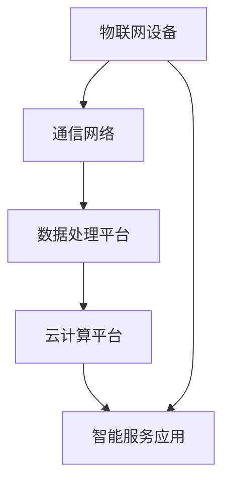

**ER实体关系图解释**：

- **物联网设备**：包括传感器和智能标签，是物联网系统的感知层。
- **通信网络**：用于传输物联网设备收集到的数据，是物联网系统的网络层。
- **数据处理平台**：用于存储、分析和处理物联网设备收集到的数据，是物联网系统的平台层。
- **云计算平台**：为数据处理平台提供强大的计算和存储能力，是物联网系统的平台层。
- **智能服务应用**：基于物联网设备收集的数据，提供各种智能化的服务和应用，是物联网系统的应用层。

**物联网革命对社会和经济的意义**：

1. **社会意义**：

- **提高生活质量**：物联网技术使得智能家居、智能交通、智能医疗等应用成为现实，大大提高了人们的生活质量。
- **促进产业升级**：物联网技术推动了传统产业的智能化转型，提高了生产效率和质量。
- **推动经济发展**：物联网技术的广泛应用为新兴产业带来了巨大的发展机遇，推动了经济的持续增长。

2. **经济意义**：

- **创造新的经济增长点**：物联网技术的应用推动了智能家居、智能交通、智能医疗等新兴产业的快速发展，创造了大量的就业机会。
- **提升产业链整体竞争力**：物联网技术使得产业链上下游的企业能够实现信息共享和协同工作，提升了整体竞争力。
- **降低生产成本**：物联网技术通过自动化和智能化管理，降低了生产成本，提高了企业的盈利能力。

#### 1.3 物联网革命的发展历程

物联网革命的发展历程可以分为以下几个阶段：

**第一阶段：初步探索阶段（1990年代）**

在20世纪90年代，物联网的概念逐渐被人们所认识，一些研究人员开始探索如何将传感器和通信技术结合起来，实现设备的互联互通。这个阶段的代表性技术是RFID技术，它为物品的追踪和识别提供了可能。

**第二阶段：技术积累阶段（2000年代）**

进入21世纪，随着互联网和移动通信技术的快速发展，物联网技术逐渐从理论研究走向实际应用。这个阶段的代表性技术是无线传感器网络（WSN），它为物联网的实现提供了基础设施。

**第三阶段：商业化应用阶段（2010年代）**

2010年代，物联网技术开始大规模商业化应用，智能家居、智能交通、智能医疗等应用逐渐普及。这个阶段的代表性技术是云计算和大数据技术，它们为物联网数据的存储、分析和处理提供了强大的支持。

**第四阶段：智能化阶段（2020年代至今）**

随着人工智能技术的迅猛发展，物联网设备开始变得更加智能化，能够自主学习和决策。这个阶段的代表性技术是人工智能和机器学习技术，它们为物联网的智能化应用提供了新的可能性。

**物联网技术的发展历程ER实体关系图**：

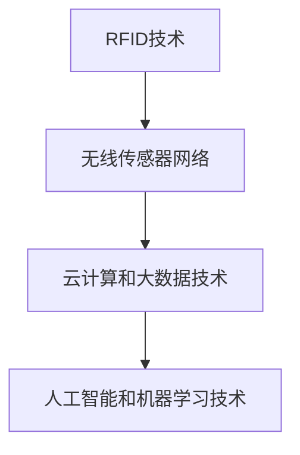

**ER实体关系图解释**：

- **RFID技术**：为物联网的初步实现提供了基础。
- **无线传感器网络**：为物联网的广泛应用提供了基础设施。
- **云计算和大数据技术**：为物联网数据的存储、分析和处理提供了支持。
- **人工智能和机器学习技术**：为物联网设备的智能化应用提供了新思路。

**物联网革命的发展历程总结**：

物联网革命经历了从初步探索到商业化应用，再到智能化的过程。每一个阶段都有代表性的技术推动物联网的发展，使得物联网技术不断成熟，应用场景不断扩展。物联网革命不仅改变了我们的生活方式，还为经济社会发展带来了新的机遇和挑战。

----------------------------------------------------------------

### 2. 物联网基础概念

#### 2.1 物联网的定义

物联网（Internet of Things，简称IoT）是指通过互联网、通信网络、各种传感器、控制器和软件等设备，实现人与人、人与物、物与物之间的互联互通，进而实现智能化管理和服务的系统。物联网的核心在于连接，通过连接实现信息的实时传输和智能处理。

**核心概念原理**：

物联网的核心概念可以概括为以下几点：

1. **连接**：物联网通过各种通信网络将物品连接起来，实现信息的实时传输。
2. **感知**：物联网通过传感器和智能标签等设备感知环境信息和物品状态。
3. **智能**：物联网利用云计算、大数据和人工智能等技术对收集到的信息进行分析和处理，实现智能化管理和决策。

**概念属性特征对比表格**：

| 特征       | 传统网络         | 物联网         |
| ---------- | --------------- | ------------ |
| 连接方式   | 单点连接         | 泛在连接       |
| 数据传输   | 静态传输         | 动态传输       |
| 数据处理   | 离线处理         | 实时处理       |
| 信息交互   | 人机交互         | 物物交互、人人交互 |

**ER实体关系图架构**：

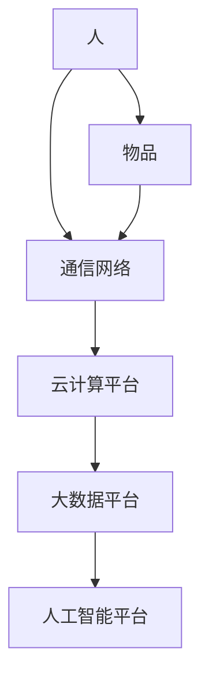

**ER实体关系图解释**：

- **人**：物联网的用户，通过通信网络与物品进行交互。
- **物品**：物联网的设备，通过传感器和智能标签感知环境信息。
- **通信网络**：物联网的基础设施，用于传输人和物品之间的信息。
- **云计算平台**：用于存储和处理物联网设备收集到的数据。
- **大数据平台**：用于分析和处理物联网设备收集到的海量数据。
- **人工智能平台**：用于对物联网设备收集到的数据进行分析和预测，实现智能化管理。

**物联网的定义总结**：

物联网是一个通过连接、感知和智能实现的系统，它将物理世界和数字世界紧密连接起来，实现信息的实时传输和智能处理。物联网的定义不仅涵盖了技术和设备的层面，还涉及到信息传输和智能处理的流程。物联网的核心在于连接，通过连接实现信息的实时传输和智能处理，从而实现智能化管理和决策。

#### 2.2 物联网的核心技术

物联网的实现离不开一系列核心技术的支持，这些技术包括传感器技术、通信技术、数据处理技术和人工智能技术。下面将详细介绍这些核心技术。

**传感器技术**：

传感器是物联网系统的感知层，用于感知环境信息和物品状态。传感器的基本原理是通过感知环境的变化（如温度、湿度、光强、压力等），将物理信号转换为电信号，然后通过通信模块传输到数据处理系统。

**通信技术**：

通信技术是实现物联网设备互联互通的关键。物联网的通信技术包括有线通信和无线通信。有线通信通常采用以太网、光纤等传输介质，而无线通信则包括Wi-Fi、蓝牙、Zigbee、LoRa等无线协议。这些通信技术为物联网设备提供了灵活的连接方式，实现了远距离、低延迟的数据传输。

**数据处理技术**：

数据处理技术是物联网的核心，用于对物联网设备收集到的数据进行存储、分析和处理。云计算和大数据技术是数据处理技术的重要组成部分。云计算提供了强大的计算和存储能力，能够处理海量数据。大数据技术则通过对数据的分析和挖掘，提供了数据可视化、预测分析和智能决策等功能。

**人工智能技术**：

人工智能技术是实现物联网智能化的关键。物联网设备通过人工智能技术，能够实现自主学习和决策。机器学习是人工智能的核心技术，通过训练模型，物联网设备能够从数据中学习规律，并根据这些规律进行预测和决策。

**核心技术关系图**：

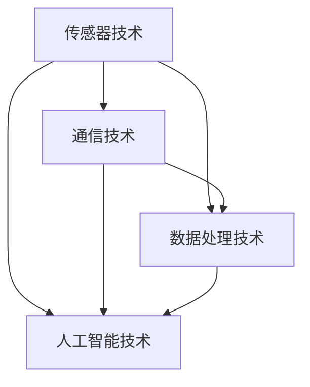

**核心技术关系图解释**：

- **传感器技术**：用于感知环境信息和物品状态。
- **通信技术**：用于传输传感器收集到的数据。
- **数据处理技术**：用于存储、分析和处理物联网设备收集到的数据。
- **人工智能技术**：用于对物联网设备收集到的数据进行分析和预测，实现智能化管理。

**物联网核心技术的总结**：

物联网的核心技术包括传感器技术、通信技术、数据处理技术和人工智能技术。这些技术相互配合，共同实现物联网的连接、感知和智能。传感器技术用于感知环境信息和物品状态，通信技术用于传输数据，数据处理技术用于存储、分析和处理数据，人工智能技术用于实现智能化管理和决策。物联网核心技术的不断发展，为物联网的应用提供了坚实的基础。

#### 2.3 物联网的关键挑战

物联网的发展面临着一系列关键挑战，这些挑战包括数据隐私和安全问题、标准化问题、能耗和成本问题等。下面将详细探讨这些问题。

**数据隐私和安全问题**：

物联网设备产生的数据包含大量的个人隐私信息，如医疗信息、财务信息、位置信息等。这些数据在传输和存储过程中，可能面临泄露、篡改和滥用的风险。数据隐私和安全问题已经成为物联网发展的重要瓶颈。

**标准化问题**：

物联网涉及多个技术领域，包括传感器、通信、数据处理和人工智能等。由于缺乏统一的标准化规范，不同设备、不同系统之间的兼容性和互操作性成为一个挑战。标准化的缺乏导致物联网设备的互操作性问题，限制了物联网的广泛应用。

**能耗和成本问题**：

物联网设备通常需要长时间运行，对能耗和成本提出了较高的要求。传感器和通信模块的能耗问题，以及大规模部署的成本，成为物联网推广的障碍。

**核心概念原理**：

物联网的关键挑战主要源于以下几个方面：

1. **数据隐私和安全**：物联网设备的广泛部署和数据的海量传输，增加了数据泄露和滥用的风险。
2. **标准化**：缺乏统一的标准化规范，导致设备兼容性和互操作性不足。
3. **能耗和成本**：物联网设备需要长时间运行，对能耗和成本提出了较高的要求。

**概念属性特征对比表格**：

| 特征       | 数据隐私和安全问题 | 标准化问题 | 能耗和成本问题 |
| ---------- | ----------------- | --------- | ------------ |
| 主要原因   | 数据量庞大、传输链路不安全 | 技术领域多、缺乏统一标准 | 长时间运行、传感器和通信模块能耗高 |
| 影响       | 数据泄露、滥用 | 设备互操作性差 | 设备成本高、影响大规模部署 |
| 解决方案   | 加密技术、身份认证、安全协议 | 加强标准化研究、制定统一规范 | 节能设计、分布式计算、成本控制 |

**ER实体关系图架构**：

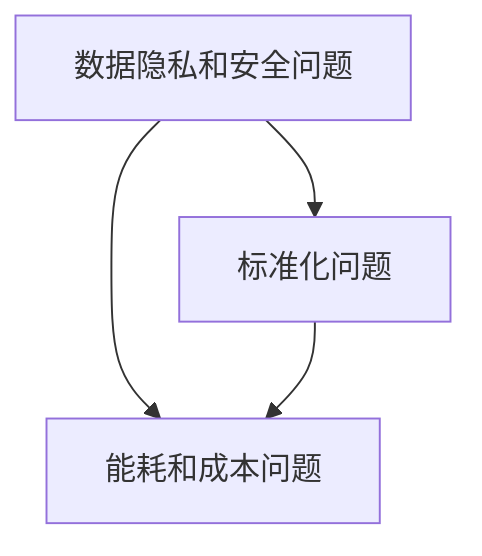

**ER实体关系图解释**：

- **数据隐私和安全问题**：涉及到数据的传输、存储和处理，需要采用加密技术、身份认证和安全协议等手段保护数据。
- **标准化问题**：涉及到不同设备、不同系统之间的兼容性和互操作性，需要加强标准化研究，制定统一的规范。
- **能耗和成本问题**：涉及到物联网设备的运行和部署，需要采用节能设计、分布式计算和成本控制等手段降低能耗和成本。

**物联网关键挑战的总结**：

物联网的发展面临数据隐私和安全、标准化、能耗和成本等一系列挑战。数据隐私和安全问题需要采用加密技术、身份认证和安全协议等手段保护数据；标准化问题需要加强标准化研究，制定统一的规范；能耗和成本问题需要采用节能设计、分布式计算和成本控制等手段降低能耗和成本。通过解决这些挑战，物联网才能实现更广泛的应用和更深入的智能化。

----------------------------------------------------------------

### 3. 智能标签技术

#### 3.1 智能标签的定义与类型

智能标签是一种集成了传感器、微处理器和通信模块的电子设备，用于附着在物品上，实现对物品信息的实时采集、传输和处理。智能标签可以按照不同的分类标准进行分类，以下是常见的几种类型：

**RFID标签**：射频识别（Radio-Frequency Identification）标签是最常见的智能标签类型之一。它通过无线电波进行数据交换，具有远程识别和数据读写功能。

**传感器标签**：传感器标签集成了各种类型的传感器，用于感知环境信息，如温度、湿度、光强、压力等。传感器标签可以实时监测物品的状态，并将数据传输到中央处理系统。

**智能包装标签**：智能包装标签集成了传感器、微处理器和通信模块，通常附着在商品包装上，用于监测商品的运输过程，如温度、湿度等环境参数。

**核心概念原理**：

智能标签的核心概念在于通过集成传感器、微处理器和通信模块，实现对物品信息的实时采集、传输和处理。智能标签的工作原理主要包括以下几个步骤：

1. **数据采集**：智能标签通过内置的传感器感知环境信息或物品状态，如温度、湿度、运动状态等。
2. **数据传输**：智能标签将采集到的数据通过无线通信模块传输到云端或中央处理系统。
3. **数据处理**：数据处理系统对传输过来的数据进行处理和分析，生成决策结果，并根据需要进行反馈控制。

**概念属性特征对比表格**：

| 类型       | 特点                                      | 应用场景                |
| ---------- | ----------------------------------------- | ---------------------- |
| RFID标签   | 通过无线电波进行数据交换，具有远程识别功能 | 物品追踪、库存管理      |
| 传感器标签 | 集成各种类型的传感器，实时监测物品状态     | 智能家居、智能医疗      |
| 智能包装标签 | 用于监测商品的运输过程                      | 物流管理、商品监测      |

**ER实体关系图架构**：

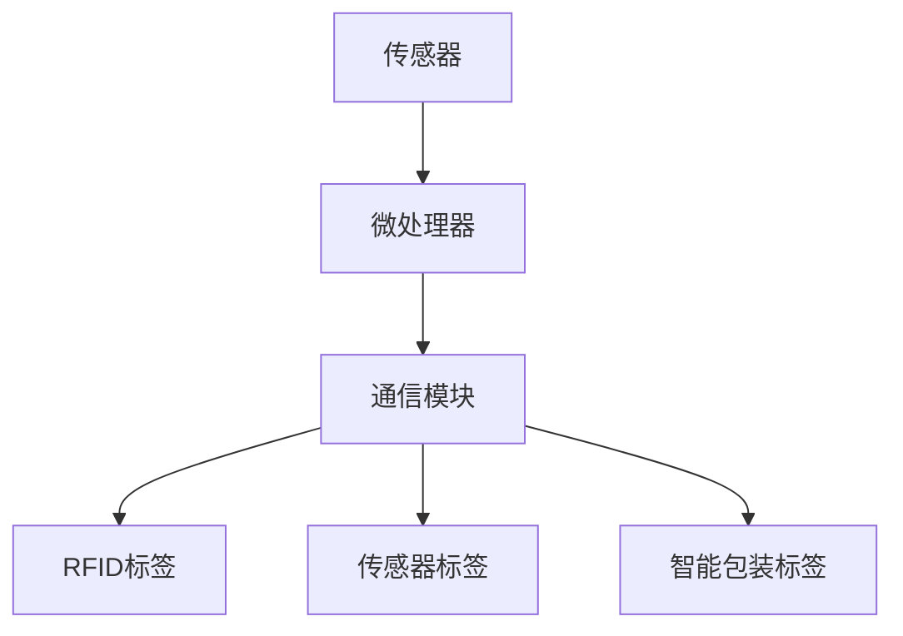

**ER实体关系图解释**：

- **传感器**：用于感知环境信息或物品状态。
- **微处理器**：用于处理传感器采集的数据，实现数据的处理和控制。
- **通信模块**：用于将处理后的数据传输到云端或中央处理系统。
- **RFID标签**：通过无线电波进行数据交换，具有远程识别功能。
- **传感器标签**：集成各种类型的传感器，实时监测物品状态。
- **智能包装标签**：用于监测商品的运输过程。

**智能标签的定义与类型的总结**：

智能标签是一种集成了传感器、微处理器和通信模块的电子设备，用于附着在物品上，实现对物品信息的实时采集、传输和处理。智能标签有多种类型，包括RFID标签、传感器标签和智能包装标签等，每种类型都有其独特的特点和适用场景。智能标签通过集成传感器、微处理器和通信模块，实现了对物品信息的实时采集、传输和处理，为物联网应用提供了基础。

#### 3.2 智能标签的工作原理

智能标签的工作原理主要包括数据采集、数据传输和数据处理的步骤，下面将详细解释每个步骤的具体过程。

**数据采集**：

数据采集是智能标签工作的第一步。智能标签通过内置的传感器感知环境信息或物品状态。例如，温度传感器可以测量环境温度或物品温度，湿度传感器可以测量环境湿度，光敏传感器可以测量光照强度，加速度传感器可以测量物品的运动状态等。传感器将感知到的物理信号转换为电信号，微处理器对这些电信号进行处理，生成数字化的数据。

**数据传输**：

数据传输是智能标签工作的第二步。智能标签通过内置的通信模块将处理后的数据传输到云端或中央处理系统。通信模块可以选择不同的通信方式，如Wi-Fi、蓝牙、Zigbee、LoRa等。这些通信方式提供了无线、低延迟的数据传输能力，使得智能标签能够实时地将数据发送到远程的处理系统。

**数据处理**：

数据处理是智能标签工作的第三步。数据处理系统对传输过来的数据进行存储、分析和处理，生成决策结果，并根据需要进行反馈控制。数据处理系统通常包括服务器、数据库和应用程序等。服务器接收并存储智能标签传输过来的数据，数据库用于存储和管理数据，应用程序则对数据进行分析和处理，生成可视化报告、预测模型或控制指令。

**工作流程图**：

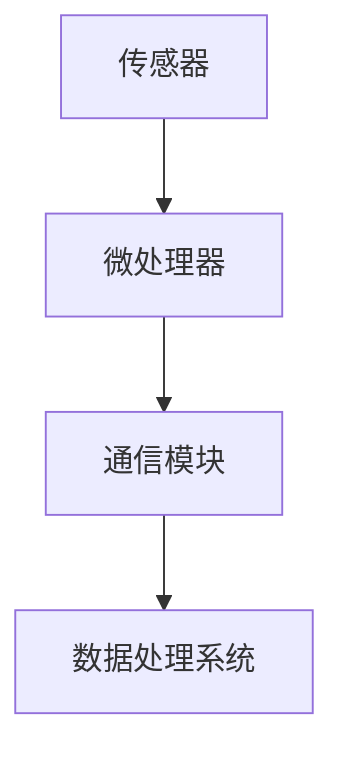

**工作流程图解释**：

- **传感器**：感知环境信息或物品状态，生成电信号。
- **微处理器**：对传感器采集的数据进行处理，生成数字化的数据。
- **通信模块**：将处理后的数据传输到数据处理系统。
- **数据处理系统**：对传输过来的数据进行存储、分析和处理。

**智能标签的工作原理总结**：

智能标签的工作原理是通过数据采集、数据传输和数据处理的步骤，实现对物品信息的实时采集、传输和处理。智能标签通过内置的传感器感知环境信息或物品状态，通过通信模块将数据传输到云端或中央处理系统，数据处理系统对数据进行分析和处理，生成决策结果。智能标签的工作原理为物联网应用提供了基础，使得物品能够实现互联互通和智能化管理。

#### 3.3 智能标签的应用场景

智能标签在物联网领域具有广泛的应用，其独特的特点和功能使其在各种场景中都能发挥重要作用。以下是一些典型的应用场景：

**供应链管理**：

智能标签在供应链管理中的应用非常广泛。通过给货物贴上RFID标签，可以实现对货物的全程追踪和管理。RFID标签可以存储货物的详细信息，如生产日期、批次号、运输路线等。通过无线通信模块，这些信息可以实时传输到供应链管理系统，实现货物的实时监控和管理。这样可以大大提高物流效率，减少货物丢失和损坏的风险。

**智能家居**：

智能标签在智能家居中的应用使得家庭生活更加便捷和舒适。例如，智能冰箱可以通过贴在食品上的传感器标签，实时监测食品的保质期，提醒用户及时食用或处理。智能门锁可以通过RFID标签实现无钥匙开门，提高家庭的安全性。此外，智能标签还可以用于智能照明、智能空调等设备的控制，实现家居自动化。

**智能医疗**：

智能标签在智能医疗中的应用极大地提高了医疗服务的质量。例如，智能标签可以用于患者身份识别和实时监测。患者可以通过贴在身上的RFID标签，实现身份的快速识别，减少医疗过程中的错误和延误。此外，智能标签还可以用于监测患者的生理指标，如体温、血压、心率等。这些数据可以通过无线通信模块传输到医疗管理系统，医生可以实时了解患者的健康状况，做出及时的诊疗决策。

**物流管理**：

智能标签在物流管理中的应用可以提高物流效率，减少运输成本。例如，物流公司可以通过给货物贴上RFID标签，实现对货物的全程追踪和管理。RFID标签可以记录货物的运输路线、到达时间等信息，物流公司可以实时了解货物的位置和状态，及时调整运输计划。这样可以大大提高物流效率，减少货物丢失和延误的风险。

**智能城市**：

智能标签在智能城市中的应用可以帮助管理者更有效地管理城市资源。例如，智能路灯可以通过贴在路灯上的传感器标签，实时监测路灯的工作状态和亮度，实现智能控制。传感器标签可以记录路灯的使用寿命、损坏情况等信息，管理者可以及时维护和更换路灯。此外，智能标签还可以用于监控交通流量、城市管理、环境监测等，提高城市管理效率和居民生活质量。

**核心概念原理**：

智能标签的应用场景依赖于其独特的特点和功能。智能标签通过集成传感器、微处理器和通信模块，实现了对物品信息的实时采集、传输和处理。智能标签的应用场景包括供应链管理、智能家居、智能医疗、物流管理、智能城市等。在不同应用场景中，智能标签通过实时监测和传输物品信息，实现了物品的全程追踪和管理，提高了效率和质量。

**应用案例解析**：

- **供应链管理**：某物流公司通过给货物贴上RFID标签，实现了对货物的全程追踪和管理。通过实时监测货物的位置和状态，物流公司可以优化运输路线，减少货物丢失和延误的风险。

- **智能家居**：某智能家居系统通过贴在食品上的传感器标签，实现了对食品保质期的实时监测。系统可以提醒用户及时食用或处理过期食品，提高了食品安全性。

- **智能医疗**：某医院通过给患者贴上RFID标签，实现了患者身份识别和实时监测。通过实时监测患者的生理指标，医生可以做出及时的诊疗决策，提高了医疗服务质量。

- **物流管理**：某物流公司通过给货物贴上RFID标签，实现了对货物的全程追踪和管理。通过实时监测货物的位置和状态，物流公司可以及时调整运输计划，提高物流效率。

**智能标签的应用场景总结**：

智能标签在物联网领域的应用非常广泛，可以应用于供应链管理、智能家居、智能医疗、物流管理、智能城市等场景。智能标签通过实时监测和传输物品信息，实现了物品的全程追踪和管理，提高了效率和质量。随着技术的不断进步，智能标签的应用场景将进一步扩大，为物联网的发展带来更多可能性。

----------------------------------------------------------------

### 4. 传感器技术

#### 4.1 传感器的定义与分类

传感器是物联网系统中的核心组件，它能够感知外界环境的变化，并将这些变化转换为电信号或其他形式的信息输出。传感器的种类繁多，根据其工作原理和检测对象的不同，可以分为以下几类：

**温度传感器**：用于测量环境或物体的温度。常见的温度传感器有热电偶、热敏电阻和红外传感器等。

**湿度传感器**：用于测量环境中的湿度水平。常见的湿度传感器有电容式、电阻式和薄膜式等。

**光传感器**：用于测量光线的强度和波长。常见的光传感器有光电管、光敏电阻和太阳能电池等。

**压力传感器**：用于测量物体的压力或压力变化。常见的压力传感器有电容式、电阻式和压电式等。

**加速度传感器**：用于测量物体的加速度或振动。常见的加速度传感器有MEMS（微机电系统）加速度传感器等。

**位置传感器**：用于测量物体的位置信息。常见的位置传感器有GPS、RFID和超声波传感器等。

**核心概念原理**：

传感器的工作原理通常基于物理、化学或生物效应。例如，热电偶通过热电效应产生电动势，热敏电阻通过电阻随温度变化的特性来测量温度，光敏电阻通过光照强度变化来改变电阻值，GPS通过卫星信号来确定物体的位置。

**概念属性特征对比表格**：

| 传感器类型 | 工作原理 | 检测对象 | 特点 | 应用场景 |
| -------- | ------- | ------- | --- | ------- |
| 温度传感器 | 热电效应、电阻变化 | 温度 | 精度高、响应快 | 智能家居、工业控制 |
| 湿度传感器 | 电容变化、电阻变化 | 湿度 | 灵敏度高、稳定性好 | 智能农业、环境监测 |
| 光传感器 | 光电效应、电阻变化 | 光照 | 响应速度快、精度高 | 智能照明、安防系统 |
| 压力传感器 | 电容变化、电阻变化、压电效应 | 压力 | 精度高、稳定性好 | 气象监测、汽车传感器 |
| 加速度传感器 | 微机电系统 | 加速度 | 精度高、体积小 | 智能手机、无人驾驶 |
| 位置传感器 | 卫星信号、电磁波 | 位置 | 定位准确、实时性强 | 物流追踪、地理信息系统 |

**ER实体关系图架构**：

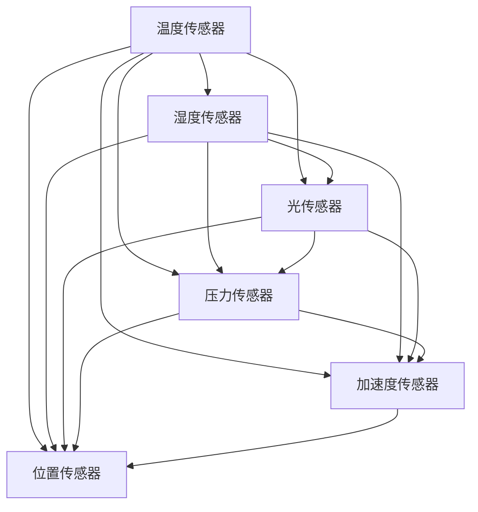

**ER实体关系图解释**：

- **温度传感器**：测量温度，适用于智能家居和工业控制。
- **湿度传感器**：测量湿度，适用于智能农业和环境监测。
- **光传感器**：测量光照，适用于智能照明和安防系统。
- **压力传感器**：测量压力，适用于气象监测和汽车传感器。
- **加速度传感器**：测量加速度，适用于智能手机和无人驾驶。
- **位置传感器**：测量位置，适用于物流追踪和地理信息系统。

**传感器的定义与分类总结**：

传感器是一种能够感知外界环境变化并将其转换为电信号或其他形式信息的设备。根据工作原理和检测对象的不同，传感器可以分为温度传感器、湿度传感器、光传感器、压力传感器、加速度传感器和位置传感器等。每种传感器都有其独特的特点和应用场景，为物联网系统提供了丰富的感知能力。

#### 4.2 传感器的工作原理

传感器的工作原理取决于其类型和检测对象，但大多数传感器的基本工作流程可以概括为以下几个步骤：

**信号感知**：

传感器首先感知到外界环境的变化，如温度、湿度、光强、压力、加速度等。例如，热电偶通过热电效应感知温度变化，光敏电阻通过光照强度感知光线变化。

**信号转换**：

传感器将感知到的物理信号转换为电信号或其他形式的信号。例如，热敏电阻的电阻值随温度变化，光敏电阻的电阻值随光照强度变化，加速度传感器的输出电压随加速度变化。

**信号放大**：

对于一些传感器，其输出的电信号可能非常微弱，需要通过放大器进行放大，以便于后续的处理和传输。

**信号处理**：

传感器输出的信号可能需要进行滤波、整形等处理，以提高信号的稳定性和准确性。例如，温度传感器输出的信号可能需要通过滤波器去除噪声。

**信号输出**：

处理后的信号通过通信接口（如I2C、SPI、UART等）输出，供控制系统或其他设备使用。

**工作流程图**：

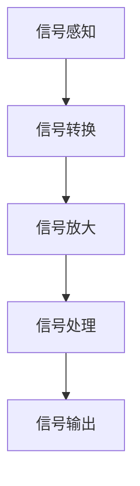

**工作流程图解释**：

- **信号感知**：传感器感知外界环境变化，如温度、湿度、光强等。
- **信号转换**：将感知到的物理信号转换为电信号或其他形式的信号。
- **信号放大**：对微弱的信号进行放大，提高信号的强度。
- **信号处理**：对信号进行滤波、整形等处理，以提高信号的质量。
- **信号输出**：将处理后的信号输出，供控制系统或其他设备使用。

**传感器的工作原理总结**：

传感器通过感知外界环境变化，将物理信号转换为电信号，并通过信号放大和处理，最终输出可用于控制系统或其他设备的信号。不同类型的传感器根据其工作原理和检测对象的不同，具有各自独特的工作流程和特点。传感器的工作原理为物联网系统提供了关键的信息感知能力，是物联网技术实现的基础。

#### 4.3 传感器在物联网中的应用

传感器在物联网中的应用非常广泛，它们为物联网系统提供了丰富的感知能力，使得物联网系统能够实时获取和处理环境信息和物品状态。以下是一些典型的应用场景：

**智能家居**：

智能家居系统通过各种传感器实现对家庭环境的实时监测和智能控制。例如，温度传感器可以实时监测室内温度，并根据用户需求自动调节空调；湿度传感器可以监测室内湿度，控制加湿器或除湿器；光敏传感器可以控制室内照明的开关和亮度；烟雾传感器可以监测火灾风险，及时报警。通过这些传感器，智能家居系统能够为用户提供一个舒适、安全、节能的生活环境。

**智能交通**：

智能交通系统利用传感器技术实现对交通流量的实时监控和管理。例如，流量传感器可以监测道路上的车辆数量和速度，为交通管理部门提供决策支持；红绿灯传感器可以根据实时交通流量调整红绿灯的时间，提高交通效率；停车传感器可以监测停车场的空位情况，帮助驾驶员找到停车位。通过这些传感器，智能交通系统能够有效缓解交通拥堵，提高交通安全性。

**智能医疗**：

智能医疗系统通过传感器技术实现对患者的实时监测和健康管理。例如，心电传感器可以监测患者的心率、心电图等生命体征，及时发现异常情况；血压传感器可以实时监测患者的血压，帮助医生调整治疗方案；血糖传感器可以监测患者的血糖水平，提醒患者按时服药。通过这些传感器，智能医疗系统能够提高医疗服务的质量，减少误诊和漏诊的风险。

**工业自动化**：

工业自动化系统通过传感器实现对生产过程的实时监控和自动化控制。例如，温度传感器可以监测生产过程中的温度变化，确保产品质量；压力传感器可以监测管道中的压力，防止泄漏和事故；振动传感器可以监测设备的运行状态，预测设备故障。通过这些传感器，工业自动化系统能够提高生产效率，减少停机时间，降低生产成本。

**环境监测**：

环境监测系统通过传感器技术实现对环境参数的实时监测和预警。例如，空气质量传感器可以监测空气中的PM2.5、PM10等污染物浓度，为环保部门提供决策支持；水质传感器可以监测水中的污染物浓度，保障水质安全；土壤传感器可以监测土壤的湿度、温度等参数，为农业部门提供种植指导。通过这些传感器，环境监测系统能够实时监测环境变化，预防环境污染。

**核心概念原理**：

传感器在物联网中的应用依赖于其感知能力和数据传输能力。传感器通过感知外界环境变化，将物理信号转换为电信号，并通过无线通信模块或有线通信接口将数据传输到中央处理系统。中央处理系统对传感器传输过来的数据进行处理和分析，生成决策结果，并根据需要进行反馈控制。传感器在物联网中的应用实现了对环境信息和物品状态的实时监测和管理，提高了系统的智能化水平。

**应用案例解析**：

- **智能家居**：某智能家居系统通过温度传感器、湿度传感器、光敏传感器和烟雾传感器，实现了对家庭环境的实时监测和智能控制。系统可以根据用户的设置自动调节空调、加湿器、除湿器和照明，提高了生活的舒适性和节能性。

- **智能交通**：某智能交通系统通过流量传感器、红绿灯传感器和停车传感器，实现了对交通流量的实时监控和管理。系统可以根据实时交通流量调整红绿灯的时间，优化交通信号，提高交通效率，减少交通拥堵。

- **智能医疗**：某智能医疗系统通过心电传感器、血压传感器和血糖传感器，实现了对患者的实时监测和健康管理。系统可以实时监测患者的心率、心电图、血压和血糖水平，及时发现异常情况，帮助医生制定更合理的治疗方案。

- **工业自动化**：某工业自动化系统通过温度传感器、压力传感器和振动传感器，实现了对生产过程的实时监控和自动化控制。系统可以实时监测生产过程中的温度、压力和振动变化，预测设备故障，提高生产效率，减少停机时间。

**传感器在物联网中的应用总结**：

传感器在物联网系统中发挥着关键作用，通过实时监测和传输环境信息和物品状态，实现了对系统的智能化管理。传感器在智能家居、智能交通、智能医疗、工业自动化和环境监测等领域具有广泛的应用，为物联网技术的快速发展提供了坚实的基础。随着传感器技术的不断进步，传感器在物联网中的应用场景将更加丰富，为人们的生活带来更多便利和创新。

----------------------------------------------------------------

### 5. 物联网安全

#### 5.1 物联网安全的重要性

随着物联网技术的广泛应用，物联网安全（IoT Security）问题越来越受到关注。物联网设备连接广泛，数量庞大，一旦安全措施不到位，可能引发严重的后果。物联网安全的重要性体现在以下几个方面：

1. **数据隐私保护**：物联网设备产生的数据包含大量个人隐私信息，如姓名、地址、医疗记录、财务信息等。如果这些数据被黑客窃取或滥用，将严重侵犯用户的隐私权。

2. **设备完整性**：物联网设备的安全问题可能导致设备被恶意攻击者控制，从而危及整个物联网系统的稳定性和安全性。

3. **网络安全**：物联网设备通常连接到互联网，可能成为黑客攻击的桥梁，攻击者可以通过物联网设备入侵内部网络，获取机密信息或进行进一步的网络攻击。

4. **系统可用性**：物联网系统的正常运行依赖于设备的稳定性和安全性。如果设备被攻击，可能导致系统瘫痪，影响业务的正常运作。

**核心概念原理**：

物联网安全的核心概念包括以下几个方面：

1. **身份认证**：确保只有授权用户才能访问物联网设备和服务，防止未授权访问。
2. **数据加密**：对传输和存储的数据进行加密，防止数据被窃取或篡改。
3. **访问控制**：通过访问控制策略，限制对物联网设备的访问权限，防止恶意行为。
4. **安全监控**：实时监测物联网设备的安全状态，及时发现和应对安全威胁。

**概念属性特征对比表格**：

| 概念         | 功能                      | 关键属性                   | 应用场景           |
| ------------ | ------------------------- | -------------------------- | ----------------- |
| 身份认证     | 验证用户身份              | 用户名、密码、生物识别信息 | 设备登录、用户访问 |
| 数据加密     | 保护数据传输和存储安全    | 密钥、加密算法             | 数据传输、数据存储 |
| 访问控制     | 控制对设备的访问权限      | 访问控制列表、访问策略     | 设备权限管理       |
| 安全监控     | 监测设备安全状态，应对威胁 | 安全事件日志、警报系统     | 安全事件响应       |

**ER实体关系图架构**：

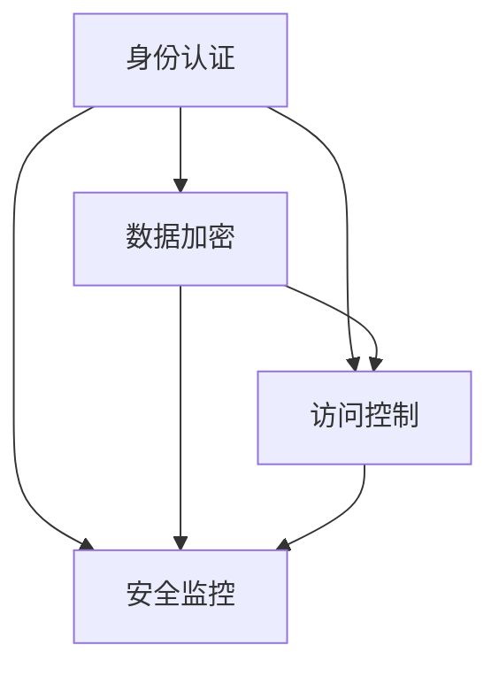

**ER实体关系图解释**：

- **身份认证**：确保用户和设备身份的真实性，防止未授权访问。
- **数据加密**：保护数据在传输和存储过程中的安全性，防止数据泄露和篡改。
- **访问控制**：根据访问控制策略，控制用户和设备对物联网设备的访问权限。
- **安全监控**：实时监测物联网设备的安全状态，及时发现和应对安全威胁。

**物联网安全的重要性总结**：

物联网安全的重要性不容忽视。数据隐私保护、设备完整性、网络安全和系统可用性是物联网安全的核心关注点。通过身份认证、数据加密、访问控制和安全监控等安全措施，可以有效保护物联网设备和服务免受攻击，确保物联网系统的稳定性和可靠性。

#### 5.2 物联网安全挑战

尽管物联网技术带来了许多便利和创新，但其安全性也面临着诸多挑战。以下是物联网安全领域面临的一些主要挑战：

**1. 设备安全**：

物联网设备通常资源有限，安全防护能力较弱。设备可能缺乏足够的安全措施，如加密、认证和访问控制，容易成为黑客攻击的目标。此外，由于设备数量庞大、分布广泛，设备的安全防护难度较大，一旦某个设备被攻破，可能导致整个物联网系统遭受威胁。

**2. 数据安全**：

物联网设备产生和传输的数据量巨大，包含大量的个人隐私信息。这些数据在传输和存储过程中，可能面临泄露、篡改和滥用的风险。特别是当数据传输链路不安全时，黑客可以通过中间人攻击窃取或篡改数据。

**3. 网络架构安全**：

物联网网络架构复杂，通常包括多个层级，如感知层、网络层、平台层和应用层。网络架构的复杂性增加了安全防护的难度。网络中的各个设备、接口和协议都可能成为攻击目标，一旦某个环节被攻破，可能导致整个网络瘫痪。

**4. 标准化和互操作性**：

物联网涉及多个技术领域，包括传感器、通信、数据处理和人工智能等。由于缺乏统一的标准化规范，不同设备、不同系统之间的兼容性和互操作性成为一个挑战。标准化的缺乏导致设备安全防护能力的差异，增加了安全漏洞的风险。

**核心概念原理**：

物联网安全挑战的核心问题在于如何确保物联网设备和服务在复杂环境下保持安全。这涉及到以下几个方面：

1. **设备安全**：提高物联网设备的硬件和软件安全防护能力，确保设备不易受到攻击。
2. **数据安全**：对传输和存储的数据进行加密和保护，防止数据泄露和篡改。
3. **网络架构安全**：设计安全的网络架构，确保网络中的各个设备和接口都得到充分保护。
4. **标准化和互操作性**：制定统一的标准化规范，提高设备之间的兼容性和互操作性，降低安全漏洞的风险。

**概念属性特征对比表格**：

| 挑战         | 影响因素              | 安全防护措施                 |
| ------------ | -------------------- | ---------------------------- |
| 设备安全     | 设备资源有限、安全防护不足 | 硬件安全加固、软件安全更新   |
| 数据安全     | 数据传输链路不安全     | 数据加密、安全传输协议       |
| 网络架构安全 | 网络架构复杂           | 安全隔离、安全监控           |
| 标准化和互操作性 | 缺乏统一标准          | 制定标准化规范、增强互操作性 |

**ER实体关系图架构**：

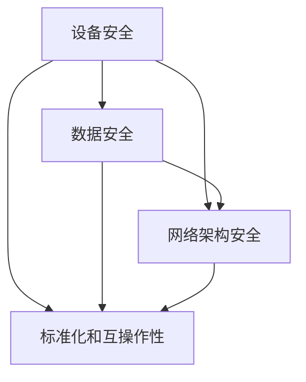

**ER实体关系图解释**：

- **设备安全**：涉及设备硬件和软件的安全防护。
- **数据安全**：涉及数据在传输和存储过程中的保护。
- **网络架构安全**：涉及网络架构设计和安全防护。
- **标准化和互操作性**：涉及标准化规范的制定和设备之间的互操作性。

**物联网安全挑战的总结**：

物联网安全面临设备安全、数据安全、网络架构安全、标准化和互操作性等一系列挑战。这些挑战源于物联网设备的资源限制、数据传输链路的不安全、网络架构的复杂性和缺乏标准化规范。为了应对这些挑战，需要采取一系列安全防护措施，包括设备安全加固、数据加密、安全传输协议、网络架构安全设计、标准化规范制定和设备互操作性的增强。

#### 5.3 物联网安全解决方案

为了应对物联网安全挑战，需要采取一系列综合性的安全解决方案。以下是物联网安全的一些主要解决方案：

**1. 加密技术**：

加密技术是保护数据传输和存储安全的关键。通过对数据进行加密，确保数据在传输过程中不被窃取或篡改。常用的加密技术包括对称加密、非对称加密和哈希算法等。对称加密使用相同的密钥进行加密和解密，非对称加密使用公钥和私钥进行加密和解密，哈希算法用于生成数据的数字指纹。

**2. 身份认证**：

身份认证是确保只有授权用户和设备才能访问物联网系统的重要手段。常用的身份认证技术包括密码认证、生物识别认证和智能卡认证等。密码认证使用用户名和密码进行身份验证，生物识别认证通过指纹、面部识别等技术进行身份验证，智能卡认证使用IC卡进行身份验证。

**3. 访问控制**：

访问控制是通过控制用户和设备的访问权限，确保物联网系统的安全。常用的访问控制技术包括基于角色的访问控制（RBAC）和基于属性的访问控制（ABAC）等。基于角色的访问控制根据用户的角色分配访问权限，基于属性的访问控制根据用户的属性（如部门、职位等）分配访问权限。

**4. 安全监控**：

安全监控是实时监测物联网设备和服务安全状态，及时发现和应对安全威胁的重要手段。安全监控系统可以记录安全事件日志，生成警报，提供安全分析报告等。常用的安全监控技术包括入侵检测系统（IDS）和入侵防御系统（IPS）等。

**5. 安全隔离**：

安全隔离是将物联网系统与其他网络隔离开来，防止攻击者通过网络入侵物联网系统。常用的安全隔离技术包括虚拟局域网（VLAN）、防火墙和虚拟专用网络（VPN）等。

**核心概念原理**：

物联网安全解决方案的核心概念在于通过多层次、多维度的安全防护措施，确保物联网设备和服务在复杂环境下保持安全。这些解决方案包括加密技术、身份认证、访问控制、安全监控和安全隔离等，共同构成了一个全方位的安全防护体系。

**概念属性特征对比表格**：

| 解决方案     | 功能                         | 关键属性                      | 应用场景           |
| ------------ | ---------------------------- | ------------------------------ | ----------------- |
| 加密技术     | 保护数据传输和存储安全       | 密钥、加密算法                | 数据传输、数据存储 |
| 身份认证     | 验证用户和设备身份           | 用户名、密码、生物识别信息   | 设备登录、用户访问 |
| 访问控制     | 控制访问权限                 | 角色分配、属性分配           | 设备权限管理       |
| 安全监控     | 监测安全状态，应对安全威胁   | 安全事件日志、警报系统       | 安全事件响应       |
| 安全隔离     | 防止网络入侵                 | 隔离网络、防火墙             | 网络安全防护       |

**ER实体关系图架构**：

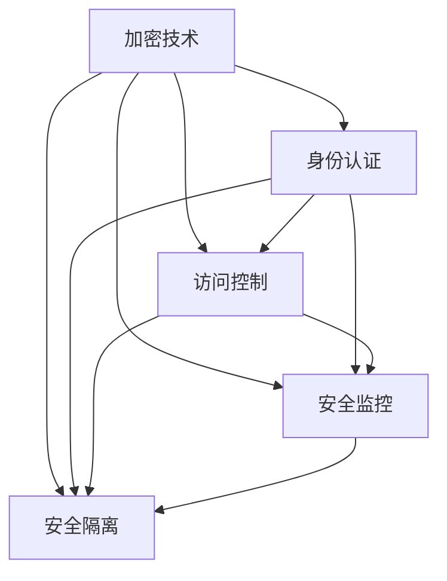

**ER实体关系图解释**：

- **加密技术**：用于保护数据传输和存储安全。
- **身份认证**：用于验证用户和设备身份。
- **访问控制**：用于控制访问权限。
- **安全监控**：用于监测安全状态，应对安全威胁。
- **安全隔离**：用于防止网络入侵。

**物联网安全解决方案的总结**：

物联网安全解决方案包括加密技术、身份认证、访问控制、安全监控和安全隔离等多层次、多维度的安全防护措施。这些解决方案共同构成了一个全方位的安全防护体系，能够有效应对物联网安全面临的挑战，确保物联网设备和服务在复杂环境下保持安全。

----------------------------------------------------------------

### 6. 物联网应用实例

#### 6.1 智能家居

智能家居（Smart Home）通过物联网技术实现家庭设备的自动化控制和智能化管理，为用户带来更加便捷和舒适的生活体验。智能家居系统通常包括智能灯光、智能空调、智能门锁、智能安全系统等，通过智能标签和传感器技术，实现设备间的互联互通。

**项目介绍**：

智能家居项目旨在通过物联网技术，实现家庭设备的智能控制，提高生活质量和能源利用效率。项目目标包括：

1. **设备智能化**：通过智能标签和传感器，实现对家庭设备的远程控制和自动化管理。
2. **能源管理**：通过智能传感器监测家庭能源使用情况，优化能源消耗，降低能源成本。
3. **安全监控**：通过智能标签和传感器，实现对家庭安全的实时监控，提高家庭安全水平。

**系统功能设计**：

智能家居系统的功能设计主要包括以下几个方面：

1. **设备控制**：用户可以通过智能手机或智能音箱远程控制家庭设备，如开关灯光、调节空调温度等。
2. **自动化场景**：根据用户的生活习惯，设置自动化场景，如离家模式、回家模式等，实现家庭设备的自动控制。
3. **能源监控**：实时监控家庭能源使用情况，通过数据分析，优化能源消耗。
4. **安全监控**：通过智能标签和传感器，实时监控家庭安全情况，如门窗状态、烟雾报警等。

**领域模型类图**：

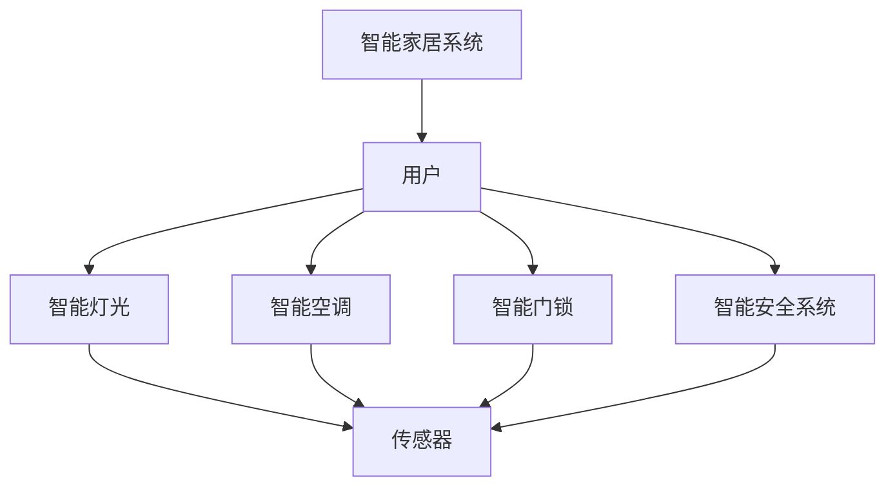

**领域模型类图解释**：

- **智能家居系统**：整个智能家居系统的核心，负责协调和管理各个家庭设备。
- **用户**：智能家居系统的使用者，可以通过手机或智能音箱控制家庭设备。
- **智能灯光**：通过传感器控制灯光的开关和亮度。
- **智能空调**：通过传感器控制空调的温度和湿度。
- **智能门锁**：通过传感器控制门锁的开关。
- **智能安全系统**：通过传感器监控家庭安全，如门窗状态、烟雾报警等。
- **传感器**：用于感知家庭环境信息，如光线、温度、湿度等。

**系统架构设计架构图**：

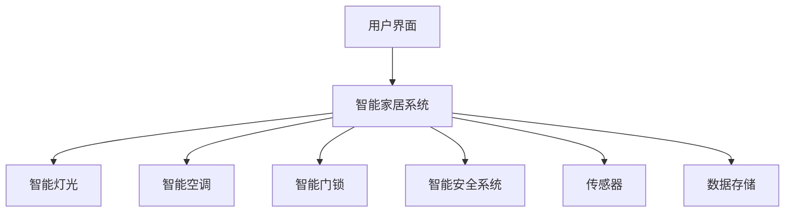

**系统架构设计架构图解释**：

- **用户界面**：用户通过手机或智能音箱与智能家居系统交互。
- **智能家居系统**：系统的核心，负责协调和管理各个家庭设备。
- **智能灯光**：控制灯光的开关和亮度。
- **智能空调**：控制空调的温度和湿度。
- **智能门锁**：控制门锁的开关。
- **智能安全系统**：监控家庭安全，如门窗状态、烟雾报警等。
- **传感器**：用于感知家庭环境信息。
- **数据存储**：存储用户设置、设备状态和历史数据。

**系统接口设计和系统交互序列图**：

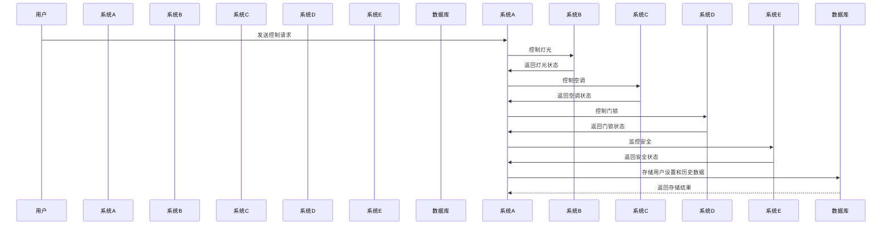

**系统接口设计和系统交互序列图解释**：

- **用户**：通过手机或智能音箱发送控制请求。
- **智能家居系统**：接收用户的控制请求，并将请求转发给相应的家庭设备。
- **智能灯光**：根据控制请求，控制灯光的开关和亮度，并将状态返回给智能家居系统。
- **智能空调**：根据控制请求，控制空调的温度和湿度，并将状态返回给智能家居系统。
- **智能门锁**：根据控制请求，控制门锁的开关，并将状态返回给智能家居系统。
- **智能安全系统**：根据控制请求，监控家庭安全，如门窗状态、烟雾报警等，并将状态返回给智能家居系统。
- **数据存储**：存储用户设置、设备状态和历史数据。

**项目实战**：

**环境安装**：

安装智能家居系统需要以下软件和硬件：

1. **智能家居系统**：智能家居系统的开发环境，可以使用Python、Java或C++等编程语言进行开发。
2. **智能标签和传感器**：用于感知家庭环境信息的智能标签和传感器，如温度传感器、湿度传感器、光敏传感器等。
3. **通信模块**：用于将传感器数据传输到智能家居系统的通信模块，如Wi-Fi模块、蓝牙模块等。
4. **云平台**：用于存储和管理数据的云平台，如阿里云、腾讯云等。

**系统核心实现源代码**：

以下是智能家居系统的核心实现源代码示例：

```python
# 智能家居系统示例代码

import json
import requests
from sensor import Sensor

class SmartHomeSystem:
    def __init__(self):
        self.sensors = []
        self.devices = {}
    
    def add_sensor(self, sensor):
        self.sensors.append(sensor)
    
    def add_device(self, device_name, device):
        self.devices[device_name] = device
    
    def control_device(self, device_name, command):
        device = self.devices[device_name]
        device.execute(command)
    
    def monitor_sensors(self):
        for sensor in self.sensors:
            sensor_data = sensor.read()
            print(sensor_data)
    
    def store_data(self, data):
        # 存储数据到云平台
        requests.post('https://api.example.com/store', json=data)

class Sensor:
    def __init__(self, name):
        self.name = name
    
    def read(self):
        # 读取传感器数据
        return {"name": self.name, "value": "25C"}

class LightDevice:
    def __init__(self, name):
        self.name = name
    
    def execute(self, command):
        if command == "on":
            print(f"{self.name} light is on")
        elif command == "off":
            print(f"{self.name} light is off")

# 创建智能家居系统实例
smart_home = SmartHomeSystem()

# 添加传感器
temp_sensor = Sensor("Temperature Sensor")
smart_home.add_sensor(temp_sensor)

# 添加设备
light = LightDevice("Living Room Light")
smart_home.add_device("Living Room Light", light)

# 监控传感器
smart_home.monitor_sensors()

# 控制设备
smart_home.control_device("Living Room Light", "on")
smart_home.control_device("Living Room Light", "off")
```

**代码应用解读与分析**：

- **智能家居系统**：该系统是一个简单的智能家居控制系统，通过添加传感器和设备，实现对家庭环境信息的实时监测和设备控制。
- **传感器**：传感器是智能家居系统的感知层，用于感知家庭环境信息，如温度、湿度等。传感器通过读取数据，提供环境信息。
- **设备**：设备是智能家居系统的控制层，用于实现对家庭设备的自动化控制。设备接收到控制命令后，执行相应的操作。
- **数据存储**：系统将传感器数据和设备状态存储到云平台，便于后续的数据分析和应用。

**实际案例分析**：

假设用户离家前，通过手机APP远程关闭家中所有的灯光，智能家居系统接收到控制请求后，通过传感器监测到当前环境光线强度较低，判断为夜晚。系统自动关闭所有灯光，并记录关闭灯光的时间。同时，系统还会将此操作记录到云端数据库，方便用户查询和管理。

**项目小结**：

智能家居项目通过物联网技术，实现了家庭设备的智能控制和管理。项目实战部分展示了智能家居系统的环境安装、系统核心实现源代码以及实际案例分析。智能家居项目不仅提高了家庭生活的便捷性和舒适度，还通过智能传感器和设备，实现了能源管理和安全监控，为用户带来更多的价值。

#### 6.2 智能交通

智能交通系统（Intelligent Transportation System，ITS）通过物联网技术实现交通信息的实时监控和管理，提高交通效率，减少交通事故，改善交通状况。智能交通系统通常包括智能交通信号灯、智能路灯、智能停车场、智能导航等。

**项目介绍**：

智能交通项目旨在通过物联网技术，实现对交通信息的实时监测和管理，提高交通效率和安全性。项目目标包括：

1. **交通流量监控**：通过智能传感器监测道路上的车辆数量和速度，实时分析交通流量。
2. **交通信号控制**：根据实时交通流量，自动调整交通信号灯的时间，优化交通流量。
3. **停车管理**：通过智能传感器监测停车场的空位情况，帮助驾驶员找到停车位。
4. **车辆导航**：为驾驶员提供实时交通信息，优化行驶路线，减少拥堵。

**系统功能设计**：

智能交通系统的功能设计主要包括以下几个方面：

1. **交通流量监控**：通过安装在道路上的智能传感器，实时监测交通流量，如车辆数量、速度、道路占用情况等。
2. **交通信号控制**：根据实时交通流量，自动调整交通信号灯的时间，优化交通流量，减少拥堵。
3. **停车管理**：通过智能传感器监测停车场的空位情况，帮助驾驶员找到停车位，提高停车场使用率。
4. **车辆导航**：为驾驶员提供实时交通信息，优化行驶路线，减少拥堵。

**领域模型类图**：

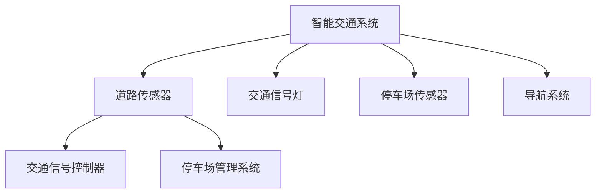

**领域模型类图解释**：

- **智能交通系统**：整个智能交通系统的核心，负责协调和管理各个交通设备。
- **道路传感器**：用于监测道路上的交通流量，如车辆数量、速度等。
- **交通信号灯**：根据交通流量自动调整信号灯的时间，优化交通流量。
- **停车场传感器**：用于监测停车场的空位情况，帮助驾驶员找到停车位。
- **导航系统**：为驾驶员提供实时交通信息，优化行驶路线。

**系统架构设计架构图**：

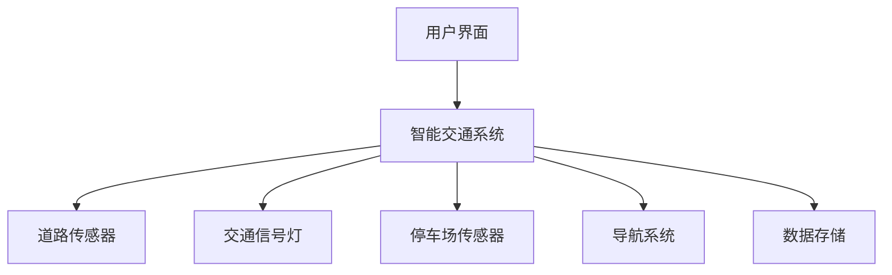

**系统架构设计架构图解释**：

- **用户界面**：用户通过手机或智能设备与智能交通系统交互。
- **智能交通系统**：系统的核心，负责协调和管理各个交通设备。
- **道路传感器**：用于监测道路上的交通流量。
- **交通信号灯**：根据交通流量自动调整信号灯的时间。
- **停车场传感器**：用于监测停车场的空位情况。
- **导航系统**：为驾驶员提供实时交通信息。
- **数据存储**：存储用户设置、设备状态和历史数据。

**系统接口设计和系统交互序列图**：

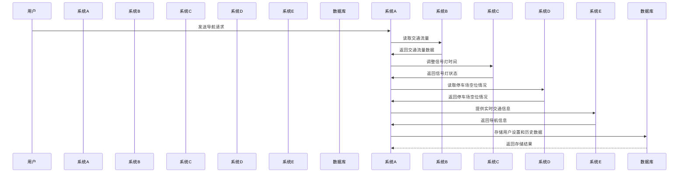

**系统接口设计和系统交互序列图解释**：

- **用户**：通过手机或智能设备发送导航请求。
- **智能交通系统**：接收用户的导航请求，并将请求转发给相应的交通设备。
- **道路传感器**：读取交通流量数据，并将数据返回给智能交通系统。
- **交通信号灯**：根据交通流量调整信号灯的时间，并将状态返回给智能交通系统。
- **停车场传感器**：读取停车场空位情况，并将数据返回给智能交通系统。
- **导航系统**：提供实时交通信息，并将导航信息返回给智能交通系统。
- **数据存储**：存储用户设置、设备状态和历史数据。

**项目实战**：

**环境安装**：

安装智能交通系统需要以下软件和硬件：

1. **智能交通系统**：智能交通系统的开发环境，可以使用Python、Java或C++等编程语言进行开发。
2. **道路传感器**：用于监测道路上的交通流量，如车辆数量、速度等。
3. **交通信号灯**：用于控制交通信号灯的开关和变化。
4. **停车场传感器**：用于监测停车场的空位情况。
5. **导航系统**：为驾驶员提供实时交通信息。
6. **云平台**：用于存储和管理数据的云平台，如阿里云、腾讯云等。

**系统核心实现源代码**：

以下是智能交通系统的核心实现源代码示例：

```python
# 智能交通系统示例代码

import json
import requests
from sensor import TrafficSensor
from signal_light import SignalLight
from parking_sensor import ParkingSensor
from navigation_system import NavigationSystem

class IntelligentTransportSystem:
    def __init__(self):
        self.traffic_sensors = []
        self.signal_lights = {}
        self.parking_sensors = {}
        self.navigation_system = None
    
    def add_traffic_sensor(self, sensor):
        self.traffic_sensors.append(sensor)
    
    def add_signal_light(self, name, light):
        self.signal_lights[name] = light
    
    def add_parking_sensor(self, sensor):
        self.parking_sensors.append(sensor)
    
    def update_signal_light(self, name, command):
        light = self.signal_lights[name]
        light.update(command)
    
    def monitor_traffic(self):
        for sensor in self.traffic_sensors:
            traffic_data = sensor.read()
            print(traffic_data)
    
    def monitor_parking(self):
        for sensor in self.parking_sensors:
            parking_data = sensor.read()
            print(parking_data)
    
    def provide_navigation(self, location):
        navigation_info = self.navigation_system.navigate(location)
        print(navigation_info)

class TrafficSensor:
    def __init__(self, name):
        self.name = name
    
    def read(self):
        # 读取交通流量数据
        return {"name": self.name, "vehicle_count": 30, "speed": 30}

class SignalLight:
    def __init__(self, name):
        self.name = name
    
    def update(self, command):
        if command == "green":
            print(f"{self.name} signal is green")
        elif command == "red":
            print(f"{self.name} signal is red")

class ParkingSensor:
    def __init__(self, name):
        self.name = name
    
    def read(self):
        # 读取停车场空位情况
        return {"name": self.name, "empty_slots": 10}

class NavigationSystem:
    def __init__(self):
        self 交通信息数据库 = "example.com"
    
    def navigate(self, location):
        # 提供导航信息
        return {"location": location, "route": "最快路线"}

# 创建智能交通系统实例
smart_transport = IntelligentTransportSystem()

# 添加道路传感器
traffic_sensor = TrafficSensor("Main Road")
smart_transport.add_traffic_sensor(traffic_sensor)

# 添加交通信号灯
signal_light = SignalLight("Intersection")
smart_transport.add_signal_light("Intersection", signal_light)

# 添加停车场传感器
parking_sensor = ParkingSensor("Park A")
smart_transport.add_parking_sensor(parking_sensor)

# 监测交通流量
smart_transport.monitor_traffic()

# 更新交通信号灯
smart_transport.update_signal_light("Intersection", "green")

# 监测停车场空位
smart_transport.monitor_parking()

# 提供导航信息
smart_transport.provide_navigation("Home")
```

**代码应用解读与分析**：

- **智能交通系统**：该系统是一个简单的智能交通控制系统，通过添加传感器和交通信号灯，实现对交通信息的实时监测和管理。
- **道路传感器**：传感器是智能交通系统的感知层，用于感知交通流量信息，如车辆数量、速度等。传感器通过读取数据，提供交通流量信息。
- **交通信号灯**：交通信号灯是智能交通系统的控制层，根据交通流量自动调整信号灯的时间，优化交通流量。
- **停车场传感器**：停车场传感器是智能交通系统的感知层，用于感知停车场的空位情况，帮助驾驶员找到停车位。
- **导航系统**：导航系统为驾驶员提供实时交通信息，优化行驶路线，减少拥堵。

**实际案例分析**：

假设用户要从市中心出发前往郊区，通过手机APP发送导航请求。智能交通系统接收到导航请求后，通过道路传感器实时监测交通流量，根据交通状况为用户提供最优的行驶路线。同时，系统根据交通流量自动调整交通信号灯的时间，减少交通拥堵。在到达目的地附近时，系统通过停车场传感器为用户找到最近的空位停车位。

**项目小结**：

智能交通项目通过物联网技术，实现了交通信息的实时监测和管理，提高了交通效率和安全性。项目实战部分展示了智能交通系统的环境安装、系统核心实现源代码以及实际案例分析。智能交通项目不仅为驾驶员提供了实时交通信息和导航服务，还通过智能传感器和交通信号灯，优化了交通流量，提高了交通效率。

#### 6.3 智能医疗

智能医疗（Intelligent Healthcare）通过物联网技术实现对患者健康数据的实时监测和管理，提高医疗服务的质量。智能医疗系统包括智能穿戴设备、远程医疗、医疗数据管理等。

**项目介绍**：

智能医疗项目旨在通过物联网技术，实现对患者健康数据的实时监测和管理，提高医疗服务的质量和效率。项目目标包括：

1. **患者健康监测**：通过智能穿戴设备实时监测患者的生理指标，如心率、血压、血糖等。
2. **远程医疗**：利用物联网技术实现医生与患者的远程诊疗，提高医疗服务的可及性和效率。
3. **医疗数据分析**：通过对患者健康数据的分析，为医生提供诊断和治疗的依据。

**系统功能设计**：

智能医疗系统的功能设计主要包括以下几个方面：

1. **患者健康监测**：通过智能穿戴设备实时监测患者的生理指标，如心率、血压、血糖等，并将数据传输到医疗管理系统。
2. **远程医疗**：医生可以通过医疗管理系统远程查看患者的健康数据，进行诊断和治疗建议。
3. **医疗数据分析**：通过对患者健康数据的分析，发现潜在的健康问题，为医生提供诊断和治疗的依据。

**领域模型类图**：

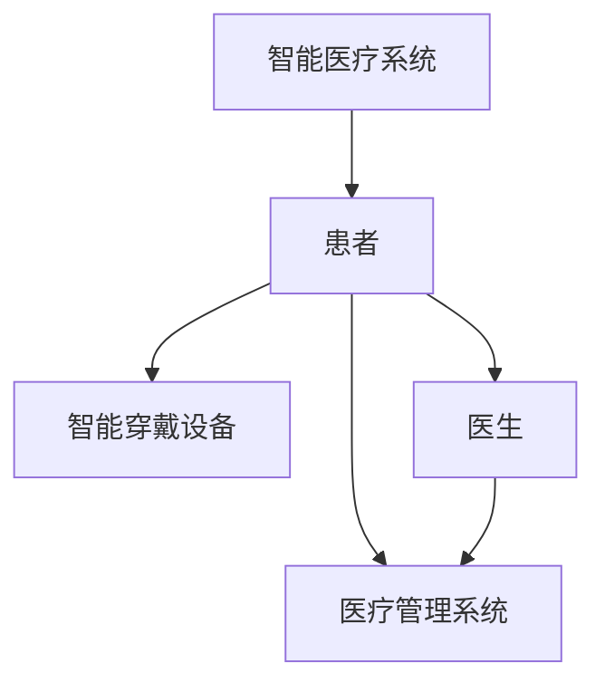

**领域模型类图解释**：

- **智能医疗系统**：整个智能医疗系统的核心，负责协调和管理各个医疗设备和系统。
- **患者**：智能医疗系统的使用者，通过智能穿戴设备监测健康数据。
- **智能穿戴设备**：用于监测患者的生理指标，如心率、血压、血糖等。
- **医疗管理系统**：存储和管理患者的健康数据，为医生提供诊断和治疗依据。
- **医生**：通过医疗管理系统查看患者的健康数据，进行诊断和治疗。

**系统架构设计架构图**：

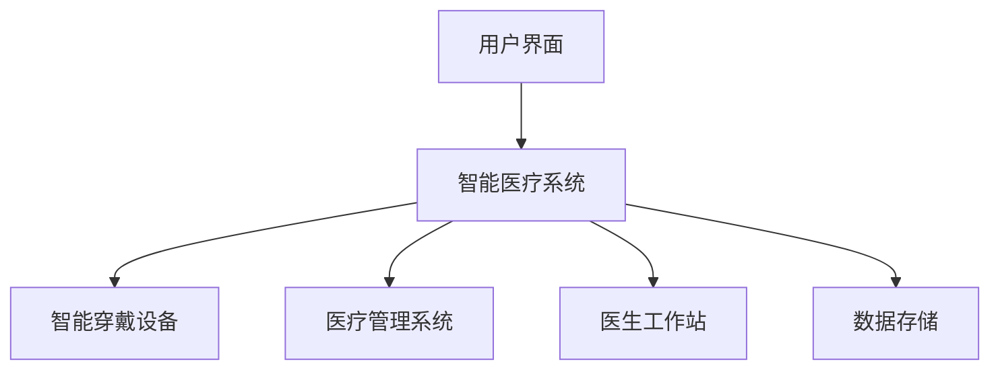

**系统架构设计架构图解释**：

- **用户界面**：患者通过手机或智能设备与智能医疗系统交互。
- **智能医疗系统**：系统的核心，负责协调和管理各个医疗设备和系统。
- **智能穿戴设备**：用于监测患者的生理指标，并将数据传输到医疗管理系统。
- **医疗管理系统**：存储和管理患者的健康数据，为医生提供诊断和治疗依据。
- **医生工作站**：医生通过工作站查看患者的健康数据，进行诊断和治疗。
- **数据存储**：存储患者的健康数据、诊断报告和治疗记录。

**系统接口设计和系统交互序列图**：

```mermaid
sequenceDiagram
    participant 患者 as 患者
    participant 智能医疗系统 as 系统
    participant 医生 as 医生
    participant 数据存储 as 存储

    患者->>系统: 上传健康数据
    系统->>数据存储: 存储健康数据
    数据存储-->>系统: 返回存储结果
    系统->>医生: 提供患者健康数据
    医生->>系统: 发出诊断建议
    系统->>患者: 显示诊断建议
```

**系统接口设计和系统交互序列图解释**：

- **患者**：通过智能穿戴设备上传健康数据。
- **智能医疗系统**：接收患者的健康数据，并将其存储在数据存储系统中。
- **医生**：通过医疗管理系统查看患者的健康数据，并根据数据提供诊断建议。
- **数据存储**：存储患者的健康数据和诊断建议。

**项目实战**：

**环境安装**：

安装智能医疗系统需要以下软件和硬件：

1. **智能医疗系统**：智能医疗系统的开发环境，可以使用Python、Java或C++等编程语言进行开发。
2. **智能穿戴设备**：用于监测患者的生理指标，如智能手表、智能手环等。
3. **医疗管理系统**：用于存储和管理患者的健康数据。
4. **医生工作站**：医生用于查看患者健康数据和诊断建议的计算机或移动设备。
5. **云平台**：用于存储和管理大规模数据的云平台，如阿里云、腾讯云等。

**系统核心实现源代码**：

以下是智能医疗系统的核心实现源代码示例：

```python
# 智能医疗系统示例代码

import json
import requests
from wearable import WearableDevice
from medical_management import MedicalManagement
from doctor import Doctor

class IntelligentMedicalSystem:
    def __init__(self):
        self.wearable_devices = []
        self.medical_management = None
        self.doctor = None
    
    def add_wearable_device(self, device):
        self.wearable_devices.append(device)
    
    def add_medical_management(self, system):
        self.medical_management = system
    
    def add_doctor(self, doc):
        self.doctor = doc
    
    def collect_health_data(self):
        for device in self.wearable_devices:
            health_data = device.get_health_data()
            print(health_data)
    
    def provide_diagnosis(self, patient_data):
        diagnosis = self.doctor.diagnose(patient_data)
        print(diagnosis)

class WearableDevice:
    def __init__(self, name):
        self.name = name
    
    def get_health_data(self):
        # 读取生理指标数据
        return {"name": self.name, "heart_rate": 75, "blood_pressure": "120/80"}

class MedicalManagement:
    def __init__(self):
        self.patients_data = []

    def store_patient_data(self, data):
        self.patients_data.append(data)
        print("Patient data stored successfully.")
    
    def get_patient_data(self, patient_name):
        for data in self.patients_data:
            if data["name"] == patient_name:
                return data
        return None

class Doctor:
    def __init__(self):
        self.diagnosis_data = []

    def diagnose(self, patient_data):
        # 提供诊断建议
        return {"diagnosis": "No serious issues found."}

# 创建智能医疗系统实例
smart_medical = IntelligentMedicalSystem()

# 添加智能穿戴设备
wearable_device = WearableDevice("Smart Watch")
smart_medical.add_wearable_device(wearable_device)

# 添加医疗管理系统
medical_management = MedicalManagement()
smart_medical.add_medical_management(medical_management)

# 添加医生
doctor = Doctor()
smart_medical.add_doctor(doctor)

# 收集健康数据
smart_medical.collect_health_data()

# 提供诊断建议
patient_data = smart_medical.provide_diagnosis({"name": "John Doe", "heart_rate": 75, "blood_pressure": "120/80"})
print(patient_data)
```

**代码应用解读与分析**：

- **智能医疗系统**：该系统是一个简单的智能医疗控制系统，通过添加智能穿戴设备和医生，实现对患者健康数据的实时监测和管理。
- **智能穿戴设备**：用于监测患者的生理指标，如心率、血压等，并将数据传输到医疗管理系统。
- **医疗管理系统**：存储和管理患者的健康数据，为医生提供诊断和治疗的依据。
- **医生**：通过医疗管理系统查看患者的健康数据，并根据数据提供诊断建议。

**实际案例分析**：

假设患者John Doe通过智能手表监测到自己的心率异常，通过手机APP将数据上传到智能医疗系统。系统接收到健康数据后，医生通过医疗管理系统查看John Doe的详细健康数据，并根据数据提供诊断建议。医生诊断结果为“心率正常，无需担心”，并建议John Doe定期检查。

**项目小结**：

智能医疗项目通过物联网技术，实现了对患者健康数据的实时监测和管理，提高了医疗服务的质量和效率。项目实战部分展示了智能医疗系统的环境安装、系统核心实现源代码以及实际案例分析。智能医疗项目不仅为患者提供了便捷的健康监测和管理服务，还为医生提供了诊断和治疗的决策支持，为医疗行业的智能化转型提供了有力支持。

### 7. 物联网的未来展望

物联网（IoT）作为一项前沿技术，其发展前景广阔，将深刻影响社会和经济的方方面面。在未来的发展中，物联网将面临一系列新的趋势和挑战，同时也将带来无限的机遇。

#### 7.1 物联网发展趋势

**智能化**：随着人工智能（AI）和机器学习（ML）技术的不断进步，物联网设备将变得更加智能化。设备将能够通过数据分析和自我学习，自动优化工作流程，提高效率。例如，智能家居系统可以通过学习用户的行为模式，自动调整温度、照明等设置，提供个性化的生活体验。

**边缘计算**：边缘计算将数据处理推向网络边缘，减少了数据传输延迟，提高了系统响应速度。在未来，物联网设备将更多地利用边缘计算，实现实时数据处理和智能决策，从而降低中心服务器的负担。

**5G技术的普及**：5G技术的普及将进一步提升物联网的性能和稳定性。5G网络的低延迟、高速率和大连接能力，将支持更多物联网设备同时在线，实现更广泛的物联网应用。

**物联网安全**：随着物联网设备的增加，物联网安全将成为一个长期的重要议题。未来，物联网安全将更加注重多层次、多维度的防护体系，包括设备安全、数据安全和网络安全，确保物联网系统的稳定性和可靠性。

**标准化**：物联网的标准化工作将继续推进，以解决设备兼容性和互操作性问题。国际标准化组织和行业协会将制定更多的物联网标准，促进物联网技术的广泛应用。

**人机协同**：物联网将推动人机协同的进一步发展，通过物联网设备，人与物理世界之间的互动将更加紧密。未来的物联网应用将更多地融合人机交互技术，提供更加智能化的用户体验。

#### 7.2 物联网的社会影响

**生活方式的改变**：物联网技术将深刻改变人们的生活方式。智能家居、智能交通、智能医疗等应用将使人们的生活更加便捷、舒适和安全。物联网将实现家庭设备之间的互联互通，提高能源利用效率，降低生活成本。

**产业升级**：物联网技术将推动传统产业的转型升级。制造业、农业、服务业等各个领域将通过物联网实现自动化、智能化管理，提高生产效率和服务质量。物联网技术还将催生新的产业和就业机会，推动经济结构优化。

**社会治理**：物联网技术将提高社会治理的智能化水平。智能城市、智能交通、智能安防等应用将提高城市管理的效率，提升公共服务的质量。物联网技术还将为灾害预防、环境保护等提供有力支持。

**经济影响**：物联网技术的广泛应用将带来显著的经济效益。物联网设备的生产和销售、物联网服务的提供、物联网应用的开发等，将带动相关产业链的发展，创造大量就业机会，推动经济增长。

#### 7.3 物联网的技术挑战与解决方案

**数据隐私和安全**：物联网设备产生的数据量巨大，涉及大量的个人隐私信息。如何确保数据的安全和隐私，是物联网面临的重要挑战。解决方案包括：

- **数据加密**：对传输和存储的数据进行加密，防止数据泄露。
- **身份认证**：加强身份认证，确保只有授权用户才能访问数据。
- **访问控制**：通过访问控制策略，限制对数据的访问权限。

**标准化**：由于物联网涉及多个技术领域，缺乏统一的标准化规范是一个挑战。解决方案包括：

- **制定标准**：国际标准化组织和行业协会应制定更多的物联网标准，提高设备的兼容性和互操作性。
- **推广标准**：通过培训和宣传，推广物联网标准的实施，提高整个行业的技术水平。

**能耗和成本**：物联网设备通常需要长时间运行，对能耗和成本提出了较高的要求。解决方案包括：

- **节能设计**：优化物联网设备的硬件设计，降低能耗。
- **分布式计算**：利用边缘计算，减少中心服务器的负担，降低计算成本。
- **成本控制**：通过规模效应和供应链优化，降低物联网设备的生产成本。

**互联互通**：物联网设备的互联互通是一个复杂的过程，涉及到多个系统、平台和协议的集成。解决方案包括：

- **协议统一**：推动不同协议的统一，实现设备之间的无缝连接。
- **中间件**：利用中间件技术，实现不同系统之间的数据传输和集成。

**人机协同**：物联网设备将人与物理世界紧密连接，但人机协同的体验仍需优化。解决方案包括：

- **人机界面**：优化人机界面设计，提高用户体验。
- **人工智能**：利用人工智能技术，提高物联网设备的智能水平，实现更自然的用户交互。

### 总结

物联网技术作为一项前沿技术，正逐渐融入我们的日常生活和工业生产中。物联网的未来发展将带来前所未有的机遇和挑战。智能化、边缘计算、5G技术的普及、物联网安全、标准化以及人机协同等趋势，将为物联网的发展提供新的动力。同时，数据隐私和安全、标准化、能耗和成本等问题，也需要我们认真面对和解决。通过不断的创新和技术进步，物联网技术将为我们创造一个更加智能、便捷和可持续发展的未来。

---

通过本文的详细探讨，我们可以看到物联网技术的广泛应用和深远影响。从智能标签和传感器的核心原理，到物联网在智能家居、智能交通、智能医疗等领域的具体应用，再到物联网安全的重要性以及未来的发展趋势，本文提供了一个全面而深入的技术视角。

智能标签和传感器作为物联网的核心组件，通过数据采集、传输和处理，实现了物品与物品、物品与网络的互联互通。智能家居、智能交通、智能医疗等领域的成功应用案例，展示了物联网技术如何改善我们的生活质量、提高生产效率和服务水平。同时，物联网安全的重要性也不容忽视，通过加密技术、身份认证、访问控制等手段，我们能够确保物联网系统的安全性和可靠性。

物联网的未来充满机遇，但同时也面临诸多挑战。智能化、边缘计算、5G技术的普及等趋势，将为物联网的发展提供新的动力。然而，数据隐私和安全、标准化、能耗和成本等问题，也需要我们持续关注和解决。通过技术创新和合作，我们可以推动物联网技术不断进步，为人类社会创造更多价值。

在未来的物联网发展中，让我们携手共进，积极探索新技术、新模式，共同构建一个更加智能、便捷和可持续发展的物联网世界。物联网的未来，值得期待。让我们一起见证并参与这一历史性的技术变革。

