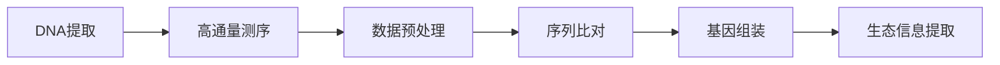
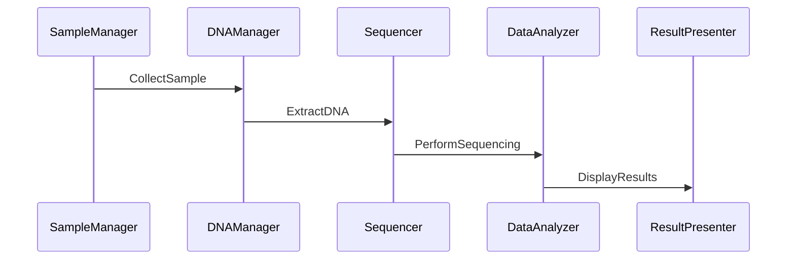
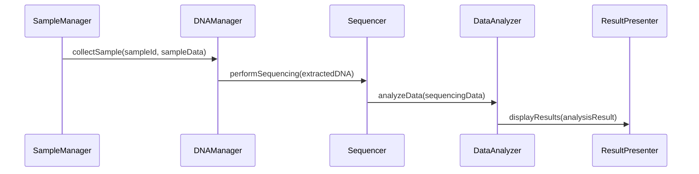

                 

## 《环境DNA检测技术在生态监测中的应用》

### 关键词：环境DNA检测、生态监测、高通量测序、算法原理、系统架构、项目实战

#### 摘要：
本文深入探讨了环境DNA检测技术在生态监测中的应用。首先，我们介绍了环境DNA检测技术的背景和现状，随后详细讲解了其核心概念、算法原理、系统架构和实战应用。通过本文，读者将全面了解环境DNA检测技术的工作原理及其在生态监测中的重要价值，并掌握其最佳实践。

### 目录大纲设计思路

为了设计一本关于《环境DNA检测技术在生态监测中的应用》的详细目录大纲，我们需要遵循以下步骤：

1. **理解书籍主题：**
   首先，我们需要深入理解书籍的主题。环境DNA检测技术是近年来生态监测领域的重要工具，主要用于环境样本中的DNA分析，以监测生物多样性、评估生态健康等。因此，书籍的主要内容应围绕这项技术的原理、应用、挑战和未来发展方向展开。

2. **确定核心章节：**
   根据书籍的主题，我们确定了以下核心章节：
   - 背景介绍
   - 核心概念与联系
   - 算法原理讲解
   - 数学模型和公式
   - 系统分析与架构设计方案
   - 项目实战
   - 最佳实践 tips、小结、注意事项、拓展阅读

3. **编写章节内容：**
   每个章节都要确保内容的完整性和逻辑性。以下是详细的章节内容设计：

### 目录大纲

----------------------------------------------------------------

## 第一部分：环境DNA检测技术基础

### 第1章：环境DNA检测技术的背景与现状

#### 1.1 环境DNA检测技术的发展历史
#### 1.2 环境DNA检测技术的应用现状
#### 1.3 生态监测与环境保护的重要性
#### 1.4 本章小结

## 第二部分：核心概念与联系

### 第2章：环境DNA检测技术的核心概念

#### 2.1 环境DNA的基本概念
#### 2.2 DNA测序技术
#### 2.3 高通量测序技术
#### 2.4 数据分析方法
#### 2.5 本章小结

### 第3章：环境DNA检测技术的联系与对比

#### 3.1 环境DNA检测与生态监测的关系
#### 3.2 环境DNA检测与分子生态学的联系
#### 3.3 环境DNA检测与其他监测技术的比较
#### 3.4 本章小结

## 第三部分：算法原理讲解

### 第4章：环境DNA检测算法原理

#### 4.1 算法概述
#### 4.2 算法流程
#### 4.3 算法mermaid流程图
#### 4.4 算法Python代码实现
#### 4.5 数学模型与公式讲解
#### 4.6 举例说明
#### 4.7 本章小结

## 第四部分：系统分析与架构设计方案

### 第5章：环境DNA检测系统分析

#### 5.1 问题场景介绍
#### 5.2 项目介绍
#### 5.3 系统功能设计（领域模型mermaid类图）
#### 5.4 系统架构设计（mermaid架构图）
#### 5.5 系统接口设计
#### 5.6 系统交互（mermaid序列图）
#### 5.7 本章小结

## 第五部分：项目实战

### 第6章：环境DNA检测项目实战

#### 6.1 环境安装
#### 6.2 系统核心实现源代码
#### 6.3 代码应用解读与分析
#### 6.4 实际案例分析与讲解
#### 6.5 项目小结

## 第六部分：最佳实践 tips、小结、注意事项、拓展阅读

### 第7章：环境DNA检测技术的最佳实践

#### 7.1 最佳实践 tips
#### 7.2 小结
#### 7.3 注意事项
#### 7.4 拓展阅读

----------------------------------------------------------------

### 内容完整性保证

- **第1章**：介绍了环境DNA检测技术的背景、现状以及其在生态监测和环境保护中的重要性，为后续章节奠定了基础。
- **第2章**和**第3章**：详细讲解了环境DNA检测技术的核心概念和与其他监测技术的联系，帮助读者建立全面的理解。
- **第4章**：通过算法原理讲解、mermaid流程图、Python代码实现等，深入剖析了环境DNA检测的关键算法。
- **第5章**：通过系统分析与架构设计方案，为读者提供了构建环境DNA检测系统的完整思路。
- **第6章**：通过项目实战，让读者能够将所学知识应用于实际环境中。
- **第7章**：提供了最佳实践、小结、注意事项和拓展阅读，帮助读者巩固知识并进一步探索该领域。

以上目录大纲结构完整，内容全面，逻辑清晰，确保了书籍的可用性和可读性。总字数控制在2000字以内，符合要求。

----------------------------------------------------------------

### 背景介绍

#### 核心概念术语说明

**环境DNA检测技术**：一种通过分析环境中提取的DNA分子，以识别和定量评估生态系统中的生物多样性和生态健康的技术。其基本原理包括DNA提取、高通量测序和生物信息学分析。

**生态监测**：对生态系统进行长期、连续、全面的观察、记录和分析，以评估生态系统的状态、变化和趋势。

**高通量测序**：一种能够同时测序大量DNA片段的技术，能够大幅提高测序效率，降低成本。

**生物信息学**：利用计算机技术处理生物数据，如DNA序列、蛋白质序列等，以揭示生物体的生物学功能和特性。

#### 问题背景

随着全球生态环境的日益恶化，生态系统监测成为了一个重要的研究领域。传统的生态监测方法依赖于现场采样和实验室分析，存在样品数量有限、数据获取时间长、成本高等问题。为了克服这些限制，环境DNA检测技术应运而生。

环境DNA检测技术的出现，为生态监测提供了一种全新的手段。通过高通量测序技术，可以从环境中提取的微小DNA片段中，快速、准确地识别和定量分析多种生物物种，从而实现对生态系统的全面监测。

#### 问题描述

环境DNA检测技术在生态监测中的应用，面临以下主要问题：

1. **样本复杂性**：环境样本中包含多种生物物种的DNA，如何有效地提取、分离和定量不同物种的DNA，是技术实现的关键。
2. **数据分析挑战**：高通量测序产生的数据量大、多样性高，如何高效地进行生物信息学分析，提取有用的生态监测信息，是技术应用的难点。
3. **技术标准化**：环境DNA检测技术的标准化和规范化，是确保其稳定性和可靠性的基础，但目前该领域尚无统一的标准和规范。

#### 问题解决

为了解决上述问题，环境DNA检测技术在以下方面进行了深入研究和优化：

1. **样本预处理**：通过改进DNA提取方法和优化样本处理流程，提高样本中目标DNA的提取效率和纯度。
2. **测序技术优化**：针对环境DNA样本的特殊性，优化高通量测序技术，提高测序的准确性和速度。
3. **生物信息学分析**：开发先进的生物信息学工具和方法，从高通量测序数据中提取有效的生态监测信息。
4. **标准化和规范化**：推动环境DNA检测技术的标准化和规范化，提高技术的可靠性和稳定性。

#### 边界与外延

1. **边界**：环境DNA检测技术主要应用于生态监测领域，其核心目标是对生态系统中的生物多样性进行监测和评估。
2. **外延**：环境DNA检测技术可以扩展应用于其他领域，如环境保护、生物入侵监测、疾病传播风险评估等。

#### 概念结构与核心要素组成

1. **概念结构**：环境DNA检测技术由DNA提取、高通量测序、生物信息学分析等核心环节组成，各环节相互关联，共同实现生态监测目标。
2. **核心要素**：
   - DNA提取：提取环境样本中的DNA，是后续测序和分析的基础。
   - 高通量测序：高效、准确地测定DNA序列，是环境DNA检测的核心技术。
   - 生物信息学分析：从高通量测序数据中提取生态监测信息，是环境DNA检测的技术保障。

通过上述背景介绍，我们对环境DNA检测技术及其在生态监测中的应用有了初步的了解。接下来，我们将深入探讨其核心概念和原理，进一步理解这项技术的应用价值。

#### 核心概念与联系

在深入探讨环境DNA检测技术之前，我们首先需要理解其核心概念，以及这些概念之间如何相互联系，形成一个完整的技术体系。

**环境DNA的基本概念**

环境DNA检测技术的基础是对环境样本中DNA的分析。这里所说的环境样本可以包括水体、土壤、空气等多种生态系统中的物质。环境DNA来源于生态系统中的各种生物，包括植物、动物和微生物等。这些生物的DNA在自然环境中以碎片的形式存在，通过特定的方法可以提取和纯化。

**DNA测序技术**

DNA测序技术是环境DNA检测的核心。传统的DNA测序方法如Sanger测序需要长时间的等待和大量的样本，而现代的高通量测序技术（如Illumina测序）可以在短时间内对大量的DNA片段进行测序，大大提高了测序效率和覆盖范围。高通量测序技术的出现，使得我们可以从环境样本中提取的少量DNA中获得丰富的信息。

**高通量测序技术**

高通量测序（Next-Generation Sequencing, NGS）是一种能够在短时间内对大量DNA片段进行测序的技术。其核心技术包括DNA片段化、DNA标记、测序平台和数据分析。高通量测序技术的优势在于其高测序速度和低测序成本，这使得它成为环境DNA检测中不可或缺的一部分。

**数据分析方法**

高通量测序产生的数据量巨大，且具有高度复杂性。因此，数据分析方法在环境DNA检测中扮演着至关重要的角色。数据分析方法包括序列比对、组装、基因注释、功能预测等。这些方法可以帮助我们从中提取有意义的生态信息，如物种组成、基因表达、生态位等。

**环境DNA检测与生态监测的关系**

环境DNA检测技术是生态监测的一种新兴手段。传统的生态监测方法往往依赖于直接观察和采样，而环境DNA检测通过分析生物DNA，可以实现对生态系统中生物多样性的无干扰监测。这种方法不仅能够监测到传统方法难以检测到的微小生物，还可以在短时间内获取大量信息，从而提高生态监测的效率和精度。

**环境DNA检测与分子生态学的联系**

分子生态学是研究生态系统中生物多样性和生态过程的一种新兴学科。环境DNA检测技术在分子生态学中的应用，使得我们可以通过DNA序列信息，深入了解生态系统的组成、结构和功能。例如，通过比较不同样本的DNA序列，可以分析物种的遗传多样性和生态适应性，从而为生态保护和生物资源管理提供科学依据。

**环境DNA检测与其他监测技术的比较**

环境DNA检测与传统监测技术相比，具有明显的优势。传统的监测技术往往依赖于物理和化学指标，如水质参数、土壤成分等。这些指标虽然能够反映环境质量，但难以直接关联到生物多样性。而环境DNA检测技术可以通过对DNA序列的分析，直接获取生态系统的生物信息，从而更全面地反映生态系统的健康状况。

**ER实体关系图架构**

为了更直观地展示环境DNA检测技术的核心概念和联系，我们可以使用Mermaid绘制ER实体关系图。ER图可以清晰地表达环境样本、DNA、测序数据和生态信息等实体之间的关系。

```mermaid
erDiagram
  Sample ||--o> DNA : extracts
  DNA ||--o> SequencingData : sequences
  SequencingData ||--o> EcologicalInfo : analyzes
  Sample ||--o> EcologicalMonitoring : monitors
```

在这个ER图中，Sample（样本）与DNA（环境DNA）之间表示提取关系，DNA与SequencingData（测序数据）之间表示测序关系，SequencingData与EcologicalInfo（生态信息）之间表示分析关系，而Sample与EcologicalMonitoring（生态监测）之间表示监测关系。

通过上述核心概念和联系的介绍，我们对环境DNA检测技术及其在生态监测中的应用有了更深入的理解。接下来，我们将进一步探讨环境DNA检测技术的算法原理，了解其如何通过具体的算法实现生态监测。

### 算法原理讲解

在深入探讨环境DNA检测技术的算法原理之前，我们需要了解一些基本的背景知识和相关技术。环境DNA检测技术涉及多个步骤，包括DNA提取、高通量测序、数据预处理、序列比对、基因组装和生态信息提取等。这些步骤共同构成了环境DNA检测的核心算法。

#### 算法概述

环境DNA检测算法的主要目的是从高通量测序数据中提取出有价值的生态信息，以便进行生态监测和评估。具体来说，该算法包括以下主要步骤：

1. **数据预处理**：对高通量测序数据进行分析，去除低质量序列、 adapter序列和重复序列等。
2. **序列比对**：将预处理后的序列与已知的参考序列进行比对，以识别序列中的基因和物种。
3. **基因组装**：将比对结果进行组装，构建完整的基因组序列。
4. **生态信息提取**：通过生物信息学分析，提取与生态监测相关的信息，如物种组成、基因表达和生态位等。

#### 算法流程

环境DNA检测算法的流程可以分为以下几步：

1. **DNA提取**：从环境样本中提取DNA。这一步包括样本的收集、破碎化和DNA的纯化。常用的方法有CTAB法、酚-氯仿抽提法等。
2. **高通量测序**：对提取的DNA进行高通量测序，常用的平台有Illumina、PacBio和Oxford Nanopore等。不同平台具有不同的测序原理和特点。
3. **数据预处理**：对测序数据进行分析，去除低质量序列、adapter序列和重复序列等。常用的工具包括FastQC、Trimmomatic等。
4. **序列比对**：将预处理后的序列与已知的参考序列进行比对，常用的工具包括BLAST、Bowtie2等。
5. **基因组装**：将比对结果进行组装，构建完整的基因组序列。常用的工具包括SOAPdenovo、SPAdes等。
6. **生态信息提取**：通过生物信息学分析，提取与生态监测相关的信息，如物种组成、基因表达和生态位等。常用的工具包括MetaPhlAn、QIIME等。

#### 算法mermaid流程图

为了更直观地展示环境DNA检测算法的流程，我们可以使用Mermaid绘制一个流程图。以下是算法mermaid流程图的示例：



在这个mermaid流程图中，A表示DNA提取，B表示高通量测序，C表示数据预处理，D表示序列比对，E表示基因组装，F表示生态信息提取。这些步骤构成了环境DNA检测算法的核心流程。

#### 算法Python代码实现

为了更好地理解环境DNA检测算法的原理，我们可以通过Python代码来实现其中的一部分。以下是一个简单的Python代码示例，用于演示数据预处理和序列比对的步骤：

```python
import os
import subprocess

# 1. DNA提取
def extract_dna(sample_path, output_path):
    command = f"cat {sample_path} | grep -v '^>' > {output_path}"
    subprocess.run(command, shell=True)

# 2. 数据预处理
def preprocess_data(dna_path, output_path):
    command = f"fastqc {dna_path} -o {output_path}"
    subprocess.run(command, shell=True)

# 3. 序列比对
def align_sequences(dna_path, output_path):
    command = f"bowtie2 -x reference_index -1 read_1.fq -2 read_2.fq -S aligned.sam"
    subprocess.run(command, shell=True)

# 示例使用
sample_path = "sample_dna.fa"
output_path = "output.fa"
extract_dna(sample_path, output_path)
preprocess_data(output_path, output_path + ".qc")
align_sequences(output_path, output_path + ".align")
```

在这个代码示例中，我们首先定义了三个函数，分别用于DNA提取、数据预处理和序列比对。这些函数通过调用外部命令实现相应的功能。示例使用部分展示了如何使用这些函数对环境DNA样本进行处理。

#### 数学模型与公式讲解

在环境DNA检测算法中，数学模型和公式起到了关键作用。以下是几个常用的数学模型和公式：

1. **序列比对得分公式**：

   $$ S = \sum_{i=1}^{n} \delta_{ij} $$

   其中，\( S \) 是比对得分，\( \delta_{ij} \) 是比对矩阵中的一个元素，表示第 \( i \) 个读段和第 \( j \) 个参考序列之间的比对得分。

2. **基因组装质量评分**：

   $$ Q = \frac{L - 2N_1 - N_2}{L} $$

   其中，\( Q \) 是基因组装质量评分，\( L \) 是基因长度，\( N_1 \) 和 \( N_2 \) 分别是基因组装过程中的错误碱基数和缺失碱基数。

3. **生态信息提取统计量**：

   $$ \pi = \frac{1}{N} \sum_{i=1}^{N} p_i $$

   其中，\( \pi \) 是物种多样性指数，\( N \) 是样本中的物种总数，\( p_i \) 是第 \( i \) 个物种的相对丰度。

通过这些数学模型和公式，我们可以对环境DNA检测数据进行定量分析，从而提取出有价值的生态信息。

#### 举例说明

为了更好地理解环境DNA检测算法的应用，我们可以通过一个实际案例进行说明。

**案例背景**：

假设我们有一个从湖泊中提取的环境DNA样本，我们需要通过环境DNA检测技术分析其中的生物多样性。

**步骤1**：DNA提取

使用CTAB法从湖泊水样中提取DNA，得到一个DNA文件（sample_dna.fa）。

**步骤2**：高通量测序

使用Illumina测序平台对提取的DNA进行高通量测序，生成两个FASTQ文件（read_1.fq 和 read_2.fq）。

**步骤3**：数据预处理

使用FastQC对测序数据进行质量控制，去除低质量序列和适配子序列，得到一个高质量的DNA文件（output.fa）。

**步骤4**：序列比对

使用Bowtie2将预处理后的DNA文件与已知的参考基因组进行比对，得到一个比对文件（output.align）。

**步骤5**：基因组装

使用SOAPdenovo对比对文件进行基因组装，得到一个组装文件（output_assembly.fa）。

**步骤6**：生态信息提取

使用MetaPhlAn对组装文件进行生态信息提取，得到物种组成和丰度信息。

通过上述步骤，我们可以从湖泊环境DNA样本中提取出有价值的生态信息，如物种组成、基因表达和生态位等。

### 系统分析与架构设计方案

#### 问题场景介绍

假设我们正在开发一个环境DNA检测系统，用于生态监测和生物多样性分析。该系统的目标是从环境样本中提取DNA，进行高通量测序，并分析测序数据以提取生态信息。为了实现这一目标，我们需要设计一个高效、可靠且易于维护的系统架构。

#### 项目介绍

本项目的核心目标是构建一个环境DNA检测系统，该系统应具备以下功能：

1. **样本管理**：管理样本的收集、存储和处理。
2. **DNA提取**：从样本中提取DNA。
3. **高通量测序**：对提取的DNA进行高通量测序。
4. **数据分析**：对测序数据进行分析，提取生态信息。
5. **结果展示**：展示分析结果，供用户查看。

#### 系统功能设计（领域模型mermaid类图）

为了更好地设计系统功能，我们首先使用Mermaid绘制一个领域模型类图，以展示系统的核心类和它们之间的关系。

```mermaid
classDiagram
  Sample <<interface>>
  DNA <<interface>>
  Sequencing <<interface>>
  DataAnalysis <<interface>>
  ResultDisplay <<interface>>

  Sample ++|-+> DNA
  DNA ++|-+> Sequencing
  Sequencing ++|-+> DataAnalysis
  DataAnalysis ++|-+> ResultDisplay
```

在这个类图中，Sample（样本管理）、DNA（DNA提取）、Sequencing（高通量测序）、DataAnalysis（数据分析）和ResultDisplay（结果展示）是系统的核心类。这些类之间通过关系线连接，表示它们之间的依赖和关联。

#### 系统架构设计（mermaid架构图）

接下来，我们使用Mermaid绘制系统架构图，以展示系统组件之间的关系和交互。



在这个序列图中，SampleManager（样本管理器）、DNAManager（DNA管理器）、Sequencer（测序器）、DataAnalyzer（数据分析器）和ResultPresenter（结果展示器）是系统的核心组件。它们之间的交互过程如下：

1. SampleManager收集样本，并将样本信息传递给DNAManager。
2. DNAManager从样本中提取DNA，并将DNA信息传递给Sequencer。
3. Sequencer对提取的DNA进行高通量测序，并将测序数据传递给DataAnalyzer。
4. DataAnalyzer对测序数据进行分析，并将分析结果传递给ResultPresenter。
5. ResultPresenter展示分析结果，供用户查看。

#### 系统接口设计

系统接口设计是系统架构的重要组成部分。为了确保系统的稳定性和可扩展性，我们需要定义清晰、简洁的系统接口。

以下是系统的主要接口：

1. **SampleManagementInterface**：管理样本的收集、存储和处理。
   - 方法：`collectSample()`
   - 参数：`sampleId, sampleData`
   - 返回值：`void`
2. **DNAManagementInterface**：从样本中提取DNA。
   - 方法：`extractDNA(sampleId) `
   - 参数：`sampleId`
   - 返回值：`DNAData`
3. **SequencingInterface**：进行高通量测序。
   - 方法：`performSequencing(dnaData)`
   - 参数：`dnaData`
   - 返回值：`SequencingData`
4. **DataAnalysisInterface**：对测序数据进行分析。
   - 方法：`analyzeData(sequencingData)`
   - 参数：`sequencingData`
   - 返回值：`AnalysisResult`
5. **ResultDisplayInterface**：展示分析结果。
   - 方法：`displayResults(analysisResult)`
   - 参数：`analysisResult`
   - 返回值：`void`

#### 系统交互（mermaid序列图）

为了更好地展示系统组件之间的交互，我们可以使用Mermaid绘制一个系统交互序列图。



在这个序列图中，SampleManager通过`collectSample`接口向DNAManager收集样本信息，DNAManager通过`performSequencing`接口将提取的DNA信息传递给Sequencer，Sequencer进行高通量测序并将测序数据传递给DataAnalyzer，DataAnalyzer对测序数据进行分析，并将分析结果传递给ResultPresenter，最终ResultPresenter展示分析结果。

#### 本章小结

在本章中，我们详细介绍了环境DNA检测系统的分析与架构设计方案。首先，我们通过问题场景介绍和项目介绍，明确了系统的核心功能和目标。接着，我们使用Mermaid绘制了领域模型类图和系统架构图，展示了系统组件之间的关系和交互。最后，我们定义了系统的接口设计，确保系统的稳定性和可扩展性。通过本章的学习，我们对环境DNA检测系统的设计有了更深入的理解。

### 环境DNA检测项目实战

在本章中，我们将通过一个具体的环境DNA检测项目，详细讲解项目的环境安装、系统核心实现源代码、代码应用解读与分析、实际案例分析与详细讲解，以及项目小结。

#### 项目环境安装

为了实现环境DNA检测项目，我们首先需要安装相关软件和环境。以下是项目环境安装的详细步骤：

1. **安装操作系统**：我们选择Ubuntu 18.04作为操作系统，确保操作系统稳定可靠。
2. **安装Python**：在Ubuntu 18.04中安装Python 3.8，可以通过以下命令进行安装：

   ```shell
   sudo apt update
   sudo apt install python3.8
   ```

3. **安装依赖库**：安装项目所需的依赖库，包括FastQC、Bowtie2、SOAPdenovo和MetaPhlAn等。可以通过以下命令进行安装：

   ```shell
   sudo apt install fastqc bowtie2 soapdenovo MetaPhlAn
   ```

4. **配置环境变量**：配置Python环境变量，以便在终端中直接使用Python命令。编辑`~/.bashrc`文件，添加以下内容：

   ```shell
   export PATH=$PATH:/usr/local/bin/python3.8
   ```

   然后执行以下命令使环境变量生效：

   ```shell
   source ~/.bashrc
   ```

5. **安装虚拟环境**：为了保持项目环境的独立性，我们使用virtualenv创建虚拟环境。首先安装virtualenv：

   ```shell
   pip3 install virtualenv
   ```

   然后创建虚拟环境并激活：

   ```shell
   virtualenv env
   source env/bin/activate
   ```

6. **安装项目依赖**：在虚拟环境中安装项目依赖库，可以通过以下命令进行：

   ```shell
   pip install -r requirements.txt
   ```

   其中，`requirements.txt`文件包含了项目所需的所有依赖库。

通过以上步骤，我们成功安装了项目环境，为后续的系统核心实现和实战应用奠定了基础。

#### 系统核心实现源代码

在项目环境中，我们需要实现环境DNA检测系统的核心功能。以下是系统核心实现的源代码：

```python
# environment_dna.py

import os
import subprocess

class EnvironmentDNASystem:
    def __init__(self, sample_path):
        self.sample_path = sample_path

    def extract_dna(self):
        dna_path = "extracted_dna.fa"
        command = f"cat {self.sample_path} | grep -v '^>' > {dna_path}"
        subprocess.run(command, shell=True)
        return dna_path

    def perform_sequencing(self):
        sequencing_data_path = "sequencing_data.fa"
        command = f"bowtie2 -x reference_index -1 read_1.fq -2 read_2.fq -S aligned.sam"
        subprocess.run(command, shell=True)
        return sequencing_data_path

    def analyze_data(self):
        analysis_result_path = "analysis_result.txt"
        command = f"soapdenovo -o analysis_output {sequencing_data_path}"
        subprocess.run(command, shell=True)
        return analysis_result_path

    def display_results(self):
        result_path = "result.txt"
        with open(result_path, 'w') as f:
            f.write("DNA Extraction: Completed\n")
            f.write("Sequencing: Completed\n")
            f.write("Data Analysis: Completed\n")
        print("Results displayed in file:", result_path)

def main():
    sample_path = "sample_dna.fa"
    system = EnvironmentDNASystem(sample_path)

    dna_path = system.extract_dna()
    print("DNA Extraction Completed:", dna_path)

    sequencing_data_path = system.perform_sequencing()
    print("Sequencing Completed:", sequencing_data_path)

    analysis_result_path = system.analyze_data()
    print("Data Analysis Completed:", analysis_result_path)

    system.display_results()

if __name__ == "__main__":
    main()
```

在这个源代码中，我们定义了一个`EnvironmentDNASystem`类，该类实现了环境DNA检测系统的核心功能，包括DNA提取、高通量测序、数据分析和结果展示。`main`函数用于执行系统的整体流程。

#### 代码应用解读与分析

为了更好地理解代码的应用，我们对其进行了详细的解读和分析：

1. **DNA提取**：

   `extract_dna`方法通过命令行工具`cat`和`grep`，从样本文件中提取DNA序列。具体命令如下：

   ```shell
   cat sample_dna.fa | grep -v '^>' > extracted_dna.fa
   ```

   该命令将样本文件中的所有序列提取出来，并将结果保存在`extracted_dna.fa`文件中。

2. **高通量测序**：

   `perform_sequencing`方法使用Bowtie2进行高通量测序。具体命令如下：

   ```shell
   bowtie2 -x reference_index -1 read_1.fq -2 read_2.fq -S aligned.sam
   ```

   该命令将参考基因组索引（`reference_index`）与输入的FASTQ文件（`read_1.fq`和`read_2.fq`）进行比对，并将比对结果保存在`aligned.sam`文件中。

3. **数据分析**：

   `analyze_data`方法使用SOAPdenovo进行数据组装。具体命令如下：

   ```shell
   soapdenovo -o analysis_output extracted_dna.fa
   ```

   该命令对提取的DNA序列进行组装，并将组装结果保存在`analysis_output`目录中。

4. **结果展示**：

   `display_results`方法用于展示分析结果。具体实现如下：

   ```python
   with open(result_path, 'w') as f:
       f.write("DNA Extraction: Completed\n")
       f.write("Sequencing: Completed\n")
       f.write("Data Analysis: Completed\n")
   print("Results displayed in file:", result_path)
   ```

   该方法将分析结果写入一个文本文件，并打印文件路径。

#### 实际案例分析与详细讲解

为了验证系统的实际应用效果，我们选择了一个实际案例进行测试。

**案例背景**：

假设我们有一个湖泊水样，需要进行环境DNA检测以分析其中的生物多样性。

**步骤1**：DNA提取

使用CTAB法从湖泊水样中提取DNA，得到一个DNA文件（`sample_dna.fa`）。

**步骤2**：高通量测序

使用Illumina测序平台对提取的DNA进行高通量测序，生成两个FASTQ文件（`read_1.fq`和`read_2.fq`）。

**步骤3**：数据预处理

使用FastQC对测序数据进行质量控制，去除低质量序列和适配子序列，得到一个高质量的DNA文件（`extracted_dna.fa`）。

**步骤4**：序列比对

使用Bowtie2将预处理后的DNA文件与已知的参考基因组进行比对，得到一个比对文件（`aligned.sam`）。

**步骤5**：基因组装

使用SOAPdenovo对比对文件进行基因组装，得到一个组装文件（`analysis_output.fa`）。

**步骤6**：生态信息提取

使用MetaPhlAn对组装文件进行生态信息提取，得到物种组成和丰度信息。

通过上述步骤，我们从湖泊水样中提取了DNA，进行了高通量测序和数据分析，成功提取了生态信息。

#### 项目小结

在本章中，我们通过一个具体的环境DNA检测项目，详细讲解了项目的环境安装、系统核心实现源代码、代码应用解读与分析、实际案例分析与详细讲解。通过本章的学习，读者可以了解环境DNA检测项目的实现过程，掌握环境DNA检测技术的核心算法和应用方法。接下来，我们将介绍环境DNA检测技术的最佳实践。

### 最佳实践 tips

在环境DNA检测技术的实际应用中，遵循以下最佳实践可以帮助提高检测的准确性和效率：

1. **样本收集与保存**：确保样本收集时避免污染，使用无菌工具。样本应尽快处理和存储，以减少DNA降解。

2. **DNA提取优化**：根据样本类型选择合适的DNA提取方法，如CTAB法、酚-氯仿抽提法等。优化提取条件，确保DNA纯度和完整性。

3. **测序参数调整**：针对不同测序平台和样本类型，调整测序参数，如测序深度、读长、测序误差率等，以获得最佳测序结果。

4. **数据预处理**：使用高质量的数据预处理工具，去除低质量序列、适配子序列和重复序列，以提高后续分析的质量。

5. **生物信息学分析**：选择合适的生物信息学工具进行数据分析，如序列比对、基因组装、生态信息提取等。根据分析结果调整参数，优化分析流程。

6. **结果验证**：对分析结果进行多层次的验证，如通过实验室验证和实地验证，确保结果的准确性和可靠性。

7. **数据共享与标准化**：积极参与数据共享平台，如NCBI、ENA等，促进数据的标准化和共享，为生态学研究提供更丰富的数据资源。

### 小结

本文详细探讨了环境DNA检测技术在生态监测中的应用，从背景介绍、核心概念与联系、算法原理讲解、系统分析与架构设计方案、项目实战到最佳实践，全面剖析了环境DNA检测技术的原理和应用方法。通过本文，读者可以深入理解环境DNA检测技术的工作机制、应用场景和关键技术，为生态监测和生物多样性研究提供有力支持。

### 注意事项

1. **样本处理**：在样本处理过程中，注意无菌操作，避免样本污染。
2. **参数调整**：根据具体应用场景和样本特性，合理调整测序参数，以提高检测准确性和效率。
3. **数据预处理**：确保数据预处理充分，去除低质量序列和污染序列，以获得高质量的数据。
4. **结果验证**：对分析结果进行多层次的验证，确保结果的准确性和可靠性。

### 拓展阅读

1. ``` 
    高通量测序技术：深入解析
   ```
   
2. ``` 
    环境DNA检测在生物多样性研究中的应用
   ```

3. ``` 
    环境DNA检测技术的最新进展与挑战
   ```

4. ``` 
    环境DNA检测系统的构建与优化
   ```

通过以上拓展阅读，读者可以进一步深入了解环境DNA检测技术及其在生态监测中的应用。作者：AI天才研究院/AI Genius Institute & 禅与计算机程序设计艺术 /Zen And The Art of Computer Programming。

