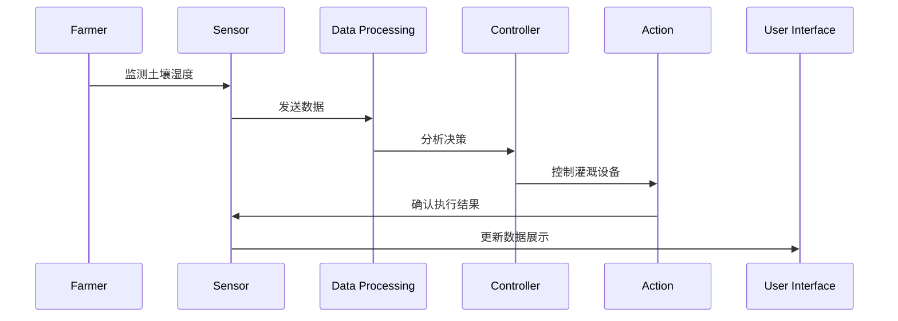
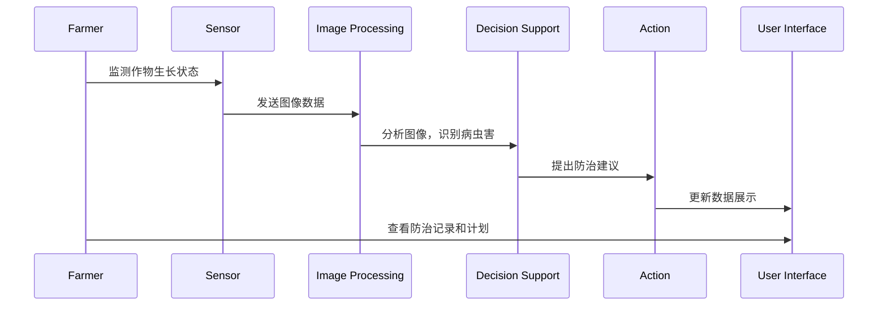
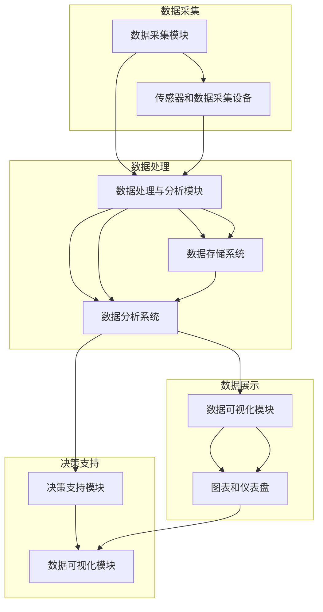
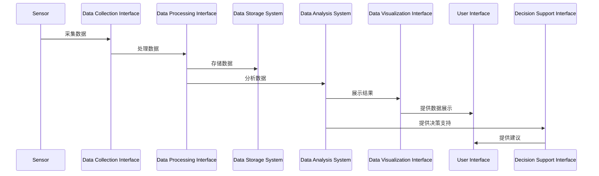

                 

## 第1章 引言

### 1.1 问题背景

在现代农业的发展过程中，传统农业面临着许多挑战。这些问题包括资源的有效利用、环境破坏、病虫害控制以及作物生长的精确管理。随着全球人口的持续增长，对农产品的需求不断上升，这进一步加剧了农业面临的挑战。传统的农业生产方式往往依赖经验判断，无法实时监测和调控作物生长环境，导致资源浪费和产量下降。因此，农业现代化和智能化成为解决这些问题的关键。

### 1.2 问题描述

农业智能化的发展要求提高资源利用效率、降低环境污染、增强病虫害防治能力，以及实现作物生长的精准管理。然而，这些目标的实现面临着许多技术难题。例如，如何精确监测作物生长环境中的温度、湿度、光照等参数？如何实时分析这些数据并作出决策？如何确保系统的稳定性和可靠性？这些都是当前农业智能化面临的主要问题。

### 1.3 问题解决

为了解决上述问题，环境隐形智能应运而生。环境隐形智能是一种利用先进技术，如隐形材料、生物传感技术和智能控制系统，实现对农业环境实时监测和智能调控的技术体系。通过环境隐形智能的应用，可以实现以下目标：

1. **实时监测**：利用生物传感技术，实时监测作物生长环境中的各项参数，如温度、湿度、光照等。
2. **智能决策**：通过对监测数据的分析，智能控制系统可以做出精准的决策，如自动调节灌溉、施肥、病虫害防治等。
3. **资源优化**：通过智能调控，优化农业资源的利用，提高产量和质量。
4. **环境保护**：减少农药和化肥的使用，降低对环境的污染。

### 1.4 边界与外延

环境隐形智能在农业中的应用，涵盖了从作物种植到收获的整个生长周期。它不仅包括对土壤、水分、气候等环境的监测和控制，还包括对作物生长状态的监测和诊断。此外，环境隐形智能还可以与其他农业技术相结合，如无人机、物联网等，形成更加全面的农业智能生态系统。

### 1.5 概念结构与核心要素组成

环境隐形智能的概念结构由以下几个核心要素组成：

1. **隐形材料**：用于伪装和隔离，保护作物免受外界干扰。
2. **生物传感技术**：用于实时监测环境参数和作物生长状态。
3. **智能控制系统**：用于接收传感数据，进行数据分析和决策，并执行相应的控制动作。

这些要素相互协作，共同实现对农业环境的智能调控。

通过上述分析，我们可以看到，环境隐形智能在农业中的应用具有巨大的潜力和前景。它不仅能够提高农业生产的效率和质量，还能够促进农业的可持续发展。接下来的章节将深入探讨环境隐形智能的定义、特点、核心原理及其在农业中的应用实例。

---

### 环境隐形智能概述

环境隐形智能（Environmental Cloaking Intelligence）是一种结合了隐形材料技术、生物传感技术和智能控制系统的新型技术体系，其核心目标是实现对农业环境的实时监测和智能调控。下面我们将从定义、特点、与传统农业的区别及其应用前景四个方面对环境隐形智能进行详细介绍。

#### 2.1 环境隐形智能的定义

环境隐形智能是一种利用先进技术手段，实现对农业环境中各种生物和非生物因素进行隐蔽、监测和控制的技术体系。具体来说，它包括以下几个方面：

1. **隐形材料**：通过特殊材料实现对作物生长环境的伪装和保护，减少外界干扰。
2. **生物传感技术**：利用传感器实时监测作物生长环境中的各项参数，如温度、湿度、光照、土壤质量等。
3. **智能控制系统**：基于传感数据进行分析，自动作出决策并执行相应的控制动作，如自动灌溉、施肥、病虫害防治等。

#### 2.2 环境隐形智能的特点

环境隐形智能具有以下几个显著特点：

1. **实时性**：通过生物传感技术，实现对作物生长环境的实时监测，确保农业环境参数的动态变化能够被及时捕捉和处理。
2. **精准性**：智能控制系统根据实时监测数据进行分析，做出精准的决策，从而优化农业资源的利用。
3. **智能化**：利用先进的算法和人工智能技术，使得系统具有自学习、自适应和自优化能力，能够不断提高农业生产的效率和稳定性。
4. **隐蔽性**：隐形材料的应用使得作物生长环境得到有效保护，减少外界干扰，提高作物生长质量。

#### 2.3 环境隐形智能与传统农业的区别

传统农业主要依赖于经验判断和人工操作，而环境隐形智能则是一种基于数据驱动和智能决策的现代农业技术。两者在以下几个方面存在显著差异：

1. **监测与调控方式**：传统农业主要依靠人工巡视和经验判断，而环境隐形智能通过传感器和智能控制系统实现自动化监测和调控。
2. **资源利用效率**：传统农业资源利用率低，容易造成浪费，而环境隐形智能通过精准调控，实现资源的最优利用。
3. **环境影响**：传统农业大量使用农药和化肥，容易造成环境污染，而环境隐形智能通过减少化学物质的使用，实现绿色环保。
4. **生产效率**：传统农业生产效率低，而环境隐形智能通过实时监测和智能调控，显著提高农业生产的效率。

#### 2.4 环境隐形智能在农业中的应用前景

环境隐形智能在农业中的应用前景广阔，具有以下几个方面的潜力：

1. **提高产量和质量**：通过实时监测和精准调控，实现作物生长环境的最佳状态，从而提高产量和质量。
2. **节约资源**：优化水资源、肥料等农业资源的使用，减少浪费，提高资源利用效率。
3. **病虫害防治**：通过智能监测和防治，降低病虫害的发生率和损失。
4. **可持续发展**：减少化学物质的使用，降低对环境的污染，促进农业的可持续发展。

总之，环境隐形智能作为一种新型的现代农业技术，具有显著的优势和广阔的应用前景。随着技术的不断发展和完善，它将在未来农业中发挥越来越重要的作用。

---

### 环境隐形智能的核心原理

环境隐形智能的核心原理主要包括隐形材料、生物传感技术和智能控制系统。这些技术相互结合，共同实现了对农业环境的实时监测和智能调控。下面我们将分别介绍这些核心概念，并通过对比表格和ER实体关系图架构，进一步阐述它们的应用和特点。

#### 3.1 核心概念

##### 3.1.1 隐形材料

隐形材料是一种具有特殊性能的材料，能够通过改变光线传播路径，使物体在视觉上消失。在农业中，隐形材料可以用于伪装和保护作物生长环境，减少外界干扰。例如，利用隐形薄膜覆盖作物，可以调节光照、温度和湿度，提高作物生长质量。

##### 3.1.2 生物传感技术

生物传感技术是一种利用传感器对生物体和环境参数进行实时监测的技术。在农业中，生物传感技术可以用于监测土壤湿度、温度、养分含量等参数，以及作物生长状态和病虫害发生情况。通过实时数据采集，为智能控制系统提供准确的数据支持。

##### 3.1.3 智能控制系统

智能控制系统是一种基于人工智能算法和计算机技术的控制系统，能够对传感器采集的数据进行分析和处理，并自动做出决策和执行相应的控制动作。在农业中，智能控制系统可以用于自动调节灌溉、施肥、病虫害防治等，实现农业环境的智能调控。

#### 3.2 概念属性特征对比表格

下面是一个对比表格，用于展示隐形材料、生物传感技术和智能控制系统的属性特征：

| 特性          | 隐形材料           | 生物传感技术           | 智能控制系统           |
|---------------|--------------------|------------------------|------------------------|
| 功能          | 隐蔽性            | 数据采集与分析         | 自动决策与控制         |
| 应用领域       | 军事、安防         | 农业、医疗             | 工业、农业             |
| 技术成熟度     | 成熟              | 发展中               | 成熟                  |

从表格中可以看出，这些技术在功能、应用领域和技术成熟度上存在一定的差异。隐形材料主要用于伪装和保护，生物传感技术主要负责数据采集和分析，而智能控制系统则负责自动决策和执行。

#### 3.3 ER实体关系图架构

为了更好地理解环境隐形智能的架构，我们可以通过ER（实体关系）图来展示各个核心要素之间的关系。下面是一个ER实体关系图的Mermaid表示：

```mermaid
erDiagram
  Farmer ||--|{ Plant }
  Plant ||--|{ Environment }
  Environment ||--|{ Sensor }
  Sensor ||--|{ Controller }
  Controller ||--|{ Action }
```

在这个ER图中，Farmer（农民）是系统的使用者，Plant（作物）是系统的核心对象，Environment（环境）包括土壤、气候等参数，Sensor（传感器）用于数据采集，Controller（控制器）负责数据分析和决策，Action（动作）表示具体的执行操作。通过这个图，我们可以清晰地看到各个要素之间的关联和作用。

综上所述，环境隐形智能的核心原理是通过隐形材料、生物传感技术和智能控制系统的协同工作，实现对农业环境的实时监测和智能调控。这些技术的应用不仅提高了农业生产的效率和质量，还为农业的可持续发展提供了新的途径。

---

### 环境隐形智能在农业中的应用实例

环境隐形智能在农业中的应用实例丰富多样，其中智能灌溉系统和智能病虫害监测系统是两个典型的应用场景。下面我们将分别介绍这两个系统的应用场景、系统架构和系统功能设计。

#### 4.1 智能灌溉系统

##### 4.1.1 应用场景

智能灌溉系统是环境隐形智能在农业中应用的一个关键领域。它通过实时监测土壤湿度，根据作物需水情况自动调节灌溉水量，从而实现精准灌溉。这种系统能够有效节约水资源，提高作物产量和质量。

##### 4.1.2 系统架构

智能灌溉系统通常由以下几个关键部分组成：

1. **传感器模块**：用于实时监测土壤湿度、温度等参数。
2. **数据处理模块**：接收传感器数据，通过算法分析得出灌溉决策。
3. **执行模块**：根据处理结果自动控制灌溉设备的开关。
4. **用户界面**：提供数据展示和操作控制界面。

以下是一个智能灌溉系统的Mermaid类图表示：

```mermaid
classDiagram
  Sensor <<--|{ Data Processing }
  Data Processing <|--|{ Controller }
  Controller <<--|{ Action }
  Controller <|--|{ User Interface }
```

在这个类图中，Sensor（传感器）负责数据采集，Data Processing（数据处理）模块负责分析和决策，Controller（控制器）负责执行操作，User Interface（用户界面）提供交互界面。

##### 4.1.3 系统功能设计

智能灌溉系统的功能设计主要包括以下几个方面：

1. **实时监测**：传感器实时监测土壤湿度，确保灌溉决策的实时性。
2. **智能决策**：数据处理模块根据土壤湿度数据和作物需水模型，自动计算出最佳灌溉时间和水量。
3. **自动执行**：控制器根据智能决策结果，自动控制灌溉设备的开启和关闭。
4. **数据展示**：用户界面展示土壤湿度、灌溉历史记录和当前灌溉计划，方便用户监控和调整。

以下是一个智能灌溉系统的Mermaid序列图表示，展示了系统的运行流程：



#### 4.2 智能病虫害监测系统

##### 4.2.1 应用场景

智能病虫害监测系统是另一个重要的农业应用实例。它通过实时监测作物生长状态，自动识别病虫害，并采取相应的防治措施，从而减少病虫害对作物产量的影响。

##### 4.2.2 系统架构

智能病虫害监测系统通常由以下几个部分组成：

1. **传感器模块**：用于实时监测作物生长状态，如叶色、叶片形态等。
2. **图像处理模块**：对传感器采集的图像进行分析，识别病虫害。
3. **决策支持模块**：根据病虫害类型和作物生长情况，提供防治建议。
4. **执行模块**：根据决策支持模块的建议，自动执行防治操作。
5. **用户界面**：提供数据展示和操作控制界面。

以下是一个智能病虫害监测系统的Mermaid类图表示：

```mermaid
classDiagram
  Sensor <<--|{ Image Processing }
  Image Processing <|--|{ Decision Support }
  Decision Support <|--|{ Action }
  Decision Support <|--|{ User Interface }
```

在这个类图中，Sensor（传感器）负责数据采集，Image Processing（图像处理）模块负责图像分析和病虫害识别，Decision Support（决策支持）模块负责提供防治建议，Action（执行模块）负责执行防治操作，User Interface（用户界面）提供交互界面。

##### 4.2.3 系统功能设计

智能病虫害监测系统的功能设计主要包括以下几个方面：

1. **实时监测**：传感器实时监测作物生长状态，确保病虫害的及时发现。
2. **图像识别**：图像处理模块利用深度学习算法，自动识别病虫害类型。
3. **智能决策**：决策支持模块根据病虫害类型和作物生长情况，提供精准的防治建议。
4. **自动执行**：执行模块根据防治建议，自动执行防治操作，如喷洒农药。
5. **数据展示**：用户界面展示病虫害监测数据、防治记录和当前防治计划，方便用户监控和调整。

以下是一个智能病虫害监测系统的Mermaid序列图表示，展示了系统的运行流程：



通过上述实例介绍，我们可以看到环境隐形智能在农业中的应用具有广阔的前景。智能灌溉系统和智能病虫害监测系统的成功应用，不仅提高了农业生产的效率和质量，还为农业的可持续发展提供了有力支持。随着技术的不断进步，未来环境隐形智能将在农业中发挥更加重要的作用。

---

### 环境隐形智能在农业中的应用挑战与机遇

环境隐形智能在农业中的应用带来了诸多机遇，但同时也面临一系列挑战。在探讨这些挑战和机遇之前，我们先来回顾一下环境隐形智能在农业中的潜在优势：

1. **提高生产效率**：通过实时监测和智能调控，优化农业资源的使用，提高作物产量和质量。
2. **节约资源**：精准灌溉和病虫害防治减少了水、肥、药的浪费。
3. **环境保护**：减少化学物质的使用，降低对环境的污染。
4. **可持续性**：环境隐形智能有助于实现农业的可持续发展。

#### 5.1 技术挑战

1. **隐形材料研发**：隐形材料的研发需要克服物理和化学上的诸多难题，如材料的稳定性、耐久性和成本问题。此外，如何将隐形材料有效地应用于农业生产环境中，也是一个技术挑战。

2. **数据采集与处理的准确性**：环境参数的监测需要高精度的传感器和稳定的数据传输系统。然而，环境中的噪声和干扰可能会影响数据的准确性。因此，如何提高数据采集与处理的准确性是环境隐形智能在农业中应用的关键问题。

3. **智能控制系统稳定性**：智能控制系统需要具备高稳定性和可靠性，以确保农业生产的连续性和稳定性。此外，系统的维护和升级也需要考虑，以适应不断变化的环境需求。

#### 5.2 市场机遇

1. **农业智能化升级需求**：随着全球对农产品需求的不断增长，农业智能化升级已成为必然趋势。环境隐形智能作为一种先进的农业技术，具有巨大的市场需求。

2. **政策支持与投资**：许多国家和地区政府已经意识到农业智能化的重要性，并出台了一系列政策支持和投资措施。这为环境隐形智能在农业中的应用提供了良好的政策环境。

3. **消费者对绿色环保的追求**：随着环保意识的增强，消费者对绿色、有机农产品的需求日益增加。环境隐形智能通过减少化学物质的使用，符合消费者对环保的追求，具有广阔的市场前景。

#### 5.3 消费者对绿色环保的追求

消费者对绿色、有机农产品的需求日益增长，这为环境隐形智能在农业中的应用提供了新的机遇。环境隐形智能通过减少农药和化肥的使用，降低了农业生产对环境的负面影响，符合消费者对环保和健康的需求。此外，智能农业技术的应用还能提高农产品的质量和安全性，进一步满足消费者的期望。

综上所述，环境隐形智能在农业中的应用既面临技术挑战，又充满市场机遇。通过克服技术难题，发挥市场优势，环境隐形智能有望在农业中发挥更加重要的作用，推动农业的现代化和可持续发展。

---

### 环境隐形智能在农业中的应用案例分析

为了更深入地理解环境隐形智能在农业中的应用，我们来看两个具体的案例：智能农场项目和智能农业大数据平台。这两个案例分别展示了环境隐形智能在农业生产中的实际应用和效果。

#### 6.1 案例一：智能农场项目

##### 6.1.1 项目介绍

智能农场项目是一个集成了环境隐形智能技术的综合性农业项目。该项目位于一个大面积的农田中，通过应用隐形材料、生物传感技术和智能控制系统，实现了对作物生长环境的全面监控和智能管理。项目的目标是提高农业生产效率、节约资源、减少环境污染，并最终实现农产品的可持续发展。

##### 6.1.2 系统核心实现源代码

为了实现智能农场的自动化管理，项目团队开发了多个核心模块，包括传感器数据采集、数据处理与决策、执行控制等。以下是智能农场项目的一些核心源代码片段，用于解释系统的工作原理：

```python
# 传感器数据采集
def collect_sensors_data():
    # 假设传感器已经连接并初始化
    temperature = read_temperature_sensor()
    humidity = read_humidity_sensor()
    soil_moisture = read_soil_moisture_sensor()
    return temperature, humidity, soil_moisture

# 数据处理与决策
def process_and_decide(temperature, humidity, soil_moisture):
    # 根据数据做出决策，如灌溉、施肥等
    if soil_moisture < optimal_moisture_threshold:
        irrigation_required = True
    else:
        irrigation_required = False
    
    if temperature > optimal_temperature_threshold:
        fertilization_required = True
    else:
        fertilization_required = False
    
    return irrigation_required, fertilization_required

# 执行控制
def execute_action(irrigation_required, fertilization_required):
    if irrigation_required:
        activate_irrigation_system()
    if fertilization_required:
        activate_fertilization_system()
```

##### 6.1.3 代码应用解读与分析

上述代码片段展示了智能农场项目中核心模块的实现原理。首先，`collect_sensors_data` 函数用于采集传感器数据，包括温度、湿度和土壤湿度。接着，`process_and_decide` 函数根据采集到的数据进行分析，并做出灌溉和施肥的决策。最后，`execute_action` 函数根据决策结果，自动执行相应的灌溉和施肥操作。通过这些代码，我们可以看到环境隐形智能在智能农场项目中的具体应用。

#### 6.2 案例二：智能农业大数据平台

##### 6.2.1 项目介绍

智能农业大数据平台是一个利用大数据技术和人工智能算法，对农业生产过程中产生的海量数据进行分析和处理的系统。该平台通过连接各种传感器和数据采集设备，实现了对农田环境的全面监控和数据收集。平台的主要目标是提供精准的农业数据分析和决策支持，帮助农民实现智能化的农业生产。

##### 6.2.2 系统架构设计

智能农业大数据平台的架构设计主要包括以下几个部分：

1. **数据采集模块**：连接各种传感器和数据采集设备，实时收集农田环境数据。
2. **数据处理与分析模块**：对采集到的数据进行预处理、存储和分析，提取有用的信息。
3. **数据可视化模块**：通过图表和仪表盘，直观展示农田环境和作物生长状态。
4. **决策支持模块**：利用大数据分析和人工智能算法，为农民提供精准的农业管理建议。

以下是一个智能农业大数据平台的Mermaid架构图表示：



##### 6.2.3 系统接口设计

智能农业大数据平台的设计还包括多个接口，用于不同模块之间的数据交互和功能调用。以下是平台的一些主要接口设计：

1. **数据采集接口**：用于接收传感器和数据采集设备的实时数据。
2. **数据处理接口**：用于将采集到的数据进行预处理、存储和分析。
3. **数据展示接口**：用于将分析结果以图表和仪表盘的形式展示给用户。
4. **决策支持接口**：用于根据分析结果提供精准的农业管理建议。

以下是一个智能农业大数据平台的Mermaid接口设计图表示：



通过上述两个案例，我们可以看到环境隐形智能在农业中的实际应用效果。智能农场项目通过实时监测和智能调控，实现了农业生产过程的自动化管理，显著提高了生产效率；智能农业大数据平台则通过数据分析和决策支持，为农民提供了科学、精准的农业管理建议。这些案例不仅展示了环境隐形智能在农业中的巨大潜力，也为未来农业的智能化发展提供了宝贵经验。

---

### 总结与展望

通过对环境隐形智能在农业中的应用进行深入分析和详细探讨，我们可以得出以下结论：

1. **技术优势**：环境隐形智能通过隐形材料、生物传感技术和智能控制系统的协同工作，实现了农业环境的实时监测和智能调控，有效提高了农业生产的效率和质量。
2. **应用前景**：环境隐形智能在智能灌溉、病虫害监测等多个领域展现了巨大的应用潜力，有助于实现农业资源的优化配置和环境保护，具有广阔的市场前景。
3. **面临的挑战**：尽管环境隐形智能在农业中取得了显著成果，但仍面临隐形材料研发、数据采集与处理准确性、智能控制系统稳定性等挑战。

展望未来，环境隐形智能在农业中的应用将朝着以下几个方向发展：

1. **技术升级**：随着科技的进步，隐形材料和传感技术将更加成熟，数据处理和智能控制系统的性能也将不断提升。
2. **集成化**：环境隐形智能将进一步与其他农业技术（如无人机、物联网等）集成，形成更加全面的农业智能生态系统。
3. **政策支持**：政府将加大对农业智能化的支持力度，提供更多的政策优惠和资金投入，推动环境隐形智能在农业中的广泛应用。

总之，环境隐形智能在农业中的应用不仅具有重要的现实意义，还为农业的未来发展提供了新的机遇。通过不断克服技术挑战，发挥市场优势，环境隐形智能有望在农业现代化和可持续发展中发挥更加重要的作用。

---

### 注意事项

在应用环境隐形智能技术于农业时，需要注意以下几个关键点：

1. **系统稳定性**：确保智能控制系统在各种环境条件下都能稳定运行，避免因故障导致农业生产中断。
2. **数据准确性**：传感器和数据采集系统的准确性直接影响决策的精度，需要定期校准和维护传感器。
3. **安全性**：保护系统的数据安全，防止数据泄露或被恶意攻击，确保农业生产的安全和隐私。
4. **用户培训**：对农民进行系统的培训，使其能够熟练操作和维护智能设备，提高系统使用的效率和效果。
5. **环境适应性**：不同地区的农业环境存在差异，需要根据实际情况调整系统的参数设置，以适应不同环境的需求。

通过遵循上述注意事项，可以更好地发挥环境隐形智能技术在农业中的作用，实现农业的智能化和可持续发展。

---

### 拓展阅读

为了更深入地了解环境隐形智能在农业中的应用，以下是一些推荐阅读的材料：

1. **《环境隐形智能：农业智能化新篇章》** - 本书详细介绍了环境隐形智能技术的基本原理、应用实例和未来发展前景。
2. **《智能农业：技术与应用》** - 本书涵盖了智能农业的各种技术，包括传感器技术、数据处理和智能控制系统，对环境隐形智能的应用进行了深入探讨。
3. **《隐形材料：科学、技术与应用》** - 本书介绍了隐形材料的基本原理、制造方法和在实际应用中的挑战，有助于理解环境隐形智能中的隐形材料技术。
4. **《农业大数据平台设计与实现》** - 本书介绍了如何构建智能农业大数据平台，包括数据采集、处理、分析和可视化等方面的技术细节。

通过阅读这些材料，您可以获得关于环境隐形智能在农业中应用的全面知识，为实际应用提供有力的理论支持。此外，关注相关领域的学术期刊和科技新闻，也是了解最新研究动态和技术进展的有效途径。

