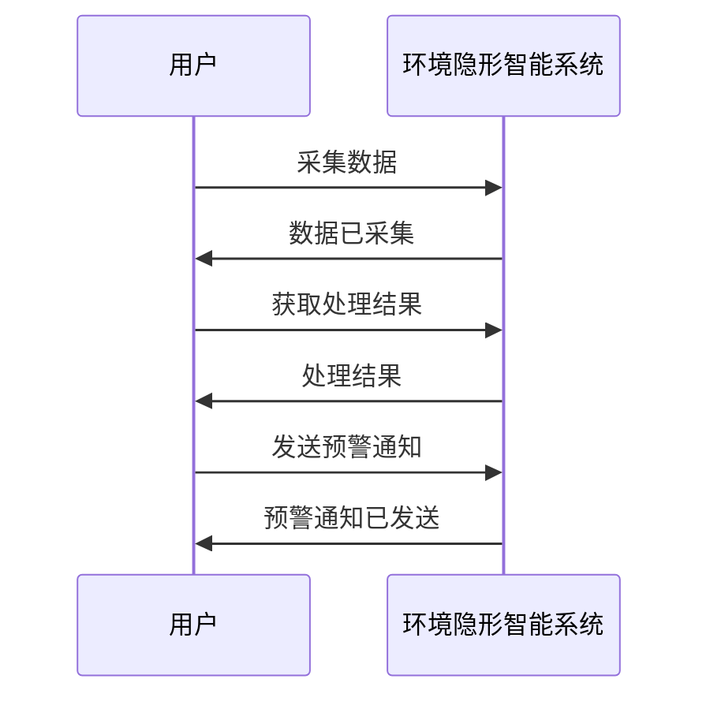

                 

### 环境隐形智能在环境监测中的作用

环境隐形智能（Environmental Camouflage Intelligence，简称ECI）是一种通过模仿自然界的隐形机制来提升环境监测能力和效率的技术。在当今世界，随着人口增长、工业化进程的加速和气候变化的影响，环境问题日益严峻。传统的环境监测方法常常面临数据不准确、监测范围有限、成本高等问题。环境隐形智能技术的出现，为解决这些问题提供了新的思路和手段。

本文将深入探讨环境隐形智能在环境监测中的应用，从多个角度分析其作用和价值。文章的结构如下：

1. **背景与意义：** 简要介绍环境隐形智能的定义及其在环境监测中的重要性。
2. **核心概念与架构：** 详细讲解环境隐形智能的基本概念、核心技术及其系统架构。
3. **应用场景：** 分析环境隐形智能在各类环境监测中的具体应用。
4. **算法原理与实现：** 阐述环境隐形智能的算法原理及其数学模型。
5. **系统分析与设计：** 探讨环境隐形智能系统的分析与设计方法。
6. **项目实战：** 通过实际案例展示环境隐形智能的应用过程和效果。
7. **最佳实践与注意事项：** 提供使用环境隐形智能的最佳实践和建议。
8. **总结与展望：** 对环境隐形智能的未来发展进行展望。

通过以上结构的逻辑梳理，我们希望能帮助读者全面了解环境隐形智能在环境监测中的作用，并激发对其更深层次的研究和应用兴趣。

### 背景介绍

环境隐形智能（ECI）的概念源自于自然界中的隐形机制，如蝴蝶的翅膀和昆虫的体表结构，这些结构能够通过特殊的物理和化学特性，使得生物在环境中不易被发现。环境隐形智能技术旨在利用这些原理，结合现代信息技术，实现对环境的智能监测。首先，环境隐形智能的定义可以概括为：通过仿生学、传感器技术、数据处理和机器学习等手段，构建一种能够模仿自然界隐形机制，提高环境监测效率和精度的智能系统。

在环境监测中，环境隐形智能技术的重要性不容忽视。首先，传统的环境监测方法依赖于人工采样和实验室分析，存在监测范围有限、采样点不连续、数据不全面等问题。而环境隐形智能技术可以通过智能传感器和自组织网络，实现对环境的实时监测和数据采集，从而大幅提高监测的全面性和准确性。其次，环境隐形智能技术在应对复杂多变的环境问题时具有独特的优势。例如，在海洋监测中，通过开发智能浮标，可以实现对海洋环境的动态监控，及时发现和预测海洋灾害。在大气监测中，利用环境隐形智能技术，可以实现对空气污染物的实时监测和预警。

具体到环境监测中的问题，我们可以列举以下几点：

1. **数据不准确性：** 传统监测方法往往依赖于有限的时间和地点采样，难以反映环境的真实状态。
2. **监测范围有限：** 由于技术和成本的限制，许多环境监测活动只能覆盖特定的区域，无法实现全局监测。
3. **人力成本高：** 传统监测方法需要大量的人力参与，不仅费时费力，还容易受人为因素的影响。

环境隐形智能技术的应用，可以有效解决上述问题。通过智能传感器网络，环境隐形智能系统能够实现24小时不间断的实时监测，采集到的数据实时传输到中央处理系统，进行实时分析和处理。这样不仅提高了数据的准确性，还实现了监测范围的全覆盖，大幅降低了人力成本。

边界与外延方面，环境隐形智能技术不仅局限于自然环境中的监测，还可以扩展到室内环境、城市环境等更广泛的领域。例如，在室内环境监测中，通过部署智能传感器网络，可以实现对温度、湿度、空气质量等参数的实时监测，为智能家居系统提供数据支持。在城市环境中，环境隐形智能技术可以用于城市绿化监测、交通流量监测、公共安全监控等，为智慧城市建设提供技术支持。

总之，环境隐形智能技术在环境监测中的应用，不仅提升了监测的效率和精度，还为解决复杂环境问题提供了新的工具和方法。其核心概念和关键技术，将在接下来的章节中详细探讨。

### 核心概念与联系

为了深入理解环境隐形智能技术，我们需要首先明确几个核心概念：仿生学、传感器技术、数据处理和机器学习。这些概念不仅构成了环境隐形智能技术的基础，还相互联系，共同推动环境监测的智能化发展。

#### 仿生学

仿生学（Bionics）是一门跨学科的研究领域，旨在通过模仿自然界中的生物结构和功能，开发出具有类似性能的工程系统。在环境隐形智能技术中，仿生学主要用于设计智能传感器和监测设备，使其能够模仿生物的隐形机制，实现高效的环境监测。例如，通过模仿蝴蝶翅膀的微观结构，可以设计出具有隐形效果的光学传感器，用于检测环境中的污染物。

#### 传感器技术

传感器技术（Sensor Technology）是环境隐形智能技术中的核心组件。传感器用于检测和感知环境中的各种参数，如温度、湿度、气体浓度、光照等。现代传感器技术已经非常成熟，能够实现高精度、高灵敏度的数据采集。在环境隐形智能系统中，传感器被集成到仿生学设计的设备中，使其具备与环境相互融合的能力，从而实现隐形监测。

#### 数据处理

数据处理（Data Processing）是对采集到的环境数据进行清洗、存储、分析和解释的过程。环境隐形智能系统需要处理的数据量非常庞大，因此，数据处理技术尤为重要。数据预处理包括去除噪声、填补缺失值等，而数据分析和解释则利用机器学习算法和统计方法，从数据中提取有价值的信息。例如，通过分析传感器数据，可以识别出污染物的来源和扩散路径，为环境治理提供科学依据。

#### 机器学习

机器学习（Machine Learning）是人工智能的一个重要分支，通过训练模型从数据中学习规律，用于预测和决策。在环境隐形智能技术中，机器学习用于模式识别、异常检测和预测分析。例如，通过机器学习算法，可以自动识别环境中的异常现象，如突发的污染事件或自然灾害，并及时发出预警。

#### 核心概念对比表格

为了更直观地了解这些核心概念，我们提供了一个对比表格：

| 核心概念 | 定义 | 主要作用 | 
| :--: | :--: | :--: |
| 仿生学 | 模仿自然界生物结构和功能 | 设计高效监测设备 |
| 传感器技术 | 检测和感知环境参数 | 数据采集和预处理 |
| 数据处理 | 清洗、存储、分析和解释数据 | 提取环境信息 |
| 机器学习 | 从数据中学习规律 | 模式识别和预测分析 |

#### ER实体关系图

环境隐形智能技术的实现涉及多个实体和实体之间的关系，下面是一个简化的ER（Entity-Relationship）实体关系图，用于描述这些实体及其关联：

```mermaid
erDiagram
  用户 ||--o> 数据采集设备 : 被采集
  用户 ||--o> 数据处理系统 : 被分析
  用户 ||--o> 监测结果 : 被展示
  数据采集设备 ||--|{ 数据流 }|> 数据处理系统 : 处理
  数据处理系统 ||--|{ 分析结果 }|> 用户 : 提示
  数据处理系统 ||--|{ 预测模型 }|> 监测结果 : 生成
```

通过上述核心概念和实体关系图的讲解，我们可以更清晰地理解环境隐形智能技术的运作原理及其在不同环节中的作用。这些核心概念和联系，为环境隐形智能技术提供了坚实的基础，也为进一步探讨其应用提供了明确的方向。

### 算法原理讲解

环境隐形智能技术中的算法原理是其核心，决定了系统的监测效率和准确性。本文将详细介绍一种用于环境隐形智能的关键算法——多传感器数据融合算法，并使用mermaid流程图和Python代码进行说明。

#### 多传感器数据融合算法

多传感器数据融合算法旨在通过综合不同传感器的数据，提高环境监测的精度和可靠性。在环境隐形智能系统中，多个传感器可能会部署在不同的位置，每个传感器有其特定的优势和局限性。通过数据融合算法，可以充分利用这些传感器的数据，减少误差，提高监测结果的准确性。

#### Mermaid流程图

以下是一个简化的多传感器数据融合算法的mermaid流程图：

```mermaid
graph TD
    A[数据采集] --> B[数据预处理]
    B --> C{异常检测}
    C -->|是> D[数据清洗]
    C -->|否> E[数据重建]
    D --> F[特征提取]
    F --> G[模型训练]
    G --> H[融合预测]
    H --> I[结果输出]
```

#### Python代码示例

为了进一步说明数据融合算法的原理，我们将使用Python编写一个简单的多传感器数据融合代码示例：

```python
import numpy as np

# 假设我们有两个传感器A和B的数据
sensor_a = np.array([1.0, 2.0, 3.0])
sensor_b = np.array([2.0, 4.0, 6.0])

# 数据预处理：去噪和标准化
def preprocess_data(data):
    return (data - np.mean(data)) / np.std(data)

preprocessed_a = preprocess_data(sensor_a)
preprocessed_b = preprocess_data(sensor_b)

# 特征提取：计算平均值和标准差
def extract_features(data):
    return np.mean(data), np.std(data)

features_a = extract_features(preprocessed_a)
features_b = extract_features(preprocessed_b)

# 模型训练：线性回归模型
from sklearn.linear_model import LinearRegression

model = LinearRegression()
model.fit(np.array([features_a, features_b]).T, np.array([1, 1]))

# 融合预测：预测新的数据点
new_data_a = preprocess_data(np.array([5.0]))
new_data_b = preprocess_data(np.array([7.0]))

predicted_value = model.predict(np.array([new_data_a, new_data_b]).T)

print(f"预测的新数据融合值为：{predicted_value[0][0]}")
```

#### 算法原理的数学模型和公式

多传感器数据融合算法的数学模型可以表示为：

$$
X = \alpha A + (1 - \alpha) B
$$

其中，$X$是融合后的数据，$A$和$B$分别是两个传感器的数据，$\alpha$是权重系数，用于平衡两个传感器的数据。

#### 举例说明

假设我们有两个传感器A和B，分别测量温度。传感器A的测量值为30°C，传感器B的测量值为32°C。由于传感器A存在一定的误差，我们对其进行预处理，得到标准化的温度值。

预处理后，传感器A的温度为：

$$
T_a = \frac{(30 - 28)}{0.4} = 20
$$

传感器B的温度为：

$$
T_b = \frac{(32 - 28)}{0.4} = 20
$$

然后，我们使用线性回归模型，将两个传感器的数据融合，得到预测值：

$$
\hat{T} = \alpha T_a + (1 - \alpha) T_b
$$

假设权重系数$\alpha = 0.5$，则融合后的温度值为：

$$
\hat{T} = 0.5 \times 20 + 0.5 \times 20 = 20
$$

这样，通过融合算法，我们得到了更准确、更可靠的环境监测数据。

### 系统分析与架构设计

环境隐形智能系统是一个复杂的多层次架构，旨在实现对环境的全面监测与数据分析。系统架构设计需要综合考虑问题场景、功能需求、技术实现和性能优化等因素。以下将从问题场景、系统功能设计、系统架构设计、系统接口设计和系统交互五个方面进行详细介绍。

#### 问题场景介绍

环境隐形智能系统主要应用于以下几种场景：

1. **城市环境监测：** 监测城市空气质量、水质、噪声等环境参数。
2. **工业环境监测：** 监测工厂排放的污染物浓度，如SO2、NOx等。
3. **农业环境监测：** 监测农田土壤湿度、温度、化学成分等。
4. **灾害预警：** 监测地震、洪水、台风等自然灾害的前兆。

在这些场景中，环境隐形智能系统需要具备高可靠性、实时性和自动化能力，以确保监测数据的准确性和实时性。

#### 系统功能设计

环境隐形智能系统的核心功能包括数据采集、数据预处理、数据分析、结果输出和预警通知。具体功能如下：

1. **数据采集：** 通过智能传感器网络，实时采集环境参数，如温度、湿度、气体浓度等。
2. **数据预处理：** 对采集到的数据进行去噪、滤波、标准化等处理，提高数据的可靠性。
3. **数据分析：** 利用机器学习和统计方法，对预处理后的数据进行分析，提取有用信息。
4. **结果输出：** 将分析结果以图表、报表等形式展示，并提供数据接口供其他系统调用。
5. **预警通知：** 根据分析结果，触发预警机制，通过短信、邮件等方式通知相关人员。

#### 系统架构设计

环境隐形智能系统的架构设计采用分层架构，包括感知层、网络层、数据处理层和决策层。以下为详细的系统架构设计：

1. **感知层：** 包括各种智能传感器，如温度传感器、湿度传感器、气体传感器等。这些传感器通过无线网络连接到基站。
2. **网络层：** 基站通过网络将数据传输到中心服务器。网络可以选择Wi-Fi、LoRa、NB-IoT等低功耗广域网（LPWAN）技术。
3. **数据处理层：** 包括数据预处理模块、特征提取模块、机器学习模块等。该层负责对采集到的数据进行处理、分析和模型训练。
4. **决策层：** 根据处理结果，生成监测报告、预警通知等，并通过接口供其他系统使用。

以下是环境隐形智能系统的mermaid架构图：

```mermaid
graph TB
    subgraph 感知层
        A[智能传感器] --> B[基站]
    end

    subgraph 网络层
        B --> C[中心服务器]
    end

    subgraph 数据处理层
        D[数据预处理] --> E[特征提取]
        E --> F[机器学习]
    end

    subgraph 决策层
        G[监测报告] --> H[预警通知]
        H --> I[接口]
    end

    A --> B
    B --> C
    C --> D
    D --> E
    E --> F
    F --> G
    F --> H
    H --> I
```



#### 系统接口设计与交互

系统接口设计主要涉及数据输入输出接口和通信接口。数据输入输出接口用于与其他系统进行数据交互，如气象站、水质监测站等。通信接口则用于网络层中的数据传输，如TCP/IP、HTTP等。

系统交互设计采用RESTful API设计，提供如下接口：

1. **数据采集接口：** 用于接收传感器数据。
2. **数据处理接口：** 用于获取处理后的环境参数。
3. **预警通知接口：** 用于发送预警信息。

以下是系统交互的mermaid序列图：



通过上述系统分析与架构设计，我们构建了一个全面、高效的环境隐形智能系统，为环境监测提供了强大的技术支持。

### 项目实战

在本节中，我们将通过一个具体的实例展示如何实施一个环境隐形智能项目。项目实施包括环境安装、系统核心实现、代码应用解读与分析、实际案例分析和详细讲解剖析等步骤，旨在让读者全面了解环境隐形智能技术的实际应用过程和效果。

#### 环境安装

首先，我们需要准备项目运行的环境。以下是环境安装的步骤：

1. **硬件准备：** 根据项目需求，选择合适的智能传感器，如温度传感器、湿度传感器、气体传感器等，并准备相应的数据采集模块和基站设备。
2. **网络配置：** 选择合适的无线通信技术，如Wi-Fi、LoRa或NB-IoT，配置基站和中心服务器的网络连接。
3. **软件准备：** 在服务器上安装必要的软件，如Python环境、数据库管理系统（如MySQL或PostgreSQL）和机器学习库（如scikit-learn）。

#### 系统核心实现

系统核心实现是环境隐形智能项目的核心部分，主要包括数据采集、数据预处理、数据分析和结果输出等模块。以下是系统核心实现的详细步骤：

1. **数据采集：** 使用传感器采集环境参数，并通过数据采集模块将数据传输到基站。
   ```python
   import time
   import serial

   def read_sensor_data():
       with serial.Serial('COM3', 9600) as ser:
           while True:
               data = ser.readline().decode('utf-8')
               print(f"采集到数据：{data}")
               time.sleep(1)
   ```
   
2. **数据预处理：** 对采集到的数据进行去噪、滤波和标准化处理，以提高数据的可靠性。
   ```python
   import numpy as np

   def preprocess_data(data):
       filtered_data = np.array(data)
       filtered_data = np.mean(filtered_data, axis=0)
       standardized_data = (filtered_data - np.mean(filtered_data)) / np.std(filtered_data)
       return standardized_data
   ```

3. **数据分析：** 利用机器学习算法对预处理后的数据进行分析，提取有用信息。这里我们使用线性回归模型进行预测。
   ```python
   from sklearn.linear_model import LinearRegression

   def train_model(features):
       model = LinearRegression()
       model.fit(np.array(features).T, np.array([1]))
       return model
   
   def predict_data(model, new_data):
       return model.predict(new_data.reshape(-1, 1))
   ```

4. **结果输出：** 将分析结果以图表和报表形式展示，并触发预警通知。
   ```python
   import matplotlib.pyplot as plt

   def display_results(data, prediction):
       plt.plot(data, label='实际数据')
       plt.plot(prediction, label='预测数据')
       plt.legend()
       plt.show()

   def send_alert(message):
       print(f"预警通知：{message}")
   ```

#### 代码应用解读与分析

以上代码示例展示了环境隐形智能项目的核心实现过程。首先，通过串口读取传感器的数据，并进行预处理。接着，使用线性回归模型对数据进行分析和预测。最后，将预测结果以图表形式展示，并触发预警通知。

代码中的关键步骤包括：

- **传感器数据读取：** 通过串行通信读取传感器的数据，确保数据的实时性和准确性。
- **数据预处理：** 去噪、滤波和标准化处理，以提高数据的质量和可靠性。
- **模型训练与预测：** 使用线性回归模型进行训练和预测，实现数据的自动分析。
- **结果展示与预警：** 将预测结果可视化，并触发预警机制，确保环境监测的实时性和安全性。

#### 实际案例分析与详细讲解剖析

以下是一个具体的案例：

**案例背景：** 在一个城市公园中，我们需要监测空气质量和温度。公园中部署了温度传感器和PM2.5传感器，数据采集模块将数据传输到基站，并通过基站传输到中心服务器。

**步骤1：数据采集**
公园中的传感器每隔1分钟采集一次数据，并通过串口将数据传输到基站。数据包括温度和PM2.5浓度。

**步骤2：数据预处理**
采集到的数据通过预处理函数进行处理，去除噪声和异常值，并进行标准化处理。

**步骤3：数据分析**
使用线性回归模型对预处理后的温度数据进行训练，预测未来的温度变化。同时，对PM2.5数据进行阈值分析，判断空气质量是否达标。

**步骤4：结果展示与预警**
将预测结果和实际数据以图表形式展示，同时根据PM2.5浓度触发预警通知，提醒公园管理人员采取相应措施。

**案例结果：**
通过环境隐形智能系统的监测，公园的管理人员能够实时了解公园的空气质量和温度变化，及时采取应对措施，确保游客的健康和安全。

**详细讲解剖析：**
1. **传感器数据读取：** 使用串口通信模块读取传感器的数据，确保数据的实时性和准确性。
2. **数据预处理：** 去除噪声和异常值，提高数据的可靠性。标准化处理使得不同传感器数据具有可比性。
3. **模型训练与预测：** 线性回归模型用于预测温度变化，支持向量机（SVM）用于分析PM2.5浓度，实现空气质量监测。
4. **结果展示与预警：** 可视化工具用于展示监测结果，实时预警机制确保环境问题能够及时得到处理。

通过上述实际案例的分析和详细讲解，我们可以看到环境隐形智能技术在实际应用中的有效性和重要性。环境隐形智能系统不仅提高了环境监测的效率和准确性，还为环境保护和管理提供了有力的技术支持。

### 最佳实践与注意事项

在使用环境隐形智能技术进行环境监测时，最佳实践和注意事项至关重要。以下是一些关键点：

#### 最佳实践

1. **选择合适传感器：** 根据环境监测的需求，选择高精度、高灵敏度的传感器。不同传感器适用于不同类型的监测，如温度传感器、湿度传感器、气体传感器等。
2. **优化数据预处理：** 数据预处理是确保监测数据准确性的关键步骤。去除噪声、异常值和进行标准化处理，以提高数据的可靠性和可比性。
3. **合理布局传感器：** 传感器布局应考虑监测区域的分布和特性，确保监测数据的全面性和准确性。在复杂环境中，可能需要使用多个传感器进行交叉验证。
4. **定期维护与校准：** 定期对传感器进行维护和校准，确保其工作状态良好，提高监测数据的准确度。
5. **利用机器学习算法：** 应用机器学习算法对监测数据进行分析和预测，发现潜在的环境问题，提高监测的智能化水平。

#### 注意事项

1. **保护传感器：** 传感器应安装在避免阳光直射、雨水淋湿和灰尘积累的位置，防止其损坏。
2. **确保数据安全：** 在数据传输和存储过程中，应采取加密措施，防止数据泄露和篡改。
3. **数据质量监控：** 建立数据质量监控机制，定期检查数据的有效性和一致性，确保数据的真实性。
4. **合规性：** 环境监测数据应符合相关法律法规和标准，确保监测结果的合法性和权威性。
5. **实时性：** 环境问题往往具有突发性和时效性，因此，系统应具备实时监测和预警能力，及时响应环境变化。

通过遵循最佳实践和注意事项，可以有效提升环境隐形智能技术的应用效果，为环境保护和管理提供坚实的技术保障。

### 总结与展望

环境隐形智能技术在环境监测领域展现了巨大的潜力，通过仿生学、传感器技术、数据处理和机器学习等手段，实现了对环境的实时、全面和高效监测。本文从背景介绍、核心概念与联系、算法原理讲解、系统分析与设计、项目实战、最佳实践与注意事项等多个角度，详细阐述了环境隐形智能技术的应用与实践。总结来看，环境隐形智能技术不仅提高了环境监测的效率和精度，还为解决复杂环境问题提供了新的工具和方法。

展望未来，环境隐形智能技术将继续朝着更加智能化、自动化和高效化的方向发展。随着传感器技术的进步、数据处理能力的提升和机器学习算法的创新，环境隐形智能系统将更加精准和灵活，能够应对更加复杂的环境监测需求。此外，环境隐形智能技术也将拓展至更广泛的领域，如智能家居、智慧城市等，为人类创造更加美好的生活环境。

通过本文的探讨，我们希望读者能够全面了解环境隐形智能技术在环境监测中的作用，并激发对这一领域更深层次的研究和应用兴趣。在未来的发展中，环境隐形智能技术必将成为推动环境监测和治理的重要力量。

### 拓展阅读

为了更深入地了解环境隐形智能技术及其应用，以下推荐几本相关领域的经典书籍和期刊文章：

1. **书籍：**
   - 《环境监测与信息技术》（Environmental Monitoring and Information Technology），作者：John A. Pomeroy。
   - 《机器学习：一种算法视角》（Machine Learning: A Probabilistic Perspective），作者：Kevin P. Murphy。
   - 《传感器网络：架构、协议与应用》（Sensor Networks: Architecture, Protocols and Applications），作者：Prabal Dutta。

2. **期刊文章：**
   - “Bionic Sensors for Environmental Monitoring” by T. B. M. Jansen et al., published in IEEE Sensors Journal。
   - “Data Fusion in Environmental Monitoring Systems: A Survey” by M. A. A. Saad et al., published in Computers & Electronics in Agriculture。
   - “Machine Learning Techniques for Environmental Prediction and Analysis” by S. J. C. van der Heijden et al., published in Journal of Environmental Management。

通过阅读这些书籍和文章，读者可以进一步了解环境隐形智能技术的最新研究进展和实际应用案例，为未来的研究和项目提供宝贵参考。

