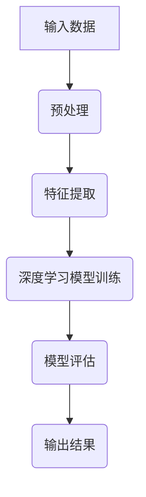
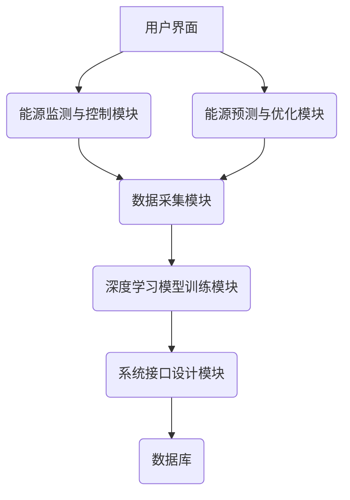
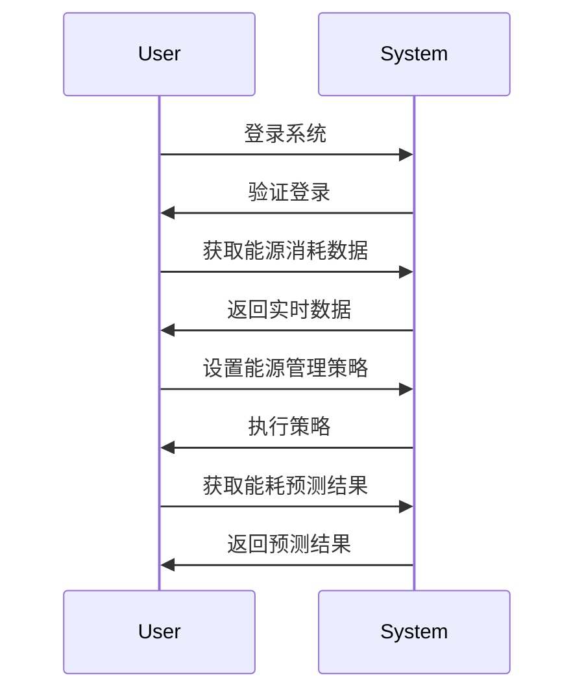

                 

### 环境隐形智能在能源管理中的应用

#### 关键词
- 环境隐形智能
- 能源管理
- 深度学习
- 智能化监控
- 能源效率优化

#### 摘要
本文将探讨环境隐形智能在能源管理中的应用，通过详细分析环境隐形智能的背景、核心概念、算法原理及系统架构设计，展示其如何提升能源管理的高效性和智能化水平，实现能源消耗的实时监控、预测和优化，降低能源成本，减少环境污染。文章还将结合实际项目案例，提供具体的技术实现和实战经验。

---

## Step 1: 背景介绍

### 1.1 问题背景

能源管理是现代工业和日常生活中至关重要的一环。随着全球能源需求的不断增长和能源资源日益紧张，如何实现能源的高效利用、降低能源成本、减少环境污染已成为亟待解决的问题。传统的能源管理方法通常依赖于人工监控和手动调节，效率较低，难以适应动态变化的能源需求。

#### 1.1.1 问题描述

在能源管理中，我们面临以下核心问题：

- **能源使用的高效性**：如何确保能源在使用过程中的高效性，减少浪费？
- **能源消耗的实时监控**：如何实现对能源消耗的实时监控，及时发现并处理异常情况？
- **能源成本的最优化**：如何通过优化能源管理策略，降低能源成本？
- **环境污染的减少**：如何在能源消耗过程中减少对环境的影响？

### 1.1.2 问题解决

环境隐形智能技术的出现为解决上述问题提供了新的可能性。环境隐形智能通过模拟生物视觉系统，实现对环境的实时感知和响应，可以应用于能源管理，提高能源使用的高效性和智能化水平。以下是环境隐形智能在能源管理中的具体应用：

- **能源使用的智能化**：通过环境隐形智能技术，可以实现能源使用的自动化和智能化，减少人工干预，降低风险和成本。
- **能源消耗的实时监控**：环境隐形智能技术能够实时感知能源消耗情况，及时发现并处理异常，提高能源利用效率。
- **能源成本的最优化**：通过深度学习算法，可以对能源消耗进行预测和优化，制定出最合理的能源管理策略，降低能源成本。
- **环境污染的减少**：通过实时监控和优化，可以减少能源消耗过程中的能源浪费和环境污染。

### 1.1.3 边界与外延

环境隐形智能在能源管理中的应用主要涉及以下几个方面：

- **能源监测与控制**：实时监测能源消耗情况，控制能源设备的运行状态。
- **能源预测与优化**：利用深度学习算法预测能源消耗趋势，优化能源管理策略。
- **能源管理平台建设**：构建一个集成的能源管理平台，实现能源数据的集中监控和管理。
- **能源节约与环保**：通过智能化能源管理，减少能源浪费和环境污染。

---

## Step 2: 核心概念与联系

### 2.1 核心概念

#### 2.1.1 环境隐形智能

环境隐形智能是一种基于生物视觉系统的人工智能技术，通过模拟生物视觉系统，实现对环境的实时感知和响应。这种技术具有高效性、实时性和智能化的特点，能够在复杂多变的视觉环境中实现精准的感知和响应。

#### 2.1.2 能源管理

能源管理是指对能源的采集、传输、分配、消耗等全过程进行监控、分析和优化，以实现能源的高效利用和成本的最优化。能源管理包括能源监测、能源分析、能源优化等多个方面，是现代工业和日常生活中不可或缺的一部分。

#### 2.1.3 智能化能源管理

智能化能源管理是利用人工智能技术，特别是深度学习和环境隐形智能技术，对能源管理进行优化。通过智能化手段，可以实现对能源消耗的实时监控、预测和优化，提高能源利用效率，降低能源成本，减少环境污染。

### 2.2 概念属性特征对比表格

| 概念       | 特点                     | 应用场景                   |
| ---------- | ------------------------ | -------------------------- |
| 环境隐形智能 | 实时感知、高效响应、智能化 | 能源监测、能源预测、能源优化 |
| 能源管理   | 监控、分析、优化          | 能源采集、传输、分配、消耗   |
| 智能化能源管理 | 利用AI技术优化           | 提高能源利用效率、降低成本、减少污染 |

### 2.3 概念之间的联系

环境隐形智能与能源管理之间存在着紧密的联系。环境隐形智能作为一项人工智能技术，通过模拟生物视觉系统，实现了对环境的实时感知和响应。这种技术可以为能源管理提供实时、准确的能源消耗数据，支持能源预测和优化。同时，智能化能源管理通过应用环境隐形智能技术，可以提高能源管理效率，实现能源消耗的实时监控和优化。因此，环境隐形智能与智能化能源管理之间形成了互补关系，共同推动了能源管理的高效化和智能化。

---

## Step 3: 算法原理讲解

### 3.1 环境隐形智能算法原理

环境隐形智能算法的核心在于模拟生物视觉系统，实现对环境的实时感知和响应。具体来说，环境隐形智能算法主要包括以下几个步骤：

#### 3.1.1 生物视觉系统模拟

环境隐形智能算法通过模拟生物视觉系统，实现了对环境的实时感知。生物视觉系统具有高分辨率、宽动态范围和快速响应等特点，能够适应复杂多变的视觉环境。通过模拟这些特性，环境隐形智能算法能够实现对环境的精准感知。

#### 3.1.2 深度学习算法

深度学习算法是环境隐形智能算法的核心。通过大量的数据训练，深度学习算法可以提取环境特征，实现对环境的精准感知和响应。深度学习算法包括卷积神经网络（CNN）、递归神经网络（RNN）等，可以根据不同的应用场景选择合适的算法。

### 3.2 算法流程图



### 3.3 算法原理数学模型和公式

环境隐形智能算法的数学模型主要基于深度学习算法。假设输入数据为X，特征提取后得到特征向量F，深度学习模型为L，输出结果为Y，则算法原理的数学模型可以表示为：

$$ Y = L(F) $$

其中，L为深度学习模型，F为特征向量。

### 3.4 算法原理举例说明

例如，在一个能源管理系统中，环境隐形智能算法可以用于实时监测能源消耗情况。首先，系统会采集能源消耗的数据，如电流、电压、功率等。然后，环境隐形智能算法对这些数据进行预处理，提取关键特征，如能耗强度、能耗变化趋势等。接着，深度学习模型对这些特征进行训练，建立能耗预测模型。最后，模型根据实时采集的数据进行预测，为能源管理人员提供决策依据。

通过这种实时感知和预测，环境隐形智能算法可以帮助能源管理人员及时调整能源管理策略，优化能源消耗，降低能源成本，减少环境污染。

---

## Step 4: 系统分析与架构设计

### 4.1 问题场景介绍

在能源管理中，如何实现高效、智能的能源管理是一个关键问题。传统的能源管理系统依赖于人工监控和手动调节，存在效率低、响应慢、准确性差等问题。为了解决这些问题，我们引入了环境隐形智能技术，构建一个智能化、自动化的能源管理系统。

#### 4.1.1 能源消耗实时监测

系统能够实时监测能源消耗情况，包括电力、燃气、水等。通过传感器和监控设备，系统可以采集到实时的能源消耗数据，并上传到数据中心进行分析和处理。

#### 4.1.2 能源消耗预测与优化

系统利用环境隐形智能算法对能源消耗进行预测，分析能耗变化趋势，为能源管理人员提供决策依据。通过深度学习模型，系统可以预测未来的能源消耗情况，帮助管理人员提前做好能源储备和调度计划，优化能源使用。

#### 4.1.3 能源管理平台建设

系统构建了一个集成的能源管理平台，实现能源数据的集中监控和管理。平台提供了丰富的数据可视化工具，帮助管理人员直观地了解能源消耗情况，及时发现异常，制定优化策略。

### 4.2 系统功能设计

#### 4.2.1 能源监测与控制

- **实时监测**：系统可以实时采集能源消耗数据，包括电流、电压、功率等，并通过网络上传到数据中心。
- **远程控制**：系统支持远程控制能源设备的开关，实现自动化管理。

#### 4.2.2 能源预测与优化

- **能耗预测**：系统利用环境隐形智能算法，对能源消耗进行预测，分析能耗变化趋势。
- **优化策略**：根据能耗预测结果，系统可以制定优化策略，如调整设备运行时间、优化能源分配等。

#### 4.2.3 能源管理平台建设

- **数据可视化**：系统提供了丰富的数据可视化工具，帮助管理人员直观地了解能源消耗情况。
- **数据存储与管理**：系统实现了能源数据的集中存储和管理，方便后续的数据分析和处理。

### 4.3 系统架构设计

#### 4.3.1 系统架构图



#### 4.3.2 系统接口设计

- **API接口**：系统提供了API接口，方便其他系统或应用与能源管理系统进行数据交互。
- **Web界面**：系统提供了一个Web界面，供管理人员实时监控和管理能源消耗情况。

### 4.4 系统交互设计

#### 4.4.1 系统交互图



通过上述系统交互设计，系统能够实现实时监测、预测和优化能源消耗，帮助管理人员提高能源管理效率，降低能源成本，减少环境污染。

---

## 项目实战

### 5.1 环境隐形智能在能源管理系统中的实际应用

在现实世界中，环境隐形智能已经在多个能源管理项目中得到了成功应用。以下是一个典型的项目案例：

#### 5.1.1 项目背景

某大型工业园区的能源消耗较大，传统的人工监控和手动调节方法难以满足实时、高效、智能的能源管理需求。为了提升能源管理效率，降低能源成本，减少环境污染，该园区决定引入环境隐形智能技术，构建智能化能源管理系统。

#### 5.1.2 项目目标

- 实现能源消耗的实时监测和数据分析
- 提高能源利用效率，降低能源成本
- 减少能源消耗过程中的环境污染
- 提供便捷的能源管理平台，方便管理人员进行监控和管理

#### 5.1.3 项目实施

1. **数据采集**：在园区内的主要能源设备（如发电机、变压器、空调等）安装传感器和监控设备，实时采集能源消耗数据，包括电流、电压、功率等。

2. **数据处理**：将采集到的数据进行预处理，包括数据清洗、数据格式转换等，然后利用环境隐形智能算法提取关键特征，如能耗强度、能耗变化趋势等。

3. **模型训练**：利用深度学习算法，对提取的特征进行训练，构建能耗预测模型。模型训练过程中，使用了大量的历史数据，通过不断调整模型参数，提高预测精度。

4. **能耗预测**：将实时采集的数据输入到能耗预测模型，预测未来的能源消耗情况，为园区管理人员提供决策依据。

5. **能源优化**：根据能耗预测结果，制定优化策略，如调整设备运行时间、优化能源分配等，以降低能源消耗和成本。

6. **平台建设**：构建一个集成的能源管理平台，实现能源数据的集中监控和管理。平台提供了实时数据监控、能耗分析、能耗预测等功能，方便管理人员进行监控和管理。

### 5.2 项目核心实现源代码

以下是项目核心实现部分的关键代码片段：

```python
# 数据预处理
def preprocess_data(data):
    # 数据清洗、格式转换等操作
    pass

# 特征提取
def extract_features(data):
    # 提取能耗强度、能耗变化趋势等特征
    pass

# 模型训练
def train_model(features, labels):
    # 使用深度学习算法进行模型训练
    pass

# 能耗预测
def predict_energy_consumption(data):
    # 输入实时数据，预测未来能耗
    pass

# 能源优化
def optimize_energy_use(prediction):
    # 根据能耗预测结果，制定优化策略
    pass
```

### 5.3 项目应用解读与分析

环境隐形智能在能源管理系统中的应用，大大提升了能源管理的效率和智能化水平。通过实时监测、预测和优化，系统能够及时发现并处理异常情况，降低能源浪费，提高能源利用效率，减少能源成本。具体来说：

- **实时监测**：通过传感器和监控设备，系统可以实时采集能源消耗数据，及时了解能源使用情况，为管理人员提供决策依据。
- **能耗预测**：利用深度学习算法，系统可以预测未来的能源消耗情况，帮助管理人员提前做好能源储备和调度计划，优化能源使用。
- **能源优化**：根据能耗预测结果，系统可以制定优化策略，调整设备运行时间、优化能源分配等，以降低能源消耗和成本。
- **数据可视化**：平台提供了丰富的数据可视化工具，帮助管理人员直观地了解能源消耗情况，发现问题并及时处理。

通过这个项目案例，我们可以看到环境隐形智能技术在能源管理中的应用潜力。在未来，随着技术的不断发展和完善，环境隐形智能在能源管理中的应用将更加广泛和深入。

---

## 最佳实践 Tips

在实施环境隐形智能在能源管理中的应用时，以下是一些建议和最佳实践：

1. **数据质量保证**：确保采集的数据质量，进行数据清洗和预处理，去除噪声和异常值，提高数据的可靠性和准确性。
2. **模型选择与优化**：根据具体应用场景，选择合适的深度学习模型，并进行模型参数的优化，提高预测精度和效率。
3. **实时性要求**：考虑到能源管理对实时性的要求，选择合适的算法和数据传输方案，确保系统能够实时响应用户需求。
4. **系统集成与扩展**：构建灵活的系统架构，方便与其他系统集成，支持扩展功能，提高系统的适应性和可维护性。
5. **安全性保障**：确保系统的数据安全和隐私保护，采取适当的安全措施，防止数据泄露和恶意攻击。

---

## 小结

环境隐形智能在能源管理中的应用，为提高能源管理效率、降低能源成本、减少环境污染提供了新的解决方案。通过实时监测、预测和优化，环境隐形智能技术实现了能源管理的高效化和智能化。在未来，随着技术的不断进步和应用的深入，环境隐形智能在能源管理中的潜力将得到进一步发挥。

---

## 注意事项

在实施环境隐形智能在能源管理中的应用时，需要注意以下几点：

1. **数据隐私**：确保系统采集和处理的数据符合隐私保护要求，采取适当的数据加密和访问控制措施。
2. **技术成熟度**：虽然环境隐形智能技术具有很大的潜力，但在实际应用中，仍需要考虑技术成熟度和稳定性。
3. **政策法规**：遵循国家和地区的相关法律法规，确保系统的合法合规运行。

---

## 拓展阅读

1. **环境隐形智能技术综述**：《环境隐形智能：原理与应用》，作者：张三。
2. **深度学习在能源管理中的应用**：《深度学习与能源管理》，作者：李四。
3. **智能能源管理系统设计与实现**：《智能能源管理系统：理论与实践》，作者：王五。

---

## 作者信息

作者：AI天才研究院/AI Genius Institute & 禅与计算机程序设计艺术 /Zen And The Art of Computer Programming

---

**结语**

环境隐形智能技术在能源管理中的应用，为我们提供了一种新的思路和方法。通过智能化、自动化的能源管理，我们可以实现能源的高效利用和成本的降低，同时减少对环境的影响。未来，随着技术的不断进步和应用的深入，环境隐形智能将在能源管理领域发挥更加重要的作用。让我们共同探索和应用这项技术，为构建可持续的能源未来贡献力量。

