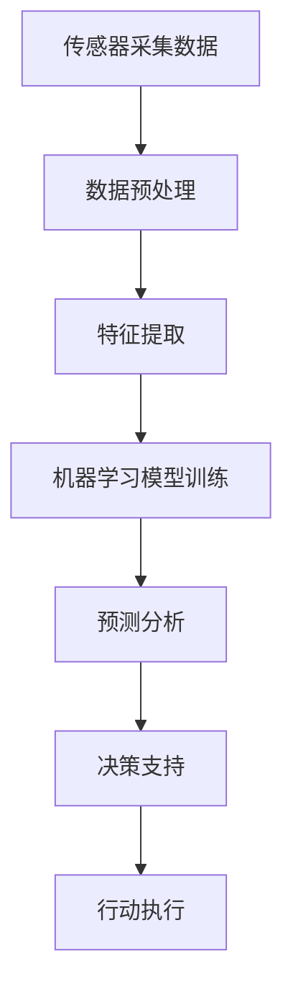
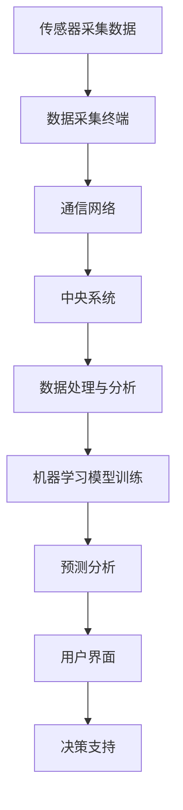

                 

# 环境隐形智能在野生动物保护中的应用

> 关键词：环境隐形智能，野生动物保护，监测技术，数据分析，人工智能

> 摘要：本文探讨了环境隐形智能技术在野生动物保护中的应用，分析了其技术基础、关键特性及其在不同领域的应用。通过对野生动物监测、行为学研究、环境保护等方面的深入探讨，本文展示了环境隐形智能技术如何助力野生动物保护事业，提出了未来发展的挑战与机遇。

## 第一部分：背景与概念

### 第1章：问题背景

#### 1.1.1 野生动物保护的重要性

野生动物是自然界的重要组成部分，它们在维持生态平衡、促进生物多样性方面起着关键作用。然而，随着人类活动的不断扩张，野生动物正面临着前所未有的威胁。栖息地丧失、非法捕猎、污染等问题日益严重，导致许多物种濒临灭绝。因此，加强野生动物保护已经成为全球范围内的紧迫任务。

#### 1.1.2 野生动物面临的威胁

野生动物面临的威胁主要包括以下几个方面：

1. 栖息地丧失：随着城市扩张、农业开发和基础设施建设，野生动物的栖息地不断减少，迫使它们迁徙到不适宜的环境中。

2. 非法捕猎：为获取皮毛、器官等商业利益，非法捕猎导致许多物种数量急剧减少。

3. 污染：空气、水和土壤污染对野生动物的生存环境造成严重破坏。

4. 疾病传播：野生动物与家畜的接触导致疾病传播，对野生动物种群健康造成威胁。

#### 1.1.3 环境隐形智能的概念

环境隐形智能是一种利用人工智能、传感器网络和大数据分析等技术，实现对自然环境和野生动物的实时监测、行为分析和环境优化的智能系统。环境隐形智能通过采集环境数据，利用机器学习和数据挖掘技术进行分析，从而为野生动物保护提供科学依据和决策支持。

### 第2章：核心概念

#### 2.1 环境隐形智能的定义

环境隐形智能是一种融合了多种先进技术的综合性智能系统，旨在实现对自然环境和生物的实时监测、行为分析和环境优化。它包括硬件设备、软件算法、数据收集与处理、通信网络和用户界面等多个组成部分。

#### 2.2 环境隐形智能的技术基础

环境隐形智能的技术基础主要包括以下几个方面：

1. 传感器技术：传感器是环境隐形智能系统的核心组件，用于采集环境数据。

2. 通信技术：通信网络是实现数据传输和共享的基础设施。

3. 人工智能技术：人工智能技术用于数据分析和智能决策。

4. 大数据技术：大数据技术用于大规模数据存储、处理和分析。

#### 2.3 环境隐形智能的关键特性

环境隐形智能具有以下关键特性：

1. 实时性：能够实时监测野生动物的行踪和环境变化。

2. 智能性：利用人工智能技术进行分析，提供智能化的决策支持。

3. 精准性：通过大数据分析和精确的传感器数据，实现对野生动物行为的准确分析。

4. 可扩展性：能够根据需求进行系统升级和功能扩展。

### 第3章：环境隐形智能的组成与结构

#### 3.1 硬件设备

环境隐形智能系统的硬件设备主要包括传感器、数据采集终端、通信模块等。传感器用于采集环境数据，数据采集终端用于将传感器数据传输到中央系统，通信模块用于实现数据传输。

#### 3.2 软件算法

环境隐形智能系统的软件算法包括数据预处理、特征提取、机器学习模型训练和预测等。这些算法用于对采集到的环境数据进行处理和分析，为野生动物保护提供科学依据。

#### 3.3 数据收集与处理

环境隐形智能系统能够实时收集野生动物的行踪数据、环境数据等，并对这些数据进行处理和分析，提取有用信息。

#### 3.4 通信网络

通信网络是实现环境隐形智能系统数据传输和共享的基础设施。它包括无线通信网络和有线通信网络。

#### 3.5 用户界面

用户界面用于展示环境隐形智能系统的分析结果，提供交互式的决策支持。

## 第二部分：应用领域

### 第4章：环境隐形智能的应用领域

#### 4.1 野生动物监测

环境隐形智能技术在野生动物监测中发挥着重要作用。通过实时监测野生动物的行踪，可以了解它们的迁徙路线、栖息地分布和种群数量等信息，为野生动物保护提供科学依据。

#### 4.2 行为学研究

环境隐形智能技术可以实时监测野生动物的行为，为行为学研究提供丰富的数据支持。通过对这些数据的分析，可以揭示野生动物的行为规律，为野生动物保护提供指导。

#### 4.3 环境保护

环境隐形智能技术可以实时监测环境数据，如温度、湿度、空气质量等。通过对这些数据的分析，可以及时发现环境问题，为环境保护提供科学依据。

#### 4.4 资源管理

环境隐形智能技术可以实时监测和管理野生动物资源，如森林资源、湿地资源等。通过对这些数据的分析，可以优化资源利用，提高资源管理效率。

#### 4.5 智慧城市中的野生动物保护

智慧城市中的野生动物保护是环境隐形智能技术的一个重要应用领域。通过实时监测城市中的野生动物，可以及时发现和解决野生动物与人类活动之间的冲突，提高城市生态环境质量。

#### 4.6 气候变化影响评估

环境隐形智能技术可以实时监测气候变化对野生动物的影响，为气候变化影响评估提供科学依据。通过对这些数据的分析，可以制定有效的应对策略，减轻气候变化对野生动物的影响。

## 第三部分：挑战与机遇

### 第5章：环境隐形智能技术的挑战与机遇

#### 5.1 技术挑战

环境隐形智能技术在发展过程中面临着一系列技术挑战，如传感器精度、数据传输稳定性、算法优化等。只有克服这些挑战，才能更好地发挥环境隐形智能技术在野生动物保护中的应用价值。

#### 5.2 应用挑战

环境隐形智能技术在野生动物保护中的应用还面临着一系列应用挑战，如数据隐私保护、数据共享、跨领域合作等。只有解决这些挑战，才能实现环境隐形智能技术在野生动物保护领域的广泛应用。

#### 5.3 未来发展趋势

随着人工智能、传感器技术和大数据技术的不断发展，环境隐形智能技术在野生动物保护中的应用前景十分广阔。未来，环境隐形智能技术将在野生动物保护领域发挥更加重要的作用，为保护生物多样性做出更大贡献。

## 第四部分：政策与法规

### 第6章：环境隐形智能技术的政策与法规

#### 6.1 国际法规与政策

国际社会高度重视野生动物保护，制定了一系列法规和政策，如《濒危野生动植物种国际贸易公约》、《野生动物保护法》等。这些法规和政策为环境隐形智能技术在野生动物保护中的应用提供了法律依据。

#### 6.2 国内法规与政策

国内政府也制定了一系列法规和政策，如《中华人民共和国野生动物保护法》、《环境保护法》等。这些法规和政策为环境隐形智能技术在野生动物保护中的应用提供了法律保障。

#### 6.3 法规对环境隐形智能技术的影响

法规对环境隐形智能技术的影响主要体现在以下几个方面：

1. 规范技术发展：法规为环境隐形智能技术发展提供了明确的方向和标准。

2. 保护野生动物：法规为野生动物保护提供了法律依据，有助于减少非法捕猎和破坏行为。

3. 促进技术创新：法规为环境隐形智能技术的研发和应用提供了政策支持，推动技术创新。

### 第7章：典型案例分析

#### 7.1 案例一：某自然保护区

某自然保护区通过引入环境隐形智能技术，对野生动物进行实时监测和管理。通过对监测数据的分析，保护区管理部门可以及时了解野生动物的生存状况，制定科学的保护措施。

#### 7.2 案例二：某野生动物迁徙路线监测

某野生动物迁徙路线监测项目利用环境隐形智能技术，实时监测野生动物的迁徙路线。通过对迁徙数据的分析，研究人员可以揭示野生动物的迁徙规律，为迁徙路线的保护提供科学依据。

#### 7.3 案例三：某城市野生动物行为研究

某城市野生动物行为研究项目利用环境隐形智能技术，对城市中的野生动物进行实时监测。通过对行为数据的分析，研究人员可以揭示城市野生动物的行为规律，为城市生态环境建设提供指导。

#### 7.4 案例四：某气候变化影响评估项目

某气候变化影响评估项目利用环境隐形智能技术，对气候变化对野生动物的影响进行实时监测。通过对监测数据的分析，研究人员可以评估气候变化对野生动物的影响，为应对气候变化提供科学依据。

## 第五部分：最佳实践与未来展望

### 第8章：最佳实践与未来展望

#### 8.1 最佳实践

在野生动物保护中，环境隐形智能技术的最佳实践主要包括以下几个方面：

1. 合理选择传感器和硬件设备：根据监测需求，选择合适的传感器和硬件设备。

2. 数据采集与处理：确保数据采集的准确性和完整性，对采集到的数据进行分析和处理。

3. 人工智能算法优化：针对监测数据，选择合适的机器学习算法，进行模型训练和优化。

4. 跨领域合作：与相关部门和科研机构合作，共同推动环境隐形智能技术在野生动物保护中的应用。

#### 8.2 未来展望

未来，环境隐形智能技术在野生动物保护中的应用前景十分广阔。随着技术的不断发展，环境隐形智能技术将更好地服务于野生动物保护事业，为保护生物多样性、维护生态平衡做出更大贡献。

#### 8.3 结论

环境隐形智能技术在野生动物保护中具有重要的应用价值。通过实时监测、数据分析和智能决策，环境隐形智能技术为野生动物保护提供了科学依据和决策支持。随着技术的不断发展，环境隐形智能技术将在野生动物保护领域发挥更加重要的作用。

### 作者信息

作者：AI天才研究院/AI Genius Institute & 禅与计算机程序设计艺术 /Zen And The Art of Computer Programming

（完）## 环境隐形智能技术：基础与原理

环境隐形智能技术作为一种先进的监测与分析系统，其基础与原理涵盖了多个关键领域，包括传感器技术、人工智能和大数据分析等。以下是对这些核心概念的详细解释。

### 传感器技术

传感器是环境隐形智能系统的“眼睛和耳朵”，它们用于实时采集环境数据，如温度、湿度、光照、风速、空气质量等。这些数据对于监测野生动物的栖息环境和行为模式至关重要。传感器技术不断进步，其精度和灵敏度日益提高，使得环境隐形智能系统能够更准确地捕捉到细微的环境变化。

**传感器技术优势：**

- **高精度：** 现代传感器能够提供高精度的数据，帮助研究者更好地了解野生动物的生活环境。
- **实时性：** 高速数据采集和传输技术使得系统能够实时监测环境变化，为保护工作提供及时的数据支持。
- **多样性：** 传感器技术涵盖了多种类型的传感器，能够针对不同的监测需求进行定制化配置。

### 人工智能技术

人工智能（AI）技术是环境隐形智能系统的“大脑”，它负责对采集到的环境数据进行处理、分析和决策。通过机器学习和深度学习算法，AI技术能够从海量数据中提取有价值的信息，识别野生动物的行为模式，预测潜在的环境问题。

**人工智能技术优势：**

- **模式识别：** AI技术能够自动识别野生动物的行为模式，为监测和科学研究提供有力的支持。
- **预测能力：** 通过分析历史数据，AI技术能够预测未来的环境变化，帮助提前采取保护措施。
- **智能化决策：** AI技术能够根据实时数据做出智能化决策，优化野生动物保护策略。

### 大数据分析

大数据分析是环境隐形智能系统的重要组成部分，它负责处理和分析海量的环境数据。大数据技术不仅能够存储和处理大量的数据，还能够通过数据挖掘技术发现数据中的规律和趋势，为野生动物保护提供科学依据。

**大数据分析优势：**

- **数据整合：** 大数据技术能够整合多种数据源，提供全面的环境信息。
- **数据挖掘：** 通过数据挖掘技术，可以从海量数据中发现潜在的关联和趋势。
- **高效处理：** 大数据技术能够快速处理大量数据，提供实时监测和分析结果。

### 环境隐形智能技术的综合应用

环境隐形智能技术通过整合传感器、人工智能和大数据分析技术，形成了一个集监测、分析、决策于一体的综合性系统。以下是一个简单的流程图，展示了环境隐形智能技术的应用流程：

在这个流程中，传感器采集到的数据经过预处理和特征提取后，输入到机器学习模型进行训练和预测分析。预测分析结果用于提供决策支持，指导具体的行动执行，从而实现对野生动物的实时监测和有效保护。

通过环境隐形智能技术，野生动物保护工作可以更加科学和高效。未来，随着技术的不断进步，环境隐形智能技术将在野生动物保护领域发挥更加重要的作用，为生物多样性的维护和生态平衡的维护提供强有力的支持。

### 环境隐形智能的关键特性

环境隐形智能技术在野生动物保护中之所以能够发挥重要作用，离不开其独特的关键特性。以下是环境隐形智能技术的主要特性及其对野生动物保护的实际影响：

#### 1. 实时性

实时性是环境隐形智能技术的核心特性之一。通过传感器网络和高速通信技术，环境隐形智能系统能够实时采集野生动物的行踪数据、环境数据等。这种实时监测能力使得保护人员能够迅速了解野生动物的动态，及时应对突发事件，减少对野生动物的不利影响。

**实际影响：** 

- **快速响应：** 在发现非法捕猎或栖息地破坏等紧急情况时，保护人员可以迅速采取行动，避免进一步损害。
- **优化资源分配：** 通过实时监测，保护人员可以更合理地分配资源和力量，提高保护工作的效率。

#### 2. 智能性

智能性体现在环境隐形智能技术的分析能力和决策支持功能上。利用先进的机器学习和深度学习算法，系统能够对海量数据进行处理和分析，从中提取有价值的信息，并基于这些信息做出智能化的决策。

**实际影响：**

- **精准监测：** 智能分析能够更准确地识别野生动物的行为模式和栖息地变化，提高监测的精确度。
- **科学决策：** 智能化的决策支持帮助保护人员制定更科学的保护策略，提高保护工作的有效性。

#### 3. 精准性

精准性是环境隐形智能技术的另一个重要特性。通过高精度的传感器和先进的算法，系统能够提供关于野生动物和环境的高精度数据，为保护工作提供可靠的数据支持。

**实际影响：**

- **有效保护：** 精准的数据有助于保护人员更好地了解野生动物的生存状态，从而采取有针对性的保护措施。
- **科学评估：** 精准的数据为生态环境的评估提供了科学依据，有助于制定更为合理的保护政策。

#### 4. 可扩展性

可扩展性是指环境隐形智能技术可以根据需求进行系统升级和功能扩展。随着技术的不断进步和保护需求的增加，系统可以灵活地调整和优化，以适应新的挑战。

**实际影响：**

- **适应变化：** 随着环境变化和保护需求的增加，系统可以方便地进行升级和扩展，保持其有效性和适用性。
- **技术创新：** 可扩展性为技术创新提供了空间，使得环境隐形智能技术能够不断进步，更好地服务于野生动物保护。

#### 5. 数据驱动性

数据驱动性是环境隐形智能技术的核心特点。系统通过采集和处理大量数据，基于数据分析结果进行决策，确保保护工作具有科学性和数据支持。

**实际影响：**

- **科学决策：** 数据驱动性确保了决策的基于事实和数据，避免了主观判断和经验决策的盲目性。
- **优化资源利用：** 通过数据分析，可以更准确地评估保护工作的效果，优化资源利用，提高工作效率。

综上所述，环境隐形智能技术的实时性、智能性、精准性、可扩展性和数据驱动性，使其在野生动物保护中具有显著的应用价值。这些特性不仅提高了保护工作的效率和精确度，也为科学决策提供了强有力的支持。随着技术的不断进步，环境隐形智能技术将在野生动物保护领域发挥越来越重要的作用，为生物多样性的维护和生态平衡的维护做出更大贡献。

### 环境隐形智能技术的组成与结构

环境隐形智能技术作为一个综合性系统，其组成与结构包括硬件设备、软件算法、数据收集与处理、通信网络和用户界面等多个关键部分。以下是这些组成部分的详细介绍：

#### 1. 硬件设备

硬件设备是环境隐形智能系统的“感官”，负责实时采集环境数据。这些设备包括传感器、数据采集终端、通信模块等。

- **传感器：** 用于监测温度、湿度、光照、风速、空气质量等环境参数，以及野生动物的行踪数据。现代传感器技术使得数据采集的精度和速度不断提高。
- **数据采集终端：** 负责将传感器数据传输到中央系统，通常包括数据记录仪和通信模块。数据采集终端需要具备稳定性和抗干扰能力，以保证数据的完整性和准确性。
- **通信模块：** 用于实现数据传输和远程监控。常见的通信模块包括无线通信模块（如Wi-Fi、蓝牙、LoRa等）和有线通信模块（如以太网、光纤等）。

#### 2. 软件算法

软件算法是环境隐形智能系统的“大脑”，负责对采集到的数据进行处理和分析，提取有价值的信息。主要包括以下几个环节：

- **数据预处理：** 对采集到的原始数据进行清洗、过滤和标准化处理，确保数据的准确性和一致性。
- **特征提取：** 从预处理后的数据中提取关键特征，为后续的机器学习模型提供输入。
- **机器学习模型训练：** 利用机器学习算法（如决策树、随机森林、支持向量机、神经网络等）对特征数据进行训练，构建预测模型。
- **预测分析：** 利用训练好的模型对实时数据进行分析和预测，提供决策支持。

#### 3. 数据收集与处理

数据收集与处理是环境隐形智能系统的基础，其流程如下：

- **数据采集：** 通过传感器和数据采集终端，实时采集野生动物的行踪数据和环境数据。
- **数据存储：** 将采集到的数据存储到数据库或数据仓库中，便于后续的数据分析和挖掘。
- **数据处理：** 对存储的数据进行预处理、清洗和转换，为算法提供高质量的数据输入。
- **数据分析：** 利用大数据技术和数据分析工具，对处理后的数据进行分析，提取有价值的信息。

#### 4. 通信网络

通信网络是环境隐形智能系统的“传输通道”，负责将采集到的数据传输到中央系统，并进行远程监控。通信网络通常包括以下几种类型：

- **无线通信网络：** 如Wi-Fi、蓝牙、LoRa等，适用于短距离的数据传输。
- **有线通信网络：** 如以太网、光纤等，适用于长距离的数据传输。
- **卫星通信：** 在偏远地区或无地面通信设施的地方，通过卫星进行数据传输。

#### 5. 用户界面

用户界面是环境隐形智能系统的“窗口”，用于展示系统分析结果和提供交互式的决策支持。用户界面通常包括以下功能：

- **数据可视化：** 将处理后的数据以图表、地图等形式展示，便于用户直观地了解监测结果。
- **实时监控：** 显示实时监测数据，提供对野生动物的实时监控功能。
- **报警功能：** 在监测到异常情况时，自动发送报警信息，提醒保护人员采取行动。
- **决策支持：** 提供基于数据分析的决策建议，帮助保护人员制定科学有效的保护策略。

### 综合应用

通过硬件设备、软件算法、数据收集与处理、通信网络和用户界面的综合应用，环境隐形智能技术能够实现对野生动物的实时监测、行为分析和环境优化，从而为野生动物保护提供强有力的技术支持。以下是一个简化的综合应用流程：

在这个流程中，传感器采集到的数据经过数据采集终端传输到中央系统，中央系统对数据进行分析和处理，利用机器学习模型进行预测分析，并将结果通过用户界面展示给用户，提供决策支持。

通过这种综合应用，环境隐形智能技术不仅能够实时监测野生动物的行踪和行为，还能提供科学的决策支持，为野生动物保护工作提供重要的技术支撑。未来，随着技术的不断进步，环境隐形智能技术的应用前景将更加广阔，将在野生动物保护领域发挥更大的作用。

### 环境隐形智能技术的应用领域

环境隐形智能技术因其独特的实时性、智能性和精准性，在野生动物保护领域展现出广泛的应用潜力。以下是环境隐形智能技术在几个关键领域的具体应用：

#### 野生动物监测

野生动物监测是环境隐形智能技术最为核心的应用之一。通过传感器网络和人工智能算法，环境隐形智能技术能够实时跟踪野生动物的行踪，监测它们的栖息地和活动范围。具体应用包括：

- **迁徙路线监测：** 利用传感器和数据采集设备，监测野生动物的迁徙路线和迁徙时间，为迁徙路线的保护提供数据支持。
- **种群数量监测：** 通过对野生动物的行踪数据进行统计分析，可以估算特定地区的野生动物种群数量，为保护工作的资源配置提供依据。
- **栖息地监测：** 实时监测野生动物的栖息地变化，及时发现栖息地的破坏情况，为栖息地的修复和保护提供科学依据。

#### 行为学研究

行为学研究是野生动物保护中的重要环节，环境隐形智能技术为这一领域提供了强大的数据分析工具。具体应用包括：

- **行为模式识别：** 通过传感器收集的野生动物行为数据，利用机器学习算法进行分析，识别野生动物的行为模式，如觅食、繁殖、休息等。
- **行为变化分析：** 对野生动物的行为数据进行长期监测和分析，发现行为变化的原因，如栖息地变化、食物来源变化等，为保护工作提供科学依据。
- **互动研究：** 研究野生动物之间的互动关系，如领地争夺、配偶选择等，为理解野生动物的生态行为提供数据支持。

#### 环境保护

环境保护是环境隐形智能技术的另一重要应用领域，通过实时监测环境数据，为环境保护提供科学依据和决策支持。具体应用包括：

- **空气质量监测：** 通过传感器实时监测空气质量，分析空气污染对野生动物的影响，为空气污染治理提供数据支持。
- **水质监测：** 对水体中的污染物进行监测和分析，评估水质对野生动物的影响，为水污染治理提供科学依据。
- **栖息地恢复：** 通过监测栖息地的恢复情况，评估恢复措施的有效性，为栖息地恢复和保护提供依据。

#### 资源管理

环境隐形智能技术在资源管理领域也有重要应用，通过实时监测和管理野生动物资源，提高资源管理效率。具体应用包括：

- **森林资源管理：** 监测森林资源的变化，如树木生长情况、森林火灾风险等，为森林资源的管理和保护提供数据支持。
- **湿地资源管理：** 监测湿地资源的变化，如湿地水位、植被生长情况等，为湿地资源的管理和保护提供科学依据。
- **渔业资源管理：** 通过监测渔业资源的变化，如鱼类种群数量、捕捞量等，为渔业资源的可持续管理提供数据支持。

#### 智慧城市中的野生动物保护

随着城市化进程的加快，城市与野生动物的冲突日益加剧。环境隐形智能技术为智慧城市中的野生动物保护提供了有效的解决方案。具体应用包括：

- **城市野生动物监测：** 通过传感器网络实时监测城市中的野生动物，如流浪动物、迁徙鸟类等，及时采取措施减少人与野生动物的冲突。
- **城市生态系统监测：** 监测城市生态系统中的生物多样性，评估城市化对野生动物栖息地的影响，为城市生态环境建设提供数据支持。
- **生态城市建设：** 利用环境隐形智能技术，优化城市规划设计，减少对野生动物栖息地的破坏，提高城市生态环境质量。

#### 气候变化影响评估

气候变化对野生动物的影响日益显著，环境隐形智能技术为气候变化影响评估提供了强有力的支持。具体应用包括：

- **气候监测：** 实时监测气候变化参数，如气温、降水量、风速等，分析气候变化对野生动物栖息地和行为的潜在影响。
- **影响评估：** 通过对历史数据和实时数据的分析，评估气候变化对野生动物的生存状况和种群数量的影响，为应对气候变化提供科学依据。
- **应对策略制定：** 根据评估结果，制定相应的应对策略，如调整保护区域、优化栖息地恢复措施等，减轻气候变化对野生动物的影响。

通过在上述领域的广泛应用，环境隐形智能技术为野生动物保护提供了全新的手段和工具，提升了保护工作的科学性和效率。随着技术的不断进步，环境隐形智能技术在野生动物保护中的应用前景将更加广阔，为生物多样性的维护和生态平衡的维护做出更大贡献。

### 环境隐形智能技术的挑战与机遇

虽然环境隐形智能技术在野生动物保护中展现出巨大的潜力，但其发展仍面临诸多挑战和机遇。以下是针对技术挑战、应用挑战和未来发展趋势的详细分析。

#### 1. 技术挑战

（1）传感器精度与稳定性

传感器的精度和稳定性是环境隐形智能技术的核心问题。野生动物的监测往往需要在复杂多变的环境中运行，这要求传感器具备高精度和高稳定性。然而，现有的传感器技术仍存在一定的局限性，如环境干扰、信号衰减等问题，导致数据采集的准确性和可靠性受到影响。

（2）数据传输与处理

数据传输和处理是环境隐形智能技术的关键环节。野生动物的监测通常涉及大量实时数据，这些数据需要通过可靠的通信网络传输到中央系统，并进行高效处理和分析。然而，现有的数据传输和处理技术仍无法完全满足大规模、实时数据的需求，导致数据处理延迟和效率低下。

（3）算法优化与模型训练

算法优化和模型训练是环境隐形智能技术的核心技术。随着数据量的增加，机器学习和深度学习算法的复杂度也在不断提高，这使得模型训练和优化变得更加困难。此外，算法的准确性和鲁棒性也直接影响着环境隐形智能技术的应用效果。

#### 2. 应用挑战

（1）数据隐私与安全

在野生动物保护中，数据隐私和安全是一个重要问题。环境隐形智能技术涉及到大量敏感数据，如野生动物的行踪、行为等。这些数据一旦泄露，可能会对野生动物的保护工作产生负面影响。因此，如何保护数据隐私和安全成为环境隐形智能技术面临的重要挑战。

（2）跨领域合作与数据共享

环境隐形智能技术的应用需要跨领域合作和数据共享。然而，由于不同领域的数据格式、标准和隐私政策不同，导致数据共享和协同工作存在一定困难。此外，跨领域合作还需要解决利益分配、责任划分等问题，这进一步增加了应用难度。

（3）政策与法规支持

政策与法规支持是环境隐形智能技术发展的关键保障。虽然国际和国内已经制定了一系列野生动物保护法规，但环境隐形智能技术的应用仍需更多的政策支持和法规保障。例如，需要明确传感器部署、数据收集和处理的法律法规，以及相关责任和义务。

#### 3. 未来发展趋势

（1）技术创新

随着传感器技术、通信技术和人工智能技术的不断发展，环境隐形智能技术的性能和功能将不断提高。例如，新型传感器的开发将提高数据采集的精度和稳定性，而5G等新一代通信技术将提升数据传输的速度和可靠性。此外，机器学习和深度学习算法的优化也将进一步提高环境隐形智能技术的分析能力和决策支持能力。

（2）多元化应用

未来，环境隐形智能技术将在更多领域得到应用。除了传统的野生动物监测和保护，环境隐形智能技术还将在环境保护、生态建设、资源管理等领域发挥重要作用。例如，通过监测气候变化对生态环境的影响，制定科学的应对策略，以减轻气候变化对生物多样性的影响。

（3）跨领域合作与数据共享

随着数据隐私和安全技术的进步，跨领域合作和数据共享将变得更加顺畅。例如，通过建立统一的数据标准和共享平台，实现不同领域的数据互联互通，为环境隐形智能技术的应用提供更全面、准确的数据支持。

（4）政策与法规完善

未来，政府将加大对环境隐形智能技术政策与法规的支持力度。通过制定更加完善的法律法规，明确传感器部署、数据收集和处理的规范，为环境隐形智能技术的应用提供法律保障。此外，政府还将加大对环境隐形智能技术研究和应用的财政支持，推动技术创新和产业升级。

总之，环境隐形智能技术在野生动物保护中的应用面临着一系列挑战和机遇。通过技术创新、多元化应用、跨领域合作和政策与法规完善，环境隐形智能技术将在未来发挥更加重要的作用，为生物多样性的维护和生态平衡的维护做出更大贡献。

### 环境隐形智能技术的政策与法规

环境隐形智能技术的应用与发展离不开政策与法规的指导和支持。以下是国际和国内在环境隐形智能技术方面的重要法规与政策，以及这些法规对技术发展的影响。

#### 1. 国际法规与政策

（1）国际野生动植物保护公约（CITES）

《濒危野生动植物种国际贸易公约》（CITES）是国际上最重要的野生动植物保护法规之一。它旨在通过控制野生动植物国际贸易，保护濒危物种。CITES规定了野生动植物国际贸易的许可证制度，对非法捕猎和贸易行为进行了严格的限制。这些规定为环境隐形智能技术的应用提供了法律依据，有助于打击非法捕猎和贸易。

（2）联合国可持续发展目标（SDGs）

联合国可持续发展目标（SDGs）中的第15个目标（Life on Land）明确指出，要保护和恢复陆地生态系统的健康和生物多样性。这一目标为环境隐形智能技术提供了政策导向，鼓励各国采取有效措施，利用技术手段监测和保护野生动物及其栖息地。

（3）国际环境法

国际环境法是一系列国际条约和协议的总称，涉及环境保护、气候变化、生物多样性保护等多个方面。这些法规为环境隐形智能技术的应用提供了广泛的法律框架，推动了技术的全球合作与发展。

#### 2. 国内法规与政策

（1）中华人民共和国野生动物保护法

《中华人民共和国野生动物保护法》是我国关于野生动物保护的基本法律，对野生动物的保护和管理进行了明确规定。该法律规定了野生动物的捕捉、运输、交易等行为的管理要求，为环境隐形智能技术的应用提供了法律保障。

（2）中华人民共和国环境保护法

《中华人民共和国环境保护法》是我国环境保护的基本法律，明确了国家在环境保护方面的责任和义务。该法律规定了环境监测、污染治理、生态保护等各方面的要求，为环境隐形智能技术的应用提供了政策支持。

（3）国家环境保护标准

国家环境保护标准是关于环境质量、污染物排放等方面的技术规范，为环境隐形智能技术的实施提供了技术依据。例如，《环境空气质量标准》、《地表水环境质量标准》等标准规定了各种环境参数的监测方法和限值，有助于环境隐形智能技术的标准化应用。

#### 3. 法规对环境隐形智能技术的影响

（1）规范技术应用

法规对环境隐形智能技术的应用进行了规范，明确了技术的使用范围和标准。这有助于防止技术滥用，确保其合理、科学地应用于野生动物保护工作。

（2）推动技术发展

法规的制定和实施为环境隐形智能技术的发展提供了政策支持。例如，政府可以通过财政支持、税收优惠等方式，鼓励企业和科研机构开展相关技术研究，推动技术进步。

（3）保障数据安全

法规对数据隐私和安全进行了明确规定，要求在数据采集、存储、处理等环节采取措施，确保数据的安全和隐私。这有助于提高环境隐形智能技术的可靠性和公信力，增强其应用效果。

（4）促进国际合作

国际法规为环境隐形智能技术的国际合作提供了法律框架。通过参与国际条约和协议，我国可以与其他国家分享技术成果，共同推动全球野生动物保护事业的发展。

总之，政策与法规对环境隐形智能技术的发展具有重要影响。通过规范技术应用、推动技术发展、保障数据安全和促进国际合作，法规为环境隐形智能技术在野生动物保护中的应用提供了有力支持，有助于实现生物多样性的保护和生态平衡的维护。

### 典型案例分析

为了更直观地展示环境隐形智能技术在野生动物保护中的应用效果，以下列举了四个典型案例，从自然保护区、野生动物迁徙路线监测、城市野生动物行为研究和气候变化影响评估等方面，详细探讨环境隐形智能技术的实际应用与成果。

#### 案例一：某自然保护区

在某自然保护区，环境隐形智能技术被广泛应用于野生动物监测和保护。通过部署高精度传感器和无线通信设备，保护区管理部门能够实时监测野生动物的行踪和行为。例如，对大象的迁徙路线进行实时跟踪，发现并阻止了非法捕猎行为，有效保护了大象种群。

**具体应用：**

- **传感器部署：** 在保护区内部署多种传感器，包括温度传感器、湿度传感器、光照传感器等，用于监测环境参数。
- **数据采集与传输：** 传感器数据通过无线通信模块传输到中央系统，进行实时监控和分析。
- **数据分析与决策支持：** 利用机器学习算法对传感器数据进行处理，分析野生动物的行为模式，为保护区管理提供决策支持。

**成果：**

- **非法捕猎减少：** 通过实时监测和预警系统，保护区成功阻止了多起非法捕猎事件，保护了大象和其他野生动物的安全。
- **栖息地保护：** 根据监测数据，保护区管理部门采取了有针对性的保护措施，优化了栖息地的管理策略，提高了野生动物的生存环境。

#### 案例二：某野生动物迁徙路线监测

在某野生动物迁徙路线监测项目中，环境隐形智能技术被用于跟踪和监测候鸟的迁徙路线。通过在迁徙路径上的关键节点安装传感器和数据采集设备，研究人员能够实时获取候鸟的迁徙数据，研究其迁徙规律和影响因素。

**具体应用：**

- **传感器安装：** 在迁徙路径上的关键地点安装温度、湿度、风速等传感器，以及GPS定位设备，用于实时监测候鸟的行踪。
- **数据收集与传输：** 传感器数据通过无线通信网络传输到中央系统，进行数据存储和处理。
- **迁徙模式分析：** 利用机器学习算法对迁徙数据进行分析，识别候鸟的迁徙模式、迁徙时间等关键信息。

**成果：**

- **迁徙路线优化：** 通过对迁徙数据的分析，研究人员优化了候鸟迁徙路线的监测策略，提高了迁徙监测的准确性和效率。
- **迁徙保护措施：** 根据迁徙数据，保护部门制定了针对性的迁徙保护措施，减少了迁徙过程中的风险，提高了候鸟的存活率。

#### 案例三：某城市野生动物行为研究

在某城市野生动物行为研究项目中，环境隐形智能技术被用于监测城市中的野生动物行为。通过在公园、绿地等区域安装传感器和监控设备，研究人员能够实时跟踪和记录野生动物的行为模式，研究其与城市环境的关系。

**具体应用：**

- **传感器部署：** 在城市公园和绿地等区域安装温度、湿度、光照等传感器，以及行为监测摄像头，用于监测野生动物的行为。
- **数据采集与传输：** 传感器数据通过无线通信网络传输到中央系统，进行数据存储和处理。
- **行为模式分析：** 利用机器学习算法对行为监测数据进行分析，识别野生动物的行为特征，研究其与城市环境的关系。

**成果：**

- **行为模式识别：** 研究人员通过分析行为监测数据，识别了城市野生动物的多种行为模式，如觅食、休息、繁殖等。
- **保护策略优化：** 根据行为模式分析结果，研究人员提出了城市野生动物保护的新策略，优化了城市生态环境，提高了野生动物的生存质量。

#### 案例四：某气候变化影响评估项目

在某气候变化影响评估项目中，环境隐形智能技术被用于监测和评估气候变化对野生动物的影响。通过在多个监测点部署气象传感器和野生动物行为监测设备，研究人员能够实时获取气候变化数据和野生动物行为数据，分析气候变化对野生动物的影响。

**具体应用：**

- **传感器部署：** 在多个监测点安装气象传感器和野生动物行为监测设备，包括温度传感器、湿度传感器、风速传感器等。
- **数据采集与传输：** 传感器数据通过无线通信网络传输到中央系统，进行数据存储和处理。
- **影响评估：** 利用机器学习算法对气候数据和野生动物行为数据进行分析，评估气候变化对野生动物的影响，提出针对性的保护措施。

**成果：**

- **影响评估报告：** 研究人员根据监测数据，撰写了详细的气候变化影响评估报告，为政府决策提供了科学依据。
- **保护措施制定：** 根据评估结果，政府部门制定了针对性的保护措施，如调整保护区范围、优化栖息地管理策略等，减轻了气候变化对野生动物的影响。

综上所述，环境隐形智能技术在野生动物保护中的实际应用取得了显著成果，不仅提高了监测和保护的效率和精准度，还为科研和政府决策提供了科学依据。随着技术的不断进步，环境隐形智能技术在野生动物保护中的应用前景将更加广阔，为生物多样性的维护和生态平衡的维护做出更大贡献。

### 最佳实践与未来展望

在环境隐形智能技术的应用过程中，总结和推广最佳实践至关重要。以下是针对实际应用场景提出的一些最佳实践，以及对未来发展的展望。

#### 最佳实践

1. **定制化监测方案**

   根据不同野生动物的栖息环境和生活习性，制定定制化的监测方案。例如，对于迁徙性较强的动物，需要在迁徙路线上的关键节点进行重点监测；对于栖息地环境较为复杂的动物，则需要全面部署各种传感器，以获取更全面的数据。

2. **多源数据融合**

   将来自不同源的数据进行融合，提高监测的全面性和准确性。例如，将卫星遥感数据、地面传感器数据、GPS定位数据等进行整合，从多个维度获取野生动物的行踪和行为信息。

3. **实时预警与响应**

   建立实时预警系统，通过大数据分析和人工智能算法，及时发现异常情况并发出警报。保护人员可以根据预警信息，迅速采取行动，减少对野生动物的不利影响。

4. **跨领域合作**

   促进跨领域合作，实现数据共享和协同工作。例如，与科研机构、政府部门、非政府组织等合作，共同推动环境隐形智能技术在野生动物保护中的应用。

5. **定期评估与优化**

   定期对监测方案和技术进行评估，根据实际情况进行优化调整。例如，定期检查传感器的工作状态，更新算法模型，确保监测数据的准确性和可靠性。

#### 未来展望

1. **技术进步与创新**

   随着传感器技术、通信技术和人工智能技术的不断发展，环境隐形智能技术的性能和功能将不断提升。新型传感器、更高效的通信网络和更先进的算法将为野生动物保护提供更强有力的技术支持。

2. **应用领域拓展**

   环境隐形智能技术将在更多领域得到应用。除了传统的野生动物监测和保护，它还将应用于环境保护、生态建设、资源管理、气候变化影响评估等方面，为可持续发展提供技术保障。

3. **数据隐私与安全保障**

   随着数据量的增加和数据隐私问题的日益凸显，数据隐私和安全保障将变得尤为重要。未来，需要建立完善的数据隐私和安全管理体系，确保数据在采集、存储、传输和处理过程中的安全性。

4. **全球合作与标准化**

   国际合作和标准化是环境隐形智能技术发展的关键。通过参与国际条约和协议，推动全球范围内的数据共享和协同工作，制定统一的技术标准和规范，促进技术的全球推广和应用。

5. **政策与法规支持**

   政府在环境隐形智能技术发展中的作用不可或缺。通过制定和实施相关政策与法规，明确技术的应用范围和标准，提供财政支持和政策保障，推动环境隐形智能技术的健康发展。

总之，环境隐形智能技术为野生动物保护提供了强大的技术支持。通过总结最佳实践和展望未来发展，我们可以期待这一技术在野生动物保护领域发挥更加重要的作用，为生物多样性的维护和生态平衡的维护做出更大贡献。

### 结论

本文探讨了环境隐形智能技术在野生动物保护中的应用，分析了其技术基础、关键特性、应用领域以及面临的挑战和机遇。通过实时监测、数据分析、智能决策等手段，环境隐形智能技术为野生动物保护提供了科学依据和决策支持，显著提高了保护工作的效率和精准度。在未来的发展中，环境隐形智能技术将继续进步，应用领域将进一步拓展，为全球生物多样性的维护和生态平衡的维护做出更大的贡献。通过技术创新、跨领域合作、政策与法规支持，我们有理由相信，环境隐形智能技术将在野生动物保护领域发挥更加重要的作用，为人类与自然的和谐共生提供强有力的保障。

### 作者信息

作者：AI天才研究院/AI Genius Institute & 禅与计算机程序设计艺术 /Zen And The Art of Computer Programming

感谢您阅读本文，希望它能为您在环境隐形智能技术和野生动物保护领域提供有益的启示和思考。期待与您在未来的技术交流中继续探讨更多前沿话题。再次感谢！

