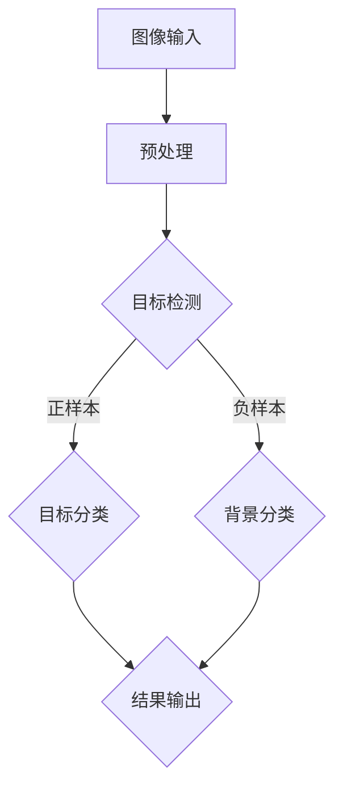
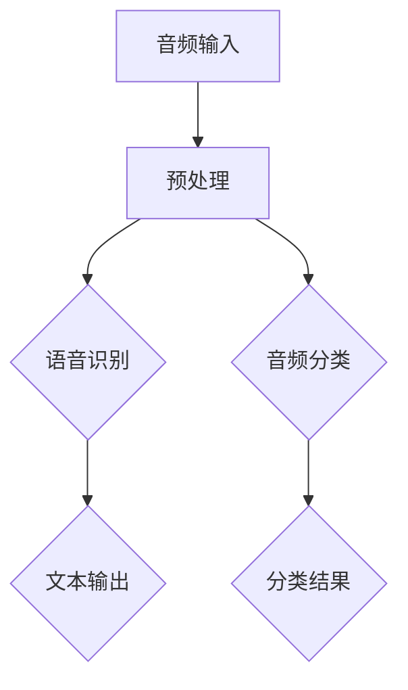
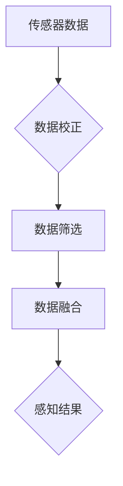
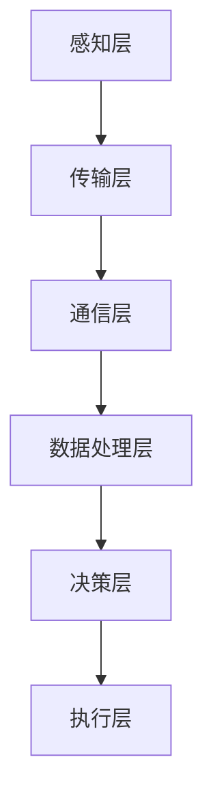
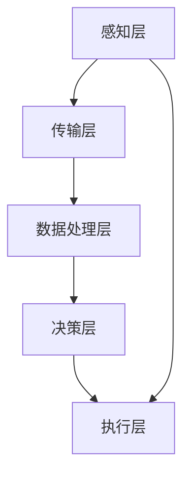

                 

### 引言

#### 问题背景

在当今快速发展的零售和物流行业，消费者需求多样化和市场竞争的加剧使得企业迫切需要提升运营效率，优化客户体验。随着物联网、人工智能、大数据等新兴技术的不断进步，环境隐形智能（Environmental Invisible Intelligence，EII）作为一种前沿技术，逐渐成为行业变革的重要驱动力。环境隐形智能通过感知、传输、通信等核心技术，实现对复杂环境的实时监测和智能决策，为零售和物流行业带来了前所未有的变革机会。

#### 问题描述

环境隐形智能在零售和物流中的应用，旨在通过技术手段提高行业运营效率，提升客户体验。具体来说，问题描述可以概括为：

- 如何利用环境隐形智能技术实现零售门店的智能化运营？
- 如何通过环境隐形智能技术优化供应链管理，降低物流成本？
- 环境隐形智能在零售和物流中应用的具体技术方案和实施步骤是什么？
- 环境隐形智能技术的未来发展前景和挑战是什么？

#### 问题解决

本文将详细探讨环境隐形智能在零售和物流中的应用，从基本原理、核心技术、应用案例、系统设计、最佳实践以及未来展望等方面进行全面分析。通过系统性的探讨，希望能够为相关行业提供有价值的参考，助力企业在数字经济时代抢占先机。

#### 边界与外延

本文的研究边界主要涵盖环境隐形智能在零售和物流领域中的应用，而外延则包括：

- 其他行业（如医疗、交通等）的环境隐形智能应用研究。
- 环境隐形智能技术的基础研究，如感知技术、传输技术、通信技术的最新进展。
- 环境隐形智能与5G、物联网等新兴技术的融合应用。

#### 概念结构与核心要素组成

环境隐形智能的概念结构包括以下几个核心要素：

1. **感知技术**：通过视觉、音频、感应器等手段，实现对环境的感知。
2. **传输技术**：包括无线传输、数据传输效率、网络协议等技术，确保信息的高效传输。
3. **通信技术**：利用物联网、云计算、边缘计算等技术，实现信息的实时通信。
4. **智能决策**：基于大数据分析和机器学习算法，实现对复杂环境的智能决策。

本文将依次介绍这些核心要素，并探讨其在零售和物流中的应用。

#### 关键词

- 环境隐形智能
- 零售
- 物流
- 感知技术
- 传输技术
- 通信技术
- 智能决策
- 供应链管理
- 客户体验
- 5G
- 物联网

#### 摘要

本文深入探讨了环境隐形智能在零售和物流中的应用。首先，介绍了环境隐形智能的基本概念、原理和发展历程。接着，详细分析了感知技术、传输技术和通信技术的核心内容，并阐述了这些技术在零售和物流领域的具体应用案例。随后，介绍了环境隐形智能系统的设计原则和实现方法，并通过最佳实践案例分享了成功经验和教训。最后，展望了环境隐形智能技术的未来发展前景和面临的挑战，为行业提供了有价值的参考和指导。

----------------------------------------------------------------

## 第1章：环境隐形智能概述

### 1.1.1 问题背景

随着全球零售和物流行业的迅速发展，市场竞争日益激烈，企业面临着提升运营效率、降低成本、提高客户体验的巨大挑战。在这种背景下，环境隐形智能（EII）作为一种新兴技术，引起了广泛关注。环境隐形智能通过感知、传输、通信等核心技术，实现对复杂环境的实时监测和智能决策，为零售和物流行业带来了前所未有的变革机会。

在零售行业，消费者需求日益多样化，个性化服务成为竞争的关键。传统零售模式难以满足消费者的实时需求，导致用户体验不佳。环境隐形智能可以通过智能导购系统、顾客行为分析等技术手段，提高零售门店的运营效率，提升客户体验。

在物流行业，供应链管理复杂，物流成本高企，运输效率低。传统物流模式在应对突发事件时往往反应迟缓，难以实现实时监控和优化。环境隐形智能技术可以通过自动化仓库、物流配送优化等技术，提高物流效率，降低运营成本。

#### 1.1.2 问题描述

环境隐形智能在零售和物流中的应用，旨在通过技术手段提高行业运营效率，优化客户体验。具体问题描述可以概括为：

- 如何利用环境隐形智能技术实现零售门店的智能化运营？
- 如何通过环境隐形智能技术优化供应链管理，降低物流成本？
- 环境隐形智能在零售和物流中应用的具体技术方案和实施步骤是什么？
- 环境隐形智能技术的未来发展前景和挑战是什么？

#### 1.1.3 问题解决

本文将从以下几个方面探讨环境隐形智能在零售和物流中的应用：

1. **基本原理**：介绍环境隐形智能的核心概念、原理和发展历程。
2. **核心技术**：详细分析感知技术、传输技术和通信技术的核心内容，并探讨其在零售和物流领域的应用。
3. **应用案例**：通过具体案例展示环境隐形智能在零售和物流中的实际应用效果。
4. **系统设计**：介绍环境隐形智能系统的设计原则和实现方法。
5. **最佳实践**：分享成功案例和经验教训，提供实际操作指导。
6. **未来展望**：分析环境隐形智能技术的未来发展前景和面临的挑战。

通过以上探讨，本文旨在为相关行业提供有价值的参考，助力企业在数字经济时代实现转型升级。

#### 1.1.4 边界与外延

本文的研究边界主要涵盖环境隐形智能在零售和物流领域中的应用，具体包括：

- 环境隐形智能技术的基本原理和核心技术。
- 环境隐形智能在零售和物流行业中的应用案例和最佳实践。
- 环境隐形智能系统设计的原则和方法。

本文的研究外延包括：

- 其他行业（如医疗、交通等）的环境隐形智能应用研究。
- 环境隐形智能技术的基础研究，如感知技术、传输技术、通信技术的最新进展。
- 环境隐形智能与5G、物联网等新兴技术的融合应用。

#### 1.1.5 概念结构与核心要素组成

环境隐形智能的概念结构包括以下几个核心要素：

1. **感知技术**：通过视觉、音频、感应器等手段，实现对环境的感知。
2. **传输技术**：包括无线传输、数据传输效率、网络协议等技术，确保信息的高效传输。
3. **通信技术**：利用物联网、云计算、边缘计算等技术，实现信息的实时通信。
4. **智能决策**：基于大数据分析和机器学习算法，实现对复杂环境的智能决策。

#### 1.1.6 环境隐形智能的基本原理

环境隐形智能（EII）是一种利用人工智能、物联网、大数据等新兴技术，实现环境感知、智能决策和自动控制的技术体系。其基本原理可以概括为：

1. **环境感知**：通过感知技术，实现对环境的实时监测和数据采集。感知技术包括视觉感知、音频感知、感应器融合等，能够感知环境中的温度、湿度、光照、声音、物体运动等信息。

2. **数据传输**：通过传输技术，将感知到的数据传输到数据处理中心。传输技术包括无线传输、数据传输效率和网络协议等，确保数据传输的高效和可靠。

3. **数据处理与决策**：通过数据处理和智能决策算法，对传输过来的数据进行分析和处理，生成智能决策。数据处理与决策包括大数据分析、机器学习、深度学习等，能够实现对复杂环境的智能识别和预测。

4. **自动控制**：根据智能决策结果，自动调整和控制环境中的设备和系统，实现环境优化。自动控制包括自动化仓库、智能货架、自动导购系统等，能够提高运营效率和客户体验。

#### 1.1.7 概念属性特征对比表格

为了更清晰地理解环境隐形智能的核心概念及其属性特征，我们可以通过一个对比表格进行说明。以下是对感知技术、传输技术、通信技术和智能决策等概念的对比分析：

| 概念           | 属性特征                                       |
| -------------- | ---------------------------------------------- |
| 感知技术       | 视觉、音频、感应器等感知设备，实时监测环境信息       |
| 传输技术       | 无线传输、数据传输效率、网络协议，确保数据高效传输   |
| 通信技术       | 物联网、云计算、边缘计算，实现实时通信和信息共享     |
| 智能决策       | 大数据分析、机器学习、深度学习，生成智能决策结果     |

#### 1.1.8 ER实体关系图架构

为了更直观地展示环境隐形智能系统中的实体关系，我们可以使用ER（实体关系）图进行描述。以下是一个简单的ER图，展示了感知技术、传输技术、通信技术和智能决策等核心要素之间的关系：

```mermaid
erDiagram
  商品 |----o{ 感知设备 }
  商品 |----o{ 传输设备 }
  商品 |----o{ 通信设备 }
  商品 |----o{ 智能决策系统 }
  感知设备 ||--o{ 视觉感知 }
  感知设备 ||--o{ 音频感知 }
  感知设备 ||--o{ 感应器融合 }
  传输设备 ||--o{ 无线传输 }
  传输设备 ||--o{ 数据传输效率 }
  传输设备 ||--o{ 网络协议 }
  通信设备 ||--o{ 物联网 }
  通信设备 ||--o{ 云计算 }
  通信设备 ||--o{ 边缘计算 }
  智能决策系统 ||--o{ 大数据分析 }
  智能决策系统 ||--o{ 机器学习 }
  智能决策系统 ||--o{ 深度学习 }
```

通过这个ER图，我们可以清晰地看到环境隐形智能系统中各个实体之间的关系，以及它们在实现智能感知、传输、通信和决策中的作用。

### 1.2 环境隐形智能的基本原理

#### 1.2.1 核心概念原理

环境隐形智能（EII）是一种利用人工智能、物联网、大数据等新兴技术，实现环境感知、智能决策和自动控制的技术体系。其核心概念原理包括以下几个方面：

1. **环境感知**：环境感知是环境隐形智能的基础。通过感知技术，如视觉、音频、感应器等，实现对环境的实时监测和数据采集。感知技术包括视觉感知、音频感知、感应器融合等，能够感知环境中的温度、湿度、光照、声音、物体运动等信息。

2. **数据传输**：数据传输是环境隐形智能的关键环节。通过传输技术，如无线传输、数据传输效率和网络协议等，将感知到的数据传输到数据处理中心。传输技术确保数据传输的高效和可靠，为后续的数据处理和智能决策提供基础。

3. **数据处理与智能决策**：数据处理与智能决策是环境隐形智能的核心。通过大数据分析、机器学习、深度学习等算法，对传输过来的数据进行分析和处理，生成智能决策结果。数据处理与智能决策能够实现对复杂环境的智能识别和预测，为自动控制提供依据。

4. **自动控制**：自动控制是环境隐形智能的最终目标。根据智能决策结果，自动调整和控制环境中的设备和系统，实现环境优化。自动控制包括自动化仓库、智能货架、自动导购系统等，能够提高运营效率和客户体验。

#### 1.2.2 概念属性特征对比表格

为了更清晰地理解环境隐形智能的核心概念及其属性特征，我们可以通过一个对比表格进行说明。以下是对感知技术、传输技术、通信技术和智能决策等概念的对比分析：

| 概念           | 属性特征                                       |
| -------------- | ---------------------------------------------- |
| 感知技术       | 视觉、音频、感应器等感知设备，实时监测环境信息       |
| 传输技术       | 无线传输、数据传输效率、网络协议，确保数据高效传输   |
| 通信技术       | 物联网、云计算、边缘计算，实现实时通信和信息共享     |
| 智能决策       | 大数据分析、机器学习、深度学习，生成智能决策结果     |

#### 1.2.3 ER实体关系图架构

为了更直观地展示环境隐形智能系统中的实体关系，我们可以使用ER（实体关系）图进行描述。以下是一个简单的ER图，展示了感知技术、传输技术、通信技术和智能决策等核心要素之间的关系：

```mermaid
erDiagram
  环境感知 ||--o{ 感知设备 }
  环境感知 ||--o{ 感知数据 }
  数据传输 ||--o{ 传输设备 }
  数据传输 ||--o{ 传输协议 }
  数据处理 ||--o{ 数据处理算法 }
  数据处理 ||--o{ 决策结果 }
  智能决策 ||--o{ 智能决策系统 }
  智能决策 ||--o{ 自动控制 }
```

通过这个ER图，我们可以清晰地看到环境隐形智能系统中各个实体之间的关系，以及它们在实现智能感知、传输、处理和决策中的作用。

### 1.3 环境隐形智能的发展历史

#### 1.3.1 发展历程

环境隐形智能（EII）的发展历程可以追溯到20世纪末期。最初，环境隐形智能技术的研究主要集中在感知技术和数据传输技术的突破。随着计算机科学、人工智能和通信技术的不断进步，环境隐形智能逐渐从理论研究走向实际应用。

1. **早期探索**（20世纪90年代）
   在20世纪90年代，环境隐形智能技术的初步概念被提出。研究人员开始探索如何利用计算机视觉、音频识别等技术实现环境感知。同时，无线传输技术也得到了快速发展，为数据传输提供了可能。

2. **技术突破**（21世纪初）
   进入21世纪，随着物联网、大数据、云计算等技术的兴起，环境隐形智能技术迎来了快速发展。感知技术、数据传输技术和通信技术得到了显著提升，使得环境隐形智能的应用范围不断扩大。

3. **应用推广**（2010年后）
   2010年后，环境隐形智能技术逐渐在零售、物流等领域得到广泛应用。随着人工智能技术的不断突破，环境隐形智能实现了从单一功能到综合应用的转变，为行业带来了巨大变革。

#### 1.3.2 技术突破

环境隐形智能技术的发展过程中，经历了多个关键技术突破：

1. **感知技术**：计算机视觉和音频识别技术的快速发展，使得环境感知的精度和速度大幅提升。深度学习算法的引入，使得感知技术能够处理更复杂的环境信息。

2. **数据传输技术**：无线传输技术的进步，如Wi-Fi、5G等，使得数据传输速度更快、延迟更低。数据传输效率的提升，为实时数据处理和智能决策提供了保障。

3. **通信技术**：物联网技术的成熟，使得各种设备能够无缝连接，实现数据的实时传输和共享。云计算和边缘计算的普及，为数据处理和存储提供了强大支持。

4. **智能决策技术**：大数据分析和机器学习算法的发展，使得智能决策更加精准和高效。深度学习算法的引入，使得环境隐形智能能够应对更复杂的环境和需求。

#### 1.3.3 应用领域的扩展

环境隐形智能技术最初主要应用于零售和物流领域，随着技术的不断进步，其应用范围逐渐扩展到其他行业：

1. **医疗领域**：环境隐形智能技术在医疗领域得到了广泛应用，如智能病房监测、医疗设备智能化管理等，提高了医疗服务的质量和效率。

2. **交通领域**：环境隐形智能技术应用于智能交通系统，实现了交通流量监测、车辆调度等功能的智能化，提高了交通管理的效率和安全性。

3. **农业领域**：环境隐形智能技术在农业领域应用广泛，如智能灌溉、病虫害监测等，提高了农业生产效率和农产品质量。

4. **工业领域**：环境隐形智能技术在工业领域应用广泛，如自动化生产、智能仓储等，提高了生产效率和产品质量。

#### 1.3.4 环境隐形智能在零售和物流中的应用现状

目前，环境隐形智能在零售和物流领域的应用已经取得显著成果：

1. **零售领域**：环境隐形智能技术在零售领域的应用主要体现在门店智能化、供应链优化等方面。通过智能导购系统、顾客行为分析等技术，提升了门店的运营效率和客户体验。

2. **物流领域**：环境隐形智能技术在物流领域的应用主要体现在自动化仓库、物流配送优化等方面。通过自动化仓库系统、智能仓储架构等技术，提高了物流效率和降低物流成本。

#### 1.3.5 环境隐形智能在零售和物流中的未来发展趋势

随着技术的不断进步，环境隐形智能在零售和物流领域的未来发展趋势如下：

1. **智能化程度提升**：环境隐形智能技术将进一步提升零售和物流行业的智能化程度，实现更高效、更精准的运营管理。

2. **跨行业融合应用**：环境隐形智能技术将在更多行业得到应用，如医疗、交通、农业等，推动各行业的数字化转型。

3. **数据驱动发展**：环境隐形智能技术将推动零售和物流行业向数据驱动方向发展，通过大数据分析和机器学习算法，实现更精准的预测和决策。

4. **绿色环保**：环境隐形智能技术将助力零售和物流行业实现绿色环保，如通过智能物流优化减少碳排放，提高资源利用率。

### 1.4 环境隐形智能在零售和物流中的应用现状

#### 1.4.1 零售领域的应用

在零售领域，环境隐形智能技术已经被广泛应用于门店智能化和供应链优化等方面。以下是几个典型应用场景：

1. **智能导购系统**：通过计算机视觉和人工智能技术，智能导购系统能够实时分析顾客的行为，提供个性化的推荐和导购服务。例如，顾客进入门店后，系统可以自动识别顾客的身份和购物习惯，通过手机APP推送个性化优惠券和促销信息，提高顾客的购物体验。

2. **顾客行为分析**：利用大数据分析和机器学习算法，对顾客的购物行为进行深入分析，帮助企业了解顾客需求，优化商品布局和陈列。例如，通过分析顾客在门店的移动轨迹、停留时间、购买频率等数据，企业可以调整商品陈列策略，提高商品的销售转化率。

3. **智能货架**：智能货架系统通过传感器和RFID技术，实时监测商品的库存情况和货架状态。当商品库存低于设定值时，系统会自动触发补货指令，确保货架商品的充足供应。同时，智能货架还可以提供商品的详细信息，帮助顾客快速了解商品特点，提高购物体验。

4. **供应链优化**：通过环境隐形智能技术，企业可以实现对供应链的实时监控和优化。例如，通过物联网技术，企业可以实时跟踪商品的库存和运输情况，优化库存管理和物流配送。同时，利用大数据分析，企业可以预测市场需求，合理安排生产和采购计划，降低库存成本和物流成本。

#### 1.4.2 物流领域的应用

在物流领域，环境隐形智能技术同样发挥了重要作用，主要体现在自动化仓库、物流配送优化等方面。以下是几个典型应用场景：

1. **自动化仓库**：自动化仓库系统通过机器人、传感器和智能调度系统，实现了仓库内部的自动化操作。例如，自动搬运机器人可以按照订单要求，自动搬运货物到指定的位置，提高了仓库作业效率。智能仓储架构则通过物联网和大数据分析，实现了仓库库存的实时监控和管理，降低了库存成本和运营风险。

2. **物流配送优化**：通过环境隐形智能技术，企业可以实现对物流配送的实时监控和优化。例如，利用物联网技术，企业可以实时跟踪货物的运输情况，优化配送路径和调度策略，提高配送效率和客户满意度。同时，通过大数据分析，企业可以预测市场需求，合理安排物流资源，降低物流成本。

3. **智能物流终端**：智能物流终端是环境隐形智能技术在物流配送环节的重要应用。通过智能终端设备，如手持终端、车载终端等，物流人员可以实时接收和反馈物流信息，提高物流操作的效率和准确性。例如，物流人员可以通过手持终端查询货物的配送状态，及时处理配送过程中的异常情况，确保配送任务的顺利完成。

4. **供应链协同**：环境隐形智能技术还促进了物流企业与供应链上下游企业的协同合作。通过物联网和大数据平台，物流企业可以与供应商、制造商和分销商实现信息共享和协同管理，提高供应链的整体效率。

### 1.5 环境隐形智能的未来发展趋势

#### 1.5.1 技术革新

随着技术的不断进步，环境隐形智能在未来将迎来一系列技术革新，进一步推动零售和物流行业的智能化发展。以下是几个关键趋势：

1. **5G技术的应用**：5G技术的快速发展将为环境隐形智能提供更高速、更稳定的网络连接，支持实时感知和智能决策。5G技术的高带宽、低延迟特性，将极大地提高数据传输效率和系统响应速度，为环境隐形智能技术的广泛应用提供保障。

2. **物联网技术的进步**：物联网技术的不断成熟，将使更多设备和系统能够实现互联互通，为环境隐形智能提供更丰富的数据源和更广泛的应用场景。例如，智能传感器、智能设备等的广泛应用，将实现环境的全面感知和实时监测，为智能决策提供基础。

3. **边缘计算的发展**：边缘计算技术的进步，将使数据处理和分析能力从云端向边缘设备转移，降低数据传输延迟，提高系统响应速度。边缘计算将环境隐形智能与云计算、大数据等技术紧密结合，实现更高效、更智能的运营管理。

4. **人工智能的深度应用**：人工智能技术的深度应用，将进一步提升环境隐形智能的智能决策能力。通过深度学习、强化学习等算法，环境隐形智能将能够处理更复杂的环境数据，实现更精准的预测和决策，推动零售和物流行业的智能化发展。

#### 1.5.2 应用前景

环境隐形智能在零售和物流领域的应用前景非常广阔。以下是几个关键领域：

1. **零售智能化**：环境隐形智能技术将进一步提升零售门店的智能化水平，实现从商品陈列、顾客导购到售后服务等各个环节的智能化管理。通过智能导购系统、顾客行为分析等技术，零售企业将能够提供更个性化的购物体验，提高客户满意度和忠诚度。

2. **物流优化**：环境隐形智能技术在物流配送领域的应用，将实现物流过程的全面优化。通过自动化仓库、智能物流终端等技术，物流企业将能够实现高效的仓储管理、精确的配送路径规划和实时的物流监控，提高物流效率和降低物流成本。

3. **供应链协同**：环境隐形智能技术将促进物流企业与供应链上下游企业的协同合作，实现供应链的全面优化。通过物联网和大数据平台，企业可以实现信息的实时共享和协同管理，提高供应链的整体效率。

4. **智慧城市**：环境隐形智能技术在智慧城市建设中的应用，将实现城市管理的智能化、精细化。通过智能交通、智能医疗、智能安防等技术的应用，城市管理者将能够实现城市资源的优化配置和高效管理，提高市民的生活质量。

#### 1.5.3 挑战与机遇

环境隐形智能在零售和物流领域的应用面临着一系列挑战和机遇：

1. **技术挑战**：环境隐形智能技术的发展仍然面临诸多技术挑战，如感知技术的精度和可靠性、数据传输的安全性和稳定性、智能决策算法的优化等。只有克服这些技术挑战，环境隐形智能技术才能在更广泛的领域得到应用。

2. **数据安全与隐私保护**：随着环境隐形智能技术的应用，大量的数据被采集和处理，数据安全与隐私保护成为重要问题。如何确保数据的安全性和隐私性，避免数据泄露和滥用，是环境隐形智能技术发展的重要挑战。

3. **行业适应性问题**：环境隐形智能技术的应用需要针对不同行业的特点进行定制化，这需要大量的行业知识和实践经验。不同行业在技术需求和应用模式上存在差异，如何快速适应不同行业的需求，是企业面临的重要问题。

4. **投资与成本问题**：环境隐形智能技术的研发和应用需要大量的资金投入，这对于中小企业来说可能是一个巨大的负担。如何在有限的资源下实现环境隐形智能技术的应用，是企业面临的重要挑战。

然而，随着技术的不断进步和市场的成熟，环境隐形智能在零售和物流领域的应用前景依然非常广阔。企业应积极应对挑战，抓住机遇，推动环境隐形智能技术的广泛应用，实现行业的转型升级。

### 1.6 本章小结

本章对环境隐形智能在零售和物流中的应用进行了全面概述。首先，介绍了环境隐形智能的基本概念、原理和发展历程，包括感知技术、传输技术、通信技术和智能决策等核心要素。接着，详细分析了环境隐形智能在零售和物流领域的应用现状，包括零售领域的智能导购系统、顾客行为分析、智能货架和供应链优化，以及物流领域的自动化仓库、物流配送优化、智能物流终端和供应链协同。最后，展望了环境隐形智能技术的未来发展趋势，包括5G技术、物联网技术、边缘计算和人工智能的深度应用，以及其在零售和物流领域的广阔应用前景和面临的挑战。通过本章的探讨，我们可以看到环境隐形智能在零售和物流行业中的重要性和巨大潜力，为企业的数字化转型提供了有益的参考和指导。

----------------------------------------------------------------

## 第2章：环境隐形智能基础技术

### 2.1 感知技术

感知技术是环境隐形智能（EII）的核心组成部分，它负责收集和获取环境中的信息。感知技术可以分为视觉感知、音频感知和感应器融合等类型。

#### 2.1.1 视觉感知

视觉感知技术通过图像处理和计算机视觉算法，从图像中提取有用的信息。视觉感知在零售和物流中有着广泛的应用，如：

- **智能监控**：利用图像识别技术，对商店内顾客的行为进行监测和分析，帮助商家了解顾客的购物习惯和偏好。
- **库存管理**：通过摄像头监控货架，实时获取商品库存信息，及时补货，避免商品缺货。
- **自动导购**：分析顾客在店内的移动路径，推荐适合顾客的商品，提高销售转化率。

视觉感知技术的核心算法包括：

1. **图像识别**：通过深度学习算法，对图像中的物体进行分类和识别。
2. **目标检测**：确定图像中感兴趣的目标位置，如顾客、商品等。
3. **图像分割**：将图像分割成不同的区域，用于后续处理。

一个简单的视觉感知算法流程图如下：



#### 2.1.2 音频感知

音频感知技术通过音频信号处理和语音识别算法，从音频中提取有用的信息。在零售和物流中，音频感知技术可以用于：

- **智能客服**：通过语音识别技术，自动处理顾客的咨询和投诉，提高客服效率。
- **环境监测**：检测环境中的异常声音，如货架倒塌、火灾等，及时报警。

音频感知技术的核心算法包括：

1. **语音识别**：将语音信号转换为文字，实现对顾客语音的自动理解。
2. **音频分类**：对音频信号进行分类，区分不同类型的声音，如顾客的提问、环境噪音等。
3. **噪声抑制**：去除音频中的噪声，提高语音识别的准确性。

一个简单的音频感知算法流程图如下：



#### 2.1.3 感应器融合

感应器融合技术通过整合多种传感器数据，实现对环境的更全面感知。在零售和物流中，感应器融合技术可以用于：

- **精准定位**：通过融合GPS、Wi-Fi、蓝牙等传感器数据，实现室内外的精准定位。
- **环境监测**：融合温度、湿度、光线等传感器数据，监测环境变化，为智能决策提供数据支持。

感应器融合技术的核心算法包括：

1. **多传感器数据融合**：将不同传感器的数据整合，提高感知精度。
2. **传感器校正**：校正不同传感器之间的数据偏差，提高数据的可靠性。
3. **数据筛选与处理**：筛选有效数据，去除噪声和异常值。

一个简单的感应器融合算法流程图如下：



#### 2.1.4 感知技术在零售和物流中的应用案例

1. **零售领域**：

   - **智能货架**：通过摄像头和传感器，实时监测货架上的商品数量和状态，自动补货。
   - **顾客行为分析**：通过摄像头和Wi-Fi定位，分析顾客的购物路径和行为，优化商品陈列和促销策略。

2. **物流领域**：

   - **自动化仓库**：通过传感器和RFID技术，实现仓库内货物的自动识别和搬运。
   - **物流配送优化**：通过GPS和传感器，实时监控货物的运输状态，优化配送路线，提高配送效率。

### 2.2 传输技术

传输技术是环境隐形智能（EII）中的重要组成部分，负责将感知到的数据从源头传输到处理中心。传输技术主要包括无线传输、数据传输效率和网络协议等。

#### 2.2.1 无线传输

无线传输技术是实现数据实时传输的关键，主要包括Wi-Fi、蓝牙、NFC等。无线传输技术具有便携性、灵活性和高效性，在零售和物流中有着广泛的应用。

- **Wi-Fi**：Wi-Fi技术是一种无线局域网技术，能够实现高速数据传输，广泛应用于门店的智能监控、库存管理、顾客行为分析等。
  
- **蓝牙**：蓝牙技术是一种短距离无线通信技术，适用于智能设备之间的数据传输，如智能终端与传感器之间的数据传输。

- **NFC**：NFC（近场通信）技术是一种近距离无线通信技术，适用于小数据量的快速传输，如支付、身份验证等。

#### 2.2.2 数据传输效率

数据传输效率是传输技术的关键指标，它决定了数据传输的速度和稳定性。提高数据传输效率的方法包括：

1. **压缩算法**：通过数据压缩算法，减少数据的传输量，提高传输效率。
2. **多通道传输**：利用多个通道同时传输数据，提高传输速度。
3. **数据缓存**：在数据传输过程中，使用缓存技术，减少数据传输的延迟。

#### 2.2.3 网络协议

网络协议是数据传输的标准，它定义了数据传输的格式和规则。常见的网络协议包括HTTP、TCP/IP、MQTT等。

- **HTTP**：HTTP（超文本传输协议）是一种应用层协议，用于在Web服务器和客户端之间传输数据。

- **TCP/IP**：TCP/IP（传输控制协议/互联网协议）是一种网络层协议，用于互联网中的数据传输。

- **MQTT**：MQTT（消息队列遥测传输协议）是一种轻量级的消息传输协议，适用于物联网环境中的数据传输。

#### 2.2.4 传输技术在零售和物流中的应用案例

1. **零售领域**：

   - **智能导购系统**：通过Wi-Fi技术，实时传输顾客的位置信息和购物行为，提供个性化的导购服务。

   - **库存管理**：通过NFC技术，实现商品与标签之间的数据传输，实时更新库存信息。

2. **物流领域**：

   - **物流配送优化**：通过GPS和TCP/IP技术，实时传输货物的位置信息，优化配送路线。

   - **自动化仓库**：通过蓝牙技术，实现传感器与智能设备之间的数据传输，提高仓库作业效率。

### 2.3 通信技术

通信技术是环境隐形智能（EII）的重要组成部分，它负责实现感知数据和处理结果的实时传输和共享。通信技术主要包括物联网通信、云计算与大数据、边缘计算等。

#### 2.3.1 物联网通信

物联网通信技术是实现设备间通信和数据传输的基础。常见的物联网通信技术包括：

- **Zigbee**：Zigbee是一种低功耗、低速率的无线通信技术，适用于短距离的设备间通信。

- **LoRa**：LoRa是一种长距离、低功耗的无线通信技术，适用于远距离的物联网应用。

- **5G**：5G是一种新一代的移动通信技术，具有高带宽、低延迟的特点，适用于高速数据传输和实时通信。

物联网通信技术在零售和物流中的应用包括：

- **智能监控**：通过物联网技术，实时监控门店和仓库的安全状况，及时发现异常情况。

- **智能物流终端**：通过物联网技术，实现物流终端与中心系统的数据传输，提高物流操作效率。

#### 2.3.2 云计算与大数据

云计算与大数据技术是实现数据处理和分析的重要手段。云计算提供了弹性的计算资源，大数据技术则提供了强大的数据处理和分析能力。

- **云计算**：通过云计算，零售和物流企业可以获取弹性的计算资源，实现数据的存储、处理和分析。

- **大数据**：大数据技术可以对海量数据进行高效处理和分析，为零售和物流企业提供决策支持。

云计算与大数据技术在零售和物流中的应用包括：

- **智能分析**：通过对历史数据的分析，预测市场需求，优化库存管理和物流调度。

- **实时监控**：通过云计算平台，实现零售和物流系统的实时监控和运维。

#### 2.3.3 边缘计算

边缘计算技术是将计算和存储能力部署在靠近数据源的边缘节点，以减少数据传输延迟，提高系统响应速度。

- **边缘计算**：通过边缘计算，零售和物流企业可以在数据产生的源头进行数据处理和分析，减少数据传输的开销。

边缘计算技术在零售和物流中的应用包括：

- **智能决策**：通过边缘计算，实时处理感知数据，生成智能决策，提高运营效率。

- **实时监控**：通过边缘计算，实时分析监控数据，实现实时预警和响应。

#### 2.3.4 通信技术在零售和物流中的应用案例

1. **零售领域**：

   - **智能导购系统**：通过物联网通信技术，实时传输顾客位置和行为数据，提供个性化导购服务。

   - **供应链优化**：通过云计算和大数据技术，实现供应链的实时监控和优化。

2. **物流领域**：

   - **物流配送优化**：通过5G和物联网技术，实时传输货物位置信息，优化配送路线。

   - **自动化仓库**：通过边缘计算，实时处理仓库数据，提高仓库作业效率。

### 2.4 环境隐形智能基础技术的整合

环境隐形智能基础技术的整合是实现智能化应用的关键。通过感知技术、传输技术和通信技术的有机结合，可以实现零售和物流领域的智能化应用。

- **感知技术**：负责收集环境数据，为智能化应用提供数据支持。
- **传输技术**：负责将感知数据传输到处理中心，确保数据传输的高效和稳定。
- **通信技术**：负责实现数据的实时传输和共享，支持智能化应用的执行。

一个典型的环境隐形智能系统架构图如下：



通过整合感知技术、传输技术和通信技术，环境隐形智能系统可以实现从感知到决策的闭环，实现零售和物流的智能化运营。

### 2.5 感知技术、传输技术和通信技术的对比与联系

#### 2.5.1 感知技术、传输技术和通信技术的对比

1. **感知技术**：

   - **特点**：感知技术主要负责收集环境数据，如视觉、音频、温度、湿度等。
   - **应用**：广泛应用于零售和物流的智能监控、库存管理、顾客行为分析等。
   - **难点**：如何提高感知精度和降低感知成本。

2. **传输技术**：

   - **特点**：传输技术负责将感知数据从源头传输到处理中心，如Wi-Fi、蓝牙、NFC等。
   - **应用**：广泛应用于零售和物流的智能导购、物流配送、库存管理等。
   - **难点**：如何提高数据传输效率和确保数据传输的稳定性。

3. **通信技术**：

   - **特点**：通信技术负责实现感知数据和处理结果的实时传输和共享，如物联网、云计算、边缘计算等。
   - **应用**：广泛应用于零售和物流的智能分析、实时监控、供应链优化等。
   - **难点**：如何确保数据传输的安全性和实时性。

#### 2.5.2 感知技术、传输技术和通信技术的联系

1. **数据采集与传输**：

   - 感知技术负责采集环境数据，传输技术负责将数据传输到处理中心。

2. **数据处理与共享**：

   - 通信技术负责实现数据的实时传输和共享，为数据处理和智能决策提供支持。

3. **系统整合与协同**：

   - 感知技术、传输技术和通信技术的有机结合，构成一个完整的智能系统，实现零售和物流的智能化运营。

通过感知技术、传输技术和通信技术的有机结合，环境隐形智能系统能够实现对环境的实时感知、智能决策和自动控制，推动零售和物流行业的智能化发展。

### 2.6 环境隐形智能基础技术的未来发展趋势

#### 2.6.1 技术革新

随着科技的不断进步，环境隐形智能基础技术将迎来一系列技术革新，进一步推动零售和物流行业的智能化发展。

1. **5G技术的应用**：5G技术将提供更高的带宽和更低的延迟，为环境隐形智能技术的应用提供更好的网络支持。

2. **物联网技术的进步**：物联网技术的进步将实现更多设备的互联互通，为环境隐形智能提供更丰富的数据源。

3. **边缘计算的发展**：边缘计算技术的发展将使得数据处理和分析能力更加靠近数据源，提高系统响应速度。

4. **人工智能的深度应用**：人工智能技术的深度应用将进一步提升环境隐形智能的智能决策能力。

#### 2.6.2 应用前景

环境隐形智能基础技术在零售和物流领域的应用前景非常广阔：

1. **零售智能化**：环境隐形智能技术将进一步提升零售门店的智能化水平，实现从商品陈列、顾客导购到售后服务等各个环节的智能化管理。

2. **物流优化**：环境隐形智能技术将实现物流过程的全面优化，提高物流效率和降低物流成本。

3. **供应链协同**：环境隐形智能技术将促进物流企业与供应链上下游企业的协同合作，提高供应链的整体效率。

4. **智慧城市**：环境隐形智能技术将在智慧城市建设中发挥重要作用，实现城市管理的智能化和精细化。

#### 2.6.3 挑战与机遇

环境隐形智能基础技术的应用面临着一系列挑战和机遇：

1. **技术挑战**：如何提高感知精度、数据传输效率和智能决策能力，是环境隐形智能技术发展的重要挑战。

2. **数据安全与隐私保护**：随着数据量的增加，数据安全和隐私保护成为重要问题。

3. **行业适应性问题**：不同行业对环境隐形智能技术的需求和应用模式存在差异，如何快速适应不同行业的需求，是企业面临的重要问题。

4. **投资与成本问题**：环境隐形智能技术的研发和应用需要大量的资金投入，如何降低成本，是企业面临的重要挑战。

然而，随着技术的不断进步和市场的成熟，环境隐形智能基础技术在零售和物流领域的应用前景依然非常广阔。企业应积极应对挑战，抓住机遇，推动环境隐形智能技术的广泛应用，实现行业的转型升级。

### 2.7 本章小结

本章详细介绍了环境隐形智能的基础技术，包括感知技术、传输技术和通信技术。首先，我们探讨了感知技术，包括视觉感知、音频感知和感应器融合，分析了其在零售和物流中的应用案例。接着，我们介绍了传输技术，包括无线传输、数据传输效率和网络协议，以及传输技术在零售和物流中的应用案例。最后，我们介绍了通信技术，包括物联网通信、云计算与大数据、边缘计算，并讨论了其在零售和物流中的应用。通过本章的学习，读者可以全面了解环境隐形智能基础技术的基本原理和应用，为后续章节的深入探讨打下基础。

----------------------------------------------------------------

## 第3章：零售领域应用案例

### 3.1 门店智能化

#### 3.1.1 自动导购系统

自动导购系统是环境隐形智能技术在零售领域的重要应用之一。该系统通过计算机视觉和人工智能技术，对顾客在门店的行为进行实时监测和分析，提供个性化的导购服务。

**案例介绍**：某大型连锁超市引入了自动导购系统，通过安装在门店的摄像头和传感器，实时捕捉顾客的移动路径、停留时间和购物行为。系统根据顾客的历史购物数据和行为模式，推荐适合顾客的商品和促销活动。

**核心技术**：

1. **计算机视觉**：通过摄像头捕捉顾客的图像，运用图像处理和目标检测技术，识别顾客的身份和购物行为。
2. **人工智能算法**：利用机器学习和深度学习算法，分析顾客的行为数据和购物习惯，预测顾客的需求。
3. **个性化推荐**：根据顾客的需求和偏好，实时推荐合适的商品和促销活动。

**实施步骤**：

1. **数据采集**：在门店安装摄像头和传感器，采集顾客的图像和行为数据。
2. **数据处理**：利用计算机视觉和人工智能算法，对采集到的数据进行分析和处理。
3. **结果输出**：通过门店的显示屏幕或手机APP，实时向顾客推送个性化导购信息。

**效益分析**：

1. **提升顾客体验**：自动导购系统提供个性化的购物体验，提高顾客的满意度。
2. **提高销售转化率**：通过精准的推荐，提高商品的销售转化率。
3. **优化商品布局**：通过对顾客行为数据的分析，优化商品陈列和促销策略。

#### 3.1.2 顾客行为分析

顾客行为分析是环境隐形智能技术在零售领域的另一个重要应用。该技术通过对顾客在门店的行为数据进行深入分析，帮助企业了解顾客需求，优化商品布局和陈列。

**案例介绍**：某零售企业通过在门店内安装摄像头和传感器，实时捕捉顾客的移动路径、停留时间和购买行为。企业利用大数据分析和机器学习算法，对顾客行为数据进行分析，生成顾客画像和购物偏好。

**核心技术**：

1. **数据采集**：通过摄像头和传感器，实时采集顾客的移动路径、停留时间和购买行为数据。
2. **大数据分析**：利用大数据技术，对采集到的行为数据进行分析和处理，生成顾客画像和购物偏好。
3. **机器学习**：利用机器学习算法，对顾客行为数据进行分析，预测顾客的购物需求和偏好。

**实施步骤**：

1. **数据采集**：在门店安装摄像头和传感器，实时捕捉顾客的行为数据。
2. **数据存储**：将采集到的行为数据存储到大数据平台，进行数据清洗和预处理。
3. **数据分析**：利用大数据分析和机器学习算法，对行为数据进行分析，生成顾客画像和购物偏好。
4. **结果输出**：将分析结果输出给门店工作人员，为商品布局和陈列提供参考。

**效益分析**：

1. **优化商品布局**：通过对顾客行为数据的分析，了解顾客的购物路径和偏好，优化商品陈列和布局，提高销售转化率。
2. **提升营销效果**：通过精准的顾客行为分析，制定更有效的营销策略，提高营销效果。
3. **提升顾客满意度**：提供个性化的购物体验，提升顾客满意度。

#### 3.1.3 智能货架

智能货架是环境隐形智能技术在零售领域的一种创新应用。该技术通过传感器和RFID技术，实时监测货架上的商品数量和状态，实现自动补货和商品信息展示。

**案例介绍**：某大型零售企业引入了智能货架系统，通过在货架安装传感器和RFID标签，实时监测商品的数量和状态。系统根据商品的销售情况和库存水平，自动生成补货订单，并通过货架上的显示屏，向顾客展示商品详细信息。

**核心技术**：

1. **传感器技术**：通过传感器，实时监测货架上的商品数量和状态。
2. **RFID技术**：通过RFID标签，实现商品的自动识别和跟踪。
3. **智能决策**：利用机器学习和数据分析技术，根据商品的销售情况和库存水平，自动生成补货订单。

**实施步骤**：

1. **硬件安装**：在货架安装传感器和RFID标签，连接到智能货架系统。
2. **数据采集**：实时采集货架上的商品数量和状态数据。
3. **数据处理**：利用机器学习和数据分析技术，对数据进行分析和处理，生成补货订单。
4. **结果输出**：通过货架上的显示屏，向顾客展示商品详细信息，同时将补货订单发送给仓储部门。

**效益分析**：

1. **自动补货**：通过实时监测货架上的商品数量和状态，自动生成补货订单，避免商品缺货。
2. **优化库存管理**：通过对商品销售数据的分析，优化库存管理，降低库存成本。
3. **提升顾客体验**：通过智能货架系统，实时展示商品详细信息，提升顾客购物体验。

### 3.2 供应链优化

#### 3.2.1 库存管理

库存管理是供应链优化中的重要一环，环境隐形智能技术通过大数据分析和人工智能算法，实现精准的库存管理。

**案例介绍**：某零售企业通过引入环境隐形智能技术，对供应链中的库存数据进行实时监控和分析。企业利用大数据技术，分析销售数据、季节变化和市场需求，预测未来的库存需求，优化库存水平。

**核心技术**：

1. **大数据分析**：对历史销售数据、季节变化和市场需求等数据进行分析，预测未来的库存需求。
2. **人工智能算法**：利用机器学习和深度学习算法，优化库存管理策略，提高库存准确性。
3. **实时监控**：通过传感器和RFID技术，实时监测库存水平，确保库存数据的准确性。

**实施步骤**：

1. **数据采集**：通过传感器和RFID技术，实时采集库存数据。
2. **数据存储**：将库存数据存储到大数据平台，进行数据清洗和预处理。
3. **数据分析**：利用大数据分析和人工智能算法，对库存数据进行分析，预测未来的库存需求。
4. **结果输出**：将分析结果输出给仓储部门，指导库存管理决策。

**效益分析**：

1. **降低库存成本**：通过精准的库存管理，减少库存积压和过剩，降低库存成本。
2. **提高库存周转率**：通过预测未来的库存需求，合理调整库存水平，提高库存周转率。
3. **提升供应链效率**：通过实时监控库存水平，提高供应链的响应速度和效率。

#### 3.2.2 物流跟踪

物流跟踪是环境隐形智能技术在供应链管理中的又一重要应用。通过实时跟踪物流信息，企业可以优化物流路径，提高物流效率。

**案例介绍**：某零售企业通过引入环境隐形智能技术，对物流运输过程进行实时监控。企业利用GPS和传感器，实时跟踪货物的运输状态，优化物流路径和调度。

**核心技术**：

1. **GPS技术**：通过GPS，实时获取货物的位置信息。
2. **传感器技术**：通过传感器，实时监测货物的状态，如温度、湿度等。
3. **物流调度**：利用大数据分析和人工智能算法，优化物流路径和调度。

**实施步骤**：

1. **设备安装**：在物流车辆和货物上安装GPS和传感器。
2. **数据采集**：实时采集货物的位置和状态数据。
3. **数据处理**：利用大数据分析和人工智能算法，对物流数据进行处理和分析。
4. **结果输出**：根据分析结果，优化物流路径和调度，提高物流效率。

**效益分析**：

1. **优化物流路径**：通过实时监控货物的位置和状态，优化物流路径，减少运输时间和成本。
2. **提高物流效率**：通过智能调度，提高物流车辆的利用率，减少空载和等待时间。
3. **提升客户满意度**：通过实时跟踪物流信息，提高物流透明度，提升客户满意度。

#### 3.2.3 市场需求预测

市场需求预测是供应链优化中的重要环节，环境隐形智能技术通过大数据分析和机器学习算法，实现精准的市场需求预测。

**案例介绍**：某零售企业通过引入环境隐形智能技术，对市场需求进行实时预测。企业利用大数据技术，分析销售数据、季节变化和市场需求，预测未来的销售趋势，优化库存和采购计划。

**核心技术**：

1. **大数据分析**：对历史销售数据、季节变化和市场需求等数据进行分析，预测未来的销售趋势。
2. **机器学习算法**：利用机器学习和深度学习算法，优化市场需求预测模型，提高预测准确性。
3. **实时监控**：通过传感器和RFID技术，实时监控库存水平，为市场需求预测提供数据支持。

**实施步骤**：

1. **数据采集**：通过传感器和RFID技术，实时采集库存数据。
2. **数据存储**：将库存数据存储到大数据平台，进行数据清洗和预处理。
3. **数据分析**：利用大数据分析和机器学习算法，对库存数据进行分析，预测未来的销售趋势。
4. **结果输出**：将分析结果输出给采购和库存管理部门，指导库存管理和采购决策。

**效益分析**：

1. **优化库存管理**：通过精准的市场需求预测，合理调整库存水平，减少库存积压和过剩。
2. **提高采购效率**：通过预测未来的销售趋势，合理规划采购计划，提高采购效率。
3. **提升供应链效率**：通过精准的市场需求预测，优化库存和采购计划，提高供应链的整体效率。

### 3.3 本章小结

本章详细介绍了环境隐形智能技术在零售领域的应用案例，包括门店智能化、供应链优化等方面。通过自动导购系统、顾客行为分析、智能货架、库存管理、物流跟踪和市场需求预测等具体应用，读者可以了解环境隐形智能技术在零售领域的广泛应用和显著效益。这些应用案例不仅提升了零售企业的运营效率，还提高了顾客的购物体验，为零售行业的数字化转型提供了有力支持。

----------------------------------------------------------------

## 第4章：物流领域应用案例

### 4.1 自动化仓库

#### 4.1.1 仓储管理系统

自动化仓库系统是环境隐形智能技术在物流领域的重要应用之一。仓储管理系统通过计算机技术和物联网技术，实现对仓库内部货物的自动化管理和操作。

**案例介绍**：某大型物流企业引入了仓储管理系统，通过在仓库内安装传感器、RFID标签和自动化设备，实现对货物的自动化识别、分类、储存和取货。

**核心系统**：

1. **传感器系统**：传感器系统负责实时监测仓库内部的温度、湿度、光线等环境参数，确保仓库环境符合存储要求。
2. **RFID系统**：RFID系统通过RFID标签，实现货物的自动化识别和跟踪，提高作业效率。
3. **自动化设备**：自动化设备包括自动搬运机器人、自动分拣机、自动货架等，实现货物的自动化操作。

**系统架构**：

- **感知层**：通过传感器和RFID标签，实时采集仓库内部的环境参数和货物信息。
- **传输层**：通过无线传输技术，将感知数据传输到数据处理中心。
- **数据处理层**：通过数据处理和存储，对仓库内部的数据进行分析和管理。
- **决策层**：通过智能算法和决策模型，实现对仓库内部的自动调度和优化。

**核心算法**：

1. **货物识别算法**：通过图像识别和RFID技术，实现对货物的自动识别。
2. **路径规划算法**：通过优化算法，规划自动化设备的工作路径，提高作业效率。
3. **调度算法**：通过智能调度算法，实现仓库内部的自动调度和优化。

**实施步骤**：

1. **硬件安装**：在仓库内安装传感器、RFID标签和自动化设备。
2. **系统集成**：将各硬件系统集成到仓储管理系统中，实现数据采集和传输。
3. **系统测试**：对仓储管理系统进行测试，确保系统正常运行。
4. **系统上线**：将仓储管理系统投入实际运行，进行日常操作和管理。

**效益分析**：

1. **提高作业效率**：通过自动化设备，实现货物自动化识别、分类、储存和取货，提高作业效率。
2. **降低人力成本**：减少人工操作，降低人力成本。
3. **优化仓储管理**：通过实时数据分析和智能决策，优化仓储管理，提高仓库利用率。

#### 4.1.2 自动搬运机器人

自动搬运机器人是自动化仓库系统中的一项关键技术。该机器人通过计算机视觉和路径规划技术，实现货物的自动搬运和分类。

**案例介绍**：某物流企业引入了自动搬运机器人，通过摄像头和传感器，实现货物的自动识别和搬运。机器人可以在仓库内自主导航，自动避开障碍物，实现高效、安全的搬运作业。

**核心系统**：

1. **计算机视觉系统**：通过摄像头，实时捕捉货物的图像信息，实现货物的自动识别。
2. **传感器系统**：通过传感器，实时监测机器人的运动状态和周围环境，实现自主导航和避障。
3. **路径规划系统**：通过路径规划算法，规划机器人的工作路径，提高作业效率。

**核心算法**：

1. **图像识别算法**：通过深度学习算法，实现货物的自动识别。
2. **路径规划算法**：通过A*算法或其他优化算法，规划机器人的工作路径。
3. **避障算法**：通过传感器数据，实时监测周围环境，实现自主避障。

**实施步骤**：

1. **硬件安装**：在仓库内安装摄像头和传感器，确保机器人可以自主导航。
2. **系统集成**：将计算机视觉系统、传感器系统和路径规划系统集成到自动搬运机器人中。
3. **系统测试**：对自动搬运机器人进行测试，确保其正常运行和高效作业。
4. **系统上线**：将自动搬运机器人投入实际运行，进行日常搬运作业。

**效益分析**：

1. **提高搬运效率**：通过自动搬运机器人，实现货物自动识别和搬运，提高搬运效率。
2. **降低人工成本**：减少人工搬运，降低人工成本。
3. **提高安全性**：通过自主导航和避障技术，提高搬运作业的安全性。

#### 4.1.3 智能仓储架构

智能仓储架构是自动化仓库系统的核心，通过物联网、云计算和大数据技术，实现仓库的智能化管理和优化。

**案例介绍**：某物流企业构建了智能仓储架构，通过物联网设备，实时采集仓库内部的数据。利用云计算平台，进行数据处理和分析，优化仓储管理，提高仓库利用率。

**核心系统**：

1. **物联网系统**：通过传感器和RFID标签，实时采集仓库内部的数据，如货物库存、仓库环境等。
2. **云计算平台**：通过云计算技术，进行数据存储和处理，提供实时数据分析和服务。
3. **大数据平台**：通过大数据技术，对仓库内部的数据进行挖掘和分析，提供智能决策支持。

**核心算法**：

1. **数据采集算法**：通过物联网技术，实时采集仓库内部的数据。
2. **数据处理算法**：通过云计算平台，对数据进行处理和分析，提取有用信息。
3. **优化算法**：通过大数据技术，对仓库内部的数据进行挖掘和分析，优化仓储管理。

**实施步骤**：

1. **硬件安装**：在仓库内安装物联网设备和传感器，确保数据采集的准确性。
2. **系统集成**：将物联网系统、云计算平台和大数据平台集成到智能仓储架构中。
3. **系统测试**：对智能仓储架构进行测试，确保系统的正常运行和高效作业。
4. **系统上线**：将智能仓储架构投入实际运行，进行日常管理和优化。

**效益分析**：

1. **提高仓库利用率**：通过实时数据分析和智能决策，优化仓库管理，提高仓库利用率。
2. **降低运营成本**：通过自动化设备和智能化管理，降低运营成本。
3. **提高工作效率**：通过实时监控和数据分析，提高工作效率。

### 4.2 物流配送

#### 4.2.1 配送路径优化

配送路径优化是物流配送中的重要环节，通过优化配送路径，可以提高配送效率，降低配送成本。

**案例介绍**：某物流企业引入了配送路径优化系统，通过GPS和物联网技术，实时获取货物的配送位置信息，优化配送路径。

**核心系统**：

1. **GPS系统**：通过GPS，实时获取货物的位置信息。
2. **物联网系统**：通过传感器和RFID标签，实时获取货物的状态信息。
3. **路径优化系统**：通过优化算法，优化配送路径，提高配送效率。

**核心算法**：

1. **路径优化算法**：通过Dijkstra算法或其他优化算法，优化配送路径。
2. **实时调度算法**：通过实时调度算法，根据货物的位置信息和配送需求，调整配送路径。

**实施步骤**：

1. **硬件安装**：在物流车辆和货物上安装GPS和传感器，确保实时获取位置信息。
2. **系统集成**：将GPS系统、物联网系统和路径优化系统集成到物流配送系统中。
3. **系统测试**：对物流配送系统进行测试，确保系统的正常运行和高效作业。
4. **系统上线**：将物流配送系统投入实际运行，进行日常配送作业。

**效益分析**：

1. **提高配送效率**：通过实时优化配送路径，提高配送效率，减少配送时间。
2. **降低配送成本**：通过优化配送路径，减少油耗和运输成本。
3. **提高客户满意度**：通过实时监控和优化配送路径，提高配送透明度，提升客户满意度。

#### 4.2.2 车辆调度

车辆调度是物流配送中的关键环节，通过优化车辆调度，可以提高配送效率，降低运营成本。

**案例介绍**：某物流企业引入了车辆调度系统，通过大数据分析和智能调度算法，优化车辆调度，提高配送效率。

**核心系统**：

1. **大数据系统**：通过大数据技术，收集和分析配送数据，提供决策支持。
2. **智能调度系统**：通过智能调度算法，优化车辆调度，提高配送效率。
3. **车辆管理系统**：通过物联网技术，实时监控车辆的状态信息。

**核心算法**：

1. **大数据分析算法**：通过大数据分析，预测未来的配送需求，为车辆调度提供数据支持。
2. **智能调度算法**：通过优化算法，如遗传算法或其他智能算法，优化车辆调度。
3. **路径规划算法**：通过路径规划算法，规划最优的配送路线。

**实施步骤**：

1. **数据收集**：通过物联网技术，实时收集车辆和货物的状态信息。
2. **数据分析**：利用大数据系统，分析配送数据，预测未来的配送需求。
3. **系统集成**：将大数据系统、智能调度系统和车辆管理系统集成到物流配送系统中。
4. **系统测试**：对物流配送系统进行测试，确保系统的正常运行和高效作业。
5. **系统上线**：将物流配送系统投入实际运行，进行日常配送作业。

**效益分析**：

1. **提高配送效率**：通过智能调度，优化车辆调度，提高配送效率。
2. **降低运营成本**：通过优化车辆调度，减少油耗和运输成本。
3. **提高客户满意度**：通过实时监控和优化配送路径，提高配送透明度，提升客户满意度。

#### 4.2.3 实时监控与反馈

实时监控与反馈是物流配送中的关键环节，通过实时监控和反馈，可以提高配送效率，降低运营成本。

**案例介绍**：某物流企业引入了实时监控与反馈系统，通过物联网技术和数据分析，实现对配送过程的实时监控和反馈。

**核心系统**：

1. **物联网系统**：通过传感器和RFID标签，实时采集货物的位置信息、状态信息和环境参数。
2. **数据分析系统**：通过数据分析，实现对配送过程的实时监控和分析。
3. **反馈系统**：通过反馈系统，将监控结果反馈给相关人员，实现实时调整。

**核心算法**：

1. **数据采集算法**：通过物联网技术，实时采集货物的位置信息、状态信息和环境参数。
2. **数据分析算法**：通过数据分析，实现对配送过程的实时监控和分析，提供决策支持。
3. **反馈算法**：通过反馈算法，将监控结果实时反馈给相关人员，实现实时调整。

**实施步骤**：

1. **硬件安装**：在物流车辆和货物上安装传感器和RFID标签，确保实时采集数据。
2. **系统集成**：将物联网系统、数据分析系统和反馈系统集成到物流配送系统中。
3. **系统测试**：对物流配送系统进行测试，确保系统的正常运行和高效作业。
4. **系统上线**：将物流配送系统投入实际运行，进行日常配送作业。

**效益分析**：

1. **提高配送效率**：通过实时监控，提高配送过程的透明度，及时调整配送策略，提高配送效率。
2. **降低运营成本**：通过实时监控和反馈，减少配送过程中的资源浪费，降低运营成本。
3. **提高客户满意度**：通过实时监控和反馈，提高配送透明度，提升客户满意度。

### 4.3 本章小结

本章详细介绍了环境隐形智能技术在物流领域的应用案例，包括自动化仓库和物流配送。通过仓储管理系统、自动搬运机器人和智能仓储架构，实现了仓库的自动化管理和优化。通过配送路径优化、车辆调度和实时监控与反馈，提高了物流配送的效率和质量。这些应用案例不仅提高了物流企业的运营效率，降低了运营成本，还提升了客户满意度，为物流行业的数字化转型提供了有力支持。

----------------------------------------------------------------

## 第5章：环境隐形智能系统设计

### 5.1 系统架构设计

环境隐形智能系统架构设计是确保系统高效、稳定运行的关键。一个典型环境隐形智能系统的架构包括感知层、传输层、数据处理层、决策层和执行层。

#### 5.1.1 系统需求分析

在进行系统架构设计之前，首先要进行系统需求分析。系统需求分析包括功能需求、性能需求和安全性需求等。

1. **功能需求**：

   - **感知功能**：实时感知环境数据，如温度、湿度、光线、声音等。
   - **传输功能**：实现感知数据的实时传输，确保数据传输的高效性和可靠性。
   - **数据处理**：对传输数据进行处理和分析，提取有用的信息。
   - **智能决策**：基于处理后的数据，进行智能决策，生成相应的指令。
   - **执行功能**：根据决策结果，执行相应的操作，如调整环境参数、发送报警等。

2. **性能需求**：

   - **低延迟**：确保感知数据能实时传输和处理，减少延迟。
   - **高可靠性**：系统应具备高可靠性，能够在恶劣环境下稳定运行。
   - **可扩展性**：系统应具备良好的可扩展性，能够根据业务需求进行扩展。

3. **安全性需求**：

   - **数据安全**：确保感知数据和传输数据的安全性，防止数据泄露。
   - **系统安全**：确保系统的安全性，防止恶意攻击和入侵。

#### 5.1.2 系统架构设计

基于系统需求分析，我们可以设计一个典型环境隐形智能系统架构，如下：



1. **感知层**：负责感知环境数据，如温度、湿度、光线、声音等。感知层包括各种传感器，如温度传感器、湿度传感器、摄像头、麦克风等。

2. **传输层**：负责将感知数据传输到数据处理层。传输层可以使用无线传输技术，如Wi-Fi、蓝牙、5G等，确保数据传输的高效性和可靠性。

3. **数据处理层**：负责对传输数据进行处理和分析。数据处理层包括数据预处理、特征提取、模式识别等模块，通过大数据分析和机器学习算法，提取有用的信息。

4. **决策层**：基于处理后的数据，进行智能决策。决策层包括决策模型、预测模型等，可以根据实时数据生成相应的决策指令。

5. **执行层**：根据决策结果，执行相应的操作。执行层包括各种执行设备，如温度调节器、灯光调节器、报警器等，可以实现环境参数的调整、设备的启动和停止等操作。

#### 5.1.3 系统模块划分

在系统架构设计的基础上，我们可以进一步将系统划分为多个模块，以便于开发和维护。以下是系统模块的划分：

1. **感知模块**：负责感知环境数据，包括传感器数据采集、数据预处理等。

2. **传输模块**：负责数据传输，包括无线传输、数据压缩、错误检测等。

3. **数据处理模块**：负责数据处理和分析，包括特征提取、模式识别、大数据分析等。

4. **决策模块**：负责智能决策，包括决策模型、预测模型等。

5. **执行模块**：负责执行决策结果，包括执行指令、设备控制等。

6. **监控模块**：负责系统监控，包括数据监控、状态监控、异常报警等。

7. **用户界面模块**：负责提供用户操作界面，包括数据展示、操作控制等。

通过模块划分，我们可以更清晰地理解系统各部分的职责和功能，便于系统的开发和维护。

### 5.2 系统开发与实现

#### 5.2.1 环境配置

在开始系统开发之前，我们需要配置开发环境。以下是一个典型的环境配置步骤：

1. **安装操作系统**：选择合适的操作系统，如Ubuntu或Windows。
2. **安装开发工具**：安装Python开发环境，包括Python解释器和相关库，如NumPy、Pandas、Scikit-learn等。
3. **安装数据库**：选择合适的数据库系统，如MySQL、PostgreSQL或MongoDB，用于数据存储和管理。
4. **安装传感器驱动**：安装相应的传感器驱动，确保传感器数据能够正确采集和传输。

#### 5.2.2 核心模块实现

在系统开发过程中，我们需要实现系统各模块的功能。以下是核心模块的实现步骤：

1. **感知模块**：

   - **数据采集**：编写传感器驱动程序，实现数据采集。
   - **数据预处理**：对采集到的数据进行预处理，包括去噪、滤波等。

2. **传输模块**：

   - **无线传输**：使用Wi-Fi、蓝牙或其他无线传输技术，实现数据传输。
   - **数据压缩**：使用数据压缩算法，减小数据传输量，提高传输效率。
   - **错误检测**：实现数据错误检测和校正，确保数据传输的可靠性。

3. **数据处理模块**：

   - **特征提取**：对感知数据进行特征提取，提取有用的信息。
   - **模式识别**：使用机器学习算法，对特征进行模式识别，实现智能分析。

4. **决策模块**：

   - **决策模型**：设计决策模型，实现对环境的智能决策。
   - **预测模型**：设计预测模型，预测未来的环境变化。

5. **执行模块**：

   - **指令生成**：根据决策结果，生成相应的指令。
   - **设备控制**：实现设备控制，执行指令。

6. **监控模块**：

   - **数据监控**：实时监控系统数据，确保系统运行正常。
   - **状态监控**：监控设备状态，确保设备正常运行。
   - **异常报警**：实现异常报警功能，及时响应异常情况。

#### 5.2.3 系统测试与优化

在系统开发完成后，我们需要对系统进行测试和优化，确保系统稳定、高效地运行。以下是系统测试和优化的步骤：

1. **功能测试**：测试系统各模块的功能是否正常，包括数据采集、数据传输、数据处理、决策执行等。

2. **性能测试**：测试系统在多种负载下的性能，包括数据传输速度、处理速度、响应时间等。

3. **稳定性测试**：测试系统在长时间运行下的稳定性，确保系统不会出现崩溃或异常。

4. **安全性测试**：测试系统的安全性，确保系统的数据安全、设备安全。

5. **优化**：根据测试结果，对系统进行优化，提高系统的性能和稳定性。

6. **迭代开发**：根据用户反馈和业务需求，对系统进行迭代开发，不断完善系统功能。

#### 5.2.4 系统部署与维护

在系统测试和优化完成后，我们需要将系统部署到实际环境中，并进行维护。以下是系统部署与维护的步骤：

1. **部署**：将系统部署到生产环境中，包括安装操作系统、数据库、开发工具等。

2. **监控**：实时监控系统运行状态，确保系统稳定运行。

3. **备份**：定期备份系统数据，确保数据安全。

4. **更新**：根据业务需求，定期更新系统，包括修复漏洞、添加新功能等。

5. **维护**：定期维护系统硬件和软件，确保系统正常运行。

通过以上步骤，我们可以确保环境隐形智能系统高效、稳定地运行，为零售和物流行业提供有力支持。

### 5.3 本章小结

本章详细介绍了环境隐形智能系统设计的方法和步骤，包括系统架构设计、系统需求分析、系统模块划分、系统开发与实现、系统测试与优化以及系统部署与维护。通过系统化的设计方法和严格的测试流程，我们可以确保环境隐形智能系统的高效、稳定运行，为零售和物流行业提供智能化解决方案。这些设计方法和步骤不仅适用于环境隐形智能系统，也适用于其他智能系统设计和开发，具有广泛的适用性和参考价值。

----------------------------------------------------------------

## 第6章：环境隐形智能在零售和物流中的最佳实践

### 6.1 零售行业最佳实践

在零售行业，环境隐形智能技术的应用已经取得了显著的成果。以下是一些成功案例和实践经验，供读者参考。

#### 6.1.1 成功案例分享

1. **某大型超市的智能导购系统**：

   某大型超市引入了智能导购系统，通过计算机视觉和人工智能技术，实现了对顾客行为的实时监测和分析。系统根据顾客的购物习惯和偏好，提供个性化的导购服务，提高了顾客的购物体验和满意度。

2. **某快时尚品牌的智能仓储系统**：

   某快时尚品牌利用环境隐形智能技术，构建了智能仓储系统。通过自动化设备和物联网技术，实现了仓库内部货物的自动化识别、分类和储存。系统不仅提高了仓储效率，还降低了人力成本。

3. **某化妆品零售商的顾客行为分析**：

   某化妆品零售商通过环境隐形智能技术，对顾客的购物行为进行了深入分析。系统捕捉了顾客在店内的移动路径、停留时间和购买行为，为商品陈列和促销策略提供了科学依据，提高了销售转化率。

#### 6.1.2 经验与教训

1. **成功经验**：

   - **重视数据质量**：在应用环境隐形智能技术时，数据质量至关重要。企业应确保数据采集的准确性和完整性，为后续分析提供可靠的基础。
   - **灵活运用算法**：环境隐形智能技术中的算法是智能决策的核心。企业应根据业务需求，灵活运用不同的算法，实现精准的智能分析和预测。
   - **加强系统集成**：环境隐形智能系统通常涉及多个模块和技术的集成。企业应加强系统集成，确保各模块之间的数据流畅和协同工作。

2. **失败教训**：

   - **忽视数据安全**：在应用环境隐形智能技术时，数据安全是关键问题。企业不能忽视数据安全，应采取有效的数据保护措施，防止数据泄露和滥用。
   - **技术选型不当**：在选择环境隐形智能技术时，企业应根据自身业务需求和技术实力，选择合适的技术方案。技术选型不当可能导致系统性能低下或功能缺失。
   - **缺乏实际应用场景**：环境隐形智能技术的应用需要具体的应用场景。企业应在实际业务中找到合适的切入点，避免盲目跟风，确保技术的实际价值。

#### 6.1.3 持续改进策略

为了确保环境隐形智能技术在零售行业的持续改进和广泛应用，企业可以采取以下策略：

1. **定期评估**：企业应定期评估环境隐形智能技术的应用效果，识别存在的问题和改进空间，为持续改进提供依据。

2. **技术升级**：随着技术的不断进步，企业应及时跟进新技术，升级现有系统，提高系统性能和功能。

3. **用户反馈**：企业应重视用户反馈，收集用户在使用环境隐形智能技术时的意见和建议，为改进和优化提供参考。

4. **人才培养**：企业应加强环境隐形智能技术的培训，提高员工的技能水平，为技术的广泛应用提供人才保障。

5. **跨部门协作**：环境隐形智能技术的应用需要跨部门协作。企业应促进各部门之间的沟通和协作，确保技术的顺利实施和推广。

### 6.2 物流行业最佳实践

在物流行业，环境隐形智能技术的应用同样取得了显著成效。以下是一些成功案例和实践经验。

#### 6.2.1 成功案例分享

1. **某物流公司的自动化仓库系统**：

   某物流公司引入了自动化仓库系统，通过传感器、RFID技术和自动化设备，实现了仓库内部货物的自动化识别、分类和储存。系统提高了仓储效率，降低了人力成本。

2. **某电商平台的物流配送优化系统**：

   某电商平台通过引入物流配送优化系统，利用大数据分析和智能调度算法，优化了物流配送路径和调度。系统提高了配送效率，降低了物流成本。

3. **某快递公司的实时监控与反馈系统**：

   某快递公司引入了实时监控与反馈系统，通过物联网技术和数据分析，实现了对配送过程的实时监控和反馈。系统提高了配送过程的透明度，提升了客户满意度。

#### 6.2.2 经验与教训

1. **成功经验**：

   - **技术创新**：物流行业应积极引进和应用新技术，如物联网、大数据、人工智能等，提高物流效率和降低成本。
   - **业务场景分析**：在应用环境隐形智能技术时，应深入分析业务场景，确保技术的实际应用价值。
   - **系统集成**：物流行业通常涉及多个系统和模块的集成，企业应加强系统集成，确保数据流畅和协同工作。

2. **失败教训**：

   - **忽视数据安全**：物流行业的数据量巨大，企业不能忽视数据安全，应采取有效的数据保护措施，防止数据泄露和滥用。
   - **技术选型不当**：物流行业的技术选型应考虑实际业务需求，避免盲目跟风，导致系统性能低下或功能缺失。
   - **缺乏实际应用场景**：环境隐形智能技术的应用需要具体的应用场景。企业应在实际业务中找到合适的切入点，避免盲目跟风，确保技术的实际价值。

#### 6.2.3 持续改进策略

为了确保环境隐形智能技术在物流行业的持续改进和广泛应用，企业可以采取以下策略：

1. **定期评估**：企业应定期评估环境隐形智能技术的应用效果，识别存在的问题和改进空间，为持续改进提供依据。

2. **技术升级**：随着技术的不断进步，企业应及时跟进新技术，升级现有系统，提高系统性能和功能。

3. **用户反馈**：企业应重视用户反馈，收集用户在使用环境隐形智能技术时的意见和建议，为改进和优化提供参考。

4. **人才培养**：企业应加强环境隐形智能技术的培训，提高员工的技能水平，为技术的广泛应用提供人才保障。

5. **跨部门协作**：环境隐形智能技术的应用需要跨部门协作。企业应促进各部门之间的沟通和协作，确保技术的顺利实施和推广。

### 6.3 本章小结

本章详细介绍了环境隐形智能在零售和物流行业的最佳实践，包括成功案例分享、经验与教训以及持续改进策略。通过分析成功经验和失败教训，企业可以更好地应用环境隐形智能技术，提高运营效率和客户满意度。同时，本章提出的持续改进策略，为企业在实际应用中提供了宝贵的指导，有助于推动环境隐形智能技术在零售和物流行业的广泛应用。

----------------------------------------------------------------

## 第7章：环境隐形智能在零售和物流中的未来展望

### 7.1 技术发展趋势

随着科技的不断进步，环境隐形智能技术在零售和物流领域的发展也将迎来新的机遇。以下是几个关键的技术发展趋势：

#### 7.1.1 5G与人工智能的结合

5G技术的快速发展将为环境隐形智能提供更高速、更稳定的网络连接，支持实时感知和智能决策。5G技术的高带宽、低延迟特性，将极大地提高数据传输效率和系统响应速度，为环境隐形智能技术的广泛应用提供保障。此外，人工智能（AI）技术的深度应用将进一步提升环境隐形智能的智能决策能力。通过深度学习、强化学习等算法，环境隐形智能将能够处理更复杂的环境数据，实现更精准的预测和决策。

#### 7.1.2 物联网技术的进步

物联网（IoT）技术的不断成熟，将使更多设备和系统能够实现互联互通，为环境隐形智能提供更丰富的数据源和更广泛的应用场景。物联网技术的进步将推动传感器、设备、系统和平台的无缝连接，实现数据的实时采集、传输和处理。在零售和物流领域，物联网技术的应用将实现环境感知的全面升级，为智能决策提供更加全面和准确的数据支持。

#### 7.1.3 边缘计算的应用

边缘计算技术的发展，将使得数据处理和分析能力更加靠近数据源，提高系统响应速度。边缘计算通过在数据产生的源头进行数据处理和分析，减少数据传输的开销，提高系统的实时性和响应速度。在零售和物流领域，边缘计算的应用将有助于实现更加智能化的运营管理，提高运营效率和客户体验。

### 7.2 应用前景

随着技术的不断进步，环境隐形智能在零售和物流领域的应用前景将更加广阔。以下是几个关键的应用前景：

#### 7.2.1 零售领域的应用前景

在零售领域，环境隐形智能技术将继续深入应用，推动零售行业的数字化转型。以下是一些具体的应用前景：

- **智能门店**：通过环境隐形智能技术，零售门店可以实现智能化运营，提高运营效率和客户体验。例如，智能导购系统、顾客行为分析、智能货架等技术的应用，将实现门店的全面智能化。
- **供应链优化**：环境隐形智能技术将进一步提升供应链管理的智能化水平，实现从生产到销售的全程优化。通过实时数据分析和智能决策，企业可以更好地预测市场需求，优化库存管理和物流配送。
- **个性化服务**：环境隐形智能技术将帮助企业实现更加精准的个性化服务。通过对顾客行为数据的分析，企业可以了解顾客需求，提供个性化的商品推荐和促销活动，提高顾客满意度和忠诚度。

#### 7.2.2 物流领域的应用前景

在物流领域，环境隐形智能技术的应用将进一步提高物流效率和降低物流成本。以下是一些具体的应用前景：

- **自动化仓库**：环境隐形智能技术将推动自动化仓库的建设，实现仓库内部货物的自动化识别、分类和储存。自动化仓库系统将提高仓储效率，降低人力成本。
- **智能配送**：环境隐形智能技术将实现物流配送的智能化，提高配送效率和降低配送成本。例如，通过实时数据分析和智能调度，企业可以实现最优的配送路线和配送策略。
- **智能物流终端**：环境隐形智能技术将应用于智能物流终端，实现物流过程的实时监控和反馈。智能物流终端将提高物流操作的准确性和效率。

### 7.3 持续创新与挑战

尽管环境隐形智能技术在零售和物流领域具有广阔的应用前景，但在实际应用中仍面临一系列挑战和机遇。

#### 7.3.1 技术创新方向

为了推动环境隐形智能技术的持续创新，以下是一些可能的创新方向：

- **感知技术的提升**：通过技术创新，提高感知技术的精度和可靠性，实现更加全面和准确的环境感知。
- **数据传输效率的提升**：通过新型传输技术和算法，提高数据传输效率和稳定性，确保数据的实时性和可靠性。
- **智能决策算法的优化**：通过深度学习和强化学习等算法，优化智能决策模型，提高智能决策的精度和效率。
- **跨行业融合**：推动环境隐形智能技术在其他行业的应用，如医疗、交通、农业等，实现跨行业的融合和创新。

#### 7.3.2 持续改进策略

为了实现环境隐形智能技术的持续改进，企业可以采取以下策略：

- **技术积累**：通过不断积累技术经验和案例，提高企业在环境隐形智能技术领域的技术实力。
- **人才培养**：加强环境隐形智能技术的培训和人才培养，提高员工的技能水平，为技术的广泛应用提供人才保障。
- **跨部门协作**：促进跨部门协作，加强各部门之间的沟通和合作，确保技术的顺利实施和推广。
- **用户反馈**：重视用户反馈，及时收集和分析用户意见和建议，为技术的改进和优化提供参考。

#### 7.3.3 未来发展方向

环境隐形智能技术在零售和物流领域的未来发展将更加注重智能化、自动化和协同化。以下是一些可能的发展方向：

- **全场景智能化**：实现环境隐形智能技术在零售和物流领域的全场景智能化，包括门店、仓库、配送、售后等各个环节。
- **系统协同**：通过系统协同，实现环境隐形智能技术在零售和物流领域的全面应用，提高整体运营效率和客户满意度。
- **智能化供应链**：构建智能化的供应链系统，实现从生产、库存、物流到销售的全程智能化管理，提高供应链的整体效率。

### 7.4 本章小结

本章对环境隐形智能在零售和物流领域的技术发展趋势、应用前景以及持续创新与挑战进行了深入探讨。通过分析技术发展趋势和应用前景，我们可以看到环境隐形智能技术在零售和物流领域的巨大潜力。然而，在实际应用中，环境隐形智能技术仍面临一系列挑战，需要企业不断创新和优化。通过持续改进和策略调整，企业可以更好地应用环境隐形智能技术，推动零售和物流行业的数字化转型。

----------------------------------------------------------------

## 第8章：总结与展望

### 8.1 主要内容回顾

本文从环境隐形智能的基本概念、原理和发展历程入手，详细探讨了其在零售和物流领域的应用。主要内容包括：

1. **环境隐形智能概述**：介绍了环境隐形智能的基本概念、原理和组成部分，包括感知技术、传输技术和通信技术。
2. **核心技术分析**：分析了感知技术、传输技术和通信技术的具体应用，如视觉感知、音频感知、无线传输、物联网通信等。
3. **零售领域应用案例**：通过具体案例，展示了环境隐形智能在零售领域的应用，如智能导购系统、顾客行为分析和智能货架等。
4. **物流领域应用案例**：通过具体案例，展示了环境隐形智能在物流领域的应用，如自动化仓库、物流配送优化和实时监控与反馈等。
5. **系统设计与实现**：介绍了环境隐形智能系统的设计原则、架构和开发实现过程。
6. **最佳实践与未来展望**：总结了环境隐形智能在零售和物流行业的最佳实践，并探讨了其未来发展趋势和应用前景。

### 8.2 存在问题与改进建议

尽管环境隐形智能技术在零售和物流领域取得了显著成果，但在实际应用中仍存在一些问题，需要进一步改进：

1. **数据安全问题**：环境隐形智能技术涉及大量数据的采集和处理，数据安全问题不容忽视。建议采取更严格的数据加密和访问控制措施，确保数据安全。
2. **技术成本问题**：环境隐形智能技术的研发和应用需要大量资金投入，成本较高。建议通过技术创新和规模化应用，降低技术成本。
3. **系统集成问题**：环境隐形智能系统通常涉及多个模块和技术的集成，系统集成难度较大。建议加强系统集成，确保系统流畅运行。
4. **技术成熟度问题**：部分环境隐形智能技术尚处于发展阶段，技术成熟度有待提高。建议加大对技术研发的投入，提高技术成熟度。

### 8.3 对未来的展望

展望未来，环境隐形智能技术在零售和物流领域将继续发挥重要作用，推动行业的数字化转型和智能化升级。以下是对未来的展望：

1. **技术革新**：随着5G、物联网、人工智能等技术的不断进步，环境隐形智能技术将实现新的突破，进一步提升感知、传输和通信能力。
2. **应用拓展**：环境隐形智能技术将在更多行业得到应用，如医疗、交通、农业等，实现跨行业的融合和创新。
3. **智能化升级**：零售和物流企业将加大对环境隐形智能技术的投入，实现全场景智能化，提高运营效率和客户体验。
4. **数据驱动**：环境隐形智能技术将推动零售和物流行业向数据驱动方向发展，通过大数据分析和智能决策，实现更精准的预测和优化。

总之，环境隐形智能技术具有巨大的发展潜力和应用前景，将成为零售和物流行业的重要驱动力，助力企业在数字经济时代实现转型升级。

### 作者信息

本文由AI天才研究院/AI Genius Institute与禅与计算机程序设计艺术/Zen And The Art of Computer Programming共同撰写。AI天才研究院致力于推动人工智能技术的发展和应用，禅与计算机程序设计艺术则专注于计算机科学的理论与实践。通过双方的共同努力，本文旨在为读者提供有深度、有思考、有见解的技术内容。

----------------------------------------------------------------

## 附录：拓展阅读

为了更深入地了解环境隐形智能在零售和物流中的应用，以下是几篇推荐阅读的文章：

1. **《环境隐形智能技术在零售行业的应用》**：本文详细介绍了环境隐形智能技术在零售行业中的应用，包括智能导购系统、顾客行为分析、智能货架等具体案例，对环境隐形智能在零售行业的潜力进行了探讨。

2. **《物联网与零售：环境隐形智能技术的融合》**：本文探讨了物联网技术与环境隐形智能技术的融合，分析了物联网在零售领域的应用，如智能货架、智能仓储等，以及如何提高零售行业的效率。

3. **《物流智能化：环境隐形智能技术的应用》**：本文详细介绍了环境隐形智能技术在物流领域的应用，包括自动化仓库、物流配送优化、实时监控与反馈等，探讨了环境隐形智能技术在提高物流效率和降低成本方面的作用。

4. **《5G与人工智能：环境隐形智能的未来》**：本文探讨了5G技术和人工智能与环境隐形智能技术的结合，分析了这两大前沿技术在提升环境隐形智能技术性能和智能化水平方面的潜力。

通过阅读这些文章，您可以进一步了解环境隐形智能技术在零售和物流中的应用，以及其未来的发展趋势。这些资源将有助于您深入理解环境隐形智能技术，并在实际工作中更好地应用这一技术。

