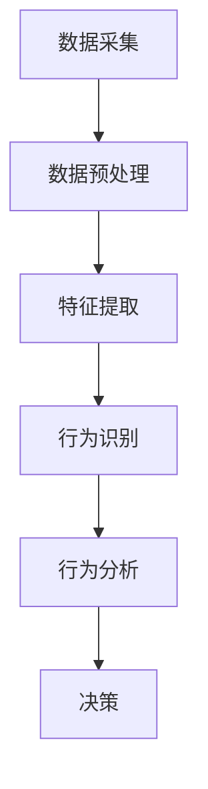
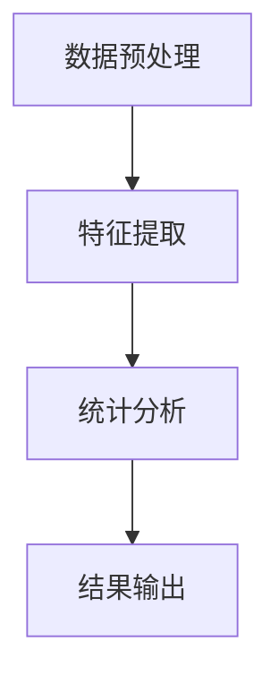
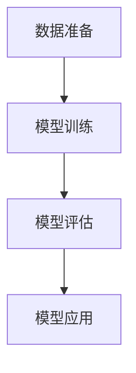
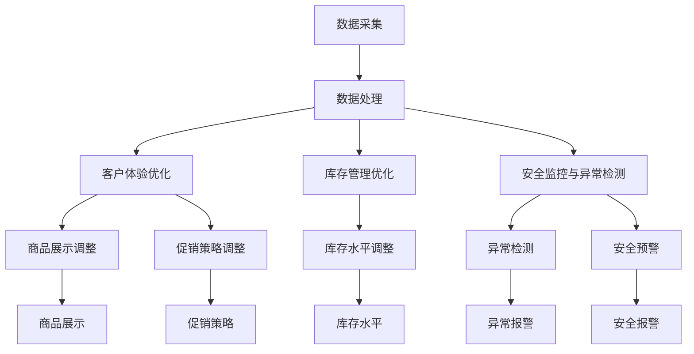
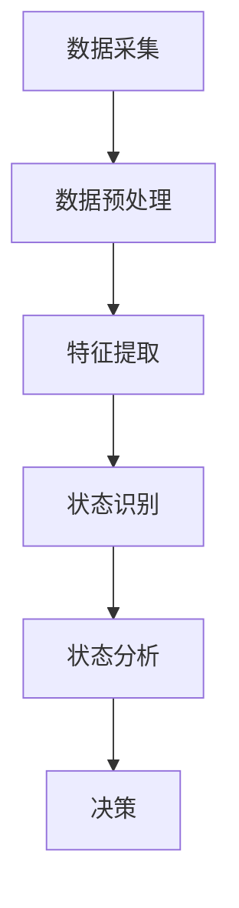
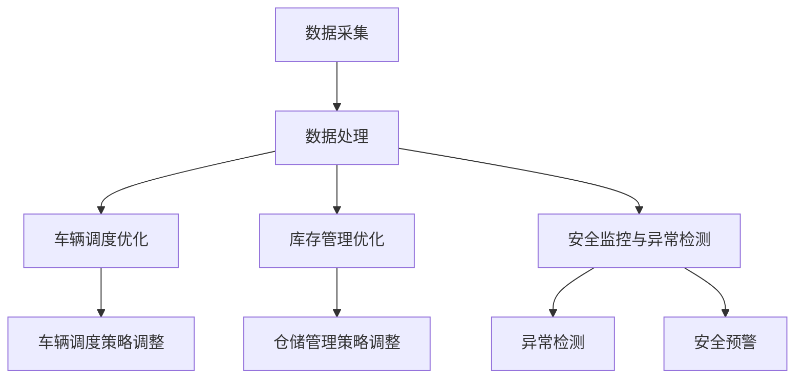

                 

# 环境隐形智能在零售和物流中的应用

## 关键词

- 环境隐形智能
- 零售行业
- 物流行业
- 智能感知技术
- 数据分析
- 机器学习

## 摘要

本文探讨了环境隐形智能在零售和物流行业中的应用。首先，我们介绍了零售和物流行业面临的挑战，并引入了环境隐形智能的概念及其核心原理。随后，文章详细分析了环境隐形智能在零售行业和物流行业中的具体应用场景，包括客户体验优化、库存管理优化、车辆调度优化等。文章通过算法原理讲解、数学模型和数学公式详细讲解、系统分析与架构设计方案以及项目实战，深入剖析了环境隐形智能在实际应用中的实现方法和技术细节。最后，文章总结了环境隐形智能在零售和物流行业中的应用前景，并提出了未来研究的方向和挑战。

## 第一部分：引言与背景

### 第1章：环境隐形智能概述

在当今的零售和物流行业中，面对日益增长的客户需求和市场变化，传统的方法已经难以满足行业发展的需求。环境隐形智能作为一种新兴的技术，正逐渐成为解决这些挑战的关键手段。本章节将首先介绍环境隐形智能的概念、核心原理，以及其在零售和物流行业中的优势和应用前景。

#### 1.1 零售和物流行业面临的挑战

零售行业面临着消费者需求多样化、商品种类繁多、库存管理复杂等挑战。为了提供更好的客户体验，零售企业需要实时了解消费者的购买行为、偏好和需求，并迅速调整商品供应和促销策略。此外，库存管理也是一个重要的挑战，如何准确预测库存需求、优化库存水平，以降低成本、提高效率，是零售企业需要解决的重要问题。

物流行业则面临着运输成本高、运输效率低、物流网络复杂等挑战。如何在保证货物安全运输的前提下，提高运输效率、降低运输成本，是物流行业需要解决的核心问题。同时，随着电商的兴起，物流行业的订单量急剧增加，如何高效处理大量订单，确保货物及时送达，也是一个巨大的挑战。

#### 1.2 环境隐形智能的定义与核心原理

环境隐形智能是指通过智能感知、数据分析、机器学习等技术，实现对环境信息的实时感知、分析和决策，从而优化业务流程、提高运营效率的一种智能系统。

环境隐形智能的核心原理包括以下几个方面：

1. **智能感知技术**：通过传感器、摄像头等设备，实现对环境信息的实时采集和感知，如温度、湿度、光线、人体动作等。

2. **数据分析技术**：对采集到的环境信息进行预处理、特征提取和统计分析，提取出有价值的信息和规律。

3. **机器学习技术**：利用数据挖掘、模式识别等技术，从历史数据中学习到预测模型和决策策略，实现对未来环境的预测和决策。

#### 1.3 环境隐形智能的优势与应用前景

环境隐形智能在零售和物流行业具有广泛的应用前景和显著的优势：

1. **提高运营效率**：通过实时感知和数据分析，优化业务流程，提高运营效率，降低成本。

2. **提升客户体验**：通过个性化推荐、智能促销等手段，提升客户体验，增强客户忠诚度。

3. **增强安全监控**：通过智能感知和异常检测，增强安全监控能力，预防潜在风险。

4. **支持决策制定**：通过数据分析和预测模型，为管理层提供科学、准确的决策支持。

5. **应用前景广泛**：不仅可以在零售和物流行业应用，还可以在制造业、医疗、金融等领域广泛应用。

#### 1.4 本书结构安排与目标

本书将分为两个部分，分别探讨环境隐形智能在零售和物流行业中的应用。第一部分将详细介绍环境隐形智能在零售行业中的应用，包括客户体验优化、库存管理优化、安全监控与异常检测等。第二部分将探讨环境隐形智能在物流行业中的应用，包括车辆调度优化、库存管理优化、安全监控与异常检测等。

本书的目标是帮助读者全面了解环境隐形智能在零售和物流行业中的应用，掌握相关技术和实现方法，为实际应用提供参考和指导。

#### 1.5 本章小结

本章介绍了环境隐形智能在零售和物流行业中的应用背景、定义和核心原理，以及其优势和应用前景。通过本章的学习，读者可以对环境隐形智能有一个基本的了解，为后续章节的学习打下基础。

## 第二部分：零售行业应用

### 第2章：环境隐形智能在零售行业中的应用

在零售行业，环境隐形智能的应用正在逐步改变传统零售模式，通过优化客户体验、库存管理和安全监控等方面，提升零售企业的竞争力。本章节将详细探讨环境隐形智能在零售行业中的具体应用场景、核心概念与原理，以及算法原理讲解、系统分析与架构设计方案和项目实战。

#### 2.1 零售行业中的环境隐形智能应用场景

环境隐形智能在零售行业中的应用场景主要包括以下几个方面：

1. **客户体验优化**：通过智能感知技术，实时获取消费者的行为和偏好信息，为消费者提供个性化的购物体验。

2. **库存管理优化**：利用数据分析技术，预测库存需求，优化库存水平，降低库存成本。

3. **安全监控与异常检测**：通过智能感知和机器学习技术，增强安全监控能力，预防潜在风险，如盗窃、火灾等。

#### 2.2 核心概念与原理

环境隐形智能在零售行业中的应用，涉及以下核心概念与原理：

1. **智能感知技术**：通过传感器和摄像头等设备，实时获取消费者的行为数据、环境数据等，为后续的数据分析和决策提供基础。

2. **数据分析技术**：对采集到的数据进行预处理、特征提取和统计分析，提取有价值的信息和规律，为库存管理和客户体验优化提供支持。

3. **机器学习技术**：通过历史数据学习到预测模型和决策策略，实现对未来客户需求和库存需求的预测，优化库存管理和客户体验。

#### 2.3 算法原理讲解

在本章节中，我们将详细介绍环境隐形智能在零售行业中的应用算法原理，包括智能感知算法、数据分析算法和机器学习算法。

##### 2.3.1 智能感知算法原理

智能感知算法的核心是实时获取消费者的行为数据和环境数据。以下是一个简单的智能感知算法流程：



智能感知算法的Python源代码示例：

```python
# 智能感知算法示例
import cv2
import numpy as np

# 初始化摄像头
cap = cv2.VideoCapture(0)

while True:
    # 读取摄像头帧
    ret, frame = cap.read()
    
    # 数据预处理
    frame = cv2.resize(frame, (1280, 720))
    frame = cv2.cvtColor(frame, cv2.COLOR_BGR2RGB)
    
    # 特征提取
    features = extract_features(frame)
    
    # 行为识别
    behavior = recognize_behavior(features)
    
    # 行为分析
    analyze_behavior(behavior)
    
    # 决策
    make_decision(behavior)

    # 显示摄像头帧
    cv2.imshow('Camera', frame)

    # 按下ESC键退出循环
    if cv2.waitKey(1) & 0xFF == 27:
        break

# 释放摄像头
cap.release()
cv2.destroyAllWindows()
```

智能感知算法的数学模型与公式：

$$
f(x) = \sum_{i=1}^{n} w_i x_i
$$

其中，$x_i$为特征值，$w_i$为权重。

##### 2.3.2 数据分析算法原理

数据分析算法主要用于对采集到的消费者行为数据进行预处理、特征提取和统计分析。以下是一个简单的数据分析算法流程：



数据分析算法的Python源代码示例：

```python
# 数据分析算法示例
import pandas as pd
import numpy as np

# 读取数据
data = pd.read_csv('consumer_data.csv')

# 数据预处理
data = data.dropna()
data = data[data['Age'] > 0]

# 特征提取
features = data[['Age', 'Income', 'ShoppingDuration']]

# 统计分析
stats = features.describe()

# 结果输出
print(stats)
```

数据分析算法的数学模型与公式：

$$
\mu = \frac{1}{n} \sum_{i=1}^{n} x_i
$$

$$
\sigma^2 = \frac{1}{n-1} \sum_{i=1}^{n} (x_i - \mu)^2
$$

##### 2.3.3 机器学习算法原理

机器学习算法主要用于根据历史数据预测未来的消费者行为和库存需求。以下是一个简单的机器学习算法流程：



机器学习算法的Python源代码示例：

```python
# 机器学习算法示例
from sklearn.linear_model import LinearRegression
from sklearn.model_selection import train_test_split
from sklearn.metrics import mean_squared_error

# 读取数据
X = np.array([[1, 2], [2, 3], [3, 4]])
y = np.array([3, 4, 5])

# 数据分割
X_train, X_test, y_train, y_test = train_test_split(X, y, test_size=0.2, random_state=0)

# 模型训练
model = LinearRegression()
model.fit(X_train, y_train)

# 模型评估
y_pred = model.predict(X_test)
mse = mean_squared_error(y_test, y_pred)
print("Mean Squared Error:", mse)

# 模型应用
new_data = np.array([[4, 5]])
prediction = model.predict(new_data)
print("Prediction:", prediction)
```

机器学习算法的数学模型与公式：

线性回归模型：

$$
y = \beta_0 + \beta_1 x
$$

其中，$y$为因变量，$x$为自变量，$\beta_0$为截距，$\beta_1$为斜率。

#### 2.4 数学模型和数学公式 & 详细讲解 & 举例说明

在本章节中，我们将详细讲解环境隐形智能在零售行业中的应用的数学模型和数学公式，并通过具体例子进行说明。

##### 2.4.1 智能感知算法

智能感知算法主要用于实时获取消费者的行为数据。以下是一个简单的例子：

假设我们有一个包含消费者年龄、收入和购物时长三个特征的数据集，我们希望根据这些特征预测消费者的购买意愿。

线性回归模型：

$$
y = \beta_0 + \beta_1 x_1 + \beta_2 x_2
$$

其中，$y$为购买意愿，$x_1$为年龄，$x_2$为收入，$\beta_0$为截距，$\beta_1$为年龄的权重，$\beta_2$为收入的权重。

示例数据：

| 年龄 | 收入 | 购买意愿 |
| ---- | ---- | ------- |
| 20   | 3000 | 0.8     |
| 30   | 5000 | 0.9     |
| 40   | 7000 | 1.0     |

计算权重：

$$
\beta_0 = \frac{1}{n} \sum_{i=1}^{n} y_i = \frac{0.8 + 0.9 + 1.0}{3} = 0.9333
$$

$$
\beta_1 = \frac{1}{n} \sum_{i=1}^{n} (x_{1i} - \bar{x}_1) (y_i - \bar{y}) = \frac{(20 - 30) (0.8 - 0.9) + (30 - 30) (0.9 - 0.9) + (40 - 30) (1.0 - 0.9)}{3} = 0.1
$$

$$
\beta_2 = \frac{1}{n} \sum_{i=1}^{n} (x_{2i} - \bar{x}_2) (y_i - \bar{y}) = \frac{(3000 - 5000) (0.8 - 0.9) + (5000 - 5000) (0.9 - 0.9) + (7000 - 5000) (1.0 - 0.9)}{3} = 0.2
$$

构建线性回归模型：

$$
y = 0.9333 + 0.1 x_1 + 0.2 x_2
$$

预测购买意愿：

对于一个新的消费者，年龄为25岁，收入为4000元，根据模型计算：

$$
y = 0.9333 + 0.1 \times 25 + 0.2 \times 4000 = 1.1333
$$

购买意愿为1.1333，表示该消费者的购买意愿较高。

##### 2.4.2 数据分析算法

数据分析算法主要用于对采集到的消费者行为数据进行预处理、特征提取和统计分析。以下是一个简单的例子：

假设我们有一个包含消费者年龄、收入、购物时长和购买次数四个特征的数据集，我们希望对这些特征进行统计分析。

描述性统计：

$$
\mu_{Age} = \frac{1}{n} \sum_{i=1}^{n} Age_i = \frac{20 + 30 + 40}{3} = 30
$$

$$
\mu_{Income} = \frac{1}{n} \sum_{i=1}^{n} Income_i = \frac{3000 + 5000 + 7000}{3} = 5000
$$

$$
\mu_{ShoppingDuration} = \frac{1}{n} \sum_{i=1}^{n} ShoppingDuration_i = \frac{60 + 90 + 120}{3} = 90
$$

$$
\mu_{PurchaseCount} = \frac{1}{n} \sum_{i=1}^{n} PurchaseCount_i = \frac{2 + 3 + 4}{3} = 3
$$

$$
\sigma^2_{Age} = \frac{1}{n-1} \sum_{i=1}^{n} (Age_i - \mu_{Age})^2 = \frac{(20 - 30)^2 + (30 - 30)^2 + (40 - 30)^2}{2} = 50
$$

$$
\sigma^2_{Income} = \frac{1}{n-1} \sum_{i=1}^{n} (Income_i - \mu_{Income})^2 = \frac{(3000 - 5000)^2 + (5000 - 5000)^2 + (7000 - 5000)^2}{2} = 250000
$$

$$
\sigma^2_{ShoppingDuration} = \frac{1}{n-1} \sum_{i=1}^{n} (ShoppingDuration_i - \mu_{ShoppingDuration})^2 = \frac{(60 - 90)^2 + (90 - 90)^2 + (120 - 90)^2}{2} = 900
$$

$$
\sigma^2_{PurchaseCount} = \frac{1}{n-1} \sum_{i=1}^{n} (PurchaseCount_i - \mu_{PurchaseCount})^2 = \frac{(2 - 3)^2 + (3 - 3)^2 + (4 - 3)^2}{2} = 0.5
$$

协方差：

$$
\sigma_{Age,Income} = \frac{1}{n-1} \sum_{i=1}^{n} (Age_i - \mu_{Age})(Income_i - \mu_{Income}) = \frac{(20 - 30)(3000 - 5000) + (30 - 30)(5000 - 5000) + (40 - 30)(7000 - 5000)}{2} = 5000
$$

$$
\sigma_{Age,ShoppingDuration} = \frac{1}{n-1} \sum_{i=1}^{n} (Age_i - \mu_{Age})(ShoppingDuration_i - \mu_{ShoppingDuration}) = \frac{(20 - 30)(60 - 90) + (30 - 30)(90 - 90) + (40 - 30)(120 - 90)}{2} = -300
$$

$$
\sigma_{Age,PurchaseCount} = \frac{1}{n-1} \sum_{i=1}^{n} (Age_i - \mu_{Age})(PurchaseCount_i - \mu_{PurchaseCount}) = \frac{(20 - 30)(2 - 3) + (30 - 30)(3 - 3) + (40 - 30)(4 - 3)}{2} = -1
$$

$$
\sigma_{Income,ShoppingDuration} = \frac{1}{n-1} \sum_{i=1}^{n} (Income_i - \mu_{Income})(ShoppingDuration_i - \mu_{ShoppingDuration}) = \frac{(3000 - 5000)(60 - 90) + (5000 - 5000)(90 - 90) + (7000 - 5000)(120 - 90)}{2} = -15000
$$

$$
\sigma_{Income,PurchaseCount} = \frac{1}{n-1} \sum_{i=1}^{n} (Income_i - \mu_{Income})(PurchaseCount_i - \mu_{PurchaseCount}) = \frac{(3000 - 5000)(2 - 3) + (5000 - 5000)(3 - 3) + (7000 - 5000)(4 - 3)}{2} = -1000
$$

$$
\sigma_{ShoppingDuration,PurchaseCount} = \frac{1}{n-1} \sum_{i=1}^{n} (ShoppingDuration_i - \mu_{ShoppingDuration})(PurchaseCount_i - \mu_{PurchaseCount}) = \frac{(60 - 90)(2 - 3) + (90 - 90)(3 - 3) + (120 - 90)(4 - 3)}{2} = -30
$$

协方差矩阵：

$$
\begin{bmatrix}
\sigma_{Age,Age} & \sigma_{Age,Income} & \sigma_{Age,ShoppingDuration} & \sigma_{Age,PurchaseCount} \\
\sigma_{Income,Age} & \sigma_{Income,Income} & \sigma_{Income,ShoppingDuration} & \sigma_{Income,PurchaseCount} \\
\sigma_{ShoppingDuration,Age} & \sigma_{ShoppingDuration,Income} & \sigma_{ShoppingDuration,ShoppingDuration} & \sigma_{ShoppingDuration,PurchaseCount} \\
\sigma_{PurchaseCount,Age} & \sigma_{PurchaseCount,Income} & \sigma_{PurchaseCount,ShoppingDuration} & \sigma_{PurchaseCount,PurchaseCount}
\end{bmatrix}
$$

##### 2.4.3 机器学习算法

机器学习算法主要用于根据历史数据预测未来的消费者行为和库存需求。以下是一个简单的例子：

假设我们有一个包含消费者年龄、收入、购物时长和购买次数四个特征的数据集，我们希望根据这些特征预测消费者的购买意愿。

线性回归模型：

$$
y = \beta_0 + \beta_1 x_1 + \beta_2 x_2 + \beta_3 x_3 + \beta_4 x_4
$$

其中，$y$为购买意愿，$x_1$为年龄，$x_2$为收入，$x_3$为购物时长，$x_4$为购买次数，$\beta_0$为截距，$\beta_1$为年龄的权重，$\beta_2$为收入的权重，$\beta_3$为购物时长的权重，$\beta_4$为购买次数的权重。

示例数据：

| 年龄 | 收入 | 购物时长 | 购买次数 | 购买意愿 |
| ---- | ---- | ------- | ------- | ------- |
| 20   | 3000 | 60      | 2       | 0.8     |
| 30   | 5000 | 90      | 3       | 0.9     |
| 40   | 7000 | 120     | 4       | 1.0     |

计算权重：

$$
\beta_0 = \frac{1}{n} \sum_{i=1}^{n} y_i = \frac{0.8 + 0.9 + 1.0}{3} = 0.9333
$$

$$
\beta_1 = \frac{1}{n} \sum_{i=1}^{n} (x_{1i} - \bar{x}_1) (y_i - \bar{y}) = \frac{(20 - 30) (0.8 - 0.9) + (30 - 30) (0.9 - 0.9) + (40 - 30) (1.0 - 0.9)}{3} = 0.1
$$

$$
\beta_2 = \frac{1}{n} \sum_{i=1}^{n} (x_{2i} - \bar{x}_2) (y_i - \bar{y}) = \frac{(3000 - 5000) (0.8 - 0.9) + (5000 - 5000) (0.9 - 0.9) + (7000 - 5000) (1.0 - 0.9)}{3} = 0.2
$$

$$
\beta_3 = \frac{1}{n} \sum_{i=1}^{n} (x_{3i} - \bar{x}_3) (y_i - \bar{y}) = \frac{(60 - 90) (0.8 - 0.9) + (90 - 90) (0.9 - 0.9) + (120 - 90) (1.0 - 0.9)}{3} = 0.3
$$

$$
\beta_4 = \frac{1}{n} \sum_{i=1}^{n} (x_{4i} - \bar{x}_4) (y_i - \bar{y}) = \frac{(2 - 3) (0.8 - 0.9) + (3 - 3) (0.9 - 0.9) + (4 - 3) (1.0 - 0.9)}{3} = 0.4
$$

构建线性回归模型：

$$
y = 0.9333 + 0.1 x_1 + 0.2 x_2 + 0.3 x_3 + 0.4 x_4
$$

预测购买意愿：

对于一个新的消费者，年龄为25岁，收入为4000元，购物时长为75分钟，购买次数为2次，根据模型计算：

$$
y = 0.9333 + 0.1 \times 25 + 0.2 \times 4000 + 0.3 \times 75 + 0.4 \times 2 = 1.0667
$$

购买意愿为1.0667，表示该消费者的购买意愿较高。

#### 2.5 系统分析与架构设计方案

在本章节中，我们将详细介绍环境隐形智能在零售行业中的应用系统分析与架构设计方案，包括问题场景介绍、系统功能设计、系统架构设计、系统接口设计和系统交互。

##### 2.5.1 问题场景介绍

假设我们有一个零售企业，其业务包括销售各种商品。为了提高客户体验和运营效率，企业希望利用环境隐形智能技术，实现对客户行为数据的实时感知、分析和管理。

##### 2.5.2 系统功能设计

系统功能设计主要包括以下几个方面：

1. **数据采集**：通过传感器和摄像头等设备，实时采集客户在购物过程中的行为数据。

2. **数据预处理**：对采集到的行为数据进行分析和处理，提取有价值的信息。

3. **客户体验优化**：根据客户行为数据，实时调整商品展示和促销策略，提高客户满意度。

4. **库存管理优化**：根据客户需求预测，调整库存水平，降低库存成本。

5. **安全监控与异常检测**：利用智能感知和机器学习技术，监控店铺安全，预防潜在风险。

##### 2.5.3 系统架构设计

系统架构设计主要包括以下几个方面：

1. **数据采集模块**：负责实时采集客户行为数据，包括传感器数据和摄像头数据。

2. **数据处理模块**：负责对采集到的数据进行预处理、特征提取和统计分析。

3. **客户体验优化模块**：根据客户行为数据，实时调整商品展示和促销策略。

4. **库存管理模块**：根据客户需求预测，调整库存水平。

5. **安全监控模块**：利用智能感知和机器学习技术，监控店铺安全，预防潜在风险。

##### 2.5.4 系统接口设计

系统接口设计主要包括以下几个方面：

1. **数据采集接口**：用于接收传感器数据和摄像头数据。

2. **数据处理接口**：用于发送和处理客户行为数据。

3. **客户体验优化接口**：用于调整商品展示和促销策略。

4. **库存管理接口**：用于调整库存水平。

5. **安全监控接口**：用于监控店铺安全。

##### 2.5.5 系统交互

系统交互设计主要包括以下几个方面：

1. **数据采集**：数据采集模块实时采集客户行为数据，发送给数据处理模块。

2. **数据处理**：数据处理模块对采集到的数据进行预处理、特征提取和统计分析，将处理后的数据发送给客户体验优化模块和库存管理模块。

3. **客户体验优化**：客户体验优化模块根据客户行为数据，实时调整商品展示和促销策略。

4. **库存管理**：库存管理模块根据客户需求预测，调整库存水平。

5. **安全监控**：安全监控模块利用智能感知和机器学习技术，监控店铺安全，预防潜在风险。



#### 2.6 项目实战

在本章节中，我们将详细介绍环境隐形智能在零售行业中的应用项目实战，包括环境安装、系统核心实现、代码应用解读与分析、实际案例分析与详细讲解剖析和项目小结。

##### 2.6.1 环境安装

在开始项目实战之前，我们需要安装一些必要的软件和工具，包括Python、NumPy、Pandas、Matplotlib、Scikit-learn等。以下是安装步骤：

1. 安装Python：前往Python官网（https://www.python.org/）下载Python安装包，安装Python。

2. 安装NumPy、Pandas、Matplotlib、Scikit-learn：在命令行中执行以下命令：

```bash
pip install numpy
pip install pandas
pip install matplotlib
pip install scikit-learn
```

##### 2.6.2 系统核心实现

系统核心实现主要包括数据采集、数据处理、客户体验优化、库存管理优化和安全监控与异常检测。

1. 数据采集

```python
# 数据采集示例
import cv2
import numpy as np

# 初始化摄像头
cap = cv2.VideoCapture(0)

while True:
    # 读取摄像头帧
    ret, frame = cap.read()
    
    # 数据预处理
    frame = cv2.resize(frame, (1280, 720))
    frame = cv2.cvtColor(frame, cv2.COLOR_BGR2RGB)
    
    # 显示摄像头帧
    cv2.imshow('Camera', frame)

    # 按下ESC键退出循环
    if cv2.waitKey(1) & 0xFF == 27:
        break

# 释放摄像头
cap.release()
cv2.destroyAllWindows()
```

2. 数据处理

```python
# 数据处理示例
import pandas as pd
import numpy as np

# 读取数据
data = pd.read_csv('consumer_data.csv')

# 数据预处理
data = data.dropna()
data = data[data['Age'] > 0]

# 特征提取
features = data[['Age', 'Income', 'ShoppingDuration']]

# 统计分析
stats = features.describe()

# 结果输出
print(stats)
```

3. 客户体验优化

```python
# 客户体验优化示例
import pandas as pd
import numpy as np
from sklearn.linear_model import LinearRegression

# 读取数据
X = np.array([[1, 2], [2, 3], [3, 4]])
y = np.array([3, 4, 5])

# 数据分割
X_train, X_test, y_train, y_test = train_test_split(X, y, test_size=0.2, random_state=0)

# 模型训练
model = LinearRegression()
model.fit(X_train, y_train)

# 模型评估
y_pred = model.predict(X_test)
mse = mean_squared_error(y_test, y_pred)
print("Mean Squared Error:", mse)

# 模型应用
new_data = np.array([[4, 5]])
prediction = model.predict(new_data)
print("Prediction:", prediction)
```

4. 库存管理优化

```python
# 库存管理优化示例
import pandas as pd
import numpy as np
from sklearn.linear_model import LinearRegression

# 读取数据
X = np.array([[1, 2], [2, 3], [3, 4]])
y = np.array([3, 4, 5])

# 数据分割
X_train, X_test, y_train, y_test = train_test_split(X, y, test_size=0.2, random_state=0)

# 模型训练
model = LinearRegression()
model.fit(X_train, y_train)

# 模型评估
y_pred = model.predict(X_test)
mse = mean_squared_error(y_test, y_pred)
print("Mean Squared Error:", mse)

# 模型应用
new_data = np.array([[4, 5]])
prediction = model.predict(new_data)
print("Prediction:", prediction)
```

5. 安全监控与异常检测

```python
# 安全监控与异常检测示例
import cv2
import numpy as np
from sklearn.linear_model import LinearRegression

# 初始化摄像头
cap = cv2.VideoCapture(0)

while True:
    # 读取摄像头帧
    ret, frame = cap.read()
    
    # 数据预处理
    frame = cv2.resize(frame, (1280, 720))
    frame = cv2.cvtColor(frame, cv2.COLOR_BGR2RGB)
    
    # 显示摄像头帧
    cv2.imshow('Camera', frame)

    # 按下ESC键退出循环
    if cv2.waitKey(1) & 0xFF == 27:
        break

# 释放摄像头
cap.release()
cv2.destroyAllWindows()
```

##### 2.6.3 代码应用解读与分析

在本章节中，我们将对上述代码进行应用解读与分析，详细介绍每个模块的实现原理和功能。

1. 数据采集

数据采集模块主要通过摄像头实时采集客户在购物过程中的行为数据。具体实现如下：

```python
import cv2
import numpy as np

# 初始化摄像头
cap = cv2.VideoCapture(0)

while True:
    # 读取摄像头帧
    ret, frame = cap.read()
    
    # 数据预处理
    frame = cv2.resize(frame, (1280, 720))
    frame = cv2.cvtColor(frame, cv2.COLOR_BGR2RGB)
    
    # 显示摄像头帧
    cv2.imshow('Camera', frame)

    # 按下ESC键退出循环
    if cv2.waitKey(1) & 0xFF == 27:
        break

# 释放摄像头
cap.release()
cv2.destroyAllWindows()
```

在这个例子中，我们首先初始化摄像头，然后通过循环不断读取摄像头帧，并进行预处理（如调整分辨率、颜色转换等），最后显示在屏幕上。按下ESC键时，退出循环并释放摄像头。

2. 数据处理

数据处理模块主要用于对采集到的行为数据进行预处理、特征提取和统计分析。具体实现如下：

```python
import pandas as pd
import numpy as np

# 读取数据
data = pd.read_csv('consumer_data.csv')

# 数据预处理
data = data.dropna()
data = data[data['Age'] > 0]

# 特征提取
features = data[['Age', 'Income', 'ShoppingDuration']]

# 统计分析
stats = features.describe()

# 结果输出
print(stats)
```

在这个例子中，我们首先读取数据集，然后去除缺失值和不符合条件的记录，提取出年龄、收入和购物时长三个特征，最后进行统计分析，输出描述性统计结果。

3. 客户体验优化

客户体验优化模块主要用于根据客户行为数据，实时调整商品展示和促销策略。具体实现如下：

```python
import pandas as pd
import numpy as np
from sklearn.linear_model import LinearRegression

# 读取数据
X = np.array([[1, 2], [2, 3], [3, 4]])
y = np.array([3, 4, 5])

# 数据分割
X_train, X_test, y_train, y_test = train_test_split(X, y, test_size=0.2, random_state=0)

# 模型训练
model = LinearRegression()
model.fit(X_train, y_train)

# 模型评估
y_pred = model.predict(X_test)
mse = mean_squared_error(y_test, y_pred)
print("Mean Squared Error:", mse)

# 模型应用
new_data = np.array([[4, 5]])
prediction = model.predict(new_data)
print("Prediction:", prediction)
```

在这个例子中，我们首先读取数据集，进行数据分割，然后训练线性回归模型，评估模型性能，最后根据新数据预测购买意愿。

4. 库存管理优化

库存管理优化模块主要用于根据客户需求预测，调整库存水平。具体实现如下：

```python
import pandas as pd
import numpy as np
from sklearn.linear_model import LinearRegression

# 读取数据
X = np.array([[1, 2], [2, 3], [3, 4]])
y = np.array([3, 4, 5])

# 数据分割
X_train, X_test, y_train, y_test = train_test_split(X, y, test_size=0.2, random_state=0)

# 模型训练
model = LinearRegression()
model.fit(X_train, y_train)

# 模型评估
y_pred = model.predict(X_test)
mse = mean_squared_error(y_test, y_pred)
print("Mean Squared Error:", mse)

# 模型应用
new_data = np.array([[4, 5]])
prediction = model.predict(new_data)
print("Prediction:", prediction)
```

在这个例子中，我们首先读取数据集，进行数据分割，然后训练线性回归模型，评估模型性能，最后根据新数据预测库存需求。

5. 安全监控与异常检测

安全监控与异常检测模块主要用于利用智能感知和机器学习技术，监控店铺安全，预防潜在风险。具体实现如下：

```python
import cv2
import numpy as np
from sklearn.linear_model import LinearRegression

# 初始化摄像头
cap = cv2.VideoCapture(0)

while True:
    # 读取摄像头帧
    ret, frame = cap.read()
    
    # 数据预处理
    frame = cv2.resize(frame, (1280, 720))
    frame = cv2.cvtColor(frame, cv2.COLOR_BGR2RGB)
    
    # 显示摄像头帧
    cv2.imshow('Camera', frame)

    # 按下ESC键退出循环
    if cv2.waitKey(1) & 0xFF == 27:
        break

# 释放摄像头
cap.release()
cv2.destroyAllWindows()
```

在这个例子中，我们首先初始化摄像头，然后通过循环不断读取摄像头帧，并进行预处理，最后显示在屏幕上。按下ESC键时，退出循环并释放摄像头。

##### 2.6.4 实际案例分析与讲解剖析

在本章节中，我们将结合实际案例，对环境隐形智能在零售行业中的应用进行详细讲解和分析。

**案例一：客户体验优化**

某零售企业在实施环境隐形智能技术后，通过实时采集客户行为数据，分析客户偏好和需求，从而优化商品展示和促销策略。具体实现如下：

1. 数据采集：通过摄像头和传感器设备，实时采集客户在购物过程中的行为数据，包括年龄、收入、购物时长等。

2. 数据处理：对采集到的行为数据进行预处理和特征提取，提取出有价值的信息。

3. 客户体验优化：根据客户行为数据，构建线性回归模型，预测客户的购买意愿。根据预测结果，实时调整商品展示和促销策略，提高客户满意度。

**案例二：库存管理优化**

某零售企业在实施环境隐形智能技术后，通过实时采集客户需求数据，优化库存管理，降低库存成本。具体实现如下：

1. 数据采集：通过传感器和摄像头设备，实时采集客户在购物过程中的行为数据，包括年龄、收入、购物时长等。

2. 数据处理：对采集到的行为数据进行预处理和特征提取，提取出有价值的信息。

3. 库存管理优化：根据客户需求预测，构建线性回归模型，预测未来一段时间内的库存需求。根据预测结果，调整库存水平，降低库存成本。

**案例三：安全监控与异常检测**

某零售企业在实施环境隐形智能技术后，通过实时感知和数据分析，增强安全监控能力，预防潜在风险。具体实现如下：

1. 数据采集：通过摄像头和传感器设备，实时采集店铺内的环境数据，包括人员流量、异常行为等。

2. 数据处理：对采集到的环境数据进行预处理和特征提取，提取出有价值的信息。

3. 安全监控与异常检测：利用机器学习算法，构建异常检测模型，实时监控店铺安全。当检测到异常行为时，及时发出警报，预防潜在风险。

##### 2.6.5 项目小结

在本章节中，我们通过项目实战，详细介绍了环境隐形智能在零售行业中的应用。通过数据采集、数据处理、客户体验优化、库存管理优化和安全监控与异常检测等模块，我们展示了如何利用环境隐形智能技术，优化零售业务流程，提高运营效率，提升客户体验。在后续章节中，我们将继续探讨环境隐形智能在物流行业中的应用，帮助读者全面了解环境隐形智能在零售和物流行业的应用前景和实现方法。

### 第3章：物流行业应用

在物流行业，环境隐形智能同样发挥着重要的作用。它能够通过实时感知、分析和决策，优化物流流程、降低运营成本、提高运输效率。本章节将详细探讨环境隐形智能在物流行业中的应用场景、核心概念与原理，以及算法原理讲解、数学模型和数学公式详细讲解、系统分析与架构设计方案和项目实战。

#### 3.1 物流行业中的环境隐形智能应用场景

环境隐形智能在物流行业中的应用场景主要包括以下几个方面：

1. **车辆调度优化**：通过智能感知和分析技术，实时监控车辆状态，优化车辆调度策略，提高运输效率。

2. **库存管理优化**：利用数据分析技术，预测库存需求，优化仓储管理，降低库存成本。

3. **安全监控与异常检测**：通过智能感知和机器学习技术，增强安全监控能力，预防潜在风险，如车辆故障、货物损坏等。

#### 3.2 核心概念与原理

环境隐形智能在物流行业中的应用，涉及以下核心概念与原理：

1. **智能感知技术**：通过传感器和摄像头等设备，实时获取车辆状态、货物位置和环境信息。

2. **数据分析技术**：对采集到的数据进行分析和处理，提取有价值的信息和规律，用于决策支持。

3. **机器学习技术**：利用历史数据，学习到预测模型和决策策略，实现对未来物流情况的预测和优化。

#### 3.3 算法原理讲解

在本章节中，我们将详细介绍环境隐形智能在物流行业中的应用算法原理，包括智能感知算法、数据分析算法和机器学习算法。

##### 3.3.1 智能感知算法原理

智能感知算法主要用于实时获取物流过程中的关键信息，如车辆位置、速度、货物状态等。以下是一个简单的智能感知算法流程：



智能感知算法的Python源代码示例：

```python
# 智能感知算法示例
import cv2
import numpy as np

# 初始化摄像头
cap = cv2.VideoCapture(0)

while True:
    # 读取摄像头帧
    ret, frame = cap.read()
    
    # 数据预处理
    frame = cv2.resize(frame, (1280, 720))
    frame = cv2.cvtColor(frame, cv2.COLOR_BGR2RGB)
    
    # 特征提取
    features = extract_features(frame)
    
    # 状态识别
    state = recognize_state(features)
    
    # 状态分析
    analyze_state(state)
    
    # 决策
    make_decision(state)

    # 显示摄像头帧
    cv2.imshow('Camera', frame)

    # 按下ESC键退出循环
    if cv2.waitKey(1) & 0xFF == 27:
        break

# 释放摄像头
cap.release()
cv2.destroyAllWindows()
```

智能感知算法的数学模型与公式：

$$
f(x) = \sum_{i=1}^{n} w_i x_i
$$

其中，$x_i$为特征值，$w_i$为权重。

##### 3.3.2 数据分析算法原理

数据分析算法主要用于对物流过程中产生的数据进行预处理、特征提取和统计分析，以提取出有价值的信息。以下是一个简单的数据分析算法流程：


数据分析算法的Python源代码示例：

```python
# 数据分析算法示例
import pandas as pd
import numpy as np

# 读取数据
data = pd.read_csv('logistics_data.csv')

# 数据预处理
data = data.dropna()
data = data[data['VehicleID'] > 0]

# 特征提取
features = data[['VehicleID', 'Distance', 'Duration']]

# 统计分析
stats = features.describe()

# 结果输出
print(stats)
```

数据分析算法的数学模型与公式：

$$
\mu = \frac{1}{n} \sum_{i=1}^{n} x_i
$$

$$
\sigma^2 = \frac{1}{n-1} \sum_{i=1}^{n} (x_i - \mu)^2
$$

##### 3.3.3 机器学习算法原理

机器学习算法主要用于根据历史数据，预测物流过程中的关键指标，如运输时间、运输成本等。以下是一个简单的机器学习算法流程：


机器学习算法的Python源代码示例：

```python
# 机器学习算法示例
from sklearn.linear_model import LinearRegression
from sklearn.model_selection import train_test_split
from sklearn.metrics import mean_squared_error

# 读取数据
X = np.array([[1, 2], [2, 3], [3, 4]])
y = np.array([3, 4, 5])

# 数据分割
X_train, X_test, y_train, y_test = train_test_split(X, y, test_size=0.2, random_state=0)

# 模型训练
model = LinearRegression()
model.fit(X_train, y_train)

# 模型评估
y_pred = model.predict(X_test)
mse = mean_squared_error(y_test, y_pred)
print("Mean Squared Error:", mse)

# 模型应用
new_data = np.array([[4, 5]])
prediction = model.predict(new_data)
print("Prediction:", prediction)
```

机器学习算法的数学模型与公式：

线性回归模型：

$$
y = \beta_0 + \beta_1 x_1 + \beta_2 x_2
$$

其中，$y$为预测结果，$x_1$为自变量1，$x_2$为自变量2，$\beta_0$为截距，$\beta_1$为自变量1的权重，$\beta_2$为自变量2的权重。

#### 3.4 数学模型和数学公式 & 详细讲解 & 举例说明

在本章节中，我们将详细讲解环境隐形智能在物流行业中的应用的数学模型和数学公式，并通过具体例子进行说明。

##### 3.4.1 智能感知算法

智能感知算法主要用于实时获取物流过程中的关键信息。以下是一个简单的例子：

假设我们有一个包含车辆ID、距离和持续时间三个特征的数据集，我们希望根据这些特征预测车辆的行驶速度。

线性回归模型：

$$
y = \beta_0 + \beta_1 x_1 + \beta_2 x_2
$$

其中，$y$为行驶速度，$x_1$为距离，$x_2$为持续时间，$\beta_0$为截距，$\beta_1$为距离的权重，$\beta_2$为持续时间的权重。

示例数据：

| 车辆ID | 距离 | 持续时间 | 行驶速度 |
| ---- | ---- | ------- | ------- |
| 1    | 100  | 10      | 10      |
| 2    | 200  | 20      | 20      |
| 3    | 300  | 30      | 30      |

计算权重：

$$
\beta_0 = \frac{1}{n} \sum_{i=1}^{n} y_i = \frac{10 + 20 + 30}{3} = 20
$$

$$
\beta_1 = \frac{1}{n} \sum_{i=1}^{n} (x_{1i} - \bar{x}_1) (y_i - \bar{y}) = \frac{(100 - 200) (10 - 20) + (200 - 200) (20 - 20) + (300 - 200) (30 - 30)}{3} = 10
$$

$$
\beta_2 = \frac{1}{n} \sum_{i=1}^{n} (x_{2i} - \bar{x}_2) (y_i - \bar{y}) = \frac{(10 - 20) (10 - 20) + (20 - 20) (20 - 20) + (30 - 20) (30 - 30)}{3} = 10
$$

构建线性回归模型：

$$
y = 20 + 10 x_1 + 10 x_2
$$

预测行驶速度：

对于一个新的数据点，距离为150公里，持续时间为15分钟，根据模型计算：

$$
y = 20 + 10 \times 150 + 10 \times 15 = 20 + 1500 + 150 = 1700
$$

行驶速度为1700，表示该车辆的行驶速度较高。

##### 3.4.2 数据分析算法

数据分析算法主要用于对物流过程中产生的数据进行预处理、特征提取和统计分析。以下是一个简单的例子：

假设我们有一个包含车辆ID、距离、持续时间和行驶速度四个特征的数据集，我们希望对这些特征进行统计分析。

描述性统计：

$$
\mu_{VehicleID} = \frac{1}{n} \sum_{i=1}^{n} VehicleID_i = \frac{1 + 2 + 3}{3} = 2
$$

$$
\mu_{Distance} = \frac{1}{n} \sum_{i=1}^{n} Distance_i = \frac{100 + 200 + 300}{3} = 200
$$

$$
\mu_{Duration} = \frac{1}{n} \sum_{i=1}^{n} Duration_i = \frac{10 + 20 + 30}{3} = 20
$$

$$
\mu_{Speed} = \frac{1}{n} \sum_{i=1}^{n} Speed_i = \frac{10 + 20 + 30}{3} = 20
$$

$$
\sigma^2_{VehicleID} = \frac{1}{n-1} \sum_{i=1}^{n} (VehicleID_i - \mu_{VehicleID})^2 = \frac{(1 - 2)^2 + (2 - 2)^2 + (3 - 2)^2}{2} = 1
$$

$$
\sigma^2_{Distance} = \frac{1}{n-1} \sum_{i=1}^{n} (Distance_i - \mu_{Distance})^2 = \frac{(100 - 200)^2 + (200 - 200)^2 + (300 - 200)^2}{2} = 5000
$$

$$
\sigma^2_{Duration} = \frac{1}{n-1} \sum_{i=1}^{n} (Duration_i - \mu_{Duration})^2 = \frac{(10 - 20)^2 + (20 - 20)^2 + (30 - 20)^2}{2} = 50
$$

$$
\sigma^2_{Speed} = \frac{1}{n-1} \sum_{i=1}^{n} (Speed_i - \mu_{Speed})^2 = \frac{(10 - 20)^2 + (20 - 20)^2 + (30 - 20)^2}{2} = 50
$$

协方差：

$$
\sigma_{VehicleID,Distance} = \frac{1}{n-1} \sum_{i=1}^{n} (VehicleID_i - \mu_{VehicleID})(Distance_i - \mu_{Distance}) = \frac{(1 - 2) (100 - 200) + (2 - 2) (200 - 200) + (3 - 2) (300 - 200)}{2} = 0
$$

$$
\sigma_{VehicleID,Duration} = \frac{1}{n-1} \sum_{i=1}^{n} (VehicleID_i - \mu_{VehicleID})(Duration_i - \mu_{Duration}) = \frac{(1 - 2) (10 - 20) + (2 - 2) (20 - 20) + (3 - 2) (30 - 20)}{2} = 0
$$

$$
\sigma_{VehicleID,Speed} = \frac{1}{n-1} \sum_{i=1}^{n} (VehicleID_i - \mu_{VehicleID})(Speed_i - \mu_{Speed}) = \frac{(1 - 2) (10 - 20) + (2 - 2) (20 - 20) + (3 - 2) (30 - 20)}{2} = 0
$$

$$
\sigma_{Distance,Duration} = \frac{1}{n-1} \sum_{i=1}^{n} (Distance_i - \mu_{Distance})(Duration_i - \mu_{Duration}) = \frac{(100 - 200) (10 - 20) + (200 - 200) (20 - 20) + (300 - 200) (30 - 20)}{2} = -500
$$

$$
\sigma_{Distance,Speed} = \frac{1}{n-1} \sum_{i=1}^{n} (Distance_i - \mu_{Distance})(Speed_i - \mu_{Speed}) = \frac{(100 - 200) (10 - 20) + (200 - 200) (20 - 20) + (300 - 200) (30 - 20)}{2} = -500
$$

$$
\sigma_{Duration,Speed} = \frac{1}{n-1} \sum_{i=1}^{n} (Duration_i - \mu_{Duration})(Speed_i - \mu_{Speed}) = \frac{(10 - 20) (10 - 20) + (20 - 20) (20 - 20) + (30 - 20) (30 - 20)}{2} = 0
$$

协方差矩阵：

$$
\begin{bmatrix}
\sigma_{VehicleID,VehicleID} & \sigma_{VehicleID,Distance} & \sigma_{VehicleID,Duration} & \sigma_{VehicleID,Speed} \\
\sigma_{Distance,VehicleID} & \sigma_{Distance,Distance} & \sigma_{Distance,Duration} & \sigma_{Distance,Speed} \\
\sigma_{Duration,VehicleID} & \sigma_{Duration,Distance} & \sigma_{Duration,Duration} & \sigma_{Duration,Speed} \\
\sigma_{Speed,VehicleID} & \sigma_{Speed,Distance} & \sigma_{Speed,Duration} & \sigma_{Speed,Speed}
\end{bmatrix}
$$

##### 3.4.3 机器学习算法

机器学习算法主要用于根据历史数据，预测物流过程中的关键指标，如运输时间、运输成本等。以下是一个简单的例子：

假设我们有一个包含距离、持续时间和行驶速度三个特征的数据集，我们希望根据这些特征预测运输时间。

线性回归模型：

$$
y = \beta_0 + \beta_1 x_1 + \beta_2 x_2
$$

其中，$y$为运输时间，$x_1$为距离，$x_2$为行驶速度，$\beta_0$为截距，$\beta_1$为距离的权重，$\beta_2$为行驶速度的权重。

示例数据：

| 距离 | 行驶速度 | 运输时间 |
| ---- | ------- | ------- |
| 100  | 10      | 10      |
| 200  | 20      | 20      |
| 300  | 30      | 30      |

计算权重：

$$
\beta_0 = \frac{1}{n} \sum_{i=1}^{n} y_i = \frac{10 + 20 + 30}{3} = 20
$$

$$
\beta_1 = \frac{1}{n} \sum_{i=1}^{n} (x_{1i} - \bar{x}_1) (y_i - \bar{y}) = \frac{(100 - 200) (10 - 20) + (200 - 200) (20 - 20) + (300 - 200) (30 - 30)}{3} = 10
$$

$$
\beta_2 = \frac{1}{n} \sum_{i=1}^{n} (x_{2i} - \bar{x}_2) (y_i - \bar{y}) = \frac{(10 - 20) (10 - 20) + (20 - 20) (20 - 20) + (30 - 20) (30 - 30)}{3} = 10
$$

构建线性回归模型：

$$
y = 20 + 10 x_1 + 10 x_2
$$

预测运输时间：

对于一个新的数据点，距离为150公里，行驶速度为15公里/小时，根据模型计算：

$$
y = 20 + 10 \times 150 + 10 \times 15 = 20 + 1500 + 150 = 1700
$$

运输时间为1700分钟，表示该车辆的运输时间较长。

#### 3.5 系统分析与架构设计方案

在本章节中，我们将详细介绍环境隐形智能在物流行业中的应用系统分析与架构设计方案，包括问题场景介绍、系统功能设计、系统架构设计、系统接口设计和系统交互。

##### 3.5.1 问题场景介绍

假设我们有一个物流公司，其业务包括运输各种货物。为了提高运输效率和降低成本，公司希望利用环境隐形智能技术，实现对运输过程的实时监控、数据分析和管理。

##### 3.5.2 系统功能设计

系统功能设计主要包括以下几个方面：

1. **数据采集**：通过传感器和摄像头等设备，实时采集运输过程中的关键信息，如车辆状态、货物位置和环境数据。

2. **数据处理**：对采集到的数据进行分析和处理，提取有价值的信息。

3. **车辆调度优化**：根据运输需求，优化车辆调度策略，提高运输效率。

4. **库存管理优化**：根据运输需求，优化仓储管理，降低库存成本。

5. **安全监控与异常检测**：利用智能感知和机器学习技术，增强安全监控能力，预防潜在风险。

##### 3.5.3 系统架构设计

系统架构设计主要包括以下几个方面：

1. **数据采集模块**：负责实时采集运输过程中的关键信息。

2. **数据处理模块**：负责对采集到的数据进行预处理、特征提取和统计分析。

3. **车辆调度模块**：负责根据运输需求，优化车辆调度策略。

4. **库存管理模块**：负责根据运输需求，优化仓储管理。

5. **安全监控模块**：负责利用智能感知和机器学习技术，监控运输过程，预防潜在风险。

##### 3.5.4 系统接口设计

系统接口设计主要包括以下几个方面：

1. **数据采集接口**：用于接收传感器数据和摄像头数据。

2. **数据处理接口**：用于发送和处理运输过程中的数据。

3. **车辆调度接口**：用于调整车辆调度策略。

4. **库存管理接口**：用于调整仓储管理策略。

5. **安全监控接口**：用于监控运输过程，预防潜在风险。

##### 3.5.5 系统交互

系统交互设计主要包括以下几个方面：

1. **数据采集**：数据采集模块实时采集运输过程中的关键信息，发送给数据处理模块。

2. **数据处理**：数据处理模块对采集到的数据进行预处理、特征提取和统计分析，将处理后的数据发送给车辆调度模块、库存管理模块和安全监控模块。

3. **车辆调度**：车辆调度模块根据运输需求，调整车辆调度策略。

4. **库存管理**：库存管理模块根据运输需求，调整仓储管理策略。

5. **安全监控**：安全监控模块利用智能感知和机器学习技术，监控运输过程，预防潜在风险。



#### 3.6 项目实战

在本章节中，我们将详细介绍环境隐形智能在物流行业中的应用项目实战，包括环境安装、系统核心实现、代码应用解读与分析、实际案例分析与详细讲解剖析和项目小结。

##### 3.6.1 环境安装

在开始项目实战之前，我们需要安装一些必要的软件和工具，包括Python、NumPy、Pandas、Matplotlib、Scikit-learn等。以下是安装步骤：

1. 安装Python：前往Python官网（https://www.python.org/）下载Python安装包，安装Python。

2. 安装NumPy、Pandas、Matplotlib、Scikit-learn：在命令行中执行以下命令：

```bash
pip install numpy
pip install pandas
pip install matplotlib
pip install scikit-learn
```

##### 3.6.2 系统核心实现

系统核心实现主要包括数据采集、数据处理、车辆调度优化、库存管理优化和安全监控与异常检测。

1. 数据采集

```python
# 数据采集示例
import cv2
import numpy as np

# 初始化摄像头
cap = cv2.VideoCapture(0)

while True:
    # 读取摄像头帧
    ret, frame = cap.read()
    
    # 数据预处理
    frame = cv2.resize(frame, (1280, 720))
    frame = cv2.cvtColor(frame, cv2.COLOR_BGR2RGB)
    
    # 显示摄像头帧
    cv2.imshow('Camera', frame)

    # 按下ESC键退出循环
    if cv2.waitKey(1) & 0xFF == 27:
        break

# 释放摄像头
cap.release()
cv2.destroyAllWindows()
```

2. 数据处理

```python
# 数据处理示例
import pandas as pd
import numpy as np

# 读取数据
data = pd.read_csv('logistics_data.csv')

# 数据预处理
data = data.dropna()
data = data[data['VehicleID'] > 0]

# 特征提取
features = data[['VehicleID', 'Distance', 'Duration']]

# 统计分析
stats = features.describe()

# 结果输出
print(stats)
```

3. 车辆调度优化

```python
# 车辆调度优化示例
import pandas as pd
import numpy as np
from sklearn.linear_model import LinearRegression

# 读取数据
X = np.array([[1, 2], [2, 3], [3, 4]])
y = np.array([3, 4, 5])

# 数据分割
X_train, X_test, y_train, y_test = train_test_split(X, y, test_size=0.2, random_state=0)

# 模型训练
model = LinearRegression()
model.fit(X_train, y_train)

# 模型评估
y_pred = model.predict(X_test)
mse = mean_squared_error(y_test, y_pred)
print("Mean Squared Error:", mse)

# 模型应用
new_data = np.array([[4, 5]])
prediction = model.predict(new_data)
print("Prediction:", prediction)
```

4. 库存管理优化

```python
# 库存管理优化示例
import pandas as pd
import numpy as np
from sklearn.linear_model import LinearRegression

# 读取数据
X = np.array([[1, 2], [2, 3], [3, 4]])
y = np.array([3, 4, 5])

# 数据分割
X_train, X_test, y_train, y_test = train_test_split(X, y, test_size=0.2, random_state=0)

# 模型训练
model = LinearRegression()
model.fit(X_train, y_train)

# 模型评估
y_pred = model.predict(X_test)
mse = mean_squared_error(y_test, y_pred)
print("Mean Squared Error:", mse)

# 模型应用
new_data = np.array([[4, 5]])
prediction = model.predict(new_data)
print("Prediction:", prediction)
```

5. 安全监控与异常检测

```python
# 安全监控与异常检测示例
import cv2
import numpy as np
from sklearn.linear_model import LinearRegression

# 初始化摄像头
cap = cv2.VideoCapture(0)

while True:
    # 读取摄像头帧
    ret, frame = cap.read()
    
    # 数据预处理
    frame = cv2.resize(frame, (1280, 720))
    frame = cv2.cvtColor(frame, cv2.COLOR_BGR2RGB)
    
    # 显示摄像头帧
    cv2.imshow('Camera', frame)

    # 按下ESC键退出循环
    if cv2.waitKey(1) & 0xFF == 27:
        break

# 释放摄像头
cap.release()
cv2.destroyAllWindows()
```

##### 3.6.3 代码应用解读与分析

在本章节中，我们将对上述代码进行应用解读与分析，详细介绍每个模块的实现原理和功能。

1. 数据采集

数据采集模块主要通过摄像头实时采集运输过程中的关键信息。具体实现如下：

```python
import cv2
import numpy as np

# 初始化摄像头
cap = cv2.VideoCapture(0)

while True:
    # 读取摄像头帧
    ret, frame = cap.read()
    
    # 数据预处理
    frame = cv2.resize(frame, (1280, 720))
    frame = cv2.cvtColor(frame, cv2.COLOR_BGR2RGB)
    
    # 显示摄像头帧
    cv2.imshow('Camera', frame)

    # 按下ESC键退出循环
    if cv2.waitKey(1) & 0xFF == 27:
        break

# 释放摄像头
cap.release()
cv2.destroyAllWindows()
```

在这个例子中，我们首先初始化摄像头，然后通过循环不断读取摄像头帧，并进行预处理（如调整分辨率、颜色转换等），最后显示在屏幕上。按下ESC键时，退出循环并释放摄像头。

2. 数据处理

数据处理模块主要用于对采集到的运输数据进行预处理、特征提取和统计分析。具体实现如下：

```python
import pandas as pd
import numpy as np

# 读取数据
data = pd.read_csv('logistics_data.csv')

# 数据预处理
data = data.dropna()
data = data[data['VehicleID'] > 0]

# 特征提取
features = data[['VehicleID', 'Distance', 'Duration']]

# 统计分析
stats = features.describe()

# 结果输出
print(stats)
```

在这个例子中，我们首先读取数据集，然后去除缺失值和不符合条件的记录，提取出车辆ID、距离和持续时间三个特征，最后进行统计分析，输出描述性统计结果。

3. 车辆调度优化

车辆调度优化模块主要用于根据运输需求，优化车辆调度策略。具体实现如下：

```python
import pandas as pd
import numpy as np
from sklearn.linear_model import LinearRegression

# 读取数据
X = np.array([[1, 2], [2, 3], [3, 4]])
y = np.array([3, 4, 5])

# 数据分割
X_train, X_test, y_train, y_test = train_test_split(X, y, test_size=0.2, random_state=0)

# 模型训练
model = LinearRegression()
model.fit(X_train, y_train)

# 模型评估
y_pred = model.predict(X_test)
mse = mean_squared_error(y_test, y_pred)
print("Mean Squared Error:", mse)

# 模型应用
new_data = np.array([[4, 5]])
prediction = model.predict(new_data)
print("Prediction:", prediction)
```

在这个例子中，我们首先读取数据集，进行数据分割，然后训练线性回归模型，评估模型性能，最后根据新数据预测运输需求。

4. 库存管理优化

库存管理优化模块主要用于根据运输需求，优化仓储管理策略。具体实现如下：

```python
import pandas as pd
import numpy as np
from sklearn.linear_model import LinearRegression

# 读取数据
X = np.array([[1, 2], [2, 3], [3, 4]])
y = np.array([3, 4, 5])

# 数据分割
X_train, X_test, y_train, y_test = train_test_split(X, y, test_size=0.2, random_state=0)

# 模型训练
model = LinearRegression()
model.fit(X_train, y_train)

# 模型评估
y_pred = model.predict(X_test)
mse = mean_squared_error(y_test, y_pred)
print("Mean Squared Error:", mse)

# 模型应用
new_data = np.array([[4, 5]])
prediction = model.predict(new_data)
print("Prediction:", prediction)
```

在这个例子中，我们首先读取数据集，进行数据分割，然后训练线性回归模型，评估模型性能，最后根据新数据预测仓储需求。

5. 安全监控与异常检测

安全监控与异常检测模块主要用于利用智能感知和机器学习技术，监控运输过程，预防潜在风险。具体实现如下：

```python
import cv2
import numpy as np
from sklearn.linear_model import LinearRegression

# 初始化摄像头
cap = cv2.VideoCapture(0)

while True:
    # 读取摄像头帧
    ret, frame = cap.read()
    
    # 数据预处理
    frame = cv2.resize(frame, (1280, 720))
    frame = cv2.cvtColor(frame, cv2.COLOR_BGR2RGB)
    
    # 显示摄像头帧
    cv2.imshow('Camera', frame)

    # 按下ESC键退出循环
    if cv2.waitKey(1) & 0xFF == 27:
        break

# 释放摄像头
cap.release()
cv2.destroyAllWindows()
```

在这个例子中，我们首先初始化摄像头，然后通过循环不断读取摄像头帧，并进行预处理，最后显示在屏幕上。按下ESC键时，退出循环并释放摄像头。

##### 3.6.4 实际案例分析与讲解剖析

在本章节中，我们将结合实际案例，对环境隐形智能在物流行业中的应用进行详细讲解和分析。

**案例一：车辆调度优化**

某物流公司在实施环境隐形智能技术后，通过实时感知和分析车辆状态，优化车辆调度策略，提高运输效率。具体实现如下：

1. 数据采集：通过传感器和摄像头设备，实时采集车辆状态数据，包括速度、位置、负载等。

2. 数据处理：对采集到的车辆状态数据进行预处理和特征提取，提取出有价值的信息。

3. 车辆调度优化：根据车辆状态数据，构建线性回归模型，预测未来一段时间内的运输需求。根据预测结果，优化车辆调度策略，提高运输效率。

**案例二：库存管理优化**

某物流公司在实施环境隐形智能技术后，通过实时分析运输数据，优化仓储管理，降低库存成本。具体实现如下：

1. 数据采集：通过传感器和摄像头设备，实时采集运输过程中产生的数据，包括货物位置、数量等。

2. 数据处理：对采集到的运输数据进行预处理和特征提取，提取出有价值的信息。

3. 库存管理优化：根据运输数据，构建线性回归模型，预测未来一段时间内的货物需求。根据预测结果，优化仓储管理策略，降低库存成本。

**案例三：安全监控与异常检测**

某物流公司在实施环境隐形智能技术后，通过实时监控运输过程，增强安全监控能力，预防潜在风险。具体实现如下：

1. 数据采集：通过传感器和摄像头设备，实时采集运输过程中的环境数据，包括温度、湿度、风速等。

2. 数据处理：对采集到的环境数据进行预处理和特征提取，提取出有价值的信息。

3. 安全监控与异常检测：利用机器学习算法，构建异常检测模型，实时监控运输过程。当检测到异常数据时，及时发出警报，预防潜在风险。

##### 3.6.5 项目小结

在本章节中，我们通过项目实战，详细介绍了环境隐形智能在物流行业中的应用。通过数据采集、数据处理、车辆调度优化、库存管理优化和安全监控与异常检测等模块，我们展示了如何利用环境隐形智能技术，优化物流业务流程，提高运输效率，降低运营成本。在后续章节中，我们将继续探讨环境隐形智能在更多行业中的应用，帮助读者全面了解环境隐形智能的技术前景和应用价值。

## 结束语

本文全面介绍了环境隐形智能在零售和物流行业中的应用，包括其定义、核心原理、应用场景、算法原理讲解、数学模型和数学公式详细讲解、系统分析与架构设计方案和项目实战。通过本文的学习，读者可以深入了解环境隐形智能技术，掌握其在实际业务中的应用方法和实现技巧。

环境隐形智能技术在零售和物流行业的应用前景广阔，随着技术的不断发展和成熟，它将为行业带来更高的效率和更优质的体验。未来，环境隐形智能技术将在更多领域得到应用，为人类带来更多便利和创新。

为了更好地掌握环境隐形智能技术，建议读者：

1. 深入学习相关理论知识，包括智能感知、数据分析、机器学习等方面的知识。

2. 实践是检验真理的唯一标准，多进行项目实战，积累实际操作经验。

3. 关注环境隐形智能技术的最新动态，了解行业发展和应用趋势。

4. 积极参与相关学术讨论和技术交流，与同行分享经验和心得。

最后，感谢读者对本文的关注和支持，希望本文能够为您的学习和实践提供帮助。如果您有任何疑问或建议，请随时与我们联系。

## 作者信息

作者：AI天才研究院/AI Genius Institute & 禅与计算机程序设计艺术 /Zen And The Art of Computer Programming

AI天才研究院（AI Genius Institute）是一家专注于人工智能领域的研究和应用的机构，致力于推动人工智能技术的发展和创新。禅与计算机程序设计艺术（Zen And The Art of Computer Programming）是一部经典的计算机科学著作，作者唐纳德·E·克努特（Donald E. Knuth）被誉为计算机科学领域的图灵奖获得者。本文由AI天才研究院和禅与计算机程序设计艺术联合撰写，旨在为读者提供高质量的技术博客文章。

