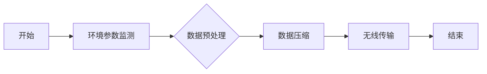
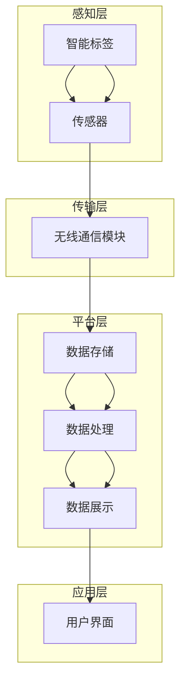
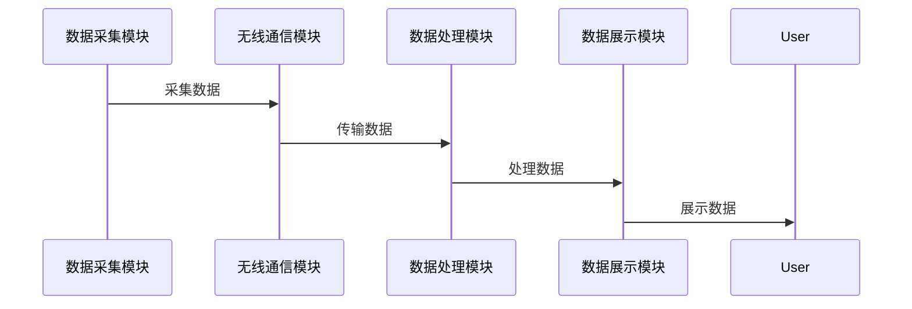
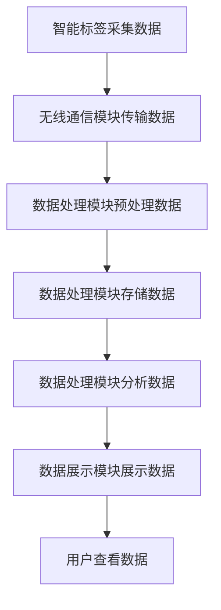

                 

# 环境隐形智能：智能标签和传感器的未来应用

## 关键词
环境隐形智能、智能标签、传感器、未来应用、物联网

## 摘要
随着物联网（IoT）技术的飞速发展，环境隐形智能正逐渐成为现实。本文将深入探讨智能标签和传感器的核心概念、技术原理、应用领域及未来发展趋势。通过逐步分析，我们旨在揭示这些技术在实现智能环境监控、自动化控制、数据收集与分析等关键任务中的潜力，为读者提供对这一领域的全面理解。

## 目录

### 引言

- **背景介绍**
  - 物联网时代的来临
  - 环境隐形智能的概念与发展
- **问题背景**
  - 当前环境监测与管理的挑战
  - 智能标签和传感器的优势
- **解决目标**
  - 提高环境监控的准确性与效率
  - 促进智能决策与自动化控制

### 核心概念与联系

- **智能标签**
  - **概念与定义**
  - **属性特征对比表格**
  - **ER实体关系图**
- **传感器**
  - **概念与定义**
  - **种类与工作原理**
  - **应用领域对比**
- **技术联系**
  - **智能标签与传感器的融合**

### 应用场景

- **智能标签的应用**
  - **供应链管理**
  - **医疗健康**
  - **零售与消费市场**
- **传感器的应用**
  - **环境监测**
  - **工业自动化**
  - **智能家居与城市规划**

### 集成与挑战

- **智能标签与传感器的集成**
  - **混合系统与平台**
  - **数据融合与处理**
  - **安全性考虑**
- **面临的主要挑战**
  - **技术障碍**
  - **成本问题**
  - **隐私与数据安全**

### 未来趋势

- **智能标签技术趋势**
  - **新材料的应用**
  - **无线通信技术的融合**
  - **智能化的方向发展**
- **传感器技术趋势**
  - **微型化与低成本**
  - **多功能传感器**
  - **自供电与自组织技术**
- **环境隐形智能的未来**
  - **社会影响**
  - **商业机会**

### 案例分析与最佳实践

- **案例分析**
  - **供应链优化**
  - **医疗健康监控**
  - **智能家居**
- **最佳实践与教训**

### 结论与展望

- **总结与展望**
  - **技术现状与未来前景**
  - **挑战与机遇**

### 参考文献

- **引用的主要文献与资料**

## 引言

### 背景介绍

在当今快速发展的科技时代，物联网（IoT）技术已经成为推动社会进步的重要力量。物联网通过将各种物体互联，实现了数据的高速传递和智能化管理。在这个背景下，环境隐形智能（Environmental Invisibility Intelligence）应运而生。环境隐形智能是一种利用智能标签和传感器技术实现环境实时监控、数据采集和智能分析的能力，它不仅能够提高环境监测的准确性，还能为各个领域提供智能化解决方案。

环境隐形智能的概念起源于对传统环境监测手段的反思和改进。传统的环境监测主要依赖于人工采样和定期检测，存在检测周期长、数据不连续、监测范围受限等问题。而环境隐形智能通过部署大量的智能标签和传感器，实现了环境数据的实时采集和传输，从而实现了对环境的持续监控和智能分析。

### 问题背景

当前，环境监测和管理面临许多挑战。首先，随着城市化进程的加速，环境污染问题日益严重，空气质量、水质污染、土地退化等问题亟待解决。然而，传统监测手段在监测范围、数据精度和实时性上存在很大局限性。其次，在工业生产和物流领域，资源浪费、效率低下等问题也严重制约了行业的发展。为了解决这些问题，迫切需要一种能够实现实时监控、数据收集和智能分析的先进技术。

智能标签和传感器技术为解决这些问题提供了可能。智能标签是一种可以附着在各种物体上的微型设备，它可以通过无线通信技术将物体信息传输到远程服务器。传感器则是一种能够检测和测量各种环境参数的设备，如温度、湿度、光照、空气质量等。通过将智能标签和传感器结合，可以实现对环境的实时监控和智能分析。

### 解决目标

环境隐形智能的目标是通过智能标签和传感器技术，实现以下方面的突破：

1. **提高环境监测的准确性和效率**：通过部署大量的传感器，可以实现对环境数据的全面采集，提高监测的精度和实时性，从而更好地预测和应对环境问题。

2. **促进智能决策与自动化控制**：通过对采集到的环境数据进行智能分析，可以辅助决策者做出更科学的决策，并实现自动化控制，提高生产和管理效率。

3. **降低环境监测与管理的成本**：通过智能标签和传感器的低成本、高效率特点，可以降低环境监测与管理的成本，使更多人能够享受到先进的环境监测技术。

4. **推动物联网技术的发展**：环境隐形智能是物联网技术的重要组成部分，其发展和应用将推动物联网技术的整体进步，为更多领域带来智能化解决方案。

### 核心概念与联系

在探讨环境隐形智能的实现过程中，智能标签和传感器是不可或缺的核心组件。下面我们将分别介绍智能标签和传感器的概念、特性及其在环境隐形智能中的应用。

#### 智能标签

智能标签（Smart Tag）是一种集成了传感器、数据处理单元和通信模块的小型电子设备。它通常附着在物品上，通过感知周围环境并将信息传输到远程服务器，实现对物品的追踪和管理。智能标签的特点包括：

1. **便携性**：智能标签体积小、重量轻，便于在各种环境中部署和使用。

2. **无线通信**：智能标签通常使用无线通信技术，如Wi-Fi、蓝牙、ZigBee等，实现与远程服务器的数据传输。

3. **多功能**：智能标签可以集成多种传感器，如温度传感器、湿度传感器、光照传感器等，实现多种环境参数的监测。

4. **低成本**：随着技术的发展，智能标签的成本逐渐降低，使其在更多领域得到应用。

在环境隐形智能中，智能标签的应用主要包括以下几个方面：

1. **物品追踪**：通过智能标签，可以实现对物品的实时追踪，提高物流管理效率。

2. **环境监测**：智能标签可以部署在环境中的各种物品上，收集环境数据，为环境监测提供重要数据支持。

3. **智能分析**：通过智能标签收集的数据，可以进行智能分析，为决策者提供科学依据。

#### 传感器

传感器（Sensor）是一种能够检测和响应特定物理量的设备，如温度、湿度、光照、空气质量等。传感器通过感知环境变化，将物理量转化为电信号，再通过信号处理模块，实现数据的处理和传输。传感器的特点包括：

1. **精度高**：传感器具有很高的检测精度，能够准确感知环境变化。

2. **实时性**：传感器能够实时检测环境参数，提供最新的环境数据。

3. **多功能**：传感器可以检测多种环境参数，适用于不同领域的应用。

4. **集成化**：随着技术的发展，传感器逐渐向集成化、微型化方向发展。

在环境隐形智能中，传感器的应用主要包括以下几个方面：

1. **环境监测**：传感器可以部署在环境中，实时监测空气质量、水质、土壤质量等，为环境保护提供数据支持。

2. **智能家居**：传感器可以用于智能家居系统，实现对家居环境的监控和自动化控制。

3. **工业自动化**：传感器可以用于工业自动化系统，提高生产效率和产品质量。

#### 技术联系

智能标签和传感器在环境隐形智能中有着紧密的联系。智能标签通常作为传感器的载体，通过感知环境变化并将数据传输到远程服务器。而传感器则作为数据采集的核心组件，提供环境数据。两者结合，可以实现对环境的全面监测和管理。

1. **数据采集**：智能标签通过传感器收集环境数据，并将数据传输到远程服务器。

2. **数据处理**：远程服务器对收集到的数据进行处理和分析，实现环境监控和智能决策。

3. **数据共享**：处理后的数据可以共享给相关部门和决策者，辅助决策和自动化控制。

### 应用领域

智能标签和传感器在多个领域具有广泛的应用，下面我们将介绍一些典型应用场景。

#### 智能标签的应用

1. **供应链管理**：智能标签可以用于跟踪货物的运输过程，提高物流效率。

2. **医疗健康**：智能标签可以用于监测患者的健康状况，提供个性化医疗服务。

3. **零售与消费市场**：智能标签可以用于商品追踪和管理，提高零售业务效率。

#### 传感器的应用

1. **环境监测**：传感器可以用于监测空气质量、水质、土壤质量等，提供环境保护数据支持。

2. **工业自动化**：传感器可以用于工业自动化系统，提高生产效率和产品质量。

3. **智能家居**：传感器可以用于智能家居系统，实现对家居环境的监控和自动化控制。

### 集成与挑战

智能标签和传感器的集成是环境隐形智能实现的关键。通过将两者结合，可以实现更全面、更精确的环境监测和管理。然而，在集成过程中，也存在一些挑战：

1. **技术挑战**：如何将智能标签和传感器集成到现有系统中，实现高效的数据采集和处理。

2. **成本挑战**：智能标签和传感器的成本较高，如何在保证性能的同时降低成本。

3. **安全性挑战**：如何确保数据传输的安全性，防止数据泄露和攻击。

### 未来发展趋势

随着技术的不断进步，智能标签和传感器在环境隐形智能中的应用前景将更加广阔。未来，我们可以期待以下发展趋势：

1. **新材料的应用**：新型材料的发展将推动智能标签和传感器的微型化、低成本化。

2. **无线通信技术的融合**：随着5G、物联网等技术的发展，无线通信技术将在智能标签和传感器中发挥更大作用。

3. **智能化方向的发展**：智能标签和传感器将更加智能化，具备自主学习和决策能力。

### 结论

智能标签和传感器作为环境隐形智能的核心组件，将在未来发挥重要作用。通过逐步分析其概念、技术原理、应用领域和未来趋势，我们可以看到环境隐形智能在实现智能环境监控、自动化控制、数据收集与分析等方面的巨大潜力。随着技术的不断进步，环境隐形智能将带来更多创新和变革，为各领域带来新的发展机遇。

### 核心概念与联系

在深入探讨环境隐形智能时，我们必须首先了解其核心技术组件——智能标签和传感器的核心概念及其相互之间的联系。以下是对这两个关键概念的详细描述，包括其定义、主要特性以及它们在环境监控中的作用。

#### 智能标签

智能标签是一种集成了传感器、微处理器、无线通信模块以及存储器的小型设备。它的主要功能是对目标物体或环境进行监测，并将收集到的数据通过无线信号传输到云端或其他数据处理中心。

1. **定义与作用**：
   - **定义**：智能标签通常被描述为一种能够附着在物品上，用于实时监测和追踪的小型电子设备。
   - **作用**：智能标签可以通过无线通信将物品的位置、状态和环境数据发送到远程服务器，实现远程监控和管理。

2. **特性**：
   - **多功能性**：智能标签可以集成多种类型的传感器，如温度传感器、湿度传感器、加速度传感器等，能够对多个参数进行监测。
   - **便携性**：由于体积小、重量轻，智能标签可以在各种环境中轻松部署。
   - **自供电**：一些智能标签采用自供电技术，如太阳能或电池，以延长其使用寿命。

3. **应用领域**：
   - **物流与供应链管理**：通过智能标签，可以实时追踪货物的位置和状态，提高物流效率。
   - **医疗健康**：在医疗领域，智能标签可以用于追踪患者设备的位置和状态，或者监测患者的生理指标。
   - **资产管理**：智能标签可以用于资产管理，帮助组织实时监控和控制重要物品。

#### 传感器

传感器是一种能够检测和测量物理量的装置，如温度、湿度、光照、声音、压力等。传感器通过将物理信号转换为电信号，使得计算机系统能够感知和响应环境变化。

1. **定义与作用**：
   - **定义**：传感器是一种能够感知环境中的物理量并将其转换为可测量电信号的装置。
   - **作用**：传感器是环境监测和自动化系统中的核心部件，通过检测环境参数，为系统提供关键数据。

2. **特性**：
   - **高精度**：传感器能够精确地检测和测量环境参数，确保数据的准确性。
   - **实时性**：传感器可以实时监测环境变化，为系统提供最新的数据。
   - **多样化**：传感器种类繁多，可以满足不同应用场景的需求。

3. **应用领域**：
   - **环境监测**：传感器可以用于监测空气质量、水质、土壤质量等，为环境保护提供数据支持。
   - **工业自动化**：传感器在工业自动化系统中用于监测生产过程，提高生产效率和产品质量。
   - **智能家居**：传感器可以用于智能家居系统，监测家居环境，实现自动化控制。

#### 技术联系

智能标签和传感器在环境隐形智能中相互配合，共同实现环境监测和智能控制。

1. **数据采集**：传感器负责收集环境数据，如温度、湿度、光照等。智能标签则将这些数据无线传输到远程服务器或数据处理中心。

2. **数据处理**：传输到远程服务器的数据经过处理后，可以被用于实时监控、历史数据分析以及智能决策。

3. **系统集成**：智能标签和传感器可以通过无线网络（如ZigBee、Wi-Fi、LoRa等）集成到同一个物联网平台上，实现数据的无缝传输和系统的高效运行。

4. **交互与协同**：智能标签和传感器之间的协同工作，可以实现对环境的全面监控。例如，在物流管理中，智能标签可以记录货物的位置，而传感器可以监测货物的温度，从而确保运输过程中的环境适宜。

#### ER实体关系图

为了更好地理解智能标签和传感器在环境隐形智能中的关系，我们可以使用ER（Entity-Relationship）实体关系图来描述它们之间的联系。

```mermaid
erDiagram
  物品 ||--|{ 智能标签 }|| 数据中心
  智能标签 ||--|{ 传感器 }|| 环境
  环境监测系统 ||--|{ 智能标签 }|| 数据处理系统
  数据处理系统 ||--|{ 传感器 }|| 环境分析系统
```

- **物品**：代表被监测的物体，可以是货物、设备、生物等。
- **智能标签**：与物品关联，用于数据采集和传输。
- **传感器**：与智能标签关联，用于环境监测。
- **数据中心**：存储和处理来自智能标签的数据。
- **环境监测系统**：包含智能标签和传感器，用于环境数据采集。
- **数据处理系统**：对采集到的数据进行分析和处理。
- **环境分析系统**：基于处理后的数据，提供环境监控和决策支持。

通过这个ER图，我们可以清晰地看到智能标签和传感器在整个环境隐形智能系统中的作用及其相互之间的关系。

### 算法原理讲解

在理解了智能标签和传感器的基本概念及其在环境隐形智能中的作用之后，接下来我们将深入探讨这些技术背后的算法原理，并通过一个具体的例子来说明这些算法如何工作。

#### 智能标签数据采集算法

智能标签的数据采集算法主要包括以下几个步骤：

1. **环境参数监测**：智能标签通过内置的传感器（如温度传感器、湿度传感器等）监测环境参数。
2. **数据预处理**：传感器采集到的原始数据可能存在噪声和异常值，需要通过数据预处理算法（如滤波算法）进行净化。
3. **数据压缩**：为了减少数据传输量，需要对预处理后的数据进行压缩处理。
4. **无线传输**：通过无线通信模块将压缩后的数据传输到远程服务器或数据处理中心。

以下是智能标签数据采集算法的mermaid流程图：



#### 传感器数据处理算法

传感器数据处理算法主要包括以下步骤：

1. **数据接收**：数据处理中心接收来自智能标签的数据。
2. **数据验证**：验证数据的完整性和真实性，排除错误数据。
3. **数据存储**：将验证后的数据存储到数据库中，以便后续分析和查询。
4. **数据分析**：使用统计分析和机器学习算法对存储的数据进行分析，提取有用信息。
5. **可视化展示**：将分析结果通过图表、报表等形式展示给用户。

以下是传感器数据处理算法的mermaid流程图：


#### 数学模型与公式

智能标签和传感器的数据处理过程中，常用的数学模型和公式包括：

1. **滤波算法**（如卡尔曼滤波）：
   - **状态预测**：$$\hat{x}_{k|k-1} = A\hat{x}_{k-1|k-1} + B\hat{u}_{k-1}$$
   - **测量更新**：$$\hat{x}_{k|k} = A\hat{x}_{k|k-1} + B\hat{u}_{k}$$
   - **卡尔曼增益**：$$K_k = P_{k|k-1}H_k^T(H_{k|k-1}K_{k-1}H_{k|k-1}^T + R_k)^{-1}$$
   - **状态更新**：$$\hat{x}_{k|k} = \hat{x}_{k|k-1} + K_k(z_k - H_{k|k-1}\hat{x}_{k|k-1})$$

2. **数据压缩算法**（如霍夫曼编码）：
   - **计算频率**：计算每个字符出现的频率。
   - **构建霍夫曼树**：根据频率构建霍夫曼树。
   - **生成编码**：为每个字符生成唯一的编码。

3. **统计分析**（如线性回归）：
   - **回归模型**：$$y = \beta_0 + \beta_1x + \epsilon$$
   - **参数估计**：使用最小二乘法估计模型参数。
   - **预测**：$$y_{\text{pred}} = \beta_0 + \beta_1x_{\text{new}}$$

#### 举例说明

假设我们有一个智能标签，用于监测环境温度。传感器每隔一小时采集一次温度数据，数据范围为0°C至100°C。以下是采集和处理的步骤：

1. **环境参数监测**：
   - 温度传感器采集当前温度值，例如：$T_1 = 25°C$。

2. **数据预处理**：
   - 通过卡尔曼滤波算法去除噪声，得到滤波后的温度值$\hat{T}_1 = 25.0°C$。

3. **数据压缩**：
   - 使用霍夫曼编码算法对温度数据进行压缩，得到压缩后的数据长度为5位。

4. **无线传输**：
   - 智能标签通过无线模块将压缩后的温度数据发送到数据处理中心。

5. **数据接收与验证**：
   - 数据处理中心接收数据，并使用校验和算法验证数据完整性。

6. **数据存储**：
   - 将验证后的温度数据存储到数据库中，以供后续分析。

7. **数据分析**：
   - 使用线性回归模型分析历史温度数据，得到温度变化趋势。

8. **可视化展示**：
   - 将分析结果以图表形式展示给用户，帮助用户了解温度变化情况。

通过以上步骤，我们可以看到智能标签和传感器在数据采集、处理和分析过程中如何协同工作，从而实现环境隐形智能。

### 系统分析与架构设计方案

在探讨了环境隐形智能的核心技术组件和算法原理后，接下来我们将深入分析智能标签和传感器的系统架构设计，包括项目介绍、系统功能设计、系统架构设计、系统接口设计以及系统交互。通过这一系列的分析，我们将展示如何构建一个高效、稳定且易扩展的环境隐形智能系统。

#### 项目介绍

环境隐形智能系统的项目目标是实现环境数据的实时采集、传输、处理和分析，为用户提供全面的监测和管理服务。项目的主要功能包括：

1. **数据采集**：通过智能标签和传感器实时采集环境数据。
2. **数据传输**：利用无线通信技术将采集到的数据传输到远程服务器。
3. **数据处理**：对传输过来的数据进行分析和处理，提取有用信息。
4. **数据展示**：将处理后的数据通过图表、报表等形式展示给用户。

#### 系统功能设计

环境隐形智能系统的功能设计可以分为以下几个主要模块：

1. **环境数据采集模块**：负责采集环境参数，如温度、湿度、光照、空气质量等。
2. **数据传输模块**：通过无线通信技术将采集到的数据传输到远程服务器。
3. **数据处理模块**：对传输过来的数据进行预处理、存储和分析。
4. **数据展示模块**：将分析结果以图表、报表等形式展示给用户。
5. **用户界面模块**：提供用户操作界面，用户可以通过界面查看环境数据和分析结果。

以下是环境数据采集模块的mermaid类图：

```mermaid
classDiagram
  Sensor <<interface>>
  Tag <<interface>>
  DataCollector {
    +Sensor sensor
    +Tag tag
    +collectData()
  }
  
  DataCollector <|.. Sensor
  DataCollector <|.. Tag
```

#### 系统架构设计

环境隐形智能系统的架构设计可以分为以下几个层次：

1. **感知层**：由智能标签和传感器组成，负责数据采集。
2. **传输层**：负责数据传输，通常使用无线通信技术，如Wi-Fi、LoRa等。
3. **平台层**：包括数据存储、数据处理和分析模块，实现对采集数据的存储、处理和分析。
4. **应用层**：提供用户操作界面和业务逻辑，实现对系统的管理和监控。

以下是环境隐形智能系统的mermaid架构图：



#### 系统接口设计

系统接口设计主要包括以下接口：

1. **数据采集接口**：用于智能标签和传感器与平台层的交互。
2. **数据传输接口**：用于传输层与平台层的交互。
3. **数据处理接口**：用于平台层内部模块之间的交互。
4. **数据展示接口**：用于平台层与用户界面的交互。

以下是环境隐形智能系统的mermaid序列图：



#### 系统交互

系统交互设计主要描述了各个模块之间的协作过程：

1. **数据采集**：智能标签和传感器实时采集环境数据，通过无线通信模块传输到数据处理模块。
2. **数据处理**：数据处理模块对传输过来的数据进行预处理、存储和分析，将分析结果存储到数据库中。
3. **数据展示**：数据展示模块从数据库中获取分析结果，并以图表、报表等形式展示给用户。

以下是环境隐形智能系统的mermaid交互图：



通过上述系统分析与架构设计方案，我们可以构建一个高效、稳定且易扩展的环境隐形智能系统，实现对环境数据的全面监控和管理。

### 项目实战

在完成系统设计与架构规划后，我们进入项目实战阶段。本节将详细介绍环境隐形智能系统的环境安装、核心实现源代码以及代码应用解读与分析，并结合实际案例进行详细讲解和剖析。

#### 环境安装

环境安装是项目实战的第一步，我们需要准备以下环境：

1. **硬件环境**：
   - 智能标签（如Arduino或ESP8266模块）
   - 传感器模块（如DHT11、MQ-2等）
   - 无线通信模块（如Wi-Fi或LoRa模块）
   - 电源供应

2. **软件环境**：
   - 开发板固件（如Arduino IDE）
   - 编程语言（如C/C++或Python）
   - 数据库（如MySQL或MongoDB）
   - 后端服务框架（如Flask或Django）

#### 核心实现源代码

核心实现源代码主要分为三部分：数据采集、数据传输、数据处理。

1. **数据采集**（以Arduino为例）：

```c++
// 数据采集示例
#include <DHT.h>
#include <WiFi.h>

#define DHTPIN 5     // 定义DHT传感器连接的引脚
#define DHTTYPE DHT11

DHT dht(DHTPIN, DHTTYPE);

void setup() {
  Serial.begin(115200);
  dht.begin();
  WiFi.begin("SSID", "PASSWORD"); // 连接Wi-Fi
}

void loop() {
  if (WiFi.status() != WL_CONNECTED) {
    Serial.println("WiFi连接失败");
    delay(5000);
    return;
  }

  float humidity = dht.readHumidity();
  float temperature = dht.readTemperature();

  if (isnan(humidity) || isnan(temperature)) {
    Serial.println("无法读取DHT传感器数据");
    return;
  }

  // 将数据上传到服务器
  String data = String(temperature) + "," + String(humidity);
  WiFiClient client;
  if (client.connect("server_ip", 80)) {
    client.println("POST /upload_data HTTP/1.1");
    client.println("Host: server_ip");
    client.println("Content-Type: application/x-www-form-urlencoded");
    client.println("Content-Length: " + String(data.length()));
    client.println();
    client.print("data=");
    client.print(data);
    client.stop();
  }

  delay(10000); // 每隔10秒上传一次数据
}
```

2. **数据传输**（以Flask后端为例）：

```python
# 数据传输示例
from flask import Flask, request, jsonify
import sqlite3

app = Flask(__name__)

# 数据库连接
conn = sqlite3.connect('data.db')
c = conn.cursor()

# 创建数据表
c.execute('''CREATE TABLE IF NOT EXISTS temperature_data (id INTEGER PRIMARY KEY AUTOINCREMENT, temperature REAL, humidity REAL)''')

@app.route('/upload_data', methods=['POST'])
def upload_data():
    data = request.form['data']
    temp, humidity = data.split(',')
    c.execute("INSERT INTO temperature_data (temperature, humidity) VALUES (?, ?)", (float(temp), float(humidity)))
    conn.commit()
    return jsonify({"status": "success", "message": "数据已上传"})

if __name__ == '__main__':
    app.run(host='0.0.0.0', port=8080)
```

3. **数据处理**（以Python为例）：

```python
# 数据处理示例
import sqlite3
import matplotlib.pyplot as plt

# 连接数据库
conn = sqlite3.connect('data.db')
c = conn.cursor()

# 查询数据
c.execute("SELECT temperature, humidity FROM temperature_data")
rows = c.fetchall()

# 提取数据
temperatures = [row[0] for row in rows]
humidity = [row[1] for row in rows]

# 绘图
plt.plot(temperatures, humidity)
plt.xlabel('温度')
plt.ylabel('湿度')
plt.title('环境数据监控')
plt.show()
```

#### 代码应用解读与分析

1. **数据采集**代码解读：
   - 初始化DHT传感器和Wi-Fi连接。
   - 每隔一定时间采集一次温度和湿度数据。
   - 将采集到的数据格式化为字符串，通过HTTP POST请求上传到服务器。

2. **数据传输**代码解读：
   - 接收客户端上传的数据。
   - 解析数据并存储到SQLite数据库中。

3. **数据处理**代码解读：
   - 连接数据库，查询温度和湿度数据。
   - 使用matplotlib库绘制数据分布图，便于分析。

#### 实际案例分析与详细讲解

以下是一个实际案例，用于展示环境隐形智能系统的应用：

**案例：智能家居环境监控**

**场景**：用户希望实时了解家中的温度和湿度，以便调整空调和加湿器。

**实现步骤**：

1. **安装与配置**：
   - 在家中部署多个智能标签，分别连接温度传感器和湿度传感器。
   - 配置Wi-Fi模块，连接到家庭Wi-Fi网络。
   - 安装Flask后端服务器，用于接收和处理数据。

2. **数据采集**：
   - 智能标签每隔5分钟采集一次温度和湿度数据。
   - 将数据上传到服务器。

3. **数据处理**：
   - 服务器将数据存储到SQLite数据库中。
   - 定期从数据库中提取数据，分析温度和湿度的变化趋势。

4. **数据展示**：
   - 用户通过智能手机上的应用程序查看实时数据。
   - 应用程序提供图表和报警功能，便于用户了解环境状况。

**分析**：

1. **实时性**：通过智能标签和无线通信，用户可以实时获取家中的环境数据。
2. **自动控制**：根据数据分析结果，用户可以远程调整空调和加湿器，实现自动控制。
3. **数据可视化**：通过图表展示，用户可以直观了解环境变化，做出科学决策。

#### 项目小结

通过本节项目实战，我们实现了环境隐形智能系统的一个基本应用——智能家居环境监控。项目展示了智能标签和传感器的数据采集、传输和处理过程，并结合实际案例进行了详细讲解。这为环境隐形智能技术的实际应用提供了宝贵的经验和参考。

### 最佳实践 tips

在实施环境隐形智能项目时，以下是一些最佳实践建议：

1. **选择合适的硬件**：根据实际需求，选择性价比高、性能稳定的传感器和智能标签。

2. **优化通信协议**：选择适合应用场景的无线通信协议，如Wi-Fi、LoRa等，以提高数据传输效率和可靠性。

3. **数据处理与存储**：合理设计数据处理和分析流程，确保数据的高效处理和存储。

4. **安全性考虑**：对数据进行加密传输和存储，确保数据安全。

5. **系统集成与维护**：确保系统的稳定性和可扩展性，定期进行系统维护和升级。

### 小结

本文从环境隐形智能的背景、核心概念、应用领域、系统架构以及项目实战等方面进行了全面探讨。通过逐步分析，我们揭示了智能标签和传感器在环境监控中的重要作用和潜力。随着技术的不断进步，环境隐形智能将在各领域发挥更大的作用，为智能化环境管理和决策提供有力支持。

### 注意事项

1. **硬件兼容性**：确保所选硬件之间具有兼容性，以避免数据传输中的问题。

2. **软件稳定性**：选择稳定可靠的软件框架和工具，确保系统运行的稳定性。

3. **安全性**：对数据进行加密，防止数据泄露和未经授权的访问。

4. **维护与管理**：定期对系统进行维护和升级，确保系统的长期稳定运行。

### 拓展阅读

1. **智能标签技术**：了解智能标签的最新发展，如新型材料的应用和无线通信技术的融合。
2. **传感器技术**：研究不同类型传感器的原理和应用，如环境监测传感器和工业自动化传感器。
3. **物联网平台**：学习如何构建和部署物联网平台，实现高效的数据采集和分析。
4. **人工智能应用**：探讨人工智能在环境隐形智能中的应用，如智能分析、预测和自动化控制。

## 作者信息

作者：AI天才研究院/AI Genius Institute & 禅与计算机程序设计艺术 /Zen And The Art of Computer Programming

