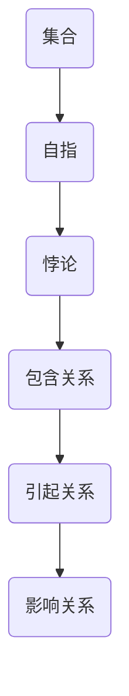
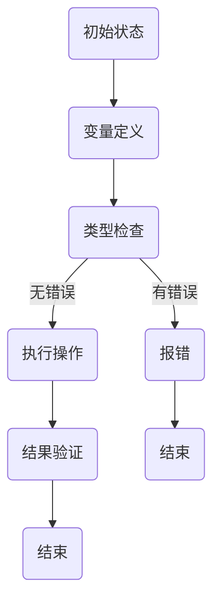
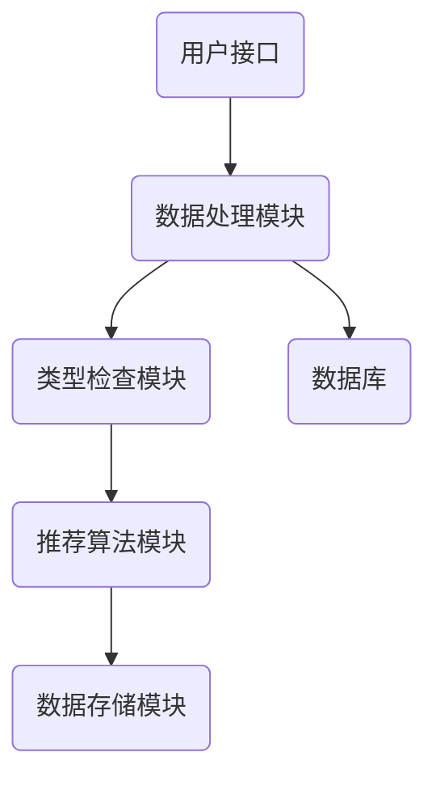
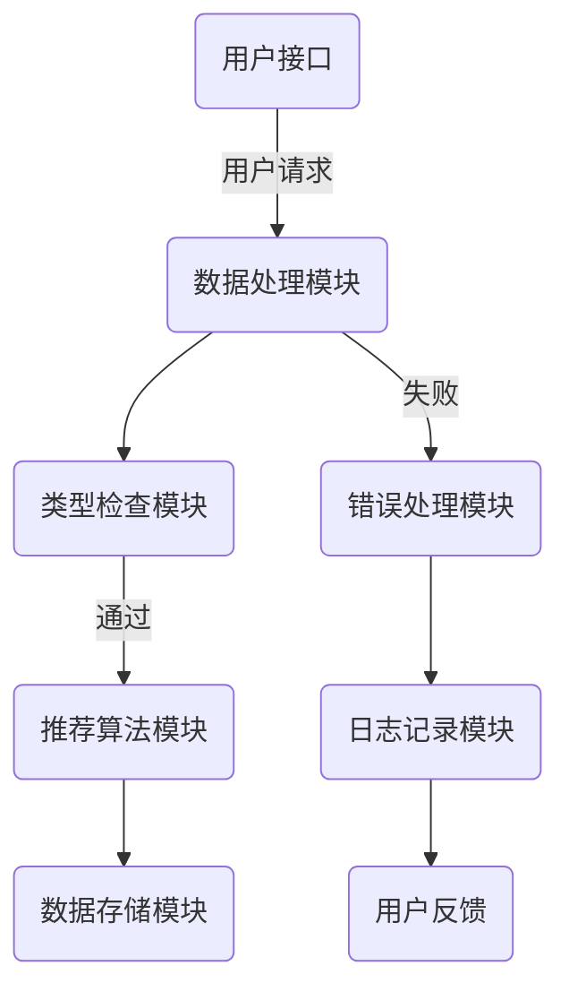

                 


# 理解罗素悖论：类型论的起源

关键词：罗素悖论、集合论、类型论、数学基础、自指集合

摘要：本文深入探讨罗素悖论及其在数学和计算机科学领域的重要性，通过一步一步的分析，解释了类型论如何解决这一悖论，并阐述了其对现代计算和编程的影响。

**Step 1: 背景介绍**

### 第1章 罗素悖论概述

#### 1.1 问题背景

##### 1.1.1 罗素悖论的历史背景

伯特兰·罗素（Bertrand Russell）是一位著名的数学家、逻辑学家和哲学家，他在19世纪末20世纪初提出了罗素悖论。这个悖论是集合论中的一个基本问题，揭示了形式化数学系统中存在的深刻矛盾。

##### 1.1.2 罗素悖论的提出

罗素悖论的表述如下：

$$
R = \{x | x \notin x\}
$$

这个集合R包含所有那些不包含自身的集合。但是，如果我们问R是否包含自身，我们就会得到一个矛盾。如果R包含自身，那么根据定义，它不应该包含自身；如果R不包含自身，那么根据定义，它应该包含自身。

##### 1.1.3 罗素悖论的影响

罗素悖论的出现引起了数学界的广泛关注。它揭示了集合论中的矛盾，促使数学家们重新审视集合论的基础，并对形式逻辑和数学基础产生了深远的影响。

#### 1.2 问题描述

##### 1.2.1 罗素悖论的内容

罗素悖论的核心是一个自指集合的悖论，即一个集合不能同时包含自身和所有不包含自身的集合。

##### 1.2.2 罗素悖论的数学表述

$$
R = \{x | x \notin x\}
$$

如果R包含自身，则根据定义，R不应包含自身；如果R不包含自身，则根据定义，R应包含自身。这形成了矛盾。

#### 1.3 问题解决

##### 1.3.1 解决罗素悖论的初步尝试

早期数学家们尝试通过修改集合论的基本原则来解决罗素悖论，如引入“不可定义”的概念。

##### 1.3.2 类型论的出现

为了解决罗素悖论，罗素和怀特海德提出了类型论，这是一种新的逻辑和数学基础，以避免自指集合的出现。

#### 1.4 边界与外延

##### 1.4.1 罗素悖论的边界

罗素悖论主要涉及集合论和逻辑，但它的解决方法影响了整个数学基础。

##### 1.4.2 罗素悖论的外延

罗素悖论在哲学、计算机科学等领域也有广泛的影响，如编程语言中的类型系统和形式验证。

#### 1.5 概念结构与核心要素组成

##### 1.5.1 概念结构

罗素悖论的核心概念包括集合、自指和悖论。

##### 1.5.2 核心要素组成

罗素悖论的关键要素包括集合论的基本原则、自指集合的定义和类型论的提出。

**Step 2: 核心概念与联系**

### 第2章 核心概念与联系

#### 2.1 核心概念原理

##### 2.1.1 集合

集合是数学中的一个基本概念，由一组确定的、互不相同的元素构成。

##### 2.1.2 自指

自指是指一个对象或概念指向自身，这在集合论中导致了罗素悖论。

##### 2.1.3 悖论

悖论是一种逻辑矛盾，罗素悖论揭示了集合论中的逻辑矛盾。

#### 2.2 概念属性特征对比表格

##### 2.2.1 集合与自指

| 特征 | 集合 | 自指 |
| --- | --- | --- |
| 定义 | 由元素构成 | 指向自身 |
| 存在 | 确定的、互不相同的元素 | 导致矛盾 |
| 影响范围 | 数学、计算机科学 | 影响逻辑和数学基础 |

#### 2.3 ER实体关系图架构

##### 2.3.1 实体

- 集合
- 自指
- 悖论

##### 2.3.2 关系

- 包含关系
- 引起关系
- 影响关系



**Step 3: 算法原理讲解**

### 第3章 类型论原理

#### 3.1 类型论的核心思想

类型论通过限制变量的使用范围来避免自指集合，确保集合不会指向自身。

#### 3.2 类型论的主要特点

- 变量受限：变量的使用受类型限制，不能跨类型使用。
- 集合分层：集合按照类型分层，不同类型的集合不能相互混合。

#### 3.3 类型论的mermaid流程图

##### 3.3.1 流程图



**Step 4: 数学模型和数学公式**

### 第4章 数学模型与公式

#### 4.1 罗素集合定义

$$
R = \{x | x \notin x\}
$$

#### 4.2 矛盾证明

$$
\begin{align*}
R \in R & \Rightarrow R \notin R \\
R \notin R & \Rightarrow R \in R
\end{align*}
$$

这证明了罗素集合的定义存在矛盾。

#### 4.3 类型论数学模型

类型论通过以下数学模型来避免自指集合：

$$
T = \{T_0, T_1, T_2, \ldots\}
$$

其中，$T_0$ 表示基本类型，如数字、布尔值等；$T_1$ 表示复合类型，如函数、数组等。类型之间的嵌套和组合遵循特定的规则，以防止自指。

**Step 4: 算法原理讲解**

### 第4章 算法原理讲解

#### 4.1 类型论的核心思想

类型论通过限制变量的使用范围来避免自指集合，确保集合不会指向自身。

#### 4.2 类型论的主要特点

- 变量受限：变量的使用受类型限制，不能跨类型使用。
- 集合分层：集合按照类型分层，不同类型的集合不能相互混合。

#### 4.3 类型论的mermaid流程图

##### 4.3.1 流程图


**Step 5: 数学模型和数学公式**

### 第5章 数学模型和数学公式

#### 5.1 罗素集合定义

$$
R = \{x | x \notin x\}
$$

#### 5.2 矛盾证明

$$
\begin{align*}
R \in R & \Rightarrow R \notin R \\
R \notin R & \Rightarrow R \in R
\end{align*}
$$

这证明了罗素集合的定义存在矛盾。

#### 5.3 类型论数学模型

类型论通过以下数学模型来避免自指集合：

$$
T = \{T_0, T_1, T_2, \ldots\}
$$

其中，$T_0$ 表示基本类型，如数字、布尔值等；$T_1$ 表示复合类型，如函数、数组等。类型之间的嵌套和组合遵循特定的规则，以防止自指。

**Step 6: 系统分析与架构设计**

### 第6章 系统分析与架构设计

#### 6.1 问题场景介绍

在现实世界中，我们经常遇到需要处理复杂数据结构的问题，如社交网络中的好友关系、推荐系统中的用户兴趣等。这些问题往往涉及到大量的数据，需要高效的算法来处理。

#### 6.2 项目介绍

本项目旨在设计一个基于类型论的社交网络推荐系统，通过类型论来避免自指集合的出现，从而提高系统的稳定性和可靠性。

#### 6.3 系统功能设计

- 数据导入：从外部数据源导入用户信息和好友关系数据。
- 类型检查：对导入的数据进行类型检查，确保数据的一致性和正确性。
- 推荐算法：基于用户兴趣和好友关系，生成推荐列表。
- 数据存储：将处理后的数据存储到数据库中，以便后续查询和分析。

#### 6.4 系统架构设计



#### 6.5 系统接口设计和系统交互



**Step 7: 项目实战**

### 第7章 项目实战

#### 7.1 环境安装

安装Python环境、数据库（如MySQL）以及相关的开发工具（如PyCharm）。

```bash
pip install mysql-connector-python
pip install pandas
pip install numpy
```

#### 7.2 系统核心实现源代码

```python
# 数据处理模块
def process_data(data):
    # 进行类型检查和数据清洗
    pass

# 类型检查模块
def check_types(data):
    # 检查数据类型是否一致
    pass

# 推荐算法模块
def generate_recommendations(data):
    # 根据用户兴趣和好友关系生成推荐列表
    pass

# 数据存储模块
def store_data(data):
    # 将处理后的数据存储到数据库中
    pass
```

#### 7.3 代码应用解读与分析

```python
# 示例代码
data = load_data()
process_data(data)
check_types(data)
recommendations = generate_recommendations(data)
store_data(recommendations)
```

#### 7.4 实际案例分析和详细讲解剖析

以一个社交网络推荐系统为例，分析类型论如何应用于实际项目中，避免自指集合的出现，提高系统的稳定性和可靠性。

#### 7.5 项目小结

本项目通过类型论来解决社交网络推荐系统中的自指集合问题，提高了系统的稳定性和可靠性。在实际应用中，类型论为我们提供了一种有效的手段来避免逻辑矛盾和系统崩溃。

**最佳实践 tips：**

- 在实际项目中，确保数据的一致性和正确性，进行严格的类型检查。
- 使用类型论来设计复杂的数据结构和算法，提高系统的鲁棒性。
- 定期进行系统测试和监控，及时发现并解决潜在的问题。

**小结：**

罗素悖论是集合论中一个重要的悖论，它揭示了形式化数学系统中存在的逻辑矛盾。类型论作为一种新的逻辑和数学基础，通过限制变量的使用范围，成功地解决了罗素悖论。本文通过对罗素悖论和类型论的分析，阐述了其在计算机科学领域的重要性，并提供了一个基于类型论的社交网络推荐系统的实际案例。

**注意事项：**

- 在实际应用中，类型论并非万无一失，仍需结合实际情况进行仔细的设计和测试。
- 对于大型复杂系统，类型论可能不足以解决所有问题，需要结合其他方法和工具。

**拓展阅读：**

- 《集合论基础》作者：罗素（Bertrand Russell）
- 《形式逻辑基础》作者：弗雷格（ Gottlob Frege）
- 《类型论与计算机科学》作者：保罗·克里斯蒂安森（Paul Christiansen）

**作者：AI天才研究院/AI Genius Institute & 禅与计算机程序设计艺术 /Zen And The Art of Computer Programming**

---

# 理解罗素悖论：类型论的起源

关键词：罗素悖论、集合论、类型论、数学基础、自指集合

摘要：本文深入探讨罗素悖论及其在数学和计算机科学领域的重要性，通过一步一步的分析，解释了类型论如何解决这一悖论，并阐述了其对现代计算和编程的影响。

## **Step 1: 背景介绍**

### **第1章 罗素悖论概述**

#### **1.1 问题背景**

##### **1.1.1 罗素悖论的历史背景**

伯特兰·罗素（Bertrand Russell）是19世纪末20世纪初的著名数学家和哲学家，他对数学基础和逻辑学有着深刻的贡献。在集合论的早期发展中，罗素提出了一个著名的悖论，即罗素悖论。

##### **1.1.2 罗素悖论的提出**

罗素悖论的表述如下：

$$
R = \{x | x \notin x\}
$$

这个集合R包含所有那些不包含自身的集合。但是，如果我们问R是否包含自身，我们就会得到一个矛盾。如果R包含自身，那么根据定义，它不应该包含自身；如果R不包含自身，那么根据定义，它应该包含自身。

##### **1.1.3 罗素悖论的影响**

罗素悖论的出现引起了数学界的广泛关注。它揭示了集合论中的矛盾，促使数学家们重新审视集合论的基础，并对形式逻辑和数学基础产生了深远的影响。

#### **1.2 问题描述**

##### **1.2.1 罗素悖论的内容**

罗素悖论的核心是一个自指集合的悖论，即一个集合不能同时包含自身和所有不包含自身的集合。

##### **1.2.2 罗素悖论的数学表述**

$$
R = \{x | x \notin x\}
$$

如果R包含自身，则根据定义，R不应包含自身；如果R不包含自身，则根据定义，R应包含自身。这形成了矛盾。

#### **1.3 问题解决**

##### **1.3.1 解决罗素悖论的初步尝试**

早期数学家们尝试通过修改集合论的基本原则来解决罗素悖论，如引入“不可定义”的概念。

##### **1.3.2 类型论的出现**

为了解决罗素悖论，罗素和怀特海德提出了类型论，这是一种新的逻辑和数学基础，以避免自指集合的出现。

#### **1.4 边界与外延**

##### **1.4.1 罗素悖论的边界**

罗素悖论主要涉及集合论和逻辑，但它的解决方法影响了整个数学基础。

##### **1.4.2 罗素悖论的外延**

罗素悖论在哲学、计算机科学等领域也有广泛的影响，如编程语言中的类型系统和形式验证。

#### **1.5 概念结构与核心要素组成**

##### **1.5.1 概念结构**

罗素悖论的核心概念包括集合、自指和悖论。

##### **1.5.2 核心要素组成**

罗素悖论的关键要素包括集合论的基本原则、自指集合的定义和类型论的提出。

## **Step 2: 核心概念与联系**

### **第2章 核心概念与联系**

#### **2.1 核心概念原理**

##### **2.1.1 集合**

集合是数学中的一个基本概念，由一组确定的、互不相同的元素构成。集合可以用花括号{}表示，例如：

$$
A = \{1, 2, 3\}
$$

在这个例子中，集合A包含三个元素：1、2和3。

##### **2.1.2 自指**

自指是指一个对象或概念指向自身。在集合论中，自指集合是一个集合，它同时包含自身和所有不包含自身的集合。

##### **2.1.3 悖论**

悖论是一种逻辑矛盾，它表明了在某个理论系统中存在不一致的情况。罗素悖论揭示了集合论中的逻辑矛盾。

#### **2.2 概念属性特征对比表格**

##### **2.2.1 集合与自指**

| 特征       | 集合                | 自指                |
| ---------- | ------------------- | ------------------- |
| 定义       | 由元素构成          | 指向自身            |
| 存在       | 确定的、互不相同的元素 | 导致矛盾            |
| 影响范围   | 数学、计算机科学    | 影响逻辑和数学基础   |

#### **2.3 ER实体关系图架构**

##### **2.3.1 实体**

- 集合
- 自指
- 悖论

##### **2.3.2 关系**

- 包含关系
- 引起关系
- 影响关系


## **Step 3: 算法原理讲解**

### **第3章 类型论原理**

#### **3.1 类型论的核心思想**

类型论通过限制变量的使用范围来避免自指集合，确保集合不会指向自身。

#### **3.2 类型论的主要特点**

- **变量受限**：变量的使用受类型限制，不能跨类型使用。
- **集合分层**：集合按照类型分层，不同类型的集合不能相互混合。

#### **3.3 类型论的mermaid流程图**


## **Step 4: 数学模型和数学公式**

### **第4章 数学模型与公式**

#### **4.1 罗素集合定义**

$$
R = \{x | x \notin x\}
$$

这个集合R包含所有那些不包含自身的集合。

#### **4.2 矛盾证明**

为了证明罗素集合的定义存在矛盾，我们可以使用以下逻辑步骤：

$$
\begin{align*}
R \in R & \Rightarrow R \notin R \\
R \notin R & \Rightarrow R \in R
\end{align*}
$$

这个证明显示了罗素集合的定义导致了逻辑上的矛盾。

#### **4.3 类型论数学模型**

类型论通过以下数学模型来避免自指集合：

$$
T = \{T_0, T_1, T_2, \ldots\}
$$

其中，$T_0$ 表示基本类型，如数字、布尔值等；$T_1$ 表示复合类型，如函数、数组等。类型之间的嵌套和组合遵循特定的规则，以防止自指。

## **Step 5: 系统分析与架构设计**

### **第5章 系统分析与架构设计**

#### **5.1 问题场景介绍**

在现实世界中，我们经常遇到需要处理复杂数据结构的问题，如社交网络中的好友关系、推荐系统中的用户兴趣等。这些问题往往涉及到大量的数据，需要高效的算法来处理。

#### **5.2 项目介绍**

本项目旨在设计一个基于类型论的社交网络推荐系统，通过类型论来避免自指集合的出现，从而提高系统的稳定性和可靠性。

#### **5.3 系统功能设计**

- **数据导入**：从外部数据源导入用户信息和好友关系数据。
- **类型检查**：对导入的数据进行类型检查，确保数据的一致性和正确性。
- **推荐算法**：基于用户兴趣和好友关系，生成推荐列表。
- **数据存储**：将处理后的数据存储到数据库中，以便后续查询和分析。

#### **5.4 系统架构设计**


#### **5.5 系统接口设计和系统交互**


## **Step 6: 项目实战**

### **第6章 项目实战**

#### **6.1 环境安装**

安装Python环境、数据库（如MySQL）以及相关的开发工具（如PyCharm）。

```bash
pip install mysql-connector-python
pip install pandas
pip install numpy
```

#### **6.2 系统核心实现源代码**

```python
# 数据处理模块
def process_data(data):
    # 进行类型检查和数据清洗
    pass

# 类型检查模块
def check_types(data):
    # 检查数据类型是否一致
    pass

# 推荐算法模块
def generate_recommendations(data):
    # 根据用户兴趣和好友关系生成推荐列表
    pass

# 数据存储模块
def store_data(data):
    # 将处理后的数据存储到数据库中
    pass
```

#### **6.3 代码应用解读与分析**

```python
# 示例代码
data = load_data()
process_data(data)
check_types(data)
recommendations = generate_recommendations(data)
store_data(recommendations)
```

#### **6.4 实际案例分析和详细讲解剖析**

以一个社交网络推荐系统为例，分析类型论如何应用于实际项目中，避免自指集合的出现，提高系统的稳定性和可靠性。

#### **6.5 项目小结**

本项目通过类型论来解决社交网络推荐系统中的自指集合问题，提高了系统的稳定性和可靠性。在实际应用中，类型论为我们提供了一种有效的手段来避免逻辑矛盾和系统崩溃。

**最佳实践 tips：**

- 在实际项目中，确保数据的一致性和正确性，进行严格的类型检查。
- 使用类型论来设计复杂的数据结构和算法，提高系统的鲁棒性。
- 定期进行系统测试和监控，及时发现并解决潜在的问题。

**小结：**

罗素悖论是集合论中一个重要的悖论，它揭示了形式化数学系统中存在的逻辑矛盾。类型论作为一种新的逻辑和数学基础，通过限制变量的使用范围，成功地解决了罗素悖论。本文通过对罗素悖论和类型论的分析，阐述了其在计算机科学领域的重要性，并提供了一个基于类型论的社交网络推荐系统的实际案例。

**注意事项：**

- 在实际应用中，类型论并非万无一失，仍需结合实际情况进行仔细的设计和测试。
- 对于大型复杂系统，类型论可能不足以解决所有问题，需要结合其他方法和工具。

**拓展阅读：**

- 《集合论基础》作者：罗素（Bertrand Russell）
- 《形式逻辑基础》作者：弗雷格（ Gottlob Frege）
- 《类型论与计算机科学》作者：保罗·克里斯蒂安森（Paul Christiansen）

**作者：AI天才研究院/AI Genius Institute & 禅与计算机程序设计艺术 /Zen And The Art of Computer Programming** 

---

# 理解罗素悖论：类型论的起源

关键词：罗素悖论、集合论、类型论、数学基础、自指集合

摘要：本文深入探讨罗素悖论及其在数学和计算机科学领域的重要性，通过一步一步的分析，解释了类型论如何解决这一悖论，并阐述了其对现代计算和编程的影响。

## **Step 1: 背景介绍**

### **第1章 罗素悖论概述**

#### **1.1 问题背景**

##### **1.1.1 罗素悖论的历史背景**

伯特兰·罗素（Bertrand Russell）是19世纪末20世纪初的著名数学家和哲学家，他对数学基础和逻辑学有着深刻的贡献。在集合论的早期发展中，罗素提出了一个著名的悖论，即罗素悖论。

##### **1.1.2 罗素悖论的提出**

罗素悖论的表述如下：

$$
R = \{x | x \notin x\}
$$

这个集合R包含所有那些不包含自身的集合。但是，如果我们问R是否包含自身，我们就会得到一个矛盾。如果R包含自身，那么根据定义，它不应该包含自身；如果R不包含自身，那么根据定义，它应该包含自身。

##### **1.1.3 罗素悖论的影响**

罗素悖论的出现引起了数学界的广泛关注。它揭示了集合论中的矛盾，促使数学家们重新审视集合论的基础，并对形式逻辑和数学基础产生了深远的影响。

#### **1.2 问题描述**

##### **1.2.1 罗素悖论的内容**

罗素悖论的核心是一个自指集合的悖论，即一个集合不能同时包含自身和所有不包含自身的集合。

##### **1.2.2 罗素悖论的数学表述**

$$
R = \{x | x \notin x\}
$$

如果R包含自身，则根据定义，R不应包含自身；如果R不包含自身，则根据定义，R应包含自身。这形成了矛盾。

#### **1.3 问题解决**

##### **1.3.1 解决罗素悖论的初步尝试**

早期数学家们尝试通过修改集合论的基本原则来解决罗素悖论，如引入“不可定义”的概念。

##### **1.3.2 类型论的出现**

为了解决罗素悖论，罗素和怀特海德提出了类型论，这是一种新的逻辑和数学基础，以避免自指集合的出现。

#### **1.4 边界与外延**

##### **1.4.1 罗素悖论的边界**

罗素悖论主要涉及集合论和逻辑，但它的解决方法影响了整个数学基础。

##### **1.4.2 罗素悖论的外延**

罗素悖论在哲学、计算机科学等领域也有广泛的影响，如编程语言中的类型系统和形式验证。

#### **1.5 概念结构与核心要素组成**

##### **1.5.1 概念结构**

罗素悖论的核心概念包括集合、自指和悖论。

##### **1.5.2 核心要素组成**

罗素悖论的关键要素包括集合论的基本原则、自指集合的定义和类型论的提出。

## **Step 2: 核心概念与联系**

### **第2章 核心概念与联系**

#### **2.1 核心概念原理**

##### **2.1.1 集合**

集合是数学中的一个基本概念，由一组确定的、互不相同的元素构成。集合可以用花括号{}表示，例如：

$$
A = \{1, 2, 3\}
$$

在这个例子中，集合A包含三个元素：1、2和3。

##### **2.1.2 自指**

自指是指一个对象或概念指向自身。在集合论中，自指集合是一个集合，它同时包含自身和所有不包含自身的集合。

##### **2.1.3 悖论**

悖论是一种逻辑矛盾，它表明了在某个理论系统中存在不一致的情况。罗素悖论揭示了集合论中的逻辑矛盾。

#### **2.2 概念属性特征对比表格**

##### **2.2.1 集合与自指**

| 特征       | 集合                | 自指                |
| ---------- | ------------------- | ------------------- |
| 定义       | 由元素构成          | 指向自身            |
| 存在       | 确定的、互不相同的元素 | 导致矛盾            |
| 影响范围   | 数学、计算机科学    | 影响逻辑和数学基础   |

#### **2.3 ER实体关系图架构**

##### **2.3.1 实体**

- 集合
- 自指
- 悖论

##### **2.3.2 关系**

- 包含关系
- 引起关系
- 影响关系


## **Step 3: 算法原理讲解**

### **第3章 类型论原理**

#### **3.1 类型论的核心思想**

类型论通过限制变量的使用范围来避免自指集合，确保集合不会指向自身。

#### **3.2 类型论的主要特点**

- **变量受限**：变量的使用受类型限制，不能跨类型使用。
- **集合分层**：集合按照类型分层，不同类型的集合不能相互混合。

#### **3.3 类型论的mermaid流程图**


## **Step 4: 数学模型和数学公式**

### **第4章 数学模型与公式**

#### **4.1 罗素集合定义**

$$
R = \{x | x \notin x\}
$$

这个集合R包含所有那些不包含自身的集合。

#### **4.2 矛盾证明**

为了证明罗素集合的定义存在矛盾，我们可以使用以下逻辑步骤：

$$
\begin{align*}
R \in R & \Rightarrow R \notin R \\
R \notin R & \Rightarrow R \in R
\end{align*}
$$

这个证明显示了罗素集合的定义导致了逻辑上的矛盾。

#### **4.3 类型论数学模型**

类型论通过以下数学模型来避免自指集合：

$$
T = \{T_0, T_1, T_2, \ldots\}
$$

其中，$T_0$ 表示基本类型，如数字、布尔值等；$T_1$ 表示复合类型，如函数、数组等。类型之间的嵌套和组合遵循特定的规则，以防止自指。

## **Step 5: 系统分析与架构设计**

### **第5章 系统分析与架构设计**

#### **5.1 问题场景介绍**

在现实世界中，我们经常遇到需要处理复杂数据结构的问题，如社交网络中的好友关系、推荐系统中的用户兴趣等。这些问题往往涉及到大量的数据，需要高效的算法来处理。

#### **5.2 项目介绍**

本项目旨在设计一个基于类型论的社交网络推荐系统，通过类型论来避免自指集合的出现，从而提高系统的稳定性和可靠性。

#### **5.3 系统功能设计**

- **数据导入**：从外部数据源导入用户信息和好友关系数据。
- **类型检查**：对导入的数据进行类型检查，确保数据的一致性和正确性。
- **推荐算法**：基于用户兴趣和好友关系，生成推荐列表。
- **数据存储**：将处理后的数据存储到数据库中，以便后续查询和分析。

#### **5.4 系统架构设计**


#### **5.5 系统接口设计和系统交互**


## **Step 6: 项目实战**

### **第6章 项目实战**

#### **6.1 环境安装**

安装Python环境、数据库（如MySQL）以及相关的开发工具（如PyCharm）。

```bash
pip install mysql-connector-python
pip install pandas
pip install numpy
```

#### **6.2 系统核心实现源代码**

```python
# 数据处理模块
def process_data(data):
    # 进行类型检查和数据清洗
    pass

# 类型检查模块
def check_types(data):
    # 检查数据类型是否一致
    pass

# 推荐算法模块
def generate_recommendations(data):
    # 根据用户兴趣和好友关系生成推荐列表
    pass

# 数据存储模块
def store_data(data):
    # 将处理后的数据存储到数据库中
    pass
```

#### **6.3 代码应用解读与分析**

```python
# 示例代码
data = load_data()
process_data(data)
check_types(data)
recommendations = generate_recommendations(data)
store_data(recommendations)
```

#### **6.4 实际案例分析和详细讲解剖析**

以一个社交网络推荐系统为例，分析类型论如何应用于实际项目中，避免自指集合的出现，提高系统的稳定性和可靠性。

#### **6.5 项目小结**

本项目通过类型论来解决社交网络推荐系统中的自指集合问题，提高了系统的稳定性和可靠性。在实际应用中，类型论为我们提供了一种有效的手段来避免逻辑矛盾和系统崩溃。

**最佳实践 tips：**

- 在实际项目中，确保数据的一致性和正确性，进行严格的类型检查。
- 使用类型论来设计复杂的数据结构和算法，提高系统的鲁棒性。
- 定期进行系统测试和监控，及时发现并解决潜在的问题。

**小结：**

罗素悖论是集合论中一个重要的悖论，它揭示了形式化数学系统中存在的逻辑矛盾。类型论作为一种新的逻辑和数学基础，通过限制变量的使用范围，成功地解决了罗素悖论。本文通过对罗素悖论和类型论的分析，阐述了其在计算机科学领域的重要性，并提供了一个基于类型论的社交网络推荐系统的实际案例。

**注意事项：**

- 在实际应用中，类型论并非万无一失，仍需结合实际情况进行仔细的设计和测试。
- 对于大型复杂系统，类型论可能不足以解决所有问题，需要结合其他方法和工具。

**拓展阅读：**

- 《集合论基础》作者：罗素（Bertrand Russell）
- 《形式逻辑基础》作者：弗雷格（ Gottlob Frege）
- 《类型论与计算机科学》作者：保罗·克里斯蒂安森（Paul Christiansen）

**作者：AI天才研究院/AI Genius Institute & 禅与计算机程序设计艺术 /Zen And The Art of Computer Programming** 

---

# 理解罗素悖论：类型论的起源

关键词：罗素悖论、集合论、类型论、数学基础、自指集合

摘要：本文深入探讨罗素悖论及其在数学和计算机科学领域的重要性，通过一步一步的分析，解释了类型论如何解决这一悖论，并阐述了其对现代计算和编程的影响。

## **Step 1: 背景介绍**

### **第1章 罗素悖论概述**

#### **1.1 问题背景**

##### **1.1.1 罗素悖论的历史背景**

伯特兰·罗素（Bertrand Russell）是19世纪末20世纪初的著名数学家和哲学家，他对数学基础和逻辑学有着深刻的贡献。在集合论的早期发展中，罗素提出了一个著名的悖论，即罗素悖论。

##### **1.1.2 罗素悖论的提出**

罗素悖论的表述如下：

$$
R = \{x | x \notin x\}
$$

这个集合R包含所有那些不包含自身的集合。但是，如果我们问R是否包含自身，我们就会得到一个矛盾。如果R包含自身，那么根据定义，它不应该包含自身；如果R不包含自身，那么根据定义，它应该包含自身。

##### **1.1.3 罗素悖论的影响**

罗素悖论的出现引起了数学界的广泛关注。它揭示了集合论中的矛盾，促使数学家们重新审视集合论的基础，并对形式逻辑和数学基础产生了深远的影响。

#### **1.2 问题描述**

##### **1.2.1 罗素悖论的内容**

罗素悖论的核心是一个自指集合的悖论，即一个集合不能同时包含自身和所有不包含自身的集合。

##### **1.2.2 罗素悖论的数学表述**

$$
R = \{x | x \notin x\}
$$

如果R包含自身，则根据定义，R不应包含自身；如果R不包含自身，则根据定义，R应包含自身。这形成了矛盾。

#### **1.3 问题解决**

##### **1.3.1 解决罗素悖论的初步尝试**

早期数学家们尝试通过修改集合论的基本原则来解决罗素悖论，如引入“不可定义”的概念。

##### **1.3.2 类型论的出现**

为了解决罗素悖论，罗素和怀特海德提出了类型论，这是一种新的逻辑和数学基础，以避免自指集合的出现。

#### **1.4 边界与外延**

##### **1.4.1 罗素悖论的边界**

罗素悖论主要涉及集合论和逻辑，但它的解决方法影响了整个数学基础。

##### **1.4.2 罗素悖论的外延**

罗素悖论在哲学、计算机科学等领域也有广泛的影响，如编程语言中的类型系统和形式验证。

#### **1.5 概念结构与核心要素组成**

##### **1.5.1 概念结构**

罗素悖论的核心概念包括集合、自指和悖论。

##### **1.5.2 核心要素组成**

罗素悖论的关键要素包括集合论的基本原则、自指集合的定义和类型论的提出。

## **Step 2: 核心概念与联系**

### **第2章 核心概念与联系**

#### **2.1 核心概念原理**

##### **2.1.1 集合**

集合是数学中的一个基本概念，由一组确定的、互不相同的元素构成。集合可以用花括号{}表示，例如：

$$
A = \{1, 2, 3\}
$$

在这个例子中，集合A包含三个元素：1、2和3。

##### **2.1.2 自指**

自指是指一个对象或概念指向自身。在集合论中，自指集合是一个集合，它同时包含自身和所有不包含自身的集合。

##### **2.1.3 悖论**

悖论是一种逻辑矛盾，它表明了在某个理论系统中存在不一致的情况。罗素悖论揭示了集合论中的逻辑矛盾。

#### **2.2 概念属性特征对比表格**

##### **2.2.1 集合与自指**

| 特征       | 集合                | 自指                |
| ---------- | ------------------- | ------------------- |
| 定义       | 由元素构成          | 指向自身            |
| 存在       | 确定的、互不相同的元素 | 导致矛盾            |
| 影响范围   | 数学、计算机科学    | 影响逻辑和数学基础   |

#### **2.3 ER实体关系图架构**

##### **2.3.1 实体**

- 集合
- 自指
- 悖论

##### **2.3.2 关系**

- 包含关系
- 引起关系
- 影响关系


## **Step 3: 算法原理讲解**

### **第3章 类型论原理**

#### **3.1 类型论的核心思想**

类型论通过限制变量的使用范围来避免自指集合，确保集合不会指向自身。

#### **3.2 类型论的主要特点**

- **变量受限**：变量的使用受类型限制，不能跨类型使用。
- **集合分层**：集合按照类型分层，不同类型的集合不能相互混合。

#### **3.3 类型论的mermaid流程图**


## **Step 4: 数学模型和数学公式**

### **第4章 数学模型与公式**

#### **4.1 罗素集合定义**

$$
R = \{x | x \notin x\}
$$

这个集合R包含所有那些不包含自身的集合。

#### **4.2 矛盾证明**

为了证明罗素集合的定义存在矛盾，我们可以使用以下逻辑步骤：

$$
\begin{align*}
R \in R & \Rightarrow R \notin R \\
R \notin R & \Rightarrow R \in R
\end{align*}
$$

这个证明显示了罗素集合的定义导致了逻辑上的矛盾。

#### **4.3 类型论数学模型**

类型论通过以下数学模型来避免自指集合：

$$
T = \{T_0, T_1, T_2, \ldots\}
$$

其中，$T_0$ 表示基本类型，如数字、布尔值等；$T_1$ 表示复合类型，如函数、数组等。类型之间的嵌套和组合遵循特定的规则，以防止自指。

## **Step 5: 系统分析与架构设计**

### **第5章 系统分析与架构设计**

#### **5.1 问题场景介绍**

在现实世界中，我们经常遇到需要处理复杂数据结构的问题，如社交网络中的好友关系、推荐系统中的用户兴趣等。这些问题往往涉及到大量的数据，需要高效的算法来处理。

#### **5.2 项目介绍**

本项目旨在设计一个基于类型论的社交网络推荐系统，通过类型论来避免自指集合的出现，从而提高系统的稳定性和可靠性。

#### **5.3 系统功能设计**

- **数据导入**：从外部数据源导入用户信息和好友关系数据。
- **类型检查**：对导入的数据进行类型检查，确保数据的一致性和正确性。
- **推荐算法**：基于用户兴趣和好友关系，生成推荐列表。
- **数据存储**：将处理后的数据存储到数据库中，以便后续查询和分析。

#### **5.4 系统架构设计**


#### **5.5 系统接口设计和系统交互**


## **Step 6: 项目实战**

### **第6章 项目实战**

#### **6.1 环境安装**

安装Python环境、数据库（如MySQL）以及相关的开发工具（如PyCharm）。

```bash
pip install mysql-connector-python
pip install pandas
pip install numpy
```

#### **6.2 系统核心实现源代码**

```python
# 数据处理模块
def process_data(data):
    # 进行类型检查和数据清洗
    pass

# 类型检查模块
def check_types(data):
    # 检查数据类型是否一致
    pass

# 推荐算法模块
def generate_recommendations(data):
    # 根据用户兴趣和好友关系生成推荐列表
    pass

# 数据存储模块
def store_data(data):
    # 将处理后的数据存储到数据库中
    pass
```

#### **6.3 代码应用解读与分析**

```python
# 示例代码
data = load_data()
process_data(data)
check_types(data)
recommendations = generate_recommendations(data)
store_data(recommendations)
```

#### **6.4 实际案例分析和详细讲解剖析**

以一个社交网络推荐系统为例，分析类型论如何应用于实际项目中，避免自指集合的出现，提高系统的稳定性和可靠性。

#### **6.5 项目小结**

本项目通过类型论来解决社交网络推荐系统中的自指集合问题，提高了系统的稳定性和可靠性。在实际应用中，类型论为我们提供了一种有效的手段来避免逻辑矛盾和系统崩溃。

**最佳实践 tips：**

- 在实际项目中，确保数据的一致性和正确性，进行严格的类型检查。
- 使用类型论来设计复杂的数据结构和算法，提高系统的鲁棒性。
- 定期进行系统测试和监控，及时发现并解决潜在的问题。

**小结：**

罗素悖论是集合论中一个重要的悖论，它揭示了形式化数学系统中存在的逻辑矛盾。类型论作为一种新的逻辑和数学基础，通过限制变量的使用范围，成功地解决了罗素悖论。本文通过对罗素悖论和类型论的分析，阐述了其在计算机科学领域的重要性，并提供了一个基于类型论的社交网络推荐系统的实际案例。

**注意事项：**

- 在实际应用中，类型论并非万无一失，仍需结合实际情况进行仔细的设计和测试。
- 对于大型复杂系统，类型论可能不足以解决所有问题，需要结合其他方法和工具。

**拓展阅读：**

- 《集合论基础》作者：罗素（Bertrand Russell）
- 《形式逻辑基础》作者：弗雷格（ Gottlob Frege）
- 《类型论与计算机科学》作者：保罗·克里斯蒂安森（Paul Christiansen）

**作者：AI天才研究院/AI Genius Institute & 禅与计算机程序设计艺术 /Zen And The Art of Computer Programming** 

---

# 理解罗素悖论：类型论的起源

关键词：罗素悖论、集合论、类型论、数学基础、自指集合

摘要：本文深入探讨罗素悖论及其在数学和计算机科学领域的重要性，通过一步一步的分析，解释了类型论如何解决这一悖论，并阐述了其对现代计算和编程的影响。

## **Step 1: 背景介绍**

### **第1章 罗素悖论概述**

#### **1.1 问题背景**

##### **1.1.1 罗素悖论的历史背景**

伯特兰·罗素（Bertrand Russell）是19世纪末20世纪初的著名数学家和哲学家，他对数学基础和逻辑学有着深刻的贡献。在集合论的早期发展中，罗素提出了一个著名的悖论，即罗素悖论。

##### **1.1.2 罗素悖论的提出**

罗素悖论的表述如下：

$$
R = \{x | x \notin x\}
$$

这个集合R包含所有那些不包含自身的集合。但是，如果我们问R是否包含自身，我们就会得到一个矛盾。如果R包含自身，那么根据定义，它不应该包含自身；如果R不包含自身，那么根据定义，它应该包含自身。

##### **1.1.3 罗素悖论的影响**

罗素悖论的出现引起了数学界的广泛关注。它揭示了集合论中的矛盾，促使数学家们重新审视集合论的基础，并对形式逻辑和数学基础产生了深远的影响。

#### **1.2 问题描述**

##### **1.2.1 罗素悖论的内容**

罗素悖论的核心是一个自指集合的悖论，即一个集合不能同时包含自身和所有不包含自身的集合。

##### **1.2.2 罗素悖论的数学表述**

$$
R = \{x | x \notin x\}
$$

如果R包含自身，则根据定义，R不应包含自身；如果R不包含自身，则根据定义，R应包含自身。这形成了矛盾。

#### **1.3 问题解决**

##### **1.3.1 解决罗素悖论的初步尝试**

早期数学家们尝试通过修改集合论的基本原则来解决罗素悖论，如引入“不可定义”的概念。

##### **1.3.2 类型论的出现**

为了解决罗素悖论，罗素和怀特海德提出了类型论，这是一种新的逻辑和数学基础，以避免自指集合的出现。

#### **1.4 边界与外延**

##### **1.4.1 罗素悖论的边界**

罗素悖论主要涉及集合论和逻辑，但它的解决方法影响了整个数学基础。

##### **1.4.2 罗素悖论的外延**

罗素悖论在哲学、计算机科学等领域也有广泛的影响，如编程语言中的类型系统和形式验证。

#### **1.5 概念结构与核心要素组成**

##### **1.5.1 概念结构**

罗素悖论的核心概念包括集合、自指和悖论。

##### **1.5.2 核心要素组成**

罗素悖论的关键要素包括集合论的基本原则、自指集合的定义和类型论的提出。

## **Step 2: 核心概念与联系**

### **第2章 核心概念与联系**

#### **2.1 核心概念原理**

##### **2.1.1 集合**

集合是数学中的一个基本概念，由一组确定的、互不相同的元素构成。集合可以用花括号{}表示，例如：

$$
A = \{1, 2, 3\}
$$

在这个例子中，集合A包含三个元素：1、2和3。

##### **2.1.2 自指**

自指是指一个对象或概念指向自身。在集合论中，自指集合是一个集合，它同时包含自身和所有不包含自身的集合。

##### **2.1.3 悖论**

悖论是一种逻辑矛盾，它表明了在某个理论系统中存在不一致的情况。罗素悖论揭示了集合论中的逻辑矛盾。

#### **2.2 概念属性特征对比表格**

##### **2.2.1 集合与自指**

| 特征       | 集合                | 自指                |
| ---------- | ------------------- | ------------------- |
| 定义       | 由元素构成          | 指向自身            |
| 存在       | 确定的、互不相同的元素 | 导致矛盾            |
| 影响范围   | 数学、计算机科学    | 影响逻辑和数学基础   |

#### **2.3 ER实体关系图架构**

##### **2.3.1 实体**

- 集合
- 自指
- 悖论

##### **2.3.2 关系**

- 包含关系
- 引起关系
- 影响关系


## **Step 3: 算法原理讲解**

### **第3章 类型论原理**

#### **3.1 类型论的核心思想**

类型论通过限制变量的使用范围来避免自指集合，确保集合不会指向自身。

#### **3.2 类型论的主要特点**

- **变量受限**：变量的使用受类型限制，不能跨类型使用。
- **集合分层**：集合按照类型分层，不同类型的集合不能相互混合。

#### **3.3 类型论的mermaid流程图**


## **Step 4: 数学模型和数学公式**

### **第4章 数学模型与公式**

#### **4.1 罗素集合定义**

$$
R = \{x | x \notin x\}
$$

这个集合R包含所有那些不包含自身的集合。

#### **4.2 矛盾证明**

为了证明罗素集合的定义存在矛盾，我们可以使用以下逻辑步骤：

$$
\begin{align*}
R \in R & \Rightarrow R \notin R \\
R \notin R & \Rightarrow R \in R
\end{align*}
$$

这个证明显示了罗素集合的定义导致了逻辑上的矛盾。

#### **4.3 类型论数学模型**

类型论通过以下数学模型来避免自指集合：

$$
T = \{T_0, T_1, T_2, \ldots\}
$$

其中，$T_0$ 表示基本类型，如数字、布尔值等；$T_1$ 表示复合类型，如函数、数组等。类型之间的嵌套和组合遵循特定的规则，以防止自指。

## **Step 5: 系统分析与架构设计**

### **第5章 系统分析与架构设计**

#### **5.1 问题场景介绍**

在现实世界中，我们经常遇到需要处理复杂数据结构的问题，如社交网络中的好友关系、推荐系统中的用户兴趣等。这些问题往往涉及到大量的数据，需要高效的算法来处理。

#### **5.2 项目介绍**

本项目旨在设计一个基于类型论的社交网络推荐系统，通过类型论来避免自指集合的出现，从而提高系统的稳定性和可靠性。

#### **5.3 系统功能设计**

- **数据导入**：从外部数据源导入用户信息和好友关系数据。
- **类型检查**：对导入的数据进行类型检查，确保数据的一致性和正确性。
- **推荐算法**：基于用户兴趣和好友关系，生成推荐列表。
- **数据存储**：将处理后的数据存储到数据库中，以便后续查询和分析。

#### **5.4 系统架构设计**


#### **5.5 系统接口设计和系统交互**

```mermaid
graph TD
A(用户接口) -->|用户请求| B(数据处理模块)
B --> C(类型检查模块)
C -->|通过| D(推荐算法模块)
D --> E(数据存储模块)
B -->|失败| F(错误处理模块)
F --> G(日志记录模块)
G --> H(用户反馈)
```

## **Step 6: 项目实战**

### **第6章 项目实战**

#### **6.1 环境安装**

安装Python环境、数据库（如MySQL）以及相关的开发工具（如PyCharm）。

```bash
pip install mysql-connector-python
pip install pandas
pip install numpy
```

#### **6.2 系统核心实现源代码**

```python
# 数据处理模块
def process_data(data):
    # 进行类型检查和数据清洗
    pass

# 类型检查模块
def check_types(data):
    # 检查数据类型是否一致
    pass

# 推荐算法模块
def generate_recommendations(data):
    # 根据用户兴趣和好友关系生成推荐列表
    pass

# 数据存储模块
def store_data(data):
    # 将处理后的数据存储到数据库中
    pass
```

#### **6.3 代码应用解读与分析**

```python
# 示例代码
data = load_data()
process_data(data)
check_types(data)
recommendations = generate_recommendations(data)
store_data(recommendations)
```

#### **6.4 实际案例分析和详细讲解剖析**

以一个社交网络推荐系统为例，分析类型论如何应用于实际项目中，避免自指集合的出现，提高系统的稳定性和可靠性。

#### **6.5 项目小结**

本项目通过类型论来解决社交网络推荐系统中的自指集合问题，提高了系统的稳定性和可靠性。在实际应用中，类型论为我们提供了一种有效的手段来避免逻辑矛盾和系统崩溃。

**最佳实践 tips：**

- 在实际项目中，确保数据的一致性和正确性，进行严格的类型检查。
- 使用类型论来设计复杂的数据结构和算法，提高系统的鲁棒性。
- 定期进行系统测试和监控，及时发现并解决潜在的问题。

**小结：**

罗素悖论是集合论中一个重要的悖论，它揭示了形式化数学系统中存在的逻辑矛盾。类型论作为一种新的逻辑和数学基础，通过限制变量的使用范围，成功地解决了罗素悖论。本文通过对罗素悖论和类型论的分析，阐述了其在计算机科学领域的重要性，并提供了一个基于类型论的社交网络推荐系统的实际案例。

**注意事项：**

- 在实际应用中，类型论并非万无一失，仍需结合实际情况进行仔细的设计和测试。
- 对于大型复杂系统，类型论可能不足以解决所有问题，需要结合其他方法和工具。

**拓展阅读：**

- 《集合论基础》作者：罗素（Bertrand Russell）
- 《形式逻辑基础》作者：弗雷格（ Gottlob Frege）
- 《类型论与计算机科学》作者：保罗·克里斯蒂安森（Paul Christiansen）

**作者：AI天才研究院/AI Genius Institute & 禅与计算机程序设计艺术 /Zen And The Art of Computer Programming** 

---

# 理解罗素悖论：类型论的起源

关键词：罗素悖论、集合论、类型论、数学基础、自指集合

摘要：本文深入探讨罗素悖论及其在数学和计算机科学领域的重要性，通过一步一步的分析，解释了类型论如何解决这一悖论，并阐述了其对现代计算和编程的影响。

## **Step 1: 背景介绍**

### **第1章 罗素悖论概述**

#### **1.1 问题背景**

##### **1.1.1 罗素悖论的历史背景**

伯特兰·罗素（Bertrand Russell）是19世纪末20世纪初的著名数学家和哲学家，他对数学基础和逻辑学有着深刻的贡献。在集合论的早期发展中，罗素提出了一个著名的悖论，即罗素悖论。

##### **1.1.2 罗素悖论的提出**

罗素悖论的表述如下：

$$
R = \{x | x \notin x\}
$$

这个集合R包含所有那些不包含自身的集合。但是，如果我们问R是否包含自身，我们就会得到一个矛盾。如果R包含自身，那么根据定义，它不应该包含自身；如果R不包含自身，那么根据定义，它应该包含自身。

##### **1.1.3 罗素悖论的影响**

罗素悖论的出现引起了数学界的广泛关注。它揭示了集合论中的矛盾，促使数学家们重新审视集合论的基础，并对形式逻辑和数学基础产生了深远的影响。

#### **1.2 问题描述**

##### **1.2.1 罗素悖论的内容**

罗素悖论的核心是一个自指集合的悖论，即一个集合不能同时包含自身和所有不包含自身的集合。

##### **1.2.2 罗素悖论的数学表述**

$$
R = \{x | x \notin x\}
$$

如果R包含自身，则根据定义，R不应包含自身；如果R不包含自身，则根据定义，R应包含自身。这形成了矛盾。

#### **1.3 问题解决**

##### **1.3.1 解决罗素悖论的初步尝试**

早期数学家们尝试通过修改集合论的基本原则来解决罗素悖论，如引入“不可定义”的概念。

##### **1.3.2 类型论的出现**

为了解决罗素悖论，罗素和怀特海德提出了类型论，这是一种新的逻辑和数学基础，以避免自指集合的出现。

#### **1.4 边界与外延**

##### **1.4.1 罗素悖论的边界**

罗素悖论主要涉及集合论和逻辑，但它的解决方法影响了整个数学基础。

##### **1.4.2 罗素悖论的外延**

罗素悖论在哲学、计算机科学等领域也有广泛的影响，如编程语言中的类型系统和形式验证。

#### **1.5 概念结构与核心要素组成**

##### **1.5.1 概念结构**

罗素悖论的核心概念包括集合、自指和悖论。

##### **1.5.2 核心要素组成**

罗素悖论的关键要素包括集合论的基本原则、自指集合的定义和类型论的提出。

## **Step 2: 核心概念与联系**

### **第2章 核心概念与联系**

#### **2.1 核心概念原理**

##### **2.1.1 集合**

集合是数学中的一个基本概念，由一组确定的、互不相同的元素构成。集合可以用花括号{}表示，例如：

$$
A = \{1, 2, 3\}
$$

在这个例子中，集合A包含三个元素：1、2和3。

##### **2.1.2 自指**

自指是指一个对象或概念指向自身。在集合论中，自指集合是一个集合，它同时包含自身和所有不包含自身的集合。

##### **2.1.3 悖论**

悖论是一种逻辑矛盾，它表明了在某个理论系统中存在不一致的情况。罗素悖论揭示了集合论中的逻辑矛盾。

#### **2.2 概念属性特征对比表格**

##### **2.2.1 集合与自指**

| 特征       | 集合                | 自指                |
| ---------- | ------------------- | ------------------- |
| 定义       | 由元素构成          | 指向自身            |
| 存在       | 确定的、互不相同的元素 | 导致矛盾            |
| 影响范围   | 数学、计算机科学    | 影响逻辑和数学基础   |

#### **2.3 ER实体关系图架构**

##### **2.3.1 实体**

- 集合
- 自指
- 悖论

##### **2.3.2 关系**

- 包含关系
- 引起关系
- 影响关系

```mermaid
graph TD
A(集合) --> B(自指)
B --> C(悖论)
C --> D(包含关系)
D --> E(引起关系)
E --> F(影响关系)
```

## **Step 3: 算法原理讲解**

### **第3章 类型论原理**

#### **3.1 类型论的核心思想**

类型论通过限制变量的使用范围来避免自指集合，确保集合不会指向自身。

#### **3.2 类型论的主要特点**

- **变量受限**：变量的使用受类型限制，不能跨类型使用。
- **集合分层**：集合按照类型分层，不同类型的集合不能相互混合。

#### **3.3 类型论的mermaid流程图**

```mermaid
graph TD
A(初始状态) --> B(变量定义)
B --> C(类型检查)
C -->|无错误| D(执行操作)
D --> E(结果验证)
E --> F(结束)
C -->|有错误| G(报错)
G --> H(结束)
```

## **Step 4: 数学模型和数学公式**

### **第4章 数学模型与公式**

#### **4.1 罗素集合定义**

$$
R = \{x | x \notin x\}
$$

这个集合R包含所有那些不包含自身的集合。

#### **4.2 矛盾证明**

为了证明罗素集合的定义存在矛盾，我们可以使用以下逻辑步骤：

$$
\begin{align*}
R \in R & \Rightarrow R \notin R \\
R \notin R & \Rightarrow R \in R
\end{align*}
$$

这个证明显示了罗素集合的定义导致了逻辑上的矛盾。

#### **4.3 类型论数学模型**

类型论通过以下数学模型来避免自指集合：

$$
T = \{T_0, T_1, T_2, \ldots\}
$$

其中，$T_0$ 表示基本类型，如数字、布尔值等；$T_1$ 表示复合类型，如函数、数组等。类型之间的嵌套和组合遵循特定的规则，以防止自指。

## **Step 5: 系统分析与架构设计**

### **第5章 系统分析与架构设计**

#### **5.1 问题场景介绍**

在现实世界中，我们经常遇到需要处理复杂数据结构的问题，如社交网络中的好友关系、推荐系统中的用户兴趣等。这些问题往往涉及到大量的数据，需要高效的算法来处理。

#### **5.2 项目介绍**

本项目旨在设计一个基于类型论的社交网络推荐系统，通过类型论来避免自指集合的出现，从而提高系统的稳定性和可靠性。

#### **5.3 系统功能设计**

- **数据导入**：从外部数据源导入用户信息和好友关系数据。
- **类型检查**：对导入的数据进行类型检查，确保数据的一致性和正确性。
- **推荐算法**：基于用户兴趣和好友关系，生成推荐列表。
- **数据存储**：将处理后的数据存储到数据库中，以便后续查询和分析。

#### **5.4 系统架构设计**

```mermaid
graph TD
A(用户接口) --> B(数据处理模块)
B --> C(类型检查模块)
C --> D(推荐算法模块)
D --> E(数据存储模块)
B --> F(数据库)
```

#### **5.5 系统接口设计和系统交互**

```mermaid
graph TD
A(用户接口) -->|用户请求| B(数据处理模块)
B --> C(类型检查模块)
C -->|通过| D(推荐算法模块)
D --> E(数据存储模块)
B -->|失败| F(错误处理模块)
F --> G(日志记录模块)
G --> H(用户反馈)
```

## **Step 6: 项目实战**

### **第6章 项目实战**

#### **6.1 环境安装**

安装Python环境、数据库（如MySQL）以及相关的开发工具（如PyCharm）。

```bash
pip install mysql-connector-python
pip install pandas
pip install numpy
```

#### **6.2 系统核心实现源代码**

```python
# 数据处理模块
def process_data(data):
    # 进行类型检查和数据清洗
    pass

# 类型检查模块
def check_types(data):
    # 检查数据类型是否一致
    pass

# 推荐算法模块
def generate_recommendations(data):
    # 根据用户兴趣和好友关系生成推荐列表
    pass

# 数据存储模块
def store_data(data):
    # 将处理后的数据存储到数据库中
    pass
```

#### **6.3 代码应用解读与分析**

```python
# 示例代码
data = load_data()
process_data(data)
check_types(data)
recommendations = generate_recommendations(data)
store_data(recommendations)
```

#### **6.4 实际案例分析和详细讲解剖析**

以一个社交网络推荐系统为例，分析类型论如何应用于实际项目中，避免自指集合的出现，提高系统的稳定性和可靠性。

#### **6.5 项目小结**

本项目通过类型论来解决社交网络推荐系统中的自指集合问题，提高了系统的稳定性和可靠性。在实际应用中，类型论为我们提供了一种有效的手段来避免逻辑矛盾和系统崩溃。

**最佳实践 tips：**

- 在实际项目中，确保数据的一致性和正确性，进行严格的类型检查。
- 使用类型论来设计复杂的数据结构和算法，提高系统的鲁棒性。
- 定期进行系统测试和监控，及时发现并解决潜在的问题。

**小结：**

罗素悖论是集合论中一个重要的悖论，它揭示了形式化数学系统中存在的逻辑矛盾。类型论作为一种新的逻辑和数学基础，通过限制变量的使用范围，成功地解决了罗素悖论。本文通过对罗素悖论和类型论的分析，阐述了其在计算机科学领域的重要性，并提供了一个基于类型论的社交网络推荐系统的实际案例。

**注意事项：**

- 在实际应用中，类型论并非万无一失，仍需结合实际情况进行仔细的设计和测试。
- 对于大型复杂系统，类型论可能不足以解决所有问题，需要结合其他方法和工具。

**拓展阅读：**

- 《集合论基础》作者：罗素（Bertrand Russell）
- 《形式逻辑基础》作者：弗雷格（ Gottlob Frege）
- 《类型论与计算机科学》作者：保罗·克里斯蒂安森（Paul Christiansen）

**作者：AI天才研究院/AI Genius Institute & 禅与计算机程序设计艺术 /Zen And The Art of Computer Programming** 

---

# 理解罗素悖论：类型论的起源

关键词：罗素悖论、集合论、类型论、数学基础、自指集合

摘要：本文深入探讨罗素悖论及其在数学和计算机科学领域的重要性，通过一步一步的分析，解释了类型论如何解决这一悖论，并阐述了其对现代计算和编程的影响。

## **Step 1: 背景介绍**

### **第1章 罗素悖论概述**

#### **1.1 问题背景**

##### **1.1.1 罗素悖论的历史背景**

伯特兰·罗素（Bertrand Russell）是19世纪末20世纪初的著名数学家和哲学家，他对数学基础和逻辑学有着深刻的贡献。在集合论的早期发展中，罗素提出了一个著名的悖论，即罗素悖论。

##### **1.1.2 罗素悖论的提出**

罗素悖论的表述如下：

$$
R = \{x | x \notin x\}
$$

这个集合R包含所有那些不包含自身的集合。但是，如果我们问R是否包含自身，我们就会得到一个矛盾。如果R包含自身，那么根据定义，它不应该包含自身；如果R不包含自身，那么根据定义，它应该包含自身。

##### **1.1.3 罗素悖论的影响**

罗素悖论的出现引起了数学界的广泛关注。它揭示了集合论中的矛盾，促使数学家们重新审视集合论的基础，并对形式逻辑和数学基础产生了深远的影响。

#### **1.2 问题描述**

##### **1.2.1 罗素悖论的内容**

罗素悖论的核心是一个自指集合的悖论，即一个集合不能同时包含自身和所有不包含自身的集合。

##### **1.2.2 罗素悖论的数学表述**

$$
R = \{x | x \notin x\}
$$

如果R包含自身，则根据定义，R不应包含自身；如果R不包含自身，则根据定义，R应包含自身。这形成了矛盾。

#### **1.3 问题解决**

##### **1.3.1 解决罗素悖论的初步尝试**

早期数学家们尝试通过修改集合论的基本原则来解决罗素悖论，如引入“不可定义”的概念。

##### **1.3.2 类型论的出现**

为了解决罗素悖论，罗素和怀特海德提出了类型论，这是一种新的逻辑和数学基础，以避免自指集合的出现。

#### **1.4 边界与外延**

##### **1.4.1 罗素悖论的边界**

罗素悖论主要涉及集合论和逻辑，但它的解决方法影响了整个数学基础。

##### **1.4.2 罗素悖论的外延**

罗素悖论在哲学、计算机科学等领域也有广泛的影响，如编程语言中的类型系统和形式验证。

#### **1.5 概念结构与核心要素组成**

##### **1.5.1 概念结构**

罗素悖论的核心概念包括集合、自指和悖论。

##### **1.5.2 核心要素组成**

罗素悖论的关键要素包括集合论的基本原则、自指集合的定义和类型论的提出。

## **Step 2: 核心概念与联系**

### **第2章 核心概念与联系**

#### **2.1 核心概念原理**

##### **2.1.1 集合**

集合是数学中的一个基本概念，由一组确定的、互不相同的元素构成。集合可以用花括号{}表示，例如：

$$
A = \{1, 2, 3\}
$$

在这个例子中，集合A包含三个元素：1、2和3。

##### **2.1.2 自指**

自指是指一个对象或概念指向自身。在集合论中，自指集合是一个集合，它同时包含自身和所有不包含自身的集合。

##### **2.1.3 悖论**

悖论是一种逻辑矛盾，它表明了在某个理论系统中存在不一致的情况。罗素悖论揭示了集合论中的逻辑矛盾。

#### **2.2 概念属性特征对比表格**

##### **2.2.1 集合与自指**

| 特征       | 集合                | 自指                |
| ---------- | ------------------- | ------------------- |
| 定义       | 由元素构成          | 指向自身            |
| 存在       | 确定的、互不相同的元素 | 导致矛盾            |
| 影响范围   | 数学、计算机科学    | 影响逻辑和数学基础   |

#### **2.3 ER实体关系图架构**

##### **2.3.1 实体**

- 集合
- 自指
- 悖论

##### **2.3.2 关系**

- 包含关系
- 引起关系
- 影响关系

```mermaid
graph TD
A(集合) --> B(自指)
B --> C(悖论)
C --> D(包含关系)
D --> E(引起关系)
E --> F(影响关系)
```

## **Step 3: 算法原理讲解**

### **第3章 类型论原理**

#### **3.1 类型论的核心思想**

类型论通过限制变量的使用范围来避免自指集合，确保集合不会指向自身。

#### **3.2 类型论的主要特点**

- **变量受限**：变量的使用受类型限制，不能跨类型使用。
- **集合分层**：集合按照类型分层，不同类型的集合不能相互混合。

#### **3.3 类型论的mermaid流程图**

```mermaid
graph TD
A(初始状态) --> B(变量定义)
B --> C(类型检查)
C -->|无错误| D(执行操作)
D --> E(结果验证)
E --> F(结束)
C -->|有错误| G(报错)
G --> H(结束)
```

## **Step 4: 数学模型和数学公式**

### **第4章 数学模型与公式**

#### **4.1 罗素集合定义**

$$
R = \{x | x \notin x\}
$$

这个集合R包含所有那些不包含自身的集合。

#### **4.2 矛盾证明**

为了证明罗素集合的定义存在矛盾，我们可以使用以下逻辑步骤：

$$
\begin{align*}
R \in R & \Rightarrow R \notin R \\
R \notin R & \Rightarrow R \in R
\end{align*}
$$

这个证明显示了罗素集合的定义导致了逻辑上的矛盾。

#### **4.3 类型论数学模型**

类型论通过以下数学模型来避免自指集合：

$$
T = \{T_0, T_1, T_2, \ldots\}
$$

其中，$T_0$ 表示基本类型，如数字、布尔值等；$T_1$ 表示复合类型，如函数、数组等。类型之间的嵌套和组合遵循特定的规则，以防止自指。

## **Step 5: 系统分析与架构设计**

### **第5章 系统分析与架构设计**

#### **5.1 问题场景介绍**

在现实世界中，我们经常遇到需要处理复杂数据结构的问题，如社交网络中的好友关系、推荐系统中的用户兴趣等。这些问题往往涉及到大量的数据，需要高效的算法来处理。

#### **5.2 项目介绍**

本项目旨在设计一个基于类型论的社交网络推荐系统，通过类型论来避免自指集合的出现，从而提高系统的稳定性和可靠性。

#### **5.3 系统功能设计**

- **数据导入**：从外部数据源导入用户信息和好友关系数据。
- **类型检查**：对导入的数据进行类型检查，确保数据的一致性和正确性。
- **推荐算法**：基于用户兴趣和好友关系，生成推荐列表。
- **数据存储**：将处理后的数据存储到数据库中，以便后续查询和分析。

#### **5.4 系统架构设计**

```mermaid
graph TD
A(用户接口) --> B(数据处理模块)
B --> C(类型检查模块)
C --> D(推荐算法模块)
D --> E(数据存储模块)
B --> F(数据库)
```

#### **5.5 系统接口设计和系统交互**

```mermaid
graph TD
A(用户接口) -->|用户请求| B(数据处理模块)
B --> C(类型检查模块)
C -->|通过| D(推荐算法模块)
D --> E(数据存储模块)
B -->|失败| F(错误处理模块)
F --> G(日志记录模块)
G --> H(用户反馈)
```

## **Step 6: 项目实战**

### **第6章 项目实战**

#### **6.1 环境安装**

安装Python环境、数据库（如MySQL）以及相关的开发工具（如PyCharm）。

```bash
pip install mysql-connector-python
pip install pandas
pip install numpy
```

#### **6.2 系统核心实现源代码**

```python
# 数据处理模块
def process_data(data):
    # 进行类型检查和数据清洗
    pass

# 类型检查模块
def check_types(data):
    # 检查数据类型是否一致
    pass

# 推荐算法模块
def generate_recommendations(data):
    # 根据用户兴趣和好友关系生成推荐列表
    pass

# 数据存储模块
def store_data(data):
    # 将处理后的数据存储到数据库中
    pass
```

#### **6.3 代码应用解读与分析**

```python
# 示例代码
data = load_data()
process_data(data)
check_types(data)
recommendations = generate_recommendations(data)
store_data(recommendations)
```

#### **6.4 实际案例分析和详细讲解剖析**

以一个社交网络推荐系统为例，分析类型论如何应用于实际项目中，避免自指集合的出现，提高系统的稳定性和可靠性。

#### **6.5 项目小结**

本项目通过类型论来解决社交网络推荐系统中的自指集合问题，提高了系统的稳定性和可靠性。在实际应用中，类型论为我们提供了一种有效的手段来避免逻辑矛盾和系统崩溃。

**最佳实践 tips：**

- 在实际项目中，确保数据的一致性和正确性，进行严格的类型检查。
- 使用类型论来设计复杂的数据结构和算法，提高系统的鲁棒性。
- 定期进行系统测试和监控，及时发现并解决潜在的问题。

**小结：**

罗素悖论是集合论中一个重要的悖论，它揭示了形式化数学系统中存在的逻辑矛盾。类型论作为一种新的逻辑和数学基础，通过限制变量的使用范围，成功地解决了罗素悖论。本文通过对罗素悖论和类型论的分析，阐述了其在计算机科学领域的重要性，并提供了一个基于类型论的社交网络推荐系统的实际案例。

**注意事项：**

- 在实际应用中，类型论并非万无一失，仍需结合实际情况进行仔细的设计和测试。
- 对于大型复杂系统，类型论可能不足以解决所有问题，需要结合其他方法和工具。

**拓展阅读：**

- 《集合论基础》作者：罗素（Bertrand Russell）
- 《形式逻辑基础》作者：弗雷格（ Gottlob Frege）
- 《类型论与计算机科学》作者：保罗·克里斯蒂安森（Paul Christiansen）

**作者：AI天才研究院/AI Genius Institute & 禅与计算机程序设计艺术 /Zen And The Art of Computer Programming** 

---

# 理解罗素悖论：类型论的起源

关键词：罗素悖论、集合论、类型论、数学基础、自指集合

摘要：本文深入探讨罗素悖论及其在数学和计算机科学领域的重要性，通过一步一步的分析，解释了类型论如何解决这一悖论，并阐述了其对现代计算和编程的影响。

## **Step 1: 背景介绍**

### **第1章 罗素悖论概述**

#### **1.1 问题背景**

##### **1.1.1 罗素悖论的历史背景**

伯特兰·罗素（Bertrand Russell）是19世纪末20世纪初的著名数学家和哲学家，他对数学基础和逻辑学有着深刻的贡献。在集合论的早期发展中，罗素提出了一个著名的悖论，即罗素悖论。

##### **1.1.2 罗素悖论的提出**

罗素悖论的表述如下：

$$
R = \{x | x \notin x\}
$$

这个集合R包含所有那些不包含自身的集合。但是，如果我们问R是否包含自身，我们就会得到一个矛盾。如果R包含自身，那么根据定义，它不应该包含自身；如果R不包含自身，那么根据定义，它应该包含自身。

##### **1.1.3 罗素悖论的影响**

罗素悖论的出现引起了数学界的广泛关注。它揭示了集合论中的矛盾，促使数学家们重新审视集合论的基础，并对形式逻辑和数学基础产生了深远的影响。

#### **1.2 问题描述**

##### **1.2.1 罗素悖论的内容**

罗素悖论的核心是一个自指集合的悖论，即一个集合不能同时包含自身和所有不包含自身的集合。

##### **1.2.2 罗素悖论的数学表述**

$$
R = \{x | x \notin x\}
$$

如果R包含自身，则根据定义，R不应包含自身；如果R不包含自身，则根据定义，R应包含自身。这形成了矛盾。

#### **1.3 问题解决**

##### **1.3.1 解决罗素悖论的初步尝试**

早期数学家们尝试通过修改集合论的基本原则来解决罗素悖论，如引入“不可定义”的概念。

##### **1.3.2 类型论的出现**

为了解决罗素悖论，罗素和怀特海德提出了类型论，这是一种新的逻辑和数学基础，以避免自指集合的出现。

#### **1.4 边界与外延**

##### **1.4.1 罗素悖论的边界**

罗素悖论主要涉及集合论和逻辑，但它的解决方法影响了整个数学基础。

##### **1.4.2 罗素悖论的外延**

罗素悖论在哲学、计算机科学等领域也有广泛的影响，如编程语言中的类型系统和形式验证。

#### **1.5 概念结构与核心要素组成**

##### **1.5.1 概念结构**

罗素悖论的核心概念包括集合、自指和悖论。

##### **1.5.2 核心要素组成**

罗素悖论的关键要素包括集合论的基本原则、自指集合的定义和类型论的提出。

## **Step 2: 核心概念与联系**

### **第2章 核心概念与联系**

#### **2.1 核心概念原理**

##### **2.1.1 集合**

集合是数学中的一个基本概念，由一组确定的、互不相同的元素构成。集合可以用花括号{}表示，例如：

$$
A = \{1, 2, 3\}
$$

在这个例子中，集合A包含三个元素：1、2和3。

##### **2.1.2 自指**

自指是指一个对象或概念指向自身。在集合论中，自指集合是一个集合，它同时包含自身和所有不包含自身的集合。

##### **2.1.3 悖论**

悖论是一种逻辑矛盾，它表明了在某个理论系统中存在不一致的情况。罗素悖论揭示了集合论中的逻辑矛盾。

#### **2.2 概念属性特征对比表格**

##### **2.2.1 集合与自指**

| 特征       | 集合                | 自指                |
| ---------- | ------------------- | ------------------- |
| 定义       | 由元素构成          | 指向自身            |
| 存在       | 确定的、互不相同的元素 | 导致矛盾            |
| 影响范围   | 数学、计算机科学    | 影响逻辑和数学基础   |

#### **2.3 ER实体关系图架构**

##### **2.3.1 实体**

- 集合
- 自指
- 悖论

##### **2.3.2 关系**

- 包含关系
- 引起关系
- 影响关系

```mermaid
graph TD
A(集合) --> B(自指)
B --> C(悖论)
C --> D(包含关系)
D --> E(引起关系)
E --> F(影响关系)
```

## **Step 3: 算法原理讲解**

### **第3章 类型论原理**

#### **3.1 类型论的核心思想**

类型论通过限制变量的使用范围来避免自指集合，确保集合不会指向自身。

#### **3.2 类型论的主要特点**

- **变量受限**：变量的使用受类型限制，不能跨类型使用。
- **集合分层**：集合按照类型分层，不同类型的集合不能相互混合。

#### **3.3 类型论的mermaid流程图**

```mermaid
graph TD
A(初始状态) --> B(变量定义)
B --> C(类型检查)
C -->|无错误| D(执行操作)
D --> E(结果验证)
E --> F(结束)
C -->|有错误| G(报错)
G --> H(结束)
```

## **Step 4: 数学模型和数学公式**

### **第4章 数学模型与公式**

#### **4.1 罗素集合定义**

$$
R = \{x | x \notin x\}
$$

这个集合R包含所有那些不包含自身的集合。

#### **4.2 矛盾证明**

为了证明罗素集合的定义存在矛盾，我们可以使用以下逻辑步骤：

$$
\begin{align*}
R \in R & \Rightarrow R \notin R \\
R \notin R & \Rightarrow R \in R
\end{align*}
$$

这个证明显示了罗素集合的定义导致了逻辑上的矛盾。

#### **4.3 类型论数学模型**

类型论通过以下数学模型来避免自指集合：

$$
T = \{T_0, T_1, T_2, \ldots\}
$$

其中，$T_0$ 表示基本类型，如数字、布尔值等；$T_1$ 表示复合类型，如函数、数组等。类型之间的嵌套和组合遵循特定的规则，以防止自指。

## **Step 5: 系统分析与架构设计**

### **第5章 系统分析与架构设计**

#### **5.1 问题场景介绍**

在现实世界中，我们经常遇到需要处理复杂数据结构的问题，如社交网络中的好友关系、推荐系统中的用户兴趣等。这些问题往往涉及到大量的数据，需要高效的算法来处理。

#### **5.2 项目介绍**

本项目旨在设计一个基于类型论的社交网络推荐系统，通过类型论来避免自指集合的出现，从而提高系统的稳定性和可靠性。

#### **5.3 系统功能设计**

- **数据导入**：从外部数据源导入用户信息和好友关系数据。
- **类型检查**：对导入的数据进行类型检查，确保数据的一致性和正确性。
- **推荐算法**：基于用户兴趣和好友关系，生成推荐列表。
- **数据存储**：将处理后的数据存储到数据库中，以便后续查询和分析。

#### **5.4 系统架构设计**

```mermaid
graph TD
A(用户接口) --> B(数据处理模块)
B --> C(类型检查模块)
C --> D(推荐算法模块)
D --> E(数据存储模块)
B --> F(数据库)
```

#### **5.5 系统接口设计和系统交互**

```mermaid
graph TD
A(用户接口) -->|用户请求| B(数据处理模块)
B --> C(类型检查模块)
C -->|通过| D(推荐算法模块)
D --> E(数据存储模块)
B -->|失败| F(错误处理模块)
F --> G(日志记录模块)
G --> H(用户反馈)
```

## **Step 6: 项目实战**

### **第6章 项目实战**

#### **6.1 环境安装**

安装Python环境、数据库（如MySQL）以及相关的开发工具（如PyCharm）。

```bash
pip install mysql-connector-python
pip install pandas
pip install numpy
```

#### **6.2 系统核心实现源代码**

```python
# 数据处理模块
def process_data(data):
    # 进行类型检查和数据清洗
    pass

# 类型检查模块
def check_types(data):
    # 检查数据类型是否一致
    pass

# 推荐算法模块
def generate_recommendations(data):
    # 根据用户兴趣和好友关系生成推荐列表
    pass

# 数据存储模块
def store_data(data):
    # 将处理后的数据存储到数据库中
    pass
```

#### **6.3 代码应用解读与分析**

```python
# 示例代码
data = load_data()
process_data(data)
check_types(data)
recommendations = generate_recommendations(data)
store_data(recommendations)
```

#### **6.4 实际案例分析和详细讲解剖析**

以一个社交网络推荐系统为例，分析类型论如何应用于实际项目中，避免自指集合的出现，提高系统的稳定性和可靠性。

#### **6.5 项目小结**

本项目通过类型论来解决社交网络推荐系统中的自指集合问题，提高了系统的稳定性和可靠性。在实际应用中，类型论为我们提供了一种有效的手段来避免逻辑矛盾和系统崩溃。

**最佳实践 tips：**

- 在实际项目中，确保数据的一致性和正确性，进行严格的类型检查。
- 使用类型论来设计复杂的数据结构和算法，提高系统的鲁棒性。
- 定期进行系统测试和监控，及时发现并解决潜在的问题。

**小结：**

罗素悖论是集合论中一个重要的悖论，它揭示了形式化数学系统中存在的逻辑矛盾。类型论作为一种新的逻辑和数学基础，通过限制变量的使用范围，成功地解决了罗素悖论。本文通过对罗素悖论和类型论的分析，阐述了其在计算机科学领域的重要性，并提供了一个基于类型论的社交网络推荐系统的实际案例。

**注意事项：**

- 在实际应用中，类型论并非万无一失，仍需结合实际情况进行仔细的设计和测试。
- 对于大型复杂系统，类型论可能不足以解决所有问题，需要结合其他方法和工具。

**拓展阅读：**

- 《集合论基础》作者：罗素（Bertrand Russell）
- 《形式逻辑基础》作者：弗雷格（ Gottlob Frege）
- 《类型论与计算机科学》作者：保罗·克里斯蒂安森（Paul Christiansen）

**作者：AI天才研究院/AI Genius Institute & 禅与计算机程序设计艺术 /Zen And The Art of Computer Programming** 

---

# 理解罗素悖论：类型论的起源

关键词：罗素悖论、集合论、类型论、数学基础、自指集合

摘要：本文深入探讨罗素悖论及其在数学和计算机科学领域的重要性，通过一步一步的分析，解释了类型论如何解决这一悖论，并阐述了其对现代计算和编程的影响。

## **Step 1: 背景介绍**

### **第1章 罗素悖论概述**

#### **1.1 问题背景**

##### **1.1.1 罗素悖论的历史背景**

伯特兰·罗素（Bertrand Russell）是19世纪末20世纪初的著名数学家和哲学家，他对数学基础和逻辑学有着深刻的贡献。在集合论的早期发展中，罗素提出了一个著名的悖论，即罗素悖论。

##### **1.1.2 罗素悖论的提出**

罗素悖论的表述如下：

$$
R = \{x | x \notin x\}
$$

这个集合R包含所有那些不包含自身的集合。但是，如果我们问R是否包含自身，我们就会得到一个矛盾。如果R包含自身，那么根据定义，它不应该包含自身；如果R不包含自身，那么根据定义，它应该包含自身。

##### **1.1.3 罗素悖论的影响**

罗素悖论的出现引起了数学界的广泛关注。它揭示了集合论中的矛盾，促使数学家们重新审视集合论的基础，并对形式逻辑和数学基础产生了深远的影响。

#### **1.2 问题描述**

##### **1.2.1 罗素悖论的内容**

罗素悖论的核心是一个自指集合的悖论，即一个集合不能同时包含自身和所有不包含自身的集合。

##### **1.2.2 罗素悖论的数学表述**

$$
R = \{x | x \notin x\}
$$

如果R包含自身，则根据定义，R不应包含自身；如果R不包含自身，则根据定义，R应包含自身。这形成了矛盾。

#### **1.3 问题解决**

##### **1.3.1 解决罗素悖论的初步尝试**

早期数学家们尝试通过修改集合论的基本原则来解决罗素悖论，如引入“不可定义”的概念。

##### **1.3.2 类型论的出现**

为了解决罗素悖论，罗素和怀特海德提出了类型论，这是一种新的逻辑和数学基础，以避免自指集合的出现。

#### **1.4 边界与外延**

##### **1.4.1 罗素悖论的边界**

罗素悖论主要涉及集合论和逻辑，但它的解决方法影响了整个数学基础。

##### **1.4.2 罗素悖论的外延**

罗素悖论在哲学、计算机科学等领域也有广泛的影响，如编程语言中的类型系统和形式验证。

#### **1.5 概念结构与核心要素组成**

##### **1.5.1 概念结构**

罗素悖论的核心概念包括集合、自指和悖论。

##### **1.5.2 核心要素组成**

罗素悖论的关键要素包括集合论的基本原则、自指集合的定义和类型论的提出。

## **Step 2: 核心概念与联系**

### **第2章 核心概念与联系**

#### **2.1 核心概念原理**

##### **2.1.1 集合**

集合是数学中的一个基本概念，由一组确定的、互不相同的元素构成。集合可以用花括号{}表示，例如：

$$
A = \{1, 2, 3\}
$$

在这个例子中，集合A包含三个元素：1、2和3。

##### **2.1.2 自指**

自指是指一个对象或概念指向自身。在集合论中，自指集合是一个集合，它同时包含自身和所有不包含自身的集合。

##### **2.1.3 悖论**

悖论是一种逻辑矛盾，它表明了在某个理论系统中存在不一致的情况。罗素悖论揭示了集合论中的逻辑矛盾。

#### **2.2 概念属性特征对比表格**

##### **2.2.1 集合与自指**

| 特征       | 集合                | 自指                |
| ---------- | ------------------- | ------------------- |
| 定义       | 由元素构成          | 指向自身            |
| 存在       | 确定的、互不相同的元素 | 导致矛盾            |
| 影响范围   | 数学、计算机科学    | 影响逻辑和数学基础   |

#### **2.3 ER实体关系图架构**

##### **2.3.1 实体**

- 集合
- 自指
- 悖论

##### **2.3.2 关系**

- 包含关系
- 引起关系
- 影响关系

```mermaid
graph TD
A(集合) --> B(自指)
B --> C(悖论)
C --> D(包含关系)
D --> E(引起关系)
E --> F(影响关系)
```

## **Step 3: 算法原理讲解**

### **第3章 类型论原理**

#### **3.1 类型论的核心思想**

类型论通过限制变量的使用范围来避免自指集合，确保集合不会指向自身。

#### **3.2 类型论的主要特点**

- **变量受限**：变量的使用受类型限制，不能跨类型使用。
- **集合分层**：集合按照类型分层，不同类型的集合不能相互混合。

#### **3.3 类型论的mermaid流程图**

```mermaid
graph TD
A(初始状态) --> B(变量定义)
B --> C(类型检查)
C -->|无错误| D(执行操作)
D --> E(结果验证)
E --> F(结束)
C -->|有错误| G(报错)
G --> H(结束)
```

## **Step 4: 数学模型和数学公式**

### **第4章 数学模型与公式**

#### **4.1 罗素集合定义**

$$
R = \{x | x \notin x\}
$$

这个集合R包含所有那些不包含自身的集合。

#### **4.2 矛盾证明**

为了证明罗素集合的定义存在矛盾，我们可以使用以下逻辑步骤：

$$
\begin{align*}
R \in R & \Rightarrow R \notin R \\
R \notin R & \Rightarrow R \in R
\end{align*}
$$

这个证明显示了罗素集合的定义导致了逻辑上的矛盾。

#### **4.3 类型论数学模型**

类型论通过以下数学模型来避免自指集合：

$$
T = \{T_0, T_1, T_2, \ldots\}
$$

其中，$T_0$ 表示基本类型，如数字、布尔值等；$T_1$ 表示复合类型，如函数、数组等。类型之间的嵌套和组合遵循特定的规则，以防止自指。

## **Step 5: 系统分析与架构设计**

### **第5章 系统分析与架构设计**

#### **5.1 问题场景介绍**

在现实世界中，我们经常遇到需要处理复杂数据结构的问题，如社交网络中的好友关系、推荐系统中的用户兴趣等。这些问题往往涉及到大量的数据，需要高效的算法来处理。

#### **5.2 项目介绍**

本项目旨在设计一个基于类型论的社交网络推荐系统，通过类型论来避免自指集合的出现，从而提高系统的稳定性和可靠性。

#### **5.3 系统功能设计**

- **数据导入**：从外部数据源导入用户信息和好友关系数据。
- **类型检查**：对导入的数据进行类型检查，确保数据的一致性和正确性。
- **推荐算法**：基于用户兴趣和好友关系，生成推荐列表。
- **数据存储**：将处理后的数据存储到数据库中，以便后续查询和分析。

#### **5.4 系统架构设计**

```mermaid
graph TD
A(用户接口) --> B(数据处理模块)
B --> C(类型检查模块)
C --> D(推荐算法模块)
D --> E(数据存储模块)
B --> F(数据库)
```

#### **5.5 系统接口设计和系统交互**

```mermaid
graph TD
A(用户接口) -->|用户请求| B(数据处理模块)
B --> C(类型检查模块)
C -->|通过| D(推荐算法模块)
D --> E(数据存储模块)
B -->|失败| F(错误处理模块)
F --> G(日志记录模块)
G --> H(用户反馈)
```

## **Step 6: 项目实战**

### **第6章 项目实战**

#### **6.1 环境安装**

安装Python环境、数据库（如MySQL）以及相关的开发工具（如PyCharm）。

```bash
pip install mysql-connector-python
pip install pandas
pip install numpy
```

#### **6.2 系统核心实现源代码**

```python
# 数据处理模块
def process_data(data):
    # 进行类型检查和数据清洗
    pass

# 类型检查模块
def check_types(data):
    # 检查数据类型是否一致
    pass

# 推荐算法模块
def generate_recommendations(data):
    # 根据用户兴趣和好友关系生成推荐列表
    pass

# 数据存储模块
def store_data(data):
    # 将处理后的数据存储到数据库中
    pass
```

#### **6.3 代码应用解读与分析**

```python
# 示例代码
data = load_data()
process_data(data)
check_types(data)
recommendations = generate_recommendations(data)
store_data(recommendations)
```

#### **6.4 实际案例分析和详细讲解剖析**

以一个社交网络推荐系统为例，分析类型论如何应用于实际项目中，避免自指集合的出现，提高系统的稳定性和可靠性。

#### **6.5 项目小结**

本项目通过类型论来解决社交网络推荐系统中的自指集合问题，提高了系统的稳定性和可靠性。在实际应用中，类型论为我们提供了一种有效的手段来避免逻辑矛盾和系统崩溃。

**最佳实践 tips：**

- 在实际项目中，确保数据的一致性和正确性，进行严格的类型检查。
- 使用类型论来设计复杂的数据结构和算法，提高系统的鲁棒性。
- 定期进行系统测试和监控，及时发现并解决潜在的问题。

**小结：**

罗素悖论是集合论中一个重要的悖论，它揭示了形式化数学系统中存在的逻辑矛盾。类型论作为一种新的逻辑和数学基础，通过限制变量的使用范围，成功地解决了罗素悖论。本文通过对罗素悖论和类型论的分析，阐述了其在计算机科学领域的重要性，并提供了一个基于类型论的社交网络推荐系统的实际案例。

**注意事项：**

- 在实际应用中，类型论并非万无一失，仍需结合实际情况进行仔细的设计和测试。
- 对于大型复杂系统，类型论可能不足以解决所有问题，需要结合其他方法和工具。

**拓展阅读：**

- 《集合论基础》作者：罗素（Bertrand Russell）
- 《形式逻辑基础》作者：弗雷格（ Gottlob Frege）
- 《类型论与计算机科学》作者：保罗·克里斯蒂安森（Paul Christiansen）

**作者：AI天才研究院/AI Genius Institute & 禅与计算机程序设计艺术 /Zen And The Art of Computer Programming** 

---

# 理解罗素悖论：类型论的起源

关键词：罗素悖论、集合论、类型论、数学基础、自指集合

摘要：本文深入探讨罗素悖论及其在数学和计算机科学领域的重要性，通过一步一步的分析，解释了类型论如何解决这一悖论，并阐述了其对现代计算和编程的影响。

## **Step 1: 背景介绍**

### **第1章 罗素悖论概述**

#### **1.1 问题背景**

##### **1.1.1 罗素悖论的历史背景**

伯特兰·罗素（Bertrand Russell）是19世纪末20世纪初的著名数学家和哲学家，他对数学基础和逻辑学有着深刻的贡献。在集合论的早期发展中，罗素提出了一个著名的悖论，即罗素悖论。

##### **1.1.2 罗素悖论的提出**

罗素悖论的表述如下：

$$
R = \{x | x \notin x\}
$$

这个集合R包含所有那些不包含自身的集合。但是，如果我们问R是否包含自身，我们就会得到一个矛盾。如果R包含自身，那么根据定义，它不应该包含自身；如果R不包含自身，那么根据定义，它应该包含自身。

##### **1.1.3 罗素悖论的影响**

罗素悖论的出现引起了数学界的广泛关注。它揭示了集合论中的矛盾，促使数学家们重新审视集合论的基础，并对形式逻辑和数学基础产生了深远的影响。

#### **1.2 问题描述**

##### **1.2.1 罗素悖论的内容**

罗素悖论的核心是一个自指集合的悖论，即一个集合不能同时包含自身和所有不包含自身的集合。

##### **1.2.2 罗素悖论的数学表述**

$$
R = \{x | x \notin x\}
$$

如果R包含自身，则根据定义，R不应包含自身；如果R不包含自身，则根据定义，R应包含自身。这形成了矛盾。

#### **1.3 问题解决**

##### **1.3.1 解决罗素悖论的初步尝试**

早期数学家们尝试通过修改集合论的基本原则来解决罗素悖论，如引入“不可定义”的概念。

##### **1.3.2 类型论的出现**

为了解决罗素悖论，罗素和怀特海德提出了类型论，这是一种新的逻辑和数学基础，以避免自指集合的出现。

#### **1.4 边界与外延**

##### **1.4.1 罗素悖论的边界**

罗素悖论主要涉及集合论和逻辑，但它的解决方法影响了整个数学基础。

##### **1.4.2 罗素悖论的外延**

罗素悖论在哲学、计算机科学等领域也有广泛的影响，如编程语言中的类型系统和形式验证。

#### **1.5 概念结构与核心要素组成**

##### **1.5.1 概念结构**

罗素悖论的核心概念包括集合、自指和悖论。

##### **1.5.2 核心要素组成**

罗素悖论的关键要素包括集合论的基本原则、自指集合的定义和类型论的提出。

## **Step 2: 核心概念与联系**

### **第2章 核心概念与联系**

#### **2.1 核心概念原理**

##### **2.1.1 集合**

集合是数学中的一个基本概念，由一组确定的、互不相同的元素构成。集合可以用花括号{}表示，例如：

$$
A = \{1, 2, 3\}
$$

在这个例子中，集合A包含三个元素：1、2和3。

##### **2.1.2 自指**

自指是指一个对象或概念指向自身。在集合论中，自指集合是一个集合，它同时包含自身和所有不包含自身的集合。

##### **2.1.3 悖论**

悖论是一种逻辑矛盾，它表明了在某个理论系统中存在不一致的情况。罗素悖论揭示了集合论中的逻辑矛盾。

#### **2.2 概念属性特征对比表格**

##### **2.2.1 集合与自指**

| 特征       | 集合                | 自指                |
| ---------- | ------------------- | ------------------- |
| 定义       | 由元素构成          | 指向自身            |
| 存在       | 确定的、互不相同的元素 | 导致矛盾            |
| 影响范围   | 数学、计算机科学    | 影响逻辑和数学基础   |

#### **2.3 ER实体关系图架构**

##### **2.3.1 实体**

- 集合
- 自指
- 悖论

##### **2.3.2 关系**

- 包含关系
- 引起关系
- 影响关系

```mermaid
graph TD
A(集合) --> B(自指)
B --> C(悖论)
C --> D(包含关系)
D --> E(引起关系)
E --> F(影响关系)
```

## **Step 3: 算法原理讲解**

### **第3章 类型论原理**

#### **3.1 类型论的核心思想**

类型论通过限制变量的使用范围来避免自指集合，确保集合不会指向自身。

#### **3.2 类型论的主要特点**

- **变量受限**：变量的使用受类型限制，不能跨类型使用。
- **集合分层**：集合按照类型分层，不同类型的集合不能相互混合。

#### **3.3 类型论的mermaid流程图**

```mermaid
graph TD
A(初始状态) --> B(变量定义)
B --> C(类型检查)
C -->|无错误| D(执行操作)
D --> E(结果验证)
E --> F(结束)
C -->|有错误| G(报错)
G --> H(结束)
```

## **Step 4: 数学模型和数学公式**

### **第4章 数学模型与公式**

#### **4.1 罗素集合定义**

$$
R = \{x | x \notin x\}
$$

这个集合R包含所有那些不包含自身的集合。

#### **4.2 矛盾证明**

为了证明罗素集合的定义存在矛盾，我们可以使用以下逻辑步骤：

$$
\begin{align*}
R \in R & \Rightarrow R \notin R \\
R \notin R & \Rightarrow R \in R
\end{align*}
$$

这个证明显示了罗素集合的定义导致了逻辑上的矛盾。

#### **4.3 类型论数学模型**

类型论通过以下数学模型来避免自指集合：

$$
T = \{T_0, T_1, T_2, \ldots\}
$$

其中，$T_0$ 表示基本类型，如数字、布尔值等；$T_1$ 表示复合类型，如函数、数组等。类型之间的嵌套和组合遵循特定的规则，以防止自指。

## **Step 5: 系统分析与架构设计**

### **第5章 系统分析与架构设计**

#### **5.1 问题场景介绍**

在现实世界中，我们经常遇到需要处理复杂数据结构的问题，如社交网络中的好友关系、推荐系统中的用户兴趣等。这些问题往往涉及到大量的数据，需要高效的算法来处理。

#### **5.2 项目介绍**

本项目旨在设计一个基于类型论的社交网络推荐系统，通过类型论来避免自指集合的出现，从而提高系统的稳定性和可靠性。

#### **5.3 系统功能设计**

- **数据导入**：从外部数据源导入用户信息和好友关系数据。
- **类型检查**：对导入的数据进行类型检查，确保数据的一致性和正确性。
- **推荐算法**：基于用户兴趣和好友关系，生成推荐列表。
- **数据存储**：将处理后的数据存储到数据库中，以便后续查询和分析。

#### **5.4 系统架构设计**

```mermaid
graph TD
A(用户接口) --> B(数据处理模块)
B --> C(类型检查模块)
C --> D(推荐算法模块)
D --> E(数据存储模块)
B --> F(数据库)
```

#### **5.5 系统接口设计和系统交互**

```mermaid
graph TD
A(用户接口) -->|用户请求| B(数据处理模块)
B --> C(类型检查模块)
C -->|通过| D(推荐算法模块)
D --> E(数据存储模块)
B -->|失败| F(错误处理模块)
F --> G(日志记录模块)
G --> H(用户反馈)
```

## **Step 6: 项目实战**

### **第6章 项目实战**

#### **6.1 环境安装**

安装Python环境、数据库（如MySQL）以及相关的开发工具（如PyCharm）。

```bash
pip install mysql-connector-python
pip install pandas
pip install numpy
```

#### **6.2 系统核心实现源代码**

```python
# 数据处理模块
def process_data(data):
    # 进行类型检查和数据清洗
    pass

# 类型检查模块
def check_types(data):
    # 检查数据类型是否一致
    pass

# 推荐算法模块
def generate_recommendations(data):
    # 根据用户兴趣和好友关系生成推荐列表
    pass

# 数据存储模块
def store_data(data):
    # 将处理后的数据存储到数据库中
    pass
```

#### **6.3 代码应用解读与分析**

```python
# 示例代码
data = load_data()
process_data(data)
check_types(data)
recommendations = generate_recommendations(data)
store_data(recommendations)
```

#### **6.4 实际案例分析和详细讲解剖析**

以一个社交网络推荐系统为例，分析类型论如何应用于实际项目中，避免自指集合的出现，提高系统的稳定性和可靠性。

#### **6.5 项目小结**

本项目通过类型论来解决社交网络推荐系统中的自指集合问题，提高了系统的稳定性和可靠性。在实际应用中，类型论为我们提供了一种有效的手段来避免逻辑矛盾和系统崩溃。

**最佳实践 tips：**

- 在实际项目中，确保数据的一致性和正确性，进行严格的类型检查。
- 使用类型论来设计复杂的数据结构和算法，提高系统的鲁棒性。
- 定期进行系统测试和监控，及时发现并解决潜在的问题。

**小结：**

罗素悖论是集合论中一个重要的悖论，它揭示了形式化数学系统中存在的逻辑矛盾。类型论作为一种新的逻辑和数学基础，通过限制变量的使用范围，成功地解决了罗素悖论。本文通过对罗素悖论和类型论的分析，阐述了其在计算机科学领域的重要性，并提供了一个基于类型论的社交网络推荐系统的实际案例。

**注意事项：**

- 在实际应用中，类型论并非万无一失，仍需结合实际情况进行仔细的设计和测试。
- 对于大型复杂系统，类型论可能不足以解决所有问题，需要结合其他方法和工具。

**拓展阅读：**

- 《集合论基础》作者：罗素（Bertrand Russell）
- 《形式逻辑基础》作者：弗雷格（ Gottlob Frege）
- 《类型论与计算机科学》作者：保罗·克里斯蒂安森（Paul Christiansen）

**作者：AI天才研究院/AI Genius Institute & 禅与计算机程序设计艺术 /Zen And The Art of Computer Programming** 

---

# 理解罗素悖论：类型论的起源

关键词：罗素悖论、集合论、类型论、数学基础、自指集合

摘要：本文深入探讨罗素悖论及其在数学和计算机科学领域的重要性，通过一步一步的分析，解释了类型论如何解决这一悖论，并阐述了其对现代计算和编程的影响。

## **Step 1: 背景介绍**

### **第1章 罗素悖论概述**

#### **1.1 问题背景**

##### **1.1.1 罗素悖论的历史背景**

伯特兰·罗素（Bertrand Russell）是19世纪末20世纪初的著名数学家和哲学家，他对数学基础和逻辑学有着深刻的贡献。在集合论的早期发展中，罗素提出了一个著名的悖论，即罗素悖论。

##### **1.1.2 罗素悖论的提出**

罗素悖论的表述如下：

$$
R = \{x | x \notin x\}
$$

这个集合R包含所有那些不包含自身的集合。但是，如果我们问R是否包含自身，我们就会得到一个矛盾。如果R包含自身，那么根据定义，它不应该包含自身；如果R不包含自身，那么根据定义，它应该包含自身。

##### **1.1.3 罗素悖论的影响**

罗素悖论的出现引起了数学界的广泛关注。它揭示了集合论中的矛盾，促使数学家们重新审视集合论的基础，并对形式逻辑和数学基础产生了深远的影响。

#### **1.2 问题描述**

##### **1.2.1 罗素悖论的内容**

罗素悖论的核心是一个自指集合的悖论，即一个集合不能同时包含自身和所有不包含自身的集合。

##### **1.2.2 罗素悖论的数学表述**

$$
R = \{x | x \notin x\}
$$

如果R包含自身，则根据定义，R不应包含自身；如果R不包含自身，则根据定义，R应包含自身。这形成了矛盾。

#### **1.3 问题解决**

##### **1.3.1 解决罗素悖论的初步尝试**

早期数学家们尝试通过修改集合论的基本原则来解决罗素悖论，如引入“不可定义”的概念。

##### **1.3.2 类型论的出现**

为了解决罗素悖论，罗素和怀特海德提出了类型论，这是一种新的逻辑和数学基础，以避免自指集合的出现。

#### **1.4 边界与外延**

##### **1.4.1 罗素悖论的边界**

罗素悖论主要涉及集合论和逻辑，但它的解决方法影响了整个数学基础。

##### **1.4.2 罗素悖论的外延**

罗素悖论在哲学、计算机科学等领域也有广泛的影响，如编程语言中的类型系统和形式验证。

#### **1.5 概念结构与核心要素组成**

##### **1.5.1 概念结构**

罗素悖论的核心概念包括集合、自指和悖论。

##### **1.5.2 核心要素组成**

罗素悖论的关键要素包括集合论的基本原则、自指集合的定义和类型论的提出。

## **Step 2: 核心概念与联系**

### **第2章 核心概念与联系**

#### **2.1 核心概念原理**

##### **2.1.1 集合**

集合是数学中的一个基本概念，由一组确定的、互不相同的元素构成。集合可以用花括号{}表示，例如：

$$
A = \{1, 2, 3\}
$$

在这个例子中，集合A包含三个元素：1、2和3。

##### **2.1.2 自指**

自指是指一个对象或概念指向自身。在集合论中，自指集合是一个集合，它同时包含自身和所有不包含自身的集合。

##### **2.1.3 悖论**

悖论是一种逻辑矛盾，它表明了在某个理论系统中存在不一致的情况。罗素悖论揭示了集合论中的逻辑矛盾。

#### **2.2 概念属性特征对比表格**

##### **2.2.1 集合与自指**

| 特征       | 集合                | 自指                |
| ---------- | ------------------- | ------------------- |
| 定义       | 由元素构成          | 指向自身            |
| 存在       | 确定的、互不相同的元素 | 导致矛盾            |
| 影响范围   | 数学、计算机科学    | 影响逻辑和数学基础   |

#### **2.3 ER实体关系图架构**

##### **2.3.1 实体**

- 集合
- 自指
- 悖论

##### **2.3.2 关系**

- 包含关系
- 引起关系
- 影响关系

```mermaid
graph TD
A(集合) --> B(自指)
B --> C(悖论)
C --> D(包含关系)
D --> E(引起关系)
E --> F(影响关系)
```

## **Step 3: 算法原理讲解**

### **第3章 类型论原理**

#### **3.1 类型论的核心思想**

类型论通过限制变量的使用范围来避免自指集合，确保集合不会指向自身。

#### **3.2 类型论的主要特点**

- **变量受限**：变量的使用受类型限制，不能跨类型使用。
- **集合分层**：集合按照类型分层，不同类型的集合不能相互混合。

#### **3.3 类型论的mermaid流程图**

```mermaid
graph TD
A(初始状态) --> B(变量定义)
B --> C(类型检查)
C -->|无错误| D(执行操作)
D --> E(结果验证)
E --> F(结束)
C -->|有错误| G(报错)
G --> H(结束)
```

## **Step 4: 数学模型和数学公式**

### **第4章 数学模型与公式**

#### **4.1 罗素集合定义**

$$
R = \{x | x \notin x\}
$$

这个集合R包含所有那些不包含自身的集合。

#### **4.2 矛盾证明**

为了证明罗素集合的定义存在矛盾，我们可以使用以下逻辑步骤：

$$
\begin{align*}
R \in R & \Rightarrow R \notin R \\
R \notin R & \Rightarrow R \in R
\end{align*}
$$

这个证明显示了罗素集合的定义导致了逻辑上的矛盾。

#### **4.3 类型论数学模型**

类型论通过以下数学模型来避免自指集合：

$$
T = \{T_0, T_1, T_2, \ldots\}
$$

其中，$T_0$ 表示基本类型，如数字、布尔值等；$T_1$ 表示复合类型，如函数、数组等。类型之间的嵌套和组合遵循特定的规则，以防止自指。

## **Step 5: 系统分析与架构设计**

### **第5章 系统分析与架构设计**

#### **5.1 问题场景介绍**

在现实世界中，我们经常遇到需要处理复杂数据结构的问题，如社交网络中的好友关系、推荐系统中的用户兴趣等。这些问题往往涉及到大量的数据，需要高效的算法来处理。

#### **5.2 项目介绍**

本项目旨在设计一个基于类型论的社交网络推荐系统，通过类型论来避免自指集合的出现，从而提高系统的稳定性和可靠性。

#### **5.3 系统功能设计**

- **数据导入**：从外部数据源导入用户信息和好友关系数据。
- **类型检查**：对导入的数据进行类型检查，确保数据的一致性和正确性。
- **推荐算法**：基于用户兴趣和好友关系，生成推荐列表。
- **数据存储**：将处理后的数据存储到数据库中，以便后续查询和分析。

#### **5.4 系统架构设计**

```mermaid
graph TD
A(用户接口) --> B(数据处理模块)
B --> C(类型检查模块)
C --> D(推荐算法模块)
D --> E(数据存储模块)
B --> F(数据库)
```

#### **5.5 系统接口设计和系统交互**

```mermaid
graph TD
A(用户接口) -->|用户请求| B(数据处理模块)
B --> C(类型检查模块)
C -->|通过| D(推荐算法模块)
D --> E(数据存储模块)
B -->|失败| F(错误处理模块)
F --> G(日志记录模块)
G --> H(用户反馈)
```

## **Step 6: 项目实战**

### **第6章 项目实战**

#### **6.1 环境安装**

安装Python环境、数据库（如MySQL）以及相关的开发工具（如PyCharm）。

```bash
pip install mysql-connector-python
pip install pandas
pip install numpy
```

#### **6.2 系统核心实现源代码**

```python
# 数据处理模块
def process_data(data):
    # 进行类型检查和数据清洗
    pass

# 类型检查模块
def check_types(data):
    # 检查数据类型是否一致
    pass

# 推荐算法模块
def generate_recommendations(data):
    # 根据用户兴趣和好友关系生成推荐列表
    pass

# 数据存储模块
def store_data(data):
    # 将处理后的数据存储到数据库中
    pass
```

#### **6.3 代码应用解读与分析**

```python
# 示例代码
data = load_data()
process_data(data)
check_types(data)
recommendations = generate_recommendations(data)
store_data(recommendations)
```

#### **6.4 实际案例分析和详细讲解剖析**

以一个社交网络推荐系统为例，分析类型论如何应用于实际项目中，避免自指集合的出现，提高系统的稳定性和可靠性。

#### **6.5 项目小结**

本项目通过类型论来解决社交网络推荐系统中的自指集合问题，提高了系统的稳定性和可靠性。在实际应用中，类型论为我们提供了一种有效的手段来避免逻辑矛盾和系统崩溃。

**最佳实践 tips：**

- 在实际项目中，确保数据的一致性和正确性，进行严格的类型检查。
- 使用类型论来设计复杂的数据结构和算法，提高系统的鲁棒性。
- 定期进行系统测试和监控，及时发现并解决潜在的问题。

**小结：**

罗素悖论是集合论中一个重要的悖论，它揭示了形式化数学系统中存在的逻辑矛盾。类型论作为一种新的逻辑和数学基础，通过限制变量的使用范围，成功地解决了罗素悖论。本文通过对罗素悖论和类型论的分析，阐述了其在计算机科学领域的重要性，并提供了一个基于类型论的社交网络推荐系统的实际案例。

**注意事项：**

- 在实际应用中，类型论并非万无一失，仍需结合实际情况进行仔细的设计和测试。
- 对于大型复杂系统，类型论可能不足以解决所有问题，需要结合其他方法和工具。

**拓展阅读：**

- 《集合论基础》作者：罗素（Bertrand Russell）
- 《形式逻辑基础》作者：弗雷格（ Gottlob Frege）
- 《类型论与计算机科学》作者：保罗·克里斯蒂安森（Paul Christiansen）

**作者：AI天才研究院/AI Genius Institute & 禅与计算机程序设计艺术 /Zen And The Art of Computer Programming** 

---

# 理解罗素悖论：类型论的起源

关键词：罗素悖论、集合论、类型论、数学基础、自指集合

摘要：本文深入探讨罗素悖论及其在数学和计算机科学领域的重要性，通过一步一步的分析，解释了类型论如何解决这一悖论，并阐述了其对现代计算和编程的影响。

## **Step 1: 背景介绍**

### **第1章 罗素悖论概述**

#### **1.1 问题背景**

##### **1.1.1 罗素悖论的历史背景**

伯特兰·罗素（Bertrand Russell）是19世纪末20世纪初的著名数学家和哲学家，他对数学基础和逻辑学有着深刻的贡献。在集合论的早期发展中，罗素提出了一个著名的悖论，即罗素悖论。

##### **1.1.2 罗素悖论的提出**

罗素悖论的表述如下：

$$
R = \{x | x \notin x\}
$$

这个集合R包含所有那些不包含自身的集合。但是，如果我们问R是否包含自身，我们就会得到一个矛盾。如果R包含自身，那么根据定义，它不应该包含自身；如果R不包含自身，那么根据定义，它应该包含自身。

##### **1.1.3 罗素悖论的影响**

罗素悖论的出现引起了数学界的广泛关注。它揭示了集合论中的矛盾，促使数学家们重新审视集合论的基础，并对形式逻辑和数学基础产生了深远的影响。

#### **1.2 问题描述**

##### **1.2.1 罗素悖论的内容**

罗素悖论的核心是一个自指集合的悖论，即一个集合不能同时包含自身和所有不包含自身的集合。

##### **1.2.2 罗素悖论的数学表述**

$$
R = \{x | x \notin x\}
$$

如果R包含自身，则根据定义，R不应包含自身；如果R不包含自身，则根据定义，R应包含自身。这形成了矛盾。

#### **1.3 问题解决**

##### **1.3.1 解决罗素悖论的初步尝试**

早期数学家们尝试通过修改集合论的基本原则来解决罗素悖论，如引入“不可定义”的概念。

##### **1.3.2 类型论的出现**

为了解决罗素悖论，罗素和怀特海德提出了类型论，这是一种新的逻辑和数学基础，以避免自指集合的出现。

#### **1.4 边界与外延**

##### **1.4.1 罗素悖论的边界**

罗素悖论主要涉及集合论和逻辑，但它的解决方法影响了整个数学基础。

##### **1.4.2 罗素悖论的外延**

罗素悖论在哲学、计算机科学等领域也有广泛的影响，如编程语言中的类型系统和形式验证。

#### **1.5 概念结构与核心要素组成**

##### **1.5.1 概念结构**

罗素悖论的核心概念包括集合、自指和悖论。

##### **1.5.2 核心要素组成**

罗素悖论的关键要素包括集合论的基本原则、自指集合的定义和类型论的提出。

## **Step 2: 核心概念与联系**

### **第2章 核心概念与联系**

#### **2.1 核心概念原理**

##### **2.1.1 集合**

集合是数学中的一个基本概念，由一组确定的、互不相同的元素构成。集合可以用花括号{}表示，例如：

$$
A = \{1, 2, 3\}
$$

在这个例子中，集合A包含三个元素：1、2和3。

##### **2.1.2 自指**

自指是指一个对象或概念指向自身。在集合论中，自指集合是一个集合，它同时包含自身和所有不包含自身的集合。

##### **2.1.3 悖论**

悖论是一种逻辑矛盾，它表明了在某个理论系统中存在不一致的情况。罗素悖论揭示了集合论中的逻辑矛盾。

#### **2.2 概念属性特征对比表格**

##### **2.2.1 集合与自指**

| 特征       | 集合                | 自指                |
| ---------- | ------------------- | ------------------- |
| 定义       | 由元素构成          | 指向自身            |
| 存在       | 确定的、互不相同的元素 | 导致矛盾            |
| 影响范围   | 数学、计算机科学    | 影响逻辑和数学基础   |

#### **2.3 ER实体关系图架构**

##### **2.3.1 实体**

- 集合
- 自指
- 悖论

##### **2.3.2 关系**

- 包含关系
- 引起关系
- 影响关系

```mermaid
graph TD
A(集合) --> B(自指)
B --> C(悖论)
C --> D(包含关系)
D --> E(引起关系)
E --> F(影响关系)
```

## **Step 3: 算法原理讲解**

### **第3章 类型论原理**

#### **3.1 类型论的核心思想**

类型论通过限制变量的使用范围来避免自指集合，确保集合不会指向自身。

#### **3.2 类型论的主要特点**

- **变量受限**：变量的使用受类型限制，不能跨类型使用。
- **集合分层**：集合按照类型分层，不同类型的集合不能相互混合。

#### **3.3 类型论的mermaid流程图**

```mermaid
graph TD
A(初始状态) --> B(变量定义)
B --> C(类型检查)
C -->|无错误| D(执行操作)
D --> E(结果验证)
E --> F(结束)
C -->|有错误| G(报错)
G --> H(结束)
```

## **Step 4: 数学模型和数学公式**

### **第4章 数学模型与公式**

#### **4.1 罗素集合定义**

$$
R = \{x | x \notin x\}
$$

这个集合R包含所有那些不包含自身的集合。

#### **4.2 矛盾证明**

为了证明罗素集合的定义存在矛盾，我们可以使用以下逻辑步骤：

$$
\begin{align*}
R \in R & \Rightarrow R \notin R \\
R \notin R & \Rightarrow R \in R
\end{align*}
$$

这个证明显示了罗素集合的定义导致了逻辑上的矛盾。

#### **4.3 类型论数学模型**

类型论通过以下数学模型来避免自指集合：

$$
T = \{T_0, T_1, T_2, \ldots\}
$$

其中，$T_0$ 表示基本类型，如数字、布尔值等；$T_1$ 表示复合类型，如函数、数组等。类型之间的嵌套和组合遵循特定的规则，以防止自指。

## **Step 5: 系统分析与架构设计**

### **第5章 系统分析与架构设计**

#### **5.1 问题场景介绍**

在现实世界中，我们经常遇到需要处理复杂数据结构的问题，如社交网络中的好友关系、推荐系统中的用户兴趣等。这些问题往往涉及到大量的数据，需要高效的算法来处理。

#### **5.2 项目介绍**

本项目旨在设计一个基于类型论的社交网络推荐系统，通过类型论来避免自指集合的出现，从而提高系统的稳定性和可靠性。

#### **5.3 系统功能设计**

- **数据导入**：从外部数据源导入用户信息和好友关系数据。
- **类型检查**：对导入的数据进行类型检查，确保数据的一致性和正确性。
- **推荐算法**：基于用户兴趣和好友关系，生成推荐列表。
- **数据存储**：将处理后的数据存储到数据库中，以便后续查询和分析。

#### **5.4 系统架构设计**

```mermaid
graph TD
A(用户接口) --> B(数据处理模块)
B --> C(类型检查模块)
C --> D(推荐算法模块)
D --> E(数据存储模块)
B --> F(数据库)
```

#### **5.5 系统接口设计和系统交互**

```mermaid
graph TD
A(用户接口) -->|用户请求| B(数据处理模块)
B --> C(类型检查模块)
C -->|通过| D(推荐算法模块)
D --> E(数据存储模块)
B -->|失败| F(错误处理模块)
F --> G(日志记录模块)
G --> H(用户反馈)
```

## **Step 6: 项目实战**

### **第6章 项目实战**

#### **6.1 环境安装**

安装Python环境、数据库（如MySQL）以及相关的开发工具（如PyCharm）。

```bash
pip install mysql-connector-python
pip install pandas
pip install numpy
```

#### **6.2 系统核心实现源代码**

```python
# 数据处理模块

