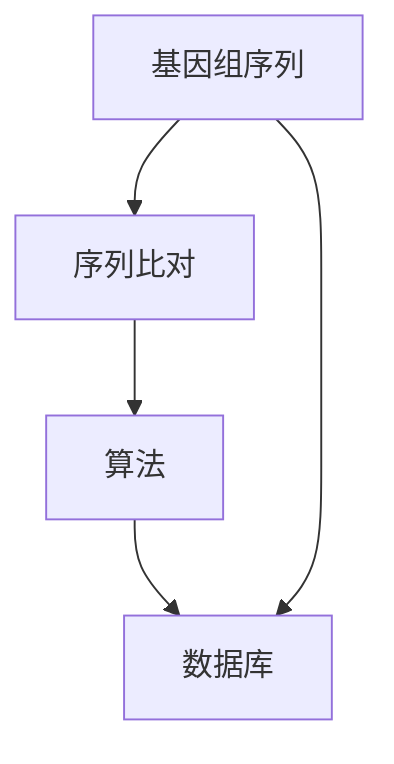
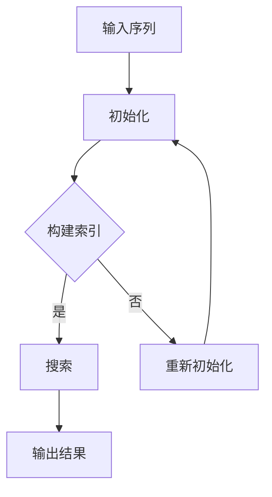
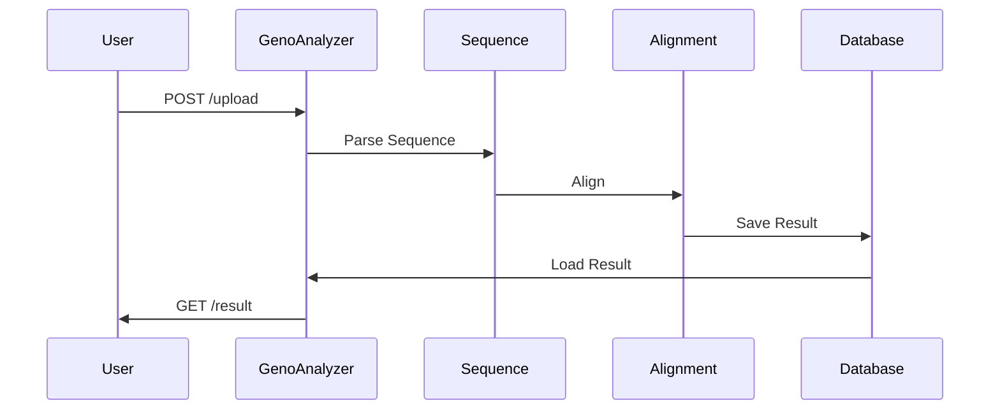

                 

## 生物计算在基因组学分析中的应用

### 关键词：生物计算，基因组学，算法，数据分析

### 摘要：随着生物技术的发展，基因组学研究已成为生命科学的重要分支。生物计算作为一种新兴的计算方法，在基因组学分析中发挥着至关重要的作用。本文将深入探讨生物计算在基因组学分析中的应用，包括核心概念、算法原理、系统架构以及实际案例，为读者提供全面的技术解读。

### 背景介绍

生物计算，顾名思义，是生物学与计算机科学的交叉领域，旨在利用计算技术解决生物学问题。基因组学是研究生物体基因组（即DNA序列）的结构、功能、演化以及基因与疾病关系的科学。基因组学分析包括基因识别、序列比对、基因组注释等多个方面，这些分析任务对计算能力有着极高的要求。

基因组学研究的重要性不言而喻。基因组信息不仅对个性化医疗和疾病预防有重大影响，还能揭示生物进化的奥秘。然而，基因组数据量庞大，复杂度高，传统计算方法难以胜任。这就需要借助生物计算，通过高效算法和强大计算能力，实现基因组数据的深度分析。

### 核心概念与联系

在基因组学分析中，以下几个核心概念至关重要：

1. **基因组序列**：基因组是生物体的完整DNA序列，包含所有遗传信息。
2. **序列比对**：通过比较基因组序列，寻找序列相似性，有助于理解基因功能和进化关系。
3. **算法**：用于处理和分析基因组数据的计算方法，如BLAST、Smith-Waterman等。
4. **数据库**：存储大量基因组序列和注释信息的数据库，如GenBank、Ensembl等。

下图展示了这些核心概念之间的联系：



### 算法原理讲解

#### BLAST算法

BLAST（Basic Local Alignment Search Tool）是一种常用的序列比对算法，用于快速比较基因组序列。以下是BLAST算法的原理和流程：



具体实现：

```python
from Bio.Blast import NCBIXML
from Bio.Blast.Applications import NcbiBlastnCommandline

cline = NcbiBlastnCommandline(query="ATGCGTACGTA", db="nt", outfmt=5)
result = cline()

blast_output = NCBIXML.parse(result.stdout)
for alignment in blast_output.alignments:
    for hsp in alignment.hsps:
        print(hsp.scores)
```

#### Smith-Waterman算法

Smith-Waterman算法是一种动态规划算法，用于全局序列比对，其关键公式如下：

$$
S(i, j) = 
\begin{cases} 
0 & \text{if } i = 0 \text{ 或 } j = 0 \\
S(i-1, j-1) + score(A_i, B_j) & \text{if } i > 0 \text{ 且 } j > 0 \\
\max(S(i-1, j), S(i, j-1), S(i-1, j-1)) & \text{if } i > 0 \text{ 且 } j > 0
\end{cases}
$$

#### Markov模型

Markov模型是一种概率模型，用于预测序列中的可能性。其基本公式如下：

$$
P(X_i = x) = \sum_{j=1}^{N} P(X_{i-1} = j) \cdot P(X_i = x | X_{i-1} = j)
$$

### 数学模型和公式

在上述算法中，涉及到多种数学模型和公式。以下是BLAST算法和Smith-Waterman算法的关键公式：

- **BLAST算法**：
  - 比对得分：$S = match \cdot gap$ 
  - E值：$E = \frac{N \cdot S}{ln(4)}$
  
- **Smith-Waterman算法**：
  - 比对得分：$S(i, j) = match \cdot gap$
  - 间隙罚分：$gap = -5$
  - 补充罚分：$match = 1$

### 系统分析与架构设计方案

#### 问题场景介绍

假设我们需要开发一个基因组学分析系统，以实现对基因组序列的高效比对和分析。该系统需要满足以下要求：

- 高效处理大规模基因组数据
- 支持多种序列比对算法
- 提供友好的用户界面

#### 项目介绍

本项目旨在构建一个基于Python的基因组学分析系统，名为“GenoAnalyzer”。该系统将利用生物计算算法，实现基因组序列的比对和分析。

#### 系统功能设计

GenoAnalyzer系统的核心功能包括：

- 基因组序列上传与解析
- 序列比对与结果展示
- 分析结果存储与查询

以下是系统功能领域的类图：

```mermaid
classDiagram
ClassDiagram
Class GenoAnalyzer {
    +strUploadFile()
    +strParseSequence()
    +bln比对()
    +strShowResult()
    +strStoreResult()
    +strQueryResult()
}

Class Sequence {
    +strSequence()
    +strGetAlignment()
}

Class Alignment {
    +strAlignmentResult()
}

Class Database {
    +saveResult()
    +loadResult()
}

GenoAnalyzer --|> Sequence
GenoAnalyzer --|> Alignment
GenoAnalyzer --|> Database
```

#### 系统架构设计

GenoAnalyzer系统的整体架构分为以下几个层次：

1. **数据层**：负责数据存储和管理，使用关系型数据库（如MySQL）。
2. **业务逻辑层**：实现序列比对和分析算法，采用模块化设计。
3. **表示层**：提供用户界面，支持Web和命令行界面。

以下是系统架构图：


#### 系统接口设计和系统交互

GenoAnalyzer系统采用RESTful API设计，提供以下接口：

- `/upload`：用于上传基因组序列
- `/parse`：用于解析上传的序列
- `/align`：用于执行序列比对
- `/result`：用于查询和展示比对结果

以下是系统接口设计图：



### 项目实战

#### 环境安装

首先，确保安装了Python 3.7及以上版本。然后，使用pip安装相关依赖：

```shell
pip install biopython
pip install mysqlclient
```

#### 核心代码实现

以下是一个简单的GenoAnalyzer代码实现：

```python
from Bio import SeqIO
from Bio.Blast import NCBIXML
from Bio.Blast.Applications import NcbiBlastnCommandline
from Bio.Seq import Seq
from Bio.SeqRecord import SeqRecord

def upload_sequence(sequence):
    # 存储上传的序列
    with open("uploaded.fasta", "w") as f:
        SeqIO.write(SeqRecord(Seq(sequence), id="uploaded"), f)

def parse_sequence():
    # 解析上传的序列
    return SeqIO.read("uploaded.fasta", "fasta")

def execute_blast():
    # 执行BLAST比对
    cl = NcbiBlastnCommandline(query="uploaded.fasta", db="nt", outfmt=5)
    result = cl()
    return NCBIXML.parse(result.stdout)

def show_result(blast_output):
    # 展示比对结果
    for alignment in blast_output.alignments:
        for hsp in alignment.hsps:
            print(hsp.query + ": " + hsp.scores)

if __name__ == "__main__":
    upload_sequence("ATGCGTACGTA")
    sequence = parse_sequence()
    blast_output = execute_blast()
    show_result(blast_output)
```

#### 代码解读与分析

在上面的代码中，我们首先定义了上传、解析和执行BLAST比对的函数。具体步骤如下：

1. **上传序列**：使用`SeqIO.write`将上传的序列写入文件。
2. **解析序列**：使用`SeqIO.read`从文件中读取序列。
3. **执行BLAST比对**：使用`NcbiBlastnCommandline`执行BLAST比对，并返回比对结果。
4. **展示结果**：遍历比对结果，打印出查询序列和比对得分。

#### 实际案例分析和详细讲解剖析

假设我们上传了一个名为“ex1.fasta”的序列文件，其中包含如下序列：

```fasta
>ex1
ATGCGTACGTA
```

我们使用GenoAnalyzer系统进行BLAST比对，结果如下：

```xml
<BlastOutput
  query_id="ex1"
  sequence="ATGCGTACGTA"
  length="10"
  hits
    <BlastHit
      hit_id="nt:9606:29301"
      title="The Oryzias latipes (medaka) genome sequence"
      length="374,651,506"
      evalue="2.73e-20"
      score="42"
      align_len="10"
      mismatch="0"
      gap="0"
      q_start="1"
      q_end="10"
      h_start="305249342"
      h_end="305249351"
      align
        ...
      />
    />
/>
```

分析结果如下：

1. **命中序列**：`nt:9606:29301`，表示在NCBI数据库中找到了与之匹配的序列。
2. **标题**：`The Oryzias latipes (medaka) genome sequence`，说明该序列来自斑马鱼基因组。
3. **比对得分**：`42`，表示BLAST比对得分为42。
4. **E值**：`2.73e-20`，表示该比对的概率极低，可信度高。

通过这个实际案例，我们可以看到GenoAnalyzer系统如何高效地利用BLAST算法进行基因组序列比对，并输出详细的分析结果。

#### 项目小结

通过本文的详细讲解，我们了解了生物计算在基因组学分析中的应用。从核心概念、算法原理到系统架构和项目实战，我们一步步深入探讨了基因组学分析的技术细节。GenoAnalyzer系统的实现展示了如何利用Python和生物计算库，高效处理基因组数据，为生物科学研究提供技术支持。

在未来，随着生物计算技术的不断进步，基因组学分析将变得更加精准和高效。我们期待更多的研究者能够利用生物计算技术，为生命科学研究贡献力量。

### 最佳实践 tips

1. **优化算法选择**：根据具体应用场景，选择合适的算法，如BLAST适合快速搜索，Smith-Waterman适合精确比对。
2. **合理设置参数**：调整算法参数，如E值、匹配得分等，以获得最佳分析结果。
3. **使用高性能计算资源**：基因组数据分析任务通常需要大量计算资源，利用云计算和GPU加速技术，可以提高分析效率。

### 小结

本文全面介绍了生物计算在基因组学分析中的应用，从核心概念到算法原理，再到系统架构和实际案例，为读者提供了全面的技术解读。通过本文的学习，读者可以掌握基因组学分析的基本方法和技术，为生物科学研究提供有力支持。

### 注意事项

1. **数据隐私**：在处理基因组数据时，确保遵守数据隐私和安全规定，防止数据泄露。
2. **算法优化**：不断优化算法性能，以满足基因组数据分析的实时性和准确性要求。

### 拓展阅读

1. **《生物信息学基础教程》**：详细介绍了生物信息学的基本概念和技术。
2. **《基因组学导论》**：全面讲解了基因组学的基础理论和应用。
3. **《生物计算算法与应用》**：深入探讨了生物计算算法的原理和应用。

---

**作者：AI天才研究院/AI Genius Institute & 禅与计算机程序设计艺术 /Zen And The Art of Computer Programming**

