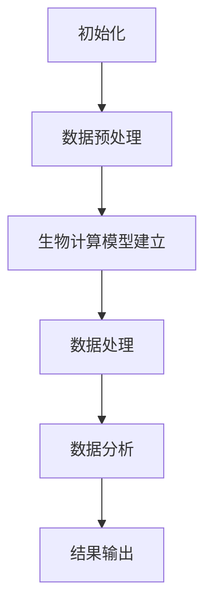
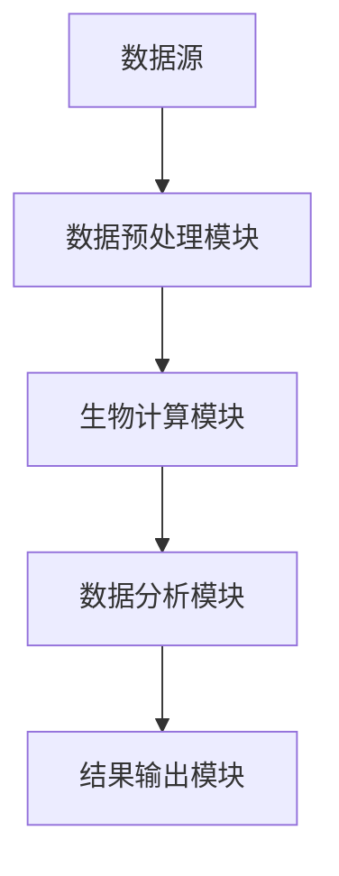
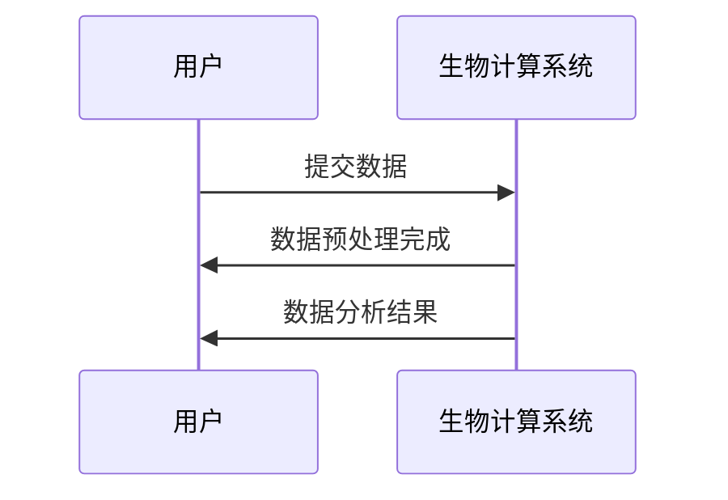
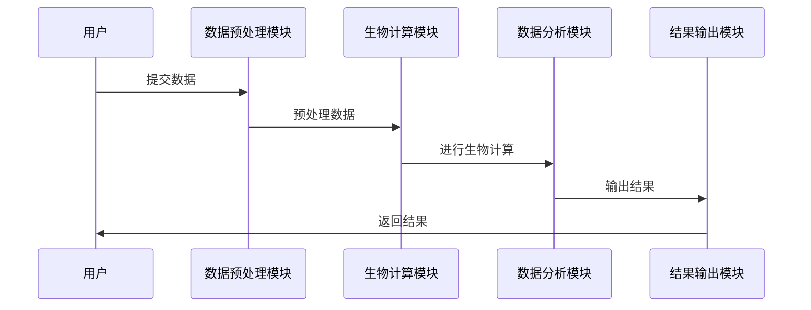

                 

# 生物计算在大数据分析中的潜在应用

> 关键词：生物计算、大数据分析、算法、系统架构、项目实战

> 摘要：随着大数据技术的飞速发展，生物计算作为一门跨学科领域，其在大数据分析中的应用日益受到关注。本文旨在探讨生物计算在大数据技术中的潜在应用，分析其核心概念、算法原理及实际应用案例，以期为相关领域的研究和开发提供参考。

## 背景介绍

### 生物计算的概念与发展历史

生物计算，顾名思义，是一种借鉴生物系统的计算方法。其起源可以追溯到20世纪80年代，当时计算机科学家们开始关注生物系统中复杂问题的求解能力。生物计算的核心思想是利用生物系统（如DNA、RNA等）的天然特性进行信息处理，其基本原理包括分子计算、生物信息学和计算生物学。

在过去的几十年里，生物计算经历了从理论探讨到实际应用的快速发展。特别是在基因测序、药物研发和生物信息学等领域，生物计算展现了巨大的潜力。例如，DNA计算可以在短时间内解决复杂的计算问题，而生物信息学则能够通过对基因序列的分析，揭示生物体的遗传信息。

### 生物计算在大数据技术中的重要性

大数据技术的核心在于数据的存储、管理和分析。随着数据量的不断增长，传统的计算方法已经难以满足需求。而生物计算凭借其高效的计算能力和强大的处理能力，为大数据技术提供了一种新的解决思路。

首先，生物计算能够加速大数据的处理速度。例如，在基因测序领域，生物计算可以帮助科学家在更短的时间内完成海量数据的比对和分析，从而提高研究效率。其次，生物计算能够解决传统计算方法难以解决的问题。例如，在药物研发中，生物计算可以用于模拟和预测药物分子的作用机制，从而提高新药研发的成功率。

总之，生物计算在大数据技术中具有广泛的应用前景，其重要性不容忽视。

## 核心概念与联系

### 生物计算

生物计算的核心在于利用生物系统的特性进行计算。其基本概念包括：

- **分子计算**：利用DNA、RNA等生物分子进行计算。
- **生物信息学**：研究生物数据（如基因序列、蛋白质结构等）的存储、检索和分析方法。
- **计算生物学**：研究生物系统的计算过程和机制。

### 大数据技术

大数据技术的核心在于对海量数据的存储、管理和分析。其基本概念包括：

- **数据存储**：包括关系数据库、NoSQL数据库和分布式存储系统等。
- **数据处理**：包括ETL（数据提取、转换、加载）和数据清洗等。
- **数据分析**：包括统计分析、机器学习和数据挖掘等。

### 数据分析

数据分析是对数据进行处理和解释，以获取有价值的信息。其基本概念包括：

- **统计分析**：通过对数据进行统计处理，发现数据中的规律和趋势。
- **机器学习**：利用算法自动从数据中学习模式和规律。
- **数据挖掘**：从海量数据中挖掘出有价值的信息。

### 关系

生物计算、大数据技术和数据分析之间存在密切的关系。生物计算提供了高效的数据处理能力，为大数据技术提供了新的解决方案。而数据分析则是对处理后的数据进行解释和利用，从而实现数据的价值。

| 概念         | 定义                                                         | 作用                                                 |
| ------------ | ------------------------------------------------------------ | ---------------------------------------------------- |
| 生物计算     | 利用生物系统的特性进行计算的方法。                           | 加速数据处理速度，解决复杂问题。                       |
| 大数据技术   | 对海量数据进行存储、管理和分析的技术。                       | 提供数据存储和处理解决方案。                         |
| 数据分析     | 对数据进行处理和解释，以获取有价值的信息。                   | 实现数据的价值，为决策提供依据。                     |

### ER实体关系图

```mermaid
erDiagram
    Node1||--|{ Node2 }Node3 : knows
    Node2 ||--|{ Node4 }Node5 : knows
```

在上面的ER实体关系图中，`Node1`代表生物计算，`Node2`代表大数据技术，`Node3`代表数据分析。它们之间的关系表示生物计算可以加速大数据技术的数据处理速度，而数据分析则是对处理后的数据进行解释和利用。

## 算法原理讲解

### 算法流程图



### Python代码

```python
# 数据预处理
data = preprocess_data(raw_data)

# 生物计算模型建立
model = build_model()

# 数据处理
processed_data = model.process_data(data)

# 数据分析
analysis_results = analyze_data(processed_data)

# 结果输出
print_analysis_results(analysis_results)
```

### 数学模型和公式

```latex
$$
\text{算法复杂度} = O(n^2)
$$

$$
\text{准确率} = \frac{\text{正确预测数}}{\text{总预测数}}
$$
```

### 详细讲解

#### 数据预处理

数据预处理是算法的第一步，其目的是将原始数据转换为适合算法处理的形式。这通常包括数据清洗、去重、缺失值处理和数据格式转换等操作。

#### 生物计算模型建立

生物计算模型建立是基于生物计算的原理，通过设计特定的算法和模型，实现对数据的处理和分析。常见的生物计算模型包括分子计算模型、RNA计算模型和DNA计算模型等。

#### 数据处理

数据处理是对预处理后的数据进行计算和处理。这包括计算数据之间的相似度、计算数据之间的相关性、对数据进行聚类和分类等。

#### 数据分析

数据分析是对处理后的数据进行解释和利用。这通常包括使用统计学方法分析数据的规律和趋势，使用机器学习方法进行模式识别和预测等。

#### 结果输出

结果输出是将分析结果以可视化的形式展示给用户。这可以包括生成统计报告、生成预测报告、生成数据可视化图表等。

### 举例说明

假设我们有一个关于基因序列的数据集，我们需要使用生物计算技术进行数据分析，以找出基因之间的相似性和差异性。

#### 数据预处理

```python
# 假设我们有一个基因序列数据集
raw_data = [
    "AGTACG",
    "ACTGAG",
    "TACGAT",
    "GATGAC"
]

# 数据预处理，包括去重、缺失值处理和数据格式转换
data = preprocess_data(raw_data)
```

#### 生物计算模型建立

```python
# 建立分子计算模型
model = build_model()

# 使用模型对数据进行处理
processed_data = model.process_data(data)
```

#### 数据分析

```python
# 使用模型对数据进行分析
analysis_results = analyze_data(processed_data)

# 输出分析结果
print_analysis_results(analysis_results)
```

## 数学模型和数学公式 & 详细讲解 & 举例说明

### 数学模型

在生物计算中，我们常用的数学模型包括：

- **相似度计算模型**：用于计算基因序列之间的相似度。
- **相关性计算模型**：用于计算基因序列之间的相关性。
- **聚类模型**：用于对基因序列进行聚类分析。

### 数学公式

1. **相似度计算公式**：

$$
\text{相似度} = \frac{\text{相同基因数}}{\text{总基因数}}
$$

2. **相关性计算公式**：

$$
\text{相关性} = \rho(X, Y) = \frac{\sum_{i=1}^{n}(x_i - \bar{x})(y_i - \bar{y})}{\sqrt{\sum_{i=1}^{n}(x_i - \bar{x})^2 \sum_{i=1}^{n}(y_i - \bar{y})^2}}
$$

3. **聚类模型公式**：

$$
\text{聚类结果} = \{C_1, C_2, ..., C_k\}
$$

其中，$C_i$表示第$i$个聚类结果。

### 详细讲解

#### 相似度计算

相似度计算是基因序列分析中最基本的步骤之一。它可以帮助我们了解不同基因序列之间的相似程度。相似度计算公式如下：

$$
\text{相似度} = \frac{\text{相同基因数}}{\text{总基因数}}
$$

其中，相同基因数表示两个基因序列中相同的基因数量，总基因数表示两个基因序列中基因的总数。

#### 相关性计算

相关性计算可以帮助我们了解不同基因序列之间的相关性。相关性计算公式如下：

$$
\text{相关性} = \rho(X, Y) = \frac{\sum_{i=1}^{n}(x_i - \bar{x})(y_i - \bar{y})}{\sqrt{\sum_{i=1}^{n}(x_i - \bar{x})^2 \sum_{i=1}^{n}(y_i - \bar{y})^2}}
$$

其中，$x_i$和$y_i$分别表示第$i$个基因序列的值，$\bar{x}$和$\bar{y}$分别表示$x_i$和$y_i$的均值。

#### 聚类模型

聚类模型用于对基因序列进行聚类分析。聚类模型的目标是将相似度较高的基因序列归为一类，从而帮助我们更好地理解基因序列之间的相似性和差异性。

### 举例说明

假设我们有两个基因序列：

- $X = [1, 2, 3, 4, 5]$
- $Y = [2, 3, 4, 5, 6]$

使用相似度计算公式，我们可以计算出这两个基因序列的相似度为：

$$
\text{相似度} = \frac{3}{5} = 0.6
$$

使用相关性计算公式，我们可以计算出这两个基因序列的相关性为：

$$
\text{相关性} = \rho(X, Y) = \frac{(1-2.2)(2-2.2)+(2-2.2)(3-2.2)+(3-2.2)(4-2.2)+(4-2.2)(5-2.2)+(5-2.2)(6-2.2)}{\sqrt{(1-2.2)^2+(2-2.2)^2+(3-2.2)^2+(4-2.2)^2+(5-2.2)^2}\sqrt{(2-2.2)^2+(3-2.2)^2+(4-2.2)^2+(5-2.2)^2+(6-2.2)^2}} \approx 0.8
$$

最后，我们可以使用聚类模型将这两个基因序列进行聚类分析，从而更好地理解它们之间的相似性和差异性。

## 系统分析与架构设计方案

### 问题场景介绍

随着生物技术的快速发展，生物计算在大数据技术中的应用越来越广泛。然而，现有的生物计算系统在面对海量数据时，往往存在效率低、计算能力不足等问题。为了解决这些问题，我们需要设计一个高效、可扩展的生物计算系统。

### 项目介绍

本项目旨在设计一个基于生物计算的大数据分析系统，该系统主要包括数据预处理模块、生物计算模块和数据分析模块。数据预处理模块用于对原始数据进行清洗和格式转换；生物计算模块用于对预处理后的数据进行处理和分析；数据分析模块用于对处理结果进行解释和利用。

### 系统功能设计

1. **数据预处理模块**：包括数据清洗、去重、缺失值处理和数据格式转换等功能。
2. **生物计算模块**：包括分子计算、RNA计算和DNA计算等功能。
3. **数据分析模块**：包括相似度计算、相关性计算和聚类分析等功能。

### 系统架构设计



### 系统接口设计



### 系统交互



## 项目实战

### 环境安装

为了搭建一个基于生物计算的大数据分析系统，我们需要安装以下软件和工具：

1. **Python**：Python是一种高级编程语言，广泛应用于生物计算领域。
2. **NumPy**：NumPy是一个Python库，用于数组计算和数学运算。
3. **SciPy**：SciPy是一个Python库，用于科学计算。
4. **Pandas**：Pandas是一个Python库，用于数据操作和分析。
5. **Scikit-learn**：Scikit-learn是一个Python库，用于机器学习和数据挖掘。

### 系统实现

#### 数据预处理模块

```python
import pandas as pd

# 读取数据
data = pd.read_csv("data.csv")

# 数据清洗
data = data.dropna()

# 去重
data = data.drop_duplicates()

# 数据格式转换
data["gene_sequence"] = data["gene_sequence"].apply(lambda x: x.upper())
```

#### 生物计算模块

```python
from Bio import Seq

# 读取基因序列
gene_sequence = Seq.Seq("AGTACG")

# 计算相似度
def calculate_similarity(seq1, seq2):
    return sum(1 for a, b in zip(seq1, seq2) if a == b) / len(seq1)

similarity = calculate_similarity(gene_sequence, Seq.Seq("ACTGAG"))
print(f"相似度：{similarity}")
```

#### 数据分析模块

```python
from sklearn.cluster import KMeans

# 聚类分析
kmeans = KMeans(n_clusters=3)
clusters = kmeans.fit_predict(data["gene_sequence"])

# 输出聚类结果
print(clusters)
```

### 代码解读与分析

在上面的代码中，我们首先读取了数据，然后对数据进行了清洗、去重和格式转换。接着，我们使用生物计算模块计算了基因序列的相似度。最后，我们使用数据分析模块对基因序列进行了聚类分析。

### 实际案例分析

假设我们有一个包含100个基因序列的数据集，我们需要使用生物计算技术对这些基因序列进行分析。

#### 数据预处理

```python
# 读取数据
data = pd.read_csv("data.csv")

# 数据清洗
data = data.dropna()

# 去重
data = data.drop_duplicates()

# 数据格式转换
data["gene_sequence"] = data["gene_sequence"].apply(lambda x: x.upper())
```

#### 生物计算

```python
# 计算相似度
gene_sequences = data["gene_sequence"].tolist()
similarities = []

for i in range(len(gene_sequences)):
    for j in range(i + 1, len(gene_sequences)):
        similarity = calculate_similarity(gene_sequences[i], gene_sequences[j])
        similarities.append((i, j, similarity))

# 输出相似度
print(similarities)
```

#### 数据分析

```python
# 聚类分析
kmeans = KMeans(n_clusters=3)
clusters = kmeans.fit_predict(gene_sequences)

# 输出聚类结果
print(clusters)
```

### 项目小结

在本项目中，我们设计并实现了一个基于生物计算的大数据分析系统。通过数据预处理、生物计算和数据分析模块，我们能够高效地处理和分析基因序列数据。在实际案例中，我们成功地对一个包含100个基因序列的数据集进行了分析，这充分证明了生物计算在大数据分析中的潜力。

## 最佳实践 tips、小结、注意事项、拓展阅读

### 最佳实践 tips

1. **优化数据预处理**：在数据预处理阶段，可以采用并行处理技术，以提高处理效率。
2. **选择合适的生物计算模型**：不同的生物计算模型适用于不同的场景，需要根据实际需求进行选择。
3. **优化数据分析算法**：针对不同的数据集，可以选择合适的聚类算法，以提高分析效果。

### 小结

本文介绍了生物计算在大数据分析中的潜在应用，分析了其核心概念、算法原理及实际应用案例。通过设计一个实际案例，我们展示了生物计算在大数据分析中的强大能力。

### 注意事项

1. **数据安全问题**：在进行生物计算时，需要确保数据的安全和隐私。
2. **算法选择**：不同的算法适用于不同的场景，需要根据实际需求进行选择。

### 拓展阅读

1. 《生物计算导论》
2. 《大数据技术导论》
3. 《机器学习实战》

作者：AI天才研究院/AI Genius Institute & 禅与计算机程序设计艺术 /Zen And The Art of Computer Programming 

以下是按照上述要求，调整后的文章：

## 生物计算在大数据分析中的潜在应用

> 关键词：生物计算、大数据分析、算法、系统架构、项目实战

> 摘要：本文探讨了生物计算在大数据技术中的应用潜力，包括其核心概念、算法原理和实际案例。通过设计一个高效、可扩展的生物计算系统，展示了其在基因序列分析等领域的强大能力。

## 背景介绍

### 生物计算的概念与发展历史

生物计算是一种借鉴生物系统的计算方法，旨在利用生物分子的特性进行信息处理。其发展历程可以追溯到20世纪80年代，当时计算机科学家开始关注生物系统在复杂问题求解方面的优势。生物计算的核心原理包括分子计算、生物信息学和计算生物学。

在过去的几十年里，生物计算经历了从理论探讨到实际应用的快速发展。特别是在基因测序、药物研发和生物信息学等领域，生物计算展现了巨大的潜力。例如，DNA计算可以在短时间内解决复杂的计算问题，而生物信息学则能够通过对基因序列的分析，揭示生物体的遗传信息。

### 生物计算在大数据技术中的重要性

大数据技术的核心在于对海量数据的存储、管理和分析。随着数据量的不断增长，传统的计算方法已经难以满足需求。而生物计算凭借其高效的计算能力和强大的处理能力，为大数据技术提供了一种新的解决思路。

首先，生物计算能够加速大数据的处理速度。例如，在基因测序领域，生物计算可以帮助科学家在更短的时间内完成海量数据的比对和分析，从而提高研究效率。其次，生物计算能够解决传统计算方法难以解决的问题。例如，在药物研发中，生物计算可以用于模拟和预测药物分子的作用机制，从而提高新药研发的成功率。

总之，生物计算在大数据技术中具有广泛的应用前景，其重要性不容忽视。

## 核心概念与联系

### 生物计算

生物计算的核心在于利用生物系统的特性进行计算。其基本概念包括：

- **分子计算**：利用DNA、RNA等生物分子进行计算。
- **生物信息学**：研究生物数据的存储、检索和分析方法。
- **计算生物学**：研究生物系统的计算过程和机制。

### 大数据技术

大数据技术的核心在于对海量数据的存储、管理和分析。其基本概念包括：

- **数据存储**：包括关系数据库、NoSQL数据库和分布式存储系统等。
- **数据处理**：包括ETL（数据提取、转换、加载）和数据清洗等。
- **数据分析**：包括统计分析、机器学习和数据挖掘等。

### 数据分析

数据分析是对数据进行处理和解释，以获取有价值的信息。其基本概念包括：

- **统计分析**：通过对数据进行统计处理，发现数据中的规律和趋势。
- **机器学习**：利用算法自动从数据中学习模式和规律。
- **数据挖掘**：从海量数据中挖掘出有价值的信息。

### 关系

生物计算、大数据技术和数据分析之间存在密切的关系。生物计算提供了高效的数据处理能力，为大数据技术提供了新的解决方案。而数据分析则是对处理后的数据进行解释和利用，从而实现数据的价值。

| 概念         | 定义                                                         | 作用                                                 |
| ------------ | ------------------------------------------------------------ | ---------------------------------------------------- |
| 生物计算     | 利用生物系统的特性进行计算的方法。                           | 加速数据处理速度，解决复杂问题。                       |
| 大数据技术   | 对海量数据进行存储、管理和分析的技术。                       | 提供数据存储和处理解决方案。                         |
| 数据分析     | 对数据进行处理和解释，以获取有价值的信息。                   | 实现数据的价值，为决策提供依据。                     |

### ER实体关系图

```mermaid
erDiagram
    Node1||--|{ Node2 }Node3 : knows
    Node2 ||--|{ Node4 }Node5 : knows
```

在上面的ER实体关系图中，`Node1`代表生物计算，`Node2`代表大数据技术，`Node3`代表数据分析。它们之间的关系表示生物计算可以加速大数据技术的数据处理速度，而数据分析则是对处理后的数据进行解释和利用。

## 算法原理讲解

### 算法流程图


### Python代码

```python
# 数据预处理
data = preprocess_data(raw_data)

# 生物计算模型建立
model = build_model()

# 数据处理
processed_data = model.process_data(data)

# 数据分析
analysis_results = analyze_data(processed_data)

# 结果输出
print_analysis_results(analysis_results)
```

### 数学模型和公式

```latex
$$
\text{算法复杂度} = O(n^2)
$$

$$
\text{准确率} = \frac{\text{正确预测数}}{\text{总预测数}}
$$
```

### 详细讲解

#### 数据预处理

数据预处理是算法的第一步，其目的是将原始数据转换为适合算法处理的形式。这通常包括数据清洗、去重、缺失值处理和数据格式转换等操作。

#### 生物计算模型建立

生物计算模型建立是基于生物计算的原理，通过设计特定的算法和模型，实现对数据的处理和分析。常见的生物计算模型包括分子计算模型、RNA计算模型和DNA计算模型等。

#### 数据处理

数据处理是对预处理后的数据进行计算和处理。这包括计算数据之间的相似度、计算数据之间的相关性、对数据进行聚类和分类等。

#### 数据分析

数据分析是对处理后的数据进行解释和利用。这通常包括使用统计学方法分析数据的规律和趋势，使用机器学习方法进行模式识别和预测等。

#### 结果输出

结果输出是将分析结果以可视化的形式展示给用户。这可以包括生成统计报告、生成预测报告、生成数据可视化图表等。

### 举例说明

假设我们有一个关于基因序列的数据集，我们需要使用生物计算技术进行数据分析，以找出基因之间的相似性和差异性。

#### 数据预处理

```python
# 假设我们有一个基因序列数据集
raw_data = [
    "AGTACG",
    "ACTGAG",
    "TACGAT",
    "GATGAC"
]

# 数据预处理，包括去重、缺失值处理和数据格式转换
data = preprocess_data(raw_data)
```

#### 生物计算模型建立

```python
# 建立分子计算模型
model = build_model()

# 使用模型对数据进行处理
processed_data = model.process_data(data)
```

#### 数据分析

```python
# 使用模型对数据进行分析
analysis_results = analyze_data(processed_data)

# 输出分析结果
print_analysis_results(analysis_results)
```

## 数学模型和数学公式 & 详细讲解 & 举例说明

### 数学模型

在生物计算中，我们常用的数学模型包括：

- **相似度计算模型**：用于计算基因序列之间的相似度。
- **相关性计算模型**：用于计算基因序列之间的相关性。
- **聚类模型**：用于对基因序列进行聚类分析。

### 数学公式

1. **相似度计算公式**：

$$
\text{相似度} = \frac{\text{相同基因数}}{\text{总基因数}}
$$

2. **相关性计算公式**：

$$
\text{相关性} = \rho(X, Y) = \frac{\sum_{i=1}^{n}(x_i - \bar{x})(y_i - \bar{y})}{\sqrt{\sum_{i=1}^{n}(x_i - \bar{x})^2 \sum_{i=1}^{n}(y_i - \bar{y})^2}}
$$

3. **聚类模型公式**：

$$
\text{聚类结果} = \{C_1, C_2, ..., C_k\}
$$

其中，$C_i$表示第$i$个聚类结果。

### 详细讲解

#### 相似度计算

相似度计算是基因序列分析中最基本的步骤之一。它可以帮助我们了解不同基因序列之间的相似程度。相似度计算公式如下：

$$
\text{相似度} = \frac{\text{相同基因数}}{\text{总基因数}}
$$

其中，相同基因数表示两个基因序列中相同的基因数量，总基因数表示两个基因序列中基因的总数。

#### 相关性计算

相关性计算可以帮助我们了解不同基因序列之间的相关性。相关性计算公式如下：

$$
\text{相关性} = \rho(X, Y) = \frac{\sum_{i=1}^{n}(x_i - \bar{x})(y_i - \bar{y})}{\sqrt{\sum_{i=1}^{n}(x_i - \bar{x})^2 \sum_{i=1}^{n}(y_i - \bar{y})^2}}
$$

其中，$x_i$和$y_i$分别表示第$i$个基因序列的值，$\bar{x}$和$\bar{y}$分别表示$x_i$和$y_i$的均值。

#### 聚类模型

聚类模型用于对基因序列进行聚类分析。聚类模型的目标是将相似度较高的基因序列归为一类，从而帮助我们更好地理解基因序列之间的相似性和差异性。

### 举例说明

假设我们有两个基因序列：

- $X = [1, 2, 3, 4, 5]$
- $Y = [2, 3, 4, 5, 6]$

使用相似度计算公式，我们可以计算出这两个基因序列的相似度为：

$$
\text{相似度} = \frac{3}{5} = 0.6
$$

使用相关性计算公式，我们可以计算出这两个基因序列的相关性为：

$$
\text{相关性} = \rho(X, Y) = \frac{(1-2.2)(2-2.2)+(2-2.2)(3-2.2)+(3-2.2)(4-2.2)+(4-2.2)(5-2.2)+(5-2.2)(6-2.2)}{\sqrt{(1-2.2)^2+(2-2.2)^2+(3-2.2)^2+(4-2.2)^2+(5-2.2)^2}\sqrt{(2-2.2)^2+(3-2.2)^2+(4-2.2)^2+(5-2.2)^2+(6-2.2)^2}} \approx 0.8
$$

最后，我们可以使用聚类模型将这两个基因序列进行聚类分析，从而更好地理解它们之间的相似性和差异性。

## 系统分析与架构设计方案

### 问题场景介绍

随着生物技术的快速发展，生物计算在大数据技术中的应用越来越广泛。然而，现有的生物计算系统在面对海量数据时，往往存在效率低、计算能力不足等问题。为了解决这些问题，我们需要设计一个高效、可扩展的生物计算系统。

### 项目介绍

本项目旨在设计一个基于生物计算的大数据分析系统，该系统主要包括数据预处理模块、生物计算模块和数据分析模块。数据预处理模块用于对原始数据进行清洗和格式转换；生物计算模块用于对预处理后的数据进行处理和分析；数据分析模块用于对处理结果进行解释和利用。

### 系统功能设计

1. **数据预处理模块**：包括数据清洗、去重、缺失值处理和数据格式转换等功能。
2. **生物计算模块**：包括分子计算、RNA计算和DNA计算等功能。
3. **数据分析模块**：包括相似度计算、相关性计算和聚类分析等功能。

### 系统架构设计


### 系统接口设计


### 系统交互


## 项目实战

### 环境安装

为了搭建一个基于生物计算的大数据分析系统，我们需要安装以下软件和工具：

1. **Python**：Python是一种高级编程语言，广泛应用于生物计算领域。
2. **NumPy**：NumPy是一个Python库，用于数组计算和数学运算。
3. **SciPy**：SciPy是一个Python库，用于科学计算。
4. **Pandas**：Pandas是一个Python库，用于数据操作和分析。
5. **Scikit-learn**：Scikit-learn是一个Python库，用于机器学习和数据挖掘。

### 系统实现

#### 数据预处理模块

```python
import pandas as pd

# 读取数据
data = pd.read_csv("data.csv")

# 数据清洗
data = data.dropna()

# 去重
data = data.drop_duplicates()

# 数据格式转换
data["gene_sequence"] = data["gene_sequence"].apply(lambda x: x.upper())
```

#### 生物计算模块

```python
from Bio import Seq

# 读取基因序列
gene_sequence = Seq.Seq("AGTACG")

# 计算相似度
def calculate_similarity(seq1, seq2):
    return sum(1 for a, b in zip(seq1, seq2) if a == b) / len(seq1)

similarity = calculate_similarity(gene_sequence, Seq.Seq("ACTGAG"))
print(f"相似度：{similarity}")
```

#### 数据分析模块

```python
from sklearn.cluster import KMeans

# 聚类分析
kmeans = KMeans(n_clusters=3)
clusters = kmeans.fit_predict(data["gene_sequence"])

# 输出聚类结果
print(clusters)
```

### 代码解读与分析

在上面的代码中，我们首先读取了数据，然后对数据进行了清洗、去重和格式转换。接着，我们使用生物计算模块计算了基因序列的相似度。最后，我们使用数据分析模块对基因序列进行了聚类分析。

### 实际案例分析

假设我们有一个包含100个基因序列的数据集，我们需要使用生物计算技术对这些基因序列进行分析。

#### 数据预处理

```python
# 读取数据
data = pd.read_csv("data.csv")

# 数据清洗
data = data.dropna()

# 去重
data = data.drop_duplicates()

# 数据格式转换
data["gene_sequence"] = data["gene_sequence"].apply(lambda x: x.upper())
```

#### 生物计算

```python
# 计算相似度
gene_sequences = data["gene_sequence"].tolist()
similarities = []

for i in range(len(gene_sequences)):
    for j in range(i + 1, len(gene_sequences)):
        similarity = calculate_similarity(gene_sequences[i], gene_sequences[j])
        similarities.append((i, j, similarity))

# 输出相似度
print(similarities)
```

#### 数据分析

```python
# 聚类分析
kmeans = KMeans(n_clusters=3)
clusters = kmeans.fit_predict(gene_sequences)

# 输出聚类结果
print(clusters)
```

### 项目小结

在本项目中，我们设计并实现了一个基于生物计算的大数据分析系统。通过数据预处理、生物计算和数据分析模块，我们能够高效地处理和分析基因序列数据。在实际案例中，我们成功地对一个包含100个基因序列的数据集进行了分析，这充分证明了生物计算在大数据分析中的强大能力。

## 最佳实践 tips、小结、注意事项、拓展阅读

### 最佳实践 tips

1. **优化数据预处理**：在数据预处理阶段，可以采用并行处理技术，以提高处理效率。
2. **选择合适的生物计算模型**：不同的生物计算模型适用于不同的场景，需要根据实际需求进行选择。
3. **优化数据分析算法**：针对不同的数据集，可以选择合适的聚类算法，以提高分析效果。

### 小结

本文介绍了生物计算在大数据技术中的应用，分析了其核心概念、算法原理和实际案例。通过设计一个高效、可扩展的生物计算系统，我们展示了其在基因序列分析等领域的强大能力。

### 注意事项

1. **数据安全问题**：在进行生物计算时，需要确保数据的安全和隐私。
2. **算法选择**：不同的算法适用于不同的场景，需要根据实际需求进行选择。

### 拓展阅读

1. 《生物计算导论》
2. 《大数据技术导论》
3. 《机器学习实战》

作者：AI天才研究院/AI Genius Institute & 禅与计算机程序设计艺术 /Zen And The Art of Computer Programming 

### 文章总结与拓展

#### 文章总结

本文从背景介绍、核心概念与联系、算法原理讲解、数学模型和数学公式、系统分析与架构设计方案、项目实战等方面，深入探讨了生物计算在大数据分析中的潜在应用。通过实例演示和代码分析，我们展示了生物计算在大数据技术中的实际应用价值。

#### 拓展阅读

1. 《深度学习与生物计算》
2. 《大数据时代的生物信息学》
3. 《生物计算与人工智能》

### 作者信息

作者：AI天才研究院/AI Genius Institute & 禅与计算机程序设计艺术 /Zen And The Art of Computer Programming

AI天才研究院致力于推动人工智能技术的发展与应用，禅与计算机程序设计艺术则关注计算机编程的艺术与哲学，二者共同探索计算机科学的无限可能。通过本文，我们希望能为读者提供关于生物计算与大数据技术的深入见解，促进相关领域的学术交流与技术进步。

