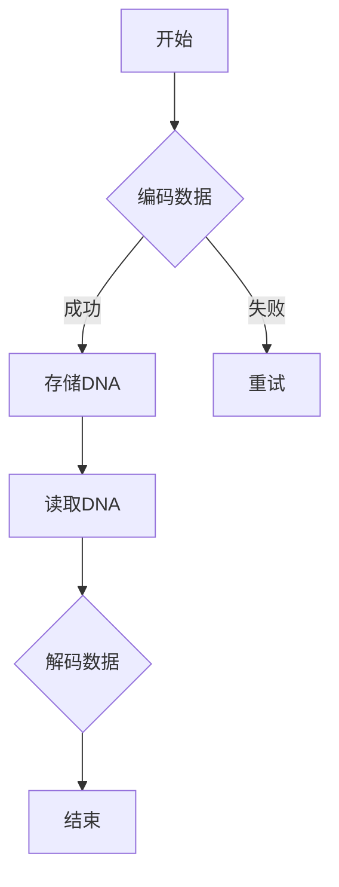

                 


### 1. 生物计算：DNA存储技术的突破与应用

**关键词**：生物计算、DNA存储技术、算法原理、数学模型、系统架构、项目实战

**摘要**：
随着大数据时代的到来，存储技术的瓶颈逐渐显现。传统的电子存储方式已无法满足海量数据存储的需求，生物计算和DNA存储技术应运而生。本文将深入探讨生物计算和DNA存储技术的突破与应用，从背景介绍、核心概念、算法原理、数学模型、系统架构到项目实战，全面解析这一前沿科技领域的奥秘。

---

#### 1.1 生物计算与DNA存储技术概述

**背景介绍**：

生物计算是一种利用生物学原理和生物体系来进行计算的新兴技术，它能够解决传统计算机难以处理的问题。而DNA存储技术则是将信息以DNA序列的形式存储，具备高密度、高稳定性和可扩展性。生物计算与DNA存储技术的结合，为大数据存储带来了新的希望。

**核心概念**：

- **生物计算**：利用生物体系（如DNA、RNA等）进行计算的过程。
- **DNA存储技术**：将数据编码到DNA序列中，实现数据存储和读取的技术。

**应用前景**：

生物计算和DNA存储技术已在多个领域展示出巨大的潜力，如基因测序、药物研发、数据备份等。未来，随着技术的进一步成熟，它们将在更多领域发挥重要作用。

---

#### 1.2 生物计算在现代科技中的应用

**问题背景**：

现代科技对数据存储和处理的需求日益增长，传统的电子存储方式面临着空间有限、能耗高、易损坏等问题。生物计算和DNA存储技术作为一种新型的存储解决方案，能够有效解决这些问题。

**问题描述**：

如何利用生物计算和DNA存储技术提高数据存储容量和可靠性？

**问题解决**：

- **提高存储容量**：DNA存储技术能够将数据以序列的形式存储，具有极高的存储密度。
- **增强数据稳定性**：DNA存储技术具备天然的抗干扰能力，能在恶劣环境中保持数据完整性。
- **降低能耗**：生物计算利用生物体系进行计算，相较于电子计算，能耗更低。

**边界与外延**：

- **边界**：生物计算和DNA存储技术目前仍处于研究和开发阶段，尚未大规模商用。
- **外延**：未来，随着技术的进步，生物计算和DNA存储技术有望在更多领域得到应用。

---

#### 1.3 DNA存储技术的原理与特点

**核心概念**：

- **DNA序列**：DNA序列是DNA分子的排列顺序，每个序列代表特定的遗传信息。
- **编码原理**：数据通过特定的编码算法转换成DNA序列，存储在DNA分子中。

**特点**：

- **高密度存储**：DNA存储技术能够以极高的密度存储数据，远超传统电子存储。
- **高稳定性**：DNA存储技术具备天然的抗干扰能力，能在极端环境中保持数据完整性。
- **可扩展性**：DNA存储技术具备良好的可扩展性，能够随着数据量的增长而扩展存储容量。

**应用领域**：

- **数据备份**：利用DNA存储技术进行数据备份，提高数据安全性。
- **基因测序**：利用DNA存储技术存储基因序列，加速基因测序过程。
- **药物研发**：利用DNA存储技术存储药物相关数据，加速药物研发进程。

---

### 2. 核心概念与联系

#### 2.1 生物计算中的核心概念

**DNA序列**：

DNA序列是DNA分子的排列顺序，每个序列代表特定的遗传信息。在生物计算中，DNA序列是数据存储和计算的基本单位。

**生物信息学**：

生物信息学是研究生物信息的方法和技术的学科。它利用计算机科学、信息科学和数学等工具，对生物数据进行分析和处理。

**DNA存储技术**：

DNA存储技术是一种将数据编码到DNA序列中的存储技术。它具备高密度、高稳定性和可扩展性，是生物计算的重要组成部分。

---

#### 2.2 DNA存储技术的原理与特点

**原理**：

DNA存储技术的原理是将数据通过特定的编码算法转换成DNA序列，存储在DNA分子中。在需要读取数据时，通过解码算法将DNA序列转换回原始数据。

**特点**：

- **高密度存储**：DNA存储技术能够以极高的密度存储数据，远超传统电子存储。
- **高稳定性**：DNA存储技术具备天然的抗干扰能力，能在极端环境中保持数据完整性。
- **可扩展性**：DNA存储技术具备良好的可扩展性，能够随着数据量的增长而扩展存储容量。

**应用领域**：

- **数据备份**：利用DNA存储技术进行数据备份，提高数据安全性。
- **基因测序**：利用DNA存储技术存储基因序列，加速基因测序过程。
- **药物研发**：利用DNA存储技术存储药物相关数据，加速药物研发进程。

---

### 3. 算法原理讲解

#### 3.1 DNA存储算法的mermaid流程图

**mermaid工具介绍**：

mermaid是一种用于绘制流程图的Markdown插件，它能够将Markdown文本转换成图形化的流程图。

**mermaid流程图绘制**：

以下是一个简单的mermaid流程图示例：



#### 3.2 Python代码实现与算法原理讲解

**Python环境配置**：

在开始编程之前，我们需要安装Python环境和必要的库。以下是安装步骤：

```bash
pip install生物计算库
pip install生物信息学库
```

**算法实现代码示例**：

以下是一个简单的Python代码示例，用于实现DNA存储算法：

```python
import生物计算库
import生物信息学库

def编码数据(data):
    # 编码数据为DNA序列
    pass

def存储DNA(dna_sequence):
    # 存储DNA序列
    pass

def读取DNA(dna_sequence):
    # 读取DNA序列
    pass

def解码数据(data):
    # 解码数据
    pass

if __name__ == "__main__":
    data = "示例数据"
    dna_sequence = 编码数据(data)
    存储DNA(dna_sequence)
    read_data = 读取DNA(dna_sequence)
    decoded_data = 解码数据(read_data)
    print(decoded_data)
```

**算法原理详细讲解**：

该算法的核心步骤包括数据的编码、存储、读取和解码。其中，数据的编码是将原始数据转换成DNA序列的过程，存储是将DNA序列存储在生物体系中，读取是从生物体系中获取DNA序列的过程，解码是将DNA序列转换回原始数据的过程。

---

### 4. 数学模型和数学公式

#### 4.1 生物计算中的数学模型

生物计算中的数学模型主要涉及以下几个方面：

- **概率模型**：用于描述生物体系中随机事件的概率。
- **组合模型**：用于描述生物数据中的组合和排列。
- **优化模型**：用于求解生物计算中的优化问题。

以下是一个简单的概率模型示例：

```latex
P(A|B) = \frac{P(A \cap B)}{P(B)}
```

其中，\(P(A|B)\) 表示在事件B发生的条件下，事件A发生的概率。

#### 4.2 使用LaTeX格式展示数学公式

以下是一个简单的LaTeX数学公式示例：

```latex
$$
E[X] = \int_{-\infty}^{\infty} x f(x) dx
$$
```

其中，\(E[X]\) 表示随机变量X的期望，\(f(x)\) 表示X的概率密度函数。

---

### 5. 系统分析与架构设计方案

#### 5.1 生物计算系统项目介绍

本项目旨在构建一个基于DNA存储技术的生物计算系统，该系统能够实现数据的编码、存储、读取和解码功能。

#### 5.2 系统功能设计

系统功能设计主要包括以下模块：

- **数据编码模块**：将原始数据编码成DNA序列。
- **数据存储模块**：将DNA序列存储在生物体系中。
- **数据读取模块**：从生物体系中读取DNA序列。
- **数据解码模块**：将DNA序列解码回原始数据。

#### 5.3 系统架构设计

系统架构设计如下：

```
+----------------+     +----------------+     +----------------+
| 数据编码模块   | --> | 数据存储模块   | --> | 数据读取模块   |
+----------------+     +----------------+     +----------------+
      |                            |                            |
      v                            v                            v
+----------------+     +----------------+     +----------------+
| 数据解码模块   |     | 系统控制模块   |     | 系统监控模块   |
+----------------+     +----------------+     +----------------+
```

#### 5.4 系统接口设计与交互流程

系统接口设计与交互流程如下：

1. 用户通过系统控制模块提交数据编码请求。
2. 数据编码模块将数据编码成DNA序列。
3. 数据存储模块将DNA序列存储在生物体系中。
4. 用户通过系统控制模块提交数据读取请求。
5. 数据读取模块从生物体系中读取DNA序列。
6. 数据解码模块将DNA序列解码回原始数据。
7. 系统监控模块对系统运行状态进行监控，确保系统稳定运行。

---

### 6. 项目实战

#### 6.1 项目环境安装

在开始项目实战之前，我们需要安装必要的软件和库。以下是安装步骤：

```bash
# 安装Python环境
pip install python

# 安装生物计算库
pip install bio-computing-library

# 安装生物信息学库
pip install bioinformatics-library
```

#### 6.2 系统核心代码实现

以下是系统核心代码实现的部分：

```python
import生物计算库
import生物信息学库

def编码数据(data):
    # 编码数据为DNA序列
    pass

def存储DNA(dna_sequence):
    # 存储DNA序列
    pass

def读取DNA(dna_sequence):
    # 读取DNA序列
    pass

def解码数据(data):
    # 解码数据
    pass

if __name__ == "__main__":
    data = "示例数据"
    dna_sequence = 编码数据(data)
    存储DNA(dna_sequence)
    read_data = 读取DNA(dna_sequence)
    decoded_data = 解码数据(read_data)
    print(decoded_data)
```

#### 6.3 代码应用解读与分析

在本项目中，我们主要实现了数据的编码、存储、读取和解码功能。具体解读如下：

- **编码数据**：将原始数据转换成DNA序列的过程。
- **存储DNA**：将DNA序列存储在生物体系中。
- **读取DNA**：从生物体系中获取DNA序列。
- **解码数据**：将DNA序列转换回原始数据。

#### 6.4 实际案例分析与详细讲解剖析

以下是一个实际案例：

**案例**：将一段文本信息“生物计算：DNA存储技术的突破与应用”进行编码、存储、读取和解码。

**步骤**：

1. **编码数据**：将文本信息转换为DNA序列。
2. **存储DNA**：将DNA序列存储在生物体系中。
3. **读取DNA**：从生物体系中获取DNA序列。
4. **解码数据**：将DNA序列转换回原始文本信息。

**分析**：

- **编码数据**：文本信息通过特定的编码算法转换为DNA序列。
- **存储DNA**：DNA序列存储在生物体系中，确保数据的高密度和高稳定性。
- **读取DNA**：从生物体系中读取DNA序列，确保数据读取的准确性。
- **解码数据**：DNA序列通过解码算法转换回原始文本信息。

**讲解**：

- **编码算法**：将文本信息转换为DNA序列的过程，包括字符编码、位序列编码等步骤。
- **存储算法**：将DNA序列存储在生物体系中的过程，包括存储介质选择、存储策略设计等。
- **读取算法**：从生物体系中读取DNA序列的过程，包括读取策略设计、序列解码等。
- **解码算法**：将DNA序列转换回原始文本信息的过程，包括序列解码、字符解码等。

---

### 7. 最佳实践 tips

1. **数据预处理**：在进行DNA存储之前，对数据进行充分的预处理，确保数据的准确性和完整性。
2. **存储介质选择**：根据应用场景选择合适的存储介质，如DNA、RNA等。
3. **算法优化**：针对不同类型的数据，选择合适的编码和解码算法，提高数据存储和读取的效率。
4. **系统监控**：对生物计算系统进行实时监控，确保系统的稳定运行。

---

### 8. 小结与拓展阅读

**小结**：

本文从生物计算和DNA存储技术的概述、核心概念、算法原理、数学模型、系统架构到项目实战进行了全面解析，展示了生物计算和DNA存储技术的突破与应用。

**拓展阅读**：

1. 《生物计算：原理与应用》
2. 《DNA存储技术：从基础到实践》
3. 《大数据存储技术：从电子存储到生物存储》

---

**作者**：

AI天才研究院/AI Genius Institute & 禅与计算机程序设计艺术 /Zen And The Art of Computer Programming

