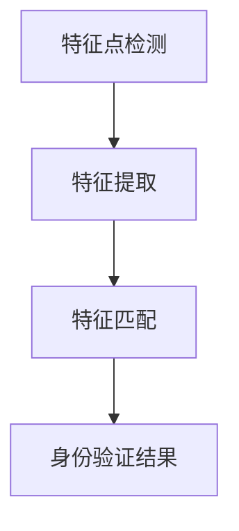
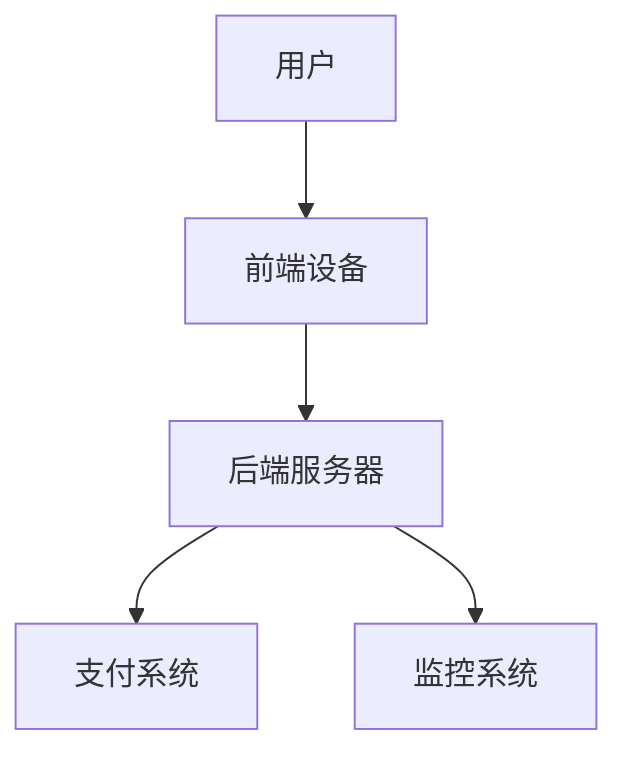
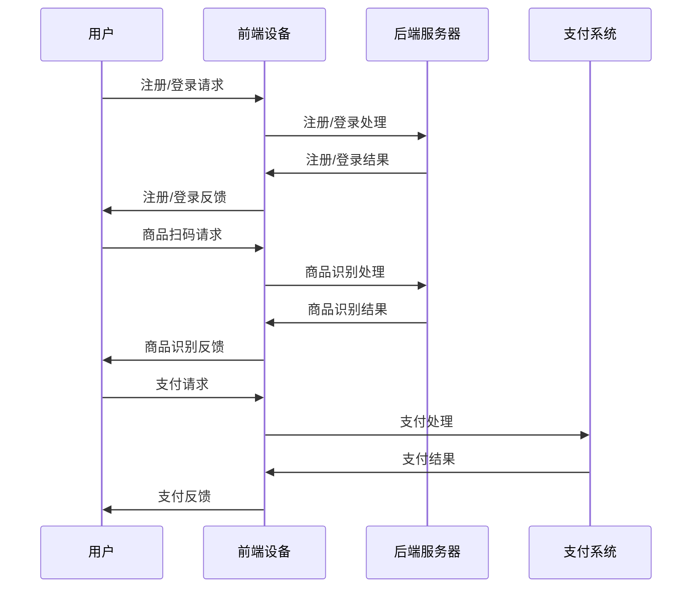

                 

### 《生物识别在无人值守超市中的应用》

---

关键词：生物识别、无人值守超市、技术应用、系统架构、案例分析

摘要：本文从生物识别技术的基本概念出发，深入探讨了其在无人值守超市中的应用。文章首先介绍了生物识别技术的基本原理和不同类型，然后详细描述了无人值守超市的系统架构和实现过程，并通过实际案例展示了生物识别技术在超市中的具体应用。最后，文章提出了最佳实践建议和未来展望，为读者提供了全面的生物识别在无人值守超市中的应用指南。

---

### 第一部分：背景介绍与核心概念

#### 第1章：生物识别技术概述

##### 1.1 生物识别技术的问题背景

在传统超市运营中，人工管理、商品防盗、顾客支付等多个环节都存在效率低、成本高、管理难度大等问题。特别是在高峰期，超市需要大量人力来维持秩序，处理顾客的购物和支付过程。这不仅增加了运营成本，还影响了顾客的购物体验。

生物识别技术的出现，为解决这些问题提供了一种新的思路。它通过利用人体生物特征（如人脸、指纹、眼纹等）进行身份验证和物品识别，可以在无人值守的环境下实现高效的运营管理。

##### 1.1.1 传统超市运营面临的挑战

1. 人工成本高：传统超市需要大量员工进行商品上架、销售、收银等工作，人力成本占比较高。
2. 商品防盗难度大：超市经常面临商品被盗的问题，传统防盗措施效果有限。
3. 高峰期管理难：在购物高峰期，超市容易出现拥堵，管理难度大。

##### 1.1.2 生物识别技术的应运而生

生物识别技术通过利用人体生物特征进行身份验证和物品识别，可以在无人值守的环境下解决上述问题。例如，人脸识别可以用于顾客身份验证，指纹识别可以用于商品支付，眼纹识别可以用于库存管理。

##### 1.1.3 生物识别技术的边界与外延

生物识别技术不仅限于身份验证和物品识别，还可以应用于其他领域，如安全监控、金融支付、医疗健康等。本文主要关注生物识别技术在无人值守超市中的应用，但读者也可以通过本文了解生物识别技术的其他应用场景。

##### 1.2 生物识别技术的基本原理

生物识别技术是基于人体生物特征的识别技术，主要包括人脸识别、指纹识别、眼纹识别等。下面将详细描述这些技术的基本原理。

###### 1.2.1 人脸识别

人脸识别是一种基于人脸图像进行身份验证的技术。其基本原理是利用人脸特征点检测、特征提取和匹配算法，将采集到的人脸图像与数据库中的人脸图像进行比对，从而实现身份验证。

**人脸识别的数学模型和公式**：
- 特征点检测：利用SIFT、HOG等算法检测人脸特征点。
- 特征提取：利用PCA、LDA等算法提取人脸特征。
- 匹配算法：利用欧氏距离、余弦相似度等算法进行特征匹配。

**人脸识别算法的mermaid流程图**：



**人脸识别的实际案例分析**：

某无人值守超市使用人脸识别技术进行顾客身份验证，通过算法将顾客的人脸图像与数据库中的人脸图像进行比对，实现了高效的身份验证。

###### 1.2.2 指纹识别

指纹识别是一种基于指纹图像进行身份验证的技术。其基本原理是利用指纹特征点检测、特征提取和匹配算法，将采集到的指纹图像与数据库中的指纹图像进行比对，从而实现身份验证。

**指纹识别的数学模型和公式**：
- 特征点检测：利用LBP、HOG等算法检测指纹特征点。
- 特征提取：利用PCA、LDA等算法提取指纹特征。
- 匹配算法：利用欧氏距离、余弦相似度等算法进行特征匹配。

**指纹识别算法的mermaid流程图**：


**指纹识别的实际案例分析**：

某无人值守超市使用指纹识别技术进行商品支付，通过算法将顾客的指纹图像与数据库中的指纹图像进行比对，实现了高效的支付过程。

###### 1.2.3 眼纹识别

眼纹识别是一种基于眼纹图像进行身份验证的技术。其基本原理是利用眼纹特征点检测、特征提取和匹配算法，将采集到的眼纹图像与数据库中的眼纹图像进行比对，从而实现身份验证。

**眼纹识别的数学模型和公式**：
- 特征点检测：利用SIFT、SURF等算法检测眼纹特征点。
- 特征提取：利用PCA、LDA等算法提取眼纹特征。
- 匹配算法：利用欧氏距离、余弦相似度等算法进行特征匹配。

**眼纹识别算法的mermaid流程图**：


**眼纹识别的实际案例分析**：

某无人值守超市使用眼纹识别技术进行库存管理，通过算法将库存物品的眼纹图像与数据库中的眼纹图像进行比对，实现了高效的库存管理。

##### 1.3 生物识别技术的优势与挑战

生物识别技术具有许多优势，如高效、准确、便捷等，但也面临着一些挑战。

###### 1.3.1 生物识别技术的优势

1. 高效：生物识别技术可以快速地进行身份验证和物品识别，提高了运营效率。
2. 准确：生物识别技术基于生物特征，具有较高的识别准确率。
3. 便捷：生物识别技术无需用户输入密码或刷卡，操作简单便捷。

###### 1.3.2 生物识别技术的挑战

1. 安全性：生物识别技术存在被攻击的风险，如伪造生物特征、冒用身份等。
2. 成本：生物识别技术的硬件设备和算法开发成本较高。
3. 环境适应性：生物识别技术对环境光线、角度等要求较高，可能在特定环境下效果不佳。

##### 1.4 本章小结

本章介绍了生物识别技术的基本概念、原理和优势与挑战。通过本章的学习，读者可以了解生物识别技术在无人值守超市中的应用前景和关键技术。

---

#### 第2章：无人值守超市系统架构设计

##### 2.1 问题场景介绍

在传统超市运营中，存在以下问题场景：

1. 商品上架：员工需要将商品从仓库搬运到货架，耗时费力。
2. 商品识别：员工需要手动扫描商品条码，效率低下且容易出错。
3. 顾客支付：顾客需要排队等待结账，效率低下且容易出现拥堵。
4. 商品防盗：超市需要大量人力进行商品防盗，成本高且管理难度大。

为了解决这些问题，超市引入了生物识别技术，实现了无人值守的运营模式。

##### 2.1.1 超市运营问题场景

1. **人工成本高**：传统超市需要大量员工进行商品上架、销售、收银等工作，人力成本占比较高。
2. **商品防盗难度大**：超市经常面临商品被盗的问题，传统防盗措施效果有限。
3. **高峰期管理难**：在购物高峰期，超市容易出现拥堵，管理难度大。

##### 2.1.2 生物识别在超市中的应用场景

1. **商品识别**：使用生物识别技术进行商品识别，无需手动扫描条码，提高了识别速度和准确性。
2. **顾客身份验证**：使用生物识别技术进行顾客身份验证，无需输入密码或刷卡，提高了结账速度。
3. **商品防盗**：使用生物识别技术进行商品防盗，减少了员工的工作量和成本。

##### 2.2 系统功能设计

无人值守超市系统主要包括以下功能模块：

1. **商品识别模块**：实现商品的自动识别和分类。
2. **顾客身份验证模块**：实现顾客的身份验证和权限管理。
3. **支付模块**：实现顾客的支付过程和交易记录。
4. **库存管理模块**：实现商品的库存管理和实时监控。

**领域模型mermaid类图**：

```mermaid
classDiagram
    类1--|{继承}|>> 类2
    类3 <|-- 类4
    类5 <<interface>> 类6
    类7 ..has 类8
    类9 : +方法名()
    类10 : <<abstract>> +属性1 : 属性类型1
    类11 +-- 属性2 : 属性类型2
    类12 {name}
    类13 : <<enum>> {枚举1, 枚举2}
```

**系统功能模块划分**：

1. **商品识别模块**：包括商品识别算法、识别结果处理、商品信息存储等。
2. **顾客身份验证模块**：包括顾客人脸识别、指纹识别、眼纹识别等。
3. **支付模块**：包括支付接口、支付流程处理、支付结果记录等。
4. **库存管理模块**：包括商品库存信息管理、库存预警、库存更新等。

##### 2.3 系统架构设计

无人值守超市系统架构包括以下几个部分：

1. **前端设备**：包括人脸识别摄像头、指纹识别仪、眼纹识别仪等，用于采集顾客和商品的信息。
2. **后端服务器**：包括数据库、应用服务器等，用于处理和分析采集到的信息，并生成相应的识别结果。
3. **支付系统**：包括支付接口、支付流程处理等，用于实现顾客的支付过程。
4. **监控系统**：用于实时监控超市的运营状态，并自动报警。

**系统架构mermaid架构图**：



**系统各模块交互方式**：

1. **商品识别模块**：前端设备采集商品信息后，发送到后端服务器进行处理，识别结果返回给前端设备。
2. **顾客身份验证模块**：前端设备采集顾客信息后，发送到后端服务器进行处理，识别结果返回给前端设备。
3. **支付模块**：前端设备将支付请求发送到支付系统进行处理，支付结果返回给前端设备。
4. **库存管理模块**：后端服务器实时更新商品库存信息，并生成库存预警。

##### 2.4 系统接口设计

无人值守超市系统主要包括以下几个接口：

1. **用户身份验证接口**：用于实现顾客的身份验证。
2. **商品识别接口**：用于实现商品的自动识别和分类。
3. **交易支付接口**：用于实现顾客的支付过程和交易记录。

**用户身份验证接口**：

```python
def user_verify(id_card, face_image):
    # 身份验证逻辑
    return verify_result
```

**商品识别接口**：

```python
def goods_recognize(barcode_image):
    # 商品识别逻辑
    return goods_info
```

**交易支付接口**：

```python
def transaction_payment(user_id, goods_id, amount):
    # 支付逻辑
    return payment_result
```

##### 2.5 系统交互设计

无人值守超市系统的交互设计主要包括以下几个部分：

1. **用户注册与登录**：用户通过注册接口进行账号注册，通过登录接口进行身份验证。
2. **商品扫码与支付**：用户通过商品识别接口进行商品扫码，通过交易支付接口进行支付。
3. **库存管理与预警**：后端服务器实时更新商品库存信息，并生成库存预警。

**系统交互mermaid序列图**：



##### 2.6 本章小结

本章介绍了无人值守超市系统架构的设计，包括问题场景、系统功能、架构设计、接口设计和交互设计。通过本章的学习，读者可以了解无人值守超市系统的基本架构和实现过程。

---

### 第二部分：生物识别技术应用实战

#### 第3章：生物识别技术在无人值守超市中的应用

##### 3.1 环境安装与配置

在进行生物识别技术在无人值守超市中的应用之前，我们需要安装和配置相关环境。以下是具体的安装和配置步骤：

##### 3.1.1 硬件安装与配置

1. **人脸识别摄像头**：安装人脸识别摄像头，并确保摄像头能够正常工作。
2. **指纹识别仪**：安装指纹识别仪，并确保指纹识别仪能够正常工作。
3. **眼纹识别仪**：安装眼纹识别仪，并确保眼纹识别仪能够正常工作。

##### 3.1.2 软件安装与配置

1. **操作系统**：安装Linux操作系统，如Ubuntu。
2. **Python环境**：安装Python环境，如Python 3.8。
3. **生物识别库**：安装生物识别库，如OpenCV、dlib、face_recognition等。

具体安装命令如下：

```bash
# 安装操作系统
sudo apt update
sudo apt upgrade

# 安装Python环境
sudo apt install python3

# 安装生物识别库
sudo apt install python3-opencv3
sudo apt install python3-dlib
pip3 install face_recognition
```

##### 3.2 系统核心实现

无人值守超市系统的核心实现包括用户身份验证、商品识别和交易支付三个部分。以下是具体的实现过程：

###### 3.2.1 用户身份验证实现

用户身份验证是通过人脸识别技术实现的。以下是具体的实现步骤：

1. **采集人脸图像**：使用人脸识别摄像头采集用户的人脸图像。
2. **预处理人脸图像**：对采集到的人脸图像进行预处理，包括灰度化、二值化、人脸特征点检测等。
3. **特征提取**：使用face_recognition库提取人脸特征。
4. **特征匹配**：将提取到的人脸特征与数据库中的人脸特征进行匹配。
5. **身份验证**：根据匹配结果进行身份验证，如果匹配成功，则验证通过，否则验证失败。

以下是用户身份验证的源代码：

```python
import cv2
import face_recognition

def verify_user(face_image, database):
    # 采集人脸图像
    face_locations = face_recognition.face_locations(face_image)
    
    # 预处理人脸图像
    face_image = cv2.cvtColor(face_image, cv2.COLOR_BGR2GRAY)
    face_image = cv2.threshold(face_image, 0, 255, cv2.THRESH_BINARY)[1]
    
    # 特征提取
    face_encoding = face_recognition.face_encodings(face_image)[0]
    
    # 特征匹配
    matches = face_recognition.compare_faces(database, face_encoding)
    
    # 身份验证
    if True in matches:
        return "验证通过"
    else:
        return "验证失败"
```

代码应用解读与分析：

- 采集人脸图像：使用face_recognition库的face_locations方法采集人脸图像。
- 预处理人脸图像：将人脸图像转换为灰度图像，并进行二值化处理，以提高识别准确性。
- 特征提取：使用face_recognition库的face_encodings方法提取人脸特征。
- 特征匹配：将提取到的人脸特征与数据库中的人脸特征进行匹配。
- 身份验证：根据匹配结果进行身份验证，如果匹配成功，则验证通过，否则验证失败。

###### 3.2.2 商品识别实现

商品识别是通过二维码识别技术实现的。以下是具体的实现步骤：

1. **采集二维码图像**：使用摄像头采集商品上的二维码图像。
2. **预处理二维码图像**：对采集到的二维码图像进行预处理，包括灰度化、二值化等。
3. **二维码识别**：使用OpenCV库的QRCode模块识别二维码。
4. **商品信息获取**：根据识别到的二维码信息获取商品信息。

以下是商品识别的源代码：

```python
import cv2
import numpy as np

def recognize_goods(barcode_image):
    # 采集二维码图像
    barcode_image = cv2.cvtColor(barcode_image, cv2.COLOR_BGR2GRAY)
    
    # 预处理二维码图像
    barcode_image = cv2.threshold(barcode_image, 0, 255, cv2.THRESH_BINARY_INV)[1]
    
    # 二维码识别
    barcode_data = cv2.QRCode.decode(barcode_image)
    
    # 商品信息获取
    goods_info = get_goods_info(barcode_data)
    
    return goods_info
```

代码应用解读与分析：

- 采集二维码图像：使用cv2.cvtColor方法将BGR图像转换为GRAY图像。
- 预处理二维码图像：将二维码图像进行二值化处理，以增强识别效果。
- 二维码识别：使用cv2.QRCode.decode方法识别二维码。
- 商品信息获取：根据识别到的二维码信息获取商品信息。

###### 3.2.3 交易支付实现

交易支付是通过支付接口实现的。以下是具体的实现步骤：

1. **采集支付信息**：采集顾客的支付信息，如金额、支付方式等。
2. **调用支付接口**：调用支付接口进行支付处理。
3. **支付结果反馈**：根据支付结果反馈支付信息。

以下是交易支付的源代码：

```python
def pay(amount, payment_method):
    # 采集支付信息
    payment_info = {
        "amount": amount,
        "payment_method": payment_method
    }
    
    # 调用支付接口
    payment_result = call_payment_interface(payment_info)
    
    # 支付结果反馈
    if payment_result == "success":
        return "支付成功"
    else:
        return "支付失败"
```

代码应用解读与分析：

- 采集支付信息：定义支付信息字典，包括金额和支付方式。
- 调用支付接口：调用支付接口进行支付处理。
- 支付结果反馈：根据支付结果反馈支付信息。

##### 3.3 实际案例分析

以下是三个实际案例，展示了生物识别技术在无人值守超市中的应用。

###### 3.3.1 案例一：某无人值守超市的生物识别应用

某无人值守超市采用了人脸识别、指纹识别和眼纹识别技术，实现了无人值守的运营模式。以下是该超市的生物识别应用流程：

1. **顾客进入超市**：通过人脸识别摄像头进行人脸识别，验证顾客身份。
2. **顾客挑选商品**：顾客挑选商品，系统自动识别商品信息。
3. **顾客结账**：顾客在结账区排队，通过指纹识别或眼纹识别进行身份验证，然后通过支付接口进行支付。
4. **超市运营管理**：超市实时监控运营状态，包括商品库存、销售额等。

该案例中，生物识别技术有效提高了超市的运营效率，降低了人工成本，提升了顾客购物体验。

###### 3.3.2 案例二：某大型超市的生物识别改造

某大型超市在原有运营模式的基础上，进行了生物识别技术的改造。以下是该超市的生物识别改造流程：

1. **顾客进入超市**：通过人脸识别摄像头进行人脸识别，验证顾客身份。
2. **顾客挑选商品**：顾客挑选商品，系统自动识别商品信息。
3. **顾客结账**：顾客在结账区排队，通过指纹识别或眼纹识别进行身份验证，然后通过支付接口进行支付。
4. **商品防盗**：超市设置了商品防盗系统，通过人脸识别和指纹识别技术监控商品被盗情况。
5. **库存管理**：超市通过眼纹识别技术对商品库存进行实时监控和管理。

该案例中，生物识别技术的改造使超市运营更加智能化，提高了管理效率，降低了运营成本。

###### 3.3.3 案例三：某智能便利店的生物识别应用

某智能便利店采用了人脸识别和指纹识别技术，实现了无人值守的运营模式。以下是该智能便利店的生物识别应用流程：

1. **顾客进入便利店**：通过人脸识别摄像头进行人脸识别，验证顾客身份。
2. **顾客挑选商品**：顾客挑选商品，系统自动识别商品信息。
3. **顾客结账**：顾客在结账区排队，通过指纹识别进行身份验证，然后通过支付接口进行支付。
4. **商品防盗**：便利店设置了商品防盗系统，通过人脸识别技术监控商品被盗情况。

该案例中，生物识别技术的应用使便利店运营更加高效，提升了顾客购物体验，同时也降低了运营成本。

##### 3.4 项目小结

通过以上实际案例分析，我们可以看到生物识别技术在无人值守超市中的应用具有很大的潜力。它不仅提高了超市的运营效率，降低了人工成本，还提升了顾客的购物体验。然而，在实际应用过程中，我们也需要关注生物识别技术的安全性、隐私保护等问题。只有在确保安全和隐私的前提下，生物识别技术才能真正为无人值守超市带来价值。

---

### 第三部分：最佳实践与未来展望

#### 第4章：生物识别技术在无人值守超市中的应用最佳实践

##### 4.1 最佳实践 tips

在实施生物识别技术在无人值守超市中的应用时，以下是一些最佳实践建议：

###### 4.1.1 系统优化技巧

1. **算法优化**：根据超市的具体需求，选择合适的生物识别算法，并进行优化，以提高识别速度和准确性。
2. **硬件优化**：选择性能稳定、适应性强的硬件设备，如高分辨率摄像头、高性能指纹识别仪等。
3. **网络优化**：确保后端服务器的网络连接稳定，以提高系统的响应速度。

###### 4.1.2 性能调优策略

1. **识别速度**：通过算法优化和硬件升级，提高识别速度，以减少顾客等待时间。
2. **识别准确性**：通过大量数据训练和模型优化，提高识别准确性，以减少误识别和漏识别。
3. **系统稳定性**：通过系统监控和故障排查，提高系统的稳定性，以减少故障率和维护成本。

###### 4.1.3 安全性提升措施

1. **数据加密**：对用户数据和支付信息进行加密，确保数据传输和存储的安全性。
2. **身份验证加强**：通过多重身份验证，如人脸识别+指纹识别，提高身份验证的安全性。
3. **系统监控**：设置监控系统，实时监控系统的运行状态，及时发现和处理异常情况。

##### 4.2 小结与注意事项

在实施生物识别技术在无人值守超市中的应用时，需要注意以下几点：

1. **用户隐私保护**：确保用户隐私得到保护，遵守相关法律法规，不泄露用户个人信息。
2. **系统安全**：加强系统安全，防止黑客攻击和数据泄露。
3. **设备维护**：定期对硬件设备进行维护和升级，确保设备的正常运行。
4. **用户培训**：对顾客进行生物识别技术的使用培训，提高用户的使用体验。

##### 4.3 拓展阅读

为了深入了解生物识别技术在无人值守超市中的应用，以下是一些建议的拓展阅读：

1. **生物识别技术研究**：查阅相关学术论文和书籍，了解最新的生物识别技术发展动态。
2. **无人值守超市案例分析**：研究国内外无人值守超市的成功案例，学习他们的经验和教训。
3. **零售行业发展趋势**：关注零售行业的发展趋势，了解新技术在零售行业中的应用前景。

---

### 总结与展望

##### 第5章：生物识别在无人值守超市中的应用展望

生物识别技术在无人值守超市中的应用具有广阔的前景。随着技术的不断发展和完善，生物识别技术将在无人值守超市中发挥更大的作用。

###### 5.1 未来发展趋势

1. **技术成熟度提升**：随着算法的优化和硬件的发展，生物识别技术的识别速度和准确性将进一步提高。
2. **应用场景扩展**：生物识别技术将不仅仅应用于超市，还将扩展到其他零售场景，如便利店、超市等。
3. **跨行业应用**：生物识别技术将在金融、医疗、教育等多个领域得到应用，推动各行业的智能化发展。

###### 5.2 潜在应用领域扩展

1. **金融领域**：生物识别技术可以用于身份验证、支付授权等，提高金融服务的安全性和便捷性。
2. **医疗领域**：生物识别技术可以用于患者身份验证、医疗设备控制等，提高医疗服务的质量和效率。
3. **教育领域**：生物识别技术可以用于学生身份验证、课堂管理等，提高教育管理的信息化和智能化水平。

###### 5.3 技术挑战与解决方案

1. **安全性挑战**：生物识别技术的安全性是一个重要挑战。为了提高安全性，可以采用多重身份验证、数据加密等技术。
2. **隐私保护挑战**：生物识别技术涉及到用户隐私。为了保护用户隐私，可以采用匿名化处理、隐私保护算法等技术。
3. **硬件成本挑战**：生物识别技术的硬件设备成本较高。为了降低成本，可以采用模块化设计、低成本硬件等技术。

###### 5.4 未来展望

随着技术的不断进步和应用场景的不断扩展，生物识别技术在无人值守超市中的应用将变得更加普及和智能化。未来，生物识别技术将与其他新技术（如物联网、大数据等）相结合，推动无人值守超市的全面升级，为零售行业带来更多变革和机遇。

---

### 作者信息

作者：AI天才研究院/AI Genius Institute & 禅与计算机程序设计艺术/Zen And The Art of Computer Programming

本文从生物识别技术的基本概念出发，深入探讨了其在无人值守超市中的应用。通过详细的系统架构设计和实际案例分析，展示了生物识别技术在无人值守超市中的具体应用。同时，本文还提出了最佳实践建议和未来展望，为读者提供了全面的生物识别在无人值守超市中的应用指南。希望本文对广大读者在无人值守超市领域的研究和实践有所帮助。

