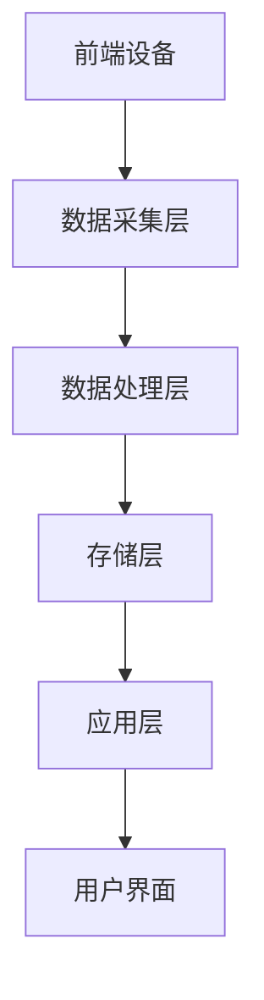

                 

### 引言：生物识别在智能家居安全系统中的应用

随着物联网技术的快速发展，智能家居已经成为现代家庭生活的重要组成部分。智能家居系统通过互联网连接各种家庭设备和家电，实现远程控制和自动化管理，为用户提供了便捷、舒适和智能化的生活体验。然而，随着智能家居设备的普及，家庭安全成为了一个不可忽视的重要问题。为了保障家庭的安全，智能家居安全系统应运而生，其中生物识别技术作为一项前沿技术，正日益成为智能家居安全系统的关键技术之一。

生物识别技术是指通过计算机和光学、声学、生物传感器以及生物统计学原理等高科技手段，利用人体固有的生理特性和行为特征来进行个人身份鉴别的技术。常见的生物识别技术包括指纹识别、人脸识别、虹膜识别、掌纹识别、声纹识别、步态识别等。这些技术能够在不同程度上提高系统的安全性和便捷性。

本文旨在探讨生物识别技术在智能家居安全系统中的应用，通过逐步分析生物识别技术的工作原理、应用场景、技术挑战和解决方案，为智能家居安全系统的设计与实现提供有价值的参考。文章将分为以下几个部分：

1. **背景介绍**：介绍智能家居安全系统的现状、生物识别技术的基本概念和发展历程。
2. **核心概念与联系**：详细阐述生物识别技术的原理、生物特征数据的特点和处理方法，并对比不同生物识别技术的优缺点。
3. **应用场景**：分析家庭安全需求，讨论生物识别技术在智能家居设备中的具体应用。
4. **技术原理**：讲解生物特征识别算法、数据处理与安全、系统设计与实现。
5. **实施方案**：详细描述系统需求分析、系统架构设计、系统开发与测试。
6. **案例研究**：选择典型的智能家居安全系统案例进行深入分析。
7. **最佳实践与未来展望**：总结最佳实践，展望生物识别技术在智能家居安全系统中的发展趋势和潜在挑战。

通过上述分析，本文希望为智能家居安全系统的设计者、开发者和研究者提供有价值的思路和方向，以推动生物识别技术在智能家居领域的深入研究和应用。

### 关键词

1. **生物识别技术**：利用人体生物特征进行身份鉴别的技术。
2. **智能家居安全系统**：通过生物识别等技术保障家庭安全的系统。
3. **指纹识别**：通过指纹图像进行身份验证的技术。
4. **人脸识别**：通过人脸图像进行身份验证的技术。
5. **虹膜识别**：通过虹膜图像进行身份验证的技术。
6. **安全性**：系统抵御未经授权访问的能力。
7. **用户体验**：用户在使用系统过程中获得的感受和满意度。

### 摘要

本文探讨了生物识别技术在智能家居安全系统中的应用。首先，介绍了智能家居安全系统的现状和生物识别技术的基本概念。随后，详细阐述了指纹识别、人脸识别、虹膜识别等核心生物识别技术的原理、优缺点及其在智能家居安全系统中的具体应用。接着，分析了生物特征数据的采集、处理和存储方法，以及系统设计与实现的关键技术。文章还通过具体案例，展示了生物识别技术在智能家居安全系统中的实际应用效果。最后，总结了生物识别技术在智能家居安全系统中的最佳实践，并对其未来发展进行了展望。本文旨在为智能家居安全系统的设计、开发和应用提供有价值的参考。

### 背景介绍

#### 智能家居安全系统的现状

随着物联网（IoT）技术的飞速发展，智能家居系统逐渐成为现代家庭生活的重要组成部分。智能家居系统通过互联网连接各种家庭设备和家电，实现了远程控制和自动化管理，极大地提高了生活的便捷性和舒适度。然而，随着智能家居设备的普及，家庭安全逐渐成为一个不可忽视的重要问题。传统的家庭安全系统往往依赖于机械锁、报警器和监控摄像头等物理手段，这些手段在一定程度上确实能提供一定的安全保障，但在面对日益复杂的安全威胁时，其局限性逐渐显现。

首先，传统家庭安全系统在防范技术性入侵方面存在很大挑战。例如，机械锁容易被复制和破坏，报警器可能因为误报而频繁发出警报，监控摄像头则可能因为拍摄角度和距离的限制而无法捕捉到重要的画面。其次，随着智能家居设备的增加，家庭网络的安全风险也随之增加。黑客可以通过网络攻击，远程操控智能设备，从而实现非法入侵或数据窃取。因此，传统的家庭安全系统已经难以满足现代家庭对安全性的需求。

为了应对这些挑战，智能家居安全系统应运而生。智能家居安全系统通过集成各种先进技术，如生物识别、云计算、大数据分析等，提供了更加智能、高效、安全的家庭安全保障方案。其中，生物识别技术作为一项前沿技术，正逐渐成为智能家居安全系统的关键技术之一。

#### 生物识别技术的基本概念

生物识别技术是指利用计算机和光学、声学、生物传感器等高科技手段，通过人体固有的生理特性和行为特征来进行个人身份鉴别的一种技术。生物识别技术的基本原理是，通过采集和识别个体的生物特征，如指纹、人脸、虹膜、声音、步态等，将其转化为数字化的生物特征模板，并存储在数据库中。当需要验证身份时，系统会将采集到的生物特征与数据库中的模板进行比对，以确定身份的真实性。

生物识别技术主要包括以下几种类型：

1. **指纹识别**：通过指纹图像进行身份验证。指纹是最常用的一种生物识别技术，具有唯一性和稳定性，且易于采集和识别。
2. **人脸识别**：通过人脸图像进行身份验证。人脸识别技术具有较高的识别率和准确率，且不受光线、角度、表情等因素的影响。
3. **虹膜识别**：通过虹膜图像进行身份验证。虹膜是眼睛内部的一个环状图案，具有高度的唯一性和稳定性，且识别速度快、准确率高。
4. **掌纹识别**：通过掌纹图像进行身份验证。掌纹识别具有较好的防伪性和耐用性，适用于各种环境。
5. **声纹识别**：通过声音特征进行身份验证。声纹识别具有较高的准确性和实时性，但受噪音、语速、语调等因素的影响较大。
6. **步态识别**：通过步态特征进行身份验证。步态识别具有独特性和稳定性，但识别速度较慢。

#### 生物识别与智能家居安全系统的关系

生物识别技术为智能家居安全系统提供了强有力的技术支持。通过生物识别技术，智能家居安全系统能够实现以下功能：

1. **身份验证**：生物识别技术可以用于家庭成员的身份验证，确保只有授权人员才能进入家中或访问智能设备。
2. **安全防范**：生物识别技术可以实时监测家庭的安全状况，及时发现异常行为，如非法入侵、火灾、煤气泄漏等，并及时发出警报。
3. **便捷管理**：生物识别技术可以简化家庭设备的管理，如通过指纹识别一键开启灯光、空调等设备，提高生活的便捷性。
4. **数据安全**：生物识别技术可以用于保护家庭数据的安全，防止未经授权的数据访问和泄露。

总的来说，生物识别技术在智能家居安全系统中发挥着至关重要的作用。它不仅提高了家庭的安全性，还为用户提供了更加便捷、智能化的生活体验。随着技术的不断进步，生物识别技术在智能家居安全系统中的应用将更加广泛和深入。

### 核心概念与联系

#### 生物识别技术原理

生物识别技术通过识别个体独特的生理或行为特征来实现身份鉴别，其基本原理可以分为以下几个步骤：

1. **特征采集**：生物识别系统首先需要采集个体的生物特征数据。这个过程通常通过传感器或成像设备完成，例如指纹采集器、摄像头、红外线扫描器等。每种生物特征数据都有其特定的采集方式和要求。

2. **特征提取**：在特征采集后，系统会从原始数据中提取关键特征。这一过程通常涉及图像处理、信号处理和模式识别技术。例如，指纹识别系统会从指纹图像中提取纹理特征，人脸识别系统会提取面部特征点等。

3. **特征比对**：提取到的特征会被转换为数字模型，并与存储在数据库中的模板进行比对。比对过程包括计算特征向量之间的相似度，并根据设定的阈值来判断是否匹配。

4. **决策输出**：根据比对结果，系统会输出一个决策，即个体是否被验证为合法用户。如果匹配度超过设定的阈值，则用户身份被验证通过；否则，身份验证失败。

#### 生物识别技术的优缺点对比

生物识别技术具有多种类型，每种技术都有其独特的优势和局限。以下是几种常见生物识别技术及其优缺点的对比：

| 生物识别技术 | 优点 | 缺点 |
| :--- | :--- | :--- |
| **指纹识别** | 稳定性高、准确性好、易于使用 | 需要接触、易受损坏、指纹数据库容易泄露 |
| **人脸识别** | 识别速度快、不受环境限制、无需接触 | 面部遮挡、伪装攻击、识别率受光线影响 |
| **虹膜识别** | 准确性最高、稳定性最好、唯一性最强 | 设备成本高、需近距离扫描、隐私争议 |
| **掌纹识别** | 防伪性好、耐用性强、易于操作 | 受环境光线影响、易受损坏、需要接触 |
| **声纹识别** | 实时性强、无接触、便于远程应用 | 受噪音干扰、语速和语调影响、不适用于所有人 |
| **步态识别** | 唯一性强、稳定性好、无接触 | 识别速度慢、受环境因素影响、需要较大空间 |

#### 生物特征数据

生物特征数据是指从个体生物特征中提取的数字信息，这些数据具有高度的唯一性和稳定性，是生物识别技术的核心。以下是生物特征数据的特点、采集和存储方法：

**特点**：

1. **唯一性**：每个人的生物特征都是独一无二的，例如指纹、虹膜等。
2. **稳定性**：生物特征在长时间内相对稳定，不会轻易改变。
3. **便携性**：生物特征数据可以随身携带，无需额外的存储设备。

**采集**：

1. **指纹采集**：通过指纹采集器或光学传感器捕捉指纹图像。
2. **人脸采集**：通过摄像头捕捉面部图像，并使用算法提取面部特征点。
3. **虹膜采集**：通过红外线扫描器捕捉虹膜图像。
4. **掌纹采集**：通过掌纹采集设备捕捉掌纹图像。
5. **声纹采集**：通过麦克风捕捉声音信号。

**存储**：

1. **加密存储**：为了保护用户隐私，生物特征数据通常在存储前进行加密处理。
2. **分布式存储**：为了避免单点故障，生物特征数据可以分散存储在多个服务器上。
3. **云存储**：随着云计算技术的发展，越来越多的生物特征数据开始通过云平台进行存储和管理。

#### 生物识别技术的优缺点对比表格

| 生物识别技术 | 优点 | 缺点 |
| :--- | :--- | :--- |
| 指纹识别 | 稳定性高、准确性好、易于使用 | 需要接触、易受损坏、指纹数据库容易泄露 |
| 人脸识别 | 识别速度快、不受环境限制、无需接触 | 面部遮挡、伪装攻击、识别率受光线影响 |
| 虹膜识别 | 准确性最高、稳定性最好、唯一性最强 | 设备成本高、需近距离扫描、隐私争议 |
| 掌纹识别 | 防伪性好、耐用性强、易于操作 | 受环境光线影响、易受损坏、需要接触 |
| 声纹识别 | 实时性强、无接触、便于远程应用 | 受噪音干扰、语速和语调影响、不适用于所有人 |
| 步态识别 | 唯一性强、稳定性好、无接触 | 识别速度慢、受环境因素影响、需要较大空间 |

#### ER实体关系图架构

为了更好地理解生物识别技术在智能家居安全系统中的架构，我们可以使用实体关系图（Entity-Relationship Diagram，ERD）来描述各个实体及其关系。以下是一个简化的ERD示例：

```
+----------------+         +----------------+         +----------------+
|    用户 (User) |<------->|  生物特征 (Feature) |<-------|  生物识别系统 (BioIDSys) |
+----------------+         +----------------+         +----------------+
| 用户ID (UserID) |         | 特征ID (FeatureID) |         | 系统ID (SysID) |
| 用户姓名 (Name)  |         | 特征类型 (Type)    |         | 系统名称 (Name) |
+----------------+         +----------------+         +----------------+
                       |
                       |
                       |
+---------------------v----------------+
|       访问记录 (AccessLog)           |
+---------------------+----------------+
| 访问ID (AccessID)  | 用户ID (UserID) |
| 访问时间 (Time)    | 系统ID (SysID) |
+---------------------+----------------+
```

在这个ERD中，用户实体与生物特征实体通过用户ID关联，每个用户可以有多个生物特征。生物识别系统实体与生物特征实体通过系统ID关联，表示系统可以存储和管理多个用户的生物特征数据。访问记录实体记录了用户的访问行为，关联了用户ID和系统ID，以追踪用户的活动。

#### 结论

通过对生物识别技术原理、优缺点、生物特征数据及其采集与存储方法的详细分析，我们可以看到生物识别技术在智能家居安全系统中的应用具有极大的潜力。每种生物识别技术都有其独特的优势和应用场景，而生物特征数据的安全性和隐私保护则是需要重点关注的问题。通过合理的系统设计和架构设计，可以充分发挥生物识别技术的优势，提高智能家居安全系统的安全性，为用户提供更加智能和便捷的生活体验。

### 技术原理

#### 生物特征识别算法

生物特征识别算法是生物识别技术的核心，负责从采集到的生物特征数据中提取关键特征，并进行身份验证。以下是几种常见的生物特征识别算法及其工作原理：

1. **指纹识别算法**：指纹识别算法主要基于脊线分析和特征点提取。首先，通过预处理图像去除噪声和干扰，然后对指纹图像进行分块处理，计算每个分块的纹理特征。常用的特征包括脊线端点、交叉点、弯曲点等。最后，使用欧氏距离或其他相似性度量方法对提取的特征进行匹配。

2. **人脸识别算法**：人脸识别算法通常包括面部特征点检测、特征向量提取和匹配。面部特征点检测通过算法识别眼睛、鼻子、嘴巴等关键点，然后计算这些点之间的距离和角度关系。特征向量提取通过深度学习模型，如卷积神经网络（CNN），从面部图像中提取高维特征向量。匹配过程使用余弦相似度或欧氏距离来计算特征向量之间的相似性。

3. **虹膜识别算法**：虹膜识别算法主要基于特征点提取和模式匹配。虹膜图像经过预处理后，提取特征点，如血管、斑点等。这些特征点通过模式匹配算法进行分类，如K-最近邻（K-NN）或支持向量机（SVM）。虹膜识别的准确性主要取决于特征点提取和匹配算法的精度。

4. **声纹识别算法**：声纹识别算法主要分为特征提取和匹配两个阶段。特征提取通过短时傅里叶变换（STFT）或梅尔频率倒谱系数（MFCC）等方法，从声波信号中提取特征向量。匹配过程使用动态时间规整（DTW）或高斯混合模型（GMM）等方法，计算特征向量之间的相似性。

#### 数据处理与安全

生物识别数据的安全处理是保障系统稳定运行和用户隐私的关键。以下是生物识别数据处理与安全的关键环节：

1. **数据加密**：在数据存储和传输过程中，对生物特征数据进行加密处理，如使用AES或RSA加密算法，确保数据不被非法访问。

2. **隐私保护**：为了保护用户隐私，可以采用匿名化处理，即只存储生物特征数据的数字摘要，不存储原始数据。此外，可以使用差分隐私技术，对数据进行扰动，以增强隐私保护。

3. **访问控制**：对生物识别系统中的数据访问进行严格控制，只有授权用户才能访问敏感数据。可以通过身份验证和权限管理机制实现访问控制。

4. **日志记录**：记录系统中的所有操作日志，包括数据访问、修改、删除等操作。这些日志可以用于安全审计和故障排查。

5. **系统监控**：实时监控系统的运行状态，包括数据传输、处理速度、设备状态等，及时发现并处理异常情况。

#### 系统设计与实现

生物识别系统在智能家居安全系统中的设计原则和实现方法如下：

1. **系统架构设计**：

   - **硬件架构**：包括生物特征采集设备、存储设备、服务器和网络设备。硬件设备需要具备高性能和稳定性，以支持大量用户的数据处理和存储。

   - **软件架构**：采用分布式架构，包括数据采集层、数据处理层、存储层和应用层。数据采集层负责收集生物特征数据；数据处理层负责特征提取和匹配算法；存储层负责存储和管理用户数据；应用层提供用户界面和功能服务。

2. **系统实现方法**：

   - **数据采集**：使用传感器或摄像头等设备采集生物特征数据，通过接口与系统连接，确保数据的准确性和实时性。

   - **特征提取**：采用适当的算法对采集到的生物特征数据进行分析和处理，提取出关键特征。这些特征将被用于后续的匹配和验证。

   - **身份验证**：将提取到的特征与数据库中的模板进行比对，根据设定的阈值判断身份是否匹配。如果匹配成功，则允许用户访问系统。

   - **错误处理**：在识别过程中，如果出现错误，如无法采集到生物特征或匹配失败，系统应提供相应的错误提示和解决方案。

3. **示例代码**：

   ```python
   # 指纹识别算法示例代码
   import cv2
   import numpy as np
   
   def extract_fingerprint_features(fingerprint_image):
       # 预处理指纹图像
       gray_image = cv2.cvtColor(fingerprint_image, cv2.COLOR_BGR2GRAY)
       _, threshold_image = cv2.threshold(gray_image, 128, 255, cv2.THRESH_BINARY_INV + cv2.THRESH_OTSU)
       # 提取特征点
       contours, _ = cv2.findContours(threshold_image, cv2.RETR_EXTERNAL, cv2.CHAIN_APPROX_SIMPLE)
       feature_points = []
       for contour in contours:
           perimeter = cv2.arcLength(contour, True)
           approx = cv2.approxPolyDP(contour, 0.02 * perimeter, True)
           if len(approx) == 2:
               feature_points.append(approx.reshape(-1, 2))
       return feature_points
   
   fingerprint_image = cv2.imread('fingerprint.jpg')
   features = extract_fingerprint_features(fingerprint_image)
   print(features)
   ```

   以上代码展示了如何使用OpenCV库提取指纹图像中的特征点。这只是一个简单的示例，实际应用中需要更复杂的算法和数据处理过程。

#### 结论

生物特征识别算法在智能家居安全系统中扮演着关键角色，通过精确的特征提取和匹配，实现了高安全性和便捷性。数据处理与安全是保障系统稳定运行和用户隐私的重要环节，需要采用多种技术手段确保数据的安全性和完整性。通过合理的系统设计与实现，可以充分发挥生物识别技术的优势，为用户提供更加智能和安全的家庭生活体验。

### 实施方案

#### 系统需求分析

在设计和实现生物识别智能家居安全系统时，明确系统需求是至关重要的。以下是该系统的功能需求：

1. **身份验证功能**：系统能够通过指纹识别、人脸识别或虹膜识别等生物识别技术，对用户进行身份验证，确保只有授权人员能够访问家庭设备和信息。
2. **安全监控功能**：系统能够实时监控家庭的安全状况，如门窗是否关闭、摄像头是否正常工作，并在发生异常时及时发出警报。
3. **设备控制功能**：系统能够通过生物识别验证后，允许用户远程控制家中的智能设备，如灯光、空调、门锁等。
4. **数据加密与存储**：系统应具备强大的数据加密功能，确保用户隐私和数据安全。所有用户数据需要加密存储，并定期备份。
5. **用户管理功能**：系统能够允许管理员添加、删除和修改用户信息，管理用户权限和访问控制策略。

#### 系统架构设计

为了实现上述功能需求，系统采用分布式架构，包括以下主要组件：

1. **前端设备**：包括指纹采集器、摄像头、门锁等，用于采集生物特征数据。
2. **数据采集层**：负责从前端设备采集生物特征数据，并进行预处理，如图像增强、降噪等。
3. **数据处理层**：使用生物识别算法对预处理后的数据进行特征提取和匹配，完成身份验证。
4. **存储层**：负责存储和管理用户生物特征数据、监控数据和设备控制数据。数据应加密存储，并采用分布式存储策略，确保数据的安全性和可靠性。
5. **应用层**：提供用户界面，实现用户与系统的交互，包括用户注册、登录、设备控制、报警管理等功能。

以下是系统的架构图：



#### 系统开发与测试

系统开发过程可以分为以下几个阶段：

1. **需求分析阶段**：根据系统需求文档，明确功能需求和性能指标，制定详细的开发计划。
2. **系统设计阶段**：设计系统的架构图、数据库设计、接口设计和详细功能设计。
3. **编码阶段**：根据设计文档，进行前端、后端和数据库的编码实现。
4. **测试阶段**：进行单元测试、集成测试和系统测试，确保系统的功能、性能和安全性。

以下是系统开发的关键步骤：

1. **前端开发**：使用HTML、CSS和JavaScript等前端技术，实现用户界面和交互功能。可以使用框架如React或Vue.js提高开发效率和用户体验。
2. **后端开发**：使用Python、Java或Node.js等后端技术，实现业务逻辑、数据存储和接口服务。可以使用Flask、Spring或Express等框架简化开发。
3. **数据库设计**：设计数据库架构，包括用户表、设备表、监控数据和生物特征数据表等。使用MySQL、PostgreSQL或MongoDB等数据库管理系统。
4. **接口设计**：设计RESTful API或GraphQL接口，用于前端与后端之间的数据交互。
5. **系统集成与测试**：将前端、后端和数据库集成，进行全面的系统测试，确保系统功能的正确性和稳定性。

以下是系统测试的示例步骤：

1. **单元测试**：对每个模块或类进行独立测试，确保其功能的正确性。
2. **集成测试**：将各个模块集成，测试模块之间的交互和协作是否符合预期。
3. **性能测试**：测试系统在高并发和大数据量情况下的性能，确保系统的响应速度和稳定性。
4. **安全测试**：对系统进行安全漏洞扫描和攻击测试，确保系统的安全性。

#### 实际案例

以下是一个实际案例，展示了生物识别智能家居安全系统的应用：

**案例背景**：某用户家庭安装了智能门锁、智能摄像头和智能灯光系统。用户希望系统能够在家人回家时自动开启灯光，并在发现异常时发出警报。

**系统实现**：

1. **前端设备**：安装指纹采集器和摄像头。指纹采集器用于家庭成员的身份验证，摄像头用于监控家庭环境和实时视频流。
2. **数据处理层**：使用人脸识别算法对摄像头捕捉到的图像进行分析，提取家庭成员的面部特征。
3. **存储层**：将提取到的面部特征数据存储在数据库中，并与家庭成员的身份信息进行关联。
4. **应用层**：开发一个用户界面，用于家庭成员的注册和管理。用户可以通过界面添加、删除家庭成员，设置家庭设备和报警规则。
5. **设备控制**：当用户通过指纹识别或人脸识别成功验证身份后，系统会根据预先设置的规则自动控制灯光和摄像头。

**效果分析**：

1. **安全性**：通过生物识别技术，系统能够准确识别家庭成员的身份，防止未经授权的访问。
2. **便捷性**：家庭成员无需手动开关灯光，系统可以根据家庭成员的回家时间自动开启灯光，提高生活便捷性。
3. **实时监控**：摄像头可以实时监控家庭环境，当系统检测到异常行为时，会自动发出警报，确保家庭安全。

通过这个实际案例，我们可以看到生物识别技术在智能家居安全系统中的应用，不仅提高了安全性，还提供了更加便捷和智能化的生活体验。

### 案例研究

#### 案例选择与描述

本案例研究选择了一款市场上知名的智能家居安全系统——华为智能家庭安全系统。这款系统集成了多种生物识别技术，如指纹识别、人脸识别和声纹识别，旨在为用户提供全方位的家庭安全保障。

#### 案例分析

**系统设计**：

华为智能家庭安全系统采用了分布式架构，包括前端设备、数据采集层、数据处理层、存储层和应用层。前端设备包括指纹采集器、摄像头和麦克风等，用于采集生物特征数据。数据采集层负责将前端设备采集到的数据传输到数据处理层。数据处理层采用多种生物识别算法，包括指纹识别算法、人脸识别算法和声纹识别算法，进行特征提取和匹配。存储层采用分布式数据库，存储用户身份信息和生物特征数据。应用层提供用户界面，实现用户与系统的交互。

**技术实现**：

1. **指纹识别**：系统使用指纹识别算法进行身份验证。用户通过指纹采集器采集指纹数据，系统将指纹图像进行处理，提取特征点，并通过特征点匹配算法进行身份验证。
2. **人脸识别**：系统使用人脸识别算法进行身份验证。用户通过摄像头捕捉面部图像，系统对图像进行处理，提取面部特征点，并通过面部特征点匹配算法进行身份验证。
3. **声纹识别**：系统使用声纹识别算法进行身份验证。用户通过麦克风采集声音数据，系统对声音信号进行处理，提取声纹特征，并通过声纹特征匹配算法进行身份验证。

**效果评估**：

1. **安全性**：华为智能家庭安全系统通过集成多种生物识别技术，提高了系统的安全性。指纹识别、人脸识别和声纹识别技术具有较高的识别准确率和稳定性，能够有效防止未经授权的访问。
2. **便捷性**：系统提供了多种生物识别方式，用户可以根据个人喜好选择最便捷的识别方式。例如，用户在离家时可以使用指纹识别，而在晚上使用声纹识别，以避免手动操作。
3. **用户体验**：系统设计人性化，界面简洁易用。用户可以通过手机应用实时查看家庭安全状况，并进行远程控制。系统还提供了智能提醒功能，如当用户离开家时，系统会自动关闭未使用的电器，节省能源。

**案例启示**：

1. **多样化识别技术**：通过集成多种生物识别技术，系统可以提供更高的安全性和便捷性，满足不同用户的需求。
2. **数据安全与隐私保护**：系统在数据存储和传输过程中采用加密技术，确保用户数据的安全和隐私。
3. **用户参与**：系统设计过程中应充分考虑用户的需求和反馈，提供个性化的用户体验。

### 结论

通过本案例研究，我们可以看到生物识别技术在智能家居安全系统中的应用具有显著的优势。华为智能家庭安全系统通过集成指纹识别、人脸识别和声纹识别等多种技术，实现了高效的家庭安全保障。同时，系统在用户体验和数据安全方面也表现出色，为其他智能家居安全系统的设计和实现提供了有益的参考。

### 最佳实践与未来展望

#### 最佳实践

1. **多样化生物识别技术**：结合多种生物识别技术，如指纹识别、人脸识别和声纹识别，以提高系统的安全性和灵活性，满足不同用户的需求。

2. **数据加密与隐私保护**：在数据存储和传输过程中，采用高级加密算法，确保用户隐私和数据的完整性。

3. **用户友好界面**：设计直观、易用的用户界面，提高用户体验，降低使用门槛。

4. **实时监控与警报机制**：系统应具备实时监控功能，及时发现异常行为并发出警报，保障家庭安全。

5. **持续更新与升级**：定期更新系统，优化算法，增强系统的识别准确性和稳定性。

#### 未来展望

1. **深度学习与人工智能**：未来，深度学习与人工智能技术将在生物识别领域发挥更大作用，进一步提升识别准确率和速度。

2. **无接触识别技术**：随着技术的发展，无接触识别技术将逐渐普及，为用户带来更加便捷和安全的体验。

3. **智能硬件集成**：生物识别技术将更紧密地集成到智能家居硬件中，实现无缝连接和智能化管理。

4. **跨平台兼容性**：未来，生物识别技术将具备更强的跨平台兼容性，用户可以在多个设备和平台上实现身份验证和设备控制。

通过以上最佳实践和未来展望，我们可以预见生物识别技术在智能家居安全系统中将发挥更加重要的作用，为用户带来更安全、便捷和智能化的生活体验。

### 总结

通过对生物识别技术在智能家居安全系统中的应用的详细探讨，我们深刻认识到其在提升家庭安全、便捷性和智能化方面的重要作用。从背景介绍到核心概念，再到技术原理、实施方案和案例研究，我们逐一分析了生物识别技术的各个方面。这不仅帮助我们理解了生物识别技术的原理和应用，也为我们提供了设计、实现和应用智能家居安全系统的实用指南。

生物识别技术以其独特的安全性和便捷性，正逐步成为智能家居安全系统的关键技术。然而，其应用也面临诸多挑战，如数据安全和隐私保护、技术成本和实现难度等。因此，未来的研究需要更加关注这些挑战，并探索更加高效、安全和实用的解决方案。

本文通过系统的分析和实例研究，为我们提供了宝贵的经验和启示。希望本文能为智能家居安全系统的设计者和开发者提供有价值的参考，助力他们打造更加安全、智能和便捷的智能家居生活。同时，我们也期待在未来的技术发展中，生物识别技术能够不断创新和进步，为人类带来更加美好的生活体验。

