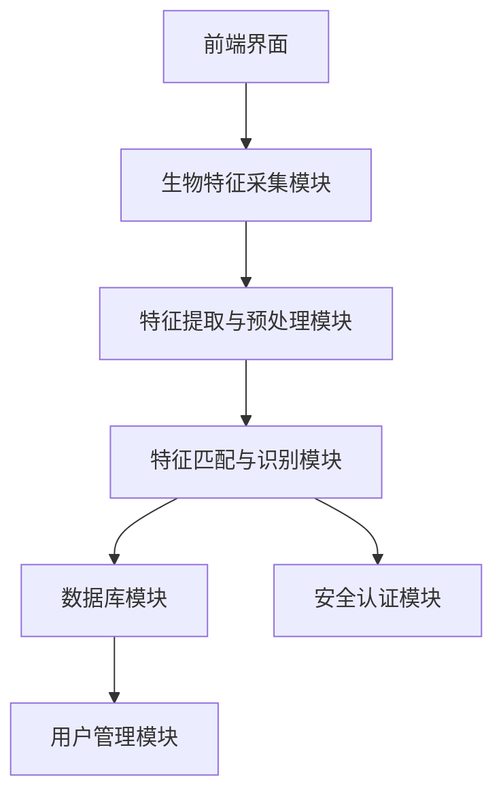
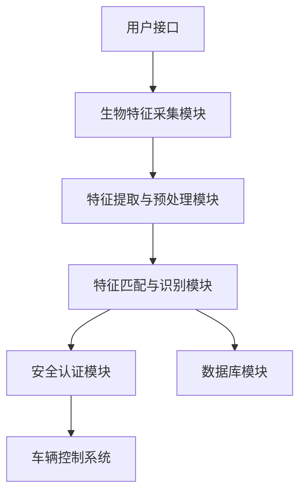

                 

# 生物识别在智能汽车中的驾驶员识别

关键词：生物识别、智能汽车、驾驶员识别、人脸识别、安全性、驾驶体验、算法原理

摘要：本文深入探讨了生物识别技术在智能汽车驾驶员识别中的应用，包括其基本概念、应用场景、工作原理、设计实现及未来发展趋势。通过详细分析人脸识别算法的原理，结合实际项目案例，本文展示了生物识别技术在智能汽车领域的重要性和潜力。

## 目录

1. 生物识别技术概述
   1.1 生物识别技术基础
   1.2 生物识别技术的应用领域
   1.3 生物识别技术的挑战与未来趋势
   1.4 本章小结

2. 智能汽车中的驾驶员识别
   2.1 智能汽车的发展概述
   2.2 驾驶员识别在智能汽车中的应用
   2.3 驾驶员识别技术的具体应用场景
   2.4 本章小结

3. 驾驶员识别技术工作原理
   3.1 人脸识别技术
       3.1.1 人脸识别概述
       3.1.2 人脸识别算法原理
       3.1.3 人脸识别算法示例
   3.2 生物特征识别的其他方法
   3.3 本章小结

4. 生物识别系统设计
   4.1 系统设计与实现的目标
   4.2 系统功能设计
   4.3 系统架构设计
   4.4 系统接口设计与交互
   4.5 本章小结

5. 实际应用案例分析
   5.1 案例一：汽车共享平台
   5.2 案例二：商业车队管理
   5.3 案例三：高端豪华汽车
   5.4 本章小结

6. 未来发展趋势与展望
   6.1 技术发展前景
   6.2 商业模式创新
   6.3 安全性问题
   6.4 本章小结

7. 最佳实践与注意事项
   7.1 最佳实践 Tips
   7.2 小结
   7.3 注意事项
   7.4 拓展阅读

## 1. 生物识别技术概述

### 1.1 生物识别技术基础

生物识别技术是一种通过识别人体的生物特征来验证个体身份的技术。生物特征包括指纹、人脸、虹膜、声音等，它们在人体中具有独特性和稳定性。生物识别技术的基本概念可以概括为以下几个方面：

- **生物特征采集**：通过传感器或其他设备采集个体的生物特征数据，如指纹图像、人脸图像等。
- **生物特征处理**：对采集到的生物特征数据进行分析、处理，提取出能够用于识别的特征向量。
- **生物特征匹配**：将提取出的特征向量与存储在数据库中的特征向量进行匹配，以确定个体身份。

### 1.2 生物识别技术的应用领域

生物识别技术具有广泛的应用领域，主要包括以下几个方面：

- **安全领域**：在门禁系统、安全认证、手机解锁等方面广泛应用。
- **医疗领域**：用于患者身份验证、药品管理、医疗记录管理等。
- **智能家居领域**：用于家庭设备的安全控制和个性化服务。

### 1.3 生物识别技术的挑战与未来趋势

生物识别技术面临着一些挑战，如数据隐私保护、识别准确性、技术成本等。同时，随着人工智能技术的发展，生物识别技术的未来趋势也将不断演进。例如，深度学习算法的引入使得人脸识别技术的准确性得到了显著提高，而物联网技术的发展则使得生物识别技术可以在更多场景下得到应用。

### 1.4 本章小结

本章概述了生物识别技术的基本概念、应用领域以及面临的挑战和未来趋势。下一章将重点探讨生物识别技术在智能汽车中的驾驶员识别应用。

## 2. 智能汽车中的驾驶员识别

### 2.1 智能汽车的发展概述

智能汽车是指通过整合先进的传感器、通信技术、人工智能算法等，实现车辆自主决策和控制功能的汽车。智能汽车的发展可以分为以下几个阶段：

- **第一阶段**：辅助驾驶，如自适应巡航控制（ACC）、车道保持辅助（LKA）等。
- **第二阶段**：部分自动驾驶，如自动驾驶停车、自动驾驶高速行驶等。
- **第三阶段**：完全自动驾驶，无需人为干预即可完成所有驾驶任务。

智能汽车的发展前景广阔，预计将极大地改变人们的出行方式，提高交通效率和安全性。

### 2.2 驾驶员识别在智能汽车中的应用

驾驶员识别技术是智能汽车的重要组成部分，其应用主要包括以下几个方面：

- **提升安全性**：通过识别驾驶员身份，确保车辆在行驶过程中始终由合格的驾驶员操作。
- **提升驾驶体验**：根据驾驶员的生理和心理状态，提供个性化的驾驶建议和服务。
- **商业模式创新**：如汽车共享平台中的驾驶员身份验证、商业车队管理中的驾驶员行为分析等。

### 2.3 驾驶员识别技术的具体应用场景

驾驶员识别技术在智能汽车中具有多种应用场景，以下列举几种典型应用：

- **汽车共享平台**：通过驾驶员识别技术，确保车辆只能被授权用户使用，提高平台的安全性和用户体验。
- **商业车队管理**：对车队中的驾驶员进行身份验证和行为分析，提高运营效率和安全性。
- **高端豪华汽车**：为用户提供个性化的驾驶体验，如根据驾驶员身份调整车辆设置和提供定制化服务。

### 2.4 本章小结

本章探讨了智能汽车驾驶员识别技术的应用场景和重要性，为下一章深入分析驾驶员识别技术的工作原理奠定了基础。

## 3. 驾驶员识别技术工作原理

### 3.1 人脸识别技术

人脸识别技术是驾驶员识别技术中最常用的方法之一。下面将从人脸识别的基本概念、算法原理以及具体实现步骤进行详细讲解。

#### 3.1.1 人脸识别概述

人脸识别技术是一种基于人脸图像或视频，通过提取人脸特征并进行匹配，以识别或验证个体身份的技术。其核心步骤包括人脸检测、特征提取和匹配。

#### 3.1.2 人脸识别算法原理

人脸识别算法的基本原理可以概括为以下几个步骤：

1. **人脸检测**：通过图像处理技术，定位人脸在图像中的位置。常用的方法包括基于深度学习的人脸检测模型，如MTCNN等。

2. **特征提取**：对人脸图像进行特征提取，生成特征向量。常用的特征提取方法包括基于深度学习的人脸识别模型，如VGG、ResNet等。

3. **匹配与识别**：将提取出的特征向量与数据库中的特征向量进行匹配，以确定个体身份。匹配算法包括欧氏距离、余弦相似度等。

#### 3.1.3 人脸识别算法示例

以下是一个使用OpenCV和dlib实现人脸识别的基本示例：

```python
import cv2
import dlib

# 初始化人脸检测器
detector = dlib.get_frontal_face_detector()

# 初始化人脸识别模型
recognizer = cv2.face.EigenFaceRecognizer_create()

# 加载训练好的模型
recognizer.read('face_model.yml')

# 读取测试图像
image = cv2.imread('test_image.jpg')

# 检测人脸
faces = detector(image)

# 提取人脸特征
face_images = [image[face.top():face.bottom(), face.left():face.right()] for face in faces]

# 进行人脸识别
labels, confidence = recognizer.predict(face_images)

# 显示识别结果
for label, confidence in zip(labels, confidence):
    print(f"识别结果：{label}, 置信度：{confidence}")

# 显示图像
cv2.imshow('Test Image', image)
cv2.waitKey(0)
cv2.destroyAllWindows()
```

#### 3.1.4 人脸识别算法的性能评估

人脸识别算法的性能通常通过准确率、召回率、F1值等指标进行评估。以下是一个简单的性能评估示例：

```python
from sklearn.metrics import classification_report

# 读取测试集数据
test_data = ...

# 进行人脸识别
labels_pred = recognizer.predict(test_data['face_images'])

# 评估性能
print(classification_report(test_data['labels'], labels_pred))
```

#### 3.1.5 人脸识别技术的挑战与优化

人脸识别技术在实际应用中面临着一些挑战，如光照变化、姿态变化、遮挡等因素的影响。为了提高识别性能，可以采用以下优化方法：

1. **数据增强**：通过旋转、缩放、裁剪等操作，增加训练数据多样性，提高模型泛化能力。
2. **模型优化**：使用深度学习模型，如卷积神经网络（CNN），提高特征提取能力。
3. **多特征融合**：结合多个特征（如深度特征、纹理特征等），提高识别准确性。

### 3.2 生物特征识别的其他方法

除了人脸识别，生物识别技术还包括其他方法，如指纹识别、虹膜识别、声纹识别等。每种方法都有其独特的优势和挑战，适用于不同的应用场景。

#### 3.2.1 指纹识别

指纹识别是通过提取指纹图像的纹理特征进行身份验证的技术。指纹识别具有高准确性、稳定性强等优点，广泛应用于门禁系统、手机解锁等领域。

#### 3.2.2 虹膜识别

虹膜识别是通过提取虹膜图像中的纹理特征进行身份验证的技术。虹膜识别具有高准确性和稳定性，但识别速度较慢，适用于安全性要求较高的场景。

#### 3.2.3 声纹识别

声纹识别是通过提取声音信号中的特征进行身份验证的技术。声纹识别具有实时性强、便携性好等优点，但识别准确性受环境噪声等因素影响较大。

### 3.3 本章小结

本章详细介绍了人脸识别技术在驾驶员识别中的应用，包括算法原理、实现步骤以及性能评估方法。下一章将探讨如何设计一个生物识别系统，包括系统功能、架构设计等方面。

## 4. 生物识别系统设计

### 4.1 系统设计与实现的目标

生物识别系统设计的核心目标是实现高准确度、高效率的驾驶员识别，以满足智能汽车的安全性和个性化需求。具体目标包括：

1. **准确性**：确保驾驶员识别的准确性，减少误识别和漏识别的情况。
2. **效率**：优化系统运行速度，提高用户体验。
3. **安全性**：保护用户隐私，防止非法访问和数据泄露。
4. **可扩展性**：支持多种生物特征识别方法，方便后续功能扩展。

### 4.2 系统功能设计

生物识别系统的功能设计主要包括以下几个方面：

1. **用户注册与登录**：支持用户注册、登录功能，确保只有授权用户可以访问系统。
2. **生物特征采集**：支持多种生物特征采集方式，如人脸、指纹、虹膜等。
3. **特征提取与预处理**：对采集到的生物特征进行预处理，提取关键特征，提高识别准确性。
4. **特征匹配与识别**：将提取出的特征与数据库中的特征进行匹配，确定驾驶员身份。
5. **安全认证**：结合生物特征识别结果，进行安全认证，确保车辆驾驶安全。
6. **用户管理**：支持用户信息管理，包括用户信息查询、修改、删除等。

### 4.3 系统架构设计

生物识别系统的架构设计应考虑以下几个方面：

1. **前端界面**：提供用户友好的操作界面，方便用户进行注册、登录和生物特征采集。
2. **生物特征采集模块**：负责采集用户的生物特征数据，如人脸图像、指纹图像等。
3. **特征提取与预处理模块**：对采集到的生物特征进行预处理和特征提取，生成特征向量。
4. **特征匹配与识别模块**：实现特征匹配算法，识别用户身份。
5. **数据库模块**：存储用户信息和生物特征数据，确保数据安全。
6. **安全认证模块**：结合生物识别结果，进行安全认证，确保车辆驾驶安全。

以下是一个简单的系统架构图：



### 4.4 系统接口设计与交互

生物识别系统需要与其他系统进行交互，以实现完整的功能。以下列举几个关键接口：

1. **用户接口**：提供注册、登录、生物特征采集等功能，与前端界面交互。
2. **特征接口**：用于生物特征数据的采集、提取和匹配，与其他模块交互。
3. **认证接口**：用于安全认证，与车辆控制系统交互。
4. **数据接口**：用于用户管理和数据库操作，与其他系统模块交互。

以下是一个简单的接口交互图：



### 4.5 本章小结

本章详细介绍了生物识别系统的设计目标、功能设计、架构设计以及接口设计。下一章将分析实际应用中的案例分析，探讨生物识别技术在智能汽车驾驶员识别中的实际应用效果。

## 5. 实际应用案例分析

### 5.1 案例一：汽车共享平台

汽车共享平台是一个典型的应用场景，其中驾驶员识别技术至关重要。以下是一个关于某知名汽车共享平台的实际应用案例分析。

#### 案例背景

某知名汽车共享平台提供汽车租赁服务，用户可以通过APP预订车辆，并在租车地点自助取车。为了确保车辆只能被授权用户使用，平台引入了人脸识别技术进行驾驶员身份验证。

#### 系统核心实现

1. **用户注册**：用户在APP中完成注册，上传人脸图像作为生物特征数据。
2. **人脸识别**：在用户取车时，摄像头捕捉人脸图像，与注册时的人脸图像进行比对，实现身份验证。
3. **安全认证**：通过人脸识别结果，对用户进行安全认证，确保只有授权用户可以取车。
4. **数据存储**：用户的人脸图像和识别结果存储在平台数据库中，以供后续查询和数据分析。

#### 代码应用解读

以下是一个简单的Python代码示例，用于实现人脸识别和身份验证：

```python
import cv2
import face_recognition

# 读取注册时的人脸图像
known_image = face_recognition.load_image_file('known_image.jpg')
known_encoding = face_recognition.face_encodings(known_image)[0]

# 读取待验证的人脸图像
test_image = face_recognition.load_image_file('test_image.jpg')
test_encoding = face_recognition.face_encodings(test_image)[0]

# 进行人脸识别和身份验证
results = face_recognition.compare_faces([known_encoding], test_encoding)

if results[0]:
    print("身份验证通过，可以取车。")
else:
    print("身份验证失败，请重新尝试。")
```

#### 案例分析

通过实际应用，人脸识别技术在汽车共享平台中取得了显著效果。一方面，提高了平台的安全性，确保车辆只能被授权用户使用；另一方面，简化了用户取车流程，提高了用户体验。然而，人脸识别技术也存在一定的局限性，如对光照变化、姿态变化等敏感，需要进一步完善和优化。

### 5.2 案例二：商业车队管理

商业车队管理是另一个重要的应用场景，其中驾驶员识别技术用于提高运营效率和安全性。以下是一个关于某物流公司商业车队管理的实际应用案例分析。

#### 案例背景

某物流公司拥有一支庞大的车队，用于运输货物。为了确保车辆安全和运营效率，公司引入了人脸识别技术进行驾驶员身份验证和行为分析。

#### 系统核心实现

1. **用户注册**：驾驶员在入职时，完成人脸图像和指纹图像的采集，并上传至公司数据库。
2. **人脸识别**：每次驾驶员上车前，摄像头捕捉人脸图像，与数据库中的人脸图像进行比对，实现身份验证。
3. **行为分析**：通过安装在车辆上的传感器，实时监控驾驶员的行为，如驾驶时间、驾驶速度、驾驶状态等。
4. **安全预警**：当发现异常行为时，系统会自动发送预警信息，提醒驾驶员或车队管理人员。

#### 代码应用解读

以下是一个简单的Python代码示例，用于实现人脸识别和身份验证：

```python
import cv2
import face_recognition

# 读取注册时的人脸图像
known_image = face_recognition.load_image_file('known_image.jpg')
known_encoding = face_recognition.face_encodings(known_image)[0]

# 读取待验证的人脸图像
test_image = face_recognition.load_image_file('test_image.jpg')
test_encoding = face_recognition.face_encodings(test_image)[0]

# 进行人脸识别和身份验证
results = face_recognition.compare_faces([known_encoding], test_encoding)

if results[0]:
    print("身份验证通过，可以驾驶。")
else:
    print("身份验证失败，请重新尝试。")
```

#### 案例分析

通过实际应用，人脸识别技术在商业车队管理中发挥了重要作用。一方面，提高了驾驶员的身份验证准确性，确保车辆始终由合格驾驶员驾驶；另一方面，通过行为分析，提高了车队运营效率和安全性。然而，人脸识别技术在夜间或光线不足的情况下识别效果较差，需要进一步优化。

### 5.3 案例三：高端豪华汽车

高端豪华汽车通常具备较高的安全性和个性化需求，人脸识别技术在这些车辆中得到了广泛应用。以下是一个关于某高端豪华汽车品牌的应用案例分析。

#### 案例背景

某高端豪华汽车品牌在其新车中引入了人脸识别技术，为用户提供个性化驾驶体验和安全保障。用户在购车后，需完成人脸图像的采集和注册。

#### 系统核心实现

1. **用户注册**：用户在购车后，通过车载摄像头完成人脸图像的采集，并上传至汽车数据库。
2. **人脸识别**：每次启动汽车时，摄像头捕捉人脸图像，与注册时的人脸图像进行比对，实现身份验证。
3. **个性化设置**：根据用户身份，自动调整汽车座椅、方向盘、音量等设置，为用户提供个性化驾驶体验。
4. **安全认证**：通过人脸识别结果，进行安全认证，确保车辆只能由授权用户驾驶。

#### 代码应用解读

以下是一个简单的Python代码示例，用于实现人脸识别和身份验证：

```python
import cv2
import face_recognition

# 读取注册时的人脸图像
known_image = face_recognition.load_image_file('known_image.jpg')
known_encoding = face_recognition.face_encodings(known_image)[0]

# 读取待验证的人脸图像
test_image = face_recognition.load_image_file('test_image.jpg')
test_encoding = face_recognition.face_encodings(test_image)[0]

# 进行人脸识别和身份验证
results = face_recognition.compare_faces([known_encoding], test_encoding)

if results[0]:
    print("身份验证通过，可以启动汽车。")
else:
    print("身份验证失败，请重新尝试。")
```

#### 案例分析

通过实际应用，人脸识别技术在高端豪华汽车中得到了广泛认可。一方面，提高了汽车的安全性，确保车辆只能由授权用户驾驶；另一方面，为用户提供了个性化驾驶体验，提升了用户满意度。然而，人脸识别技术在车辆使用过程中存在一定的隐私保护问题，需要进一步加强数据安全和隐私保护措施。

### 5.4 本章小结

本章通过三个实际应用案例，展示了生物识别技术在智能汽车驾驶员识别中的实际应用效果。虽然人脸识别技术在提高汽车安全性和用户体验方面取得了显著成果，但仍需不断优化和完善，以应对各种挑战。

## 6. 未来发展趋势与展望

### 6.1 技术发展前景

随着人工智能和计算机视觉技术的不断发展，生物识别技术在未来将得到更加广泛的应用。以下是一些可能的发展趋势：

1. **更高效的算法**：深度学习算法的引入使得生物识别技术的准确性得到了显著提高。未来，将会有更多高效的算法被开发出来，进一步提升识别性能。
2. **多模态融合**：通过结合多种生物特征（如人脸、指纹、虹膜等），实现多模态融合识别，提高识别准确性和鲁棒性。
3. **无接触识别**：随着传感器技术的进步，无接触识别将成为未来生物识别技术的一个重要发展方向。例如，通过红外传感器实现夜间或暗光环境下的生物特征采集。
4. **硬件设备优化**：更小巧、更高效的硬件设备将使得生物识别技术更易于集成到各种智能设备中，如手机、智能手表、智能眼镜等。

### 6.2 商业模式创新

生物识别技术在智能汽车中的应用将带来一系列商业模式创新：

1. **共享经济**：在汽车共享、租车等场景中，生物识别技术可以确保只有授权用户才能使用车辆，从而提高平台的安全性和用户体验。
2. **个性化服务**：通过识别驾驶员身份，智能汽车可以提供个性化的驾驶体验和服务，如调整座椅、音量、导航等，提升用户满意度。
3. **智能物流**：在物流行业中，生物识别技术可以用于驾驶员身份验证和行为分析，提高运输效率和安全性。
4. **安全认证**：生物识别技术可以用于各种安全认证场景，如门禁系统、手机解锁、智能门锁等，为用户提供更安全的使用体验。

### 6.3 安全性问题

尽管生物识别技术具有高准确性和便捷性，但也面临着一些安全问题：

1. **隐私保护**：生物特征数据属于敏感信息，需要采取严格的安全措施进行保护，防止数据泄露和滥用。
2. **攻击防范**：生物识别系统需要防范各种攻击手段，如仿冒攻击、重放攻击等，确保系统安全运行。
3. **法律法规**：随着生物识别技术的广泛应用，需要制定相应的法律法规来规范其使用，确保技术应用符合伦理和法律规定。

### 6.4 本章小结

未来，生物识别技术在智能汽车中的应用前景广阔，将在提高安全性、提升用户体验、创新商业模式等方面发挥重要作用。然而，也需要关注相关安全问题和隐私保护，确保技术的可持续发展。

## 7. 最佳实践与注意事项

### 7.1 最佳实践 Tips

1. **优化算法性能**：针对不同场景和需求，选择合适的算法模型，并进行性能优化，如模型压缩、量化等。
2. **多模态融合**：结合多种生物特征，提高识别准确性和鲁棒性。
3. **数据保护**：严格遵循数据保护法规，确保用户隐私安全。
4. **实时性优化**：在确保准确性的同时，提高系统响应速度，提升用户体验。

### 7.2 小结

本文深入探讨了生物识别技术在智能汽车驾驶员识别中的应用，包括技术概述、应用场景、工作原理、系统设计、案例分析以及未来发展趋势。通过最佳实践和注意事项，为实际应用提供了指导。

### 7.3 注意事项

1. **安全性**：确保系统安全，防范各种攻击手段。
2. **隐私保护**：严格遵守数据保护法规，保护用户隐私。
3. **用户体验**：优化系统性能，提升用户体验。
4. **持续更新**：关注技术发展动态，及时更新算法和系统。

### 7.4 拓展阅读

- 《生物识别技术基础》
- 《深度学习与计算机视觉》
- 《人工智能在自动驾驶中的应用》
- 《物联网技术与应用》

## 作者信息

作者：AI天才研究院/AI Genius Institute & 禅与计算机程序设计艺术 /Zen And The Art of Computer Programming

