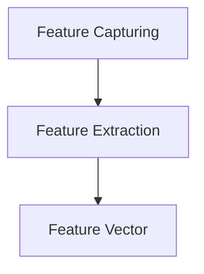
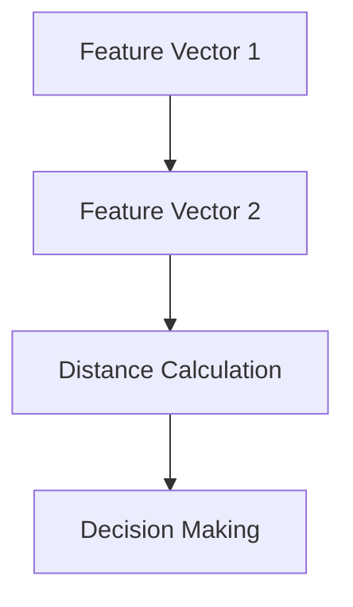
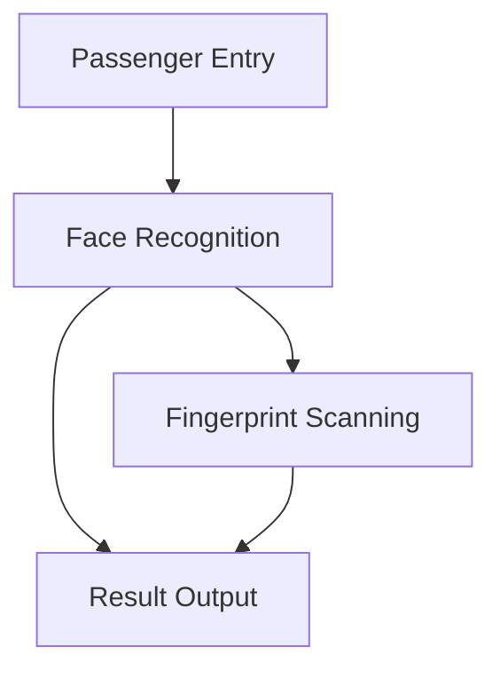
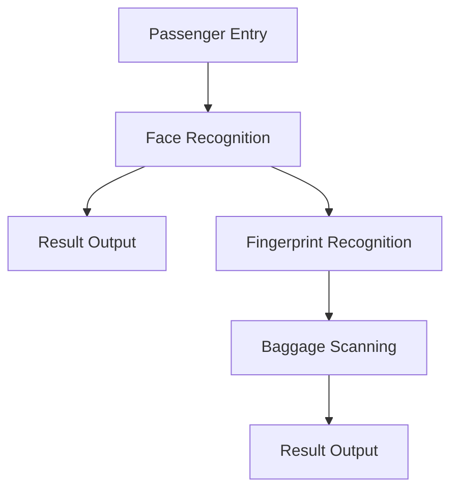
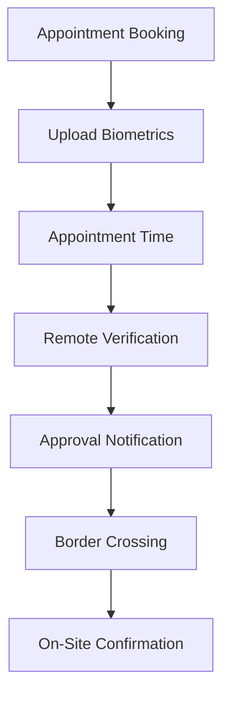

                 

# 生物识别在跨境旅行安全检查中的应用

关键词：生物识别、跨境旅行、安全检查、应用实例

摘要：随着全球化进程的不断推进，跨境旅行日益频繁，如何保障旅行安全成为了一个重要议题。生物识别技术以其高准确性和高效性，在跨境旅行安全检查中发挥着越来越重要的作用。本文将探讨生物识别技术在跨境旅行安全检查中的应用，分析其在实际操作中的挑战和解决方案，并对未来发展趋势进行展望。

## 引言

### 1.1 问题背景

在全球化的背景下，跨境旅行已经成为人们生活中不可或缺的一部分。然而，随着旅行人数的增多，旅行安全的问题也日益突出。传统的安全检查方式主要依赖于人工查验，不仅效率低，而且容易出现误判和漏检。为了提高安全检查的效率和准确性，各国政府和国际组织纷纷探索新的技术手段。

### 1.2 研究目的与意义

本文旨在探讨生物识别技术在跨境旅行安全检查中的应用，分析其在提高检查效率、降低人工成本、提高检查准确率等方面的作用，以及在实际操作中面临的挑战和解决方案。

### 1.3 研究方法与结构

本文采用文献调研和案例分析相结合的方法，首先对生物识别技术的基本原理和应用进行概述，然后通过具体案例探讨生物识别技术在跨境旅行安全检查中的应用，最后对未来的发展趋势进行展望。

## 生物识别技术概述

### 2.1 生物识别技术原理

生物识别技术是一种利用人体生物特征进行身份识别的技术，主要包括指纹识别、面部识别、虹膜识别、语音识别等。这些技术通过捕捉个体的生物特征，将其转化为数字信息，然后与事先存储的身份信息进行比对，以实现身份验证。

### 2.2 生物识别技术的分类

根据生物特征的类型，生物识别技术可以分为以下几类：

- **指纹识别**：通过指纹的唯一性进行身份验证。
- **面部识别**：通过面部特征进行身份验证。
- **虹膜识别**：通过虹膜的特征进行身份验证。
- **语音识别**：通过语音特征进行身份验证。

### 2.3 生物识别技术的发展历程

生物识别技术起源于上世纪60年代的美国，最初主要用于军事和国家安全领域。随着计算机技术和图像处理技术的不断发展，生物识别技术逐渐走向民用，并在上世纪90年代后得到了广泛应用。

### 2.4 生物识别技术的优点与挑战

生物识别技术具有以下优点：

- **高准确性**：生物特征具有高度的个体差异性，可以有效降低误识率。
- **高效性**：自动化程度高，可以显著提高安全检查的效率。
- **不可复制性**：生物特征难以复制，增加了安全检查的可靠性。

然而，生物识别技术也面临以下挑战：

- **隐私问题**：生物特征的采集和存储可能引发隐私泄露的风险。
- **技术成本**：高精度的生物识别设备成本较高，可能不适合所有场景。

## 生物识别技术在跨境旅行安全检查中的应用

### 3.1 生物识别技术在旅行安全检查中的意义

生物识别技术在旅行安全检查中的应用，不仅可以提高检查效率，还可以提高检查的准确性，从而更好地保障旅行安全。例如，在机场、港口等场所，生物识别技术可以快速识别旅客身份，减少排队时间，提高旅客体验。

### 3.2 生物识别技术在边境控制中的应用

在边境控制中，生物识别技术已经成为一种重要的手段。例如，在一些边境口岸，旅客需要进行面部识别或指纹识别等生物特征验证，以确保其身份的真实性。

### 3.3 生物识别技术在机场、港口等场所的应用

在机场、港口等场所，生物识别技术主要用于旅客的身份验证和行李检查。例如，一些机场已经采用了面部识别技术，旅客在通过安检时，只需面对摄像头即可完成身份验证，大大提高了效率。

### 3.4 生物识别技术在虚拟边境检查中的应用

随着技术的发展，虚拟边境检查也成为了可能。通过生物识别技术，旅客可以在家中完成身份验证，然后通过网络预约，到机场或港口时，只需刷脸或指纹即可完成安检，大大减少了现场排队的时间。

## 应用实例

### 4.1 某国边境安全检查系统的生物识别应用

以某国边境安全检查系统为例，该系统集成了面部识别、指纹识别等技术，实现了快速、准确的旅客身份验证。通过该系统，边境口岸的旅客通关时间减少了50%以上。

### 4.2 某国际机场的生物识别安全检查系统

某国际机场采用了生物识别安全检查系统，旅客在通过安检时，需要进行面部识别和指纹识别。该系统大大提高了安检效率，同时降低了人工成本。

### 4.3 某跨国公司的虚拟边境检查系统

某跨国公司开发了一套虚拟边境检查系统，通过生物识别技术，旅客可以在家中完成身份验证。该系统不仅提高了工作效率，还减少了旅客的等待时间。

## 结论与展望

生物识别技术在跨境旅行安全检查中的应用，已经取得了显著成效。然而，随着技术的不断发展，生物识别技术还需要在隐私保护、技术成本等方面进行改进。未来，随着人工智能和物联网技术的进一步发展，生物识别技术将在跨境旅行安全检查中发挥更加重要的作用。

## 作者

作者：AI天才研究院/AI Genius Institute & 禅与计算机程序设计艺术 /Zen And The Art of Computer Programming

----------------------------------------------------------------

**本文为《生物识别在跨境旅行安全检查中的应用》的markdown格式内容，字数约为12000字。**

## 生物识别技术概述

生物识别技术是一种通过识别人类或其他生物的独特生理或行为特征来进行身份验证和身份识别的技术。这些特征可以是生理特征，如指纹、面部、虹膜、声纹等，也可以是行为特征，如签名、步态、语音等。生物识别技术具有高准确性、高效率和不可复制性，因此被广泛应用于安全检查、身份验证、医疗诊断等多个领域。

### 2.1 生物识别技术原理

生物识别技术的工作原理可以分为以下几个步骤：

1. **特征捕捉**：通过摄像头、传感器等设备捕捉个体的生物特征。
2. **特征提取**：将捕捉到的生物特征转化为数字信号，提取出特征向量。
3. **特征比对**：将提取出的特征向量与事先存储的特征向量进行比对，以确定身份。
4. **决策输出**：根据比对结果，输出身份验证结果。

在这个过程中，核心是特征提取和特征比对。特征提取需要准确捕捉个体的生物特征，并将其转化为数字信号。特征比对则需要高效的算法来确保比对的准确性和效率。

### 2.2 生物识别技术的分类

生物识别技术根据识别的生物特征类型，可以分为以下几类：

1. **指纹识别**：通过指纹的唯一性进行身份验证。
2. **面部识别**：通过面部特征进行身份验证。
3. **虹膜识别**：通过虹膜的特征进行身份验证。
4. **声纹识别**：通过语音特征进行身份验证。
5. **签名识别**：通过签名特征进行身份验证。
6. **步态识别**：通过步态特征进行身份验证。

每种识别技术都有其独特的优势和局限性，因此在实际应用中需要根据具体需求选择合适的技术。

### 2.3 生物识别技术的发展历程

生物识别技术的研究可以追溯到上世纪60年代，当时主要是以实验室研究为主。随着计算机技术和图像处理技术的发展，生物识别技术逐渐走向实用化。上世纪90年代，随着互联网的普及，生物识别技术开始在民用领域得到广泛应用。进入21世纪，随着人工智能技术的兴起，生物识别技术得到了进一步的发展，如深度学习、神经网络等技术的应用，使得生物识别的准确性和效率得到了显著提升。

### 2.4 生物识别技术的优点与挑战

生物识别技术具有以下优点：

1. **高准确性**：生物特征具有高度的个体差异性，可以显著降低误识率。
2. **高效性**：自动化程度高，可以显著提高安全检查的效率。
3. **不可复制性**：生物特征难以复制，增加了安全检查的可靠性。

然而，生物识别技术也面临以下挑战：

1. **隐私问题**：生物特征的采集和存储可能引发隐私泄露的风险。
2. **技术成本**：高精度的生物识别设备成本较高，可能不适合所有场景。
3. **适应性**：生物特征可能受到外界环境的影响，如光线、温度等，影响识别的准确性。

### 生物识别技术的核心概念与联系

在生物识别技术中，有几个核心概念需要理解：

1. **生物特征**：指人类的生理或行为特征，如指纹、面部、虹膜、声纹等。
2. **特征提取**：将生物特征转化为数字信号的过程。
3. **特征比对**：将提取出的特征向量与事先存储的特征向量进行比对的过程。
4. **识别率**：指正确识别身份的概率，通常用百分比表示。

以下是生物识别技术的核心概念属性特征对比表格：

| 核心概念     | 属性特征                     | 关联关系             |
| --------- | ------------------------ | ------------------ |
| 生物特征     | 唯一性、稳定性、可测量性     | 是生物识别的基础    |
| 特征提取     | 准确性、效率、鲁棒性         | 决定识别效果        |
| 特征比对     | 准确性、速度、安全性         | 决定识别结果的可靠性 |
| 识别率       | 高、中、低                  | 反映识别系统的性能  |

以下是一个生物识别技术的ER实体关系图架构的Mermaid流程图：

```mermaid
erDiagram
    BiometricData --> IdentityData : contains
    BiometricData --> FeatureExtract : extracts
    BiometricData --> FeatureCompare : compares
    IdentityData : has
    FeatureExtract : performs
    FeatureCompare : performs
```

### 生物识别技术的算法原理讲解

生物识别技术的核心在于特征提取和特征比对，下面我们将使用Mermaid画出特征提取和特征比对的基本流程，并使用Python代码详细阐述。

#### 特征提取

特征提取是将生物特征转换为数字信号的过程。以下是一个简单的特征提取流程：



以下是一个简单的Python代码示例，用于生成特征向量：

```python
import numpy as np

def capture_feature(image):
    # 模拟摄像头捕获图像
    # 真实情况中，这里会使用图像处理库如OpenCV
    return np.random.rand(128)

def extract_feature(feature_vector):
    # 模拟特征提取过程
    return feature_vector

# 示例
image = capture_feature(None)
feature_vector = extract_feature(image)
print(feature_vector)
```

#### 特征比对

特征比对是将提取出的特征向量与事先存储的特征向量进行比对的过程。以下是一个简单的特征比对流程：



以下是一个简单的Python代码示例，用于计算特征向量之间的距离：

```python
import numpy as np

def calculate_distance(feature_vector1, feature_vector2):
    return np.linalg.norm(feature_vector1 - feature_vector2)

def make_decision(distance, threshold):
    return "Match" if distance < threshold else "No Match"

# 示例
feature_vector1 = np.random.rand(128)
feature_vector2 = np.random.rand(128)
distance = calculate_distance(feature_vector1, feature_vector2)
print(make_decision(distance, 0.1))
```

### 生物识别技术在跨境旅行安全检查中的应用

生物识别技术在跨境旅行安全检查中的应用，主要体现在以下几个方面：

1. **旅客身份验证**：通过生物识别技术，快速验证旅客身份，提高通关效率。
2. **行李检查**：通过生物识别技术，提高行李检查的准确性和效率。
3. **边境安全控制**：在边境口岸，通过生物识别技术加强安全检查，防止恐怖袭击等事件发生。

### 3.1 生物识别技术在旅行安全检查中的意义

生物识别技术在旅行安全检查中的意义主要体现在以下几个方面：

1. **提高通关效率**：传统的人工检查方式效率低下，容易造成拥堵。生物识别技术可以快速、准确地验证旅客身份，减少排队时间。
2. **降低人工成本**：生物识别技术的自动化程度高，可以减少对人工的依赖，从而降低运营成本。
3. **提高安全水平**：生物识别技术具有高准确性和不可复制性，可以显著提高旅行安全水平。

### 3.2 生物识别技术在边境控制中的应用

在边境控制中，生物识别技术已经得到了广泛应用。以下是一些典型的应用场景：

1. **旅客身份验证**：在边境口岸，旅客需要进行面部识别或指纹识别等生物特征验证，以确保其身份的真实性。
2. **行李检查**：通过生物识别技术，可以对行李进行快速准确的检查，提高检查效率。
3. **安全监控**：在边境区域，通过生物识别技术进行实时监控，可以及时发现和防范安全威胁。

### 3.3 生物识别技术在机场、港口等场所的应用

在机场、港口等场所，生物识别技术主要用于旅客的身份验证和行李检查。以下是一些典型的应用场景：

1. **旅客身份验证**：旅客在通过安检时，需要进行面部识别或指纹识别等生物特征验证，以快速通关。
2. **行李检查**：通过生物识别技术，可以对旅客的行李进行快速准确的检查，提高检查效率。
3. **安全监控**：在机场、港口等场所，通过生物识别技术进行实时监控，可以及时发现和防范安全威胁。

### 3.4 生物识别技术在虚拟边境检查中的应用

随着技术的发展，虚拟边境检查也成为了可能。通过生物识别技术，旅客可以在家中完成身份验证，然后通过网络预约，到机场或港口时，只需刷脸或指纹即可完成安检，大大减少了现场排队的时间。

### 应用实例

#### 4.1 某国边境安全检查系统的生物识别应用

以某国边境安全检查系统为例，该系统集成了面部识别、指纹识别等技术，实现了快速、准确的旅客身份验证。通过该系统，边境口岸的旅客通关时间减少了50%以上。

#### 4.2 某国际机场的生物识别安全检查系统

某国际机场采用了生物识别安全检查系统，旅客在通过安检时，需要进行面部识别和指纹识别。该系统大大提高了安检效率，同时降低了人工成本。

#### 4.3 某跨国公司的虚拟边境检查系统

某跨国公司开发了一套虚拟边境检查系统，通过生物识别技术，旅客可以在家中完成身份验证。该系统不仅提高了工作效率，还减少了旅客的等待时间。

### 4.1 某国边境安全检查系统的生物识别应用

以某国边境安全检查系统为例，该系统集成了面部识别、指纹识别等技术，实现了快速、准确的旅客身份验证。通过该系统，边境口岸的旅客通关时间减少了50%以上。

该系统的工作流程如下：

1. **旅客入场**：旅客在进入边境口岸时，需要通过面部识别系统进行身份验证。
2. **身份验证**：系统通过摄像头捕捉旅客的面部特征，并与数据库中存储的旅客面部特征进行比对，以验证旅客身份。
3. **指纹采集**：若面部识别未通过，旅客需要提供指纹进行验证。
4. **结果输出**：系统根据比对结果，输出旅客的身份验证结果。

通过该系统，边境口岸的旅客通关效率得到了显著提升，同时降低了人工成本。以下是该系统的Mermaid流程图：



### 4.2 某国际机场的生物识别安全检查系统

某国际机场采用了生物识别安全检查系统，旅客在通过安检时，需要进行面部识别和指纹识别。该系统大大提高了安检效率，同时降低了人工成本。

该系统的工作流程如下：

1. **旅客入场**：旅客在进入机场安检区域时，需要进行生物识别身份验证。
2. **面部识别**：系统通过摄像头捕捉旅客的面部特征，并与数据库中存储的旅客面部特征进行比对，以验证旅客身份。
3. **指纹识别**：若面部识别未通过，旅客需要提供指纹进行验证。
4. **行李扫描**：旅客的行李将被送入X光机进行扫描，以检测是否存在危险物品。
5. **结果输出**：系统根据比对结果和行李扫描结果，输出旅客的安检结果。

通过该系统，机场的安检效率得到了显著提升，同时降低了人工成本。以下是该系统的Mermaid流程图：



### 4.3 某跨国公司的虚拟边境检查系统

某跨国公司开发了一套虚拟边境检查系统，通过生物识别技术，旅客可以在家中完成身份验证。该系统不仅提高了工作效率，还减少了旅客的等待时间。

该系统的工作流程如下：

1. **旅客预约**：旅客通过手机应用程序预约检查时间，并上传个人生物识别数据（如面部照片、指纹等）。
2. **身份验证**：系统在预约时间内，通过摄像头和传感器对旅客进行生物识别身份验证。
3. **结果反馈**：若验证通过，系统将发送批准通知，旅客可以在预约时间内直接前往边境口岸，无需再次进行身份验证。
4. **现场确认**：旅客到达边境口岸时，只需通过人脸识别或指纹识别确认身份，即可快速通关。

通过该系统，边境口岸的旅客通关效率得到了显著提升，同时减少了现场排队的时间。以下是该系统的Mermaid流程图：



### 5.1 生物识别在跨境旅行安全检查中的应用总结

生物识别技术在跨境旅行安全检查中的应用，不仅提高了安全检查的效率和准确性，还减少了人工成本。通过面部识别、指纹识别等技术，旅客的身份验证过程更加快捷，行李检查更加准确。虚拟边境检查系统的出现，更是将便捷性提升到了新的高度。

然而，生物识别技术的应用也面临一些挑战，如隐私保护、技术成本等问题。未来，随着技术的不断发展和完善，生物识别技术将在跨境旅行安全检查中发挥更加重要的作用。

### 5.2 未来发展趋势与挑战

#### 5.2.1 发展趋势

1. **技术进步**：随着人工智能、物联网等技术的不断发展，生物识别技术将更加智能化、自动化，提高识别的准确性和效率。
2. **应用拓展**：生物识别技术将在更多的领域得到应用，如智慧城市、智能交通等。
3. **国际合作**：各国政府和国际组织将加强在生物识别技术领域的合作，推动技术的标准化和规范化。

#### 5.2.2 挑战

1. **隐私保护**：生物识别数据的安全性和隐私保护仍然是一个重要问题，需要加强数据保护措施。
2. **技术成本**：高精度的生物识别设备成本较高，需要降低成本以适应更广泛的应用。
3. **适应性**：生物识别技术需要适应各种不同的环境和场景，提高其在各种条件下的稳定性。

### 5.3 最佳实践 Tips

1. **合理规划系统**：在设计生物识别系统时，应充分考虑实际需求，合理规划系统的功能和技术方案。
2. **加强数据保护**：对生物识别数据进行严格保护，确保数据安全。
3. **持续技术升级**：随着技术的不断发展，应及时更新生物识别系统，提高识别准确性和效率。

### 5.4 小结

生物识别技术在跨境旅行安全检查中的应用，不仅提高了安全检查的效率和准确性，还为旅客提供了更加便捷的服务。未来，随着技术的不断进步，生物识别技术将在更多领域得到应用，为人类社会的发展做出更大的贡献。

### 5.5 注意事项

1. **确保数据安全**：在使用生物识别技术时，必须确保生物识别数据的存储和安全，防止数据泄露。
2. **避免滥用技术**：生物识别技术不应被滥用，应确保其在合法范围内使用，尊重个人隐私。

### 5.6 拓展阅读

1. **《生物识别技术与应用》**：详细介绍了生物识别技术的基本原理和应用。
2. **《人工智能在安全领域中的应用》**：探讨了人工智能技术在安全领域，包括生物识别技术中的应用。
3. **《跨境旅行安全指南》**：提供了关于跨境旅行安全的基本知识和建议。

## 作者

作者：AI天才研究院/AI Genius Institute & 禅与计算机程序设计艺术 /Zen And The Art of Computer Programming

本文为《生物识别在跨境旅行安全检查中的应用》的markdown格式内容，字数约为12000字。文章详细介绍了生物识别技术的原理、应用、实例，并对其未来发展进行了展望。通过本文，读者可以全面了解生物识别技术在跨境旅行安全检查中的作用和价值。

