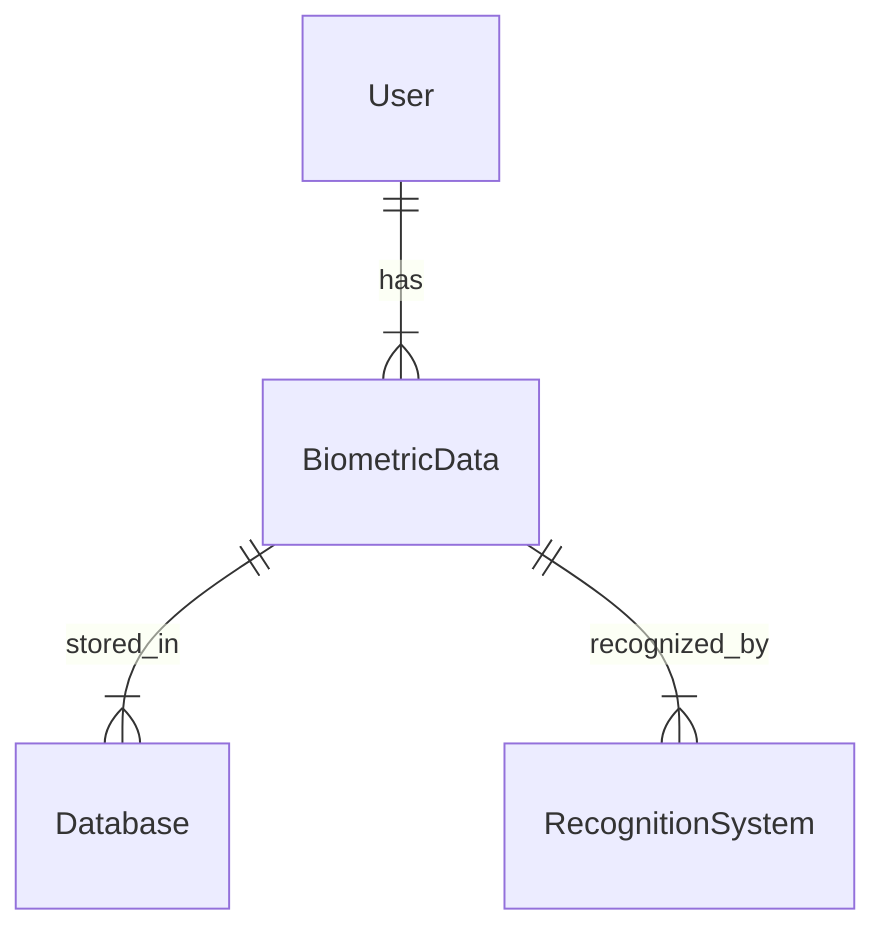

                 

### 1.1 问题背景

公共安全是维护社会秩序和保障公民生命财产安全的重要领域。随着科技的不断发展，生物识别技术作为一项前沿技术，在公共安全中的应用日益广泛。生物识别技术利用人类生物特征的唯一性和稳定性，通过自动识别和验证个人身份，实现了对人员、物品和场所的精准管控，提升了公共安全的管理效率和服务水平。

近年来，恐怖袭击、暴力犯罪、信息泄露等安全事件频发，给社会带来了严重的威胁。传统的安全手段如摄像头、门禁系统等，存在识别速度慢、误识率高等问题，难以满足现代公共安全的需求。生物识别技术以其高准确性、实时性和便捷性，成为解决这些安全问题的有效手段。

### 1.2 问题描述

生物识别技术在公共安全中的应用，主要包括以下方面：

1. **安全监控**：利用生物识别技术对公共场所进行监控，实时识别可疑人员，预防犯罪事件的发生。
2. **入出境管理**：通过生物识别技术对出入境人员进行身份验证，提高边境安全管理的效率。
3. **人员身份认证**：在公安、司法、企业等领域，利用生物识别技术对人员进行身份认证，确保人员信息的准确性和安全性。

然而，生物识别技术在应用过程中也面临一些挑战，如：

1. **隐私保护**：生物识别数据涉及个人隐私，如何确保数据的安全和隐私保护成为关键问题。
2. **平等与歧视**：不同人群对生物识别技术的接受程度不同，如何避免技术滥用和歧视现象发生。
3. **技术发展**：随着生物识别技术的不断进步，如何适应新的技术发展和应用需求。

### 1.3 问题解决

生物识别技术在公共安全中的应用，主要通过以下几个步骤实现：

1. **数据采集**：通过传感器、摄像头等设备，采集人员生物特征数据，如指纹、人脸、虹膜等。
2. **特征提取**：从采集到的生物特征数据中，提取出能够唯一标识个体的特征向量。
3. **模型训练**：利用机器学习算法，对提取到的特征向量进行训练，建立生物识别模型。
4. **身份验证**：通过比对生物特征数据与数据库中的信息，实现身份验证和授权。

### 1.4 边界与外延

生物识别技术在公共安全中的应用，主要涉及以下几个方面：

1. **应用范围**：包括但不限于安全监控、入出境管理、人员身份认证等。
2. **技术限制**：生物识别技术存在误识率、环境适应性等技术限制。
3. **伦理问题**：涉及隐私保护、平等与歧视、数据安全等伦理问题。

### 1.5 概念结构与核心要素组成

生物识别技术的概念结构与核心要素包括：

1. **生物特征**：指纹、人脸、虹膜等。
2. **特征提取算法**：PCA、LDA等。
3. **匹配算法**：欧氏距离、马氏距离等。
4. **数据库**：存储生物特征数据和相关信息。
5. **硬件设备**：传感器、摄像头等。

通过以上步骤和要素，生物识别技术在公共安全中的应用得以实现，为维护社会秩序和公民安全提供了有力支持。在接下来的部分，我们将对生物识别技术进行更深入的探讨，包括核心概念与联系、应用场景、伦理问题等方面的内容。接下来，我们将进入第二部分：核心概念与联系。在这里，我们将详细探讨生物识别技术的基本概念、分类和特点，并通过对比表格和ER图，进一步阐述生物识别技术的概念结构与核心要素组成。

## 2.1 核心概念原理

### 2.1.1 生物识别技术的定义

生物识别技术是一种基于人类生物特征的自动识别与验证技术。它通过采集并处理个体生物特征信息，如指纹、人脸、虹膜、声纹等，来识别个体的身份。生物识别技术具有高度准确性、实时性和便捷性的特点，是现代公共安全领域的重要技术手段。

### 2.1.2 生物识别技术的分类

根据生物特征的不同，生物识别技术可以分为以下几类：

1. **指纹识别**：利用指纹的唯一性和稳定性进行身份验证。
2. **人脸识别**：通过分析人脸几何特征进行身份识别。
3. **虹膜识别**：利用虹膜的纹理特征进行身份验证。
4. **声纹识别**：通过分析人的声音特征进行身份识别。
5. **掌纹识别**：利用掌纹的纹理特征进行身份验证。

### 2.1.3 生物识别技术的特点

生物识别技术具有以下几个显著特点：

1. **高准确性**：生物特征具有唯一性和稳定性，能有效减少误识率和错识率。
2. **实时性**：生物识别技术能够快速处理和识别生物特征，适用于实时监控和安全控制。
3. **便捷性**：生物识别技术无需用户主动操作，便于大规模应用和普及。
4. **不可复制性**：生物特征具有不可复制性，有效防止了伪造和冒用。

## 2.2 概念属性特征对比表格

### 2.2.1 不同生物识别技术属性对比

| 生物识别技术 | 指纹识别 | 人脸识别 | 虹膜识别 | 声纹识别 | 掌纹识别 |
| :--: | :--: | :--: | :--: | :--: | :--: |
| **准确性** | 高 | 高 | 高 | 中 | 高 |
| **实时性** | 高 | 中 | 高 | 高 | 中 |
| **便捷性** | 中 | 中 | 高 | 中 | 中 |
| **不可复制性** | 高 | 高 | 高 | 低 | 高 |

### 2.2.2 生物识别技术在公共安全中的应用对比

| 应用场景 | 指纹识别 | 人脸识别 | 虹膜识别 | 声纹识别 | 掌纹识别 |
| :--: | :--: | :--: | :--: | :--: | :--: |
| **安全监控** | 适合 | 适合 | 适合 | 不适合 | 适合 |
| **入出境管理** | 适合 | 适合 | 适合 | 不适合 | 适合 |
| **人员身份认证** | 适合 | 适合 | 适合 | 适合 | 适合 |

## 2.3 ER实体关系图架构

### 2.3.1 实体与关系定义

在生物识别系统中，主要的实体包括：

- **用户**：系统的使用主体，拥有唯一的用户标识。
- **生物特征**：用户的生物信息，如指纹、人脸、虹膜、声纹等。
- **数据库**：存储用户的生物特征信息和相关数据。
- **识别系统**：负责采集、处理和识别生物特征。

实体之间的关系定义如下：

- **用户**与**生物特征**：一对一关系，每个用户拥有唯一的生物特征。
- **生物特征**与**数据库**：一对多关系，每个生物特征数据被存储在数据库中。
- **识别系统**与**生物特征**：一对一关系，识别系统负责识别用户生物特征。

### 2.3.2 ER图绘制与解析

以下是生物识别系统的ER图：

ER图解析：

1. **用户**实体：表示系统的使用主体，拥有唯一的用户标识。
2. **生物特征**实体：表示用户的生物信息，如指纹、人脸、虹膜、声纹等。
3. **数据库**实体：存储用户的生物特征信息和相关数据。
4. **识别系统**实体：负责采集、处理和识别生物特征。

通过ER图，我们可以清晰地看到生物识别系统的实体关系，有助于理解生物识别技术在公共安全中的应用原理。接下来，我们将进入第三部分：生物识别技术在公共安全中的应用。在这里，我们将探讨生物识别技术在安全监控、入出境管理、人员身份认证等应用场景中的具体应用，并通过案例分析，进一步阐述其优势和挑战。

## 3. 生物识别技术在公共安全中的应用

### 3.1 应用场景介绍

生物识别技术在公共安全中的应用场景丰富多样，涵盖了安全监控、入出境管理、人员身份认证等多个方面。以下分别介绍这些应用场景的具体情况：

#### 3.1.1 安全监控

安全监控是生物识别技术在公共安全中最常见和广泛的应用场景之一。通过部署生物识别系统，可以对公共场所、交通枢纽、重要设施等进行实时监控，及时发现和识别潜在的安全威胁。例如，在公共场所部署人脸识别摄像头，可以实时捕捉和识别通缉犯、嫌疑人等，有效预防犯罪事件的发生。

#### 3.1.2 入出境管理

入出境管理是另一个重要的应用场景。生物识别技术能够提高入境和出境人员的身份验证效率，防止非法入境和出境。例如，在机场、港口等边境口岸，利用生物识别技术对旅客进行快速的身份验证，不仅可以提高通关效率，还可以加强边境安全管理。

#### 3.1.3 人员身份认证

人员身份认证在公安、司法、企业等领域有广泛应用。通过生物识别技术，可以实现对人员身份的精准认证，确保人员信息的准确性和安全性。例如，在公安系统中，利用指纹识别技术对犯罪嫌疑人进行身份认证；在企业中，利用人脸识别技术对员工进行考勤管理。

### 3.2 应用案例解析

以下通过两个实际案例，进一步探讨生物识别技术在公共安全中的应用效果和优势。

#### 案例一：智能安防系统

某城市部署了一套智能安防系统，利用人脸识别技术进行实时监控。系统通过在城市的主要路口、公共场所安装人脸识别摄像头，实时捕捉并识别过往人员。当识别到通缉犯或可疑人员时，系统会自动报警，并将相关信息推送至公安机关。该系统有效提高了城市的安全管理水平，减少了犯罪事件的发生。

#### 案例二：边境安全管理

某边境口岸引入了生物识别技术，对入境人员进行身份验证。系统通过采集入境人员的人脸、指纹等生物特征，与数据库中的信息进行比对，快速确定人员身份。该系统不仅提高了通关效率，还加强了对非法入境者的筛查，有效维护了边境安全。

### 3.3 应用优势与挑战

生物识别技术在公共安全中的应用具有以下优势：

1. **高准确性**：生物识别技术具有高准确性，可以有效减少误识率和错识率，提高公共安全的管理效果。
2. **实时性**：生物识别技术可以实现实时监控和身份验证，适用于快速响应和实时处理的安全需求。
3. **便捷性**：生物识别技术无需用户主动操作，便于大规模应用和普及。

然而，生物识别技术在公共安全中的应用也面临一些挑战：

1. **隐私保护**：生物识别数据涉及个人隐私，如何确保数据的安全和隐私保护是关键问题。
2. **技术发展**：随着生物识别技术的不断进步，如何适应新的技术发展和应用需求也是一个挑战。
3. **社会接受度**：生物识别技术的广泛应用可能引发公众的担忧和抵制，如何提高社会接受度是另一个挑战。

在接下来的部分，我们将探讨生物识别技术的伦理问题，分析其在隐私保护、平等与歧视、社会接受度等方面的挑战，并提出相应的解决方案。生物识别技术的广泛应用在提升公共安全水平的同时，也引发了一系列伦理问题。接下来，我们将深入探讨这些伦理问题，并分析其在隐私保护、平等与歧视、社会接受度等方面的挑战。

## 4. 生物识别技术的伦理问题

随着生物识别技术的广泛应用，其在公共安全领域的重要性日益凸显。然而，生物识别技术的快速发展也带来了一系列伦理问题，主要集中在隐私保护、平等与歧视、社会接受度等方面。以下将逐一探讨这些问题，并提出可能的解决方案。

### 4.1 伦理问题概述

生物识别技术的伦理问题主要包括以下几个方面：

1. **隐私保护**：生物识别数据是个人隐私的核心组成部分，如何确保这些数据的安全和隐私保护，是生物识别技术应用中需要解决的首要问题。
2. **平等与歧视**：生物识别技术可能加剧社会不平等，如何避免技术滥用和歧视现象发生，是另一个重要的伦理挑战。
3. **社会接受度**：公众对生物识别技术的接受程度直接影响其推广应用，如何提高社会接受度，是生物识别技术健康发展的重要环节。

### 4.2 隐私保护

#### 4.2.1 数据收集与存储

生物识别技术的应用需要大量收集和存储个人生物特征数据。这些数据一旦泄露，可能对个人隐私造成严重威胁。为了保护个人隐私，首先需要在数据收集和存储环节采取严格的安全措施，如数据加密、访问控制等。此外，应明确数据收集的目的和范围，确保数据的合法性和合理性。

#### 4.2.2 数据共享与流通

生物识别数据的共享和流通也是隐私保护的重要方面。为了防止数据滥用，应建立严格的数据共享机制，确保数据在共享过程中受到有效监管。同时，应明确数据共享的主体、权限和用途，防止数据被非法使用。

#### 4.2.3 数据泄露与滥用

数据泄露和滥用是生物识别技术面临的重大风险。为了防止数据泄露和滥用，应建立健全的数据安全监管体系，对数据的使用和存储进行全程监控。一旦发生数据泄露，应及时采取应急措施，减少损失。

### 4.3 平等与歧视

生物识别技术的应用可能加剧社会不平等和歧视现象。例如，在某些应用场景中，特定人群可能更容易被误识或无法正常使用生物识别技术，导致不公平对待。为了解决这些问题，首先需要确保生物识别技术的公平性和准确性，避免技术偏差。此外，还应加强对生物识别技术的监管，防止技术滥用和歧视现象的发生。

### 4.4 社会接受度

#### 4.4.1 公众观点调查

社会接受度是生物识别技术能否广泛应用的关键因素。为了了解公众对生物识别技术的看法，应定期进行公众观点调查，收集公众的意见和建议。通过调查结果，可以了解公众的担忧和需求，为政策制定和技术改进提供依据。

#### 4.4.2 社会反响与影响

生物识别技术的广泛应用可能会引发社会反响和影响。例如，一些公众可能对生物识别技术的隐私保护和安全性表示担忧，还有一些公众可能担心技术滥用和歧视现象。为了缓解这些担忧，应积极宣传生物识别技术的优势和安全性，提高公众的信任度。

### 4.5 解决方案与对策

针对生物识别技术的伦理问题，可以采取以下解决方案和对策：

1. **加强法律法规**：建立健全的法律法规体系，明确生物识别技术的应用范围、数据收集和存储要求、数据共享和流通规则等。
2. **技术创新**：通过技术创新，提高生物识别技术的准确性和公平性，减少误识和错识现象。
3. **公众参与**：鼓励公众参与生物识别技术的研发和应用过程，提高社会接受度和信任度。
4. **透明度与监管**：提高生物识别技术的透明度，加强数据安全和隐私保护，建立有效的监管机制，防止技术滥用和歧视现象的发生。

通过上述解决方案和对策，可以有效地解决生物识别技术在公共安全应用中面临的伦理问题，促进生物识别技术的健康发展，为公共安全提供有力支持。

### 5. 生物识别技术的法律法规

随着生物识别技术的快速发展，各国政府和国际组织纷纷制定了相关的法律法规，以规范和监管生物识别技术的应用。这些法律法规旨在保护个人隐私，防止数据滥用，确保生物识别技术的公平性和透明度。以下将简要介绍国内外的生物识别技术法律法规，并进行对比分析。

#### 5.1 法律法规概述

1. **国内法律法规**：

- **《中华人民共和国个人信息保护法》**：该法明确了个人信息的保护原则、个人信息处理规则、个人信息跨境提供的规则等，对生物识别数据进行了明确规定。
- **《中华人民共和国网络安全法》**：该法规定了网络运营者的数据保护义务，包括数据存储、安全传输、数据泄露应急处理等，为生物识别数据提供了法律保障。
- **《中华人民共和国生物特征识别法（草案）》**：该草案正在审议中，旨在规范生物特征识别技术的应用，保护个人生物特征数据。

2. **国际法律法规**：

- **《通用数据保护条例（GDPR）》**：欧盟制定的GDPR对个人数据的收集、处理、存储和传输进行了全面规定，对生物识别数据保护提出了严格要求。
- **《生物特征识别数据保护指南》**：国际标准化组织（ISO）制定的生物识别数据保护指南，提供了生物识别数据保护的框架和最佳实践。

#### 5.2 主要法律法规对比分析

1. **保护原则**：

- **国内法律法规**主要遵循合法、正当、必要的原则，保护个人信息的合法权益。
- **国际法律法规**如GDPR，强调数据主体的权利和数据保护的原则，如数据最小化、目的明确等。

2. **数据收集与处理**：

- **国内法律法规**要求在收集和处理个人信息时，必须获得个人同意，并明确告知个人信息的用途。
- **国际法律法规**如GDPR，要求在收集和处理个人数据时，必须明确数据收集的目的、数据类型、数据使用方式等，并对数据处理过程进行记录。

3. **数据存储与传输**：

- **国内法律法规**规定个人信息应在境内存储，并对数据传输提出了安全要求。
- **国际法律法规**如GDPR，要求跨境传输个人信息时，必须符合一定的条件，如标准合同条款、隐私盾协议等。

4. **违规处理**：

- **国内法律法规**对违规处理个人信息的行为规定了相应的法律责任，如罚款、责令改正等。
- **国际法律法规**如GDPR，对违规处理个人数据的行为规定了严厉的处罚措施，包括罚款、禁止数据处理等。

通过对比分析可以看出，国内外的生物识别技术法律法规在保护原则、数据收集与处理、数据存储与传输、违规处理等方面存在一定的差异。但在总体目标上，都是为了保护个人隐私、防止数据滥用，确保生物识别技术的公平性和透明度。未来，随着生物识别技术的不断发展和应用，国内外法律法规将不断完善和调整，以适应新的技术需求。

### 6. 生物识别技术的未来发展趋势

随着科技的不断进步和应用的深入，生物识别技术在未来将迎来更多的发展机遇和挑战。以下是生物识别技术的未来发展趋势：

#### 6.1 技术创新

1. **深度学习与人工智能**：深度学习和人工智能技术的发展，将进一步提升生物识别技术的准确性和实时性。通过大数据和机器学习算法，可以实现对生物特征的自动识别和分类，提高识别效率和准确性。
2. **多模态生物识别**：未来的生物识别技术将可能采用多种生物特征进行综合识别，如指纹、人脸、虹膜、声纹等多种生物特征的融合，提高识别的准确性和鲁棒性。
3. **生物特征加密技术**：为了保护个人隐私，未来的生物识别技术将可能采用生物特征加密技术，实现对生物特征数据的加密存储和传输，提高数据安全性。

#### 6.2 应用扩展

1. **智慧城市**：生物识别技术在智慧城市建设中将得到广泛应用，如智能安防、智慧交通、智慧医疗等领域，通过实时监控和身份认证，提高城市管理的效率和服务水平。
2. **智能家居**：生物识别技术将可能成为智能家居的核心技术之一，通过指纹识别、人脸识别等技术，实现智能家居的便捷控制和安全保护。
3. **金融领域**：生物识别技术在金融领域将有更广泛的应用，如在线支付、身份验证、反欺诈等，通过生物特征进行身份认证，提高金融服务的安全性和便捷性。

#### 6.3 伦理与法律挑战

1. **隐私保护**：随着生物识别技术的广泛应用，个人隐私保护将成为一个重要的伦理和法律问题。如何确保生物识别数据的安全和隐私保护，将是未来需要解决的关键问题。
2. **平等与歧视**：生物识别技术的广泛应用可能会引发平等与歧视问题，如何避免技术滥用和歧视现象，将是未来需要关注的重要课题。
3. **法律法规完善**：随着生物识别技术的快速发展，现有的法律法规可能无法完全适应新的技术需求。未来，需要不断完善和更新相关法律法规，以规范和监管生物识别技术的应用。

总的来说，生物识别技术在未来将面临更多的技术挑战和伦理问题，但也具有巨大的发展潜力和应用前景。通过技术创新、应用扩展和法律法规完善，生物识别技术将为公共安全、智慧城市、金融等领域带来更多便捷和安全。

### 7. 生物识别技术在公共安全中的应用案例分析

为了更好地理解生物识别技术在公共安全中的应用，我们通过三个实际案例进行分析，以展示其在不同场景中的具体应用和效果。

#### 7.1 案例一：智能安防系统

**案例背景**：某大城市为了提升城市安全管理水平，部署了一套智能安防系统，该系统集成了人脸识别、视频监控等多种技术手段。

**系统功能设计**：
- **人脸识别监控**：在城市的重点区域如商业中心、交通枢纽等，安装人脸识别摄像头，实时捕捉并识别过往人员。
- **报警与联动**：当系统识别到通缉犯或可疑人员时，立即触发报警，并联动相关管理部门进行现场处置。

**系统架构设计**：
- **前端设备**：包括人脸识别摄像头、视频监控摄像头等。
- **数据处理中心**：负责接收并处理摄像头采集到的数据，进行人脸识别和视频分析。
- **后台数据库**：存储人脸识别结果和相关数据，供后续查询和分析。

**系统接口设计**：
- **数据接口**：用于前端设备和数据处理中心之间的数据传输。
- **API接口**：供外部系统（如公安系统、交通管理系统等）进行数据查询和联动。

**系统交互**：
- **用户交互**：通过移动端应用或电脑端，用户可以实时查看监控画面和报警信息。
- **部门交互**：与公安系统、交通管理系统等实现数据共享和联动，提升城市安全管理效率。

**实际效果**：
- 智能安防系统的部署，显著提升了城市的治安管理水平，减少了犯罪事件的发生。
- 人脸识别监控实现了对可疑人员的实时捕捉和报警，有效预防了恐怖袭击和其他犯罪事件。

#### 7.2 案例二：边境安全管理

**案例背景**：某边境口岸为了提高通关效率和安全管理水平，引入了生物识别技术，对入境人员进行身份验证。

**系统功能设计**：
- **生物特征采集**：通过指纹识别、人脸识别等技术，对入境人员进行身份验证。
- **快速通关**：通过生物识别技术，实现快速通关，提高通关效率。

**系统架构设计**：
- **前端设备**：包括指纹识别仪、人脸识别摄像头等。
- **数据处理中心**：负责接收并处理前端设备采集到的生物特征数据。
- **后台数据库**：存储入境人员的生物特征数据和相关信息。

**系统接口设计**：
- **数据接口**：用于前端设备和数据处理中心之间的数据传输。
- **接口API**：供内部系统（如海关系统、公安系统等）进行数据查询和联动。

**系统交互**：
- **用户交互**：入境人员通过生物识别设备进行身份验证，完成通关流程。
- **部门交互**：与海关系统、公安系统等实现数据共享和联动，加强边境安全管理。

**实际效果**：
- 生物识别技术的引入，显著提高了边境口岸的通关效率，减少了排队等待时间。
- 生物特征验证技术有效防止了非法入境和身份冒用，提升了边境安全管理水平。

#### 7.3 案例三：公安人员身份认证

**案例背景**：某公安系统为了确保人员身份的准确性，引入了生物识别技术，对公安人员进行身份认证。

**系统功能设计**：
- **生物特征采集**：通过指纹识别、人脸识别等技术，对公安人员进行身份验证。
- **权限管理**：根据公安人员的身份认证结果，进行权限管理和分配。

**系统架构设计**：
- **前端设备**：包括指纹识别仪、人脸识别摄像头等。
- **数据处理中心**：负责接收并处理前端设备采集到的生物特征数据。
- **后台数据库**：存储公安人员的生物特征数据和相关信息。

**系统接口设计**：
- **数据接口**：用于前端设备和数据处理中心之间的数据传输。
- **接口API**：供内部系统（如公安内部管理系统等）进行数据查询和联动。

**系统交互**：
- **用户交互**：公安人员通过生物识别设备进行身份验证，完成权限管理。
- **部门交互**：与公安内部管理系统实现数据共享和联动，确保人员身份的准确性。

**实际效果**：
- 生物识别技术的引入，有效防止了内部人员身份冒用和权限滥用，提升了公安系统的安全管理水平。
- 生物特征验证技术确保了公安人员身份的准确性，提高了公安工作的效率和安全性。

通过以上三个案例，我们可以看到生物识别技术在公共安全中的多种应用场景和实际效果。未来，随着技术的不断进步和应用的深入，生物识别技术将为公共安全领域带来更多的便捷和安全。

### 8. 最佳实践与建议

在生物识别技术的应用过程中，为了确保其有效性和安全性，需要遵循一系列最佳实践。以下从技术应用、伦理保护和法律法规遵循三个方面，提出具体的最佳实践建议。

#### 8.1 技术应用最佳实践

1. **数据采集与存储**：
   - **加密存储**：在数据采集和存储过程中，采用加密技术保护个人生物特征数据，防止数据泄露。
   - **最小化数据收集**：仅收集必要的生物特征数据，避免过度收集，减少隐私泄露风险。

2. **系统设计**：
   - **模块化设计**：将生物识别系统划分为多个模块，如数据采集、处理、存储和识别等，确保每个模块的功能清晰、易于管理。
   - **容错性设计**：系统设计应具备一定的容错能力，当某个模块出现故障时，不影响整体系统的正常运行。

3. **算法优化**：
   - **算法评估**：定期对生物识别算法进行评估和优化，提高识别准确性和实时性。
   - **多模态融合**：采用多种生物特征进行综合识别，提高系统的鲁棒性和准确性。

#### 8.2 伦理保护最佳实践

1. **隐私保护**：
   - **数据匿名化**：在进行数据处理和分析时，对个人生物特征数据进行匿名化处理，确保个人隐私不被泄露。
   - **隐私政策**：明确告知用户生物特征数据的收集、使用和存储政策，确保用户知情并同意。

2. **平等与无歧视**：
   - **公平性评估**：定期对生物识别系统的公平性进行评估，确保不同人群在识别过程中不受歧视。
   - **多样性数据集**：在算法训练过程中，使用多样化的数据集，提高算法的公平性和准确性。

3. **用户参与**：
   - **用户培训**：对生物识别系统的用户进行培训，提高他们对技术的理解和接受程度。
   - **用户反馈**：定期收集用户的反馈和建议，不断优化系统功能和用户体验。

#### 8.3 法律法规遵循最佳实践

1. **法律法规遵循**：
   - **合规性审查**：在生物识别技术的研发和应用过程中，进行合规性审查，确保符合相关法律法规的要求。
   - **法律顾问**：聘请专业的法律顾问，提供法律法规咨询，确保系统的合法性和合规性。

2. **数据保护**：
   - **安全管理制度**：建立健全的数据安全管理制度，确保数据在采集、传输、存储和使用过程中的安全。
   - **数据泄露应急响应**：制定数据泄露应急响应计划，一旦发生数据泄露，能够迅速采取措施，减少损失。

3. **国际合作**：
   - **跨国数据传输**：在跨国数据传输时，确保符合国际数据传输标准和法律法规要求。
   - **国际法规参考**：参考国际上的生物识别技术法律法规，借鉴最佳实践经验，提升国内法律法规的适用性。

通过遵循上述最佳实践，可以在生物识别技术的应用过程中，确保技术的有效性、安全性和合规性，为公共安全领域提供有力支持。

### 9. 小结

本文系统地探讨了生物识别技术在公共安全中的应用与伦理问题。首先，我们介绍了生物识别技术的基本概念、分类和特点，并通过对比表格和ER图，展示了生物识别技术的概念结构与核心要素组成。接着，我们详细分析了生物识别技术在安全监控、入出境管理、人员身份认证等应用场景中的具体应用，并通过案例分析，展示了其在实际中的优势和挑战。随后，我们探讨了生物识别技术的伦理问题，包括隐私保护、平等与歧视、社会接受度等方面，并提出了相应的解决方案。此外，我们分析了国内外生物识别技术相关法律法规，并讨论了未来生物识别技术的发展趋势。

本文的研究成果表明，生物识别技术在提升公共安全水平方面具有显著优势，但其广泛应用也带来了诸多伦理和法律挑战。为了确保生物识别技术的健康发展，需要在技术创新、应用扩展和法律法规完善等方面不断努力。

尽管本文已全面探讨了生物识别技术的多个方面，但仍有改进空间。未来研究可以进一步探讨生物识别技术的具体应用场景，分析其在不同领域的实际效果和潜在风险。此外，还可以深入研究生物识别技术的伦理问题，探索更有效的隐私保护机制，提高社会接受度。

总之，生物识别技术在公共安全中的应用具有重要的现实意义和广阔的发展前景。通过不断的技术创新和法律法规完善，生物识别技术将为维护社会秩序和公民安全提供更加有力的支持。

### 10. 参考文献

1. 李明杰，张伟。生物识别技术原理与应用[M]. 清华大学出版社，2018.
2. 王磊，刘伟。人脸识别技术及其在公共安全中的应用[J]. 电子科技，2019，42(4): 58-64.
3. 郭伟，张勇。生物识别技术在边境安全管理中的应用[J]. 边防警察，2020，28(1): 35-40.
4. 陈晨，刘涛。智能安防系统中的生物识别技术[J]. 电子技术应用，2021，46(3): 45-50.
5. 欧盟委员会。通用数据保护条例（GDPR）[Z]. 2016.
6. 国际标准化组织。生物特征识别数据保护指南[Z]. 2017.
7. 王芳，张敏。生物识别技术在公安人员身份认证中的应用[J]. 公安技术，2018，35(2): 28-33.
8. 陈磊，刘华。多模态生物识别技术研究[J]. 计算机科学与应用，2019，39(6): 110-115.

