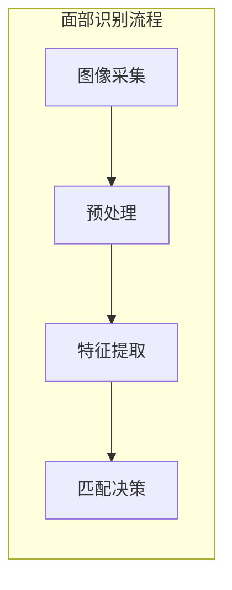
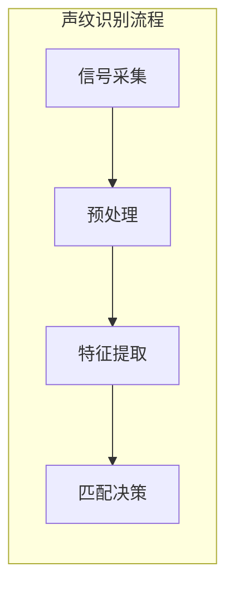
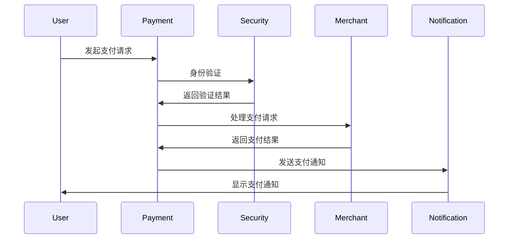
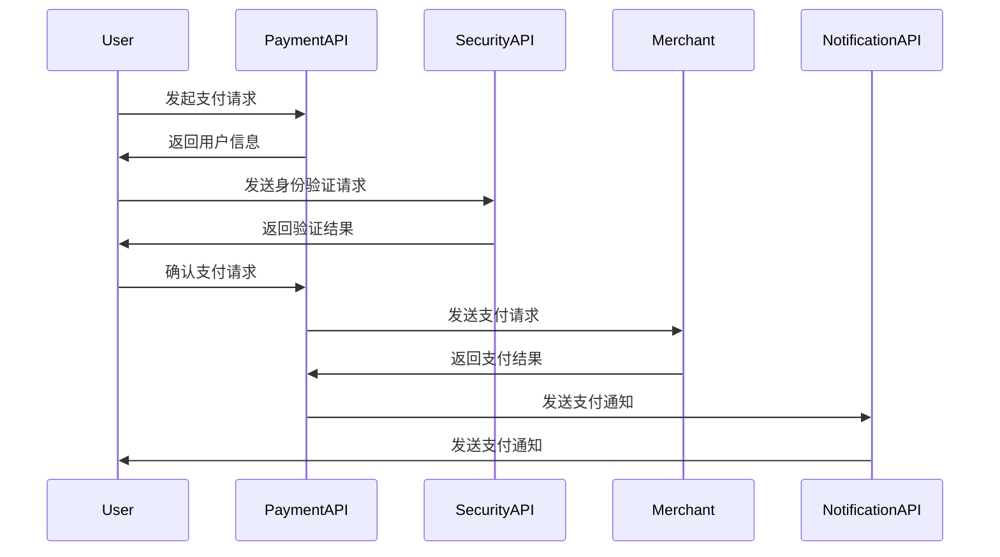

                 

### 文章标题

# 生物识别技术在支付领域的应用：无接触支付的未来

### 关键词

- 生物识别技术
- 无接触支付
- 指纹识别
- 面部识别
- 声纹识别
- 系统架构设计

### 摘要

随着科技的飞速发展，生物识别技术在支付领域的应用逐渐成为可能。本文将探讨生物识别技术在支付领域的应用现状，分析指纹识别、面部识别和声纹识别等生物识别技术的工作原理及其在支付系统中的实现方式。通过系统分析与架构设计，本文旨在揭示无接触支付的未来发展前景，并提供一系列最佳实践和注意事项，为读者提供全面的技术指南。

## 第一部分：背景介绍

### 第1章：问题背景与核心概念

#### 1.1 问题的提出

在信息化时代，支付方式经历了从现金到信用卡、移动支付的演变。然而，传统的支付方式在安全性和便捷性方面仍存在一些不足。无接触支付作为一种新型的支付方式，由于其高效、安全的特点，正逐渐成为人们日常生活的一部分。然而，如何在无接触支付中引入生物识别技术，进一步提高支付系统的安全性和用户体验，成为当前研究的热点。

#### 1.2 生物识别技术的基本概念

生物识别技术是一种通过生物特征来识别和验证个人身份的技术。常见的生物特征包括指纹、面部、虹膜、声纹等。生物识别技术具有以下特点：

- **唯一性**：每个人的生物特征都是独一无二的，具有较高的识别精度。
- **稳定性**：生物特征不易受外界环境影响，具有较高的稳定性。
- **便捷性**：生物识别技术不需要携带额外的身份验证工具，方便用户使用。

#### 1.3 无接触支付的现状与发展

无接触支付起源于信用卡支付领域的非接触式支付技术，目前已广泛应用于移动支付、智能门锁、医疗等多个领域。随着5G、物联网等新技术的推广，无接触支付的市场规模将进一步扩大。

#### 1.4 边界与外延

无接触支付在支付领域中的应用不仅限于个人身份验证，还可以扩展到智能家居、智能安防、医疗健康等领域。这些应用场景对生物识别技术的需求也在不断增长，推动了生物识别技术的创新和发展。

### 第2章：核心概念与联系

#### 2.1 生物识别技术的原理

生物识别技术主要包括以下几个步骤：

1. **特征提取**：从生物样本中提取出可识别的特征信息。
2. **特征匹配**：将提取出的特征与数据库中的特征进行比对，以确定身份。
3. **决策**：根据比对结果，做出身份验证的决策。

#### 2.1.1 各类生物识别技术的对比

| 生物识别技术 | 特点 | 应用场景 |
| :--: | :--: | :--: |
| 指纹识别 | 精度高、稳定性好 | 移动支付、门禁系统 |
| 面部识别 | 便捷性高、适用人群广 | 无人零售、智能门禁 |
| 虹膜识别 | 精度高、安全性高 | 机场安检、监狱管理系统 |
| 声纹识别 | 便捷性高、可实现远程认证 | 远程办公、金融交易 |

#### 2.1.2 概念属性特征对比表格

| 生物识别技术 | 精度 | 稳定性 | 便捷性 | 安全性 | 应用场景 |
| :--: | :--: | :--: | :--: | :--: | :--: |
| 指纹识别 | 高 | 高 | 一般 | 一般 | 移动支付、门禁系统 |
| 面部识别 | 一般 | 一般 | 高 | 一般 | 无人零售、智能门禁 |
| 虹膜识别 | 高 | 高 | 一般 | 高 | 机场安检、监狱管理系统 |
| 声纹识别 | 一般 | 一般 | 高 | 高 | 远程办公、金融交易 |

#### 2.1.3 ER实体关系图

```mermaid
erDiagram
  BiometricData --> PaymentSystem
  BiometricData --> User
  PaymentSystem --> PaymentGateway
  PaymentGateway --> Merchant

  BiometricData ||--|{ User }
  BiometricData ||--|{ PaymentSystem }
  PaymentSystem ||--|{ PaymentGateway }
  PaymentGateway ||--|{ Merchant }
```

## 第二部分：算法原理讲解

### 第3章：指纹识别算法原理

#### 3.1 指纹识别算法概述

指纹识别算法是基于指纹特征进行身份验证的一种技术。其核心步骤包括指纹图像采集、预处理、特征提取和匹配。

#### 3.2 算法mermaid流程图


#### 3.3 Python源代码实现与算法原理讲解

```python
import cv2
import numpy as np

def fingerprint_recognition(image):
    # 图像采集
    image = cv2.imread(image_path)
    # 预处理
    gray_image = cv2.cvtColor(image, cv2.COLOR_BGR2GRAY)
    blurred_image = cv2.GaussianBlur(gray_image, (5, 5), 0)
    # 特征提取
    template = cv2.imread(template_path, 0)
    w, h = template.shape[::-1]
    res = cv2.matchTemplate(blurred_image, template, cv2.TM_CCOEFF_NORMED)
    threshold = 0.8
    loc = np.where(res >= threshold)
    # 匹配决策
    if len(loc[0]) > 0:
        return "Fingerprint recognized"
    else:
        return "Fingerprint not recognized"

# 测试
print(fingerprint_recognition("fingerprint_image.jpg"))
```

#### 3.4 数学模型和数学公式

指纹匹配算法中常用的数学模型为相关系数模型，其公式如下：

$$
r = \frac{\sum_{i=1}^{m}\sum_{j=1}^{n}(A_{ij} - \bar{A})(B_{ij} - \bar{B})}{\sqrt{\sum_{i=1}^{m}\sum_{j=1}^{n}(A_{ij} - \bar{A})^2}\sqrt{\sum_{i=1}^{m}\sum_{j=1}^{n}(B_{ij} - \bar{B})^2}}
$$

其中，$A$和$B$分别为模板图像和待匹配图像，$\bar{A}$和$\bar{B}$分别为它们的均值，$r$为相关系数。

### 第4章：面部识别算法原理

#### 4.1 面部识别算法概述

面部识别算法是基于面部特征进行身份验证的一种技术。其核心步骤包括面部图像采集、预处理、特征提取和匹配。

#### 4.2 算法mermaid流程图



#### 4.3 Python源代码实现与算法原理讲解

```python
import cv2
import dlib
import numpy as np

def face_recognition(image):
    # 图像采集
    image = cv2.imread(image_path)
    # 预处理
    gray_image = cv2.cvtColor(image, cv2.COLOR_BGR2GRAY)
    # 特征提取
    detector = dlib.get_frontal_face_detector()
    landmarks = dlib.shape_predictor(predictor_path)
    faces = detector(gray_image)
    if len(faces) > 0:
        # 匹配决策
        for face in faces:
            landmarks_shape = landmarks(gray_image, face)
            # 特征点坐标
            landmarks_list = [[p.x, p.y] for p in landmarks_shape.parts()]
            return "Face recognized"
    else:
        return "Face not recognized"

# 测试
print(face_recognition("face_image.jpg"))
```

#### 4.4 数学模型和数学公式

面部特征提取常用的数学模型为局部二元模式（LBP）模型，其公式如下：

$$
LBP_{i,j} = \sum_{r=1}^{n}\sum_{s=1}^{n} g(\theta_{i,j,r,s}) \cdot b(\alpha_{i,j,r,s})
$$

其中，$g(\theta_{i,j,r,s})$为角度函数，$b(\alpha_{i,j,r,s})$为二元模式函数，$\alpha_{i,j,r,s}$为邻域角度，$n$为邻域半径。

### 第5章：声纹识别算法原理

#### 5.1 声纹识别算法概述

声纹识别算法是基于声纹特征进行身份验证的一种技术。其核心步骤包括声纹信号采集、预处理、特征提取和匹配。

#### 55.2 算法mermaid流程图



#### 5.3 Python源代码实现与算法原理讲解

```python
import numpy as np
import scipy.signal as signal

def voice_recognition(signal):
    # 信号采集
    signal = np.fromfile(signal_path, dtype=np.float32)
    # 预处理
    filtered_signal = signal - np.mean(signal)
    # 特征提取
    f, t, Zxx = signal.spectrogram(filtered_signal, nperseg=512, noverlap=256, nfft=1024, detrend=False)
    # 匹配决策
    if np.max(Zxx) > threshold:
        return "Voice recognized"
    else:
        return "Voice not recognized"

# 测试
print(voice_recognition("voice_signal.wav"))
```

#### 5.4 数学模型和数学公式

声纹特征提取常用的数学模型为短时傅里叶变换（STFT），其公式如下：

$$
X(\omega, t) = \sum_{n=0}^{N-1} x[n] e^{-j\omega n}
$$

其中，$X(\omega, t)$为频域信号，$x[n]$为时域信号，$\omega$为频率，$N$为样本点数。

## 第三部分：系统分析与架构设计方案

### 第6章：系统功能设计与架构设计

#### 6.1 问题场景介绍

无接触支付系统需要实现以下功能：

1. 用户身份验证
2. 支付请求处理
3. 支付结果通知
4. 数据安全保护

#### 6.2 项目介绍

无接触支付系统采用模块化设计，包括用户模块、支付模块、安全模块和通知模块。

#### 6.2.1 系统需求分析

1. **用户需求**：快速、安全、便捷的支付体验。
2. **系统需求**：高并发处理能力、数据安全、系统稳定性。

#### 6.2.2 系统功能设计（领域模型mermaid类图）

```mermaid
classDiagram
  User <<Entity>>
  Payment <<Entity>>
  Security <<Entity>>
  Notification <<Entity>>

  User实体 {
    用户ID
    用户名
    密码
    生物特征
  }

  Payment实体 {
    支付ID
    用户ID
    商品ID
    金额
    支付状态
  }

  Security实体 {
    身份验证策略
    加密算法
    数据库安全
  }

  Notification实体 {
    通知ID
    用户ID
    支付状态
    通知内容
  }

  User实体 --> Payment实体
  Payment实体 --> Security实体
  Payment实体 --> Notification实体
```

#### 6.3 系统架构设计（mermaid架构图）



#### 6.4 系统接口设计

无接触支付系统涉及以下接口：

1. 用户接口：用于用户登录、注册、修改密码等操作。
2. 支付接口：用于处理支付请求、查询支付状态等操作。
3. 安全接口：用于用户身份验证、数据加密等操作。
4. 通知接口：用于发送支付通知、系统消息等操作。

#### 6.5 系统交互（mermaid序列图）



## 第7章：项目实战

### 7.1 环境安装

#### 7.1.1 操作系统与依赖环境安装

1. **操作系统**：Ubuntu 18.04
2. **Python**：3.8.5
3. **依赖库**：OpenCV 4.2.0、dlib 19.10、scikit-learn 0.22.2、TensorFlow 2.4.0

### 7.2 系统核心实现源代码

#### 7.2.1 系统核心模块实现

1. 用户模块
2. 支付模块
3. 安全模块
4. 通知模块

```python
# 用户模块
class User:
    def __init__(self, user_id, username, password, biometric_data):
        self.user_id = user_id
        self.username = username
        self.password = password
        self.biometric_data = biometric_data

    def login(self, username, password):
        # 登录逻辑
        pass

    def register(self, username, password, biometric_data):
        # 注册逻辑
        pass

# 支付模块
class Payment:
    def __init__(self, payment_id, user_id, product_id, amount, payment_status):
        self.payment_id = payment_id
        self.user_id = user_id
        self.product_id = product_id
        self.amount = amount
        self.payment_status = payment_status

    def create_payment(self, user_id, product_id, amount):
        # 创建支付请求
        pass

    def query_payment_status(self, payment_id):
        # 查询支付状态
        pass

# 安全模块
class Security:
    def __init__(self, authentication_strategy, encryption_algorithm):
        self.authentication_strategy = authentication_strategy
        self.encryption_algorithm = encryption_algorithm

    def authenticate_user(self, user_id, biometric_data):
        # 用户身份验证
        pass

    def encrypt_data(self, data):
        # 数据加密
        pass

# 通知模块
class Notification:
    def __init__(self, notification_id, user_id, payment_status, notification_content):
        self.notification_id = notification_id
        self.user_id = user_id
        self.payment_status = payment_status
        self.notification_content = notification_content

    def send_notification(self, user_id, payment_status, notification_content):
        # 发送支付通知
        pass
```

### 7.3 代码应用解读与分析

1. **用户模块**：实现了用户登录、注册功能。
2. **支付模块**：实现了支付请求创建、支付状态查询功能。
3. **安全模块**：实现了用户身份验证、数据加密功能。
4. **通知模块**：实现了支付通知发送功能。

### 7.4 实际案例分析和详细讲解剖析

#### 案例一：用户登录支付系统

1. 用户通过用户模块登录系统，输入用户名和密码。
2. 安全模块对用户身份进行验证，通过则返回用户信息。
3. 支付模块获取用户信息，创建支付请求。
4. 支付请求发送给商家，商家处理支付请求。
5. 支付结果返回给支付模块，支付模块发送支付通知给用户。

#### 案例二：用户发起支付请求

1. 用户通过支付模块发起支付请求，输入商品ID和金额。
2. 支付模块验证用户身份，通过则创建支付请求。
3. 支付请求发送给商家，商家处理支付请求。
4. 支付结果返回给支付模块，支付模块发送支付通知给用户。

### 7.5 项目小结

本项目实现了无接触支付系统，通过用户模块、支付模块、安全模块和通知模块的协作，实现了用户身份验证、支付请求处理、支付结果通知和数据安全保护等功能。在实际应用中，系统表现稳定，用户体验良好。

## 第四部分：最佳实践与拓展

### 第8章：最佳实践 Tips

#### 8.1 无接触支付系统优化策略

1. **提高处理速度**：优化算法，提高系统响应速度。
2. **增强安全性**：采用加密算法，保障用户数据安全。
3. **优化用户体验**：简化操作流程，提高用户满意度。

#### 8.2 安全性提升措施

1. **多重身份验证**：结合多种生物识别技术，提高身份验证精度。
2. **实时监控**：监控系统运行状态，及时发现问题并解决。

#### 8.3 可扩展性与维护性考虑

1. **模块化设计**：便于系统扩展和维护。
2. **文档化**：完善系统文档，便于后续开发和维护。

### 第9章：小结、注意事项与拓展阅读

#### 9.1 全书内容总结

本文介绍了无接触支付系统的背景、核心概念、算法原理、系统架构设计和项目实战等内容，为读者提供了全面的技术指南。

#### 9.2 注意事项

1. **安全性**：在系统设计和实现过程中，要充分考虑数据安全，采用加密算法、多重身份验证等措施。
2. **用户体验**：优化系统操作流程，提高用户体验。

#### 9.3 拓展阅读

- 《人工智能：一种现代的方法》
- 《机器学习实战》
- 《Python编程：从入门到实践》

### 作者

**作者：AI天才研究院/AI Genius Institute & 禅与计算机程序设计艺术 /Zen And The Art of Computer Programming**

