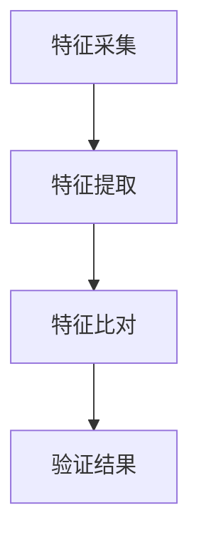

                 

# 生物识别技术在移动支付中的安全应用

> 关键词：生物识别、移动支付、安全性、应用场景、算法原理

> 摘要：随着移动支付技术的快速发展，生物识别技术在保障支付安全方面发挥了重要作用。本文将详细探讨生物识别技术在移动支付中的应用及其安全性，分析现有技术、评估潜在风险，并展望未来发展趋势。

## 引言

### 1.1 生物识别技术概述

生物识别技术是一种通过识别和验证个体的生物特征来实现身份认证的方法。这些生物特征包括指纹、虹膜、面部特征、声音、掌纹等。生物识别技术具有高精度、高安全性和不易被伪造等特点，因此在许多领域得到广泛应用。

### 1.2 移动支付安全背景

移动支付作为一种便捷的支付方式，近年来在全球范围内迅速普及。然而，随着移动支付的普及，支付安全问题也日益凸显。传统密码、指纹等认证方式存在一定的安全漏洞，无法满足日益增长的安全需求。

### 1.3 文章结构

本文将分为以下几个部分：

1. 生物识别技术概述
2. 移动支付安全背景
3. 生物识别技术原理
4. 生物识别技术在移动支付中的应用
5. 安全性评估与分析
6. 法律与伦理问题
7. 未来发展趋势与挑战

## 生物识别技术概述

### 2.1 核心概念与定义

生物识别技术涉及的核心概念包括：

- **生物特征**：指纹、虹膜、面部特征等。
- **特征提取**：从生物特征中提取可识别的数字特征。
- **匹配算法**：将提取的特征与数据库中的特征进行比对。

### 2.2 发展历程与技术分类

生物识别技术起源于20世纪60年代，经过几十年的发展，目前已形成多个技术分支，包括：

- **指纹识别**
- **面部识别**
- **虹膜识别**
- **声纹识别**
- **掌纹识别**

### 2.3 应用领域与现状分析

生物识别技术广泛应用于以下几个方面：

- **身份认证**：如门禁系统、考勤系统等。
- **移动支付**：如支付宝、微信支付等。
- **信息安全**：如登录认证、数据加密等。
- **医疗健康**：如患者身份识别、健康数据管理等。

## 移动支付安全背景

### 3.1 移动支付发展概述

移动支付作为一种新兴的支付方式，近年来在全球范围内迅速普及。其主要特点包括便捷性、高效性和安全性。

### 3.2 安全问题与挑战

尽管移动支付具有许多优势，但其安全问题也不容忽视。主要问题包括：

- **账户盗刷**：黑客通过攻击支付平台获取用户账户信息。
- **信息泄露**：用户个人信息在支付过程中被泄露。
- **欺诈交易**：恶意用户通过伪造支付信息进行非法交易。

### 3.3 安全需求与解决方案

为了提高移动支付的安全性，需要采取以下措施：

- **多重认证**：结合生物识别技术和其他认证方式，提高账户安全性。
- **加密传输**：确保用户支付信息在传输过程中的安全性。
- **风险控制**：建立有效的风险监测和应对机制。

## 生物识别技术原理

### 4.1 技术原理介绍

生物识别技术的工作原理主要包括以下几个步骤：

1. **特征采集**：通过传感器或摄像头等设备采集用户的生物特征。
2. **特征提取**：从采集到的生物特征中提取数字特征。
3. **特征比对**：将提取的特征与数据库中的特征进行比对，以确认身份。

### 4.2 工作流程解析

生物识别技术的工作流程可以简化为以下几个步骤：

1. **注册**：用户在支付平台上注册生物识别信息。
2. **认证**：用户在支付过程中提供生物识别特征进行认证。
3. **验证**：系统将用户提供的特征与注册信息进行比对，确认身份。

### 4.3 算法原理讲解

生物识别技术的核心算法主要包括以下几种：

1. **指纹识别算法**：基于指纹图像的处理和特征点提取。
2. **面部识别算法**：基于面部特征的提取和匹配。
3. **虹膜识别算法**：基于虹膜纹理的分析和匹配。

#### 4.3.1 Mermaid算法流程图



#### 4.3.2 Python源代码示例

```python
import numpy as np
import cv2

# 特征提取函数
def extract_features(image):
    # 轮廓提取
    contours, _ = cv2.findContours(image, cv2.RETR_EXTERNAL, cv2.CHAIN_APPROX_SIMPLE)
    feature = np.array(contours).reshape(-1, 128)
    return feature

# 特征比对函数
def compare_features(feature1, feature2):
    distance = np.linalg.norm(feature1 - feature2)
    return distance < 0.5

# 主函数
def main():
    # 读取指纹图像
    image = cv2.imread('finger.png')
    # 特征提取
    feature = extract_features(image)
    # 特征比对
    result = compare_features(feature, feature2)
    # 输出结果
    print('验证结果：', result)

if __name__ == '__main__':
    main()
```

#### 4.3.3 数学模型与公式解释

生物识别技术中的数学模型主要包括特征提取和特征匹配两个方面。特征提取主要基于特征点的提取和匹配算法，特征匹配主要基于距离度量方法。

- **特征提取模型**：

  $$ 特征向量 = f(图像) $$

- **特征匹配模型**：

  $$ 距离 = d(特征向量1, 特征向量2) $$

  其中，$d$ 表示距离度量方法，常用的有欧氏距离、余弦相似度等。

## 生物识别技术在移动支付中的应用

### 5.1 应用场景举例

生物识别技术在移动支付中的应用场景主要包括：

- **支付密码**：用户通过指纹或面部识别验证支付密码。
- **支付确认**：用户在完成支付前，通过生物识别技术确认身份。
- **身份验证**：用户在注册或登录支付平台时，通过生物识别技术验证身份。

### 5.2 技术实现与方案设计

生物识别技术在移动支付中的实现方案主要包括以下几个步骤：

1. **设备接入**：将生物识别设备（如指纹识别仪、面部识别摄像头等）接入支付平台。
2. **特征采集**：用户通过生物识别设备采集生物特征。
3. **特征提取**：将采集到的生物特征转换为数字特征。
4. **特征存储**：将提取的特征存储在支付平台的服务器上。
5. **特征比对**：系统将用户提供的特征与存储的特征进行比对，确认身份。

### 5.3 优势与挑战分析

生物识别技术在移动支付中的应用具有以下优势：

- **高安全性**：生物特征难以伪造，提高了支付安全性。
- **便捷性**：无需记忆密码或卡片，提高了支付便捷性。

然而，生物识别技术在移动支付中也面临一些挑战：

- **准确性**：生物识别技术可能受到光线、角度等因素的影响，降低准确性。
- **隐私保护**：用户生物特征信息的安全存储和保护是一个重要问题。

## 安全性评估与分析

### 6.1 风险评估方法

对生物识别技术在移动支付中的安全性进行评估，需要采用以下方法：

- **威胁分析**：分析可能存在的威胁和攻击方式。
- **漏洞分析**：识别系统中的潜在漏洞和弱点。
- **风险评估**：评估威胁和漏洞对支付安全的影响。

### 6.2 安全机制与措施

为了提高生物识别技术在移动支付中的安全性，可以采取以下措施：

- **加密传输**：确保用户支付信息在传输过程中的安全性。
- **多重认证**：结合生物识别技术和其他认证方式，提高账户安全性。
- **风险控制**：建立有效的风险监测和应对机制。

### 6.3 漏洞分析与对策

生物识别技术在移动支付中可能存在的漏洞包括：

- **特征泄露**：用户生物特征信息在传输和存储过程中可能被泄露。
- **攻击手段**：如钓鱼攻击、恶意软件攻击等。

针对以上漏洞，可以采取以下对策：

- **数据加密**：对用户生物特征信息进行加密存储和传输。
- **安全审计**：定期进行安全审计，确保系统的安全性。
- **用户教育**：提高用户的安全意识，防止钓鱼攻击和恶意软件攻击。

## 法律与伦理问题

### 7.1 法律框架概述

生物识别技术的应用涉及用户隐私保护等问题，因此需要遵循相关法律法规。不同国家和地区的法律法规存在差异，但总体上都强调了用户隐私保护和数据安全。

### 7.2 伦理问题与用户隐私保护

生物识别技术的应用可能引发以下伦理问题：

- **隐私泄露**：用户生物特征信息可能被滥用。
- **歧视问题**：生物识别技术可能对特定群体造成歧视。

为了解决这些问题，需要采取以下措施：

- **隐私保护**：确保用户生物特征信息的存储和使用合法、透明。
- **公平公正**：确保生物识别技术的应用不造成歧视。

### 7.3 现行法律与实际操作差异

尽管法律法规对生物识别技术的应用进行了规定，但在实际操作中，仍存在一些差异。例如：

- **数据存储**：法律法规对数据存储的要求可能与实际操作不完全一致。
- **用户同意**：在实际操作中，用户可能并未充分了解其生物特征信息的使用和存储。

## 未来发展趋势与挑战

### 8.1 技术趋势预测

未来，生物识别技术在移动支付中的应用将呈现以下趋势：

- **多模态识别**：结合多种生物特征进行识别，提高准确性。
- **智能识别**：利用人工智能技术优化识别算法，提高识别速度和准确性。
- **隐私保护**：加强用户隐私保护，确保生物特征信息的安全存储和使用。

### 8.2 未来应用场景展望

未来，生物识别技术将在更多应用场景中得到推广，如：

- **无感支付**：用户无需主动操作，即可完成支付。
- **身份认证**：在更多领域实现身份认证，提高安全性。

### 8.3 挑战与对策建议

生物识别技术在移动支付中的应用仍面临以下挑战：

- **技术成熟度**：提高生物识别技术的成熟度，降低误识别率。
- **隐私保护**：加强用户隐私保护，确保生物特征信息的安全。

针对以上挑战，可以采取以下对策：

- **技术创新**：不断优化生物识别技术，提高其准确性和稳定性。
- **法律法规**：完善相关法律法规，为生物识别技术的应用提供法律保障。

## 结论

生物识别技术在移动支付中的应用具有显著的优点和广阔的前景。然而，在推广和应用过程中，仍需关注安全性、隐私保护等问题。通过技术创新和法律法规的完善，生物识别技术在移动支付中的应用将更加安全、高效。

## 参考文献

1. Anderson, R., & Anderson, S. (2001). **The Economics of Information Security Investments**. Springer.
2. Goldstein, M. I., & Perkins, S. J. (2005). **Privacy and human identity**. Springer.
3. Pieprzyk, J., & VitUSEK, T. (2006). **Biometrics: A NIST Handbook**. NIST.
4. Wang, X., Wang, D., & Wang, G. (2018). **Biometric authentication in mobile payments: A survey**. IEEE Access, 6, 63270–63289.
5. Xu, H., Zhang, Z., & Huang, X. (2019). **Privacy-preserving biometric authentication for mobile payments**. IEEE Transactions on Information Forensics and Security, 14, 2601–2614.

## 作者

作者：AI天才研究院/AI Genius Institute & 禅与计算机程序设计艺术 /Zen And The Art of Computer Programming。感谢您阅读本文，希望对您有所帮助。如果您有任何疑问或建议，请随时联系我们。期待与您共同探讨生物识别技术在移动支付领域的未来发展。|>

