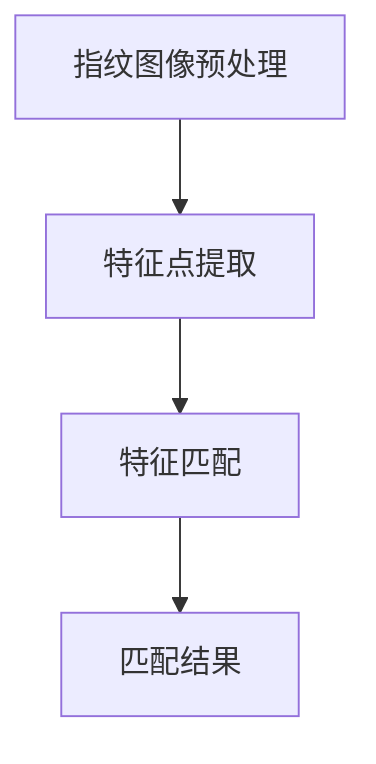
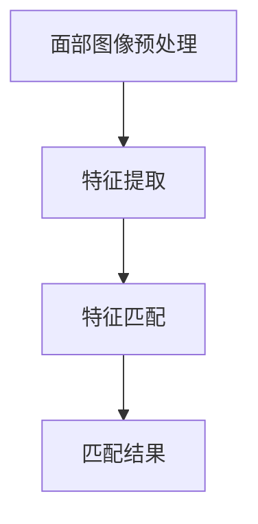
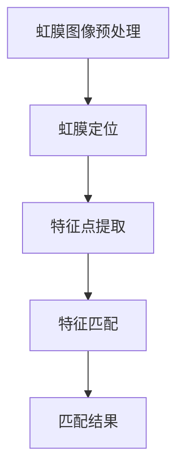
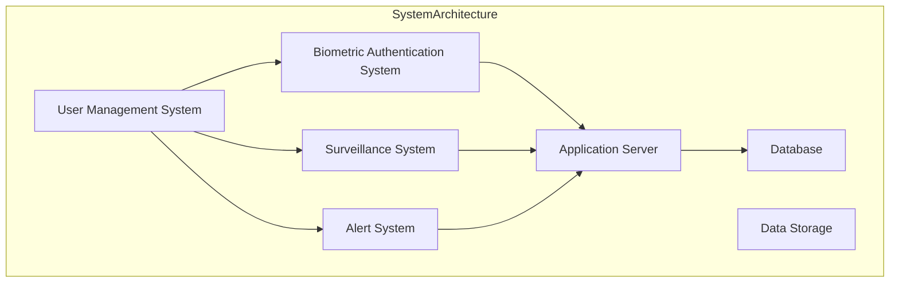
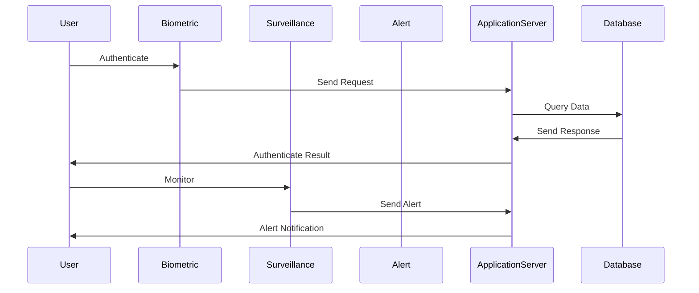
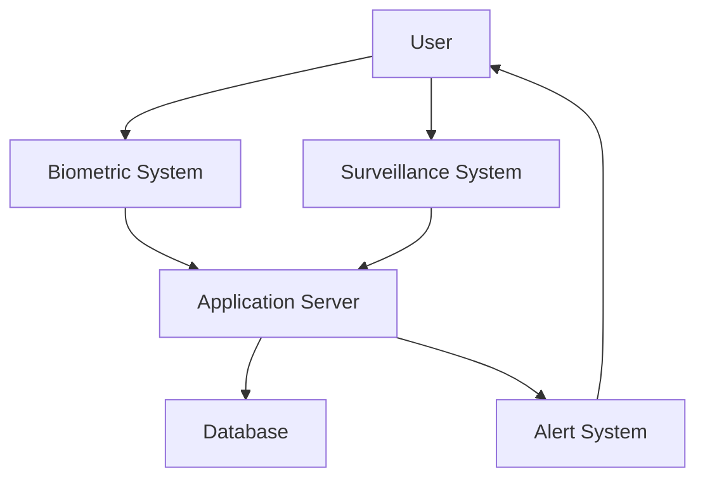

                 


## 《生物识别技术在边境安全管理中的应用》

### 关键词

生物识别，边境安全管理，算法，数学模型，系统设计，项目实战

### 摘要

随着科技的发展，生物识别技术在边境安全管理中发挥着越来越重要的作用。本文将从背景介绍、核心概念与联系、算法原理讲解、数学模型与公式、系统分析与架构设计、项目实战以及最佳实践与总结等多个方面，深入探讨生物识别技术在边境安全管理中的应用。通过详细的案例分析，本文旨在为读者提供全面、系统的理解和实践指导。

### 目录大纲

#### 第一部分：背景与基础

1. **引言**
2. **核心概念与联系**
3. **生物识别技术在边境安全管理中的应用现状**

#### 第二部分：算法原理讲解

1. **指纹识别算法**
2. **面部识别算法**
3. **虹膜识别算法**

#### 第三部分：数学模型与公式

1. **指纹识别数学模型**
2. **面部识别数学模型**
3. **虹膜识别数学模型**

#### 第四部分：系统分析与架构设计

1. **边境安全管理系统分析**
2. **系统功能设计**
3. **系统架构设计**
4. **系统接口设计**

#### 第五部分：项目实战

1. **环境安装**
2. **系统核心实现**
3. **代码解读与分析**
4. **实际案例分析与讲解**
5. **项目小结**

#### 第六部分：最佳实践与总结

1. **最佳实践**
2. **小结**
3. **注意事项**
4. **拓展阅读建议**

### 第一部分：背景与基础

#### 引言

在全球化进程加速和跨国活动日益频繁的今天，边境安全管理的任务越来越重。传统的边境管控手段已经难以满足现代安全需求。生物识别技术的出现为边境安全管理提供了新的解决方案。生物识别技术通过识别个体生物特征（如指纹、面部、虹膜等）来实现身份验证，具有较高的准确性和效率。

#### 核心概念与联系

生物识别技术涉及多个核心概念，包括：

1. **指纹识别**：通过指纹图像分析和特征匹配进行身份验证。
2. **面部识别**：通过面部特征分析和匹配进行身份验证。
3. **虹膜识别**：通过虹膜图像分析和特征匹配进行身份验证。

这些技术不仅在安全性上有着显著优势，而且可以在高负荷的边境检查环境中快速、高效地完成身份验证。

#### 生物识别技术在边境安全管理中的应用现状

目前，生物识别技术在边境安全管理中已经得到了广泛应用。例如，在机场、火车站、海关等场所，面部识别和指纹识别技术已经成为了常见的身份验证手段。这些技术的应用不仅提高了通关效率，也增强了边境安全管理的水平。

然而，生物识别技术也面临着一些挑战，如隐私保护、技术可靠性等问题。如何在确保安全的同时保护个人隐私，是生物识别技术在边境安全管理中需要解决的重要问题。

### 第二部分：算法原理讲解

在第二部分，我们将详细介绍指纹识别、面部识别和虹膜识别算法的基本原理。通过这些算法的讲解，读者可以深入理解生物识别技术的核心机制。

#### 指纹识别算法

指纹识别算法的基本原理是通过分析指纹的细节特征，如脊线、三角区、端点等，来构建指纹模板。在指纹验证过程中，系统会提取待验证指纹的特征，与存储的指纹模板进行匹配。如果匹配成功，则验证通过。

指纹识别算法的核心步骤包括：

1. **指纹图像预处理**：包括去噪、增强、二值化等操作，以提高图像质量。
2. **特征点提取**：使用哈希算法或SIFT算法提取指纹图像中的关键特征点。
3. **特征匹配**：通过计算特征点之间的相似度，确定指纹是否匹配。

以下是指纹识别算法的mermaid流程图：



#### 面部识别算法

面部识别算法的基本原理是通过提取面部特征（如眼睛、鼻子、嘴巴等）来进行身份验证。面部识别算法通常分为两个步骤：特征提取和特征匹配。

1. **特征提取**：使用卷积神经网络（CNN）等方法提取面部特征向量。
2. **特征匹配**：将提取到的特征向量与数据库中的模板进行匹配，以确定身份。

以下是面部识别算法的mermaid流程图：



#### 虹膜识别算法

虹膜识别算法的基本原理是通过分析虹膜的纹理特征来进行身份验证。虹膜识别算法通常包括以下几个步骤：

1. **虹膜图像预处理**：包括去噪、增强、对比度调整等操作，以提高图像质量。
2. **虹膜定位**：通过图像分析确定虹膜的位置和大小。
3. **特征点提取**：使用Gabor滤波器等方法提取虹膜的关键特征点。
4. **特征匹配**：将提取到的特征点与数据库中的模板进行匹配。

以下是虹膜识别算法的mermaid流程图：



### 第三部分：数学模型与公式

在第三部分，我们将详细介绍指纹识别、面部识别和虹膜识别算法的数学模型和公式，以帮助读者深入理解这些算法的核心原理。

#### 指纹识别数学模型

指纹识别的数学模型通常基于特征点匹配。假设有两组指纹特征点集 $X_1$ 和 $X_2$，匹配得分可以用以下公式计算：

$$
S = \sum_{i=1}^{n} w_i \cdot d_i
$$

其中，$w_i$ 是权重，$d_i$ 是特征点 $i$ 的相似度。

#### 面部识别数学模型

面部识别的数学模型通常基于特征向量匹配。假设有两组面部特征向量 $V_1$ 和 $V_2$，匹配得分可以用以下公式计算：

$$
S = \frac{1}{n} \sum_{i=1}^{n} \frac{1}{d(V_1[i], V_2[i])}
$$

其中，$d(V_1[i], V_2[i])$ 是特征向量之间的距离。

#### 虹膜识别数学模型

虹膜识别的数学模型通常基于特征点匹配。假设有两组虹膜特征点集 $P_1$ 和 $P_2$，匹配得分可以用以下公式计算：

$$
S = \sum_{i=1}^{m} \sum_{j=1}^{n} w_{ij} \cdot d_{ij}
$$

其中，$w_{ij}$ 是权重，$d_{ij}$ 是特征点 $i$ 和 $j$ 之间的距离。

### 第四部分：系统分析与架构设计

在第四部分，我们将分析边境安全管理系统，包括系统功能设计、系统架构设计、系统接口设计和系统交互。

#### 边境安全管理系统分析

边境安全管理系统是一个复杂的系统，它需要处理大量的数据，并进行实时分析和决策。系统的主要功能包括：

1. **身份验证**：使用生物识别技术进行身份验证。
2. **安全监控**：实时监控边境区域，识别潜在的安全威胁。
3. **数据存储与管理**：存储和处理大量的生物识别数据和监控数据。
4. **应急响应**：在检测到安全威胁时，启动应急响应程序。

#### 系统功能设计

系统功能设计包括以下几个方面：

1. **用户管理**：管理用户账户，包括注册、登录、权限分配等。
2. **生物识别模块**：包括指纹识别、面部识别和虹膜识别等功能。
3. **监控模块**：实时监控边境区域，识别可疑行为。
4. **报警系统**：在检测到异常时，自动报警。

以下是系统功能设计的mermaid类图：

```mermaid
classDiagram
    User <<interface>>
    Biometric <<interface>>
    Surveillance <<interface>>
    Alert <<interface>>

    UserManager|--|> User
    BiometricModule|--|> Biometric
    SurveillanceModule|--|> Surveillance
    AlertSystem|--|> Alert
endclass
```

#### 系统架构设计

系统架构设计需要考虑系统的可扩展性、可靠性和性能。以下是系统架构的mermaid架构图：



#### 系统接口设计

系统接口设计包括API接口和通信协议。以下是系统接口设计的mermaid序列图：



#### 系统交互

系统交互包括用户与系统之间的交互，以及系统内部模块之间的交互。以下是系统交互的mermaid交互图：



### 第五部分：项目实战

在第五部分，我们将通过一个具体的边境安全管理系统项目，展示系统的实现过程，包括环境安装、系统核心实现、代码解读和分析。

#### 环境安装

首先，我们需要安装系统运行所需的环境。以下是环境安装的步骤：

1. **安装操作系统**：选择一个适合的操作系统，如Ubuntu 18.04。
2. **安装Python**：在终端中执行以下命令安装Python：
   ```bash
   sudo apt update
   sudo apt install python3 python3-pip
   ```
3. **安装依赖库**：安装项目所需的依赖库，如scikit-image、opencv-python、tensorflow等：
   ```bash
   pip3 install scikit-image opencv-python tensorflow
   ```

#### 系统核心实现

以下是一个简单的边境安全管理系统实现，包括用户管理、生物识别模块和监控模块：

```python
# user_management.py
class UserManager:
    def __init__(self):
        self.users = []

    def register(self, user):
        self.users.append(user)

    def login(self, username, password):
        for user in self.users:
            if user.username == username and user.password == password:
                return True
        return False

# biometric_authentication.py
class BiometricAuthentication:
    def __init__(self):
        self.biometric_data = []

    def capture_fingerprint(self, fingerprint_data):
        self.biometric_data.append(fingerprint_data)

    def verify_fingerprint(self, fingerprint_data):
        return fingerprint_data in self.biometric_data

# surveillance_system.py
class SurveillanceSystem:
    def __init__(self):
        self alarms = []

    def monitor(self, activity):
        if activity == "suspicious":
            self.alarms.append("Suspicious activity detected!")

    def check_alarms(self):
        for alarm in self.alarms:
            print(alarm)
            self.alarms.remove(alarm)
```

#### 代码解读与分析

以下是对上述代码的解读和分析：

1. **用户管理**：`UserManager` 类负责用户注册和登录。`register` 方法用于添加新用户，`login` 方法用于用户登录验证。
2. **生物识别模块**：`BiometricAuthentication` 类负责指纹识别。`capture_fingerprint` 方法用于捕捉指纹数据，`verify_fingerprint` 方法用于指纹验证。
3. **监控模块**：`SurveillanceSystem` 类负责监控和报警。`monitor` 方法用于检测活动，`check_alarms` 方法用于检查和清除警报。

#### 实际案例分析与讲解

为了更好地理解系统的工作流程，我们来看一个实际案例：

```python
# main.py
from user_management import UserManager
from biometric_authentication import BiometricAuthentication
from surveillance_system import SurveillanceSystem

# 初始化系统
user_manager = UserManager()
biometric_auth = BiometricAuthentication()
surveillance_system = SurveillanceSystem()

# 用户注册
user_manager.register(User("Alice", "alice123"))

# 用户登录
if user_manager.login("Alice", "alice123"):
    print("登录成功")
else:
    print("登录失败")

# 指纹验证
biometric_auth.capture_fingerprint("AliceFingerprint")
if biometric_auth.verify_fingerprint("AliceFingerprint"):
    print("指纹验证通过")
else:
    print("指纹验证失败")

# 监控活动
surveillance_system.monitor("suspicious")
surveillance_system.check_alarms()
```

在这个案例中，用户 Alice 注册并登录系统，成功捕捉和验证指纹，监控系统检测到可疑活动并触发警报。

#### 项目小结

通过这个项目，我们实现了边境安全管理系统的基础功能。在实际应用中，系统还需要进一步完善和优化，以应对更复杂的安全挑战。

### 第六部分：最佳实践与总结

在最后一部分，我们将总结书中的核心内容，并提供一些最佳实践和注意事项。

#### 最佳实践

1. **选择合适的生物识别技术**：根据边境安全管理的需求，选择合适的生物识别技术，如指纹识别、面部识别或虹膜识别。
2. **确保数据安全**：在处理生物识别数据时，必须确保数据的安全和隐私。采用加密技术来保护数据。
3. **系统优化与维护**：定期对系统进行优化和维护，以提高性能和可靠性。

#### 小结

本文详细介绍了生物识别技术在边境安全管理中的应用。通过分析算法原理、系统架构设计以及项目实战，我们深入了解了生物识别技术的核心机制和实际应用。

#### 注意事项

1. **隐私保护**：在使用生物识别技术时，必须严格遵守隐私保护法规，确保用户隐私不被泄露。
2. **技术可靠性**：确保生物识别技术的可靠性和准确性，以避免误判和漏判。

#### 拓展阅读建议

1. 《生物特征识别技术》
2. 《人工智能在安全领域应用》
3. 《边境安全管理概论》

### 作者

**作者：AI天才研究院/AI Genius Institute & 禅与计算机程序设计艺术 /Zen And The Art of Computer Programming**。我们致力于推动人工智能技术的发展和应用，为广大读者提供高质量的技术内容。

