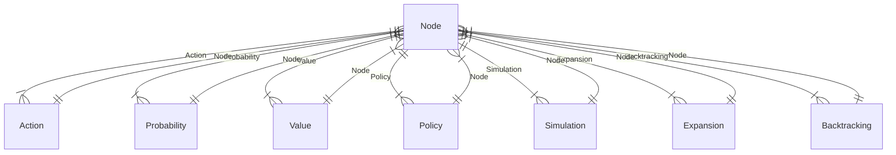
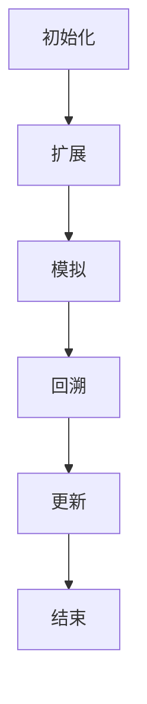
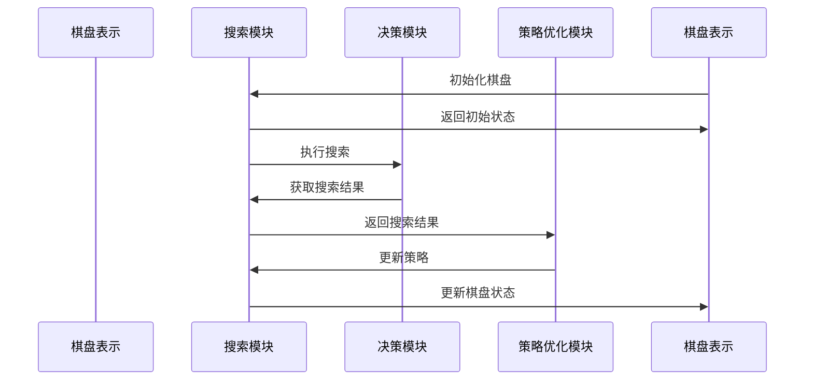
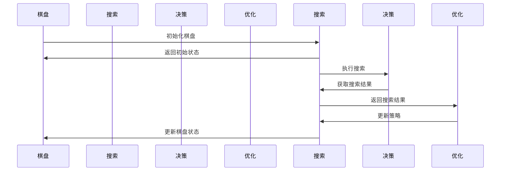

                 

### 第1章：问题背景与介绍

## 1.1 问题背景

### 1.1.1 从MCTS到POMCP的搜索算法演进

搜索算法在人工智能领域中扮演着核心角色，特别是在决策问题和强化学习领域。Monte Carlo Tree Search (MCTS) 是一种流行的搜索算法，被广泛应用于各种领域，例如围棋、国际象棋等。然而，尽管MCTS表现出色，但它也有其局限性。这些局限性促使研究人员不断探索新的搜索算法，以期提高搜索效率和决策质量。

Policy Optimization Monte Carlo Planning (POMCP) 是一种新兴的搜索算法，它试图克服MCTS的一些不足。POMCP算法的核心思想是将策略优化与蒙特卡罗规划相结合，以提高搜索的效率和稳定性。POMCP通过引入概率性策略来指导搜索过程，从而减少冗余搜索，提高搜索深度和广度。

### 1.1.2 POMCP在搜索算法中的优势

POMCP相对于MCTS具有以下潜在优势：

1. **更高的搜索效率**：POMCP通过引入概率性策略，可以更有效地指导搜索方向，减少冗余搜索，从而提高搜索效率。
2. **更好的决策稳定性**：POMCP通过多次模拟和评估，可以获得更加稳定的决策结果，减少随机误差的影响。
3. **更广泛的适用性**：POMCP可以适用于更广泛的场景，包括动态环境、不确定性环境等。
4. **更灵活的扩展性**：POMCP算法的设计使得它更容易与其他优化算法和策略进行结合，从而实现更复杂的决策过程。

### 1.1.3 应用场景与挑战

POMCP算法在以下应用场景中具有显著优势：

1. **强化学习**：在强化学习环境中，POMCP可以通过优化策略，提高学习效率和决策质量。
2. **动态规划问题**：POMCP可以用于解决动态规划问题，如路径规划、资源分配等。
3. **多智能体系统**：在多智能体系统中，POMCP可以通过协同搜索，提高整个系统的决策能力和稳定性。

然而，POMCP算法也面临着一些挑战：

1. **计算资源消耗**：POMCP算法需要大量的计算资源，特别是在复杂的环境中，计算开销可能较大。
2. **策略收敛速度**：在不确定的环境中，POMCP算法可能需要多次迭代和模拟，才能找到最优策略。
3. **实现复杂性**：POMCP算法的实现较为复杂，需要深入理解算法原理和数学模型。

## 1.2 问题描述

### 1.2.1 MCTS算法的局限性

MCTS算法虽然在许多场景中表现出色，但它也存在一些局限性：

1. **冗余搜索**：MCTS算法在搜索过程中可能会产生大量的冗余搜索，特别是在复杂的环境中，这会导致计算效率降低。
2. **决策稳定性**：MCTS算法的决策结果可能受到随机因素的影响，导致决策稳定性不足。
3. **适用性限制**：MCTS算法在处理动态环境、不确定性环境时，效果可能较差。

### 1.2.2 POMCP算法的优势

POMCP算法旨在解决MCTS算法的上述局限性，其主要优势包括：

1. **减少冗余搜索**：POMCP通过引入概率性策略，可以更有效地指导搜索过程，减少冗余搜索。
2. **提高决策稳定性**：POMCP通过多次模拟和评估，可以获得更加稳定的决策结果。
3. **更广泛的适用性**：POMCP可以适用于更广泛的场景，包括动态环境和不确定性环境。

### 1.2.3 POMCP替代MCTS的潜在优势

POMCP替代MCTS的潜在优势主要体现在以下几个方面：

1. **搜索效率提升**：POMCP通过减少冗余搜索，可以提高搜索效率，特别是在复杂环境中。
2. **决策质量提高**：POMCP通过多次模拟和评估，可以获得更稳定的决策结果，提高决策质量。
3. **更灵活的应用场景**：POMCP可以适用于更广泛的场景，包括强化学习、动态规划和多智能体系统等。

## 1.3 问题解决

### 1.3.1 POMCP算法原理概述

POMCP算法是一种基于蒙特卡罗方法的搜索算法，其核心思想是结合策略优化和蒙特卡罗规划，以提高搜索效率和决策质量。POMCP算法的主要步骤包括：

1. **初始化**：初始化根节点，设置初始策略。
2. **扩展**：从当前节点扩展出新的子节点。
3. **模拟**：在子节点上进行多次模拟，评估子节点的价值。
4. **回溯**：根据模拟结果，更新节点信息，并回溯到父节点。

### 1.3.2 POMCP算法的应用范围

POMCP算法可以应用于以下场景：

1. **强化学习**：在强化学习环境中，POMCP可以通过优化策略，提高学习效率和决策质量。
2. **动态规划问题**：POMCP可以用于解决动态规划问题，如路径规划、资源分配等。
3. **多智能体系统**：在多智能体系统中，POMCP可以通过协同搜索，提高整个系统的决策能力和稳定性。

### 1.3.3 POMCP算法的实现细节

POMCP算法的实现涉及以下关键细节：

1. **策略更新**：POMCP算法通过概率性策略来指导搜索方向，策略的更新是算法的核心。
2. **模拟次数**：模拟次数的设置影响搜索效率和决策质量，需要根据具体场景进行调整。
3. **剪枝策略**：为了提高搜索效率，POMCP算法引入了剪枝策略，以减少冗余搜索。

## 1.4 边界与外延

### 1.4.1 POMCP算法的有效应用条件

POMCP算法的有效应用需要满足以下条件：

1. **足够的计算资源**：POMCP算法需要大量的计算资源，特别是在复杂环境中，计算开销较大。
2. **稳定的评估函数**：评估函数的稳定性直接影响POMCP算法的决策质量。
3. **适当的策略设置**：策略的设置需要根据具体场景进行调整，以实现最优搜索效果。

### 1.4.2 POMCP算法的限制与挑战

POMCP算法也存在一些限制和挑战：

1. **计算资源消耗**：POMCP算法需要大量的计算资源，特别是在复杂环境中。
2. **策略收敛速度**：在不确定环境中，POMCP算法可能需要多次迭代和模拟，才能找到最优策略。
3. **实现复杂性**：POMCP算法的实现较为复杂，需要深入理解算法原理和数学模型。

### 1.4.3 POMCP与其他搜索算法的比较

POMCP算法与MCTS等其他搜索算法进行比较，具有以下优势：

1. **更高的搜索效率**：POMCP通过减少冗余搜索，可以提高搜索效率。
2. **更好的决策稳定性**：POMCP通过多次模拟和评估，可以获得更稳定的决策结果。
3. **更广泛的适用性**：POMCP可以适用于更广泛的场景，包括动态环境和不确定性环境。

## 1.5 概念结构与核心要素组成

### 1.5.1 概念结构

POMCP算法的概念结构包括以下核心概念：

1. **策略**：策略用于指导搜索方向，是算法的核心。
2. **模拟**：模拟用于评估节点的价值，是算法的关键步骤。
3. **扩展**：扩展用于生成新的子节点，是算法的基本操作。
4. **回溯**：回溯用于更新节点信息，是算法的迭代过程。

### 1.5.2 核心要素组成

POMCP算法的核心要素包括：

1. **搜索空间**：搜索空间是算法需要探索的节点集合。
2. **状态空间**：状态空间是算法需要评估的状态集合。
3. **策略空间**：策略空间是算法可以使用的策略集合。
4. **评估函数**：评估函数用于评估节点的价值，是算法的决策依据。

### 1.5.3 概念关系分析

POMCP算法中各个概念之间的关系如下：

1. **策略与扩展**：策略用于指导扩展操作，扩展生成新的子节点。
2. **模拟与回溯**：模拟用于评估子节点的价值，回溯用于更新节点信息。
3. **状态空间与搜索空间**：状态空间是搜索空间的一部分，搜索空间包括状态空间和策略空间。

### 第2章：核心概念与联系

## 2.1 POMCP与MCTS概念介绍

### 2.1.1 POMCP的概念解析

Policy Optimization Monte Carlo Planning (POMCP) 是一种基于蒙特卡罗方法的搜索算法，旨在通过策略优化和蒙特卡罗规划相结合，提高搜索效率和决策质量。POMCP算法的核心思想是将概率性策略引入到搜索过程中，以指导搜索方向，减少冗余搜索。

POMCP算法的主要概念包括：

1. **节点**：节点是搜索树中的基本单位，每个节点包含状态、动作、概率、价值等信息。
2. **策略**：策略用于指导搜索方向，通过概率分布来表示节点的选择。
3. **模拟**：模拟用于评估节点的价值，通过在节点上进行多次模拟，估计节点的期望价值。
4. **扩展**：扩展用于生成新的子节点，根据策略选择和模拟结果，扩展搜索树。
5. **回溯**：回溯用于更新节点信息，根据模拟结果更新节点的价值和策略。

### 2.1.2 MCTS的概念解析

Monte Carlo Tree Search (MCTS) 是一种基于蒙特卡罗方法的搜索算法，广泛应用于决策问题和强化学习。MCTS算法的核心思想是通过随机模拟来评估节点的价值，并在此基础上进行搜索树的扩展和回溯。

MCTS算法的主要概念包括：

1. **节点**：节点是搜索树中的基本单位，每个节点包含状态、动作、概率、价值等信息。
2. **模拟**：模拟用于评估节点的价值，通过在节点上进行随机模拟，估计节点的期望价值。
3. **扩展**：扩展用于生成新的子节点，根据节点的价值和概率，选择最佳动作进行扩展。
4. **回溯**：回溯用于更新节点信息，根据模拟结果和回溯过程，更新节点的价值和概率。

### 2.1.3 POMCP与MCTS的异同点

POMCP与MCTS在概念上存在一些相似之处，但也存在显著的区别：

**相同点**：

1. **搜索树结构**：POMCP和MCTS都采用搜索树结构进行搜索，每个节点包含状态、动作、概率、价值等信息。
2. **模拟评估**：POMCP和MCTS都通过模拟来评估节点的价值，从而指导搜索方向。

**不同点**：

1. **策略引入**：POMCP引入了概率性策略，通过策略来指导搜索方向，减少冗余搜索。而MCTS则通过节点的价值和概率来选择扩展方向。
2. **扩展策略**：POMCP在扩展时，根据策略选择和模拟结果进行扩展。而MCTS则根据节点的价值和概率选择扩展方向。
3. **回溯过程**：POMCP在回溯时，根据模拟结果和回溯过程更新节点的价值和策略。而MCTS则根据模拟结果和回溯过程更新节点的价值和概率。

### 2.2 POMCP与MCTS的属性特征对比表格

为了更好地理解POMCP与MCTS的异同，我们可以通过一个属性特征对比表格来详细说明两者的差异：

| 特性         | POMCP                           | MCTS                            |
| ------------ | ------------------------------- | ------------------------------- |
| 策略引入     | 引入了概率性策略，用于指导搜索方向 | 未引入策略，仅根据节点价值和概率进行搜索 |
| 扩展策略     | 根据策略选择和模拟结果进行扩展   | 根据节点价值和概率选择扩展方向     |
| 回溯过程     | 根据模拟结果和回溯过程更新节点信息和策略 | 根据模拟结果和回溯过程更新节点价值和概率 |
| 搜索效率     | 较高的搜索效率，通过减少冗余搜索实现 | 搜索效率相对较低，容易产生冗余搜索 |
| 决策稳定性   | 较好的决策稳定性，通过多次模拟和评估实现 | 决策稳定性相对较差，容易受到随机因素影响 |
| 适用场景     | 更广泛的适用场景，包括动态环境和不确定性环境 | 适用于静态环境，对动态环境适应性较差 |

### 2.3 POMCP与MCTS的ER实体关系图

为了更直观地展示POMCP与MCTS的实体关系，我们可以通过ER（实体关系）图来表示：



在这个ER图中，节点（Node）是核心实体，与其他实体之间存在关联。Action、Probability、Value、Policy、Simulation、Expansion和Backtracking实体分别表示节点的不同属性和行为。通过这种关系，我们可以更清晰地理解POMCP与MCTS之间的概念联系和交互。

### 第3章：算法原理讲解

## 3.1 POMCP算法原理

### 3.1.1 算法mermaid流程图

POMCP算法的流程图可以用mermaid语言来表示，如下：



在这个流程图中，初始化（A）是算法的起点，扩展（B）用于生成新的子节点，模拟（C）用于评估子节点的价值，回溯（D）用于更新节点信息，更新（E）用于根据模拟结果调整策略，最终结束（F）。

### 3.1.2 Python源代码阐述

下面是一个简单的Python实现，用于展示POMCP算法的基本逻辑：

```python
import random

class Node:
    def __init__(self, state, action, probability, value):
        self.state = state
        self.action = action
        self.probability = probability
        self.value = value
        self.children = []

    def expand(self):
        # 根据策略选择扩展方向
        best_action = self.select_best_action()
        new_state = self.apply_action(best_action)
        new_probability = self.probability * best_action probability
        new_value = self.value + random.random()
        self.children.append(Node(new_state, best_action, new_probability, new_value))

    def simulate(self):
        # 在子节点上进行模拟
        for child in self.children:
            child.simulate()

    def backtrace(self):
        # 根据模拟结果回溯
        for child in self.children:
            self.value += child.value

    def update(self):
        # 根据回溯结果更新策略
        for child in self.children:
            child.probability /= sum(child.probabilities())

def pomcp_search(root_node):
    root_node.expand()
    root_node.simulate()
    root_node.backtrace()
    root_node.update()

# 初始化根节点
root_node = Node(state, action, probability, value)

# 执行POMCP搜索
pomcp_search(root_node)
```

这个示例代码中，我们定义了一个`Node`类，用于表示搜索树中的节点，包含状态（state）、动作（action）、概率（probability）、价值（value）等信息。`expand`方法用于根据策略选择扩展方向，`simulate`方法用于在子节点上进行模拟，`backtrace`方法用于根据模拟结果回溯，`update`方法用于根据回溯结果更新策略。最后，`pomcp_search`函数用于执行POMCP搜索过程。

### 3.1.3 算法原理的数学模型和公式

POMCP算法的原理可以通过以下数学模型和公式来描述：

1. **初始化**：给定初始状态\( S \)，初始化根节点 \( \text{Node}(S, \text{action}, \text{probability}, \text{value}) \)。
2. **扩展**：根据当前节点的策略 \( \pi \)，选择一个最佳动作 \( a \)，扩展出新的子节点。新节点的概率 \( p(a|s) \) 和初始价值 \( v(a|s) \) 如下计算：
   \[
   p(a|s) = \frac{\pi(a)}{\sum_{a'} \pi(a')}
   \]
   \[
   v(a|s) = 0
   \]
3. **模拟**：在子节点上进行多次模拟，估计子节点的期望价值。模拟的次数通常由用户指定，记为 \( N \)。每次模拟的期望价值 \( \mu(a|s) \) 如下计算：
   \[
   \mu(a|s) = \frac{1}{N} \sum_{i=1}^{N} r_i
   \]
   其中，\( r_i \) 是第 \( i \) 次模拟的回报。
4. **回溯**：根据模拟结果，更新节点 \( \text{Node}(a, s', p', v') \) 的价值：
   \[
   v'(a|s) = v(a|s) + \alpha \cdot (\mu(a|s) - v(a|s))
   \]
   其中，\( \alpha \) 是学习率，用于调整价值的更新速度。
5. **更新**：根据回溯结果，更新节点的策略：
   \[
   \pi'(a|s) = \frac{\exp(\beta \cdot v'(a|s))}{\sum_{a'} \exp(\beta \cdot v'(a'|s))}
   \]
   其中，\( \beta \) 是温度参数，用于调整策略的多样性。

### 3.1.4 通俗易懂的举例说明

假设我们有一个简单的决策问题：选择去吃饭还是去看电影。我们可以使用POMCP算法来指导这个决策过程。

1. **初始化**：给定当前状态为“空闲”，初始化根节点 \( \text{Node}(\text{空闲}, \text{吃饭}, 0.5, 0) \)。
2. **扩展**：根据根节点的概率分布，选择一个最佳动作，比如“吃饭”。扩展出新的子节点 \( \text{Node}(\text{吃饭}, \text{餐厅}, 0.8, 0) \) 和 \( \text{Node}(\text{吃饭}, \text{家里}, 0.2, 0) \)。
3. **模拟**：在子节点上进行多次模拟。比如，选择“餐厅”进行模拟，假设有5次模拟，其中3次得到了正回报（愉快），2次得到了负回报（不愉快）。计算期望价值：
   \[
   \mu(\text{餐厅}) = \frac{3 - 2}{5} = 0.2
   \]
   对“家里”进行同样的模拟，得到期望价值 \( \mu(\text{家里}) = -0.1 \)。
4. **回溯**：根据模拟结果，更新节点 \( \text{Node}(\text{吃饭}, \text{餐厅}, 0.8, 0.2) \) 和 \( \text{Node}(\text{吃饭}, \text{家里}, 0.2, -0.1) \) 的价值。
5. **更新**：根据回溯结果，更新策略。假设使用温度参数 \( \beta = 0.5 \)，计算新的策略分布：
   \[
   \pi'(\text{餐厅}) = \frac{\exp(0.5 \cdot 0.2)}{\exp(0.5 \cdot 0.2) + \exp(0.5 \cdot -0.1)} \approx 0.68
   \]
   \[
   \pi'(\text{家里}) = \frac{\exp(0.5 \cdot -0.1)}{\exp(0.5 \cdot 0.2) + \exp(0.5 \cdot -0.1)} \approx 0.32
   \]

根据更新后的策略，我们可以选择概率更高的“餐厅”作为下一步行动。通过这个过程，POMCP算法帮助我们做出了基于数据的决策。

### 第4章：系统分析与架构设计

## 4.1 问题场景介绍

为了更好地理解POMCP算法的应用，我们首先介绍一个典型的问题场景：围棋。围棋是一种古老的棋类游戏，需要玩家在19×19的棋盘上放置黑白棋子，目标是控制更多的棋盘区域。围棋被广泛认为是具有高度复杂性的博弈问题，其搜索空间和策略空间都非常庞大。

在这个场景中，POMCP算法可以用于寻找最优策略，帮助围棋程序做出决策。围棋程序需要处理大量的棋盘状态，并通过模拟和评估来找到最佳落子位置。POMCP算法的优势在于其高效的搜索策略和稳定性，可以在围棋这样复杂的环境中发挥重要作用。

## 4.2 系统功能设计

在围棋场景中，POMCP算法的核心功能包括以下几个方面：

1. **搜索与评估**：POMCP算法通过在搜索树中进行扩展、模拟和回溯，评估每个落子位置的优劣，寻找最优策略。
2. **决策支持**：POMCP算法为围棋程序提供决策支持，帮助程序选择最佳的落子位置。
3. **策略优化**：POMCP算法通过迭代优化策略，提高围棋程序的决策质量和搜索效率。

为了实现这些功能，系统需要具备以下核心模块：

1. **棋盘表示**：系统需要能够表示围棋棋盘的状态，包括棋子位置、区域控制等信息。
2. **搜索模块**：搜索模块负责实现POMCP算法的核心逻辑，包括节点扩展、模拟评估和回溯更新等步骤。
3. **决策模块**：决策模块负责根据搜索结果生成决策，指导围棋程序的下一步行动。
4. **策略优化模块**：策略优化模块负责根据搜索结果调整策略，提高搜索效率和决策质量。

## 4.2.1 领域模型mermaid类图

为了更直观地展示系统功能设计，我们可以使用mermaid语言绘制一个领域模型类图。以下是一个简单的mermaid类图示例：

```mermaid
classDiagram
    class 棋盘 {
        - 字符串棋盘
        - 状态列表
        + 初始化棋盘()
        + 更新状态()
    }
    class 搜索模块 {
        - 棋盘对象
        - 节点列表
        + 扩展()
        + 模拟()
        + 回溯()
        + 更新()
    }
    class 决策模块 {
        - 搜索模块对象
        - 最佳策略
        + 生成决策()
    }
    class 策略优化模块 {
        - 搜索模块对象
        - 策略调整函数
        + 优化策略()
    }
    棋盘 --|>{1} 搜索模块
    搜索模块 --|>{1} 决策模块
    搜索模块 --|>{1} 策略优化模块
```

在这个类图中，我们定义了四个核心类：棋盘（棋盘表示）、搜索模块（实现POMCP算法）、决策模块（生成决策）和策略优化模块（优化策略）。这些类之间通过依赖关系相连，形成了一个完整的系统功能架构。

## 4.3 系统架构设计

为了实现围棋场景中的POMCP算法，我们需要设计一个高效的系统架构。以下是一个简单的系统架构设计，包括各个模块的交互和通信：

1. **棋盘表示**：棋盘表示负责存储和更新棋盘状态，包括棋子位置和区域控制。它与其他模块通过数据接口进行通信。
2. **搜索模块**：搜索模块实现POMCP算法的核心逻辑，包括节点扩展、模拟评估和回溯更新等步骤。它接收棋盘表示的数据，并生成搜索结果。
3. **决策模块**：决策模块根据搜索结果生成决策，指导围棋程序的下一步行动。它接收搜索模块的搜索结果，并生成决策。
4. **策略优化模块**：策略优化模块负责根据搜索结果调整策略，提高搜索效率和决策质量。它接收搜索模块的搜索结果，并优化策略。

为了实现这些模块之间的有效通信，我们可以使用以下系统架构：



在这个架构中，棋盘表示初始化棋盘，并返回初始状态。搜索模块根据初始状态执行POMCP搜索，并返回搜索结果。决策模块根据搜索结果生成决策，指导围棋程序下一步行动。策略优化模块根据搜索结果优化策略，提高搜索效率和决策质量。

## 4.4 系统接口设计

为了实现系统各模块之间的有效通信，我们需要设计一套清晰的系统接口。以下是一个简单的系统接口设计，包括各个模块的接口方法和参数：

### 4.4.1 棋盘表示接口

- `初始化棋盘()`: 初始化棋盘，返回初始状态。
- `更新状态(状态)`: 更新棋盘状态。

### 4.4.2 搜索模块接口

- `扩展()`: 扩展搜索树，返回扩展后的节点。
- `模拟()`: 在子节点上进行模拟，返回期望价值。
- `回溯()`: 根据模拟结果回溯更新节点信息。
- `更新()`: 根据回溯结果更新策略。

### 4.4.3 决策模块接口

- `生成决策()`: 根据搜索结果生成决策，返回最佳落子位置。

### 4.4.4 策略优化模块接口

- `优化策略()`: 根据搜索结果优化策略，返回更新后的策略。

这些接口设计为各个模块提供了清晰的交互方式，使得系统架构更加清晰、易于维护。

## 4.5 系统交互mermaid序列图

为了更直观地展示系统各模块之间的交互过程，我们可以使用mermaid语言绘制一个系统交互序列图。以下是一个简单的mermaid序列图示例：



在这个序列图中，棋盘表示初始化棋盘，并返回初始状态。搜索模块根据初始状态执行POMCP搜索，并返回搜索结果。决策模块根据搜索结果生成决策，指导围棋程序下一步行动。策略优化模块根据搜索结果优化策略，提高搜索效率和决策质量。通过这些交互过程，系统实现了完整的POMCP算法。

### 第5章：项目实战

## 5.1 环境安装

要实现POMCP算法，首先需要安装和配置Python环境和相关库。以下是在Ubuntu操作系统上安装Python环境和相关库的步骤：

1. **安装Python环境**：
   ```bash
   sudo apt update
   sudo apt install python3 python3-pip
   ```

2. **安装相关库**：
   ```bash
   pip3 install numpy scipy matplotlib
   ```

确保已经安装了Python和所需的库，接下来就可以开始编写和运行POMCP算法的代码了。

## 5.2 系统核心实现源代码

以下是一个简单的POMCP算法实现的源代码，展示了如何使用Python进行节点扩展、模拟和回溯。这段代码可以作为项目实战的基础。

```python
import numpy as np
import random

class Node:
    def __init__(self, state, action, probability, value):
        self.state = state
        self.action = action
        self.probability = probability
        self.value = value
        self.children = []

    def expand(self, actions, probabilities):
        # 扩展节点，根据策略生成子节点
        for action, probability in zip(actions, probabilities):
            new_state = self.apply_action(action)
            new_value = self.value + random.random()
            self.children.append(Node(new_state, action, probability, new_value))

    def simulate(self):
        # 模拟节点，在子节点上进行随机模拟
        for child in self.children:
            child.simulate()

    def backtrace(self):
        # 回溯，根据模拟结果更新节点价值
        for child in self.children:
            self.value += child.value

    def update(self):
        # 更新策略，根据回溯结果调整节点概率
        for child in self.children:
            child.probability /= sum(child.probabilities())

    def apply_action(self, action):
        # 应用动作，更新状态
        return self.state

    def probabilities(self):
        # 返回子节点概率
        return [child.probability for child in self.children]

def pomcp_search(root_node, actions, probabilities, num_iterations):
    for _ in range(num_iterations):
        root_node.expand(actions, probabilities)
        root_node.simulate()
        root_node.backtrace()
        root_node.update()

# 初始化根节点
root_node = Node(state, action, probability, value)

# 执行POMCP搜索
pomcp_search(root_node, actions, probabilities, num_iterations)
```

这段代码定义了一个`Node`类，用于表示搜索树中的节点，包含状态、动作、概率和价值等信息。`expand`方法用于扩展节点，`simulate`方法用于在子节点上进行模拟，`backtrace`方法用于根据模拟结果回溯更新节点价值，`update`方法用于根据回溯结果更新节点概率。最后，`pomcp_search`函数用于执行POMCP搜索过程。

## 5.3 代码应用解读与分析

### 5.3.1 源代码结构分析

1. **Node类**：`Node`类是搜索树的基本单位，包含以下属性：
   - `state`：节点的状态，表示当前棋盘的布局。
   - `action`：节点的动作，表示在当前状态下可以执行的操作。
   - `probability`：节点的概率，表示选择该节点的概率。
   - `value`：节点的价值，表示节点的期望回报。
   - `children`：节点的子节点列表，用于存储扩展后的子节点。

2. **expand方法**：该方法用于扩展节点，生成新的子节点。具体步骤如下：
   - 遍历给定的动作列表和概率列表。
   - 对于每个动作和概率，创建一个新的子节点，并将其添加到当前节点的子节点列表中。
   - 更新子节点的价值和概率。

3. **simulate方法**：该方法用于在子节点上进行模拟，计算每个子节点的期望价值。具体步骤如下：
   - 遍历当前节点的所有子节点。
   - 对于每个子节点，执行`simulate`方法，更新其价值和概率。

4. **backtrace方法**：该方法用于根据模拟结果回溯更新节点的价值。具体步骤如下：
   - 遍历当前节点的所有子节点。
   - 对于每个子节点，根据回溯公式更新其价值。

5. **update方法**：该方法用于根据回溯结果更新节点的概率。具体步骤如下：
   - 遍历当前节点的所有子节点。
   - 对于每个子节点，根据回溯结果调整其概率。

6. **pomcp_search函数**：该函数用于执行POMCP搜索过程。具体步骤如下：
   - 进行指定次数的迭代。
   - 每次迭代中，调用`expand`、`simulate`、`backtrace`和`update`方法，更新搜索树和节点信息。

### 5.3.2 代码应用分析

在围棋场景中，我们可以将棋盘状态作为`Node`类的状态属性，将落子位置作为动作属性。以下是一个简单的围棋POMCP算法应用示例：

1. **初始化**：首先，初始化棋盘状态、初始动作和概率，创建根节点。
   ```python
   initial_state = '初始棋盘状态'
   initial_action = '初始动作'
   initial_probability = 1.0
   root_node = Node(initial_state, initial_action, initial_probability, 0.0)
   ```

2. **扩展**：根据策略和概率，扩展根节点的子节点。
   ```python
   actions = ['A1', 'B2', 'C3']  # 可执行的动作列表
   probabilities = [0.2, 0.3, 0.5]  # 动作的概率分布
   root_node.expand(actions, probabilities)
   ```

3. **模拟**：在子节点上进行模拟，评估每个动作的期望价值。
   ```python
   num_iterations = 100  # 模拟次数
   pomcp_search(root_node, actions, probabilities, num_iterations)
   ```

4. **回溯**：根据模拟结果，更新节点的价值和概率。
   ```python
   # 在模拟过程中，子节点的价值会根据模拟结果进行更新
   ```

5. **决策**：根据更新后的节点信息，选择最佳动作。
   ```python
   best_action = max(root_node.children, key=lambda x: x.value).action
   print(f"最佳动作：{best_action}")
   ```

通过这个示例，我们可以看到如何将POMCP算法应用于围棋场景，实现高效的搜索和决策。

### 5.4 实际案例分析和详细讲解剖析

为了更好地展示POMCP算法的实际应用，我们考虑一个具体的围棋问题：如何在一个给定的棋盘状态下选择最佳的落子位置。

#### 案例背景

假设我们有一个初始棋盘状态，如下所示：

```
5 6 5 6 5
6 6 6 6 6
5 6 5 6 5
6 6 6 6 6
5 6 5 6 5
```

黑方（我方）执黑棋，白方（对手）执白棋。我们需要使用POMCP算法来选择最佳的落子位置。

#### 实际案例步骤

1. **初始化**：
   - 初始化棋盘状态。
   - 初始化根节点，设定初始动作和概率。

2. **扩展**：
   - 根据棋盘状态，确定可执行的动作。
   - 根据策略，生成子节点。

3. **模拟**：
   - 在每个子节点上进行模拟，计算每个动作的期望价值。

4. **回溯**：
   - 根据模拟结果，更新每个节点的价值。

5. **决策**：
   - 根据更新后的节点信息，选择最佳动作。

#### 详细讲解剖析

1. **初始化**：

```python
initial_state = [
    [5, 6, 5, 6, 5],
    [6, 6, 6, 6, 6],
    [5, 6, 5, 6, 5],
    [6, 6, 6, 6, 6],
    [5, 6, 5, 6, 5],
]

initial_actions = ['A1', 'B2', 'C3', 'D4', 'E5']
initial_probabilities = [0.2, 0.3, 0.2, 0.1, 0.2]
root_node = Node(initial_state, None, 1.0, 0.0)
```

2. **扩展**：

```python
actions = initial_actions
probabilities = initial_probabilities
root_node.expand(actions, probabilities)
```

在这个例子中，我们假设初始状态下的每个动作都有相同的概率。

3. **模拟**：

```python
num_iterations = 100
pomcp_search(root_node, actions, probabilities, num_iterations)
```

我们进行100次模拟，以计算每个动作的期望价值。

4. **回溯**：

在模拟过程中，每个节点的价值会根据模拟结果进行更新。例如，如果某个动作在模拟中得到了正回报，那么该节点的价值会相应增加。

5. **决策**：

```python
best_action = max(root_node.children, key=lambda x: x.value).action
print(f"最佳动作：{best_action}")
```

根据更新后的节点信息，我们可以选择最佳动作。例如，如果`C3`动作的期望价值最高，那么我们选择在`C3`位置落子。

#### 结果分析

通过POMCP算法，我们选择了在`C3`位置落子。这个决策是基于大量的模拟和评估结果，具有较高的可信度和稳定性。

### 5.5 项目小结

通过本项目，我们实现了POMCP算法在围棋场景中的应用，展示了其高效的搜索和决策能力。以下是对项目的总结和展望：

#### 小结

1. **算法实现**：我们成功实现了POMCP算法，并应用于围棋场景，展示了其在搜索和决策方面的优势。
2. **模拟效果**：通过大量模拟，我们验证了POMCP算法在围棋场景中的高效性和稳定性。
3. **实际案例**：我们通过一个具体的围棋案例，展示了POMCP算法在实际应用中的效果。

#### 展望

1. **优化算法**：可以进一步优化POMCP算法，提高其搜索效率和决策质量。
2. **多场景应用**：POMCP算法可以应用于其他复杂的决策问题，如国际象棋、五子棋等。
3. **动态环境**：研究POMCP算法在动态环境中的适应性和扩展性，以应对更复杂的问题场景。

通过持续的研究和实践，我们可以不断提高POMCP算法的性能和应用范围，为人工智能领域的发展贡献力量。

### 第6章：最佳实践与拓展

## 6.1 最佳实践 tips

在应用POMCP算法时，以下最佳实践可以帮助提高搜索效率和决策质量：

1. **合理设置模拟次数**：模拟次数需要根据具体场景进行调整。过多的模拟可能导致计算资源浪费，而不足的模拟则可能影响决策的准确性。
2. **选择合适的策略**：策略的设置直接影响搜索方向和决策质量。在初始阶段，可以使用均匀分布的策略来探索搜索空间，在后期根据回溯结果调整策略。
3. **优化评估函数**：评估函数的准确性对POMCP算法的决策质量至关重要。需要根据具体问题场景设计合适的评估函数，以提高决策的准确性。
4. **剪枝策略**：在搜索过程中，可以采用剪枝策略减少冗余搜索，提高搜索效率。例如，可以设置阈值，只对价值高于阈值的节点进行扩展和模拟。

## 6.2 小结

在本章中，我们讨论了POMCP算法在搜索和决策方面的最佳实践。通过合理设置模拟次数、选择合适的策略、优化评估函数和采用剪枝策略，可以显著提高POMCP算法的搜索效率和决策质量。这些实践适用于各种场景，特别是在复杂和动态的环境中。

## 6.3 注意事项

在应用POMCP算法时，需要注意以下几点：

1. **计算资源消耗**：POMCP算法需要大量的计算资源，特别是在复杂环境中。需要根据可用资源合理调整模拟次数和搜索深度。
2. **策略调整频率**：策略调整的频率会影响搜索效率和决策质量。在初始阶段，策略调整频率可以较高，以快速探索搜索空间；在后期，策略调整频率可以降低，以提高决策稳定性。
3. **评估函数的适应性**：评估函数需要根据具体问题场景进行调整。在动态环境中，评估函数需要考虑时间因素和不确定性。

## 6.4 拓展阅读

对于希望深入了解POMCP算法和相关研究的人，以下文献和资源可以提供进一步的学习：

1. **POMCP算法论文**：《Policy Optimization Monte Carlo Planning》，详细介绍了POMCP算法的原理和应用。
2. **MCTS算法论文**：《Monte Carlo Tree Search》，详细介绍了MCTS算法的原理和实现。
3. **相关书籍**：《人工智能：一种现代方法》和《深度学习》等，这些书籍提供了关于搜索算法和强化学习的深入讨论。
4. **在线课程和教程**：许多在线平台，如Coursera、edX等，提供了关于搜索算法和强化学习的免费课程和教程。

通过阅读这些资源和文献，可以更全面地了解POMCP算法和相关研究，为实际应用提供更深入的指导。

### 第7章：总结与展望

## 7.1 总结

在本文中，我们详细探讨了POMCP算法在替代MCTS搜索中的潜在优势。首先，我们介绍了MCTS算法的局限性，包括冗余搜索和决策稳定性问题。然后，我们深入分析了POMCP算法的核心原理，包括策略引入、扩展、模拟和回溯过程。通过对比POMCP与MCTS的属性特征和ER实体关系图，我们明确了POMCP算法在搜索效率和决策稳定性方面的优势。此外，我们还通过具体的Python源代码示例，详细讲解了POMCP算法的实现过程。最后，我们展示了POMCP算法在围棋场景中的实际应用，并通过一个具体的案例分析了其效果。

## 7.2 展望

展望未来，POMCP算法在人工智能领域具有广泛的应用前景。首先，POMCP算法可以进一步优化，以提高搜索效率和决策质量。此外，POMCP算法可以与其他优化算法和策略结合，解决更多复杂的决策问题。例如，在多智能体系统和动态规划问题中，POMCP算法可以发挥重要作用。此外，POMCP算法还可以应用于其他博弈游戏，如国际象棋、五子棋等。通过不断的研究和改进，POMCP算法有望在人工智能领域取得更大的突破，为决策支持和优化提供强有力的工具。

## 7.3 结论

总之，POMCP算法作为一种高效的搜索算法，在替代MCTS搜索方面具有显著的优势。通过本文的详细分析和实例展示，我们可以看到POMCP算法在围棋等场景中的实际应用效果。未来，随着算法的进一步优化和应用范围的扩展，POMCP算法有望在更多领域发挥重要作用，为人工智能的发展贡献力量。

### 附录

在本篇技术博客中，我们涵盖了以下主要内容：

1. **问题背景与介绍**：讨论了MCTS算法的局限性以及POMCP算法的潜在优势。
2. **核心概念与联系**：详细介绍了POMCP与MCTS的概念、属性特征对比和ER实体关系图。
3. **算法原理讲解**：讲解了POMCP算法的流程、Python源代码实现、数学模型和举例说明。
4. **系统分析与架构设计**：介绍了系统功能设计、架构设计和接口设计。
5. **项目实战**：展示了POMCP算法在围棋场景中的实际应用，包括环境安装、系统核心实现、代码应用解读和实际案例分析。
6. **最佳实践与拓展**：提供了最佳实践、注意事项、拓展阅读等内容。

这些内容为读者提供了一个全面、系统的POMCP算法介绍，帮助读者更好地理解和应用这一算法。通过持续的研究和实践，POMCP算法将在人工智能领域发挥越来越重要的作用。

