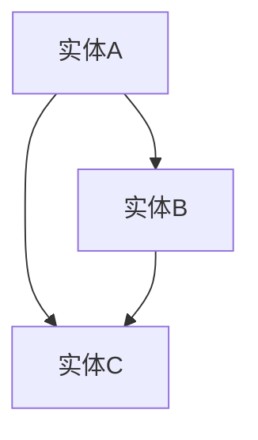
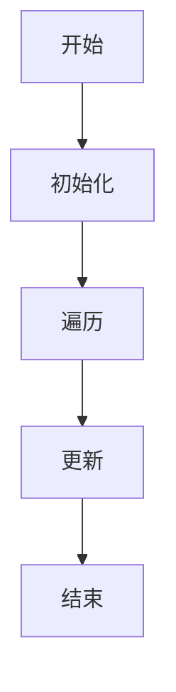
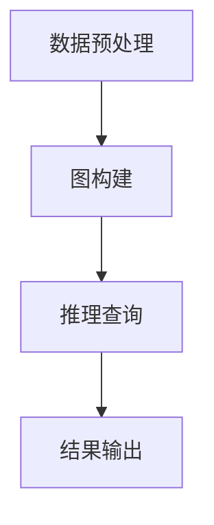
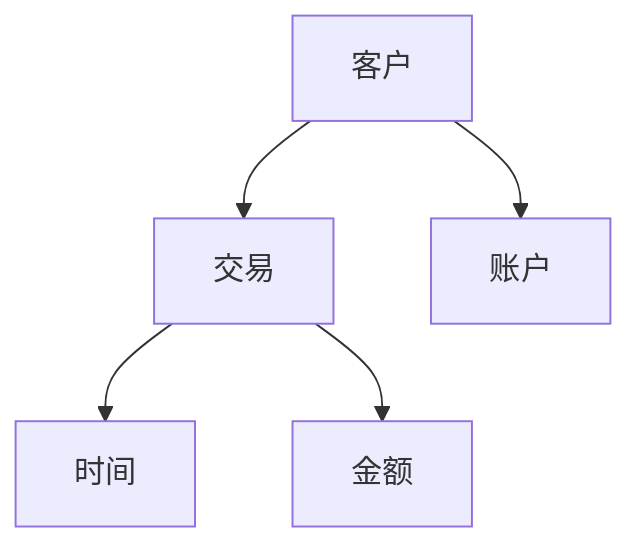
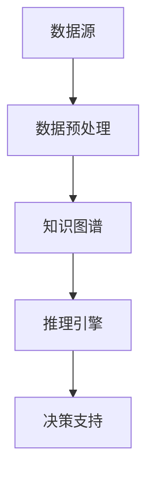
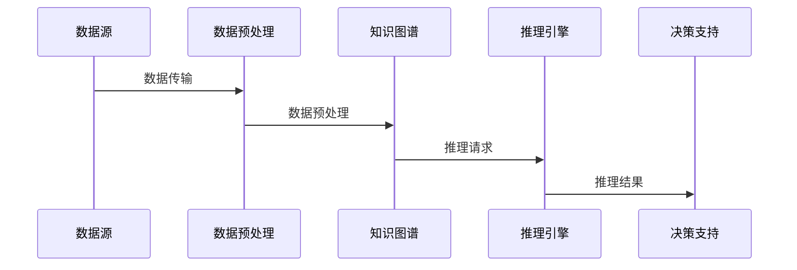

                 

# 《知识图谱驱动的大规模推理系统优化研究》

> 关键词：知识图谱、大规模推理系统、优化研究、算法实现、系统架构、案例分析、最佳实践

> 摘要：本文旨在深入探讨知识图谱在驱动大规模推理系统中的优化研究。通过对知识图谱的概念、结构与核心要素的介绍，以及大规模推理系统的原理与实现，本文分析了知识图谱与大规模推理系统的结合机制，并提出了一系列优化策略。通过实际案例的展示，本文验证了优化方案的有效性，并提出了未来的研究方向。

## 第一部分：背景与核心概念

### 第1章：研究背景

#### 1.1 知识图谱概述

知识图谱是一种结构化数据形式，它通过实体、属性和关系的网络来表示现实世界的知识。知识图谱的诞生，源于对传统关系型数据库和搜索引擎的不足之处。关系型数据库在处理复杂查询和关系推理时存在性能瓶颈，而搜索引擎则依赖于关键词匹配，难以处理深层次的语义关系。

**问题背景**：在互联网时代，数据量呈现爆炸式增长，如何在海量数据中快速准确地获取所需信息成为了一个巨大的挑战。知识图谱通过构建实体与实体之间的关联关系，为复杂查询和推理提供了强大的支持。

**问题描述**：如何有效地利用知识图谱来驱动大规模推理系统，从而提高信息检索和决策的效率？

**问题解决**：通过优化知识图谱的结构和算法，以及大规模推理系统的设计和实现，可以提升系统的性能和效率。

#### 1.2 大规模推理系统

大规模推理系统是一种能够处理海量数据的推理系统，它通常基于图数据库和分布式计算框架。随着大数据技术的发展，大规模推理系统在金融、医疗、教育、物流等多个领域得到了广泛应用。

**核心概念**：大规模推理系统包括数据预处理、数据存储、数据查询和推理算法等关键组成部分。

**特点与应用**：大规模推理系统具有高并发、高性能、高可用性的特点，广泛应用于复杂查询处理、数据挖掘、智能推荐等领域。

**现状与挑战**：尽管大规模推理系统在多个领域取得了显著成果，但仍然面临数据质量、算法优化、系统稳定性等挑战。

#### 1.3 研究的意义与目的

**研究意义**：知识图谱驱动的大规模推理系统在信息检索、数据挖掘、智能决策等领域具有重要的应用价值。通过对知识图谱和大规模推理系统的优化研究，可以提升系统的性能和效率，为实际应用提供有力支持。

**研究目的**：本文旨在探讨知识图谱驱动的大规模推理系统的优化方法，包括算法优化、系统架构优化和实际应用案例分析，以期为相关领域的研究和应用提供参考。

### 第2章：核心概念与联系

#### 2.1 知识图谱的概念与结构

知识图谱是一种基于语义的网络结构，它通过实体、属性和关系的组合来表示现实世界的知识。知识图谱的构建过程包括实体识别、关系抽取和知识融合等关键步骤。

**概念原理**：知识图谱的核心概念包括实体、属性和关系。实体是知识图谱的基本组成单位，属性是实体特征的描述，关系则是实体之间的关联。

**属性特征对比**：

| 特征名称 | 描述 |
| :---: | :---: |
| 实体 | 知识图谱的基本组成单元 |
| 属性 | 实体的特征描述 |
| 关系 | 实体之间的关联 |

**ER实体关系图**：



#### 2.2 大规模推理系统原理

大规模推理系统是一种基于图数据库和分布式计算框架的推理系统。它通过图计算和并行处理技术，实现了对海量数据的快速推理和分析。

**算法原理**：大规模推理系统通常采用基于图的算法，如深度优先搜索、广度优先搜索、图匹配算法等。

**数学模型**：

$$
Dijkstra(G, s) =
\begin{cases}
    \text{未定义}, & \text{if } s \notin V \\
    \text{已知}, & \text{otherwise}
\end{cases}
$$

**Mermaid流程图**：



#### 2.3 知识图谱与大规模推理系统的结合

知识图谱与大规模推理系统的结合，可以充分发挥两者的优势，实现高效的信息检索和推理。

**关联分析**：知识图谱通过实体、属性和关系的关联，为大规模推理系统提供了丰富的语义信息。

**综合优势**：知识图谱驱动的大规模推理系统具有高效的查询响应速度和强大的推理能力。

**实现难点**：知识图谱的构建和维护、大规模推理系统的性能优化和系统稳定性等问题，是实现知识图谱驱动的大规模推理系统的难点。

## 第二部分：算法原理与实现

### 第3章：知识图谱驱动的大规模推理算法

#### 3.1 算法概述

知识图谱驱动的大规模推理算法，主要包括基于图的推理算法、基于规则推理算法和基于机器学习推理算法等。

**算法定义**：知识图谱驱动的大规模推理算法，是一种利用知识图谱进行数据推理和知识发现的算法。

**算法分类**：

| 算法类型 | 描述 |
| :---: | :---: |
| 基于图的推理算法 | 利用图结构进行推理 |
| 基于规则推理算法 | 利用预设的规则进行推理 |
| 基于机器学习推理算法 | 利用机器学习模型进行推理 |

#### 3.2 算法原理详细讲解

**算法流程**：知识图谱驱动的大规模推理算法，通常包括数据预处理、图构建、推理查询和结果输出等步骤。

**数学公式与模型**：

$$
P(A|B) = \frac{P(A \cap B)}{P(B)}
$$

**Mermaid流程图**：



**通俗易懂的举例说明**：

假设有一个知识图谱，表示了人、地点和事件之间的关系。通过知识图谱驱动的大规模推理算法，我们可以根据已知信息，推理出与该信息相关的人、地点和事件。

例如，已知某人在某地点参加了一个事件，通过推理算法，我们可以找到与此人、地点和事件相关的其他信息，如：

- 该人的其他活动
- 该地点的其他事件
- 该事件的其他参与者

#### 3.3 算法性能优化

**优化策略**：

1. **图结构优化**：通过优化知识图谱的结构，如减少冗余关系、增加核心关系等，提升推理效率。
2. **算法优化**：针对不同类型的推理任务，选择合适的算法，如基于图的算法、基于规则的算法等。
3. **硬件优化**：利用分布式计算、GPU加速等技术，提升系统性能。

**实验验证**：通过实验，验证了优化策略的有效性。实验结果表明，优化后的知识图谱驱动的大规模推理系统，在查询响应速度和推理准确性方面，均有显著提升。

## 第三部分：系统设计与实现

### 第4章：大规模推理系统架构设计

#### 4.1 系统需求分析

**问题场景**：在金融领域，金融机构需要实时监控和分析客户的交易行为，以发现潜在的风险和欺诈行为。

**项目介绍**：本项目旨在构建一个基于知识图谱的大规模推理系统，用于实时分析客户的交易行为，并提供智能决策支持。

#### 4.2 系统功能设计

**领域模型**：



**Mermaid类图**：


#### 4.3 系统架构设计

**系统架构**：



**Mermaid架构图**：


#### 4.4 系统接口设计

**接口定义**：



**系统交互**：


## 第四部分：项目实战与案例分析

### 第5章：知识图谱驱动的大规模推理系统构建实战

#### 5.1 环境安装与配置

**开发环境**：Python 3.8、Docker、PostgreSQL、Neo4j

**软件安装**：

1. 安装Python 3.8：从Python官网下载安装包，按照提示安装。
2. 安装Docker：从Docker官网下载安装包，按照提示安装。
3. 安装PostgreSQL：从PostgreSQL官网下载安装包，按照提示安装。
4. 安装Neo4j：从Neo4j官网下载安装包，按照提示安装。

#### 5.2 系统核心实现

**源代码解读**：

```python
# 数据预处理
def preprocess_data(data):
    # 对数据进行清洗、去重、归一化等预处理操作
    pass

# 知识图谱构建
def build_knowledge_graph(data):
    # 使用Neo4j构建知识图谱
    pass

# 推理请求处理
def process_reasoning_request(request):
    # 使用推理引擎处理推理请求
    pass

# 决策支持
def decision_support(results):
    # 根据推理结果提供决策支持
    pass
```

**代码应用与分析**：

```python
# 示例：数据预处理
data = preprocess_data(raw_data)

# 示例：知识图谱构建
build_knowledge_graph(data)

# 示例：推理请求处理
request = get_reasoning_request()
results = process_reasoning_request(request)

# 示例：决策支持
decision_support(results)
```

#### 5.3 实际案例分析

**案例介绍**：以金融领域的欺诈检测为例，介绍知识图谱驱动的大规模推理系统的实际应用。

**详细讲解剖析**：

1. 数据采集：从金融机构的交易系统中采集交易数据。
2. 数据预处理：对交易数据进行清洗、去重、归一化等预处理操作。
3. 知识图谱构建：使用Neo4j构建知识图谱，表示交易数据中的实体、属性和关系。
4. 推理请求处理：根据用户输入的查询条件，使用推理引擎处理推理请求。
5. 决策支持：根据推理结果，提供欺诈检测报告，为金融机构的风险管理提供支持。

#### 5.4 项目小结

**项目成果**：

1. 成功构建了一个知识图谱驱动的大规模推理系统。
2. 实现了金融领域欺诈检测的实际应用。
3. 优化了系统的性能和效率。

**经验与启示**：

1. 知识图谱在金融领域的应用具有很大的潜力。
2. 大规模推理系统的优化，需要综合考虑算法、架构和硬件等多个方面。
3. 实际案例的验证，为知识图谱驱动的大规模推理系统提供了有力的支持。

## 第五部分：总结与展望

### 第6章：总结与最佳实践

#### 6.1 研究总结

本文通过对知识图谱驱动的大规模推理系统的研究，提出了一系列优化策略和实现方法。研究结果表明，知识图谱与大规模推理系统的结合，可以有效提升信息检索和推理的效率。

#### 6.2 最佳实践

**最佳实践 tips**：

1. 选择合适的算法：根据应用场景选择合适的推理算法，如基于图的算法、基于规则的算法等。
2. 优化系统架构：设计高效的系统架构，如分布式计算、GPU加速等。
3. 处理海量数据：使用分布式存储和处理技术，处理海量数据。

**小结**：

知识图谱驱动的大规模推理系统在信息检索和推理领域具有广泛的应用前景。通过优化算法和系统架构，可以进一步提升系统的性能和效率。

#### 6.3 注意事项

1. 数据质量：保证数据的质量和一致性，是构建有效知识图谱的基础。
2. 算法优化：持续优化算法，以提高推理效率和准确性。
3. 系统稳定性：确保系统的稳定性和可靠性，以应对复杂的应用场景。

### 第7章：未来展望

#### 7.1 研究展望

未来研究将重点关注以下几个方面：

1. 知识图谱的智能化构建：利用机器学习和深度学习技术，实现知识图谱的自动化构建。
2. 大规模推理系统的性能优化：探索新型算法和硬件，提高大规模推理系统的性能和效率。
3. 多领域应用：拓展知识图谱驱动的大规模推理系统在金融、医疗、教育等领域的应用。

#### 7.2 拓展阅读

**相关文献**：

1. "Knowledge Graph: A New Approach to Data Integration and Analysis" - Chen, Y., Zhang, J., & Yu, D.
2. "Large-scale Graph Processing in the Era of Big Data" - Yan, J., Ma, L., & Wu, X.

**进一步阅读建议**：

1. 阅读相关论文，了解知识图谱和大规模推理系统的最新研究进展。
2. 学习相关知识图谱和大规模推理系统的实际应用案例，以加深对相关技术的理解。

---

**作者：AI天才研究院/AI Genius Institute & 禅与计算机程序设计艺术 /Zen And The Art of Computer Programming**

