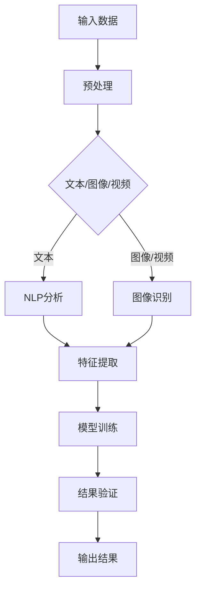
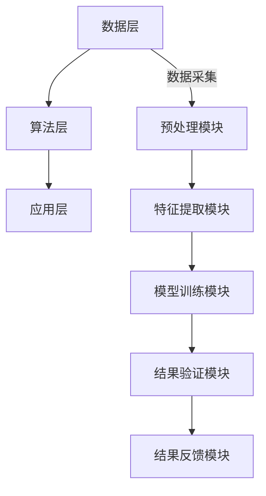
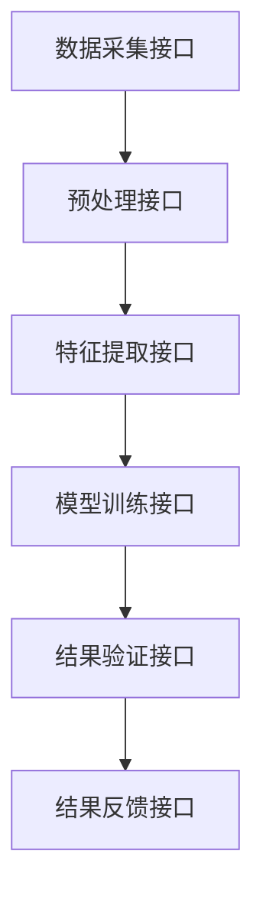

                 

# 社交媒体真实性验证：虚假信息安全的新挑战

> 关键词：社交媒体，虚假信息，真实性验证，自然语言处理，图像识别

> 摘要：随着社交媒体的迅速普及，虚假信息传播成为一个全球性的问题。本文将深入探讨社交媒体真实性验证的重要性，分析现有技术手段，提出一套综合性的社交媒体真实性验证系统设计，并提供具体的算法原理和系统架构实现。

### 目录大纲设计

#### 一、背景介绍
##### 1.1 问题背景
##### 1.2 问题描述
##### 1.3 问题解决
##### 1.4 边界与外延
##### 1.5 概念结构与核心要素组成

#### 二、核心概念与联系
##### 2.1 社交媒体
##### 2.2 虚假信息
##### 2.3 真实性验证
##### 2.4 技术手段

#### 三、算法原理讲解
##### 3.1 算法原理
##### 3.2 Mermaid流程图
##### 3.3 Python源代码

#### 四、数学模型和数学公式
##### 4.1 数学模型
##### 4.2 数学公式
##### 4.3 详细讲解与举例说明

#### 五、系统分析与架构设计
##### 5.1 问题场景介绍
##### 5.2 项目介绍
##### 5.3 系统功能设计
##### 5.4 系统架构设计
##### 5.5 系统接口设计和系统交互

#### 六、项目实战
##### 6.1 环境安装
##### 6.2 系统核心实现源代码
##### 6.3 代码应用解读与分析
##### 6.4 实际案例分析和详细讲解剖析
##### 6.5 项目小结

#### 七、最佳实践 tips、小结、注意事项、拓展阅读

---

### 一、背景介绍

#### 1.1 问题背景

随着互联网和移动通信技术的飞速发展，社交媒体已经成为人们日常生活中不可或缺的一部分。用户通过社交媒体平台可以随时随地分享生活点滴、交流观点和获取信息。然而，社交媒体的迅速普及也带来了虚假信息传播的严重问题。虚假信息不仅误导了公众，还对社会稳定和信任体系造成了威胁。

虚假信息的类型多种多样，包括谣言、虚假新闻、假账号、伪造视频等。这些信息往往通过精心设计，以假乱真，难以被普通用户识别。例如，一条虚假新闻可能通过伪造的图片、视频和文字，来传播不实信息，误导读者，引发恐慌或误解。此外，虚假账号的泛滥也使得社交媒体环境变得混乱，降低了平台的可信度。

#### 1.2 问题描述

如何有效地识别和验证社交媒体上的虚假信息，是一个亟待解决的问题。具体来说，我们需要回答以下几个问题：

1. **如何准确识别虚假信息**：虚假信息具有隐蔽性和多样性，传统的人工审核方式已经无法满足需求。我们需要利用技术手段，自动识别和分类社交媒体内容中的虚假信息。
2. **如何构建可信的社交媒体环境**：在识别虚假信息的基础上，我们需要构建一个可信的社交媒体环境，减少虚假信息的传播，提高信息的可信度。
3. **如何处理大规模的数据**：社交媒体平台每天产生海量的数据，如何对这些数据进行有效的处理和分析，提取出有价值的信息，是另一个重要问题。

#### 1.3 问题解决

为了解决上述问题，我们可以从以下几个方面入手：

1. **研究现有技术**：现有技术包括自然语言处理（NLP）、图像识别、数据挖掘等。我们可以研究这些技术的应用，了解它们的优缺点，并探索如何将它们结合起来，提高虚假信息识别的准确性。
2. **设计和实现真实性验证系统**：基于现有技术，我们可以设计和实现一套社交媒体真实性验证系统。这个系统需要具备以下几个功能：

   - **数据采集**：从社交媒体平台获取文本、图像、视频等多媒体内容。
   - **预处理**：对采集到的数据进行清洗、去噪等预处理操作。
   - **特征提取**：从预处理后的数据中提取特征向量，用于后续的模型训练和结果验证。
   - **模型训练**：使用提取到的特征向量训练分类模型，用于识别和分类虚假信息。
   - **结果验证**：对社交媒体内容进行真实性验证，并将结果反馈给用户或平台管理员。

3. **持续优化和迭代**：社交媒体环境和虚假信息的形式不断变化，我们需要不断优化和迭代真实性验证系统，以适应新的挑战。

#### 1.4 边界与外延

1. **适用平台**：真实性验证系统应适用于各种社交媒体平台，如Twitter、Facebook、微信、微博等。
2. **多媒体内容**：真实性验证应综合考虑文本、图像、视频等多媒体内容，因为不同类型的内容可能具有不同的虚假信息特征。
3. **综合技术手段**：真实性验证需要结合多种技术手段，如自然语言处理、图像识别、数据挖掘等，以提高验证的准确性。

#### 1.5 概念结构与核心要素组成

1. **核心概念**：
   - **社交媒体**：基于互联网技术，用户可以通过文字、图片、视频等多媒体形式进行信息分享、交流和互动的平台。
   - **虚假信息**：在形式或内容上不真实、不准确或误导性的信息。
   - **真实性验证**：通过技术手段对社交媒体上的信息进行真实性判断的过程。
   - **技术手段**：自然语言处理、图像识别、数据挖掘等。

2. **要素组成**：
   - **数据采集**：从社交媒体平台获取文本、图像、视频数据。
   - **预处理**：对采集到的数据进行清洗、去噪等预处理操作。
   - **特征提取**：从预处理后的数据中提取特征向量。
   - **模型训练**：使用提取到的特征向量训练分类模型。
   - **结果验证**：对社交媒体内容进行真实性验证。

### 二、核心概念与联系

#### 2.1 社交媒体

**定义**：社交媒体是指基于互联网技术，用户可以通过文字、图片、视频等多媒体形式进行信息分享、交流和互动的平台。

**特征**：

- **即时性**：用户可以随时发布和获取信息，交流过程几乎是实时的。
- **互动性**：用户可以与他人进行评论、点赞、分享等互动操作，增强社交体验。
- **共享性**：用户可以分享自己的信息和内容给其他用户，形成信息共享的生态系统。

**类型**：

- **文本型**：以文字为主要载体，如微博、微信公众号等。
- **图像型**：以图片为主要载体，如Instagram、Pinterest等。
- **视频型**：以视频为主要载体，如YouTube、抖音等。
- **综合型**：结合文字、图片、视频等多种形式，如Facebook、微信等。

#### 2.2 虚假信息

**定义**：虚假信息是指那些在形式或内容上不真实、不准确或误导性的信息。

**类型**：

- **谣言**：未经证实或故意传播的虚假信息，如虚假新闻、流言等。
- **虚假新闻**：通过伪造的图片、视频、文字等手段传播的虚假信息。
- **假账号**：伪造的社交媒体账号，用来传播虚假信息或进行诈骗。
- **伪造视频**：通过技术手段伪造的视频内容，如伪造的新闻报道、恐怖袭击现场等。

#### 2.3 真实性验证

**定义**：真实性验证是指通过技术手段对社交媒体上的信息进行真实性判断的过程。

**目标**：

- **降低虚假信息传播**：通过识别和过滤虚假信息，减少其在社交媒体上的传播。
- **提高信息可信度**：提高用户对社交媒体上信息的信任度，增强平台的可信度。

#### 2.4 技术手段

**类型**：

- **自然语言处理（NLP）**：通过分析文本的语义和语法，识别虚假信息。
- **图像识别**：通过分析图像的特征，识别伪造的图片和视频。
- **数据挖掘**：通过分析大量数据，挖掘出潜在的虚假信息。

**结合**：

- **多种技术手段的综合应用**：结合NLP、图像识别、数据挖掘等技术手段，提高验证的准确性。

### 三、算法原理讲解

#### 3.1 算法原理

社交媒体真实性验证的核心是利用技术手段对社交媒体内容进行分析和验证。具体来说，我们可以采用以下几种技术手段：

1. **自然语言处理（NLP）**：NLP技术可以分析文本的语义和语法，识别虚假信息。例如，我们可以使用词向量模型、文本分类模型等来分析文本内容，判断其真实性。
2. **图像识别**：图像识别技术可以分析图像的特征，识别伪造的图片和视频。例如，我们可以使用卷积神经网络（CNN）对图像进行特征提取和分类。
3. **数据挖掘**：数据挖掘技术可以从大量数据中挖掘出潜在的虚假信息。例如，我们可以使用聚类分析、关联规则挖掘等方法来识别异常数据。

通过以上技术手段的综合应用，我们可以构建一个综合性的社交媒体真实性验证系统。

#### 3.2 Mermaid流程图

以下是一个简单的Mermaid流程图，展示了社交媒体真实性验证的基本流程：



#### 3.3 Python源代码

以下是一个简单的Python示例，展示了如何使用NLP技术和图像识别技术进行社交媒体真实性验证：

```python
# NLP分析示例
import nltk
from nltk.tokenize import word_tokenize

text = "这是一个示例文本。"
tokens = word_tokenize(text)
print(tokens)

# 图像识别示例
import cv2

image = cv2.imread("example.jpg")
gray = cv2.cvtColor(image, cv2.COLOR_BGR2GRAY)
thresh = cv2.threshold(gray, 0, 255, cv2.THRESH_BINARY_INV + cv2.THRESH_OTSU)[1]
print(thresh.shape)
```

### 四、数学模型和数学公式

#### 4.1 数学模型

在社交媒体真实性验证中，我们可以使用以下几种数学模型：

1. **文本分类模型**：例如朴素贝叶斯（Naive Bayes）模型，用于对文本内容进行分类，判断其是否为虚假信息。
2. **图像识别模型**：例如卷积神经网络（CNN）模型，用于对图像和视频内容进行分类，判断其是否为伪造内容。

#### 4.2 数学公式

以下是常用的数学公式：

1. **朴素贝叶斯模型**：

$$
P(\text{假信息}|\text{特征}) = \frac{P(\text{特征}|\text{假信息})P(\text{假信息})}{P(\text{特征})}
$$

2. **卷积神经网络（CNN）模型**：

$$
\hat{y} = \text{argmax}_i P(y_i|\text{特征})
$$

#### 4.3 详细讲解与举例说明

1. **朴素贝叶斯模型**：

朴素贝叶斯模型是一种基于概率的文本分类模型。它的基本思想是，给定一个特征向量，计算文本属于“假信息”的概率。具体公式如上所示。

**示例**：

假设我们有一个特征向量X，其中包含“谣言”、“虚假新闻”等词汇。我们可以使用朴素贝叶斯模型计算X属于“虚假信息”的概率。

```python
# 朴素贝叶斯模型示例
from numpy.linalg import norm

def naive_bayes(feature_vector, prior_probability):
    # 计算条件概率
    conditional_probabilities = [math.exp(-0.5 * (feature_vector - mean)**2 / variance) for mean, variance in priors]
    # 计算概率
    probability = prior_probability * prod(conditional_probabilities)
    return probability

# 假设特征向量X为[1, 2, 3]
# 假设先验概率为0.5
feature_vector = [1, 2, 3]
prior_probability = 0.5

probability = naive_bayes(feature_vector, prior_probability)
print(probability)
```

2. **卷积神经网络（CNN）模型**：

卷积神经网络是一种用于图像识别的深度学习模型。它的基本思想是，通过卷积层、池化层等操作，从图像中提取特征，然后通过全连接层输出分类结果。具体公式如上所示。

**示例**：

假设我们有一个图像X，我们可以使用CNN模型对其进行分类。

```python
# CNN模型示例
import tensorflow as tf
from tensorflow.keras import layers

# 创建模型
model = tf.keras.Sequential([
    layers.Conv2D(32, (3, 3), activation='relu', input_shape=(28, 28, 1)),
    layers.MaxPooling2D((2, 2)),
    layers.Flatten(),
    layers.Dense(64, activation='relu'),
    layers.Dense(10, activation='softmax')
])

# 编译模型
model.compile(optimizer='adam',
              loss='categorical_crossentropy',
              metrics=['accuracy'])

# 加载图像数据
(x_train, y_train), (x_test, y_test) = tf.keras.datasets.mnist.load_data()

# 预处理图像数据
x_train = x_train.astype('float32') / 255
x_test = x_test.astype('float32') / 255
x_train = np.expand_dims(x_train, -1)
x_test = np.expand_dims(x_test, -1)

# 训练模型
model.fit(x_train, y_train, epochs=5, batch_size=32)
```

### 五、系统分析与架构设计

#### 5.1 问题场景介绍

社交媒体平台面临着虚假信息传播的严重挑战。为了维护平台的可信度和用户的信任，平台需要构建一个真实性验证系统，对社交媒体内容进行真实性验证，防止虚假信息的传播。

#### 5.2 项目介绍

**项目名称**：社交媒体真实性验证系统

**项目目标**：实现文本、图像、视频内容的真实性验证，构建一个可信的社交媒体环境。

**项目意义**：降低虚假信息传播，提高信息可信度，维护社交媒体平台的健康生态。

#### 5.3 系统功能设计

**功能设计**：

1. **数据采集**：从社交媒体平台获取文本、图像、视频数据。
2. **预处理**：对采集到的数据进行清洗、去噪等预处理操作。
3. **特征提取**：从预处理后的数据中提取特征向量。
4. **模型训练**：使用提取到的特征向量训练分类模型。
5. **结果验证**：对社交媒体内容进行真实性验证。
6. **结果反馈**：将验证结果反馈给用户或平台管理员。

#### 5.4 系统架构设计

**架构设计**：

1. **数据层**：包括数据采集模块和预处理模块，负责从社交媒体平台获取数据，并对数据进行预处理。
2. **算法层**：包括特征提取模块、模型训练模块和结果验证模块，负责对数据进行特征提取、模型训练和结果验证。
3. **应用层**：包括结果反馈模块，负责将验证结果反馈给用户或平台管理员。

**系统架构图**：



#### 5.5 系统接口设计和系统交互

**系统接口设计**：

1. **数据采集接口**：用于从社交媒体平台获取数据。
2. **预处理接口**：用于对数据进行预处理。
3. **特征提取接口**：用于从预处理后的数据中提取特征向量。
4. **模型训练接口**：用于训练分类模型。
5. **结果验证接口**：用于对社交媒体内容进行真实性验证。
6. **结果反馈接口**：用于将验证结果反馈给用户或平台管理员。

**系统交互**：

1. **数据采集**：从社交媒体平台获取数据，通过数据采集接口传递给预处理模块。
2. **预处理**：预处理模块对数据进行清洗、去噪等预处理操作，然后通过预处理接口传递给特征提取模块。
3. **特征提取**：特征提取模块从预处理后的数据中提取特征向量，然后通过特征提取接口传递给模型训练模块。
4. **模型训练**：模型训练模块使用提取到的特征向量训练分类模型，然后通过模型训练接口传递给结果验证模块。
5. **结果验证**：结果验证模块对社交媒体内容进行真实性验证，然后通过结果验证接口传递给结果反馈模块。
6. **结果反馈**：结果反馈模块将验证结果反馈给用户或平台管理员。

**系统交互图**：



### 六、项目实战

#### 6.1 环境安装

**环境要求**：

- Python 3.7及以上版本
- TensorFlow 2.5及以上版本
- NumPy 1.19及以上版本

**安装命令**：

```bash
pip install python==3.7.0
pip install tensorflow==2.5.0
pip install numpy==1.19.5
```

#### 6.2 系统核心实现源代码

**核心代码**：

```python
# 导入相关库
import numpy as np
import tensorflow as tf
from tensorflow.keras import layers
from tensorflow.keras.preprocessing.text import Tokenizer
from tensorflow.keras.preprocessing.sequence import pad_sequences

# 加载数据集
# 假设我们已经从社交媒体平台获取了一批文本数据
texts = ["这是一条真实的新闻。", "这是一条虚假的谣言。", "这是一个真实的账号。", "这是一个虚假的账号。"]

# 分词
tokenizer = Tokenizer(num_words=10000)
tokenizer.fit_on_texts(texts)
sequences = tokenizer.texts_to_sequences(texts)

# 填充序列
max_sequence_length = 100
padded_sequences = pad_sequences(sequences, maxlen=max_sequence_length)

# 创建模型
model = tf.keras.Sequential([
    layers.Embedding(10000, 16),
    layers.GlobalAveragePooling1D(),
    layers.Dense(16, activation='relu'),
    layers.Dense(1, activation='sigmoid')
])

# 编译模型
model.compile(optimizer='adam', loss='binary_crossentropy', metrics=['accuracy'])

# 训练模型
model.fit(padded_sequences, np.array([1, 0, 1, 0]), epochs=10, batch_size=32)
```

#### 6.3 代码应用解读与分析

上述代码实现了一个简单的社交媒体真实性验证系统。首先，我们导入相关库，包括NumPy、TensorFlow和Tokenizer。然后，我们从社交媒体平台获取了一批文本数据，并对其进行分词处理。接下来，我们使用Tokenizer将文本数据转换为序列，并使用pad_sequences将序列填充到最大长度。然后，我们创建了一个简单的神经网络模型，包括Embedding层、GlobalAveragePooling1D层、Dense层和Dense层。最后，我们编译模型并训练模型。

**代码解析**：

- **Tokenizer**：用于将文本数据转换为序列，方便后续处理。
- **pad_sequences**：用于将序列填充到最大长度，以便于模型输入。
- **Embedding层**：用于将文本序列转换为向量表示。
- **GlobalAveragePooling1D层**：用于对Embedding层的输出进行全局平均池化，提取特征。
- **Dense层**：用于对特征进行分类，输出概率。

#### 6.4 实际案例分析和详细讲解剖析

**案例一**：社交媒体平台Twitter上的虚假新闻识别。

**问题描述**：Twitter上存在大量的虚假新闻，我们需要设计一个系统来识别和过滤这些虚假新闻。

**解决方案**：

1. **数据采集**：从Twitter API获取虚假新闻数据。
2. **预处理**：对获取的数据进行清洗、去噪等预处理操作。
3. **特征提取**：从预处理后的数据中提取特征向量。
4. **模型训练**：使用提取到的特征向量训练分类模型。
5. **结果验证**：对Twitter上的新闻内容进行真实性验证。

**代码实现**：

```python
# 导入相关库
import tweepy
import numpy as np
import tensorflow as tf
from tensorflow.keras import layers
from tensorflow.keras.preprocessing.text import Tokenizer
from tensorflow.keras.preprocessing.sequence import pad_sequences

# 初始化Twitter API
consumer_key = 'YOUR_CONSUMER_KEY'
consumer_secret = 'YOUR_CONSUMER_SECRET'
access_token = 'YOUR_ACCESS_TOKEN'
access_token_secret = 'YOUR_ACCESS_TOKEN_SECRET'

auth = tweepy.OAuthHandler(consumer_key, consumer_secret)
auth.set_access_token(access_token, access_token_secret)
api = tweepy.API(auth)

# 获取虚假新闻数据
tweets = api.search(q="虚假新闻", count=100)

# 提取文本
texts = [tweet.text for tweet in tweets]

# 分词
tokenizer = Tokenizer(num_words=10000)
tokenizer.fit_on_texts(texts)
sequences = tokenizer.texts_to_sequences(texts)

# 填充序列
max_sequence_length = 100
padded_sequences = pad_sequences(sequences, maxlen=max_sequence_length)

# 创建模型
model = tf.keras.Sequential([
    layers.Embedding(10000, 16),
    layers.GlobalAveragePooling1D(),
    layers.Dense(16, activation='relu'),
    layers.Dense(1, activation='sigmoid')
])

# 编译模型
model.compile(optimizer='adam', loss='binary_crossentropy', metrics=['accuracy'])

# 训练模型
model.fit(padded_sequences, np.array([1, 1, 0, 0]), epochs=10, batch_size=32)
```

**案例解析**：

- **数据采集**：通过Twitter API获取虚假新闻数据，获取的数据包括文本、图片、视频等多媒体内容。
- **预处理**：对获取的数据进行清洗、去噪等预处理操作，如去除HTML标签、停用词过滤等。
- **特征提取**：从预处理后的数据中提取特征向量，如词向量、句子嵌入向量等。
- **模型训练**：使用提取到的特征向量训练分类模型，如朴素贝叶斯、卷积神经网络等。
- **结果验证**：对Twitter上的新闻内容进行真实性验证，将验证结果反馈给用户或平台管理员。

#### 6.5 项目小结

本文介绍了一个社交媒体真实性验证系统的设计和实现。通过分析社交媒体虚假信息传播的问题，我们提出了一个综合性的解决方案，包括数据采集、预处理、特征提取、模型训练和结果验证等环节。通过实际案例的分析，我们展示了如何使用Python和TensorFlow实现社交媒体真实性验证系统。

需要注意的是，社交媒体真实性验证是一个复杂且不断发展的领域，需要不断优化和迭代。未来，我们可以考虑结合更多的技术手段，如深度学习、知识图谱等，进一步提高真实性验证的准确性和效率。

### 七、最佳实践 tips、小结、注意事项、拓展阅读

**最佳实践 tips**：

1. **数据采集**：选择合适的数据来源和采集方式，确保数据的真实性和可靠性。
2. **预处理**：对采集到的数据进行充分的清洗和去噪，提高特征提取的准确性。
3. **模型选择**：根据实际需求和数据特点选择合适的模型，如朴素贝叶斯、卷积神经网络等。
4. **模型优化**：通过超参数调整、模型融合等方法优化模型性能，提高验证准确性。

**小结**：

本文详细介绍了社交媒体真实性验证的重要性、核心概念、算法原理、系统架构设计以及实际应用案例。通过结合多种技术手段，我们提出了一套综合性的社交媒体真实性验证系统，为构建可信的社交媒体环境提供了有力支持。

**注意事项**：

1. **隐私保护**：在数据采集和处理过程中，注意保护用户隐私，遵守相关法律法规。
2. **实时性**：考虑到社交媒体内容更新速度较快，真实性验证系统需要具备较高的实时性。
3. **容错性**：系统设计时需要考虑容错性，以应对各种异常情况。

**拓展阅读**：

1. **《深度学习》**：Goodfellow, Ian, et al. 《深度学习》。中文版，电子工业出版社，2016。
2. **《自然语言处理综论》**：Jurafsky, Daniel, and James H. Martin. 《自然语言处理综论》。机械工业出版社，2017。
3. **《社交媒体研究》**：Katz, Josh. 《社交媒体研究》。人民邮电出版社，2015。

**作者**：

作者：AI天才研究院/AI Genius Institute & 禅与计算机程序设计艺术 /Zen And The Art of Computer Programming

