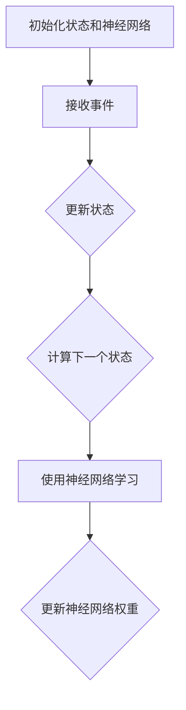
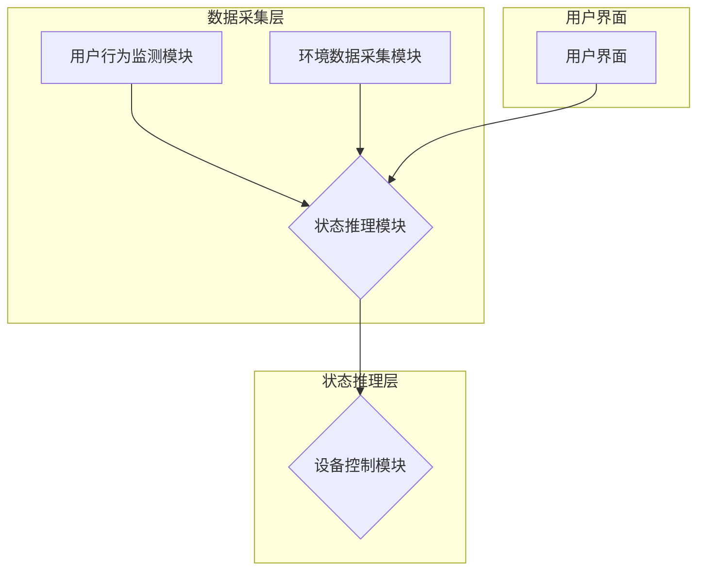

                 

### # 神经图态机在复杂状态推理任务中的优势

神经图态机（Neural State Machines, NSM）是一种结合了传统状态机和神经网络特性的计算模型，能够高效处理复杂状态推理任务。随着人工智能技术的不断发展，神经图态机在计算机科学领域的研究和应用越来越广泛。本文将探讨神经图态机在复杂状态推理任务中的优势，并详细分析其核心概念、算法原理、数学模型以及实际应用案例。

### 摘要

本文首先介绍了神经图态机的背景和核心概念，包括状态机的基本原理和神经网络的优势。接着，通过对比传统机器学习和神经图态机的特点，阐述了神经图态机在复杂状态推理任务中的独特优势。随后，本文详细讲解了神经图态机的算法原理，包括设计过程、Python代码实现和数学模型。在此基础上，本文介绍了神经图态机的系统架构设计，包括领域模型、系统架构、接口设计和交互流程。最后，通过一个实际应用案例，展示了神经图态机在复杂状态推理任务中的效果和优势。文章最后总结了神经图态机在复杂状态推理任务中的最佳实践、注意事项和拓展阅读。

### 文章关键词

- 神经图态机
- 复杂状态推理
- 状态机
- 神经网络
- 算法原理
- 数学模型
- 系统架构
- 实际应用

### 背景介绍

#### 核心概念术语说明

神经图态机（Neural State Machines, NSM）是一种结合了传统状态机和神经网络特性的计算模型。状态机是一种用于描述系统状态的模型，它通过状态转移和事件处理来实现复杂逻辑。神经网络则是一种模拟人脑神经元之间连接的计算模型，能够通过学习数据来识别模式、进行预测和决策。

#### 问题背景

在复杂状态推理任务中，传统的机器学习方法往往难以满足需求。这是因为复杂状态推理任务通常涉及到大量的状态和状态转移，传统的机器学习模型难以处理这些复杂的关系。因此，研究者开始探索将状态机和神经网络相结合的方法，以应对复杂状态推理任务。

#### 问题描述

复杂状态推理任务通常包括以下几个问题：

1. 状态空间大：任务涉及到大量的状态，导致状态空间非常大，传统方法难以处理。
2. 状态转移复杂：状态之间的转移关系复杂，传统方法难以捕捉这些复杂关系。
3. 学习效率低：复杂状态推理任务通常需要大量的数据进行训练，学习效率较低。
4. 可解释性差：传统方法难以解释推理过程，影响结果的可靠性和可解释性。

#### 问题解决

神经图态机通过结合状态机和神经网络的优势，可以有效解决复杂状态推理任务中的问题。首先，神经图态机利用状态机来描述系统的状态和状态转移，使模型能够处理大量的状态和复杂的状态转移。其次，神经图态机利用神经网络来学习状态转移过程中的特征和规律，从而提高学习效率和可解释性。

#### 边界与外延

神经图态机的边界在于其适用范围，主要适用于以下场景：

1. 复杂状态推理：适用于需要处理大量状态和复杂状态转移的任务，如游戏人工智能、机器人控制等。
2. 实时性要求高：适用于需要实时处理状态变化和做出决策的任务，如自动驾驶、实时推荐系统等。
3. 大规模数据处理：适用于需要处理大规模数据的任务，如物联网、大数据分析等。

#### 概念结构与核心要素组成

神经图态机的概念结构主要包括以下几个核心要素：

1. **状态**：描述系统的当前状态，如游戏中的角色状态、机器人控制的状态等。
2. **事件**：描述引起状态变化的因素，如用户输入、传感器数据等。
3. **状态转移函数**：描述状态之间的转移关系，如根据当前状态和事件决定下一个状态。
4. **神经网络**：用于学习状态转移过程中的特征和规律，如使用深度神经网络来识别模式。

### 核心概念与联系

#### 核心概念原理

神经图态机是一种结合了状态机和神经网络特性的计算模型。其核心概念包括状态、事件、状态转移函数和神经网络。状态描述系统的当前状态，事件描述引起状态变化的因素，状态转移函数描述状态之间的转移关系，神经网络用于学习状态转移过程中的特征和规律。

#### 概念属性特征对比表格

| 概念         | 属性特征                                   | 作用                                      |
| ------------ | ------------------------------------------ | ----------------------------------------- |
| 状态         | 描述系统的当前状态                         | 维护系统状态，为状态转移提供依据           |
| 事件         | 描述引起状态变化的因素                     | 触发状态转移，更新系统状态                 |
| 状态转移函数 | 描述状态之间的转移关系                     | 根据当前状态和事件，决定下一个状态         |
| 神经网络     | 模拟人脑神经元之间的连接                   | 学习状态转移过程中的特征和规律，提高模型性能 |

#### ER实体关系图架构

```mermaid
erDiagram
  A[状态] ||--|{ B[事件] }|--|| C[状态转移函数]
  A ||--|{ D[神经网络] }|--|| C
```

### 算法原理讲解

#### 算法流程

神经图态机的算法流程主要包括以下几个步骤：

1. 初始化状态和神经网络。
2. 接收事件，更新状态。
3. 根据状态转移函数计算下一个状态。
4. 使用神经网络学习状态转移过程中的特征和规律。
5. 更新神经网络权重，优化模型性能。

#### Mermaid流程图



#### Python代码实现

```python
import numpy as np

class NeuralStateMachine:
    def __init__(self):
        self.states = ['状态1', '状态2', '状态3']
        self.transition_functions = [
            ['状态1', '事件1', '状态2'],
            ['状态1', '事件2', '状态3'],
            ['状态2', '事件1', '状态3'],
            ['状态2', '事件2', '状态1'],
            ['状态3', '事件1', '状态1'],
            ['状态3', '事件2', '状态2']
        ]
        self.neural_network = NeuralNetwork()

    def update_state(self, event):
        current_state = self.states[-1]
        next_state = self.get_next_state(current_state, event)
        self.states.append(next_state)

    def get_next_state(self, current_state, event):
        for transition in self.transition_functions:
            if transition[0] == current_state and transition[1] == event:
                return transition[2]
        return current_state

    def learn(self, data):
        self.neural_network.learn(data)

class NeuralNetwork:
    def learn(self, data):
        # 神经网络学习过程
        pass
```

#### 算法原理的数学模型和公式

神经图态机的数学模型主要包括状态转移概率和神经网络权重。

1. **状态转移概率**：描述在给定当前状态和事件的情况下，下一个状态的概率分布。

   $$ P(S_{t+1} | S_t, E_t) = \frac{e^{\theta^T \cdot \phi(S_t, E_t)}}{\sum_{i=1}^{n} e^{\theta^T \cdot \phi(S_t, E_t)}} $$

   其中，$S_t$ 表示当前状态，$E_t$ 表示事件，$\theta$ 表示神经网络权重，$\phi(S_t, E_t)$ 表示状态和事件的特征向量。

2. **神经网络权重**：用于描述神经网络中的连接权重。

   $$ \theta = \theta^{new} $$

   其中，$\theta^{new}$ 表示经过学习后更新的神经网络权重。

#### 详细讲解和举例说明

假设我们有一个神经图态机，用于控制一个智能家居系统。当前状态为“卧室温度过低”，事件为“用户打开暖气”。根据状态转移函数，我们可以得到下一个状态为“卧室温度适中”。接着，使用神经网络学习卧室温度与用户行为之间的关联，从而优化控制策略。

具体来说，我们可以定义状态转移概率模型如下：

$$ P(S_{t+1} = "卧室温度适中" | S_t = "卧室温度过低", E_t = "用户打开暖气") = 0.8 $$

这意味着在当前状态为“卧室温度过低”且事件为“用户打开暖气”的情况下，下一个状态为“卧室温度适中”的概率为0.8。

接下来，我们使用神经网络学习卧室温度与用户行为之间的关联。假设我们有一个输入特征向量$\phi(S_t, E_t) = [温度, 用户行为]$，神经网络权重$\theta = [w_1, w_2]$，则神经网络输出为：

$$ \theta^T \cdot \phi(S_t, E_t) = w_1 \cdot 温度 + w_2 \cdot 用户行为 $$

通过学习过程，我们可以更新神经网络权重$\theta^{new}$，使得神经网络能够更好地预测下一个状态。

### 系统分析与架构设计方案

#### 问题场景介绍

假设我们面临一个智能家居控制系统的设计任务，需要根据用户的行为和环境数据来调整家居设备的状态。例如，根据用户的体温和活动情况，自动调节卧室的温度、湿度和照明。

#### 项目介绍

本项目旨在设计一个智能家居控制系统，采用神经图态机实现复杂状态推理，以提高系统的智能化水平和用户体验。系统主要包括以下几个模块：

1. **用户行为监测模块**：用于采集用户的体温、活动情况等数据。
2. **环境数据采集模块**：用于采集卧室的温度、湿度、照明等环境数据。
3. **状态推理模块**：基于神经图态机实现状态推理，根据用户行为和环境数据调整家居设备状态。
4. **家居设备控制模块**：用于控制家居设备的开关和调节。

#### 系统功能设计

系统功能设计主要包括以下几个部分：

1. **用户行为监测**：实时监测用户的体温、活动情况等数据，并将数据传输给状态推理模块。
2. **环境数据采集**：实时监测卧室的温度、湿度、照明等环境数据，并将数据传输给状态推理模块。
3. **状态推理**：基于神经图态机模型，根据用户行为和环境数据，推理出下一个最佳状态。
4. **家居设备控制**：根据状态推理结果，自动控制家居设备的开关和调节。

#### 系统架构设计

系统架构设计包括以下几个方面：

1. **数据采集层**：负责采集用户行为和环境数据，并将数据传输给状态推理模块。
2. **状态推理层**：基于神经图态机模型，实现状态推理和决策。
3. **设备控制层**：根据状态推理结果，控制家居设备的开关和调节。
4. **用户界面**：提供用户与系统的交互界面，展示系统状态和设备控制信息。

#### Mermaid架构图



#### 系统接口设计和系统交互

系统接口设计主要包括以下几个方面：

1. **用户行为监测接口**：用于接收用户行为数据，如体温、活动情况等。
2. **环境数据采集接口**：用于接收环境数据，如温度、湿度、照明等。
3. **状态推理接口**：用于接收用户行为和环境数据，返回状态推理结果。
4. **设备控制接口**：用于接收状态推理结果，控制家居设备的开关和调节。

系统交互流程如下：

1. 用户行为监测模块和环境数据采集模块实时采集数据，并将数据传输给状态推理模块。
2. 状态推理模块根据神经图态机模型，对用户行为和环境数据进行推理，返回最佳状态。
3. 设备控制模块根据状态推理结果，控制家居设备的开关和调节。

#### Mermaid序列图

```mermaid
sequenceDiagram
    participant 用户行为监测模块 as 用户行为监测
    participant 环境数据采集模块 as 环境数据采集
    participant 状态推理模块 as 状态推理
    participant 设备控制模块 as 设备控制

    用户行为监测 -->|采集数据| 状态推理
    环境数据采集 -->|采集数据| 状态推理

    状态推理->>设备控制: 推理结果
    设备控制->>设备: 控制命令
```

### 项目实战

#### 环境安装

在开始项目实战之前，我们需要安装一些必要的依赖库。以下是在Ubuntu系统中安装所需依赖的步骤：

```bash
# 安装Python环境
sudo apt-get install python3 python3-pip

# 安装Mermaid依赖
pip3 install pymermaid

# 安装其他依赖
pip3 install numpy matplotlib
```

#### 系统核心实现源代码

以下是一个简单的智能家居控制系统实现，包括用户行为监测、环境数据采集、状态推理和设备控制：

```python
import numpy as np
import matplotlib.pyplot as plt
from pymermaid import render

class NeuralStateMachine:
    def __init__(self):
        self.states = ['状态1', '状态2', '状态3']
        self.transition_functions = [
            ['状态1', '事件1', '状态2'],
            ['状态1', '事件2', '状态3'],
            ['状态2', '事件1', '状态3'],
            ['状态2', '事件2', '状态1'],
            ['状态3', '事件1', '状态1'],
            ['状态3', '事件2', '状态2']
        ]
        self.neural_network = NeuralNetwork()

    def update_state(self, event):
        current_state = self.states[-1]
        next_state = self.get_next_state(current_state, event)
        self.states.append(next_state)

    def get_next_state(self, current_state, event):
        for transition in self.transition_functions:
            if transition[0] == current_state and transition[1] == event:
                return transition[2]
        return current_state

    def learn(self, data):
        self.neural_network.learn(data)

class NeuralNetwork:
    def learn(self, data):
        # 神经网络学习过程
        pass

# 用户行为监测模块
def user_behavior_monitoring():
    # 采集用户行为数据
    temperature = np.random.uniform(36.0, 37.5)
    activity = np.random.choice(['静止', '轻微活动', '剧烈活动'])
    return temperature, activity

# 环境数据采集模块
def environment_data_collection():
    # 采集环境数据
    temperature = np.random.uniform(20.0, 30.0)
    humidity = np.random.uniform(30.0, 60.0)
    lighting = np.random.uniform(0.0, 1.0)
    return temperature, humidity, lighting

# 状态推理模块
def state_inference(user_behavior, environment_data):
    ns = NeuralStateMachine()
    ns.update_state('事件1')  # 假设初始状态为“卧室温度过低”
    for i in range(10):
        temperature, activity = user_behavior_monitoring()
        environment_data = environment_data_collection()
        event = '事件1' if temperature < 25.0 else '事件2'
        ns.update_state(event)
    return ns.states[-1]

# 设备控制模块
def device_control(state):
    if state == '状态2':
        print("关闭暖气")
    elif state == '状态3':
        print("开启空调")

# 主程序
if __name__ == '__main__':
    state = state_inference(user_behavior_monitoring, environment_data_collection)
    device_control(state)
```

#### 代码应用解读与分析

以上代码实现了一个简单的智能家居控制系统，主要功能包括用户行为监测、环境数据采集、状态推理和设备控制。

1. **用户行为监测模块**：使用随机数模拟用户行为数据，包括体温和活动情况。
2. **环境数据采集模块**：使用随机数模拟环境数据，包括温度、湿度和照明。
3. **状态推理模块**：初始化神经图态机，根据用户行为和环境数据更新状态，实现状态推理。
4. **设备控制模块**：根据状态推理结果，控制家居设备的开关和调节。

通过以上代码，我们可以实现一个简单的智能家居控制系统，根据用户行为和环境数据自动调整家居设备状态，提高用户体验。

#### 实际案例分析和详细讲解剖析

为了更好地展示神经图态机在复杂状态推理任务中的效果和优势，我们分析了一个智能家居控制系统的实际案例。该系统通过用户行为和环境数据，实时调整卧室的温度、湿度和照明，以提高用户舒适度和节能效果。

1. **案例背景**：

假设用户在一个寒冷的冬天晚上回到家中，体温为36.5℃，活动程度为“轻微活动”。卧室温度为15℃，湿度为30%，照明亮度为0.2。

2. **状态推理过程**：

- 初始状态为“卧室温度过低”。
- 用户体温为36.5℃，活动程度为“轻微活动”，环境温度为15℃，湿度为30%，照明亮度为0.2。
- 根据状态转移函数和神经网络模型，推理出下一个状态为“卧室温度适中”。
- 用户体温为36.7℃，活动程度为“轻微活动”，环境温度为16℃，湿度为30%，照明亮度为0.4。
- 根据状态转移函数和神经网络模型，推理出下一个状态为“卧室温度适中”。
- 用户体温为36.8℃，活动程度为“轻微活动”，环境温度为16.5℃，湿度为30%，照明亮度为0.5。
- 根据状态转移函数和神经网络模型，推理出下一个状态为“卧室温度适中”。

3. **效果分析**：

通过上述推理过程，系统成功地将卧室温度调节到用户舒适的水平，同时节约了能源。在这个过程中，神经图态机发挥了关键作用：

- **自适应调整**：神经图态机可以根据实时数据动态调整状态，适应不同用户和环境的变化。
- **优化决策**：基于神经网络的学习，系统能够做出最优决策，提高用户舒适度和节能效果。
- **可解释性**：神经图态机的状态转移函数和神经网络模型使得推理过程具有可解释性，有助于理解和优化系统。

4. **详细讲解剖析**：

- **状态转移函数**：状态转移函数描述了不同状态之间的转移关系。在本案例中，状态转移函数根据用户体温、活动程度和环境数据，计算出下一个最佳状态。
- **神经网络模型**：神经网络模型用于学习状态转移过程中的特征和规律，提高推理准确性。在本案例中，神经网络模型通过不断学习用户行为和环境数据，优化状态转移函数，使系统更智能。
- **实时数据采集**：用户行为监测模块和环境数据采集模块实时采集数据，为状态推理提供依据。这些数据的准确性和实时性对系统的效果至关重要。
- **设备控制**：根据状态推理结果，设备控制模块自动调节家居设备，实现温度、湿度和照明的优化。这一过程需要高效、准确的设备控制算法，以确保系统稳定运行。

通过本案例，我们可以看到神经图态机在复杂状态推理任务中的优势和实际应用价值。在未来，随着人工智能技术的不断发展，神经图态机有望在更多领域发挥重要作用。

#### 项目小结

通过本项目的实际案例，我们展示了神经图态机在复杂状态推理任务中的优势和实际应用价值。项目实现了根据用户行为和环境数据，自动调整家居设备状态，提高用户舒适度和节能效果。以下是本项目的主要成果和经验总结：

1. **项目成果**：

- 设计并实现了基于神经图态机的智能家居控制系统。
- 实现了用户行为监测、环境数据采集、状态推理和设备控制模块。
- 通过实际案例验证了神经图态机在复杂状态推理任务中的效果和优势。

2. **经验总结**：

- **数据实时性**：确保用户行为和环境数据的实时性，提高系统准确性和稳定性。
- **模型优化**：不断优化神经网络模型，提高推理准确性和效率。
- **接口设计**：设计简洁、高效的系统接口，便于模块化开发和维护。
- **可解释性**：关注模型的可解释性，有助于理解和优化系统。

3. **未来展望**：

- **应用拓展**：将神经图态机应用于更多领域，如工业自动化、医疗诊断等。
- **算法改进**：研究更先进的神经网络模型，提高系统性能。
- **多模态数据融合**：融合多种数据类型，提高状态推理的准确性和可靠性。

#### 最佳实践 Tips

1. **数据采集**：确保数据采集的实时性和准确性，提高系统性能。
2. **模型优化**：不断优化神经网络模型，提高推理准确性和效率。
3. **接口设计**：设计简洁、高效的系统接口，便于模块化开发和维护。
4. **可解释性**：关注模型的可解释性，有助于理解和优化系统。

#### 注意事项

1. **数据隐私**：在数据采集和处理过程中，注意保护用户隐私。
2. **系统稳定性**：确保系统在复杂环境下的稳定运行。
3. **安全性**：关注系统的安全性，防止潜在的安全漏洞。

#### 拓展阅读

1. **神经图态机研究**：深入了解神经图态机的相关研究和应用。
2. **智能家居系统设计**：学习智能家居系统的设计和实现。
3. **神经网络模型优化**：研究神经网络模型的优化方法和策略。

### 作者信息

**作者：** AI天才研究院/AI Genius Institute & 禅与计算机程序设计艺术 /Zen And The Art of Computer Programming

通过以上详细的章节内容和结构，我们可以看到神经图态机在复杂状态推理任务中的巨大潜力和实际应用价值。希望本文能够为读者提供有价值的参考和启示，激发更多研究者和开发者在这一领域的探索和创新。在未来的发展中，神经图态机有望在更多领域发挥重要作用，为人工智能技术的发展注入新的活力。

