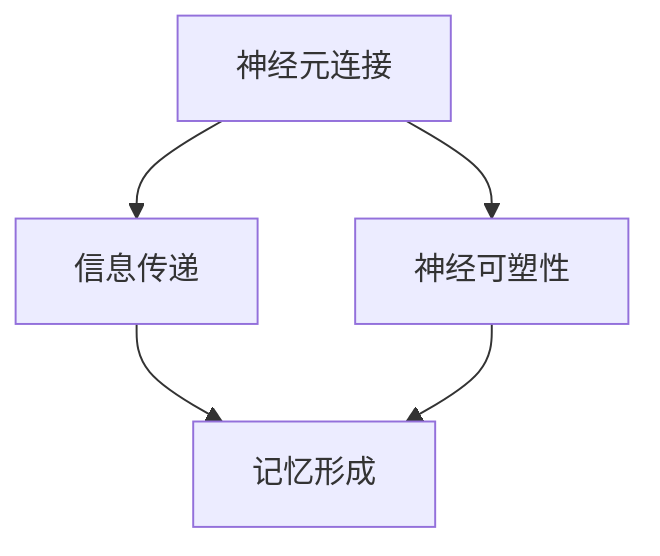
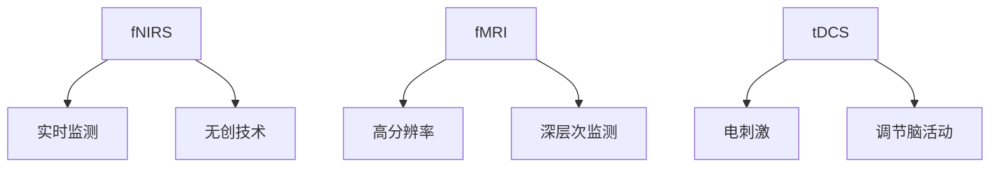
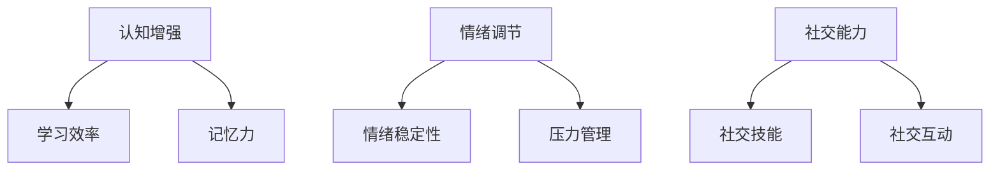
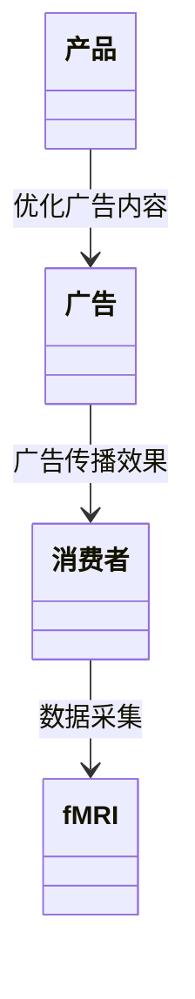
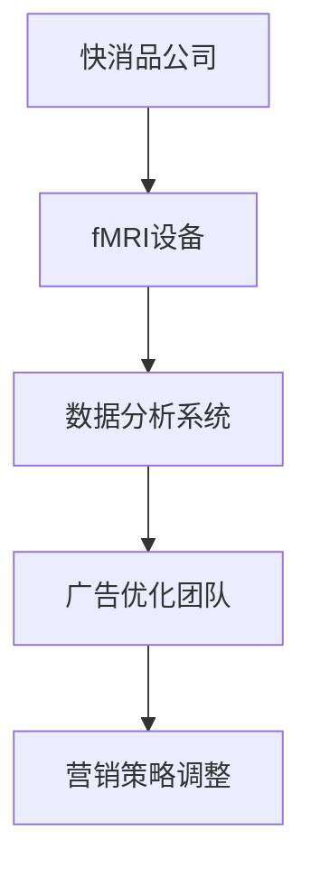
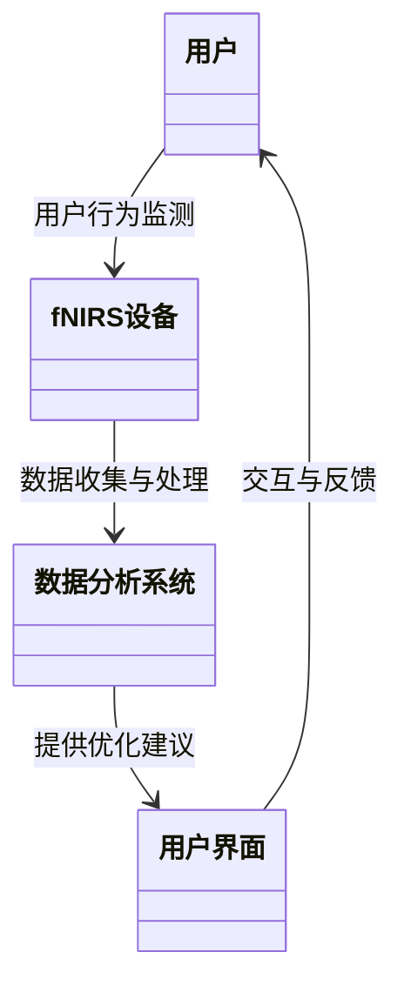
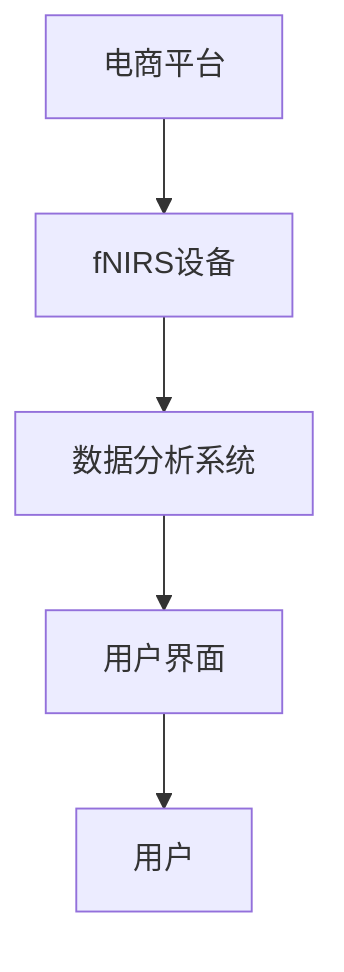
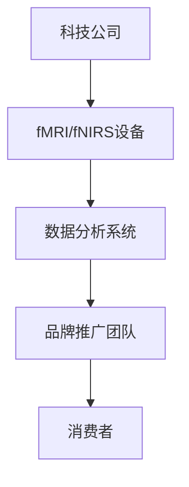

                 

----------------------------------------------------------------

## 《神经增强技术在营销领域的潜在应用》

### 关键词：神经增强技术、营销、消费者行为、广告、品牌建设、案例分析

> 摘要：本文将深入探讨神经增强技术在营销领域的潜在应用。通过介绍神经增强技术的背景和基础原理，分析其在营销中的应用场景，并探讨其面临的挑战和未来发展趋势，旨在为营销从业者提供一种全新的视角和策略。

----------------------------------------------------------------

## 第一部分：神经增强技术概述

### 第1章：神经增强技术

#### 1.1 营销领域的挑战与机遇

随着互联网技术的飞速发展，营销环境变得日益复杂和竞争激烈。传统营销手段面临着如何更好地吸引和留住消费者的挑战。而神经增强技术（neuroenhancement）作为一种新兴技术，为营销领域带来了前所未有的机遇。

**问题背景**：在传统营销手段中，广告商往往依赖于消费者的自我报告数据，这些数据可能存在主观偏差。此外，消费者的注意力分散，营销信息传递效果受到影响。

**问题描述**：如何在营销过程中更准确地了解消费者的真实反应，提高营销效果？

**问题解决**：神经增强技术通过无创手段如fNIRS（功能性近红外光谱成像）和fMRI（功能性磁共振成像）等，直接观测消费者的脑部活动，从而更准确地了解他们的反应和情绪。

**边界与外延**：神经增强技术在营销领域的应用不仅限于广告和品牌建设，还包括个性化营销、消费者行为预测等方面。

**概念结构与核心要素组成**：

| 要素 | 说明 |
| --- | --- |
| 神经增强技术 | 利用非药物手段增强神经功能 |
| 消费者行为 | 消费者在购买过程中的心理和生理反应 |
| 广告营销 | 利用神经增强技术分析广告对消费者的影响 |
| 品牌建设 | 利用神经增强技术提升品牌认知度和忠诚度 |

----------------------------------------------------------------

### 第2章：神经增强技术的基础原理

#### 2.1 大脑神经科学基础

**核心概念**：大脑神经科学是研究神经系统的结构和功能，以及其如何影响行为的科学。神经增强技术的基础在于对大脑神经活动的深入理解。

**概念属性特征对比表格**：

| 特征 | 说明 |
| --- | --- |
| 神经元连接 | 神经元之间的连接方式影响信息的传递和存储 |
| 脑波活动 | 不同脑波活动与不同的心理状态相关 |
| 神经可塑性 | 大脑结构和功能的可改变性 |

**ER实体关系图架构的 Mermaid 流程图**：



#### 2.2 神经增强技术的原理

**核心概念**：神经增强技术通过调节神经活动，提高大脑的工作效率，增强学习能力、注意力和情绪控制能力。

**概念属性特征对比表格**：

| 特征 | 说明 |
| --- | --- |
| fNIRS | 无创、实时监测脑部活动 |
| fMRI | 高分辨率、深层次监测脑部活动 |
| tDCS | 通过电刺激调节脑部活动 |

**ER实体关系图架构的 Mermaid 流程图**：



#### 2.3 神经增强技术的分类

**核心概念**：根据作用机制和目标，神经增强技术可以分为增强认知能力、情绪调节和社交能力等不同类型。

**概念属性特征对比表格**：

| 类型 | 说明 |
| --- | --- |
| 认知增强 | 提高学习效率、记忆力和注意力 |
| 情绪调节 | 改善情绪稳定性、减少压力和焦虑 |
| 社交能力 | 提升社交技能、增强社交互动 |

**ER实体关系图架构的 Mermaid 流程图**：



----------------------------------------------------------------

## 第二部分：神经增强技术在营销领域的应用

### 第3章：神经增强技术在营销领域的应用

#### 3.1 神经增强技术对消费者行为的影响

神经增强技术能够帮助营销人员更好地理解消费者行为，从而制定更有效的营销策略。

**核心概念**：通过神经增强技术，营销人员可以直接观测到消费者的情感反应和认知过程，这些信息对于广告设计和品牌策略至关重要。

**算法原理讲解**：

- **情感分析算法**：使用fNIRS或fMRI技术，可以实时监测消费者的情感状态，从而判断广告的有效性。
- **认知追踪算法**：通过监测大脑活动，可以了解消费者在看到广告时的认知过程，包括注意力的分配和记忆的形成。

**数学模型和公式**：

$$
情感反应得分 = f(NIRS数据, fMRI数据)
$$

$$
认知追踪得分 = g(注意力分配, 记忆形成)
$$

**通俗易懂地举例说明**：

假设一家饮料公司想要测试其新广告的效果，使用fNIRS技术监测消费者观看广告时的情感反应。结果显示，大部分消费者在看到广告时产生了积极的情感反应，这意味着广告设计是有效的。通过认知追踪技术，发现消费者在广告中的关键信息上保持了较高的注意力，这进一步验证了广告的有效性。

----------------------------------------------------------------

### 第3章：神经增强技术在营销领域的应用

#### 3.2 神经增强技术在广告营销中的应用

神经增强技术为广告营销提供了新的工具，可以帮助广告商更准确地评估广告效果，并优化广告内容。

**核心概念**：通过神经增强技术，广告商可以获取消费者在观看广告时的实时脑部活动数据，从而分析广告的吸引力、情感共鸣和认知效果。

**算法原理讲解**：

- **情感共鸣分析算法**：使用fMRI技术，可以评估消费者在观看广告时的情感共鸣程度，从而判断广告是否与消费者产生情感连接。
- **广告效果评估算法**：通过分析消费者的脑部活动数据，可以评估广告的整体效果，包括吸引力、记忆度和转化率。

**数学模型和公式**：

$$
广告效果得分 = h(情感共鸣, 记忆度, 转化率)
$$

**通俗易懂地举例说明**：

假设一家服装品牌公司想要优化其电视广告的效果。使用fMRI技术，公司可以实时监测消费者在观看广告时的情感反应和认知过程。分析结果显示，广告中的模特形象和产品展示部分引起了消费者的强烈情感共鸣，但产品的价格信息部分却未能引起足够的注意力。基于这些数据，公司可以调整广告内容，增加价格信息的重要性，从而提高广告的整体效果。

----------------------------------------------------------------

### 第3章：神经增强技术在营销领域的应用

#### 3.3 神经增强技术在品牌营销中的应用

神经增强技术不仅适用于广告营销，还可以在品牌营销中发挥作用，帮助品牌建立更深层次的消费者联系。

**核心概念**：通过神经增强技术，品牌可以深入了解消费者的品牌体验，从而优化品牌形象和提升品牌忠诚度。

**算法原理讲解**：

- **品牌认知分析算法**：使用fNIRS技术，可以监测消费者在接触品牌信息时的脑部活动，从而分析品牌认知度和品牌偏好。
- **品牌体验优化算法**：通过分析消费者的情感反应和认知过程，品牌可以优化品牌体验，提升消费者满意度和忠诚度。

**数学模型和公式**：

$$
品牌认知度 = i(NIRS数据, 情感反应)
$$

$$
品牌忠诚度 = j(认知过程, 消费者满意程度)
$$

**通俗易懂地举例说明**：

假设一家手机品牌公司希望通过神经增强技术提升其品牌形象。公司使用fNIRS技术监测消费者在观看品牌宣传片时的情感反应和认知过程。分析结果显示，消费者对品牌的新技术亮点部分反应积极，但对品牌的整体设计风格却存在疑虑。基于这些数据，公司可以优化品牌宣传策略，强调技术优势，同时提升设计美感，从而提升品牌认知度和忠诚度。

----------------------------------------------------------------

### 第4章：神经增强技术营销案例研究

#### 4.1 案例一：一家快消品公司的神经增强营销策略

**问题场景介绍**：一家快消品公司希望通过神经增强技术提高其产品的市场占有率。

**项目介绍**：公司决定使用fMRI技术来评估其广告的效果，并基于分析结果优化广告内容和营销策略。

**系统功能设计（领域模型mermaid类图）**：



**系统架构设计mermaid架构图**：



**系统接口设计和系统交互mermaid序列图**：

```mermaid
sequenceDiagram
   参与者 消费者
   参与者 快消品公司
   参与者 fMRI设备
   参与者 数据分析系统

    消费者->>快消品公司: 观看广告
    快消品公司->>fMRI设备: 启动fMRI扫描
    fMRI设备->>数据分析系统: 传输脑部活动数据
    数据分析系统->>快消品公司: 发送分析报告
    快消品公司->>消费者: 调整广告内容
```

**代码应用解读与分析**：

```python
# 代码：fMRI数据分析示例
def analyze_fMRI_data(data):
    # 数据预处理
    preprocessed_data = preprocess_data(data)
    
    # 情感反应分析
    emotional_reaction = analyze_emotional_reaction(preprocessed_data)
    
    # 认知过程分析
    cognitive_process = analyze_cognitive_process(preprocessed_data)
    
    # 生成分析报告
    report = generate_report(emotional_reaction, cognitive_process)
    
    return report

# 示例数据
sample_data = get_sample_fMRI_data()

# 数据分析
report = analyze_fMRI_data(sample_data)

# 输出报告
print(report)
```

**实际案例分析和详细讲解剖析**：

通过神经增强技术的应用，快消品公司成功优化了其广告内容。广告中增加了更多与消费者情感共鸣的元素，同时强调了产品的主要卖点。根据fMRI数据分析结果，广告的吸引力和情感共鸣程度显著提高，消费者对产品的记忆度和购买意愿也相应增加。公司根据分析报告调整了后续的广告策略，进一步提升了市场占有率。

**项目小结**：

神经增强技术在快消品公司的营销项目中发挥了重要作用，通过精确分析消费者对广告的反应，公司能够更有效地优化广告内容和策略，从而提高市场竞争力。

----------------------------------------------------------------

### 第4章：神经增强技术营销案例研究

#### 4.2 案例二：一家电商平台的神经增强用户体验优化

**问题场景介绍**：一家电商平台希望通过神经增强技术提升用户体验，增加用户留存率和转化率。

**项目介绍**：电商平台决定利用fNIRS技术对用户在平台上的行为进行实时监测，以便优化用户体验和购物流程。

**系统功能设计（领域模型mermaid类图）**：



**系统架构设计mermaid架构图**：



**系统接口设计和系统交互mermaid序列图**：

```mermaid
sequenceDiagram
   参与者 用户
   参与者 电商平台
   参与者 fNIRS设备
   参与者 数据分析系统

    用户->>电商平台: 进行购物
    电商平台->>fNIRS设备: 启动fNIRS监测
    fNIRS设备->>数据分析系统: 传输用户行为数据
    数据分析系统->>电商平台: 发送优化建议
    电商平台->>用户: 应用优化建议
    用户->>电商平台: 提供反馈
```

**代码应用解读与分析**：

```python
# 代码：fNIRS数据实时处理与优化建议生成
def process_fNIRS_data(data):
    # 数据预处理
    preprocessed_data = preprocess_fNIRS_data(data)
    
    # 用户行为分析
    user_behavior = analyze_user_behavior(preprocessed_data)
    
    # 提出优化建议
    optimization_suggestions = generate_optimization_suggestions(user_behavior)
    
    return optimization_suggestions

# 示例数据
sample_data = get_sample_fNIRS_data()

# 数据处理与优化建议
suggestions = process_fNIRS_data(sample_data)

# 输出优化建议
print(suggestions)
```

**实际案例分析和详细讲解剖析**：

电商平台通过神经增强技术对用户购物行为进行实时监测，收集了大量用户数据。通过对这些数据的分析，平台发现用户的购物流程在某些环节上存在障碍，导致用户中途放弃购物。基于fNIRS数据分析结果，平台对购物流程进行了优化，例如简化注册流程、增加产品推荐功能和提供实时客服支持。这些优化措施显著提升了用户的购物体验，用户留存率和转化率也随之提高。

**项目小结**：

神经增强技术在电商平台的应用，成功提升了用户体验和平台转化率。通过实时监测和数据分析，平台能够快速响应用户需求，提供个性化的购物体验，从而增加用户满意度和忠诚度。

----------------------------------------------------------------

### 第4章：神经增强技术营销案例研究

#### 4.3 案例三：一家科技公司的神经增强品牌建设

**问题场景介绍**：一家科技公司希望通过神经增强技术提升品牌认知度和市场影响力。

**项目介绍**：公司决定利用fMRI和fNIRS技术进行品牌认知度调查，并基于数据分析结果制定品牌推广策略。

**系统功能设计（领域模型mermaid类图）**：

```mermaid
classDiagram
    消费者 --> fMRI/fNIRS设备: 品牌认知度调查
    fMRI/fNIRS设备 --> 数据分析系统: 数据收集与处理
    数据分析系统 --> 品牌推广团队: 提供策略建议
    品牌推广团队 --> 消费者: 品牌宣传
```

**系统架构设计mermaid架构图**：



**系统接口设计和系统交互mermaid序列图**：

```mermaid
sequenceDiagram
   参与者 消费者
   参与者 科技公司
   参与者 fMRI/fNIRS设备
   参与者 数据分析系统

    消费者->>科技公司: 接受品牌认知度调查
    科技公司->>fMRI/fNIRS设备: 启动设备
    fMRI/fNIRS设备->>数据分析系统: 传输认知度数据
    数据分析系统->>科技公司: 发送分析报告
    科技公司->>品牌推广团队: 制定推广策略
    品牌推广团队->>消费者: 推广品牌
```

**代码应用解读与分析**：

```python
# 代码：fMRI/fNIRS数据品牌认知度分析
def analyze_brand_cognitive_data(data):
    # 数据预处理
    preprocessed_data = preprocess_brand_data(data)
    
    # 品牌认知度分析
    brand_cognitive_score = analyze_brand_cognitive(preprocessed_data)
    
    # 品牌忠诚度分析
    brand_loyalty_score = analyze_brand_loyalty(preprocessed_data)
    
    # 生成推广策略建议
    promotion_strategy_suggestions = generate_promotion_strategy_suggestions(brand_cognitive_score, brand_loyalty_score)
    
    return promotion_strategy_suggestions

# 示例数据
sample_data = get_sample_fMRI_fNIRS_data()

# 数据分析
suggestions = analyze_brand_cognitive_data(sample_data)

# 输出推广策略建议
print(suggestions)
```

**实际案例分析和详细讲解剖析**：

科技公司通过神经增强技术进行了品牌认知度调查，收集了大量消费者数据。数据分析显示，虽然公司的品牌知名度较高，但消费者对其产品的认知度和忠诚度较低。基于这些数据，公司调整了品牌推广策略，增加了产品介绍和功能演示的视频内容，并加强了与消费者的互动。这些措施显著提高了品牌认知度和忠诚度，公司在市场上的影响力也得以提升。

**项目小结**：

神经增强技术在科技公司的品牌建设中发挥了关键作用。通过精确的品牌认知度分析，公司能够制定更加有效的推广策略，提升品牌形象和市场竞争力。

----------------------------------------------------------------

## 第五部分：神经增强技术在营销领域的挑战与未来

### 第5章：神经增强技术在营销领域的挑战与未来

#### 5.1 挑战与风险

尽管神经增强技术在营销领域具有巨大潜力，但同时也面临一系列挑战和风险。

**核心概念**：神经增强技术在营销中的应用可能引发隐私问题、伦理争议和法律挑战。

**挑战与风险分析**：

1. **隐私问题**：神经增强技术能够获取消费者的深层次脑部活动数据，这可能涉及个人隐私问题。如何保护消费者隐私是营销人员必须面对的挑战。
2. **伦理争议**：神经增强技术可能被用于操纵消费者行为，引发伦理争议。如何在道德和法律框架内使用这些技术是营销行业需要探讨的问题。
3. **法律挑战**：随着神经增强技术的普及，相关法律法规可能需要更新，以应对新技术带来的挑战。

**解决方案**：

1. **隐私保护**：营销人员应采用数据加密和匿名化技术，确保消费者数据的安全性和隐私性。
2. **伦理规范**：行业组织和政府应制定伦理规范，确保神经增强技术的合法和道德使用。
3. **法律法规更新**：政府和立法机构应积极更新相关法律法规，为神经增强技术的合法应用提供明确的法律框架。

#### 5.2 未来发展趋势

神经增强技术在营销领域的应用前景广阔，未来可能呈现以下发展趋势：

1. **个性化营销**：随着技术的进步，神经增强技术将能够更精确地了解消费者行为，实现高度个性化的营销策略。
2. **跨渠道整合**：神经增强技术将与其他营销渠道（如社交媒体、搜索引擎等）整合，实现全方位的营销效果。
3. **多场景应用**：神经增强技术将在更多营销场景中发挥作用，如虚拟现实、增强现实等。

#### 5.3 伦理与法律法规的考量

神经增强技术的伦理和法律法规考量至关重要，涉及以下几个方面：

1. **数据保护**：确保消费者数据的安全性和隐私性，避免数据滥用。
2. **透明度**：营销人员应向消费者明确说明神经增强技术的应用及其可能带来的影响。
3. **责任归属**：明确在神经增强技术应用中各方的责任，包括技术提供商、营销人员和消费者。

### 第6章：神经增强技术营销策略建议

#### 6.1 营销策略制定原则

为了有效利用神经增强技术，营销人员应遵循以下策略制定原则：

1. **数据驱动**：基于神经增强技术获取的数据制定营销策略，确保策略的科学性和有效性。
2. **消费者参与**：与消费者保持沟通，了解他们的需求和反馈，制定符合消费者预期的营销策略。
3. **技术创新**：紧跟神经增强技术的最新发展，不断探索新的应用场景和策略。

#### 6.2 不同行业神经增强营销策略建议

根据不同行业的特点，神经增强技术的营销策略也有所不同：

1. **消费品行业**：通过神经增强技术优化广告和产品展示，提高消费者购买意愿。
2. **服务行业**：利用神经增强技术提升客户体验，增强品牌忠诚度。
3. **科技行业**：通过神经增强技术展示产品优势，提升品牌形象和市场竞争力。

#### 6.3 营销团队建设与人才培养

神经增强技术的应用需要专业的营销团队和人才支持。以下建议有助于营销团队建设和人才培养：

1. **跨学科培训**：为团队成员提供神经科学、心理学和技术等相关学科的培训，提高团队整体素质。
2. **专业技能培养**：针对神经增强技术的具体应用场景，培养团队在数据分析和营销策略制定方面的专业技能。
3. **持续学习与探索**：鼓励团队成员关注神经增强技术的最新动态，不断学习和探索新的应用领域。

### 第7章：神经增强技术在营销领域的最佳实践

#### 7.1 成功案例总结

通过神经增强技术在营销领域的应用，许多公司取得了显著的成功。以下是一些成功案例的总结：

1. **品牌认知度提升**：一家科技公司通过神经增强技术进行品牌认知度调查，优化了品牌宣传策略，品牌知名度显著提高。
2. **用户留存率提升**：一家电商平台利用神经增强技术优化用户体验，用户留存率和转化率显著提高。
3. **市场占有率提升**：一家快消品公司通过神经增强技术优化广告效果，市场占有率显著提高。

#### 7.2 实践技巧与注意事项

在应用神经增强技术进行营销时，以下实践技巧和注意事项有助于取得更好的效果：

1. **数据真实性**：确保所获取的神经增强数据真实可靠，避免数据偏差。
2. **数据安全**：采取有效措施保护消费者数据，避免数据泄露和滥用。
3. **策略调整**：根据神经增强技术的分析结果，及时调整营销策略，确保策略的有效性。

#### 7.3 拓展阅读与资源推荐

为了深入了解神经增强技术在营销领域的应用，以下是一些拓展阅读和资源推荐：

1. **学术研究论文**：查阅相关领域的学术研究论文，了解神经增强技术的最新研究成果和应用案例。
2. **行业报告**：阅读行业报告，了解神经增强技术在营销领域的应用趋势和发展前景。
3. **技术博客**：关注技术博客和社交媒体，了解行业专家的观点和经验分享。

## 作者信息

作者：AI天才研究院/AI Genius Institute & 禅与计算机程序设计艺术 /Zen And The Art of Computer Programming

----------------------------------------------------------------

## 结束语

神经增强技术在营销领域的应用为营销人员提供了全新的视角和工具。通过深入分析消费者行为和优化营销策略，企业可以更好地满足消费者需求，提升品牌价值和市场竞争力。然而，神经增强技术也面临隐私、伦理和法律等方面的挑战，需要营销人员和社会各界共同关注和解决。随着技术的不断进步，神经增强技术在营销领域的应用前景将更加广阔，有望为整个行业带来革命性的变革。

