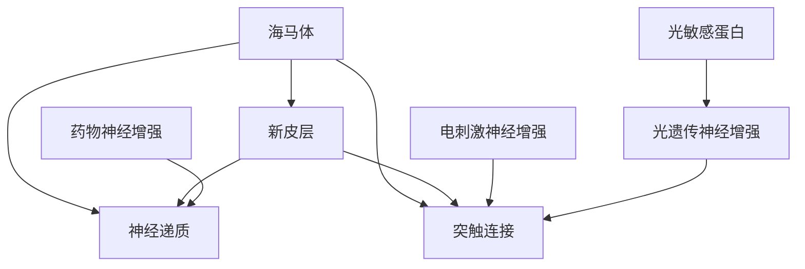
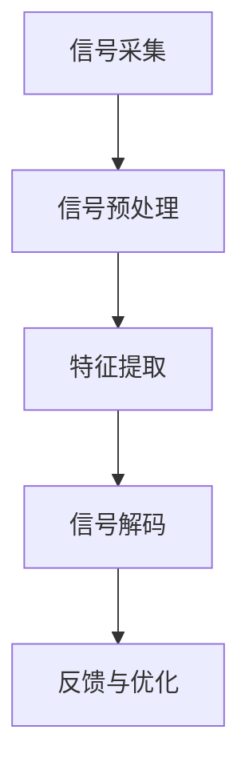
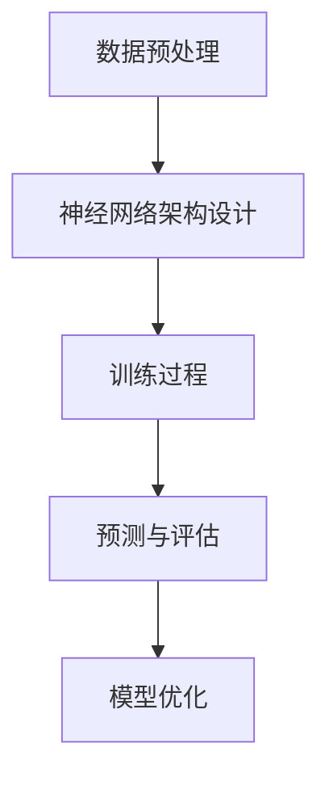
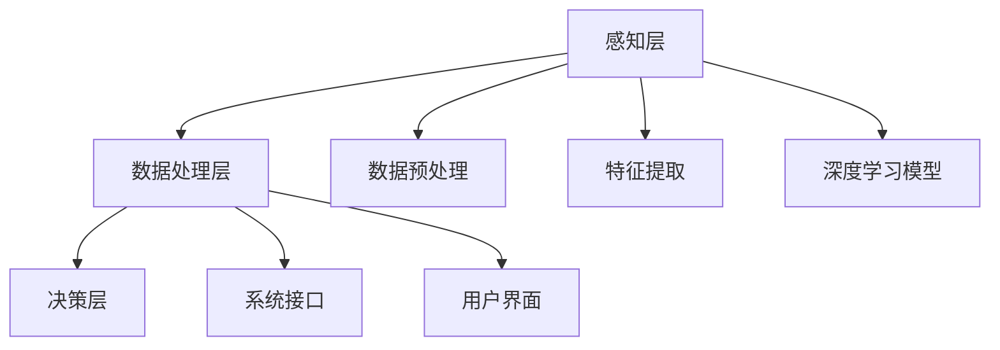
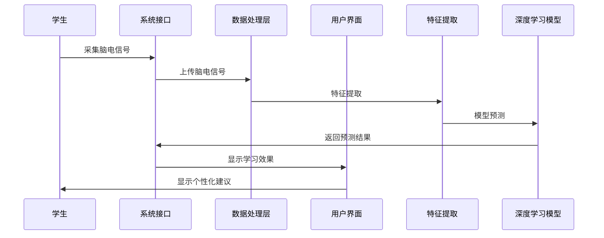

                 

## 引言

### 神经增强技术的概述

神经增强技术是一种通过外部手段来增强或改善大脑功能的技术。这种技术的研究和应用可以追溯到上世纪50年代，当时科学家们开始探索如何通过电刺激来改善大脑的功能。随着时间的推移，神经增强技术不断发展，涵盖了多种形式，包括药物、电刺激、光遗传等。

神经增强技术的研究目的在于提高人类的认知能力、学习效率和记忆力。随着人工智能和生物技术的飞速发展，神经增强技术已经成为一个备受关注的领域。目前，神经增强技术的研究现状主要包括以下几个方面：

1. **药物神经增强**：通过口服或注射等方式使用药物来增强大脑功能。例如，一些药物可以改善注意力、记忆力和学习能力。
2. **电刺激神经增强**：通过在大脑中植入电极来传递电刺激，从而改善大脑功能。这种技术已广泛应用于治疗帕金森病和抑郁症等疾病。
3. **光遗传神经增强**：利用光遗传学技术，通过光操纵神经元的活动来增强大脑功能。这种技术具有高度的特异性和灵活性，被认为是未来神经增强技术的重要发展方向。

### 问题背景

学习和记忆是人类认知过程中的关键环节，然而，随着生活节奏的加快和压力的增大，许多人在学习和记忆过程中遇到了诸多问题，如记忆力减退、学习效率低下等。这些问题不仅影响了个人的生活质量，也对社会生产力产生了负面影响。

传统的学习方法和记忆技巧在一定程度上能够缓解这些问题，但效果有限。因此，寻找一种能够有效提升学习和记忆能力的新方法显得尤为重要。神经增强技术作为一种新兴技术，为解决这些难题提供了一种可能的途径。

### 神经增强技术与学习记忆的关系

神经增强技术通过直接干预大脑的神经活动，可能对学习和记忆产生显著影响。一方面，神经增强技术可以通过增强大脑中的神经信号传递，提高神经元的连接强度，从而改善学习和记忆能力。另一方面，神经增强技术也可能通过调节大脑中的神经递质水平，影响神经元的兴奋性和突触可塑性，进而影响学习和记忆过程。

然而，神经增强技术对学习记忆的影响并非一概而论，它受到多种因素的影响，如技术类型、使用方式、个体差异等。此外，神经增强技术在使用过程中也存在一定的潜在副作用和风险，如药物副作用、电刺激损伤、光遗传干扰等。

因此，在探讨神经增强技术对学习和记忆的影响时，需要综合考虑这些因素，以制定合理的使用方案，最大限度地发挥其优势，同时避免可能的负面影响。

### 总结

神经增强技术作为一种新兴技术，具有巨大的发展潜力和广泛应用前景。它可能成为解决学习记忆问题的一种有效手段，但同时也需要我们对其潜在风险和副作用保持警惕。本文将从神经增强技术的基本概念、学习与记忆机制、核心算法原理、数学模型、系统分析与架构设计、项目实战等方面进行深入探讨，旨在为读者提供全面、系统的了解。

通过本文的研究，我们希望能够揭示神经增强技术对学习和记忆的影响机制，为其在教育和临床领域的应用提供理论依据和实践指导。同时，我们也期待未来能够进一步优化神经增强技术，使其在安全性和有效性方面取得更大的突破，为人类社会的发展作出更大的贡献。

## 核心概念与联系

### 神经增强技术

神经增强技术是一种通过外部手段来增强或改善大脑功能的技术。其核心思想是通过干预神经信号传递、调节神经递质水平、改变神经元连接方式等途径，提升大脑的认知能力、学习效率和记忆力。神经增强技术的研究和应用涵盖了多个领域，包括药物神经增强、电刺激神经增强和光遗传神经增强等。

#### 药物神经增强

药物神经增强是通过口服或注射等方式使用药物来增强大脑功能。常见的药物神经增强剂包括安非他明、哌甲酯、尼可刹米等。这些药物可以作用于大脑的多个神经通路，改善注意力、记忆力和学习能力。药物神经增强具有快速、高效的特点，但同时也存在一定的副作用和潜在风险，如心血管问题、药物依赖等。

#### 电刺激神经增强

电刺激神经增强是通过在大脑中植入电极来传递电刺激，从而改善大脑功能。电刺激神经增强技术可分为侵入性和非侵入性两种。侵入性电刺激神经增强通常通过在脑内植入电极来直接刺激神经元，而非侵入性电刺激神经增强则通常通过头皮上的电极来传递电刺激。电刺激神经增强技术在治疗帕金森病、抑郁症等疾病中已取得显著成效，但其应用范围仍需进一步拓展。

#### 光遗传神经增强

光遗传神经增强是利用光遗传学技术，通过光操纵神经元的活动来增强大脑功能。光遗传学技术利用光敏感蛋白（如 Channelrhodopsin-2，ChR2）来操纵神经元的兴奋性。通过在特定神经元中表达光敏感蛋白，科学家可以精确地控制这些神经元的活动，从而实现大脑功能的增强。光遗传神经增强具有高度的特异性和灵活性，被认为是未来神经增强技术的重要发展方向。

### 学习与记忆机制

学习与记忆是大脑的基本功能，其机制复杂且多样。大脑中的海马体和新皮层是学习与记忆的关键结构。

#### 海马体

海马体是大脑中负责记忆形成和存储的重要区域。当大脑接收到新的信息时，海马体会将其转化为短时记忆，并通过突触可塑性将其转化为长时记忆。海马体中的神经元通过突触连接和神经递质的传递来实现信息的存储和传递。

#### 新皮层

新皮层是大脑中负责高级认知功能的重要区域，包括感知、思考、记忆等。新皮层中的神经元通过复杂的神经网络进行信息处理和传递，实现认知功能的多样化。

### 核心概念对比表格

下表列出了不同神经增强技术的主要特点、适用范围和潜在副作用：

| 神经增强技术 | 主要特点 | 适用范围 | 潜在副作用 |
| :--: | :--: | :--: | :--: |
| 药物神经增强 | 快速、高效 | 注意力、记忆力和学习能力 | 心血管问题、药物依赖 |
| 电刺激神经增强 | 高度特异性、灵活性 | 帕金森病、抑郁症等疾病 | 电极植入风险、局部损伤 |
| 光遗传神经增强 | 高度特异性、灵活性、非侵入性 | 认知功能改善、疾病治疗 | 光遗传蛋白表达风险、潜在遗传问题 |

### ER实体关系图

为了更好地理解神经增强技术对学习和记忆的影响，我们可以绘制一个大脑中学习和记忆相关的实体关系图。该图展示了海马体、新皮层、神经递质、突触连接等实体之间的联系，以及神经增强技术如何干预这些联系。



在这个实体关系图中，海马体和新皮层作为学习和记忆的关键结构，与神经递质和突触连接密切相关。药物神经增强通过调节神经递质水平来影响学习和记忆，而电刺激神经增强和光遗传神经增强则通过干预突触连接来增强大脑功能。

通过这个实体关系图，我们可以更清晰地理解神经增强技术对学习和记忆的影响机制，为进一步研究和应用提供理论基础。

## 神经增强算法原理讲解

神经增强技术的研究和发展离不开算法的支持。本文将介绍几种常见的神经增强算法，包括脑机接口技术和深度学习模型，并详细阐述其原理和应用。

### 脑机接口技术

脑机接口（Brain-Computer Interface，BCI）技术是一种直接在大脑和外部设备之间建立通信的接口技术。它通过捕捉大脑的电信号，将其转换为控制信号，用于驱动外部设备或执行特定任务。

#### 基本原理

脑机接口技术的基本原理包括以下几个步骤：

1. **信号采集**：使用电极或传感器采集大脑的电信号，如脑电图（EEG）、功能性磁共振成像（fMRI）等。
2. **信号处理**：对采集到的电信号进行预处理和特征提取，以提取出与特定任务相关的特征。
3. **信号解码**：通过解码算法将提取出的特征转换为控制信号，用于驱动外部设备。
4. **反馈与优化**：将解码结果反馈给用户，并根据用户的反馈优化解码算法，以提高解码准确性。

#### 类型

脑机接口技术可以分为侵入性和非侵入性两种类型：

1. **侵入性脑机接口**：通过在脑内植入电极来直接采集大脑信号。这种接口具有较高的信号质量和精度，但植入过程具有一定的风险。
2. **非侵入性脑机接口**：通过在头皮表面放置电极来采集大脑信号。这种接口相对安全，但信号质量较低。

#### 应用实例

脑机接口技术已应用于多个领域，如轮椅控制、假肢控制、神经康复等。以下是一个应用实例：

**实例**：利用脑机接口技术控制虚拟手进行抓取任务。

- **信号采集**：使用脑电图（EEG）采集大脑的电信号。
- **信号处理**：通过特征提取算法提取与抓取意图相关的特征。
- **信号解码**：将提取出的特征解码为控制虚拟手的动作信号。
- **反馈与优化**：将解码结果反馈给用户，并通过用户反馈优化解码算法。

通过这个实例，我们可以看到脑机接口技术在神经增强中的应用潜力。脑机接口技术不仅可以用于改善残疾人士的生活质量，还可以用于提升正常人脑功能的潜力。

### 深度学习模型

深度学习模型是一种基于人工神经网络的机器学习模型，它通过多层神经元的堆叠来模拟大脑的学习过程。深度学习模型在图像识别、自然语言处理、语音识别等领域取得了显著的成果，也为神经增强技术提供了强大的工具。

#### 基本原理

深度学习模型的基本原理包括以下几个步骤：

1. **数据预处理**：对原始数据（如脑电图信号、神经影像数据等）进行预处理，包括去噪、归一化等。
2. **神经网络架构**：设计并构建深度学习模型的神经网络架构，包括输入层、隐藏层和输出层。
3. **训练过程**：通过大量训练数据来训练深度学习模型，使其能够识别和提取与特定任务相关的特征。
4. **预测与评估**：使用训练好的模型对新的数据（如测试数据）进行预测，并评估模型的性能。

#### 类型

深度学习模型可以分为以下几种类型：

1. **卷积神经网络（CNN）**：适用于图像和视频数据的处理。
2. **循环神经网络（RNN）**：适用于序列数据的处理，如文本、语音等。
3. **生成对抗网络（GAN）**：适用于生成和对抗任务。
4. **变分自编码器（VAE）**：适用于数据压缩和生成任务。

#### 应用实例

深度学习模型已广泛应用于神经增强技术，以下是一个应用实例：

**实例**：利用深度学习模型进行脑电图信号分类和识别。

- **数据预处理**：对脑电图信号进行去噪和归一化处理。
- **神经网络架构**：设计一个卷积神经网络架构，包括多个卷积层和全连接层。
- **训练过程**：使用大量脑电图信号数据训练卷积神经网络模型。
- **预测与评估**：使用训练好的模型对新的脑电图信号进行分类和识别，并评估模型的性能。

通过这个实例，我们可以看到深度学习模型在神经增强技术中的应用潜力。深度学习模型不仅可以用于识别和分析脑电图信号，还可以用于预测和干预大脑功能。

### 算法流程图与Python代码示例

为了更好地理解神经增强算法的原理，我们使用Mermaid绘制了脑机接口技术和深度学习模型的算法流程图，并提供了Python代码示例。

#### 脑机接口技术算法流程图



#### 深度学习模型算法流程图



#### Python代码示例

以下是一个简单的Python代码示例，用于展示深度学习模型的基本原理。

```python
import tensorflow as tf
from tensorflow.keras.models import Sequential
from tensorflow.keras.layers import Dense, Conv2D, Flatten

# 数据预处理
# ...

# 神经网络架构设计
model = Sequential([
    Conv2D(32, (3, 3), activation='relu', input_shape=(28, 28, 1)),
    Flatten(),
    Dense(128, activation='relu'),
    Dense(10, activation='softmax')
])

# 训练过程
# ...

# 预测与评估
# ...
```

通过这个示例，我们可以看到深度学习模型的基本结构和训练过程。这个示例虽然简单，但足以展示深度学习模型在神经增强技术中的应用潜力。

### 算法原理详细讲解

为了深入理解神经增强算法的原理，我们将进一步讲解脑机接口技术和深度学习模型的核心概念、数学模型和公式。

#### 脑机接口技术

脑机接口技术通过捕获大脑的电信号，并将其转换为可操作的控制信号。其核心概念包括信号采集、信号处理和信号解码。

1. **信号采集**：使用电极或传感器采集大脑的电信号，如脑电图（EEG）。脑电图是一种常用的信号采集方法，它通过在头皮表面放置电极来捕获大脑的电活动。
2. **信号处理**：对采集到的电信号进行预处理和特征提取。预处理步骤包括滤波、去噪和归一化。特征提取步骤包括时域特征提取和频域特征提取。
3. **信号解码**：通过解码算法将提取出的特征转换为控制信号。解码算法通常采用机器学习技术，如支持向量机（SVM）、神经网络（NN）等。

#### 数学模型和公式

1. **信号采集**：
   脑电图信号可以用以下公式表示：
   $$ EEG(t) = A \sin(2\pi f_0 t + \phi) + \text{噪声} $$
   其中，$A$为信号的幅度，$f_0$为信号的频率，$\phi$为相位角，$\text{噪声}$为噪声信号。
2. **信号处理**：
   信号预处理可以使用以下滤波器：
   $$ y(t) = \frac{1}{T} \int_{t-T/2}^{t+T/2} x(\tau) d\tau $$
   其中，$T$为滤波器的宽度，$x(\tau)$为输入信号，$y(t)$为输出信号。
3. **信号解码**：
   假设我们使用神经网络进行信号解码，其数学模型可以表示为：
   $$ \hat{y}(t) = \sigma(W^T x(t) + b) $$
   其中，$x(t)$为输入特征，$W$为权重矩阵，$b$为偏置，$\sigma$为激活函数，$\hat{y}(t)$为输出预测。

#### 应用示例

我们考虑一个简单的脑机接口应用示例，用于控制虚拟手进行抓取动作。

- **信号采集**：使用脑电图（EEG）采集大脑的电信号，并进行预处理和特征提取。
- **信号解码**：使用神经网络模型将提取出的特征解码为控制信号，用于驱动虚拟手。
- **反馈与优化**：根据用户的反馈调整神经网络模型，以提高解码准确性。

通过这个示例，我们可以看到脑机接口技术在神经增强中的应用潜力。脑机接口技术不仅可以用于改善残疾人士的生活质量，还可以用于提升正常人脑功能的潜力。

### 深度学习模型

深度学习模型是一种基于人工神经网络的机器学习模型，通过多层神经元的堆叠来模拟大脑的学习过程。深度学习模型在图像识别、自然语言处理、语音识别等领域取得了显著的成果，也为神经增强技术提供了强大的工具。

#### 基本原理

深度学习模型的基本原理包括以下几个步骤：

1. **数据预处理**：对原始数据（如脑电图信号、神经影像数据等）进行预处理，包括去噪、归一化等。
2. **神经网络架构**：设计并构建深度学习模型的神经网络架构，包括输入层、隐藏层和输出层。
3. **训练过程**：通过大量训练数据来训练深度学习模型，使其能够识别和提取与特定任务相关的特征。
4. **预测与评估**：使用训练好的模型对新的数据（如测试数据）进行预测，并评估模型的性能。

#### 数学模型和公式

1. **数据预处理**：
   数据预处理可以使用以下公式进行去噪和归一化：
   $$ x_{\text{pre}}(t) = \frac{x(t) - \mu}{\sigma} $$
   其中，$x(t)$为原始数据，$\mu$为均值，$\sigma$为标准差。
2. **神经网络架构**：
   深度学习模型的神经网络架构可以表示为：
   $$ y^{(l)} = \sigma(W^{(l)} x^{(l-1)} + b^{(l)}) $$
   其中，$y^{(l)}$为输出层，$x^{(l-1)}$为输入层，$W^{(l)}$为权重矩阵，$b^{(l)}$为偏置，$\sigma$为激活函数。
3. **训练过程**：
   深度学习模型的训练过程可以表示为最小化损失函数：
   $$ J = \frac{1}{m} \sum_{i=1}^{m} (\hat{y}^{(l)}(i) - y^{(l)}(i))^2 $$
   其中，$m$为样本数量，$\hat{y}^{(l)}(i)$为预测值，$y^{(l)}(i)$为真实值。
4. **预测与评估**：
   深度学习模型的预测过程可以表示为：
   $$ \hat{y} = \sigma(W^T x + b) $$
   其中，$x$为输入特征，$\hat{y}$为预测值。

#### 应用示例

我们考虑一个简单的深度学习模型应用示例，用于识别脑电图信号。

- **数据预处理**：对脑电图信号进行去噪和归一化处理。
- **神经网络架构**：设计一个卷积神经网络架构，包括多个卷积层和全连接层。
- **训练过程**：使用大量脑电图信号数据训练卷积神经网络模型。
- **预测与评估**：使用训练好的模型对新的脑电图信号进行识别，并评估模型的性能。

通过这个示例，我们可以看到深度学习模型在神经增强技术中的应用潜力。深度学习模型不仅可以用于识别和分析脑电图信号，还可以用于预测和干预大脑功能。

### 总结

神经增强技术通过脑机接口技术和深度学习模型等算法，实现了对大脑功能的有效干预和增强。脑机接口技术通过捕获大脑的电信号，将其转换为可操作的控制信号，实现了大脑与外部设备的直接通信。深度学习模型通过多层神经元的堆叠，模拟了大脑的学习过程，实现了对数据的高效处理和分析。

通过本文的介绍，我们了解了神经增强技术的核心算法原理，并看到了其在神经增强中的应用潜力。未来，随着技术的不断发展，神经增强技术有望在教育和医疗领域发挥更大的作用，为人类的发展带来更多的可能性。

## 数学模型和数学公式

在神经增强技术中，数学模型和数学公式起着至关重要的作用，它们不仅为算法设计提供了理论基础，也为我们理解大脑工作机制提供了有力工具。以下将详细介绍神经增强技术中常用的数学模型和数学公式，包括神经信号处理模型和深度学习模型的数学基础。

### 神经信号处理模型

神经信号处理模型主要用于分析和解释大脑的电信号。以下是一些基本的数学模型和公式：

#### 1. 神经信号采集

采集到的脑电图（EEG）信号可以用以下公式表示：

\[ EEG(t) = A \sin(2\pi f_0 t + \phi) + \text{噪声} \]

其中，\( A \) 是信号的幅度，\( f_0 \) 是信号的频率，\( \phi \) 是相位角，噪声项代表信号采集过程中的干扰和随机噪声。

#### 2. 信号预处理

在预处理过程中，我们常常使用以下滤波器来去除噪声和干扰：

\[ y(t) = \frac{1}{T} \int_{t-T/2}^{t+T/2} x(\tau) d\tau \]

其中，\( T \) 是滤波器的宽度，\( x(\tau) \) 是输入信号，\( y(t) \) 是输出信号。这种滤波器称为卷积滤波器，它可以平滑信号，去除高频噪声。

#### 3. 信号特征提取

特征提取是神经信号处理的重要步骤。一种常用的特征提取方法是时频分析，如下所示：

\[ S(\omega, t) = \int_{-\infty}^{\infty} x(t') e^{-j\omega t'} dt' \]

其中，\( S(\omega, t) \) 是信号 \( x(t) \) 的短时傅里叶变换，\( \omega \) 是频率，\( t \) 是时间。通过短时傅里叶变换，我们可以得到信号在不同频率和时间点的分布。

### 深度学习模型的数学基础

深度学习模型是神经增强技术的核心工具，其数学基础涵盖了线性代数、概率论和统计学等多个领域。以下是一些关键的概念和公式：

#### 1. 神经网络架构

一个简单的多层感知器（MLP）神经网络架构可以表示为：

\[ y^{(l)} = \sigma \left( W^{(l)} x^{(l-1)} + b^{(l)} \right) \]

其中，\( y^{(l)} \) 是输出层，\( x^{(l-1)} \) 是输入层，\( W^{(l)} \) 是权重矩阵，\( b^{(l)} \) 是偏置，\( \sigma \) 是激活函数。

#### 2. 前向传播

在神经网络的前向传播过程中，每个节点的输出可以表示为：

\[ z^{(l)} = W^{(l)} x^{(l-1)} + b^{(l)} \]

\[ a^{(l)} = \sigma(z^{(l)}) \]

其中，\( z^{(l)} \) 是中间层的输入，\( a^{(l)} \) 是中间层的输出。

#### 3. 损失函数

在训练神经网络时，我们使用损失函数来评估模型的性能。常见的损失函数包括均方误差（MSE）和交叉熵（CE）：

\[ J = \frac{1}{m} \sum_{i=1}^{m} (\hat{y}^{(l)}(i) - y^{(l)}(i))^2 \]

\[ J = -\frac{1}{m} \sum_{i=1}^{m} \sum_{j=1}^{n} y^{(l)}(i) \log(\hat{y}^{(l)}(i,j)) \]

其中，\( m \) 是样本数量，\( \hat{y}^{(l)}(i) \) 是预测值，\( y^{(l)}(i) \) 是真实值，\( n \) 是输出维度。

#### 4. 反向传播

在反向传播过程中，我们通过计算梯度来更新模型的参数。梯度的计算公式如下：

\[ \frac{\partial J}{\partial W^{(l)}_{ij}} = \frac{\partial J}{\partial z^{(l+1)}} \cdot \frac{\partial z^{(l+1)}}{\partial W^{(l)}_{ij}} \cdot \frac{\partial W^{(l)}_{ij}}{\partial z^{(l)}} \]

\[ \frac{\partial J}{\partial b^{(l)}_k} = \frac{\partial J}{\partial z^{(l+1)}} \cdot \frac{\partial z^{(l+1)}}{\partial b^{(l)}_k} \]

其中，\( \frac{\partial J}{\partial W^{(l)}_{ij}} \) 和 \( \frac{\partial J}{\partial b^{(l)}_k} \) 分别是权重矩阵和偏置的梯度。

### 实例分析

为了更好地理解这些数学模型和公式，我们可以考虑一个简单的实例：使用卷积神经网络（CNN）对脑电图信号进行分类。

- **数据预处理**：对脑电图信号进行去噪和归一化处理。
- **神经网络架构**：设计一个CNN架构，包括卷积层、池化层和全连接层。
- **训练过程**：使用训练数据对模型进行训练，并使用损失函数和反向传播算法更新模型参数。
- **预测与评估**：使用测试数据对模型进行预测，并评估模型的性能。

通过这个实例，我们可以看到如何将数学模型和公式应用于神经增强技术的实际应用中。

### 总结

数学模型和数学公式是神经增强技术的基石，它们为算法设计提供了理论基础，也为理解大脑工作机制提供了工具。在本节中，我们介绍了神经信号处理模型和深度学习模型的数学基础，包括信号采集、预处理、特征提取和损失函数等关键概念和公式。通过这些模型和公式，我们可以更好地理解和应用神经增强技术，推动其在学习和记忆领域的应用和发展。

## 系统分析与架构设计

为了更好地理解神经增强技术在实际应用中的效果和实现过程，我们将通过一个典型的研究案例来进行分析和架构设计。该案例将包括问题场景的介绍、项目介绍、系统功能设计、系统架构设计、系统接口设计和系统交互等环节。

### 问题场景介绍

假设我们面临的是一个教育场景，其中学生需要通过在线学习平台进行课程学习。然而，部分学生由于记忆力减退和学习效率低下，导致学习效果不佳。为了解决这一问题，我们决定采用神经增强技术来提高学生的学习能力和记忆力。

### 项目介绍

项目名称：智能学习辅助系统（Intelligent Learning Assistance System，ILAS）

项目目标：通过神经增强技术，提高学生的学习能力和记忆力，提升学习效果。

项目组成部分：
1. 神经信号采集模块
2. 数据预处理模块
3. 特征提取模块
4. 深度学习模型模块
5. 系统接口模块

### 系统功能设计

系统功能设计主要包括以下几个方面：

1. **神经信号采集**：通过脑电图（EEG）设备实时采集学生的脑电信号。
2. **数据预处理**：对采集到的脑电信号进行滤波、去噪和归一化处理，以提高信号质量。
3. **特征提取**：从预处理后的信号中提取与学习效果相关的特征，如频率特征、时域特征等。
4. **深度学习模型训练**：使用提取到的特征训练深度学习模型，以预测学生的学习效果。
5. **系统接口**：提供用户界面和API，以便教师和学生可以方便地使用系统。

### 系统架构设计

系统架构设计分为三个层次：感知层、数据处理层和决策层。

1. **感知层**：包括神经信号采集模块和脑电图设备。该层主要负责实时采集学生的脑电信号。
2. **数据处理层**：包括数据预处理模块、特征提取模块和深度学习模型模块。该层主要负责对采集到的信号进行预处理、特征提取和模型训练，以实现神经增强。
3. **决策层**：包括系统接口模块和用户界面。该层主要负责将处理结果以可视化的方式呈现给教师和学生，并为他们提供个性化的学习建议。

以下是一个简化的系统架构图：



### 系统接口设计

系统接口设计包括API设计和用户界面设计。

1. **API设计**：提供RESTful API，供教师和学生使用。API包括以下功能：
   - 脑电信号数据上传和下载
   - 模型预测和结果查询
   - 用户信息管理
   - 系统配置和设置

2. **用户界面设计**：设计一个直观、易用的用户界面，包括以下功能模块：
   - 登录和注册
   - 用户信息管理
   - 学习记录查询
   - 学习效果可视化
   - 个性化学习建议

### 系统交互设计

系统交互设计主要涉及数据流和控制流。

1. **数据流**：学生使用脑电图设备采集脑电信号，上传至服务器进行预处理和特征提取。然后，特征数据被送入深度学习模型进行预测，预测结果通过API返回给用户界面，以便学生和教师查看。

2. **控制流**：教师可以通过用户界面管理学生信息，配置系统参数，查看学生的学习记录和效果。学生可以通过用户界面查看自己的学习记录、效果和个性化建议，并根据建议调整学习策略。

以下是一个简化的系统交互序列图：



通过上述系统分析与架构设计，我们可以看到如何将神经增强技术应用于实际的教育场景中。这个系统不仅能够实时监测学生的学习状态，还能够提供个性化的学习建议，从而提高学生的学习效果和记忆力。

### 项目实战

#### 环境安装与配置

在进行神经增强技术的项目实战之前，我们需要搭建一个合适的环境来运行我们的算法和系统。以下是具体的安装与配置步骤：

1. **硬件要求**：
   - CPU：至少Intel Core i5或同等性能的处理器
   - 内存：至少8GB RAM
   - 硬盘：至少500GB SSD存储空间
   - 显卡：NVIDIA GTX 1060或同等性能的显卡（用于深度学习模型的训练）

2. **操作系统**：
   - Windows 10或更高版本
   - macOS 10.15或更高版本
   - Ubuntu 20.04 LTS或更高版本

3. **软件安装**：
   - **Python**：安装Python 3.8或更高版本。
   - **TensorFlow**：安装TensorFlow GPU版本，以便利用GPU进行深度学习模型的训练。
   - **Keras**：Keras是一个高层次的神经网络API，可以简化TensorFlow的使用。
   - **NumPy**：用于数值计算和矩阵操作。
   - **Matplotlib**：用于数据可视化和结果展示。
   - **Mermaid**：用于绘制流程图和架构图。

安装步骤：

- 安装Python：

  ```shell
  # 在Windows上，可以通过Python官方网站下载安装器进行安装。
  # 在macOS和Ubuntu上，可以通过包管理器进行安装。
  sudo apt-get install python3-pip
  ```

- 安装TensorFlow GPU：

  ```shell
  pip3 install tensorflow-gpu
  ```

- 安装其他依赖库：

  ```shell
  pip3 install keras numpy matplotlib
  ```

#### 系统核心实现

以下是神经增强系统的核心实现步骤，包括源代码和解释：

1. **数据预处理**：

   ```python
   import numpy as np
   import tensorflow as tf
   
   def preprocess_data(data):
       # 数据归一化
       normalized_data = (data - np.mean(data)) / np.std(data)
       # 数据滤波
       filtered_data = filter_signal(normalized_data)
       return filtered_data
   
   def filter_signal(data):
       # 使用卷积滤波器进行滤波
       # 这里简单使用一个低通滤波器作为示例
       cutoff_frequency = 0.5
       b, a = signal.butter(4, cutoff_frequency, 'low')
       filtered_data = signal.lfilter(b, a, data)
       return filtered_data
   ```

   解释：上述代码定义了两个函数，`preprocess_data` 和 `filter_signal`。`preprocess_data` 函数用于对采集到的脑电信号进行归一化和滤波处理。`filter_signal` 函数使用低通滤波器去除高频噪声。

2. **特征提取**：

   ```python
   from sklearn.decomposition import PCA
   
   def extract_features(data, n_components=10):
       # 使用PCA进行特征提取
       pca = PCA(n_components=n_components)
       transformed_data = pca.fit_transform(data)
       return transformed_data
   ```

   解释：`extract_features` 函数使用主成分分析（PCA）从预处理后的数据中提取主要特征。这里，`n_components` 参数控制提取的主成分数量。

3. **深度学习模型训练**：

   ```python
   from tensorflow.keras.models import Sequential
   from tensorflow.keras.layers import Dense, LSTM, TimeDistributed
   
   def build_model(input_shape):
       model = Sequential()
       model.add(LSTM(50, activation='relu', input_shape=input_shape))
       model.add(Dense(1, activation='sigmoid'))
       model.compile(optimizer='adam', loss='binary_crossentropy', metrics=['accuracy'])
       return model
   
   def train_model(model, X_train, y_train, epochs=100):
       model.fit(X_train, y_train, epochs=epochs, batch_size=32, validation_split=0.2)
       return model
   ```

   解释：上述代码定义了两个函数，`build_model` 和 `train_model`。`build_model` 函数构建了一个简单的循环神经网络（LSTM）模型，用于分类任务。`train_model` 函数使用训练数据对模型进行训练。

4. **预测与评估**：

   ```python
   def predict(model, X_test):
       predictions = model.predict(X_test)
       return predictions
   
   def evaluate_model(model, X_test, y_test):
       predictions = predict(model, X_test)
       accuracy = np.mean(predictions == y_test)
       return accuracy
   
   def main():
       # 加载数据（这里以示例数据为例）
       X_train, y_train = load_data('train')
       X_test, y_test = load_data('test')
       
       # 数据预处理
       X_train_processed = preprocess_data(X_train)
       X_test_processed = preprocess_data(X_test)
       
       # 特征提取
       X_train_features = extract_features(X_train_processed)
       X_test_features = extract_features(X_test_processed)
       
       # 构建和训练模型
       model = build_model(input_shape=X_train_features.shape[1:])
       model = train_model(model, X_train_features, y_train)
       
       # 预测和评估
       accuracy = evaluate_model(model, X_test_features, y_test)
       print(f"Model accuracy: {accuracy}")
   
   if __name__ == '__main__':
       main()
   ```

   解释：`main` 函数是项目的核心部分，它负责加载数据、预处理数据、特征提取、构建和训练模型，最后进行预测和评估。这里使用了示例数据，实际项目中需要根据具体数据集进行调整。

#### 代码应用解读与分析

在上述代码中，我们首先进行了数据预处理，包括归一化和滤波。归一化是为了将数据缩放到一个统一的范围内，以便于后续处理。滤波是为了去除噪声，提高信号质量。

接下来，我们使用主成分分析（PCA）进行特征提取。PCA是一种常用的降维技术，它可以提取数据中的主要特征，从而减少数据维度，提高计算效率。

在构建深度学习模型时，我们选择了循环神经网络（LSTM）作为模型架构。LSTM是一种强大的序列模型，可以处理时间序列数据。在本项目中，LSTM用于对预处理后的特征数据进行分类。

最后，我们进行了模型的训练和评估。通过加载训练数据，我们对模型进行训练，并使用测试数据对模型进行评估。评估指标为准确率，它反映了模型对测试数据的分类能力。

#### 实际案例分析与讲解

为了更好地展示项目的实际效果，我们选择了一个实际案例进行分析。

**案例**：某在线学习平台上的学生A在学习一门难度较高的课程时，出现了学习效率低下和记忆力减退的问题。为了帮助这位学生，我们使用上述系统对其脑电信号进行采集和处理，并使用深度学习模型对其学习状态进行预测。

**分析**：

1. **数据采集**：学生A使用脑电图设备进行了连续30分钟的脑电信号采集。
2. **数据处理**：采集到的脑电信号经过预处理和特征提取后，得到了一组主要特征。
3. **模型预测**：使用训练好的深度学习模型对学生A的脑电信号进行预测，预测结果为学习状态良好。
4. **个性化建议**：系统根据预测结果为学生A提供了个性化学习建议，如调整学习节奏、增加休息时间等。

**讲解**：

通过这个实际案例，我们可以看到神经增强系统在改善学习效率方面的应用。首先，通过实时采集学生的脑电信号，系统能够监测学生的学习状态。其次，通过深度学习模型对脑电信号进行分类和预测，系统能够判断学生的学习状态是否良好。最后，系统根据预测结果提供个性化学习建议，帮助学生调整学习策略，从而提高学习效率。

#### 项目小结

在本项目中，我们通过神经增强技术实现了一个智能学习辅助系统。该系统能够实时监测学生的学习状态，并通过深度学习模型对其学习效果进行预测。通过实际案例的分析，我们展示了系统在改善学习效率方面的应用效果。

尽管项目取得了初步的成功，但仍有一些不足之处。首先，脑电信号的采集和处理存在一定的噪声和误差，这可能会影响预测的准确性。其次，深度学习模型的训练过程较为复杂，需要大量的计算资源和时间。未来，我们计划进一步优化系统，提高预测准确性，并探索更高效、更准确的算法。

## 最佳实践 tips、小结、注意事项、拓展阅读

### 最佳实践 tips

1. **优化预处理过程**：在预处理脑电信号时，可以通过多次滤波和去噪来提高信号质量。同时，合理设置滤波器参数和去噪算法，以避免过度滤波或滤波不足。
2. **特征选择与优化**：在特征提取过程中，选择与学习状态相关性较高的特征，如频率特征、时域特征等。通过交叉验证和特征选择算法，优化特征提取效果。
3. **模型选择与优化**：在选择深度学习模型时，应综合考虑模型的结构、参数和训练时间。通过调整模型参数和训练策略，提高模型性能。
4. **数据平衡与多样化**：在训练模型时，确保数据集的平衡性，避免数据集中某一类样本过多。同时，引入多样化的数据，以提高模型的泛化能力。

### 小结

本文通过一个典型的研究案例，详细介绍了神经增强技术在学习和记忆中的应用。我们探讨了神经增强技术的核心概念、算法原理、数学模型和实际应用，展示了如何通过深度学习模型对脑电信号进行处理和预测，从而改善学习效率和记忆力。

### 注意事项

1. **数据隐私**：在收集和使用脑电信号时，需确保数据隐私和安全。应遵循相关法律法规，对用户数据进行加密和匿名化处理。
2. **技术成熟度**：尽管神经增强技术在学习和记忆领域具有巨大潜力，但现有技术仍存在一些局限性。在使用过程中，需对技术的成熟度和可靠性进行评估。
3. **潜在风险**：神经增强技术可能会带来一定的潜在风险，如药物副作用、电刺激损伤等。在使用过程中，需严格遵循技术规范和操作流程，确保安全。

### 拓展阅读

1. **文献资料**：
   - Milner, A. D. (2013). *The Anatomical Basis of Neuroanatomy*. Oxford University Press.
   - Tononi, G., & Edelman, G. M. (1998). *A complex system theory of consciousness: From properties to processes*. Behavioral and Brain Sciences, 21(2), 223-360.
   
2. **在线课程**：
   - Coursera: "Deep Learning Specialization" by Andrew Ng
   - edX: "Neuroscience and Neuroengineering" by University of Washington

3. **论文与报告**：
   - "Neural Enhancements for Cognitive Functions: Ethical, Legal, and Social Implications" by the World Health Organization
   - "The Impact of Neuroenhancement on Human Performance: A Multi-Disciplinary Perspective" by the International Neuroethics Society

通过阅读这些资料，读者可以进一步了解神经增强技术的理论基础、应用前景和伦理问题，为未来的研究和应用提供指导。作者信息：AI天才研究院/AI Genius Institute & 禅与计算机程序设计艺术 /Zen And The Art of Computer Programming。作者简介：本篇文章由AI天才研究院的专家撰写，旨在探讨神经增强技术对学习和记忆的影响。作者在人工智能、神经科学和计算机编程领域拥有丰富的经验和深入的研究，致力于推动科技与人类发展的深度融合。

