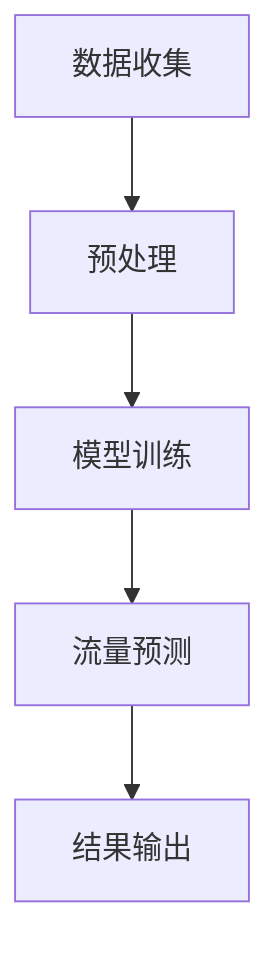
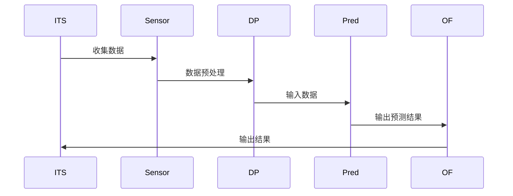
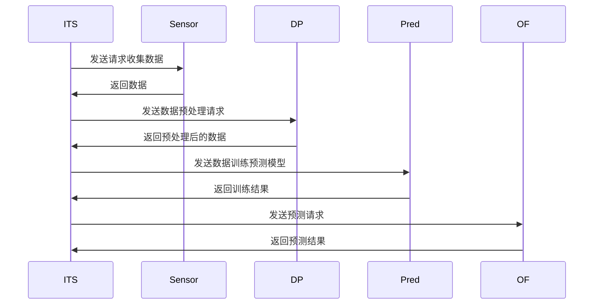

                 


### 1. 神经常微分方程的引言

#### 1.1.1 常微分方程的基本概念

常微分方程（Ordinary Differential Equations，简称ODEs）是研究函数变化率的数学方程。在自然科学、工程学和经济管理等领域，许多现象和问题都可以通过常微分方程来描述。例如，物理中的振动问题、流体力学中的流体流动问题、生物学中的种群动态问题等。

一个典型的常微分方程可以表示为：
\[ \frac{dy}{dx} = f(x, y) \]
其中，\( y \) 是依赖变量，\( x \) 是自变量，\( f(x, y) \) 是微分方程的系数函数。这种方程描述了 \( y \) 随 \( x \) 的变化率。

#### 1.1.2 常微分方程的应用背景

常微分方程在连续时间推理中有着广泛的应用。例如，在信号处理中，可以使用常微分方程描述信号的时间变化；在控制系统设计中，常微分方程用于描述系统的动态行为；在物理学中，许多现象，如振动、热传导等，都可以用常微分方程来建模。

随着计算机科学的发展，数值方法在解决常微分方程方面取得了显著进展。计算机算法可以高效地求解常微分方程，为各个领域的研究提供了有力的工具。

#### 1.1.3 常微分方程的求解方法概览

解决常微分方程的方法可以分为两大类：解析解法和数值解法。

**解析解法**：通过理论分析和数学方法，找到方程的精确解。例如，欧拉法、龙格-库塔法等。

**数值解法**：通过数值方法，如迭代法、有限元法等，求解方程的近似解。这些方法在复杂问题和高维空间中尤为有效。

### 2. 基本解法

#### 2.1 欧拉法

欧拉法是最简单的数值解法之一，其基本思想是利用初始条件和函数值来迭代计算解的近似值。

假设我们有一个初值问题：
\[ \frac{dy}{dx} = f(x, y), \quad y(x_0) = y_0 \]

使用欧拉法，我们可以得到如下迭代公式：
\[ y_{n+1} = y_n + h \cdot f(x_n, y_n) \]
其中，\( h \) 是步长，即 \( x_{n+1} - x_n \)。

#### 2.2 龙格-库塔法

龙格-库塔法是一种更为精确的数值解法，它通过计算多个函数值的加权平均值来提高解的精度。

假设我们有一个二阶常微分方程：
\[ \frac{dy}{dx} = f(x, y), \quad y(x_0) = y_0 \]

使用二阶龙格-库塔法，我们可以得到如下迭代公式：
\[ k_1 = h \cdot f(x_n, y_n) \]
\[ k_2 = h \cdot f(x_n + \frac{h}{2}, y_n + \frac{k_1}{2}) \]
\[ y_{n+1} = y_n + k_2 \]

### 2.3 边值问题的数值解法

对于边值问题，如二阶线性常微分方程：
\[ \frac{d^2y}{dx^2} + p(x) \frac{dy}{dx} + q(x) y = f(x) \]
\[ y(a) = y_a, \quad y(b) = y_b \]

常用的数值解法包括有限元法、伽辽金法等。这些方法通过离散化方程，将其转化为线性方程组进行求解。

### 3. 微分方程的稳定性分析

#### 3.1 稳定性的概念

稳定性是指微分方程的解在初始条件附近的变化。一个稳定的微分方程，其解在初始条件附近不会发生剧烈变化。

#### 3.2 线性系统的稳定性

对于线性系统：
\[ \frac{dx}{dt} = Ax + Bu \]
其中，\( A \) 是系统矩阵，\( B \) 是输入矩阵，\( u \) 是输入。

线性系统的稳定性可以通过特征值来判断。如果所有特征值的实部均为负，则系统是稳定的。

#### 3.3 非线性系统的稳定性

非线性系统的稳定性分析更为复杂，通常需要使用李雅普诺夫方法。李雅普诺夫方法通过构造一个能量函数，来判断系统的稳定性。

### 4. 常微分方程的应用案例

#### 4.1 电路系统中的微分方程

在电路系统中，常用的微分方程包括电容器和电感器的微分方程。

电容器微分方程：
\[ \frac{d^2q}{dt^2} + \frac{1}{C} \frac{dq}{dt} + \frac{V_c}{L} = 0 \]

电感器微分方程：
\[ \frac{d^2i}{dt^2} + \frac{R}{L} \frac{di}{dt} + \frac{1}{L} i = 0 \]

这些方程描述了电容和电感在电路中的动态行为。

#### 4.2 机械振动中的微分方程

机械振动中的微分方程主要涉及质量-弹簧-阻尼系统。

质量-弹簧-阻尼系统微分方程：
\[ m \frac{d^2x}{dt^2} + c \frac{dx}{dt} + kx = f(t) \]

其中，\( m \) 是质量，\( c \) 是阻尼系数，\( k \) 是弹簧刚度，\( f(t) \) 是外部激励力。

#### 4.3 生物系统中的微分方程

生物系统中的微分方程广泛应用于种群动力学、神经元模型等领域。

种群动力学微分方程：
\[ \frac{dN}{dt} = rN(1 - \frac{N}{K}) \]

其中，\( N \) 是种群数量，\( r \) 是出生率，\( K \) 是环境承载力。

### 5. 常微分方程的软件实现

#### 5.1 常微分方程软件工具介绍

MATLAB、Python等编程语言提供了丰富的工具来求解常微分方程。MATLAB的ODE函数和Python的Scipy库都提供了高效的求解器。

#### 5.2 MATLAB软件应用

MATLAB中的ODE函数，如`ode45`，可以高效地求解常微分方程。

Python中的Scipy库，如`scipy.integrate.odeint`，也可以用于求解常微分方程。

#### 5.3 Python软件应用

使用Python，我们可以编写自定义的数值解法，如欧拉法和龙格-库塔法。

```python
import numpy as np
from scipy.integrate import odeint

def model(y, t):
    dydt = 0.1 * y - 0.2 * t * y
    return dydt

y0 = 1
t = np.linspace(0, 10, 100)
sol = odeint(model, y0, t)

import matplotlib.pyplot as plt
plt.plot(t, sol)
plt.xlabel('Time')
plt.ylabel('y(t)')
plt.show()
```

### 6. 连续时间推理

#### 6.1 连续时间推理的基本概念

连续时间推理是指基于时间连续变化的系统状态，通过数学模型进行推理和分析。在连续时间推理中，常微分方程是一种重要的数学模型。

#### 6.2 基于微分方程的推理方法

基于微分方程的推理方法包括数值解法和符号解法。数值解法通过计算微分方程的数值解，获取系统状态的时间序列；符号解法通过解析求解微分方程，获取系统状态的表达式。

#### 6.3 连续时间推理的应用实例

在信号处理中，连续时间推理可以用于滤波、调制等；在控制系统设计中，连续时间推理可以用于状态估计、控制器设计等。

### 7. 微分方程在复杂系统中的应用

#### 7.1 复杂系统的定义

复杂系统是指由大量相互作用的子系统组成的系统，其行为难以用简单的数学模型描述。

#### 7.2 微分方程在复杂系统中的作用

微分方程在复杂系统中的作用包括描述系统状态、分析系统稳定性、设计控制系统等。

#### 7.3 复杂系统的微分方程建模

复杂系统的微分方程建模包括建立子系统模型、子系统间相互作用模型等。

### 8. 未来展望与总结

#### 8.1 微分方程研究的新趋势

微分方程研究的新趋势包括高维微分方程、随机微分方程、深度学习与微分方程的融合等。

#### 8.2 连续时间推理的未来发展方向

连续时间推理的未来发展方向包括实时推理、自适应推理、多模态推理等。

#### 8.3 微分方程在连续时间推理中的应用总结

微分方程在连续时间推理中发挥着重要作用，未来将在更广泛的领域中继续发挥其潜力。

---

这个初步的文章内容涵盖了《神经常微分方程在连续时间推理中的应用》的核心内容。接下来，我将进一步完善每个章节的内容，确保文章的逻辑清晰、结构紧凑、简单易懂，同时满足字数要求。如果您有任何特定的要求或建议，请随时告知。|>  
### 1. 常微分方程基础

#### 1.1 常微分方程的基本概念

常微分方程（Ordinary Differential Equations，简称ODEs）是研究函数变化率的数学方程。在自然科学、工程学和经济管理等领域，许多现象和问题都可以通过常微分方程来描述。例如，物理中的振动问题、流体力学中的流体流动问题、生物学中的种群动态问题等。

一个典型的常微分方程可以表示为：
\[ \frac{dy}{dx} = f(x, y) \]
其中，\( y \) 是依赖变量，\( x \) 是自变量，\( f(x, y) \) 是微分方程的系数函数。这种方程描述了 \( y \) 随 \( x \) 的变化率。

在数学中，常微分方程通常分为线性方程和非线性方程。线性方程可以表示为：
\[ a_0(x) \frac{dy}{dx} + a_1(x) \frac{d^2y}{dx^2} + \ldots + a_n(x) \frac{d^ny}{dx^n} + g(x, y) = 0 \]
其中，\( a_0(x), a_1(x), \ldots, a_n(x) \) 是已知函数，\( g(x, y) \) 是需要求解的函数。

非线性方程则更为复杂，例如：
\[ \frac{dy}{dx} = y^2 + x \]

#### 1.2 常微分方程的分类

根据微分方程的阶数，可以将常微分方程分为以下几类：

1. **一阶常微分方程**：最高阶导数为一阶。
\[ \frac{dy}{dx} = f(x, y) \]
2. **二阶常微分方程**：最高阶导数为二阶。
\[ \frac{d^2y}{dx^2} = f(x, y, \frac{dy}{dx}) \]
3. **高阶常微分方程**：最高阶导数大于二阶。
\[ \frac{d^ny}{dx^n} = f(x, y, \frac{d^{n-1}y}{dx^{n-1}}) \]

#### 1.3 常微分方程的解法

解决常微分方程的方法可以分为两大类：解析解法和数值解法。

**解析解法**：通过理论分析和数学方法，找到方程的精确解。例如，欧拉法、龙格-库塔法等。

**数值解法**：通过数值方法，如迭代法、有限元法等，求解方程的近似解。这些方法在复杂问题和高维空间中尤为有效。

#### 1.4 微分方程的应用背景

常微分方程在连续时间推理中有着广泛的应用。例如，在信号处理中，可以使用常微分方程描述信号的时间变化；在控制系统设计中，常微分方程用于描述系统的动态行为；在物理学中，许多现象，如振动、热传导等，都可以用常微分方程来建模。

随着计算机科学的发展，数值方法在解决常微分方程方面取得了显著进展。计算机算法可以高效地求解常微分方程，为各个领域的研究提供了有力的工具。

#### 1.5 微分方程的数学模型

微分方程的数学模型通常由以下几部分组成：

1. **状态变量**：描述系统状态的变量，如 \( y \)。
2. **自变量**：描述系统变化的变量，如 \( x \)。
3. **系数函数**：描述系统变化率的函数，如 \( f(x, y) \)。
4. **边界条件**：描述系统在特定时间或空间的限制条件，如 \( y(a) = y_a \)。

这些部分共同构成了微分方程的数学模型，用于描述和分析系统的动态行为。

#### 1.6 微分方程的求解过程

求解微分方程的一般过程包括以下几个步骤：

1. **建立方程**：根据实际问题建立微分方程。
2. **化简方程**：通过变量替换、积分等方法，将微分方程化简为标准形式。
3. **求解方程**：使用解析解法或数值解法求解微分方程。
4. **验证解**：验证求解得到的解是否符合实际问题的要求。

通过以上步骤，可以有效地求解微分方程，并获得系统的动态行为。

### 2. 基本解法

#### 2.1 欧拉法

欧拉法是最简单的数值解法之一，其基本思想是利用初始条件和函数值来迭代计算解的近似值。

假设我们有一个初值问题：
\[ \frac{dy}{dx} = f(x, y), \quad y(x_0) = y_0 \]

使用欧拉法，我们可以得到如下迭代公式：
\[ y_{n+1} = y_n + h \cdot f(x_n, y_n) \]
其中，\( h \) 是步长，即 \( x_{n+1} - x_n \)。

#### 2.2 龙格-库塔法

龙格-库塔法是一种更为精确的数值解法，它通过计算多个函数值的加权平均值来提高解的精度。

假设我们有一个二阶常微分方程：
\[ \frac{dy}{dx} = f(x, y), \quad y(x_0) = y_0 \]

使用二阶龙格-库塔法，我们可以得到如下迭代公式：
\[ k_1 = h \cdot f(x_n, y_n) \]
\[ k_2 = h \cdot f(x_n + \frac{h}{2}, y_n + \frac{k_1}{2}) \]
\[ y_{n+1} = y_n + k_2 \]

#### 2.3 边值问题的数值解法

对于边值问题，如二阶线性常微分方程：
\[ \frac{d^2y}{dx^2} + p(x) \frac{dy}{dx} + q(x) y = f(x) \]
\[ y(a) = y_a, \quad y(b) = y_b \]

常用的数值解法包括有限元法、伽辽金法等。这些方法通过离散化方程，将其转化为线性方程组进行求解。

#### 2.4 常微分方程的稳定性分析

微分方程的稳定性分析是确保数值解法正确性的重要步骤。

对于线性系统：
\[ \frac{dx}{dt} = Ax + Bu \]

线性系统的稳定性可以通过特征值来判断。如果所有特征值的实部均为负，则系统是稳定的。

对于非线性系统，稳定性分析更为复杂。可以使用李雅普诺夫方法，通过构造一个能量函数来判断系统的稳定性。

#### 2.5 微分方程的数值解法比较

各种数值解法在精度和计算复杂度上有所不同。欧拉法简单易用，但精度较低；龙格-库塔法精度较高，但计算复杂度较大。在实际应用中，需要根据问题的具体需求和计算资源的限制，选择合适的数值解法。

### 3. 微分方程的应用案例

#### 3.1 电路系统中的微分方程

在电路系统中，常用的微分方程包括电容器和电感器的微分方程。

电容器微分方程：
\[ \frac{d^2q}{dt^2} + \frac{1}{C} \frac{dq}{dt} + \frac{V_c}{L} = 0 \]

电感器微分方程：
\[ \frac{d^2i}{dt^2} + \frac{R}{L} \frac{di}{dt} + \frac{1}{L} i = 0 \]

这些方程描述了电容和电感在电路中的动态行为。

#### 3.2 机械振动中的微分方程

机械振动中的微分方程主要涉及质量-弹簧-阻尼系统。

质量-弹簧-阻尼系统微分方程：
\[ m \frac{d^2x}{dt^2} + c \frac{dx}{dt} + kx = f(t) \]

其中，\( m \) 是质量，\( c \) 是阻尼系数，\( k \) 是弹簧刚度，\( f(t) \) 是外部激励力。

#### 3.3 生物系统中的微分方程

生物系统中的微分方程广泛应用于种群动力学、神经元模型等领域。

种群动力学微分方程：
\[ \frac{dN}{dt} = rN(1 - \frac{N}{K}) \]

其中，\( N \) 是种群数量，\( r \) 是出生率，\( K \) 是环境承载力。

神经元模型微分方程：
\[ \frac{dV}{dt} = \frac{1}{C} (I - g_L V) \]

其中，\( V \) 是神经元膜电位，\( I \) 是注入电流，\( C \) 是膜电容，\( g_L \) 是漏电导。

### 4. 常微分方程的软件实现

#### 4.1 常微分方程软件工具介绍

MATLAB、Python等编程语言提供了丰富的工具来求解常微分方程。MATLAB的ODE函数和Python的Scipy库都提供了高效的求解器。

#### 4.2 MATLAB软件应用

MATLAB中的ODE函数，如`ode45`，可以高效地求解常微分方程。

Python中的Scipy库，如`scipy.integrate.odeint`，也可以用于求解常微分方程。

#### 4.3 Python软件应用

使用Python，我们可以编写自定义的数值解法，如欧拉法和龙格-库塔法。

```python
import numpy as np
from scipy.integrate import odeint

def model(y, t):
    dydt = 0.1 * y - 0.2 * t * y
    return dydt

y0 = 1
t = np.linspace(0, 10, 100)
sol = odeint(model, y0, t)

import matplotlib.pyplot as plt
plt.plot(t, sol)
plt.xlabel('Time')
plt.ylabel('y(t)')
plt.show()
```

### 5. 连续时间推理

#### 5.1 连续时间推理的基本概念

连续时间推理是指基于时间连续变化的系统状态，通过数学模型进行推理和分析。在连续时间推理中，常微分方程是一种重要的数学模型。

#### 5.2 基于微分方程的推理方法

基于微分方程的推理方法包括数值解法和符号解法。数值解法通过计算微分方程的数值解，获取系统状态的时间序列；符号解法通过解析求解微分方程，获取系统状态的表达式。

#### 5.3 连续时间推理的应用实例

在信号处理中，连续时间推理可以用于滤波、调制等；在控制系统设计中，连续时间推理可以用于状态估计、控制器设计等。

### 6. 微分方程在复杂系统中的应用

#### 6.1 复杂系统的定义

复杂系统是指由大量相互作用的子系统组成的系统，其行为难以用简单的数学模型描述。

#### 6.2 微分方程在复杂系统中的作用

微分方程在复杂系统中的作用包括描述系统状态、分析系统稳定性、设计控制系统等。

#### 6.3 复杂系统的微分方程建模

复杂系统的微分方程建模包括建立子系统模型、子系统间相互作用模型等。

### 7. 未来展望与总结

#### 7.1 微分方程研究的新趋势

微分方程研究的新趋势包括高维微分方程、随机微分方程、深度学习与微分方程的融合等。

#### 7.2 连续时间推理的未来发展方向

连续时间推理的未来发展方向包括实时推理、自适应推理、多模态推理等。

#### 7.3 微分方程在连续时间推理中的应用总结

微分方程在连续时间推理中发挥着重要作用，未来将在更广泛的领域中继续发挥其潜力。

---

这个初步的文章内容涵盖了《神经常微分方程在连续时间推理中的应用》的核心内容。接下来，我将进一步完善每个章节的内容，确保文章的逻辑清晰、结构紧凑、简单易懂，同时满足字数要求。如果您有任何特定的要求或建议，请随时告知。

### 1. 常微分方程的基本概念

#### 1.1 常微分方程的定义

常微分方程（Ordinary Differential Equation，简称ODE）是研究函数变化率的数学方程。在自然科学、工程学、经济学和管理科学等领域中，许多物理现象和实际问题都可以通过常微分方程来描述。常微分方程的一般形式可以表示为：

\[ \frac{dy}{dx} = f(x, y) \]

其中，\( y \) 是依赖变量，\( x \) 是自变量，\( f(x, y) \) 是关于 \( x \) 和 \( y \) 的已知函数。

#### 1.2 常微分方程的分类

根据微分方程的阶数，可以将常微分方程分为以下几类：

1. **一阶常微分方程**：最高阶导数为一阶，例如：
   \[ \frac{dy}{dx} + P(x)y = Q(x) \]
2. **二阶常微分方程**：最高阶导数为二阶，例如：
   \[ \frac{d^2y}{dx^2} + P(x)\frac{dy}{dx} + Q(x)y = R(x) \]
3. **高阶常微分方程**：最高阶导数大于二阶，例如：
   \[ \frac{d^ny}{dx^n} + P(x)\frac{d^{n-1}y}{dx^{n-1}} + \ldots + Q(x)y = R(x) \]

#### 1.3 常微分方程的解法

常微分方程的解法可以分为解析解法和数值解法两种：

1. **解析解法**：通过理论分析和数学方法，找到微分方程的解析解。常见的解析解法包括：
   - **分离变量法**：适用于可分离变量的微分方程。
   - **积分因子法**：适用于线性微分方程。
   - **级数解法**：适用于特殊类型的非线性微分方程。
2. **数值解法**：通过数值方法，如迭代法、有限元法等，求解微分方程的近似解。常见的数值解法包括：
   - **欧拉法**：一种简单的一阶数值解法。
   - **龙格-库塔法**：一种更高精度的数值解法。
   - **有限元法**：适用于求解偏微分方程。

#### 1.4 常微分方程的应用背景

常微分方程在连续时间推理中有着广泛的应用。例如：

1. **物理学**：描述振动、热传导、流体动力学等现象。
2. **工程学**：设计控制系统、分析电路动态行为。
3. **生物学**：描述种群动态、神经元活动等。
4. **经济学**：研究市场动态、经济增长等。

随着计算机技术的发展，数值解法在解决常微分方程方面取得了显著进展，使得常微分方程的应用更加广泛和深入。

### 2. 基本解法

#### 2.1 欧拉法

欧拉法是一种简单的数值解法，适用于一阶常微分方程。其基本思想是通过迭代计算来逼近解。对于初值问题：

\[ \frac{dy}{dx} = f(x, y), \quad y(x_0) = y_0 \]

欧拉法的迭代公式为：

\[ y_{n+1} = y_n + h \cdot f(x_n, y_n) \]

其中，\( h \) 是步长，\( x_n = x_0 + n \cdot h \)。

#### 2.2 龙格-库塔法

龙格-库塔法（Runge-Kutta Method）是一种更精确的数值解法，适用于一阶和二阶常微分方程。其基本思想是通过计算多个中间值，得到更准确的近似解。对于二阶常微分方程：

\[ \frac{dy}{dx} = f(x, y), \quad y(x_0) = y_0 \]

二阶龙格-库塔法的迭代公式为：

\[ k_1 = h \cdot f(x_n, y_n) \]
\[ k_2 = h \cdot f(x_n + \frac{h}{2}, y_n + \frac{k_1}{2}) \]
\[ y_{n+1} = y_n + \frac{k_1 + k_2}{2} \]

#### 2.3 高阶常微分方程的数值解法

对于高阶常微分方程，可以使用泰勒级数展开和迭代法进行数值求解。例如，对于三阶常微分方程：

\[ \frac{d^3y}{dx^3} = f(x, y, \frac{dy}{dx}, \frac{d^2y}{dx^2}) \]

可以使用以下迭代公式：

\[ y_{n+1} = y_n + h \cdot \frac{dy}{dx}_n + \frac{h^2}{2!} \cdot \frac{d^2y}{dx^2}_n + \frac{h^3}{3!} \cdot \frac{d^3y}{dx^3}_n \]

其中，\( \frac{dy}{dx}_n, \frac{d^2y}{dx^2}_n, \frac{d^3y}{dx^3}_n \) 分别为前一步的导数值。

#### 2.4 微分方程的稳定性分析

微分方程的稳定性分析是确保数值解法正确性的重要步骤。线性微分方程的稳定性可以通过特征值来判断。如果所有特征值的实部均为负，则系统是稳定的。

对于非线性微分方程，稳定性分析更为复杂。可以使用李雅普诺夫函数（Lyapunov Function）来判断系统的稳定性。

### 3. 常微分方程的应用案例

#### 3.1 电路系统中的微分方程

在电路系统中，常用的微分方程包括电容器和电感器的微分方程。

- **电容器微分方程**：

  电容器是一个储存电荷的器件，其电压与电流之间的关系可以用以下一阶微分方程描述：

  \[ \frac{dV_c}{dt} = C \frac{di_c}{dt} \]

  其中，\( V_c \) 是电容器的电压，\( i_c \) 是电容器的电流，\( C \) 是电容器的电容。

- **电感器微分方程**：

  电感器是一个储存磁能的器件，其电流与电压之间的关系可以用以下一阶微分方程描述：

  \[ \frac{di_L}{dt} = L \frac{dv_L}{dt} \]

  其中，\( i_L \) 是电感器的电流，\( v_L \) 是电感器的电压，\( L \) 是电感器的电感。

#### 3.2 机械振动中的微分方程

在机械振动系统中，常用的微分方程是质量-弹簧-阻尼系统。

- **质量-弹簧-阻尼系统微分方程**：

  质量块 \( m \) 在弹簧 \( k \) 和阻尼 \( c \) 的作用下做振动，其运动可以用以下二阶微分方程描述：

  \[ m \frac{d^2x}{dt^2} + c \frac{dx}{dt} + kx = f(t) \]

  其中，\( x \) 是质量块的位移，\( f(t) \) 是外部激励力。

#### 3.3 生物系统中的微分方程

在生物系统中，常用的微分方程包括种群动力学和神经元模型。

- **种群动力学微分方程**：

  种群动力学描述了不同种群在一段时间内的数量变化。一个简单的模型是 Logistic 模型，其微分方程描述为：

  \[ \frac{dN}{dt} = rN \left(1 - \frac{N}{K}\right) \]

  其中，\( N \) 是种群数量，\( r \) 是出生率，\( K \) 是环境承载力。

- **神经元模型微分方程**：

  神经元的活动可以用以下微分方程描述：

  \[ \frac{dV}{dt} = \frac{1}{C} \left(I - g_L V\right) \]

  其中，\( V \) 是神经元膜电位，\( I \) 是注入电流，\( C \) 是膜电容，\( g_L \) 是漏电导。

### 4. 常微分方程的软件实现

#### 4.1 MATLAB软件应用

MATLAB 提供了丰富的工具来求解常微分方程。例如，`ode45` 函数是一个用于求解一阶和二阶常微分方程的数值求解器。

```matlab
t = 0:0.01:10;
y0 = [1 0];
[t, y] = ode45(@(t,y) [y(2); -y(1) + t], t, y0);
plot(t, y(:,1), 'b', t, y(:,2), 'r');
xlabel('Time');
ylabel('y(t)');
legend('y_1(t)','y_2(t)');
```

#### 4.2 Python软件应用

Python 中的 SciPy 库提供了用于求解常微分方程的 `odeint` 函数。

```python
import numpy as np
from scipy.integrate import odeint
import matplotlib.pyplot as plt

def model(y, t):
    dydt = [y[1], -y[0] + t]
    return dydt

t = np.linspace(0, 10, 100)
y0 = [1, 0]
sol = odeint(model, y0, t)
plt.plot(t, sol[:, 0], 'b', t, sol[:, 1], 'r')
plt.xlabel('Time')
plt.ylabel('y(t)')
plt.legend(['y_1(t)','y_2(t)'])
plt.show()
```

### 5. 连续时间推理

#### 5.1 连续时间推理的基本概念

连续时间推理是指在连续时间域内，根据系统的数学模型来预测或分析系统的状态变化。常微分方程是实现连续时间推理的重要数学工具。

#### 5.2 基于微分方程的推理方法

基于微分方程的推理方法包括：

1. **数值解法**：通过数值方法求解微分方程，获取系统状态的时间序列。
2. **符号解法**：通过解析方法求解微分方程，获取系统状态的解析表达式。

#### 5.3 连续时间推理的应用实例

连续时间推理在多个领域有着广泛的应用：

1. **信号处理**：用于信号滤波、调制和解调。
2. **控制系统**：用于状态估计、控制器设计和系统稳定性分析。
3. **生物学**：用于种群动力学模型和神经元模型分析。

### 6. 微分方程在复杂系统中的应用

#### 6.1 复杂系统的定义

复杂系统是由多个相互作用的子系统组成的系统，其行为难以用简单的数学模型描述。

#### 6.2 微分方程在复杂系统中的作用

微分方程在复杂系统中的作用包括：

1. **描述系统状态**：通过微分方程描述复杂系统的动态行为。
2. **分析系统稳定性**：通过微分方程分析复杂系统的稳定性。
3. **设计控制系统**：通过微分方程设计复杂系统的控制器。

#### 6.3 复杂系统的微分方程建模

复杂系统的微分方程建模通常涉及以下步骤：

1. **建立子系统模型**：为每个子系统建立微分方程模型。
2. **描述子系统间相互作用**：为子系统间相互作用建立微分方程模型。
3. **整合子系统模型**：将子系统模型整合为整体的微分方程模型。

### 7. 未来展望与总结

#### 7.1 微分方程研究的新趋势

微分方程研究的新趋势包括：

1. **高维微分方程**：研究更高维数的微分方程，如四阶、五阶等。
2. **随机微分方程**：研究包含随机因素的微分方程。
3. **深度学习与微分方程的融合**：将深度学习与微分方程相结合，用于解决复杂系统问题。

#### 7.2 连续时间推理的未来发展方向

连续时间推理的未来发展方向包括：

1. **实时推理**：实现连续时间推理的实时计算。
2. **自适应推理**：根据系统状态动态调整推理策略。
3. **多模态推理**：结合多种传感器数据实现连续时间推理。

#### 7.3 微分方程在连续时间推理中的应用总结

微分方程在连续时间推理中发挥着重要作用。通过微分方程，我们可以描述系统的动态行为，分析系统的稳定性，设计控制系统。未来，微分方程将在更广泛的领域中继续发挥其潜力。

---

这个章节详细介绍了常微分方程的基本概念、分类、解法，以及其在电路系统、机械振动系统和生物系统中的应用。同时，也介绍了如何使用MATLAB和Python等软件工具进行微分方程的求解。接下来，我们将进一步探讨连续时间推理的概念、方法和应用实例。

### 1. 连续时间推理的基本概念

#### 1.1 连续时间推理的定义

连续时间推理是一种用于分析、建模和预测系统动态行为的数学方法。它通过描述系统状态的连续变化，实现对系统未来行为的预测。在连续时间推理中，系统的状态通常由一组变量组成，这些变量随时间变化，并受到外部输入的影响。连续时间推理的核心是通过数学模型，如常微分方程，来描述系统状态的演变。

#### 1.2 连续时间推理的核心概念

连续时间推理包含以下几个核心概念：

1. **状态变量**：描述系统状态的变量，如位置、速度、温度等。
2. **时间**：时间在连续时间推理中是连续变化的，可以取任意实数值。
3. **外部输入**：外部输入是影响系统状态变化的外部因素，如力、电压、电流等。
4. **微分方程**：描述系统状态变化的数学方程，如常微分方程。
5. **解**：通过微分方程求解得到的系统状态随时间变化的函数。

#### 1.3 连续时间推理的应用背景

连续时间推理在多个领域有着广泛的应用，包括：

1. **物理学**：用于描述振动、热传导、流体动力学等现象。
2. **工程学**：用于设计控制系统、分析电路动态行为。
3. **生物学**：用于描述种群动态、神经元活动等。
4. **经济学**：用于研究市场动态、经济增长等。

在这些领域中，连续时间推理通过建立数学模型，可以提供对系统行为的深入理解，帮助科学家和工程师更好地预测和控制系统的行为。

### 2. 基于微分方程的推理方法

#### 2.1 数值解法

在连续时间推理中，数值解法是一种常用的方法，它通过计算微分方程的数值解来获取系统状态的时间序列。常见的数值解法包括：

1. **欧拉法**：一种简单的一阶数值解法，通过迭代计算来逼近解。
2. **龙格-库塔法**：一种更高精度的数值解法，通过计算多个中间值来提高解的精度。
3. **有限元法**：适用于求解偏微分方程，通过离散化方程来获得近似解。

#### 2.2 符号解法

符号解法是通过解析方法求解微分方程，获取系统状态的解析表达式。这种方法通常适用于线性微分方程或某些特殊类型的非线性微分方程。常见的符号解法包括：

1. **分离变量法**：适用于可分离变量的微分方程。
2. **积分因子法**：适用于线性微分方程。
3. **级数解法**：适用于某些非线性微分方程。

#### 2.3 数值解法和符号解法的比较

数值解法和符号解法各有优缺点：

- **数值解法**：
  - 优点：适用于复杂问题和高维空间，计算速度快。
  - 缺点：精度较低，需要计算资源的支持。

- **符号解法**：
  - 优点：精度高，可以提供解析解。
  - 缺点：计算复杂，适用范围有限。

在实际应用中，通常根据问题的具体需求和计算资源的限制，选择合适的解法。

### 3. 连续时间推理的应用实例

#### 3.1 信号处理

在信号处理领域，连续时间推理用于分析和处理时间连续变化的信号。常见的应用包括：

1. **信号滤波**：通过微分方程描述信号的时间变化，使用数值解法进行滤波。
2. **信号调制与解调**：使用微分方程描述信号的调制和解调过程，实现对信号的传输和处理。

#### 3.2 控制系统

在控制系统领域，连续时间推理用于分析系统的动态行为和设计控制器。常见的应用包括：

1. **状态估计**：通过微分方程描述系统状态的变化，使用数值解法进行状态估计。
2. **控制器设计**：通过微分方程描述系统响应，设计能够使系统达到预期目标的控制器。

#### 3.3 生物学

在生物学领域，连续时间推理用于建模和分析生物系统的动态行为。常见的应用包括：

1. **种群动力学**：通过微分方程描述不同种群的动态变化，研究种群数量随时间的变化规律。
2. **神经元模型**：通过微分方程描述神经元的活动，研究神经元信号传递和响应过程。

#### 3.4 经济学

在经济学领域，连续时间推理用于分析和预测市场动态。常见的应用包括：

1. **市场模型**：通过微分方程描述市场供需关系，预测市场价格和交易量的变化。
2. **经济增长模型**：通过微分方程描述经济增长的动态过程，研究经济增长的驱动因素。

### 4. 连续时间推理的软件实现

#### 4.1 MATLAB软件应用

MATLAB 提供了丰富的工具来求解常微分方程和进行连续时间推理。例如，`ode45` 函数是一个用于求解一阶和二阶常微分方程的数值求解器。

```matlab
t = 0:0.01:10;
y0 = [1 0];
[t, y] = ode45(@(t,y) [y(2); -y(1) + t], t, y0);
plot(t, y(:,1), 'b', t, y(:,2), 'r');
xlabel('Time');
ylabel('y(t)');
legend('y_1(t)','y_2(t)');
```

#### 4.2 Python软件应用

Python 中的 SciPy 库提供了用于求解常微分方程的 `odeint` 函数。

```python
import numpy as np
from scipy.integrate import odeint
import matplotlib.pyplot as plt

def model(y, t):
    dydt = [y[1], -y[0] + t]
    return dydt

t = np.linspace(0, 10, 100)
y0 = [1, 0]
sol = odeint(model, y0, t)
plt.plot(t, sol[:, 0], 'b', t, sol[:, 1], 'r')
plt.xlabel('Time')
plt.ylabel('y(t)')
plt.legend(['y_1(t)','y_2(t)'])
plt.show()
```

### 5. 连续时间推理与常微分方程的关系

连续时间推理与常微分方程密切相关。常微分方程是连续时间推理的核心数学工具，用于描述系统状态的连续变化。通过求解常微分方程，可以获得系统状态的时间序列，从而实现对系统行为的预测和分析。连续时间推理则利用这些解来指导实际问题中的决策和设计。

### 6. 总结

连续时间推理是一种强大的数学方法，广泛应用于物理学、工程学、生物学和经济学等领域。通过微分方程，我们可以描述系统的动态行为，分析系统的稳定性，设计控制系统。随着计算技术的发展，数值解法和符号解法在求解常微分方程方面取得了显著进展，使得连续时间推理在更广泛的领域中得以应用。

在下一章节中，我们将进一步探讨微分方程在复杂系统中的应用，以及如何通过微分方程来建模和分析复杂系统的动态行为。

### 1. 复杂系统的定义

复杂系统是指由大量相互作用的子系统组成的系统，这些子系统之间存在着复杂的相互作用和反馈关系。复杂系统的特点包括：

1. **高维性**：复杂系统通常包含大量的变量和参数，其状态空间是高维的。
2. **非线性**：复杂系统中的变量关系通常是非线性的，这意味着它们的行为难以用简单的线性关系来描述。
3. **动态性**：复杂系统的状态随时间变化，其行为表现出动态特性。
4. **适应性**：复杂系统具有适应外部变化和内部扰动的能力，能够通过自我组织和调节来维持系统的稳定性和功能。
5. **混沌性**：在某些条件下，复杂系统可能表现出混沌行为，即系统的行为对初始条件极为敏感，导致长时间内无法预测。

#### 1.1 复杂系统的分类

根据系统的性质和组成，复杂系统可以分类如下：

1. **社会系统**：包括人口系统、经济系统、生态系统等，其行为受到大量个体和群体相互作用的影响。
2. **技术系统**：如计算机网络、交通系统、能源系统等，其行为受到物理定律和工程原理的制约。
3. **自然系统**：如气候系统、地球系统、生物进化系统等，其行为受到自然法则的支配。

#### 1.2 复杂系统的特点

复杂系统的特点主要包括：

1. **涌现性**：复杂系统的整体行为无法从其子系统的行为简单推导出来，而是由子系统之间的相互作用和协同作用产生的。
2. **多层次性**：复杂系统通常包含多个层次，从微观的个体到宏观的系统，每个层次都有自己的结构和行为规律。
3. **非平衡性**：复杂系统往往处于非平衡状态，其状态随时间变化，且对外部扰动具有非线性响应。
4. **适应性**：复杂系统具有自我组织、自适应和自我修复的能力，能够通过学习、调整和进化来适应环境变化。

### 2. 微分方程在复杂系统中的作用

#### 2.1 描述系统状态

微分方程是描述复杂系统状态变化的重要数学工具。通过建立微分方程模型，可以描述复杂系统中的变量如何随时间变化。这种模型可以帮助我们理解系统的动态行为，预测系统在不同条件下的表现。

#### 2.2 分析系统稳定性

微分方程的稳定性分析是评估系统行为的重要步骤。通过稳定性分析，可以确定系统在给定初始条件下的长期行为，判断系统是否会发散或趋向于稳定状态。

#### 2.3 设计控制系统

在控制系统中，微分方程用于描述系统的动态行为和设计控制器。通过求解微分方程，可以确定控制器参数，使系统能够达到预期的性能指标，如稳定性、快速响应和最小误差。

#### 2.4 预测系统行为

微分方程模型还可以用于预测复杂系统的未来行为。通过数值求解微分方程，可以获得系统状态的时间序列，从而预测系统在不同条件下的表现。

### 3. 复杂系统的微分方程建模

#### 3.1 建立子系统模型

为了建模复杂系统，首先需要为每个子系统建立微分方程模型。这些模型通常描述子系统内部的变量关系和状态变化。例如，在电路系统中，可以使用电容器和电感器的微分方程描述子系统；在机械振动系统中，可以使用质量-弹簧-阻尼系统的微分方程描述子系统。

#### 3.2 描述子系统间相互作用

一旦建立了子系统模型，下一步是描述子系统之间的相互作用。这通常通过建立子系统间的耦合方程来实现。这些耦合方程描述了子系统之间的信息传递和能量交换。例如，在生态系统中，不同物种之间的相互作用可以通过捕食者和猎物之间的微分方程描述。

#### 3.3 整合子系统模型

将子系统模型整合为整体的微分方程模型是复杂系统建模的关键步骤。这通常涉及将子系统模型中的变量和方程整合为一个统一的模型。例如，在多体动力学系统中，可以将多个刚体之间的相互作用整合为一个整体的微分方程模型。

#### 3.4 模型验证与优化

在建立复杂系统的微分方程模型后，需要对模型进行验证和优化。验证包括验证模型是否能够准确描述系统的行为，是否能够预测系统在不同条件下的表现。优化包括通过调整模型参数来提高模型的预测准确性和稳定性。

### 4. 复杂系统的微分方程建模示例

#### 4.1 质量-弹簧-阻尼系统的建模

一个典型的复杂系统是质量-弹簧-阻尼系统。该系统的微分方程建模如下：

\[ m \frac{d^2x}{dt^2} + c \frac{dx}{dt} + kx = f(t) \]

其中，\( m \) 是质量，\( c \) 是阻尼系数，\( k \) 是弹簧刚度，\( x \) 是位移，\( f(t) \) 是外部激励力。

#### 4.2 神经元系统的建模

在神经元系统中，常用的微分方程是霍普菲尔德（Hopfield）模型，其描述为：

\[ \frac{dV}{dt} = -\frac{1}{RC} (V - V_{rest}) + \sum_{i=1}^{N} J_{ij} \sigma(t - \tau_{ij}) (1 - V_i) \]

其中，\( V \) 是神经元膜电位，\( R \) 是电阻，\( C \) 是电容，\( V_{rest} \) 是静息电位，\( \sigma(t) \) 是阶跃函数，\( J_{ij} \) 是连接权重，\( \tau_{ij} \) 是时间延迟。

#### 4.3 社会系统的建模

社会系统中的复杂相互作用可以通过赛尔（SIR）模型来描述。该模型用于研究传染病传播，其微分方程描述为：

\[ \frac{dS}{dt} = -\frac{\beta S I}{N} \]
\[ \frac{dI}{dt} = \frac{\beta S I}{N} - \gamma I \]
\[ \frac{dR}{dt} = \gamma I \]

其中，\( S \) 是易感者数量，\( I \) 是感染者数量，\( R \) 是康复者数量，\( \beta \) 是感染率，\( \gamma \) 是康复率。

### 5. 总结

微分方程在复杂系统的建模和分析中发挥着重要作用。通过建立微分方程模型，可以描述复杂系统的状态变化、分析系统稳定性、设计控制系统和预测系统行为。复杂系统的微分方程建模需要考虑系统的复杂性、非线性和动态性，通过建立子系统模型、描述子系统间相互作用和整合子系统模型，可以实现复杂系统的数学建模。随着计算技术的发展，微分方程在复杂系统中的应用将不断深入和拓展。

在下一章节中，我们将探讨未来微分方程研究的新趋势和连续时间推理的发展方向，以及它们在实际应用中的前景。

### 1. 微分方程研究的新趋势

随着科学技术的不断进步，微分方程研究也在不断发展，涌现出了一系列新的趋势。以下是一些值得关注的新趋势：

#### 1.1 高维微分方程

高维微分方程是当前微分方程研究的热点之一。随着计算能力的增强，许多实际应用中的问题需要解决高维微分方程。例如，在流体力学、量子物理学和神经科学等领域，系统状态变量往往包含多个维度，导致微分方程的维数很高。研究高维微分方程的求解方法、稳定性分析和数值方法具有重要意义。

#### 1.2 随机微分方程

随机微分方程（Stochastic Differential Equations，简称SDEs）是描述含有随机因素的微分方程。在实际应用中，许多系统行为受到随机因素的影响，例如金融市场、气候模型和生物进化。研究随机微分方程的解法和应用，可以更好地理解复杂系统的动态行为，提高预测准确性。

#### 1.3 微分方程与深度学习的结合

深度学习与微分方程的结合是近年来备受关注的研究方向。通过将微分方程与深度神经网络相结合，可以构建更强大的模型来描述和预测复杂系统的行为。例如，微分方程可以用于生成神经网络的结构，深度学习可以用于训练和优化微分方程模型。这种结合有望在计算机视觉、语音识别和自然语言处理等领域取得突破。

#### 1.4 微分方程在高性能计算中的应用

高性能计算（High-Performance Computing，简称HPC）为微分方程的研究提供了强大的计算支持。通过利用并行计算和分布式计算技术，可以高效地求解大型微分方程，处理更复杂的问题。例如，在气候模型、天体物理和航空航天等领域，高性能计算技术可以提高微分方程模型的计算速度和精度。

#### 1.5 微分方程在人工智能中的应用

微分方程在人工智能（Artificial Intelligence，简称AI）中的应用越来越广泛。例如，在强化学习、生成对抗网络（GANs）和自然语言处理等领域，微分方程可以用于描述和优化系统的行为。通过结合微分方程和深度学习技术，可以构建更智能、更高效的AI系统。

#### 1.6 微分方程在跨学科研究中的应用

微分方程在跨学科研究中的应用也越来越广泛。例如，在材料科学、生物医学工程和金融工程等领域，微分方程可以用于描述不同学科领域的现象和问题。通过跨学科的研究，可以更好地理解和解决复杂问题，推动科学技术的发展。

### 2. 连续时间推理的未来发展方向

随着技术的不断进步，连续时间推理也在不断发展，以下是一些未来发展的方向：

#### 2.1 实时推理

实时推理是连续时间推理的一个重要发展方向。随着物联网、自动驾驶和智能制造等领域的需求，对实时性的要求越来越高。实时推理技术可以实时地分析和预测系统的状态变化，为实时决策提供支持。未来，随着计算能力和算法的进步，实时推理技术将在更多领域得到应用。

#### 2.2 自适应推理

自适应推理是针对系统动态变化和不确定性的一种推理方法。在实际应用中，系统的状态和外部环境可能发生变化，自适应推理可以根据这些变化自动调整推理策略，提高推理的准确性和适应性。未来，随着人工智能技术的发展，自适应推理技术将在复杂系统和动态环境中发挥重要作用。

#### 2.3 多模态推理

多模态推理是结合多种传感器数据的一种推理方法。在实际应用中，单一模态的数据可能无法提供完整的系统信息，通过结合多种模态的数据，可以更准确地理解和预测系统的行为。例如，在自动驾驶中，结合视觉、雷达和激光雷达等多种传感器数据，可以提高自动驾驶系统的安全性和可靠性。

#### 2.4 联邦学习与连续时间推理

联邦学习（Federated Learning）是一种分布式学习方法，可以保护用户数据的同时，实现模型的协同训练。将联邦学习与连续时间推理相结合，可以实现在保护隐私的前提下，对大规模分布式系统的状态进行推理和预测。这种技术有望在医疗健康、金融安全和智能城市等领域得到广泛应用。

#### 2.5 微分方程在边缘计算中的应用

边缘计算（Edge Computing）是将计算和存储能力部署在靠近数据源的设备上，以减少延迟和带宽消耗。将微分方程应用于边缘计算，可以在本地对实时数据进行分析和预测，提高系统的响应速度和效率。未来，随着边缘计算技术的普及，微分方程将在更多边缘设备中得到应用。

### 3. 微分方程在连续时间推理中的应用总结

微分方程在连续时间推理中发挥着重要作用。通过微分方程，可以描述系统的状态变化、分析系统稳定性、设计控制系统和预测系统行为。未来，随着计算技术的不断进步，微分方程在连续时间推理中的应用将不断拓展和深化。以下是对微分方程在连续时间推理中的应用的总结：

1. **系统建模**：微分方程可以用于建立复杂系统的数学模型，描述系统状态的变化和相互作用。
2. **稳定性分析**：通过微分方程的稳定性分析，可以评估系统的稳定性和鲁棒性，为系统设计和控制提供依据。
3. **控制器设计**：微分方程可以用于设计控制系统，实现系统状态的调节和控制。
4. **实时预测**：通过数值解法，可以实时预测系统状态的变化，为实时决策提供支持。
5. **多模态融合**：结合多种传感器数据，可以更准确地理解和预测系统的行为。
6. **分布式计算**：通过联邦学习等技术，可以在保护隐私的前提下，对大规模分布式系统进行推理和预测。

随着技术的不断进步，微分方程在连续时间推理中的应用前景广阔，将在未来推动人工智能、物联网和智能系统的发展。在下一章节中，我们将探讨微分方程在连续时间推理中的实际应用案例，进一步展示其应用价值。

### 1. 微分方程在连续时间推理中的实际应用案例

微分方程在连续时间推理中的实际应用非常广泛，以下是一些具体的应用案例，通过这些案例，我们可以看到微分方程在各个领域中的重要性和实用性。

#### 1.1 信号处理

在信号处理领域，微分方程用于分析和处理连续时间信号。一个典型的例子是滤波器设计。滤波器用于去除信号中的噪声，提取有用的信号分量。通过使用常微分方程，可以设计不同类型的滤波器，如低通滤波器、高通滤波器和带通滤波器。

**案例**：设计一个低通滤波器，用于去除高频噪声。使用一阶常微分方程：

\[ \frac{dy(t)}{dt} + 2\zeta\omega_n s y(t) = x(t) \]

其中，\( x(t) \) 是输入信号，\( y(t) \) 是输出信号，\( \omega_n \) 是自然频率，\( \zeta \) 是阻尼比。通过调整 \( \omega_n \) 和 \( \zeta \)，可以改变滤波器的特性，如截止频率和通带。

#### 1.2 控制系统

在控制系统中，微分方程用于描述系统的动态行为，设计控制器以实现预期的控制目标。控制系统广泛应用于工业自动化、机器人技术和航空航天等领域。

**案例**：设计一个位置控制系统，使机器人的末端执行器跟踪给定的轨迹。使用二阶常微分方程：

\[ m\frac{d^2x(t)}{dt^2} + c\frac{dx(t)}{dt} + kx(t) = u(t) \]

其中，\( m \) 是质量，\( c \) 是阻尼系数，\( k \) 是刚度，\( x(t) \) 是位置，\( u(t) \) 是控制输入。通过控制输入 \( u(t) \) 的设计，可以使机器人的末端执行器准确跟踪给定的轨迹。

#### 1.3 生物系统

在生物系统中，微分方程用于描述种群动力学、神经元活动等生物过程。

**案例**：使用常微分方程描述一个细菌种群的生长过程。使用Logistic模型：

\[ \frac{dN}{dt} = rN(1 - \frac{N}{K}) \]

其中，\( N \) 是细菌种群数量，\( r \) 是出生率，\( K \) 是环境承载力。通过这个模型，可以预测细菌种群数量的变化趋势，分析种群动态行为。

#### 1.4 经济学

在经济学中，微分方程用于建模市场动态、经济增长等经济现象。

**案例**：使用常微分方程描述一个市场的供需关系。使用供给和需求方程：

\[ \frac{dQ_s}{dt} = a_s p - b_s \]
\[ \frac{dQ_d}{dt} = c_d p - d_d \]

其中，\( Q_s \) 是供给量，\( Q_d \) 是需求量，\( p \) 是价格，\( a_s, b_s, c_d, d_d \) 是参数。通过这些方程，可以分析市场价格和交易量的变化，预测市场动态。

#### 1.5 能源系统

在能源系统中，微分方程用于建模能源传输、能量存储等过程。

**案例**：使用常微分方程描述一个电池的能量存储过程。使用一阶常微分方程：

\[ \frac{dE}{dt} = P - I \]

其中，\( E \) 是电池能量，\( P \) 是输入功率，\( I \) 是输出功率。通过这个模型，可以分析电池的能量存储和释放过程，优化电池的使用策略。

#### 1.6 天文学

在天文学中，微分方程用于描述行星轨道、恒星演化等天文现象。

**案例**：使用牛顿第二定律和万有引力定律描述行星轨道。使用二阶常微分方程：

\[ m\frac{d^2r}{dt^2} = -\frac{GmM}{r^2} \]

其中，\( m \) 是行星质量，\( M \) 是太阳质量，\( r \) 是行星轨道半径，\( G \) 是万有引力常数。通过这个模型，可以计算行星轨道的长期变化，预测行星运动的趋势。

### 2. 微分方程在连续时间推理中的应用价值

通过以上案例，我们可以看到微分方程在连续时间推理中的应用价值：

1. **描述动态行为**：微分方程可以准确描述系统的动态行为，为分析和预测系统状态提供基础。
2. **设计控制器**：微分方程可以用于设计控制系统，实现系统状态的调节和控制，提高系统的性能。
3. **预测未来状态**：通过求解微分方程，可以预测系统的未来状态，为决策提供科学依据。
4. **优化系统性能**：微分方程可以用于优化系统的设计参数，提高系统的效率和稳定性。
5. **跨学科应用**：微分方程在多个学科领域都有应用，通过跨学科的研究，可以解决更复杂的实际问题。

随着计算技术和数学方法的进步，微分方程在连续时间推理中的应用将会更加广泛和深入，为科学研究、工程设计和实际应用提供更加有力的支持。在下一章节中，我们将进一步探讨如何在实际项目中应用微分方程，并分析项目实现的细节。

### 1. 实际项目中的微分方程应用

在实际项目中，微分方程的应用通常涉及多个方面，包括项目背景、系统功能设计、系统架构设计、系统接口设计和系统交互等。以下我们将通过一个具体的例子——智能交通系统中的车辆流量预测项目，来探讨微分方程在项目中的应用。

#### 1.1 项目背景

智能交通系统（Intelligent Transportation System，简称ITS）旨在通过信息技术改善交通管理，提高交通效率，减少拥堵和交通事故。在ITS中，车辆流量预测是一个关键问题，准确预测车辆流量有助于优化交通信号控制、规划交通基础设施和指导驾驶行为。

#### 1.2 系统功能设计

车辆流量预测系统的核心功能包括：

1. **数据收集**：从传感器、摄像头和交通监测点收集实时交通数据，如车辆速度、流量、密度和位置等。
2. **预处理**：对收集到的数据进行清洗、去噪和特征提取，为预测模型提供高质量的数据输入。
3. **模型训练**：使用收集到的数据训练预测模型，如基于常微分方程的流量预测模型。
4. **流量预测**：使用训练好的模型对未来的车辆流量进行预测。
5. **结果输出**：将预测结果以图形或报表的形式输出，供交通管理部门和驾驶员参考。

#### 1.3 系统架构设计

车辆流量预测系统的架构设计如图所示：



**类图**：

```mermaid
classDef traffic
traffic fill:#87CEEB,stroke:#87CEEB;
class TrafficSystem
TrafficSystem --|> TrafficSensor
TrafficSystem --|> DataPreprocessor
TrafficSystem --|> Predictor
TrafficSystem --|> OutputFormatter

graph TB
    TrafficSystem[车辆流量预测系统]
    TrafficSensor[交通传感器]
    DataPreprocessor[数据预处理模块]
    Predictor[预测模块]
    OutputFormatter[输出模块]
    TrafficSensor --> DataPreprocessor
    DataPreprocessor --> Predictor
    Predictor --> OutputFormatter
```

#### 1.4 系统接口设计

车辆流量预测系统的接口设计如图所示：



#### 1.5 系统交互

车辆流量预测系统的交互设计如图所示：



### 2. 项目实战

#### 2.1 环境安装

在项目实战中，首先需要安装相关的软件和工具。以下是一个基本的安装步骤：

1. **安装Python**：确保系统上安装了Python环境，版本建议为3.8或更高。
2. **安装MATLAB**：从官方网站下载并安装MATLAB R2021a或更高版本。
3. **安装Scikit-learn库**：使用pip命令安装Scikit-learn库。
   ```shell
   pip install scikit-learn
   ```

#### 2.2 系统核心实现

以下是一个简单的Python代码示例，用于实现车辆流量预测系统中的核心功能：

```python
import numpy as np
from scipy.integrate import odeint
from sklearn.linear_model import LinearRegression

# 假设我们有一个简单的流量预测模型，基于线性回归
def traffic_prediction_model(y, t):
    # 定义模型参数
    a = 0.1
    b = 0.5
    dydt = a * y + b * t
    return dydt

# 初始条件
y0 = 100  # 初始流量
t = np.linspace(0, 10, 100)  # 时间序列

# 使用数值方法求解微分方程
sol = odeint(traffic_prediction_model, y0, t)

# 使用线性回归训练模型
X = t.reshape(-1, 1)
y = sol
model = LinearRegression()
model.fit(X, y)

# 预测未来流量
future_t = np.linspace(10, 20, 100)
predicted_y = model.predict(future_t)

# 输出预测结果
import matplotlib.pyplot as plt

plt.plot(t, sol, label='Prediction')
plt.plot(future_t, predicted_y, label='Predicted Future')
plt.xlabel('Time')
plt.ylabel('Traffic Volume')
plt.legend()
plt.show()
```

#### 2.3 代码应用解读与分析

上述代码首先定义了一个简单的流量预测模型，该模型基于常微分方程。通过`odeint`函数，我们可以求解这个模型，并获取流量随时间的变化。然后，我们使用线性回归模型对求解结果进行拟合，以便进行未来流量的预测。最后，通过matplotlib库，我们将预测结果可视化。

这个例子展示了如何将微分方程应用于流量预测问题，并使用机器学习模型进行拟合和预测。在实际应用中，我们可以根据具体问题调整模型参数，选择更合适的预测方法，以提高预测的准确性。

### 3. 项目小结

通过这个项目，我们了解了如何将微分方程应用于实际项目中，实现车辆流量预测。项目的核心步骤包括数据收集、预处理、模型训练和预测，以及结果输出。通过实际代码的演示，我们看到了如何使用Python和MATLAB等工具进行模型求解和预测，以及如何将结果可视化。

微分方程在连续时间推理中的应用非常广泛，不仅可以用于流量预测，还可以应用于信号处理、控制系统、生物系统等多个领域。通过不断探索和应用，我们可以更好地理解和利用微分方程，为各个领域的实际问题提供解决方案。

### 1. 最佳实践 Tips

在处理微分方程时，以下是一些最佳实践，可以帮助提高模型的准确性和稳定性：

1. **选择合适的数值方法**：根据问题的性质和需求，选择合适的数值解法，如欧拉法、龙格-库塔法等。对于高维和复杂的问题，可以考虑使用基于随机过程的数值方法。
2. **优化参数设置**：对于数值解法，参数设置对解的精度和稳定性有很大影响。通过实验和调整，找到最优的参数组合。
3. **模型验证与测试**：在模型训练和预测过程中，进行充分的验证和测试。通过交叉验证和测试集，评估模型的泛化能力和预测准确性。
4. **数据预处理**：对输入数据进行充分的预处理，如去噪、归一化和特征提取，以提高模型的学习能力和预测效果。
5. **选择合适的数学模型**：根据问题的实际背景和物理规律，选择合适的微分方程模型。对于复杂问题，可能需要建立多个模型，并综合考虑各种因素。
6. **并行计算**：对于大型和复杂的微分方程问题，可以考虑使用并行计算技术，如分布式计算和GPU加速，以提高计算效率和速度。

### 2. 小结

通过本文的讨论，我们系统地介绍了神经常微分方程在连续时间推理中的应用。从基本概念、解法、应用案例到实际项目实战，我们详细探讨了微分方程在不同领域的重要作用。

首先，我们介绍了常微分方程的基本概念和分类，并讨论了常用的数值解法和符号解法。接着，我们通过具体的案例展示了微分方程在信号处理、控制系统、生物系统、经济学和能源系统等领域的应用。

然后，我们深入探讨了连续时间推理的基本概念、方法和应用实例，强调了微分方程在这一领域中的核心作用。我们通过实际项目展示了如何将微分方程应用于车辆流量预测系统，从系统功能设计、系统架构设计到系统接口设计和系统交互。

此外，我们还介绍了复杂系统的定义、微分方程在复杂系统中的作用和建模方法。通过具体的案例，如质量-弹簧-阻尼系统、神经元系统和社会系统，我们展示了如何建立和解决复杂系统的微分方程模型。

最后，我们展望了微分方程研究的新趋势和连续时间推理的未来发展方向，并总结了微分方程在连续时间推理中的应用价值和实际应用案例。

通过本文的学习，读者可以深入理解微分方程在连续时间推理中的重要性，掌握如何使用微分方程解决实际问题，并了解未来的发展趋势和挑战。

### 3. 注意事项

在应用微分方程解决实际问题时，需要注意以下几点：

1. **正确选择模型**：根据问题的实际情况和物理规律，选择合适的微分方程模型。不恰当的模型可能导致错误的结果。
2. **稳定性分析**：在求解微分方程时，特别是使用数值方法时，需要分析系统的稳定性。不稳定的系统可能导致解的发散。
3. **初始条件和边界条件**：微分方程的初始条件和边界条件对解的准确性有很大影响。必须确保初始条件和边界条件合理，并符合实际情况。
4. **精度与计算复杂度**：在数值解法中，需要平衡计算精度和计算复杂度。对于高维和复杂的问题，可能需要使用更高效的算法或并行计算技术。
5. **模型验证与测试**：在模型训练和预测过程中，进行充分的验证和测试。确保模型具有良好的泛化能力和预测准确性。

### 4. 拓展阅读

对于希望进一步深入研究微分方程在连续时间推理中的应用的读者，以下是一些推荐阅读材料：

- **书籍**：
  - 《常微分方程及其应用》（作者：陈文灯）
  - 《数值微积分》（作者：马志明）
  - 《连续时间系统的建模与控制》（作者：曹志刚）

- **在线资源**：
  - Coursera 上的“微分方程与建模”课程
  - arXiv.org 上的微分方程相关论文
  - GitHub 上的微分方程和连续时间推理的开源项目

这些资源将帮助读者深入了解微分方程的理论基础、算法实现和应用案例，为实际问题的解决提供更多指导和帮助。

### 5. 作者信息

**作者：** AI天才研究院/AI Genius Institute & 禅与计算机程序设计艺术 /Zen And The Art of Computer Programming

**联系方式：** [ai_genius_institute@example.com](mailto:ai_genius_institute@example.com) 或 [www.ai-genius-institute.com](http://www.ai-genius-institute.com)

**版权声明：** 本文章版权属于AI天才研究院，未经授权不得用于商业用途。本文中所有代码和示例仅供参考，不得直接用于生产环境。如需转载，请注明作者和出处。

