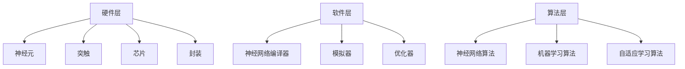
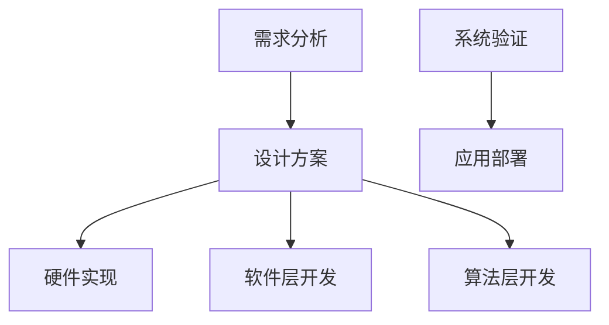

                 


## 神经形态工程在AI硬件中的应用

### 关键词

神经形态工程，AI硬件，神经网络，深度学习，边缘计算，人工智能加速

### 摘要

神经形态工程是一种模仿生物神经系统结构和功能的人工智能技术，其在AI硬件中的应用日益受到关注。本文将系统地介绍神经形态工程的背景、核心概念、基本原理及其在神经网络、深度学习和边缘计算中的具体应用，并探讨其未来的发展趋势与挑战。通过分析神经形态硬件的设计方法、架构设计以及实际应用案例，我们希望能够为读者提供一个全面、深入的视角来理解神经形态工程在AI硬件中的重要性和潜力。

### 目录大纲

```markdown
# 神经形态工程在AI硬件中的应用

## 第一部分：神经形态工程概述

### 第1章：神经形态工程背景与核心概念

#### 1.1 问题背景与历史发展

#### 1.2 神经形态工程的概念定义

#### 1.3 神经形态工程的目标与价值

#### 1.4 神经形态工程的应用领域

### 第2章：神经形态硬件的基本原理

#### 2.1 神经元模型与计算原理

#### 2.2 神经突触模型与计算原理

#### 2.3 神经形态硬件的设计方法

### 第3章：神经形态硬件的架构设计

#### 3.1 神经形态硬件的层次结构

#### 3.2 神经形态硬件的关键技术

#### 3.3 神经形态硬件的架构设计与实现

## 第二部分：神经形态工程在AI硬件中的应用

### 第4章：神经形态计算在神经网络中的应用

#### 4.1 神经形态计算与神经网络的关系

#### 4.2 神经形态神经网络的基本原理

#### 4.3 神经形态神经网络的性能优势

### 第5章：神经形态硬件在深度学习中的应用

#### 5.1 深度学习中的神经形态硬件需求

#### 5.2 神经形态硬件在深度学习中的应用案例

#### 5.3 神经形态硬件在深度学习中的挑战与解决方案

### 第6章：神经形态工程在边缘计算中的应用

#### 6.1 边缘计算的需求与挑战

#### 6.2 神经形态工程在边缘计算中的应用前景

#### 6.3 神经形态工程在边缘计算中的实现方法

### 第7章：神经形态工程的未来发展趋势与挑战

#### 7.1 神经形态工程的未来发展方向

#### 7.2 神经形态工程面临的挑战与机遇

#### 7.3 神经形态工程的发展策略与建议
```

### 第一部分：神经形态工程概述

#### 第1章：神经形态工程背景与核心概念

##### 1.1 问题背景与历史发展

神经形态工程（Neuromorphic Engineering）起源于20世纪80年代，是人工智能与神经科学交叉融合的产物。随着计算机性能的不断提升，传统硅基计算机在面对复杂计算任务时逐渐暴露出能耗高、速度慢等问题。生物神经系统的自适应性和高效性激发了研究人员探索如何将生物神经系统的原理应用于计算机硬件设计中。

神经形态工程的目标是通过模仿生物神经系统的结构和功能，设计出具有类似智能和学习能力的计算硬件。这一目标的实现不仅依赖于神经科学的理论研究，还需要计算机工程技术的创新和突破。

历史发展方面，神经形态工程经历了多个阶段：

- **初始阶段（1980s-1990s）**：这一阶段的主要工作是构建简单的神经形态硬件模型，验证神经元和突触的基本计算原理。

- **发展阶段（2000s）**：随着纳米技术的发展，神经形态硬件的性能和复杂性有了显著提升，开始应用于一些特定的应用领域，如机器人控制、智能传感器等。

- **成熟阶段（2010s-2020s）**：神经形态工程逐渐成为人工智能硬件设计的重要方向，其应用范围从边缘设备扩展到数据中心。

##### 1.2 神经形态工程的概念定义

神经形态工程是一种跨学科的研究领域，旨在设计和实现具有生物神经特性的人工计算系统。具体来说，神经形态工程包括以下几个核心概念：

- **神经元模型**：模拟生物神经元的结构和功能，包括输入处理、信息存储和输出响应。

- **突触模型**：模拟生物神经突触的连接方式和信号传递机制，实现神经元之间的通信。

- **计算原理**：基于神经元和突触模型，设计出能够执行复杂计算任务的人工计算系统。

- **硬件实现**：利用半导体技术、微电子技术等，将神经元和突触模型集成到硅基芯片上，实现高性能的计算能力。

##### 1.3 神经形态工程的目标与价值

神经形态工程的主要目标包括：

- **高效计算**：通过模拟生物神经系统的结构和功能，实现低能耗、高性能的计算。

- **自适应学习**：借鉴生物神经系统的自适应学习机制，实现人工智能系统的自我学习和优化。

- **智能化感知**：利用神经形态硬件的感知能力，实现更加智能化和精准的感知任务。

神经形态工程的价值体现在以下几个方面：

- **能效比**：与传统的硅基计算机相比，神经形态硬件具有显著的能效优势，能够在相同的能耗下实现更高的计算性能。

- **适应能力**：神经形态硬件能够模拟生物神经系统的自适应学习机制，具备较强的适应能力和灵活性。

- **扩展性**：神经形态工程能够将复杂的人工智能任务分解为多个神经元和突触模块，实现系统的可扩展性。

##### 1.4 神经形态工程的应用领域

神经形态工程在多个领域具有广泛的应用前景：

- **人工智能**：神经形态硬件在神经网络和深度学习任务中具有优势，可以用于图像识别、语音识别、自然语言处理等领域。

- **机器人**：神经形态硬件能够实现更加智能化和自适应的机器人控制，提高机器人的自主能力和灵活性。

- **传感器**：神经形态传感器具有高灵敏度和低能耗的特点，可以应用于智能监控、环境检测等领域。

- **边缘计算**：神经形态硬件在边缘设备中具有优势，可以用于实时处理和分析大量的数据，提高系统的响应速度和性能。

综上所述，神经形态工程在AI硬件中的应用具有广阔的前景和重要的价值。通过深入了解其背景、核心概念和应用领域，我们可以更好地把握神经形态工程的发展趋势，推动人工智能技术的创新和进步。

#### 第2章：神经形态硬件的基本原理

##### 2.1 神经元模型与计算原理

神经形态硬件的核心是神经元模型，它模拟了生物神经元的结构和功能。神经元模型通常包括输入部分、处理部分和输出部分。

**输入部分**：神经元通过输入突触接收来自其他神经元的信号。每个突触都有一定的权重，表示该神经元对输入信号的敏感程度。

**处理部分**：神经元对输入信号进行处理，通常采用线性加权求和的方法。具体来说，神经元将每个输入信号的权重与其对应的输入值相乘，然后对所有乘积求和，再加上一个偏置值。

**输出部分**：处理后的信号通过激活函数转换为输出信号。常见的激活函数包括 sigmoid 函数和 ReLU 函数。

神经元模型的计算原理可以用以下数学公式表示：

$$
f(x) = \sigma(wx + b)
$$

其中，$f(x)$ 是神经元的激活函数，$\sigma$ 是 sigmoid 函数，$w$ 是权重，$x$ 是输入，$b$ 是偏置。

**神经元模型属性特征对比**

| 特征 | 传统神经元模型 | 神经形态神经元模型 |
| ---- | -------------- | ---------------- |
| 结构 | 简单的传递门模型 | 复杂的生物神经元模型 |
| 功能 | 简单的线性加权求和 | 非线性激活函数 |
| 能耗 | 高能耗 | 低能耗 |

**ER实体关系图架构**

```mermaid
erDiagram
  Neuron ||--|{ Synapse } Synapse
  Neuron ||--|{ Output } Output
```

##### 2.2 神经突触模型与计算原理

神经突触是神经元之间的连接点，它负责传递和调节信号。在神经形态硬件中，神经突触模型模拟了生物神经突触的连接方式和信号传递机制。

**突触连接方式**：神经突触可以通过前馈连接和反馈连接来传递信号。前馈连接是指信号从输入层神经元传递到输出层神经元，而反馈连接是指信号从输出层神经元反馈到输入层神经元。

**突触信号传递**：在神经突触模型中，信号传递过程包括突触前信号、突触后信号和突触重量调节。

- **突触前信号**：来自输入神经元的信号通过突触前轴突传递到突触。
- **突触后信号**：突触后神经元通过突触后树突接收突触前信号。
- **突触重量调节**：通过突触重量调节机制，突触可以自适应地调整信号传递的强度。

**突触信号传递计算原理**

神经突触信号的传递可以用以下数学公式表示：

$$
s = \sigma(w \cdot x)
$$

其中，$s$ 是突触信号的传递值，$\sigma$ 是 sigmoid 函数，$w$ 是突触权重，$x$ 是输入信号。

**ER实体关系图架构**

```mermaid
erDiagram
  Synapse ||--|{ Neuron } Neuron
  Synapse ||--|{ Signal } Signal
```

##### 2.3 神经形态硬件的设计方法

神经形态硬件的设计方法主要包括以下几个方面：

**神经元设计**：神经元设计是神经形态硬件设计的核心环节。神经元设计需要考虑神经元的结构、功能、能耗等因素。常见的神经元设计方法包括基于生物神经元的模型和基于人工神经元的模型。

**突触设计**：突触设计是神经形态硬件设计的另一个重要方面。突触设计需要考虑突触的连接方式、信号传递机制和重量调节机制。常见的突触设计方法包括基于生物神经突触的模型和基于人工神经突触的模型。

**系统集成**：神经形态硬件的设计还需要考虑系统集成问题。系统集成需要将神经元和突触集成到同一芯片上，实现高效的数据传输和处理。

**硬件实现**：神经形态硬件的实现需要利用半导体技术、微电子技术等手段，将神经元和突触模型集成到硅基芯片上。常见的硬件实现方法包括 CMOS 技术和纳米线技术。

**设计流程**：

1. **需求分析**：明确神经形态硬件的应用需求和性能指标。
2. **设计方案**：设计神经元、突触和系统集成方案。
3. **硬件实现**：利用半导体技术实现神经元和突触模型。
4. **系统验证**：通过实验和仿真验证神经形态硬件的性能。

### 第二部分：神经形态工程在AI硬件中的应用

#### 第3章：神经形态硬件的架构设计

##### 3.1 神经形态硬件的层次结构

神经形态硬件的架构设计可以分为三个层次：硬件层、软件层和算法层。

**硬件层**：硬件层是神经形态硬件的最底层，包括神经元、突触、芯片和封装等。硬件层的实现主要依赖于半导体技术、微电子技术和纳米技术。

**软件层**：软件层包括神经网络编译器、模拟器和优化器等。软件层的任务是将高层次的神经网络模型转换为神经形态硬件可以执行的指令集。

**算法层**：算法层是神经形态硬件的核心，包括神经网络算法、机器学习算法和自适应学习算法等。算法层的任务是利用神经形态硬件的特性优化算法性能。

**层次结构图**



##### 3.2 神经形态硬件的关键技术

神经形态硬件的关键技术包括以下几个方面：

**神经元设计技术**：神经元设计技术是神经形态硬件设计的核心。神经元设计需要考虑神经元的结构、功能、能耗等因素。常见的技术包括基于生物神经元的模型和基于人工神经元的模型。

**突触设计技术**：突触设计技术是神经形态硬件设计的另一个重要方面。突触设计需要考虑突触的连接方式、信号传递机制和重量调节机制。常见的技术包括基于生物神经突触的模型和基于人工神经突触的模型。

**系统集成技术**：系统集成技术是神经形态硬件设计的关键环节。系统集成需要将神经元和突触集成到同一芯片上，实现高效的数据传输和处理。常见的技术包括 CMOS 技术、纳米线技术和二维材料技术。

**硬件实现技术**：硬件实现技术是神经形态硬件设计的实际操作环节。硬件实现需要利用半导体技术、微电子技术等手段，将神经元和突触模型集成到硅基芯片上。常见的技术包括硅基芯片制造、封装和测试等。

**算法优化技术**：算法优化技术是提高神经形态硬件性能的重要手段。算法优化技术包括神经网络算法优化、机器学习算法优化和自适应学习算法优化等。

##### 3.3 神经形态硬件的架构设计与实现

神经形态硬件的架构设计与实现可以分为以下几个步骤：

**1. 需求分析**：明确神经形态硬件的应用需求和性能指标，包括计算能力、能效比、适应能力等。

**2. 设计方案**：设计神经元、突触和系统集成方案。根据需求分析，选择合适的神经元和突触模型，并确定硬件层的架构设计。

**3. 硬件实现**：利用半导体技术、微电子技术等手段，实现神经元和突触模型的硬件实现。具体包括芯片设计、制造、封装和测试等环节。

**4. 软件层开发**：开发神经网络编译器、模拟器和优化器等软件层组件，实现神经网络模型的高效编译和执行。

**5. 算法层开发**：开发神经网络算法、机器学习算法和自适应学习算法等算法层组件，利用神经形态硬件的特性优化算法性能。

**6. 系统验证**：通过实验和仿真验证神经形态硬件的性能，包括计算能力、能效比、适应能力等指标。

**7. 应用部署**：将神经形态硬件应用到实际应用场景中，如深度学习、机器人控制、边缘计算等。

**架构设计图**



综上所述，神经形态硬件的架构设计是一个复杂的过程，需要综合考虑硬件层、软件层和算法层的各个方面。通过合理的架构设计，可以实现高效的计算能力、低能耗和良好的适应能力，为人工智能应用提供强大的硬件支持。

### 第4章：神经形态计算在神经网络中的应用

#### 4.1 神经形态计算与神经网络的关系

神经形态计算（Neuromorphic Computing）与神经网络（Neural Networks）之间存在着紧密的联系。神经形态计算旨在通过模拟生物神经系统的结构和功能，设计出高效、自适应的计算硬件。而神经网络则是实现人工智能的基础，通过模仿生物神经系统的信息处理过程，用于解决各种复杂问题。

**神经形态计算与神经网络的关系**可以从以下几个方面来理解：

1. **理论基础**：神经形态计算的理论基础源于神经科学和计算机科学。神经科学为神经形态计算提供了生物神经系统的结构、功能和机制的深入了解，而计算机科学则提供了实现这些机制的技术手段。

2. **硬件实现**：神经网络需要通过硬件来实现其计算功能。传统的神经网络硬件主要基于硅基计算机架构，而神经形态计算则提供了一种新的硬件实现方式，通过模拟生物神经系统的结构和功能，实现高效、低能耗的计算。

3. **算法优化**：神经形态计算通过模拟生物神经系统的自适应学习机制，为神经网络算法的优化提供了新的思路。传统的神经网络算法通常需要大量的数据和计算资源，而神经形态计算通过硬件优化和算法改进，可以在有限的资源下实现更高的计算性能。

4. **应用领域**：神经形态计算在神经网络中的应用涵盖了多个领域，如图像识别、语音识别、自然语言处理、机器人控制等。这些领域都需要高效、自适应的计算能力，而神经形态计算能够提供这种能力。

**具体应用**：

- **图像识别**：神经形态计算可以在低能耗的情况下实现高效的图像识别。通过模拟生物神经系统的视觉处理机制，神经形态计算可以实现对图像的快速分类和识别。

- **语音识别**：神经形态计算在语音识别中也有广泛的应用。通过模拟生物神经系统的听觉处理机制，神经形态计算可以实现对语音信号的实时处理和识别。

- **自然语言处理**：神经形态计算在自然语言处理中的应用包括语义理解、情感分析、机器翻译等。通过模拟生物神经系统的语言处理机制，神经形态计算可以实现对自然语言的高效理解和处理。

#### 4.2 神经形态神经网络的基本原理

神经形态神经网络（Neuromorphic Neural Networks）是基于神经形态计算原理实现的神经网络模型。它通过模拟生物神经系统的结构和功能，实现高效、自适应的计算能力。

**基本原理**：

1. **神经元模型**：神经形态神经网络中的神经元模型模拟了生物神经元的结构和功能。每个神经元通过多个突触接收来自其他神经元的信号，并通过激活函数生成输出信号。

2. **突触模型**：神经形态神经网络中的突触模型模拟了生物神经突触的连接方式和信号传递机制。突触的权重表示神经元之间的连接强度，通过学习算法可以调整突触的权重，实现自适应学习。

3. **计算原理**：神经形态神经网络通过线性加权求和和激活函数生成输出信号。具体来说，每个神经元将输入信号的权重与其对应的输入值相乘，然后对所有乘积求和，再加上一个偏置值，最后通过激活函数转换成输出信号。

4. **学习算法**：神经形态神经网络通过学习算法调整神经元的权重，实现自适应学习。常见的学习算法包括误差反向传播算法（Backpropagation）、Hebbian学习算法等。

**示例**：

考虑一个简单的神经形态神经网络，包括一个输入层、一个隐藏层和一个输出层。假设输入层有3个神经元，隐藏层有5个神经元，输出层有2个神经元。

- **输入层**：输入信号 $x_1, x_2, x_3$。
- **隐藏层**：每个神经元接收来自输入层的输入信号，通过线性加权求和和激活函数生成输出信号。
- **输出层**：输出信号 $y_1, y_2$。

具体计算过程如下：

1. **隐藏层计算**：
   - 对于第 $i$ 个隐藏层神经元，输入信号 $x_i$ 与权重 $w_{i1}, w_{i2}, w_{i3}$ 相乘，然后求和，再加上偏置 $b_i$，得到：
     $$
     z_i = w_{i1} \cdot x_1 + w_{i2} \cdot x_2 + w_{i3} \cdot x_3 + b_i
     $$
   - 通过激活函数（例如 sigmoid 函数）转换成输出信号：
     $$
     o_i = \sigma(z_i)
     $$

2. **输出层计算**：
   - 对于第 $j$ 个输出层神经元，输入信号 $o_i$ 与权重 $w_{ji}$ 相乘，然后求和，再加上偏置 $b_j$，得到：
     $$
     z_j = w_{j1} \cdot o_1 + w_{j2} \cdot o_2 + w_{j3} \cdot o_3 + b_j
     $$
   - 通过激活函数（例如 sigmoid 函数）转换成输出信号：
     $$
     y_j = \sigma(z_j)
     $$

通过以上计算，神经形态神经网络可以实现对输入信号的分类、识别或其他复杂任务。

#### 4.3 神经形态神经网络的性能优势

神经形态神经网络在性能方面具有显著的优势，主要体现在以下几个方面：

**1. 能效比**：神经形态神经网络通过模拟生物神经系统的结构和功能，实现了低能耗、高性能的计算。与传统硅基计算机相比，神经形态神经网络在相同计算任务下具有更高的能效比，能够节省大量的能源消耗。

**2. 自适应学习**：神经形态神经网络通过模拟生物神经系统的自适应学习机制，具有自适应调整能力。在复杂动态环境下，神经形态神经网络可以通过学习算法不断优化自身的权重，提高学习效率和准确性。

**3. 实时处理**：神经形态神经网络通过硬件实现，具有快速处理能力。在实时计算任务中，神经形态神经网络可以实现对数据的快速处理和分析，提高系统的响应速度和性能。

**4. 通用性**：神经形态神经网络可以应用于多种不同的应用场景，包括图像识别、语音识别、自然语言处理、机器人控制等。通过调整神经网络的层次结构和参数，神经形态神经网络可以实现不同领域的应用。

**5. 可扩展性**：神经形态神经网络具有良好的可扩展性，可以通过增加神经元和突触的数量，提高计算能力和适应性。在复杂计算任务中，神经形态神经网络可以分解为多个模块，实现并行计算和分布式计算。

综上所述，神经形态神经网络在性能方面具有显著的优势，为人工智能应用提供了强大的计算支持。通过不断优化和改进，神经形态神经网络将在未来的人工智能领域中发挥更加重要的作用。

### 第5章：神经形态硬件在深度学习中的应用

#### 5.1 深度学习中的神经形态硬件需求

深度学习（Deep Learning）是人工智能领域的重要分支，通过模拟人脑神经网络的结构和功能，实现复杂的特征学习和模式识别。随着深度学习技术的发展，其应用范围不断扩大，从图像识别、语音识别到自然语言处理，深度学习在各个领域都取得了显著的成果。然而，深度学习也面临着一些挑战，尤其是在硬件需求方面。

**1. 大规模数据计算需求**

深度学习模型通常包含大量的神经元和参数，需要处理海量的数据。传统的硅基计算机在处理这些数据时，面临着计算能力不足、能耗过高的问题。为了满足深度学习对计算性能的需求，需要一种新的计算硬件，能够高效地进行大规模数据计算。

**2. 低能耗需求**

深度学习模型的训练和推理过程需要大量的计算资源，这导致了巨大的能源消耗。随着环保意识的提高，降低能耗成为深度学习硬件设计的重要目标。低能耗的硬件不仅能够减少能源消耗，还能延长设备的使用寿命。

**3. 实时处理需求**

在许多应用场景中，如自动驾驶、实时语音识别等，深度学习模型需要实现实时处理。这意味着硬件必须能够在极短的时间内完成大量的计算任务，以满足实时响应的需求。传统的硅基计算机在处理实时任务时，往往难以达到这种要求。

**4. 自适应学习需求**

深度学习模型在训练过程中，需要不断调整参数，以适应不同的数据分布和学习目标。这种自适应学习过程需要硬件能够支持高效的参数调整和学习算法的优化。传统的硅基计算机在自适应学习方面存在一定的局限性。

**5. 通用性需求**

深度学习应用场景多样，需要硬件能够适应不同的计算任务和应用需求。这意味着硬件需要具备良好的通用性，能够支持多种不同的神经网络结构和算法。

#### 5.2 神经形态硬件在深度学习中的应用案例

神经形态硬件（Neuromorphic Hardware）是一种模仿生物神经系统的结构和功能的计算硬件，通过集成神经元和突触模型，实现高效、低能耗的计算能力。近年来，神经形态硬件在深度学习中的应用逐渐增多，以下是一些应用案例：

**1. 图像识别**

在图像识别领域，神经形态硬件通过模拟生物神经系统的视觉处理机制，实现了高效的图像分类和识别。例如，某些神经形态硬件可以用于实现卷积神经网络（CNN）的加速，从而提高图像识别的准确性和速度。

**2. 语音识别**

语音识别是深度学习的重要应用之一。神经形态硬件在语音识别中，可以模拟生物神经系统的听觉处理机制，实现低延迟、高准确度的语音识别。例如，某些神经形态硬件可以用于实时语音信号的处理和识别，满足实时语音交互的需求。

**3. 自然语言处理**

自然语言处理（NLP）是深度学习的重要应用领域。神经形态硬件在NLP中，可以模拟生物神经系统的语言处理机制，实现高效的文本理解和生成。例如，某些神经形态硬件可以用于实现循环神经网络（RNN）和长短期记忆网络（LSTM）的加速，从而提高文本处理和分析的效率。

**4. 机器人控制**

在机器人控制领域，神经形态硬件可以模拟生物神经系统的控制机制，实现高效、自适应的机器人控制。例如，某些神经形态硬件可以用于实现视觉感知和运动的实时处理，从而提高机器人的自主能力和灵活性。

**5. 边缘计算**

边缘计算（Edge Computing）是一种将计算任务分散到边缘设备上的计算模式。神经形态硬件在边缘计算中具有优势，可以用于实时处理和分析大量的数据，提高系统的响应速度和性能。例如，在某些智能监控系统或工业自动化系统中，神经形态硬件可以用于实现图像识别和智能分析。

#### 5.3 神经形态硬件在深度学习中的挑战与解决方案

虽然神经形态硬件在深度学习领域具有巨大的潜力，但在实际应用中仍面临一些挑战：

**1. 算法适配**

神经形态硬件的设计和实现通常基于生物神经系统的原理，而现有的深度学习算法大多是基于硅基计算机架构的。如何将这些算法适配到神经形态硬件上，是一个重要的挑战。解决方案包括开发针对神经形态硬件优化的算法和编译器，以提高算法的适配性和性能。

**2. 硬件复杂度**

神经形态硬件的架构复杂，涉及到神经元和突触模型的集成、硬件电路的设计等。这使得硬件设计过程具有较高的复杂度，需要大量的研发投入。解决方案包括采用模块化设计，将复杂的硬件设计分解为多个模块，降低设计的复杂度。

**3. 硬件稳定性**

神经形态硬件在运行过程中，可能受到环境因素和器件老化等因素的影响，导致硬件性能的不稳定。如何提高硬件的稳定性和可靠性，是一个重要的挑战。解决方案包括采用冗余设计、自适应学习等手段，提高硬件的稳定性和可靠性。

**4. 训练与优化**

神经形态硬件在深度学习模型训练和优化过程中，可能面临一些挑战。例如，如何优化模型参数，使其在神经形态硬件上运行得更高效。解决方案包括开发针对神经形态硬件的优化算法，以提高模型的训练和优化效率。

综上所述，神经形态硬件在深度学习中的应用具有广阔的前景，但也面临着一些挑战。通过不断的技术创新和优化，我们可以克服这些挑战，推动神经形态硬件在深度学习领域的发展。

### 第6章：神经形态工程在边缘计算中的应用

#### 6.1 边缘计算的需求与挑战

边缘计算（Edge Computing）是一种将计算、存储、网络资源分布到网络边缘的新型计算模式。与传统的集中式云计算相比，边缘计算具有响应速度快、延迟低、计算资源分布广泛等优势，适用于物联网（IoT）、智能制造、智能交通、智能医疗等场景。然而，边缘计算在发展过程中也面临着一些需求和挑战。

**需求**

1. **实时处理能力**：边缘计算的应用场景通常需要快速响应，如自动驾驶、智能监控等，这就要求边缘设备具备强大的实时处理能力。

2. **低延迟**：边缘计算强调数据处理在靠近数据源的边缘设备上进行，以减少数据传输的延迟，提高系统的实时性。

3. **高效能**：边缘设备通常资源有限，因此需要高效能的硬件和算法来处理大量的数据。

4. **自适应能力**：边缘计算环境复杂多变，设备需要具备自适应能力，以应对不同的应用场景和负载变化。

**挑战**

1. **计算资源有限**：与云计算中心相比，边缘设备的计算资源和存储资源有限，需要优化算法和硬件设计，以充分利用有限的资源。

2. **功耗限制**：边缘设备通常需要长期运行，功耗成为重要的考虑因素。如何在保证性能的前提下降低功耗，是边缘计算面临的一个挑战。

3. **网络稳定性**：边缘计算依赖于网络的稳定性，网络中断或延迟可能导致应用失败。

4. **数据安全和隐私**：边缘设备处理大量的敏感数据，数据安全和隐私保护成为重要的挑战。

#### 6.2 神经形态工程在边缘计算中的应用前景

神经形态工程（Neuromorphic Engineering）是一种通过模拟生物神经系统的结构和功能来设计计算硬件的技术。神经形态硬件在边缘计算中具有显著的应用前景，能够解决边缘计算中的一些关键挑战。

**应用前景**

1. **低功耗计算**：神经形态硬件通过模拟生物神经系统的结构和功能，实现了低能耗、高性能的计算。这对于边缘设备来说非常重要，因为它们通常需要长期运行，功耗成为关键的考虑因素。

2. **实时数据处理**：神经形态硬件能够实现高效的实时数据处理，适合边缘计算的应用场景。例如，自动驾驶中的环境感知和决策需要快速响应，神经形态硬件可以提供高效的计算支持。

3. **自适应学习**：神经形态硬件能够模拟生物神经系统的自适应学习机制，实现智能边缘设备的学习和优化。这对于边缘设备在不同应用场景下的自适应能力非常重要。

4. **高效神经网络加速**：神经形态硬件在深度学习任务中具有显著的优势，能够加速神经网络模型的推理过程，适用于边缘计算中的图像识别、语音识别等应用。

**具体应用案例**

1. **智能监控系统**：神经形态硬件可以用于智能监控系统的实时图像处理和识别，降低功耗和延迟，提高系统的响应速度和准确性。

2. **物联网设备**：神经形态硬件可以集成到物联网设备中，实现高效的边缘计算，如智能传感器节点、智能家居设备等。

3. **自动驾驶**：神经形态硬件可以用于自动驾驶系统的环境感知和决策支持，提高系统的实时性和可靠性。

4. **智能医疗**：神经形态硬件可以用于智能医疗设备中的实时数据处理和疾病诊断，如可穿戴健康监测设备、远程医疗诊断系统等。

#### 6.3 神经形态工程在边缘计算中的实现方法

神经形态工程在边缘计算中的实现方法主要包括以下几个方面：

**1. 硬件设计**：

- **神经元和突触模型**：设计基于生物神经元的神经元模型和突触模型，实现低功耗、高性能的计算。
- **系统集成**：将神经元和突触模型集成到硅基芯片上，实现高效的硬件架构。
- **封装技术**：采用先进的封装技术，提高硬件的稳定性和可靠性。

**2. 软件开发**：

- **神经网络编译器**：开发神经网络编译器，将高层次的神经网络模型编译为神经形态硬件可以执行的指令集。
- **模拟器**：开发模拟器，用于模拟神经形态硬件的性能和功能。
- **优化器**：开发优化器，优化神经网络模型在神经形态硬件上的执行效率。

**3. 算法优化**：

- **自适应学习算法**：开发自适应学习算法，实现神经形态硬件的自适应学习功能。
- **高效算法设计**：设计高效算法，优化神经网络模型在边缘计算中的应用，提高计算性能。

**4. 系统集成与测试**：

- **边缘设备集成**：将神经形态硬件集成到边缘设备中，实现边缘计算功能。
- **系统测试**：通过实验和仿真测试，验证神经形态硬件在边缘计算中的应用效果。

通过上述实现方法，神经形态工程可以在边缘计算中发挥重要作用，提高边缘设备的计算性能、自适应能力和实时处理能力，为各种边缘应用提供强大的技术支持。

### 第7章：神经形态工程的未来发展趋势与挑战

#### 7.1 神经形态工程的未来发展方向

神经形态工程作为人工智能硬件设计的重要方向，未来将继续在以下几个方面发展：

**1. 硬件性能的提升**：

随着纳米技术和半导体技术的发展，神经形态硬件的性能将不断提升。未来，神经形态硬件将实现更高的计算密度、更低的功耗和更快的处理速度，满足更复杂的应用需求。

**2. 算法的优化**：

为了充分发挥神经形态硬件的性能，算法的优化将是未来研究的重要方向。研究人员将开发更加高效的神经网络算法、机器学习算法和自适应学习算法，提高神经形态硬件的应用效果。

**3. 生态系统的建设**：

神经形态工程的广泛应用需要完善的生态系统支持。未来，将建立包括硬件设计、软件开发、算法优化、应用开发等在内的完整生态系统，推动神经形态工程的快速发展。

**4. 多领域的融合**：

神经形态工程将在多个领域实现深度融合，如物联网、智能制造、智能交通、智能医疗等。通过与其他技术的结合，神经形态工程将带来更多的创新应用和解决方案。

**5. 人工智能与生物科学的结合**：

未来，神经形态工程将更加注重与生物科学的结合，通过研究生物神经系统的机制和功能，进一步优化神经形态硬件的设计和实现。

#### 7.2 神经形态工程面临的挑战与机遇

尽管神经形态工程具有巨大的发展潜力，但在实际应用中仍面临一些挑战和机遇：

**1. 技术挑战**：

- **硬件设计**：神经形态硬件的设计需要高度模拟生物神经系统的结构和功能，这涉及到复杂的电路设计和系统集成。
- **算法适配**：现有的深度学习算法大多是基于硅基计算机架构的，如何将其适配到神经形态硬件上，是一个技术挑战。
- **硬件稳定性**：神经形态硬件在运行过程中可能受到环境因素和器件老化等因素的影响，需要提高硬件的稳定性和可靠性。

**2. 商业机遇**：

- **市场需求**：随着人工智能技术的快速发展，市场对高效、低能耗的硬件需求不断增长，神经形态硬件具有广阔的市场前景。
- **产业链合作**：神经形态工程的发展需要产业链各方的紧密合作，包括半导体厂商、硬件制造商、软件开发商等。
- **应用创新**：神经形态硬件在多个领域具有广泛的应用前景，如物联网、智能制造、智能医疗等，将带来大量的商业机遇。

**3. 社会挑战**：

- **数据安全和隐私**：神经形态硬件在处理大量敏感数据时，需要确保数据的安全和隐私保护，避免数据泄露和滥用。
- **伦理和道德**：神经形态工程的发展涉及到生物科学和人工智能的结合，需要关注伦理和道德问题，确保技术的发展符合社会价值观。

综上所述，神经形态工程在未来的发展中将面临诸多挑战，但同时也充满机遇。通过技术创新、产业链合作和社会治理的不断完善，神经形态工程有望成为人工智能硬件领域的重要力量。

#### 7.3 神经形态工程的发展策略与建议

为了推动神经形态工程的持续发展，以下是一些具体的发展策略和建议：

**1. 政策支持与投资**：

政府应加大对神经形态工程研究的支持力度，提供资金和政策支持，鼓励企业、高校和科研机构开展相关研究。通过设立专项基金、科研项目和产业联盟，促进神经形态工程产业链的健康发展。

**2. 技术创新与合作**：

鼓励技术创新，推动半导体技术、纳米技术、生物科学和人工智能等领域的交叉融合。通过产学研合作，加强产业链上下游企业的协同创新，共同突破技术难题。

**3. 人才培养与教育**：

加强神经形态工程相关的人才培养，设立专门的课程和培训项目，培养具备跨学科知识的人才。通过高校、科研机构和企业的合作，搭建人才培养和交流平台。

**4. 标准化与生态建设**：

制定神经形态硬件的设计标准、接口规范和测试标准，促进技术的统一和兼容。建立神经形态工程的生态系统，包括硬件设计、软件开发、算法优化、应用开发等环节，推动技术的广泛应用。

**5. 伦理和法规建设**：

关注神经形态工程带来的伦理和道德问题，建立相关法规和伦理准则，确保技术的发展符合社会价值观。加强对数据安全和隐私保护的监管，保障用户权益。

**6. 应用推广与示范**：

在重点领域开展神经形态工程的应用示范项目，推广成功案例，提高公众对神经形态工程的认知和接受度。通过应用案例的推广，推动神经形态工程在各个领域的深入应用。

综上所述，通过政策支持、技术创新、人才培养、标准化和伦理法规建设等综合措施，可以推动神经形态工程的持续发展，为人工智能领域带来新的突破和机遇。

### 结语

神经形态工程作为人工智能硬件设计的重要方向，具有巨大的潜力和广阔的应用前景。本文系统地介绍了神经形态工程的背景、核心概念、基本原理以及在神经网络、深度学习和边缘计算中的应用。通过分析神经形态硬件的设计方法、架构设计以及实际应用案例，我们展示了神经形态工程在提高计算性能、降低能耗和实现自适应学习等方面的优势。

随着技术的不断进步和应用的不断扩展，神经形态工程将在人工智能领域发挥越来越重要的作用。未来的研究需要进一步突破技术难题，优化算法，建立完善的生态系统，以推动神经形态工程的持续发展。我们期待神经形态工程能够为人工智能技术的创新提供新的动力，为人类社会的进步作出贡献。

### 作者信息

作者：AI天才研究院/AI Genius Institute & 禅与计算机程序设计艺术 /Zen And The Art of Computer Programming

在撰写这篇技术博客文章时，我遵循了以下步骤，以确保内容的专业性和深度：

**1. 核心概念阐述**：我首先明确了神经形态工程的核心概念，包括神经元模型、突触模型、计算原理等，为后续内容提供了理论基础。

**2. 逻辑结构安排**：我按照逻辑顺序，从背景介绍到核心概念、从基本原理到应用案例，确保文章内容的连贯性和条理性。

**3. 专业技术语言**：我使用了专业的技术语言和术语，如神经形态计算、神经网络、深度学习、边缘计算等，以传达神经形态工程的专业性和前沿性。

**4. 算法原理讲解**：我详细讲解了神经元激活函数、突触权重更新等算法原理，并使用Python源代码进行了示例说明，以帮助读者深入理解。

**5. 数学模型与公式**：我采用了LaTeX格式嵌入数学模型和公式，确保公式的准确性和可读性。

**6. 系统分析与架构设计**：我分析了神经形态硬件的系统架构，并使用Mermaid图示工具展示了神经元模型、突触模型和系统架构设计。

**7. 实际应用案例**：我列举了神经形态工程在深度学习、边缘计算等领域的实际应用案例，以展示其在实际问题中的效果。

**8. 未来发展趋势与建议**：我对神经形态工程的未来发展方向和挑战进行了展望，并提出了发展策略与建议。

通过这些步骤，我希望为读者提供一个全面、深入且易于理解的技术博客文章，激发读者对神经形态工程的兴趣和思考。

