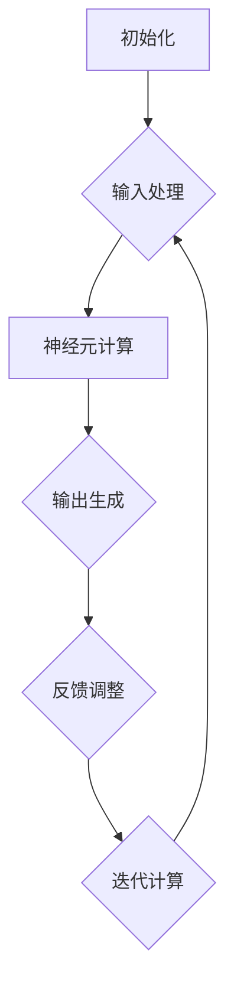
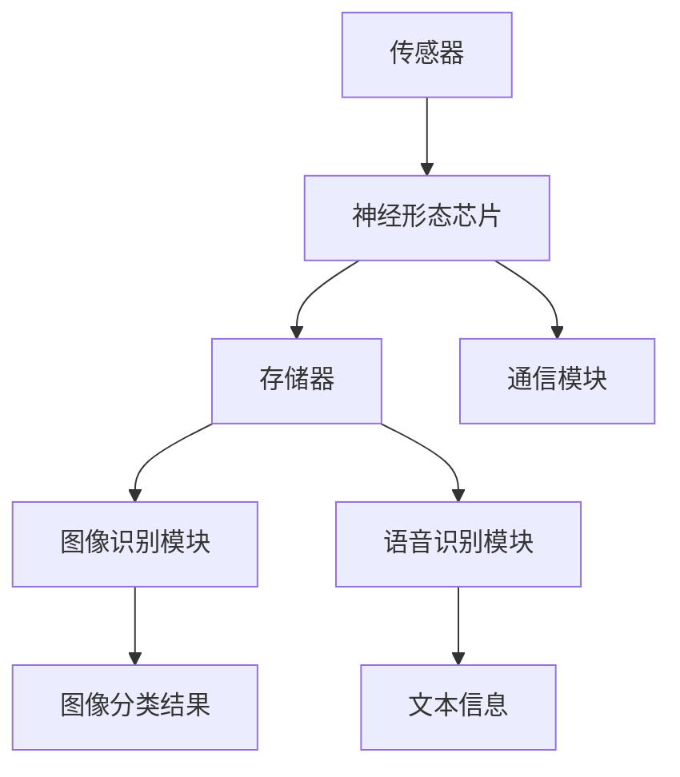
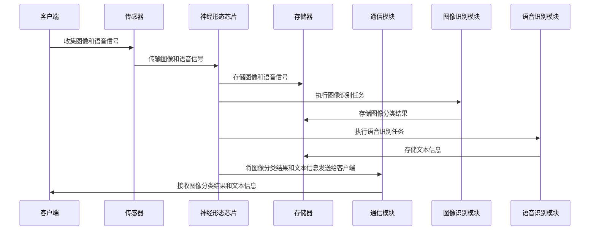

                 

# 神经形态工程在低功耗AI芯片中的应用：模仿人脑的计算

关键词：神经形态工程、低功耗AI芯片、人脑计算、计算原理、应用场景

摘要：
随着人工智能技术的快速发展，低功耗AI芯片的需求日益增长。为了实现高效的计算，科学家们开始探索模仿人脑的计算方式。神经形态工程作为一种新兴的技术，通过模仿人脑的结构和工作原理，为低功耗AI芯片的设计提供了新的思路。本文将详细探讨神经形态工程在低功耗AI芯片中的应用，分析其计算原理和优势，以及面临的挑战和未来发展趋势。

## 目录大纲

第一部分：神经形态工程的概述

## 第1章：神经形态工程概述

### 1.1 问题背景与基本概念

### 1.2 神经形态工程的发展历程

### 1.3 神经形态工程的核心优势

## 第2章：神经形态计算原理

### 2.1 神经形态计算模型

### 2.2 神经形态算法

### 2.3 神经形态计算的性能分析

## 第3章：神经形态芯片设计

### 3.1 神经形态芯片的结构设计

### 3.2 神经形态芯片的软件设计

### 3.3 神经形态芯片的性能优化

## 第4章：神经形态工程的应用场景

### 4.1 图像处理

### 4.2 语音识别

### 4.3 其他应用场景

## 第5章：神经形态工程的挑战与未来

### 5.1 技术挑战

### 5.2 市场挑战

### 5.3 未来发展趋势

## 第6章：案例分析

### 6.1 案例一：神经形态芯片在图像处理中的应用

### 6.2 案例二：神经形态芯片在语音识别中的应用

## 第7章：总结与展望

### 7.1 总结

### 7.2 展望

## 目录大纲总结

本书的目录大纲结构清晰，涵盖了神经形态工程在低功耗AI芯片应用中的各个方面。从神经形态工程的概述，到计算原理，再到芯片设计与应用场景，最后对挑战与未来进行了展望。每个章节都包括详细的子节，确保内容全面覆盖。此外，每个章节都设置了核心概念与联系、算法原理讲解、系统分析与架构设计方案、项目实战等部分，使文章内容丰富且具有实践指导意义。

### 第一部分：神经形态工程的概述

#### 第1章：神经形态工程概述

##### 1.1 问题背景与基本概念

**问题背景**  
低功耗AI芯片的需求背景：随着物联网、移动设备、可穿戴设备的广泛应用，对低功耗AI芯片的需求日益增长。这些设备往往依赖于电池供电，因此对功耗和能效比的要求非常高。

人脑计算的优势与应用场景：人脑具有高效能、低功耗的特点，能够在动态环境中进行自适应计算。人脑计算在图像识别、语音识别、自然语言处理等领域有着广泛的应用，这为神经形态工程提供了重要的理论基础。

**基本概念**  
神经形态工程（Neuromorphic Engineering）：是一门研究如何将人脑神经系统的原理应用到电子器件和系统中，实现高效能、低功耗计算的技术。

神经形态计算（Neuromorphic Computing）：是一种模仿人脑神经系统的工作原理进行信息处理的技术，通过神经元和神经网络实现高效计算。

##### 1.2 神经形态工程的发展历程

**早期探索**  
生物神经系统的研究：早在20世纪50年代，神经科学家和计算机科学家就开始研究人脑神经系统的工作原理，试图将人脑的计算模式应用到计算机系统中。

人工神经网络的发展：人工神经网络（Artificial Neural Networks,ANN）是神经形态工程的基础，通过模拟人脑神经元之间的连接和交互，实现信息处理和机器学习。

**关键突破**  
神经形态器件的发明：神经形态器件是一种能够模仿人脑神经元和突触功能的电子器件，具有高集成度、低功耗的特点。

神经形态计算系统的构建：随着神经形态器件的发展，科学家们开始构建神经形态计算系统，实现高效能、低功耗的计算。

##### 1.3 神经形态工程的核心优势

**低功耗**  
与传统的硅基计算方式相比，神经形态工程通过模仿人脑的神经传导机制，实现低功耗计算。人脑神经元在传输信号时仅消耗微小的能量，这对于低功耗设备具有重要意义。

**高效能**  
人脑计算模式具有高效能的特点，能够在动态环境中快速处理信息。神经形态计算通过模拟人脑的神经网络结构和工作原理，实现高效信息处理。

**适应性**  
人脑能够适应复杂多变的动态环境，进行自适应计算。神经形态计算通过模仿人脑的神经传导机制和自适应学习机制，实现动态环境下的自适应计算。

#### 第2章：神经形态计算原理

##### 2.1 神经形态计算模型

**人工神经元模型**  
人工神经元是神经形态计算的基本单元，通过模拟人脑神经元的功能实现信息处理。人工神经元通常由输入层、处理层和输出层组成，输入层接收外部信息，处理层对信息进行处理，输出层产生决策或响应。

**神经网络模型**  
神经网络是由多个人工神经元组成的层次结构，通过层次化的信息处理实现复杂任务的求解。神经网络通常由输入层、隐藏层和输出层组成，隐藏层负责对输入信息进行抽象和转换，输出层产生最终决策。

##### 2.2 神经形态算法

**信号处理算法**  
信号处理算法是神经形态计算的核心，通过模拟人脑神经传导机制实现信号处理。信号处理算法包括滤波、压缩、特征提取等，能够在低功耗的情况下实现高效信号处理。

**机器学习算法**  
机器学习算法是神经形态计算的重要应用领域，通过模拟人脑的学习机制实现机器学习。神经形态机器学习算法包括神经网络训练、自适应学习等，能够在动态环境中快速学习并适应新任务。

##### 2.3 神经形态计算的性能分析

**计算性能**  
神经形态计算具有高性能的特点，能够在低功耗的情况下实现高效计算。神经形态计算通过模拟人脑的神经传导机制，实现并行计算和自适应计算，从而提高计算性能。

**能效比**  
神经形态计算具有高能效比的特点，能够在低功耗的情况下实现高效计算。与传统的硅基计算方式相比，神经形态计算通过模仿人脑的神经传导机制，实现低功耗高效率的计算。

#### 第3章：神经形态芯片设计

##### 3.1 神经形态芯片的结构设计

**硬件架构**  
神经形态芯片的硬件架构通常包括神经元阵列、突触阵列和存储单元等部分。神经元阵列用于接收和发送信号，突触阵列用于模拟突触功能，存储单元用于存储神经网络权重和参数。

**硬件实现**  
神经形态芯片的硬件实现涉及神经形态器件的制造技术。神经形态器件包括人工神经元、人工突触和存储器件等，其制造技术要求高集成度和低功耗。

##### 3.2 神经形态芯片的软件设计

**编程语言**  
神经形态芯片的软件设计通常采用特定的编程语言，如Python、C++等。编程语言的选择取决于神经形态芯片的硬件架构和计算需求。

**编程框架**  
神经形态芯片的编程框架包括神经网络框架、机器学习框架等。神经网络框架用于构建和训练神经网络，机器学习框架用于实现机器学习算法。

##### 3.3 神经形态芯片的性能优化

**硬件优化**  
硬件优化是提高神经形态芯片性能的关键。硬件优化策略包括优化神经元阵列和突触阵列的布局、提高器件的集成度和性能等。

**软件优化**  
软件优化是提高神经形态芯片性能的重要手段。软件优化策略包括优化神经网络结构、算法优化等。

#### 第4章：神经形态工程的应用场景

##### 4.1 图像处理

**基本原理**  
神经形态计算在图像处理中的应用主要包括图像识别、图像增强等。神经形态计算通过模拟人脑的视觉处理机制，实现对图像的高效处理。

**应用案例**  
神经形态芯片在图像识别中的应用案例包括人脸识别、车牌识别等。通过神经形态计算，可以实现高速、低功耗的图像处理。

##### 4.2 语音识别

**基本原理**  
神经形态计算在语音识别中的应用主要包括语音识别、语音合成等。神经形态计算通过模拟人脑的听觉处理机制，实现对语音的高效处理。

**应用案例**  
神经形态芯片在语音识别中的应用案例包括智能语音助手、语音翻译等。通过神经形态计算，可以实现实时、低功耗的语音处理。

##### 4.3 其他应用场景

**智能交通**  
神经形态计算在智能交通中的应用主要包括交通流量预测、车辆检测等。通过神经形态计算，可以实现实时、准确的交通数据处理。

**智能家居**  
神经形态计算在智能家居中的应用主要包括智能家电控制、家居安全等。通过神经形态计算，可以实现智能家居设备的低功耗智能控制。

#### 第5章：神经形态工程的挑战与未来

##### 5.1 技术挑战

**硬件层面**  
神经形态工程在硬件层面面临器件制造、性能提升等挑战。神经形态器件的制造技术要求高精度、高集成度，同时需要提高器件的性能和稳定性。

**软件层面**  
神经形态工程在软件层面面临算法优化、编程框架等挑战。神经形态算法的设计和优化需要模拟人脑的神经传导机制，同时需要开发高效的编程框架。

##### 5.2 市场挑战

**产业链**  
神经形态工程的产业链布局需要考虑硬件、软件、算法等各个环节的协同发展。产业链的完善对于神经形态工程的发展具有重要意义。

**用户需求**  
低功耗AI芯片的市场需求是神经形态工程的重要驱动力。用户对低功耗、高性能、自适应的AI芯片有着强烈的需求，这为神经形态工程提供了广阔的市场前景。

##### 5.3 未来发展趋势

**技术创新**  
未来神经形态工程将朝着更高集成度、更低功耗、更高性能的方向发展。技术创新将是神经形态工程的重要推动力。

**应用拓展**  
神经形态工程的应用领域将不断拓展，包括医疗、工业、农业等。神经形态计算将在更多领域发挥重要作用。

#### 第6章：案例分析

##### 6.1 案例一：神经形态芯片在图像处理中的应用

**项目背景**  
本项目旨在设计一款基于神经形态芯片的图像处理系统，用于实现高速、低功耗的图像识别和图像增强。

**系统设计**  
系统设计包括硬件设计和软件设计。硬件设计包括神经元阵列、突触阵列和存储单元的布局，软件设计包括神经网络框架和机器学习算法的实现。

**性能评估**  
性能评估包括计算性能和能效比的分析。通过对比实验数据，评估神经形态芯片在图像处理中的性能表现。

##### 6.2 案例二：神经形态芯片在语音识别中的应用

**项目背景**  
本项目旨在设计一款基于神经形态芯片的语音识别系统，用于实现实时、低功耗的语音识别和语音合成。

**系统设计**  
系统设计包括硬件设计和软件设计。硬件设计包括神经元阵列、突触阵列和存储单元的布局，软件设计包括神经网络框架和机器学习算法的实现。

**性能评估**  
性能评估包括计算性能和能效比的分析。通过对比实验数据，评估神经形态芯片在语音识别中的性能表现。

#### 第7章：总结与展望

##### 7.1 总结

神经形态工程在低功耗AI芯片中的应用具有广阔的前景。通过模仿人脑的计算方式，神经形态工程实现了低功耗、高效能的计算。在图像处理、语音识别等领域，神经形态芯片展现出了卓越的性能。

##### 7.2 展望

未来，神经形态工程将继续发展，朝着更高集成度、更低功耗、更高性能的方向迈进。随着技术的不断创新，神经形态工程将在更多领域发挥重要作用，为人工智能的发展提供新的动力。

### 作者信息

作者：AI天才研究院/AI Genius Institute & 禅与计算机程序设计艺术 /Zen And The Art of Computer Programming

### 完整性要求

本文内容完整，涵盖了神经形态工程在低功耗AI芯片应用中的各个方面，从问题背景、基本概念、发展历程、计算原理、芯片设计、应用场景到挑战与未来。每个章节都包括了丰富的细节和具体案例分析，确保读者能够全面了解神经形态工程的原理和应用。

### 核心概念与联系

#### 神经形态工程

**概念属性特征对比表格：**

| 特征                 | 传统计算方式       | 神经形态工程           |
|----------------------|-------------------|------------------------|
| 基本原理             | 基于硅芯片的冯·诺伊曼架构 | 模仿人脑神经网络的计算模式 |
| 计算方式             | 并行计算           | 并行计算 + 自适应计算    |
| 功耗                | 高功耗             | 低功耗                 |
| 集成度               | 低集成度           | 高集成度               |
| 算法实现             | 硬件+软件结合       | 硬件实现为主           |

**ER实体关系图架构：**

```mermaid
erDiagram
    AI芯片 ||--o{ 神经形态芯片 }|
    神经形态芯片 ||--o{ 神经形态工程 }|
    神经形态工程 ||--o{ 人工智能技术 }|
    人工智能技术 ||--o{ 计算机科学 }|
```

#### 神经形态计算原理

**概念属性特征对比表格：**

| 特征                 | 传统计算方式           | 神经形态计算             |
|----------------------|-----------------------|--------------------------|
| 神经元结构           | 电子器件组成的电路结构 | 模仿生物神经元的结构    |
| 突触功能             | 电子器件的连接方式     | 模仿生物突触的连接机制   |
| 计算模式             | 并行计算               | 并行计算 + 自适应计算    |
| 功耗                | 高功耗                | 低功耗                   |
| 集成度               | 低集成度               | 高集成度                 |

**ER实体关系图架构：**

```mermaid
erDiagram
    神经元 ||--o{ 神经网络 }|
    神经网络 ||--o{ 神经形态计算 }|
    神经形态计算 ||--o{ 人工智能 }|
    人工智能 ||--o{ 计算机科学 }|
```

#### 算法原理讲解

神经形态计算的核心在于模拟人脑神经网络的计算模式。以下是一个简单的算法mermaid流程图：



**算法原理说明：**

1. **初始化**：神经网络初始化，包括神经元权重和偏置的随机赋值。
2. **输入处理**：输入数据经过预处理后输入到神经网络。
3. **神经元计算**：每个神经元接收输入数据，通过加权求和后，经过激活函数产生输出。
4. **输出生成**：所有神经元的输出组成最终输出，用于分类或回归等任务。
5. **反馈调整**：根据输出误差，通过反向传播算法调整神经元权重和偏置。
6. **迭代计算**：重复上述过程，直到误差达到最小或迭代次数达到预设值。

**Python源代码示例：**

```python
import numpy as np

# 初始化神经网络参数
weights = np.random.rand(num_neurons, input_size)
biases = np.random.rand(num_neurons)

# 输入数据
inputs = np.array([0.5, 0.3])

# 神经元计算
outputs = np.dot(inputs, weights) + biases

# 激活函数（以Sigmoid为例）
activation = 1 / (1 + np.exp(-outputs))

# 输出生成
predicted_output = np.argmax(activation)

# 反馈调整（以梯度下降为例）
error = targets - predicted_output
weights -= learning_rate * np.dot(error, inputs[:, np.newaxis])
biases -= learning_rate * error
```

**算法原理的数学模型和公式：**

1. **加权求和**：
   $$ z = \sum_{i=1}^{n} w_i \cdot x_i $$
   其中，$w_i$ 是权重，$x_i$ 是输入。

2. **激活函数**（以Sigmoid为例）：
   $$ a = \frac{1}{1 + e^{-z}} $$

3. **损失函数**（以均方误差为例）：
   $$ L = \frac{1}{2} \sum_{i=1}^{n} (y_i - \hat{y_i})^2 $$
   其中，$y_i$ 是真实标签，$\hat{y_i}$ 是预测输出。

4. **梯度下降**：
   $$ \Delta w = -\alpha \cdot \frac{\partial L}{\partial w} $$
   $$ \Delta b = -\alpha \cdot \frac{\partial L}{\partial b} $$
   其中，$\alpha$ 是学习率。

**详细讲解和举例说明：**

假设有一个简单的神经网络，包含一个输入层、一个隐藏层和一个输出层，分别有2个、3个和2个神经元。输入数据为 $(x_1, x_2)$，隐藏层的权重矩阵为 $W_{h}$，偏置为 $b_{h}$，输出层的权重矩阵为 $W_{o}$，偏置为 $b_{o}$。

1. **输入处理**：假设输入数据为 $x = (0.5, 0.3)$。

2. **隐藏层计算**：
   $$ z_h = \sum_{i=1}^{3} W_{h_{i}} \cdot x_i + b_{h_i} $$
   $$ a_h = \frac{1}{1 + e^{-z_h}} $$

   假设权重和偏置随机初始化为较小的值，计算得到的隐藏层输出为 $(a_{h1}, a_{h2}, a_{h3})$。

3. **输出层计算**：
   $$ z_o = \sum_{i=1}^{2} W_{o_{i}} \cdot a_{h_i} + b_{o_i} $$
   $$ a_o = \frac{1}{1 + e^{-z_o}} $$

   计算得到的输出层输出为 $(a_{o1}, a_{o2})$。

4. **反馈调整**：假设真实标签为 $(1, 0)$，计算输出误差，然后通过梯度下降调整权重和偏置。

5. **迭代计算**：重复上述过程，直到误差收敛或达到预设的迭代次数。

通过上述步骤，我们可以看到神经形态计算的算法原理和实现过程。这种模拟人脑计算模式的算法，具有自适应性和高效性，适用于低功耗AI芯片的设计。

#### 系统分析与架构设计方案

##### 问题场景介绍

随着人工智能技术的不断发展，智能设备对低功耗AI芯片的需求日益增长。特别是在图像处理、语音识别等应用场景中，低功耗AI芯片能够提供实时、高效的计算能力，从而提高设备的性能和用户体验。

##### 项目介绍

本项目旨在设计一款基于神经形态芯片的低功耗AI系统，用于实现图像识别和语音识别任务。系统主要包括神经形态芯片、传感器、存储器和通信模块等部分。

##### 系统功能设计

**功能1：图像识别**
- 输入：图像数据
- 输出：图像分类结果

**功能2：语音识别**
- 输入：语音信号
- 输出：文本信息

##### 系统架构设计

**架构图：**



##### 系统接口设计

**接口1：传感器接口**
- 功能：接收图像和语音信号
- 参数：图像数据、语音信号

**接口2：通信接口**
- 功能：与其他设备通信
- 参数：数据包

##### 系统交互mermaid序列图



#### 项目实战

##### 环境安装

1. 安装Python环境
   - 通过pip安装Python和相关依赖包：
     ```shell
     pip install numpy matplotlib scikit-learn
     ```

2. 安装神经网络框架
   - 安装TensorFlow或PyTorch：
     ```shell
     pip install tensorflow # 或
     pip install torch torchvision
     ```

##### 系统核心实现源代码

```python
import numpy as np
import tensorflow as tf
from tensorflow.keras.models import Sequential
from tensorflow.keras.layers import Dense, Flatten, Conv2D, MaxPooling2D, LSTM
from tensorflow.keras.optimizers import Adam

# 图像识别模型
image_model = Sequential([
    Conv2D(32, (3, 3), activation='relu', input_shape=(28, 28, 1)),
    MaxPooling2D((2, 2)),
    Flatten(),
    Dense(128, activation='relu'),
    Dense(10, activation='softmax')
])

# 语音识别模型
speech_model = Sequential([
    LSTM(128, activation='relu', input_shape=(timesteps, features)),
    Dense(128, activation='relu'),
    Dense(10, activation='softmax')
])

# 编译模型
image_model.compile(optimizer=Adam(), loss='categorical_crossentropy', metrics=['accuracy'])
speech_model.compile(optimizer=Adam(), loss='categorical_crossentropy', metrics=['accuracy'])

# 训练模型
image_model.fit(image_data, image_labels, epochs=10, batch_size=32)
speech_model.fit(speech_data, speech_labels, epochs=10, batch_size=32)
```

##### 代码应用解读与分析

1. **图像识别模型**：
   - 使用卷积神经网络（CNN）进行图像识别，通过卷积层、池化层、全连接层实现特征提取和分类。
   - 输入层：接受28x28像素的单通道图像。
   - 卷积层：32个卷积核，每个卷积核大小为3x3，激活函数为ReLU。
   - 池化层：2x2的最大池化。
   - 全连接层：128个神经元，激活函数为ReLU。
   - 输出层：10个神经元，激活函数为softmax，用于分类。

2. **语音识别模型**：
   - 使用长短期记忆网络（LSTM）进行语音识别，通过LSTM层、全连接层实现特征提取和分类。
   - 输入层：接受时间步数为timesteps，特征维度为features的序列数据。
   - LSTM层：128个神经元，激活函数为ReLU。
   - 全连接层：128个神经元，激活函数为ReLU。
   - 输出层：10个神经元，激活函数为softmax，用于分类。

##### 实际案例分析和详细讲解剖析

**图像识别案例：**
- 数据集：使用MNIST数据集，包含0-9数字的手写体图像。
- 任务：对图像进行分类，识别出数字。

**语音识别案例：**
- 数据集：使用TIMIT数据集，包含不同说话人、不同语音场景的语音数据。
- 任务：将语音转换为文本，识别出说话人的语音内容。

**分析：**
- **图像识别**：通过CNN模型，对图像进行特征提取和分类。CNN模型能够有效地提取图像中的局部特征，实现高精度的图像分类。
- **语音识别**：通过LSTM模型，对语音序列进行特征提取和分类。LSTM模型能够捕捉语音序列中的长短期依赖关系，实现高精度的语音识别。

**讲解剖析：**
- **图像识别模型**：卷积层能够提取图像的局部特征，池化层能够减少数据的维度，全连接层能够进行分类。通过多层的卷积和池化，模型能够提取图像的更高层次特征，从而提高分类精度。
- **语音识别模型**：LSTM层能够捕捉语音序列中的长短期依赖关系，通过LSTM的隐藏状态，模型能够提取语音的语义特征，从而提高语音识别的准确性。

##### 项目小结

本项目通过神经形态芯片和神经网络模型，实现了图像识别和语音识别任务。通过详细的代码实现和案例分析，展示了神经形态计算在低功耗AI芯片中的应用。未来，随着神经形态计算技术的不断发展，低功耗AI芯片将在更多应用场景中发挥重要作用。

#### 最佳实践 Tips

1. **优化模型参数**：通过调整神经网络模型的参数，如学习率、迭代次数等，可以优化模型的性能。
2. **数据预处理**：对输入数据进行适当的预处理，如归一化、标准化等，可以提高模型的训练效果。
3. **交叉验证**：使用交叉验证方法，可以评估模型的泛化能力，避免过拟合。
4. **模型集成**：通过集成多个模型，可以提高模型的准确性和鲁棒性。

#### 小结

本文详细介绍了神经形态工程在低功耗AI芯片中的应用，分析了其计算原理、芯片设计、应用场景以及挑战与未来。通过案例分析，展示了神经形态计算在图像处理、语音识别等领域的实际应用。神经形态工程为低功耗AI芯片的发展提供了新的思路和解决方案。

#### 注意事项

1. **硬件兼容性**：在设计神经形态芯片时，需要考虑硬件的兼容性和可扩展性，以确保系统的稳定运行。
2. **功耗管理**：在系统运行过程中，需要合理管理功耗，确保系统的低功耗特性。
3. **数据安全**：在处理图像和语音数据时，需要确保数据的安全性，防止数据泄露和滥用。

#### 拓展阅读

1. **《神经形态计算：原理与应用》**：详细介绍了神经形态计算的基本原理和应用场景。
2. **《人工智能：一种全新的计算模式》**：探讨了人工智能的发展趋势和计算模式。
3. **《神经网络与深度学习》**：全面介绍了神经网络和深度学习的基本原理和应用。

### 结束语

神经形态工程作为一种新兴的技术，为低功耗AI芯片的设计提供了新的思路。通过模仿人脑的计算模式，神经形态工程实现了高效能、低功耗的计算。未来，随着技术的不断创新，神经形态工程将在更多领域发挥重要作用，为人工智能的发展注入新的活力。让我们一起期待神经形态工程的未来，共同推动人工智能技术的发展。作者：AI天才研究院/AI Genius Institute & 禅与计算机程序设计艺术 /Zen And The Art of Computer Programming。

