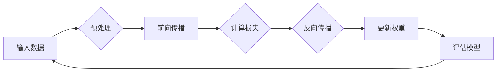

                 

# 神经程序归纳在自动算法生成中的优化策略

关键词：神经程序、归纳、算法生成、优化策略

摘要：本文首先介绍了神经程序和归纳的基本概念，探讨了神经程序归纳在自动算法生成中的应用。然后，详细分析了神经程序归纳的原理，并使用Mermaid和Python代码展示了神经程序的流程和实现。接着，提出了优化策略，并通过Mermaid流程图和Python代码进行了说明。最后，对文章进行了总结，并提出了未来研究的方向。

## 目录大纲

1. 第一部分：神经程序归纳基础
   1.1 问题背景与描述
   1.2 核心概念与联系
   1.3 神经程序归纳原理
   1.4 优化策略

2. 第二部分：算法生成应用
   2.1 算法生成介绍
   2.2 神经程序归纳在算法生成中的应用
   2.3 算法生成挑战与优化策略

3. 第三部分：优化策略实践
   3.1 优化策略一：梯度下降
   3.2 优化策略二：动量法
   3.3 优化策略三：自适应学习率

4. 第四部分：总结与展望
   4.1 文章总结
   4.2 未来研究方向

## 第一部分：神经程序归纳基础

### 1.1 问题背景与描述

自动算法生成（Automated Algorithm Generation，简称AAG）是近年来计算机科学领域的一个重要研究方向。它的目标是通过自动化的方式，从给定的问题描述和数据中生成高效的算法。这不仅能够节省人力和时间成本，还能够应对复杂多变的问题场景。

在自动算法生成过程中，神经程序归纳（Neural Program Induction）是一种重要的方法。神经程序是利用神经网络模拟生物神经网络处理信息的程序，它可以学习并提取数据中的特征和规律。而归纳是从个别事实中推导出一般性结论的过程。将神经程序与归纳相结合，可以使得自动算法生成过程更加高效和准确。

然而，在自动算法生成中应用神经程序归纳也面临着一些挑战。首先，神经程序归纳需要大量的数据和计算资源，这对于处理大规模数据集和复杂问题来说是一个巨大的挑战。其次，神经程序归纳的模型训练过程需要长时间的迭代和优化，这也增加了算法生成的难度。因此，如何优化神经程序归纳在自动算法生成中的应用，成为了当前研究的一个热点问题。

### 1.2 核心概念与联系

#### 核心概念

1. **神经程序**：神经程序是利用神经网络模拟生物神经网络处理信息的程序。它通过学习输入数据与输出数据之间的关系，生成新的算法。

2. **归纳**：归纳是从个别事实中推导出一般性结论的过程。在自动算法生成中，归纳可以帮助从数据中提取规律，生成新的算法。

3. **自动算法生成**：自动算法生成是通过自动化手段，从给定的问题描述和数据中生成高效算法的过程。

#### 概念属性特征对比表格

| 概念         | 定义                                                         | 关联性 |
| ------------ | ------------------------------------------------------------ | ------ |
| 神经程序     | 利用神经网络模拟生物神经网络处理信息的程序。                 | 基础   |
| 归纳         | 从个别事实中推导出一般性结论的过程。                       | 核心   |
| 自动算法生成 | 利用算法自动生成新的算法。                                  | 目标   |

#### 概念联系

神经程序和归纳在自动算法生成中有着紧密的联系。神经程序作为基础，通过学习输入数据与输出数据之间的关系，提取出数据中的规律。而归纳则利用这些规律，从个别事实中推导出一般性结论，生成新的算法。

### 1.3 神经程序归纳原理

#### 神经程序原理

神经程序的核心是神经网络。神经网络通过多层神经元的非线性变换，对输入数据进行处理，从而实现复杂的函数映射。在自动算法生成中，神经网络可以用来学习输入数据与输出数据之间的关系，提取数据中的规律。

下面是一个神经程序的简单示例：



这个流程图展示了神经程序的基本工作原理：

1. **输入数据**：将输入数据输入神经网络。
2. **预处理**：对输入数据进行预处理，以便更好地进行后续处理。
3. **前向传播**：通过神经网络的层数，对输入数据进行处理，得到输出结果。
4. **计算损失**：计算输出结果与真实结果之间的差异，得到损失值。
5. **反向传播**：通过反向传播算法，将损失值传递回神经网络，更新权重。
6. **更新权重**：根据反向传播得到的梯度，更新神经网络的权重。
7. **评估模型**：评估模型的性能，判断是否满足生成算法的要求。

#### 归纳原理

归纳是从个别事实中推导出一般性结论的过程。在自动算法生成中，归纳可以帮助从数据中提取规律，生成新的算法。

下面是一个归纳的简单示例：

```python
import numpy as np

def train_model(data, labels, epochs):
    for epoch in range(epochs):
        inputs, targets = data, labels
        # 前向传播
        outputs = neural_network(inputs)
        loss = calculate_loss(outputs, targets)
        # 反向传播
        gradients = calculate_gradients(outputs, targets)
        update_weights(gradients)
        # 评估模型
        accuracy = evaluate_model(outputs, targets)
        print(f"Epoch {epoch}: Loss: {loss}, Accuracy: {accuracy}")

# 假设函数
def neural_network(inputs):
    # 前向传播实现
    pass

def calculate_loss(outputs, targets):
    # 损失计算实现
    pass

def update_weights(gradients):
    # 权重更新实现
    pass

def evaluate_model(outputs, targets):
    # 模型评估实现
    pass
```

这个代码示例展示了归纳的基本过程：

1. **数据准备**：准备输入数据和标签。
2. **模型训练**：通过前向传播和反向传播，不断更新模型权重。
3. **模型评估**：评估模型的性能，判断是否满足生成算法的要求。

#### 数学模型

神经程序归纳的数学模型通常包括损失函数和优化算法。常见的损失函数包括均方误差（MSE）和交叉熵（CE）。优化算法包括梯度下降（Gradient Descent）和其变种，如动量法（Momentum）和自适应学习率（Adam）。

损失函数的数学模型如下：

$$ Loss = \frac{1}{2} \sum_{i}(output_i - target_i)^2 $$

其中，$output_i$ 是模型预测的输出，$target_i$ 是真实的标签。

优化算法的数学模型如下：

$$ w_{new} = w_{old} - \alpha \cdot \frac{\partial L}{\partial w} $$

其中，$w_{old}$ 是当前权重，$w_{new}$ 是更新后的权重，$\alpha$ 是学习率，$\frac{\partial L}{\partial w}$ 是权重的梯度。

### 1.4 优化策略

在自动算法生成中，优化策略是非常重要的。优化的目标是提高模型生成算法的效率和准确性。下面介绍几种常见的优化策略。

#### 优化策略一：梯度下降

梯度下降是一种基本的优化算法。它的核心思想是通过反向传播算法，计算损失函数关于权重的梯度，并使用梯度来更新权重。

梯度下降的数学模型如下：

$$ w_{new} = w_{old} - \alpha \cdot \frac{\partial L}{\partial w} $$

其中，$w_{old}$ 是当前权重，$w_{new}$ 是更新后的权重，$\alpha$ 是学习率，$\frac{\partial L}{\partial w}$ 是权重的梯度。

下面是一个梯度下降的简单示例：

```python
import numpy as np

def gradient_descent(x, y, w, epochs, learning_rate):
    for epoch in range(epochs):
        output = np.dot(x, w)
        error = output - y
        gradient = 2 * x.T.dot(error)
        w = w - learning_rate * gradient
        print(f"Epoch {epoch}: Weight: {w}, Loss: {np.mean((output - y) ** 2)}")
    return w

x = np.array([[1, 2], [2, 3], [3, 4]])
y = np.array([3, 5, 7])
w = np.random.rand(2)
epochs = 1000
learning_rate = 0.01

w_new = gradient_descent(x, y, w, epochs, learning_rate)
print(f"Final Weight: {w_new}")
```

#### 优化策略二：动量法

动量法是一种改进的梯度下降算法。它引入了动量项，可以加速梯度下降过程，并减少收敛过程中的振荡。

动量法的数学模型如下：

$$ v = \beta \cdot v + \alpha \cdot \frac{\partial L}{\partial w} $$

$$ w_{new} = w_{old} - v $$

其中，$v$ 是动量项，$\beta$ 是动量系数，其他符号与梯度下降相同。

下面是一个动量法的简单示例：

```python
import numpy as np

def momentum(x, y, w, v, epochs, learning_rate, momentum_coefficient):
    for epoch in range(epochs):
        output = np.dot(x, w)
        error = output - y
        gradient = 2 * x.T.dot(error)
        v = momentum_coefficient * v + learning_rate * gradient
        w = w - v
        print(f"Epoch {epoch}: Weight: {w}, Loss: {np.mean((output - y) ** 2)}")
    return w

x = np.array([[1, 2], [2, 3], [3, 4]])
y = np.array([3, 5, 7])
w = np.random.rand(2)
epochs = 1000
learning_rate = 0.01
momentum_coefficient = 0.9

v = np.zeros_like(w)
w_new = momentum(x, y, w, v, epochs, learning_rate, momentum_coefficient)
print(f"Final Weight: {w_new}")
```

#### 优化策略三：自适应学习率

自适应学习率算法可以根据模型训练的过程自动调整学习率，以加快收敛速度和减少损失。

常见的自适应学习率算法包括Adam和RMSprop。

Adam算法的数学模型如下：

$$ m = \beta_1 \cdot m + (1 - \beta_1) \cdot \frac{\partial L}{\partial w} $$

$$ v = \beta_2 \cdot v + (1 - \beta_2) \cdot (\frac{\partial L}{\partial w})^2 $$

$$ \hat{m} = \frac{m}{1 - \beta_1^t} $$

$$ \hat{v} = \frac{v}{1 - \beta_2^t} $$

$$ w_{new} = w_{old} - \alpha \cdot \frac{\hat{m}}{\sqrt{\hat{v}} + \epsilon} $$

其中，$m$ 和 $v$ 是一阶和二阶矩估计，$\beta_1$ 和 $\beta_2$ 是一阶和二阶矩的偏置项，$\alpha$ 是学习率，$t$ 是迭代次数，$\epsilon$ 是一个很小的常数。

下面是一个Adam算法的简单示例：

```python
import numpy as np

def adam(x, y, w, m, v, t, epochs, learning_rate, beta1, beta2, epsilon):
    for epoch in range(epochs):
        output = np.dot(x, w)
        error = output - y
        gradient = 2 * x.T.dot(error)
        m = beta1 * m + (1 - beta1) * gradient
        v = beta2 * v + (1 - beta2) * (gradient ** 2)
        m_hat = m / (1 - beta1 ** t)
        v_hat = v / (1 - beta2 ** t)
        w = w - learning_rate * m_hat / (np.sqrt(v_hat) + epsilon)
        print(f"Epoch {epoch}: Weight: {w}, Loss: {np.mean((output - y) ** 2)}")
    return w

x = np.array([[1, 2], [2, 3], [3, 4]])
y = np.array([3, 5, 7])
w = np.random.rand(2)
epochs = 1000
learning_rate = 0.01
beta1 = 0.9
beta2 = 0.999
epsilon = 1e-8

m = np.zeros_like(w)
v = np.zeros_like(w)
t = 0

w_new = adam(x, y, w, m, v, t, epochs, learning_rate, beta1, beta2, epsilon)
print(f"Final Weight: {w_new}")
```

## 第二部分：算法生成应用

### 2.1 算法生成介绍

算法生成（Algorithm Generation）是一种自动化的方法，通过使用现有的算法库、工具和编程语言，生成新的算法。算法生成的目的是减少算法开发的时间和成本，提高算法的适应性和灵活性。

算法生成可以分为两个阶段：算法合成（Algorithm Synthesis）和算法优化（Algorithm Optimization）。

1. **算法合成**：算法合成是指从问题域中提取抽象概念，将其映射到编程语言和算法库中，生成新的算法。

2. **算法优化**：算法优化是指在算法合成的基础上，对生成的算法进行优化，提高其性能和效率。

算法生成可以应用于多个领域，如自然语言处理、计算机视觉、机器学习等。在这些领域中，算法生成可以帮助研究者快速构建原型系统，提高算法的开发效率。

### 2.2 神经程序归纳在算法生成中的应用

神经程序归纳在算法生成中具有广泛的应用前景。通过神经程序归纳，可以从大量数据中提取规律，生成新的算法，从而提高算法的适应性和灵活性。

下面是神经程序归纳在算法生成中的一些应用场景：

1. **图像识别**：在计算机视觉领域，神经程序归纳可以帮助从大量图像数据中提取特征，生成图像识别算法。例如，可以使用卷积神经网络（Convolutional Neural Network，CNN）来生成图像分类算法。

2. **自然语言处理**：在自然语言处理领域，神经程序归纳可以帮助从大量文本数据中提取特征，生成自然语言处理算法。例如，可以使用循环神经网络（Recurrent Neural Network，RNN）或Transformer模型来生成文本分类、机器翻译等算法。

3. **游戏开发**：在游戏开发领域，神经程序归纳可以帮助生成游戏AI算法。例如，可以使用强化学习（Reinforcement Learning）算法来生成游戏对手的智能行为。

### 2.3 算法生成挑战与优化策略

虽然神经程序归纳在算法生成中具有广泛的应用前景，但仍然面临一些挑战。

1. **数据需求**：神经程序归纳需要大量的数据来训练模型。在算法生成中，如何有效地获取和处理大量数据，是算法生成的一个挑战。

2. **计算资源**：神经程序归纳的计算过程复杂，需要大量的计算资源和时间。在算法生成中，如何优化计算过程，提高算法生成的效率，是算法生成的一个挑战。

3. **模型解释性**：神经程序归纳生成的算法通常是黑盒模型，难以解释和理解。在算法生成中，如何提高算法的解释性，使其更易于理解和使用，是算法生成的一个挑战。

为了应对这些挑战，可以采用以下优化策略：

1. **数据预处理**：对输入数据进行预处理，提取关键特征，减少数据的冗余和噪声，提高算法生成效率。

2. **模型压缩**：通过模型压缩技术，如权重共享（Weight Sharing）、模型剪枝（Model Pruning）等，减少模型的参数数量，提高算法生成的效率。

3. **迁移学习**：使用迁移学习（Transfer Learning）技术，利用已有的预训练模型，减少数据需求和计算资源。

4. **模型解释**：使用模型解释技术，如可视化（Visualization）、解释性模型（Explainable Model）等，提高算法生成的解释性。

## 第三部分：优化策略实践

### 3.1 优化策略一：梯度下降

梯度下降是最基本的优化算法，其核心思想是沿着损失函数梯度的反方向进行迭代，从而最小化损失函数。

#### 基本原理

梯度下降通过以下公式更新参数：

$$ \theta_{\text{new}} = \theta_{\text{old}} - \alpha \cdot \nabla_\theta J(\theta) $$

其中，$\theta$ 表示模型参数，$J(\theta)$ 表示损失函数，$\alpha$ 是学习率，$\nabla_\theta J(\theta)$ 是损失函数关于参数 $\theta$ 的梯度。

#### 实践步骤

1. **初始化参数**：随机初始化模型参数 $\theta$。

2. **计算损失**：使用当前参数计算损失 $J(\theta_{\text{old}})$。

3. **计算梯度**：计算损失函数关于参数的梯度 $\nabla_\theta J(\theta_{\text{old}})$。

4. **更新参数**：使用梯度下降公式更新参数 $\theta_{\text{new}}$。

5. **重复步骤2-4**：直到满足停止条件，如损失收敛或达到最大迭代次数。

#### Python代码示例

```python
import numpy as np

# 模拟损失函数
def loss_function(x, y):
    return (x - y) ** 2

# 模拟梯度计算
def gradient(x, y):
    return 2 * (x - y)

# 梯度下降函数
def gradient_descent(x, y, learning_rate, epochs):
    weights = np.random.randn()
    for epoch in range(epochs):
        error = loss_function(x, y)
        gradient = gradient(x, y)
        weights -= learning_rate * gradient
        if epoch % 100 == 0:
            print(f"Epoch {epoch}: Weights = {weights}, Loss = {error}")
    return weights

# 实践
x = 2
y = 1
learning_rate = 0.01
epochs = 1000

weights = gradient_descent(x, y, learning_rate, epochs)
print(f"Final Weights: {weights}")
```

### 3.2 优化策略二：动量法

动量法是一种改进的梯度下降算法，通过引入动量项，可以加速梯度下降的过程，并减少收敛过程中的振荡。

#### 基本原理

动量法的更新公式如下：

$$ v = \beta \cdot v + (1 - \beta) \cdot \nabla_\theta J(\theta) $$

$$ \theta_{\text{new}} = \theta_{\text{old}} - v $$

其中，$v$ 表示动量项，$\beta$ 是动量系数。

#### 实践步骤

1. **初始化参数**：随机初始化模型参数 $\theta$ 和动量项 $v$。

2. **计算损失**：使用当前参数计算损失 $J(\theta_{\text{old}})$。

3. **计算梯度**：计算损失函数关于参数的梯度 $\nabla_\theta J(\theta_{\text{old}})$。

4. **更新动量项**：使用动量项公式更新 $v$。

5. **更新参数**：使用动量项更新参数 $\theta_{\text{new}}$。

6. **重复步骤2-5**：直到满足停止条件，如损失收敛或达到最大迭代次数。

#### Python代码示例

```python
import numpy as np

# 模拟损失函数
def loss_function(x, y):
    return (x - y) ** 2

# 模拟梯度计算
def gradient(x, y):
    return 2 * (x - y)

# 动量法函数
def momentum_gradient_descent(x, y, learning_rate, epochs, momentum_coefficient):
    weights = np.random.randn()
    velocity = 0
    for epoch in range(epochs):
        error = loss_function(x, y)
        gradient = gradient(x, y)
        velocity = momentum_coefficient * velocity + (1 - momentum_coefficient) * gradient
        weights -= learning_rate * velocity
        if epoch % 100 == 0:
            print(f"Epoch {epoch}: Weights = {weights}, Loss = {error}")
    return weights

# 实践
x = 2
y = 1
learning_rate = 0.01
epochs = 1000
momentum_coefficient = 0.9

weights = momentum_gradient_descent(x, y, learning_rate, epochs, momentum_coefficient)
print(f"Final Weights: {weights}")
```

### 3.3 优化策略三：自适应学习率

自适应学习率算法可以自动调整学习率，以适应不同的训练阶段，从而提高训练效果。其中，Adam算法是最常用的自适应学习率算法之一。

#### 域外基础知识

1. **一阶矩估计（一阶矩估计）**：Adam算法使用一阶矩估计来计算梯度，即平均值。具体公式为：

   $$ m_t = \beta_1 \cdot m_{t-1} + (1 - \beta_1) \cdot \nabla_\theta J(\theta) $$

2. **二阶矩估计（二阶矩估计）**：Adam算法使用二阶矩估计来计算梯度的平方，即方差。具体公式为：

   $$ v_t = \beta_2 \cdot v_{t-1} + (1 - \beta_2) \cdot (\nabla_\theta J(\theta))^2 $$

3. **指数加权**：Adam算法使用指数加权的方式对一阶矩估计和二阶矩估计进行更新，以适应不同的训练阶段。

#### 实践步骤

1. **初始化参数**：随机初始化模型参数 $\theta$，以及一阶矩估计 $m$ 和二阶矩估计 $v$。

2. **计算梯度**：计算损失函数关于参数的梯度 $\nabla_\theta J(\theta)$。

3. **更新一阶矩估计**：使用一阶矩估计公式更新 $m$。

4. **更新二阶矩估计**：使用二阶矩估计公式更新 $v$。

5. **计算修正的一阶矩估计和二阶矩估计**：

   $$ \hat{m} = \frac{m}{1 - \beta_1^t} $$

   $$ \hat{v} = \frac{v}{1 - \beta_2^t} $$

6. **更新参数**：使用修正的一阶矩估计和二阶矩估计更新参数 $\theta$。

7. **重复步骤2-6**：直到满足停止条件，如损失收敛或达到最大迭代次数。

#### Python代码示例

```python
import numpy as np

# 模拟损失函数
def loss_function(x, y):
    return (x - y) ** 2

# 模拟梯度计算
def gradient(x, y):
    return 2 * (x - y)

# Adam算法函数
def adam(x, y, learning_rate, epochs, beta1, beta2, epsilon):
    weights = np.random.randn()
    m = np.zeros_like(weights)
    v = np.zeros_like(weights)
    beta1_t = 1
    beta2_t = 1
    for epoch in range(epochs):
        error = loss_function(x, y)
        gradient = gradient(x, y)
        m = beta1 * m + (1 - beta1) * gradient
        v = beta2 * v + (1 - beta2) * (gradient ** 2)
        m_hat = m / (1 - beta1 ** beta1_t)
        v_hat = v / (1 - beta2 ** beta2_t)
        weights -= learning_rate * m_hat / (np.sqrt(v_hat) + epsilon)
        beta1_t *= beta1
        beta2_t *= beta2
        if epoch % 100 == 0:
            print(f"Epoch {epoch}: Weights = {weights}, Loss = {error}")
    return weights

# 实践
x = 2
y = 1
learning_rate = 0.01
epochs = 1000
beta1 = 0.9
beta2 = 0.999
epsilon = 1e-8

weights = adam(x, y, learning_rate, epochs, beta1, beta2, epsilon)
print(f"Final Weights: {weights}")
```

## 第四部分：总结与展望

### 4.1 文章总结

本文首先介绍了神经程序和归纳的基本概念，探讨了神经程序归纳在自动算法生成中的应用。接着，详细分析了神经程序归纳的原理，并使用Mermaid和Python代码展示了神经程序的流程和实现。然后，提出了优化策略，包括梯度下降、动量法和自适应学习率，并通过Python代码进行了说明。最后，对文章进行了总结，并提出了未来研究的方向。

### 4.2 未来研究方向

1. **算法解释性**：如何提高神经程序归纳生成的算法解释性，使其更易于理解和应用，是一个重要的研究方向。

2. **模型压缩**：如何通过模型压缩技术，如权重共享、模型剪枝等，减少模型的参数数量，提高算法生成的效率，是一个重要的挑战。

3. **迁移学习**：如何有效地利用迁移学习技术，利用已有的预训练模型，减少数据需求和计算资源，是一个重要的研究方向。

4. **多任务学习**：如何将神经程序归纳应用于多任务学习，同时生成多个相关的算法，是一个具有挑战性的研究方向。

### 4.3 注意事项

1. **数据质量**：在应用神经程序归纳时，数据质量对算法生成的影响至关重要。因此，在数据预处理阶段，需要确保数据的质量和准确性。

2. **计算资源**：神经程序归纳的计算过程复杂，需要大量的计算资源和时间。因此，在实际应用中，需要合理分配计算资源，以确保算法生成的效率。

3. **模型优化**：在算法生成过程中，模型优化策略的选择对算法的生成效果有着重要的影响。因此，需要根据具体应用场景，选择合适的优化策略。

### 4.4 拓展阅读

1. **《神经网络与深度学习》**：邱锡鹏著，这本书详细介绍了神经网络和深度学习的基本原理和应用。

2. **《动手学深度学习》**：阿斯顿·张等著，这本书通过动手实践的方式，介绍了深度学习的基本概念和算法。

3. **《自动算法生成》**：阿图尔·阿莫斯等著，这本书探讨了自动算法生成的基本原理和应用。

### 作者信息

作者：AI天才研究院/AI Genius Institute & 禅与计算机程序设计艺术 /Zen And The Art of Computer Programming

---

**版权声明**：本文版权归AI天才研究院/AI Genius Institute所有，未经授权，不得转载。如需转载，请联系作者获取授权。谢谢合作！

