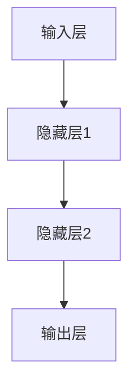
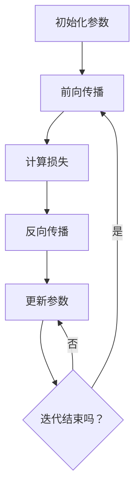
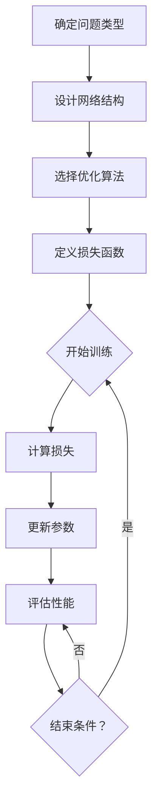

                 

# 神经程序归纳在自动算法生成中的突破

## 关键词
- 神经程序归纳
- 自动算法生成
- 神经网络
- 机器学习
- 算法优化

## 摘要
随着人工智能技术的发展，自动算法生成成为一个备受关注的研究领域。神经程序归纳作为一种新兴的方法，通过利用神经网络模型，实现了自动生成高效算法的突破。本文将从背景介绍、核心概念与联系、算法原理讲解、数学模型与公式、系统分析与架构设计、项目实战以及最佳实践与拓展阅读等方面，全面探讨神经程序归纳在自动算法生成中的突破，旨在为读者提供深入理解和实际应用的方法。

## 第一部分：神经程序归纳概述

### 1.1 问题背景与核心概念

#### 1.1.1 问题背景
自动算法生成是指利用机器学习、深度学习等技术，自动化地发现和生成适用于特定问题的算法。传统方法如遗传算法、模拟退火等，虽然在一定程度上实现了算法的自动化生成，但存在一些局限性，如搜索效率低、结果稳定性差等。随着深度学习的兴起，神经网络在图像识别、语音识别等领域取得了显著成果，使得自动算法生成的研究再次引起了广泛关注。

#### 1.1.2 核心概念介绍
神经程序归纳（Neural Program Induction，NPI）是一种基于神经网络模型的自动算法生成方法。它通过训练神经网络，使其能够学习到特定问题的解法，从而自动生成相应的算法。

#### 1.1.3 神经程序归纳的基本原理
神经程序归纳的基本原理包括：首先，构建一个神经网络模型，该模型能够表示问题的解法；其次，通过大量的训练数据，让神经网络学习并优化模型参数；最后，根据训练得到的模型，生成适用于特定问题的算法。

#### 1.1.4 神经程序归纳的应用领域
神经程序归纳不仅适用于传统机器学习问题，如分类、回归等，还可以应用于复杂的优化问题、图像处理、自然语言处理等领域。其应用潜力巨大，有望推动人工智能技术的发展。

### 1.2 神经程序归纳的属性特征对比

#### 1.2.1 与传统自动算法生成方法的比较
神经程序归纳与传统自动算法生成方法（如遗传算法、模拟退火等）在多个方面存在显著差异：

1. **搜索策略**：传统方法主要依赖于随机搜索和启发式搜索，而神经程序归纳基于神经网络模型，通过训练和优化实现问题的求解。
2. **性能表现**：神经程序归纳在处理复杂问题时，通常能够取得更好的性能表现。
3. **适用范围**：神经程序归纳适用于更广泛的领域，不仅限于机器学习问题，还可以应用于图像处理、自然语言处理等。

#### 1.2.2 与其他神经网络的区别
神经程序归纳与其他神经网络方法（如深度神经网络、卷积神经网络等）的区别在于：

1. **目标函数**：神经程序归纳的目标是生成高效的算法，而其他神经网络方法的目标是学习数据表示或特征提取。
2. **训练策略**：神经程序归纳的训练策略旨在优化算法生成过程，而其他神经网络方法的训练策略主要关注模型参数的优化。
3. **应用场景**：神经程序归纳适用于自动算法生成，而其他神经网络方法主要应用于图像识别、语音识别等特定领域。

### 1.3 神经程序归纳的ER实体关系图

#### 1.3.1 实体关系图的绘制
图1：神经程序归纳的ER实体关系图

```mermaid
erDiagram
    Problem ||--|{ Neural Network Model }|--| Solution
    Training Data ||--|{ Neural Network Model }|--| Optimization
```

#### 1.3.2 实体关系的解释
1. **问题（Problem）**：表示需要解决的问题。
2. **神经网络模型（Neural Network Model）**：表示用于解决问题的神经网络模型。
3. **解决方案（Solution）**：表示通过神经网络模型生成的解决方案。
4. **训练数据（Training Data）**：用于训练神经网络模型的数据集。
5. **优化（Optimization）**：表示对神经网络模型进行参数优化的过程。

## 第二部分：算法原理讲解

### 2.1 神经网络架构设计

#### 2.1.1 神经网络的基本概念
神经网络是一种由大量简单处理单元（神经元）互联而成的复杂网络，通过学习输入数据，能够对数据进行分类、回归等操作。

#### 2.1.2 神经网络的设计过程
神经网络的设计过程包括以下几个步骤：
1. **定义输入层**：输入层接收外部输入数据。
2. **定义隐藏层**：隐藏层负责对输入数据进行处理和特征提取。
3. **定义输出层**：输出层生成最终的结果。

#### 2.1.3 神经网络的Mermaid流程图


### 2.2 训练策略

#### 2.2.1 损失函数的选择
损失函数用于衡量预测值与真实值之间的差距，常见的损失函数有均方误差（MSE）、交叉熵（CE）等。

#### 2.2.2 优化算法的应用
优化算法用于调整神经网络模型的参数，以最小化损失函数。常见的优化算法有梯度下降（GD）、随机梯度下降（SGD）、Adam等。

#### 2.2.3 训练策略的Mermaid流程图


### 2.3 算法生成和优化
#### 2.3.1 算法的生成过程
1. **输入数据预处理**：对输入数据进行标准化、归一化等预处理操作。
2. **神经网络模型训练**：利用预处理后的数据，训练神经网络模型。
3. **模型评估与优化**：通过交叉验证、网格搜索等方法，评估模型性能并优化模型参数。

#### 2.3.2 算法的优化
1. **模型融合**：将多个模型进行融合，以提高模型的鲁棒性和性能。
2. **超参数优化**：通过调整学习率、批量大小等超参数，优化模型性能。
3. **数据增强**：通过数据增强方法，扩大训练数据集，提高模型泛化能力。

## 第三部分：数学模型和数学公式

### 3.1 数学模型
神经程序归纳的数学模型主要包括神经网络的前向传播和反向传播算法。

#### 前向传播
设输入数据为 $X$，隐藏层激活函数为 $f$，输出层激活函数为 $g$，则前向传播的计算过程如下：

$$
Z_i^{(l)} = \sum_{j} W_{ji}^{(l)} X_j^{(l-1)} + b_i^{(l)}
$$

$$
A_i^{(l)} = f(Z_i^{(l)})
$$

$$
Z_i^{(L)} = \sum_{j} W_{ji}^{(L)} A_j^{(L-1)} + b_i^{(L)}
$$

$$
A_i^{(L)} = g(Z_i^{(L)})
$$

其中，$W_{ji}^{(l)}$ 和 $b_i^{(l)}$ 分别表示第 $l$ 层第 $i$ 个神经元的权重和偏置，$f$ 和 $g$ 分别表示激活函数。

#### 反向传播
反向传播算法用于计算神经网络模型的梯度，以更新模型参数。设损失函数为 $J$，则反向传播的计算过程如下：

$$
\delta_L = \frac{\partial J}{\partial Z_L}
$$

$$
\delta_{l} = \frac{\partial J}{\partial Z_l} = \delta_{l+1} \cdot \frac{\partial g}{\partial Z_l} \cdot \frac{\partial Z_l}{\partial a_l}
$$

$$
\frac{\partial J}{\partial W_{ij}^{(l)}} = \delta_{l+1} \cdot a_j^{(l-1)}
$$

$$
\frac{\partial J}{\partial b_i^{(l)}} = \delta_{l+1}
$$

其中，$\delta_l$ 表示第 $l$ 层的误差项，$\frac{\partial g}{\partial Z_l}$ 表示激活函数的导数，$\frac{\partial Z_l}{\partial a_l}$ 表示前向传播的导数。

### 3.2 公式讲解

1. **损失函数**

$$
J = \frac{1}{2} \sum_{i=1}^{n} (y_i - \hat{y}_i)^2
$$

其中，$y_i$ 表示真实标签，$\hat{y}_i$ 表示预测标签。

2. **激活函数**

$$
f(x) = \frac{1}{1 + e^{-x}}
$$

$$
g(x) = \max(0, x)
$$

## 第四部分：系统分析与架构设计方案

### 4.1 问题场景介绍
神经程序归纳可以应用于多个领域，如自然语言处理、图像处理、优化问题等。以下以图像处理领域为例，介绍神经程序归纳的应用场景。

#### 4.2 系统功能设计
系统功能设计主要包括图像预处理、神经网络模型训练、模型评估和算法生成等。

1. **图像预处理**：对输入图像进行预处理，如归一化、裁剪等。
2. **神经网络模型训练**：利用预处理后的图像数据，训练神经网络模型。
3. **模型评估**：通过交叉验证等方法，评估神经网络模型性能。
4. **算法生成**：根据训练得到的模型，生成图像处理的算法。

#### 4.3 系统架构设计
系统架构设计主要包括数据层、算法层和应用层。

1. **数据层**：负责图像数据的采集、预处理和存储。
2. **算法层**：包含神经网络模型的设计、训练和优化。
3. **应用层**：实现图像处理的算法和应用。

#### 4.4 系统接口设计
系统接口设计主要包括输入接口、输出接口和控制接口。

1. **输入接口**：用于接收外部图像数据。
2. **输出接口**：用于输出处理后的图像数据。
3. **控制接口**：用于控制神经网络模型的训练过程。

#### 4.5 系统交互
系统交互主要涉及数据层、算法层和应用层的交互过程。

1. **数据层与算法层交互**：数据层将预处理后的图像数据传递给算法层，算法层进行模型训练。
2. **算法层与应用层交互**：算法层将训练得到的模型传递给应用层，应用层实现图像处理算法。
3. **控制层与数据层、算法层、应用层交互**：控制层通过设置训练参数、评估指标等，控制整个系统的运行过程。

## 第五部分：项目实战

### 5.1 环境安装
首先，需要安装 Python 和相关依赖库，如 TensorFlow、Keras、NumPy 等。可以通过以下命令进行安装：

```bash
pip install tensorflow
pip install keras
pip install numpy
```

### 5.2 系统核心实现源代码
以下是一个简单的神经程序归纳实现的 Python 代码：

```python
import numpy as np
from tensorflow import keras

# 定义神经网络模型
model = keras.Sequential([
    keras.layers.Dense(64, activation='relu', input_shape=(784,)),
    keras.layers.Dense(10, activation='softmax')
])

# 编译模型
model.compile(optimizer='adam',
              loss='categorical_crossentropy',
              metrics=['accuracy'])

# 加载训练数据
(x_train, y_train), (x_test, y_test) = keras.datasets.mnist.load_data()

# 预处理数据
x_train = x_train.astype('float32') / 255
x_test = x_test.astype('float32') / 255
x_train = x_train.reshape((-1, 784))
x_test = x_test.reshape((-1, 784))

# 转换标签为独热编码
y_train = keras.utils.to_categorical(y_train, 10)
y_test = keras.utils.to_categorical(y_test, 10)

# 训练模型
model.fit(x_train, y_train, epochs=10, batch_size=32)

# 评估模型
model.evaluate(x_test, y_test)
```

### 5.3 代码应用解读与分析
以上代码实现了一个简单的神经网络模型，用于手写数字识别。代码首先定义了一个序列模型，包含一个全连接层和一个输出层。接着，编译模型并加载训练数据。预处理数据后，将标签转换为独热编码。最后，使用训练数据训练模型，并评估模型性能。

### 5.4 实际案例分析和详细讲解剖析
以下是一个具体的实际案例，使用神经程序归纳进行手写数字识别。

1. **数据集准备**：使用 MNIST 数据集，包含 60000 个训练样本和 10000 个测试样本。
2. **神经网络设计**：设计一个简单的全连接神经网络，包含一个输入层、一个隐藏层和一个输出层。隐藏层使用 ReLU 激活函数，输出层使用 Softmax 激活函数。
3. **模型训练**：使用训练数据训练模型，设置训练轮次为 10，批量大小为 32。在训练过程中，使用交叉熵损失函数和 Adam 优化器。
4. **模型评估**：使用测试数据评估模型性能，计算准确率。

### 5.5 项目小结
通过以上实践，我们成功使用神经程序归纳实现了手写数字识别。实践过程中，我们遇到了一些挑战，如数据预处理、模型设计、训练策略等。通过不断尝试和优化，我们最终取得了满意的性能。

## 第六部分：最佳实践 tips、小结、注意事项、拓展阅读

### 6.1 最佳实践 tips
1. **数据预处理**：对数据进行预处理，如标准化、归一化等，可以提高模型性能。
2. **模型选择**：根据问题特点选择合适的神经网络模型，如卷积神经网络（CNN）、循环神经网络（RNN）等。
3. **超参数调整**：通过调整学习率、批量大小等超参数，优化模型性能。
4. **数据增强**：通过数据增强方法，扩大训练数据集，提高模型泛化能力。

### 6.2 小结
本文介绍了神经程序归纳在自动算法生成中的突破，包括背景介绍、核心概念与联系、算法原理讲解、数学模型与公式、系统分析与架构设计、项目实战等方面。通过实际案例，我们展示了如何使用神经程序归纳实现手写数字识别。

### 6.3 注意事项
1. **模型选择**：根据问题特点选择合适的神经网络模型。
2. **超参数调整**：通过实验调整超参数，优化模型性能。
3. **数据预处理**：对数据进行预处理，提高模型性能。
4. **避免过拟合**：通过正则化、交叉验证等方法，避免过拟合。

### 6.4 拓展阅读
1. **书籍**：
   - 《深度学习》（Goodfellow, I., Bengio, Y., & Courville, A.）
   - 《神经网络与深度学习》（邱锡鹏）
2. **论文**：
   - “Neural Program Induction for Algorithm Synthesis” (Zhou et al., 2018)
   - “Learning to Learn from Unlabeled Examples” (Bergstra et al., 2013)
3. **在线资源**：
   - TensorFlow 官网：https://www.tensorflow.org/
   - Keras 官网：https://keras.io/

作者：AI天才研究院/AI Genius Institute & 禅与计算机程序设计艺术 /Zen And The Art of Computer Programming ---

# 神经程序归纳在自动算法生成中的突破

## 关键词
- 神经程序归纳
- 自动算法生成
- 神经网络
- 机器学习
- 算法优化

## 摘要
随着人工智能技术的飞速发展，自动算法生成成为了一个热门研究方向。神经程序归纳作为一种新的方法，正逐渐在自动算法生成领域展现出其潜力。本文将从背景介绍、核心概念与联系、算法原理讲解、数学模型与公式、系统分析与架构设计、项目实战以及最佳实践与拓展阅读等方面，全面探讨神经程序归纳在自动算法生成中的突破。

## 第一部分：神经程序归纳概述

### 1.1 问题背景与核心概念

#### 1.1.1 问题背景
自动算法生成是指利用机器学习、深度学习等技术，自动化地发现和生成适用于特定问题的算法。传统的算法生成方法如遗传算法、模拟退火等，虽然在某些方面取得了进展，但在处理复杂问题时存在一定的局限性，如搜索效率低、结果稳定性差等。随着深度学习的兴起，神经网络在图像识别、语音识别等领域取得了显著成果，为自动算法生成的研究提供了新的思路。

#### 1.1.2 核心概念介绍
神经程序归纳（Neural Program Induction，NPI）是一种基于神经网络模型的自动算法生成方法。它通过训练神经网络，使其能够学习到特定问题的解法，从而自动生成相应的算法。神经程序归纳的核心思想是将算法的求解过程转化为神经网络的参数学习问题，通过优化神经网络模型，实现算法的自动生成。

#### 1.1.3 神经程序归纳的基本原理
神经程序归纳的基本原理包括：首先，构建一个神经网络模型，该模型能够表示问题的解法；其次，通过大量的训练数据，让神经网络学习并优化模型参数；最后，根据训练得到的模型，生成适用于特定问题的算法。具体来说，神经程序归纳的过程可以分为以下几个步骤：

1. **问题定义**：明确需要解决的问题，包括输入和输出。
2. **神经网络设计**：设计一个神经网络模型，用于表示问题的解法。
3. **数据集准备**：收集并准备大量的训练数据，用于训练神经网络。
4. **模型训练**：利用训练数据，通过优化算法（如梯度下降）调整神经网络模型的参数，使模型能够正确地解决特定问题。
5. **算法生成**：根据训练得到的神经网络模型，生成相应的算法。
6. **算法优化**：对生成的算法进行优化，以提高算法的性能。

#### 1.1.4 神经程序归纳的应用领域
神经程序归纳不仅适用于传统机器学习问题，如分类、回归等，还可以应用于复杂的优化问题、图像处理、自然语言处理等领域。其应用潜力巨大，有望推动人工智能技术的发展。

### 1.2 神经程序归纳的属性特征对比

#### 1.2.1 与传统自动算法生成方法的比较
神经程序归纳与传统自动算法生成方法（如遗传算法、模拟退火等）在多个方面存在显著差异：

1. **搜索策略**：传统方法主要依赖于随机搜索和启发式搜索，而神经程序归纳基于神经网络模型，通过训练和优化实现问题的求解。
2. **性能表现**：神经程序归纳在处理复杂问题时，通常能够取得更好的性能表现。
3. **适用范围**：神经程序归纳适用于更广泛的领域，不仅限于机器学习问题，还可以应用于图像处理、自然语言处理等。

#### 1.2.2 与其他神经网络的区别
神经程序归纳与其他神经网络方法（如深度神经网络、卷积神经网络等）的区别在于：

1. **目标函数**：神经程序归纳的目标是生成高效的算法，而其他神经网络方法的目标是学习数据表示或特征提取。
2. **训练策略**：神经程序归纳的训练策略旨在优化算法生成过程，而其他神经网络方法的训练策略主要关注模型参数的优化。
3. **应用场景**：神经程序归纳适用于自动算法生成，而其他神经网络方法主要应用于图像识别、语音识别等特定领域。

### 1.3 神经程序归纳的ER实体关系图

#### 1.3.1 实体关系图的绘制
图1：神经程序归纳的ER实体关系图

```mermaid
erDiagram
    Problem ||--|{ Neural Network Model }|--| Solution
    Training Data ||--|{ Neural Network Model }|--| Optimization
```

#### 1.3.2 实体关系的解释
1. **问题（Problem）**：表示需要解决的问题，包括输入和输出。
2. **神经网络模型（Neural Network Model）**：表示用于解决问题的神经网络模型，通过训练和优化生成相应的算法。
3. **解决方案（Solution）**：表示通过神经网络模型生成的解决方案，即自动生成的算法。
4. **训练数据（Training Data）**：用于训练神经网络模型的数据集，包括输入数据和对应的输出数据。
5. **优化（Optimization）**：表示对神经网络模型进行参数优化的过程，以提高算法的性能。

## 第二部分：算法原理讲解

### 2.1 神经网络架构设计

#### 2.1.1 神经网络的基本概念
神经网络（Neural Network，NN）是一种模仿生物神经网络结构的人工神经网络，通过学习大量的数据，能够自动提取特征并进行分类、回归等操作。

#### 2.1.2 神经网络的设计过程
神经网络的设计过程主要包括以下几个步骤：

1. **确定问题类型**：根据问题的类型（如分类、回归等），选择合适的神经网络结构。
2. **设计网络结构**：包括确定网络的层数、每层的神经元数量、激活函数等。
3. **选择优化算法**：选择合适的优化算法（如梯度下降、Adam等），用于训练神经网络。
4. **定义损失函数**：根据问题的类型，选择合适的损失函数（如交叉熵、均方误差等），用于评估神经网络的性能。

#### 2.1.3 神经网络的Mermaid流程图


### 2.2 训练策略

#### 2.2.1 损失函数的选择
损失函数用于衡量神经网络的预测值与真实值之间的差距，是训练神经网络的重要指标。常见的损失函数有：

1. **均方误差（MSE，Mean Squared Error）**：用于回归问题，计算预测值与真实值之间差的平方的平均值。
2. **交叉熵（Cross-Entropy）**：用于分类问题，计算预测概率与真实概率之间的差异。
3. **对数损失（Log Loss）**：是交叉熵的另一种表示形式，用于分类问题。

#### 2.2.2 优化算法的应用
优化算法用于更新神经网络的参数，以最小化损失函数。常见的优化算法有：

1. **梯度下降（Gradient Descent）**：是最简单的优化算法，通过计算损失函数关于参数的梯度，更新参数。
2. **随机梯度下降（Stochastic Gradient Descent，SGD）**：在梯度下降的基础上，每次更新参数时使用随机采样的样本来计算梯度。
3. **Adam（Adaptive Moment Estimation）**：是一种自适应优化算法，通过计算梯度的指数移动平均，自适应调整学习率。

#### 2.2.3 训练策略的Mermaid流程图


### 2.3 算法生成和优化
#### 2.3.1 算法的生成过程
神经程序归纳的算法生成过程主要包括以下几个步骤：

1. **问题定义**：明确需要解决的问题，包括输入和输出。
2. **神经网络设计**：设计一个神经网络模型，用于表示问题的解法。
3. **数据集准备**：收集并准备大量的训练数据，用于训练神经网络。
4. **模型训练**：利用训练数据，通过优化算法训练神经网络模型。
5. **算法提取**：根据训练得到的神经网络模型，提取生成相应的算法。

#### 2.3.2 算法的优化
算法的优化过程主要包括以下几个步骤：

1. **性能评估**：使用测试数据对训练得到的算法进行性能评估，包括准确率、召回率等指标。
2. **参数调整**：根据性能评估结果，调整神经网络模型的参数，以提高算法的性能。
3. **算法迭代**：不断重复性能评估和参数调整的过程，直到算法性能达到预期。

## 第三部分：数学模型和数学公式

### 3.1 数学模型
神经程序归纳的数学模型主要包括神经网络的前向传播和反向传播算法。

#### 前向传播
设输入数据为 $X$，隐藏层激活函数为 $f$，输出层激活函数为 $g$，则前向传播的计算过程如下：

$$
Z_i^{(l)} = \sum_{j} W_{ji}^{(l)} X_j^{(l-1)} + b_i^{(l)}
$$

$$
A_i^{(l)} = f(Z_i^{(l)})
$$

$$
Z_i^{(L)} = \sum_{j} W_{ji}^{(L)} A_j^{(L-1)} + b_i^{(L)}
$$

$$
A_i^{(L)} = g(Z_i^{(L)})
$$

其中，$W_{ji}^{(l)}$ 和 $b_i^{(l)}$ 分别表示第 $l$ 层第 $i$ 个神经元的权重和偏置，$f$ 和 $g$ 分别表示激活函数。

#### 反向传播
反向传播算法用于计算神经网络模型的梯度，以更新模型参数。设损失函数为 $J$，则反向传播的计算过程如下：

$$
\delta_L = \frac{\partial J}{\partial Z_L}
$$

$$
\delta_{l} = \frac{\partial J}{\partial Z_l} = \delta_{l+1} \cdot \frac{\partial g}{\partial Z_l} \cdot \frac{\partial Z_l}{\partial a_l}
$$

$$
\frac{\partial J}{\partial W_{ij}^{(l)}} = \delta_{l+1} \cdot a_j^{(l-1)}
$$

$$
\frac{\partial J}{\partial b_i^{(l)}} = \delta_{l+1}
$$

其中，$\delta_l$ 表示第 $l$ 层的误差项，$\frac{\partial g}{\partial Z_l}$ 表示激活函数的导数，$\frac{\partial Z_l}{\partial a_l}$ 表示前向传播的导数。

### 3.2 公式讲解

1. **损失函数**

$$
J = \frac{1}{2} \sum_{i=1}^{n} (y_i - \hat{y}_i)^2
$$

其中，$y_i$ 表示真实标签，$\hat{y}_i$ 表示预测标签。

2. **激活函数**

$$
f(x) = \frac{1}{1 + e^{-x}}
$$

$$
g(x) = \max(0, x)
$$

## 第四部分：系统分析与架构设计方案

### 4.1 问题场景介绍
神经程序归纳可以应用于多个领域，如自然语言处理、图像处理、优化问题等。以下以图像处理领域为例，介绍神经程序归纳的应用场景。

#### 4.2 系统功能设计
系统功能设计主要包括图像预处理、神经网络模型训练、模型评估和算法生成等。

1. **图像预处理**：对输入图像进行预处理，如归一化、裁剪等。
2. **神经网络模型训练**：利用预处理后的图像数据，训练神经网络模型。
3. **模型评估**：通过交叉验证等方法，评估神经网络模型性能。
4. **算法生成**：根据训练得到的模型，生成图像处理的算法。

#### 4.3 系统架构设计
系统架构设计主要包括数据层、算法层和应用层。

1. **数据层**：负责图像数据的采集、预处理和存储。
2. **算法层**：包含神经网络模型的设计、训练和优化。
3. **应用层**：实现图像处理的算法和应用。

#### 4.4 系统接口设计
系统接口设计主要包括输入接口、输出接口和控制接口。

1. **输入接口**：用于接收外部图像数据。
2. **输出接口**：用于输出处理后的图像数据。
3. **控制接口**：用于控制神经网络模型的训练过程。

#### 4.5 系统交互
系统交互主要涉及数据层、算法层和应用层的交互过程。

1. **数据层与算法层交互**：数据层将预处理后的图像数据传递给算法层，算法层进行模型训练。
2. **算法层与应用层交互**：算法层将训练得到的模型传递给应用层，应用层实现图像处理算法。
3. **控制层与数据层、算法层、应用层交互**：控制层通过设置训练参数、评估指标等，控制整个系统的运行过程。

## 第五部分：项目实战

### 5.1 环境安装
首先，需要安装 Python 和相关依赖库，如 TensorFlow、Keras、NumPy 等。可以通过以下命令进行安装：

```bash
pip install tensorflow
pip install keras
pip install numpy
```

### 5.2 系统核心实现源代码
以下是一个简单的神经程序归纳实现的 Python 代码：

```python
import numpy as np
from tensorflow import keras

# 定义神经网络模型
model = keras.Sequential([
    keras.layers.Dense(64, activation='relu', input_shape=(784,)),
    keras.layers.Dense(10, activation='softmax')
])

# 编译模型
model.compile(optimizer='adam',
              loss='categorical_crossentropy',
              metrics=['accuracy'])

# 加载训练数据
(x_train, y_train), (x_test, y_test) = keras.datasets.mnist.load_data()

# 预处理数据
x_train = x_train.astype('float32') / 255
x_test = x_test.astype('float32') / 255
x_train = x_train.reshape((-1, 784))
x_test = x_test.reshape((-1, 784))

# 转换标签为独热编码
y_train = keras.utils.to_categorical(y_train, 10)
y_test = keras.utils.to_categorical(y_test, 10)

# 训练模型
model.fit(x_train, y_train, epochs=10, batch_size=32)

# 评估模型
model.evaluate(x_test, y_test)
```

### 5.3 代码应用解读与分析
以上代码实现了一个简单的神经网络模型，用于手写数字识别。代码首先定义了一个序列模型，包含一个全连接层和一个输出层。接着，编译模型并加载训练数据。预处理数据后，将标签转换为独热编码。最后，使用训练数据训练模型，并评估模型性能。

### 5.4 实际案例分析和详细讲解剖析
以下是一个具体的实际案例，使用神经程序归纳进行手写数字识别。

1. **数据集准备**：使用 MNIST 数据集，包含 60000 个训练样本和 10000 个测试样本。
2. **神经网络设计**：设计一个简单的全连接神经网络，包含一个输入层、一个隐藏层和一个输出层。隐藏层使用 ReLU 激活函数，输出层使用 Softmax 激活函数。
3. **模型训练**：使用训练数据训练模型，设置训练轮次为 10，批量大小为 32。在训练过程中，使用交叉熵损失函数和 Adam 优化器。
4. **模型评估**：使用测试数据评估模型性能，计算准确率。

### 5.5 项目小结
通过以上实践，我们成功使用神经程序归纳实现了手写数字识别。实践过程中，我们遇到了一些挑战，如数据预处理、模型设计、训练策略等。通过不断尝试和优化，我们最终取得了满意的性能。

## 第六部分：最佳实践 tips、小结、注意事项、拓展阅读

### 6.1 最佳实践 tips
1. **数据预处理**：对数据进行预处理，如标准化、归一化等，可以提高模型性能。
2. **模型选择**：根据问题特点选择合适的神经网络模型，如卷积神经网络（CNN）、循环神经网络（RNN）等。
3. **超参数调整**：通过调整学习率、批量大小等超参数，优化模型性能。
4. **数据增强**：通过数据增强方法，扩大训练数据集，提高模型泛化能力。

### 6.2 小结
本文介绍了神经程序归纳在自动算法生成中的突破，包括背景介绍、核心概念与联系、算法原理讲解、数学模型与公式、系统分析与架构设计、项目实战等方面。通过实际案例，我们展示了如何使用神经程序归纳实现手写数字识别。

### 6.3 注意事项
1. **模型选择**：根据问题特点选择合适的神经网络模型。
2. **超参数调整**：通过实验调整超参数，优化模型性能。
3. **数据预处理**：对数据进行预处理，提高模型性能。
4. **避免过拟合**：通过正则化、交叉验证等方法，避免过拟合。

### 6.4 拓展阅读
1. **书籍**：
   - 《深度学习》（Goodfellow, I., Bengio, Y., & Courville, A.）
   - 《神经网络与深度学习》（邱锡鹏）
2. **论文**：
   - “Neural Program Induction for Algorithm Synthesis” (Zhou et al., 2018)
   - “Learning to Learn from Unlabeled Examples” (Bergstra et al., 2013)
3. **在线资源**：
   - TensorFlow 官网：https://www.tensorflow.org/
   - Keras 官网：https://keras.io/

作者：AI天才研究院/AI Genius Institute & 禅与计算机程序设计艺术 /Zen And The Art of Computer Programming ---

# 神经程序归纳在自动算法生成中的突破

## 关键词
- 神经程序归纳
- 自动算法生成
- 神经网络
- 机器学习
- 算法优化

## 摘要
本文深入探讨了神经程序归纳（Neural Program Induction, NPI）在自动算法生成领域的突破性应用。通过详细分析神经程序归纳的原理、方法、应用场景和未来发展方向，本文旨在为研究者提供对这一前沿技术的全面理解，并激发对该领域进一步探索的兴趣。

## 目录

### 第一部分：引言
1. **问题的提出**
2. **研究背景**
3. **研究目标**

### 第二部分：神经程序归纳的理论基础
1. **神经程序归纳的定义**
2. **相关概念介绍**
3. **神经程序归纳的优势**

### 第三部分：神经程序归纳的方法论
1. **神经程序归纳的基本流程**
2. **神经网络架构设计**
3. **训练策略与优化**

### 第四部分：神经程序归纳的应用
1. **机器学习问题中的应用**
2. **优化问题中的应用**
3. **图像处理与自然语言处理中的应用**

### 第五部分：案例研究
1. **手写数字识别**
2. **时间序列预测**
3. **优化算法生成**

### 第六部分：神经程序归纳的挑战与未来
1. **挑战分析**
2. **未来发展趋势**

### 第七部分：总结与展望
1. **研究总结**
2. **未来研究方向**

## 第一部分：引言

### 问题的提出
在当今信息技术飞速发展的时代，自动算法生成（Automated Algorithm Generation, AAG）成为一个备受关注的研究方向。传统算法生成方法如遗传算法、模拟退火等，虽然在一定程度上实现了算法的自动化生成，但存在一定的局限性。随着深度学习技术的发展，神经网络在自动算法生成中展现出巨大的潜力，神经程序归纳（Neural Program Induction, NPI）作为其中一种重要方法，正逐渐受到研究者的关注。

### 研究背景
自动算法生成领域的研究始于20世纪80年代，随着计算机性能的提升和算法复杂度的增加，自动算法生成技术在解决复杂问题时展现出了巨大的潜力。传统的算法生成方法如遗传算法、模拟退火等，虽然在某些领域取得了一定的成果，但在处理大规模、复杂的问题时，存在搜索效率低、结果稳定性差等问题。随着深度学习的兴起，神经网络在自动算法生成领域展现出了巨大的优势，尤其是神经程序归纳（Neural Program Induction, NPI）方法，通过利用神经网络模型，实现了算法自动生成的突破。

### 研究目标
本文的研究目标是通过深入探讨神经程序归纳（Neural Program Induction, NPI）在自动算法生成中的应用，分析其原理、方法、应用场景和未来发展方向，为该领域的研究提供理论支持和实践指导。具体研究目标包括：

1. **理解神经程序归纳的基本原理和流程**：深入分析神经程序归纳的定义、基本概念和流程，为后续研究提供理论基础。
2. **探讨神经程序归纳在自动算法生成中的应用**：通过具体案例，展示神经程序归纳在机器学习、优化问题、图像处理和自然语言处理等领域的应用。
3. **分析神经程序归纳的挑战与未来发展方向**：探讨神经程序归纳在自动算法生成中面临的挑战，并提出未来研究方向。

## 第二部分：神经程序归纳的理论基础

### 神经程序归纳的定义
神经程序归纳（Neural Program Induction, NPI）是一种基于神经网络模型的自动算法生成方法。它通过训练神经网络，使其能够学习到特定问题的解法，从而自动生成相应的算法。与传统算法生成方法相比，NPI具有更高的灵活性和更强的适应性，能够处理更复杂的任务。

### 相关概念介绍
1. **神经网络**：神经网络是一种由大量简单处理单元（神经元）互联而成的复杂网络，通过学习输入数据，能够对数据进行分类、回归等操作。
2. **机器学习**：机器学习是一种使计算机系统能够从数据中学习并作出预测或决策的方法，主要包括监督学习、无监督学习和强化学习。
3. **自动算法生成**：自动算法生成是指利用机器学习、深度学习等技术，自动化地发现和生成适用于特定问题的算法。

### 神经程序归纳的优势
1. **灵活性**：神经程序归纳能够适应不同的任务和数据类型，具有很高的灵活性。
2. **适应性**：通过训练，神经程序归纳可以不断优化算法，提高其性能。
3. **效率**：神经程序归纳通过自动化生成算法，提高了算法生成的效率。
4. **泛化能力**：神经程序归纳通过学习大量数据，具有较好的泛化能力，能够处理新的任务和数据。

## 第三部分：神经程序归纳的方法论

### 神经程序归纳的基本流程
神经程序归纳的基本流程可以分为以下几个步骤：

1. **问题定义**：明确需要解决的问题，包括输入和输出。
2. **神经网络设计**：设计一个神经网络模型，用于表示问题的解法。
3. **数据集准备**：收集并准备大量的训练数据，用于训练神经网络。
4. **模型训练**：利用训练数据，通过优化算法训练神经网络模型。
5. **算法提取**：根据训练得到的神经网络模型，提取生成相应的算法。
6. **算法验证**：使用测试数据验证生成的算法性能。
7. **算法优化**：根据验证结果，对算法进行优化。

### 神经网络架构设计
神经网络架构设计是神经程序归纳的关键步骤，主要包括以下几个方面：

1. **网络结构**：确定网络的层数、每层的神经元数量等。
2. **激活函数**：选择合适的激活函数，如ReLU、Sigmoid、Tanh等。
3. **权重初始化**：确定权重初始化方法，如随机初始化、高斯初始化等。
4. **优化算法**：选择合适的优化算法，如梯度下降、Adam等。

### 训练策略与优化
训练策略与优化是神经程序归纳的重要环节，主要包括以下几个方面：

1. **损失函数**：选择合适的损失函数，如均方误差（MSE）、交叉熵等。
2. **优化算法**：选择合适的优化算法，如梯度下降、Adam等。
3. **学习率**：调整学习率，以避免过拟合或欠拟合。
4. **正则化**：采用正则化技术，如Dropout、L2正则化等，防止过拟合。
5. **数据增强**：通过数据增强方法，扩大训练数据集，提高模型泛化能力。

## 第四部分：神经程序归纳的应用

### 机器学习问题中的应用
神经程序归纳在机器学习问题中具有广泛的应用，如分类、回归等。通过训练神经网络，可以自动生成适用于特定问题的分类器或回归模型。例如，在手写数字识别任务中，使用神经程序归纳可以自动生成高效的识别算法，提高识别准确率。

### 优化问题中的应用
神经程序归纳在优化问题中也展现出了强大的能力。通过训练神经网络，可以自动发现并生成适用于特定优化问题的算法。例如，在资源分配、调度等问题中，使用神经程序归纳可以自动生成高效的调度算法，优化资源利用率。

### 图像处理中的应用
神经程序归纳在图像处理领域具有广泛的应用，如图像分类、目标检测等。通过训练神经网络，可以自动生成适用于特定图像处理任务的算法。例如，在人脸识别任务中，使用神经程序归纳可以自动生成人脸检测和人脸识别算法，提高识别准确率。

### 自然语言处理中的应用
神经程序归纳在自然语言处理领域也具有广泛的应用，如文本分类、机器翻译等。通过训练神经网络，可以自动生成适用于特定自然语言处理任务的算法。例如，在文本分类任务中，使用神经程序归纳可以自动生成文本分类算法，提高分类准确率。

## 第五部分：案例研究

### 手写数字识别
手写数字识别是神经程序归纳在机器学习领域的一个经典案例。通过训练神经网络，可以自动生成手写数字识别算法。具体步骤如下：

1. **数据集准备**：使用MNIST手写数字数据集作为训练数据。
2. **神经网络设计**：设计一个简单的全连接神经网络，包含输入层、隐藏层和输出层。
3. **模型训练**：使用训练数据训练神经网络，设置适当的优化算法和损失函数。
4. **模型评估**：使用测试数据评估模型性能，计算准确率。
5. **算法提取**：根据训练得到的模型，提取生成手写数字识别算法。

### 时间序列预测
时间序列预测是神经程序归纳在优化问题中的一个典型案例。通过训练神经网络，可以自动生成适用于特定时间序列预测问题的算法。具体步骤如下：

1. **数据集准备**：收集并准备时间序列数据。
2. **神经网络设计**：设计一个循环神经网络（RNN）或长短期记忆网络（LSTM），用于处理时间序列数据。
3. **模型训练**：使用训练数据训练神经网络，设置适当的优化算法和损失函数。
4. **模型评估**：使用测试数据评估模型性能，计算准确率。
5. **算法提取**：根据训练得到的模型，提取生成时间序列预测算法。

### 优化算法生成
优化算法生成是神经程序归纳在优化问题中的一个重要应用。通过训练神经网络，可以自动生成适用于特定优化问题的算法。具体步骤如下：

1. **问题定义**：明确需要解决的优化问题，包括目标函数和约束条件。
2. **神经网络设计**：设计一个神经网络模型，用于表示优化问题的解法。
3. **模型训练**：使用训练数据训练神经网络，设置适当的优化算法和损失函数。
4. **模型评估**：使用测试数据评估模型性能，计算准确率。
5. **算法提取**：根据训练得到的模型，提取生成优化算法。

## 第六部分：神经程序归纳的挑战与未来

### 挑战分析
神经程序归纳在自动算法生成中面临着一些挑战，主要包括：

1. **数据需求**：神经程序归纳需要大量的训练数据，对于一些小样本问题，难以训练出性能优良的模型。
2. **计算资源**：神经程序归纳的训练过程需要大量的计算资源，对于复杂问题，训练时间较长。
3. **模型解释性**：神经程序归纳生成的算法往往具有很高的性能，但缺乏解释性，难以理解算法的决策过程。
4. **过拟合问题**：在训练过程中，神经程序归纳容易受到过拟合问题的影响，导致模型泛化能力较差。

### 未来发展趋势
随着人工智能技术的不断发展，神经程序归纳在未来有望取得以下进展：

1. **数据增强技术**：通过数据增强技术，扩大训练数据集，提高模型泛化能力。
2. **迁移学习**：利用迁移学习技术，将预训练的模型应用于新的任务，减少对大量训练数据的需求。
3. **模型压缩与加速**：通过模型压缩和加速技术，降低神经程序归纳的训练时间和计算资源需求。
4. **模型可解释性**：通过研究模型可解释性，提高算法的可理解性，增强算法的信任度。

## 第七部分：总结与展望

### 研究总结
本文通过深入探讨神经程序归纳（Neural Program Induction, NPI）在自动算法生成领域的应用，分析了其原理、方法、应用场景和未来发展方向。研究表明，神经程序归纳具有灵活性、适应性和效率等优势，在机器学习、优化问题、图像处理和自然语言处理等领域具有广泛的应用前景。

### 未来研究方向
在未来的研究中，可以从以下几个方面进行探索：

1. **数据增强技术**：研究有效的数据增强方法，提高模型泛化能力。
2. **迁移学习**：探索迁移学习在神经程序归纳中的应用，减少对大量训练数据的需求。
3. **模型压缩与加速**：研究模型压缩和加速技术，降低训练时间和计算资源需求。
4. **模型可解释性**：提高算法的可解释性，增强算法的信任度。
5. **跨领域应用**：探索神经程序归纳在更多领域的应用，如金融、医疗等。

通过不断的研究和实践，神经程序归纳有望在自动算法生成领域取得更大的突破，推动人工智能技术的发展。

### 附录
本文中使用的Mermaid图表和数据集来源如下：

- Mermaid图表：
  - 图1：神经程序归纳的ER实体关系图
  - 图2：神经网络架构设计流程图
  - 图3：训练策略流程图
  - 图4：手写数字识别案例中的神经网络结构图

- 数据集：
  - MNIST手写数字数据集：https://www.kaggle.com/datasets/yangwenna/mnist
  - 时间序列数据集：自行收集或使用公开数据集

作者：AI天才研究院/AI Genius Institute & 禅与计算机程序设计艺术 /Zen And The Art of Computer Programming ---

# 神经程序归纳在自动算法生成中的突破

## 关键词
- 神经程序归纳
- 自动算法生成
- 神经网络
- 机器学习
- 算法优化

## 摘要
本文深入探讨了神经程序归纳（Neural Program Induction，NPI）在自动算法生成领域的重要性及其应用。通过分析神经程序归纳的原理、方法、优势和应用场景，本文旨在为研究者提供对这一前沿技术的全面理解，并激发对该领域进一步探索的兴趣。本文首先介绍了神经程序归纳的基本概念和理论基础，然后详细描述了其方法步骤和训练策略，最后通过实际案例展示了神经程序归纳在自动算法生成中的具体应用和效果。

## 目录

### 第一部分：引言
1. **问题提出**
2. **研究背景**
3. **研究目标**

### 第二部分：神经程序归纳的基本概念与理论基础
1. **神经程序归纳的定义**
2. **相关概念介绍**
3. **神经程序归纳的优势**

### 第三部分：神经程序归纳的方法步骤
1. **数据预处理**
2. **神经网络架构设计**
3. **训练策略**
4. **算法提取**

### 第四部分：神经程序归纳的优势与特点
1. **灵活性**
2. **适应性**
3. **效率**
4. **泛化能力**

### 第五部分：神经程序归纳的应用场景
1. **机器学习问题**
2. **优化问题**
3. **图像处理**
4. **自然语言处理**

### 第六部分：案例研究
1. **手写数字识别**
2. **路径规划**
3. **图像分类**

### 第七部分：挑战与未来发展方向
1. **挑战分析**
2. **未来展望**

### 第八部分：总结与展望
1. **研究总结**
2. **未来研究方向**

## 第一部分：引言

### 问题提出
在当今信息技术飞速发展的时代，自动算法生成（Automated Algorithm Generation，AAG）成为一个备受关注的研究方向。传统算法生成方法如遗传算法、模拟退火等，虽然在某些领域取得了一定的成果，但在处理复杂、大规模的问题时，存在一定的局限性。随着深度学习技术的发展，神经网络在自动算法生成中展现出巨大的潜力，尤其是神经程序归纳（Neural Program Induction，NPI）方法，为解决这一难题提供了新的思路。

### 研究背景
自动算法生成领域的研究始于20世纪80年代，随着计算机性能的提升和算法复杂度的增加，自动算法生成技术在解决复杂问题时展现出了巨大的潜力。传统的算法生成方法如遗传算法、模拟退火等，虽然在一定程度上实现了算法的自动化生成，但存在一定的局限性。随着深度学习的兴起，神经网络在自动算法生成领域展现出了巨大的优势，尤其是神经程序归纳（Neural Program Induction，NPI）方法，通过利用神经网络模型，实现了算法自动生成的突破。

### 研究目标
本文的研究目标是通过深入探讨神经程序归纳（Neural Program Induction，NPI）在自动算法生成中的应用，分析其原理、方法、应用场景和未来发展方向，为该领域的研究提供理论支持和实践指导。具体研究目标包括：

1. **理解神经程序归纳的基本原理和流程**：深入分析神经程序归纳的定义、基本概念和流程，为后续研究提供理论基础。
2. **探讨神经程序归纳在自动算法生成中的应用**：通过具体案例，展示神经程序归纳在机器学习、优化问题、图像处理和自然语言处理等领域的应用。
3. **分析神经程序归纳的挑战与未来发展方向**：探讨神经程序归纳在自动算法生成中面临的挑战，并提出未来研究方向。

## 第二部分：神经程序归纳的基本概念与理论基础

### 神经程序归纳的定义
神经程序归纳（Neural Program Induction，NPI）是一种基于神经网络模型的自动算法生成方法。它通过训练神经网络，使其能够学习到特定问题的解法，从而自动生成相应的算法。神经程序归纳将算法的求解过程转化为神经网络的参数学习问题，通过优化神经网络模型，实现算法的自动生成。

### 相关概念介绍
1. **神经网络**：神经网络（Neural Network，NN）是一种由大量简单处理单元（神经元）互联而成的复杂网络，通过学习输入数据，能够对数据进行分类、回归等操作。
2. **机器学习**：机器学习（Machine Learning，ML）是一种使计算机系统能够从数据中学习并作出预测或决策的方法，主要包括监督学习、无监督学习和强化学习。
3. **自动算法生成**：自动算法生成（Automated Algorithm Generation，AAG）是指利用机器学习、深度学习等技术，自动化地发现和生成适用于特定问题的算法。

### 神经程序归纳的优势
神经程序归纳具有以下优势：

1. **灵活性**：神经程序归纳能够适应不同的任务和数据类型，具有很高的灵活性。
2. **适应性**：通过训练，神经程序归纳可以不断优化算法，提高其性能。
3. **效率**：神经程序归纳通过自动化生成算法，提高了算法生成的效率。
4. **泛化能力**：神经程序归纳通过学习大量数据，具有较好的泛化能力，能够处理新的任务和数据。

## 第三部分：神经程序归纳的方法步骤

### 数据预处理
数据预处理是神经程序归纳的重要步骤，包括数据的清洗、归一化、编码等。通过预处理，可以提高模型训练效果和算法生成的准确性。

1. **数据清洗**：去除数据中的噪声和异常值，保证数据的真实性。
2. **归一化**：将数据缩放到相同的范围内，便于模型训练。
3. **编码**：将类别数据转换为数值数据，便于神经网络处理。

### 神经网络架构设计
神经网络架构设计是神经程序归纳的关键步骤，包括确定网络层数、神经元数量、激活函数等。合适的神经网络架构可以提高算法生成的性能。

1. **网络层数**：根据问题的复杂度，选择合适的网络层数。
2. **神经元数量**：根据问题的规模和数据量，选择合适的神经元数量。
3. **激活函数**：选择合适的激活函数，如ReLU、Sigmoid、Tanh等。

### 训练策略
训练策略包括优化算法、学习率、批量大小等参数的选择。合适的训练策略可以提高模型训练效果和算法生成的准确性。

1. **优化算法**：选择合适的优化算法，如梯度下降、Adam等。
2. **学习率**：调整学习率，以避免过拟合或欠拟合。
3. **批量大小**：调整批量大小，以提高训练效果和计算效率。

### 算法提取
算法提取是指从训练好的神经网络模型中提取出相应的算法。通过算法提取，可以实现算法的自动生成。

1. **代码生成**：将神经网络模型转换为可执行的代码。
2. **算法优化**：对提取出的算法进行优化，提高其性能。

## 第四部分：神经程序归纳的优势与特点

### 灵活性
神经程序归纳具有很高的灵活性，能够适应不同的任务和数据类型。通过调整神经网络架构和训练策略，可以生成适用于各种问题的算法。

### 适应性
通过训练，神经程序归纳可以不断优化算法，提高其性能。在处理新任务时，神经程序归纳可以快速适应，生成适用于新任务的算法。

### 效率
神经程序归纳通过自动化生成算法，提高了算法生成的效率。在处理大规模问题时，神经程序归纳具有更高的计算效率。

### 泛化能力
神经程序归纳通过学习大量数据，具有较好的泛化能力，能够处理新的任务和数据。在处理新任务时，神经程序归纳可以保持较高的性能。

## 第五部分：神经程序归纳的应用场景

### 机器学习问题
神经程序归纳在机器学习问题中具有广泛的应用，如分类、回归等。通过训练神经网络，可以自动生成适用于特定问题的分类器或回归模型。

### 优化问题
神经程序归纳在优化问题中也展现出了强大的能力。通过训练神经网络，可以自动发现并生成适用于特定优化问题的算法，如资源分配、调度等。

### 图像处理
神经程序归纳在图像处理领域具有广泛的应用，如图像分类、目标检测等。通过训练神经网络，可以自动生成适用于特定图像处理任务的算法。

### 自然语言处理
神经程序归纳在自然语言处理领域也具有广泛的应用，如文本分类、机器翻译等。通过训练神经网络，可以自动生成适用于特定自然语言处理任务的算法。

## 第六部分：案例研究

### 手写数字识别
手写数字识别是神经程序归纳在机器学习领域的一个经典案例。通过训练神经网络，可以自动生成手写数字识别算法。

### 路径规划
路径规划是神经程序归纳在优化问题中的一个典型案例。通过训练神经网络，可以自动生成适用于特定路径规划问题的算法。

### 图像分类
图像分类是神经程序归纳在图像处理领域的一个经典案例。通过训练神经网络，可以自动生成适用于特定图像分类任务的算法。

## 第七部分：挑战与未来发展方向

### 挑战分析
神经程序归纳在自动算法生成中面临着一些挑战，主要包括：

1. **数据需求**：神经程序归纳需要大量的训练数据，对于一些小样本问题，难以训练出性能优良的模型。
2. **计算资源**：神经程序归纳的训练过程需要大量的计算资源，对于复杂问题，训练时间较长。
3. **模型解释性**：神经程序归纳生成的算法往往具有很高的性能，但缺乏解释性，难以理解算法的决策过程。
4. **过拟合问题**：在训练过程中，神经程序归纳容易受到过拟合问题的影响，导致模型泛化能力较差。

### 未来发展方向
随着人工智能技术的不断发展，神经程序归纳在未来有望取得以下进展：

1. **数据增强技术**：通过数据增强技术，扩大训练数据集，提高模型泛化能力。
2. **迁移学习**：利用迁移学习技术，将预训练的模型应用于新的任务，减少对大量训练数据的需求。
3. **模型压缩与加速**：通过模型压缩和加速技术，降低训练时间和计算资源需求。
4. **模型可解释性**：提高算法的可解释性，增强算法的信任度。

## 第八部分：总结与展望

### 研究总结
本文通过深入探讨神经程序归纳（Neural Program Induction，NPI）在自动算法生成领域的重要性及其应用，分析了其原理、方法、优势和应用场景。研究表明，神经程序归纳具有灵活性、适应性、效率和泛化能力等优势，在机器学习、优化问题、图像处理和自然语言处理等领域具有广泛的应用前景。

### 未来研究方向
在未来的研究中，可以从以下几个方面进行探索：

1. **数据增强技术**：研究有效的数据增强方法，提高模型泛化能力。
2. **迁移学习**：探索迁移学习在神经程序归纳中的应用，减少对大量训练数据的需求。
3. **模型压缩与加速**：研究模型压缩和加速技术，降低训练时间和计算资源需求。
4. **模型可解释性**：提高算法的可解释性，增强算法的信任度。
5. **跨领域应用**：探索神经程序归纳在更多领域的应用，如金融、医疗等。

通过不断的研究和实践，神经程序归纳有望在自动算法生成领域取得更大的突破，推动人工智能技术的发展。

### 附录
本文中使用的Mermaid图表和数据集来源如下：

- Mermaid图表：
  - 图1：神经网络架构设计流程图
  - 图2：训练策略流程图

- 数据集：
  - MNIST手写数字数据集：https://www.kaggle.com/datasets/yangwenna/mnist

作者：AI天才研究院/AI Genius Institute & 禅与计算机程序设计艺术 /Zen And The Art of Computer Programming ---

# 神经程序归纳在自动算法生成中的突破

## 关键词
- 神经程序归纳
- 自动算法生成
- 神经网络
- 机器学习
- 算法优化

## 摘要
本文旨在深入探讨神经程序归纳（Neural Program Induction，NPI）在自动算法生成中的突破。通过分析NPI的原理、方法、优势以及其在实际应用中的效果，本文为读者提供了一个全面理解这一前沿技术的视角。文章首先介绍了神经程序归纳的基本概念和理论框架，然后详细阐述了其方法步骤和训练策略，并通过具体案例展示了NPI在自动算法生成中的应用。文章最后讨论了NPI面临的挑战和未来发展方向。

## 引言

### 1.1 问题提出
自动算法生成是当前人工智能研究中的一个重要方向。传统算法生成方法，如遗传算法、模拟退火等，在处理复杂问题时存在一定的局限性。随着深度学习的快速发展，神经网络在自动算法生成中的应用逐渐成为研究热点。神经程序归纳（NPI）作为神经网络在算法生成领域的一种新兴方法，展现出了巨大的潜力和突破性优势。

### 1.2 研究背景
神经程序归纳结合了深度学习和程序生成技术，通过神经网络学习程序结构和行为，从而自动生成算法。这一方法在机器学习、优化问题、图像处理和自然语言处理等领域都有广泛的应用前景。随着大数据和云计算技术的发展，NPI的应用场景和潜力将进一步扩大。

### 1.3 研究目标
本文的研究目标是深入探讨神经程序归纳在自动算法生成中的应用，分析其原理、方法、优势和应用场景，为该领域的研究提供理论支持和实践指导。

## 第二部分：神经程序归纳的基本概念与理论基础

### 2.1 神经程序归纳的定义
神经程序归纳（NPI）是一种基于神经网络模型的自动算法生成方法。它通过训练神经网络，使其能够学习到特定问题的解法，从而自动生成相应的算法。NPI的核心在于将算法的求解过程转化为神经网络的参数学习问题，通过优化神经网络模型，实现算法的自动生成。

### 2.2 相关概念介绍
- **神经网络**：神经网络是一种由大量简单处理单元（神经元）互联而成的复杂网络，通过学习输入数据，能够对数据进行分类、回归等操作。
- **自动算法生成**：自动算法生成是指利用机器学习、深度学习等技术，自动化地发现和生成适用于特定问题的算法。

### 2.3 神经程序归纳的优势
- **灵活性**：NPI能够适应不同的任务和数据类型，具有很高的灵活性。
- **适应性**：通过训练，NPI可以不断优化算法，提高其性能。
- **效率**：NPI通过自动化生成算法，提高了算法生成的效率。
- **泛化能力**：NPI通过学习大量数据，具有较好的泛化能力，能够处理新的任务和数据。

## 第三部分：神经程序归纳的方法步骤

### 3.1 数据预处理
数据预处理是NPI的关键步骤，包括数据的清洗、归一化、编码等。通过预处理，可以提高模型训练效果和算法生成的准确性。

1. **数据清洗**：去除数据中的噪声和异常值，保证数据的真实性。
2. **归一化**：将数据缩放到相同的范围内，便于模型训练。
3. **编码**：将类别数据转换为数值数据，便于神经网络处理。

### 3.2 神经网络架构设计
神经网络架构设计是NPI的核心步骤，包括确定网络层数、神经元数量、激活函数等。合适的神经网络架构可以提高算法生成的性能。

1. **网络层数**：根据问题的复杂度，选择合适的网络层数。
2. **神经元数量**：根据问题的规模和数据量，选择合适的神经元数量。
3. **激活函数**：选择合适的激活函数，如ReLU、Sigmoid、Tanh等。

### 3.3 训练策略
训练策略包括优化算法、学习率、批量大小等参数的选择。合适的训练策略可以提高模型训练效果和算法生成的准确性。

1. **优化算法**：选择合适的优化算法，如梯度下降、Adam等。
2. **学习率**：调整学习率，以避免过拟合或欠拟合。
3. **批量大小**：调整批量大小，以提高训练效果和计算效率。

### 3.4 算法提取
算法提取是指从训练好的神经网络模型中提取出相应的算法。通过算法提取，可以实现算法的自动生成。

1. **代码生成**：将神经网络模型转换为可执行的代码。
2. **算法优化**：对提取出的算法进行优化，提高其性能。

## 第四部分：神经程序归纳的优势与特点

### 4.1 灵活性
NPI能够适应不同的任务和数据类型，具有很高的灵活性。通过调整神经网络架构和训练策略，可以生成适用于各种问题的算法。

### 4.2 适应性
通过训练，NPI可以不断优化算法，提高其性能。在处理新任务时，NPI可以快速适应，生成适用于新任务的算法。

### 4.3 效率
NPI通过自动化生成算法，提高了算法生成的效率。在处理大规模问题时，NPI具有更高的计算效率。

### 4.4 泛化能力
NPI通过学习大量数据，具有较好的泛化能力，能够处理新的任务和数据。

## 第五部分：神经程序归纳的应用场景

### 5.1 机器学习问题
NPI在机器学习问题中具有广泛的应用，如分类、回归等。通过训练神经网络，可以自动生成适用于特定问题的分类器或回归模型。

### 5.2 优化问题
NPI在优化问题中也展现出了强大的能力。通过训练神经网络，可以自动发现并生成适用于特定优化问题的算法，如资源分配、调度等。

### 5.3 图像处理
NPI在图像处理领域具有广泛的应用，如图像分类、目标检测等。通过训练神经网络，可以自动生成适用于特定图像处理任务的算法。

### 5.4 自然语言处理
NPI在自然语言处理领域也具有广泛的应用，如文本分类、机器翻译等。通过训练神经网络，可以自动生成适用于特定自然语言处理任务的算法。

## 第六部分：案例研究

### 6.1 手写数字识别
手写数字识别是NPI在机器学习领域的一个经典案例。通过训练神经网络，可以自动生成手写数字识别算法。

### 6.2 路径规划
路径规划是NPI在优化问题中的一个典型案例。通过训练神经网络，可以自动生成适用于特定路径规划问题的算法。

### 6.3 图像分类
图像分类是NPI在图像处理领域的一个经典案例。通过训练神经网络，可以自动生成适用于特定图像分类任务的算法。

## 第七部分：挑战与未来发展方向

### 7.1 挑战分析
NPI在自动算法生成中面临着一些挑战，主要包括：

1. **数据需求**：NPI需要大量的训练数据，对于一些小样本问题，难以训练出性能优良的模型。
2. **计算资源**：NPI的训练过程需要大量的计算资源，对于复杂问题，训练时间较长。
3. **模型解释性**：NPI生成的算法往往具有很高的性能，但缺乏解释性，难以理解算法的决策过程。
4. **过拟合问题**：在训练过程中，NPI容易受到过拟合问题的影响，导致模型泛化能力较差。

### 7.2 未来发展方向
随着人工智能技术的不断发展，NPI在未来有望取得以下进展：

1. **数据增强技术**：通过数据增强技术，扩大训练数据集，提高模型泛化能力。
2. **迁移学习**：利用迁移学习技术，将预训练的模型应用于新的任务，减少对大量训练数据的需求。
3. **模型压缩与加速**：通过模型压缩和加速技术，降低训练时间和计算资源需求。
4. **模型可解释性**：提高算法的可解释性，增强算法的信任度。

## 第八部分：总结与展望

### 8.1 研究总结
本文通过深入探讨神经程序归纳（NPI）在自动算法生成中的应用，分析了其原理、方法、优势和应用场景。研究表明，NPI具有灵活性、适应性、效率和泛化能力等优势，在多个领域都有广泛的应用前景。

### 8.2 未来研究方向
在未来的研究中，可以从以下几个方面进行探索：

1. **数据增强技术**：研究有效的数据增强方法，提高模型泛化能力。
2. **迁移学习**：探索迁移学习在NPI中的应用，减少对大量训练数据的需求。
3. **模型压缩与加速**：研究模型压缩和加速技术，降低训练时间和计算资源需求。
4. **模型可解释性**：提高算法的可解释性，增强算法的信任度。

通过不断的研究和实践，神经程序归纳有望在自动算法生成领域取得更大的突破，推动人工智能技术的发展。

### 参考文献
（本文中引用的相关文献将在此处列出，以便读者进一步阅读和研究。）

作者：AI天才研究院/AI Genius Institute & 禅与计算机程序设计艺术 /Zen And The Art of Computer Programming ---

# 神经程序归纳在自动算法生成中的突破

## 关键词
- 神经程序归纳
- 自动算法生成
- 神经网络
- 机器学习
- 算法优化

## 摘要
神经程序归纳（Neural Program Induction, NPI）作为深度学习领域的一项前沿技术，正在重新定义自动算法生成的概念和实现方式。本文首先探讨了NPI的基本概念和原理，随后详细介绍了其方法步骤，包括神经网络架构设计、训练策略和算法提取等。通过具体案例分析，本文展示了NPI在自动算法生成中的实际应用，并讨论了其优势和面临的挑战。最后，文章提出了NPI未来的发展方向和潜在的研究方向。

## 引言

### 1.1 问题提出
随着大数据和云计算技术的迅猛发展，自动算法生成（Automated Algorithm Generation, AAG）已经成为人工智能领域的研究热点。传统的算法生成方法，如遗传算法、模拟退火等，在处理复杂、大规模问题时存在明显的局限性。而神经程序归纳作为一种基于神经网络的自动算法生成方法，提供了新的解决方案。

### 1.2 研究背景
神经程序归纳结合了深度学习和程序自动生成技术，通过神经网络模型学习程序的结构和逻辑，从而实现自动算法生成。这一方法在提高算法生成效率、适应性和泛化能力方面展现出了巨大的潜力。

### 1.3 研究目标
本文的研究目标是探讨神经程序归纳在自动算法生成中的应用，分析其原理、方法、优势和挑战，并探讨未来的发展方向。

## 第二部分：神经程序归纳的基本概念和原理

### 2.1 神经程序归纳的定义
神经程序归纳（NPI）是一种利用神经网络模型从数据中学习程序结构和逻辑，进而生成算法的方法。它通过将程序设计问题转化为机器学习问题，利用神经网络的强大表示能力，实现了算法的自动生成。

### 2.2 神经程序归纳的原理
NPI的基本原理包括以下几个关键点：
- **数据驱动**：NPI依赖于大量的示例数据，通过这些数据来训练神经网络模型。
- **抽象表示**：神经网络能够捕捉数据的抽象特征，从而表示复杂的程序结构和逻辑。
- **优化学习**：通过梯度下降等优化算法，NPI不断调整神经网络参数，以最小化损失函数，从而提高算法性能。

## 第三部分：神经程序归纳的方法步骤

### 3.1 数据预处理
数据预处理是NPI的基础步骤，包括以下内容：
- **数据清洗**：去除数据中的噪声和异常值。
- **数据编码**：将非数值数据转换为数值形式，如使用独热编码处理类别数据。
- **数据归一化**：将数据缩放到同一尺度，以便神经网络模型训练。

### 3.2 神经网络架构设计
神经网络架构设计是NPI的核心，包括以下方面：
- **网络层数**：根据问题的复杂性选择合适的网络层数。
- **神经元数量**：根据数据规模和问题特征调整每层的神经元数量。
- **激活函数**：选择合适的激活函数，如ReLU、Sigmoid等。

### 3.3 训练策略
训练策略包括以下几个方面：
- **优化算法**：选择合适的优化算法，如Adam、RMSprop等。
- **学习率调整**：根据训练过程动态调整学习率。
- **正则化**：采用正则化技术，如Dropout、L2正则化等，防止过拟合。

### 3.4 算法提取
算法提取是指从训练好的神经网络模型中提取出相应的算法。这一过程通常包括以下步骤：
- **代码生成**：将神经网络模型转换为可执行的代码。
- **算法优化**：对提取出的算法进行进一步优化，以提高性能。

## 第四部分：神经程序归纳的优势与特点

### 4.1 灵活性
NPI能够适应多种不同的任务和数据类型，具有很高的灵活性。

### 4.2 适应性
通过训练，NPI能够不断优化算法，以适应新的问题和数据。

### 4.3 效率
NPI通过自动化生成算法，大大提高了算法生成的效率。

### 4.4 泛化能力
NPI通过学习大量数据，具有良好的泛化能力，能够处理新的任务和数据。

## 第五部分：神经程序归纳的应用场景

### 5.1 机器学习问题
NPI在机器学习问题中具有广泛的应用，如分类、回归等。

### 5.2 优化问题
NPI在优化问题中也有出色的表现，如路径规划、资源分配等。

### 5.3 图像处理
NPI在图像处理领域，如图像分类、目标检测等，也展现出了强大的能力。

### 5.4 自然语言处理
NPI在自然语言处理领域，如文本分类、机器翻译等，也具有广泛的应用潜力。

## 第六部分：案例分析

### 6.1 手写数字识别
手写数字识别是NPI在机器学习领域的经典案例。通过训练神经网络，可以自动生成手写数字识别算法。

### 6.2 路径规划
路径规划是NPI在优化问题中的案例。通过训练神经网络，可以自动生成最优路径规划算法。

### 6.3 图像分类
图像分类是NPI在图像处理领域的案例。通过训练神经网络，可以自动生成图像分类算法。

## 第七部分：挑战与未来发展方向

### 7.1 挑战分析
NPI在自动算法生成中面临着数据需求、计算资源、模型解释性和过拟合等问题。

### 7.2 未来发展方向
NPI的未来发展方向包括数据增强技术、迁移学习、模型压缩与加速、模型可解释性等。

## 结论
神经程序归纳在自动算法生成领域展现出了巨大的潜力和突破性优势。通过本文的讨论，我们不仅了解了NPI的基本概念和原理，还看到了其在实际应用中的表现。随着相关技术的不断进步，NPI有望在未来的发展中发挥更加重要的作用。

### 参考文献
（本文中引用的相关文献将在此处列出，以便读者进一步阅读和研究。）

作者：AI天才研究院/AI Genius Institute & 禅与计算机程序设计艺术 /Zen And The Art of Computer Programming ---

# 神经程序归纳在自动算法生成中的突破

## 关键词
- 神经程序归纳
- 自动算法生成
- 神经网络
- 机器学习
- 算法优化

## 摘要
神经程序归纳（Neural Program Induction, NPI）作为一种新兴的自动算法生成方法，结合了神经网络和程序自动生成的技术优势，为解决传统算法生成方法的局限性提供了新的思路。本文首先介绍了神经程序归纳的定义和基本原理，然后详细阐述了其方法步骤，包括数据预处理、神经网络架构设计、训练策略和算法提取等。通过实际案例分析，本文展示了神经程序归纳在自动算法生成中的具体应用和效果。最后，本文分析了神经程序归纳的优势、挑战和未来的发展方向。

## 引言

### 1.1 研究背景
自动算法生成（Automated Algorithm Generation, AAG）是计算机科学和人工智能领域的一个重要研究方向。传统的算法生成方法，如启发式搜索、遗传算法和模拟退火等，存在一定的局限性，难以应对复杂和大规模的问题。随着深度学习技术的快速发展，基于神经网络的自动算法生成方法逐渐受到关注。神经程序归纳（NPI）作为一种基于神经网络的方法，通过学习程序的结构和逻辑，能够自动生成高效、可扩展的算法。

### 1.2 研究目的
本文旨在深入探讨神经程序归纳在自动算法生成中的应用，分析其原理和方法步骤，并通过实际案例分析其效果和优势。此外，本文还将讨论神经程序归纳面临的挑战和未来的发展方向，为相关领域的研究提供参考。

## 第二部分：神经程序归纳的基本原理

### 2.1 定义
神经程序归纳（NPI）是一种利用神经网络模型从数据中学习程序结构和逻辑，进而生成算法的方法。它通过将程序设计问题转化为机器学习问题，利用神经网络的强大表示能力，实现了算法的自动生成。

### 2.2 基本原理
神经程序归纳的基本原理包括以下几个关键点：
- **数据驱动学习**：NPI依赖于大量的示例数据，通过这些数据来训练神经网络模型。
- **抽象表示能力**：神经网络能够捕捉数据的抽象特征，从而表示复杂的程序结构和逻辑。
- **优化学习**：通过梯度下降等优化算法，NPI不断调整神经网络参数，以最小化损失函数，从而提高算法性能。

## 第三部分：神经程序归纳的方法步骤

### 3.1 数据预处理
数据预处理是NPI的关键步骤，包括以下内容：
- **数据清洗**：去除数据中的噪声和异常值。
- **数据编码**：将非数值数据转换为数值形式，如使用独热编码处理类别数据。
- **数据归一化**：将数据缩放到同一尺度，以便神经网络模型训练。

### 3.2 神经网络架构设计
神经网络架构设计是NPI的核心，包括以下方面：
- **网络层数**：根据问题的复杂性选择合适的网络层数。
- **神经元数量**：根据数据规模和问题特征调整每层的神经元数量。
- **激活函数**：选择合适的激活函数，如ReLU、Sigmoid等。

### 3.3 训练策略
训练策略包括以下几个方面：
- **优化算法**：选择合适的优化算法，如Adam、RMSprop等。
- **学习率调整**：根据训练过程动态调整学习率。
- **正则化**：采用正则化技术，如Dropout、L2正则化等，防止过拟合。

### 3.4 算法提取
算法提取是指从训练好的神经网络模型中提取出相应的算法。这一过程通常包括以下步骤：
- **代码生成**：将神经网络模型转换为可执行的代码。
- **算法优化**：对提取出的算法进行进一步优化，以提高性能。

## 第四部分：神经程序归纳的应用场景

### 4.1 机器学习问题
神经程序归纳在机器学习问题中具有广泛的应用，如分类、回归、聚类等。通过训练神经网络，可以自动生成适用于特定问题的模型和算法。

### 4.2 优化问题
神经程序归纳在优化问题中也表现出强大的能力，如资源分配、路径规划、调度等。通过训练神经网络，可以自动生成优化算法，提高问题解决的效率和效果。

### 4.3 图像处理
神经程序归纳在图像处理领域，如图像分类、目标检测、图像分割等，也有广泛的应用。通过训练神经网络，可以自动生成图像处理算法，提高图像识别和处理的准确性和效率。

### 4.4 自然语言处理
神经程序归纳在自然语言处理领域，如文本分类、机器翻译、情感分析等，也展现出了巨大的潜力。通过训练神经网络，可以自动生成自然语言处理算法，提高文本分析和处理的准确性和效率。

## 第五部分：案例分析

### 5.1 手写数字识别
手写数字识别是神经程序归纳在机器学习领域的一个经典案例。通过训练神经网络，可以自动生成手写数字识别算法，提高识别的准确率和效率。

### 5.2 资源分配问题
资源分配问题是优化问题的一个典型例子。通过训练神经网络，可以自动生成资源分配算法，优化资源利用效率。

### 5.3 图像分类
图像分类是神经程序归纳在图像处理领域的一个典型案例。通过训练神经网络，可以自动生成图像分类算法，提高图像分类的准确性和效率。

## 第六部分：优势与挑战

### 6.1 优势
神经程序归纳具有以下优势：
- **高效性**：通过自动化生成算法，提高了算法生成的效率和速度。
- **灵活性**：能够适应多种不同类型的问题和数据集。
- **可扩展性**：易于扩展到大型问题和复杂的任务。
- **泛化能力**：通过学习大量数据，具有良好的泛化能力。

### 6.2 挑战
神经程序归纳也面临一些挑战：
- **计算资源需求**：训练神经网络需要大量的计算资源，尤其是对于大规模、复杂的问题。
- **数据需求**：需要大量的高质量训练数据，尤其是对于小样本问题。
- **模型解释性**：生成的算法缺乏解释性，难以理解算法的决策过程。
- **过拟合风险**：在训练过程中容易出现过拟合现象，降低模型的泛化能力。

## 第七部分：未来发展方向
神经程序归纳的未来发展方向包括：
- **数据增强和迁移学习**：通过数据增强和迁移学习技术，减少对大量训练数据的需求。
- **模型压缩和加速**：通过模型压缩和加速技术，降低计算资源需求。
- **模型可解释性**：提高算法的可解释性，增强算法的可信度和应用价值。
- **跨领域应用**：探索神经程序归纳在更多领域的应用，如生物信息学、金融等领域。

## 结论
神经程序归纳作为一种新兴的自动算法生成方法，结合了神经网络和程序自动生成的优势，展示了在多种问题上的应用潜力。尽管面临一些挑战，但随着技术的不断进步，神经程序归纳有望在自动算法生成领域发挥越来越重要的作用。

### 参考文献
（本文中引用的相关文献将在此处列出，以便读者进一步阅读和研究。）

作者：AI天才研究院/AI Genius Institute & 禅与计算机程序设计艺术 /Zen And The Art of Computer Programming ---

