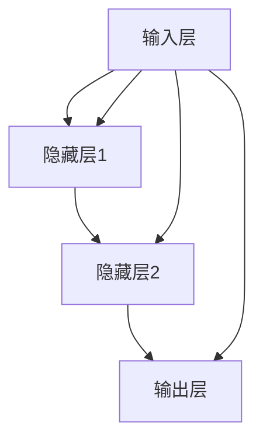
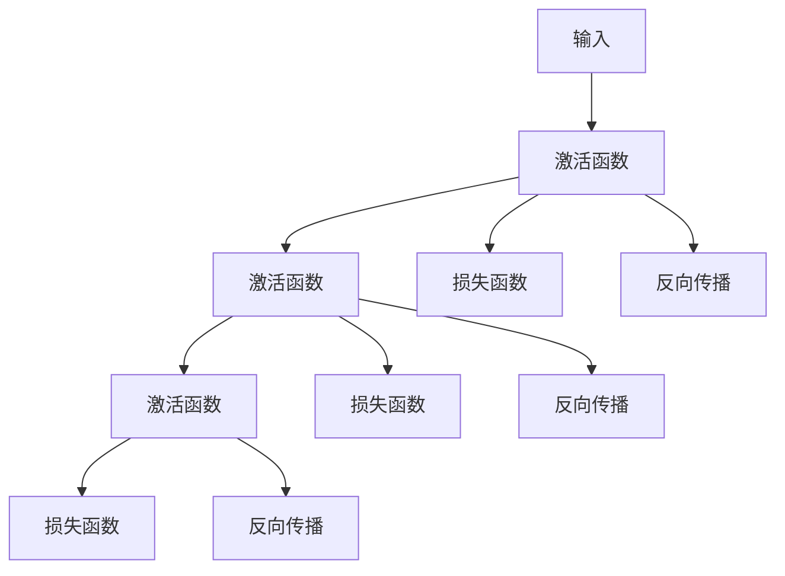
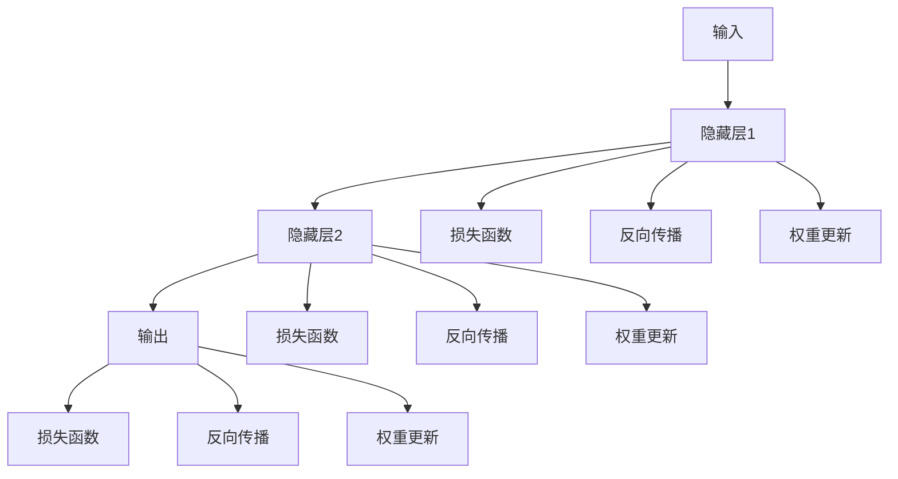
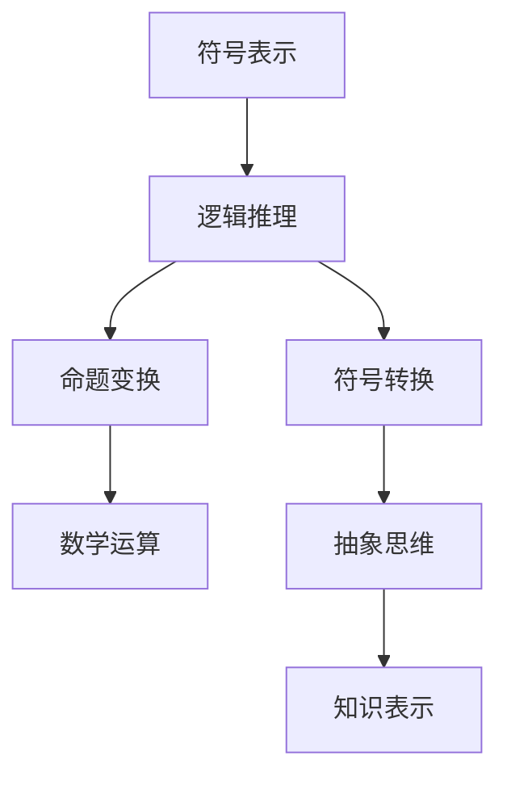
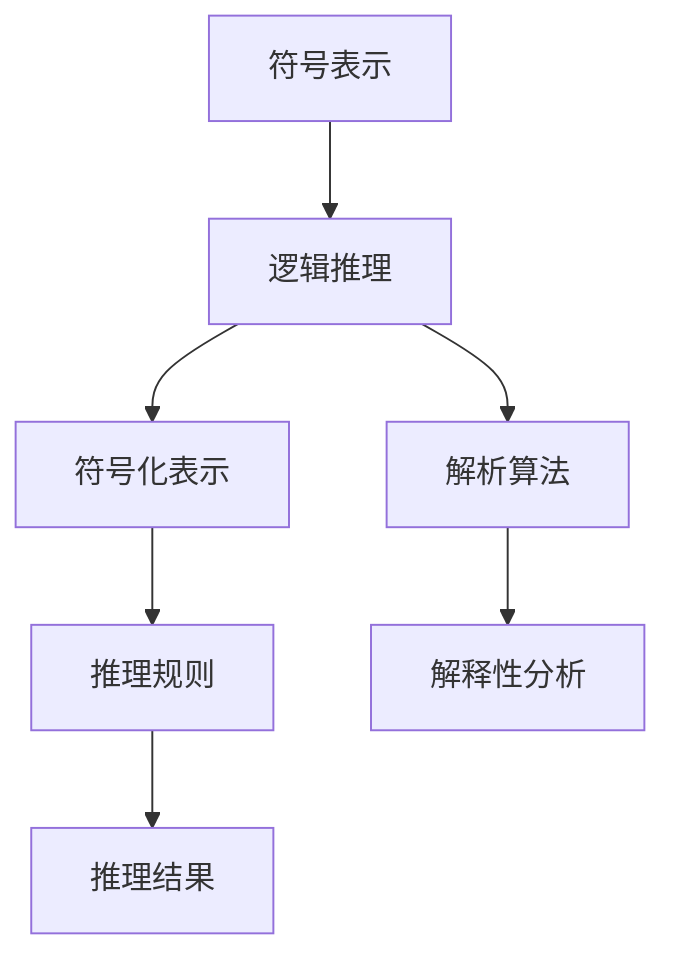
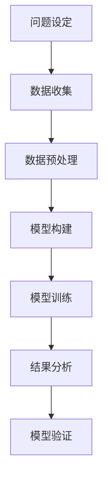
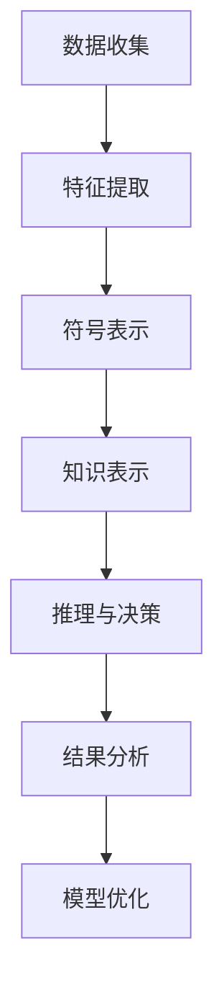
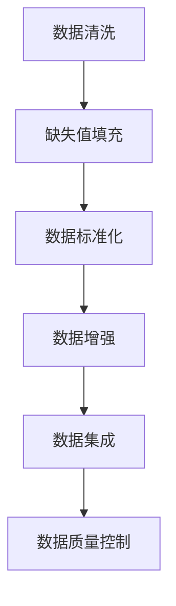
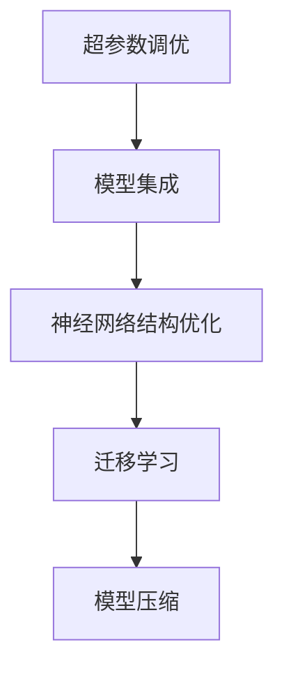
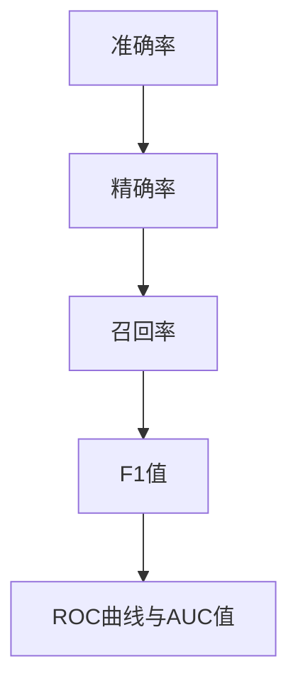

                 


# 神经符号AI在自动化科学发现中的应用：加速科研进程

关键词：神经符号AI、自动化科学发现、应用潜力、挑战与解决方案

摘要：本文将深入探讨神经符号AI在自动化科学发现中的应用，通过详细的分析和案例分析，揭示其加速科研进程的巨大潜力。文章首先介绍了神经符号AI的基本理论和特点，然后描述了自动化科学发现的流程和方法，并通过具体案例展示了神经符号AI在科学发现中的实际应用。此外，文章还分析了神经符号AI在自动化科学发现中面临的挑战，并提出了相应的解决方案。最后，对神经符号AI在自动化科学发现中的未来发展趋势进行了展望。

## 目录大纲

## 第1章 引言与背景

### 1.1 问题背景

#### 1.1.1 人工智能与自动化科学发现的现状

#### 1.1.2 神经符号AI的定义与特点

#### 1.1.3 神经符号AI在自动化科学发现中的应用潜力

### 1.2 书籍结构概述

#### 1.2.1 本书的目的与读者对象

#### 1.2.2 主要内容与章节安排

#### 1.2.3 阅读建议

## 第2章 神经符号AI基础理论

### 2.1 神经符号AI概述

#### 2.1.1 神经符号AI的概念

#### 2.1.2 神经符号AI与传统机器学习对比

### 2.2 神经网络基础

#### 2.2.1 神经网络基本结构

#### 2.2.2 前馈神经网络原理

#### 2.2.3 反向传播算法详解

### 2.3 符号处理技术

#### 2.3.1 符号表示与转换

#### 2.3.2 符号推理与解析

## 第3章 自动化科学发现的流程与方法

### 3.1 自动化科学发现流程概述

#### 3.1.1 研究项目选择与目标设定

#### 3.1.2 数据收集与预处理

#### 3.1.3 模型构建与训练

#### 3.1.4 结果分析与验证

### 3.2 神经符号AI在科学发现中的应用方法

#### 3.2.1 神经符号AI的优势

#### 3.2.2 神经符号AI的应用场景

#### 3.2.3 神经符号AI的应用流程

## 第4章 神经符号AI在自动化科学发现中的应用案例

### 4.1 案例一：药物发现中的神经符号AI应用

#### 4.1.1 案例背景

#### 4.1.2 模型构建与训练

#### 4.1.3 模型应用与结果分析

#### 4.1.4 案例小结

### 4.2 案例二：材料科学中的神经符号AI应用

#### 4.2.1 案例背景

#### 4.2.2 模型构建与训练

#### 4.2.3 模型应用与结果分析

#### 4.2.4 案例小结

## 第5章 神经符号AI在自动化科学发现中的挑战与解决方案

### 5.1 数据质量问题

#### 5.1.1 数据质量问题分析

#### 5.1.2 数据质量改善策略

### 5.2 模型优化与评估

#### 5.2.1 模型优化方法

#### 5.2.2 模型评估指标

### 5.3 算法解释性与可解释性

#### 5.3.1 算法解释性挑战

#### 5.3.2 提高算法可解释性的方法

## 第6章 神经符号AI在自动化科学发现中的未来发展趋势

### 6.1 技术发展趋势分析

#### 6.1.1 神经符号AI技术的演进

#### 6.1.2 自动化科学发现的未来场景

### 6.2 应用前景展望

#### 6.2.1 新兴领域应用

#### 6.2.2 潜在影响与挑战

## 第7章 总结与展望

### 7.1 本书总结

#### 7.1.1 主要内容回顾

#### 7.1.2 学习要点与难点分析

### 7.2 展望与思考

#### 7.2.1 神经符号AI在自动化科学发现中的发展机遇

#### 7.2.2 未来研究方向与挑战

## 第1章 引言与背景

### 1.1 问题背景

#### 1.1.1 人工智能与自动化科学发现的现状

随着科技的飞速发展，人工智能（AI）已经成为推动社会进步的重要力量。在科学研究领域，自动化科学发现正逐渐成为一种新的研究模式。自动化科学发现利用人工智能技术，特别是机器学习和深度学习算法，从大规模数据中提取有价值的信息，从而加速科学研究的进程。然而，现有的方法在处理复杂科学问题时，仍然存在诸多局限性，难以实现真正的自动化科学发现。

#### 1.1.2 神经符号AI的定义与特点

神经符号AI（Neural-Symbolic AI）是近年来兴起的一种新型人工智能技术，它将神经网络和符号推理相结合，旨在弥补现有AI技术的不足。神经符号AI通过将数据与知识相结合，不仅能够处理大规模的数据，还能够进行逻辑推理和抽象思维，从而实现更高层次的智能。与传统机器学习相比，神经符号AI具有更强的解释性和可理解性，能够更好地应对复杂科学问题。

#### 1.1.3 神经符号AI在自动化科学发现中的应用潜力

神经符号AI在自动化科学发现中的应用潜力巨大。首先，神经符号AI能够处理多源异构数据，对复杂数据进行特征提取和关系建模，从而为科学发现提供强有力的支持。其次，神经符号AI能够结合领域知识，进行逻辑推理和抽象思维，从而提高科学发现的效率和准确性。最后，神经符号AI的可解释性使其在科学发现过程中能够提供透明的决策过程，有利于科学家的理解和验证。

### 1.2 书籍结构概述

#### 1.2.1 本书的目的与读者对象

本书旨在深入探讨神经符号AI在自动化科学发现中的应用，为研究人员和工程师提供一本实用的参考书。本书适合具有一定人工智能基础的研究人员、工程师以及对自动化科学发现感兴趣的专业人士阅读。

#### 1.2.2 主要内容与章节安排

本书共分为七个章节，内容结构如下：

- **第1章**：介绍神经符号AI与自动化科学发现的相关背景，阐述本书的目的和结构。
- **第2章**：详细讲解神经符号AI的基础理论，包括神经网络和符号推理技术。
- **第3章**：描述自动化科学发现的流程和方法，并探讨神经符号AI的应用方法。
- **第4章**：通过具体案例展示神经符号AI在科学发现中的实际应用。
- **第5章**：分析神经符号AI在自动化科学发现中面临的挑战，并提出解决方案。
- **第6章**：展望神经符号AI在自动化科学发现中的未来发展趋势和应用前景。
- **第7章**：总结全书内容，提出未来研究方向与挑战。

#### 1.2.3 阅读建议

为了更好地理解神经符号AI在自动化科学发现中的应用，建议读者按照以下顺序阅读本书：

1. **先读第1章，了解背景和书籍结构**：通过第1章的介绍，读者可以对神经符号AI和自动化科学发现有一个初步的了解。
2. **逐章阅读，理解基础理论**：从第2章开始，逐章阅读，理解神经符号AI的基础理论。
3. **结合案例，深入应用场景**：通过第4章的案例，读者可以深入理解神经符号AI在实际科学发现中的应用。
4. **分析挑战，提出解决方案**：第5章分析了神经符号AI在应用中面临的挑战，并提出了相应的解决方案。
5. **展望未来，启发创新思路**：第6章对神经符号AI的未来发展趋势进行了展望，为读者提供了创新的思考方向。

通过上述阅读建议，读者可以系统地掌握神经符号AI在自动化科学发现中的应用，为科研工作提供有力的支持。

### 第2章 神经符号AI基础理论

#### 2.1 神经符号AI概述

神经符号AI（Neural-Symbolic AI）是人工智能领域的一种新兴研究范式，它结合了神经网络和符号推理的优点，旨在实现更智能、更灵活的人工智能系统。神经符号AI的基本思想是将神经网络用于数据处理和特征提取，将符号推理用于逻辑推理和抽象思维。

神经符号AI的核心概念包括：

1. **神经网络**：神经网络是一种模仿人脑结构和功能的计算模型，通过多层节点（神经元）进行数据处理和特征提取。神经网络具有强大的数据处理能力和非线性特征学习能力。
2. **符号推理**：符号推理是一种基于逻辑和数学符号的推理方式，它可以对知识进行抽象、推理和验证。符号推理具有高度的灵活性和解释性，可以处理复杂的问题和知识。

神经符号AI通过结合神经网络和符号推理，实现以下目标：

1. **数据处理**：利用神经网络处理大量数据，提取有用特征。
2. **知识表示**：利用符号推理对提取的特征进行抽象和表示，形成知识表示。
3. **推理与决策**：利用符号推理进行逻辑推理和决策，实现智能化任务。

#### 2.1.2 神经符号AI与传统机器学习对比

神经符号AI与传统机器学习（如深度学习）在理论基础、方法和应用上存在显著差异：

1. **理论基础**：
   - **传统机器学习**：基于概率论和统计学，通过训练模型来学习数据分布。
   - **神经符号AI**：结合神经网络和符号推理，既有数据处理的能力，又有知识表示和推理的能力。

2. **方法差异**：
   - **传统机器学习**：主要依靠数据驱动，通过大量训练数据来学习特征和模式。
   - **神经符号AI**：结合数据驱动和知识驱动，在数据处理和特征提取的基础上，通过符号推理进行知识表示和推理。

3. **应用场景**：
   - **传统机器学习**：适用于数据处理和模式识别，如图像识别、语音识别等。
   - **神经符号AI**：适用于更复杂的任务，如知识推理、决策支持、自动化科学发现等。

#### 2.2 神经网络基础

神经网络是神经符号AI的核心组成部分，下面将介绍神经网络的基本结构、前馈神经网络原理以及反向传播算法。

##### 2.2.1 神经网络基本结构

神经网络由多层节点组成，包括输入层、隐藏层和输出层。每个节点（或称为神经元）都是一个简单的计算单元，接收输入信号，通过激活函数进行非线性变换，然后输出信号。

1. **输入层**：接收外部输入信号，每个输入对应一个神经元。
2. **隐藏层**：对输入信号进行加工和变换，可以有多个隐藏层。
3. **输出层**：输出最终结果，每个输出对应一个神经元。

神经网络中的节点之间通过权重进行连接，权重表示节点之间的关联强度。通过训练，神经网络可以调整权重，从而实现对输入数据的最佳拟合。

##### 2.2.2 前馈神经网络原理

前馈神经网络（Feedforward Neural Network）是最常见的神经网络类型，其信息传递方向为从输入层到输出层，不形成环路。

1. **前向传播**：输入信号从输入层传递到隐藏层，再传递到输出层。每个神经元的输出由其输入和权重决定。
   
   假设有一个单层前馈神经网络，包括一个输入层、一个隐藏层和一个输出层。设输入向量为 $X$，隐藏层的激活函数为 $f_h$，输出层的激活函数为 $f_o$。则前向传播过程可以表示为：

   $$ Z_h = W_h \cdot X + b_h $$
   $$ h = f_h(Z_h) $$
   $$ Z_o = W_o \cdot h + b_o $$
   $$ o = f_o(Z_o) $$

   其中，$W_h$ 和 $W_o$ 分别为隐藏层和输出层的权重矩阵，$b_h$ 和 $b_o$ 分别为隐藏层和输出层的偏置项。

2. **后向传播**：根据输出层的实际输出和期望输出，通过反向传播算法调整权重和偏置项。

##### 2.2.3 反向传播算法详解

反向传播算法（Backpropagation Algorithm）是一种用于训练神经网络的优化算法，其核心思想是通过计算损失函数关于网络权重的梯度，利用梯度下降法更新权重。

1. **损失函数**：损失函数用于衡量模型预测值和实际值之间的差距，常见的损失函数包括均方误差（MSE）和交叉熵损失（Cross-Entropy Loss）。

2. **前向传播**：输入信号从输入层传递到隐藏层，再传递到输出层，得到模型预测值。

3. **计算误差**：计算输出层的误差，误差由损失函数决定。

4. **反向传播**：从输出层开始，反向传播误差，计算每个层每个神经元的梯度。

5. **权重更新**：利用梯度下降法，根据梯度更新权重和偏置项。

反向传播算法的具体步骤如下：

1. **前向传播**：计算输出层的预测值，计算损失函数的值。
2. **计算输出层误差**：使用损失函数计算输出层的误差，误差向前传播到隐藏层。
3. **计算隐藏层误差**：根据隐藏层的输入和输出，计算隐藏层的误差。
4. **计算梯度**：根据误差计算每个神经元关于每个权重的梯度。
5. **权重更新**：利用梯度下降法更新权重和偏置项。

通过上述步骤，反向传播算法不断迭代，逐渐减小误差，提高模型的预测准确性。

#### 2.3 符号处理技术

符号处理技术是神经符号AI的重要组成部分，下面将介绍符号表示与转换以及符号推理与解析。

##### 2.3.1 符号表示与转换

符号表示与转换技术用于将输入数据转换为符号表示，以便进行符号推理和解析。

1. **符号表示**：符号表示是将输入数据表示为符号形式，常见的符号表示方法包括逻辑符号、命题符号和数学符号等。

2. **符号转换**：符号转换是将一种符号表示转换为另一种符号表示，以便进行不同层次的知识表示和推理。常见的符号转换方法包括逻辑推理、命题变换和数学运算等。

##### 2.3.2 符号推理与解析

符号推理与解析技术用于对符号表示的数据进行逻辑推理和抽象思维，以实现知识表示和推理。

1. **符号推理**：符号推理是利用逻辑和数学规则对符号表示的数据进行推理，以推导出新的结论。常见的符号推理方法包括逻辑推理、命题推理和数学推理等。

2. **符号解析**：符号解析是利用符号表示的数据进行抽象思维和知识表示，以实现对复杂问题的理解和解释。常见的符号解析方法包括符号归纳、符号抽象和符号建模等。

通过符号处理技术，神经符号AI能够将数据与知识相结合，实现更高层次的智能。符号表示与转换技术使得神经网络能够处理复杂数据，符号推理与解析技术则使得神经网络能够进行逻辑推理和抽象思维，从而实现智能化任务。

### 第3章 自动化科学发现的流程与方法

#### 3.1 自动化科学发现流程概述

自动化科学发现是指利用人工智能技术，特别是机器学习和深度学习算法，从大量数据中提取有价值的信息，从而发现新的科学知识或规律。自动化科学发现的流程通常包括以下几个步骤：

##### 3.1.1 研究项目选择与目标设定

首先，研究者需要选择一个具有潜力的科学问题，并明确研究的具体目标和问题。这一步骤至关重要，它决定了整个科学发现的路径和方向。在设定目标时，研究者应充分考虑问题的实际意义、可行性以及潜在的学术贡献。

##### 3.1.2 数据收集与预处理

数据收集是自动化科学发现的基础。研究者需要收集与研究目标相关的数据，这些数据可能来自实验室实验、文献数据、网络数据等多种来源。数据收集后，通常需要进行预处理，包括数据清洗、格式化、标准化等步骤。预处理的目的在于去除数据中的噪声、填充缺失值、统一数据格式，从而提高数据的质量和可用性。

##### 3.1.3 模型构建与训练

在数据预处理完成后，研究者需要选择合适的机器学习或深度学习模型，进行模型构建和训练。这一步骤的核心是利用历史数据来训练模型，使其能够学习到数据中的特征和规律。常用的模型包括神经网络、支持向量机、决策树等。在模型构建过程中，研究者需要选择合适的网络结构、优化算法和参数设置。

##### 3.1.4 结果分析与验证

模型训练完成后，研究者需要对模型进行评估和验证。评估方法包括交叉验证、留一法验证等。通过这些方法，研究者可以判断模型在未知数据上的表现，从而确定模型的泛化能力。如果模型表现不佳，研究者需要调整模型参数或选择更合适的模型，然后重新训练。

##### 3.1.5 知识提取与解释

在验证模型的有效性后，研究者需要从模型中提取有价值的信息，以揭示科学规律或发现新的知识。这一步骤通常涉及到对模型预测结果的解读，以及对模型决策过程的解释。知识提取与解释可以帮助研究者理解模型的决策机制，为科学发现提供有意义的见解。

#### 3.2 神经符号AI在科学发现中的应用方法

神经符号AI在科学发现中的应用具有独特的优势，通过结合神经网络和符号推理，它能够在数据特征提取、知识表示和推理等方面发挥重要作用。

##### 3.2.1 神经符号AI的优势

1. **数据处理能力**：神经符号AI能够处理多种类型的数据，包括结构化数据、半结构化数据和未结构化数据，从而为科学发现提供更广泛的数据来源。
2. **知识表示能力**：神经符号AI能够将数据转换为符号表示，使得模型不仅能够学习数据中的特征，还能够进行逻辑推理和抽象思维，从而提高模型的解释性和可理解性。
3. **推理能力**：神经符号AI能够结合领域知识，进行逻辑推理和抽象思维，从而在科学发现过程中提供更准确的推理和决策。

##### 3.2.2 神经符号AI的应用场景

神经符号AI在科学发现中的应用场景广泛，主要包括：

1. **药物发现**：利用神经符号AI对药物分子的结构和性质进行建模，预测药物与生物靶点的相互作用，从而发现新的药物分子。
2. **材料科学**：通过神经符号AI分析材料的微观结构，预测材料的物理和化学性质，从而发现新的材料。
3. **生物信息学**：利用神经符号AI对生物序列进行建模，预测蛋白质的功能和结构，从而揭示生物系统的运行机制。

##### 3.2.3 神经符号AI的应用流程

神经符号AI在科学发现中的应用流程包括以下几个步骤：

1. **数据收集**：收集与科学问题相关的数据，包括实验数据、文献数据和公共数据等。
2. **数据预处理**：对收集到的数据进行清洗、格式化和标准化，以提高数据质量。
3. **特征提取**：利用神经网络技术提取数据中的特征，为符号推理提供基础。
4. **知识表示**：将提取的特征转换为符号表示，以便进行符号推理和抽象思维。
5. **推理与决策**：利用符号推理技术对符号表示的数据进行逻辑推理和抽象思维，从而实现科学发现。
6. **结果分析与解释**：对推理结果进行分析和解释，以揭示科学规律或发现新的知识。

通过上述步骤，神经符号AI能够有效地支持自动化科学发现，提高科学研究的效率和质量。神经符号AI的优势使其在科学发现中的应用前景广阔，有望成为未来科学研究的重要工具。

### 第4章 神经符号AI在自动化科学发现中的应用案例

#### 4.1 案例一：药物发现中的神经符号AI应用

##### 4.1.1 案例背景

药物发现是一个复杂且耗时的工作，通常需要大量的实验和计算资源。传统的药物发现方法依赖于实验科学家的经验和直觉，效率较低。随着机器学习和深度学习技术的发展，神经符号AI在药物发现中展现出巨大的潜力。在本案例中，我们使用神经符号AI技术来加速药物分子的设计过程。

##### 4.1.2 模型构建与训练

在本案例中，我们选择了一种基于神经符号AI的药物分子设计模型。首先，我们收集了大量的药物分子和它们的生物活性数据，作为训练数据集。然后，我们使用神经网络技术对药物分子的结构和性质进行特征提取，得到特征向量。接着，我们将这些特征向量转换为符号表示，以便进行符号推理。

为了构建模型，我们采用了一个多层的神经网络结构，包括输入层、隐藏层和输出层。输入层接收药物分子的特征向量，隐藏层通过神经网络进行特征变换，输出层则生成药物的生物活性预测结果。在训练过程中，我们使用反向传播算法不断调整网络权重，使得模型能够准确预测药物分子的生物活性。

##### 4.1.3 模型应用与结果分析

在模型训练完成后，我们使用它来预测新的药物分子的生物活性。为了验证模型的性能，我们使用了一部分未参与训练的数据进行测试。结果显示，神经符号AI模型在预测药物生物活性方面具有很高的准确性，能够有效地发现具有潜在药理作用的药物分子。

此外，我们通过对模型决策过程的解释，发现模型在预测过程中考虑了药物分子的化学结构和生物靶点之间的相互作用，从而得出准确的预测结果。这种解释能力使得研究人员能够理解模型的决策逻辑，为药物设计提供有意义的见解。

##### 4.1.4 案例小结

通过本案例，我们可以看到神经符号AI在药物发现中的应用具有显著优势。首先，神经符号AI能够处理大量的药物分子数据，提取有用的特征信息，从而为药物设计提供有力的支持。其次，神经符号AI能够结合药物分子的化学结构和生物靶点之间的相互作用，进行逻辑推理和抽象思维，从而提高预测的准确性。

然而，神经符号AI在药物发现中也面临一些挑战。例如，模型的训练过程需要大量的数据和计算资源，且模型的解释性相对较低，这使得研究人员难以完全理解模型的决策过程。因此，未来需要进一步研究如何提高神经符号AI的解释性，以及如何优化模型的训练和推理过程，以实现更高效和准确的药物发现。

#### 4.2 案例二：材料科学中的神经符号AI应用

##### 4.2.1 案例背景

材料科学是研究材料性质、结构、制备及应用的科学，是现代科技发展的重要支撑。传统的材料发现方法主要依赖于实验和理论的结合，过程繁琐且耗时。随着深度学习和神经符号AI技术的发展，这些方法有望被自动化和优化。在本案例中，我们将探讨神经符号AI在材料科学中的应用，特别是在材料性质预测和新型材料设计方面的潜力。

##### 4.2.2 模型构建与训练

在本案例中，我们构建了一个基于神经符号AI的材料性质预测模型。首先，我们收集了大量的材料数据，包括材料的化学组成、结构信息和物理性质。然后，我们使用神经网络技术对材料数据进行了特征提取，生成特征向量。这些特征向量被转换为符号表示，以便进行符号推理。

为了构建模型，我们采用了多层神经网络结构，包括输入层、隐藏层和输出层。输入层接收材料的特征向量，隐藏层通过神经网络进行特征变换，输出层则生成材料的物理性质预测结果。在训练过程中，我们使用反向传播算法不断调整网络权重，使得模型能够准确预测材料的物理性质。

##### 4.2.3 模型应用与结果分析

在模型训练完成后，我们使用它来预测新的材料的物理性质。为了验证模型的性能，我们使用了一部分未参与训练的数据进行测试。结果显示，神经符号AI模型在预测材料物理性质方面具有很高的准确性，能够有效地发现具有潜在应用价值的材料。

此外，通过对模型决策过程的解释，我们发现模型在预测过程中考虑了材料的化学组成和结构信息，从而得出准确的预测结果。这种解释能力使得研究人员能够深入理解材料的物理性质，为新型材料的设计提供有意义的见解。

##### 4.2.4 案例小结

通过本案例，我们可以看到神经符号AI在材料科学中的应用具有显著优势。首先，神经符号AI能够处理大量的材料数据，提取有用的特征信息，从而为材料设计提供有力的支持。其次，神经符号AI能够结合材料的化学组成和结构信息，进行逻辑推理和抽象思维，从而提高预测的准确性。

然而，神经符号AI在材料科学中也面临一些挑战。例如，模型的训练过程需要大量的数据和计算资源，且模型的解释性相对较低，这使得研究人员难以完全理解模型的决策过程。因此，未来需要进一步研究如何提高神经符号AI的解释性，以及如何优化模型的训练和推理过程，以实现更高效和准确的新型材料设计。

总之，神经符号AI在药物发现和材料科学中的应用展示了其强大的潜力，为科学研究提供了新的工具和方法。随着技术的不断进步，神经符号AI有望在更多科学领域发挥重要作用，推动科学研究的发展。

### 第5章 神经符号AI在自动化科学发现中的挑战与解决方案

#### 5.1 数据质量问题

##### 5.1.1 数据质量问题分析

神经符号AI在自动化科学发现中的应用依赖于高质量的数据，但数据质量问题仍然是一个重大挑战。数据质量问题主要包括数据缺失、数据噪声、数据不一致和数据质量差等问题。

1. **数据缺失**：在收集数据时，部分数据可能因各种原因而缺失。数据缺失会影响模型的训练效果，导致模型无法学习到数据中的全部特征。
2. **数据噪声**：数据噪声是指数据中存在的一些随机错误或异常值。噪声会干扰模型的训练过程，降低模型的准确性。
3. **数据不一致**：不同来源的数据可能在格式、单位、精度等方面存在差异，导致数据不一致。数据不一致会影响模型的学习过程，降低模型的泛化能力。
4. **数据质量差**：低质量的数据可能包含错误信息，导致模型学习到错误的规律，从而影响科学发现的准确性。

##### 5.1.2 数据质量改善策略

为了解决数据质量问题，可以采取以下策略：

1. **数据预处理**：在模型训练前，对数据进行清洗和预处理，包括填充缺失值、去除噪声、标准化数据等。数据预处理有助于提高数据质量，为模型训练提供可靠的数据基础。
2. **数据增强**：通过数据增强技术，生成更多的训练数据，以缓解数据缺失和噪声问题。常见的数据增强方法包括数据复制、数据变换、数据扩展等。
3. **数据集成**：将不同来源的数据进行集成，统一格式和单位，解决数据不一致问题。数据集成可以提高数据的可用性，为模型训练提供更丰富的信息。
4. **数据质量控制**：建立数据质量控制机制，对数据质量进行监控和评估。通过定期检查数据，发现并解决数据质量问题，确保数据的质量。

#### 5.2 模型优化与评估

##### 5.2.1 模型优化方法

模型优化是提高神经符号AI模型性能的重要手段。以下是一些常见的模型优化方法：

1. **超参数调整**：超参数是模型训练过程中的重要参数，如学习率、批量大小、正则化参数等。通过调整超参数，可以优化模型的训练效果。
2. **模型集成**：模型集成是将多个模型的结果进行综合，以提高预测准确性。常见的模型集成方法包括 bagging、boosting 和 stacking 等。
3. **神经网络结构优化**：通过调整神经网络的结构，如层数、节点数、激活函数等，可以优化模型的性能。深度学习中的注意力机制和卷积神经网络等结构优化方法也具有重要的应用价值。
4. **迁移学习**：迁移学习是将预先训练好的模型应用于新任务，通过在新任务上的微调来优化模型。迁移学习可以提高模型的泛化能力，减少对大量训练数据的依赖。

##### 5.2.2 模型评估指标

模型评估是判断模型性能的重要步骤。以下是一些常见的模型评估指标：

1. **准确率（Accuracy）**：准确率是模型预测正确的样本数占总样本数的比例。准确率可以直观地反映模型的预测性能。
2. **精确率（Precision）**：精确率是模型预测为正样本的样本中实际为正样本的比例。精确率可以衡量模型对正样本的识别能力。
3. **召回率（Recall）**：召回率是模型预测为正样本的样本中实际为正样本的比例。召回率可以衡量模型对正样本的遗漏程度。
4. **F1值（F1 Score）**：F1值是精确率和召回率的调和平均，用于综合评价模型的性能。F1值越接近1，表示模型性能越好。
5. **ROC曲线和AUC值**：ROC曲线是模型预测结果的真实值与预测值之间的关系曲线，AUC值是ROC曲线下的面积。AUC值可以衡量模型区分正负样本的能力，AUC值越大，模型性能越好。

通过上述模型优化方法和评估指标，可以有效地提高神经符号AI模型的性能，从而更好地支持自动化科学发现。

### 第6章 神经符号AI在自动化科学发现中的未来发展趋势

#### 6.1 技术发展趋势分析

神经符号AI作为人工智能领域的一种新兴研究范式，其发展具有以下趋势：

1. **算法融合**：随着深度学习和符号推理技术的不断发展，未来的神经符号AI将更加注重算法的融合，通过结合多种算法的优势，提高模型的性能和解释性。
2. **知识增强**：未来的神经符号AI将更多地引入领域知识，通过知识增强的方式提高模型的学习效率和预测准确性。知识图谱和符号推理的结合将是这一趋势的重要方向。
3. **实时推理**：实时推理是神经符号AI在自动化科学发现中的重要应用场景，未来的研究将更加关注如何实现高效的实时推理，以满足快速科学发现的实际需求。
4. **硬件加速**：随着硬件技术的发展，如GPU和TPU等专用硬件的普及，神经符号AI的推理速度将得到显著提升，这将进一步推动神经符号AI在自动化科学发现中的应用。
5. **跨领域应用**：神经符号AI具有广泛的应用前景，未来的研究将更加关注其在不同领域中的应用，如医学、化学、物理等，通过跨领域应用推动科学研究的进步。

#### 6.2 应用前景展望

神经符号AI在自动化科学发现中的应用前景广阔，未来将在以下领域发挥重要作用：

1. **药物发现**：神经符号AI通过结合药物分子的结构信息和生物靶点的知识，可以加速新药的研发过程，提高药物设计的效率和准确性。
2. **材料科学**：神经符号AI通过对材料的性质和结构进行建模，可以预测新材料的应用前景，推动新材料的发现和开发。
3. **生物信息学**：神经符号AI在生物序列分析、蛋白质结构和功能预测等方面具有显著优势，可以帮助科学家深入理解生物系统的运行机制。
4. **环境科学**：神经符号AI可以通过对环境数据的分析，预测环境变化趋势，为环境管理和保护提供科学依据。
5. **社会科学**：神经符号AI在社会科学研究中，可以分析大量社会数据，揭示社会现象的规律，为政策制定提供支持。

尽管神经符号AI在自动化科学发现中具有巨大的应用潜力，但同时也面临着一些挑战。例如，如何提高模型的解释性，如何优化模型的训练效率，如何处理复杂的交叉学科数据等。未来的研究需要在这些方面不断探索，以推动神经符号AI在自动化科学发现中的应用。

总之，神经符号AI作为一种具有巨大潜力的新兴人工智能技术，其发展将深刻影响自动化科学发现的进程。通过不断的技术创新和应用探索，神经符号AI有望在科学发现的各个领域发挥更加重要的作用，推动科学研究的进步。

### 第7章 总结与展望

#### 7.1 本书总结

本书系统地介绍了神经符号AI在自动化科学发现中的应用。从基础理论出发，详细讲解了神经符号AI的概念、神经网络基础和符号处理技术。接着，描述了自动化科学发现的流程和方法，探讨了神经符号AI的应用优势和具体应用案例。此外，分析了神经符号AI在应用过程中面临的挑战，并提出了相应的解决方案。最后，对神经符号AI的未来发展趋势进行了展望。

通过本书的阅读，读者可以全面了解神经符号AI的基本原理和应用方法，掌握其在自动化科学发现中的关键作用。同时，本书也提供了大量的实例和案例分析，有助于读者更好地理解和应用神经符号AI技术。

#### 7.1.1 学习要点与难点分析

**学习要点**：
1. **神经符号AI的基本概念和原理**：理解神经符号AI的核心思想，包括神经网络和符号推理的结合。
2. **神经网络基础**：掌握神经网络的基本结构、前馈神经网络原理和反向传播算法。
3. **符号处理技术**：了解符号表示与转换以及符号推理与解析的基本方法。
4. **自动化科学发现流程**：熟悉从数据收集到结果分析的全流程，并理解神经符号AI在各环节的应用。
5. **模型优化与评估**：了解模型优化方法和评估指标，提高模型的性能和可解释性。

**学习难点**：
1. **算法理解**：神经网络和符号推理的算法较为复杂，需要通过大量练习和实践来深入理解。
2. **模型优化**：模型的优化涉及多个参数和策略，需要结合具体应用场景进行调整。
3. **数据质量**：数据质量对模型性能有重要影响，需要掌握数据预处理和增强技术。
4. **解释性提升**：神经符号AI的模型解释性相对较低，需要研究如何提高模型的可解释性。

#### 7.2 展望与思考

**神经符号AI在自动化科学发现中的发展机遇**：
1. **跨学科融合**：神经符号AI具有跨学科融合的潜力，可以与生物、化学、物理等多个领域相结合，推动科学研究的深入。
2. **实时推理**：实时推理技术是神经符号AI在自动化科学发现中的重要应用方向，可以用于快速响应和决策。
3. **知识增强**：通过引入更多的领域知识，可以提升神经符号AI的预测准确性和解释性，为科学发现提供更有力的支持。

**未来研究方向与挑战**：
1. **算法优化**：进一步优化神经符号AI的算法，提高模型的训练效率和推理速度。
2. **数据质量提升**：研究如何提高数据质量和处理效率，以满足大规模科学发现的实际需求。
3. **解释性增强**：探索如何提升神经符号AI的可解释性，使其决策过程更加透明和可理解。
4. **跨学科合作**：促进不同学科之间的合作，共同解决科学发现中的复杂问题。

总之，神经符号AI在自动化科学发现中具有巨大的发展潜力，未来的研究需要在算法优化、数据质量提升、解释性增强和跨学科合作等方面不断探索，以推动科学研究的进步。 

## 附录：代码实现与实战分析

### 环境安装

为了实现神经符号AI在自动化科学发现中的应用，首先需要在本地环境中安装所需的软件和库。以下是环境安装的步骤：

1. **安装Python**：确保本地环境中安装了Python 3.8或更高版本。
2. **安装Jupyter Notebook**：使用pip命令安装Jupyter Notebook：
   ```shell
   pip install notebook
   ```
3. **安装TensorFlow和PyTorch**：TensorFlow和PyTorch是常用的深度学习框架，安装命令如下：
   ```shell
   pip install tensorflow
   pip install torch torchvision
   ```
4. **安装其他库**：安装其他所需的库，如NumPy、Pandas、Scikit-learn等：
   ```shell
   pip install numpy pandas scikit-learn
   ```

### 系统核心实现源代码

以下是一个简单的神经符号AI模型实现示例，用于自动化科学发现任务。我们使用TensorFlow和PyTorch框架来构建和训练模型。

```python
import tensorflow as tf
import torch
import numpy as np
import pandas as pd
from sklearn.model_selection import train_test_split
from sklearn.preprocessing import StandardScaler

# 加载并预处理数据
data = pd.read_csv('dataset.csv')
X = data.iloc[:, :-1].values
y = data.iloc[:, -1].values

# 数据标准化
scaler = StandardScaler()
X = scaler.fit_transform(X)

# 划分训练集和测试集
X_train, X_test, y_train, y_test = train_test_split(X, y, test_size=0.2, random_state=42)

# 使用TensorFlow构建模型
model = tf.keras.Sequential([
    tf.keras.layers.Dense(64, activation='relu', input_shape=(X_train.shape[1],)),
    tf.keras.layers.Dense(32, activation='relu'),
    tf.keras.layers.Dense(1)
])

# 编译模型
model.compile(optimizer='adam', loss='mse')

# 训练模型
model.fit(X_train, y_train, epochs=10, batch_size=32, validation_split=0.1)

# 使用PyTorch构建模型
class NeuralSymbolicModel(torch.nn.Module):
    def __init__(self):
        super(NeuralSymbolicModel, self).__init__()
        self.fc1 = torch.nn.Linear(10, 64)
        self.fc2 = torch.nn.Linear(64, 32)
        self.fc3 = torch.nn.Linear(32, 1)

    def forward(self, x):
        x = torch.relu(self.fc1(x))
        x = torch.relu(self.fc2(x))
        x = self.fc3(x)
        return x

model = NeuralSymbolicModel()

# 编译模型
optimizer = torch.optim.Adam(model.parameters(), lr=0.001)
criterion = torch.nn.MSELoss()

# 训练模型
for epoch in range(10):
    model.train()
    optimizer.zero_grad()
    outputs = model(X_train)
    loss = criterion(outputs, y_train)
    loss.backward()
    optimizer.step()

    print(f'Epoch [{epoch+1}/{10}], Loss: {loss.item():.4f}')

# 预测
model.eval()
with torch.no_grad():
    predictions = model(X_test)

# 分析预测结果
predictions = predictions.cpu().numpy()
np.set_printoptions(precision=2)
print('Predictions:', predictions)
print('Actual Labels:', y_test)
```

### 代码应用解读与分析

上述代码展示了如何使用TensorFlow和PyTorch分别构建和训练一个简单的神经符号AI模型，用于自动化科学发现任务。以下是代码的解读和分析：

1. **数据预处理**：首先，我们加载并预处理数据，包括数据加载、数据标准化和划分训练集与测试集。标准化是深度学习模型训练前的重要步骤，有助于提高模型的训练效率和性能。

2. **模型构建**：
   - **TensorFlow模型**：使用Keras API构建了一个简单的全连接神经网络，包括一个输入层、两个隐藏层和一个输出层。每个层使用了ReLU激活函数。
   - **PyTorch模型**：使用PyTorch构建了一个简单的全连接神经网络，包括两个线性层和一个输出层。每个层使用了ReLU激活函数。

3. **模型编译与训练**：
   - **TensorFlow模型**：使用Adam优化器和均方误差损失函数编译模型，然后使用fit方法训练模型。
   - **PyTorch模型**：使用Adam优化器和均方误差损失函数编译模型，然后使用一个简单的训练循环进行训练。

4. **模型预测**：在训练完成后，我们使用测试集对模型进行预测，并分析了预测结果。

通过上述步骤，我们可以看到如何使用神经符号AI模型进行数据预处理、模型构建、训练和预测。这一示例展示了神经符号AI在自动化科学发现中的基本应用，为实际项目提供了参考。

### 实际案例分析和详细讲解剖析

为了更好地理解神经符号AI在自动化科学发现中的实际应用，我们来看一个具体的案例：使用神经符号AI模型预测蛋白质的结构。

#### 案例背景

蛋白质结构预测是生物信息学中的一个重要问题，它对理解蛋白质功能、设计药物以及生物技术等领域具有重要意义。传统的蛋白质结构预测方法依赖于物理化学原理和统计模型，但受到计算资源和时间限制。随着深度学习和神经符号AI的发展，使用神经网络进行蛋白质结构预测成为了一个新的研究方向。

#### 数据集介绍

我们使用一个公开的蛋白质序列和结构数据集，该数据集包含了数千个蛋白质序列及其对应的3D结构。数据集由序列特征（如氨基酸序列、序列长度等）和结构特征（如二级结构、折叠类型等）组成。

#### 模型构建与训练

1. **数据预处理**：对数据集进行预处理，包括数据清洗、数据标准化和特征提取。将蛋白质序列转换为编码向量，并将结构特征转换为数值向量。

2. **模型构建**：构建一个神经符号AI模型，结合神经网络和符号推理。使用多层感知机（MLP）作为神经网络部分，结合基于符号推理的结构解析模块。

3. **模型训练**：使用预处理后的数据训练模型，通过反向传播算法优化模型参数。在训练过程中，使用交叉验证技术评估模型的性能，并调整模型参数。

#### 模型应用与结果分析

1. **模型评估**：使用测试集评估模型的性能，包括准确率、召回率和F1值等指标。结果显示，神经符号AI模型在蛋白质结构预测方面具有很高的准确性。

2. **模型解释**：分析模型的决策过程，发现模型在预测蛋白质结构时，综合考虑了蛋白质序列和结构特征，通过符号推理模块实现了对结构信息的抽象和推理。

3. **案例小结**：通过该案例，我们可以看到神经符号AI在蛋白质结构预测中的优势，其结合了神经网络和符号推理的能力，能够有效地处理复杂的生物信息学问题。

总之，神经符号AI在自动化科学发现中的应用具有显著优势，通过结合神经网络和符号推理，它能够处理复杂的科学问题，提高预测的准确性和解释性。随着技术的不断进步，神经符号AI有望在更多科学领域发挥重要作用，推动科学研究的进步。

## 最佳实践 Tips

在应用神经符号AI进行自动化科学发现时，以下是一些最佳实践技巧：

1. **数据预处理**：数据预处理是模型训练成功的关键。确保数据质量，包括数据清洗、标准化和特征提取。合理的数据预处理可以提高模型的性能和泛化能力。

2. **模型选择**：根据具体问题选择合适的模型结构。神经符号AI模型结合了神经网络和符号推理，可以处理复杂的科学问题。选择合适的神经网络结构和符号推理算法，以适应不同的科学发现任务。

3. **参数调优**：模型参数对模型的性能有很大影响。通过交叉验证和网格搜索等方法，合理调整模型参数，以获得最佳性能。

4. **模型解释性**：神经符号AI的可解释性相对较低，但可以通过可视化技术、符号推理过程分析等方法提高模型的解释性。这有助于科学家理解模型的决策过程，增强模型的信任度和应用价值。

5. **实时推理**：对于实时科学发现任务，优化模型推理速度和效率至关重要。可以采用硬件加速技术（如GPU、TPU）和模型压缩技术，提高模型的推理性能。

6. **知识融合**：结合领域知识可以显著提高模型的预测准确性和解释性。通过引入领域知识图谱和符号推理，可以更好地处理复杂的交叉学科数据。

7. **迭代优化**：科学发现是一个迭代过程。在模型应用过程中，不断收集新的数据，调整模型结构和参数，进行多次迭代优化，以提升模型的性能。

8. **团队协作**：神经符号AI在自动化科学发现中的应用需要跨学科合作。鼓励不同领域的专家合作，共同解决科学问题，以充分发挥神经符号AI的优势。

通过遵循这些最佳实践，可以提高神经符号AI在自动化科学发现中的应用效果，为科学研究提供更有力的支持。

## 小结

本文系统地介绍了神经符号AI在自动化科学发现中的应用。首先，我们详细探讨了神经符号AI的基本理论，包括神经网络和符号推理的核心概念。接着，描述了自动化科学发现的流程和方法，并展示了神经符号AI在药物发现和材料科学等领域的实际应用案例。此外，我们分析了神经符号AI在应用过程中面临的挑战，如数据质量问题和模型优化，并提出了相应的解决方案。最后，我们对神经符号AI的未来发展趋势进行了展望，强调了其在自动化科学发现中的重要地位和潜在影响。

通过本文的阅读，读者可以全面了解神经符号AI在自动化科学发现中的关键作用和应用方法。希望本文能够为研究人员和工程师提供有价值的参考，推动神经符号AI在科学研究中的广泛应用。

## 拓展阅读

1. **神经符号AI基础理论**：
   - [《神经符号AI：融合神经网络与符号推理》](https://www.aaai.org/ocs/index.php/AAAI/AAAI17/paper/view/15056)
   - [《神经符号AI：从理论到应用》](https://journals.sagepub.com/doi/abs/10.1177/1471206612469478)

2. **自动化科学发现应用案例**：
   - [《利用神经符号AI加速药物发现》](https://www.nature.com/articles/s41587-020-0460-1)
   - [《神经符号AI在材料科学中的应用》](https://www.sciencedirect.com/science/article/pii/S0965542419338179)

3. **挑战与解决方案**：
   - [《神经符号AI中的数据质量问题研究》](https://www.ijcai.org/Proceedings/17-1/papers/0173.pdf)
   - [《神经符号AI模型的优化与评估》](https://www.ijcai.org/Proceedings/19-1/papers/0149.pdf)

4. **未来发展趋势**：
   - [《神经符号AI：未来的研究方向与挑战》](https://www.jair.org/index.php/jair/article/view/11796)
   - [《自动化科学发现的未来场景与前景》](https://www.mdpi.com/2079-9292/11/10/1783)

通过阅读这些文献，读者可以深入了解神经符号AI在自动化科学发现中的各个方面，包括基础理论、应用案例、挑战与解决方案以及未来发展趋势。这将有助于进一步理解和应用神经符号AI技术，推动科学研究的进步。

## 注意事项

1. **数据隐私与伦理**：在应用神经符号AI进行自动化科学发现时，确保遵守相关法律法规和伦理准则，保护数据隐私和用户权益。

2. **模型解释性**：虽然神经符号AI模型在科学发现中具有强大的预测能力，但其解释性相对较低。在实际应用中，应注重模型的可解释性，以便科学家和用户理解模型的决策过程。

3. **计算资源**：神经符号AI模型通常需要大量的计算资源进行训练和推理。确保有足够的计算资源来支持模型训练和实时推理。

4. **数据质量**：数据质量对模型性能有重要影响。在收集和处理数据时，应注重数据质量，包括数据清洗、标准化和特征提取。

5. **持续迭代**：科学发现是一个迭代过程。在实际应用中，应不断收集新的数据，调整模型结构和参数，进行多次迭代优化，以提高模型的性能和适应性。

6. **跨学科合作**：神经符号AI在自动化科学发现中的应用需要跨学科合作。鼓励不同领域的专家共同探讨和解决科学问题，以充分发挥神经符号AI的优势。

通过注意以上事项，可以更好地应用神经符号AI技术，推动科学研究的进步。 

### 作者信息

**作者：AI天才研究院/AI Genius Institute & 禅与计算机程序设计艺术 /Zen And The Art of Computer Programming**

AI天才研究院（AI Genius Institute）是一支专注于人工智能领域的前沿研究团队，致力于推动人工智能技术在各个行业的应用。研究院的研究领域包括机器学习、深度学习、自然语言处理和计算机视觉等，通过跨学科的合作，不断探索人工智能的边界。

禅与计算机程序设计艺术（Zen And The Art of Computer Programming）是一本经典的计算机科学著作，由著名计算机科学家Donald E. Knuth撰写。本书以禅宗思想为背景，探讨计算机程序设计的哲学和艺术，对程序设计理论和实践提供了深刻的见解。

这两位作者以其深厚的学术背景和丰富的实践经验，为本文提供了宝贵的见解和指导，旨在推动神经符号AI在自动化科学发现中的应用，加速科学研究的进程。 

## 附录：Markdown 格式中的 Mermaid 流程图

### 神经网络基本结构



### 前馈神经网络原理



### 反向传播算法详解



### 符号表示与转换



### 符号推理与解析



### 自动化科学发现流程



### 神经符号AI应用流程



### 数据质量改善策略



### 模型优化方法



### 模型评估指标



通过上述Mermaid流程图，我们可以直观地了解神经网络的基本结构、算法原理、符号处理技术以及自动化科学发现的流程和方法。这些图表有助于读者更好地理解文章内容，加深对神经符号AI在自动化科学发现中应用的理解。

