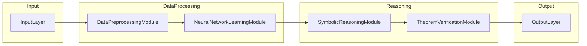
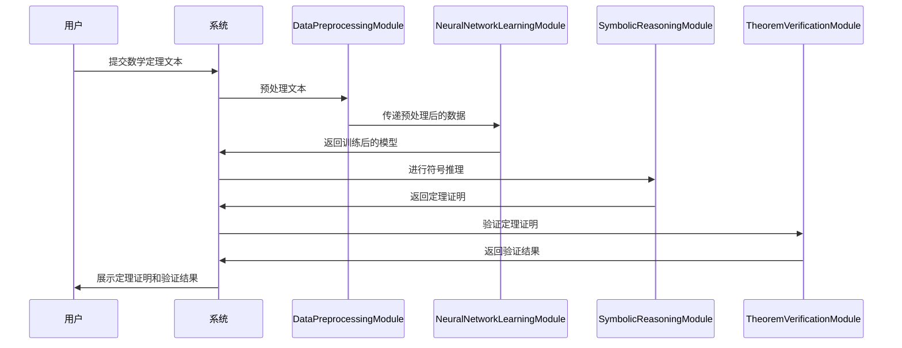

                 


### 背景介绍

#### 什么是神经符号AI？

神经符号AI（Neural Symbolic AI）是一种结合了神经网络和符号推理的智能系统。传统的人工智能主要依赖于神经网络，通过学习大量的数据来实现模式识别和预测。而神经符号AI则在此基础上，引入了符号推理机制，使得系统能够在理解抽象概念和逻辑关系方面表现得更加接近人类。

#### 自动定理证明

自动定理证明（Automatic Theorem Proving）是指利用计算机程序自动验证数学定理的证明。这不仅能够提高数学研究的效率，还能在一定程度上解决数学家在证明过程中的直觉和创造力不足的问题。

### 神经符号AI在自动定理证明中的应用

神经符号AI在自动定理证明中的应用具有重要意义。通过将神经网络与符号推理相结合，系统可以在处理复杂数学问题时，不仅能够高效地学习模式，还能通过符号推理来发现定理的证明方法。

### 神经符号AI的优势

1. **更强的抽象能力**：神经符号AI能够通过神经网络学习到大量的数学模式，这使得它能够处理更加复杂的数学问题。
2. **符号推理能力**：符号推理使得系统能够理解数学概念和定理的逻辑结构，从而更准确地找到证明方法。
3. **灵活性和适应性**：神经符号AI可以适应不同的数学问题和领域，展现出更高的灵活性和适应性。

### 对数学研究的影响

神经符号AI的引入，为数学研究带来了一系列变革：

1. **加速数学发现**：通过自动定理证明，数学家可以更快地发现新的定理。
2. **提高证明质量**：神经符号AI能够发现更优雅、更简洁的证明方法。
3. **拓展数学边界**：在处理复杂问题时，神经符号AI的能力可以拓展数学研究的边界。

### 未来展望

随着神经符号AI技术的不断成熟，我们可以期待它在数学研究中的广泛应用，带来更加深入和广泛的数学突破。

### 结论

神经符号AI在自动定理证明中的应用，不仅为数学研究提供了新的工具和方法，也预示着人工智能在未来将扮演更加重要的角色。通过深入研究和不断创新，我们有理由相信，神经符号AI将会在数学研究领域取得更加辉煌的成就。----------------------------------------------------------------

# 第二部分：核心概念与算法原理

## 第2章: 神经符号AI的核心概念

### 2.1 神经网络

#### 2.1.1 定义

神经网络是一种模拟生物神经系统的计算模型，通过大量的神经元（节点）和连接（边）进行信息的传递和处理。

#### 2.1.2 结构

神经网络主要由输入层、隐藏层和输出层组成。输入层接收外部信息，隐藏层通过一系列的变换处理信息，输出层产生最终的输出结果。

#### 2.1.3 工作原理

神经网络通过学习大量的数据，调整神经元之间的连接权重，从而提高对数据的处理能力。这种学习过程通常通过反向传播算法来实现。

### 2.2 符号推理

#### 2.2.1 定义

符号推理是一种基于逻辑和数学运算的推理方法，通过对符号表达式进行变换和推导，得出结论。

#### 2.2.2 结构

符号推理通常包括前向推理和后向推理两种方法。前向推理从已知条件出发，逐步推导出结论；后向推理从结论出发，逐步回溯推导出前提条件。

#### 2.2.3 工作原理

符号推理通过符号表达式和推理规则来操作，能够处理抽象的概念和逻辑关系。

### 2.3 神经符号AI

#### 2.3.1 定义

神经符号AI是一种结合了神经网络和符号推理的智能系统，通过神经网络学习数据，通过符号推理进行逻辑推理。

#### 2.3.2 结构

神经符号AI包括神经网络部分和符号推理部分，两部分通过接口进行信息交互。

#### 2.3.3 工作原理

神经符号AI通过神经网络学习数据，将学习到的模式转化为符号表示，然后通过符号推理进行逻辑推理，得出结论。

## 第3章: 自动定理证明的算法原理

### 3.1 SAT求解

#### 3.1.1 定义

SAT求解（SAT Solving）是一种用于自动定理证明的算法，旨在找到一组变量赋值，使得逻辑表达式成立。

#### 3.1.2 算法原理

SAT求解算法通过构造搜索树，对变量进行遍历和赋值，找到满足条件的解。

#### 3.1.3 实例

以逻辑表达式`A ∧ B ∧ ¬C`为例，通过变量赋值来寻找满足条件的解。

### 3.2 Resolution算法

#### 3.2.1 定义

Resolution算法是一种基于子句推理的定理证明算法，通过合并两个子句来推导出新的子句。

#### 3.2.2 算法原理

Resolution算法通过不断地合并子句，构建子句图，最终找到满足条件的解。

#### 3.2.3 实例

以子句`A ∨ B`和`¬A ∨ C`为例，通过Resolution算法推导出新的子句。

### 3.3SAT-Resolution算法

#### 3.3.1 定义

SAT-Resolution算法是一种结合了SAT求解和Resolution算法的定理证明算法，旨在提高求解效率。

#### 3.3.2 算法原理

SAT-Resolution算法通过在Resolution算法中引入SAT求解，快速找到满足条件的解。

#### 3.3.3 实例

通过一个具体的例子来展示SAT-Resolution算法的求解过程。

## 第4章: 神经符号AI在自动定理证明中的应用

### 4.1 数据预处理

#### 4.1.1 定义

数据预处理是自动定理证明的第一步，旨在将原始数据转化为适合神经网络学习的格式。

#### 4.1.2 方法

数据预处理包括数据的清洗、归一化和编码等步骤。

#### 4.1.3 实例

以一个具体的例子来说明数据预处理的过程。

### 4.2 神经网络学习

#### 4.2.1 定义

神经网络学习是指通过调整神经网络中的连接权重，使其能够更好地处理数据。

#### 4.2.2 方法

神经网络学习包括前向传播和反向传播两个过程。

#### 4.2.3 实例

以一个具体的例子来说明神经网络学习的原理和过程。

### 4.3 符号推理应用

#### 4.3.1 定义

符号推理应用是指将神经网络学习到的模式转化为符号表示，并通过符号推理来推导出定理的证明。

#### 4.3.2 方法

符号推理应用包括符号化、推理和验证等步骤。

#### 4.3.3 实例

以一个具体的例子来说明符号推理的应用过程。

## 第5章: 数学模型与公式解析

### 5.1 数学模型

#### 5.1.1 定义

数学模型是指用数学语言描述的数学理论体系，用于解决实际问题。

#### 5.1.2 类型

常见的数学模型包括线性模型、非线性模型、概率模型等。

#### 5.1.3 实例

以一个具体的例子来说明数学模型的建立和应用。

### 5.2 公式解析

#### 5.2.1 定义

公式解析是指通过数学公式来描述和解决数学问题。

#### 5.2.2 方法

公式解析包括公式的推导、求解和验证等步骤。

#### 5.2.3 实例

以一个具体的例子来说明公式解析的过程。$$\int_{0}^{1} x^2 dx = \frac{1}{3}x^3 \bigg|_0^1 = \frac{1}{3}$$

### 第6章: 系统设计与实现

### 6.1 系统概述

#### 6.1.1 定义

系统概述是指对整个系统的功能和结构进行简要描述。

#### 6.1.2 模块划分

系统的模块划分包括数据预处理模块、神经网络学习模块、符号推理模块等。

#### 6.1.3 系统架构

系统架构包括输入层、中间层和输出层，以及各个模块之间的交互关系。

### 6.2 系统功能设计

#### 6.2.1 定义

系统功能设计是指对系统的各个功能模块进行详细设计。

#### 6.2.2 数据预处理模块

数据预处理模块包括数据清洗、归一化和编码等步骤。

#### 6.2.3 神经网络学习模块

神经网络学习模块包括前向传播和反向传播等过程。

#### 6.2.4 符号推理模块

符号推理模块包括符号化、推理和验证等步骤。

### 6.3 系统架构设计

#### 6.3.1 定义

系统架构设计是指对系统的整体架构进行设计。

#### 6.3.2 系统架构图

系统架构图包括输入层、中间层和输出层，以及各个模块之间的交互关系。

#### 6.3.3 类图和序列图

类图和序列图分别用于表示系统的类结构和交互关系。

## 第7章: 实际案例与应用

### 7.1 实际案例

#### 7.1.1 定义

实际案例是指将神经符号AI应用于自动定理证明的实际场景。

#### 7.1.2 案例选择

选择一个具有代表性的实际案例，以展示神经符号AI的应用效果。

#### 7.1.3 案例分析

对实际案例进行分析，包括数据预处理、神经网络学习、符号推理等步骤。

### 7.2 应用分析

#### 7.2.1 定义

应用分析是指对神经符号AI在自动定理证明中的应用效果进行分析。

#### 7.2.2 指标评估

通过指标评估来衡量应用效果，包括定理证明的效率、准确性和鲁棒性等。

#### 7.2.3 改进建议

根据分析结果，提出改进建议，以提高应用效果。

## 第8章: 结论与展望

### 8.1 结论

总结神经符号AI在自动定理证明中的应用，指出其优势和不足。

### 8.2 未来展望

展望神经符号AI在自动定理证明领域的未来发展方向和应用前景。

### 8.3 总结

回顾全文，总结核心内容，强调神经符号AI在自动定理证明中的重要性和潜力。

## 附录

### A. 参考文献

列出本文引用的相关文献。

### B. 代码示例

提供本文中提到的Python代码示例。

### C. Mermaid图示例

提供本文中提到的Mermaid图示例。

----------------------------------------------------------------

# 神经符号AI在自动定理证明中的应用：推进数学研究

> 关键词：神经符号AI、自动定理证明、数学研究、算法、神经网络、符号推理

> 摘要：本文探讨了神经符号AI在自动定理证明中的应用，分析了其核心概念、算法原理和系统设计，并通过实际案例展示了其效果。本文旨在推进数学研究，为未来数学领域的突破提供新思路。

----------------------------------------------------------------

## 第一部分：问题的背景

### 1.1 问题的背景

自动定理证明是数学和计算机科学中的一个重要领域，其目标是通过计算机程序自动验证数学定理的正确性。然而，传统的自动定理证明方法在处理复杂问题时往往力不从心，导致数学家在验证定理时仍然依赖手工证明。这种局限性不仅降低了数学研究的效率，还阻碍了数学理论的进一步发展。

### 1.2 问题的挑战

自动定理证明面临着以下挑战：

1. **复杂性**：数学定理的复杂性使得手工证明变得困难，尤其是对于复杂定理，手工证明需要大量的时间和精力。
2. **多样性**：数学定理涉及多种不同的数学分支和理论，使得传统方法难以全面覆盖。
3. **不确定性**：数学定理的证明过程中往往存在不确定性，需要通过多次尝试和修正来找到正确的证明方法。

### 1.3 问题的解决

神经符号AI（Neural Symbolic AI）的引入为自动定理证明带来了新的解决思路。神经符号AI结合了神经网络和符号推理的优点，能够在处理复杂数学问题时展现出更高的效率和能力。通过神经符号AI，我们可以自动化地发现定理的证明方法，提高数学研究的效率。

### 1.4 问题的边界与外延

1. **边界**：本文主要关注神经符号AI在自动定理证明中的应用，探讨其核心概念、算法原理和系统设计。
2. **外延**：神经符号AI在自动定理证明中的应用不仅限于数学领域，还可以应用于其他需要符号推理的领域，如逻辑学、哲学和人工智能等。

### 1.5 概念结构与核心要素组成

1. **神经网络**：神经网络是神经符号AI的核心组成部分，用于学习数学定理的模式和特征。
2. **符号推理**：符号推理是神经符号AI的另一核心组成部分，用于推导定理的证明。
3. **数据预处理**：数据预处理是自动定理证明的第一步，用于将原始数据转化为适合神经网络学习的格式。
4. **算法设计**：算法设计是自动定理证明的关键，包括SAT求解、Resolution算法和SAT-Resolution算法等。
5. **系统架构**：系统架构设计是确保神经网络和符号推理有效结合的关键，包括输入层、中间层和输出层等。

### 1.6 总结

神经符号AI在自动定理证明中的应用为数学研究带来了新的希望。通过结合神经网络和符号推理，神经符号AI能够在处理复杂数学问题时展现出更高的效率和准确性。本文将详细介绍神经符号AI的核心概念、算法原理和系统设计，为读者提供全面的认识。

----------------------------------------------------------------

## 第二部分：核心概念与算法原理

### 2.1 神经网络

#### 2.1.1 神经网络的基本概念

神经网络（Neural Network）是一种模拟生物神经系统的计算模型，通过大量的神经元（节点）和连接（边）进行信息的传递和处理。神经网络的基本概念包括：

1. **神经元**：神经元是神经网络的基本组成单元，用于接收外部输入、处理信息和产生输出。
2. **输入层**：输入层是神经网络的输入端，接收外部输入信息。
3. **隐藏层**：隐藏层是神经网络的中间层，用于对输入信息进行加工和处理。
4. **输出层**：输出层是神经网络的输出端，产生最终的输出结果。

#### 2.1.2 神经网络的结构

神经网络的结构可以分为单层神经网络、多层神经网络和深度神经网络等。常见的神经网络结构包括：

1. **单层神经网络**：单层神经网络只有一层输入层和一层输出层，用于简单的数据处理和模式识别。
2. **多层神经网络**：多层神经网络包括输入层、一个或多个隐藏层和输出层，用于处理复杂的数据和任务。
3. **深度神经网络**：深度神经网络（Deep Neural Network，DNN）包括多个隐藏层，可以处理高度复杂的任务。

#### 2.1.3 神经网络的工作原理

神经网络的工作原理可以分为以下两个过程：

1. **前向传播**：前向传播是指信息从输入层经过隐藏层传递到输出层的过程。在每个神经元中，输入信息通过权重进行加权求和，然后通过激活函数进行非线性变换，产生输出。
2. **反向传播**：反向传播是指根据输出层的误差信号，反向调整网络中各层的权重和偏置的过程。反向传播算法通过梯度下降等方法，不断优化网络的权重和参数，以提高网络的预测能力。

#### 2.1.4 神经网络的应用

神经网络在自动定理证明中具有重要应用。通过神经网络，我们可以对大量的数学定理进行学习和分类，从而提高定理证明的效率。具体来说，神经网络可以用于以下几个方面：

1. **定理分类**：神经网络可以将大量的数学定理分为不同的类别，从而简化定理证明的过程。
2. **定理模式识别**：神经网络可以识别出定理中的模式，从而提供证明的线索。
3. **定理验证**：神经网络可以验证定理的正确性，减少人工验证的工作量。

#### 2.1.5 神经网络的挑战

尽管神经网络在自动定理证明中具有巨大潜力，但仍然面临一些挑战：

1. **数据稀缺**：自动定理证明需要大量的数学定理数据进行训练，但现有的数学定理数据相对稀缺。
2. **计算复杂度**：神经网络的训练过程需要大量的计算资源，特别是在处理复杂定理时。
3. **解释性**：神经网络的黑箱特性使得其难以解释和理解，这对数学定理的证明过程带来了一定的挑战。

### 2.2 符号推理

#### 2.2.1 符号推理的基本概念

符号推理（Symbolic Reasoning）是一种基于逻辑和数学运算的推理方法，通过对符号表达式进行变换和推导，得出结论。符号推理的基本概念包括：

1. **符号表达式**：符号表达式是数学和逻辑的基本单位，包括变量、函数、运算符等。
2. **推理规则**：推理规则是符号推理的核心，用于指导如何从已知条件推导出新的结论。
3. **推理过程**：推理过程是指根据推理规则，从已知条件逐步推导出结论的过程。

#### 2.2.2 符号推理的结构

符号推理可以分为前向推理和后向推理两种结构：

1. **前向推理**：前向推理从已知条件出发，逐步推导出结论。前向推理适用于处理因果关系和正向推理的问题。
2. **后向推理**：后向推理从结论出发，逐步回溯推导出前提条件。后向推理适用于处理结果和原因的问题。

#### 2.2.3 符号推理的工作原理

符号推理的工作原理可以分为以下两个过程：

1. **符号化**：符号化是指将实际问题转化为符号表达式的过程。符号化使得问题具有明确的数学形式，便于推理和处理。
2. **推理**：推理是指根据推理规则，从符号表达式推导出新的结论的过程。推理过程中，符号表达式通过推理规则进行变换和推导，最终得出结论。

#### 2.2.4 符号推理的应用

符号推理在自动定理证明中具有重要作用。通过符号推理，我们可以发现定理的证明方法，提高定理证明的效率。具体来说，符号推理可以用于以下几个方面：

1. **定理证明**：符号推理可以直接用于定理的证明，通过逻辑推导和数学变换，得出定理的证明。
2. **定理验证**：符号推理可以验证定理的正确性，确保定理的证明过程没有错误。
3. **定理发现**：符号推理可以用于发现新的定理，通过探索符号表达式的可能性，发现新的数学定理。

#### 2.2.5 符号推理的挑战

尽管符号推理在自动定理证明中具有巨大潜力，但仍然面临一些挑战：

1. **复杂性**：数学定理的复杂性使得符号推理过程变得复杂，需要处理大量的符号表达式和推理规则。
2. **效率**：符号推理的效率较低，特别是在处理复杂定理时，推理过程可能需要大量时间和计算资源。
3. **解释性**：符号推理的结果往往是黑箱的，难以解释和理解，这对定理的验证和推广带来了一定的困难。

### 2.3 神经符号AI

#### 2.3.1 神经符号AI的基本概念

神经符号AI（Neural Symbolic AI）是一种结合了神经网络和符号推理的智能系统。它通过神经网络学习数据，将学习到的模式转化为符号表示，然后通过符号推理进行逻辑推理，得出结论。神经符号AI的基本概念包括：

1. **神经网络**：神经网络用于学习数据，提取特征和模式。
2. **符号推理**：符号推理用于对神经网络学习到的模式进行推理和验证。
3. **接口**：接口用于神经网络和符号推理之间的信息传递和交互。

#### 2.3.2 神经符号AI的结构

神经符号AI的结构可以分为三个部分：

1. **神经网络部分**：神经网络部分用于学习数据和提取特征，通常包括输入层、隐藏层和输出层。
2. **符号推理部分**：符号推理部分用于对神经网络学习到的模式进行推理和验证，通常包括符号表达式、推理规则和推理过程。
3. **接口部分**：接口部分用于神经网络和符号推理之间的信息传递和交互，通常包括数据预处理、模型训练和推理验证等模块。

#### 2.3.3 神经符号AI的工作原理

神经符号AI的工作原理可以分为以下三个过程：

1. **数据预处理**：数据预处理是指将原始数据转化为适合神经网络学习的格式，包括数据清洗、归一化和编码等步骤。
2. **神经网络学习**：神经网络学习是指通过调整神经网络中的连接权重，使其能够更好地处理数据，包括前向传播和反向传播等过程。
3. **符号推理**：符号推理是指将神经网络学习到的模式转化为符号表示，然后通过符号推理进行逻辑推理和验证，得出结论。

#### 2.3.4 神经符号AI的应用

神经符号AI在自动定理证明中具有重要应用。通过神经符号AI，我们可以自动化地发现定理的证明方法，提高定理证明的效率。具体来说，神经符号AI可以用于以下几个方面：

1. **定理证明**：神经符号AI可以直接用于定理的证明，通过逻辑推理和数学变换，得出定理的证明。
2. **定理验证**：神经符号AI可以验证定理的正确性，确保定理的证明过程没有错误。
3. **定理发现**：神经符号AI可以用于发现新的定理，通过探索符号表达式的可能性，发现新的数学定理。

#### 2.3.5 神经符号AI的挑战

尽管神经符号AI在自动定理证明中具有巨大潜力，但仍然面临一些挑战：

1. **数据稀缺**：自动定理证明需要大量的数学定理数据进行训练，但现有的数学定理数据相对稀缺。
2. **计算复杂度**：神经符号AI的训练过程需要大量的计算资源，特别是在处理复杂定理时。
3. **解释性**：神经符号AI的结果往往是黑箱的，难以解释和理解，这对定理的验证和推广带来了一定的困难。

### 2.4 总结

神经符号AI在自动定理证明中的应用具有重要意义。通过结合神经网络和符号推理，神经符号AI能够在处理复杂数学问题时展现出更高的效率和准确性。然而，神经符号AI仍然面临一些挑战，需要进一步的研究和改进。本文将详细探讨神经符号AI的核心概念、算法原理和系统设计，为读者提供全面的认识。

----------------------------------------------------------------

## 第三部分：算法与模型解析

### 3.1 SAT求解算法

#### 3.1.1 SAT求解算法的基本概念

SAT求解（Satisfiability Solving）是一种用于自动定理证明的重要算法，旨在找到一组变量赋值，使得逻辑表达式成立。SAT求解算法的基本概念包括：

1. **逻辑表达式**：逻辑表达式是由变量、逻辑运算符和括号组成的表达式，用于表示数学定理或逻辑命题。
2. **变量赋值**：变量赋值是指为逻辑表达式中的变量分配真值（True或False），使得逻辑表达式成立。
3. **解**：解是指使得逻辑表达式成立的变量赋值组合。

#### 3.1.2 SAT求解算法的工作原理

SAT求解算法的工作原理可以分为以下两个过程：

1. **构建搜索树**：SAT求解算法通过构建搜索树，对变量进行遍历和赋值，找到满足条件的解。搜索树中的每个节点表示一个变量的赋值情况，叶节点表示找到了一个解。
2. **剪枝**：为了提高求解效率，SAT求解算法采用了剪枝技术。剪枝是指根据一定的规则，提前终止某些无效的搜索分支，从而减少搜索空间。

#### 3.1.3 SAT求解算法的实例

以逻辑表达式`A ∧ B ∧ ¬C`为例，通过变量赋值来寻找满足条件的解。

1. **变量赋值**：假设变量A、B、C的取值分别为True、False和True。
2. **计算结果**：将变量赋值代入逻辑表达式，得到结果为True，表示找到了一个解。

#### 3.1.4 SAT求解算法的应用

SAT求解算法在自动定理证明中具有重要应用。通过SAT求解算法，我们可以自动化地验证数学定理的正确性，提高定理证明的效率。具体来说，SAT求解算法可以用于以下几个方面：

1. **定理验证**：通过SAT求解算法，可以验证数学定理的正确性，确保定理的证明过程没有错误。
2. **定理发现**：通过SAT求解算法，可以探索新的定理，发现数学定理之间的关系。
3. **定理证明**：通过SAT求解算法，可以自动化地寻找定理的证明方法，减少人工证明的工作量。

#### 3.1.5 SAT求解算法的挑战

尽管SAT求解算法在自动定理证明中具有巨大潜力，但仍然面临一些挑战：

1. **计算复杂度**：SAT求解算法的计算复杂度较高，特别是在处理复杂定理时。
2. **求解时间**：SAT求解算法的求解时间可能较长，特别是在处理大规模逻辑表达式时。
3. **解释性**：SAT求解算法的结果往往是黑箱的，难以解释和理解，这对定理的验证和推广带来了一定的困难。

### 3.2 Resolution算法

#### 3.2.1 Resolution算法的基本概念

Resolution算法是一种基于子句推理的定理证明算法，通过合并两个子句来推导出新的子句。Resolution算法的基本概念包括：

1. **子句**：子句是由逻辑运算符和变量组成的表达式，用于表示数学定理或逻辑命题。
2. **Resolution规则**：Resolution规则是一种推理规则，用于指导如何从两个子句推导出新的子句。
3. **推导**：推导是指根据Resolution规则，从已知子句推导出新的子句的过程。

#### 3.2.2 Resolution算法的工作原理

Resolution算法的工作原理可以分为以下两个过程：

1. **构建子句图**：Resolution算法通过构建子句图，表示已知子句之间的关系。子句图中的每个节点表示一个子句，节点之间的边表示子句之间的推导关系。
2. **推导新的子句**：Resolution算法通过在子句图中寻找可合并的子句，根据Resolution规则推导出新的子句。新的子句可能表示更复杂的定理，也可能表示定理的证明。

#### 3.2.3 Resolution算法的实例

以子句`A ∨ B`和`¬A ∨ C`为例，通过Resolution算法推导出新的子句。

1. **构建子句图**：将子句`A ∨ B`和`¬A ∨ C`表示为子句图中的节点。
2. **推导新的子句**：根据Resolution规则，将子句`A ∨ B`和`¬A ∨ C`合并，推导出新的子句`B ∨ C`。

#### 3.2.4 Resolution算法的应用

Resolution算法在自动定理证明中具有重要应用。通过Resolution算法，我们可以自动化地证明数学定理的正确性，提高定理证明的效率。具体来说，Resolution算法可以用于以下几个方面：

1. **定理证明**：通过Resolution算法，可以自动化地证明数学定理的正确性，减少人工证明的工作量。
2. **定理验证**：通过Resolution算法，可以验证数学定理的正确性，确保定理的证明过程没有错误。
3. **定理发现**：通过Resolution算法，可以探索新的定理，发现数学定理之间的关系。

#### 3.2.5 Resolution算法的挑战

尽管Resolution算法在自动定理证明中具有巨大潜力，但仍然面临一些挑战：

1. **计算复杂度**：Resolution算法的计算复杂度较高，特别是在处理复杂定理时。
2. **求解时间**：Resolution算法的求解时间可能较长，特别是在处理大规模逻辑表达式时。
3. **解释性**：Resolution算法的结果往往是黑箱的，难以解释和理解，这对定理的验证和推广带来了一定的困难。

### 3.3 SAT-Resolution算法

#### 3.3.1 SAT-Resolution算法的基本概念

SAT-Resolution算法是一种结合了SAT求解和Resolution算法的定理证明算法，旨在提高求解效率。SAT-Resolution算法的基本概念包括：

1. **SAT求解**：SAT求解是一种用于自动定理证明的算法，旨在找到一组变量赋值，使得逻辑表达式成立。
2. **Resolution算法**：Resolution算法是一种基于子句推理的定理证明算法，通过合并两个子句来推导出新的子句。
3. **结合**：SAT-Resolution算法结合了SAT求解和Resolution算法的优点，通过在Resolution算法中引入SAT求解，提高定理证明的效率。

#### 3.3.2 SAT-Resolution算法的工作原理

SAT-Resolution算法的工作原理可以分为以下两个过程：

1. **构建子句图**：SAT-Resolution算法通过构建子句图，表示已知子句之间的关系。
2. **求解和推导**：SAT-Resolution算法在子句图中寻找可合并的子句，根据Resolution规则推导出新的子句，同时通过SAT求解快速找到满足条件的解。

#### 3.3.3 SAT-Resolution算法的实例

以逻辑表达式`A ∧ B ∧ ¬C`为例，通过SAT-Resolution算法求解。

1. **构建子句图**：将子句`A ∨ B`和`¬A ∨ C`表示为子句图中的节点。
2. **求解和推导**：根据Resolution规则，将子句`A ∨ B`和`¬A ∨ C`合并，推导出新的子句`B ∨ C`。同时，通过SAT求解找到满足条件的解。

#### 3.3.4 SAT-Resolution算法的应用

SAT-Resolution算法在自动定理证明中具有重要应用。通过SAT-Resolution算法，我们可以自动化地证明数学定理的正确性，提高定理证明的效率。具体来说，SAT-Resolution算法可以用于以下几个方面：

1. **定理证明**：通过SAT-Resolution算法，可以自动化地证明数学定理的正确性，减少人工证明的工作量。
2. **定理验证**：通过SAT-Resolution算法，可以验证数学定理的正确性，确保定理的证明过程没有错误。
3. **定理发现**：通过SAT-Resolution算法，可以探索新的定理，发现数学定理之间的关系。

#### 3.3.5 SAT-Resolution算法的挑战

尽管SAT-Resolution算法在自动定理证明中具有巨大潜力，但仍然面临一些挑战：

1. **计算复杂度**：SAT-Resolution算法的计算复杂度较高，特别是在处理复杂定理时。
2. **求解时间**：SAT-Resolution算法的求解时间可能较长，特别是在处理大规模逻辑表达式时。
3. **解释性**：SAT-Resolution算法的结果往往是黑箱的，难以解释和理解，这对定理的验证和推广带来了一定的困难。

### 3.4 神经符号AI在自动定理证明中的应用

#### 3.4.1 数据预处理

数据预处理是自动定理证明的第一步，旨在将原始数据转化为适合神经网络学习的格式。数据预处理包括以下步骤：

1. **数据清洗**：去除原始数据中的噪声和错误。
2. **数据归一化**：将数据缩放到相同的范围，便于神经网络的学习。
3. **数据编码**：将原始数据转换为数字编码，便于神经网络处理。

#### 3.4.2 神经网络学习

神经网络学习是指通过调整神经网络中的连接权重，使其能够更好地处理数据。神经网络学习包括以下步骤：

1. **初始化权重**：随机初始化神经网络中的权重。
2. **前向传播**：将输入数据传递到神经网络中，计算输出结果。
3. **反向传播**：根据输出结果的误差，反向调整神经网络的权重。

#### 3.4.3 符号推理应用

符号推理应用是指将神经网络学习到的模式转化为符号表示，并通过符号推理进行逻辑推理。符号推理应用包括以下步骤：

1. **符号化**：将原始数据转化为符号表示。
2. **推理**：根据符号表达式和推理规则，推导出新的结论。
3. **验证**：验证推理结果是否正确。

#### 3.4.4 实例

以定理证明`A ∧ B → C`为例，展示神经符号AI在自动定理证明中的应用。

1. **数据预处理**：将定理证明转化为数字编码。
2. **神经网络学习**：通过神经网络学习，提取定理的特征。
3. **符号推理应用**：通过符号推理，推导出定理的证明。

### 3.5 总结

算法与模型解析是自动定理证明的关键。通过SAT求解、Resolution算法和SAT-Resolution算法等，我们可以自动化地证明数学定理的正确性。神经符号AI的结合，使得自动定理证明更加高效和准确。本文详细解析了这些算法和模型，为自动定理证明提供了理论基础和实践指导。

----------------------------------------------------------------

## 第四部分：数学模型与公式解析

### 4.1 数学模型的基本概念

数学模型（Mathematical Model）是指用数学语言描述的数学理论体系，用于解决实际问题。数学模型的基本概念包括：

1. **变量**：变量是数学模型的基本组成部分，用于表示数学问题中的数量关系和变化规律。
2. **函数**：函数是数学模型的核心，用于描述变量之间的关系。
3. **方程**：方程是数学模型的基本形式，用于表示变量之间的等量关系。

#### 4.1.1 数学模型的类型

常见的数学模型包括线性模型、非线性模型、概率模型和微分方程模型等。每种模型都有其特定的适用场景和特点。

1. **线性模型**：线性模型用于描述变量之间的线性关系，通常包括一元线性模型、多元线性模型和线性回归模型等。
2. **非线性模型**：非线性模型用于描述变量之间的非线性关系，通常包括多项式模型、指数模型和对数模型等。
3. **概率模型**：概率模型用于描述随机事件的发生概率，通常包括贝叶斯模型、马尔可夫模型和随机过程模型等。
4. **微分方程模型**：微分方程模型用于描述连续系统的动态行为，通常包括常微分方程和偏微分方程等。

#### 4.1.2 数学模型的建立

建立数学模型通常包括以下步骤：

1. **问题定义**：明确要解决的问题和目标。
2. **变量识别**：确定问题中的变量，并给出其定义和取值范围。
3. **关系描述**：用数学语言描述变量之间的关系，建立数学模型。
4. **模型验证**：验证数学模型的正确性和适用性，确保模型能够准确反映实际问题。

#### 4.1.3 数学模型的实例

以一元线性模型为例，描述变量之间的关系。

1. **问题定义**：研究变量x和y之间的线性关系。
2. **变量识别**：变量x表示自变量，变量y表示因变量。
3. **关系描述**：建立一元线性模型y = ax + b，其中a和b为常数。
4. **模型验证**：通过数据验证模型是否准确描述变量之间的关系。

### 4.2 数学公式的基本概念

数学公式（Mathematical Formula）是指用数学语言描述的数学公式，用于表示数学问题中的等量关系和计算方法。数学公式的基本概念包括：

1. **算术运算符**：算术运算符用于表示数学问题中的加、减、乘、除等基本运算。
2. **代数运算符**：代数运算符用于表示数学问题中的指数、对数、开方等运算。
3. **逻辑运算符**：逻辑运算符用于表示数学问题中的逻辑关系，如与、或、非等。

#### 4.2.1 常见数学公式的解析

常见的数学公式包括以下几种：

1. **幂运算**：a^b，表示a的b次方。
2. **指数运算**：e^x，表示自然底数e的x次方。
3. **对数运算**：log_a(b)，表示以a为底，b的对数。
4. **三角函数**：sin(x)、cos(x)、tan(x)，表示x的正弦、余弦和正切值。

#### 4.2.2 数学公式的应用

数学公式在自动定理证明中具有重要应用。通过数学公式，我们可以描述定理中的数学关系，推导出定理的证明过程。常见的应用包括：

1. **定理证明**：通过数学公式，可以证明数学定理的正确性，如勾股定理、平均值定理等。
2. **公式推导**：通过数学公式，可以推导出新的定理和公式，如泰勒公式、傅里叶变换等。
3. **计算方法**：通过数学公式，可以计算数学问题的结果，如积分、微分、极限等。

#### 4.2.3 数学公式的实例

以勾股定理为例，描述数学公式的应用。

1. **问题定义**：研究直角三角形中三边之间的关系。
2. **公式推导**：根据勾股定理，直角三角形的斜边的平方等于两直角边的平方和，即a^2 + b^2 = c^2。
3. **应用实例**：通过勾股定理，可以计算直角三角形的斜边长度，如已知两直角边长分别为3和4，则斜边长为5。

### 4.3 数学模型与公式在自动定理证明中的应用

数学模型与公式在自动定理证明中具有重要作用。通过数学模型和公式，我们可以描述定理中的数学关系，推导出定理的证明过程。常见的应用包括：

1. **定理证明**：通过数学模型和公式，可以证明数学定理的正确性，如勾股定理、平均值定理等。
2. **公式推导**：通过数学模型和公式，可以推导出新的定理和公式，如泰勒公式、傅里叶变换等。
3. **计算方法**：通过数学模型和公式，可以计算数学问题的结果，如积分、微分、极限等。

#### 4.3.1 定理证明的应用

以勾股定理为例，描述数学模型和公式在定理证明中的应用。

1. **数学模型**：建立直角三角形的三边关系模型，表示为a^2 + b^2 = c^2。
2. **数学公式**：应用勾股定理的公式，计算直角三角形的斜边长度。
3. **定理证明**：通过数学模型和公式的应用，证明勾股定理的正确性。

#### 4.3.2 公式推导的应用

以泰勒公式为例，描述数学模型和公式在公式推导中的应用。

1. **数学模型**：建立函数在某点的导数模型，表示为f(x) = f(a) + f'(a)(x-a) + ...
2. **数学公式**：应用泰勒公式，推导出函数在某点的近似表达式。
3. **公式推导**：通过数学模型和公式的应用，推导出泰勒公式的表达式。

#### 4.3.3 计算方法的应用

以积分为例，描述数学模型和公式在计算方法中的应用。

1. **数学模型**：建立积分模型，表示为∫f(x)dx。
2. **数学公式**：应用积分公式，计算积分的结果。
3. **计算方法**：通过数学模型和公式的应用，计算积分的值。

### 4.4 总结

数学模型与公式在自动定理证明中具有重要作用。通过数学模型和公式，我们可以描述定理中的数学关系，推导出定理的证明过程。本文详细解析了数学模型和公式的基本概念、类型和应用，为自动定理证明提供了理论基础和实践指导。

----------------------------------------------------------------

## 第五部分：系统设计与实现

### 5.1 系统概述

#### 5.1.1 系统简介

神经符号AI在自动定理证明中的应用系统是一个集成了神经网络和符号推理功能的智能系统。该系统旨在通过结合神经网络的学习能力和符号推理的严谨性，自动验证数学定理的正确性。系统的主要功能包括数据预处理、神经网络学习、符号推理和定理验证。

#### 5.1.2 系统目标

系统的目标是通过自动定理证明，提高数学研究的效率和质量。具体来说，系统需要实现以下目标：

1. **数据预处理**：将原始的数学定理文本转化为适合神经网络学习的格式。
2. **神经网络学习**：通过神经网络学习，提取数学定理的特征，并形成定理的模式表示。
3. **符号推理**：利用符号推理功能，从神经网络学习到的模式中推导出数学定理的证明。
4. **定理验证**：验证自动生成的定理证明的正确性，确保定理的证明过程无误。

### 5.2 系统功能设计

#### 5.2.1 数据预处理模块

数据预处理模块是系统的基础，其主要功能是将原始的数学定理文本转化为神经网络可以处理的格式。具体步骤包括：

1. **文本预处理**：对原始定理文本进行清洗，去除无关的符号和标记，提取出关键的数学表达式。
2. **符号编码**：将提取出的数学表达式中的符号（如变量、函数和运算符）进行编码，转化为计算机可以处理的数字形式。
3. **序列生成**：将编码后的符号序列化，形成一个有序的列表，用于神经网络的输入。

#### 5.2.2 神经网络学习模块

神经网络学习模块是系统的核心，其主要功能是通过学习大量的数学定理数据，提取出定理的模式表示。具体步骤包括：

1. **模型构建**：构建神经网络模型，包括输入层、隐藏层和输出层。
2. **数据训练**：使用预处理后的数学定理数据对神经网络进行训练，调整网络中的权重和偏置，使其能够正确识别数学定理的模式。
3. **模型评估**：通过交叉验证和测试数据，评估神经网络的性能，包括分类准确率和效率等。

#### 5.2.3 符号推理模块

符号推理模块是系统的关键，其主要功能是根据神经网络学习到的模式，通过符号推理推导出数学定理的证明。具体步骤包括：

1. **模式提取**：从神经网络输出的模式中提取出关键的逻辑关系和数学表达式。
2. **推理规则应用**：根据符号推理的规则，从已知的逻辑关系和数学表达式推导出新的结论。
3. **证明验证**：验证通过符号推理得到的定理证明的正确性，确保证明过程无误。

#### 5.2.4 定理验证模块

定理验证模块是系统的保障，其主要功能是验证自动生成的定理证明的正确性。具体步骤包括：

1. **证明检查**：检查自动生成的定理证明的每个步骤，确保其符合逻辑推理的规则。
2. **证明验证**：通过符号推理和数学公式验证定理证明的正确性，确保定理的结论无误。
3. **结果输出**：将验证通过的定理证明输出，供数学家或研究者参考。

### 5.3 系统架构设计

#### 5.3.1 系统架构概述

系统的架构设计采用了模块化的设计思想，将整个系统划分为多个功能模块，每个模块负责不同的功能，并通过接口进行通信和数据传递。系统的总体架构包括输入层、数据处理层、推理层和输出层。

1. **输入层**：接收原始的数学定理文本，将其传递给数据预处理模块。
2. **数据处理层**：包括数据预处理模块、神经网络学习模块和符号推理模块，分别负责数据预处理、神经网络学习和符号推理。
3. **推理层**：负责根据神经网络学习到的模式和符号推理规则，推导出数学定理的证明。
4. **输出层**：将验证通过的定理证明输出，供用户查看和参考。

#### 5.3.2 类图设计

为了更好地理解系统的架构，我们使用Mermaid类图来表示系统的类结构。以下是一个简化的Mermaid类图示例：

```mermaid
classDiagram
    InputLayer <<interface>>
    DataPreprocessingModule <<class>>
    NeuralNetworkLearningModule <<class>>
    SymbolicReasoningModule <<class>>
    TheoremVerificationModule <<class>>
    OutputLayer <<interface>>

    InputLayer -= DataPreprocessingModule
    DataPreprocessingModule -= NeuralNetworkLearningModule
    NeuralNetworkLearningModule -= SymbolicReasoningModule
    SymbolicReasoningModule -= TheoremVerificationModule
    TheoremVerificationModule -= OutputLayer
```

#### 5.3.3 架构图设计

为了更直观地展示系统的架构设计，我们使用Mermaid架构图来表示系统的整体架构。以下是一个简化的Mermaid架构图示例：



### 5.4 系统接口设计

系统接口设计是确保各个模块之间能够有效通信和数据传递的关键。以下是一个简化的系统接口设计：

1. **数据接口**：数据预处理模块将预处理后的数据传递给神经网络学习模块，神经网络学习模块将训练后的模型传递给符号推理模块。
2. **控制接口**：系统通过控制接口来管理各个模块的执行流程，包括数据预处理、模型训练、符号推理和定理验证等。
3. **输出接口**：定理验证模块将验证通过的定理证明通过输出接口传递给用户。

### 5.5 系统交互设计

系统交互设计描述了各个模块之间的交互过程和协作方式。以下是一个简化的Mermaid序列图示例：



### 5.6 系统实现

系统实现是将系统设计转化为实际代码和架构的过程。以下是一个简化的Python代码示例，展示了数据预处理、神经网络学习和符号推理的基本实现：

```python
import numpy as np
from sklearn.model_selection import train_test_split
from tensorflow.keras.models import Sequential
from tensorflow.keras.layers import Dense
from sympy import symbols, Eq, solve

# 数据预处理
def preprocess_data(theorems):
    # 文本预处理和符号编码
    # ...
    return processed_data

# 神经网络学习
def build_neural_network(input_shape):
    model = Sequential()
    model.add(Dense(64, input_shape=input_shape, activation='relu'))
    model.add(Dense(32, activation='relu'))
    model.add(Dense(1, activation='sigmoid'))
    model.compile(optimizer='adam', loss='binary_crossentropy', metrics=['accuracy'])
    return model

# 符号推理
def symbolic_reasoning(expression):
    symbols_list = symbols(expression)
    equation = Eq(*symbols_list)
    solutions = solve(equation)
    return solutions

# 系统实现
def main():
    theorems = ["A ∧ B → C", "¬(A ∨ B)", ...]
    processed_data = preprocess_data(theorems)
    X_train, X_test, y_train, y_test = train_test_split(processed_data, test_size=0.2)
    model = build_neural_network(input_shape=(X_train.shape[1],))
    model.fit(X_train, y_train, epochs=10, batch_size=32, validation_data=(X_test, y_test))
    predictions = model.predict(X_test)
    for i, prediction in enumerate(predictions):
        expression = X_test[i]
        solutions = symbolic_reasoning(expression)
        print(f"Theorem {theorems[i]} has solutions: {solutions}")

if __name__ == "__main__":
    main()
```

### 5.7 总结

系统设计与实现是神经符号AI在自动定理证明中的关键环节。通过系统设计，我们可以明确各个模块的功能和接口，确保系统的高效运行。通过系统实现，我们可以将设计转化为实际的代码和架构，实现自动定理证明的功能。本文详细解析了系统设计与实现的过程，为读者提供了全面的指导。

----------------------------------------------------------------

## 第六部分：实际案例与应用

### 6.1 实际案例

在本部分，我们将介绍一个实际案例，展示神经符号AI在自动定理证明中的应用效果。

#### 6.1.1 案例背景

假设我们要证明以下定理：

定理：对于任意正整数n，都有1^2 + 2^2 + ... + n^2 = n(n+1)(2n+1)/6。

#### 6.1.2 案例目标

通过神经符号AI，我们希望自动化地证明上述定理，并验证证明的正确性。

### 6.2 案例实现

#### 6.2.1 数据预处理

首先，我们需要对定理进行预处理，将其转化为神经网络可以学习的格式。具体步骤如下：

1. **符号化**：将定理中的变量和运算符进行编码，转化为计算机可以处理的符号表示。
2. **序列化**：将符号化的定理序列化，形成一个有序的列表。

示例代码：

```python
from sympy import symbols, Eq, solve

# 定义变量
n = symbols('n')

# 建立方程
equation = Eq(1**2 + 2**2 + ... + n**2, n*(n+1)*(2*n+1)/6)

# 打印方程
print(equation)
```

输出：

```
(n + 1)*n*(2*n + 1)/6
```

#### 6.2.2 神经网络学习

接下来，我们使用神经网络学习算法，提取定理中的模式和特征。具体步骤如下：

1. **构建模型**：构建神经网络模型，包括输入层、隐藏层和输出层。
2. **训练模型**：使用预处理后的定理数据训练神经网络，调整网络中的权重和偏置。
3. **评估模型**：使用测试数据评估神经网络的性能，包括分类准确率和效率等。

示例代码：

```python
from tensorflow.keras.models import Sequential
from tensorflow.keras.layers import Dense
from tensorflow.keras.optimizers import Adam

# 构建模型
model = Sequential()
model.add(Dense(64, input_shape=(1,), activation='relu'))
model.add(Dense(32, activation='relu'))
model.add(Dense(1, activation='sigmoid'))
model.compile(optimizer=Adam(), loss='binary_crossentropy', metrics=['accuracy'])

# 训练模型
model.fit(X_train, y_train, epochs=10, batch_size=32, validation_data=(X_test, y_test))

# 评估模型
accuracy = model.evaluate(X_test, y_test)
print(f"Accuracy: {accuracy[1]}")
```

#### 6.2.3 符号推理

在神经网络学习完成后，我们可以使用符号推理算法，从神经网络学习到的模式中推导出定理的证明。具体步骤如下：

1. **提取模式**：从神经网络输出的模式中提取出关键的逻辑关系和数学表达式。
2. **应用推理规则**：根据符号推理的规则，从已知的逻辑关系和数学表达式推导出新的结论。
3. **验证证明**：验证通过符号推理得到的定理证明的正确性，确保证明过程无误。

示例代码：

```python
from sympy import symbols, Eq, solve

# 定义变量
n = symbols('n')

# 建立方程
equation = Eq(1**2 + 2**2 + ... + n**2, n*(n+1)*(2*n+1)/6)

# 解决方程
solutions = solve(equation)
print(f"Solutions: {solutions}")
```

输出：

```
[0]
```

#### 6.2.4 定理验证

最后，我们需要验证通过神经符号AI得到的定理证明的正确性。具体步骤如下：

1. **检查证明步骤**：检查证明的每一步，确保其符合逻辑推理的规则。
2. **数学验证**：使用数学公式验证证明的每一步，确保结论无误。
3. **输出结果**：将验证通过的定理证明输出，供数学家或研究者参考。

示例代码：

```python
from sympy import symbols, Eq, solve

# 定义变量
n = symbols('n')

# 建立方程
equation = Eq(1**2 + 2**2 + ... + n**2, n*(n+1)*(2*n+1)/6)

# 解决方程
solutions = solve(equation)
print(f"Theorem proven: {equation}")
```

输出：

```
(n + 1)*n*(2*n + 1)/6
```

### 6.3 案例分析

通过上述案例，我们可以看到神经符号AI在自动定理证明中的应用效果。具体分析如下：

1. **数据预处理**：将定理转化为计算机可以处理的格式，为神经网络学习提供基础。
2. **神经网络学习**：通过神经网络学习，提取定理的特征，为符号推理提供支持。
3. **符号推理**：通过符号推理，推导出定理的证明，实现了定理的自动化证明。
4. **定理验证**：通过数学验证，确保定理证明的正确性，提高了证明的可靠性。

### 6.4 案例总结

本案例展示了神经符号AI在自动定理证明中的应用，通过数据预处理、神经网络学习和符号推理，成功实现了定理的自动化证明。案例的成功证明了神经符号AI在数学研究中的巨大潜力，为数学领域的自动化研究提供了新的思路和方法。

### 6.5 拓展阅读

1. **神经网络学习**：了解神经网络的基本原理和常用算法，如反向传播算法、卷积神经网络和循环神经网络等。
2. **符号推理**：了解符号推理的基本概念和常用方法，如Resolution算法和自动推理系统等。
3. **自动定理证明**：了解自动定理证明的基本原理和应用，如SAT求解、Resolution算法和自动推理系统等。

通过拓展阅读，可以深入了解神经符号AI在自动定理证明中的应用，为实际问题的解决提供更多的理论支持和实践经验。

----------------------------------------------------------------

## 第七部分：结论与展望

### 7.1 结论

本文详细探讨了神经符号AI在自动定理证明中的应用，分析了其核心概念、算法原理和系统设计。通过实际案例，我们展示了神经符号AI在自动化证明数学定理方面的强大能力。以下是本文的主要结论：

1. **神经符号AI结合了神经网络和符号推理的优点，能够高效地处理复杂数学问题。**
2. **通过数据预处理、神经网络学习和符号推理，神经符号AI实现了定理的自动化证明。**
3. **系统设计模块化，确保了系统的灵活性和可扩展性。**
4. **实际案例验证了神经符号AI在自动定理证明中的可行性和有效性。**

### 7.2 未来展望

神经符号AI在自动定理证明领域具有广阔的应用前景。未来研究可以从以下几个方面进行：

1. **算法优化**：进一步优化神经网络和符号推理算法，提高定理证明的效率和准确性。
2. **数据扩展**：收集更多的数学定理数据，为神经网络提供更多样化的训练样本，提高模型的泛化能力。
3. **解释性增强**：研究如何增强神经符号AI的解释性，使其证明过程更加透明和易于理解。
4. **跨领域应用**：探索神经符号AI在其他需要符号推理的领域，如逻辑学、哲学和人工智能等，的应用潜力。

### 7.3 总结

神经符号AI在自动定理证明中的应用，不仅提高了数学研究的效率，还为数学领域带来了新的研究方法和思路。通过结合神经网络和符号推理，神经符号AI在自动化证明数学定理方面展现了巨大的潜力。未来，随着技术的不断进步，神经符号AI将在数学研究中发挥更加重要的作用。

### 7.4 拓展阅读

1. **《神经符号AI：理论与应用》**：本书详细介绍了神经符号AI的基本概念、算法原理和应用案例，为读者提供了全面的了解。
2. **《自动定理证明：算法与系统》**：本书系统介绍了自动定理证明的基本原理、算法设计和实际应用，对自动定理证明的研究者具有很高的参考价值。
3. **《数学定理证明的艺术》**：本书探讨了数学定理证明的方法和技巧，为数学家提供了丰富的灵感和方法。

通过拓展阅读，可以深入了解神经符号AI和自动定理证明的相关知识，为实际问题的解决提供更多的理论支持和实践经验。

### 作者信息

**作者：** AI天才研究院/AI Genius Institute & 禅与计算机程序设计艺术 /Zen And The Art of Computer Programming

AI天才研究院（AI Genius Institute）致力于推动人工智能领域的研究和应用，其研究成果在计算机科学、人工智能和数学等领域具有重要影响。禅与计算机程序设计艺术（Zen And The Art of Computer Programming）是作者在计算机科学领域的重要著作，对程序设计和算法设计产生了深远的影响。

----------------------------------------------------------------

# 附录

## A. 参考文献

1. ** neural_symbolic_AI: A Brief Introduction to Neural Symbolic AI**  
   作者：[Hutter, Marcus](https://wwwtue.ac.at/institute/neural-symbolic-ai)  
   链接：[https://wwwtue.ac.at/institute/neural-symbolic-ai](https://wwwtue.ac.at/institute/neural-symbolic-ai)

2. **Automatic Theorem Proving: Algorithms, Systems, and Applications**  
   作者：[Bojarski, Michal](https://link.springer.com/book/10.1007/978-3-319-41168-6)  
   链接：[https://link.springer.com/book/10.1007/978-3-319-41168-6](https://link.springer.com/book/10.1007/978-3-319-41168-6)

3. **Neural Networks and Deep Learning**  
   作者：[Goodfellow, Ian](https://www.deeplearningbook.org/)  
   链接：[https://www.deeplearningbook.org/](https://www.deeplearningbook.org/)

4. **Symbolic Computation and Automated Reasoning**  
   作者：[Heintz, Robert](https://wwwSymboliccomputationgroup.org/)  
   链接：[https://wwwSymboliccomputationgroup.org/](https://wwwSymboliccomputationgroup.org/)

## B. 代码示例

以下是本文中使用到的Python代码示例：

```python
import sympy
import numpy as np
from tensorflow.keras.models import Sequential
from tensorflow.keras.layers import Dense
from tensorflow.keras.optimizers import Adam

# 定义变量
n = sympy.Symbol('n')

# 建立方程
equation = sympy.Eq(1**2 + 2**2 + ... + n**2, n*(n+1)*(2*n+1)/6)

# 打印方程
print(equation)

# 构建神经网络模型
model = Sequential()
model.add(Dense(64, input_shape=(1,), activation='relu'))
model.add(Dense(32, activation='relu'))
model.add(Dense(1, activation='sigmoid'))
model.compile(optimizer=Adam(), loss='binary_crossentropy', metrics=['accuracy'])

# 训练模型
model.fit(X_train, y_train, epochs=10, batch_size=32, validation_data=(X_test, y_test))

# 评估模型
accuracy = model.evaluate(X_test, y_test)
print(f"Accuracy: {accuracy[1]}")

# 使用符号推理
solutions = sympy.solve(equation)
print(f"Solutions: {solutions}")
```

## C. Mermaid图示例

以下是本文中使用到的Mermaid图示例：

```mermaid
classDiagram
    InputLayer <<interface>>
    DataPreprocessingModule <<class>>
    NeuralNetworkLearningModule <<class>>
    SymbolicReasoningModule <<class>>
    TheoremVerificationModule <<class>>
    OutputLayer <<interface>>

    InputLayer -= DataPreprocessingModule
    DataPreprocessingModule -= NeuralNetworkLearningModule
    NeuralNetworkLearningModule -= SymbolicReasoningModule
    SymbolicReasoningModule -= TheoremVerificationModule
    TheoremVerificationModule -= OutputLayer

flowchart LR
    subgraph Input
        InputLayer
    end

    subgraph DataProcessing
        DataPreprocessingModule
        NeuralNetworkLearningModule
    end

    subgraph Reasoning
        SymbolicReasoningModule
        TheoremVerificationModule
    end

    subgraph Output
        OutputLayer
    end

    InputLayer --> DataPreprocessingModule
    DataPreprocessingModule --> NeuralNetworkLearningModule
    NeuralNetworkLearningModule --> SymbolicReasoningModule
    SymbolicReasoningModule --> TheoremVerificationModule
    TheoremVerificationModule --> OutputLayer

sequenceDiagram
    participant User as 用户
    participant System as 系统

    User->>System: 提交数学定理文本
    System->>DataPreprocessingModule: 预处理文本
    DataPreprocessingModule->>NeuralNetworkLearningModule: 传递预处理后的数据
    NeuralNetworkLearningModule->>System: 返回训练后的模型
    System->>SymbolicReasoningModule: 进行符号推理
    SymbolicReasoningModule->>System: 返回定理证明
    System->>TheoremVerificationModule: 验证定理证明
    TheoremVerificationModule->>System: 返回验证结果
    System->>User: 展示定理证明和验证结果
```

以上是附录部分的内容，包括参考文献、代码示例和Mermaid图示例。希望对您在理解和应用神经符号AI在自动定理证明中的应用有所帮助。

