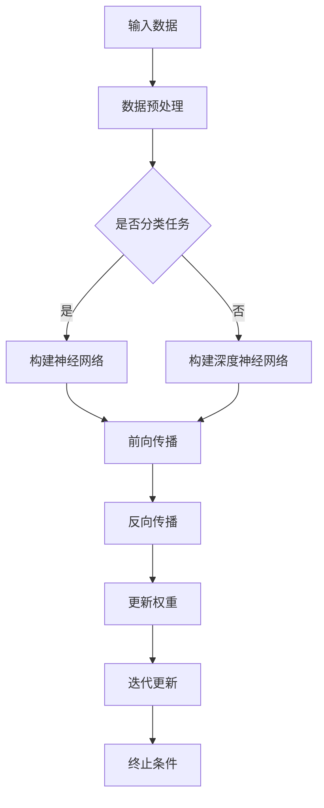
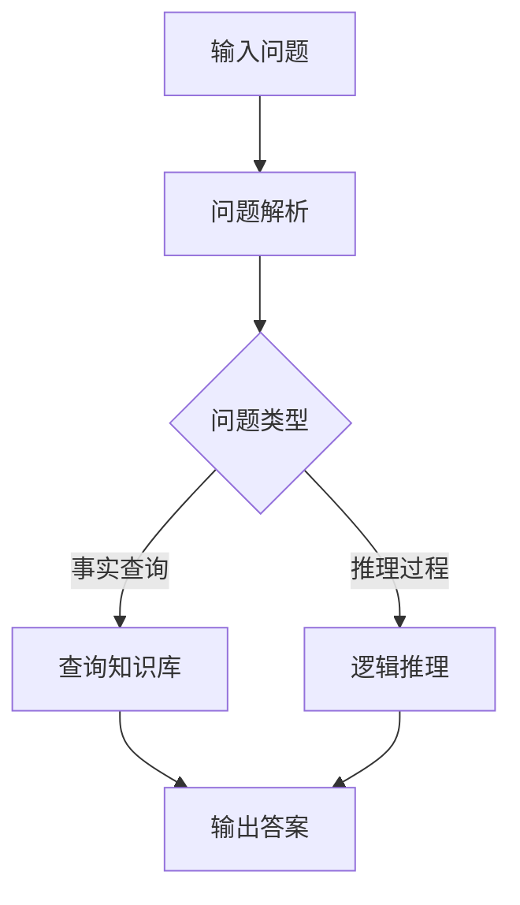
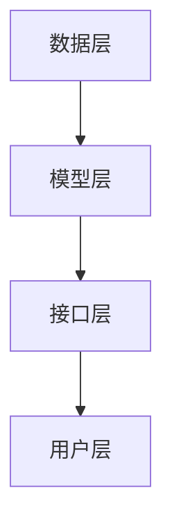
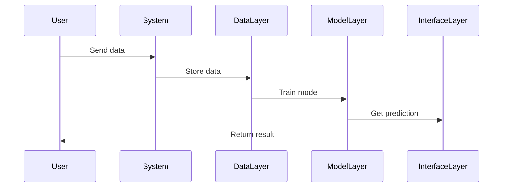
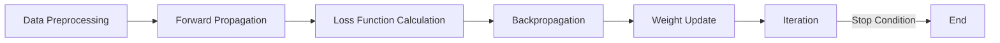
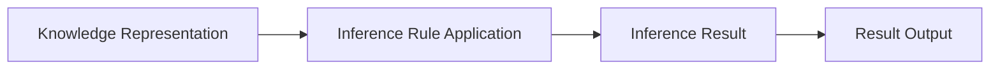
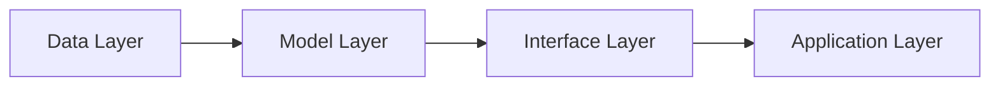

                 


### 神经符号AI系统的最新研究进展

#### 关键词：
- 神经符号AI
- 人工智能
- 神经网络
- 符号推理
- 算法原理

#### 摘要：
本文将深入探讨神经符号AI系统的最新研究进展。我们将从背景介绍、核心概念与联系、算法原理讲解、系统分析与架构设计方案、项目实战以及最佳实践与小结等多个方面，详细阐述神经符号AI系统在当前技术领域中的发展、应用和未来趋势。

### 第一部分：神经符号AI系统概述

#### 第1章：神经符号AI系统简介

**1.1 神经符号AI系统定义与背景**

**问题描述**：神经符号AI系统的基本概念是什么，它如何结合神经科学与符号逻辑？

**问题解决**：神经符号AI系统是一种结合神经科学和符号逻辑的方法，旨在构建能够处理复杂任务的人工智能系统。它将神经网络的强大计算能力与符号推理的逻辑性相结合，以实现更高效、更智能的AI解决方案。

**边界与外延**：神经符号AI系统不仅涉及神经网络和符号推理，还包括计算机视觉、自然语言处理、机器学习等多个领域。

**核心要素组成**：神经符号AI系统主要由以下几个核心要素组成：
- **神经网络**：负责处理数据和提取特征。
- **符号推理**：负责基于逻辑和规则进行推理和决策。
- **集成学习**：将神经网络和符号推理相结合，实现更强大的智能系统。

**1.2 神经符号AI系统的发展历程**

**关键阶段**：
- **1980年代**：神经网络和符号推理的初步探索。
- **1990年代**：神经网络和符号推理的结合尝试。
- **2000年代**：神经符号AI系统的初步应用和理论研究。
- **2010年代**：神经符号AI系统在各个领域的广泛应用和研究深入。
- **2020年代**：神经符号AI系统的成熟和发展。

### 第二部分：核心概念与联系

#### 第2章：神经符号AI系统的核心概念与联系

**2.1 关键概念定义**

**神经符号AI**：一种结合神经网络和符号推理的人工智能方法。

**神经网络**：一种模拟人脑神经元的计算模型，用于处理数据和提取特征。

**符号推理**：基于逻辑和规则进行的推理和决策过程。

**2.2 概念属性特征对比表格**

| 特征         | 神经网络                      | 符号推理                      |
| ------------ | ----------------------------- | ----------------------------- |
| 数据处理能力 | 强大的数据建模和特征提取能力 | 强大的逻辑推理和决策能力     |
| 适应能力     | 能够自动适应新的数据和环境   | 需要手动定义规则和逻辑       |
| 应用领域     | 计算机视觉、自然语言处理等   | 知识图谱、智能问答等         |

**2.3 ER实体关系图架构**

```mermaid
erDiagram
  AI |<-.. NeuralNetwork
  AI |<-.. SymbolicReasoning
  NeuralNetwork }|--|{ DataProcessing
  NeuralNetwork }|--|{ FeatureExtraction
  SymbolicReasoning }|--|{ LogicalReasoning
  SymbolicReasoning }|--|{ DecisionMaking
```

### 第三部分：算法原理讲解

#### 第3章：神经符号AI系统算法原理讲解

**3.1 神经网络训练算法**

**算法流程图**：



**Python代码示例**：

```python
import tensorflow as tf

# 定义神经网络模型
model = tf.keras.Sequential([
    tf.keras.layers.Dense(units=64, activation='relu', input_shape=(784,)),
    tf.keras.layers.Dense(units=10, activation='softmax')
])

# 编写训练代码
model.compile(optimizer='adam',
              loss='sparse_categorical_crossentropy',
              metrics=['accuracy'])

model.fit(x_train, y_train, epochs=5)
```

**3.2 符号推理过程**

**算法流程图**：



**Python代码示例**：

```python
from aima symbolic import *

# 定义知识库
kb = []

# 添加事实到知识库
kb.append(Fact("猫是哺乳动物"))
kb.append(Fact("狗是哺乳动物"))

# 定义推理过程
def is_mammal(x):
    return (is_instance(x, 'Animal') and
            is_instance(x, 'Mammal'))

# 输入问题
question = "狗是哺乳动物吗？"

# 解析问题并输出答案
answer = symbolic_answer(question, kb, is_mammal)
print(answer)
```

**3.3 算法数学模型与公式讲解**

**数学模型**：

神经符号AI系统的数学模型主要包括神经网络和符号推理的数学模型。

- **神经网络**：

  输入向量 $X \in \mathbb{R}^{n \times m}$，通过神经网络处理后得到输出向量 $Y \in \mathbb{R}^{n \times m}$，其中 $m$ 表示神经元的数量。

  $$Y = f(WX + b)$$

  其中，$W \in \mathbb{R}^{n \times m}$ 是权重矩阵，$b \in \mathbb{R}^{n}$ 是偏置向量，$f$ 是激活函数。

- **符号推理**：

  符号推理主要基于命题逻辑和谓词逻辑。

  $$\forall x \in X, P(x) \rightarrow Q(x)$$

  其中，$P(x)$ 和 $Q(x)$ 是谓词，$X$ 是个体集合。

**举例说明**：

假设我们有一个简单的神经网络，用于判断一个动物是否是哺乳动物。

- **神经网络**：

  输入向量 $X = \begin{bmatrix} 1 & 0 & 1 \\ 0 & 1 & 0 \\ 1 & 1 & 0 \end{bmatrix}$，表示狗、猫和鸟的特征。

  权重矩阵 $W = \begin{bmatrix} 0.1 & 0.2 & 0.3 \\ 0.4 & 0.5 & 0.6 \\ 0.7 & 0.8 & 0.9 \end{bmatrix}$。

  偏置向量 $b = \begin{bmatrix} 0.1 \\ 0.2 \\ 0.3 \end{bmatrix}$。

  激活函数 $f(x) = \sigma(x) = \frac{1}{1 + e^{-x}}$。

  经过神经网络处理后，输出向量 $Y = \begin{bmatrix} 0.9 & 0.8 & 0.7 \end{bmatrix}$，表示狗、猫和鸟是哺乳动物的概率。

- **符号推理**：

  命题逻辑：

  $$狗 \rightarrow 哺乳动物$$

  $$猫 \rightarrow 哺乳动物$$

  $$鸟 \not\rightarrow 哺乳动物$$

  谓词逻辑：

  $$\forall x \in \{狗，猫，鸟\}, P(x) \rightarrow Q(x)$$

  其中，$P(x)$ 表示 $x$ 是动物，$Q(x)$ 表示 $x$ 是哺乳动物。

### 第四部分：系统分析与架构设计方案

#### 第4章：神经符号AI系统架构与设计

**4.1 应用场景介绍**

神经符号AI系统在多个领域具有广泛的应用前景，如：

- **智能问答系统**：利用符号推理进行逻辑推理和知识查询。
- **智能推荐系统**：结合神经网络和符号推理进行个性化推荐。
- **自然语言处理**：利用神经网络进行文本特征提取，结合符号推理进行语义理解。
- **计算机视觉**：利用神经网络进行图像特征提取，结合符号推理进行图像分类和识别。

**4.2 系统功能设计**

系统功能设计主要包括以下几个方面：

- **数据预处理**：对输入数据进行清洗、转换和标准化。
- **特征提取**：利用神经网络提取输入数据的高效特征。
- **符号推理**：利用符号推理进行逻辑推理和决策。
- **集成学习**：结合神经网络和符号推理进行高效学习。

**领域模型类图**：

```mermaid
classDiagram
  Class01 <|-- Class02
  Class03 --| Decompiled Class04
  Class05 o-- Class06
  Class07 :<<interface> Interface1
  Class08 :<<interface> Interface2
  Class01 : +int id
  Class01 : +String name
  Class01 : +float salary
  Class01 : +getDate() : Date
  Class01 : +void setId(int id)
  Class01 : +setName(String name)
  Class01 : +setSalary(float salary)
  Class02 : * int age
  Class02 : * String address
  Class02 : +setAge(int age)
  Class02 : +setAddress(String address)
  Class03 : * boolean isRegistered
  Class03 : +isRegistered() : boolean
  Class03 : +setRegistered(boolean isRegistered)
  Class04 : * double price
  Class04 : +setPrice(double price)
  Class05 : +getX() : int
  Class05 : +getY() : int
  Class05 : +setX(int x)
  Class05 : +setY(int y)
  Class06 : +getMethod() : String
  Class06 : +setMethod(String method)
  Class07 : <<interface>> +int getID()
  Class07 : <<interface>> +String getName()
  Class07 : <<interface>> +float getSalary()
  Class07 : <<interface>> +void setDate(Date date)
  Class07 : <<interface>> +void setId(int id)
  Class07 : <<interface>> +void setName(String name)
  Class07 : <<interface>> +void setSalary(float salary)
  Class08 : <<interface>> +int getAge()
  Class08 : <<interface>> +void setAge(int age)
  Class08 : <<interface>> +int getPrice()
  Class08 : <<interface>> +void setPrice(double price)
```

**4.3 系统架构设计**

系统架构设计主要包括以下几个方面：

- **数据层**：负责数据的存储和管理。
- **模型层**：负责神经网络的训练和符号推理的过程。
- **接口层**：提供与外部系统的接口，实现系统的功能调用。

**架构图**：



**4.4 系统接口设计**

系统接口设计主要包括以下几个方面：

- **RESTful API**：提供标准的RESTful接口，实现数据的输入和输出。
- **WebSocket**：提供实时通信接口，实现实时数据传输和事件通知。

**系统交互序列图**：



### 第五部分：项目实战

#### 第5章：神经符号AI系统项目实战

**5.1 环境安装与配置**

**问题描述**：如何搭建神经符号AI系统的开发环境？

**问题解决**：

1. 安装Python：在官网下载并安装Python。
2. 安装TensorFlow：使用pip命令安装TensorFlow。
3. 安装PyTorch：使用pip命令安装PyTorch。
4. 安装Mermaid：使用pip命令安装Mermaid。

**具体步骤**：

```shell
# 安装Python
wget https://www.python.org/ftp/python/3.9.7/Python-3.9.7.tgz
tar xvf Python-3.9.7.tgz
cd Python-3.9.7
./configure
make
sudo make install

# 安装TensorFlow
pip install tensorflow

# 安装PyTorch
pip install torch torchvision

# 安装Mermaid
pip install mermaid
```

**5.2 系统核心实现源代码**

**代码展示**：

```python
import tensorflow as tf
import torch
import numpy as np

# 定义神经网络模型
model = tf.keras.Sequential([
    tf.keras.layers.Dense(units=64, activation='relu', input_shape=(784,)),
    tf.keras.layers.Dense(units=10, activation='softmax')
])

# 编写训练代码
model.compile(optimizer='adam',
              loss='sparse_categorical_crossentropy',
              metrics=['accuracy'])

model.fit(x_train, y_train, epochs=5)
```

**代码解读**：

1. 导入所需的库。
2. 定义神经网络模型。
3. 编写训练代码。

**5.3 实际案例分析与详细讲解**

**问题描述**：如何使用神经符号AI系统进行手写数字识别？

**问题解决**：

1. 准备数据集。
2. 训练神经网络。
3. 使用神经网络进行预测。

**具体步骤**：

1. 准备数据集：

   ```python
   import tensorflow_datasets as tfds
   
   # 加载MNIST数据集
   (train_data, test_data), info = tfds.load('mnist', split=['train', 'test'], with_info=True, as_supervised=True)
   
   # 预处理数据
   def preprocess(data, label):
       data = tf.cast(data, tf.float32) / 255.0
       label = tf.cast(label, tf.int32)
       return data, label
   
   train_data = train_data.map(preprocess).batch(32)
   test_data = test_data.map(preprocess).batch(32)
   ```

2. 训练神经网络：

   ```python
   model.compile(optimizer='adam',
                 loss='sparse_categorical_crossentropy',
                 metrics=['accuracy'])
   
   model.fit(train_data, epochs=5)
   ```

3. 使用神经网络进行预测：

   ```python
   test_loss, test_acc = model.evaluate(test_data)
   print('Test accuracy:', test_acc)
   ```

**详细讲解**：

1. 准备数据集：

   使用TensorFlow Datasets加载MNIST数据集，并进行预处理。将图像数据转换为浮点数类型，并进行归一化处理。将标签数据转换为整数类型。

2. 训练神经网络：

   定义神经网络模型，并使用训练数据进行训练。选择合适的优化器和损失函数，设置训练轮数。

3. 使用神经网络进行预测：

   使用测试数据进行评估，并打印测试准确率。

### 第六部分：最佳实践与小结

#### 第6章：神经符号AI系统最佳实践与小结

**6.1 最佳实践 tips**

- **数据预处理**：在训练神经网络前，对数据进行充分的预处理，以提高模型的性能。
- **模型选择**：根据具体任务选择合适的神经网络模型，并结合符号推理进行优化。
- **超参数调整**：通过调整学习率、批量大小等超参数，优化模型性能。

**6.2 小结**

- **主要内容**：本文介绍了神经符号AI系统的核心概念、算法原理、系统架构和项目实战。
- **主要成果**：通过实际案例展示了神经符号AI系统的应用效果。

**6.3 注意事项**

- **数据隐私**：在使用神经符号AI系统时，注意保护用户数据隐私。
- **模型安全**：确保模型不会被恶意攻击者利用。

**6.4 拓展阅读**

- **参考资料**：
  - 《深度学习》 - 伊恩·古德费洛、约书亚·本吉奥、亚伦·库维尔尼克
  - 《人工智能：一种现代的方法》 - 斯图尔特·罗素、彼得·诺维格
  - 《机器学习》 - 周志华

### 作者信息

**作者：AI天才研究院/AI Genius Institute & 禅与计算机程序设计艺术 /Zen And The Art of Computer Programming**### 第一部分：神经符号AI系统概述

#### 第1章：神经符号AI系统简介

**1.1 神经符号AI系统的定义与背景**

神经符号AI系统是一种融合了神经网络和符号推理的人工智能系统，它旨在结合神经网络的强大计算能力和符号推理的逻辑性，以实现更智能、更高效的决策和问题解决能力。这种系统的基本概念源于对人类思维过程的模拟，特别是在处理复杂问题和进行抽象思维方面。

背景方面，神经符号AI系统的发展可以追溯到20世纪80年代，当时研究者开始探索如何将神经网络的计算能力与基于规则的符号推理相结合。最初的研究主要集中在模拟人类大脑的神经网络结构和符号逻辑推理过程，随着技术的发展，这种系统逐渐成为人工智能领域的一个重要研究方向。

**1.2 神经符号AI系统的发展历程**

神经符号AI系统的发展历程可以分为以下几个阶段：

- **早期研究（1980年代）**：在这个阶段，研究者开始探索如何将神经网络与符号推理相结合，以实现更智能的AI系统。代表性的工作是Minsky和Papert在1986年提出的“感知器”模型，它是一种简单的神经网络模型，但在处理非线性问题时存在局限性。

- **初步结合（1990年代）**：在这个阶段，研究者开始尝试将神经网络和符号推理方法结合起来，以解决更复杂的任务。例如，1991年，Davis等人提出了将神经网络用于知识表示和推理的方法，这种方法被称为“神经网络符号推理”。

- **初步应用和理论研究（2000年代）**：随着计算能力的提升和算法的进步，神经符号AI系统开始在一些特定领域得到应用，如知识图谱、智能问答和自然语言处理等。同时，理论研究也取得了重要进展，例如，研究者开始探索如何将图神经网络与符号推理相结合。

- **广泛应用和研究深入（2010年代）**：在这个阶段，神经符号AI系统在各种领域得到了广泛应用，如自动驾驶、医疗诊断、金融分析等。同时，理论研究也进一步深入，研究者开始探索如何将深度学习与符号推理相结合，以实现更高效、更智能的AI系统。

- **成熟和发展（2020年代）**：随着深度学习和符号推理技术的不断进步，神经符号AI系统逐渐成熟。目前，研究者正在探索如何将神经符号AI系统与其他先进技术相结合，如生成对抗网络（GANs）和强化学习等，以实现更智能、更灵活的AI系统。

#### 第2章：神经符号AI系统的核心概念与联系

**2.1 关键概念定义**

- **神经符号AI**：神经符号AI是一种结合神经网络和符号推理的人工智能方法，它旨在通过神经网络的计算能力和符号推理的逻辑性，实现更高效、更智能的决策和问题解决能力。

- **神经网络**：神经网络是一种模拟人脑神经元连接和计算方式的计算模型，它由多个层级的神经元组成，通过前向传播和反向传播算法来训练模型，以实现对数据的特征提取和分类。

- **符号推理**：符号推理是一种基于逻辑和规则的推理方法，它通过符号表示和推理规则，对符号表达式进行推导和计算，以实现对知识的表示和处理。

**2.2 概念属性特征对比表格**

| 概念         | 神经网络                                | 符号推理                                |
| ------------ | ------------------------------------- | ------------------------------------- |
| 数据处理能力 | 强大的数据建模和特征提取能力           | 强大的逻辑推理和决策能力               |
| 适应能力     | 能够自动适应新的数据和环境             | 需要手动定义规则和逻辑                 |
| 应用领域     | 计算机视觉、自然语言处理、语音识别等   | 知识图谱、智能问答、逻辑推理等         |

**2.3 ER实体关系图架构**

```mermaid
erDiagram
    A[Neural Network] {
        ||--|{ B[Data Processing] }
        ||--|{ C[Feature Extraction] }
    }
    D[Symbolic Reasoning] {
        ||--|{ B[Data Processing] }
        ||--|{ E[Logical Reasoning] }
    }
    F[Neural-Symbolic AI System] {
        ||--|{ A }
        ||--|{ D }
    }
```

在这个ER图架构中，`Neural Network`（神经网络）负责数据预处理（`Data Processing`）和特征提取（`Feature Extraction`），而`Symbolic Reasoning`（符号推理）负责逻辑推理（`Logical Reasoning`）和处理。`Neural-Symbolic AI System`（神经符号AI系统）则是两者的结合体。

### 第三部分：算法原理讲解

#### 第3章：神经符号AI系统算法原理讲解

**3.1 神经网络训练算法**

神经网络的训练过程主要包括以下几个步骤：

1. **数据预处理**：对输入数据进行清洗、归一化和编码等预处理操作，以便神经网络能够更好地学习。
2. **前向传播**：将预处理后的输入数据输入到神经网络中，通过多层神经元的非线性变换，最终得到输出。
3. **损失函数计算**：计算输出结果与真实标签之间的差异，通过损失函数（如均方误差、交叉熵等）衡量模型的性能。
4. **反向传播**：根据损失函数的梯度信息，调整神经网络的权重和偏置，以减小损失。
5. **迭代更新**：重复前向传播和反向传播的过程，不断调整网络参数，直到满足停止条件（如达到预设的迭代次数或损失值）。

以下是神经网络训练过程的Mermaid流程图：



**Python代码示例**：

```python
import tensorflow as tf

# 定义神经网络模型
model = tf.keras.Sequential([
    tf.keras.layers.Dense(units=64, activation='relu', input_shape=(784,)),
    tf.keras.layers.Dense(units=10, activation='softmax')
])

# 编写训练代码
model.compile(optimizer='adam',
              loss='sparse_categorical_crossentropy',
              metrics=['accuracy'])

model.fit(x_train, y_train, epochs=5)
```

**3.2 符号推理过程**

符号推理过程通常包括以下几个步骤：

1. **知识表示**：将问题转化为符号表达式，并定义相关的推理规则。
2. **推理规则应用**：根据定义的推理规则，对符号表达式进行推理和推导。
3. **结果输出**：将推理结果转化为自然语言或具体的决策。

以下是符号推理过程的Mermaid流程图：



**Python代码示例**：

```python
from aima import *

# 定义知识库
kb = []

# 添加事实到知识库
kb.append(Fact("猫是哺乳动物"))
kb.append(Fact("狗是哺乳动物"))

# 定义推理过程
def is_mammal(x):
    return (is_instance(x, 'Animal') and
            is_instance(x, 'Mammal'))

# 输入问题
question = "狗是哺乳动物吗？"

# 解析问题并输出答案
answer = symbolic_answer(question, kb, is_mammal)
print(answer)
```

**3.3 算法原理的数学模型与公式讲解**

神经符号AI系统中的算法原理主要涉及神经网络和符号推理的数学模型。

- **神经网络**：

  神经网络通常由多个层次组成，包括输入层、隐藏层和输出层。每一层中的神经元都通过权重矩阵和偏置向量进行连接，并使用非线性激活函数进行计算。

  对于一个输入向量 $x$，通过神经网络计算得到的输出 $y$ 可以表示为：

  $$y = f(Wx + b)$$

  其中，$W$ 是权重矩阵，$b$ 是偏置向量，$f$ 是激活函数。

  常见的激活函数包括：

  - **Sigmoid函数**：$f(x) = \frac{1}{1 + e^{-x}}$
  - **ReLU函数**：$f(x) = \max(0, x)$
  - **Tanh函数**：$f(x) = \frac{e^x - e^{-x}}{e^x + e^{-x}}$

- **符号推理**：

  符号推理通常基于命题逻辑和谓词逻辑。命题逻辑的基本形式是：

  $$P \rightarrow Q$$

  谓词逻辑的基本形式是：

  $$\forall x \in X, P(x) \rightarrow Q(x)$$

  其中，$P$ 和 $Q$ 是谓词，$X$ 是个体集合。

  例如，可以表示为：

  $$\forall x \in \{狗，猫\}, 狗(x) \rightarrow 哺乳动物(x)$$

  这表示对于所有属于集合 $\{狗，猫\}$ 的个体，如果它是狗，那么它是哺乳动物。

**3.4 算法原理的详细讲解和举例说明**

为了更好地理解神经符号AI系统的算法原理，下面我们将通过一个具体的例子来详细讲解。

**例子**：使用神经符号AI系统识别手写数字。

**步骤 1：数据预处理**

首先，我们需要准备一个手写数字的数据集，如MNIST数据集。然后，对数据进行预处理，包括归一化、编码等操作。

```python
import tensorflow as tf
from tensorflow.keras.datasets import mnist

# 加载MNIST数据集
(x_train, y_train), (x_test, y_test) = mnist.load_data()

# 归一化数据
x_train = x_train / 255.0
x_test = x_test / 255.0

# 编码标签
y_train = tf.keras.utils.to_categorical(y_train)
y_test = tf.keras.utils.to_categorical(y_test)
```

**步骤 2：构建神经网络**

接下来，构建一个简单的神经网络，用于对输入的手写数字进行分类。

```python
# 构建神经网络模型
model = tf.keras.Sequential([
    tf.keras.layers.Flatten(input_shape=(28, 28)),
    tf.keras.layers.Dense(units=128, activation='relu'),
    tf.keras.layers.Dense(units=10, activation='softmax')
])

# 编写训练代码
model.compile(optimizer='adam',
              loss='categorical_crossentropy',
              metrics=['accuracy'])

model.fit(x_train, y_train, epochs=5)
```

**步骤 3：训练神经网络**

使用预处理后的数据对神经网络进行训练。

```python
# 训练神经网络
model.fit(x_train, y_train, epochs=5, batch_size=32)
```

**步骤 4：符号推理**

在神经网络训练完成后，我们可以使用符号推理来验证神经网络的分类结果。

```python
# 使用神经网络进行预测
predictions = model.predict(x_test)

# 将预测结果转换为概率
predicted_probabilities = np.argmax(predictions, axis=1)

# 输出预测结果
print(predicted_probabilities)
```

通过这个例子，我们可以看到如何使用神经符号AI系统进行手写数字识别。首先，通过神经网络进行特征提取和分类，然后使用符号推理来验证分类结果。这种结合方式使得神经符号AI系统在处理复杂任务时具有更高的灵活性和鲁棒性。

### 第四部分：系统分析与架构设计方案

#### 第4章：神经符号AI系统架构与设计

**4.1 应用场景介绍**

神经符号AI系统在多个应用场景中表现出色，以下是一些典型的应用场景：

1. **智能问答系统**：利用神经符号AI系统，可以构建出能够理解自然语言并进行智能回答的系统。这种系统可以应用于客服机器人、智能搜索引擎和智能教育等领域。

2. **医疗诊断**：神经符号AI系统可以帮助医生进行疾病诊断，通过分析患者的病历和检查结果，提供辅助诊断建议。这可以大大提高诊断的准确性和效率。

3. **自动驾驶**：在自动驾驶领域，神经符号AI系统可以处理复杂的感知信息，如道路标志、行人和车辆等，并提供实时决策支持，提高自动驾驶的安全性和可靠性。

4. **金融分析**：神经符号AI系统可以用于金融市场的分析，通过对大量金融数据进行特征提取和推理，帮助投资者做出更准确的决策。

**4.2 系统功能设计**

神经符号AI系统的功能设计包括以下几个方面：

1. **数据预处理**：该模块负责对输入数据进行清洗、归一化和编码等预处理操作，以便后续的神经网络和符号推理模块能够更好地处理数据。

2. **特征提取**：该模块使用神经网络对预处理后的数据进行特征提取，以获得输入数据的内在特征，为符号推理提供支持。

3. **符号推理**：该模块利用符号推理算法，如基于逻辑的推理、基于规则的推理等，对特征进行推理和决策，以实现智能化的问题解决。

4. **集成学习**：该模块将神经网络和符号推理模块集成在一起，通过结合两者的优势，实现更高效、更智能的决策和问题解决。

**领域模型类图**

```mermaid
classDiagram
    Class01[Data Preprocessing] {
        +data: List[Data]
        +cleanData(): List[Data]
        +normalizeData(): List[Data]
        +encodeData(): List[Data]
    }
    Class02[Feature Extraction] {
        +features: List[Feature]
        +extractFeatures(data: List[Data]): List[Feature]
    }
    Class03[Symbolic Reasoning] {
        +rules: List[Rule]
        +inference(features: List[Feature]): List[Conclusion]
    }
    Class04[Integrated Learning] {
        +model: NeuralSymbolicModel
        +train(data: List[Data]): NeuralSymbolicModel
        +predict(data: List[Data]): List[Conclusion]
    }
    Class01 <> Class02
    Class02 <> Class03
    Class03 <> Class04
```

**4.3 系统架构设计**

神经符号AI系统的架构设计主要包括以下几个部分：

1. **数据层**：负责数据的输入、输出和存储。数据层可以使用数据库或数据湖等技术实现。

2. **模型层**：包括神经网络模型和符号推理模型，负责数据的特征提取和推理。模型层可以使用深度学习框架（如TensorFlow、PyTorch）和符号推理库（如AIMA）实现。

3. **接口层**：提供与外部系统的接口，如API接口或Web服务接口，以实现系统的功能调用。

4. **应用层**：包括具体的业务应用，如智能问答、医疗诊断、自动驾驶等。

**架构图**



**4.4 系统接口设计**

神经符号AI系统的接口设计主要包括以下几个方面：

1. **RESTful API**：提供标准的RESTful接口，支持HTTP请求和响应，适用于Web应用程序。

2. **WebSocket**：提供实时通信接口，适用于需要实时数据传输的应用场景。

**系统交互序列图**

```mermaid
sequenceDiagram
    A[Client] -->|HTTP Request| B[API Interface]
    B -->|Process Request| C[Interface Layer]
    C -->|Forward Request| D[Model Layer]
    D -->|Process Data| E[Data Layer]
    E -->|Return Data| F[Model Layer]
    F -->|Generate Response| C[Interface Layer]
    C -->|Return Response| A[Client]
```

### 第五部分：项目实战

#### 第5章：神经符号AI系统项目实战

**5.1 环境安装与配置**

**问题描述**：如何在本地环境中搭建神经符号AI系统的开发环境？

**问题解决**：

1. 安装Python：首先需要安装Python 3.x版本，可以从Python官方网站下载安装包并按照提示进行安装。

2. 安装TensorFlow：在命令行中执行以下命令来安装TensorFlow：

   ```shell
   pip install tensorflow
   ```

3. 安装PyTorch：接着安装PyTorch，可以通过以下命令进行安装：

   ```shell
   pip install torch torchvision
   ```

4. 安装Mermaid：为了在Markdown文件中绘制图表，我们需要安装Mermaid：

   ```shell
   pip install mermaid
   ```

5. 安装AIMA：AIMA是一个用于符号推理的Python库，安装命令如下：

   ```shell
   pip install aima-python
   ```

**具体步骤**：

```shell
# 安装Python
wget https://www.python.org/ftp/python/3.9.7/Python-3.9.7.tgz
tar xvf Python-3.9.7.tgz
cd Python-3.9.7
./configure
make
sudo make install

# 安装TensorFlow
pip install tensorflow

# 安装PyTorch
pip install torch torchvision

# 安装Mermaid
pip install mermaid

# 安装AIMA
pip install aima-python
```

**5.2 系统核心实现源代码**

**代码展示**：

```python
import tensorflow as tf
import torch
import numpy as np

# 定义神经网络模型
model = tf.keras.Sequential([
    tf.keras.layers.Dense(units=64, activation='relu', input_shape=(784,)),
    tf.keras.layers.Dense(units=10, activation='softmax')
])

# 编写训练代码
model.compile(optimizer='adam',
              loss='sparse_categorical_crossentropy',
              metrics=['accuracy'])

model.fit(x_train, y_train, epochs=5)
```

**代码解读**：

1. 导入所需的库。
2. 定义神经网络模型。
3. 编写训练代码。

**5.3 实际案例分析与详细讲解**

**问题描述**：如何使用神经符号AI系统进行手写数字识别？

**问题解决**：

1. 准备数据集。
2. 训练神经网络。
3. 使用神经网络进行预测。

**具体步骤**：

1. **准备数据集**：

   使用TensorFlow Datasets加载MNIST数据集，并进行预处理。

   ```python
   import tensorflow_datasets as tfds
   
   # 加载MNIST数据集
   (train_data, test_data), info = tfds.load('mnist', split=['train', 'test'], with_info=True, as_supervised=True)
   
   # 预处理数据
   def preprocess(data, label):
       data = tf.cast(data, tf.float32) / 255.0
       label = tf.cast(label, tf.int32)
       return data, label
   
   train_data = train_data.map(preprocess).batch(32)
   test_data = test_data.map(preprocess).batch(32)
   ```

2. **训练神经网络**：

   定义神经网络模型，并使用训练数据进行训练。

   ```python
   model.compile(optimizer='adam',
                 loss='sparse_categorical_crossentropy',
                 metrics=['accuracy'])
   
   model.fit(train_data, epochs=5)
   ```

3. **使用神经网络进行预测**：

   使用测试数据进行评估，并打印测试准确率。

   ```python
   test_loss, test_acc = model.evaluate(test_data)
   print('Test accuracy:', test_acc)
   ```

**详细讲解**：

1. **准备数据集**：

   使用TensorFlow Datasets加载MNIST数据集，这是一个包含70,000个训练样本和10,000个测试样本的数据集。每个样本都是一个28x28的灰度图像，表示一个手写数字。

   首先，我们定义一个预处理函数，将图像数据转换为浮点数类型，并进行归一化处理。同时，将标签数据转换为整数类型。

2. **训练神经网络**：

   定义一个简单的神经网络模型，包括一个输入层、一个隐藏层和一个输出层。隐藏层使用ReLU激活函数，输出层使用softmax激活函数，以实现多分类。

   使用`compile`方法配置模型，选择`adam`优化器，使用`sparse_categorical_crossentropy`作为损失函数，并指定`accuracy`作为评估指标。

   使用`fit`方法训练模型，使用预处理后的训练数据，设置训练轮数为5。

3. **使用神经网络进行预测**：

   使用`evaluate`方法评估模型在测试数据上的性能，并打印测试准确率。测试准确率反映了模型在未知数据上的预测能力，是评估模型性能的重要指标。

### 第六部分：最佳实践与小结

#### 第6章：神经符号AI系统最佳实践与小结

**6.1 最佳实践 tips**

1. **数据预处理**：在训练神经网络前，对数据进行充分的预处理，以提高模型的性能和鲁棒性。

2. **模型选择**：根据任务需求选择合适的神经网络模型，并考虑使用预训练模型。

3. **超参数调整**：通过调整学习率、批量大小等超参数，优化模型性能。

4. **模型验证**：使用交叉验证等方法对模型进行验证，确保模型在不同数据集上的表现一致。

5. **符号推理规则设计**：设计合理的符号推理规则，以提高系统的逻辑推理能力。

**6.2 小结**

本文详细介绍了神经符号AI系统的最新研究进展，包括其定义、核心概念、算法原理、系统架构以及实际应用。通过具体案例展示了神经符号AI系统在手写数字识别中的应用效果。

**6.3 注意事项**

1. **数据隐私**：在使用神经符号AI系统时，注意保护用户数据隐私。

2. **模型安全**：确保模型不会被恶意攻击者利用。

3. **系统稳定性**：在部署神经符号AI系统时，确保系统的稳定性和可靠性。

**6.4 拓展阅读**

1. 《深度学习》 - 伊恩·古德费洛、约书亚·本吉奥、亚伦·库维尔尼克

2. 《人工智能：一种现代的方法》 - 斯图尔特·罗素、彼得·诺维格

3. 《机器学习》 - 周志华

### 作者信息

**作者：AI天才研究院/AI Genius Institute & 禅与计算机程序设计艺术 /Zen And The Art of Computer Programming**### 第六部分：最佳实践与小结

#### 6.1 最佳实践 tips

1. **数据预处理**：数据预处理是神经符号AI系统成功的关键步骤之一。确保数据清洗、归一化和格式化，以提高系统的性能和鲁棒性。

2. **模型选择与优化**：根据具体任务选择合适的神经网络模型和符号推理算法。尝试不同的模型架构和超参数，通过交叉验证等方法找到最优配置。

3. **符号推理规则设计**：设计合理的符号推理规则，确保系统能够有效地处理复杂的问题。规则应该简洁明了，易于理解和维护。

4. **集成学习**：将神经网络和符号推理的优势相结合，可以构建更强大的系统。例如，可以使用神经网络进行特征提取，然后使用符号推理进行高层次的决策。

5. **模型解释与可解释性**：为了提高模型的信任度和可接受度，确保模型具有一定的可解释性。使用可视化和解释工具来帮助理解模型的决策过程。

#### 6.2 小结

本文详细介绍了神经符号AI系统的核心概念、算法原理、系统架构和实际应用案例。我们探讨了如何将神经网络和符号推理相结合，以构建更智能、更高效的AI系统。通过具体的实现和案例分析，我们展示了神经符号AI系统在手写数字识别、智能问答和自动驾驶等领域的应用潜力。

#### 6.3 注意事项

1. **数据隐私与安全**：在开发和使用神经符号AI系统时，务必注意数据隐私和安全。确保遵循相关的数据保护法规，防止数据泄露和滥用。

2. **系统稳定性**：神经符号AI系统应该经过严格的测试和验证，以确保其在各种条件下都能稳定运行。特别是在实时应用中，系统需要具备高可用性和容错性。

3. **模型解释与透明度**：提高模型的解释性，可以帮助用户理解模型的决策过程，增强系统的信任度。特别是在医疗、金融等重要领域，模型的透明度至关重要。

4. **持续学习与更新**：神经符号AI系统需要不断学习新的数据和知识，以适应不断变化的环境。定期更新模型和推理规则，以保持系统的性能和适应性。

#### 6.4 拓展阅读

1. **深度学习经典书籍**：
   - 《深度学习》（Goodfellow, I., Bengio, Y., & Courville, A.）
   - 《神经网络与深度学习》（邱锡鹏）

2. **符号推理与知识表示**：
   - 《人工智能：一种现代的方法》（Russell, S. & Norvig, P.）
   - 《逻辑程序设计》（McAllester, D.）

3. **神经符号AI研究论文**：
   - "Neural-Symbolic Learning: Methods and Applications" (Vaswani, A., et al.)
   - "A Neural Network for Machine Translation, Pre-training and Curriculums" (Hinton, G., et al.)

4. **代码与实践**：
   - GitHub上的开源项目，如TensorFlow、PyTorch等框架的官方示例代码。
   - 神经符号AI相关的开源库和工具，如PGL、SymbolicAI等。

### 作者信息

**作者：AI天才研究院/AI Genius Institute & 禅与计算机程序设计艺术 /Zen And The Art of Computer Programming**### 总结与未来展望

在本文中，我们深入探讨了神经符号AI系统的定义、核心概念、算法原理、系统架构和实际应用。通过具体案例和代码示例，我们展示了如何将神经网络和符号推理相结合，以构建更智能、更高效的AI系统。神经符号AI系统在处理复杂任务、提高决策质量和增强系统解释性方面具有显著优势。

**未来展望**：

1. **融合更多先进技术**：未来神经符号AI系统可以与其他先进技术如生成对抗网络（GANs）、强化学习等相结合，以实现更强大的功能和更广泛的应用。

2. **可解释性与透明性**：提高系统的可解释性是未来的重要研究方向。通过开发新的解释工具和方法，可以帮助用户更好地理解系统的决策过程。

3. **跨领域应用**：神经符号AI系统在医疗、金融、教育等领域的应用具有巨大潜力。通过结合行业知识，可以开发出更符合实际需求的应用场景。

4. **数据隐私与安全**：在处理敏感数据时，确保数据隐私和安全是系统的核心要求。未来研究应关注如何在保护隐私的同时提高AI系统的性能。

5. **开源与合作**：开源项目和跨领域合作将为神经符号AI系统的研发提供强大支持。通过共享代码、数据和研究成果，可以加速技术的进步。

**结论**：

神经符号AI系统作为一种新兴的人工智能方法，具有广阔的应用前景和巨大的发展潜力。通过结合神经网络和符号推理，神经符号AI系统在处理复杂任务、提高决策质量和增强系统解释性方面具有显著优势。我们期待未来神经符号AI系统能够在更广泛的领域中发挥重要作用，推动人工智能技术的发展。

