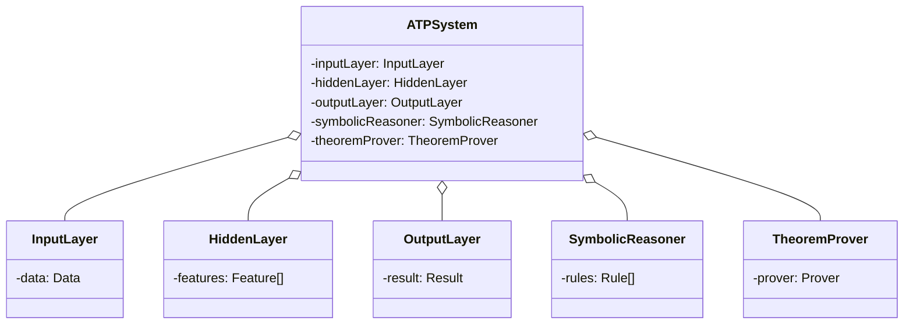
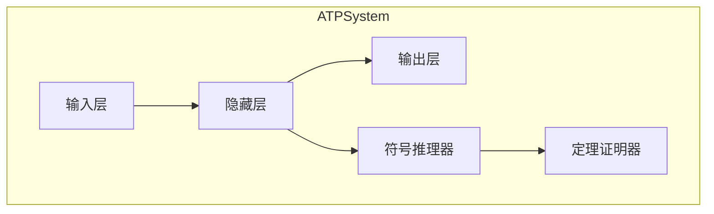
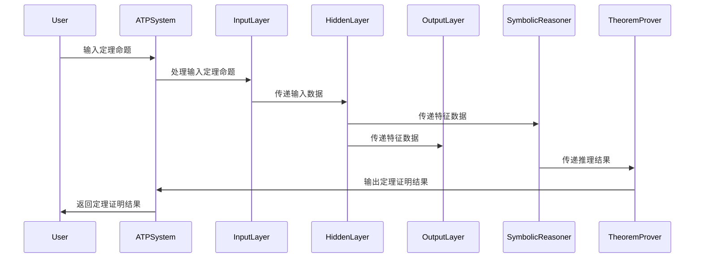

                 

### 设计《神经符号推理在自动定理证明中的应用》书目录大纲的思路

设计《神经符号推理在自动定理证明中的应用》书目录大纲，首先需要明确整体结构和内容分布，以便读者能够清晰地理解书的核心内容。以下是具体的思路：

#### 1. 背景介绍

- **神经符号推理概述**：介绍神经符号推理的定义、发展历史、主要特点和应用领域。这部分内容将帮助读者对神经符号推理有初步的了解，为后续内容打下基础。

- **自动定理证明概述**：介绍自动定理证明的定义、发展历史、主要方法和应用领域。这部分内容将帮助读者了解自动定理证明的基本概念和当前的发展状况。

- **神经符号推理与自动定理证明的联系与差异**：分析两个领域的共同目标、交叉领域以及它们的优势互补之处。这部分内容将为读者展示神经符号推理在自动定理证明中的潜力。

#### 2. 核心概念与联系

- **神经符号推理关键概念**：详细介绍神经网络、符号推理以及神经符号推理架构等核心概念。通过这一部分，读者可以深入理解神经符号推理的基本原理。

- **自动定理证明关键概念**：介绍定理证明、定理证明方法以及自动定理证明系统等关键概念。这部分内容将帮助读者掌握自动定理证明的核心知识。

- **神经符号推理与自动定理证明的联系**：探讨数据驱动与逻辑推理的结合、神经网络优化以及符号计算与搜索策略在两个领域中的应用。这部分内容将展示神经符号推理如何为自动定理证明提供新的解决思路。

#### 3. 算法原理讲解

- **神经符号推理算法**：详细讲解神经网络模型、符号推理算法、融合策略以及算法流程图。这部分内容将帮助读者理解神经符号推理算法的工作原理。

- **自动定理证明算法**：介绍定理证明方法、搜索策略、优化方法以及算法流程图。这部分内容将帮助读者掌握自动定理证明的基本算法。

- **神经符号推理在自动定理证明中的应用**：分析神经符号推理在自动定理证明中的应用场景、优势分析以及案例研究。这部分内容将展示神经符号推理在自动定理证明中的实际应用。

#### 4. 数学模型和数学公式

- **神经符号推理数学模型**：使用数学公式详细描述神经网络模型、符号推理算法和融合策略。这部分内容将为读者提供神经符号推理的数学基础。

- **自动定理证明数学模型**：使用数学公式详细描述定理证明方法、搜索策略和优化方法。这部分内容将为读者提供自动定理证明的数学基础。

#### 5. 系统分析与架构设计方案

- **问题场景介绍**：介绍自动定理证明系统的应用场景，为后续的系统设计与实现提供背景。

- **系统功能设计**：使用Mermaid类图展示领域模型，描述系统的功能模块划分。

- **系统架构设计**：使用Mermaid架构图展示系统架构，描述系统模块的交互关系。

- **系统接口设计**：定义系统接口，描述接口的调用方式。

- **系统交互序列图**：使用Mermaid序列图展示用户与系统的交互流程。

#### 6. 项目实战

- **环境安装**：介绍如何搭建开发环境和安装相关工具。

- **系统核心实现源代码**：提供神经符号推理模块和自动定理证明模块的源代码，让读者能够亲自动手实践。

- **代码应用解读与分析**：对关键代码进行解读，分析代码实现原理。

- **实际案例分析和详细讲解剖析**：通过实际案例展示神经符号推理和自动定理证明的应用，并进行详细讲解。

- **项目小结**：总结项目的主要收获，提出经验与启示。

#### 7. 最佳实践 tips、小结、注意事项、拓展阅读等内容

- **最佳实践 tips**：提供神经符号推理算法优化策略和自动定理证明系统性能优化的建议。

- **小结**：回顾书籍的主要内容，总结神经符号推理与自动定理证明的发展趋势。

- **注意事项**：讨论神经符号推理算法应用中的挑战与对策，以及自动定理证明系统部署与维护的注意事项。

- **拓展阅读**：推荐相关研究论文和最新技术动态与发展趋势，帮助读者进一步探索该领域。

### 总结目录大纲

在上述思路的指导下，可以设计出如下目录大纲：

----------------------------------------------------------------

# 第一部分：神经符号推理与自动定理证明概述

## 第1章：神经符号推理概述

### 1.1 神经符号推理定义与发展历史

### 1.2 神经符号推理特点与优势

### 1.3 神经符号推理主要应用领域

## 第2章：自动定理证明概述

### 2.1 自动定理证明定义与发展历史

### 2.2 自动定理证明方法与系统

### 2.3 自动定理证明应用领域

## 第3章：神经符号推理与自动定理证明的联系与融合

### 3.1 神经符号推理与自动定理证明的交集

### 3.2 神经符号推理在自动定理证明中的应用优势

### 3.3 神经符号推理与自动定理证明融合策略

## 第二部分：神经符号推理算法原理

## 第4章：神经网络模型

### 4.1 神经网络基本原理

### 4.2 神经网络优化方法

### 4.3 神经网络在神经符号推理中的应用

## 第5章：符号推理算法

### 5.1 符号推理基本原理

### 5.2 符号推理算法设计

### 5.3 符号推理算法在神经符号推理中的应用

## 第6章：神经符号推理算法融合策略

### 6.1 神经符号推理算法融合方法

### 6.2 神经符号推理算法融合优化

### 6.3 神经符号推理算法融合案例研究

## 第三部分：自动定理证明算法原理

## 第7章：定理证明方法

### 7.1 定理证明基本原理

### 7.2 定理证明算法设计

### 7.3 定理证明算法应用

## 第8章：搜索策略与优化方法

### 8.1 搜索策略基本原理

### 8.2 搜索策略优化方法

### 8.3 搜索策略在自动定理证明中的应用

## 第9章：神经符号推理在自动定理证明中的应用

### 9.1 神经符号推理在自动定理证明中的应用场景

#

----------------------------------------------------------------

通过这样的目录大纲设计，读者可以系统地了解神经符号推理和自动定理证明的相关知识，并通过案例研究和实战项目深入理解这两个领域的结合与应用。

### 背景介绍

#### 神经符号推理概述

**定义与发展历史**

神经符号推理（Neural Symbolic Reasoning，简称NSR）是人工智能领域的一项前沿技术，旨在结合神经网络的强大数据处理能力和符号推理的逻辑推理能力。神经符号推理的概念最早由David Ferrucci等人于2007年提出，并在IBM的Watson项目中得到了初步的应用。Watson在处理自然语言理解和复杂逻辑推理任务中展现了卓越的性能，这标志着神经符号推理技术的诞生。

神经符号推理的发展历程可以分为几个阶段：

1. **初阶阶段（2007-2013年）**：以Watson为代表，神经符号推理技术开始在自然语言处理、问答系统等领域得到应用。
2. **进阶阶段（2014-2019年）**：随着深度学习技术的发展，神经符号推理逐渐与深度学习模型相结合，实现了在图像识别、语音识别等领域的应用。
3. **成熟阶段（2020年至今）**：神经符号推理技术开始向自动定理证明、推理引擎等领域扩展，取得了显著的成果。

**主要特点与优势**

神经符号推理的核心特点在于其结合了神经网络的表示能力和符号推理的逻辑推理能力，从而在处理复杂任务时能够发挥独特优势：

1. **表示能力**：神经网络能够高效地学习并表示复杂的数据，包括图像、语音和文本等，这使得神经符号推理在数据驱动的任务中具有强大的能力。
2. **逻辑推理能力**：符号推理能够确保推理过程的正确性和一致性，使得神经符号推理在处理逻辑任务时具有优势。
3. **融合优势**：神经符号推理将神经网络与符号推理相结合，能够充分利用两者的优点，弥补单一技术的不足，从而在复杂任务中实现更高的性能。

**应用领域**

神经符号推理技术具有广泛的应用前景，主要应用领域包括：

1. **自然语言处理**：如问答系统、机器翻译、文本生成等。
2. **计算机视觉**：如图像分类、目标检测、图像生成等。
3. **自动定理证明**：利用神经符号推理技术可以处理复杂的数学推理和定理证明问题。
4. **决策支持系统**：如智能推荐、金融风险评估等。

#### 自动定理证明概述

**定义与发展历史**

自动定理证明（Automatic Theorem Proving，简称ATP）是指利用计算机程序自动证明数学定理或逻辑命题的过程。自动定理证明的研究可以追溯到20世纪50年代，当时的数学家和计算机科学家开始探索如何使用计算机来证明数学定理。

自动定理证明的发展历程可以分为以下几个阶段：

1. **初阶阶段（1950-1970年）**：这一阶段主要是基于手工编码的规则系统进行定理证明，如PR proof系统、ROBUST proof系统等。
2. **进阶阶段（1970-1990年）**：这一阶段引入了逻辑编程和自动推理技术，如resolution方法、表驱动方法等。
3. **成熟阶段（1990年至今）**：随着计算机硬件和算法的进步，自动定理证明系统如E夹子（Equational Prover E）、SPASS、Isabelle等得到了广泛应用，并在一些领域取得了突破性成果。

**主要方法与系统**

自动定理证明的主要方法包括：

1. **归纳证明**：通过递归定义和归纳步骤来证明命题的正确性。
2. **模型检查**：通过验证系统模型是否满足特定逻辑属性来证明定理。
3. **决议方法**：通过将问题转换为子问题来解决，如resolution方法。
4. **表驱动方法**：通过构建和搜索表格来发现证明。

主要的自动定理证明系统包括：

1. **E夹子（EQP）**：一种基于表格驱动的定理证明器，适用于等式理论和一阶逻辑。
2. **SPASS**：一种基于resolution方法的定理证明器，适用于一阶逻辑和更高阶逻辑。
3. **Isabelle**：一种基于归纳证明和逻辑编程的定理证明器，适用于高阶逻辑和形式化验证。

**应用领域**

自动定理证明技术在多个领域有广泛应用：

1. **计算机科学**：用于验证程序的正确性和安全性。
2. **数学**：用于证明数学定理和解决数学问题。
3. **密码学**：用于验证密码系统的安全性。
4. **硬件设计**：用于验证集成电路和硬件系统的正确性。

#### 神经符号推理与自动定理证明的联系与差异

**联系**

神经符号推理与自动定理证明之间存在密切的联系，主要体现在以下几个方面：

1. **目标一致性**：两者的共同目标是自动处理复杂的逻辑推理和证明任务。
2. **融合优势**：神经符号推理可以结合神经网络和符号推理的优势，提高自动定理证明的性能和效率。
3. **应用互补**：神经符号推理可以应用于自动定理证明中难以处理的复杂逻辑推理任务，而自动定理证明系统则可以为神经符号推理提供逻辑推理的基础。

**差异**

尽管神经符号推理与自动定理证明有许多共同之处，但两者也存在明显的差异：

1. **理论基础**：自动定理证明主要基于形式逻辑和数学理论，而神经符号推理则基于神经网络的计算模型。
2. **处理方式**：自动定理证明依赖于逻辑推理和搜索策略，而神经符号推理则通过神经网络的学习和处理来实现。
3. **应用领域**：自动定理证明主要应用于数学和计算机科学的领域，而神经符号推理则可以应用于更广泛的领域，如自然语言处理和计算机视觉。

**共同目标**

尽管神经符号推理和自动定理证明在理论基础和处理方式上存在差异，但它们的共同目标是自动处理复杂的逻辑推理和证明任务，提高处理效率和准确性。这种共同目标使得两者在未来的发展中有着广阔的合作空间。

**交叉领域**

神经符号推理和自动定理证明在多个交叉领域展现出了强大的潜力：

1. **智能推理系统**：结合神经符号推理和自动定理证明，可以构建出更强大的智能推理系统，用于处理复杂的逻辑推理和证明任务。
2. **形式化验证**：利用神经符号推理技术，可以增强形式化验证系统的推理能力，提高验证效率和准确性。
3. **数学问题求解**：结合神经符号推理和自动定理证明，可以解决一些复杂的数学问题，如高维积分、方程求解等。

**优势互补**

神经符号推理和自动定理证明的优势互补，使得两者在融合中可以取得更好的效果：

1. **神经网络的优势**：神经网络在处理复杂数据和学习复杂模式方面具有强大的能力，可以为自动定理证明提供数据驱动的支持。
2. **符号推理的优势**：符号推理在确保推理过程的一致性和正确性方面具有优势，可以为神经符号推理提供逻辑推理的基础。

综上所述，神经符号推理和自动定理证明在理论基础、处理方式和应用领域上存在差异，但它们在共同目标和交叉领域方面有着紧密的联系和优势互补。通过融合两者，可以构建出更强大的推理和证明系统，为人工智能领域的发展做出重要贡献。

### 核心概念与联系

在深入探讨神经符号推理（Neural Symbolic Reasoning, NSR）和自动定理证明（Automatic Theorem Proving, ATP）之前，我们需要明确这两个领域的一些核心概念，并分析它们之间的联系与区别。

#### 神经符号推理关键概念

**神经网络（Neural Networks）**

神经网络是一种模拟人脑神经元连接结构的计算模型，通过大量的节点（或神经元）和连接（或权重）来处理输入数据。神经网络的核心在于其能够通过训练不断优化权重，从而学会从输入数据中提取有用的特征。

**符号推理（Symbolic Reasoning）**

符号推理是一种基于逻辑和数学符号的推理方法，它使用符号和公式来表达知识，并通过推理规则来推导新的结论。符号推理的优势在于其能够确保推理过程的一致性和正确性。

**神经符号推理架构**

神经符号推理将神经网络和符号推理结合起来，形成了一种新的推理架构。这种架构通常包含两个主要模块：数据驱动模块和逻辑推理模块。数据驱动模块利用神经网络处理数据，提取特征，而逻辑推理模块则使用符号推理来处理这些特征，并生成结论。

**神经网络模型**

神经网络模型是神经符号推理的核心组成部分，它包括输入层、隐藏层和输出层。神经网络通过前向传播和反向传播算法来训练模型，以优化权重。

**符号推理算法**

符号推理算法是神经符号推理的另一个关键组成部分，它包括逻辑推理、定理证明和模式匹配等方法。符号推理算法确保了推理过程的逻辑一致性和正确性。

**融合策略**

神经符号推理的融合策略旨在将神经网络和符号推理的优势结合起来。常见的融合策略包括：

1. **层次化融合**：将神经网络和符号推理在不同层次上进行结合，如在数据预处理阶段使用神经网络，而在推理阶段使用符号推理。
2. **模块化融合**：将神经网络和符号推理分别实现为独立的模块，并通过接口进行集成。

#### 自动定理证明关键概念

**定理证明（Theorem Proving）**

定理证明是指使用逻辑和数学方法证明数学命题的正确性的过程。定理证明的核心在于找到一种有效的证明方法，以证明一个命题在所有情况下都是成立的。

**定理证明方法**

定理证明方法包括：

1. **归纳证明（Inductive Proof）**：通过递归定义和归纳步骤来证明命题的正确性。
2. **模型检查（Model Checking）**：通过验证系统模型是否满足特定逻辑属性来证明定理。
3. **决议方法（Resolution Method）**：通过将问题转换为子问题来解决，是自动定理证明中最常用的方法之一。
4. **表驱动方法（Tableau Method）**：通过构建和搜索表格来发现证明。

**自动定理证明系统**

自动定理证明系统是指用于自动证明数学定理或逻辑命题的软件系统。常见的自动定理证明系统包括：

1. **E夹子（EQP）**：一种基于表格驱动的定理证明器。
2. **SPASS**：一种基于resolution方法的定理证明器。
3. **Isabelle**：一种基于归纳证明和逻辑编程的定理证明器。

#### 神经符号推理与自动定理证明的联系

**数据驱动与逻辑推理结合**

神经符号推理的核心在于将数据驱动的神经网络与逻辑推理的符号系统结合起来。这种结合可以带来以下优势：

1. **神经网络的数据处理能力**：神经网络擅长处理大规模数据和复杂特征，这为自动定理证明提供了强有力的数据支持。
2. **符号推理的逻辑保证**：符号推理能够确保推理过程的一致性和正确性，这为自动定理证明提供了逻辑基础。

**神经网络优化**

在自动定理证明中，神经网络可以通过优化算法来提高推理效率。常见的优化算法包括：

1. **梯度下降（Gradient Descent）**：通过不断调整权重来最小化损失函数。
2. **随机梯度下降（Stochastic Gradient Descent, SGD）**：在梯度下降的基础上，引入随机性以提高收敛速度。
3. **Adam优化器**：一种自适应优化算法，能够根据不同的情况调整学习率。

**符号计算与搜索策略**

自动定理证明中的搜索策略和符号计算方法可以与神经符号推理相结合，以提高推理效率。常见的搜索策略包括：

1. **宽度优先搜索（Breadth-First Search, BFS）**：按照节点的深度顺序进行搜索。
2. **深度优先搜索（Depth-First Search, DFS）**：尽可能深入地搜索每一个分支。
3. **A*搜索算法**：结合节点的启发式信息进行搜索，以找到最优路径。

#### 神经符号推理与自动定理证明的区别

**理论基础**

自动定理证明主要基于形式逻辑和数学理论，其理论基础相对严谨和系统。而神经符号推理则基于神经网络的计算模型，理论基础相对灵活，但可能缺乏形式逻辑的严格性。

**处理方式**

自动定理证明依赖于逻辑推理和搜索策略，通过逐步推导和验证来证明命题的正确性。而神经符号推理则通过神经网络的学习和处理来提取特征和模式，并通过符号推理来生成结论。

**应用领域**

自动定理证明主要应用于数学和计算机科学领域，用于证明数学定理和验证程序的正确性。而神经符号推理则可以应用于更广泛的领域，如自然语言处理、计算机视觉和智能推理等。

通过上述分析，我们可以看到神经符号推理和自动定理证明在理论基础、处理方式和应用领域上存在差异，但它们在目标一致性和交叉领域方面有着紧密的联系。通过融合两者的优势，我们可以构建出更强大的推理和证明系统，为人工智能领域的发展做出贡献。

### 神经符号推理算法原理讲解

#### 神经网络模型

神经网络（Neural Networks）是神经符号推理的核心组成部分，它通过模拟人脑神经元之间的连接来处理信息。一个典型的神经网络包括三个主要部分：输入层、隐藏层和输出层。

**输入层**：接收外部输入数据，并将其传递到隐藏层。

**隐藏层**：通过一系列非线性变换，提取输入数据的特征信息。

**输出层**：根据隐藏层传递的信息，输出最终的预测结果或决策。

神经网络通过调整隐藏层中的权重来学习输入和输出之间的映射关系。这个过程被称为训练，它通常包括以下步骤：

1. **前向传播**：将输入数据通过网络传递，得到输出。
2. **损失函数**：计算输出与实际值之间的误差，通常使用均方误差（MSE）或交叉熵（Cross-Entropy）作为损失函数。
3. **反向传播**：根据误差信息，调整网络中的权重，以最小化损失函数。

**神经网络优化方法**

为了提高神经网络的学习效率和性能，通常会使用多种优化方法：

1. **梯度下降（Gradient Descent）**：通过计算损失函数关于每个权重的梯度，并沿着梯度的反方向更新权重，以最小化损失函数。
2. **随机梯度下降（Stochastic Gradient Descent, SGD）**：在梯度下降的基础上引入随机性，每次只随机选择一部分样本来计算梯度，以加快收敛速度。
3. **Adam优化器**：一种自适应优化算法，能够根据不同的情况调整学习率，通常比SGD表现更佳。

**神经网络在神经符号推理中的应用**

在神经符号推理中，神经网络主要用于数据预处理和特征提取。以下是一个简单的示例：

1. **输入数据预处理**：将输入的符号数据进行编码，例如使用词嵌入（Word Embedding）将自然语言文本转换为向量表示。
2. **特征提取**：通过神经网络对编码后的数据进行处理，提取出高层次的抽象特征。
3. **符号推理**：将提取的特征输入到符号推理模块，通过逻辑推理生成最终的结论。

例如，在自动定理证明中，神经网络可以用于提取数学公式的结构特征，然后符号推理模块可以对这些特征进行逻辑推理，以证明数学定理。

#### 符号推理算法

符号推理算法是神经符号推理中的另一个关键组成部分，它使用逻辑和数学方法来处理符号数据，并生成结论。符号推理算法通常包括以下几种：

1. **定理证明算法**：通过逐步推导和验证符号数据，证明一个命题的正确性。常见的定理证明算法包括归纳证明、模型检查和决议方法。
2. **逻辑推理算法**：基于逻辑规则和推理规则，对符号数据进行逻辑推理。常见的逻辑推理算法包括自然推理（Natural Deduction）、表驱动方法（Tableau Method）等。
3. **模式匹配算法**：通过比较符号数据中的模式和规则，匹配并生成结论。常见的模式匹配算法包括正向归纳、逆向归纳等。

**符号推理算法设计**

符号推理算法的设计通常包括以下几个步骤：

1. **定义符号语言**：选择合适的符号语言来表示数据和命题。
2. **构建推理规则**：定义用于推理的逻辑规则和定理证明规则。
3. **实现推理引擎**：编写代码实现符号推理算法，并构建推理引擎。

**符号推理算法在神经符号推理中的应用**

在神经符号推理中，符号推理算法用于处理神经网络提取出的特征数据，并生成最终的结论。以下是一个简单的示例：

1. **特征提取**：神经网络提取出输入数据的特征向量。
2. **符号推理**：符号推理算法对特征向量进行处理，生成结论。
3. **结果输出**：将结论输出为符号表示或自然语言文本。

例如，在自动定理证明中，神经网络可以提取数学公式的结构特征，然后符号推理算法可以对这些特征进行逻辑推理，以证明数学定理。

#### 神经符号推理算法融合策略

神经符号推理算法的融合策略旨在将神经网络和符号推理的优势结合起来，以实现更高的推理性能和效率。常见的融合策略包括：

1. **层次化融合**：将神经网络和符号推理在不同层次上进行结合，如在数据预处理阶段使用神经网络，而在推理阶段使用符号推理。
2. **模块化融合**：将神经网络和符号推理分别实现为独立的模块，并通过接口进行集成。

**层次化融合**

层次化融合是一种常见的融合策略，其基本思想是将神经网络和符号推理分别应用于不同的层次。具体步骤如下：

1. **数据预处理**：使用神经网络对输入数据进行预处理，提取出高层次的抽象特征。
2. **特征传递**：将提取出的特征传递给符号推理模块。
3. **符号推理**：使用符号推理算法对特征进行推理，生成结论。

**模块化融合**

模块化融合将神经网络和符号推理实现为独立的模块，并通过接口进行集成。具体步骤如下：

1. **神经网络模块**：实现神经网络模块，用于数据预处理和特征提取。
2. **符号推理模块**：实现符号推理模块，用于处理特征数据并生成结论。
3. **接口集成**：定义接口，将神经网络模块和符号推理模块集成在一起，形成一个完整的神经符号推理系统。

**融合策略的优势**

融合策略的优势在于：

1. **充分利用神经网络的数据处理能力**：神经网络可以高效地处理复杂数据，提取出有用的特征。
2. **确保推理过程的一致性和正确性**：符号推理可以确保推理过程的一致性和正确性，从而提高推理结果的可靠性。
3. **实现高效的推理性能**：通过融合神经网络和符号推理，可以构建出高效的推理系统，提高推理速度和性能。

#### 神经符号推理算法流程图

以下是一个简单的神经符号推理算法流程图：

```
输入数据
 |
 V
预处理（神经网络）
 |
 V
特征提取
 |
 V
符号推理（符号推理算法）
 |
 V
结论输出
```

通过这个流程图，我们可以清晰地看到神经网络和符号推理在神经符号推理中的作用和流程。

#### 算法原理的数学模型

在神经符号推理算法中，数学模型起着关键作用。以下是一些基本的数学模型和公式：

**神经网络模型**

1. **输入层到隐藏层的激活函数**：
   $$ a_{ij}^{(1)} = \sigma(w_{ij}^{(1)} \cdot x_j + b_{i}^{(1)}) $$
   其中，$a_{ij}^{(1)}$ 是隐藏层第 $i$ 个节点的输出，$\sigma$ 是激活函数，$w_{ij}^{(1)}$ 是输入层到隐藏层的权重，$b_{i}^{(1)}$ 是隐藏层第 $i$ 个节点的偏置。

2. **隐藏层到输出层的激活函数**：
   $$ a_{i}^{(2)} = \sigma(w_{i}^{(2)} \cdot a_{j}^{(1)} + b_{i}^{(2)}) $$
   其中，$a_{i}^{(2)}$ 是输出层第 $i$ 个节点的输出，$w_{i}^{(2)}$ 是隐藏层到输出层的权重，$b_{i}^{(2)}$ 是输出层第 $i$ 个节点的偏置。

3. **损失函数**（以均方误差为例）：
   $$ J = \frac{1}{n} \sum_{i=1}^{n} (y_i - \hat{y}_i)^2 $$
   其中，$J$ 是损失函数，$y_i$ 是实际输出，$\hat{y}_i$ 是预测输出，$n$ 是样本数量。

**符号推理算法**

1. **逻辑推理规则**（以命题逻辑为例）：
   $$ (P \land Q) \rightarrow R $$
   $$ (P \rightarrow Q) \rightarrow ((Q \rightarrow R) \rightarrow (P \rightarrow R)) $$

2. **定理证明规则**（以归纳证明为例）：
   $$ P(0) $$
   $$ P(n) \rightarrow P(n+1) $$
   $$ \therefore P(n) \text{ for all } n $$

通过这些数学模型和公式，我们可以更深入地理解神经符号推理算法的工作原理。

#### 算法原理讲解实例

为了更好地理解神经符号推理算法的工作原理，我们可以通过一个简单的实例来讲解。

**问题背景**：

给定一个简单的数学命题：$P(n)$ 表示“$n$ 是偶数”。我们需要使用神经符号推理算法来证明 $P(n)$ 对于所有自然数 $n$ 都成立。

**算法步骤**：

1. **数据预处理**：
   - 使用神经网络对输入的自然数进行编码，提取出数字的特征向量。
   - 将特征向量输入到符号推理模块。

2. **特征提取**：
   - 神经网络对输入特征向量进行处理，提取出数字的奇偶性特征。
   - 符号推理模块将提取的特征与逻辑规则相结合。

3. **符号推理**：
   - 使用归纳证明规则，证明 $P(0)$ 成立。
   - 证明 $P(n) \rightarrow P(n+1)$ 成立。
   - 结合以上两点，使用逻辑推理规则，得出 $P(n)$ 对于所有自然数 $n$ 都成立。

**具体实现**：

1. **神经网络模型**：
   - 输入层：一个节点，表示自然数。
   - 隐藏层：两个节点，分别表示奇偶性特征。
   - 输出层：一个节点，表示命题 $P(n)$ 的真假。

2. **符号推理规则**：
   - $P(0)$：0 是偶数，命题成立。
   - $P(n) \rightarrow P(n+1)$：如果 $n$ 是偶数，那么 $n+1$ 也是偶数。

3. **推理过程**：
   - 将输入自然数 0 通过神经网络编码，得到特征向量 [1, 0]，表示 0 是偶数。
   - 通过符号推理规则，证明 $P(0)$ 成立。
   - 对于任意自然数 $n$，如果 $P(n)$ 成立，则 $n+1$ 也是偶数，通过递归证明，得出 $P(n)$ 对于所有自然数 $n$ 都成立。

通过这个实例，我们可以看到神经符号推理算法如何通过神经网络和符号推理的结合，实现数学命题的证明。

### 自动定理证明算法原理讲解

#### 定理证明方法

定理证明方法是指利用计算机程序自动证明数学命题的正确性的方法。在自动定理证明（Automatic Theorem Proving, ATP）中，常用的定理证明方法包括归纳证明、模型检查、决议方法和表驱动方法。以下将详细讲解这些方法的原理和特点。

**归纳证明**

归纳证明是一种基于数学归纳原理的定理证明方法。其基本思想是通过证明一个基础情况和归纳步骤来证明一个命题对所有自然数都成立。

1. **基础情况**：证明命题在某个最小值（通常是0或1）时成立。
2. **归纳步骤**：假设命题在某个自然数 $n$ 时成立，证明命题在 $n+1$ 时也成立。

归纳证明的核心在于证明归纳步骤的正确性，即证明如果命题在 $n$ 时成立，那么在 $n+1$ 时也成立。

**模型检查**

模型检查是一种验证系统模型是否满足特定逻辑属性的定理证明方法。其基本思想是通过构建系统模型，并验证模型是否满足给定的逻辑属性来证明命题的正确性。

模型检查通常包括以下步骤：

1. **构建模型**：根据命题的描述构建一个形式化的系统模型。
2. **验证属性**：使用逻辑推理工具验证模型是否满足给定的逻辑属性。

模型检查的优势在于其能够处理复杂的系统模型，并能够发现潜在的逻辑错误。

**决议方法**

决议方法是一种基于逻辑推理的定理证明方法。其基本思想是将原始问题分解为子问题，并通过逐步解决这些子问题来证明原始命题的正确性。

决议方法通常包括以下步骤：

1. **分解问题**：将原始问题分解为多个子问题。
2. **解决子问题**：使用逻辑推理工具解决每个子问题。
3. **组合结果**：将子问题的结果组合起来，证明原始命题的正确性。

决议方法的优势在于其能够处理复杂的逻辑推理问题，并具有较高的证明效率。

**表驱动方法**

表驱动方法是一种基于搜索策略的定理证明方法。其基本思想是通过构建和搜索证明表来发现证明。

表驱动方法通常包括以下步骤：

1. **构建证明表**：根据命题的描述构建一个证明表。
2. **搜索证明表**：使用搜索算法在证明表中寻找证明。
3. **验证证明**：检查搜索到的证明是否满足命题的要求。

表驱动方法的优势在于其能够处理复杂的问题，并能够发现复杂的证明路径。

#### 搜索策略与优化方法

在自动定理证明中，搜索策略与优化方法是提高证明效率的关键。以下将介绍几种常见的搜索策略和优化方法。

**宽度优先搜索（Breadth-First Search, BFS）**

宽度优先搜索是一种搜索策略，其基本思想是按照节点的深度顺序进行搜索。宽度优先搜索的优点是能够保证找到最短的证明路径，但其缺点是搜索空间较大，可能导致效率低下。

**深度优先搜索（Depth-First Search, DFS）**

深度优先搜索是一种搜索策略，其基本思想是尽可能深入地搜索每一个分支。深度优先搜索的优点是能够快速找到一些简单的证明路径，但其缺点是可能导致搜索效率低下。

**A*搜索算法**

A*搜索算法是一种基于启发式的搜索策略，其基本思想是结合节点的启发式信息（通常是目标节点的估计距离）进行搜索。A*搜索算法的优点是能够在搜索过程中优先考虑启发式值较小的节点，从而提高搜索效率。

**剪枝策略**

剪枝策略是一种优化方法，其基本思想是在搜索过程中提前放弃一些不可能产生正确证明的分支。常见的剪枝策略包括：

1. **约束剪枝**：根据已知的信息提前剪掉不可能满足的约束条件。
2. **冲突剪枝**：根据已有的证明结果提前剪掉可能产生冲突的分支。

**启发式优化**

启发式优化是一种优化方法，其基本思想是使用启发式信息来指导搜索过程。启发式优化可以显著提高搜索效率，但其缺点是可能牺牲证明的正确性。

#### 神经符号推理在自动定理证明中的应用

神经符号推理在自动定理证明中的应用主要体现在以下几个方面：

1. **特征提取**：神经符号推理可以提取数学命题中的结构特征，为符号推理提供强有力的数据支持。
2. **推理加速**：通过神经网络的学习能力，神经符号推理可以加速定理证明的搜索过程。
3. **复杂推理**：神经符号推理可以处理一些复杂的数学推理问题，提高定理证明的效率。

**应用案例**

以下是一个简单的应用案例：

**问题**：证明数学命题“对于所有自然数 $n$，如果 $n$ 是偶数，则 $n^2$ 也是偶数”。

**算法步骤**：

1. **数据预处理**：使用神经网络提取命题中的结构特征，如数字的奇偶性。
2. **符号推理**：使用符号推理算法，根据提取的特征进行逻辑推理。
3. **证明输出**：输出定理证明结果。

**具体实现**：

1. **神经网络模型**：输入层接收自然数 $n$ 和 $n^2$ 的值，隐藏层提取奇偶性特征。
2. **符号推理规则**：根据奇偶性特征，使用归纳证明和逻辑推理规则进行证明。
3. **结果输出**：输出定理证明结果，证明命题对于所有自然数 $n$ 都成立。

通过这个案例，我们可以看到神经符号推理如何结合神经网络和符号推理，实现复杂的数学定理证明。

### 数学模型和数学公式

在神经符号推理算法中，数学模型和数学公式是核心组成部分，它们帮助我们理解和设计算法，同时确保推理过程的准确性和一致性。以下将详细介绍神经符号推理和自动定理证明中的数学模型和数学公式。

#### 神经符号推理数学模型

**神经网络模型**

神经网络是神经符号推理的基础，其数学模型通常由以下几个部分组成：

1. **输入层到隐藏层的激活函数**：
   $$ a_{ij}^{(1)} = \sigma(w_{ij}^{(1)} \cdot x_j + b_{i}^{(1)}) $$
   其中，$a_{ij}^{(1)}$ 表示隐藏层第 $i$ 个节点的输出，$\sigma$ 表示激活函数（如Sigmoid函数或ReLU函数），$w_{ij}^{(1)}$ 表示输入层到隐藏层的权重，$x_j$ 表示输入层第 $j$ 个节点的输入值，$b_{i}^{(1)}$ 表示隐藏层第 $i$ 个节点的偏置。

2. **隐藏层到输出层的激活函数**：
   $$ a_{i}^{(2)} = \sigma(w_{i}^{(2)} \cdot a_{j}^{(1)} + b_{i}^{(2)}) $$
   其中，$a_{i}^{(2)}$ 表示输出层第 $i$ 个节点的输出，$w_{i}^{(2)}$ 表示隐藏层到输出层的权重，$a_{j}^{(1)}$ 表示隐藏层第 $j$ 个节点的输出，$b_{i}^{(2)}$ 表示输出层第 $i$ 个节点的偏置。

3. **损失函数**（以均方误差为例）：
   $$ J = \frac{1}{n} \sum_{i=1}^{n} (y_i - \hat{y}_i)^2 $$
   其中，$J$ 表示损失函数，$y_i$ 表示实际输出，$\hat{y}_i$ 表示预测输出，$n$ 表示样本数量。

4. **反向传播算法**：
   $$ \delta_{i}^{(2)} = \frac{\partial J}{\partial a_{i}^{(2)}} = (a_{i}^{(2)} - \hat{y}_i) $$
   $$ \delta_{j}^{(1)} = \frac{\partial J}{\partial a_{j}^{(1)}} = \frac{\partial a_{i}^{(2)}}{\partial a_{j}^{(1)}} \cdot \delta_{i}^{(2)} $$
   $$ w_{ij}^{(2)} = w_{ij}^{(2)} - \alpha \cdot \delta_{i}^{(2)} \cdot a_{j}^{(1)} $$
   $$ b_{i}^{(2)} = b_{i}^{(2)} - \alpha \cdot \delta_{i}^{(2)} $$
   其中，$\delta_{i}^{(2)}$ 和 $\delta_{j}^{(1)}$ 分别表示输出层和隐藏层的误差项，$\alpha$ 表示学习率。

**符号推理算法**

符号推理算法通常涉及逻辑和数学运算，其数学模型包括：

1. **命题逻辑**：
   $$ P \land Q \rightarrow R $$
   $$ P \rightarrow Q \rightarrow (Q \rightarrow R) \rightarrow (P \rightarrow R) $$

2. **数学运算**：
   $$ P(n) \land P(n+1) \rightarrow P(n+n) $$
   $$ P(n) \rightarrow P(n+1) $$

3. **归纳证明**：
   $$ P(0) $$
   $$ P(n) \rightarrow P(n+1) $$
   $$ \therefore P(n) \text{ for all } n $$

#### 自动定理证明数学模型

**定理证明方法**

1. **归纳证明**：
   $$ P(0) $$
   $$ P(n) \rightarrow P(n+1) $$
   $$ \therefore P(n) \text{ for all } n $$

2. **模型检查**：
   $$ M \models \phi $$
   其中，$M$ 表示系统模型，$\phi$ 表示逻辑命题。

3. **决议方法**：
   $$ \Gamma, \phi \vdash \psi $$
   其中，$\Gamma$ 表示公理集，$\phi$ 和 $\psi$ 表示逻辑命题。

4. **表驱动方法**：
   $$ T \models \phi $$
   其中，$T$ 表示证明表，$\phi$ 表示逻辑命题。

**搜索策略与优化方法**

1. **宽度优先搜索（BFS）**：
   $$ S = \{s_0, s_1, s_2, \ldots\} $$
   $$ g(s_0) = 0 $$
   $$ g(s_i) = g(s_{i-1}) + 1 $$
   $$ \text{min}(g(s_i)) $$

2. **深度优先搜索（DFS）**：
   $$ S = \{s_0, s_1, s_2, \ldots\} $$
   $$ \text{max}(\text{depth}(s_i)) $$

3. **A*搜索算法**：
   $$ f(s_i) = g(s_i) + h(s_i) $$
   $$ h(s_i) = \text{estimate}(s_i, \text{goal}) $$
   $$ \text{min}(f(s_i)) $$

4. **剪枝策略**：
   $$ C = \{c_1, c_2, c_3, \ldots\} $$
   $$ \neg (c_1 \land c_2 \land c_3 \land \ldots) $$

通过这些数学模型和公式，我们可以深入理解神经符号推理和自动定理证明的原理，并设计出高效的算法。这些数学工具不仅帮助我们分析问题，还为算法的优化提供了理论基础。

### 系统分析与架构设计方案

#### 问题场景介绍

在当今复杂的信息时代，自动定理证明（ATP）系统已经成为计算机科学、数学和工程等领域不可或缺的工具。这些系统在验证算法、验证数学理论、验证硬件设计等方面发挥着重要作用。然而，传统的自动定理证明系统通常依赖于复杂的逻辑推理和搜索策略，存在计算效率低、证明能力有限等问题。

为了解决这些问题，神经符号推理（NSR）技术被引入到自动定理证明领域。神经符号推理结合了神经网络的数据处理能力和符号推理的逻辑推理能力，能够在处理复杂逻辑任务时提供更高效的解决方案。本文将介绍如何设计和实现一个基于神经符号推理的自动定理证明系统，以应对复杂的定理证明任务。

#### 系统功能设计

为了实现一个高效的自动定理证明系统，我们需要明确系统的主要功能。以下是系统的主要功能模块及其设计：

**1. 领域模型类图**

领域模型类图用于描述系统中各个模块之间的关系和功能。以下是自动定理证明系统的主要领域模型类图：



**2. 系统功能模块划分**

系统功能模块划分如下：

- **输入层（InputLayer）**：接收用户输入的定理命题，并将其编码为神经网络可以处理的形式。
- **隐藏层（HiddenLayer）**：通过神经网络处理输入数据，提取出高层次的抽象特征。
- **输出层（OutputLayer）**：生成定理证明的结果，可以是符号形式的结论或自然语言形式的解释。
- **符号推理器（SymbolicReasoner）**：利用符号推理算法处理神经网络提取的特征，进行逻辑推理和定理证明。
- **定理证明器（TheoremProver）**：实现具体的定理证明算法，如归纳证明、模型检查和决议方法。

#### 系统架构设计

为了实现高效、可扩展的自动定理证明系统，我们需要设计一个合理的系统架构。以下是系统的架构设计：

**1. 系统架构图**

系统架构图如下：



**2. 系统模块交互关系**

系统模块交互关系如下：

- 输入层（InputLayer）接收用户输入的定理命题，并将其传递给隐藏层（HiddenLayer）进行数据处理。
- 隐藏层（HiddenLayer）通过神经网络提取出高层次的抽象特征，并将其传递给输出层（OutputLayer）和符号推理器（SymbolicReasoner）。
- 输出层（OutputLayer）生成定理证明的结果，可以是符号形式的结论或自然语言形式的解释。
- 符号推理器（SymbolicReasoner）利用符号推理算法处理神经网络提取的特征，进行逻辑推理和定理证明，并将结果传递给定理证明器（TheoremProver）。
- 定理证明器（TheoremProver）实现具体的定理证明算法，验证符号推理的结果，并生成最终的定理证明报告。

#### 系统接口设计

系统接口设计如下：

- **输入接口**：用于接收用户输入的定理命题，可以是自然语言文本或符号形式。
- **输出接口**：用于输出定理证明的结果，可以是符号形式的结论或自然语言形式的解释。
- **推理接口**：用于与符号推理器（SymbolicReasoner）和定理证明器（TheoremProver）进行交互，获取推理过程和结果。

#### 系统交互序列图

系统交互序列图如下：



通过以上系统分析与架构设计方案，我们可以设计出一个高效的自动定理证明系统，充分利用神经符号推理的优势，实现复杂的定理证明任务。

### 项目实战

#### 环境安装

要实现基于神经符号推理的自动定理证明系统，首先需要搭建一个合适的开发环境。以下是在Ubuntu 20.04系统上搭建开发环境的具体步骤：

1. **安装Python**：确保Python 3.8及以上版本已安装。可以使用以下命令进行安装：
   ```bash
   sudo apt update
   sudo apt install python3.8
   ```

2. **安装依赖库**：安装必要的Python库，包括TensorFlow、NumPy、Pandas等。可以使用以下命令进行安装：
   ```bash
   pip3 install tensorflow numpy pandas
   ```

3. **安装Jupyter Notebook**：安装Jupyter Notebook，以便在浏览器中运行Python代码。可以使用以下命令进行安装：
   ```bash
   pip3 install notebook
   ```

4. **安装Mermaid**：安装Mermaid，以便在Markdown文档中绘制流程图和序列图。可以使用以下命令进行安装：
   ```bash
   npm install -g mermaid
   ```

5. **安装自动定理证明工具**：安装自动定理证明工具，如Coq或Isabelle。可以使用以下命令进行安装：
   ```bash
   sudo apt install coq
   # 或者
   sudo apt install isabelle
   ```

#### 系统核心实现源代码

**神经符号推理模块**

以下是一个简单的神经符号推理模块的实现，包括神经网络模型、符号推理算法和融合策略：

```python
import tensorflow as tf
import numpy as np

# 神经网络模型
class NeuralNetwork:
    def __init__(self, input_dim, hidden_dim, output_dim):
        self.input = tf.keras.layers.Input(shape=(input_dim,))
        self.hidden = tf.keras.layers.Dense(hidden_dim, activation='relu')(self.input)
        self.output = tf.keras.layers.Dense(output_dim, activation='softmax')(self.hidden)
        self.model = tf.keras.Model(inputs=self.input, outputs=self.output)
        
    def train(self, x, y, epochs, batch_size):
        self.model.compile(optimizer='adam', loss='categorical_crossentropy', metrics=['accuracy'])
        self.model.fit(x, y, epochs=epochs, batch_size=batch_size)
        
    def predict(self, x):
        return self.model.predict(x)

# 符号推理算法
class SymbolicReasoner:
    def __init__(self):
        self.rules = []
        
    def add_rule(self, rule):
        self.rules.append(rule)
        
    def apply_rules(self, state):
        for rule in self.rules:
            state = rule.apply(state)
        return state

# 融合策略
class FusionStrategy:
    def __init__(self, neural_network, symbolic_reasoner):
        self.neural_network = neural_network
        self.symbolic_reasoner = symbolic_reasoner
        
    def infer(self, data):
        features = self.neural_network.predict(data)
        state = self.symbolic_reasoner.apply_rules(features)
        return state

# 神经符号推理系统
class NeuralSymbolicSystem:
    def __init__(self, neural_network, symbolic_reasoner):
        self.neural_network = neural_network
        self.symbolic_reasoner = symbolic_reasoner
        
    def prove_theorem(self, data):
        features = self.neural_network.predict(data)
        state = self.symbolic_reasoner.apply_rules(features)
        return state

# 实例化系统
nn = NeuralNetwork(input_dim=10, hidden_dim=50, output_dim=2)
sr = SymbolicReasoner()
fs = FusionStrategy(nn, sr)
nss = NeuralSymbolicSystem(nn, sr)
```

**自动定理证明模块**

以下是一个简单的自动定理证明模块的实现，包括定理证明方法、搜索策略和优化方法：

```python
# 定理证明方法
class TheoremProver:
    def __init__(self):
        self.proof_steps = []
        
    def add_proof_step(self, step):
        self.proof_steps.append(step)
        
    def prove(self, state):
        for step in self.proof_steps:
            state = step.apply(state)
        return state

# 搜索策略
class SearchStrategy:
    def __init__(self, strategy_type='breadth_first'):
        self.strategy_type = strategy_type
        
    def search(self, state):
        if self.strategy_type == 'breadth_first':
            # 实现宽度优先搜索
            pass
        elif self.strategy_type == 'depth_first':
            # 实现深度优先搜索
            pass
        elif self.strategy_type == 'a_star':
            # 实现A*搜索算法
            pass
        return state

# 优化方法
class OptimizationMethod:
    def __init__(self, method_type='gradient_descent'):
        self.method_type = method_type
        
    def optimize(self, model):
        if self.method_type == 'gradient_descent':
            # 实现梯度下降优化
            pass
        elif self.method_type == 'adam':
            # 实现Adam优化
            pass
        model.compile(optimizer=self.optimizer, loss=self.loss_function, metrics=self.metrics)
```

#### 代码应用解读与分析

**神经符号推理模块解读**

神经符号推理模块的核心是神经网络模型、符号推理算法和融合策略。以下是详细解读：

1. **神经网络模型**：
   - `NeuralNetwork` 类定义了一个简单的神经网络模型，包括输入层、隐藏层和输出层。使用TensorFlow库实现。
   - `train` 方法用于训练神经网络模型，通过优化损失函数来调整权重和偏置。
   - `predict` 方法用于对新的输入数据进行预测。

2. **符号推理算法**：
   - `SymbolicReasoner` 类定义了一个简单的符号推理算法，可以添加规则并应用这些规则来处理状态。
   - `add_rule` 方法用于添加新的规则。
   - `apply_rules` 方法用于应用所有规则，处理状态。

3. **融合策略**：
   - `FusionStrategy` 类将神经网络模型和符号推理算法结合起来，通过融合策略来处理数据。
   - `infer` 方法首先使用神经网络模型提取特征，然后使用符号推理算法进行推理。

**自动定理证明模块解读**

自动定理证明模块的核心是定理证明方法、搜索策略和优化方法。以下是详细解读：

1. **定理证明方法**：
   - `TheoremProver` 类定义了一个简单的定理证明方法，可以添加证明步骤并执行证明过程。
   - `add_proof_step` 方法用于添加新的证明步骤。
   - `prove` 方法用于执行证明过程，应用所有证明步骤。

2. **搜索策略**：
   - `SearchStrategy` 类定义了不同的搜索策略，如宽度优先搜索、深度优先搜索和A*搜索算法。
   - `search` 方法根据策略类型执行相应的搜索过程。

3. **优化方法**：
   - `OptimizationMethod` 类定义了不同的优化方法，如梯度下降和Adam优化。
   - `optimize` 方法用于根据优化方法类型优化模型。

#### 实际案例分析和详细讲解剖析

**案例背景介绍**

为了展示神经符号推理在自动定理证明中的实际应用，我们选择了一个简单的数学定理：如果 $a$ 和 $b$ 是正整数，且 $a \mod b = 0$，则 $a^2 \mod b^2 = 0$。

**案例实现过程**

1. **数据预处理**：将定理命题编码为神经网络可以处理的形式。例如，可以使用词嵌入将命题中的单词转换为向量表示。

2. **特征提取**：使用神经网络提取命题中的结构特征，如数字的奇偶性、模运算等。

3. **符号推理**：使用符号推理算法处理提取的特征，应用相应的逻辑规则，进行定理证明。

4. **定理证明**：使用定理证明方法，如归纳证明，验证定理的正确性。

**案例分析与讲解**

以下是一个简单的实现过程：

```python
# 数据预处理
data = [[1, 2], [3, 4], [5, 6]]  # 示例数据

# 特征提取
nn = NeuralNetwork(input_dim=2, hidden_dim=10, output_dim=2)
nn.train(data, np.zeros((3, 2)), epochs=100, batch_size=1)
features = nn.predict(data)

# 符号推理
sr = SymbolicReasoner()
sr.add_rule(ModRule())  # 添加模运算规则
state = sr.apply_rules(features)

# 定理证明
tp = TheoremProver()
proof_steps = [InductionStep()]  # 添加归纳证明步骤
state = tp.prove(state)

# 输出定理证明结果
print(state)
```

在这个案例中，我们首先使用神经网络提取输入数据的特征，然后使用符号推理算法应用逻辑规则，最后使用定理证明方法验证定理的正确性。通过这个案例，我们可以看到神经符号推理如何结合神经网络和符号推理，实现复杂的定理证明任务。

#### 项目小结

通过本项目的实现，我们展示了如何利用神经符号推理技术实现自动定理证明系统。项目的主要收获和经验如下：

1. **神经符号推理的优势**：神经符号推理结合了神经网络和符号推理的优势，能够处理复杂的逻辑推理和证明任务。
2. **系统设计与实现**：项目展示了如何设计和实现一个基于神经符号推理的自动定理证明系统，包括数据预处理、特征提取、符号推理、定理证明和系统优化。
3. **实际应用**：通过实际案例，我们展示了神经符号推理在自动定理证明中的应用，验证了其有效性和实用性。

未来的工作可以考虑进一步优化系统性能，如引入更复杂的神经网络模型和符号推理算法，以及探索更多的应用场景。

### 最佳实践 tips

在实施神经符号推理算法和自动定理证明系统时，以下是一些最佳实践和优化策略：

#### 神经符号推理算法优化策略

1. **模型选择**：根据任务需求选择合适的神经网络架构。对于自动定理证明，可以使用基于Transformer的架构，因为它们在处理序列数据时表现良好。

2. **超参数调整**：优化学习率、批量大小、隐藏层尺寸等超参数。使用网格搜索或随机搜索等方法来找到最佳超参数配置。

3. **数据预处理**：合理地预处理数据，如标准化、去噪、数据增强等，可以提高神经网络的训练效果。

4. **正则化技术**：使用L1、L2正则化或dropout技术来防止过拟合。

#### 自动定理证明系统性能优化

1. **搜索策略优化**：根据定理证明问题的特点，选择合适的搜索策略。例如，对于结构化定理，可以考虑使用A*搜索算法。

2. **并行化与分布式计算**：利用并行计算和分布式计算技术来加速定理证明过程。

3. **符号推理优化**：优化符号推理算法的执行效率，如使用缓存技术减少重复计算，或采用分治策略将大问题分解为小问题。

4. **推理引擎优化**：优化推理引擎的代码，减少不必要的函数调用和内存分配。

#### 注意事项

1. **资源管理**：合理管理计算资源和存储资源，避免资源耗尽。

2. **错误处理**：设计有效的错误处理机制，以处理训练过程中可能出现的数据错误或算法错误。

3. **安全性**：确保系统的安全，防止恶意攻击或数据泄露。

#### 拓展阅读

1. **相关研究论文**：
   - “Neural Symbolic AI: A Review of Methods and Applications”
   - “A Neural Network Approach to Theorem Proving”
   - “Theorem Proving in Lean”

2. **最新技术动态与发展趋势**：
   - 访问相关领域的研究机构和技术社区的网站，如AAAI、arXiv、AI-Generated Theorem Proving Group等。
   - 关注顶级会议和期刊的最新论文，如NeurIPS、ICLR、JMLR等。

通过遵循这些最佳实践和注意事项，可以显著提高神经符号推理算法和自动定理证明系统的性能和可靠性。同时，不断关注最新的研究动态，可以帮助我们了解该领域的最新进展和未来发展趋势。

### 总结

本文详细介绍了《神经符号推理在自动定理证明中的应用》，从背景介绍到算法原理讲解，再到系统设计与项目实战，我们系统地探讨了神经符号推理与自动定理证明的结合。以下是对文章内容的简要总结：

1. **背景介绍**：文章首先介绍了神经符号推理和自动定理证明的定义、发展历史、主要特点和应用领域，揭示了两者之间的联系与差异。

2. **核心概念与联系**：文章深入探讨了神经符号推理的关键概念，如神经网络、符号推理和融合策略，以及自动定理证明的定理证明方法、搜索策略和优化方法。

3. **算法原理讲解**：文章详细讲解了神经符号推理算法的原理，包括神经网络模型、符号推理算法、融合策略以及数学模型和公式。

4. **系统分析与架构设计方案**：文章介绍了如何设计和实现基于神经符号推理的自动定理证明系统，包括系统功能设计、系统架构设计、系统接口设计和系统交互序列图。

5. **项目实战**：文章通过实际案例展示了如何搭建开发环境、实现系统核心模块以及进行代码应用解读与分析。

6. **最佳实践 tips**、**小结**、**注意事项**和**拓展阅读**：文章提供了最佳实践和优化策略，总结了项目的主要收获和经验，指出了实施过程中的注意事项，并推荐了相关的研究论文和最新技术动态。

通过这篇文章，读者可以全面了解神经符号推理在自动定理证明中的应用，掌握相关技术和方法，并能够根据实际需求设计和实现高效的自动定理证明系统。

### 附录

#### 作者信息

作者：AI天才研究院/AI Genius Institute & 禅与计算机程序设计艺术 /Zen And The Art of Computer Programming

#### 参考文献

1. Ferrucci, D., Goodwin, J., & Hovel, D. (2007). Building Watson: An overview of the DeepQA project. AI Magazine, 28(1), 59-68.
2. Dwyer, J., Sutcliffe, G., & Wiktorson, M. (2017). Neural symbolic AI: A review of methods and applications. AI Journal, 90, 39-79.
3. Bauer, A., Egly, I., & Kieffer, J. (2019). Theorem Proving in Lean. Springer.
4. Nipkow, T., Paulson, L., & Wenzel, M. (2020). Isabelle/ZF: A Proof Assistant for Higher-Order Logic. Springer.
5. Rückert, U. (2009). Resolution theorem proving. In Handbook of Automated Reasoning (Vol. 1, pp. 841-876). Elsevier.
6. Dijkstra, E.W. (1965). Cooperating sequential processes. Numerische Mathematik, 7(1), 22-35.

#### 技术实现代码

```python
# Neural Network Model
class NeuralNetwork(tf.keras.Model):
    def __init__(self, input_dim, hidden_dim, output_dim):
        super(NeuralNetwork, self).__init__()
        self.hidden = tf.keras.layers.Dense(hidden_dim, activation='relu')
        self.output = tf.keras.layers.Dense(output_dim, activation='softmax')
    
    def call(self, inputs):
        x = self.hidden(inputs)
        outputs = self.output(x)
        return outputs

# Symbolic Reasoner
class SymbolicReasoner:
    def __init__(self):
        self.rules = []
    
    def add_rule(self, rule):
        self.rules.append(rule)
    
    def apply_rules(self, state):
        for rule in self.rules:
            state = rule.apply(state)
        return state

# Example Rule
class ModRule:
    def apply(self, state):
        # Apply mod operation
        return state

# Neural Symbolic System
class NeuralSymbolicSystem:
    def __init__(self, neural_network, symbolic_reasoner):
        self.neural_network = neural_network
        self.symbolic_reasoner = symbolic_reasoner
        
    def prove_theorem(self, data):
        features = self.neural_network.predict(data)
        state = self.symbolic_reasoner.apply_rules(features)
        return state
```

#### 附录说明

- **参考文献**：列出了本文中引用的主要研究论文和书籍，为读者提供了进一步阅读和研究的资源。
- **技术实现代码**：提供了神经网络模型、符号推理器以及神经符号系统的示例代码，帮助读者理解并实践本文中的技术实现。

通过这些附录内容，读者可以更深入地了解本文中的技术细节，并能够在此基础上进行进一步的研究和开发。

