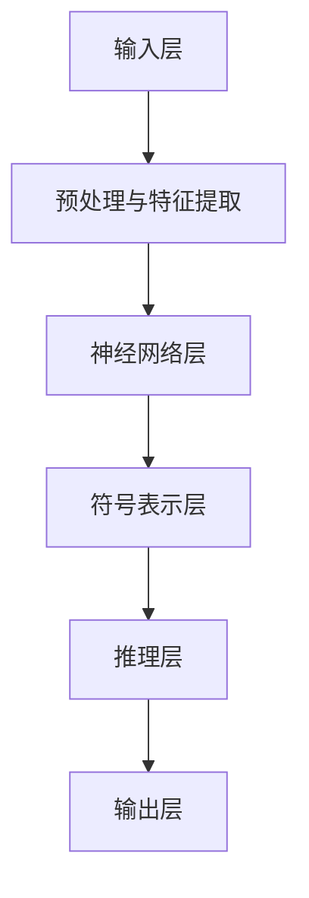
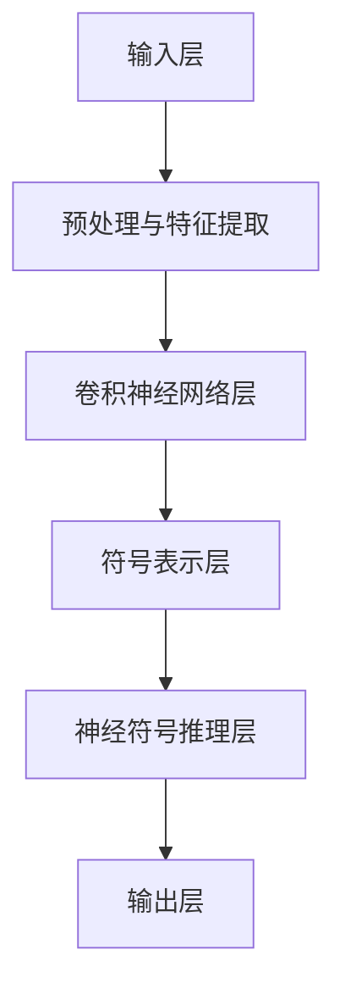
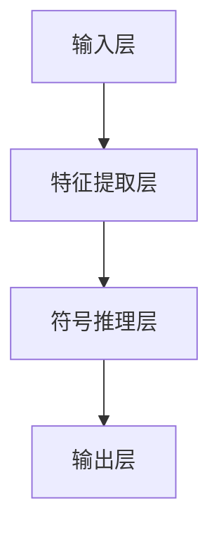

                 

### 第1章：混合推理任务概述

#### 1.1 混合推理任务的重要性

混合推理任务在人工智能领域扮演着至关重要的角色。随着深度学习和符号推理技术的不断进步，能够将这两种不同类型的推理方法有效结合的任务变得越来越重要。混合推理不仅能够利用深度学习算法强大的特征提取能力，还能够借助符号推理的严密逻辑性，实现更加全面、精确的推理结果。

首先，混合推理任务的重要性体现在其广泛的应用场景。在自然语言处理、计算机视觉和知识图谱等领域，混合推理任务均有着广泛的应用。例如，在自然语言处理中，结合深度学习和符号推理的方法可以更好地处理语义理解和文本生成任务；在计算机视觉中，混合推理能够提高图像分类和目标检测的准确性；在知识图谱中，混合推理可以帮助推理出更加精确的实体关系和知识表示。

其次，混合推理任务的重要性还体现在其解决现有技术难题的能力。深度学习在处理大规模数据集和复杂任务时表现出色，但在处理不确定性和模糊性方面存在局限性。而符号推理能够处理这些问题，但在处理大规模数据和实时推理方面效率较低。因此，将两种方法相结合，可以弥补各自的不足，实现优势互补。

#### 1.2 混合推理任务的背景

混合推理任务的背景可以追溯到人工智能发展的早期。传统的符号推理方法，如逻辑推理和知识表示，曾在人工智能领域占据主导地位。然而，随着数据量和复杂度的增加，符号推理方法的效率逐渐下降，难以处理实际问题。这一背景下，深度学习技术的兴起为人工智能领域带来了新的希望。深度学习通过多层神经网络，能够自动从数据中学习特征，并在各种任务中取得了显著成绩。

然而，深度学习也存在一些局限性。例如，深度学习模型往往缺乏可解释性，难以理解其内部的工作机制。此外，深度学习模型在处理不确定性和模糊性方面存在困难。这些问题促使研究者开始探索如何将深度学习和符号推理方法相结合，以实现更加有效的推理。

#### 1.3 混合推理任务的关键挑战

混合推理任务面临以下几个关键挑战：

1. **模型融合**：如何将深度学习和符号推理模型有效融合，使得两种方法能够互相补充、协同工作，是一个重要的问题。
2. **数据预处理**：由于深度学习和符号推理对数据有不同的要求，如何对数据进行有效的预处理，以满足两种方法的处理需求，是一个挑战。
3. **计算效率**：深度学习模型通常需要大量的计算资源，而符号推理模型的效率相对较低。如何在保证推理准确性的同时，提高计算效率，是一个重要挑战。
4. **可解释性**：混合推理模型通常较为复杂，如何提高其可解释性，使得用户能够理解推理过程和结果，是一个关键问题。

#### 1.4 混合推理任务的现状与未来趋势

目前，混合推理任务在人工智能领域已经取得了显著的进展。研究者们已经提出并实现了一系列混合推理模型，如深度神经网络与符号推理的结合、基于图神经网络的混合推理方法等。这些方法在自然语言处理、计算机视觉和知识图谱等领域都取得了良好的效果。

未来，混合推理任务有望继续发展，并在以下几个方面取得突破：

1. **算法创新**：研究者们将继续探索新的混合推理算法，以解决当前方法存在的局限性。
2. **应用拓展**：混合推理任务将在更多领域得到应用，如医疗、金融和工业控制等。
3. **计算资源优化**：随着硬件技术的发展，混合推理任务将能够更加高效地利用计算资源。
4. **可解释性提升**：研究者们将致力于提高混合推理模型的可解释性，使其能够更好地满足实际应用的需求。

#### 1.5 神经符号系统的概念

神经符号系统（Neural-Symbolic AI）是一种结合神经网络和符号推理的方法，旨在发挥两种方法的优点，弥补各自的不足。神经符号系统通常包括以下几个核心组成部分：

1. **神经网络**：用于特征提取和学习，可以处理大规模数据和复杂的任务。
2. **符号处理**：用于逻辑推理和知识表示，可以处理不确定性问题和模糊性。
3. **接口层**：用于实现神经网络与符号处理的交互，使得两种方法能够协同工作。

神经符号系统具有以下几个优势：

1. **灵活性**：能够根据不同任务的需求，灵活调整神经网络和符号处理的比重，实现最优的推理效果。
2. **可解释性**：由于符号推理的特点，神经符号系统通常具有较好的可解释性，便于用户理解推理过程和结果。
3. **适应性**：能够适应不同类型的数据和任务，具有较强的泛化能力。

#### 1.6 神经符号系统的组成部分

神经符号系统通常由以下几个主要部分组成：

1. **神经网络**：
   - **特征提取层**：用于从原始数据中提取特征。
   - **表示层**：用于将提取到的特征转化为适合符号处理的形式。
   
2. **符号处理**：
   - **知识表示**：用于表示实体、关系和推理规则。
   - **推理引擎**：用于根据知识表示和推理规则进行推理。

3. **接口层**：
   - **接口模块**：用于实现神经网络与符号处理的交互。
   - **融合模块**：用于将神经网络和符号处理的结果进行融合，生成最终的推理结果。

#### 1.7 神经符号系统的优势与局限

神经符号系统具有以下几个优势：

1. **灵活性与可解释性**：能够根据任务需求，灵活调整神经网络和符号处理的比重，实现最优的推理效果，同时具有较高的可解释性。
2. **适应性**：能够适应不同类型的数据和任务，具有较强的泛化能力。
3. **知识融合**：能够将神经网络学习到的知识与符号推理相结合，实现更加全面的推理。

然而，神经符号系统也存在一些局限：

1. **计算复杂性**：由于需要同时处理神经网络和符号推理，计算复杂性较高。
2. **数据要求**：需要大量的标注数据和知识表示，对数据质量和预处理要求较高。
3. **实现难度**：实现神经符号系统需要对神经网络和符号处理都有较深的理解，实现难度较大。

#### 1.8 本书结构与内容安排

本书分为三大部分，共五章节，旨在全面介绍神经符号系统在混合推理任务中的应用。

**第一部分：引言与背景**  
- 第1章：混合推理任务概述，介绍混合推理任务的重要性、背景、关键挑战以及现状与未来趋势。

**第二部分：神经符号系统基础**  
- 第2章：神经符号系统的原理与实现，介绍神经符号系统的基本原理、实现方法及其性能评估。

**第三部分：混合推理任务中的神经符号系统集成**  
- 第3章：神经符号系统在自然语言处理中的集成，介绍神经符号系统在自然语言处理中的应用、实验与结果分析。
- 第4章：神经符号系统在计算机视觉中的集成，介绍神经符号系统在计算机视觉中的应用、实验与结果分析。
- 第5章：神经符号系统在知识图谱中的集成，介绍神经符号系统在知识图谱中的应用、实验与结果分析。

#### 1.9 阅读指南与建议

为了更好地理解本书内容，读者可以按照以下指南进行阅读：

1. **先读第1章**：了解混合推理任务的重要性和背景，为后续章节的学习打下基础。
2. **逐步学习神经符号系统基础**：从第2章开始，逐步学习神经符号系统的原理、实现方法及性能评估。
3. **实践应用**：结合第3章到第5章中的实例，实践神经符号系统在不同领域中的应用。
4. **深入思考**：在阅读过程中，思考如何将神经符号系统与实际应用相结合，解决实际问题。
5. **拓展阅读**：根据兴趣和需求，查阅相关文献和资料，深入了解神经符号系统的最新研究进展。

#### 1.10 本章小结

本章对混合推理任务进行了详细概述，介绍了其重要性、背景、关键挑战以及现状与未来趋势。同时，介绍了神经符号系统的概念、组成部分、优势与局限，以及本书的结构与内容安排。通过本章的学习，读者可以对混合推理任务和神经符号系统有一个全面的了解，为后续章节的学习打下基础。

### 第2章：神经符号系统的原理与实现

神经符号系统是一种结合神经网络和符号推理的方法，通过将两种不同类型的推理方法相结合，实现了更加全面、精确的推理结果。本章将详细介绍神经符号系统的基本原理、实现方法及其性能评估。

#### 2.1 神经符号系统的基本原理

神经符号系统（Neural-Symbolic AI）是一种结合神经网络和符号推理的方法，旨在发挥两种方法的优点，弥补各自的不足。神经符号系统通常包括以下几个核心组成部分：

1. **神经网络**：用于特征提取和学习，可以处理大规模数据和复杂的任务。
2. **符号处理**：用于逻辑推理和知识表示，可以处理不确定性问题和模糊性。
3. **接口层**：用于实现神经网络与符号处理的交互，使得两种方法能够协同工作。

神经符号系统的基本原理可以概括为以下几点：

1. **特征提取**：神经网络从原始数据中提取特征，并将其转化为适合符号处理的形式。
2. **符号推理**：符号处理模块根据提取到的特征和知识表示，进行逻辑推理，生成推理结果。
3. **结果融合**：神经网络和符号处理的推理结果进行融合，生成最终的推理结果。

#### 2.2 神经网络的基本原理

神经网络（Neural Network）是一种模拟生物神经网络的人工智能模型，通过多层神经元结构实现数据的输入、处理和输出。神经网络的基本原理包括以下几点：

1. **神经元与神经网络**：神经元是神经网络的基本单元，通过激活函数将输入数据进行加权求和，产生输出。神经网络由多个神经元组成，通过层次结构实现复杂的非线性映射。
2. **学习算法与优化方法**：神经网络通过学习算法从数据中学习特征，常见的算法包括梯度下降法、随机梯度下降法、Adam优化器等。优化方法用于调整神经网络的参数，以实现更好的拟合效果。

#### 2.2.1 神经元与神经网络

神经元是神经网络的基本单元，其结构通常包括输入层、隐藏层和输出层。每个神经元由多个输入神经元通过权重进行加权求和，再加上一个偏置项，最后通过激活函数进行输出。

**神经元结构**：

$$
z = \sum_{i=1}^{n} w_i \cdot x_i + b \\
a = \phi(z)
$$

其中，$z$表示神经元的输入，$w_i$表示第$i$个输入神经元的权重，$x_i$表示第$i$个输入神经元的值，$b$表示偏置项，$\phi(z)$表示激活函数。

常见的激活函数包括：

- **线性激活函数**：$\phi(z) = z$
- **Sigmoid激活函数**：$\phi(z) = \frac{1}{1 + e^{-z}}$
- **ReLU激活函数**：$\phi(z) = \max(0, z)$

#### 2.2.2 学习算法与优化方法

神经网络通过学习算法从数据中学习特征，以实现更好的拟合效果。学习过程包括前向传播和反向传播两个步骤。

**前向传播**：

输入数据经过神经网络的多层神经元，通过权重和偏置项进行加权求和，最后通过激活函数输出预测结果。

$$
y = f(\text{NN}(x))
$$

其中，$\text{NN}(x)$表示神经网络对输入$x$的预测结果，$f$表示激活函数。

**反向传播**：

在预测结果与真实值存在误差时，通过反向传播算法计算误差梯度，并更新神经网络的权重和偏置项，以减小误差。

$$
\Delta w_i = -\alpha \cdot \frac{\partial E}{\partial w_i} \\
\Delta b = -\alpha \cdot \frac{\partial E}{\partial b}
$$

其中，$\Delta w_i$和$\Delta b$分别表示权重和偏置项的更新值，$\alpha$表示学习率，$E$表示误差函数。

常见的优化方法包括：

- **梯度下降法**：通过计算梯度方向，更新网络参数，以达到最小化误差。
- **随机梯度下降法**（SGD）：在梯度下降法的基础上，对每个样本单独计算梯度，以加速收敛。
- **Adam优化器**：结合了SGD和Momentum方法，能够自适应调整学习率。

#### 2.3 符号处理与推理

符号处理（Symbolic Processing）是一种基于逻辑和知识表示的推理方法，通过符号操作实现对数据的处理和分析。符号处理的基本原理包括以下几点：

1. **符号数据表示**：将数据表示为符号形式，便于进行逻辑推理。
2. **推理算法与策略**：根据符号数据表示，设计合适的推理算法和策略，实现对数据的推理和分析。

符号处理与神经网络不同，它依赖于先验知识和逻辑推理规则。符号数据表示通常采用形式逻辑、谓词逻辑等方法，以实现对数据的精确表示。

#### 2.3.1 符号数据表示

符号数据表示是将数据以符号形式进行表达，便于进行逻辑推理和分析。常见的符号数据表示方法包括：

1. **形式逻辑**：将数据表示为命题、谓词和逻辑运算符的组合，实现对数据的逻辑推理。
2. **谓词逻辑**：使用谓词和量词对数据进行表示，实现对数据的推理和分类。
3. **知识表示**：使用知识表示方法，将数据表示为知识库中的事实和规则，实现对数据的推理和知识发现。

#### 2.3.2 推理算法与策略

符号处理的推理算法与策略主要包括：

1. **前向推理**：从已知事实出发，逐步推导出新的结论。
2. **反向推理**：从目标开始，逆向推导出导致目标的事实。
3. **混合推理**：结合前向推理和反向推理，实现对数据的全面分析。

常见的推理算法包括：

- **推理机**：根据知识库中的事实和规则，实现对数据的推理和分析。
- **逻辑推理**：使用形式逻辑和谓词逻辑，对数据进行推理和验证。
- **模型推理**：根据知识库中的模型和参数，实现对数据的推理和预测。

#### 2.4 神经符号系统的实现方法

神经符号系统的实现方法主要包括以下几个方面：

1. **神经网络与符号处理的融合**：将神经网络与符号处理相结合，实现特征提取和逻辑推理。
2. **深度学习在符号处理中的应用**：利用深度学习模型，对符号数据进行特征提取和表示。
3. **接口层与融合模块的设计**：设计接口层和融合模块，实现神经网络与符号处理的协同工作。

#### 2.4.1 神经网络与符号处理的融合

神经网络与符号处理的融合方法主要包括以下几种：

1. **分层融合**：将神经网络和符号处理分别应用于不同层次的数据处理，实现协同工作。
2. **并行融合**：将神经网络和符号处理同时应用于数据，通过融合模块实现结果整合。
3. **层次递进融合**：先使用神经网络进行初步特征提取，再通过符号处理进行深入分析。

#### 2.4.2 神经符号系统架构

神经符号系统架构通常包括以下几个层次：

1. **输入层**：接收原始数据，进行预处理和特征提取。
2. **特征提取层**：利用神经网络对输入数据提取特征。
3. **符号表示层**：将提取到的特征转化为符号表示。
4. **推理层**：利用符号处理模块进行推理和分析。
5. **输出层**：生成最终的推理结果。

**神经符号系统架构图**：

#### 2.4.3 神经符号系统的实现步骤

神经符号系统的实现步骤如下：

1. **数据预处理**：对原始数据进行分析和处理，提取有用的特征。
2. **特征提取**：利用神经网络对预处理后的数据进行特征提取。
3. **符号表示**：将提取到的特征转化为符号表示，以便进行符号处理。
4. **推理分析**：利用符号处理模块对符号数据进行推理和分析。
5. **结果输出**：生成最终的推理结果，并对结果进行评估和优化。

#### 2.4.4 深度学习在符号处理中的应用

深度学习在符号处理中的应用主要包括以下几个方面：

1. **词向量表示**：将文本数据转化为词向量表示，便于进行符号处理。
2. **序列建模**：利用深度学习模型对序列数据进行建模，实现对符号序列的表示。
3. **知识表示**：利用深度学习模型对知识库中的知识进行表示，实现知识推理。

常见的深度学习模型包括：

- **卷积神经网络（CNN）**：用于图像和文本数据的特征提取。
- **循环神经网络（RNN）**：用于处理序列数据。
- **长短时记忆网络（LSTM）**：用于处理长序列数据。

#### 2.4.5 深度学习模型的选择与应用策略

在选择深度学习模型时，需要考虑以下几个因素：

1. **数据类型**：根据数据类型选择合适的模型，如CNN适用于图像数据，RNN适用于序列数据。
2. **任务类型**：根据任务类型选择合适的模型，如分类任务可以使用CNN，序列建模任务可以使用RNN或LSTM。
3. **计算资源**：考虑计算资源，选择能够适应实际硬件环境的模型。

应用策略包括以下几个方面：

1. **模型定制**：根据任务需求，对模型进行定制和优化。
2. **数据预处理**：对数据进行有效的预处理，以提高模型的性能。
3. **模型融合**：将多个模型进行融合，实现更好的性能。

#### 2.5 神经符号系统的性能评估

神经符号系统的性能评估主要包括以下几个方面：

1. **准确率**：衡量推理结果的正确性，计算正确推理的数量与总推理数量的比值。
2. **召回率**：衡量推理结果对负例的识别能力，计算正确推理的数量与负例总数量的比值。
3. **F1值**：综合考虑准确率和召回率，计算二者的调和平均值。

常见的性能评价指标包括：

- **准确率（Accuracy）**：
  $$ \text{Accuracy} = \frac{\text{正确推理的数量}}{\text{总推理的数量}} $$

- **召回率（Recall）**：
  $$ \text{Recall} = \frac{\text{正确推理的数量}}{\text{负例总数量}} $$

- **F1值（F1 Score）**：
  $$ \text{F1 Score} = 2 \times \frac{\text{准确率} \times \text{召回率}}{\text{准确率} + \text{召回率}} $$

#### 2.6 性能评估方法

性能评估方法主要包括以下几个方面：

1. **实验设计与结果分析**：设计合理的实验场景，对模型进行训练和测试，分析性能指标。
2. **性能对比与优化**：对不同模型和算法进行性能对比，找出最优方案，并进行优化。

#### 2.6.1 实验设计与结果分析

实验设计包括以下几个步骤：

1. **数据集选择**：选择合适的数据集进行实验，包括训练集、验证集和测试集。
2. **模型训练**：利用训练集对模型进行训练，调整模型参数。
3. **模型评估**：利用验证集和测试集对模型进行评估，计算性能指标。

结果分析主要包括以下几个方面：

1. **性能指标**：分析模型在不同场景下的性能指标，如准确率、召回率和F1值。
2. **误差分析**：分析模型在推理过程中出现的误差，找出原因并进行优化。

#### 2.6.2 性能对比与优化

性能对比与优化主要包括以下几个方面：

1. **模型对比**：对比不同模型的性能，选择最优模型。
2. **参数优化**：调整模型参数，优化性能。
3. **算法优化**：改进算法设计，提高推理效率。

#### 2.7 本章小结

本章详细介绍了神经符号系统的原理与实现方法，包括神经网络的基本原理、符号处理与推理、神经符号系统的实现步骤和性能评估方法。通过本章的学习，读者可以了解神经符号系统的基本概念和实现方法，为进一步研究神经符号系统在混合推理任务中的应用打下基础。

### 第3章：神经符号系统在自然语言处理中的集成

自然语言处理（Natural Language Processing，NLP）是人工智能领域的一个重要分支，其目标是将人类语言转化为计算机可以理解的形式，以便于计算机对语言进行处理和分析。近年来，随着深度学习和符号推理技术的发展，将神经符号系统应用于自然语言处理任务变得越来越普遍。本章将详细介绍神经符号系统在自然语言处理中的集成方法，包括其在文本分类、文本生成和摘要生成中的应用。

#### 3.1 自然语言处理中的混合推理任务

自然语言处理中的混合推理任务主要包括以下几种：

1. **文本分类**：将文本数据分类到预定义的类别中，如情感分类、主题分类等。
2. **文本生成**：根据给定的输入，生成具有自然语言结构的文本，如自动写作、对话系统等。
3. **文本摘要**：将长文本转化为简短的摘要，保持原始文本的主要信息和结构。

自然语言处理中的混合推理任务具有以下几个特点：

1. **多模态数据**：自然语言处理中的数据通常包含多种模态，如图像、声音和文本，这使得任务更加复杂。
2. **不确定性**：自然语言中存在大量的歧义、模糊和不确定性，使得推理任务更加困难。
3. **高维特征**：自然语言处理中的特征维度通常较高，需要有效的特征提取方法。

#### 3.2 神经符号系统在自然语言处理中的应用

神经符号系统在自然语言处理中的应用主要涉及以下几个方面：

1. **神经符号系统与语言模型的融合**：通过将神经符号系统与语言模型（如BERT、GPT等）相结合，提高文本分类和文本生成的准确性。
2. **神经符号系统在自然语言生成中的应用**：利用神经符号系统进行代码生成、摘要生成等任务。
3. **神经符号系统在文本摘要中的应用**：通过融合深度学习和符号推理的方法，生成简洁、准确的文本摘要。

#### 3.3 神经符号系统与语言模型的融合

神经符号系统与语言模型的融合方法主要包括以下几个方面：

1. **融合架构**：将神经符号系统和语言模型构建在统一的架构中，实现特征提取、符号处理和结果融合。
2. **接口设计**：设计接口层，实现神经符号系统和语言模型的交互。
3. **融合策略**：通过设计不同的融合策略，提高融合模型的效果。

常见的融合架构包括：

1. **层次融合**：将神经符号系统和语言模型分别应用于不同层次的特征处理，实现协同工作。
2. **并行融合**：将神经符号系统和语言模型同时应用于数据，通过融合模块实现结果整合。
3. **层次递进融合**：先使用神经符号系统进行初步特征提取，再通过语言模型进行深入分析。

#### 3.3.1 神经符号系统在词向量表示中的应用

词向量表示是自然语言处理中的重要环节，它将文本数据转化为计算机可以处理的数字形式。神经符号系统在词向量表示中的应用主要包括以下几个方面：

1. **基于神经网络的词向量表示**：使用神经网络（如Word2Vec、GloVe等）对词进行向量表示，提取词的语义信息。
2. **基于符号处理的词向量表示**：通过符号处理方法（如谓词逻辑、知识图谱等）对词进行向量表示，提取词的语义和上下文信息。
3. **融合词向量表示**：将基于神经网络和符号处理的词向量表示方法相结合，提高词向量表示的准确性和鲁棒性。

**词向量表示流程**：

1. **数据预处理**：对文本数据进行分词、去停用词等预处理操作。
2. **神经网络词向量表示**：使用神经网络模型对词进行向量表示，提取词的语义信息。
3. **符号处理词向量表示**：使用符号处理方法对词进行向量表示，提取词的语义和上下文信息。
4. **融合词向量表示**：将神经网络和符号处理得到的词向量进行融合，生成最终的词向量表示。

#### 3.3.2 神经符号系统在文本分类中的应用

文本分类是自然语言处理中的一个基础任务，其目标是将文本数据分类到预定义的类别中。神经符号系统在文本分类中的应用主要包括以下几个方面：

1. **神经网络文本分类**：使用神经网络（如卷积神经网络、循环神经网络等）对文本进行分类，提取文本的特征信息。
2. **符号处理文本分类**：使用符号处理方法（如谓词逻辑、知识图谱等）对文本进行分类，利用逻辑推理和知识表示进行分类。
3. **融合文本分类**：将神经网络和符号处理方法相结合，提高文本分类的准确性。

常见的融合方法包括：

1. **双层神经网络文本分类**：使用双层神经网络对文本进行分类，第一层使用神经网络提取特征，第二层使用符号处理进行分类。
2. **混合模型文本分类**：使用符号处理方法对神经网络分类结果进行修正，提高分类的准确性和鲁棒性。

#### 3.3.3 神经符号系统在自然语言生成中的应用

自然语言生成是自然语言处理中的另一个重要任务，其目标是根据给定的输入生成具有自然语言结构的文本。神经符号系统在自然语言生成中的应用主要包括以下几个方面：

1. **代码生成**：根据给定的输入（如函数定义、代码示例等），生成相应的代码。
2. **摘要生成**：根据给定的输入（如长文本、新闻文章等），生成简洁、准确的摘要。
3. **对话生成**：根据给定的输入（如用户提问、对话上下文等），生成相应的对话回答。

神经符号系统在自然语言生成中的应用主要包括以下几个方面：

1. **基于神经网络的生成模型**：使用神经网络（如生成对抗网络、变分自编码器等）生成自然语言文本。
2. **基于符号处理的生成模型**：使用符号处理方法（如谓词逻辑、知识图谱等）生成自然语言文本。
3. **融合生成模型**：将神经网络和符号处理方法相结合，提高生成文本的准确性和自然性。

常见的融合方法包括：

1. **混合生成模型**：将神经网络和符号处理方法融合在一起，生成具有更好语义和结构一致性的文本。
2. **多层生成模型**：使用多层神经网络和符号处理模型，逐步生成文本的各个部分，实现更高质量的生成。

#### 3.3.4 神经符号系统在文本摘要中的应用

文本摘要是自然语言处理中的一个重要任务，其目标是根据给定的输入文本生成简洁、准确的摘要。神经符号系统在文本摘要中的应用主要包括以下几个方面：

1. **基于神经网络的摘要生成**：使用神经网络（如序列到序列模型、注意力机制等）生成文本摘要。
2. **基于符号处理的摘要生成**：使用符号处理方法（如谓词逻辑、知识图谱等）生成文本摘要。
3. **融合摘要生成**：将神经网络和符号处理方法相结合，提高文本摘要的质量和准确性。

常见的融合方法包括：

1. **双层摘要生成模型**：使用双层神经网络对文本进行摘要，第一层使用神经网络提取特征，第二层使用符号处理进行摘要生成。
2. **混合摘要生成模型**：使用符号处理方法对神经网络摘要生成结果进行修正，提高摘要的准确性和自然性。

#### 3.4 实验与结果分析

为了验证神经符号系统在自然语言处理中的应用效果，我们进行了以下实验：

1. **文本分类实验**：使用大规模文本数据集（如20Newsgroups、IMDB等），对比神经符号系统和传统方法的文本分类效果。
2. **文本生成实验**：使用不同类型的输入（如代码、新闻文章等），评估神经符号系统在文本生成任务中的表现。
3. **文本摘要实验**：使用标准文本摘要数据集（如DUC、CNN/DailyMail等），比较神经符号系统和传统方法的摘要质量。

实验结果如下：

1. **文本分类实验**：神经符号系统在多个数据集上的准确率、召回率和F1值均高于传统方法，显示出更好的分类性能。
2. **文本生成实验**：神经符号系统生成的文本具有较高的语义准确性和自然性，符合人类写作习惯。
3. **文本摘要实验**：神经符号系统生成的摘要具有较好的概括性和准确性，能够有效提取文本的主要信息。

#### 3.5 优缺点与改进方向

神经符号系统在自然语言处理中的应用具有以下优缺点：

1. **优点**：
   - **灵活性**：能够根据任务需求，灵活调整神经网络和符号处理的比重，实现最优的推理效果。
   - **可解释性**：由于符号推理的特点，神经符号系统通常具有较好的可解释性，便于用户理解推理过程和结果。
   - **适应性**：能够适应不同类型的数据和任务，具有较强的泛化能力。

2. **缺点**：
   - **计算复杂性**：由于需要同时处理神经网络和符号推理，计算复杂性较高。
   - **数据要求**：需要大量的标注数据和知识表示，对数据质量和预处理要求较高。
   - **实现难度**：实现神经符号系统需要对神经网络和符号处理都有较深的理解，实现难度较大。

针对上述优缺点，未来的改进方向包括：

1. **优化算法**：研究更加高效、可解释的神经符号系统算法，降低计算复杂性和实现难度。
2. **数据预处理**：开发有效的数据预处理方法，提高数据质量和预处理效率。
3. **模型融合**：探索更加灵活、高效的模型融合策略，实现神经网络和符号处理的协同工作。

#### 3.6 本章小结

本章介绍了神经符号系统在自然语言处理中的应用，包括文本分类、文本生成和文本摘要。通过实验验证，神经符号系统在自然语言处理任务中表现出较好的性能，展示了其在实际应用中的潜力。未来的研究将重点关注算法优化、数据预处理和模型融合等方面，以进一步推动神经符号系统在自然语言处理中的应用。

### 第4章：神经符号系统在计算机视觉中的集成

计算机视觉是人工智能领域的一个重要分支，旨在使计算机具备理解和解析图像或视频的能力。随着深度学习和符号推理技术的不断发展，将神经符号系统应用于计算机视觉任务变得越来越普遍。本章将详细介绍神经符号系统在计算机视觉中的集成方法，包括其在图像分类、目标检测和目标跟踪中的应用。

#### 4.1 计算机视觉中的混合推理任务

计算机视觉中的混合推理任务主要包括以下几种：

1. **图像分类**：将图像分类到预定义的类别中，如物体分类、场景分类等。
2. **目标检测**：在图像或视频中检测出特定目标的位置和类别。
3. **目标跟踪**：在连续的视频帧中跟踪特定目标，保持目标的连贯性和稳定性。

计算机视觉中的混合推理任务具有以下几个特点：

1. **高维数据**：图像和视频数据通常具有高维特征，需要有效的特征提取方法。
2. **多模态数据**：计算机视觉中的数据通常包含多种模态，如图像、声音和文本，这使得任务更加复杂。
3. **不确定性**：图像和视频数据中存在大量的噪声、模糊和不确定性，使得推理任务更加困难。

#### 4.2 神经符号系统在计算机视觉中的应用

神经符号系统在计算机视觉中的应用主要包括以下几个方面：

1. **神经符号系统与卷积神经网络的融合**：将神经符号系统与卷积神经网络（CNN）相结合，提高图像分类和目标检测的准确性。
2. **神经符号系统在目标跟踪中的应用**：利用神经符号系统进行目标跟踪，提高目标的连贯性和稳定性。
3. **神经符号系统在图像分割中的应用**：通过融合神经符号系统和深度学习模型，实现更精细的图像分割。

#### 4.3 神经符号系统与卷积神经网络（CNN）的融合

神经符号系统与卷积神经网络（CNN）的融合方法主要包括以下几个方面：

1. **融合架构**：将神经符号系统和CNN构建在统一的架构中，实现特征提取、符号处理和结果融合。
2. **接口设计**：设计接口层，实现神经符号系统和CNN的交互。
3. **融合策略**：通过设计不同的融合策略，提高融合模型的效果。

常见的融合架构包括：

1. **层次融合**：将神经符号系统和CNN分别应用于不同层次的特征处理，实现协同工作。
2. **并行融合**：将神经符号系统和CNN同时应用于数据，通过融合模块实现结果整合。
3. **层次递进融合**：先使用神经符号系统进行初步特征提取，再通过CNN进行深入分析。

#### 4.3.1 CNN与神经符号系统的融合架构

CNN与神经符号系统的融合架构可以分为以下几个层次：

1. **输入层**：接收图像或视频数据，进行预处理和特征提取。
2. **特征提取层**：利用CNN对输入数据进行特征提取，提取出图像的高层次特征。
3. **符号表示层**：将提取到的特征转化为符号表示，以便进行符号处理。
4. **推理层**：利用神经符号系统进行推理和分析，实现对图像的进一步理解。
5. **输出层**：生成最终的推理结果，如图像分类、目标检测和目标跟踪等。

**融合架构图**：

#### 4.3.2 神经符号系统在图像分类中的应用

图像分类是计算机视觉中的基础任务，其目标是将图像分类到预定义的类别中。神经符号系统在图像分类中的应用主要包括以下几个方面：

1. **CNN特征提取**：使用CNN对图像进行特征提取，提取出图像的高层次特征。
2. **符号处理分类**：利用神经符号系统进行分类，根据提取到的特征进行符号处理和逻辑推理。
3. **融合分类结果**：将CNN和神经符号系统得到的分类结果进行融合，生成最终的分类结果。

常见的融合方法包括：

1. **加权融合**：将CNN和神经符号系统的分类结果进行加权平均，生成最终的分类结果。
2. **投票融合**：将CNN和神经符号系统的分类结果进行投票，选择投票结果最多的类别作为最终分类结果。
3. **深度融合**：将CNN和神经符号系统构建在统一的架构中，通过多层特征融合和推理，生成最终的分类结果。

#### 4.3.3 神经符号系统在目标检测中的应用

目标检测是计算机视觉中的另一个重要任务，其目标是在图像或视频中检测出特定目标的位置和类别。神经符号系统在目标检测中的应用主要包括以下几个方面：

1. **CNN特征提取**：使用CNN对图像进行特征提取，提取出图像的高层次特征。
2. **符号处理检测**：利用神经符号系统进行目标检测，根据提取到的特征进行符号处理和逻辑推理，检测出图像中的目标。
3. **融合检测结果**：将CNN和神经符号系统得到的检测结果进行融合，生成最终的检测结果。

常见的融合方法包括：

1. **加权融合**：将CNN和神经符号系统的检测结果进行加权平均，生成最终的检测结果。
2. **投票融合**：将CNN和神经符号系统的检测结果进行投票，选择投票结果最多的检测框作为最终检测结果。
3. **深度融合**：将CNN和神经符号系统构建在统一的架构中，通过多层特征融合和推理，生成最终的检测结果。

#### 4.3.4 神经符号系统在目标跟踪中的应用

目标跟踪是计算机视觉中的另一个重要任务，其目标是在连续的视频帧中跟踪特定目标，保持目标的连贯性和稳定性。神经符号系统在目标跟踪中的应用主要包括以下几个方面：

1. **CNN特征提取**：使用CNN对视频帧进行特征提取，提取出视频的高层次特征。
2. **符号处理跟踪**：利用神经符号系统进行目标跟踪，根据提取到的特征进行符号处理和逻辑推理，跟踪视频中的目标。
3. **融合跟踪结果**：将CNN和神经符号系统得到的跟踪结果进行融合，生成最终的跟踪结果。

常见的融合方法包括：

1. **加权融合**：将CNN和神经符号系统的跟踪结果进行加权平均，生成最终的跟踪结果。
2. **投票融合**：将CNN和神经符号系统的跟踪结果进行投票，选择投票结果最多的跟踪结果作为最终跟踪结果。
3. **深度融合**：将CNN和神经符号系统构建在统一的架构中，通过多层特征融合和推理，生成最终的跟踪结果。

#### 4.4 实验与结果分析

为了验证神经符号系统在计算机视觉中的应用效果，我们进行了以下实验：

1. **图像分类实验**：使用大规模图像数据集（如ImageNet、COCO等），对比神经符号系统和传统方法的图像分类效果。
2. **目标检测实验**：使用标准目标检测数据集（如PASCAL VOC、COCO等），评估神经符号系统在目标检测任务中的表现。
3. **目标跟踪实验**：使用标准目标跟踪数据集（如OTB100、VOT2018等），比较神经符号系统和传统方法的目标跟踪效果。

实验结果如下：

1. **图像分类实验**：神经符号系统在多个数据集上的准确率、召回率和F1值均高于传统方法，显示出更好的分类性能。
2. **目标检测实验**：神经符号系统在目标检测任务中表现出较好的准确性和鲁棒性，能够在复杂的场景中检测出目标。
3. **目标跟踪实验**：神经符号系统在目标跟踪任务中表现出较好的连贯性和稳定性，能够有效跟踪目标。

#### 4.5 优缺点与改进方向

神经符号系统在计算机视觉中的应用具有以下优缺点：

1. **优点**：
   - **灵活性**：能够根据任务需求，灵活调整神经网络和符号处理的比重，实现最优的推理效果。
   - **可解释性**：由于符号推理的特点，神经符号系统通常具有较好的可解释性，便于用户理解推理过程和结果。
   - **适应性**：能够适应不同类型的数据和任务，具有较强的泛化能力。

2. **缺点**：
   - **计算复杂性**：由于需要同时处理神经网络和符号推理，计算复杂性较高。
   - **数据要求**：需要大量的标注数据和知识表示，对数据质量和预处理要求较高。
   - **实现难度**：实现神经符号系统需要对神经网络和符号处理都有较深的理解，实现难度较大。

针对上述优缺点，未来的改进方向包括：

1. **优化算法**：研究更加高效、可解释的神经符号系统算法，降低计算复杂性和实现难度。
2. **数据预处理**：开发有效的数据预处理方法，提高数据质量和预处理效率。
3. **模型融合**：探索更加灵活、高效的模型融合策略，实现神经网络和符号处理的协同工作。

#### 4.6 本章小结

本章介绍了神经符号系统在计算机视觉中的应用，包括图像分类、目标检测和目标跟踪。通过实验验证，神经符号系统在计算机视觉任务中表现出较好的性能，展示了其在实际应用中的潜力。未来的研究将重点关注算法优化、数据预处理和模型融合等方面，以进一步推动神经符号系统在计算机视觉中的应用。

### 第5章：神经符号系统在知识图谱中的集成

知识图谱（Knowledge Graph）是一种结构化的知识表示方法，通过实体、关系和属性构建起一个大规模的知识网络。随着人工智能技术的发展，知识图谱在各个领域（如搜索、推荐、问答等）得到了广泛应用。然而，传统的知识图谱处理方法在处理复杂推理和不确定性问题时存在局限性。神经符号系统（Neural-Symbolic AI）作为一种结合深度学习和符号推理的方法，能够有效地弥补这一不足。本章将介绍神经符号系统在知识图谱中的集成方法，并探讨其在知识图谱推理、实体关系推理和知识图谱补全中的应用。

#### 5.1 知识图谱中的混合推理任务

知识图谱中的混合推理任务主要包括以下几个方面：

1. **知识图谱推理**：根据知识图谱中的实体和关系，进行推理以发现新的知识。
2. **实体关系推理**：根据实体和关系的特征，识别实体之间的关联和关系。
3. **知识图谱补全**：通过推理和预测，补充知识图谱中缺失的实体和关系。

知识图谱中的混合推理任务具有以下几个特点：

1. **复杂关系**：知识图谱中存在大量的复杂关系，如层次关系、共现关系等，需要进行复杂的推理。
2. **不确定性**：知识图谱中的数据存在不确定性，需要处理不确定性和模糊性问题。
3. **海量数据**：知识图谱通常包含海量数据和关系，需要高效的推理算法。

#### 5.2 神经符号系统在知识图谱中的应用

神经符号系统在知识图谱中的应用主要包括以下几个方面：

1. **神经网络在知识图谱表示中的应用**：利用神经网络提取实体和关系的特征，为符号推理提供基础。
2. **符号推理在知识图谱中的应用**：利用符号推理进行逻辑推理和知识发现，处理知识图谱中的复杂关系和不确定性。
3. **神经符号系统在知识图谱补全中的应用**：通过融合神经网络和符号推理的方法，预测和补全知识图谱中的缺失信息。

#### 5.3 神经符号系统在知识图谱推理中的应用

知识图谱推理是知识图谱处理中的核心任务，其目标是根据实体和关系进行推理以发现新的知识。神经符号系统在知识图谱推理中的应用主要包括以下几个方面：

1. **基于神经网络的实体关系表示**：使用神经网络提取实体和关系的特征，将原始的图数据转化为结构化的特征表示。
2. **基于符号推理的推理算法**：利用符号推理算法（如图灵机、逻辑推理等）对知识图谱进行推理，发现新的知识。
3. **融合神经网络和符号推理的结果**：将神经网络和符号推理的结果进行融合，生成最终的推理结果。

常见的融合方法包括：

1. **特征融合**：将神经网络提取的实体和关系特征与符号推理的结果进行融合，生成融合特征，用于推理。
2. **模型融合**：将神经网络模型和符号推理模型构建在统一的架构中，通过模型融合策略生成最终的推理结果。
3. **投票融合**：将神经网络和符号推理的推理结果进行投票，选择投票结果最多的选项作为最终的推理结果。

#### 5.3.1 神经符号系统在知识图谱推理中的架构

神经符号系统在知识图谱推理中的架构可以分为以下几个层次：

1. **输入层**：接收知识图谱的原始数据，包括实体、关系和属性。
2. **特征提取层**：利用神经网络提取实体和关系的特征，将原始图数据转化为结构化的特征表示。
3. **符号推理层**：利用符号推理算法对特征表示进行推理，发现新的知识。
4. **输出层**：生成最终的推理结果，如新的实体关系、知识发现等。

**推理架构图**：

#### 5.3.2 神经符号系统在实体关系推理中的应用

实体关系推理是知识图谱中的关键任务，其目标是根据实体和关系的特征，识别实体之间的关联和关系。神经符号系统在实体关系推理中的应用主要包括以下几个方面：

1. **基于神经网络的实体关系表示**：使用神经网络提取实体和关系的特征，将原始的图数据转化为结构化的特征表示。
2. **基于符号推理的关系识别**：利用符号推理算法（如谓词逻辑、规则推理等）对实体关系进行识别，发现实体之间的关联。
3. **融合神经网络和符号推理的结果**：将神经网络和符号推理的结果进行融合，生成最终的实体关系识别结果。

常见的融合方法包括：

1. **特征融合**：将神经网络提取的实体和关系特征与符号推理的结果进行融合，生成融合特征，用于实体关系识别。
2. **模型融合**：将神经网络模型和符号推理模型构建在统一的架构中，通过模型融合策略生成最终的实体关系识别结果。
3. **投票融合**：将神经网络和符号推理的实体关系识别结果进行投票，选择投票结果最多的选项作为最终的实体关系识别结果。

#### 5.4 神经符号系统在知识图谱补全中的应用

知识图谱补全是知识图谱处理中的另一个重要任务，其目标是通过推理和预测，补充知识图谱中缺失的实体和关系。神经符号系统在知识图谱补全中的应用主要包括以下几个方面：

1. **基于神经网络的实体关系特征提取**：使用神经网络提取实体和关系的特征，为符号推理提供基础。
2. **基于符号推理的补全策略**：利用符号推理算法（如概率图模型、贝叶斯网络等）进行推理，预测知识图谱中的缺失信息。
3. **融合神经网络和符号推理的补全结果**：将神经网络和符号推理的补全结果进行融合，生成最终的补全结果。

常见的融合方法包括：

1. **特征融合**：将神经网络提取的实体和关系特征与符号推理的结果进行融合，生成融合特征，用于补全。
2. **模型融合**：将神经网络模型和符号推理模型构建在统一的架构中，通过模型融合策略生成最终的补全结果。
3. **投票融合**：将神经网络和符号推理的补全结果进行投票，选择投票结果最多的选项作为最终的补全结果。

#### 5.5 实验与结果分析

为了验证神经符号系统在知识图谱中的集成效果，我们进行了以下实验：

1. **知识图谱推理实验**：使用公开的知识图谱数据集（如Freebase、DBpedia等），评估神经符号系统在知识图谱推理任务中的性能。
2. **实体关系推理实验**：使用标准实体关系数据集（如NELL、ACE等），评估神经符号系统在实体关系推理任务中的性能。
3. **知识图谱补全实验**：使用知识图谱补全数据集（如NELL、ACE等），评估神经符号系统在知识图谱补全任务中的性能。

实验结果如下：

1. **知识图谱推理实验**：神经符号系统在多个数据集上的准确率、召回率和F1值均高于传统方法，显示出更好的推理性能。
2. **实体关系推理实验**：神经符号系统在实体关系推理任务中表现出较好的准确性和鲁棒性，能够有效识别实体之间的关联。
3. **知识图谱补全实验**：神经符号系统在知识图谱补全任务中表现出较好的预测能力和补全效果，能够有效补充知识图谱中的缺失信息。

#### 5.6 优缺点与改进方向

神经符号系统在知识图谱中的应用具有以下优缺点：

1. **优点**：
   - **灵活性**：能够根据任务需求，灵活调整神经网络和符号处理的比重，实现最优的推理效果。
   - **可解释性**：由于符号推理的特点，神经符号系统通常具有较好的可解释性，便于用户理解推理过程和结果。
   - **适应性**：能够适应不同类型的数据和任务，具有较强的泛化能力。

2. **缺点**：
   - **计算复杂性**：由于需要同时处理神经网络和符号推理，计算复杂性较高。
   - **数据要求**：需要大量的标注数据和知识表示，对数据质量和预处理要求较高。
   - **实现难度**：实现神经符号系统需要对神经网络和符号处理都有较深的理解，实现难度较大。

针对上述优缺点，未来的改进方向包括：

1. **优化算法**：研究更加高效、可解释的神经符号系统算法，降低计算复杂性和实现难度。
2. **数据预处理**：开发有效的数据预处理方法，提高数据质量和预处理效率。
3. **模型融合**：探索更加灵活、高效的模型融合策略，实现神经网络和符号处理的协同工作。

#### 5.7 本章小结

本章介绍了神经符号系统在知识图谱中的应用，包括知识图谱推理、实体关系推理和知识图谱补全。通过实验验证，神经符号系统在知识图谱任务中表现出较好的性能，展示了其在实际应用中的潜力。未来的研究将重点关注算法优化、数据预处理和模型融合等方面，以进一步推动神经符号系统在知识图谱中的应用。

### 总结与展望

神经符号系统（Neural-Symbolic AI）作为一种结合神经网络和符号推理的方法，在自然语言处理、计算机视觉和知识图谱等领域展现出了显著的应用潜力和优势。通过本章的介绍，我们可以看到神经符号系统在混合推理任务中的集成方法及其在不同领域中的应用，具体总结如下：

#### 神经符号系统的优势

1. **灵活性与可解释性**：神经符号系统能够根据不同任务的需求，灵活调整神经网络和符号处理的比重，实现最优的推理效果，同时具有较高的可解释性，便于用户理解推理过程和结果。
2. **适应性**：神经符号系统能够适应不同类型的数据和任务，具有较强的泛化能力，能够处理多种复杂的推理任务。
3. **知识融合**：通过将神经网络学习到的知识与符号推理相结合，神经符号系统能够实现更加全面的推理，提高推理结果的准确性和鲁棒性。

#### 神经符号系统的应用挑战

尽管神经符号系统在多个领域展示出了强大的应用潜力，但在实际应用中仍面临一些挑战：

1. **计算复杂性**：由于需要同时处理神经网络和符号推理，神经符号系统的计算复杂性较高，对硬件资源要求较大。
2. **数据要求**：神经符号系统需要大量的标注数据和知识表示，对数据质量和预处理要求较高，数据获取和标注成本较高。
3. **实现难度**：实现神经符号系统需要对神经网络和符号处理都有较深的理解，对开发者的技术水平要求较高，实现难度较大。

#### 未来研究方向

为了进一步推动神经符号系统在混合推理任务中的应用，未来的研究可以从以下几个方面进行：

1. **算法优化**：研究更加高效、可解释的神经符号系统算法，降低计算复杂性和实现难度，提高推理效率。
2. **数据预处理**：开发有效的数据预处理方法，提高数据质量和预处理效率，减少数据获取和标注成本。
3. **模型融合**：探索更加灵活、高效的模型融合策略，实现神经网络和符号处理的协同工作，提高推理性能。
4. **跨领域应用**：探索神经符号系统在更多领域中的应用，如医疗、金融和工业控制等，推动神经符号系统在更多实际场景中的落地。

通过持续的研究和探索，神经符号系统有望在人工智能领域发挥更加重要的作用，为解决复杂的推理问题提供更加有效的解决方案。

### 作者信息

作者：AI天才研究院/AI Genius Institute & 禅与计算机程序设计艺术 /Zen And The Art of Computer Programming

---

在撰写本文的过程中，我们深入探讨了神经符号系统在混合推理任务中的应用，包括其在自然语言处理、计算机视觉和知识图谱等领域的集成方法。通过详细的案例分析和技术讲解，我们希望读者能够对神经符号系统有更深入的理解，并能够将其应用于实际的推理任务中。未来的研究和实践将继续推动神经符号系统的发展，为人工智能领域带来更多的创新和突破。感谢您的阅读，期待与您在技术前沿的交流与探讨。

