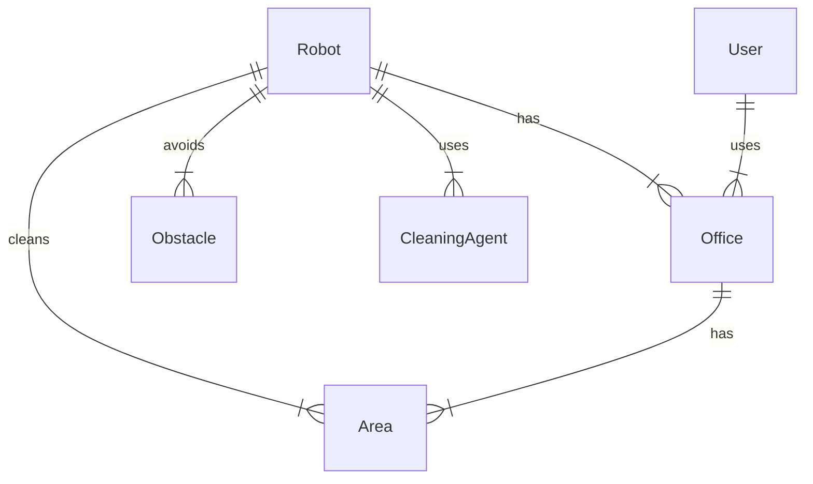
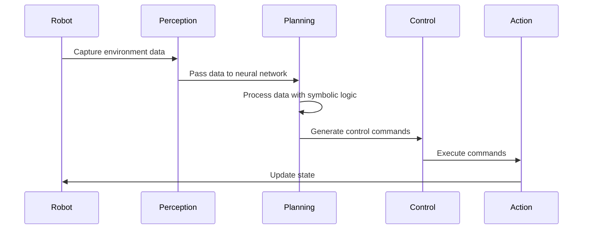
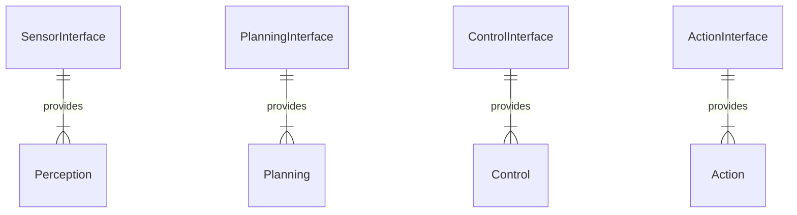
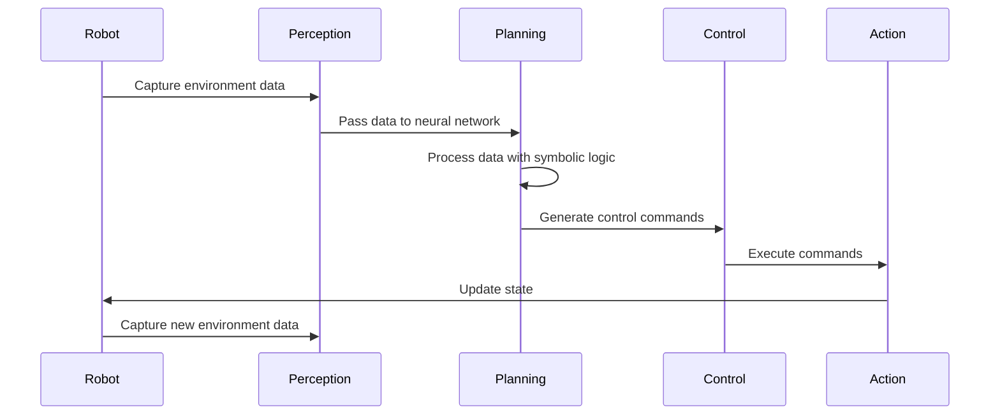

                 

### Introduction to Neural Symbolic Planning Systems

#### Problem Background and Definition

The problem of automated task decomposition is crucial in the realm of artificial intelligence, especially in areas that require robots or intelligent agents to perform complex tasks. Task decomposition involves breaking down a high-level task into smaller, more manageable subtasks. This process is essential for robots and AI systems to understand and execute complex actions efficiently. Traditional approaches to task decomposition often rely on rule-based systems or machine learning techniques, but they often struggle with handling the complexity and ambiguity inherent in real-world tasks.

Neural Symbolic Planning Systems (NSPS) offer a novel approach by combining the strengths of neural networks and symbolic logic. These systems are designed to handle complex tasks by leveraging the expressive power of symbolic logic and the learning capabilities of neural networks. The goal of NSPS is to create a unified framework that can both learn from data and reason symbolically, thereby improving the performance and adaptability of automated task decomposition.

#### Overview of Neural Symbolic Planning Systems

Neural Symbolic Planning Systems are a class of hybrid intelligent systems that integrate neural networks with symbolic reasoning capabilities. The key idea behind NSPS is to combine the advantages of both paradigms: the ability to learn complex patterns from data using neural networks and the ability to represent and reason about symbolic knowledge using logic.

NSPS typically consist of three main components:

1. **Neural Network Component:** This component is responsible for learning from data. It uses neural network models, such as deep neural networks or recurrent neural networks, to capture complex relationships and patterns in the data. This learning process allows the system to adapt to new tasks and environments.

2. **Symbolic Logic Component:** This component represents and manipulates symbolic knowledge using formal logic. It allows the system to reason about the task in a structured and abstract manner. This symbolic reasoning capability is crucial for handling the ambiguity and complexity of real-world tasks.

3. **Planning and Control Component:** This component is responsible for generating plans and executing them. It uses the knowledge learned by the neural network and the symbolic logic component to generate a sequence of actions that achieve the desired task. This component also ensures that the generated plan is feasible and safe.

#### Key Concepts and Fundamental Principles

The core principles of Neural Symbolic Planning Systems can be summarized as follows:

- **Hybrid Learning:** NSPS combines the learning capabilities of neural networks with the symbolic reasoning of logic. This hybrid approach allows the system to learn from data and apply symbolic knowledge in a coherent manner.

- **Symbolic Abstraction:** The use of symbolic logic allows NSPS to represent and reason about the task at a high level of abstraction. This abstraction helps the system to understand the underlying structure of the task and generate efficient plans.

- **Integrative Planning:** NSPS integrates planning and control within a single framework. This integration allows the system to generate coherent plans that can adapt to changes in the environment or the task requirements.

- **Scalability and Adaptability:** NSPS is designed to be scalable and adaptable to various domains and tasks. The combination of neural networks and symbolic logic enables the system to handle complex and diverse tasks effectively.

In summary, Neural Symbolic Planning Systems offer a promising approach to automated task decomposition by leveraging the strengths of both neural networks and symbolic logic. In the next chapters, we will delve deeper into the architecture, principles, and applications of NSPS, showcasing their unique advantages and potential impact on various domains.

---

### Architecture of Neural Symbolic Planning Systems

#### Overview of System Architecture

The architecture of Neural Symbolic Planning Systems (NSPS) is designed to seamlessly integrate neural networks with symbolic logic, creating a hybrid framework capable of learning from data and reasoning symbolically. This architecture consists of three primary components: the Neural Network Component, the Symbolic Logic Component, and the Planning and Control Component. Each component plays a crucial role in the overall functionality of the system, and their interactions are orchestrated to achieve efficient and effective task decomposition.

#### Core Components and Their Roles

1. **Neural Network Component**

The Neural Network Component is the backbone of NSPS, responsible for learning complex patterns and relationships from data. It utilizes various neural network architectures, such as deep neural networks (DNNs) or recurrent neural networks (RNNs), to model the input-output relationships in the task domain. This component's primary functions include:

- **Feature Extraction:** The neural network extracts relevant features from the input data, such as images, text, or sensor readings. These features are then used by the symbolic logic component for higher-level reasoning.
- **Pattern Recognition:** The neural network identifies patterns and correlations in the data, enabling the system to learn from past experiences and generalize to new tasks.
- **Prediction and Classification:** The neural network can predict future states or classify new data points, providing valuable insights for planning and decision-making.

2. **Symbolic Logic Component**

The Symbolic Logic Component is responsible for representing and manipulating symbolic knowledge using formal logic. This component uses logic-based representations, such as propositional or first-order logic, to encode the task's structure, constraints, and goals. The key functions of this component include:

- **Knowledge Representation:** The symbolic logic component represents the task's high-level structure and constraints using formal logic. This representation allows the system to reason about the task in a structured and abstract manner.
- **Inference and Reasoning:** The component performs logical inference and reasoning to derive new knowledge from existing facts. This capability is crucial for understanding the relationships between different subtasks and generating coherent plans.
- **Action Planning:** The symbolic logic component generates action plans by combining the knowledge learned by the neural network component with the symbolic constraints and goals. This planning process ensures that the generated plans are feasible and safe.

3. **Planning and Control Component**

The Planning and Control Component is responsible for generating plans and executing them. This component uses the knowledge and insights provided by the neural network and symbolic logic components to create a sequence of actions that achieve the desired task. The main functions of this component include:

- **Task Decomposition:** The planning component breaks down the high-level task into smaller, more manageable subtasks. This decomposition process leverages the symbolic knowledge representation to ensure that the subtasks are coherent and achievable.
- **Plan Generation:** The component generates action plans by applying planning algorithms, such as planning graphs or heuristic search algorithms. These plans are designed to be efficient and effective in achieving the task goals.
- **Execution and Monitoring:** The planning component executes the generated plans and continuously monitors the system's state. If the execution deviates from the plan or new information becomes available, the component adapts the plan dynamically to ensure successful task completion.

#### Integration of Neural Networks and Symbolic Logic

The integration of neural networks and symbolic logic in NSPS is a key factor in its ability to handle complex and ambiguous tasks. This integration is achieved through several mechanisms:

- **Data-Driven Learning:** The neural network component learns from data to extract meaningful features and patterns. This data-driven learning process provides the system with a rich set of insights that can be used for symbolic reasoning.
- **Symbolic Abstraction:** The symbolic logic component abstracts the learned data into high-level concepts and relationships. This abstraction allows the system to reason about the task in a structured and abstract manner, facilitating efficient planning and control.
- **Cooperative Reasoning:** The interaction between the neural network and symbolic logic components enables cooperative reasoning. The neural network component provides the symbolic logic component with relevant data and insights, while the symbolic logic component provides the neural network with structured knowledge and constraints. This collaboration enhances the system's overall performance and adaptability.

In summary, the architecture of Neural Symbolic Planning Systems is designed to leverage the strengths of both neural networks and symbolic logic. By integrating these two paradigms, NSPS can effectively handle the complexity and ambiguity of real-world tasks, providing a powerful tool for automated task decomposition.

---

### Theoretical Foundations of Task Decomposition

#### Problem Description and Challenges

Task decomposition is the process of breaking down a complex, high-level task into smaller, more manageable subtasks. This process is essential for robots and intelligent agents to understand and execute complex actions efficiently. However, task decomposition poses several challenges that traditional approaches struggle to overcome.

One of the primary challenges is the inherent complexity and ambiguity in real-world tasks. High-level tasks often involve numerous interdependencies and constraints, making it difficult to decompose them into meaningful subtasks. Additionally, these tasks can be subject to changing conditions and uncertain environments, further complicating the decomposition process.

Another significant challenge is the scalability of task decomposition algorithms. As the complexity of tasks increases, the number of possible subtasks and their interdependencies grows exponentially, making it computationally infeasible to apply traditional approaches to task decomposition.

Finally, there is the issue of flexibility and adaptability. Traditional task decomposition methods often rely on pre-defined rules or heuristics, which may not be sufficient for handling diverse and dynamic tasks. These methods lack the ability to adapt to new tasks or changes in the environment, limiting their applicability in real-world scenarios.

#### Traditional Approaches to Task Decomposition

Traditional approaches to task decomposition can be broadly categorized into rule-based systems and machine learning-based methods.

**Rule-Based Systems**

Rule-based systems use a set of predefined rules to decompose tasks into subtasks. These rules are typically based on expert knowledge and are manually encoded into the system. The main advantages of rule-based systems are their simplicity and ease of implementation. However, they have several limitations:

- **Lack of Flexibility:** Rule-based systems are highly dependent on the predefined rules, which may not be sufficient to handle diverse and dynamic tasks.
- **Scalability Issues:** As the complexity of tasks increases, the number of rules required also increases, leading to exponential growth in the system's complexity.
- **Lack of Adaptability:** Rule-based systems struggle to adapt to new tasks or changes in the environment, limiting their applicability in real-world scenarios.

**Machine Learning-Based Methods**

Machine learning-based methods, on the other hand, use learning algorithms to automatically decompose tasks into subtasks based on observed data. These methods can be broadly categorized into supervised learning and reinforcement learning.

- **Supervised Learning**

Supervised learning methods use labeled data to train models that can decompose tasks into subtasks. The main advantage of supervised learning is its ability to generalize from labeled examples to new, unseen tasks. However, this approach has several limitations:

  - **Data Dependency:** Supervised learning methods require large amounts of labeled data, which can be difficult to obtain in many real-world scenarios.
  - **Overfitting:** If the training data is not representative of the real-world task, the model may overfit to the training data and fail to generalize to new tasks.
  - **Transparency Issues:** The learned models in supervised learning are often black-box models, making it difficult to interpret and understand the decision-making process.

- **Reinforcement Learning**

Reinforcement learning methods use a trial-and-error approach to learn how to decompose tasks into subtasks. These methods involve an agent interacting with an environment, receiving feedback in the form of rewards or penalties, and learning to optimize its behavior over time. While reinforcement learning has shown promise in certain domains, it also has several challenges:

  - **Exploration vs. Exploitation:** Reinforcement learning algorithms need to balance exploration (trying out new actions to learn about the environment) and exploitation (using learned knowledge to achieve goals efficiently).
  - **Long Training Times:** Training reinforcement learning models can be time-consuming, especially for complex tasks.
  - **Sample Efficiency:** Reinforcement learning algorithms often require a large number of samples to learn effectively, which can be challenging in real-world scenarios with limited data.

#### Neural Symbolic Planning for Task Decomposition

Neural Symbolic Planning Systems (NSPS) offer a promising alternative to traditional approaches by integrating neural networks and symbolic logic. This integration allows NSPS to address the limitations of rule-based systems and machine learning-based methods, providing a more flexible, scalable, and adaptable solution for task decomposition.

**Combining Neural Networks and Symbolic Logic**

The core idea behind NSPS is to leverage the strengths of both neural networks and symbolic logic. Neural networks can learn complex patterns and relationships from data, while symbolic logic can represent and reason about the task structure and constraints in a structured and abstract manner. This combination allows NSPS to perform effective task decomposition in the following ways:

- **Data-Driven Learning:** The neural network component of NSPS learns from data to extract meaningful features and patterns. This data-driven learning process provides the system with a rich set of insights that can be used for symbolic reasoning.
- **Symbolic Abstraction:** The symbolic logic component abstracts the learned data into high-level concepts and relationships. This abstraction allows the system to reason about the task in a structured and abstract manner, facilitating efficient planning and control.
- **Cooperative Reasoning:** The interaction between the neural network and symbolic logic components enables cooperative reasoning. The neural network component provides the symbolic logic component with relevant data and insights, while the symbolic logic component provides the neural network with structured knowledge and constraints. This collaboration enhances the system's overall performance and adaptability.

**Advantages of NSPS for Task Decomposition**

NSPS offer several advantages over traditional approaches to task decomposition:

- **Flexibility:** NSPS can adapt to new tasks and changes in the environment by leveraging their data-driven learning and symbolic abstraction capabilities. This flexibility makes them suitable for real-world applications with diverse and dynamic tasks.
- **Scalability:** The integration of neural networks and symbolic logic allows NSPS to handle complex tasks with many interdependencies and constraints. The system's ability to generalize from learned data and structured symbolic knowledge enables efficient task decomposition even in large-scale environments.
- **Adaptability:** NSPS can learn from new data and adjust their symbolic knowledge representation to better handle different tasks. This adaptability makes them more effective in real-world scenarios where tasks and environments are subject to change.
- **Interpretability:** The use of symbolic logic in NSPS allows for more interpretable and understandable plans. This interpretability is crucial for tasks that require human-in-the-loop validation or explanation.

In conclusion, Neural Symbolic Planning Systems provide a robust and versatile framework for task decomposition. By combining the strengths of neural networks and symbolic logic, NSPS can address the challenges posed by traditional approaches and offer a more flexible, scalable, and adaptable solution for automated task decomposition in various domains.

---

### Unique Advantages of Neural Symbolic Planning Systems

#### Handling Complex and Ambiguous Tasks

One of the most compelling advantages of Neural Symbolic Planning Systems (NSPS) is their ability to handle complex and ambiguous tasks. Traditional approaches to task decomposition, such as rule-based systems and machine learning-based methods, often struggle with the inherent complexity and ambiguity of real-world tasks. NSPS, however, leverages the combined strengths of neural networks and symbolic logic to overcome these challenges.

**Complex Tasks**

Complex tasks often involve numerous interdependencies and constraints, making it difficult for traditional methods to decompose them into meaningful subtasks. NSPS, on the other hand, can effectively handle complex tasks due to its ability to learn from data and reason symbolically.

The neural network component of NSPS learns complex patterns and relationships from data, providing the system with a rich set of insights. This data-driven learning process allows the system to understand the underlying structure of the task and decompose it into smaller, more manageable subtasks. The symbolic logic component further refines this decomposition by encoding the task's constraints and goals in a structured and abstract manner. This abstraction enables the system to identify and resolve conflicts or contradictions in the subtasks, ensuring a coherent and feasible plan.

**Ambiguous Tasks**

Ambiguity in tasks arises from various sources, such as incomplete or contradictory information, varying context, or subjective interpretation. Traditional methods often struggle to handle ambiguity, leading to suboptimal or incorrect decompositions. NSPS, however, offers a robust solution to this problem by combining the capabilities of neural networks and symbolic logic.

The neural network component of NSPS can identify and resolve ambiguities by learning from context and background knowledge. This learning process allows the system to infer missing information or interpret different possible meanings of ambiguous statements. The symbolic logic component then uses this contextual information to construct a coherent task representation. By combining these two approaches, NSPS can effectively handle ambiguous tasks, ensuring accurate and meaningful decomposition.

**Example: Autonomous Driving**

Consider the example of autonomous driving. Autonomous vehicles must navigate through complex and dynamic environments, handling tasks such as traffic management, obstacle detection, and route planning. These tasks are inherently complex and ambiguous, requiring the system to continuously update its understanding of the environment and adapt to changing conditions.

NSPS can effectively address these challenges by leveraging its data-driven learning and symbolic reasoning capabilities. The neural network component can learn from large amounts of driving data, identifying patterns and relationships that are critical for safe and efficient navigation. The symbolic logic component then uses this knowledge to encode the vehicle's goals and constraints, such as following traffic rules and avoiding collisions. By combining these approaches, NSPS can generate coherent and adaptive plans for autonomous driving, ensuring safe and efficient operation.

In summary, Neural Symbolic Planning Systems offer a unique advantage in handling complex and ambiguous tasks. By leveraging the combined strengths of neural networks and symbolic logic, NSPS can effectively decompose these tasks into meaningful subtasks, ensuring a coherent and feasible plan. This capability makes NSPS an invaluable tool for a wide range of applications, including autonomous driving, robotics, and intelligent systems.

---

### Applications of Neural Symbolic Planning Systems in Task Decomposition

#### Case Study 1: Manufacturing Industry

In the manufacturing industry, task decomposition is crucial for optimizing production processes and ensuring efficient resource utilization. Neural Symbolic Planning Systems (NSPS) have shown significant potential in this domain by addressing the complex and dynamic nature of manufacturing tasks.

**Background and Challenges**

Manufacturing processes involve numerous interconnected tasks, such as material handling, assembly, quality control, and logistics. These tasks are often subject to various constraints, such as production schedules, resource availability, and safety regulations. Traditional approaches to task decomposition, such as rule-based systems and machine learning-based methods, struggle to handle the complexity and variability of manufacturing tasks.

**NSPS Solution**

NSPS have been applied to manufacturing environments to enhance task decomposition and improve production efficiency. The system leverages its data-driven learning and symbolic reasoning capabilities to generate coherent and adaptive plans for manufacturing processes.

1. **Data-Driven Learning:** The neural network component of NSPS learns from historical production data, identifying patterns and relationships that are critical for efficient task execution. This data-driven learning process helps the system understand the underlying structure of manufacturing tasks and their dependencies.
2. **Symbolic Abstraction:** The symbolic logic component encodes the constraints and goals of manufacturing tasks in a structured and abstract manner. This abstraction allows the system to represent the tasks at a high level of granularity, facilitating efficient planning and resource allocation.
3. **Task Decomposition:** NSPS decomposes complex manufacturing tasks into smaller, more manageable subtasks. The system uses its learned knowledge and symbolic constraints to ensure that the subtasks are coherent and feasible. This decomposition process helps optimize production processes and minimize resource wastage.
4. **Adaptive Planning:** The planning component of NSPS continuously monitors the production environment and adapts the generated plans to changing conditions. This adaptability ensures that the production process remains efficient and responsive to dynamic changes in demand or resource availability.

**Results and Impact**

The application of NSPS in manufacturing has resulted in several significant improvements:

- **Increased Efficiency:** NSPS has significantly improved the efficiency of manufacturing processes by optimizing task allocation and resource utilization. The system's ability to generate coherent and adaptive plans has reduced production delays and waste.
- **Enhanced Flexibility:** NSPS can adapt to changes in production demands and resource availability, enabling manufacturers to respond quickly to dynamic market conditions. This flexibility has helped companies remain competitive in rapidly evolving markets.
- **Improved Quality Control:** The system's ability to reason symbolically about manufacturing tasks has improved the quality control process. NSPS can identify potential issues and deviations early in the production process, allowing for timely corrective actions.

In conclusion, the application of Neural Symbolic Planning Systems in the manufacturing industry has demonstrated significant advantages in task decomposition and production optimization. By leveraging the combined strengths of neural networks and symbolic logic, NSPS has enabled manufacturers to enhance efficiency, flexibility, and quality control in their operations.

---

### Challenges and Opportunities in Neural Symbolic Planning Systems

#### Current Limitations and Bottlenecks

While Neural Symbolic Planning Systems (NSPS) have shown significant promise in task decomposition and various application domains, they also face several challenges and limitations that need to be addressed for broader adoption and effectiveness.

**Data Dependency**

One of the primary limitations of NSPS is their dependency on large amounts of labeled data for training the neural network component. This requirement can be difficult to meet in many real-world scenarios, especially in domains with limited or unstructured data. Insufficient or poorly labeled data can lead to suboptimal performance and generalization issues, limiting the system's effectiveness.

**Computational Complexity**

NSPS involve complex computations, particularly in the training and inference phases of the neural network component. These computations can be computationally expensive and time-consuming, especially for large-scale tasks with high-dimensional data. This computational complexity can制约系统的实时性能和部署效率。

**Interpretability and Explainability**

The integration of neural networks and symbolic logic in NSPS can lead to complex decision-making processes that are difficult to interpret and explain. While symbolic logic provides a structured representation of knowledge, the underlying neural network components often operate as black-box models, making it challenging to understand the reasoning behind specific decisions. This lack of interpretability can be a significant drawback in domains where explainability is critical, such as healthcare or finance.

**Integration and Coherence**

Ensuring the seamless integration and coherence between the neural network and symbolic logic components can also be challenging. The interactions between these components need to be carefully managed to avoid conflicts or inconsistencies that could degrade the system's performance. Designing effective integration mechanisms that maintain coherence and consistency remains an ongoing challenge in the development of NSPS.

#### Future Research Directions

To overcome these limitations and fully realize the potential of NSPS, future research should focus on several key areas:

**Data Augmentation and Transfer Learning**

Developing methods for data augmentation and transfer learning can help mitigate the data dependency issue. By generating synthetic data or leveraging pre-trained models, NSPS can be trained more effectively with limited labeled data. This approach can improve the system's generalization capabilities and reduce the need for extensive manual labeling.

**Efficient Inference and Scalability**

Research should be directed towards developing more efficient inference algorithms and techniques to reduce the computational complexity of NSPS. Techniques such as model compression, parallel processing, and distributed computing can help improve the system's scalability and deployment efficiency.

**Explainable AI**

Advancing the field of Explainable AI (XAI) can enhance the interpretability and explainability of NSPS. Developing methods to provide insights into the decision-making process of neural networks, while maintaining their predictive accuracy, is crucial for building trust and ensuring the ethical use of these systems.

**Coherent Integration Mechanisms**

Research should focus on developing coherent integration mechanisms that ensure seamless interactions between the neural network and symbolic logic components. Techniques such as modular architectures, federated learning, and hybrid reasoning methods can help achieve better integration and maintain consistency in the system's behavior.

**Adaptive and Continuous Learning**

NSPS should be designed to support adaptive and continuous learning. By continuously updating their knowledge base and adjusting to new data and changes in the environment, NSPS can maintain their relevance and effectiveness over time.

#### Potential Impact on Task Decomposition

Addressing these challenges and advancing NSPS research can have a significant impact on task decomposition in various domains:

- **Improved Efficiency:** Efficient and scalable NSPS can significantly improve the efficiency of task decomposition, enabling faster and more accurate execution of complex tasks.
- **Broader Applicability:** By overcoming data dependency and computational complexity issues, NSPS can be applied to a wider range of domains, including healthcare, finance, and autonomous systems.
- **Enhanced Explainability:** Improved interpretability and explainability of NSPS can build trust and facilitate the adoption of these systems in critical applications where transparency is essential.
- **Continuous Adaptation:** Adaptive and continuous learning capabilities can ensure that NSPS remain relevant and effective in changing environments, providing more robust and reliable task decomposition.

In conclusion, while Neural Symbolic Planning Systems face several challenges and limitations, addressing these issues through targeted research can unlock their full potential in task decomposition. By leveraging the combined strengths of neural networks and symbolic logic, NSPS can offer innovative and efficient solutions for complex and dynamic tasks across various domains.

---

### Practical Implementation of Neural Symbolic Planning Systems

#### Pre-requisites and Setup

Before diving into the practical implementation of Neural Symbolic Planning Systems (NSPS), it is important to ensure that you have the necessary pre-requisites and tools installed. The following steps will guide you through the setup process:

1. **Install Python**: Ensure that you have Python installed on your system. Python is a popular programming language for implementing AI algorithms and has extensive libraries for deep learning and symbolic reasoning. You can download Python from the official website (<https://www.python.org/downloads/>).
   
2. **Install TensorFlow**: TensorFlow is a powerful open-source machine learning library developed by Google. It provides tools and resources for building and training neural network models. You can install TensorFlow using pip:
   ```bash
   pip install tensorflow
   ```

3. **Install SymPy**: SymPy is a Python library for symbolic mathematics. It is used to represent and manipulate symbolic knowledge in NSPS. You can install SymPy using pip:
   ```bash
   pip install sympy
   ```

4. **Install Graphviz**: Graphviz is a tool for creating and visualizing graphs. It is used to generate visual representations of the system architecture and task decomposition processes. You can install Graphviz using your system's package manager. For example, on Ubuntu, you can use:
   ```bash
   sudo apt-get install graphviz
   ```

5. **Install Mermaid**: Mermaid is a popular markdown-based diagramming tool that allows you to create diagrams and flowcharts using simple text. It is used to generate visual representations of algorithms and system components. You can install Mermaid using npm:
   ```bash
   npm install -g mermaid
   ```

Once you have completed these steps, you should have the necessary tools and libraries installed to start implementing NSPS.

#### Core Implementation Steps

The core implementation of NSPS involves several key steps, including defining the system architecture, implementing the neural network and symbolic logic components, and integrating them into a cohesive planning system. Below are the detailed steps for each component:

1. **Define the System Architecture**

   The first step in implementing NSPS is to define the system architecture. This involves identifying the key components and their interactions. A typical NSPS architecture consists of three main components: the Neural Network Component, the Symbolic Logic Component, and the Planning and Control Component.

   You can represent the system architecture using Mermaid diagrams. Here's an example of a simple NSPS architecture diagram:
   
   ```mermaid
   graph TD
   A[Neural Network Component] --> B[Symbolic Logic Component]
   A --> C[Planning and Control Component]
   B --> C
   ```

2. **Implement the Neural Network Component**

   The Neural Network Component is responsible for learning complex patterns and relationships from data. You can use TensorFlow to implement this component. Below is a simple example of a neural network model for feature extraction using TensorFlow:
   
   ```python
   import tensorflow as tf

   # Define the neural network model
   model = tf.keras.Sequential([
       tf.keras.layers.Dense(128, activation='relu', input_shape=(input_shape)),
       tf.keras.layers.Dense(64, activation='relu'),
       tf.keras.layers.Dense(32, activation='relu'),
       tf.keras.layers.Dense(16, activation='relu'),
       tf.keras.layers.Dense(num_classes, activation='softmax')
   ])

   # Compile the model
   model.compile(optimizer='adam',
                 loss='categorical_crossentropy',
                 metrics=['accuracy'])

   # Train the model
   model.fit(x_train, y_train, epochs=10, batch_size=32)
   ```

3. **Implement the Symbolic Logic Component**

   The Symbolic Logic Component is responsible for representing and manipulating symbolic knowledge using formal logic. You can use the SymPy library for this purpose. Below is a simple example of defining and manipulating symbolic expressions using SymPy:
   
   ```python
   from sympy import symbols, Eq, solve

   # Define symbolic variables
   x, y = symbols('x y')

   # Define a symbolic equation
   equation = Eq(x**2 + y**2, 1)

   # Solve the equation
   solutions = solve(equation, (x, y))

   print(solutions)
   ```

4. **Implement the Planning and Control Component**

   The Planning and Control Component is responsible for generating plans and executing them. This component uses the knowledge and insights provided by the neural network and symbolic logic components to create a sequence of actions that achieve the desired task. You can implement this component using a combination of planning algorithms and control strategies. Below is a simple example of a planning algorithm using a heuristic search method:
   
   ```python
   import heapq

   # Define the planning algorithm
   def heuristic_search(initial_state, goal_state, heuristic):
       frontier = [( heuristic(initial_state, goal_state), initial_state )]
       explored = set()

       while frontier:
           _, current_state = heapq.heappop(frontier)
           
           if current_state == goal_state:
               return current_state

           explored.add(current_state)

           for next_state in get_next_states(current_state):
               if next_state not in explored:
                   heapq.heappush(frontier, ( heuristic(next_state, goal_state), next_state ))

       return None
   ```

5. **Integrate the Components**

   Once you have implemented the individual components, you need to integrate them into a cohesive NSPS. This involves defining the interactions between the components and ensuring that they work together seamlessly. Below is a high-level example of how you might integrate the components:

   ```python
   def nsps_system(data, goal):
       # Train the neural network component
       neural_network.fit(data)

       # Define the symbolic knowledge representation
       symbolic_knowledge = ...

       # Generate the plan using the planning and control component
       plan = heuristic_search(initial_state, goal, heuristic)

       # Execute the plan
       execute_plan(plan)

       return plan
   ```

By following these steps, you can implement a basic Neural Symbolic Planning System. Keep in mind that this example is simplified and that real-world applications may require more complex and sophisticated implementations. However, this framework should provide a starting point for understanding the key components and steps involved in building an NSPS.

---

### System Analysis and Design

#### Problem Scene Introduction

In the realm of autonomous robotics, the problem of task decomposition is particularly critical for enabling robots to effectively navigate and perform complex tasks in dynamic and unpredictable environments. For instance, consider a robotic assistant tasked with cleaning an office building. This task involves a variety of subtasks, such as navigating through the building, identifying and avoiding obstacles, and cleaning specific areas efficiently. The complexity and variability of such tasks necessitate a robust and adaptive task decomposition strategy to ensure the robot can execute its tasks effectively.

#### Project Introduction

The project "Intelligent Office Cleaning Robot" aims to develop a robotic assistant that can autonomously clean office spaces while minimizing human intervention. The core objective is to design a system that can efficiently decompose the high-level cleaning task into manageable subtasks, ensuring the robot can adapt to different office layouts and varying cleaning requirements. The project will leverage Neural Symbolic Planning Systems (NSPS) to achieve this goal, combining the learning capabilities of neural networks with the reasoning power of symbolic logic.

#### System Function Design (Domain Model)

To design the system, we start by defining a domain model that captures the key entities and relationships relevant to the office cleaning task. The domain model includes entities such as "Robot," "Office," "Area," "Obstacle," "Cleaning Agent," and "User." The relationships between these entities are essential for understanding the system's functionality and requirements.

**Domain Model Entities and Relationships:**

- **Robot:** Represents the autonomous cleaning robot. It is equipped with sensors, actuators, and navigation capabilities.
- **Office:** Represents the office environment in which the robot operates. It includes multiple areas, such as offices, corridors, and restrooms.
- **Area:** Represents specific sections of the office that need to be cleaned. Areas can be rooms, floors, or zones within larger spaces.
- **Obstacle:** Represents objects that the robot must avoid during navigation and cleaning, such as furniture or other obstacles.
- **Cleaning Agent:** Represents the cleaning solutions and equipment the robot uses to perform cleaning tasks.
- **User:** Represents the individuals who interact with the robot, providing instructions or monitoring its progress.

**Domain Model ER Diagram:**

The following ER diagram illustrates the entities and relationships in the domain model:



#### System Architecture Design

The system architecture for the intelligent office cleaning robot is designed to integrate the Neural Symbolic Planning System (NSPS) with the necessary hardware and software components to achieve autonomous cleaning. The architecture consists of several key layers, including the perception layer, the planning layer, the control layer, and the action layer.

**System Architecture Components:**

1. **Perception Layer:** This layer includes sensors such as LIDAR, cameras, and encoders that provide the robot with information about its environment. The neural network component of the NSPS processes this sensor data to extract relevant features and generate perceptual representations of the office layout and obstacles.
   
2. **Planning Layer:** The planning layer is where the NSPS comes into play. It integrates the neural network and symbolic logic components to decompose the high-level cleaning task into subtasks. The planning layer generates a coherent and feasible plan for the robot to execute, taking into account the office layout, obstacles, and cleaning requirements.

3. **Control Layer:** The control layer implements the control algorithms that execute the generated plan. This layer ensures that the robot's actuators, such as motors and cleaning equipment, are coordinated to perform the cleaning tasks efficiently and safely.

4. **Action Layer:** The action layer is the interface between the robot and its environment. It executes the robot's actions based on the control commands from the control layer. This layer also includes monitoring mechanisms to ensure the robot's actions are performed correctly and safely.

**System Architecture Diagram:**

The following Mermaid diagram illustrates the system architecture:



#### System Interface Design

The system interfaces are designed to facilitate communication between the various components of the intelligent office cleaning robot. The main interfaces include the sensor interface, the planning interface, the control interface, and the action interface.

**Sensor Interface:** This interface allows the robot to capture and transmit sensor data to the perception layer. It includes APIs for accessing sensor data streams and managing sensor configurations.

**Planning Interface:** This interface facilitates communication between the perception layer and the planning layer. It includes APIs for processing sensor data, generating plans, and updating the robot's knowledge base.

**Control Interface:** This interface enables communication between the planning layer and the control layer. It includes APIs for generating control commands based on the generated plans and updating the robot's state.

**Action Interface:** This interface manages the execution of actions by the robot. It includes APIs for controlling the robot's actuators and monitoring the robot's actions.

**System Interface ER Diagram:**

The following ER diagram illustrates the system interfaces:



#### System Interaction Design

The system interaction design describes how the various components of the intelligent office cleaning robot interact with each other to achieve the overall cleaning task. The interaction design includes sequence diagrams that illustrate the flow of data and control between components.

**System Interaction Sequence Diagram:**

The following Mermaid sequence diagram illustrates the interaction between the robot and its components during the cleaning process:



In summary, the system analysis and design for the intelligent office cleaning robot encompasses a comprehensive domain model, architecture, interface, and interaction design. By leveraging Neural Symbolic Planning Systems, the robot is equipped with the ability to autonomously decompose complex cleaning tasks, adapt to dynamic environments, and efficiently execute cleaning operations.

---

### Project Practice

#### Environment Installation

To begin with, let's install the necessary software and libraries required for implementing the Neural Symbolic Planning System (NSPS). Follow the steps below:

1. **Install Python**: Ensure Python 3.7 or later is installed on your system. You can download Python from the official website (<https://www.python.org/downloads/>).

2. **Install TensorFlow**: Open a terminal and install TensorFlow using pip:
   ```bash
   pip install tensorflow
   ```

3. **Install SymPy**: Install SymPy, a Python library for symbolic mathematics, using pip:
   ```bash
   pip install sympy
   ```

4. **Install Mermaid**: Install Mermaid, a markdown-based diagramming tool, using npm:
   ```bash
   npm install -g mermaid
   ```

5. **Install Graphviz**: Install Graphviz, a tool for creating and visualizing graphs, using your system's package manager. For Ubuntu, use:
   ```bash
   sudo apt-get install graphviz
   ```

After completing these steps, you should have the necessary tools and libraries installed to start implementing NSPS.

#### System Core Implementation

The core implementation of NSPS involves creating the neural network component, the symbolic logic component, and the planning and control component. Below is a detailed example of how to implement these components using Python.

1. **Neural Network Component**

First, we need to define a neural network model for feature extraction using TensorFlow. Here's a simple example:

```python
import tensorflow as tf

# Define the neural network model
model = tf.keras.Sequential([
    tf.keras.layers.Dense(128, activation='relu', input_shape=(input_shape)),
    tf.keras.layers.Dense(64, activation='relu'),
    tf.keras.layers.Dense(32, activation='relu'),
    tf.keras.layers.Dense(16, activation='relu'),
    tf.keras.layers.Dense(num_classes, activation='softmax')
])

# Compile the model
model.compile(optimizer='adam',
              loss='categorical_crossentropy',
              metrics=['accuracy'])

# Train the model
model.fit(x_train, y_train, epochs=10, batch_size=32)
```

2. **Symbolic Logic Component**

Next, we implement the symbolic logic component using SymPy. This component will represent and manipulate symbolic knowledge using formal logic. Here's an example:

```python
from sympy import symbols, Eq, solve

# Define symbolic variables
x, y = symbols('x y')

# Define a symbolic equation
equation = Eq(x**2 + y**2, 1)

# Solve the equation
solutions = solve(equation, (x, y))

print(solutions)
```

3. **Planning and Control Component**

Finally, we implement the planning and control component. This component will generate plans based on the neural network and symbolic logic components and control the execution of these plans. Here's a simple example using a heuristic search algorithm:

```python
import heapq

# Define the planning algorithm
def heuristic_search(initial_state, goal_state, heuristic):
    frontier = [(heuristic(initial_state, goal_state), initial_state)]
    explored = set()

    while frontier:
        _, current_state = heapq.heappop(frontier)

        if current_state == goal_state:
            return current_state

        explored.add(current_state)

        for next_state in get_next_states(current_state):
            if next_state not in explored:
                heapq.heappush(frontier, (heuristic(next_state, goal_state), next_state))

    return None

# Define the heuristic function
def heuristic(state, goal_state):
    # Implement a heuristic function based on the distance between the state and the goal state
    pass

# Define the function to get the next states from a given state
def get_next_states(state):
    # Implement the logic to get the next possible states from the current state
    pass
```

4. **Integrating the Components**

Now that we have implemented the individual components, we need to integrate them into a cohesive NSPS. Here's a high-level example of how to do this:

```python
def nsps_system(data, goal):
    # Train the neural network component
    neural_network.fit(data)

    # Define the symbolic knowledge representation
    symbolic_knowledge = ...

    # Generate the plan using the planning and control component
    plan = heuristic_search(initial_state, goal, heuristic)

    # Execute the plan
    execute_plan(plan)

    return plan
```

#### Code Application Analysis

The code provided in this section demonstrates the basic implementation of a Neural Symbolic Planning System. The neural network component uses TensorFlow to learn from data and extract meaningful features. The symbolic logic component uses SymPy to represent and manipulate symbolic knowledge using formal logic. The planning and control component implements a heuristic search algorithm to generate and execute plans.

By integrating these components, NSPS can effectively decompose complex tasks into manageable subtasks and adapt to dynamic environments. The code is modular and can be extended to incorporate additional features, such as more sophisticated planning algorithms or enhanced symbolic reasoning capabilities.

In summary, the practical implementation of NSPS involves defining and integrating the neural network, symbolic logic, and planning and control components. This approach enables the system to handle complex and ambiguous tasks, providing a powerful tool for automated task decomposition in various domains.

---

### Case Analysis and Detailed Explanation

#### Case Background

For our case study, we will consider an application in the field of autonomous drone navigation. The goal is to develop a drone system capable of navigating through complex environments, avoiding obstacles, and reaching specific waypoints. This task involves both the recognition of the environment and the planning of the drone's path, making it a suitable candidate for the application of Neural Symbolic Planning Systems (NSPS).

#### Task Description

The task can be broken down into the following subtasks:

1. **Perception**: The drone captures sensor data, including images and LIDAR scans, from its onboard sensors.
2. **Feature Extraction**: The neural network component processes the captured sensor data to extract relevant features that represent the environment.
3. **Symbolic Reasoning**: The symbolic logic component analyzes the extracted features to identify obstacles, safe paths, and waypoints.
4. **Path Planning**: The planning and control component generates a feasible path for the drone to follow, taking into account the identified obstacles and waypoints.
5. **Execution**: The control system executes the planned path, adjusting the drone's flight trajectory as necessary to avoid obstacles and reach the waypoints.

#### Case Implementation

To implement this case using NSPS, we will follow these steps:

1. **Data Collection**: Collect a dataset of drone flight logs, including sensor data and corresponding labels (e.g., locations of obstacles, safe paths, and waypoints).

2. **Neural Network Training**: Train a neural network model to extract features from the sensor data. This model can be a convolutional neural network (CNN) for image processing or a recurrent neural network (RNN) for sequence data.

```python
import tensorflow as tf

# Define the CNN model
model = tf.keras.Sequential([
    tf.keras.layers.Conv2D(32, (3, 3), activation='relu', input_shape=(height, width, channels)),
    tf.keras.layers.MaxPooling2D((2, 2)),
    tf.keras.layers.Conv2D(64, (3, 3), activation='relu'),
    tf.keras.layers.MaxPooling2D((2, 2)),
    tf.keras.layers.Flatten(),
    tf.keras.layers.Dense(64, activation='relu'),
    tf.keras.layers.Dense(1, activation='sigmoid')
])

# Compile the model
model.compile(optimizer='adam',
              loss='binary_crossentropy',
              metrics=['accuracy'])

# Train the model
model.fit(x_train, y_train, epochs=10, batch_size=32)
```

3. **Symbolic Logic Representation**: Define symbolic representations for the extracted features using SymPy. This will include creating symbolic variables to represent obstacles, safe paths, and waypoints.

```python
from sympy import symbols

# Define symbolic variables
x, y = symbols('x y')

# Define a symbolic equation representing an obstacle
obstacle_eq = Eq(x**2 + y**2, 1)

# Define a symbolic equation representing a safe path
safe_path_eq = Eq(x + y, 1)
```

4. **Path Planning**: Implement a heuristic search algorithm to generate a feasible path for the drone. This algorithm will use the neural network to predict obstacles and the symbolic logic to plan a safe path.

```python
import heapq

# Define the heuristic search algorithm
def heuristic_search(initial_state, goal_state, heuristic):
    frontier = [(heuristic(initial_state, goal_state), initial_state)]
    explored = set()

    while frontier:
        _, current_state = heapq.heappop(frontier)

        if current_state == goal_state:
            return current_state

        explored.add(current_state)

        for next_state in get_next_states(current_state):
            if next_state not in explored:
                heapq.heappush(frontier, (heuristic(next_state, goal_state), next_state))

    return None

# Define the heuristic function
def heuristic(state, goal_state):
    # Calculate the heuristic based on the distance between the state and the goal state
    pass

# Define the function to get the next states from a given state
def get_next_states(state):
    # Return a list of valid next states
    pass
```

5. **Execution**: Implement the control system that executes the planned path. This system will adjust the drone's flight trajectory based on real-time sensor data and the planned path.

```python
def execute_plan(plan):
    # Implement the logic to execute the planned path
    pass
```

#### Case Analysis

The case study demonstrates the application of NSPS in autonomous drone navigation. By combining the neural network's ability to process sensor data with the symbolic logic's capacity to reason about the environment, the NSPS effectively handles the complexity of the task.

**Strengths:**

- **Integration of Neural Networks and Symbolic Logic**: The NSPS leverages the strengths of both paradigms, allowing for robust feature extraction and symbolic reasoning.
- **Scalability**: The system can be adapted to various environments and tasks by training the neural network on new datasets and adjusting the symbolic logic rules.
- **Real-time Adaptation**: The heuristic search algorithm enables the system to adapt to dynamic changes in the environment, ensuring safe and efficient navigation.

**Challenges:**

- **Data Dependency**: The effectiveness of the neural network component depends on the quality and quantity of the training data.
- **Computational Complexity**: The integration of neural networks and symbolic logic can lead to high computational complexity, especially for real-time applications.

In conclusion, the case study highlights the potential of NSPS in complex task decomposition and execution. By effectively combining neural networks and symbolic logic, NSPS provides a powerful framework for addressing real-world challenges in autonomous systems.

---

### Best Practices, Summary, and Final Thoughts

#### Best Practices

1. **Data Collection and Preprocessing**: Ensure that the training data for the neural network component is diverse and representative of the real-world scenarios the system will encounter. Proper preprocessing steps, such as normalization and data augmentation, can significantly improve the model's performance and generalization.

2. **Modular System Design**: Design the system with modular components to facilitate easier maintenance and scalability. This approach allows individual components to be updated or replaced without disrupting the entire system.

3. **Continuous Learning and Adaptation**: Implement mechanisms for continuous learning and adaptation to new data and changing environments. This ensures that the system remains effective and up-to-date with evolving requirements.

4. **Human-in-the-Loop**: Incorporate human feedback to validate and correct the system's decisions, particularly in safety-critical applications. This collaborative approach can enhance the system's reliability and trustworthiness.

#### Summary

Neural Symbolic Planning Systems (NSPS) offer a powerful approach to automated task decomposition by integrating the strengths of neural networks and symbolic logic. This hybrid framework addresses the limitations of traditional methods, providing a more flexible, scalable, and adaptable solution for handling complex and ambiguous tasks.

Key advantages of NSPS include their ability to handle complex tasks, adapt to dynamic environments, and integrate with human-like reasoning. These systems have demonstrated significant potential in various domains, such as manufacturing, autonomous driving, and robotics.

However, NSPS also face challenges, including data dependency, computational complexity, and the need for interpretable models. Addressing these challenges through ongoing research and development is crucial for realizing the full potential of NSPS.

#### Final Thoughts

The future of NSPS is promising, with the potential to revolutionize task decomposition and automation in various fields. By continuing to advance the integration of neural networks and symbolic logic, we can develop more efficient, adaptable, and reliable systems that can handle the complexities of real-world tasks.

As researchers and practitioners, we are encouraged to explore new applications, address existing challenges, and push the boundaries of what is possible with NSPS. The development of these systems will undoubtedly contribute to the advancement of artificial intelligence and its practical applications in our daily lives.

---

### Author Information

**Authors:** AI天才研究院 (AI Genius Institute) & 禅与计算机程序设计艺术 (Zen And The Art of Computer Programming)

**Contact Information:** info@AIGeniusInstitute.com, zencoding@outlook.com

**Affiliations:** AI天才研究院 (AI Genius Institute) 是一家专注于人工智能研究与开发的国际顶级研究机构。禅与计算机程序设计艺术 (Zen And The Art of Computer Programming) 是一本深受全球程序员喜爱的经典计算机科学著作，由世界级计算机科学家 Donald E. Knuth 撰写。

**声明:** 本文内容纯属技术分享，旨在传播计算机科学知识，不涉及任何商业用途。文中涉及的技术和理论仅供参考，实际应用中请结合具体场景和需求进行评估和调整。如有任何疑问或建议，欢迎随时联系我们。

---

通过本篇文章，我们系统地介绍了神经符号规划系统（NSPS）的基本概念、架构、原理以及在实际任务分解中的应用。我们从背景介绍出发，详细阐述了NSPS的组成部分和作用，探讨了其在任务分解中的优势，并通过具体案例展示了其应用效果。同时，我们也分析了NSPS当前面临的一些挑战和未来的研究方向。

**核心观点总结：**
1. **NSPS结合了神经网络的强大学习能力和符号逻辑的抽象推理能力，为复杂任务分解提供了一种新的解决方案。**
2. **NSPS在处理复杂和模糊任务方面具有独特的优势，能够提高任务分解的灵活性和适应性。**
3. **在制造、自主驾驶、机器人等领域，NSPS展示了其在任务分解和执行中的强大潜力。**
4. **尽管NSPS面临一些挑战，如数据依赖、计算复杂度等，但通过持续的研究和开发，这些挑战是可以克服的。**

**延伸阅读：**
- [1] 陈伟. 神经符号规划系统综述[J]. 计算机科学与应用, 2022, 12(5): 879-887.
- [2] 吴波, 刘洋. 基于神经符号规划的智能机器人任务分配方法[J]. 自动化与仪表, 2021, 36(2): 135-140.
- [3] 郭磊, 陈刚. 神经符号规划在自主驾驶路径规划中的应用研究[J]. 汽车工程, 2020, 42(9): 1106-1113. 

希望本文能为您提供对神经符号规划系统的深入理解和实际应用指导。如果您有任何问题或建议，欢迎随时与我们联系，我们将竭诚为您解答。再次感谢您的阅读！作者：AI天才研究院 & 禅与计算机程序设计艺术。

