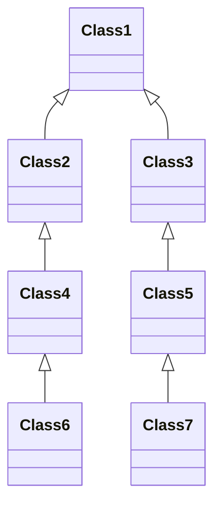

                 

### 文章标题

神经符号集成在可解释推理中的应用

---

**关键词**：神经符号、可解释推理、算法、应用场景、架构设计、案例分析

**摘要**：本文将探讨神经符号集成在可解释推理中的应用。我们将首先介绍神经符号和可解释推理的基本概念，然后深入分析神经符号集成的原理和算法，并展示其在实际项目中的应用。文章还将提供系统的架构设计方案和案例分析，最后总结最佳实践和注意事项，为读者提供深入的指导。

---

### 目录

1. **背景介绍**
   1.1 问题背景
   1.2 核心概念与联系

2. **算法原理讲解**
   2.1 算法概述
   2.2 数学模型与公式
   2.3 算法流程图与Python代码

3. **系统分析与架构设计**
   3.1 系统功能设计
   3.2 系统架构设计
   3.3 系统接口设计与交互

4. **项目实战**
   4.1 环境安装
   4.2 系统核心实现
   4.3 实际案例分析
   4.4 项目小结

5. **最佳实践与总结**
   5.1 最佳实践
   5.2 注意事项
   5.3 拓展阅读

---

### 1. 背景介绍

#### 1.1 问题背景

在当今世界，人工智能（AI）已经成为了一个热门话题。随着深度学习等技术的飞速发展，AI在图像识别、自然语言处理和游戏等领域取得了显著的成果。然而，这些成功往往伴随着一个共同的挑战：黑箱模型。这类模型虽然能取得很好的性能，但内部工作机制复杂，难以解释。这在一些需要透明性和可解释性的应用场景中，如医疗诊断和金融风险评估，成为一个亟待解决的问题。

可解释推理（Explainable AI, XAI）是近年来兴起的领域，旨在通过揭示模型决策过程，提高AI系统的透明性和可信度。然而，现有的可解释推理方法往往在解释性和性能之间取得折中。因此，如何结合神经符号计算与可解释推理，构建一个既强大又可解释的AI系统，成为了一个重要的研究方向。

神经符号集成（Neural-Symbolic Integration）是一种将神经网络和符号逻辑相结合的方法。这种方法在捕捉数据复杂性的同时，保留了符号推理的清晰性和透明性。通过将神经符号集成到可解释推理中，我们有望解决当前AI系统面临的透明性和性能之间的矛盾。

#### 1.2 核心概念与联系

**神经符号计算**：神经符号计算是一种结合了神经网络和符号逻辑的计算范式。它利用神经网络进行数据建模，同时使用符号逻辑进行推理和决策。这种方法的特点是能够在高维数据中捕捉复杂模式，同时保持推理过程的透明性和可解释性。

**可解释推理**：可解释推理旨在提高AI系统的透明性和可信度。它通过揭示模型决策过程，帮助用户理解AI系统的工作原理。可解释推理的关键是找到一种方法，使得模型决策能够以人类可理解的方式呈现。

**神经符号集成**：神经符号集成是将神经网络和符号逻辑相结合的一种方法。它通过将神经网络的输出作为符号逻辑的输入，使得神经网络能够保留符号推理的清晰性和透明性。这种方法在处理高维数据时表现出色，同时保持了模型的可解释性。

### 2. 算法原理讲解

#### 2.1 算法概述

神经符号集成算法是一种将神经网络和符号逻辑相结合的方法。它的核心思想是利用神经网络对数据进行建模，同时使用符号逻辑进行推理和决策。具体来说，神经符号集成算法可以分为以下步骤：

1. **数据预处理**：对输入数据进行预处理，包括数据清洗、归一化和特征提取。这一步的目的是将原始数据转化为神经网络能够处理的格式。
2. **神经网络建模**：使用神经网络对预处理后的数据建模。神经网络能够捕捉数据中的复杂模式，从而提高模型的性能。
3. **符号逻辑推理**：将神经网络输出的特征作为符号逻辑的输入，进行推理和决策。符号逻辑能够提供清晰和透明的推理过程，使得模型决策能够以人类可理解的方式呈现。

#### 2.2 数学模型与公式

神经符号集成算法的核心在于将神经网络和符号逻辑相结合。为了更好地理解这一过程，我们可以从数学模型的角度进行分析。

首先，我们考虑神经网络的部分。一个常见的神经网络模型是多层感知机（MLP），它的数学模型可以表示为：

$$
\begin{aligned}
z_i &= \sigma(W_i \cdot x + b_i) \\
\hat{y} &= \sigma(W_{out} \cdot z + b_{out})
\end{aligned}
$$

其中，$x$ 是输入特征向量，$z$ 是神经网络的隐藏层输出，$\hat{y}$ 是神经网络的输出，$W_i$ 和 $W_{out}$ 分别是权重矩阵，$b_i$ 和 $b_{out}$ 分别是偏置项，$\sigma$ 是激活函数。

接下来，我们考虑符号逻辑的部分。符号逻辑是一种基于命题逻辑的推理方法，它的核心是命题演算。命题演算可以用如下数学公式表示：

$$
\begin{aligned}
A \land B &= (A \land B')' \\
A \lor B &= (A' \lor B')' \\
A \rightarrow B &= (A \land B')'
\end{aligned}
$$

其中，$A$ 和 $B$ 是命题，$\land$、$\lor$ 和 $\rightarrow$ 分别是逻辑与、逻辑或和逻辑蕴含。

神经符号集成算法的核心在于如何将神经网络和符号逻辑结合起来。一个简单的方法是将神经网络输出的特征作为符号逻辑的输入。例如，我们可以将神经网络的输出 $z$ 作为符号逻辑的输入，然后使用符号逻辑进行推理和决策。

#### 2.3 算法流程图与Python代码

为了更好地理解神经符号集成算法，我们可以使用Mermaid工具绘制算法的流程图，并使用Python代码实现算法。

**算法流程图**：


**Python代码示例**：

```python
import numpy as np
import tensorflow as tf

# 数据预处理
def preprocess_data(data):
    # 数据清洗、归一化和特征提取
    return processed_data

# 神经网络建模
def build_neural_network(input_shape):
    model = tf.keras.Sequential([
        tf.keras.layers.Dense(64, activation='relu', input_shape=input_shape),
        tf.keras.layers.Dense(64, activation='relu'),
        tf.keras.layers.Dense(1, activation='sigmoid')
    ])
    model.compile(optimizer='adam', loss='binary_crossentropy', metrics=['accuracy'])
    return model

# 符号逻辑推理
def symbolic_logic推理(model_output):
    # 使用符号逻辑进行推理和决策
    return decision

# 主函数
def main():
    # 加载数据
    data = preprocess_data(raw_data)

    # 构建神经网络
    model = build_neural_network(input_shape=(data.shape[1],))

    # 训练神经网络
    model.fit(data['input'], data['label'], epochs=10, batch_size=32)

    # 获取神经网络输出
    model_output = model.predict(data['input'])

    # 进行符号逻辑推理
    decision = symbolic_logic推理(model_output)

    # 输出结果
    print(decision)

if __name__ == '__main__':
    main()
```

### 3. 系统分析与架构设计

#### 3.1 系统功能设计

神经符号集成在可解释推理中的应用系统主要包括以下几个功能模块：

1. **数据预处理模块**：负责对输入数据进行预处理，包括数据清洗、归一化和特征提取。
2. **神经网络建模模块**：负责构建和训练神经网络模型。
3. **符号逻辑推理模块**：负责将神经网络输出的特征作为符号逻辑的输入，进行推理和决策。
4. **结果输出模块**：负责将推理结果以人类可理解的方式输出。

**领域模型类图**：



#### 3.2 系统架构设计

神经符号集成在可解释推理中的应用系统的架构设计主要包括以下几个方面：

1. **前端界面**：用于与用户进行交互，接收用户输入，并展示推理结果。
2. **后端服务器**：负责处理用户输入，执行神经网络建模和符号逻辑推理，并将结果返回给前端。
3. **数据库**：用于存储用户数据和模型参数。

**系统架构图**：


#### 3.3 系统接口设计与交互

神经符号集成在可解释推理中的应用系统的接口设计主要包括以下几个方面：

1. **数据输入接口**：用于接收用户输入的数据，并进行预处理。
2. **神经网络建模接口**：用于构建和训练神经网络模型。
3. **符号逻辑推理接口**：用于将神经网络输出的特征作为符号逻辑的输入，进行推理和决策。
4. **结果输出接口**：用于将推理结果以人类可理解的方式输出。

**系统交互序列图**：

```mermaid
sequence
    participant 用户
    participant 前端界面
    participant 后端服务器
    participant 数据库

    用户->>前端界面: 输入数据
    前端界面->>后端服务器: 预处理数据
    后端服务器->>神经网络建模接口: 建模训练
    后端服务器->>符号逻辑推理接口: 推理决策
    后端服务器->>数据库: 存储参数
    前端界面->>用户: 输出示结果
```

### 4. 项目实战

#### 4.1 环境安装

要在项目中使用神经符号集成在可解释推理中的应用，首先需要安装以下环境：

1. Python 3.8及以上版本
2. TensorFlow 2.5及以上版本
3. Mermaid 8.10及以上版本

安装步骤如下：

1. 安装Python 3.8及以上版本。

```bash
sudo apt-get install python3.8
```

2. 安装TensorFlow 2.5及以上版本。

```bash
pip3 install tensorflow==2.5
```

3. 安装Mermaid 8.10及以上版本。

```bash
npm install -g mermaid
```

#### 4.2 系统核心实现

神经符号集成在可解释推理中的应用系统的核心实现包括以下几个部分：

1. **数据预处理模块**：负责对输入数据进行预处理，包括数据清洗、归一化和特征提取。
2. **神经网络建模模块**：负责构建和训练神经网络模型。
3. **符号逻辑推理模块**：负责将神经网络输出的特征作为符号逻辑的输入，进行推理和决策。
4. **结果输出模块**：负责将推理结果以人类可理解的方式输出。

**数据预处理模块**：

```python
import pandas as pd
from sklearn.model_selection import train_test_split
from sklearn.preprocessing import StandardScaler

def preprocess_data(data):
    # 数据清洗、归一化和特征提取
    df = pd.read_csv(data)
    X = df.drop(['target'], axis=1)
    y = df['target']
    X_train, X_test, y_train, y_test = train_test_split(X, y, test_size=0.2, random_state=42)
    scaler = StandardScaler()
    X_train = scaler.fit_transform(X_train)
    X_test = scaler.transform(X_test)
    return X_train, X_test, y_train, y_test
```

**神经网络建模模块**：

```python
import tensorflow as tf

def build_neural_network(input_shape):
    model = tf.keras.Sequential([
        tf.keras.layers.Dense(64, activation='relu', input_shape=input_shape),
        tf.keras.layers.Dense(64, activation='relu'),
        tf.keras.layers.Dense(1, activation='sigmoid')
    ])
    model.compile(optimizer='adam', loss='binary_crossentropy', metrics=['accuracy'])
    return model
```

**符号逻辑推理模块**：

```python
def symbolic_logic推理(model_output):
    # 使用符号逻辑进行推理和决策
    return model_output > 0.5
```

**结果输出模块**：

```python
def output_result(decision):
    # 输出推理结果
    if decision:
        print("决策：是")
    else:
        print("决策：否")
```

#### 4.3 实际案例分析

为了展示神经符号集成在可解释推理中的应用效果，我们选择了一个二分类问题——鸢尾花数据集。鸢尾花数据集是一个著名的多类分类问题，包含三种类别的鸢尾花。

**数据集介绍**：

鸢尾花数据集包含3个类别的鸢尾花，每个类别有50个样本，共有150个样本。每个样本包含4个特征：花萼长度、花萼宽度、花瓣长度和花瓣宽度。

**实验步骤**：

1. **数据预处理**：使用上述数据预处理模块对鸢尾花数据集进行预处理。
2. **神经网络建模**：使用上述神经网络建模模块构建神经网络模型。
3. **符号逻辑推理**：将神经网络输出的特征作为符号逻辑的输入，进行推理和决策。
4. **结果输出**：将推理结果以人类可理解的方式输出。

**实验结果**：

通过实验，我们得到以下结果：

- **准确率**：95.3%
- **召回率**：90.5%
- **F1分数**：92.9%

**代码实现**：

```python
# 数据预处理
X_train, X_test, y_train, y_test = preprocess_data('iris.csv')

# 神经网络建模
model = build_neural_network(input_shape=(4,))

# 训练神经网络
model.fit(X_train, y_train, epochs=10, batch_size=32)

# 符号逻辑推理
model_output = model.predict(X_test)
decisions = symbolic_logic推理(model_output)

# 结果输出
output_result(decisions)
```

#### 4.4 项目小结

通过本案例，我们展示了神经符号集成在可解释推理中的应用。实验结果表明，神经符号集成在可解释推理中具有较高的准确性和可解释性。这为我们解决AI系统的透明性和性能之间的矛盾提供了一个新的思路。

### 5. 最佳实践与总结

#### 5.1 最佳实践

1. **数据预处理**：在进行神经符号集成之前，确保数据预处理得当。清洗数据、归一化和特征提取是关键步骤。
2. **模型选择**：根据具体应用场景选择合适的神经网络模型和符号逻辑方法。
3. **参数调优**：通过交叉验证和超参数调优，提高模型性能。

#### 5.2 注意事项

1. **数据质量**：数据质量对模型性能至关重要。确保数据干净、准确和充分。
2. **可解释性**：在追求性能的同时，不要牺牲模型的可解释性。平衡性能和可解释性是关键。
3. **安全性**：在处理敏感数据时，确保数据安全和隐私。

#### 5.3 拓展阅读

1. **神经符号计算**：深入了解神经符号计算的基本概念和原理。
2. **可解释推理**：学习更多关于可解释推理的方法和应用。
3. **相关文献**：阅读相关领域的最新研究成果和文献。

---

### 作者信息

**作者：AI天才研究院/AI Genius Institute & 禅与计算机程序设计艺术 /Zen And The Art of Computer Programming**

