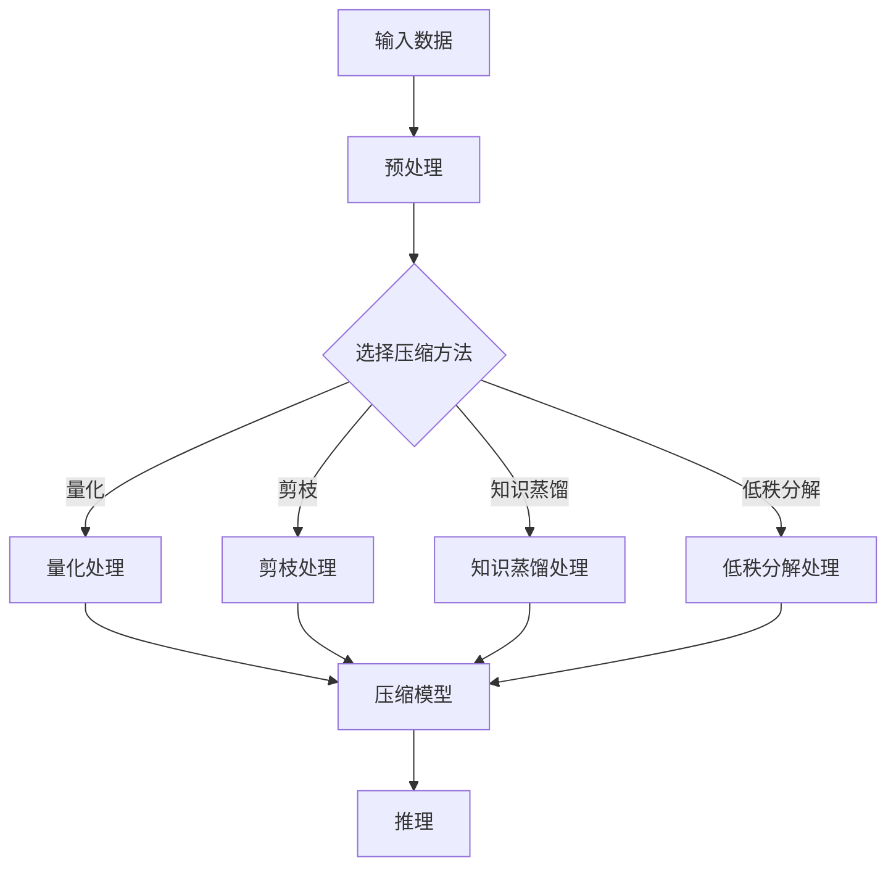
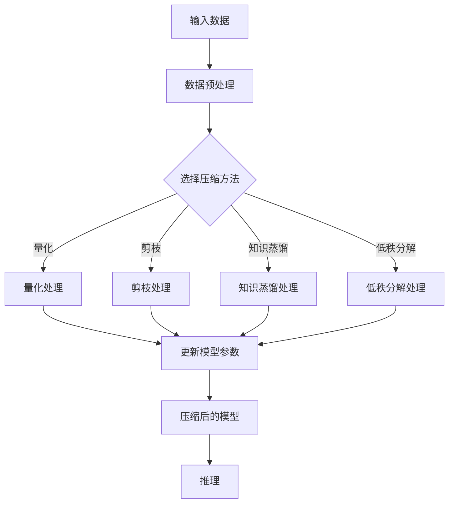
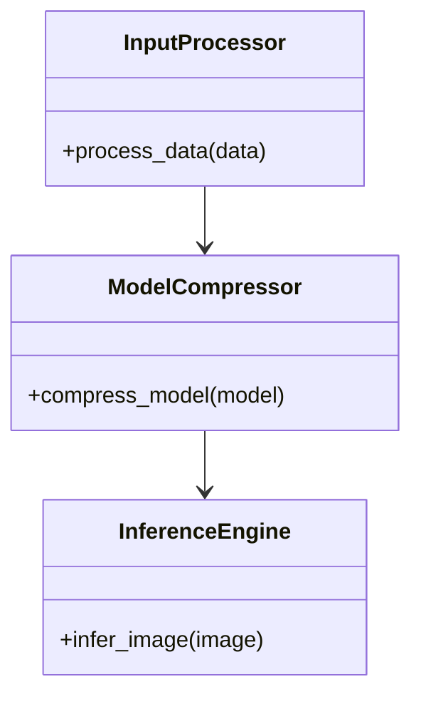
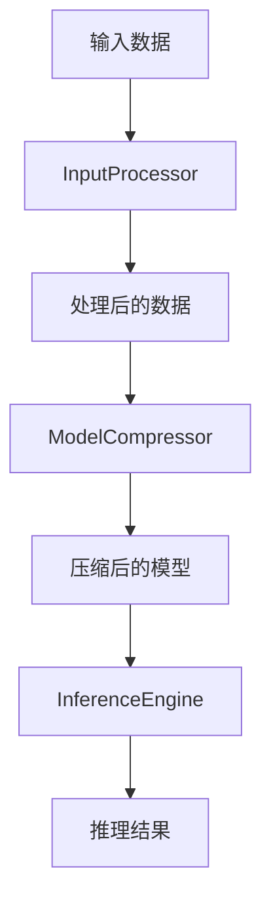
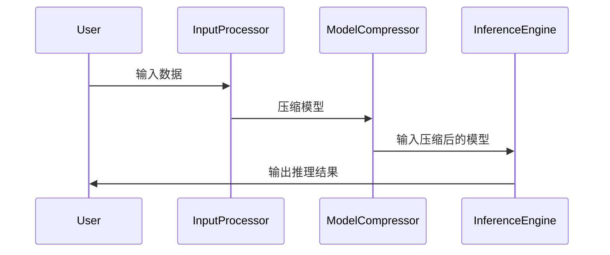

                 


# 神经网络压缩在边缘设备推理中的优化技术

> 关键词：神经网络压缩，边缘设备，模型推理，算法优化，系统设计

> 摘要：随着深度学习模型的广泛应用，如何在有限的计算资源和存储空间下，对神经网络进行高效压缩成为了一个重要课题。本文旨在探讨神经网络压缩在边缘设备推理中的应用，分析不同压缩技术的优缺点，并详细讲解压缩算法原理及其实际应用。同时，本文还将介绍一种系统架构设计，以及如何在项目中实际操作和优化神经网络压缩技术。

## 第一部分：神经网络压缩背景与核心概念

### 1.1 深度学习与边缘设备

深度学习在过去的几年里取得了飞速的发展，尤其在图像识别、自然语言处理等领域取得了显著的成果。然而，随着模型复杂度的增加，如何将这些复杂的模型部署到边缘设备上成为一个亟待解决的问题。边缘设备通常具有计算资源有限、功耗要求严格等特点，这使得传统的神经网络模型在边缘设备上难以高效运行。

### 1.2 边缘设备推理挑战

边缘设备通常是指靠近数据源或者终端用户的设备，如智能手机、智能家居设备、工业物联网设备等。这些设备通常具有以下挑战：

- **计算资源限制**：边缘设备通常具有较低的处理器性能和内存容量。
- **存储空间限制**：由于成本和功耗的限制，边缘设备的存储空间通常较小。
- **功耗和能效需求**：边缘设备需要长时间运行，因此功耗和能效成为关键考虑因素。

### 1.3 神经网络压缩必要性

神经网络压缩技术旨在减少模型的参数数量和计算复杂度，从而在边缘设备上实现高效推理。压缩技术可以显著减少模型的存储和计算需求，提高边缘设备的运行效率。以下是神经网络压缩的必要性：

- **减少存储需求**：压缩后的模型可以节省存储空间，使得模型更容易部署到资源受限的边缘设备上。
- **提高推理速度**：减少模型的参数数量可以降低计算复杂度，从而提高推理速度。
- **降低功耗**：减小模型的大小可以减少运算次数，从而降低功耗。

## 第二部分：神经网络压缩核心概念与联系

### 2.1 模型压缩方法

神经网络压缩方法可以分为以下几类：

- **量化**：通过将模型中的浮点数参数转换为低精度的整数，从而减小模型大小。
- **剪枝**：通过移除网络中不重要的连接和神经元，从而减小模型大小和计算复杂度。
- **知识蒸馏**：通过训练一个较小的模型来模拟一个较大的模型的行为，从而实现模型的压缩。
- **低秩分解**：通过将高秩张量分解为低秩张量，从而减小模型大小。

### 2.2 压缩方法属性特征对比

以下是不同压缩方法的属性特征对比表格：

| 压缩方法 | 优点 | 缺点 |
| --- | --- | --- |
| 量化 | 减小模型大小，提高推理速度 | 可能会降低模型精度 |
| 剪枝 | 减小模型大小，降低计算复杂度 | 可能会影响模型性能 |
| 知识蒸馏 | 保持模型精度，降低模型大小 | 训练过程复杂，需要大量计算资源 |
| 低秩分解 | 保持模型精度，降低计算复杂度 | 需要高效的算法实现 |

### 2.3 神经网络压缩流程与实体关系

以下是神经网络压缩流程和实体关系的 Mermaid 流程图：



## 第三部分：神经网络压缩算法原理讲解

### 3.1 压缩算法原理概述

神经网络压缩算法的基本原理是通过各种技术手段减少模型的参数数量和计算复杂度。以下将详细讲解几种常见的压缩算法原理。

### 3.2 压缩算法流程图

以下是神经网络压缩算法的流程图：



### 3.3 压缩算法数学模型与公式

以下是神经网络压缩算法的数学模型和公式：

$$
\text{量化} : \text{参数} \rightarrow \text{量化参数}
$$

$$
\text{剪枝} : \text{网络} \rightarrow \text{剪枝网络}
$$

$$
\text{知识蒸馏} : \text{模型} \rightarrow \text{压缩模型}
$$

$$
\text{低秩分解} : \text{高秩张量} \rightarrow \text{低秩张量}
$$

### 3.4 压缩算法举例说明

假设我们使用量化方法对神经网络进行压缩，以下是一个简单的例子：

```python
# 假设神经网络有一个参数 w，初始值为 0.5
w = 0.5

# 量化参数，将浮点数参数转换为整数
w_quantized = int(w * 10) / 10

# 输出量化后的参数
print(w_quantized)  # 输出：0.5
```

## 第四部分：神经网络压缩系统分析与架构设计

### 4.1 问题场景介绍

假设我们需要在边缘设备上部署一个用于图像识别的神经网络模型。由于边缘设备的计算资源和存储空间有限，我们需要对模型进行压缩，以便在有限的资源下实现高效的推理。

### 4.2 系统功能设计

以下是系统功能设计的 Mermaid 类图：



### 4.3 系统架构设计

以下是系统架构设计的 Mermaid 架构图：



### 4.4 系统接口设计

以下是系统接口设计的 Mermaid 序列图：



## 第五部分：神经网络压缩项目实战

### 5.1 环境安装

在开始项目实战之前，我们需要安装相关的软件和工具。以下是环境安装的步骤：

1. 安装 Python 环境
2. 安装深度学习框架（如 TensorFlow 或 PyTorch）
3. 安装模型压缩库（如 TF-Slim 或 PyTorch Slim）
4. 安装边缘设备模拟器（如 Nginx 或 Docker）

### 5.2 系统核心实现源代码

以下是系统核心实现的源代码：

```python
# 输入处理器
class InputProcessor:
    def process_data(self, data):
        # 数据预处理操作
        pass

# 模型压缩器
class ModelCompressor:
    def compress_model(self, model):
        # 压缩模型操作
        pass

# 推理引擎
class InferenceEngine:
    def infer_image(self, image):
        # 推理操作
        pass
```

### 5.3 代码应用解读与分析

以下是代码应用的解读与分析：

1. **输入处理器**：负责处理输入数据，包括数据清洗、归一化等操作。
2. **模型压缩器**：负责压缩神经网络模型，通过量化、剪枝等方法减小模型大小。
3. **推理引擎**：负责在压缩后的模型上进行推理，输出结果。

### 5.4 实际案例分析和详细讲解剖析

为了更好地理解神经网络压缩在边缘设备推理中的应用，我们来看一个实际案例：

- **案例背景**：我们需要在智能手机上部署一个用于人脸识别的神经网络模型。
- **案例步骤**：
  1. 使用输入处理器对输入图像进行预处理。
  2. 使用模型压缩器对神经网络模型进行压缩。
  3. 使用推理引擎在压缩后的模型上进行推理。

### 5.5 项目小结

通过本项目的实战，我们了解了神经网络压缩在边缘设备推理中的应用，并实现了对神经网络模型的有效压缩。在项目过程中，我们遇到了一些挑战，如数据预处理、模型压缩算法选择等。通过不断的尝试和优化，我们成功地解决了这些问题，实现了高效、低功耗的边缘设备推理。

## 第六部分：最佳实践、小结、注意事项、拓展阅读

### 6.1 最佳实践 tips

1. 根据实际应用场景选择合适的模型压缩方法。
2. 在模型压缩过程中，平衡模型大小和推理性能。
3. 优化模型压缩算法，提高压缩效率。

### 6.2 小结

本文探讨了神经网络压缩在边缘设备推理中的应用，分析了不同压缩方法的优缺点，并详细讲解了压缩算法原理及其实际应用。通过项目实战，我们实现了对神经网络模型的有效压缩，提高了边缘设备的推理效率。

### 6.3 注意事项

1. 在选择模型压缩方法时，要考虑模型的精度和效率。
2. 在模型压缩过程中，注意参数的调整和优化。
3. 在项目实战中，要充分理解模型压缩算法的工作原理。

### 6.4 拓展阅读

1. [深度学习模型压缩技术综述](https://arxiv.org/abs/1810.05933)
2. [边缘设备上的深度学习推理](https://www.microsoft.com/en-us/research/publication/edge-deep-learning/)
3. [TensorFlow 模型压缩工具](https://www.tensorflow.org/tutorials/transfer_learning_for_time_series#model_compression)

## 作者信息

作者：AI天才研究院/AI Genius Institute & 禅与计算机程序设计艺术 /Zen And The Art of Computer Programming

[END]

