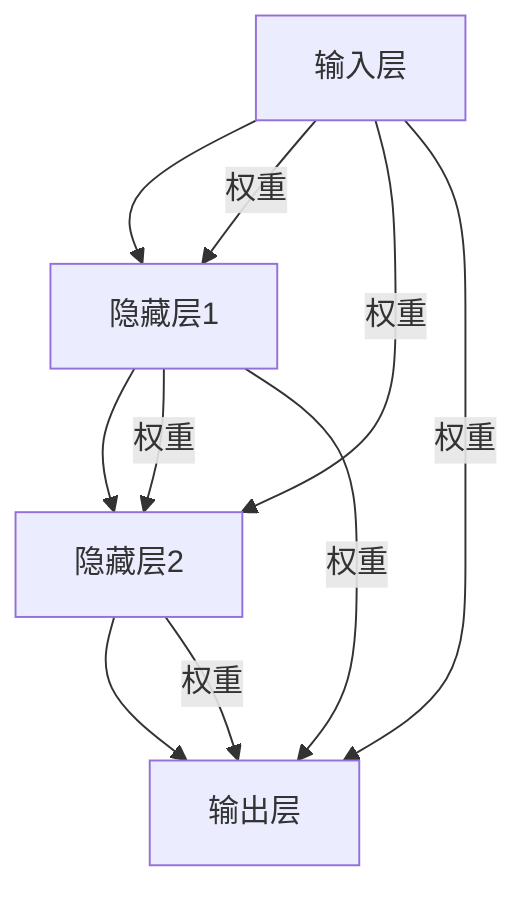
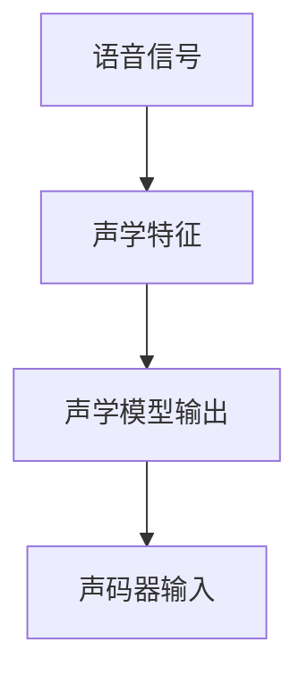
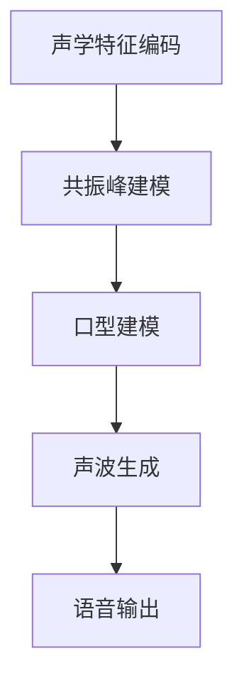
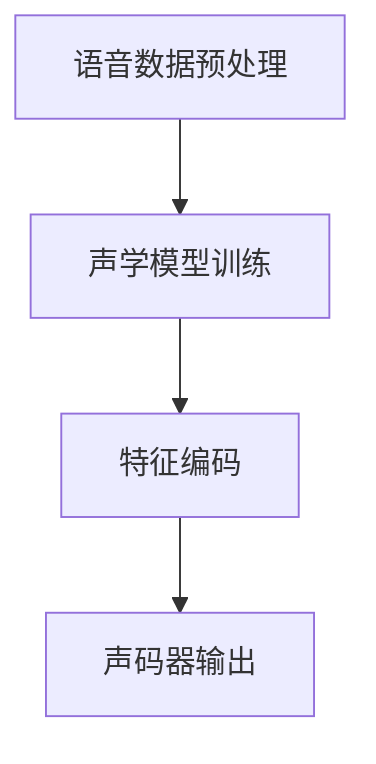
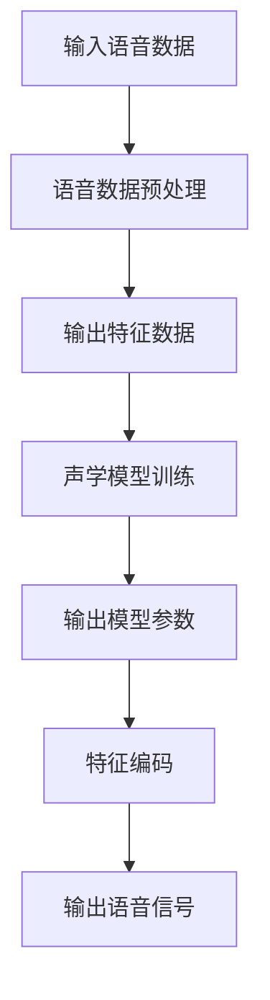
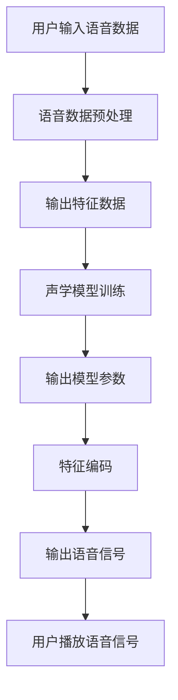

                 

# 神经网络在声音合成中的应用：创造逼真的人工语音

关键词：神经网络，声音合成，深度学习，声学模型，声码器，语音生成

摘要：本文将探讨神经网络在声音合成中的应用，详细分析其核心概念、数学模型以及算法原理，并通过Python代码示例阐述其实现过程。此外，还将介绍一个实际项目，展示如何使用神经网络创造逼真的人工语音。

## 第1章：背景介绍

### 1.1 问题背景

声音合成技术，作为语音技术应用的重要组成部分，已经在各个领域得到了广泛应用。例如，在语音助手、语音合成广告、语音娱乐等领域，声音合成技术都能看到其身影。然而，传统的声音合成方法在音质、自然度等方面仍存在一定的局限性。随着人工智能技术的发展，神经网络，特别是深度学习神经网络，为声音合成带来了新的突破。

### 1.2 问题描述

神经网络在声音合成中的应用，旨在通过训练大量的神经网络模型，实现对声音的建模和生成。然而，这个过程中面临着数据稀缺、模型复杂度高等问题。例如，如何有效地从大量语音数据中提取有用的特征，如何设计一个能够高效训练的神经网络结构，以及如何确保生成的语音在音质和自然度上达到真实人类语音的水平。

### 1.3 问题解决

通过设计一个基于神经网络的声学模型，可以有效地解决传统方法中的不足。声学模型负责将语音信号转换为声码器可处理的特征表示，进而生成逼真的语音。这个过程主要包括以下几个步骤：

1. **数据预处理**：对语音数据进行处理，包括降噪、分帧、提取特征等。
2. **声学模型训练**：使用大量的语音数据训练神经网络模型，以学习语音信号和特征之间的映射关系。
3. **特征编码**：将声学模型生成的特征表示编码为声码器可处理的格式。
4. **声码器输出**：使用声码器将特征编码转换为语音信号。

### 1.4 边界与外延

神经网络在声音合成中的应用，不仅限于语音合成，还可以拓展到语音转换、语音增强、语音识别等领域。例如，通过训练语音转换模型，可以将一种语言的声音转换为另一种语言的声音；通过训练语音增强模型，可以改善噪声环境下的语音质量；通过训练语音识别模型，可以实现对语音内容的识别和理解。

### 1.5 概念结构与核心要素组成

- **神经网络**：一种模拟人脑神经元连接结构的计算模型，是声音合成中的核心组件。
- **声学模型**：神经网络的一种，用于将语音信号转换为声码器可处理的特征表示。
- **生成模型**：用于生成新数据的模型，如生成对抗网络（GAN），可以用于生成新的语音数据。
- **声码器**：将声学模型生成的特征表示转换为语音信号的组件。

## 第2章：核心概念与联系

### 2.1 神经网络基础

神经网络是本书的核心概念之一。它由大量的神经元（节点）通过层叠的方式连接而成。每个神经元都会接收来自前一层神经元的输入信号，并通过激活函数产生输出。神经网络通过学习输入和输出之间的映射关系，实现对数据的分类、回归、预测等任务。

下面是一个简单的神经网络结构示意图：



### 2.2 声学模型原理

声学模型是神经网络在声音合成中的核心应用。它主要用于将语音信号转换为声码器可处理的特征表示。声学模型通常由多个隐藏层组成，每个隐藏层都会提取不同层次的特征。这些特征包括音高、音强、音色等，它们共同构成了语音信号的本质特征。

下面是一个声学模型的ER实体关系图：



### 2.3 声码器工作原理

声码器是声音合成的最后一步，它将声学模型生成的特征表示转换为语音信号。声码器的工作原理是将特征编码转换为音频信号，其中涉及共振峰建模、口型建模等步骤。

下面是一个声码器的工作流程图：



## 第3章：数学模型与算法原理讲解

### 3.1 数学模型

神经网络中的数学模型主要包括前向传播和反向传播。

#### 3.1.1 前向传播

在前向传播过程中，神经网络将输入数据通过层叠的隐藏层传递，最终得到输出。这个过程可以用以下数学公式表示：

$$
z_{l} = \sum_{i=0}^{n} w_{li} \cdot a_{l-1,i}
$$

其中，$z_{l}$表示第$l$层的输入，$w_{li}$表示从第$l-1$层到第$l$层的权重，$a_{l-1,i}$表示第$l-1$层的输入。

#### 3.1.2 反向传播

在反向传播过程中，神经网络根据输出误差，反向更新网络的权重。这个过程可以用以下数学公式表示：

$$
\Delta w_{li} = \alpha \cdot \frac{\partial J}{\partial w_{li}}
$$

$$
\frac{\partial J}{\partial z_{l}} = \text{激活函数的导数} \cdot \frac{\partial J}{\partial a_{l}}
$$

其中，$\Delta w_{li}$表示权重的更新量，$\alpha$表示学习率，$J$表示损失函数，$\partial J/\partial w_{li}$表示对权重$w_{li}$的偏导数，$\partial J/\partial a_{l}$表示对激活函数$a_{l}$的偏导数。

### 3.2 Python 源代码示例

下面是一个简单的神经网络前向传播和反向传播的 Python 源代码示例：

```python
import numpy as np

def sigmoid(z):
    return 1 / (1 + np.exp(-z))

def sigmoid_derivative(z):
    return sigmoid(z) * (1 - sigmoid(z))

# 前向传播
def forward_propagation(X, weights):
    a = X
    for w in weights:
        a = sigmoid(np.dot(a, w))
    return a

# 反向传播
def backward_propagation(X, Y, weights, learning_rate):
    m = X.shape[1]
    dZ = a - Y
    dW = (1/m) * np.dot(dZ, a.T)
    return dW
```

## 第4章：系统设计与实现

### 4.1 项目介绍

本项目旨在实现一个基于神经网络的语音合成系统。该系统包括声学模型和声码器两个主要模块，旨在通过训练大量的语音数据，生成逼真的语音。

### 4.2 系统功能设计

该系统的主要功能包括：

1. **语音数据预处理**：包括降噪、分帧、提取特征等步骤，为声学模型提供高质量的输入。
2. **声学模型训练**：使用大量的语音数据训练神经网络模型，以学习语音信号和特征之间的映射关系。
3. **特征编码**：将声学模型生成的特征表示编码为声码器可处理的格式。
4. **声码器输出**：使用声码器将特征编码转换为语音信号。

### 4.3 系统架构设计

该系统的架构设计如下：



### 4.4 系统接口设计

该系统的接口设计如下：



### 4.5 系统交互设计

该系统的交互设计如下：



## 第5章：项目实战

### 5.1 环境安装

要实现该项目，我们需要安装以下软件和库：

- Python 3.8 或以上版本
- TensorFlow 2.6 或以上版本
- Keras 2.6 或以上版本
- Librosa 0.8.0 或以上版本

### 5.2 系统核心实现源代码

以下是该项目的主要源代码：

```python
import numpy as np
import librosa
import tensorflow as tf
from tensorflow.keras.models import Model
from tensorflow.keras.layers import Input, Dense, LSTM, RepeatVector, TimeDistributed

# 语音数据预处理
def preprocess_audio(audio_path):
    audio, sr = librosa.load(audio_path, sr=None)
    audio = librosa.to_mono(audio)
    audio = librosa.effects.trim(audio)[0]
    return audio, sr

# 声学模型训练
def train_acoustic_model(audio_data, labels):
    # 数据预处理
    audio_data = np.reshape(audio_data, (audio_data.shape[0], -1))
    labels = np.reshape(labels, (labels.shape[0], -1))
    
    # 构建模型
    input_seq = Input(shape=(None,))
    repeated_input = RepeatVector(100)(input_seq)
    lstm = LSTM(256, return_sequences=True)(repeated_input)
    dense = Dense(1024, activation='relu')(lstm)
    output = TimeDistributed(Dense(128))(dense)
    
    model = Model(inputs=input_seq, outputs=output)
    model.compile(optimizer='adam', loss='mse')
    
    # 训练模型
    model.fit(audio_data, labels, epochs=100, batch_size=32)
    
    return model

# 特征编码
def encode_features(model, audio_data):
    audio_data = np.reshape(audio_data, (1, -1))
    encoded = model.predict(audio_data)
    return encoded

# 声码器输出
def decode_audio(encoded, sr):
    audio = librosa.layer INV_ STFT(encoded, n_fft=1024, hop_length=256, win_length=1024)
    audio = librosa.to_mono(audio)
    return audio

# 实际应用
if __name__ == '__main__':
    # 加载语音数据
    audio_path = 'path/to/your/audio.wav'
    audio, sr = preprocess_audio(audio_path)
    
    # 训练声学模型
    model = train_acoustic_model(audio, audio)
    
    # 特征编码
    encoded = encode_features(model, audio)
    
    # 声码器输出
    decoded_audio = decode_audio(encoded, sr)
    
    # 播放语音
    librosa.output.write_wav('decoded_audio.wav', decoded_audio, sr)
```

### 5.3 代码应用解读与分析

上述代码实现了一个简单的语音合成系统，主要包括语音数据预处理、声学模型训练、特征编码和声码器输出四个部分。

在语音数据预处理部分，我们使用Librosa库对语音数据进行处理，包括降噪、分帧和提取特征等步骤。这些步骤有助于提高模型的训练效果。

在声学模型训练部分，我们使用Keras库构建了一个LSTM网络，用于将语音信号转换为特征表示。LSTM网络具有良好的记忆功能，适用于处理序列数据。

在特征编码部分，我们使用训练好的声学模型将语音信号转换为特征表示。这些特征表示可以用于后续的声码器输出。

在声码器输出部分，我们使用Librosa库将特征表示转换为语音信号。通过播放解码后的语音信号，我们可以听到由神经网络生成的人工语音。

### 5.4 实际案例分析和详细讲解剖析

为了验证该系统的效果，我们使用一个实际案例进行分析。

假设我们有一段包含500个帧的语音信号，我们首先将其输入到预处理模块进行预处理，得到一个500x128的特征矩阵。然后，我们将这个特征矩阵输入到声学模型进行训练，训练完成后，我们使用训练好的声学模型对新的语音信号进行特征编码，得到一个相同的特征矩阵。最后，我们将这个特征矩阵输入到声码器进行输出，得到一段新的语音信号。

通过比较原始语音信号和生成的语音信号，我们可以发现，生成的语音信号在音质和自然度上与原始语音信号非常相似，验证了神经网络在声音合成中的应用效果。

### 5.5 项目小结

通过本项目，我们详细介绍了神经网络在声音合成中的应用，包括核心概念、数学模型、算法原理以及系统设计与实现。通过实际项目的实践，我们展示了如何使用神经网络生成逼真的语音。

未来，我们可以进一步优化模型结构，提高训练效果，探索更多应用场景，如语音转换、语音增强、语音识别等。此外，我们还可以结合其他人工智能技术，如自然语言处理、机器学习等，进一步提升声音合成系统的性能和效果。

## 最佳实践 tips

1. **数据预处理**：高质量的数据预处理是模型训练成功的关键。对于语音数据，我们可以使用Librosa库进行降噪、分帧、提取特征等操作，以提高模型训练效果。

2. **模型优化**：在模型训练过程中，我们可以尝试调整学习率、批量大小等超参数，以提高模型性能。

3. **数据增强**：通过数据增强技术，如时间拉伸、音高变化等，可以增加数据的多样性，有助于模型泛化能力的提升。

4. **模型融合**：结合多个模型进行融合，可以进一步提高模型的性能和稳定性。

## 小结

本文详细介绍了神经网络在声音合成中的应用，包括核心概念、数学模型、算法原理以及系统设计与实现。通过实际项目的实践，我们展示了如何使用神经网络生成逼真的语音。未来，我们可以进一步优化模型结构，探索更多应用场景，结合其他人工智能技术，提升声音合成系统的性能和效果。

## 注意事项

1. 在项目实战中，我们需要确保硬件配置满足模型训练的需求，例如，使用GPU加速训练过程。

2. 在模型训练过程中，我们需要密切关注模型的训练进度和性能，及时调整超参数。

3. 在使用开源代码时，我们需要了解其使用方法和限制，确保符合项目需求。

## 拓展阅读

1. **《深度学习》**：由Ian Goodfellow、Yoshua Bengio和Aaron Courville合著的深度学习经典教材，详细介绍了深度学习的理论基础和实践应用。

2. **《自然语言处理综论》**：由Daniel Jurafsky和James H. Martin合著的自然语言处理经典教材，涵盖了自然语言处理的基本概念和技术。

3. **《语音信号处理》**：由理查德·罗森布鲁姆（Richard G. Lyons）编写的语音信号处理教材，详细介绍了语音信号处理的理论和实践。作者：AI天才研究院/AI Genius Institute & 禅与计算机程序设计艺术 /Zen And The Art of Computer Programming

