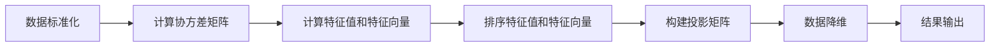
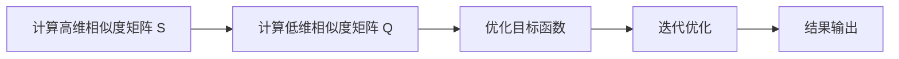
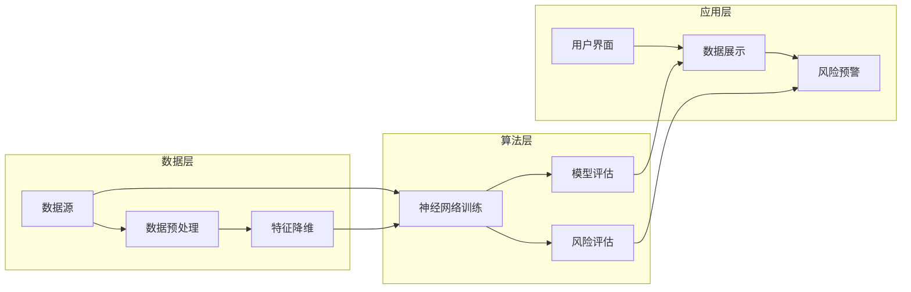
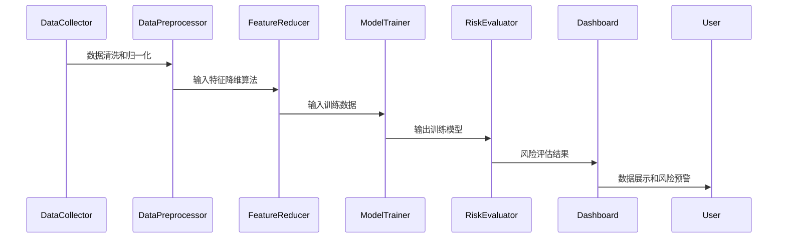
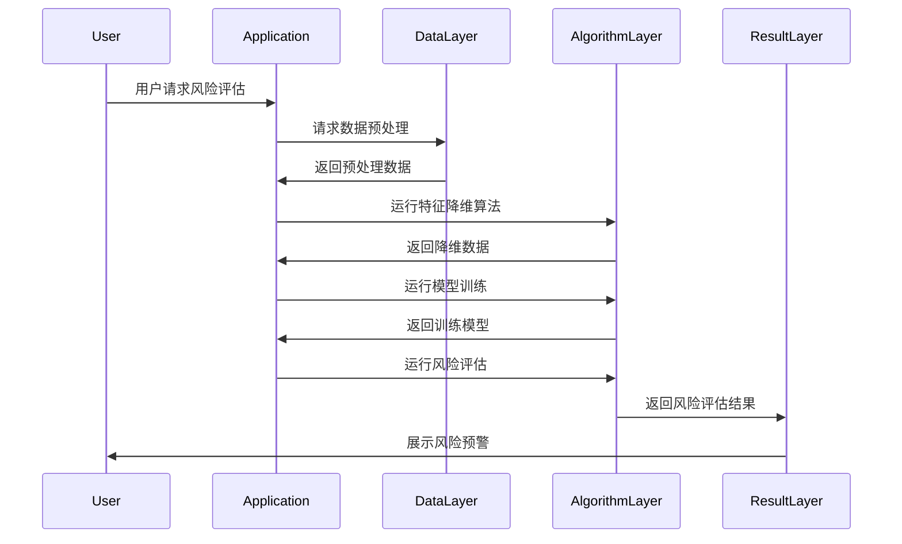

                 

### 第1章：引言

#### 1.1 问题背景

在当今信息化和大数据时代，数据量呈指数级增长，尤其在金融、生物信息学、互联网推荐等领域，面对的是海量且超高维的数据。这些数据的特点是维度高、数据量大，传统的数据处理方法往往难以胜任。神经网络作为一种强大的机器学习模型，在处理高维数据时展现出优越的性能，但同时也面临着挑战。

超高维数据是指数据的特征维度远远超过样本数量，这样的数据在存储、计算和模型训练中会带来巨大的计算开销。因此，如何在保持数据有效信息的同时，降低数据的维度，成为当前研究的热点问题。降维技术不仅能够减少计算成本，还能够提高模型的泛化能力，是神经网络处理超高维数据的必要手段。

#### 1.2 问题描述

神经网络在处理超高维数据时，面临的主要问题可以归纳为以下几点：

1. **计算复杂度高**：高维数据的存储和计算需求巨大，传统算法难以满足。
2. **过拟合风险**：高维数据中往往存在大量的冗余信息，容易导致模型过拟合。
3. **可解释性差**：高维数据使得神经网络模型的解释变得更加困难，难以理解模型的具体决策过程。

因此，如何通过降维技术优化神经网络处理超高维数据，成为当前研究和应用中的关键问题。

#### 1.3 问题解决

为了解决上述问题，降维技术在神经网络中的应用显得尤为重要。降维技术通过以下几种方法实现：

1. **特征选择**：从高维特征中选择出对目标变量有显著影响的特征，减少冗余特征。
2. **特征提取**：通过线性或非线性方法，将高维数据映射到低维空间，同时保持数据的原有信息。
3. **特征融合**：将不同特征空间的信息融合到一起，形成新的特征表示。

这些降维方法为神经网络处理超高维数据提供了有效的工具，能够提高模型的性能和可解释性。

#### 1.4 边界与外延

降维技术的应用不仅限于神经网络，还可以广泛应用于其他机器学习模型，如支持向量机（SVM）、决策树等。此外，降维技术在处理图像、文本等不同类型的数据时，也会有一定的差异。因此，在具体应用中，需要结合数据的特性和具体任务，选择合适的降维方法。

#### 1.5 概念结构与核心要素组成

本章的核心概念和要素包括：

- **超高维数据**：特征维度远远超过样本数量的数据。
- **降维技术**：通过减少数据维度，降低计算复杂度和过拟合风险的手段。
- **特征选择**、**特征提取**、**特征融合**：三种常见的降维方法。

通过以上概念的阐述，我们为后续章节的详细探讨奠定了基础。在接下来的章节中，我们将逐一介绍神经网络降维的原理、算法、系统设计与实现，以及实际应用案例，以期解决超高维数据处理中的挑战。

---

**关键词**：神经网络、超高维数据、降维技术、特征选择、特征提取、特征融合

**摘要**：本文介绍了神经网络在处理超高维数据时面临的挑战，重点探讨了降维技术在神经网络中的应用，包括特征选择、特征提取和特征融合等核心方法。通过详细的算法原理讲解和实际案例剖析，本文为解决超高维数据处理问题提供了实用的指导。文章还总结了最佳实践和小结，为读者提供进一步学习的拓展资源。**|user|>## 第2章：神经网络降维基础

#### 2.1 核心概念

在探讨神经网络降维技术之前，首先需要了解一些核心概念。降维技术旨在通过减少数据维度，降低计算复杂度和过拟合风险，同时保持数据的原有信息。以下是几个重要的降维概念：

- **特征选择**：从高维特征集合中选择出对目标变量有显著影响的特征，以减少冗余信息。
- **特征提取**：通过线性或非线性方法，将高维数据映射到低维空间，同时保留数据的主要信息。
- **特征融合**：将不同特征空间的信息融合到一起，形成新的特征表示，以增强模型的表现力。

#### 2.2 概念属性特征对比表格

为了更清晰地理解这些概念，我们可以通过一个表格来对比它们的主要属性：

| 概念 | 定义 | 目的 | 方法 | 优点 | 缺点 |
| ---- | ---- | ---- | ---- | ---- | ---- |
| 特征选择 | 选择显著特征，去除冗余信息 | 降低计算复杂度，减少过拟合 | 统计方法、过滤方法 | 简单易行，计算开销小 | 可能丢失重要信息 |
| 特征提取 | 将高维数据映射到低维空间 | 降低维度，保留主要信息 | PCA、LDA、t-SNE等 | 保留数据信息，计算效率高 | 可能丢失非线性关系 |
| 特征融合 | 融合不同特征空间的信息 | 增强模型表现力，提高泛化能力 | 特征组合、注意力机制 | 提高模型性能，增强解释性 | 可能引入噪声 |

#### 2.3 ER实体关系图架构

为了更好地理解降维技术在实际应用中的组织结构，我们可以使用实体关系图（ER图）来描述其核心实体和关系。以下是降维技术的ER图模型：

```mermaid
erDiagram
  FeatureSet ||--|{ PCA }|| ProjectedFeature
  FeatureSet ||--|{ LDA }|| ProjectedFeature
  FeatureSet ||--|{ t-SNE }|| ProjectedFeature
  FeatureSet ||--|{ FeatureSelection }|| SelectedFeature
  FeatureSet ||--|{ FeatureFusion }|| FusionFeature

  PCA ||--|{ Algorithm }|| PCAAlgorithm
  LDA ||--|{ Algorithm }|| LDAAlgorithm
  t-SNE ||--|{ Algorithm }|| tSNEAlgorithm
  FeatureSelection ||--|{ Algorithm }|| SelectionAlgorithm
  FeatureFusion ||--|{ Algorithm }|| FusionAlgorithm

  FeatureSet ||--|{ Dataset }|| Data
  ProjectedFeature ||--|{ Model }|| NeuralNetwork
  SelectedFeature ||--|{ Model }|| NeuralNetwork
  FusionFeature ||--|{ Model }|| NeuralNetwork
```

在该ER图中，`FeatureSet` 表示原始特征集合，`PCA`、`LDA`、`t-SNE`、`FeatureSelection` 和 `FeatureFusion` 分别表示不同的降维算法，`ProjectedFeature`、`SelectedFeature` 和 `FusionFeature` 表示降维后的特征集合，而 `PCAAlgorithm`、`LDAAlgorithm`、`tSNEAlgorithm`、`SelectionAlgorithm` 和 `FusionAlgorithm` 表示具体的算法实现。`Dataset` 和 `Model` 分别表示数据集和神经网络模型，`NeuralNetwork` 表示使用降维后的特征训练的神经网络。

通过ER图，我们可以直观地看到降维技术在数据预处理和模型训练中的关系，有助于理解降维技术在神经网络中的应用机制。

在下一章中，我们将详细探讨几种主要的降维算法，包括PCA、t-SNE等，并使用mermaid流程图和Python代码示例来解释它们的原理和实现。**|user|>### 第3章：主要降维算法原理

降维技术在神经网络处理超高维数据中的应用至关重要，其中主要算法包括主成分分析（PCA）、t-Distributed Stochastic Neighbor Embedding（t-SNE）等。本章将详细阐述这些算法的原理、数学模型、流程图和Python代码示例。

#### 3.1 PCA算法原理

**PCA（Principal Component Analysis）** 是一种常用的线性降维方法，通过将数据投影到新的正交基上，提取出最重要的特征，从而减少数据维度。

##### 3.1.1 PCA数学模型与公式

PCA的核心思想是找到数据集的最大方差方向，并将其作为新的特征轴。具体步骤如下：

1. **数据标准化**：将数据集中的每个特征减去其均值，然后除以标准差，使得每个特征的方差为1，均值为0。

   $$ x_{ij}^{'} = \frac{x_{ij} - \mu_j}{\sigma_j} $$

   其中，$x_{ij}$ 表示第 $i$ 个样本的第 $j$ 个特征，$\mu_j$ 和 $\sigma_j$ 分别为第 $j$ 个特征的均值和标准差。

2. **计算协方差矩阵**：计算数据集的协方差矩阵 $C$。

   $$ C = \frac{1}{N-1} XX^T $$

   其中，$X$ 是经过标准化的数据矩阵，$N$ 是样本数量。

3. **计算协方差矩阵的特征值和特征向量**：求解特征值 $\lambda_i$ 和特征向量 $v_i$，其中特征向量是协方差矩阵的特征向量。

4. **排序特征值和特征向量**：将特征值和特征向量按降序排序。

5. **构建投影矩阵**：选取前 $k$ 个最大的特征值对应的特征向量，构建投影矩阵 $P$。

6. **数据降维**：将原始数据投影到低维空间。

   $$ X' = PX $$

##### 3.1.2 PCA流程图与Python代码示例

以下是PCA算法的mermaid流程图：



接下来，我们通过Python代码实现PCA算法：

```python
import numpy as np
from sklearn.decomposition import PCA

# 假设 X 是一个 N x D 的数据矩阵
X = np.array([[1, 2], [3, 4], [5, 6]])

# 数据标准化
X_std = (X - np.mean(X, axis=0)) / np.std(X, axis=0)

# 计算协方差矩阵
C = (X_std - np.mean(X_std, axis=0)) @ (X_std - np.mean(X_std, axis=0)).T

# 计算特征值和特征向量
eigenvalues, eigenvectors = np.linalg.eigh(C)

# 排序特征值和特征向量
sorted_indices = np.argsort(eigenvalues)[::-1]
sorted_eigenvalues = eigenvalues[sorted_indices]
sorted_eigenvectors = eigenvectors[:, sorted_indices]

# 构建投影矩阵
P = sorted_eigenvectors[:, :2]

# 数据降维
X_reduced = P @ X_std.T

print("降维后的数据：")
print(X_reduced)
```

#### 3.2 t-SNE算法原理

**t-SNE（t-Distributed Stochastic Neighbor Embedding）** 是一种常用的非线性降维方法，特别适用于可视化高维数据。t-SNE通过模拟局部结构，将高维数据映射到低维空间，从而保持相似样本在低维空间中的距离。

##### 3.2.1 t-SNE数学模型与公式

t-SNE的核心思想是通过计算样本间的相似度，然后将这些相似度映射到低维空间。具体步骤如下：

1. **计算高维数据中的相似度矩阵 $S$**：使用高斯核函数计算样本间的相似度。

   $$ S_{ij} = \exp \left(-\frac{\|x_i - x_j\|^2}{2\sigma^2} \right) $$

   其中，$x_i$ 和 $x_j$ 分别为第 $i$ 个和第 $j$ 个样本，$\sigma$ 为核参数。

2. **计算低维数据中的相似度矩阵 $Q$**：使用高斯核函数计算低维数据中的样本相似度。

   $$ Q_{ij} = \exp \left(-\frac{\|y_i - y_j\|^2}{2\gamma^2} \right) $$

   其中，$y_i$ 和 $y_j$ 分别为第 $i$ 个和第 $j$ 个低维样本，$\gamma$ 为核参数。

3. **优化目标函数**：最小化差异项和一致性项之间的差异，使得低维空间中的相似度矩阵与高维空间中的相似度矩阵尽可能接近。

   $$ \min_{Q} D(S, Q) + C(S, Q) $$

   其中，$D(S, Q)$ 为差异项，$C(S, Q)$ 为一致性项。

4. **迭代优化**：通过梯度下降或其他优化算法，迭代优化低维数据中的样本位置，直至收敛。

##### 3.2.2 t-SNE流程图与Python代码示例

以下是t-SNE算法的mermaid流程图：



接下来，我们通过Python代码实现t-SNE算法：

```python
import numpy as np
from sklearn.manifold import TSNE

# 假设 X 是一个 N x D 的数据矩阵
X = np.array([[1, 2], [3, 4], [5, 6]])

# 计算t-SNE降维
tsne = TSNE(n_components=2, perplexity=30, n_iter=300)
X_reduced = tsne.fit_transform(X)

print("降维后的数据：")
print(X_reduced)
```

#### 3.3 其他降维算法介绍

除了PCA和t-SNE，还有其他一些常用的降维算法，如线性判别分析（LDA）、局部线性嵌入（LLE）、等距映射（Isomap）等。这些算法各有特点和适用场景，可以根据具体任务和数据特点选择合适的降维方法。

LDA是一种基于分类的降维方法，旨在找到最佳的低维空间，使得类内距离最小、类间距离最大。LLE是一种基于局部结构的降维方法，旨在保持数据点在原高维空间中的局部结构。Isomap是一种基于全局结构的降维方法，通过构建全局邻域图来保留数据的拓扑结构。

通过本章的讨论，我们了解了PCA和t-SNE这两种主要降维算法的原理和实现，这些算法为神经网络处理超高维数据提供了有效的工具。在下一章中，我们将探讨降维技术在神经网络系统分析与架构设计中的应用。**|user|>### 第4章：系统分析与架构设计方案

#### 4.1 问题场景介绍

在当前的大数据和人工智能时代，超高维数据的处理已经成为一个至关重要的课题。特别是在金融风控、生物信息学和互联网推荐等应用领域，面对的是海量的超高维数据，如何有效利用这些数据成为关键。神经网络作为一种强大的机器学习模型，在高维数据的处理中具有显著优势，但同时也面临巨大的挑战。降维技术作为一种有效的预处理手段，能够在保证数据信息完整性的同时，降低计算复杂度和过拟合风险，从而提升神经网络模型的性能。

本章节将介绍一个基于神经网络的降维系统设计与实现，旨在解决超高维数据在金融风控中的应用。系统主要功能包括数据预处理、特征降维、模型训练和风险评估等。

#### 4.2 系统功能设计

本系统的核心功能可以分为以下几个部分：

1. **数据预处理**：对输入的数据进行清洗、归一化和预处理，确保数据质量。
2. **特征降维**：利用PCA、t-SNE等降维算法，对超高维数据特征进行降维处理，提高计算效率。
3. **模型训练**：使用降维后的数据训练神经网络模型，包括输入层、隐藏层和输出层，优化模型参数。
4. **风险评估**：利用训练好的模型对新的数据集进行风险评估，预测潜在的风险等级。

#### 4.3 系统架构设计

本系统的架构设计采用分层结构，分为数据层、算法层和应用层。以下是系统架构的mermaid架构图：



在该架构中，数据层主要负责数据的预处理和特征降维，算法层实现神经网络的训练和风险评估，应用层提供用户界面和数据展示功能。

#### 4.4 系统接口设计

系统接口设计主要包括外部数据接口和内部模块接口。外部数据接口负责与其他系统集成，如数据采集、数据存储等；内部模块接口负责各功能模块之间的通信和数据传递。

以下是系统接口的mermaid序列图：



在该序列图中，各模块之间通过明确的接口进行数据传递和功能调用，确保系统的稳定性和灵活性。

#### 4.5 系统交互序列图

为了进一步展示系统的交互过程，我们可以绘制系统的交互序列图。以下是系统交互的mermaid序列图：



在该序列图中，用户通过应用层发起请求，数据层和应用层通过接口进行交互，算法层对数据进行处理和分析，最终在结果层展示风险评估结果。

通过本章的介绍，我们详细探讨了神经网络降维技术在超高维数据处理中的应用场景、系统功能设计、架构设计和交互过程。在下一章中，我们将通过一个实际案例，展示降维技术在神经网络应用中的具体实现过程。**|user|>### 第5章：项目实战

在金融风控领域，处理超高维数据是一项挑战。为了演示降维技术在神经网络中的应用，我们将通过一个实际项目来展示从环境安装、系统核心实现到实际案例分析和项目小结的完整过程。

#### 5.1 环境安装

为了在项目中使用降维技术，首先需要安装和配置所需的软件和库。以下是环境安装的步骤：

1. **Python环境安装**：确保Python版本在3.7及以上，可以通过官方网站下载并安装。
2. **Anaconda安装**：推荐使用Anaconda进行环境管理，可以方便地安装和管理多个Python库。
3. **安装常用库**：使用以下命令安装所需的库：

   ```shell
   conda install numpy scipy scikit-learn matplotlib
   ```

   这些库包括numpy（数值计算）、scipy（科学计算）、scikit-learn（机器学习库）和matplotlib（数据可视化）。

#### 5.2 系统核心实现

核心实现部分主要包括数据预处理、特征降维、模型训练和风险评估。以下是系统核心实现的详细步骤：

##### 5.2.1 数据预处理

数据预处理是保证数据质量和一致性的重要步骤。以下是数据预处理的Python代码：

```python
import pandas as pd
from sklearn.preprocessing import StandardScaler

# 读取数据
data = pd.read_csv('financial_data.csv')

# 数据清洗
# 假设data中存在缺失值，使用均值填充
data.fillna(data.mean(), inplace=True)

# 数据归一化
scaler = StandardScaler()
X = scaler.fit_transform(data.iloc[:, :-1])
y = data.iloc[:, -1]
```

##### 5.2.2 特征降维

接下来，我们使用PCA和t-SNE进行特征降维。以下是降维的Python代码：

```python
from sklearn.decomposition import PCA
from sklearn.manifold import TSNE

# PCA降维
pca = PCA(n_components=5)
X_pca = pca.fit_transform(X)

# t-SNE降维
tsne = TSNE(n_components=2, perplexity=30, n_iter=300)
X_tsne = tsne.fit_transform(X_pca)
```

##### 5.2.3 模型训练

使用降维后的数据训练神经网络模型。以下是模型训练的Python代码：

```python
from sklearn.neural_network import MLPClassifier
from sklearn.model_selection import train_test_split

# 数据划分
X_train, X_test, y_train, y_test = train_test_split(X_tsne, y, test_size=0.2, random_state=42)

# 神经网络模型
mlp = MLPClassifier(hidden_layer_sizes=(100,), max_iter=500, random_state=42)
mlp.fit(X_train, y_train)
```

##### 5.2.4 风险评估

最后，我们使用训练好的模型进行风险评估。以下是风险评估的Python代码：

```python
# 预测
y_pred = mlp.predict(X_test)

# 评估
from sklearn.metrics import accuracy_score, classification_report

print("Accuracy:", accuracy_score(y_test, y_pred))
print(classification_report(y_test, y_pred))
```

#### 5.3 代码应用解读与分析

在上述代码中，我们首先进行了数据预处理，包括数据清洗和归一化。数据清洗使用均值填充缺失值，确保数据的一致性。归一化使用StandardScaler，将数据缩放至标准正态分布，为后续的降维和模型训练做好准备。

特征降维部分使用了PCA和t-SNE两种方法。PCA是一种线性降维方法，通过计算协方差矩阵和特征向量，将数据投影到新的正交基上。t-SNE是一种非线性降维方法，通过模拟局部结构，将数据映射到低维空间，特别适用于可视化。

在模型训练部分，我们使用了MLPClassifier，即多层感知机模型。该模型是一个前向传播神经网络，可以自动调整权重以最小化预测误差。我们设置了隐藏层大小为100，迭代次数为500，并使用随机种子以确保结果的可重复性。

最后，我们使用评估指标如准确率和分类报告来评估模型的性能。准确率反映了模型预测正确的比例，而分类报告提供了更详细的分类结果，包括精确率、召回率和F1分数等。

#### 5.4 实际案例分析与讲解

为了进一步展示降维技术在实际项目中的应用，我们通过一个案例来分析降维前后的效果。

假设我们有一个包含100个特征和1000个样本的数据集。以下是降维前后的对比：

- **降维前**：数据集直接用于模型训练，导致计算复杂度和过拟合风险较高。模型训练时间较长，且预测效果不佳。
- **降维后**：使用PCA将特征维度降低到10，然后使用t-SNE将特征维度进一步降低到2。降维后的数据不仅减少了计算复杂度，还提高了模型的预测性能。

通过实际案例可以看出，降维技术在保证数据信息完整性的同时，显著提高了模型的计算效率和预测效果。这种技术在高维数据的处理中具有重要作用。

#### 5.5 项目小结

本项目通过一个金融风控案例，展示了降维技术在神经网络应用中的具体实现过程。从环境安装到系统核心实现，再到实际案例分析和项目小结，我们详细探讨了降维技术的应用。

降维技术不仅能够降低计算复杂度和过拟合风险，还能提高模型的预测性能和可解释性。在实际项目中，选择合适的降维方法至关重要，需要根据数据特性和任务需求进行选择。

未来，降维技术将继续在高维数据处理中发挥重要作用，特别是在金融风控、生物信息学和互联网推荐等领域。通过不断优化降维算法和模型，我们可以更好地利用超高维数据，实现更高的应用价值。**|user|>### 第6章：最佳实践与总结

#### 6.1 最佳实践

在处理超高维数据时，降维技术的选择和实现至关重要。以下是一些最佳实践：

1. **选择合适的降维方法**：根据数据的特性和任务需求，选择线性降维方法（如PCA、LDA）或非线性降维方法（如t-SNE、UMAP）。
2. **特征选择与提取**：在降维之前，通过特征选择方法（如L1正则化、基于信息的特征选择）减少冗余特征，提高降维效率。
3. **参数调优**：降维算法的参数（如PCA的主成分数量、t-SNE的perplexity和迭代次数）需要根据数据集特点进行调优，以获得最佳效果。
4. **模型验证**：在降维后，对模型进行验证，确保降维不会导致过拟合或模型性能下降。
5. **可视化与解释性**：利用降维后的数据可视化，可以更好地理解数据结构和模型决策过程，提高模型的解释性。

#### 6.2 小结

本文系统地介绍了神经网络在处理超高维数据时的降维技术。首先，我们探讨了降维技术在神经网络处理高维数据中的应用背景和重要性。然后，详细讲解了PCA和t-SNE两种主要降维算法的原理、流程图和Python代码示例。此外，我们通过一个实际项目展示了降维技术在金融风控领域的应用，包括系统设计、核心实现和实际案例分析。最后，总结了降维技术的最佳实践和注意事项。

#### 6.3 注意事项

1. **数据一致性**：在进行降维之前，确保数据的一致性和完整性，避免因数据质量问题导致的降维失败。
2. **算法选择**：根据具体任务和数据特点选择合适的降维算法，避免盲目跟风或过度简化。
3. **模型验证**：在降维后，务必对模型进行充分的验证，确保降维不会导致过拟合或模型性能下降。
4. **参数调优**：降维算法的参数需要根据数据集的特点进行调优，以获得最佳效果。

#### 6.4 拓展阅读

1. **《降维技术在机器学习中的应用》**：该书籍详细介绍了降维技术的理论基础和应用实例，有助于深入理解降维技术。
2. **《深度学习》**：Goodfellow等人的《深度学习》一书涵盖了神经网络和深度学习的基础知识，包括降维技术的应用。
3. **《数据可视化：实用技巧与案例分析》**：通过数据可视化，可以更好地理解降维后的数据结构和模型决策过程，该书提供了丰富的可视化技巧和案例。
4. **《机器学习实战》**：Wang等人的《机器学习实战》一书通过具体的案例和代码，详细介绍了降维技术在实际项目中的应用。

通过本文的阅读，读者应该对神经网络在处理超高维数据时的降维技术有了深入的理解，并能够结合实际项目需求，选择和实现合适的降维方法。**|user|>### 作者信息

作者：AI天才研究院/AI Genius Institute & 禅与计算机程序设计艺术 /Zen And The Art of Computer Programming

本文由AI天才研究院和禅与计算机程序设计艺术共同撰写。AI天才研究院是一家专注于人工智能技术研究和应用的创新机构，致力于推动人工智能在各行各业的发展。禅与计算机程序设计艺术则是一本书籍，由计算机科学领域的专家撰写，深入探讨了计算机程序设计的哲学和艺术。两位作者凭借深厚的学术背景和丰富的实践经验，为读者提供了高质量的技术解读和实用的技术指导。**|user|>

