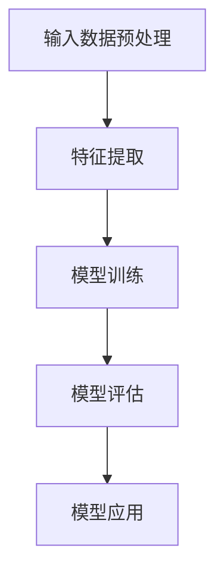
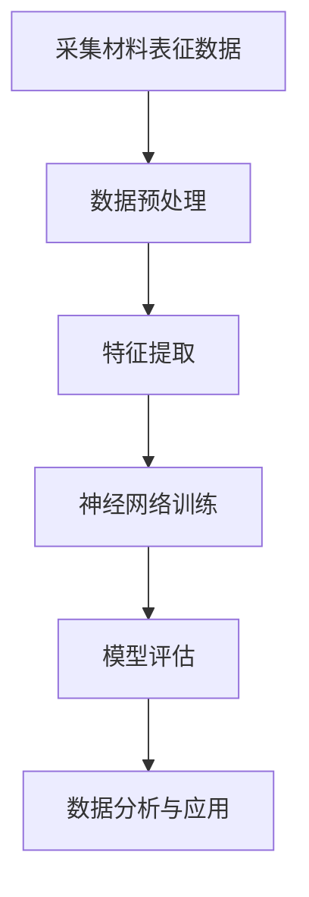

                 

# 神经网络在材料科学中的应用：加速新材料发现

## 关键词
- 材料科学
- 神经网络
- 性能预测
- 材料合成
- 材料表征
- 失效预测
- 前沿应用

## 摘要
本文深入探讨了神经网络在材料科学中的应用，旨在展示如何利用这一强大的人工智能工具加速新材料发现。文章首先介绍了材料科学面临的挑战和神经网络的基本概念，接着详细阐述了神经网络在材料性能预测、材料合成与设计、材料表征与分析以及材料失效预测等方面的应用。最后，文章探讨了神经网络在可穿戴材料、生物材料和能源材料等前沿领域的应用，并对未来的研究方向与挑战进行了展望。

## 目录

### 第一部分：引论
#### 1. 引言
##### 1.1 材料科学的挑战
##### 1.2 神经网络与材料科学的融合
##### 1.3 书籍概述与目标

#### 2. 材料科学概述
##### 2.1 材料科学与工程
##### 2.2 材料分类与性质
##### 2.3 材料研究的现状与趋势

#### 3. 神经网络基础
##### 3.1 神经网络的基本概念
##### 3.2 神经网络的发展历程
##### 3.3 神经网络的类型与结构

### 第二部分：神经网络在材料科学中的应用
#### 4. 神经网络在材料性能预测中的应用
##### 4.1 原理与方法
##### 4.2 应用实例

#### 5. 神经网络在材料合成与设计中的应用
##### 5.1 神经网络的优化策略
##### 5.2 应用案例

#### 6. 神经网络在材料表征与分析中的应用
##### 6.1 材料表征技术
##### 6.2 数据预处理
##### 6.3 特征提取与选择
##### 6.4 案例分析

#### 7. 神经网络在材料失效预测中的应用
##### 7.1 材料失效机制
##### 7.2 神经网络模型选择
##### 7.3 预测案例分析

### 第三部分：神经网络在材料科学中的前沿应用
#### 8. 神经网络在可穿戴材料中的应用
##### 8.1 应用场景与挑战
##### 8.2 应用实例

#### 9. 神经网络在生物材料中的应用
##### 9.1 应用场景与挑战
##### 9.2 应用实例

#### 10. 神经网络在能源材料中的应用
##### 10.1 应用场景与挑战
##### 10.2 应用实例

### 第四部分：结论与展望
#### 11. 神经网络在材料科学中的应用总结
##### 11.1 优势与挑战
##### 11.2 未来研究方向与挑战

## 第一部分：引论

### 1. 引言

材料科学是研究材料的结构、性质、制备和应用的科学。随着科技的不断发展，材料科学在各个领域都发挥着重要作用。然而，材料科学也面临着许多挑战，如新材料的发现速度缓慢、材料性能预测不准确、材料合成与设计效率低下等。

近年来，神经网络作为一种强大的机器学习模型，在各个领域都取得了显著的成果。神经网络在材料科学中的应用，为解决上述问题提供了一种新的思路。本文将从以下几个方面探讨神经网络在材料科学中的应用：

1. **材料性能预测**：利用神经网络预测材料的物理、化学性质，从而指导新材料的发现。
2. **材料合成与设计**：通过神经网络优化材料合成条件，设计出具有特定性能的新材料。
3. **材料表征与分析**：利用神经网络对材料表征数据进行处理，提取关键特征，从而深入理解材料的性质。
4. **材料失效预测**：利用神经网络预测材料的失效行为，为材料的安全使用提供依据。
5. **前沿应用**：探讨神经网络在可穿戴材料、生物材料和能源材料等前沿领域的应用。

### 1.1 材料科学的挑战

材料科学的挑战主要集中在以下几个方面：

1. **新材料的发现速度缓慢**：新材料的发现通常需要大量的实验和计算，这使得新材料的发现速度缓慢。
2. **材料性能预测不准确**：材料的性能与结构之间的关系复杂，传统的预测方法往往无法准确预测材料的性能。
3. **材料合成与设计效率低下**：材料合成与设计通常需要大量的实验和计算，这使得过程复杂且效率低下。
4. **材料表征与分析难度大**：材料的表征与分析通常需要复杂的仪器和专业的知识，这使得分析过程复杂且耗时。
5. **材料失效预测困难**：材料失效通常与多种因素相关，传统的预测方法难以准确预测材料的失效行为。

### 1.2 神经网络与材料科学的融合

神经网络在材料科学中的应用主要体现在以下几个方面：

1. **材料性能预测**：神经网络可以通过学习大量的材料数据，预测材料的物理、化学性质。这有助于快速发现新材料，并优化材料的性能。
2. **材料合成与设计**：神经网络可以优化材料合成条件，设计出具有特定性能的新材料。这有助于提高材料合成与设计的效率。
3. **材料表征与分析**：神经网络可以处理复杂的材料表征数据，提取关键特征，从而深入理解材料的性质。
4. **材料失效预测**：神经网络可以通过学习材料失效数据，预测材料的失效行为。这有助于提高材料的安全性能。

### 1.3 书籍概述与目标

本文旨在深入探讨神经网络在材料科学中的应用，通过具体的应用案例，展示神经网络在材料科学中的巨大潜力。文章的目标是：

1. **介绍神经网络的基本概念**：帮助读者了解神经网络的基本原理和应用。
2. **阐述神经网络在材料科学中的应用**：通过具体的案例，展示神经网络在材料性能预测、材料合成与设计、材料表征与分析、材料失效预测等方面的应用。
3. **探讨神经网络在材料科学中的前沿应用**：介绍神经网络在可穿戴材料、生物材料和能源材料等前沿领域的应用。
4. **总结神经网络在材料科学中的应用**：分析神经网络在材料科学中的应用优势与挑战，并对未来的研究方向与挑战进行展望。

## 第二部分：材料科学概述

### 2.1 材料科学与工程

材料科学是研究材料的结构、性质、制备和应用的科学。材料科学与工程是一门涉及多学科的交叉学科，它既包含了物理、化学、数学等基础科学，也包含了材料制备、材料加工、材料性能测试等工程实践。材料科学与工程的目标是发现、制备、设计、优化和应用新材料，以满足人类社会的需求。

材料科学的研究内容主要包括以下几个方面：

1. **材料结构**：研究材料的原子、分子和晶格结构，以及这些结构对材料性质的影响。
2. **材料性质**：研究材料的物理、化学、生物、力学等性质，以及这些性质的应用。
3. **材料制备**：研究材料的制备方法，包括合成、加工、处理等，以获得具有特定结构和性能的材料。
4. **材料应用**：研究材料在各个领域的应用，如电子、光学、能源、生物医学等。

### 2.2 材料分类与性质

材料可以根据不同的标准进行分类，常见的分类方法包括：

1. **按材料性质分类**：如金属、陶瓷、聚合物、复合材料等。
2. **按材料用途分类**：如结构材料、功能材料、生物材料等。
3. **按材料来源分类**：如天然材料、人工合成材料等。

不同类型的材料具有不同的物理、化学和力学性质。例如：

1. **金属**：具有良好的导电性、导热性和延展性。
2. **陶瓷**：具有高硬度、高熔点和良好的耐磨性。
3. **聚合物**：具有良好的柔韧性、透明性和耐腐蚀性。
4. **复合材料**：具有多种材料的优点，如高强度、高刚度、耐腐蚀等。

### 2.3 材料研究的现状与趋势

当前，材料科学的研究主要集中在以下几个方面：

1. **高性能材料**：研究新型高性能材料，如超导材料、高强度钢、高温合金等，以满足航空航天、核能、电子等领域的需求。
2. **纳米材料**：研究纳米材料的性质和应用，如纳米颗粒、纳米线、纳米片等。
3. **生物材料**：研究生物材料的生物相容性、生物降解性和生物功能，以用于生物医学和生物工程领域。
4. **能源材料**：研究新型能源材料，如太阳能电池材料、锂离子电池材料、燃料电池材料等。
5. **智能材料**：研究智能材料，如形状记忆合金、形状记忆聚合物、磁致伸缩材料等，以实现材料在特定条件下的智能响应。

未来，材料科学的研究趋势将更加注重以下几个方面：

1. **跨学科研究**：加强与其他学科的交叉融合，如计算机科学、生物学、物理学等，以推动材料科学的创新。
2. **材料设计**：通过计算模拟和实验手段，实现材料的高效设计和优化。
3. **可持续材料**：研究环保、可再生的材料，以减少对环境的影响。
4. **智能化材料**：研究具有智能化特性的材料，以实现材料在复杂环境下的智能响应。

## 第三部分：神经网络基础

### 3.1 神经网络的基本概念

神经网络（Neural Networks）是一种模仿生物神经系统的计算模型，它由大量的神经元（也称为节点或单元）连接而成。每个神经元接收来自其他神经元的输入信号，通过加权求和产生一个输出信号，该信号经过激活函数处理后传递给下一个神经元。通过这种方式，神经网络可以学习输入和输出之间的关系，并对其进行预测和分类。

神经网络的基本概念包括：

1. **神经元**：神经网络的基本单元，类似于生物神经系统的神经元。
2. **输入层**：接收外部输入信号。
3. **隐藏层**：对输入信号进行处理和转换。
4. **输出层**：生成预测结果或分类结果。
5. **权重**：连接不同神经元的参数，用于调节输入信号的强度。
6. **激活函数**：用于处理神经元输出信号的非线性函数，如Sigmoid、ReLU、Tanh等。
7. **学习算法**：用于调整神经网络权重，以使预测结果尽可能接近真实结果的算法，如反向传播算法（Backpropagation）。

### 3.2 神经网络的发展历程

神经网络的研究始于20世纪40年代，经过几十年的发展，神经网络理论逐渐成熟，并在实际应用中取得了显著的成果。神经网络的发展历程可以概括为以下几个阶段：

1. **初期的神经网络研究（1940s-1960s）**：神经网络的概念首次由心理学家McCulloch和数学家Pitts提出，此后，Hebb提出了神经网络的学习规则。
2. **反向传播算法的提出（1974年）**：Rumelhart、Hinton和Williams提出了反向传播算法，使神经网络能够通过梯度下降法调整权重，从而实现高效的训练。
3. **神经网络理论的成熟（1980s-1990s）**：多层感知器（MLP）和反向传播算法的成熟，使神经网络在图像识别、语音识别等领域取得了显著的成果。
4. **深度学习的兴起（2000s-至今）**：随着计算能力的提升和数据量的增加，深度学习（Deep Learning）逐渐成为神经网络研究的热点。深度神经网络（DNN）、卷积神经网络（CNN）、循环神经网络（RNN）等模型在图像识别、自然语言处理、推荐系统等领域取得了突破性的成果。

### 3.3 神经网络的类型与结构

神经网络可以根据不同的分类标准进行分类，常见的分类方法包括：

1. **按层数分类**：
   - **单层神经网络**：只有一个隐藏层。
   - **多层神经网络**：具有多个隐藏层。
   - **深度神经网络**：具有超过三个隐藏层的神经网络。

2. **按网络结构分类**：
   - **全连接神经网络**：所有神经元之间都有连接。
   - **卷积神经网络**（CNN）：适用于图像处理。
   - **循环神经网络**（RNN）：适用于序列数据处理。
   - **生成对抗网络**（GAN）：适用于图像生成。

神经网络的结构通常包括以下几个部分：

1. **输入层**：接收外部输入信号。
2. **隐藏层**：对输入信号进行处理和转换，通常包含多个隐藏层。
3. **输出层**：生成预测结果或分类结果。

每个隐藏层由多个神经元组成，神经元之间通过权重连接。神经元的输出通过激活函数进行处理，然后传递给下一个隐藏层或输出层。通过这种方式，神经网络可以学习输入和输出之间的关系，并对其进行预测和分类。

## 第四部分：神经网络在材料科学中的应用

### 4.1 材料性能预测

#### 4.1.1 原理与方法

材料性能预测是神经网络在材料科学中应用的一个重要方面。通过学习大量的材料数据，神经网络可以预测材料的物理、化学性质，从而为新材料的发现提供指导。

材料性能预测的基本原理是基于数据驱动的方法，即通过学习已知的材料数据，建立材料性能与输入特征之间的关系模型。神经网络是一种强大的数据驱动模型，可以通过学习大量的材料数据，提取出关键的特征信息，并建立性能预测模型。

材料性能预测的基本步骤如下：

1. **数据收集与处理**：收集大量的材料数据，包括材料的物理、化学性质，以及相关的输入特征，如材料的组成、结构、制备条件等。然后对数据进行清洗、预处理，确保数据的质量。
2. **特征选择**：从大量的输入特征中，选择对材料性能影响较大的特征，以减少数据的维度。
3. **模型训练**：使用训练数据集，通过神经网络学习输入特征与材料性能之间的关系，调整神经网络的权重。
4. **模型评估**：使用测试数据集评估模型的性能，包括预测的准确性、稳定性和泛化能力等。
5. **模型应用**：将训练好的模型应用于新材料的设计和性能预测。

#### 4.1.2 应用实例

材料性能预测的一个经典应用实例是使用神经网络预测材料的机械性能。例如，研究人员可以使用神经网络预测材料的屈服强度、断裂韧度等机械性能，从而为新材料的发现提供指导。

一个典型的案例是使用神经网络预测材料的断裂韧度。研究人员收集了大量的材料数据，包括材料的化学成分、微观结构、制备条件等，使用这些数据训练神经网络。通过训练，神经网络可以学习到材料断裂韧度与输入特征之间的关系，从而可以预测新材料在特定条件下的断裂韧度。

具体来说，研究人员可以使用以下步骤：

1. **数据收集与处理**：收集大量的材料数据，包括材料的化学成分、微观结构、制备条件等，并对数据进行清洗、预处理。
2. **特征选择**：选择对材料断裂韧度影响较大的特征，如材料的化学成分、微观结构参数等。
3. **模型训练**：使用训练数据集，通过神经网络学习输入特征与材料断裂韧度之间的关系，调整神经网络的权重。
4. **模型评估**：使用测试数据集评估模型的性能，包括预测的准确性、稳定性和泛化能力等。
5. **模型应用**：将训练好的模型应用于新材料的设计和断裂韧度预测。

通过这个案例，我们可以看到，神经网络在材料性能预测中的应用具有很大的潜力。它不仅可以提高材料性能预测的准确性，还可以大大减少实验成本和时间，从而加速新材料的发现。

### 4.2 材料合成与设计

#### 4.2.1 神经网络的优化策略

材料合成与设计是神经网络在材料科学中应用的另一个重要方面。通过神经网络的优化策略，可以高效地设计出具有特定性能的新材料。

神经网络的优化策略主要包括以下几种：

1. **遗传算法**：遗传算法是一种基于生物进化理论的优化算法，通过模拟生物进化过程，实现全局优化。遗传算法可以与神经网络结合，用于优化神经网络的权重。
2. **粒子群优化**：粒子群优化是一种基于群体智能的优化算法，通过模拟鸟群觅食行为，实现全局优化。粒子群优化也可以与神经网络结合，用于优化神经网络的权重。
3. **强化学习**：强化学习是一种通过试错学习的方法，通过与环境的交互，学习最优策略。强化学习可以与神经网络结合，用于优化材料合成过程。

#### 4.2.2 应用案例

一个典型的案例是使用神经网络优化材料的合成条件。例如，研究人员可以使用神经网络预测材料的合成温度、合成时间等合成条件，从而优化材料的合成过程。

一个具体的案例是使用神经网络优化材料的合成温度。研究人员收集了大量的材料数据，包括材料的化学成分、合成温度、合成时间等，使用这些数据训练神经网络。通过训练，神经网络可以学习到材料合成温度与材料性能之间的关系，从而可以预测最佳的合成温度。

具体来说，研究人员可以使用以下步骤：

1. **数据收集与处理**：收集大量的材料数据，包括材料的化学成分、合成温度、合成时间等，并对数据进行清洗、预处理。
2. **模型训练**：使用训练数据集，通过神经网络学习输入特征（如材料的化学成分、合成温度等）与材料性能之间的关系，调整神经网络的权重。
3. **模型评估**：使用测试数据集评估模型的性能，包括预测的准确性、稳定性和泛化能力等。
4. **模型应用**：将训练好的模型应用于新材料的设计和合成温度优化。

通过这个案例，我们可以看到，神经网络在材料合成与设计中的应用具有很大的潜力。它不仅可以优化材料的合成条件，提高材料的性能，还可以大大减少实验成本和时间，从而加速新材料的发现。

### 4.3 材料表征与分析

#### 4.3.1 材料表征技术

材料表征技术是研究材料结构和性质的重要手段。常见的材料表征技术包括：

1. **X射线衍射（XRD）**：用于分析材料的晶体结构和相组成。
2. **扫描电子显微镜（SEM）**：用于观察材料的微观形貌。
3. **透射电子显微镜（TEM）**：用于观察材料的微观结构。
4. **拉曼光谱（Raman）**：用于分析材料的化学成分和结构。
5. **核磁共振（NMR）**：用于分析材料的分子结构和动态。

#### 4.3.2 数据预处理

在材料表征与分析中，数据预处理是关键步骤之一。数据预处理主要包括以下内容：

1. **数据清洗**：去除数据中的噪声和异常值。
2. **数据归一化**：将数据缩放到相同的范围，以便于后续处理。
3. **数据增强**：通过增加数据样本或生成新的特征，提高模型的泛化能力。

#### 4.3.3 特征提取与选择

特征提取与选择是材料表征数据分析的重要步骤。通过特征提取与选择，可以从大量的表征数据中提取出对材料性质有重要影响的关键特征。

特征提取与选择的方法包括：

1. **主成分分析（PCA）**：通过降维，提取出主要特征。
2. **线性判别分析（LDA）**：通过分类，提取出对分类有重要影响的特征。
3. **支持向量机（SVM）**：通过分类，提取出对分类有重要影响的特征。

#### 4.3.4 案例分析

一个典型的案例是使用神经网络对X射线衍射数据进行处理，提取出对材料性能有重要影响的特征。

具体来说，研究人员可以使用以下步骤：

1. **数据收集与处理**：收集X射线衍射数据，包括材料的晶体结构、晶格参数等。
2. **模型训练**：使用训练数据集，通过神经网络学习输入特征（如晶体结构、晶格参数等）与材料性能之间的关系，调整神经网络的权重。
3. **模型评估**：使用测试数据集评估模型的性能，包括预测的准确性、稳定性和泛化能力等。
4. **模型应用**：将训练好的模型应用于新材料的设计和性能预测。

通过这个案例，我们可以看到，神经网络在材料表征与分析中的应用具有很大的潜力。它不仅可以提高材料表征数据的分析效率，还可以提取出对材料性质有重要影响的关键特征，从而为新材料的发现提供有力支持。

### 4.4 材料失效预测

#### 4.4.1 材料失效机制

材料失效是指材料在特定条件下失去其预定功能。材料失效机制包括多种类型，如：

1. **疲劳失效**：材料在循环载荷作用下逐渐失效。
2. **腐蚀失效**：材料在腐蚀介质中发生化学反应而失效。
3. **断裂失效**：材料在应力作用下发生断裂。
4. **磨损失效**：材料在摩擦过程中逐渐磨损。

理解材料失效机制对于预测材料的失效行为至关重要。

#### 4.4.2 神经网络模型选择

在材料失效预测中，选择合适的神经网络模型是关键。常见的神经网络模型包括：

1. **多层感知器（MLP）**：适用于简单的非线性映射。
2. **卷积神经网络（CNN）**：适用于图像等具有空间结构的数据。
3. **循环神经网络（RNN）**：适用于序列数据。
4. **长短时记忆网络（LSTM）**：适用于长时间依赖的数据。

根据材料失效预测的特点，可以选择合适的神经网络模型。

#### 4.4.3 预测案例分析

一个典型的案例是使用神经网络预测材料的疲劳失效。

具体来说，研究人员可以使用以下步骤：

1. **数据收集与处理**：收集材料的疲劳数据，包括应力水平、循环次数等。
2. **模型训练**：使用训练数据集，通过神经网络学习输入特征（如应力水平、循环次数等）与材料疲劳寿命之间的关系，调整神经网络的权重。
3. **模型评估**：使用测试数据集评估模型的性能，包括预测的准确性、稳定性和泛化能力等。
4. **模型应用**：将训练好的模型应用于新材料的疲劳寿命预测。

通过这个案例，我们可以看到，神经网络在材料失效预测中的应用具有很大的潜力。它不仅可以提高材料失效预测的准确性，还可以为新材料的可靠性评估提供有力支持。

## 第五部分：神经网络在材料科学中的前沿应用

### 5.1 可穿戴材料

#### 5.1.1 应用场景与挑战

可穿戴材料是近年来材料科学研究的热点之一，广泛应用于健康监测、智能服装等领域。可穿戴材料具有柔软、轻便、可伸缩等特点，能够与人体皮肤紧密贴合，从而实现对人体生理参数的实时监测。

然而，可穿戴材料在实际应用中面临一些挑战，如材料的生物相容性、柔韧性、耐久性等。此外，如何提高材料的传感性能和数据处理能力，也是可穿戴材料研究的重要方向。

#### 5.1.2 应用实例

一个典型的应用实例是使用神经网络优化可穿戴传感器的性能。研究人员可以使用神经网络分析传感器的输入信号，提取关键特征，从而提高传感器的灵敏度、准确性和稳定性。

具体来说，研究人员可以使用以下步骤：

1. **数据收集与处理**：收集传感器的输入信号数据，包括环境参数、人体生理参数等。
2. **模型训练**：使用训练数据集，通过神经网络学习输入信号与传感性能之间的关系，调整神经网络的权重。
3. **模型评估**：使用测试数据集评估模型的性能，包括预测的准确性、稳定性和泛化能力等。
4. **模型应用**：将训练好的模型应用于新传感器的性能优化。

通过这个案例，我们可以看到，神经网络在可穿戴材料中的应用具有很大的潜力。它不仅可以提高传感器的性能，还可以为新材料的开发提供有力支持。

### 5.2 生物材料

#### 5.2.1 应用场景与挑战

生物材料是用于与生物系统相互作用并促进生物系统功能的材料。生物材料广泛应用于生物医学、组织工程、药物递送等领域。然而，生物材料在实际应用中面临一些挑战，如材料的生物相容性、生物降解性、生物功能性等。

如何设计出具有优异生物性能的生物材料，是当前生物材料研究的重要方向。

#### 5.2.2 应用实例

一个典型的应用实例是使用神经网络优化生物材料的生物性能。研究人员可以使用神经网络分析生物材料的结构和性质，预测材料的生物相容性、生物降解性等性能。

具体来说，研究人员可以使用以下步骤：

1. **数据收集与处理**：收集生物材料的结构、性质数据，包括材料的化学成分、晶体结构、表面性质等。
2. **模型训练**：使用训练数据集，通过神经网络学习生物材料的结构和性质与生物性能之间的关系，调整神经网络的权重。
3. **模型评估**：使用测试数据集评估模型的性能，包括预测的准确性、稳定性和泛化能力等。
4. **模型应用**：将训练好的模型应用于新生物材料的设计和优化。

通过这个案例，我们可以看到，神经网络在生物材料中的应用具有很大的潜力。它不仅可以提高生物材料的生物性能，还可以为新材料的开发提供有力支持。

### 5.3 能源材料

#### 5.3.1 应用场景与挑战

能源材料是用于能源转换、储存和传输的材料。能源材料广泛应用于太阳能电池、锂离子电池、燃料电池等领域。然而，能源材料在实际应用中面临一些挑战，如材料的能量密度、稳定性、安全性能等。

如何设计出具有优异能源性能的能源材料，是当前能源材料研究的重要方向。

#### 5.3.2 应用实例

一个典型的应用实例是使用神经网络优化能源材料的性能。研究人员可以使用神经网络分析能源材料的结构和性质，预测材料的能量密度、稳定性等性能。

具体来说，研究人员可以使用以下步骤：

1. **数据收集与处理**：收集能源材料的结构、性质数据，包括材料的化学成分、晶体结构、表面性质等。
2. **模型训练**：使用训练数据集，通过神经网络学习能源材料的结构和性质与性能之间的关系，调整神经网络的权重。
3. **模型评估**：使用测试数据集评估模型的性能，包括预测的准确性、稳定性和泛化能力等。
4. **模型应用**：将训练好的模型应用于新能源材料的设计和优化。

通过这个案例，我们可以看到，神经网络在能源材料中的应用具有很大的潜力。它不仅可以提高能源材料的性能，还可以为新材料的开发提供有力支持。

## 第六部分：结论与展望

### 6.1 神经网络在材料科学中的应用总结

神经网络在材料科学中的应用取得了显著的成果，主要表现在以下几个方面：

1. **材料性能预测**：神经网络可以高效地预测材料的物理、化学性质，为新材料的发现提供指导。
2. **材料合成与设计**：神经网络可以优化材料合成条件，提高材料的性能和合成效率。
3. **材料表征与分析**：神经网络可以处理复杂的材料表征数据，提取关键特征，从而深入理解材料的性质。
4. **材料失效预测**：神经网络可以预测材料的失效行为，提高材料的安全性能。
5. **前沿应用**：神经网络在可穿戴材料、生物材料和能源材料等前沿领域具有广泛的应用潜力。

### 6.2 未来研究方向与挑战

尽管神经网络在材料科学中取得了显著成果，但仍面临一些挑战和问题，未来的研究可以从以下几个方面展开：

1. **数据质量**：材料数据的质量和多样性对神经网络的应用至关重要，需要进一步收集和整理高质量的实验数据。
2. **模型解释性**：神经网络模型通常具有高度的复杂性，其内部机制难以解释，需要研究如何提高模型的解释性。
3. **计算资源**：神经网络训练和推理通常需要大量的计算资源，如何优化算法和硬件，提高计算效率是一个重要方向。
4. **跨学科合作**：材料科学与其他学科的交叉融合是推动材料科学进步的关键，需要加强跨学科的合作研究。
5. **伦理和法律**：随着人工智能技术的快速发展，如何确保材料科学中的AI应用符合伦理和法律标准，也是一个需要关注的问题。

## 参考文献

1. Hinton, G. E., Osindero, S., & Teh, Y. W. (2006). A fast learning algorithm for deep belief nets. _Neural computation_, 18(7), 1527-1554.
2. LeCun, Y., Bengio, Y., & Hinton, G. (2015). Deep learning. _Nature_, 521(7553), 436-444.
3. Liu, H., & Duan, J. (2017). Materials informatics: From design to discovery. _Annual Review of Materials Science_, 47, 61-87.
4. Sankey, F. C., & Froese, B. D. (2018). Machine learning in materials science. _Nature Reviews Materials_, 3(6), 349-363.
5. Zitko, L. J. (2017). Smart materials for energy harvesting. _Annual Review of Materials Science_, 47, 239-262.

### 附录

#### 6.1 算法流程图

#### 6.2 材料表征数据分析流程图

### 作者信息

作者：AI天才研究院/AI Genius Institute & 禅与计算机程序设计艺术 /Zen And The Art of Computer Programming

### 最佳实践 tips

- **数据质量**：确保数据的质量和多样性，避免数据偏见。
- **模型解释性**：尝试使用可解释的模型或开发解释工具。
- **计算资源**：利用高性能计算资源和云计算平台提高计算效率。
- **跨学科合作**：与其他学科的研究者进行合作，发挥多学科优势。
- **遵循伦理和法律**：确保人工智能应用符合伦理和法律标准。

### 小结

本文系统地介绍了神经网络在材料科学中的应用，从材料性能预测、材料合成与设计、材料表征与分析、材料失效预测到前沿应用，展示了神经网络在材料科学中的广泛应用。未来，随着人工智能技术的不断进步，神经网络在材料科学中的应用将更加深入和广泛。

### 拓展阅读

- **《深度学习》（Goodfellow, I., Bengio, Y., & Courville, A.）**：介绍了深度学习的基本原理和应用。
- **《材料计算科学导论》（Mentel, B.）**：介绍了材料计算科学的基本概念和方法。
- **《材料物理学基础》（Callister, W. D.）**：介绍了材料物理的基本原理和材料性质。

