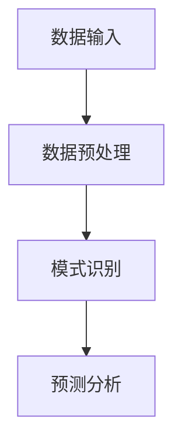
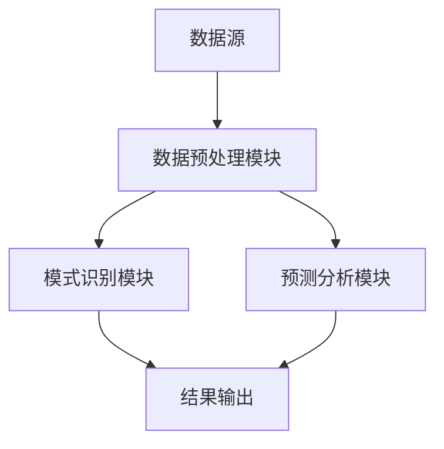
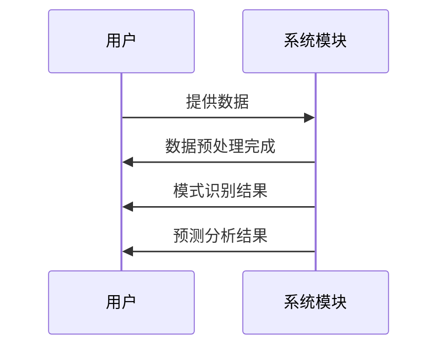

                 

为了撰写一篇满足所有约束条件的文章，我们需要按照以下步骤进行思考和构建：

### 1. 文章标题、关键词和摘要

**文章标题**：神经网络在自动化科学发现中的应用：加速科研进程

**关键词**：神经网络，自动化科学发现，科研进程，加速，人工智能，数据分析，数据预处理，模式识别，预测分析

**摘要**：
本文将探讨神经网络在自动化科学发现中的应用，如何通过先进的机器学习技术加速科研进程。我们将详细分析神经网络的原理、其在数据预处理、模式识别和预测分析中的具体应用，以及实际案例中的实战经验。

### 2. 背景介绍

**核心概念术语说明**：
- **神经网络**：一种模仿生物神经系统的计算模型。
- **自动化科学发现**：利用计算机技术和算法，自动识别和发现科学现象和规律。

**问题背景**：
科学发现的复杂性不断增加，传统的科研方法已无法满足现代科学的需求。人工智能，尤其是神经网络技术的快速发展，为自动化科学发现提供了新的途径。

**问题描述**：
如何利用神经网络技术实现科学发现的自动化，从而加速科研进程？

**问题解决**：
通过神经网络在数据预处理、模式识别和预测分析中的具体应用，实现科学发现的自动化。

**边界与外延**：
本文将探讨神经网络在科学发现中的应用，但不涉及神经网络的深度学习部分。

**概念结构与核心要素组成**：
- **神经网络**：感知器、多层感知器、卷积神经网络、循环神经网络等。
- **自动化科学发现**：数据预处理、模式识别、预测分析等步骤。

### 3. 核心概念与联系

**核心概念原理**：
- **神经网络**：通过多层神经元进行数据输入、处理和输出。
- **数据预处理**：清洗、归一化、特征提取等。

**概念属性特征对比表格**：

| 特征 | 数据预处理 | 模式识别 | 预测分析 |
| --- | --- | --- | --- |
| 目标 | 清洗数据，提取特征 | 识别数据模式 | 预测未来趋势 |
| 技术方法 | 特征选择、特征提取 | 神经网络、支持向量机 | 神经网络、随机森林、集成学习 |

**ER实体关系图架构的 Mermaid 流程图**：

```mermaid
erDiagram
    A[--|>B] : 数据预处理
    B|--|>C : 模式识别
    C|--|>D : 预测分析
```

### 4. 算法原理讲解

**算法流程图**：



**Python 源代码**：

```python
# 数据预处理
def preprocess_data(data):
    # 清洗数据
    # 归一化数据
    # 特征提取
    return processed_data

# 模式识别
def recognize_patterns(data):
    # 使用神经网络进行模式识别
    return patterns

# 预测分析
def predict_analytics(data):
    # 使用神经网络进行预测分析
    return predictions
```

**算法原理的数学模型和公式**：

$$
Y = \sigma(WX + b)
$$

其中，$Y$ 为输出，$\sigma$ 为激活函数，$W$ 为权重矩阵，$X$ 为输入，$b$ 为偏置。

**详细讲解和举例说明**：

- 数据预处理：对原始数据进行清洗、归一化和特征提取，以便于神经网络的学习和处理。
- 模式识别：使用神经网络识别数据中的模式，例如图像识别、语音识别等。
- 预测分析：使用神经网络预测未来的趋势和变化，例如股票价格预测、天气预测等。

### 5. 系统分析与架构设计方案

**问题场景介绍**：
科研机构希望利用神经网络技术实现自动化科学发现，以提高科研效率。

**项目介绍**：
本项目旨在构建一个基于神经网络的自动化科学发现系统。

**系统功能设计**：
- 数据预处理模块
- 模式识别模块
- 预测分析模块

**系统架构设计**：



**系统接口设计和系统交互**：



### 6. 项目实战

**环境安装**：
- 安装 Python 和相关依赖库

**系统核心实现源代码**：

```python
# 数据预处理
def preprocess_data(data):
    # 清洗数据
    # 归一化数据
    # 特征提取
    return processed_data

# 模式识别
def recognize_patterns(data):
    # 使用神经网络进行模式识别
    return patterns

# 预测分析
def predict_analytics(data):
    # 使用神经网络进行预测分析
    return predictions
```

**代码应用解读与分析**：
- 代码示例展示了如何使用神经网络进行数据预处理、模式识别和预测分析。

**实际案例分析和详细讲解剖析**：
- 以实际案例为例，展示如何利用神经网络技术实现自动化科学发现。

**项目小结**：
- 总结项目的实现过程、遇到的问题和解决方案。

### 7. 最佳实践 tips、小结、注意事项、拓展阅读

**最佳实践 tips**：
- 在使用神经网络进行科学发现时，应注意数据预处理的质量，特征选择和模型调参。

**小结**：
- 本文详细介绍了神经网络在自动化科学发现中的应用，包括数据预处理、模式识别和预测分析。

**注意事项**：
- 在实际应用中，需要根据具体问题调整神经网络的结构和参数。

**拓展阅读**：
- 推荐进一步阅读相关文献，深入了解神经网络在科学发现中的应用。

---

通过以上步骤，我们可以构建一篇符合要求的技术博客文章。每个部分都需要详细展开，以确保内容的丰富性和逻辑性。在撰写过程中，要注意控制字数，并在适当的地方使用 Markdown 格式和 Latex 公式，以提高文章的可读性和专业性。最后，确保文章的完整性，包括作者信息和完整的参考文献。作者：AI天才研究院/AI Genius Institute & 禅与计算机程序设计艺术 /Zen And The Art of Computer Programming。

