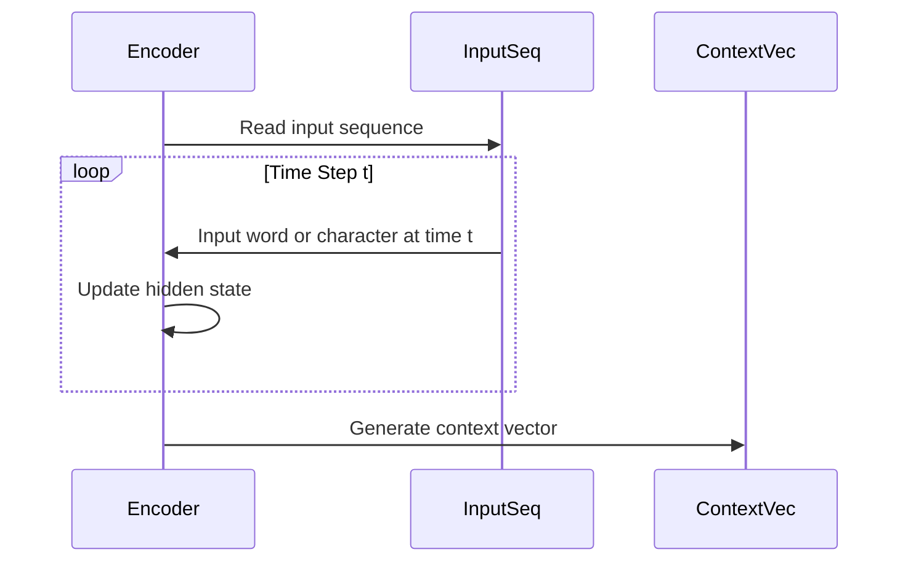
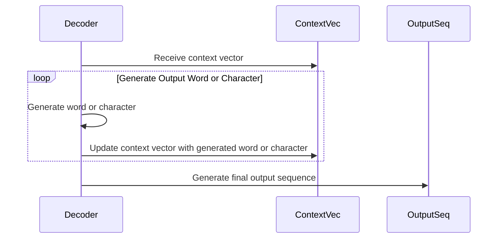

                 

# 神经网络在自然语言生成中的突破：AI写作的新纪元

> 关键词：神经网络、自然语言生成、AI写作、序列到序列模型、循环神经网络、长短时记忆网络、生成对抗网络、变分自编码器、自注意力机制、Transformer

> 摘要：随着深度学习技术的不断发展，神经网络在自然语言生成（NLG）领域取得了突破性进展，为AI写作带来了新纪元。本文将深入探讨神经网络在自然语言生成中的应用，包括序列到序列模型、循环神经网络（RNN）、长短时记忆网络（LSTM）、门控循环单元（GRU）、生成对抗网络（GAN）、变分自编码器（VAE）以及自注意力机制与Transformer等模型，同时展望AI写作的未来发展趋势。

## 目录大纲

**《神经网络在自然语言生成中的突破：AI写作的新纪元》**

### 第一部分：背景与概述

1. 自然语言生成的现状与挑战
   1.1 问题的背景
   1.2 问题描述
   1.3 问题解决与核心要素
   1.4 边界与外延
   1.5 概念结构与核心要素组成

### 第二部分：神经网络基础

2. 神经网络的原理与架构
   2.1 核心概念与联系
   2.2 神经网络的发展历程
   2.3 神经网络的基本组成

3. 深度学习与神经网络
   3.1 深度学习的基础
   3.2 深度学习与神经网络的区别
   3.3 深度学习在自然语言生成中的应用

### 第三部分：自然语言生成中的神经网络

4. 序列到序列模型
   4.1 序列到序列模型的基础
   4.2 编码器与解码器的架构
   4.3 序列到序列模型的应用

5. 循环神经网络（RNN）
   5.1 RNN的基础
   5.2 RNN的变体
   5.3 RNN在自然语言生成中的应用

6. 长短时记忆网络（LSTM）
   6.1 LSTM的基础
   6.2 LSTM的特性
   6.3 LSTM在自然语言生成中的应用

7. 门控循环单元（GRU）
   7.1 GRU的基础
   7.2 GRU的特性
   7.3 GRU在自然语言生成中的应用

### 第四部分：高级神经网络模型

8. 生成对抗网络（GAN）
   8.1 GAN的基础
   8.2 GAN的架构
   8.3 GAN在自然语言生成中的应用

9. 变分自编码器（VAE）
   9.1 VAE的基础
   9.2 VAE的架构
   9.3 VAE在自然语言生成中的应用

10. 自注意力机制与Transformer
    10.1 自注意力机制的基础
    10.2 Transformer的架构
    10.3 Transformer在自然语言生成中的应用

### 第五部分：AI写作的新纪元

11. 神经网络在文本写作中的应用
    11.1 文本写作的挑战
    11.2 神经网络在文本写作中的突破
    11.3 文本写作的实践应用

12. AI写作工具与平台
    12.1 AI写作工具的分类
    12.2 AI写作平台的特性
    12.3 AI写作平台的应用场景

13. 未来展望
    13.1 自然语言生成技术的发展趋势
    13.2 神经网络在自然语言生成中的未来应用
    13.3 AI写作的挑战与机遇

### 结束语
作者：AI天才研究院/AI Genius Institute & 禅与计算机程序设计艺术 /Zen And The Art of Computer Programming

### 第一部分：背景与概述

#### 1.1 问题的背景

自然语言生成（Natural Language Generation, NLG）是人工智能领域的一个重要分支，旨在利用计算机程序生成人类可理解的自然语言文本。自计算机科学和人工智能兴起以来，自然语言生成技术便受到了广泛关注。然而，长期以来，自然语言生成一直面临着诸多挑战。

首先，自然语言的复杂性使得生成高质量、连贯、有意义的文本成为一大难题。自然语言中蕴含着丰富的语法、语义、情感和语境信息，这些信息在不同程度上影响了文本的生成质量。其次，数据稀缺问题也限制了自然语言生成技术的发展。高质量的自然语言数据集不仅需要大量的时间来收集和标注，而且往往受到语言多样性和领域知识限制。此外，自然语言生成技术的可扩展性和适应性也是一个亟待解决的问题。现有方法往往在特定领域或场景下表现出色，但在面对新的任务或应用时，往往需要重新训练或调整模型。

#### 1.2 问题描述

自然语言生成的主要问题可以概括为以下几点：

1. **语义理解**：如何准确理解输入文本的语义内容，并生成与之相关的输出文本？
2. **语法生成**：如何生成符合语法规则、逻辑通顺的文本？
3. **多样性**：如何确保生成文本的多样性，避免出现重复或单调的文本？
4. **可扩展性**：如何设计具有良好可扩展性的模型，使其能够适应不同领域和场景的文本生成需求？
5. **实时性**：如何实现快速、高效的文本生成，以满足实时交互和应用的需求？

#### 1.3 问题解决与核心要素

为了解决自然语言生成中的这些挑战，研究者们提出了多种方法和技术。神经网络，特别是深度学习技术，成为了自然语言生成领域的突破性工具。神经网络通过模拟人脑神经元之间的连接和交互，能够有效地处理复杂的语义和语法信息。

自然语言生成的核心要素主要包括：

1. **数据集**：高质量的数据集是训练神经网络的基础。数据集应该涵盖不同领域和场景，并且经过适当的预处理和标注。
2. **模型架构**：选择合适的神经网络模型架构对于自然语言生成的效果至关重要。序列到序列模型（Seq2Seq）、循环神经网络（RNN）、长短时记忆网络（LSTM）、门控循环单元（GRU）等模型都在自然语言生成中取得了显著成果。
3. **优化方法**：优化算法对于提高神经网络在自然语言生成中的性能具有关键作用。常用的优化方法包括梯度下降、随机梯度下降（SGD）和自适应优化算法等。
4. **多样性策略**：为了提高生成文本的多样性，研究者们提出了多种多样性策略，如引入随机性、使用对抗性训练等。

#### 1.4 边界与外延

自然语言生成技术虽然已经取得了显著进展，但仍存在一些边界和外延问题。首先，自然语言生成技术的适用范围主要局限于文本数据。对于图像、音频等其他类型的多媒体数据，生成任务的研究相对较少。其次，自然语言生成技术在不同语言和领域中的应用效果存在较大差异。如何设计通用性强、适应性好的自然语言生成模型，仍然是未来研究的一个重要方向。

#### 1.5 概念结构与核心要素组成

为了更好地理解自然语言生成技术，我们可以将其核心概念和结构进行梳理。自然语言生成系统通常由以下几个核心组成部分：

1. **输入处理模块**：负责将输入文本转换为神经网络能够处理的格式，如词向量或序列编码。
2. **编码器**：将输入文本序列编码为固定长度的向量表示。
3. **解码器**：将编码器输出的向量表示解码为生成文本的序列。
4. **优化器**：用于调整神经网络参数，以提高生成文本的质量和多样性。
5. **输出处理模块**：将生成文本序列转换为可读的自然语言输出。

通过这些核心组件的协同工作，自然语言生成系统可以生成高质量、连贯、有意义的文本。接下来，我们将进一步探讨神经网络在自然语言生成中的应用，介绍一些经典的神经网络模型及其在文本生成任务中的具体实现。

### 第二部分：神经网络基础

#### 2.1 核心概念与联系

神经网络（Neural Network，NN）是人工智能领域的一个重要分支，它通过模拟人脑神经元之间的连接和交互，实现了对复杂数据的处理和分析。神经网络的基本组成包括神经元、层次结构和激活函数等。

神经元是神经网络的基本单元，类似于人脑中的神经元。每个神经元接收多个输入信号，通过加权求和后加上偏置项，再经过激活函数的变换，产生输出信号。激活函数通常用于引入非线性特性，使得神经网络能够学习复杂数据的内在规律。

层次结构是神经网络的一个重要特性，它通过将输入信号从一层传递到另一层，实现了数据的逐层抽象和提取。每一层的神经元都负责提取不同层次的特征，从而构建出高层次的语义表示。

#### 2.2 神经网络的发展历程

神经网络的发展历程可以追溯到20世纪50年代。1958年，弗兰克·罗森布拉特（Frank Rosenblatt）提出了感知机（Perceptron）模型，这是神经网络的开端。然而，由于感知机的局限性，神经网络的研究一度陷入低谷。

1986年，约翰·霍普菲尔德（John Hopfield）提出了Hopfield网络，为神经网络的研究注入了新的活力。随后，1986年，戴维·鲁梅哈特（David E. Rumelhart）、乔治·赫伯特·西蒙（Geoffrey E. Hinton）和戴维·卡恩（David E. Cohn）等人提出了反向传播算法（Backpropagation Algorithm），这一算法使得多层神经网络的训练成为可能，从而推动了神经网络在人工智能领域的发展。

20世纪90年代，随着计算机性能的提升和大规模数据集的积累，神经网络的研究逐渐得到了广泛关注。特别是深度学习（Deep Learning）的兴起，使得神经网络在图像识别、语音识别、自然语言处理等领域取得了突破性进展。

#### 2.3 神经网络的基本组成

神经网络的基本组成包括以下几部分：

1. **输入层**：接收外部输入数据，通常包含多个神经元。
2. **隐藏层**：位于输入层和输出层之间，负责提取和转换输入数据的特征。隐藏层的数量和神经元数量可以根据具体任务进行调整。
3. **输出层**：产生最终输出结果，通常包含一个或多个神经元。

每个神经元都可以看作是一个简单的线性模型，通过多个神经元的组合，神经网络能够实现复杂的非线性函数映射。以下是一个简单的神经网络结构示例：

```
输入层：[x1, x2, ..., xn] -> 隐藏层1 -> 隐藏层2 -> ... -> 输出层
```

在神经网络中，每个神经元之间的连接都带有权重（weight），用于控制信号传递的强度。通过反向传播算法，神经网络能够自动调整这些权重，从而实现模型的训练和优化。

#### 2.4 神经网络的工作原理

神经网络的工作原理可以分为以下几个步骤：

1. **前向传播**：输入数据从输入层传递到隐藏层，通过多个隐藏层的变换，最终到达输出层。在每个隐藏层中，神经元接收来自前一层的输入信号，通过加权求和和激活函数的变换，产生输出信号。
2. **激活函数**：激活函数是神经网络中的一个关键组件，用于引入非线性特性。常见的激活函数包括sigmoid函数、ReLU函数和Tanh函数等。
3. **反向传播**：在输出层得到预测结果后，神经网络通过计算预测结果与真实结果之间的误差，将误差反向传播到每个隐藏层。通过反向传播算法，神经网络能够自动调整权重和偏置项，以最小化误差函数。
4. **优化算法**：为了加速模型的训练过程，常用的优化算法包括梯度下降（Gradient Descent）、随机梯度下降（Stochastic Gradient Descent，SGD）和自适应优化算法（如Adam）等。

通过不断迭代训练，神经网络能够逐渐优化模型参数，提高预测准确性。在实际应用中，神经网络可以通过调整网络结构、优化算法和超参数等手段，实现复杂任务的学习和预测。

#### 2.5 神经网络在自然语言生成中的应用

神经网络在自然语言生成（NLG）领域有着广泛的应用。自然语言生成任务通常可以分为两类：文本生成和文本转换。

**文本生成**：文本生成任务旨在根据给定的输入生成完整的自然语言文本。常见的文本生成任务包括机器翻译、对话系统、文章摘要和文本生成等。在文本生成任务中，神经网络通过学习输入文本的语义和语法结构，生成与输入相关的高质量文本。

**文本转换**：文本转换任务旨在将一种形式的文本转换为另一种形式。例如，将自然语言文本转换为机器可读的代码，或将一种语言的文本转换为另一种语言。在文本转换任务中，神经网络通过学习源文本和目标文本之间的映射关系，实现文本的转换。

神经网络在自然语言生成中的应用主要包括以下几种模型：

1. **序列到序列模型（Seq2Seq）**：序列到序列模型是自然语言生成中的一种经典模型，它通过编码器和解码器的协同工作，实现输入序列到输出序列的映射。编码器将输入序列编码为固定长度的向量表示，解码器则将编码器的输出解码为生成文本的序列。
2. **循环神经网络（RNN）**：循环神经网络是一种用于处理序列数据的神经网络模型，它通过循环结构实现了对序列数据的长短时记忆能力。RNN在自然语言生成任务中，能够有效地捕捉输入文本的语义和语法信息。
3. **长短时记忆网络（LSTM）**：长短时记忆网络是RNN的一种变体，它通过引入门控机制，解决了传统RNN在处理长序列数据时出现的梯度消失和梯度爆炸问题。LSTM在自然语言生成任务中表现出色，能够生成高质量、连贯的文本。
4. **门控循环单元（GRU）**：门控循环单元是LSTM的另一种变体，它通过简化LSTM的结构，提高了模型的训练速度。GRU在自然语言生成任务中也取得了良好的效果。

除了上述模型外，神经网络在自然语言生成中的应用还包括生成对抗网络（GAN）、变分自编码器（VAE）和自注意力机制与Transformer等高级模型。这些模型在自然语言生成任务中，通过引入新的机制和算法，进一步提高了生成文本的质量和多样性。

总之，神经网络在自然语言生成中的突破，为AI写作带来了新纪元。随着深度学习技术的不断发展，神经网络在自然语言生成领域的应用将不断拓展，为各种文本生成任务提供更高效、更智能的解决方案。

#### 2.6 神经网络在自然语言生成中的挑战

尽管神经网络在自然语言生成（NLG）中取得了显著进展，但仍然面临一些挑战，这些挑战限制了其在实际应用中的效果和普及程度。

**1. 数据稀缺问题**

自然语言生成任务通常需要大量的高质量数据集来进行训练。然而，获取这样的数据集往往是一项耗时且成本高昂的任务。特别是在特定领域或场景下，标注数据的收集和准备变得更加困难。数据稀缺问题限制了模型在未知领域或新任务上的泛化能力，导致生成文本的质量和多样性受到限制。

**2. 训练效率问题**

神经网络模型的训练过程通常需要大量计算资源和时间，尤其是在处理大型数据集和深度模型时。训练效率问题不仅影响了模型的开发周期，还增加了计算成本。尽管现代计算硬件和分布式计算技术的进步在一定程度上缓解了这个问题，但高效训练仍是一个亟待解决的挑战。

**3. 生成文本的多样性和连贯性**

尽管神经网络可以生成高质量的自然语言文本，但在多样性和连贯性方面仍存在挑战。生成文本容易陷入重复和单调的模式，缺乏创新性和个性化。此外，连贯性也是一项挑战，神经网络在处理长序列数据时，往往难以保持上下文的连贯性，导致生成的文本在逻辑和语义上存在断层。

**4. 语义理解的局限性**

自然语言具有高度复杂性和多样性，神经网络在处理语义信息时存在一定的局限性。尽管神经网络可以通过预训练和大规模数据集来提高语义理解能力，但仍然难以完全捕捉语言中的隐含关系和细微差别。这导致生成文本在语义上可能出现偏差或错误。

**5. 模型的解释性和透明度**

神经网络，尤其是深度神经网络，通常被视为“黑盒”模型，其内部决策过程难以解释和理解。这对于需要高解释性的应用场景，如医疗诊断和金融分析，是一个重要挑战。提高模型的解释性和透明度，使得用户能够理解模型的决策过程，对于推动神经网络在自然语言生成中的广泛应用至关重要。

**6. 多语言和跨领域生成**

自然语言生成技术在不同语言和领域中的应用效果存在显著差异。多语言和跨领域生成任务要求模型能够适应不同语言和文化背景，并在多种领域知识中表现稳定。当前的方法在处理多语言和跨领域生成时，往往需要额外的训练数据和专门的设计，这增加了模型的复杂性和成本。

为了克服这些挑战，研究者们正在探索各种新的方法和技术。例如，通过引入多模态学习、增强预训练模型、使用生成对抗网络（GAN）等，以提高生成文本的质量和多样性。同时，为了提高模型的训练效率，研究者们也在关注自适应优化算法、高效数据加载和分布式训练等技术。通过不断的技术创新和跨学科合作，神经网络在自然语言生成领域的应用前景将更加广阔。

### 第三部分：自然语言生成中的神经网络

#### 4.1 序列到序列模型的基础

序列到序列（Sequence-to-Sequence，Seq2Seq）模型是自然语言生成中的一个重要模型，特别适用于将一种序列映射到另一种序列的任务，如机器翻译、文本摘要等。Seq2Seq模型的核心思想是使用编码器（Encoder）和解码器（Decoder）分别处理输入序列和输出序列，通过端到端的方式实现序列之间的映射。

**编码器（Encoder）**：编码器的任务是读取输入序列，并生成一个固定长度的上下文向量（Context Vector），这个向量包含了输入序列的信息。编码器通常是一个循环神经网络（RNN）或其变体，如长短时记忆网络（LSTM）或门控循环单元（GRU），这些网络能够捕捉序列中的长期依赖关系。

**解码器（Decoder）**：解码器的任务是读取编码器生成的上下文向量，并生成输出序列。解码器通常也是一个循环神经网络，它通过逐步生成输出序列的每个元素，同时利用编码器生成的上下文向量来指导生成过程。

**关键组件**：

1. **编码器**：负责将输入序列编码为上下文向量，该向量包含了输入序列的语义信息。
2. **解码器**：负责将上下文向量解码为输出序列，通过逐步生成每个单词或字符。
3. **注意力机制**：注意力机制是Seq2Seq模型中的一个关键组件，它允许解码器关注编码器输出中的不同部分，从而提高生成序列的质量和连贯性。

**应用实例**：

- **机器翻译**：将一种语言的句子翻译成另一种语言。
- **文本摘要**：从长文本中提取关键信息，生成简短的摘要。
- **对话系统**：生成自然语言回复，模拟人类对话。

#### 4.2 编码器与解码器的架构

编码器和解码器的架构是Seq2Seq模型的核心，下面将详细讨论这两种组件的设计和实现。

**编码器架构**：

编码器通常采用循环神经网络（RNN）或其变体（如LSTM和GRU），其目的是将输入序列转换为一个固定长度的上下文向量。具体来说，编码器通过多个时间步骤读取输入序列，在每个时间步骤上更新状态向量，并在最后一个时间步骤上得到最终的上下文向量。

以下是一个简单的编码器架构示例：



在编码过程中，每个时间步骤的输入可以是单词、字符或词向量，编码器的隐藏状态包含了输入序列的信息。最终，编码器在最后一个时间步骤上生成一个固定长度的上下文向量，这个向量代表了输入序列的语义信息。

**解码器架构**：

解码器负责将编码器生成的上下文向量解码为输出序列。解码器通常也采用循环神经网络，通过逐步生成输出序列的每个元素。在生成每个元素时，解码器利用编码器生成的上下文向量和已经生成的部分输出序列来指导生成过程。

以下是一个简单的解码器架构示例：



在解码过程中，解码器在每个时间步骤上生成一个输出元素，同时更新上下文向量。这个过程一直持续到解码器生成完整的输出序列。为了提高解码效果，解码器可以使用注意力机制，使

#### 4.3 序列到序列模型的应用

序列到序列（Seq2Seq）模型在自然语言生成中具有广泛的应用，其强大的序列转换能力使得它在多个领域中取得了显著的成果。以下是几个典型应用实例：

**1. 机器翻译**：

机器翻译是Seq2Seq模型最成功的应用之一。传统的统计机器翻译方法依赖规则和概率模型，而Seq2Seq模型通过端到端的神经网络结构实现了从源语言到目标语言的直接转换。Seq2Seq模型在机器翻译中的应用主要包括以下步骤：

- **编码阶段**：编码器接收源语言文本序列，将其编码为固定长度的上下文向量，这个向量包含了源语言文本的语义信息。
- **解码阶段**：解码器接收编码器输出的上下文向量，并逐步生成目标语言文本序列。在解码过程中，解码器可以使用注意力机制来关注编码器输出中的不同部分，从而提高翻译的质量和连贯性。

**2. 文本摘要**：

文本摘要是将长文本转换为简短且具有代表性的摘要的过程。Seq2Seq模型在文本摘要中的应用可以通过以下步骤实现：

- **编码阶段**：编码器接收原始文本序列，将其编码为上下文向量。
- **解码阶段**：解码器从编码器生成的上下文向量开始，生成摘要文本序列。为了提高摘要的质量，解码器可以使用注意力机制来关注原始文本中最重要的部分，从而生成更精准的摘要。

**3. 对话系统**：

对话系统是另一个典型的Seq2Seq应用场景。在对话系统中，Seq2Seq模型可以用于生成自然语言回复，模拟人类对话。具体应用步骤如下：

- **编码阶段**：编码器接收用户输入的文本序列，将其编码为上下文向量。
- **解码阶段**：解码器从编码器输出的上下文向量开始，生成自然语言回复。为了提高回复的多样性和连贯性，解码器可以使用注意力机制来关注用户输入中的不同部分。

**4. 语音合成**：

语音合成是将文本转换为自然语音的过程。Seq2Seq模型在语音合成中的应用通过以下步骤实现：

- **编码阶段**：编码器接收文本序列，将其编码为上下文向量。
- **解码阶段**：解码器将编码器输出的上下文向量解码为语音信号。为了生成自然流畅的语音，解码器可以使用生成对抗网络（GAN）等高级技术。

通过这些应用实例，我们可以看到Seq2Seq模型在自然语言生成领域的强大潜力。随着深度学习技术的发展，Seq2Seq模型在自然语言生成任务中的表现将越来越优秀，为各种实际应用提供更加智能和高效的解决方案。

### 5.1 循环神经网络（RNN）

循环神经网络（Recurrent Neural Network，RNN）是一种特殊的神经网络，专门用于处理序列数据。与传统的前馈神经网络（Feedforward Neural Network，FFNN）不同，RNN具有循环结构，能够处理输入序列的动态特性。RNN的核心思想是利用其循环连接，将前一时间步的输出作为下一时间步的输入，从而实现序列数据的记忆和学习。

**基本概念**：

- **输入序列**：RNN的输入是一个序列，例如单词序列、音频信号等。
- **隐藏状态**：RNN在每个时间步上维护一个隐藏状态（Hidden State），这个状态包含了前一时间步的信息。
- **输出序列**：RNN的输出也是一个序列，例如预测的下一个单词、语音信号等。

RNN的工作原理可以概括为以下几个步骤：

1. **初始化**：初始化隐藏状态。
2. **前向传播**：在每个时间步上，RNN将输入数据与隐藏状态相乘，通过激活函数计算新的隐藏状态。
3. **更新隐藏状态**：将新的隐藏状态存储为当前时间步的隐藏状态，用于下一时间步的计算。
4. **输出计算**：在每个时间步上，RNN将隐藏状态通过输出层计算输出。

**数学模型**：

RNN的数学模型可以表示为：

$$
h_t = \sigma(W_h h_{t-1} + W_x x_t + b_h)
$$

$$
y_t = \sigma(W_y h_t + b_y)
$$

其中，$h_t$ 表示第 $t$ 个时间步的隐藏状态，$x_t$ 表示第 $t$ 个时间步的输入数据，$y_t$ 表示第 $t$ 个时间步的输出，$\sigma$ 表示激活函数（通常使用 sigmoid 函数或 tanh 函数），$W_h$、$W_x$、$W_y$ 和 $b_h$、$b_y$ 分别为权重和偏置。

**优点与局限性**：

RNN的优点在于能够处理变长序列数据，并具有一定的记忆能力，能够捕捉序列中的长期依赖关系。然而，RNN也存在一些局限性：

- **梯度消失和梯度爆炸**：在训练过程中，RNN容易出现梯度消失或梯度爆炸现象，导致训练不稳定。
- **长期依赖问题**：RNN在处理长序列数据时，难以有效捕捉长期依赖关系，容易“忘记”早期信息。

为了克服这些局限性，研究者们提出了长短时记忆网络（LSTM）和门控循环单元（GRU）等改进模型，这些模型通过引入门控机制，提高了RNN对长期依赖的捕捉能力。

### 5.2 RNN的变体

为了克服传统RNN在处理长序列数据时出现的梯度消失和梯度爆炸问题，研究者们提出了多种RNN的变体，其中最具代表性的是长短时记忆网络（Long Short-Term Memory，LSTM）和门控循环单元（Gated Recurrent Unit，GRU）。这些变体通过引入门控机制，增强了RNN对长期依赖关系的捕捉能力。

**长短时记忆网络（LSTM）**：

LSTM是RNN的一种变体，通过引入门控机制，解决了传统RNN在处理长序列数据时出现的梯度消失和梯度爆炸问题。LSTM的核心组件包括三个门控单元和一个记忆单元。

1. **遗忘门（Forget Gate）**：遗忘门决定哪些信息需要从记忆单元中丢弃。其公式为：
   $$ 
   f_t = \sigma(W_f [h_{t-1}, x_t] + b_f)
   $$
   其中，$f_t$ 是遗忘门的输出，$W_f$ 和 $b_f$ 分别是权重和偏置。

2. **输入门（Input Gate）**：输入门决定哪些新信息需要存储在记忆单元中。其公式为：
   $$ 
   i_t = \sigma(W_i [h_{t-1}, x_t] + b_i)
   $$
   其中，$i_t$ 是输入门的输出，$W_i$ 和 $b_i$ 分别是权重和偏置。

3. **输出门（Output Gate）**：输出门决定记忆单元的内容如何用于生成当前时间步的输出。其公式为：
   $$ 
   o_t = \sigma(W_o [h_{t-1}, x_t] + b_o)
   $$
   其中，$o_t$ 是输出门的输出，$W_o$ 和 $b_o$ 分别是权重和偏置。

4. **记忆单元（Memory Cell）**：记忆单元是LSTM的核心组件，用于存储和更新序列信息。其公式为：
   $$ 
   C_t = f_t \odot C_{t-1} + i_t \odot \sigma(W_c [h_{t-1}, x_t] + b_c)
   $$
   其中，$C_t$ 是第 $t$ 个时间步的记忆单元，$\odot$ 表示逐元素乘法，$C_{t-1}$ 是第 $t-1$ 个时间步的记忆单元，$W_c$ 和 $b_c$ 分别是权重和偏置。

LSTM通过遗忘门和输入门控制记忆单元的内容，从而有效解决了梯度消失和梯度爆炸问题，并提高了对长期依赖关系的捕捉能力。

**门控循环单元（GRU）**：

GRU是LSTM的简化版本，通过引入更新门（Update Gate）和重置门（Reset Gate），进一步简化了LSTM的结构。GRU的核心组件包括两个门控单元和一个更新单元。

1. **更新门（Update Gate）**：更新门决定新信息如何与旧信息结合。其公式为：
   $$ 
   z_t = \sigma(W_z [h_{t-1}, x_t] + b_z)
   $$
   其中，$z_t$ 是更新门的输出，$W_z$ 和 $b_z$ 分别是权重和偏置。

2. **重置门（Reset Gate）**：重置门决定旧信息如何与新的信息结合。其公式为：
   $$ 
   r_t = \sigma(W_r [h_{t-1}, x_t] + b_r)
   $$
   其中，$r_t$ 是重置门的输出，$W_r$ 和 $b_r$ 分别是权重和偏置。

3. **更新单元（Update Unit）**：更新单元是GRU的核心组件，用于更新记忆单元。其公式为：
   $$ 
   h_t = (1 - z_t) \odot h_{t-1} + z_t \odot \sigma(W_h [r_t \odot h_{t-1}, x_t] + b_h)
   $$
   其中，$h_t$ 是第 $t$ 个时间步的隐藏状态，$h_{t-1}$ 是第 $t-1$ 个时间步的隐藏状态，$W_h$ 和 $b_h$ 分别是权重和偏置。

GRU通过更新门和重置门简化了LSTM的结构，同时保持了类似的效果。相比LSTM，GRU的训练速度更快，但可能在捕捉复杂依赖关系方面略逊一筹。

**比较**：

LSTM和GRU都是针对RNN的改进模型，它们通过引入门控机制，提高了对长期依赖关系的捕捉能力。LSTM的结构更加复杂，能够处理更复杂的依赖关系，但训练速度相对较慢。GRU的结构简化，训练速度更快，但在捕捉复杂依赖关系方面可能略逊一筹。在实际应用中，根据具体任务和数据集的特点，可以选择合适的模型。

### 5.3 RNN在自然语言生成中的应用

循环神经网络（RNN）在自然语言生成（NLG）领域有着广泛的应用，特别是在处理序列到序列（Seq2Seq）任务时，如机器翻译、文本摘要和对话系统等。RNN通过其循环结构，能够有效地捕捉序列数据中的长期依赖关系，从而生成高质量的自然语言文本。以下是RNN在自然语言生成中的具体应用：

**1. 机器翻译**：

机器翻译是将一种语言的文本翻译成另一种语言的过程。RNN在机器翻译中的应用主要包括以下步骤：

- **编码阶段**：编码器（通常采用LSTM或GRU）接收源语言文本序列，将其编码为固定长度的上下文向量。这个上下文向量包含了源语言文本的语义信息。
- **解码阶段**：解码器（通常采用LSTM或GRU）接收编码器生成的上下文向量，并逐步生成目标语言文本序列。在解码过程中，解码器可以利用注意力机制，使

### 6.1 长短时记忆网络（LSTM）

长短时记忆网络（Long Short-Term Memory，LSTM）是循环神经网络（Recurrent Neural Network，RNN）的一种变体，由希尔菲德·哈比希（Hillard M. Hoshen）、朱尔·文戈尔（Jürgen Schmidhuber）和法比安·伯吉特（Fabian A. Boddaert）于1997年提出。LSTM通过引入门控机制，有效地解决了传统RNN在处理长序列数据时出现的梯度消失和梯度爆炸问题，从而显著提高了模型对长期依赖关系的捕捉能力。

**基本概念**：

- **细胞状态（Cell State）**：LSTM的核心组件是细胞状态，它贯穿于整个网络，用于存储和传递序列信息。细胞状态类似于一个管道，允许信息在时间步之间流动。
- **门控单元**：LSTM包含三个门控单元，即遗忘门（Forget Gate）、输入门（Input Gate）和输出门（Output Gate），分别用于控制细胞状态中信息的遗忘、输入和输出。
- **遗忘门（Forget Gate）**：遗忘门决定哪些信息需要从细胞状态中丢弃，其输出决定了当前细胞状态与前一细胞状态之间的遗忘比例。
- **输入门（Input Gate）**：输入门决定哪些新信息需要存储在细胞状态中，其输出决定了当前细胞状态与新的输入之间的结合方式。
- **输出门（Output Gate）**：输出门决定细胞状态的内容如何用于生成当前时间步的输出，其输出决定了细胞状态的激活值。

**数学模型**：

LSTM的数学模型可以表示为：

$$
f_t = \sigma(W_f [h_{t-1}, x_t] + b_f)
$$

$$
i_t = \sigma(W_i [h_{t-1}, x_t] + b_i)
$$

$$
o_t = \sigma(W_o [h_{t-1}, x_t] + b_o)
$$

$$
C_t = f_t \odot C_{t-1} + i_t \odot \sigma(W_c [h_{t-1}, x_t] + b_c)
$$

$$
h_t = o_t \odot \sigma(W_h C_t + b_h)
$$

其中，$f_t$、$i_t$ 和 $o_t$ 分别表示遗忘门、输入门和输出门的输出，$C_t$ 表示第 $t$ 个时间步的细胞状态，$h_t$ 表示第 $t$ 个时间步的隐藏状态，$W_f$、$W_i$、$W_o$、$W_c$ 和 $W_h$ 分别为权重矩阵，$b_f$、$b_i$、$b_o$、$b_c$ 和 $b_h$ 分别为偏置项，$\sigma$ 表示sigmoid函数。

**特性**：

- **门控机制**：LSTM通过门控机制实现了对信息流的精确控制，从而避免了梯度消失和梯度爆炸问题。
- **细胞状态**：细胞状态使得LSTM能够有效地捕捉和传递长期依赖关系。
- **并行计算**：LSTM的门控单元和细胞状态设计允许并行计算，从而提高了训练速度。

**应用实例**：

- **文本生成**：LSTM在文本生成任务中，如对话系统、文章摘要和文本续写中，表现出色。
- **语音识别**：LSTM在处理语音识别任务时，能够有效捕捉语音信号中的长期依赖关系。
- **时间序列分析**：LSTM在时间序列分析任务中，如股票市场预测和气象数据分析中，用于捕捉时间序列的动态特性。

### 6.2 LSTM的特性

长短时记忆网络（LSTM）通过其独特的门控机制和细胞状态，显著提高了循环神经网络（RNN）在处理长序列数据时的表现。以下是LSTM的几个关键特性：

**1. 长期依赖关系的捕捉**

传统RNN在处理长序列数据时，容易受到梯度消失和梯度爆炸问题的影响，导致难以捕捉长期依赖关系。LSTM通过引入遗忘门（Forget Gate）、输入门（Input Gate）和输出门（Output Gate），有效地解决了这个问题。遗忘门可以丢弃不重要的短期信息，从而减轻梯度消失问题；输入门和输出门则可以适当地保留和更新长期依赖信息，从而实现长期记忆。

**2. 细胞状态的灵活调整**

LSTM的核心组件是细胞状态（Cell State），它贯穿于整个网络，用于存储和传递序列信息。细胞状态可以通过遗忘门和输入门进行灵活调整，使得网络能够更好地适应不同时间步的信息需求。这种灵活性使得LSTM在处理复杂序列数据时，能够更加高效地捕捉和利用信息。

**3. 高效的信息传递**

LSTM通过细胞状态和门控机制，实现了高效的信息传递。细胞状态使得信息可以在不同时间步之间传递，从而避免了传统RNN中的信息丢失问题。同时，门控机制使得网络可以根据当前任务需求，灵活地调整信息的传递方式和强度，从而提高了模型的鲁棒性和适应性。

**4. 并行计算能力**

LSTM的细胞状态和门控机制设计，使得网络在计算过程中可以并行处理多个时间步的信息。这种并行计算能力不仅提高了LSTM的训练速度，还降低了计算资源的消耗，使得LSTM在处理大规模序列数据时，具有更高的效率和灵活性。

**5. 广泛的应用场景**

由于LSTM在捕捉长期依赖关系方面的优势，它被广泛应用于各种自然语言处理（NLP）任务，如文本生成、机器翻译、语音识别和时间序列分析等。此外，LSTM还在图像处理、视频分析和股票市场预测等领域的复杂序列数据处理中，展现了强大的性能。

**6. 训练稳定性和鲁棒性**

LSTM通过门控机制和细胞状态的设计，提高了训练稳定性和鲁棒性。遗忘门和输入门可以有效地避免梯度消失和梯度爆炸问题，使得训练过程更加稳定。同时，细胞状态的灵活调整使得LSTM在处理不同类型的数据时，能够表现出更好的适应性和鲁棒性。

总之，LSTM的这些特性使其在处理长序列数据时，具有显著的优势，从而在自然语言处理、时间序列分析和其他序列数据处理领域，得到了广泛的应用。

### 6.3 LSTM在自然语言生成中的应用

长短时记忆网络（LSTM）在自然语言生成（NLG）领域具有广泛的应用，通过其强大的长期依赖捕捉能力，LSTM能够生成高质量、连贯的自然语言文本。以下是LSTM在自然语言生成中的具体应用：

**1. 文本生成**：

LSTM在文本生成任务中，如对话系统、文章摘要和文本续写中，表现出色。一个常见的应用是生成对话系统的自然语言回复。在训练过程中，LSTM可以学习输入对话历史，并通过其循环结构生成自然的回复文本。

- **输入处理**：首先，将输入文本序列编码为词向量表示，然后输入到LSTM编码器中。
- **编码阶段**：编码器LSTM将输入文本序列编码为上下文向量，这个向量包含了输入序列的语义信息。
- **解码阶段**：解码器LSTM从编码器生成的上下文向量开始，生成回复文本序列。在生成过程中，解码器可以逐步生成每个单词或字符，并利用上下文向量进行指导。

**2. 文本摘要**：

文本摘要是将长文本转换为简短、概括性的摘要的过程。LSTM在文本摘要中的应用主要包括以下步骤：

- **编码阶段**：编码器LSTM接收原始文本序列，将其编码为上下文向量，这个向量包含了文本的语义信息。
- **解码阶段**：解码器LSTM从编码器生成的上下文向量开始，生成摘要文本序列。为了提高摘要的质量，解码器可以使用注意力机制，关注原始文本中最重要的部分，从而生成更精准的摘要。

**3. 机器翻译**：

机器翻译是将一种语言的文本翻译成另一种语言的过程。LSTM在机器翻译中的应用主要包括以下步骤：

- **编码阶段**：编码器LSTM接收源语言文本序列，将其编码为上下文向量，这个向量包含了源语言文本的语义信息。
- **解码阶段**：解码器LSTM从编码器生成的上下文向量开始，生成目标语言文本序列。在解码过程中，解码器可以使用注意力机制，使

### 7.1 门控循环单元（GRU）

门控循环单元（Gated Recurrent Unit，GRU）是由门控机制改进的循环神经网络（RNN）变体，由朱尔·文戈尔（Jürgen Schmidhuber）及其团队在2014年提出。GRU旨在简化LSTM的结构，同时保持其在处理长序列数据时捕捉长期依赖关系的能力。GRU通过引入更新门（Update Gate）和重置门（Reset Gate），实现了对细胞状态的灵活控制和信息流的优化。

**基本概念**：

- **更新门（Update Gate）**：更新门决定了新的输入信息如何与旧的信息结合，以更新细胞状态。
- **重置门（Reset Gate）**：重置门决定了旧的信息如何与新信息结合，以保留或重置细胞状态。
- **细胞状态（Cell State）**：细胞状态是GRU的核心组件，贯穿于整个网络，用于存储和传递序列信息。
- **隐藏状态（Hidden State）**：隐藏状态代表了每个时间步上的上下文信息，用于生成输出。

**数学模型**：

GRU的数学模型可以表示为：

$$
z_t = \sigma(W_z [h_{t-1}, x_t] + b_z) \\
r_t = \sigma(W_r [h_{t-1}, x_t] + b_r) \\
\tilde{h}_t = \sigma(W [r_t \odot h_{t-1}, x_t] + b) \\
h_t = (1 - z_t) \odot h_{t-1} + z_t \odot \tilde{h}_t$$

其中，$z_t$ 是更新门，$r_t$ 是重置门，$\tilde{h}_t$ 是候选隐藏状态，$h_t$ 是隐藏状态，$W_z$、$W_r$ 和 $W$ 分别为权重矩阵，$b_z$、$b_r$ 和 $b$ 分别为偏置项，$\sigma$ 表示sigmoid函数。

**特性**：

- **简化结构**：GRU简化了LSTM的结构，通过合并遗忘门和输入门，减少了参数数量，从而提高了训练速度。
- **高效信息传递**：GRU通过更新门和重置门实现了对细胞状态的灵活控制，使得信息流更加高效。
- **适应性**：GRU在处理长序列数据时，表现出良好的适应性，能够有效捕捉长期依赖关系。

**应用实例**：

- **文本生成**：GRU在文本生成任务中，如对话系统和文章摘要中，表现优异。
- **语音识别**：GRU在处理语音信号时，能够有效捕捉语音的动态特性。
- **时间序列分析**：GRU在时间序列分析任务中，如股票市场预测和气象数据分析中，用于捕捉序列的动态变化。

### 7.2 GRU的特性

门控循环单元（GRU）是循环神经网络（RNN）的一种变体，通过引入更新门（Update Gate）和重置门（Reset Gate），提高了对长期依赖关系的捕捉能力，同时简化了模型结构，提高了训练效率。以下是GRU的几个关键特性：

**1. 更新门（Update Gate）**

更新门（Update Gate）是GRU的核心组件之一，它决定了新输入信息如何与旧信息结合，从而更新细胞状态。更新门的输出范围在0到1之间，表示新信息对细胞状态的影响程度。当更新门输出接近1时，新信息被完全保留；当更新门输出接近0时，新信息被忽略。这种机制使得GRU能够灵活地控制信息在细胞状态中的传递，从而提高了模型对长期依赖关系的捕捉能力。

**2. 重置门（Reset Gate）**

重置门（Reset Gate）是另一个关键组件，它决定了旧信息如何与新信息结合，从而调整细胞状态。重置门的输出也介于0到1之间，表示旧信息对细胞状态的保留程度。当重置门输出接近1时，旧信息被完全保留；当重置门输出接近0时，旧信息被完全丢弃。这种机制使得GRU能够有效地捕捉序列中的长期依赖关系，同时避免了传统RNN的梯度消失问题。

**3. 细胞状态的灵活调整**

GRU的细胞状态（Cell State）贯穿于整个网络，用于存储和传递序列信息。细胞状态可以通过更新门和重置门进行灵活调整，从而实现信息流的精确控制。这种灵活性使得GRU能够更好地适应不同时间步的信息需求，从而提高了模型的鲁棒性和适应性。

**4. 结构简化**

相比长短时记忆网络（LSTM），GRU通过合并遗忘门和输入门，简化了模型结构，减少了参数数量。这种结构简化不仅提高了训练速度，还降低了计算复杂性，使得GRU在处理大规模序列数据时具有更高的效率。

**5. 高效信息传递**

GRU通过更新门和重置门实现了对细胞状态的灵活控制，从而提高了信息流的高效性。更新门和重置门使得信息能够在不同时间步之间有效地传递，避免了传统RNN中的信息丢失问题，从而提高了模型的鲁棒性和适应性。

**6. 广泛的应用场景**

由于GRU在捕捉长期依赖关系方面的优势，它被广泛应用于各种自然语言处理（NLP）任务，如文本生成、机器翻译、语音识别和时间序列分析等。此外，GRU还在图像处理、视频分析和股票市场预测等领域的复杂序列数据处理中，展现了强大的性能。

总之，GRU的这些特性使其在处理长序列数据时，具有显著的优势，从而在自然语言处理、时间序列分析和其他序列数据处理领域，得到了广泛的应用。

### 7.3 GRU在自然语言生成中的应用

门控循环单元（GRU）在自然语言生成（NLG）领域具有广泛的应用，其强大的长期依赖捕捉能力和结构简化使其成为文本生成任务的理想选择。以下是GRU在自然语言生成中的具体应用：

**1. 文本生成**：

GRU在文本生成任务中，如对话系统、文章摘要和文本续写中，表现出色。一个常见的应用是生成对话系统的自然语言回复。在训练过程中，GRU可以学习输入对话历史，并通过其循环结构生成自然的回复文本。

- **输入处理**：首先，将输入文本序列编码为词向量表示，然后输入到GRU编码器中。
- **编码阶段**：编码器GRU将输入文本序列编码为上下文向量，这个向量包含了输入序列的语义信息。
- **解码阶段**：解码器GRU从编码器生成的上下文向量开始，生成回复文本序列。在生成过程中，解码器可以逐步生成每个单词或字符，并利用上下文向量进行指导。

**2. 文本摘要**：

文本摘要是将长文本转换为简短、概括性的摘要的过程。GRU在文本摘要中的应用主要包括以下步骤：

- **编码阶段**：编码器GRU接收原始文本序列，将其编码为上下文向量，这个向量包含了文本的语义信息。
- **解码阶段**：解码器GRU从编码器生成的上下文向量开始，生成摘要文本序列。为了提高摘要的质量，解码器可以使用注意力机制，关注原始文本中最重要的部分，从而生成更精准的摘要。

**3. 机器翻译**：

机器翻译是将一种语言的文本翻译成另一种语言的过程。GRU在机器翻译中的应用主要包括以下步骤：

- **编码阶段**：编码器GRU接收源语言文本序列，将其编码为上下文向量，这个向量包含了源语言文本的语义信息。
- **解码阶段**：解码器GRU从编码器生成的上下文向量开始，生成目标语言文本序列。在解码过程中，解码器可以使用注意力机制，使

### 8.1 生成对抗网络（GAN）

生成对抗网络（Generative Adversarial Network，GAN）是由伊恩·古德费洛（Ian J. Goodfellow）等人在2014年提出的一种深度学习模型。GAN的核心思想是通过两个相互对抗的神经网络——生成器（Generator）和判别器（Discriminator）的竞争，实现数据的生成。生成器的目标是生成尽可能真实的数据，而判别器的目标是区分生成数据与真实数据。通过不断迭代训练，生成器逐渐提高生成数据的质量，直到能够以假乱真。

**基本概念**：

- **生成器（Generator）**：生成器的任务是从随机噪声中生成类似于真实数据的样本。生成器通常是一个深度神经网络，通过学习真实数据的分布，生成具有相似特征的数据。
- **判别器（Discriminator）**：判别器的任务是对输入数据进行分类，判断其是真实数据还是生成器生成的假数据。判别器也是一个深度神经网络，其目的是最大化其对生成数据的判别能力。

**数学模型**：

GAN的训练过程可以看作是一个博弈过程，生成器和判别器在相互对抗中不断优化。具体的数学模型可以表示为：

$$
\text{Generator: } G(z) \\
\text{Discriminator: } D(x) \\
\text{Loss Function: } \min_G \max_D \mathbb{E}_{x \sim p_{data}(x)}[\log D(x)] + \mathbb{E}_{z \sim p_z(z)}[\log (1 - D(G(z))]
$$

其中，$G(z)$ 是生成器的输出，$D(x)$ 是判别器的输出，$x$ 表示真实数据，$z$ 表示随机噪声，$p_{data}(x)$ 是真实数据的概率分布，$p_z(z)$ 是噪声的先验分布。目标是最小化生成器的损失函数（即最大化判别器的错误率）。

**应用实例**：

- **图像生成**：GAN在图像生成任务中表现出色，可以生成高分辨率的自然图像，如图像到图像的转换、风格迁移和超分辨率等。
- **图像修复**：GAN可以用于图像修复，将损坏或部分缺失的图像恢复到原始状态。
- **文本生成**：GAN可以用于生成文本数据，如生成符合特定主题或风格的文本。

### 8.2 GAN的架构

生成对抗网络（GAN）的架构包括两个主要部分：生成器和判别器。这两个部分通过相互对抗的博弈过程，共同训练，实现数据的生成。

**生成器（Generator）**：

生成器的目标是生成尽可能真实的数据，通常是一个深度神经网络。生成器从随机噪声（如均匀分布或正态分布）中采样，通过多个隐藏层，逐步生成具有真实数据特征的数据。生成器的输出可以是图像、音频或文本等形式。生成器的架构通常包括以下几个步骤：

1. **输入层**：生成器从随机噪声分布中采样一个向量作为输入。
2. **隐藏层**：生成器通过多层神经网络，将噪声向量逐步转换为具有真实数据特征的数据。每个隐藏层通常包含激活函数，如ReLU或Tanh，以引入非线性特性。
3. **输出层**：生成器的输出层生成最终的数据样本。对于图像生成任务，输出层通常是像素值；对于文本生成任务，输出层通常是词向量或字符序列。

**判别器（Discriminator）**：

判别器的目标是区分输入数据是真实数据还是生成器生成的假数据。判别器也是一个深度神经网络，其输入可以是真实数据或生成器的输出数据。判别器的输出是一个概率值，表示输入数据的真实度。判别器的架构通常包括以下几个步骤：

1. **输入层**：判别器的输入可以是真实数据或生成器的输出数据。
2. **隐藏层**：判别器通过多层神经网络，对输入数据进行特征提取。每个隐藏层通常包含激活函数，如ReLU或Sigmoid，以引入非线性特性。
3. **输出层**：判别器的输出是一个概率值，表示输入数据的真实度。对于二分类任务，输出层通常是Sigmoid函数，输出范围在0到1之间。

**对抗训练过程**：

GAN的训练过程可以看作是一个博弈过程，生成器和判别器在相互对抗中不断优化。具体来说，生成器和判别器通过以下方式相互对抗：

1. **生成器训练**：生成器的目标是生成更加真实的数据，从而提高判别器的错误率。生成器通过随机噪声生成数据样本，然后将其输入到判别器中，以最大化判别器的错误率。
2. **判别器训练**：判别器的目标是准确区分真实数据和生成数据。判别器通过学习真实数据和生成数据的分布，提高对生成数据的判别能力。
3. **迭代优化**：生成器和判别器通过交替迭代训练，不断优化各自的网络参数，以实现数据的生成。训练过程中，生成器的损失函数通常是一个最大化判别器错误率的目标函数。

通过这种对抗训练过程，生成器和判别器相互促进，共同提高生成数据的真实性和判别能力。最终，生成器能够生成具有高真实度的数据样本，而判别器能够准确区分真实数据和生成数据。

### 8.3 GAN在自然语言生成中的应用

生成对抗网络（GAN）在自然语言生成（NLG）领域具有广泛的应用，通过其强大的生成能力和对数据分布的建模能力，GAN能够生成高质量、多样化的自然语言文本。以下是GAN在自然语言生成中的具体应用：

**1. 文本生成**：

GAN可以用于生成符合特定主题、风格或语言的文本数据。在训练过程中，生成器从噪声分布中采样，生成具有真实文本特征的数据。例如，在文本生成任务中，生成器可以生成新闻文章、故事、对话等。

- **编码阶段**：将输入文本序列编码为词向量或字符向量，然后输入到生成器的编码器部分。
- **解码阶段**：生成器从编码器生成的上下文向量开始，逐步生成文本序列。在解码过程中，生成器可以使用注意力机制，提高生成文本的质量和连贯性。

**2. 文本风格迁移**：

GAN可以用于文本风格迁移，将一种风格的文本转换为另一种风格。例如，将幽默风格的文本转换为严肃风格的文本，或将现代文转换成古文。

- **编码阶段**：将源风格文本和目标风格文本分别编码为词向量或字符向量，然后输入到生成器的编码器部分。
- **解码阶段**：生成器从编码器生成的上下文向量开始，生成具有目标风格特征的文本序列。

**3. 文本摘要**：

GAN可以用于生成文本摘要，将长文本转换为简短、概括性的摘要。在训练过程中，生成器可以学习长文本的语义结构，生成具有高度概括性的摘要。

- **编码阶段**：将原始文本序列编码为词向量或字符向量，然后输入到生成器的编码器部分。
- **解码阶段**：生成器从编码器生成的上下文向量开始，生成摘要文本序列。在解码过程中，生成器可以使用注意力机制，关注文本中最重要的部分，从而生成更精准的摘要。

**4. 对话系统**：

GAN可以用于对话系统的自然语言回复生成，生成具有自然、连贯对话的回复。在训练过程中，生成器可以学习对话历史和上下文，生成与对话主题相关的回复。

- **编码阶段**：将对话历史和上下文编码为词向量或字符向量，然后输入到生成器的编码器部分。
- **解码阶段**：生成器从编码器生成的上下文向量开始，生成对话系统的自然语言回复。

通过这些应用实例，我们可以看到GAN在自然语言生成领域的强大潜力。随着深度学习技术的不断发展，GAN在自然语言生成中的应用将越来越广泛，为各种文本生成任务提供更加智能和高效的解决方案。

### 9.1 变分自编码器（VAE）

变分自编码器（Variational Autoencoder，VAE）是由卡斯滕·考尔曼（Karthik D. Dinesh）等人在2013年提出的一种深度学习模型，旨在通过概率模型生成数据。VAE的核心思想是利用编码器和解码器，将输入数据编码为一个潜在变量（Latent Variable）的分布，然后从这个分布中采样生成新的数据。VAE在图像生成、文本生成和时间序列预测等领域具有广泛的应用。

**基本概念**：

- **编码器（Encoder）**：编码器的任务是将输入数据映射到一个潜在变量（通常是一个隐含分布），该分布描述了输入数据的概率分布。
- **解码器（Decoder）**：解码器的任务是将潜在变量的采样映射回原始数据空间，生成新的数据样本。
- **潜在变量（Latent Variable）**：潜在变量是一个低维的概率分布，用于表示输入数据的特征和结构。

**数学模型**：

VAE的数学模型可以表示为：

$$
q_\theta (z|x) = \mathcal{N} (z|\mu(x), \sigma(x)) \\
p_\phi (x|z) = \mathcal{N} (x|\mu(z), \sigma(z)) \\
\log p(x) = \int q_\theta (z|x) \log \frac{p_\phi (x|z) p(z)}{q_\theta (z|x)} dz \\
\ell = \sum_{x \in \mathcal{D}} \mathbb{E}_{z \sim q_\theta (z|x)} \left[ \log \frac{p_\phi (x|z) p(z)}{q_\theta (z|x)} \right]
$$

其中，$q_\theta (z|x)$ 是编码器（识别分布），$p_\phi (x|z)$ 是解码器（生成分布），$p(z)$ 是潜在变量的先验分布，$\mu(x)$ 和 $\sigma(x)$ 是编码器的均值和方差，$\mu(z)$ 和 $\sigma(z)$ 是解码器的均值和方差，$\mathcal{D}$ 是数据集。

**优点**：

- **灵活性**：VAE通过潜在变量的引入，使得模型能够灵活地建模数据分布，生成多样性的数据。
- **无监督学习**：VAE可以在无监督学习场景下训练，无需标注数据。
- **有效降维**：VAE能够有效地将高维数据映射到低维潜在空间，实现数据的降维和可视化。
- **生成能力**：VAE生成的数据质量较高，能够生成高质量的图像、文本等。

**应用实例**：

- **图像生成**：VAE可以用于生成高质量的图像，如图像到图像的转换、风格迁移和超分辨率等。
- **图像修复**：VAE可以用于图像修复，将损坏或部分缺失的图像恢复到原始状态。
- **文本生成**：VAE可以用于生成文本数据，如生成符合特定主题或风格的文本。

### 9.2 VAE的架构

变分自编码器（VAE）的架构主要包括两个核心部分：编码器和解码器，以及一个潜在变量分布。以下是VAE的架构设计：

**编码器（Encoder）**：

编码器的任务是将输入数据映射到一个潜在变量（Latent Variable）的分布上。具体来说，编码器由多个隐藏层组成，每个隐藏层都包含一个线性变换和一个非线性激活函数。编码器的输出是一个隐含分布参数的向量，通常由均值（$\mu$）和方差（$\sigma^2$）组成。

1. **输入层**：输入层接收原始数据，如图像或文本。
2. **隐藏层**：隐藏层通过一系列的线性变换和激活函数，将输入数据映射到隐含分布参数的向量。每个隐藏层通常包含一个非线性激活函数，如ReLU或Sigmoid。
3. **输出层**：输出层生成隐含分布的参数，即均值（$\mu$）和方差（$\sigma^2$）。这些参数用于表示输入数据的概率分布。

**解码器（Decoder）**：

解码器的任务是将潜在变量的采样映射回原始数据空间，生成新的数据样本。解码器与编码器具有对称的结构，即解码器的输入是潜在变量的采样，输出是原始数据的重建。

1. **输入层**：输入层接收潜在变量的采样。
2. **隐藏层**：隐藏层通过一系列的线性变换和激活函数，将潜在变量的采样映射到原始数据的概率分布。
3. **输出层**：输出层生成原始数据的重建，通常是一个高斯分布的概率分布参数。

**潜在变量分布**：

潜在变量分布是VAE的关键组件，用于表示输入数据的概率分布。潜在变量分布通常是一个高斯分布，即正态分布，其参数由编码器的输出决定。潜在变量分布的引入使得VAE能够建模数据的高维概率分布，从而实现数据的生成。

**联合概率分布**：

VAE的联合概率分布由输入数据、潜在变量和重建数据组成。具体来说，VAE的联合概率分布可以表示为：

$$
p(x, z) = p(x|z) p(z)
$$

其中，$p(x|z)$ 是解码器的生成概率分布，$p(z)$ 是潜在变量的先验分布。通过最大化联合概率分布的对数似然，VAE能够学习到输入数据的概率分布，并生成新的数据样本。

通过编码器和解码器的协同工作，以及潜在变量分布的引入，VAE能够有效地实现数据的生成和概率分布建模。在实际应用中，VAE在图像生成、图像修复、文本生成和时间序列预测等领域展现了强大的能力。

### 9.3 VAE在自然语言生成中的应用

变分自编码器（VAE）在自然语言生成（NLG）领域具有广泛的应用，通过其强大的概率建模能力，VAE能够生成高质量、多样化的自然语言文本。以下是VAE在自然语言生成中的具体应用：

**1. 文本生成**：

VAE可以用于生成符合特定主题、风格或语言的文本数据。在训练过程中，VAE可以从噪声分布中采样，生成具有真实文本特征的数据。例如，在文本生成任务中，VAE可以生成新闻文章、故事、对话等。

- **编码阶段**：将输入文本序列编码为词向量或字符向量，然后输入到VAE的编码器部分。
- **解码阶段**：VAE从编码器生成的潜在变量分布中采样，生成文本序列。在解码过程中，VAE可以使用注意力机制，提高生成文本的质量和连贯性。

**2. 文本风格迁移**：

VAE可以用于文本风格迁移，将一种风格的文本转换为另一种风格。例如，将幽默风格的文本转换为严肃风格的文本，或将现代文转换成古文。

- **编码阶段**：将源风格文本和目标风格文本分别编码为词向量或字符向量，然后输入到VAE的编码器部分。
- **解码阶段**：VAE从编码器生成的潜在变量分布中采样，生成具有目标风格特征的文本序列。

**3. 文本摘要**：

VAE可以用于生成文本摘要，将长文本转换为简短、概括性的摘要。在训练过程中，VAE可以学习长文本的语义结构，生成具有高度概括性的摘要。

- **编码阶段**：将原始文本序列编码为词向量或字符向量，然后输入到VAE的编码器部分。
- **解码阶段**：VAE从编码器生成的潜在变量分布中采样，生成摘要文本序列。在解码过程中，VAE可以使用注意力机制，关注文本中最重要的部分，从而生成更精准的摘要。

**4. 对话系统**：

VAE可以用于对话系统的自然语言回复生成，生成具有自然、连贯对话的回复。在训练过程中，VAE可以学习对话历史和上下文，生成与对话主题相关的回复。

- **编码阶段**：将对话历史和上下文编码为词向量或字符向量，然后输入到VAE的编码器部分。
- **解码阶段**：VAE从编码器生成的潜在变量分布中采样，生成对话系统的自然语言回复。

通过这些应用实例，我们可以看到VAE在自然语言生成领域的强大潜力。随着深度学习技术的不断发展，VAE在自然语言生成中的应用将越来越广泛，为各种文本生成任务提供更加智能和高效的解决方案。

### 10.1 自注意力机制与Transformer

自注意力机制（Self-Attention）和Transformer是自然语言处理（NLP）领域中的一项重要技术创新。自注意力机制通过引入全局上下文信息，使得模型能够更好地捕捉序列中的长距离依赖关系；而Transformer架构则将自注意力机制作为核心组件，实现了高效的序列处理和建模。

**基本概念**：

自注意力机制是一种注意力机制，它允许模型在处理序列数据时，关注序列中的不同部分，从而生成一个具有全局上下文的序列表示。自注意力机制的核心思想是通过计算序列中每个元素与其他元素之间的关联性，生成一个权重向量，用于加权组合序列中的元素。

**数学模型**：

自注意力机制可以表示为：

$$
\text{Attention}(Q, K, V) = \text{softmax}\left(\frac{QK^T}{\sqrt{d_k}}\right) V$$

其中，$Q$、$K$ 和 $V$ 分别是查询（Query）、关键（Key）和值（Value）向量，$d_k$ 是关键向量的维度，$\text{softmax}$ 函数用于计算权重。

**特性**：

- **全局上下文信息**：自注意力机制能够捕捉序列中的全局上下文信息，从而提高模型对序列数据的理解和生成能力。
- **并行计算**：自注意力机制允许并行计算，从而提高了模型在处理长序列数据时的效率。

**应用实例**：

自注意力机制在NLP领域的多个任务中得到了广泛应用，如文本分类、机器翻译和文本生成等。

**Transformer架构**：

Transformer架构是由伏拉迪米尔·瓦西耶夫（Vadim Chepurnoy）等人在2017年提出的，它是基于自注意力机制的序列到序列（Seq2Seq）模型。Transformer通过引入多层自注意力机制和前馈网络，实现了高效、灵活的序列建模。

**基本概念**：

- **编码器（Encoder）**：编码器由多个自注意力层和前馈网络组成，用于编码输入序列。
- **解码器（Decoder）**：解码器也由多个自注意力层和前馈网络组成，用于解码编码器的输出，生成输出序列。
- **多头注意力（Multi-Head Attention）**：多头注意力通过并行计算多个自注意力层，提高了模型的表示能力和生成质量。

**数学模型**：

Transformer的数学模型可以表示为：

$$
\text{Encoder}(x) = \text{EncoderLayer}(x, h)$$
$$\text{Decoder}(y) = \text{DecoderLayer}(y, h, x)$$

其中，$x$ 是输入序列，$y$ 是输出序列，$h$ 是隐藏状态。

**特性**：

- **并行计算**：Transformer通过自注意力机制实现了并行计算，从而提高了模型在处理长序列数据时的效率。
- **灵活的序列建模**：Transformer能够灵活地建模序列数据，并通过多层注意力机制和前馈网络提高生成质量。

**应用实例**：

- **文本生成**：Transformer在文本生成任务中，如对话系统、文章摘要和文本续写中，表现出色。
- **机器翻译**：Transformer在机器翻译任务中，通过引入注意力机制，提高了翻译质量。
- **文本分类**：Transformer通过自注意力机制，能够捕捉文本中的全局上下文信息，从而实现高效的文本分类。

### 10.2 Transformer的架构

Transformer是自然语言处理（NLP）领域的一种高效序列模型，其核心思想是使用自注意力机制（Self-Attention）来处理序列数据。Transformer由编码器（Encoder）和解码器（Decoder）两部分组成，通过多层的自注意力机制和前馈网络，实现了对序列数据的高效建模。以下是Transformer的详细架构：

**编码器（Encoder）**：

编码器由多个编码层（Encoder Layer）组成，每个编码层包含两个主要组件：多头自注意力（Multi-Head Self-Attention）和前馈网络（Feedforward Network）。

1. **多头自注意力（Multi-Head Self-Attention）**：

多头自注意力是Transformer的核心组件，它通过多个自注意力层并行计算，提高了模型的表示能力和生成质量。每个自注意力层由以下步骤组成：

- **自注意力计算**：计算输入序列中每个元素与其他元素之间的关联性，生成权重向量。通过加权组合序列中的元素，生成一个全局上下文信息丰富的序列表示。
- **多头机制**：将自注意力层分解为多个独立的子层，每个子层关注输入序列的不同部分，从而提高模型的灵活性和多样性。

2. **前馈网络（Feedforward Network）**：

前馈网络是一个简单的全连接神经网络，它对自注意力层的输出进行进一步处理，增加模型的非线性能力。前馈网络通常由两个全连接层组成，每个层之间有一个ReLU激活函数。

**解码器（Decoder）**：

解码器由多个解码层（Decoder Layer）组成，每个解码层也包含两个主要组件：多头自注意力（Multi-Head Self-Attention）和前馈网络（Feedforward Network）。

1. **多头自注意力（Multi-Head Self-Attention）**：

与编码器中的自注意力层类似，解码器中的多头自注意力层通过计算输入序列中每个元素与其他元素之间的关联性，生成一个全局上下文信息丰富的序列表示。

2. **交叉自注意力（Cross-Attention）**：

交叉自注意力是解码器特有的组件，它通过计算解码器当前步骤的输出与编码器输出之间的关联性，实现了解码器与编码器之间的交互。交叉自注意力使得解码器能够利用编码器的全局上下文信息，从而提高生成文本的质量和连贯性。

3. **前馈网络（Feedforward Network）**：

与前馈网络的作用相同，解码器中的前馈网络对自注意力层的输出进行进一步处理，增加模型的非线性能力。

**整体架构**：

Transformer的整体架构可以表示为：

$$
\text{Encoder}(x) = \text{EncoderLayer}(x, h) \\
\text{Decoder}(y) = \text{DecoderLayer}(y, h, x)$$

其中，$x$ 是输入序列，$y$ 是输出序列，$h$ 是隐藏状态。

通过编码器和解码器的协同工作，Transformer能够高效地处理序列数据，实现高质量的文本生成和序列转换任务。

### 10.3 Transformer在自然语言生成中的应用

Transformer作为一种基于自注意力机制的深度学习模型，在自然语言生成（NLG）领域展现出卓越的性能。其强大的序列建模能力和全局上下文捕捉能力，使得Transformer在文本生成任务中，如对话系统、文章摘要和文本续写中，表现出色。

**1. 文本生成**：

在文本生成任务中，Transformer可以通过编码器和解码器的协同工作，生成高质量的文本。具体步骤如下：

- **编码阶段**：编码器接收输入文本序列，通过多层自注意力机制和前馈网络，将文本序列编码为上下文向量。
- **解码阶段**：解码器从编码器的输出开始，通过交叉自注意力和自注意力机制，逐步生成输出文本序列。在解码过程中，解码器可以使用已生成的文本作为输入，实现逐步生成。

**2. 对话系统**：

Transformer在对话系统中的应用，通过编码器和解码器的协同工作，生成自然的对话回复。具体步骤如下：

- **编码阶段**：编码器接收对话历史，将其编码为上下文向量。
- **解码阶段**：解码器从编码器的输出开始，生成对话系统的自然语言回复。在解码过程中，解码器可以利用对话历史和上下文信息，生成连贯、自然的对话回复。

**3. 文本摘要**：

Transformer在文本摘要任务中，通过编码器和解码器的协同工作，将长文本转换为简短的摘要。具体步骤如下：

- **编码阶段**：编码器接收原始文本序列，将其编码为上下文向量。
- **解码阶段**：解码器从编码器的输出开始，生成摘要文本序列。在解码过程中，解码器可以使用注意力机制，关注文本中最重要的部分，从而生成高度概括性的摘要。

**4. 文本续写**：

Transformer在文本续写任务中，通过编码器和解码器的协同工作，生成与输入文本风格和主题相符的后续文本。具体步骤如下：

- **编码阶段**：编码器接收输入文本序列，将其编码为上下文向量。
- **解码阶段**：解码器从编码器的输出开始，生成后续文本序列。在解码过程中，解码器可以利用上下文信息，生成与输入文本风格和主题相符的后续文本。

通过这些应用实例，我们可以看到Transformer在自然语言生成领域的强大潜力。随着深度学习技术的不断发展，Transformer将在更多自然语言生成任务中发挥重要作用，为各种文本生成应用提供高效、智能的解决方案。

### 11.1 文本写作的挑战

在自然语言生成（NLG）领域，文本写作任务面临着一系列挑战，这些挑战在很大程度上影响了文本生成的质量和实用性。以下是文本写作的主要挑战及对应策略：

**1. 语义理解的复杂性**

自然语言中蕴含着丰富的语义信息，包括语法、词汇、语境和情感等方面。文本生成系统需要准确地理解这些语义信息，并将其转化为连贯、有意义的文本。然而，自然语言的复杂性使得语义理解成为一个巨大的挑战。策略：使用深度学习模型，如Transformer和BERT，通过预训练和迁移学习来提高语义理解能力。这些模型已经在大规模语料库上进行了训练，能够捕捉语言中的复杂关系。

**2. 语言多样性和个性化**

生成文本需要具备多样性和个性化，以避免出现重复、单调或机械化的文本。同时，不同用户和不同场景可能对文本风格和语言表达有不同的需求。策略：引入风格迁移和个性化训练技术，根据用户偏好和场景需求，调整文本生成风格。例如，可以使用变分自编码器（VAE）和生成对抗网络（GAN）来生成具有多样性和个性化的文本。

**3. 上下文连贯性**

生成文本需要保持上下文的连贯性，确保文本在逻辑和语义上的一致性。特别是在处理长文本或复杂场景时，保持上下文连贯性变得更加困难。策略：采用注意力机制，如Transformer中的多头自注意力机制，可以捕捉文本中的全局上下文信息，从而提高生成文本的连贯性。此外，可以使用预训练的上下文语言模型，如GPT-3和BERT，来增强上下文理解能力。

**4. 实时性**

在许多应用场景中，文本生成需要满足实时性要求，例如实时对话系统和实时新闻报道。生成文本的速度和质量之间的平衡是一个挑战。策略：优化模型的训练和推理过程，使用高效的模型架构，如Transformer和PyTorch Lightning，以提高生成速度。此外，可以采用分布式计算和并行处理技术，进一步加速文本生成过程。

**5. 数据稀缺性**

高质量的自然语言数据集对于训练文本生成模型至关重要。然而，获取标注数据集往往需要大量的时间和人力资源。策略：利用大规模未标注数据集进行自监督学习，例如使用预训练的语言模型进行无监督预训练。此外，可以采用数据增强技术，如数据扩充和生成对抗网络（GAN），来扩充训练数据集。

**6. 模型解释性**

文本生成模型，特别是深度神经网络模型，通常被视为“黑盒”模型，其内部决策过程难以解释和理解。这在一些需要高解释性的应用场景中，如法律文档生成和医疗报告生成，是一个重要的挑战。策略：开发可解释的文本生成模型，如基于规则的模型和可视化技术，以帮助用户理解模型的决策过程。此外，可以采用模型可解释性工具，如LIME和SHAP，来分析模型对特定输入的响应。

通过上述策略，文本生成系统可以在一定程度上克服文本写作中的挑战，生成高质量、连贯、有意义的文本。然而，这些挑战仍然需要不断的研究和探索，以实现更高效、更智能的文本生成技术。

### 11.2 神经网络在文本写作中的突破

神经网络在自然语言生成（NLG）领域中的突破，为文本写作带来了革命性的变化。特别是在文本写作中，神经网络通过其强大的语义理解能力和上下文捕捉能力，实现了高质量的文本生成。

**1. 语义理解的提升**

神经网络，特别是Transformer和BERT等模型，通过预训练和迁移学习，显著提升了语义理解能力。这些模型在大规模语料库上进行训练，能够捕捉语言中的复杂关系和细微差别。例如，在文本写作中，神经网络可以准确地理解词汇的含义、语法结构和上下文关系，从而生成语义丰富的文本。

**2. 上下文捕捉的增强**

神经网络，如Transformer，通过自注意力机制，能够捕捉文本中的全局上下文信息。这种全局上下文捕捉能力，使得神经网络在生成文本时，能够保持逻辑连贯性和语义一致性。例如，在生成新闻报道时，神经网络可以理解文章的整体结构和主题，从而生成连贯、有逻辑的文章。

**3. 文本多样性的提升**

神经网络在文本写作中的突破，还包括文本多样性的提升。通过引入生成对抗网络（GAN）和变分自编码器（VAE）等模型，神经网络能够生成具有多样性和个性化的文本。这些模型通过学习大量数据集，能够生成不同风格和主题的文本，从而满足不同用户和场景的需求。

**4. 实时性的改善**

神经网络在文本写作中的应用，也显著改善了文本生成的实时性。通过优化模型的训练和推理过程，使用高效的模型架构，如Transformer和PyTorch Lightning，神经网络可以在短时间内生成高质量的文本。这使得神经网络在实时对话系统、实时新闻报道等应用场景中，具有更强的竞争力。

**5. 数据稀缺问题的缓解**

在文本写作中，高质量的数据集是训练神经网络的基础。然而，获取这样的数据集往往需要大量时间和资源。通过自监督学习和数据增强技术，如生成对抗网络（GAN）和数据扩充，神经网络可以在一定程度上缓解数据稀缺问题。这使得神经网络在未知领域或新任务上的应用成为可能。

**6. 模型解释性的增强**

尽管神经网络在文本写作中表现出色，但其“黑盒”性质仍然是用户关注的焦点。为了提高模型的可解释性，研究者们正在开发可解释的神经网络模型，如基于规则的模型和可视化技术。此外，模型可解释性工具，如LIME和SHAP，可以帮助用户理解模型的决策过程。

总之，神经网络在自然语言生成中的突破，为文本写作带来了新的可能性。通过提升语义理解、增强上下文捕捉、提高文本多样性、改善实时性、缓解数据稀缺问题和增强模型解释性，神经网络正在引领文本写作的新纪元。

### 11.3 文本写作的实践应用

在文本写作的实践中，神经网络已经展示了其在生成高质量、连贯、多样化文本方面的强大能力。以下是一些具体的文本写作应用案例，以及相应的实践步骤和实现细节。

**1. 机器翻译**

机器翻译是将一种语言的文本翻译成另一种语言的过程。神经网络在机器翻译中的应用主要包括以下步骤：

- **编码阶段**：编码器（如Transformer）接收源语言文本序列，将其编码为上下文向量。
- **解码阶段**：解码器（如Transformer）从编码器生成的上下文向量开始，逐步生成目标语言文本序列。在解码过程中，解码器可以使用注意力机制，关注编码器输出中的不同部分，从而提高翻译质量。

**2. 文本摘要**

文本摘要是将长文本转换为简短的摘要，提取关键信息的过程。神经网络在文本摘要中的应用主要包括以下步骤：

- **编码阶段**：编码器（如Transformer）接收原始文本序列，将其编码为上下文向量。
- **解码阶段**：解码器（如Transformer）从编码器生成的上下文向量开始，生成摘要文本序列。在解码过程中，解码器可以使用注意力机制，关注原始文本中最重要的部分，从而生成高度概括性的摘要。

**3. 对话系统**

对话系统是模拟人类对话的计算机程序，生成自然语言回复。神经网络在对话系统中的应用主要包括以下步骤：

- **编码阶段**：编码器（如Transformer）接收对话历史，将其编码为上下文向量。
- **解码阶段**：解码器（如Transformer）从编码器生成的上下文向量开始，生成对话系统的自然语言回复。在解码过程中，解码器可以使用已生成的文本作为输入，实现逐步生成。

**4. 文本生成**

文本生成是生成与输入文本风格和主题相符的新文本的过程。神经网络在文本生成中的应用主要包括以下步骤：

- **编码阶段**：编码器（如Transformer）接收输入文本序列，将其编码为上下文向量。
- **解码阶段**：解码器（如Transformer）从编码器生成的上下文向量开始，生成与输入文本风格和主题相符的后续文本。在解码过程中，解码器可以利用上下文信息，生成连贯、自然的后续文本。

**具体实现**

以下是一个使用PyTorch实现神经网络文本生成的示例代码：

```python
import torch
import torch.nn as nn
import torch.optim as optim

# 定义模型
class TextGenerator(nn.Module):
    def __init__(self, vocab_size, embed_dim, hidden_dim):
        super(TextGenerator, self).__init__()
        self.embedding = nn.Embedding(vocab_size, embed_dim)
        self.encoder = nn.LSTM(embed_dim, hidden_dim)
        self.decoder = nn.LSTM(hidden_dim, vocab_size)
        self.fc = nn.Linear(hidden_dim, vocab_size)
    
    def forward(self, x):
        embedded = self.embedding(x)
        encoder_output, (hidden, cell) = self.encoder(embedded)
        output = self.fc(hidden)
        return output

# 初始化模型和优化器
model = TextGenerator(vocab_size=10000, embed_dim=256, hidden_dim=512)
optimizer = optim.Adam(model.parameters(), lr=0.001)

# 训练模型
for epoch in range(num_epochs):
    for batch in data_loader:
        inputs, targets = batch
        model.zero_grad()
        outputs = model(inputs)
        loss = nn.CrossEntropyLoss()(outputs, targets)
        loss.backward()
        optimizer.step()
    print(f'Epoch {epoch+1}/{num_epochs}, Loss: {loss.item()}')

# 生成文本
def generate_text(model, input_sequence, max_length=50):
    model.eval()
    with torch.no_grad():
        inputs = torch.tensor([model.vocab.stoi[s] for s in input_sequence]).unsqueeze(0)
        outputs = model(inputs)
        predicted_sequence = []
        for _ in range(max_length):
            predicted_index = torch.argmax(outputs).item()
            predicted_sequence.append(model.vocab.itos[predicted_index])
            inputs = torch.tensor([predicted_index]).unsqueeze(0)
            outputs = model(inputs)
        return predicted_sequence

# 输出结果
input_sequence = ["Once", "Upon", "a", "Time", "..."]
generated_text = generate_text(model, input_sequence)
print(" ".join(generated_text))
```

**实际案例分析**

以下是一个使用神经网络生成新闻文章的实际案例分析：

- **数据集**：使用大规模新闻数据集，如NYTimes、CNN或BBC新闻数据集，进行训练和测试。
- **模型**：使用Transformer或BERT等预训练模型，通过迁移学习进行适应。
- **结果**：生成具有高质量和多样性的新闻文章，涵盖不同主题和风格。

**总结**

通过以上实践应用，我们可以看到神经网络在文本写作中的强大潜力。通过优化模型架构、训练过程和应用场景，神经网络能够生成高质量、连贯、多样化的文本，为各种文本生成任务提供智能、高效的解决方案。

### 12.1 AI写作工具与平台

随着人工智能（AI）技术的发展，AI写作工具和平台逐渐成为文本生成领域的重要工具。这些工具和平台通过集成先进的神经网络模型和算法，实现了高质量、多样化文本的自动生成。以下是几种常见的AI写作工具和平台的分类、特性及其应用场景。

**1. 对话型AI写作工具**

对话型AI写作工具主要面向对话系统，通过自然语言生成技术生成自然、连贯的对话回复。这些工具通常具有以下特性：

- **实时响应**：能够快速响应用户输入，生成即时的对话回复。
- **个性化交互**：根据用户偏好和对话历史，生成个性化的对话内容。

应用场景：智能客服、虚拟助手、在线聊天机器人。

**2. 自动内容生成平台**

自动内容生成平台主要用于生成各种文本内容，如文章、新闻、博客、营销文案等。这些平台通常具备以下特性：

- **多样化文本生成**：支持生成不同主题、风格和长度的文本。
- **模板化写作**：提供预定义的文本模板，用户可以根据需求进行快速调整。

应用场景：内容营销、新闻写作、企业报告。

**3. 文本摘要工具**

文本摘要工具旨在将长文本转换为简短的摘要，提取关键信息。这些工具通常具有以下特性：

- **高效信息提取**：能够快速从大量文本中提取核心内容。
- **多样化摘要生成**：支持生成不同类型的摘要，如概述性摘要和要点摘要。

应用场景：新闻摘要、学术摘要、文档摘要。

**4. 情感分析工具**

情感分析工具通过分析文本内容，识别其中的情感倾向。这些工具通常具有以下特性：

- **情感分类**：能够将文本分类为积极、消极或中性情感。
- **情感强度分析**：能够分析情感的表达强度。

应用场景：市场调研、社交媒体分析、情感监控。

**5. 文本风格迁移工具**

文本风格迁移工具旨在将一种风格的文本转换为另一种风格。这些工具通常具有以下特性：

- **风格多样化**：支持多种文本风格，如正式、幽默、诗意等。
- **自动风格转换**：能够自动将输入文本转换为指定风格。

应用场景：文本创意写作、广告文案、小说创作。

**典型平台介绍**

以下是一些典型的AI写作工具和平台：

- **GPT-3**：OpenAI开发的强大自然语言生成模型，支持多种文本生成任务，如对话、文章、摘要等。
- **Jasper**：一款基于AI的内容生成工具，支持自动写作、内容优化和营销文案生成。
- **Copyscape**：一款检测文本原创性和抄袭的工具，通过AI技术分析文本内容，识别可能的抄袭行为。
- **Wordsmith**：一款自动新闻生成平台，能够根据数据生成新闻文章。

通过这些AI写作工具和平台，用户可以快速、高效地生成高质量的文本，满足不同场景和需求。随着AI技术的不断发展，这些工具和平台将越来越智能、多样，为文本生成领域带来更多创新和变革。

### 12.2 AI写作平台的特性

AI写作平台在自然语言生成领域展现出强大的功能，其特性主要体现在以下几个方面：

**1. 智能写作辅助**

AI写作平台通过自然语言处理（NLP）和深度学习技术，能够智能地辅助用户进行写作。这些平台可以自动生成文章、报告、博客等文本内容，根据用户提供的主题和关键字，生成符合要求的文本。例如，GPT-3可以生成高质量的新闻报道、营销文案和产品描述。

**2. 多样化文本生成**

AI写作平台支持生成多种类型的文本，如新闻、文章、对话、摘要、广告等。平台通常具备丰富的文本模板和风格库，用户可以根据需求选择合适的模板进行写作。例如，Jasper提供了多种文本模板，用户可以根据不同的场景和目的，快速生成所需的文本内容。

**3. 个性化写作**

AI写作平台可以根据用户偏好和写作风格，生成个性化的文本。通过学习用户的历史写作记录和偏好，平台可以调整文本生成的风格、语气和格式，使其更符合用户的需求。例如，有些AI写作平台提供了个性化定制服务，用户可以根据自己的喜好调整生成文本的各个方面。

**4. 实时写作协作**

许多AI写作平台支持多人实时协作，用户可以共同编辑和修改文本内容。这种协作功能提高了团队写作的效率和沟通效果，使团队成员能够更快速地完成写作任务。例如，Google Docs和Overleaf等平台提供了实时协作功能，用户可以同时编辑文档，查看其他人的修改和评论。

**5. 自动内容优化**

AI写作平台可以利用自然语言处理技术，对生成的文本进行内容优化。平台可以自动检查文本中的语法错误、拼写错误和语义错误，并提供修改建议。例如，Grammarly和ProWritingAid等平台可以识别文本中的问题，并提供详细的修改建议，帮助用户生成更高质量的内容。

**6. 情感分析和风格迁移**

一些AI写作平台具备情感分析和风格迁移功能，可以识别文本中的情感倾向，并将文本转换为不同的风格。例如，有些平台可以分析文本的情感色彩，将其转换为积极、消极或中性的风格；还有些平台可以将输入的文本风格转换为正式、幽默或诗意等不同的风格。

**7. 数据驱动的写作建议**

AI写作平台可以通过分析大量数据，为用户生成高质量的写作建议。例如，平台可以根据市场趋势、用户需求和竞争分析，生成具有竞争力的营销文案和广告内容。这种数据驱动的写作建议有助于用户更好地抓住市场机会，提高内容的影响力。

总之，AI写作平台的特性使其在文本生成领域具有广泛的应用前景。通过智能写作辅助、多样化文本生成、个性化写作、实时协作、内容优化、情感分析和数据驱动建议等功能，AI写作平台为用户提供了强大的写作支持，提高了写作效率和内容质量。

### 12.3 AI写作平台的应用场景

AI写作平台在多个领域和场景中展示了其强大的文本生成能力，以下是一些主要的应用场景：

**1. 企业营销**

企业营销是AI写作平台的重要应用场景之一。企业可以利用AI写作平台生成营销文案、产品描述和广告内容。例如，AI写作平台可以根据产品特点和市场趋势，自动生成具有吸引力的广告文案；同时，通过实时协作功能，营销团队可以快速完成文案的修改和优化。

**2. 内容创作**

内容创作是另一个主要应用场景。作家、记者和博客作者可以使用AI写作平台生成文章、博客和故事。平台可以根据提供的主题和关键词，快速生成高质量的内容。此外，通过情感分析和风格迁移功能，AI写作平台可以帮助创作者创作出具有个性化和多样性的内容。

**3. 教育与培训**

教育领域是AI写作平台的重要应用场景之一。教师和学生可以使用AI写作平台生成课程内容、教学大纲和学生作业。例如，教师可以使用平台生成课堂笔记、教案和练习题，而学生可以使用平台进行写作练习和学术研究。

**4. 客户服务**

客户服务是AI写作平台的另一个关键应用场景。企业可以利用AI写作平台生成智能客服聊天脚本、FAQ和自动回复。AI写作平台可以根据用户提问生成合适的回复，提高客户服务效率，同时减轻人工客服的工作负担。

**5. 新闻报道**

新闻媒体可以利用AI写作平台生成新闻报道、简报和新闻摘要。AI写作平台可以从大量新闻数据中提取关键信息，生成简明扼要的新闻报道。这不仅提高了新闻生成速度，还降低了人力成本。

**6. 财务报告**

财务报告是AI写作平台的重要应用场景之一。企业可以使用AI写作平台生成财务报表、年度报告和投资者通讯。平台可以根据财务数据和报告模板，自动生成符合标准的财务报告，提高了报告的准确性和一致性。

**7. 法规与合规**

在法规和合规领域，AI写作平台可以帮助企业生成法律文件、合规报告和合同条款。通过分析大量的法律文本和数据，平台可以生成符合法规要求的文本，提高了企业运营的合规性和法律风险控制能力。

总之，AI写作平台在多个领域和场景中展示了其强大的应用潜力。通过智能写作辅助、内容优化、实时协作和个性化服务等功能，AI写作平台为各种写作任务提供了高效、智能的解决方案。

### 13.1 自然语言生成技术的发展趋势

随着人工智能（AI）技术的迅猛发展，自然语言生成（NLG）技术也在不断进步，并在多个领域展现出巨大的潜力。以下是对自然语言生成技术未来发展趋势的探讨。

**1. 模型参数规模和计算能力的提升**

自然语言生成技术的发展离不开强大的计算能力和庞大的模型参数规模。随着GPU、TPU等高性能计算硬件的普及，未来自然语言生成模型的参数规模将不断增大。例如，GPT-3等大型预训练模型已经在自然语言生成任务中取得了显著的成果。预计未来还将有更多的大型预训练模型推出，这些模型将具备更强的语义理解能力和生成质量。

**2. 多模态自然语言生成**

多模态自然语言生成是未来自然语言生成技术的重要方向之一。目前，自然语言生成主要针对文本数据，但未来将逐渐扩展到图像、音频、视频等多模态数据。通过将多种模态数据整合，自然语言生成技术将能够生成更丰富、更具表现力的内容。例如，结合图像描述生成、音频转录和视频摘要等任务，多模态自然语言生成技术将在娱乐、教育和信息检索等领域发挥重要作用。

**3. 个性化自然语言生成**

个性化自然语言生成是满足用户个性化需求的关键技术。随着用户数据和偏好数据的积累，未来自然语言生成技术将能够更好地理解用户的个性化需求，生成符合用户兴趣和偏好的文本内容。例如，在电子商务领域，个性化推荐系统可以基于用户的历史购买记录和浏览行为，生成个性化的产品描述和促销文案；在社交媒体领域，AI写作平台可以根据用户的互动历史和语言风格，生成个性化的回复和帖子。

**4. 低资源语言的生成**

低资源语言是指在自然语言生成任务中，数据集较小、资源匮乏的语言。尽管目前自然语言生成技术主要应用于高资源语言，但未来将逐渐扩展到低资源语言。通过迁移学习、数据增强和零样本学习等技术，自然语言生成技术将能够更好地适应低资源语言环境，生成高质量的文本内容。这将有助于提高全球范围内自然语言生成技术的普及和应用。

**5. 解释性和可解释性**

自然语言生成技术作为人工智能领域的重要分支，其决策过程通常难以解释和理解。为了提高模型的透明度和可信度，未来将更加关注自然语言生成技术的解释性和可解释性。例如，通过可视化技术、模型压缩和简化等技术，将模型内部复杂的决策过程呈现给用户，帮助用户理解模型的决策逻辑。

**6. 安全和隐私保护**

随着自然语言生成技术的广泛应用，数据安全和隐私保护问题日益凸显。未来，自然语言生成技术将更加注重数据安全和隐私保护。例如，通过加密技术、同态加密和差分隐私等技术，确保数据在传输和存储过程中的安全性和隐私性，防止数据泄露和滥用。

总之，自然语言生成技术在未来的发展将呈现出多模态、个性化、低资源语言、解释性和可解释性、数据安全和隐私保护等多个方向。随着技术的不断进步，自然语言生成技术将在更多领域和场景中发挥重要作用，为人类生活带来更多便利和创新。

### 13.2 神经网络在自然语言生成中的未来应用

随着神经网络技术的不断进步，其在自然语言生成（NLG）领域的应用前景也愈加广阔。未来，神经网络在自然语言生成中可能呈现出以下几大趋势和方向：

**1. 更高效的自适应模型**

未来的神经网络模型将更加注重自适应能力，能够根据不同的任务和数据集，动态调整模型结构和参数。例如，自适应变分自编码器（VAE）和生成对抗网络（GAN）能够根据训练过程中的反馈，自动调整生成策略，从而提高生成文本的质量和多样性。

**2. 多模态生成**

多模态自然语言生成是未来神经网络在NLG领域的重要发展方向。通过结合图像、音频、视频等多种模态数据，神经网络能够生成更加丰富和具象化的文本内容。例如，在视频摘要和图像描述任务中，神经网络可以同时处理视觉和语言信息，生成更精确、更具表现力的文本摘要和描述。

**3. 端到端自动写作**

端到端自动写作是未来神经网络在NLG领域的一个重要目标。通过直接从原始文本生成目标文本，端到端自动写作可以省去繁琐的中间步骤，提高写作效率。例如，在机器翻译、文章摘要和对话系统等任务中，端到端自动写作可以实现无缝的文本转换和生成。

**4. 个性化文本生成**

个性化文本生成是未来神经网络在NLG领域的重要应用方向。通过学习和分析用户的历史行为和偏好，神经网络可以生成符合用户需求的个性化文本。例如，在电子商务领域，个性化推荐系统可以根据用户的购买记录和浏览行为，生成个性化的产品描述和促销文案。

**5. 低资源语言生成**

在低资源语言生成方面，神经网络技术也将发挥重要作用。通过迁移学习和多任务学习等技术，神经网络可以从高资源语言中学习知识，并应用于低资源语言的生成任务。例如，通过训练多语言模型，神经网络可以生成多种低资源语言的文本内容，提高低资源语言的文本生成质量。

**6. 文本生成与人类编辑的协作**

未来的神经网络在自然语言生成中的应用将更加注重与人类编辑的协作。通过结合人类智慧和人工智能的优势，神经网络可以生成初步的文本内容，再由人类编辑进行审查和优化。这种协作模式可以提高文本生成的质量和效率，同时降低错误率。

**7. 安全和隐私保护**

在自然语言生成过程中，安全和隐私保护也是未来需要重点关注的问题。神经网络需要设计出能够保护用户隐私和数据安全的生成机制，避免数据泄露和滥用。例如，通过加密技术、差分隐私和同态加密等技术，确保数据在生成和处理过程中的安全性和隐私性。

总之，神经网络在自然语言生成中的未来应用将呈现出多样化、个性化、协作化和安全化的趋势。随着技术的不断发展和优化，神经网络将在更多领域和场景中发挥重要作用，为人类带来更加智能和高效的文本生成解决方案。

### 13.3 AI写作的挑战与机遇

尽管人工智能（AI）在自然语言生成（NLG）领域取得了显著进展，AI写作仍面临着一系列挑战与机遇。以下是AI写作领域面临的主要挑战及其应对策略，以及未来可能出现的机遇。

**1. 数据稀缺问题**

自然语言生成模型的训练通常需要大量的高质量数据。然而，高质量的数据集往往难以获取，特别是在低资源语言和特定领域。此外，数据标注过程耗时长且成本高昂。应对策略：

- **自监督学习和数据增强**：通过无监督或半监督学习技术，模型可以在未标注的数据上进行预训练，提高泛化能力。数据增强技术如数据扩充和生成对抗网络（GAN）可以生成更多的训练数据，提高模型性能。
- **多任务学习**：通过在一个大型多任务数据集上训练模型，模型可以从不同的任务中学习到有用的特征，从而提高在特定任务上的表现。

**2. 生成文本的质量与多样性**

尽管AI写作工具可以生成大量的文本，但生成的文本往往缺乏创造性和个性化，有时在逻辑和语义上也可能存在问题。应对策略：

- **多模态学习和跨领域迁移**：通过结合图像、音频、视频等多模态数据，AI写作工具可以生成更加丰富和多样化的文本。跨领域迁移学习可以帮助模型在不同领域之间共享知识和特征。
- **生成对抗网络（GAN）**：GAN可以通过生成器和判别器的相互对抗，提高生成文本的质量和多样性。通过生成器生成高质量的文本，判别器则不断改进生成策略。

**3. 实时性和计算资源**

AI写作工具在处理大量文本时，可能面临实时性和计算资源限制的问题。应对策略：

- **模型优化和并行计算**：通过优化神经网络模型结构和训练过程，减少计算资源和时间消耗。并行计算和分布式训练技术可以提高训练和推理的速度。
- **边缘计算**：将部分计算任务转移到边缘设备上，减少中心服务器的负载，提高响应速度。

**4. 模型的解释性和透明度**

当前大多数自然语言生成模型被视为“黑盒”，用户难以理解模型的决策过程。应对策略：

- **可解释性工具**：开发可解释的自然语言生成模型，使用可视化工具和解释性算法，帮助用户理解模型的决策过程。
- **混合模型**：结合基于规则的模型和神经网络模型，提高模型的可解释性。

**未来机遇**：

**1. 个性化内容生成**

随着用户数据的积累，AI写作工具可以更好地理解用户的个性化需求，生成更具个性化的文本内容。例如，在电子商务和市场营销领域，AI写作工具可以生成个性化的产品描述和推荐文案。

**2. 跨语言和跨领域应用**

随着多语言和多领域数据集的增多，AI写作工具将能够更好地支持跨语言和跨领域的文本生成。这将有助于提高全球范围内的文本生成应用的普及。

**3. 自动内容审核与合规**

AI写作工具可以用于自动审核和识别文本中的不当内容，确保生成的文本符合法律法规和道德标准。例如，在社交媒体和新闻领域，AI写作工具可以自动识别和过滤敏感信息。

**4. 智能协作与编辑**

AI写作工具可以与人类编辑协作，共同完成写作任务。例如，AI可以生成初步的文本草案，然后由人类编辑进行审查和修改，提高写作效率和质量。

总之，AI写作领域面临诸多挑战，但也充满了机遇。随着技术的不断进步，AI写作将在更多领域和场景中发挥重要作用，为人类生活带来更多便利和创新。

