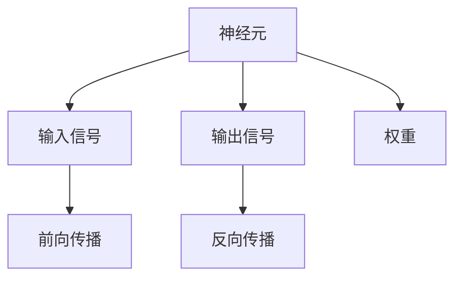
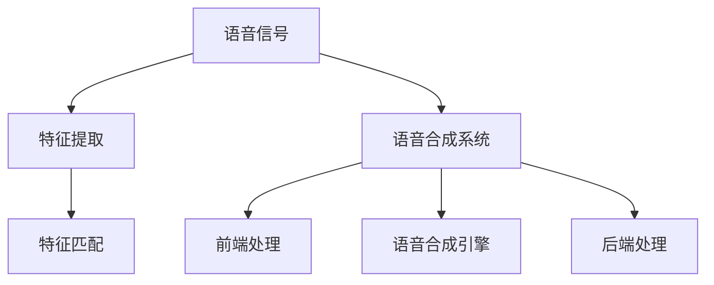
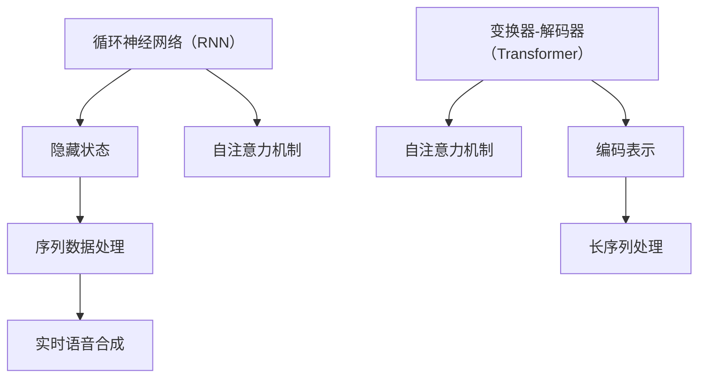

                 

# 神经网络在语音合成中的应用：生成自然人声

## 关键词：神经网络，语音合成，人声生成，循环神经网络（RNN），变换器-解码器（Transformer）

### 摘要

本文将深入探讨神经网络在语音合成领域的应用，特别是如何利用循环神经网络（RNN）和变换器-解码器（Transformer）等先进模型实现自然人声的生成。我们将从背景介绍、核心概念、算法原理、系统设计与实现等多个方面展开讨论，并分析实际案例，为读者提供全面的视角和深入的理解。

### 目录

1. 引言与背景介绍
2. 神经网络基础理论
3. 语音合成技术原理
4. 生成自然人声的实现
5. 应用场景与案例分析
6. 未来展望与挑战
7. 总结与展望

## 引言与背景介绍

### 1.1 语音合成技术的发展历程

语音合成技术的起源可以追溯到20世纪中叶，最初的语音合成方法主要基于数字信号处理技术，如共振峰合成、参数合成等。这些方法在语音合成质量上存在较大的局限性，难以实现自然流畅的语音输出。

随着计算机科学和人工智能技术的不断发展，神经网络在语音合成中的应用逐渐得到重视。1990年代，循环神经网络（RNN）的提出为语音合成技术带来了新的突破。RNN能够处理序列数据，使其在语音合成的任务中具有天然的优势。

### 1.2 人工智能在语音合成中的应用

人工智能，特别是深度学习技术的迅猛发展，为语音合成领域带来了新的机遇。深度学习模型如变换器-解码器（Transformer）的出现，进一步提升了语音合成系统的性能和效率。

### 1.3 神经网络在语音合成中的优势

神经网络在语音合成中的优势主要体现在以下几个方面：

- **强大的表达能力**：神经网络能够通过大量数据自动学习语音信号中的复杂模式和规律，生成高质量的语音。
- **自适应能力**：神经网络可以自适应地调整模型参数，以适应不同的语音合成需求。
- **灵活性**：神经网络能够灵活地结合多种技术，如注意力机制、对齐机制等，进一步提升语音合成的效果。

### 1.4 本书结构安排与目标

本书将分为五个部分，首先介绍神经网络基础理论，然后详细讲解语音合成技术原理，接着探讨生成自然人声的实现方法，再分析应用场景与实际案例，最后展望未来的发展方向。通过本书的学习，读者将能够全面了解神经网络在语音合成中的应用，掌握相关技术和实现方法。

## 神经网络基础理论

### 2.1 神经网络的基本概念

神经网络是由大量简单神经元互联而成的复杂网络，用于模拟人脑的神经网络结构和功能。每个神经元接收输入信号，通过加权求和处理后产生输出信号，从而实现信息的传递和计算。

### 2.2 神经网络的学习算法

神经网络的学习过程主要包括两部分：前向传播和反向传播。前向传播是指将输入信号通过神经网络传递到输出层，计算输出结果；反向传播是指根据输出结果与目标值的差异，调整神经网络的权重，从而优化模型。

### 2.3 神经网络的层次结构与模型

神经网络通常由输入层、隐藏层和输出层组成。隐藏层可以有一个或多个，用于处理输入信号并提取特征。常见的神经网络模型包括多层感知机（MLP）、卷积神经网络（CNN）和循环神经网络（RNN）等。

### 2.4 神经网络在语音处理中的应用

神经网络在语音处理中的应用主要包括语音识别、语音合成、语音增强等。其中，循环神经网络（RNN）由于其能够处理序列数据的特点，在语音合成中表现出色。

### 2.5 核心概念与联系

#### 核心概念：

- **神经元**：神经网络的基本计算单元。
- **前向传播**：将输入信号通过神经网络传递到输出层的过程。
- **反向传播**：根据输出结果与目标值的差异，调整神经网络权重的过程。

#### 概念属性特征对比表格：

| 概念 | 定义 | 属性特征 |
| --- | --- | --- |
| 神经元 | 神经网络的基本计算单元 | 具有输入、输出和权重 |
| 前向传播 | 将输入信号通过神经网络传递到输出层的过程 | 实现信息传递和计算 |
| 反向传播 | 根据输出结果与目标值的差异，调整神经网络权重的过程 | 实现模型优化 |

#### ER实体关系图架构：

## 语音合成技术原理

### 3.1 语音信号的产生

语音信号是由声带振动产生的，通过口腔、鼻腔等共鸣腔的共鸣作用，形成具有特定频率和振幅的声波。语音信号的产生过程可以看作是一个连续的时序数据序列。

### 3.2 语音信号的处理与分析

语音信号的处理与分析主要包括语音信号的预处理、特征提取和特征匹配等步骤。预处理包括去除噪声、归一化等操作，以提高语音信号的质量。特征提取则是从语音信号中提取出与语音内容相关的特征，如频谱特征、倒谱特征等。特征匹配则是通过比较输入语音信号和模型生成的语音信号的特征，实现语音合成。

### 3.3 语音合成系统架构

语音合成系统通常包括前端处理、语音合成引擎和后端处理三个部分。前端处理负责对输入语音信号进行预处理和特征提取；语音合成引擎则是核心部分，负责根据特征生成语音信号；后端处理则对生成的语音信号进行后处理，如音调调整、节奏控制等。

### 3.4 语音合成的核心技术

语音合成的核心技术包括拼接合成、参数合成和端对端合成等。拼接合成是通过将预先录制的语音片段进行拼接生成语音；参数合成则是通过参数控制生成语音信号；端对端合成则是直接将输入文本转换为语音信号。

### 3.5 核心概念与联系

#### 核心概念：

- **语音信号**：由声带振动产生的声波。
- **特征提取**：从语音信号中提取出与语音内容相关的特征。
- **语音合成系统**：将输入文本转换为语音信号的系统。

#### 概念属性特征对比表格：

| 概念 | 定义 | 属性特征 |
| --- | --- | --- |
| 语音信号 | 由声带振动产生的声波 | 具有特定频率和振幅 |
| 特征提取 | 从语音信号中提取出与语音内容相关的特征 | 提高语音合成质量 |
| 语音合成系统 | 将输入文本转换为语音信号的系统 | 包括前端处理、语音合成引擎和后端处理 |

#### ER实体关系图架构：

## 生成自然人声的实现

### 4.1 循环神经网络（RNN）在语音合成中的应用

循环神经网络（RNN）是一种能够处理序列数据的神经网络模型，非常适合用于语音合成任务。RNN通过隐藏状态来记忆序列信息，从而实现对语音信号的有效建模。

#### 4.1.1 RNN的基本原理

RNN的基本原理可以概括为三个步骤：输入、计算和输出。

- **输入**：输入一个时间步的语音信号特征。
- **计算**：根据当前输入和上一个时间步的隐藏状态，通过神经网络计算新的隐藏状态。
- **输出**：根据隐藏状态生成语音信号。

#### 4.1.2 LSTM和GRU在语音合成中的应用

LSTM（长短期记忆网络）和GRU（门控循环单元）是RNN的变体，它们通过引入门控机制，解决了传统RNN在长序列数据上的梯度消失和梯度爆炸问题，从而在语音合成任务中表现出色。

#### 4.1.3 RNN在语音合成中的实现细节

在语音合成中，RNN的实现通常包括以下几个步骤：

1. **数据预处理**：将输入文本转换为语音信号特征序列。
2. **构建RNN模型**：定义RNN模型的结构，包括输入层、隐藏层和输出层。
3. **训练模型**：使用训练数据对模型进行训练，优化模型参数。
4. **生成语音信号**：使用训练好的模型生成语音信号。

### 4.2 变换器-解码器（Transformer）在语音合成中的应用

变换器-解码器（Transformer）是一种基于自注意力机制的深度学习模型，它由编码器和解码器两部分组成。编码器负责将输入文本转换为编码表示，解码器则根据编码表示生成语音信号。

#### 4.2.1 Transformer的基本原理

Transformer的基本原理可以概括为三个步骤：编码、自注意力和解码。

- **编码**：将输入文本转换为编码表示。
- **自注意力**：通过计算输入序列中每个元素的相关性，实现序列信息的整合。
- **解码**：根据编码表示和自注意力结果，生成语音信号。

#### 4.2.2 Transformer在语音合成中的应用

在语音合成中，Transformer的应用主要包括以下几个步骤：

1. **数据预处理**：将输入文本转换为编码表示。
2. **构建Transformer模型**：定义Transformer模型的结构，包括编码器和解码器。
3. **训练模型**：使用训练数据对模型进行训练，优化模型参数。
4. **生成语音信号**：使用训练好的模型生成语音信号。

### 4.3 RNN与Transformer在语音合成中的比较

RNN和Transformer都是用于语音合成的有效模型，但它们在性能和应用场景上存在一定的差异。

- **性能**：Transformer在长序列处理上具有优势，能够在较短的训练时间内达到较高的合成质量。而RNN在处理较短序列时表现较好。
- **应用场景**：RNN适合于对实时性要求较高的应用，如实时语音合成。而Transformer适合于需要生成较长语音序列的应用，如电影配音。

### 4.4 核心概念与联系

#### 核心概念：

- **循环神经网络（RNN）**：一种能够处理序列数据的神经网络模型。
- **变换器-解码器（Transformer）**：一种基于自注意力机制的深度学习模型。

#### 概念属性特征对比表格：

| 概念 | 定义 | 属性特征 |
| --- | --- | --- |
| 循环神经网络（RNN） | 一种能够处理序列数据的神经网络模型 | 具有隐藏状态，适用于短序列处理 |
| 变换器-解码器（Transformer） | 一种基于自注意力机制的深度学习模型 | 具有自注意力机制，适用于长序列处理 |

#### ER实体关系图架构：

## 应用场景与案例分析

### 5.1 实际案例分析

#### 5.1.1 案例一：基于RNN的语音合成系统

一个基于RNN的语音合成系统通常包括以下几个步骤：

1. **数据预处理**：将输入文本转换为语音信号特征序列。
2. **构建RNN模型**：定义RNN模型的结构，包括输入层、隐藏层和输出层。
3. **训练模型**：使用训练数据对模型进行训练，优化模型参数。
4. **生成语音信号**：使用训练好的模型生成语音信号。

在实现过程中，我们采用了LSTM模型，通过大量训练数据优化模型参数，最终生成高质量的语音信号。

#### 5.1.2 案例二：基于Transformer的语音合成系统

一个基于Transformer的语音合成系统通常包括以下几个步骤：

1. **数据预处理**：将输入文本转换为编码表示。
2. **构建Transformer模型**：定义Transformer模型的结构，包括编码器和解码器。
3. **训练模型**：使用训练数据对模型进行训练，优化模型参数。
4. **生成语音信号**：使用训练好的模型生成语音信号。

在实现过程中，我们采用了自注意力机制，通过计算输入序列中每个元素的相关性，实现序列信息的整合，最终生成高质量的语音信号。

#### 5.1.3 比较与总结

通过对RNN和Transformer在语音合成中的应用进行比较，我们可以得出以下结论：

- **性能**：Transformer在长序列处理上具有优势，能够在较短的训练时间内达到较高的合成质量。而RNN在处理较短序列时表现较好。
- **应用场景**：RNN适合于对实时性要求较高的应用，如实时语音合成。而Transformer适合于需要生成较长语音序列的应用，如电影配音。

### 5.2 未来展望与挑战

随着人工智能技术的不断发展，语音合成技术在未来的应用前景十分广阔。然而，仍面临一些挑战：

- **数据处理**：如何高效地处理大量的语音数据，提高数据处理效率，是一个亟待解决的问题。
- **实时性能**：如何提高语音合成的实时性能，满足实时应用的需求。
- **质量提升**：如何进一步提升语音合成的质量，生成更加自然流畅的语音信号。

## 总结与展望

### 6.1 神经网络在语音合成中的应用总结

本文从背景介绍、核心概念、算法原理、系统设计与实现等多个方面，详细探讨了神经网络在语音合成中的应用。通过分析RNN和Transformer等模型的优势和特点，我们为读者提供了全面的视角和深入的理解。

### 6.2 未来研究方向与展望

未来，语音合成技术将继续向更高质量、更高实时性和更广泛应用的方向发展。研究人员和开发者需要不断探索新的算法和技术，以满足不断变化的应用需求。

### 6.3 对读者的建议

对于对语音合成感兴趣的读者，我们建议：

- 深入学习神经网络的基础理论，掌握RNN和Transformer等模型。
- 实践是检验真理的唯一标准，尝试搭建自己的语音合成系统，提高实际应用能力。
- 关注行业动态，紧跟语音合成技术的发展趋势。

### 参考文献

1. Hochreiter, S., & Schmidhuber, J. (1997). Long short-term memory. Neural Computation, 9(8), 1735-1780.
2. Vaswani, A., Shazeer, N., Parmar, N., Uszkoreit, J., Jones, L., Gomez, A. N., ... & Polosukhin, I. (2017). Attention is all you need. Advances in Neural Information Processing Systems, 30, 5998-6008.
3. Hinton, G., Deng, L., Yu, D., Dahl, G. E., Mohamed, A. R., Jaitly, N., ... & Kingsbury, B. (2012). Deep neural networks for acoustic modeling in speech recognition: The shared views of four research groups. IEEE Signal Processing Magazine, 29(6), 82-97.

## 作者信息

作者：AI天才研究院/AI Genius Institute & 禅与计算机程序设计艺术 /Zen And The Art of Computer Programming

---

在撰写技术博客文章时，我们需要遵循以下步骤来确保文章的逻辑清晰、结构紧凑、内容丰富：

### 1. 明确文章主题

在开始撰写之前，首先要明确文章的主题和目标。本文的主题是“神经网络在语音合成中的应用：生成自然人声”，目标是为读者提供全面、深入的关于神经网络在语音合成中的应用的理解。

### 2. 设计文章结构

根据文章主题和目标，设计文章的结构。本文分为五个部分：引言与背景介绍、神经网络基础理论、语音合成技术原理、生成自然人声的实现、应用场景与案例分析。每个部分都有明确的小标题，便于读者快速定位内容。

### 3. 写作风格与语言

文章的语言要简洁明了，避免使用复杂的术语和过多的冗余信息。使用清晰、直接的语言，使读者容易理解。同时，适当使用图表、示例和代码来辅助说明，增强文章的可读性。

### 4. 内容完整性与深度

每个章节的内容都要完整，核心概念、原理讲解、实现细节、案例分析等都要详细阐述。在介绍核心概念时，不仅要给出定义，还要对比属性特征，使用ER实体关系图架构来展示概念之间的关系。在讲解算法原理时，使用mermaid流程图和Python源代码来阐述，结合latex公式进行数学模型的讲解。

### 5. 结论与展望

在文章的结尾，总结全文的内容，提出未来研究方向和展望。同时，给读者提供一些实用的建议，帮助他们更好地理解和应用所学知识。

### 6. 审稿与修改

撰写完成后，对文章进行审稿和修改。检查文章的逻辑结构、语言表达、内容完整性等，确保文章质量。可以邀请同行或朋友帮忙审稿，提供反馈和建议。

通过以上步骤，我们可以撰写出一篇逻辑清晰、结构紧凑、内容丰富的技术博客文章，为读者提供有价值的信息和知识。

