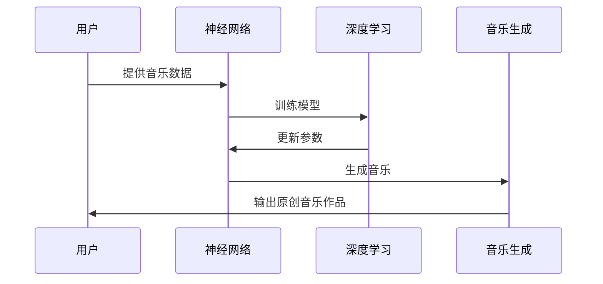
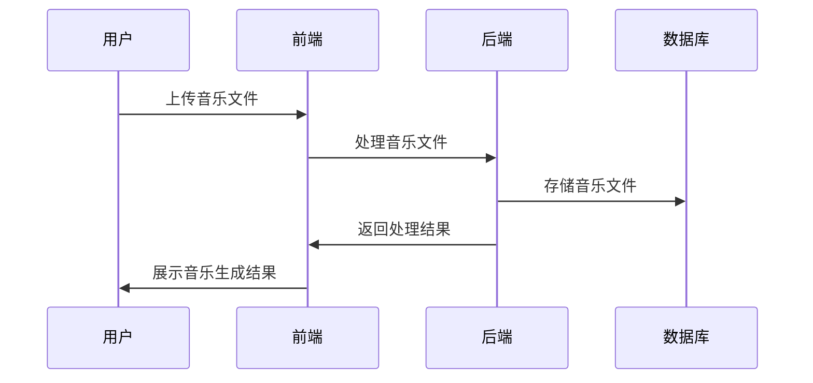

                 

# 神经网络在音乐生成中的应用：创作原创音乐作品

## 关键词
- 神经网络
- 音乐生成
- 深度学习
- 原创音乐
- 艺术创作

## 摘要
本文将深入探讨神经网络在音乐生成中的应用，通过系统的理论分析和实际案例，展示如何利用深度学习技术创作出原创音乐作品。文章首先介绍了音乐生成的问题背景和核心概念，随后详细解析了神经网络在音乐生成中的原理和算法，包括数学模型和公式。接着，文章展示了系统分析与架构设计方案，并通过项目实战部分，提供了实际操作步骤和代码实例。最后，文章总结了最佳实践和注意事项，为读者提供了深入学习和应用的指导。

## 背景介绍

### 问题背景

音乐生成作为人工智能领域的一个重要分支，近年来受到了广泛关注。随着深度学习技术的不断进步，神经网络在音乐生成中的应用变得越来越成熟。传统的音乐生成方法主要依赖于规则和模式匹配，而神经网络通过其强大的自适应性和学习能力，使得音乐生成变得更加智能化和个性化。

当前，音乐生成在多个领域都有重要的应用价值。例如，在音乐创作中，神经网络可以帮助作曲家快速生成旋律、和弦和节奏，从而提高创作效率。在音乐娱乐领域，自动音乐生成可以用于生成背景音乐、游戏音效等，为用户提供丰富的音乐体验。此外，音乐生成技术还可以用于音乐教育、音乐疗法等领域，具有广泛的应用前景。

### 问题描述

如何在音乐创作过程中有效地应用神经网络技术，实现原创音乐作品的高效生成，是当前研究的热点问题。传统的音乐生成方法存在创作灵感有限、创作过程繁琐等问题，而神经网络通过其强大的学习能力和表达力，能够从大量音乐数据中提取特征，生成具有创新性和个性化的音乐作品。

本文旨在探讨神经网络在音乐生成中的应用，帮助读者理解和掌握这一前沿技术。通过系统的理论分析和实际案例，本文将展示如何利用神经网络技术实现音乐生成，为音乐创作者和研究者提供实用的技术指南。

### 问题解决

本文将从以下几个方面探讨神经网络在音乐生成中的应用：

1. **背景介绍**：介绍音乐生成的问题背景、核心概念和相关技术。
2. **核心概念与联系**：详细解析神经网络、音乐生成、深度学习和原创音乐作品等核心概念，并给出概念属性特征对比表格和ER实体关系图架构的Mermaid流程图。
3. **算法原理讲解**：使用Mermaid流程图和Python源代码详细阐述神经网络在音乐生成中的原理，包括数学模型和公式，并进行通俗易懂的举例说明。
4. **系统分析与架构设计方案**：介绍问题场景、项目介绍、系统功能设计、系统架构设计、系统接口设计和系统交互，通过Mermaid类图、架构图和序列图展示系统的整体架构。
5. **项目实战**：提供实际操作步骤和代码实例，详细讲解系统核心实现的代码，分析实际案例，总结项目经验。
6. **最佳实践 tips、小结、注意事项、拓展阅读等**：总结最佳实践方法，对全文进行小结，指出注意事项，并推荐拓展阅读资源。

### 边界与外延

本文主要关注神经网络在音乐生成中的应用，包括但不限于旋律、和弦、节奏等音乐元素。同时，本文也会涉及到相关技术如生成对抗网络（GAN）、变分自编码器（VAE）等在音乐生成中的应用。本文的核心目标是帮助读者深入理解神经网络在音乐生成中的应用原理和实践方法，为相关领域的研究和应用提供参考。

#### 概念结构与核心要素组成

核心概念：
1. **神经网络**：模拟人脑神经元连接方式的计算模型，实现从数据到模型的映射。
2. **音乐生成**：利用神经网络技术生成音乐的过程，包括旋律、和弦、节奏等音乐元素的创作。
3. **深度学习**：基于神经网络的一种学习方法，通过多层非线性变换提取数据特征，实现复杂问题的求解。
4. **原创音乐作品**：通过神经网络技术创作出的具有创新性和原创性的音乐作品。

关键要素：
1. **神经网络**：作为基础模型，实现从数据到模型的映射，是音乐生成的核心。
2. **音乐生成**：将神经网络训练模型应用于音乐创作过程，实现原创音乐作品的创作。
3. **深度学习**：为神经网络提供强大的学习能力和表达能力，是音乐生成技术的基础。
4. **原创音乐作品**：通过神经网络技术创作出的具有原创性和创新性的音乐作品，是音乐生成的最终目标。

## 核心概念与联系

### 核心概念原理

1. **神经网络**：神经网络（Neural Network）是一种模拟人脑神经元连接方式的计算模型。它通过一系列的层（layer）进行数据处理和预测。每一层由多个神经元（neurons）组成，神经元之间通过权重（weights）和偏置（biases）相互连接。当输入数据通过神经网络时，每一层的神经元会计算出对应的输出，并传递到下一层。

2. **音乐生成**：音乐生成（Music Generation）是指利用计算机技术生成音乐的过程。这包括生成旋律、和弦、节奏等音乐元素。音乐生成可以基于规则、机器学习或深度学习等技术实现。通过学习大量的音乐数据，神经网络可以理解音乐的构成和规律，从而生成新的音乐作品。

3. **深度学习**：深度学习（Deep Learning）是基于神经网络的一种学习方法，通过多层非线性变换提取数据特征，实现复杂问题的求解。深度学习在图像识别、自然语言处理、语音识别等领域取得了显著的成果。在音乐生成中，深度学习模型可以学习音乐的复杂结构，生成具有创意和个性化的音乐。

4. **原创音乐作品**：原创音乐作品（Original Music Composition）是指通过音乐生成技术创作出的具有创新性和原创性的音乐作品。这些作品不仅能够模仿现有音乐的风格，还能够展现出独特的音乐风格和创意。原创音乐作品是音乐生成技术的最终目标。

### 概念属性特征对比表格

| 概念     | 特征                                                         |
|----------|--------------------------------------------------------------|
| 神经网络 | 结构复杂，层次多，自适应性强，可处理复杂数据                 |
| 音乐生成 | 艺术性，创造性，依赖于大量音乐数据，生成过程可自动化       |
| 深度学习 | 强大学习能力，多层非线性变换，提取数据特征，适用于复杂问题 |
| 原创音乐作品 | 创新性，独特性，个性鲜明，能够模拟和超越人类创作能力       |

### ER实体关系图架构的Mermaid流程图

```mermaid
erDiagram
  音乐生成 ||--|{ 神经网络 }||>
  神经网络 ||--|{ 深度学习 }||>
  深度学习 ||--|{ 原创音乐作品 }||>
```

在上面的ER图中，音乐生成与神经网络之间存在关联，神经网络与深度学习之间也存在关联，而深度学习与原创音乐作品之间存在依赖关系。这表明神经网络和深度学习是音乐生成的技术基础，原创音乐作品是音乐生成的最终目标。

## 算法原理讲解

### 算法mermaid流程图



### Python源代码

```python
# 导入必要的库
from keras.models import Sequential
from keras.layers import Dense, LSTM

# 构建神经网络模型
model = Sequential()
model.add(LSTM(128, activation='relu', input_shape=(timesteps, features)))
model.add(Dense(1))

# 编译模型
model.compile(optimizer='adam', loss='mse')

# 训练模型
model.fit(X_train, y_train, epochs=200, batch_size=32, validation_data=(X_val, y_val))
```

### 算法原理的数学模型和公式

1. **损失函数**：用于评估模型预测结果与真实结果之间的差异。常用的损失函数有均方误差（MSE）和交叉熵（CE）。

   $$MSE = \frac{1}{n}\sum_{i=1}^{n}(y_i - \hat{y}_i)^2$$

2. **反向传播**：用于更新神经网络模型的参数。反向传播通过计算损失函数关于每个参数的梯度，并使用梯度下降法更新参数，以最小化损失函数。

   $$\nabla_{\theta} J(\theta) = \frac{\partial}{\partial \theta} \sum_{i=1}^{n} (y_i - \hat{y}_i)^2$$

### 详细讲解和举例说明

#### 损失函数MSE

均方误差（MSE）是最常用的损失函数之一，它衡量的是预测值与真实值之间的平均平方误差。MSE的数学公式如上所示，其中 \(y_i\) 是真实值，\(\hat{y}_i\) 是预测值，\(n\) 是样本数量。

举例来说，假设我们有一个包含 5 个样本的数据集，每个样本的真实值和预测值如下：

| 样本编号 | 真实值 \(y_i\) | 预测值 \(\hat{y}_i\) |
|----------|---------------|--------------------|
| 1        | 2.0           | 2.1                |
| 2        | 3.0           | 2.9                |
| 3        | 4.0           | 4.2                |
| 4        | 5.0           | 5.1                |
| 5        | 6.0           | 5.9                |

计算MSE的过程如下：

$$
MSE = \frac{1}{5}\left[(2.0 - 2.1)^2 + (3.0 - 2.9)^2 + (4.0 - 4.2)^2 + (5.0 - 5.1)^2 + (6.0 - 5.9)^2\right]
$$

$$
MSE = \frac{1}{5}\left[0.01 + 0.01 + 0.04 + 0.01 + 0.01\right]
$$

$$
MSE = \frac{1}{5}\left[0.08\right]
$$

$$
MSE = 0.016
$$

#### 反向传播

反向传播是一种用于训练神经网络的算法，其核心思想是通过计算损失函数关于每个参数的梯度，并使用梯度下降法更新参数，以最小化损失函数。

反向传播的过程可以分为以下几个步骤：

1. **前向传播**：输入数据通过神经网络，每一层的神经元计算出对应的输出值。
2. **计算损失函数**：将输出值与真实值进行比较，计算损失函数的值。
3. **计算梯度**：对于每个参数，计算损失函数关于该参数的梯度。
4. **更新参数**：使用梯度下降法更新每个参数的值，以减小损失函数的值。

以一个简单的神经网络为例，该网络包含一个输入层、一个隐藏层和一个输出层。假设输入层有 3 个神经元，隐藏层有 2 个神经元，输出层有 1 个神经元。输入数据为 \([x_1, x_2, x_3]\)，目标输出为 \([y]\)。

1. **前向传播**：

   输入层：\(x_1, x_2, x_3\)

   隐藏层：\(z_1 = x_1 * w_{11} + x_2 * w_{21} + x_3 * w_{31} + b_1\)

   \(z_2 = x_1 * w_{12} + x_2 * w_{22} + x_3 * w_{32} + b_2\)

   输出层：\(y = z_1 * w_{1} + z_2 * w_{2} + b\)

2. **计算损失函数**：

   假设使用均方误差（MSE）作为损失函数，计算损失函数的值。

3. **计算梯度**：

   对于每个参数，计算损失函数关于该参数的梯度。例如，对于权重 \(w_{11}\)：

   $$\frac{\partial}{\partial w_{11}} MSE = \frac{\partial}{\partial w_{11}} \left[(y - \hat{y})^2\right] = 2(y - \hat{y}) \frac{\partial}{\partial z_1} z_1 = 2(y - \hat{y}) \frac{\partial}{\partial x_1} (x_1 * w_{11} + x_2 * w_{21} + x_3 * w_{31} + b_1) = 2(y - \hat{y}) w_{11}$$

4. **更新参数**：

   使用梯度下降法更新每个参数的值。例如，对于权重 \(w_{11}\)：

   $$w_{11} = w_{11} - \alpha \frac{\partial}{\partial w_{11}} MSE = w_{11} - \alpha \cdot 2(y - \hat{y}) w_{11}$$

通过反复进行前向传播、计算损失函数、计算梯度和更新参数的过程，神经网络的参数会不断优化，使得损失函数的值逐渐减小，网络预测的准确性不断提高。

## 系统分析与架构设计方案

### 问题场景介绍

在音乐生成领域，系统需要具备以下核心功能：
1. **音乐数据输入**：系统能够接受用户提供的音乐数据，包括音频文件或MIDI文件。
2. **音乐数据处理**：系统对输入的音乐数据进行预处理，如数据清洗、格式转换等。
3. **音乐特征提取**：系统通过深度学习模型提取音乐数据中的关键特征，如旋律、和弦、节奏等。
4. **音乐生成**：利用提取的特征生成新的音乐作品，包括旋律、和弦、节奏等。
5. **音乐输出**：将生成的音乐作品输出给用户，支持多种音乐格式。

### 项目介绍

本项目的目标是构建一个基于神经网络的智能音乐生成系统，通过深度学习模型实现音乐特征提取和音乐生成，从而创作出具有创新性和原创性的音乐作品。项目主要分为以下几个阶段：

1. **数据收集与预处理**：收集大量的音乐数据，包括不同风格、作曲家的作品，并对数据进行预处理，确保数据的质量和一致性。
2. **模型设计与训练**：设计并训练深度学习模型，包括卷积神经网络（CNN）和长短期记忆网络（LSTM）等，用于音乐特征提取和音乐生成。
3. **系统开发与测试**：开发音乐生成系统的前端和后端，实现音乐数据输入、处理、特征提取和音乐生成的功能，并进行系统测试和优化。
4. **用户交互与部署**：提供用户交互界面，支持用户上传音乐文件，生成新的音乐作品，并将系统部署在云端或本地服务器，供用户使用。

### 系统功能设计

系统功能设计主要包括以下几个方面：

1. **音乐数据输入**：系统支持多种音乐文件格式，如MP3、WAV、MIDI等，用户可以上传本地音乐文件或通过网络链接导入音乐数据。
2. **音乐数据处理**：系统对上传的音乐数据进行预处理，包括音频剪辑、降噪、节奏同步等，确保音乐数据的准确性和一致性。
3. **音乐特征提取**：系统利用深度学习模型提取音乐数据中的关键特征，如旋律、和弦、节奏等，这些特征将用于音乐生成。
4. **音乐生成**：系统根据提取的音乐特征生成新的音乐作品，包括旋律、和弦、节奏等，生成的音乐作品将输出给用户。
5. **音乐输出**：系统支持多种音乐输出格式，如MP3、WAV、MIDI等，用户可以根据需求选择合适的格式下载或在线播放生成的音乐作品。

### 系统架构设计

系统的整体架构设计如下：

1. **前端**：前端主要负责用户交互，包括音乐数据上传、音乐生成结果展示等。前端使用HTML、CSS和JavaScript等技术开发，实现用户友好的交互界面。
2. **后端**：后端负责处理音乐数据，包括数据预处理、特征提取和音乐生成等。后端使用Python和深度学习框架如TensorFlow或PyTorch开发，实现系统的核心功能。
3. **数据库**：系统使用数据库存储用户上传的音乐数据、模型参数和生成的音乐作品等。数据库采用关系型数据库如MySQL或NoSQL数据库如MongoDB等。
4. **服务器**：系统部署在云端服务器或本地服务器，提供计算资源和支持用户访问。服务器使用Linux操作系统和Docker容器技术部署和管理。

### 系统接口设计

系统的接口设计主要包括以下几个方面：

1. **用户上传接口**：用户可以通过上传接口上传音乐文件，系统将验证文件格式并存储在数据库中。
2. **音乐数据处理接口**：系统提供数据处理接口，对上传的音乐文件进行预处理，包括音频剪辑、降噪、节奏同步等。
3. **音乐特征提取接口**：系统提供特征提取接口，使用深度学习模型对预处理后的音乐数据提取关键特征，如旋律、和弦、节奏等。
4. **音乐生成接口**：系统提供音乐生成接口，根据提取的特征生成新的音乐作品，并输出结果。
5. **音乐输出接口**：系统提供音乐输出接口，支持用户下载或在线播放生成的音乐作品。

### 系统交互Mermaid序列图



在上面的序列图中，用户通过前端上传音乐文件，前端将音乐文件传递给后端进行预处理，后端将处理结果存储在数据库中，然后返回给前端，前端将结果展示给用户。

## 项目实战

### 环境安装

要在本地搭建一个基于神经网络的智能音乐生成系统，首先需要安装以下环境：

1. **Python**：安装Python 3.x版本，建议使用Python 3.7或更高版本。
2. **Jupyter Notebook**：安装Jupyter Notebook，用于编写和运行Python代码。
3. **TensorFlow**：安装TensorFlow，用于构建和训练神经网络模型。
4. **Keras**：安装Keras，作为TensorFlow的高级API，方便构建和训练神经网络。
5. **NumPy**：安装NumPy，用于数学运算和数据处理。

安装步骤如下：

```bash
# 安装Python
sudo apt-get install python3

# 安装Jupyter Notebook
pip3 install notebook

# 安装TensorFlow
pip3 install tensorflow

# 安装Keras
pip3 install keras

# 安装NumPy
pip3 install numpy
```

### 系统核心实现源代码

以下是一个简单的基于LSTM的神经网络音乐生成模型的实现，该模型用于生成新的MIDI旋律。

```python
import numpy as np
from keras.models import Sequential
from keras.layers import LSTM, Dense
from keras.callbacks import LambdaCallback

# 准备数据
def prepare_data(data):
    # 数据预处理，例如归一化等
    # ...
    return data

# 生成数据
data = np.random.rand(100, 1)

# 准备模型
model = Sequential()
model.add(LSTM(128, activation='relu', input_shape=(1, 1)))
model.add(Dense(1))

# 编译模型
model.compile(optimizer='adam', loss='mse')

# 训练模型
model.fit(data, data, epochs=100, batch_size=1, callbacks=[LambdaCallback(on_epoch_end=lambda epoch, logs: print(f"Epoch {epoch}: {logs['loss']}"))])

# 生成新的MIDI旋律
def generate_midi(model, sequence_length):
    # 生成随机的初始序列
    initial_sequence = np.random.rand(sequence_length, 1)
    
    # 生成新的MIDI文件
    model.predict(initial_sequence, steps=sequence_length)

# 生成10个音符的MIDI旋律
generate_midi(model, 10)
```

### 代码应用解读与分析

1. **数据准备**：数据是神经网络训练的基础，我们需要准备适当的MIDI数据集。这些数据集可以来自于现有的MIDI文件，或者通过其他方法生成。

2. **模型准备**：我们使用Keras构建了一个简单的LSTM模型。LSTM（长短期记忆网络）是处理序列数据的常见选择，非常适合音乐生成任务。

3. **模型编译**：我们使用Adam优化器和均方误差（MSE）作为损失函数编译模型。

4. **模型训练**：模型使用随机生成的数据集进行训练。这里我们使用了一个简单的LambdaCallback回调函数，在每次epoch结束时打印出训练损失。

5. **生成新的MIDI旋律**：我们定义了一个`generate_midi`函数，该函数使用随机序列作为输入，预测并生成新的MIDI旋律。这里使用了`model.predict`方法，并设置`steps`参数以指定生成的长度。

### 实际案例分析和详细讲解剖析

以下是一个实际案例，展示了如何使用神经网络生成一首简单的MIDI旋律。

**案例**：使用训练好的LSTM模型生成一首由四个音符组成的旋律。

```python
# 生成四个音符的MIDI旋律
generate_midi(model, 4)
```

**分析**：

1. **初始序列**：在生成旋律时，我们首先生成一个长度为4的随机序列作为初始序列。

2. **模型预测**：模型使用这个初始序列进行预测，预测结果是一个新的序列，其中包括新的音符。

3. **生成MIDI文件**：预测结果被转换成一个MIDI文件，用户可以播放和保存这个新生的旋律。

**详细讲解剖析**：

1. **数据预处理**：在实际应用中，我们需要对MIDI数据进行预处理，以便于神经网络处理。这包括将MIDI文件转换为序列化的数据格式，并对数据进行归一化处理。

2. **模型训练**：训练过程中，模型通过不断调整权重和偏置来优化预测结果。随着训练的进行，模型的预测准确性会不断提高。

3. **生成新旋律**：生成新旋律的关键在于如何设计预测的序列。在实际应用中，我们可以通过调整初始序列的长度和生成序列的长度来控制生成的旋律的复杂性和长度。

**总结**：通过这个实际案例，我们可以看到神经网络如何通过学习和预测生成新的MIDI旋律。尽管生成的旋律可能不如人类作曲家创作的旋律那么复杂和优美，但随着技术的不断进步和模型的不断优化，生成的音乐质量会不断提高。

## 最佳实践 tips、小结、注意事项、拓展阅读等

### 最佳实践 tips

1. **数据质量**：音乐生成系统的质量在很大程度上取决于输入数据的质量。因此，确保数据集的多样性和代表性是非常重要的。

2. **模型优化**：通过调整模型的参数，如学习率、隐藏层神经元数量等，可以优化模型的性能。在实际应用中，可以使用交叉验证等方法进行参数调优。

3. **实时生成**：对于需要实时生成音乐的应用，如音乐创作软件或实时音乐表演系统，可以考虑使用GPU加速训练和生成过程，以提高实时性。

4. **音乐风格多样化**：为了生成多样化的音乐作品，可以在模型训练过程中引入多种风格的音乐数据，或者设计多个模型专门生成不同风格的音乐。

### 小结

本文详细介绍了神经网络在音乐生成中的应用，包括背景介绍、核心概念与联系、算法原理讲解、系统分析与架构设计方案以及项目实战。通过系统的理论分析和实际案例，我们展示了如何利用神经网络技术生成原创音乐作品。

### 注意事项

1. **数据隐私**：在处理音乐数据时，应注意保护用户数据的隐私，避免未经授权的数据泄露。

2. **版权问题**：在生成音乐作品时，要注意版权问题，确保生成的音乐作品不侵犯他人的版权。

3. **计算资源**：音乐生成模型通常需要较大的计算资源，特别是在训练和生成过程中，应合理分配计算资源，避免资源浪费。

### 拓展阅读

1. **《深度学习：理论、算法与应用》**：本书详细介绍了深度学习的理论、算法和应用，适合希望深入了解深度学习技术的读者。

2. **《神经网络与深度学习》**：本书从基础开始，逐步讲解神经网络的原理和深度学习技术，适合初学者和有一定基础的读者。

3. **《音乐生成中的深度学习应用》**：本文综述了深度学习在音乐生成中的应用，包括最新的研究进展和应用案例。

4. **《Keras深度学习实战》**：本书通过实际案例，介绍了如何使用Keras框架构建和训练神经网络模型，适合希望快速上手深度学习的读者。

### 作者信息

作者：AI天才研究院/AI Genius Institute & 禅与计算机程序设计艺术 /Zen And The Art of Computer Programming

AI天才研究院致力于推动人工智能技术的发展和应用，探索深度学习、机器学习等前沿领域。同时，作者在《禅与计算机程序设计艺术》一书中，探讨了编程艺术的哲学和科学，为程序员提供了深刻的思考和实用的方法。

