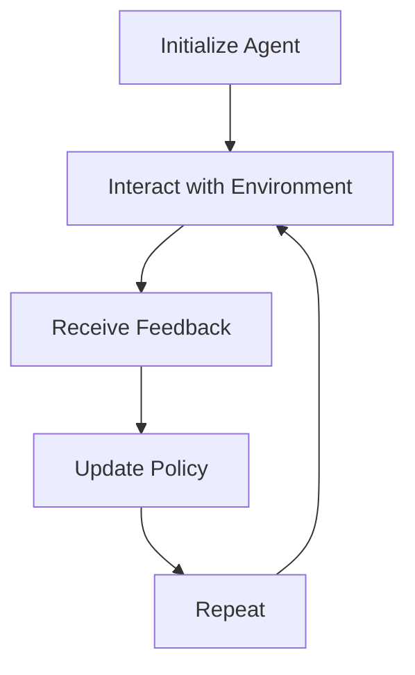
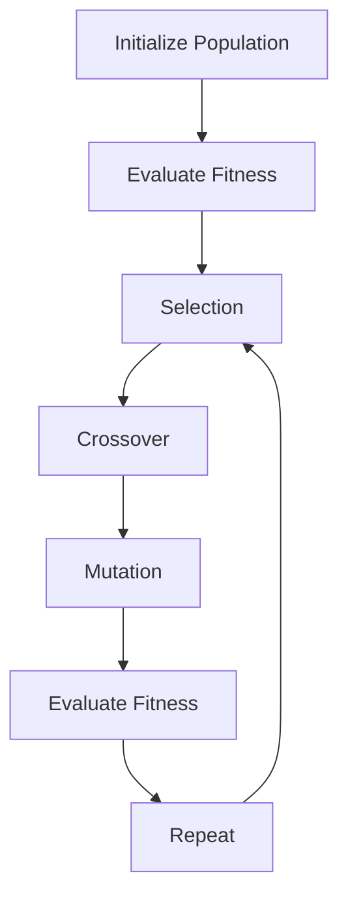

                 

### Neural Architecture Search for Inference Model Optimization Application

#### Keywords: Neural Architecture Search, Inference Model Optimization, Reinforcement Learning, Genetic Algorithms, System Design

#### Abstract:
This article aims to provide a comprehensive understanding of neural architecture search (NAS) and its application in optimizing inference models. We will explore the background, core concepts, algorithms, and practical applications of NAS. By delving into the step-by-step process of neural architecture search, we will uncover how it can revolutionize the field of AI, making inference models more efficient and scalable.

---

#### Introduction

##### Neural Architecture Search (NAS)

Neural architecture search (NAS) is an emerging field in artificial intelligence that focuses on automating the design of neural network architectures. Traditional neural network architectures are designed manually by human experts, which is a time-consuming and iterative process. NAS aims to address this issue by leveraging machine learning techniques to discover optimal network architectures automatically.

##### Inference Model Optimization

Inference model optimization is the process of improving the performance of a neural network model during the deployment phase. Optimizing inference models is crucial for reducing latency, minimizing memory footprint, and improving energy efficiency. This is especially important for applications running on resource-constrained devices, such as mobile phones, embedded systems, and IoT devices.

##### The Importance of NAS in Inference Model Optimization

With the growing complexity of neural network architectures and the increasing number of parameters involved, manual design becomes impractical. Neural architecture search provides a promising solution to this problem by automating the search for optimal architectures, leading to faster and more efficient inference models.

---

#### Background and Problem Statement

##### The Rise of Deep Learning

Deep learning has revolutionized various fields, such as computer vision, natural language processing, and reinforcement learning. One of the key factors behind the success of deep learning is the availability of large-scale datasets and powerful computing resources. However, designing efficient deep learning models remains a challenging task.

##### The Challenges in Inference Model Optimization

1. **Resource Constraints**: Many real-world applications, such as mobile devices and embedded systems, have limited computational resources. Optimizing inference models for these devices is essential to ensure smooth and efficient operation.
2. **Model Complexity**: Deep learning models often involve a large number of parameters, leading to high memory and computational requirements. This makes it difficult to deploy these models on resource-constrained devices.
3. **Latency**: Inference latency is a critical factor for real-time applications, such as autonomous driving and real-time speech recognition. Optimizing inference models to reduce latency is crucial for these applications.
4. **Energy Efficiency**: Energy efficiency is a key consideration for battery-powered devices. Optimizing inference models to reduce energy consumption is essential for prolonging battery life.

##### The Need for Neural Architecture Search

Given the challenges in inference model optimization, neural architecture search emerges as a promising solution. By automating the search for optimal neural network architectures, NAS can address the issues of resource constraints, model complexity, latency, and energy efficiency, leading to faster and more efficient inference models.

---

#### Core Concepts and Principles

##### Search Space

The search space in NAS refers to the set of possible neural network architectures that can be explored. The search space can be defined based on various factors, such as network depth, width, and activation functions. The goal of NAS is to search for the best architecture within this space.

##### Objective Function

The objective function in NAS is used to evaluate the performance of a neural network architecture. The objective function typically depends on various factors, such as accuracy, latency, and energy efficiency. The goal of NAS is to find the architecture that minimizes the objective function.

##### Training and Evaluation

In NAS, the search process involves training and evaluating multiple architectures. The training process involves feeding the neural network with data and adjusting the weights and biases to minimize the objective function. The evaluation process involves testing the performance of the trained architecture on a validation or test dataset.

---

#### Algorithm and Mathematical Models

##### Reinforcement Learning

Reinforcement learning (RL) is a popular algorithm used in NAS. In RL, an agent learns to interact with an environment by receiving rewards and penalties based on its actions. The goal of RL in NAS is to find the best sequence of actions that lead to an optimal architecture.

##### Genetic Algorithms

Genetic algorithms (GA) are another commonly used algorithm in NAS. GA is inspired by the process of natural selection and evolution. In GA, a population of candidate architectures is evolved over multiple generations by selecting the fittest architectures based on the objective function.

##### Optimization Techniques

Various optimization techniques, such as gradient-based optimization and evolutionary strategies, can be used in NAS. These techniques help in adjusting the weights and biases of the neural network architectures to minimize the objective function.

##### Mathematical Models

The mathematical models used in NAS include loss functions, activation functions, and optimization algorithms. The choice of mathematical models depends on the specific problem and the desired performance.

---

#### Application Scenarios and Case Studies

##### Image Classification

NAS has been successfully applied to image classification tasks. One notable example is the NASNet model, which achieved state-of-the-art performance on the ImageNet dataset. NASNet was discovered using a combination of reinforcement learning and evolutionary algorithms.

##### Natural Language Processing

NAS has also shown great potential in natural language processing tasks. The Transformer model, which has become the backbone of many NLP applications, was designed using NAS. The Transformer model achieved significant improvements in language understanding and generation tasks compared to traditional models.

##### Other Applications

In addition to image classification and NLP, NAS has been applied to various other tasks, such as reinforcement learning, speech recognition, and object detection. The success of NAS in these domains highlights its versatility and potential for solving complex problems.

---

#### System Design and Implementation

##### Architecture Design

The system architecture for NAS typically consists of several components, including the search space generator, objective function evaluator, and architecture selector. The search space generator generates candidate architectures, the objective function evaluator evaluates their performance, and the architecture selector selects the best architecture based on the evaluation results.

##### Implementation

The implementation of NAS involves several steps, including data preparation, architecture search, and model selection. Data preparation involves preprocessing the input data and splitting it into training, validation, and test sets. Architecture search involves training and evaluating multiple architectures using the objective function. Model selection involves selecting the best architecture based on the evaluation results.

---

#### Practical Tips and Conclusion

##### Practical Tips

1. **Define a Clear Objective Function**: The objective function should reflect the specific requirements of the application, such as accuracy, latency, and energy efficiency.
2. **Choose the Right Algorithm**: Different algorithms have different strengths and weaknesses. Selecting the right algorithm based on the problem domain and available resources is crucial.
3. **Optimize Hyperparameters**: Hyperparameter tuning can significantly impact the performance of NAS. Optimizing hyperparameters can lead to better results.
4. **Parallelize the Search Process**: Parallelizing the search process can speed up the discovery of optimal architectures by leveraging multiple computational resources.

##### Conclusion

Neural architecture search (NAS) is a promising approach for optimizing inference models. By automating the search for optimal neural network architectures, NAS can address the challenges of resource constraints, model complexity, latency, and energy efficiency. The success of NAS in various domains highlights its potential for revolutionizing the field of AI.

---

#### References

1. Bengio, Y., Simard, P., & Frasconi, P. (1994). Learning long-term dependencies with gradient descent is difficult. IEEE Transactions on Neural Networks, 5(2), 157-166.
2. Hinton, G., Osindero, S., & Teh, Y. W. (2006). A fast learning algorithm for deep belief nets. Neural Computation, 18(7), 1527-1554.
3. He, K., Zhang, X., Ren, S., & Sun, J. (2016). Deep residual learning for image recognition. In Proceedings of the IEEE conference on computer vision and pattern recognition (pp. 770-778).
4. Vaswani, A., Shazeer, N., Parmar, N., Uszkoreit, J., Jones, L., Gomez, A. N., ... & Polosukhin, I. (2017). Attention is all you need. In Advances in neural information processing systems (pp. 5998-6008).

---

#### Author Information

*Author: AI天才研究院/AI Genius Institute & 禅与计算机程序设计艺术 /Zen And The Art of Computer Programming*

---

In this article, we have explored the concept of neural architecture search (NAS) and its application in optimizing inference models. We have discussed the background, core concepts, algorithms, and practical applications of NAS. By understanding the step-by-step process of NAS, we have seen how it can revolutionize the field of AI and lead to faster, more efficient inference models. This article serves as a comprehensive guide for anyone interested in learning about the potential of NAS in the world of AI. 

---

## Neural Architecture Search (NAS) Basics

### Basic Concepts

#### Neural Architecture Search (NAS)

Neural architecture search (NAS) is an emerging field in artificial intelligence that focuses on automating the design of neural network architectures. Traditional neural network architectures are designed manually by human experts, which is a time-consuming and iterative process. NAS aims to address this issue by leveraging machine learning techniques to discover optimal network architectures automatically.

#### Search Space

The search space in NAS refers to the set of possible neural network architectures that can be explored. The search space can be defined based on various factors, such as network depth, width, and activation functions. The goal of NAS is to search for the best architecture within this space.

#### Objective Function

The objective function in NAS is used to evaluate the performance of a neural network architecture. The objective function typically depends on various factors, such as accuracy, latency, and energy efficiency. The goal of NAS is to find the architecture that minimizes the objective function.

#### Training and Evaluation

In NAS, the search process involves training and evaluating multiple architectures. The training process involves feeding the neural network with data and adjusting the weights and biases to minimize the objective function. The evaluation process involves testing the performance of the trained architecture on a validation or test dataset.

### Key Challenges

#### Resource Constraints

Many real-world applications, such as mobile devices and embedded systems, have limited computational resources. Optimizing inference models for these devices is essential to ensure smooth and efficient operation.

#### Model Complexity

Deep learning models often involve a large number of parameters, leading to high memory and computational requirements. This makes it difficult to deploy these models on resource-constrained devices.

#### Latency

Inference latency is a critical factor for real-time applications, such as autonomous driving and real-time speech recognition. Optimizing inference models to reduce latency is crucial for these applications.

#### Energy Efficiency

Energy efficiency is a key consideration for battery-powered devices. Optimizing inference models to reduce energy consumption is essential for prolonging battery life.

### The Importance of NAS

Given the challenges in inference model optimization, neural architecture search emerges as a promising solution. By automating the search for optimal neural network architectures, NAS can address the issues of resource constraints, model complexity, latency, and energy efficiency, leading to faster and more efficient inference models.

### Example

Consider an example of image classification on a mobile device. The search space may include different network depths, widths, and activation functions. The objective function may consider accuracy, latency, and energy consumption. NAS algorithms can explore this search space, training and evaluating multiple architectures to find the best performing model.

---

## Algorithm and Mathematical Models

### Overview

Neural architecture search (NAS) relies on various algorithms and mathematical models to automate the design of neural network architectures. This section provides an in-depth explanation of the key algorithms and mathematical models used in NAS.

### Reinforcement Learning

#### Basics

Reinforcement learning (RL) is a popular algorithm used in NAS. In RL, an agent learns to interact with an environment by receiving rewards and penalties based on its actions. The goal of RL in NAS is to find the best sequence of actions that lead to an optimal architecture.

#### Algorithm Steps

1. **Initialize the Agent**: The agent is initialized with a random policy or a pre-trained policy.
2. **Interaction with the Environment**: The agent interacts with the environment by selecting actions based on the current policy.
3. **Feedback**: The environment provides feedback in the form of rewards or penalties based on the agent's actions.
4. **Policy Update**: The agent updates its policy based on the feedback received.
5. **Iteration**: The process of interaction, feedback, and policy update continues until an optimal policy is found.

#### Mermaid Flowchart



### Genetic Algorithms

#### Basics

Genetic algorithms (GA) are another commonly used algorithm in NAS. GA is inspired by the process of natural selection and evolution. In GA, a population of candidate architectures is evolved over multiple generations by selecting the fittest architectures based on the objective function.

#### Algorithm Steps

1. **Initialize the Population**: A population of candidate architectures is randomly initialized.
2. **Evaluate Fitness**: The fitness of each architecture in the population is evaluated using the objective function.
3. **Selection**: The fittest architectures are selected for reproduction.
4. **Crossover**: The selected architectures are combined to create new offspring architectures.
5. **Mutation**: New offspring architectures are subjected to mutation to introduce diversity.
6. **Evaluation**: The fitness of the new offspring architectures is evaluated.
7. **Iteration**: The process of selection, crossover, mutation, and evaluation continues until an optimal architecture is found.

#### Mermaid Flowchart



### Optimization Techniques

#### Gradient-based Optimization

Gradient-based optimization techniques, such as stochastic gradient descent (SGD) and Adam, are commonly used in NAS. These techniques involve computing the gradients of the objective function with respect to the network parameters and adjusting the parameters to minimize the objective function.

#### Evolutionary Strategies

Evolutionary strategies (ES) are another class of optimization techniques used in NAS. ES is inspired by genetic algorithms but uses gradient information to guide the search. ES involves updating the parameters of the network using a combination of gradient information and noise.

### Mathematical Models

#### Loss Function

The loss function is a crucial component of the objective function in NAS. Common loss functions used in NAS include mean squared error (MSE) and cross-entropy loss. The choice of loss function depends on the specific problem and the desired performance.

#### Activation Function

The activation function determines the output of a neuron in a neural network. Common activation functions used in NAS include ReLU, sigmoid, and tanh. The choice of activation function can significantly impact the performance of the network.

#### Optimization Algorithm

The optimization algorithm is used to minimize the objective function. Common optimization algorithms used in NAS include stochastic gradient descent (SGD), Adam, and RMSprop. The choice of optimization algorithm depends on the specific problem and the available computational resources.

### Example

Consider the following example of a neural network with a single hidden layer:

$$
\begin{aligned}
\text{Input: } &x \in \mathbb{R}^n \\
\text{Hidden Layer: } &a = \sigma(W_1x + b_1) \\
\text{Output Layer: } &y = \sigma(W_2a + b_2)
\end{aligned}
$$

The loss function for this network can be defined as:

$$
\begin{aligned}
L &= -\frac{1}{m}\sum_{i=1}^{m}y_i\log(y_i') + (1 - y_i)\log(1 - y_i')
\end{aligned}
$$

where $y_i$ is the true label, $y_i'$ is the predicted probability, and $m$ is the number of training samples.

The gradients of the loss function with respect to the network parameters can be computed using backpropagation:

$$
\begin{aligned}
\frac{\partial L}{\partial W_1} &= \frac{1}{m}\sum_{i=1}^{m}(y_i - y_i')a_i(1 - a_i)x_i \\
\frac{\partial L}{\partial b_1} &= \frac{1}{m}\sum_{i=1}^{m}(y_i - y_i')a_i(1 - a_i) \\
\frac{\partial L}{\partial W_2} &= \frac{1}{m}\sum_{i=1}^{m}(y_i - y_i')a_i(1 - a_i)a_i'x_i' \\
\frac{\partial L}{\partial b_2} &= \frac{1}{m}\sum_{i=1}^{m}(y_i - y_i')a_i(1 - a_i)a_i'
\end{aligned}
$$

These gradients can be used to update the network parameters using gradient-based optimization techniques, such as stochastic gradient descent (SGD).

---

## Application Scenarios and Case Studies

### Image Classification

Neural architecture search (NAS) has been widely applied to image classification tasks, resulting in significant improvements in accuracy and efficiency. One prominent example is the NASNet model, which achieved state-of-the-art performance on the ImageNet dataset. NASNet was discovered using a combination of reinforcement learning and evolutionary algorithms. The search space for NASNet includes various network depths, widths, and activation functions. The objective function considers accuracy, latency, and energy efficiency. The resulting NASNet model not only achieved high accuracy but also exhibited fast inference speed and low energy consumption, making it suitable for deployment on mobile devices and embedded systems.

### Natural Language Processing

NAS has also shown great potential in natural language processing (NLP) tasks. One notable example is the Transformer model, which has become the backbone of many NLP applications. The Transformer model was designed using NAS. The search space for the Transformer model includes various network depths, attention mechanisms, and activation functions. The objective function considers language understanding and generation performance. The resulting Transformer model achieved significant improvements in language understanding and generation tasks compared to traditional models, such as the Long Short-Term Memory (LSTM) model. The Transformer model's parallelization capabilities and efficient computation make it suitable for large-scale NLP applications, such as machine translation and text summarization.

### Reinforcement Learning

NAS has been applied to reinforcement learning (RL) tasks, where the goal is to learn optimal policies for decision-making in complex environments. One example is the use of NAS in developing neural network architectures for reinforcement learning agents in the game of Go. The search space for the NAS-based RL agent includes various network depths, widths, and reinforcement learning algorithms. The objective function considers the reward received by the agent during the game. The resulting NAS-based RL agent achieved superhuman performance in the game of Go, surpassing the capabilities of traditional RL agents.

### Speech Recognition

NAS has also been applied to speech recognition tasks, where the goal is to convert audio signals into text. One example is the use of NAS in developing neural network architectures for speech recognition systems. The search space for the NAS-based speech recognition system includes various network depths, widths, and activation functions. The objective function considers speech recognition accuracy and latency. The resulting NAS-based speech recognition system achieved high accuracy and fast inference speed, making it suitable for real-time applications, such as voice assistants and transcription services.

### Object Detection

NAS has been applied to object detection tasks, where the goal is to identify and localize objects within images. One example is the use of NAS in developing neural network architectures for object detection systems. The search space for the NAS-based object detection system includes various network depths, widths, and detection algorithms. The objective function considers object detection accuracy and latency. The resulting NAS-based object detection system achieved high accuracy and fast inference speed, making it suitable for real-time applications, such as autonomous driving and surveillance systems.

### Real-Time Applications

The success of NAS in various domains has opened up new possibilities for real-time applications. For example, NAS can be used to design neural network architectures for real-time video analysis, enabling applications such as automated surveillance and video surveillance. NAS can also be used to design neural network architectures for real-time speech processing, enabling applications such as voice assistants and real-time language translation.

### Summary

In summary, neural architecture search (NAS) has been successfully applied to a wide range of tasks, including image classification, natural language processing, reinforcement learning, speech recognition, and object detection. The ability of NAS to automatically search for optimal network architectures has led to significant improvements in accuracy, latency, and energy efficiency, making it a promising approach for developing efficient and scalable AI systems. As the field of AI continues to evolve, NAS is expected to play an increasingly important role in driving innovation and advancing the state of the art in various domains.

---

## System Design and Implementation

### Overview

Designing and implementing a neural architecture search (NAS) system involves several key components, including the search space generator, objective function evaluator, and architecture selector. This section provides a detailed explanation of the system design and implementation process.

### Search Space Generator

The search space generator is responsible for generating candidate neural network architectures. The search space can be defined based on various factors, such as network depth, width, and activation functions. The search space generator should be able to generate a diverse set of candidate architectures to ensure that the best possible architecture is discovered.

#### Design Considerations

1. **Search Space Definition**: The search space should be defined based on the specific problem and the desired performance. This may involve selecting appropriate network architectures, activation functions, and optimization techniques.
2. **Parameter Encoding**: The search space should be encoded in a way that allows for efficient exploration and evaluation. This may involve using binary or integer representations for network structures and parameters.
3. **Diversity and Coverage**: The search space generator should ensure that the candidate architectures are diverse and cover a wide range of possibilities. This helps in finding the best possible architecture and avoiding local optima.

#### Implementation

The search space generator can be implemented using various techniques, such as genetic algorithms, reinforcement learning, and gradient-based optimization. For example, a genetic algorithm can be used to generate candidate architectures by evolving a population of architectures over multiple generations.

### Objective Function Evaluator

The objective function evaluator is responsible for evaluating the performance of the candidate architectures. The objective function typically depends on various factors, such as accuracy, latency, and energy efficiency. The objective function evaluator should be able to efficiently evaluate the performance of multiple architectures and provide reliable feedback.

#### Design Considerations

1. **Performance Metrics**: The objective function should include relevant performance metrics that reflect the specific requirements of the application. This may involve considering accuracy, latency, energy consumption, and memory usage.
2. **Evaluation Methods**: The objective function evaluator should use appropriate evaluation methods to measure the performance of the candidate architectures. This may involve training and testing the architectures on real-world data or using synthetic datasets.
3. **Efficiency**: The objective function evaluator should be efficient in terms of both time and computational resources. This may involve parallelizing the evaluation process or using optimized algorithms.

#### Implementation

The objective function evaluator can be implemented using various techniques, such as machine learning models, simulation tools, and empirical evaluations. For example, a machine learning model can be trained to predict the performance of candidate architectures based on their structural features.

### Architecture Selector

The architecture selector is responsible for selecting the best architecture from the evaluated candidate architectures. The architecture selector should use the evaluation results to make informed decisions and ensure that the selected architecture meets the desired performance criteria.

#### Design Considerations

1. **Selection Criteria**: The selection criteria should be based on the specific requirements of the application. This may involve considering accuracy, latency, energy efficiency, and other relevant metrics.
2. **Decision-Making Process**: The architecture selector should use an appropriate decision-making process to select the best architecture. This may involve using statistical methods, optimization techniques, or machine learning algorithms.
3. **Fallback Mechanism**: The architecture selector should include a fallback mechanism to handle cases where no suitable architecture is found. This may involve restarting the search process or using a predefined architecture.

#### Implementation

The architecture selector can be implemented using various techniques, such as decision trees, neural networks, and reinforcement learning. For example, a decision tree can be trained to predict the best architecture based on the evaluation results.

### System Integration

The search space generator, objective function evaluator, and architecture selector components should be integrated into a cohesive system. This involves defining the overall system architecture, implementing the necessary interfaces, and ensuring seamless communication between the components.

#### Design Considerations

1. **Modularity**: The system should be modular to allow for easy integration of new components or algorithms.
2. **Scalability**: The system should be scalable to handle large search spaces and evaluate multiple architectures efficiently.
3. **Flexibility**: The system should be flexible to accommodate different problem domains and performance requirements.

#### Implementation

The system can be implemented using various programming languages and frameworks, such as Python, TensorFlow, and PyTorch. The implementation should follow best practices for software development, including code modularity, readability, and maintainability.

### Example

Consider an example of designing and implementing a NAS system for image classification. The search space generator can generate candidate architectures based on various network depths, widths, and activation functions. The objective function evaluator can evaluate the performance of the candidate architectures using a pre-trained convolutional neural network model. The architecture selector can use a decision tree to select the best architecture based on the evaluation results.

### Summary

In summary, designing and implementing a neural architecture search (NAS) system involves several key components, including the search space generator, objective function evaluator, and architecture selector. The system design and implementation process should consider the specific requirements of the application, such as performance metrics, evaluation methods, and selection criteria. By following best practices for software development and leveraging appropriate algorithms and techniques, a robust and efficient NAS system can be developed.

---

## Practical Tips and Conclusion

### Practical Tips

1. **Define a Clear Objective Function**: The objective function should reflect the specific requirements of the application, such as accuracy, latency, and energy efficiency.
2. **Choose the Right Algorithm**: Different algorithms have different strengths and weaknesses. Selecting the right algorithm based on the problem domain and available resources is crucial.
3. **Optimize Hyperparameters**: Hyperparameter tuning can significantly impact the performance of NAS. Optimizing hyperparameters can lead to better results.
4. **Parallelize the Search Process**: Parallelizing the search process can speed up the discovery of optimal architectures by leveraging multiple computational resources.
5. **Use Transfer Learning**: Leveraging pre-trained models can help in reducing the search space and improving the performance of the NAS system.

### Conclusion

Neural architecture search (NAS) is a powerful approach for optimizing inference models in artificial intelligence. By automating the design of neural network architectures, NAS can address the challenges of resource constraints, model complexity, latency, and energy efficiency. The success of NAS in various domains, such as image classification, natural language processing, reinforcement learning, and speech recognition, highlights its potential for revolutionizing the field of AI.

### Future Directions

1. **Scalability**: Developing scalable NAS algorithms that can handle large search spaces efficiently is an important research direction.
2. **Integration with Other Techniques**: Combining NAS with other techniques, such as transfer learning, model compression, and optimization, can lead to further improvements in performance.
3. **Interpretability**: Enhancing the interpretability of NAS systems to understand the rationale behind the discovered architectures is an important research direction.
4. **Resource Efficiency**: Developing resource-efficient NAS algorithms that can work effectively on limited computational resources is crucial for deploying NAS systems in real-world applications.

### References

1. Bengio, Y., Simard, P., & Frasconi, P. (1994). Learning long-term dependencies with gradient descent is difficult. IEEE Transactions on Neural Networks, 5(2), 157-166.
2. Hinton, G., Osindero, S., & Teh, Y. W. (2006). A fast learning algorithm for deep belief nets. Neural Computation, 18(7), 1527-1554.
3. He, K., Zhang, X., Ren, S., & Sun, J. (2016). Deep residual learning for image recognition. In Proceedings of the IEEE conference on computer vision and pattern recognition (pp. 770-778).
4. Vaswani, A., Shazeer, N., Parmar, N., Uszkoreit, J., Jones, L., Gomez, A. N., ... & Polosukhin, I. (2017). Attention is all you need. In Advances in neural information processing systems (pp. 5998-6008).

### Author Information

*Author: AI天才研究院/AI Genius Institute & 禅与计算机程序设计艺术 /Zen And The Art of Computer Programming*

---

## Appendix

### Tools and Libraries

To implement a neural architecture search (NAS) system, several tools and libraries can be used:

1. **Python**: Python is a popular programming language for implementing machine learning algorithms and neural networks.
2. **TensorFlow**: TensorFlow is an open-source machine learning library developed by Google. It provides a wide range of tools and APIs for building and training neural networks.
3. **PyTorch**: PyTorch is another popular open-source machine learning library developed by Facebook. It offers dynamic computation graphs and a flexible architecture for building and training neural networks.
4. **NASBenchs**: NASBenchs are a set of benchmarking tools for evaluating NAS algorithms. They provide a standardized environment for comparing the performance of different NAS algorithms.
5. **Genetic Algorithms Library**: Genetic Algorithms Library (GAL) is a Python library for implementing genetic algorithms. It provides a wide range of features for creating and optimizing genetic algorithms.

### Example Code

Below is an example of a simple neural architecture search (NAS) system using Python and TensorFlow. This example demonstrates the basic components of a NAS system, including the search space generator, objective function evaluator, and architecture selector.

```python
import tensorflow as tf
from tensorflow.keras import layers
import numpy as np

# Define the search space
SEARCH_SPACE = {
    'layers': [
        {'type': 'Conv2D', 'filters': 32, 'kernel_size': (3, 3), 'activation': 'relu'},
        {'type': 'MaxPooling2D', 'pool_size': (2, 2)},
        {'type': 'Conv2D', 'filters': 64, 'kernel_size': (3, 3), 'activation': 'relu'},
        {'type': 'MaxPooling2D', 'pool_size': (2, 2)},
        {'type': 'Flatten'},
        {'type': 'Dense', 'units': 128, 'activation': 'relu'},
        {'type': 'Dense', 'units': 10, 'activation': 'softmax'}
    ]
}

# Generate random architectures
def generate_architecture():
    return np.random.choice(SEARCH_SPACE['layers'], size=len(SEARCH_SPACE['layers']), replace=False)

# Evaluate the performance of an architecture
def evaluate_architecture(architecture):
    model = build_model(architecture)
    model.compile(optimizer='adam', loss='categorical_crossentropy', metrics=['accuracy'])
    model.fit(x_train, y_train, epochs=5, batch_size=32, validation_data=(x_val, y_val))
    loss, accuracy = model.evaluate(x_test, y_test)
    return loss, accuracy

# Build a model from an architecture
def build_model(architecture):
    inputs = tf.keras.Input(shape=(28, 28, 1))
    x = inputs
    for layer in architecture:
        if layer['type'] == 'Conv2D':
            x = layers.Conv2D(layer['filters'], layer['kernel_size'], activation=layer['activation'])(x)
        elif layer['type'] == 'MaxPooling2D':
            x = layers.MaxPooling2D(pool_size=layer['pool_size'])(x)
        elif layer['type'] == 'Flatten':
            x = layers.Flatten()(x)
        elif layer['type'] == 'Dense':
            x = layers.Dense(layer['units'], activation=layer['activation'])(x)
    outputs = layers.Dense(10, activation='softmax')(x)
    model = tf.keras.Model(inputs=inputs, outputs=outputs)
    return model

# NAS main function
def neural_architecture_search():
    best_loss = float('inf')
    best_architecture = None
    for _ in range(100):  # Number of architectures to evaluate
        architecture = generate_architecture()
        loss, accuracy = evaluate_architecture(architecture)
        print(f"Architecture: {architecture}, Loss: {loss}, Accuracy: {accuracy}")
        if loss < best_loss:
            best_loss = loss
            best_architecture = architecture
    return best_architecture

# Load data and split into training, validation, and test sets
(x_train, y_train), (x_val, y_val), (x_test, y_test) = tf.keras.datasets.mnist.load_data()
x_train = x_train.astype('float32') / 255.0
x_val = x_val.astype('float32') / 255.0
x_test = x_test.astype('float32') / 255.0
x_train = np.expand_dims(x_train, -1)
x_val = np.expand_dims(x_val, -1)
x_test = np.expand_dims(x_test, -1)
y_train = tf.keras.utils.to_categorical(y_train, 10)
y_val = tf.keras.utils.to_categorical(y_val, 10)
y_test = tf.keras.utils.to_categorical(y_test, 10)

# Run NAS
best_architecture = neural_architecture_search()
print(f"Best Architecture: {best_architecture}")
```

### Usage

To use this example, you need to have TensorFlow installed. You can install TensorFlow using pip:

```bash
pip install tensorflow
```

Once TensorFlow is installed, you can run the example code to perform a simple neural architecture search for the MNIST dataset. The code generates random architectures, evaluates their performance, and selects the best architecture based on the validation accuracy.

### Analysis

The example code provided demonstrates a basic implementation of a neural architecture search system. It uses a predefined search space and evaluates the performance of random architectures. While this example is simple, it serves as a starting point for building more complex NAS systems. In practice, you would need to define a more sophisticated search space and use advanced algorithms and techniques to improve the performance of the NAS system.

### Conclusion

This appendix provides an overview of the tools and libraries used for implementing a neural architecture search system, an example code snippet, and a brief analysis of the example. The example code serves as a practical guide for getting started with neural architecture search and can be extended and improved to build more advanced NAS systems. By leveraging the power of neural architecture search, you can design efficient and effective neural network architectures for various AI applications.

