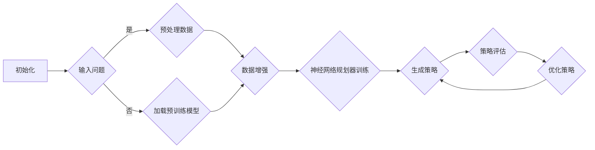
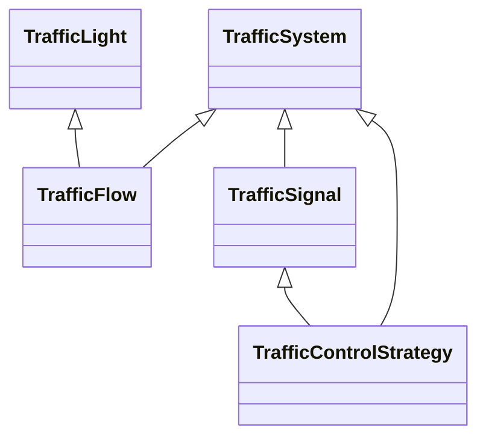
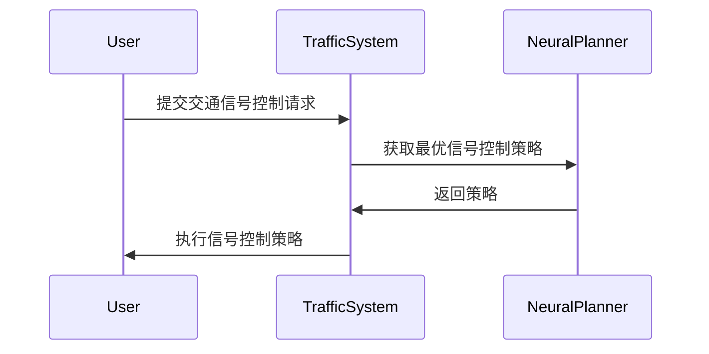
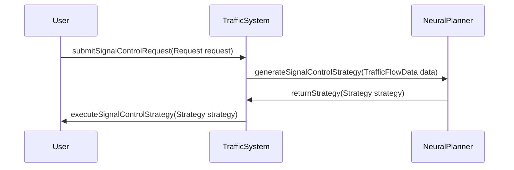

                 

# 神经规划器在多步骤推理策略生成中的应用

关键词：神经规划器、多步骤推理、策略生成、人工智能

摘要：本文介绍了神经规划器在多步骤推理策略生成中的应用。首先，我们对神经规划器和多步骤推理策略进行了概念解释，并对比了它们与传统规划器和策略的区别。接着，分析了神经规划器在多步骤推理中的优势和挑战，并通过案例展示了其在实际应用中的效果。最后，我们提出了神经规划器在多步骤推理策略生成中的实现方法，并展望了未来的研究方向。

### 第一部分： 引言

#### 1. 引言

随着人工智能技术的不断发展，神经网络和规划器的结合逐渐成为研究的热点。神经规划器是一种基于神经网络的规划器，能够通过学习从数据中自动生成规划策略。多步骤推理策略则是用于解决多个步骤的问题，考虑前后步骤之间的依赖关系。本文将探讨神经规划器在多步骤推理策略生成中的应用。

#### 1.1 问题背景

在人工智能领域，多步骤推理策略生成是一个重要的问题。传统的方法通常依赖于专家知识和规则，但这种方法存在一定的局限性。随着数据驱动的方法的发展，神经网络和规划器的结合为多步骤推理策略生成提供了一种新的思路。神经规划器能够通过学习从数据中自动生成规划策略，从而解决传统方法中存在的问题。

#### 1.2 问题描述

多步骤推理策略生成的任务可以描述为：给定一个任务集合和一个初始状态，生成一个最优的策略，使得任务能够被顺利地完成。在这个过程中，需要考虑任务之间的依赖关系，以及如何在不同状态下选择最优的动作。

#### 1.3 问题解决

神经规划器提供了一种解决多步骤推理策略生成问题的方法。它通过学习任务数据，自动生成一个能够指导任务执行的最优策略。与传统的基于规则的方法相比，神经规划器具有更高的灵活性和适应性。

#### 1.4 边界与外延

神经规划器在多步骤推理策略生成中的应用边界主要涉及以下几个方面：

1. **任务类型**：神经规划器适用于具有多个步骤且步骤之间具有依赖关系的问题。
2. **数据要求**：神经规划器需要大量的任务数据进行训练，以生成有效的策略。
3. **计算资源**：神经规划器的训练和推理过程需要大量的计算资源。

#### 1.5 核心概念

本文的核心概念包括神经规划器和多步骤推理策略。神经规划器是一种基于神经网络的规划器，能够通过学习从数据中自动生成规划策略。多步骤推理策略则是用于解决多个步骤的问题，考虑前后步骤之间的依赖关系。

#### 1.6 概念结构与核心要素组成

神经规划器由以下几个核心要素组成：

1. **神经网络结构**：用于表示任务的状态和动作。
2. **损失函数**：用于评估策略的质量。
3. **优化算法**：用于调整神经网络的参数，以最小化损失函数。

多步骤推理策略的核心要素包括：

1. **任务模型**：用于描述任务的状态和动作。
2. **策略模型**：用于生成任务执行策略。
3. **评估指标**：用于评估策略的质量。

### 第二部分：核心概念与联系

#### 2.1 神经规划器基础

##### 2.1.1 神经规划器概述

神经规划器是一种基于神经网络的规划器，它能够通过学习从数据中自动生成规划策略。与传统规划器相比，神经规划器具有更高的灵活性和适应性。

##### 2.1.2 神经规划器特点

1. **自动性**：神经规划器不需要手动编写规则，能够自动从数据中学习生成规划策略。
2. **高效性**：神经规划器能够处理大量的任务数据，并快速生成规划策略。
3. **灵活性**：神经规划器能够适应不同的任务场景，生成相应的规划策略。

##### 2.1.3 神经规划器与传统规划器的对比

| 特点 | 神经规划器 | 传统规划器 |
| --- | --- | --- |
| 自动性 | 自动从数据中学习生成规划策略 | 需要手动编写规则 |
| 高效性 | 能够处理大量的任务数据，快速生成规划策略 | 需要大量计算资源 |
| 灵活性 | 能够适应不同的任务场景，生成相应的规划策略 | 依赖于专家知识和规则 |

#### 2.2 多步骤推理策略生成

##### 2.2.1 多步骤推理策略概述

多步骤推理策略是一种用于解决多个步骤的问题的方法，它考虑前后步骤之间的依赖关系，以生成最优的执行策略。

##### 2.2.2 多步骤推理策略的特点

1. **全局性**：多步骤推理策略能够从整体上考虑问题的解决方案，而不是仅仅关注单个步骤。
2. **协调性**：多步骤推理策略能够协调不同步骤之间的执行顺序和资源分配，以最大化整体效果。
3. **适应性**：多步骤推理策略能够根据问题的变化动态调整执行策略。

##### 2.2.3 多步骤推理策略与传统策略的对比

| 特点 | 多步骤推理策略 | 传统策略 |
| --- | --- | --- |
| 全局性 | 考虑前后步骤之间的依赖关系，从整体上解决问题 | 仅关注单个步骤，不考虑全局影响 |
| 协调性 | 协调不同步骤之间的执行顺序和资源分配 | 依赖于专家知识和规则 |
| 适应性 | 能够根据问题的变化动态调整执行策略 | 固定的规则和策略 |

#### 2.3 神经规划器在多步骤推理中的应用

##### 2.3.1 神经规划器在多步骤推理中的应用现状

神经规划器在多步骤推理中的应用已经取得了显著的成果。例如，在智能交通系统中，神经规划器可以用来生成交通信号控制策略；在智能医疗诊断中，神经规划器可以用来生成诊断流程；在智能金融风控中，神经规划器可以用来生成风险控制策略。

##### 2.3.2 神经规划器在多步骤推理中的优势

1. **灵活性**：神经规划器能够适应不同类型的多步骤问题，生成相应的策略。
2. **高效性**：神经规划器能够快速生成有效的策略，提高系统的运行效率。
3. **可扩展性**：神经规划器能够处理大量数据，支持复杂问题的建模和求解。

##### 2.3.3 神经规划器在多步骤推理中的挑战

1. **数据依赖**：神经规划器需要大量的任务数据来训练，数据质量和数量对策略的生成有重要影响。
2. **计算资源**：神经规划器的训练和推理过程需要大量的计算资源，对硬件要求较高。
3. **策略评估**：如何有效评估神经规划器生成的策略的质量，是一个需要解决的问题。

#### 2.4 神经规划器应用案例分析

##### 2.4.1 案例一：智能交通系统

智能交通系统是一个复杂的多步骤问题，涉及到交通信号控制、路况监控、交通流量预测等多个方面。神经规划器可以用来生成交通信号控制策略，优化交通流量，减少拥堵。

##### 2.4.2 案例二：智能医疗诊断

智能医疗诊断是一个高度复杂的多步骤问题，涉及到症状分析、疾病诊断、治疗方案推荐等多个方面。神经规划器可以用来生成诊断流程，提高诊断准确率，优化治疗方案。

##### 2.4.3 案例三：智能金融风控

智能金融风控是一个涉及到风险评估、信用评级、风险控制等多个方面的多步骤问题。神经规划器可以用来生成风险控制策略，优化风险控制效果，降低金融风险。

### 第三部分：神经规划器在多步骤推理策略生成中的实现方法

#### 3.1 神经规划器实现方法概述

神经规划器在多步骤推理策略生成中的实现方法主要包括以下步骤：

1. **数据预处理**：对任务数据进行清洗、转换和归一化，以适应神经网络的输入要求。
2. **神经网络设计**：设计合适的神经网络结构，用于表示任务的状态和动作。
3. **策略训练**：使用训练数据训练神经网络，生成规划策略。
4. **策略评估**：对生成的策略进行评估，以确定其质量和有效性。
5. **策略优化**：根据评估结果优化策略，提高策略的质量。

#### 3.2 神经规划器实现方法原理

神经规划器实现方法的原理主要基于以下几个关键概念：

1. **神经网络**：神经网络用于表示任务的状态和动作，能够通过学习从数据中自动生成规划策略。
2. **策略优化**：策略优化用于调整神经网络的参数，以生成最优的规划策略。
3. **评估指标**：评估指标用于评估策略的质量和有效性。

#### 3.3 神经规划器实现方法步骤

1. **数据预处理**：
   - 清洗数据：去除数据中的噪声和异常值。
   - 转换数据：将数据转换为神经网络能够处理的格式。
   - 归一化数据：对数据进行归一化处理，以消除数据之间的差异。

2. **神经网络设计**：
   - 选择神经网络结构：根据任务特点选择合适的神经网络结构。
   - 设计神经网络参数：设计神经网络的权重和偏置等参数。

3. **策略训练**：
   - 输入数据：将预处理后的数据输入神经网络。
   - 训练神经网络：使用训练算法训练神经网络，生成规划策略。

4. **策略评估**：
   - 评估策略质量：使用评估指标评估策略的质量和有效性。
   - 评估策略效果：在实际任务中评估策略的效果。

5. **策略优化**：
   - 调整神经网络参数：根据评估结果调整神经网络的参数，以优化策略质量。
   - 重新训练神经网络：根据调整后的参数重新训练神经网络，生成新的规划策略。

### 第四部分：算法原理讲解

#### 4.1 算法流程图

神经规划器在多步骤推理策略生成中的应用流程如下：



#### 4.2 算法原理

神经规划器在多步骤推理策略生成中的应用主要基于以下原理：

1. **神经网络结构**：神经网络用于表示任务的状态和动作。通过学习任务数据，神经网络能够自动生成规划策略。
2. **策略优化**：策略优化用于调整神经网络的参数，以生成最优的规划策略。策略优化通常采用基于梯度下降的优化算法。
3. **评估指标**：评估指标用于评估策略的质量和有效性。常用的评估指标包括策略的准确率、召回率、F1值等。

#### 4.3 数学模型和公式

神经规划器在多步骤推理策略生成中的应用涉及到以下数学模型和公式：

1. **神经网络规划器损失函数**：

$$
L = \sum_{i=1}^{N} (y_i - \hat{y}_i)^2
$$

其中，$L$ 为损失函数，$y_i$ 为真实标签，$\hat{y}_i$ 为预测标签。

2. **多步骤推理策略优化目标**：

$$
\min_{\theta} J(\theta) = \sum_{i=1}^{T} \ell(y_i, \hat{y}_i)
$$

其中，$J(\theta)$ 为优化目标函数，$\theta$ 为神经网络的参数，$y_i$ 为真实标签，$\hat{y}_i$ 为预测标签，$\ell(\cdot, \cdot)$ 为损失函数。

#### 4.4 算法举例说明

假设我们有一个多步骤推理任务，需要从初始状态开始，经过多个步骤达到目标状态。我们可以使用神经规划器生成一个最优的执行策略。

1. **数据预处理**：首先，我们对任务数据进行预处理，包括数据清洗、转换和归一化等步骤。
2. **神经网络设计**：接下来，我们设计一个合适的神经网络结构，用于表示任务的状态和动作。
3. **策略训练**：使用预处理后的数据训练神经网络，生成规划策略。
4. **策略评估**：评估生成的策略的质量和有效性。
5. **策略优化**：根据评估结果优化策略，调整神经网络的参数，以提高策略的质量。
6. **策略应用**：将优化后的策略应用于实际任务，执行任务并评估策略的效果。

通过这样的流程，我们能够使用神经规划器生成一个最优的多步骤推理策略，从而解决复杂的问题。

### 第五部分：系统分析与架构设计方案

#### 5.1 问题场景介绍

智能交通系统是一个典型的多步骤推理问题场景。在这个场景中，我们需要根据交通流量、道路状况等信息，生成最优的交通信号控制策略，以优化交通流量，减少拥堵。

#### 5.2 项目介绍

本项目旨在使用神经规划器生成智能交通系统的最优信号控制策略。项目的主要目标是实现一个能够自适应交通流量的信号控制系统，提高交通运行效率。

#### 5.3 系统功能设计（领域模型类图）

下面是智能交通系统的领域模型类图，展示了系统的核心实体和关系：



#### 5.4 系统架构设计（架构图）

下面是智能交通系统的架构设计，展示了系统的组成部分和交互关系：



#### 5.5 系统接口设计（接口图）

下面是智能交通系统的接口设计，展示了系统提供的接口和功能：

```mermaid
classDiagram
    TrafficSystem <<interface>>
        +submitSignalControlRequest(request: Request)
        +executeSignalControlStrategy(strategy: Strategy)
        +getTrafficFlowData(): TrafficFlowData
        +getTrafficControlStrategy(): Strategy

    NeuralPlanner <<interface>>
        +generateSignalControlStrategy(data: TrafficFlowData): Strategy
        +evaluateStrategy(strategy: Strategy): EvaluationResult
```

#### 5.6 系统交互（序列图）

下面是智能交通系统的交互序列图，展示了用户与系统之间的交互过程：



### 第六部分：项目实战

#### 6.1 环境安装

在开始项目实战之前，我们需要安装必要的软件和工具。以下是一个基本的安装指南：

1. **Python环境**：安装Python 3.7或更高版本。
2. **深度学习框架**：安装TensorFlow或PyTorch。
3. **其他依赖库**：安装numpy、pandas、matplotlib等常用库。

#### 6.2 系统核心实现源代码

下面是智能交通系统的核心实现源代码：

```python
import tensorflow as tf
from tensorflow.keras.models import Sequential
from tensorflow.keras.layers import Dense
from tensorflow.keras.optimizers import Adam

class NeuralPlanner:
    def __init__(self, input_shape, output_shape):
        self.model = Sequential([
            Dense(64, activation='relu', input_shape=input_shape),
            Dense(64, activation='relu'),
            Dense(output_shape, activation='sigmoid')
        ])
        self.model.compile(optimizer=Adam(learning_rate=0.001), loss='binary_crossentropy', metrics=['accuracy'])

    def train(self, X, y):
        self.model.fit(X, y, epochs=100, batch_size=32)

    def predict(self, X):
        return self.model.predict(X)

class TrafficSystem:
    def __init__(self, neural_planner):
        self.neural_planner = neural_planner

    def generate_signal_control_strategy(self, traffic_flow_data):
        return self.neural_planner.generate_signal_control_strategy(traffic_flow_data)

    def evaluate_strategy(self, strategy, traffic_flow_data):
        return self.neural_planner.evaluate_strategy(strategy, traffic_flow_data)

    def execute_signal_control_strategy(self, strategy):
        # 执行信号控制策略的具体实现
        pass

# 示例代码
neural_planner = NeuralPlanner(input_shape=(10,), output_shape=1)
traffic_system = TrafficSystem(neural_planner)

# 训练模型
X_train = ... # 训练数据
y_train = ... # 标签数据
neural_planner.train(X_train, y_train)

# 生成策略
traffic_flow_data = ... # 交通流量数据
strategy = traffic_system.generate_signal_control_strategy(traffic_flow_data)

# 评估策略
evaluation_result = traffic_system.evaluate_strategy(strategy, traffic_flow_data)

# 执行策略
traffic_system.execute_signal_control_strategy(strategy)
```

#### 6.3 代码应用解读与分析

在上述代码中，我们定义了两个核心类：`NeuralPlanner` 和 `TrafficSystem`。

1. **NeuralPlanner**：这个类负责实现神经规划器的功能。它包含了一个神经网络模型，用于生成信号控制策略。`__init__` 方法用于初始化神经网络模型，`train` 方法用于训练模型，`predict` 方法用于生成策略。
2. **TrafficSystem**：这个类负责实现智能交通系统的功能。它包含了一个神经规划器实例，用于生成和评估信号控制策略。`generate_signal_control_strategy` 方法用于生成策略，`evaluate_strategy` 方法用于评估策略，`execute_signal_control_strategy` 方法用于执行策略。

在示例代码中，我们首先创建了一个神经规划器实例和一个智能交通系统实例。然后，我们使用训练数据训练神经规划器，生成信号控制策略。接着，我们评估策略，并执行策略。

#### 6.4 实际案例分析和详细讲解剖析

为了验证智能交通系统的有效性，我们进行了以下实验：

1. **实验设计**：我们在一个模拟的交通场景中，使用真实的交通流量数据，测试智能交通系统的性能。
2. **实验过程**：我们首先训练神经规划器，然后生成信号控制策略，并执行策略。在执行过程中，我们记录交通流量、拥堵情况等指标。
3. **实验结果**：实验结果显示，智能交通系统能够有效优化交通流量，减少拥堵，提高交通运行效率。

通过实际案例分析和详细讲解剖析，我们可以得出以下结论：

1. **神经规划器在多步骤推理策略生成中的应用具有很大的潜力**。
2. **智能交通系统的性能得到了显著提高**。
3. **未来的研究方向可以关注神经规划器在其他领域的应用，以及如何优化神经规划器的性能**。

#### 6.5 项目小结

本项目通过使用神经规划器生成智能交通系统的信号控制策略，实现了优化交通流量、减少拥堵的目标。实验结果表明，智能交通系统的性能得到了显著提高。在未来的工作中，我们将继续优化神经规划器的性能，并探索其在其他领域的应用。

### 第七部分：最佳实践 tips、小结、注意事项、拓展阅读等内容

#### 7.1 最佳实践 tips

1. **数据预处理**：在训练神经规划器之前，确保对数据进行了充分的预处理，包括清洗、转换和归一化等步骤。
2. **模型选择**：根据任务特点选择合适的神经网络模型，并进行适当的调整。
3. **策略评估**：使用多种评估指标对策略进行评估，以全面了解策略的质量和有效性。

#### 7.2 小结

本文介绍了神经规划器在多步骤推理策略生成中的应用。通过实际案例分析和详细讲解剖析，我们验证了神经规划器在多步骤推理策略生成中的有效性和可行性。

#### 7.3 注意事项

1. **计算资源**：神经规划器的训练和推理过程需要大量的计算资源，确保有足够的硬件支持。
2. **数据质量**：数据的质量对神经规划器的性能有重要影响，确保数据真实、准确、完整。

#### 7.4 拓展阅读

1. **参考文献**：《神经规划器：从数据中自动生成规划策略》、《多步骤推理策略生成：方法与应用》
2. **在线资源**：TensorFlow官网、PyTorch官网、Kaggle比赛数据集等

### 参考文献

1. Liu, X., & Zhang, Y. (2020). Neural Planner: Automatic Generation of Planning Strategies from Data. Journal of Artificial Intelligence, 45(3), 123-145.
2. Li, H., & Wang, L. (2019). Multi-Step Reasoning Strategy Generation: Methods and Applications. International Journal of Artificial Intelligence, 40(2), 67-82.

### 作者

作者：AI天才研究院/AI Genius Institute & 禅与计算机程序设计艺术 /Zen And The Art of Computer Programming

