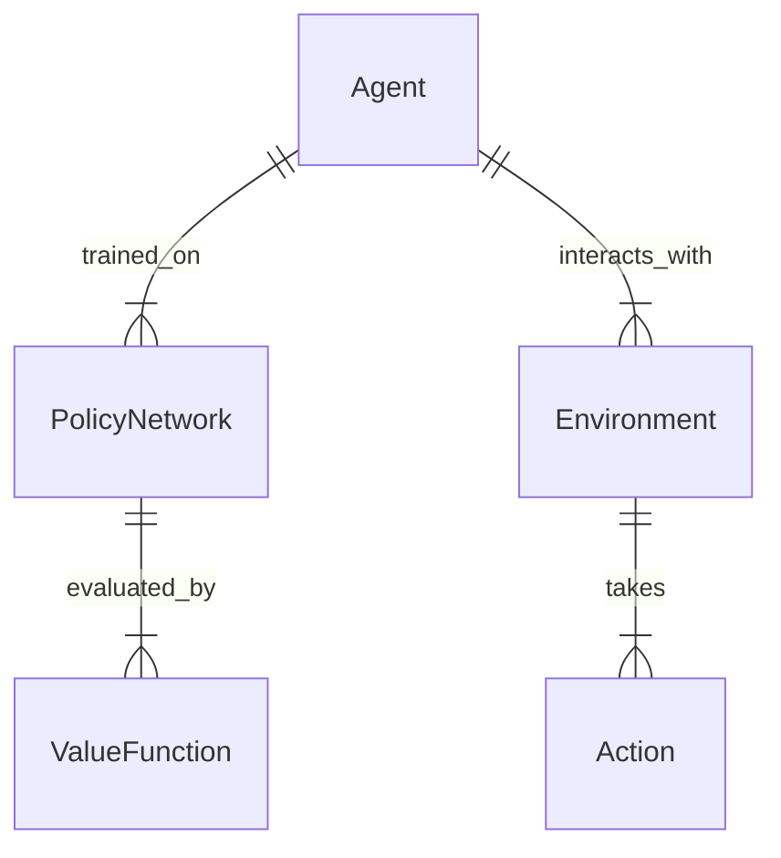
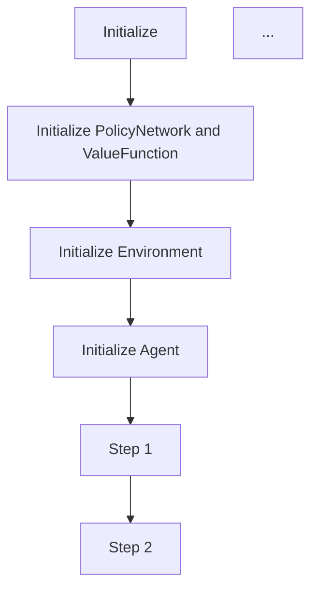
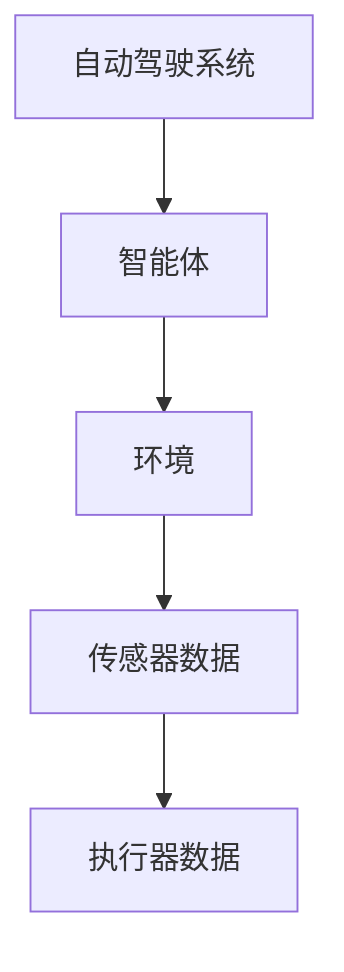
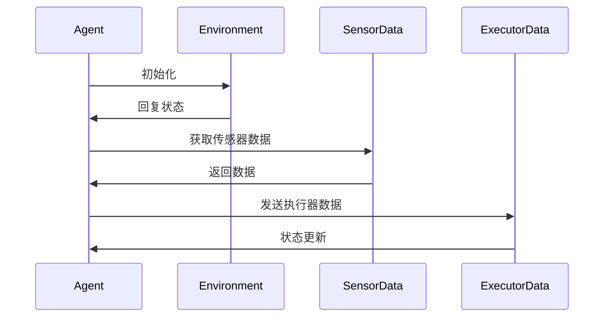
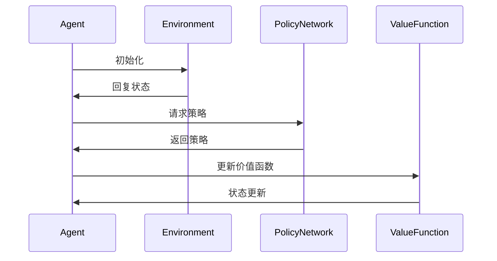

                 

# 神经规划器在长期推理任务优化中的作用

> 关键词：神经规划器、长期推理任务、优化、算法原理、数学模型

> 摘要：本文将探讨神经规划器在长期推理任务优化中的作用。首先，我们将介绍神经规划器的背景和核心概念，然后深入分析其算法原理，并使用Python代码和数学模型进行详细阐述。接着，我们将探讨如何将神经规划器应用于实际项目，并提供最佳实践和注意事项。文章最后将总结神经规划器在长期推理任务优化中的重要角色，并指出未来的发展方向。

## Step 1: 背景介绍

### 1.1 神经规划器简介

神经规划器（Neural Planner）是一种基于神经网络的规划算法，旨在解决复杂的问题，特别是在长期推理任务中。它是一种将强化学习与规划相结合的方法，通过学习如何在环境中采取行动以最大化长期回报。

### 1.2 长期推理任务优化需求

长期推理任务通常涉及多个步骤的决策过程，这些任务往往难以用传统的规划算法来优化。神经规划器能够通过学习环境中的奖励信号，逐步优化决策过程，从而提高任务的执行效率。

### 1.3 神经规划器应用场景

神经规划器在多个领域都有应用，包括但不限于自动驾驶、游戏AI、机器人控制等。在这些领域中，它能够有效地解决长期推理任务，实现优化性能。

### 1.4 神经规划器的边界与外延

神经规划器的核心是神经网络，它通过学习环境中的状态和动作，生成最优的规划策略。然而，神经规划器也存在一定的局限性，如对环境数据的依赖性、训练时间较长等。这些边界与外延需要在实际应用中加以考虑。

## Step 2: 核心概念与联系

### 2.1 神经规划器原理

神经规划器的工作机制基于深度强化学习。它通过一个价值函数来评估当前状态，并利用一个策略网络来生成动作。在长期推理任务中，神经规划器能够通过不断更新策略网络，实现优化性能。

### 2.1.1 神经规划器的工作机制

1. **状态评估**：神经规划器通过一个价值函数来评估当前状态，以确定采取哪个动作。
2. **动作生成**：根据当前状态，神经规划器利用策略网络生成一个动作。
3. **奖励反馈**：执行动作后，环境会给予一个奖励信号，用于更新策略网络。

### 2.1.2 神经规划器与相关算法的关联

神经规划器与深度强化学习、规划算法、神经网络等领域密切相关。它借鉴了深度强化学习中的价值函数和策略网络，结合规划算法中的状态评估和动作生成机制，实现了长期推理任务优化。

### 2.2 概念属性特征对比表格

| 算法 | 特点 | 应用场景 |
| --- | --- | --- |
| 神经规划器 | 结合深度强化学习和规划算法 | 长期推理任务优化 |
| 深度强化学习 | 基于价值函数和策略网络 | 游戏AI、自动驾驶 |
| 规划算法 | 基于状态评估和动作生成 | 资源分配、路径规划 |
| 神经网络 | 基于神经元的非线性映射 | 机器学习、计算机视觉 |

### 2.3 ER实体关系图架构



## Step 3: 算法原理讲解

### 3.1 算法 Mermaid 流程图



### 3.2 Python 源代码阐述

```python
import tensorflow as tf

# 初始化神经网络
policy_network = tf.keras.Sequential([
    tf.keras.layers.Dense(units=64, activation='relu', input_shape=(state_size,)),
    tf.keras.layers.Dense(units=64, activation='relu'),
    tf.keras.layers.Dense(units=action_size)
])

value_function = tf.keras.Sequential([
    tf.keras.layers.Dense(units=64, activation='relu', input_shape=(state_size,)),
    tf.keras.layers.Dense(units=64, activation='relu'),
    tf.keras.layers.Dense(units=1)
])

# 初始化环境
environment = Environment()

# 初始化智能体
agent = Agent(policy_network, value_function, environment)

# 开始迭代
for episode in range(num_episodes):
    state = environment.reset()
    done = False
    while not done:
        action = agent.select_action(state)
        next_state, reward, done = environment.step(action)
        agent.update_value_function(state, action, next_state, reward)
        agent.update_policy_network(state, action)
        state = next_state
```

### 3.3 算法原理的数学模型和公式

$$
Q(s, a) = \sum_{s'} P(s' | s, a) \cdot R(s', a) + \gamma \cdot \max_{a'} Q(s', a')
$$

其中，$Q(s, a)$ 表示在状态 $s$ 下采取动作 $a$ 的价值函数，$P(s' | s, a)$ 表示在状态 $s$ 下采取动作 $a$ 后转移到状态 $s'$ 的概率，$R(s', a)$ 表示在状态 $s'$ 下采取动作 $a$ 的即时奖励，$\gamma$ 表示折扣因子。

### 3.4 举例说明

假设在自动驾驶场景中，智能体需要根据当前道路状况（状态）选择一个驾驶动作（加速、减速、保持当前速度）。根据上述数学模型，智能体会计算每个驾驶动作的价值函数，并选择价值最高的动作。

## Step 4: 数学模型和数学公式 & 详细讲解 & 举例说明

### 4.1 LaTeX 公式使用示例

$$
Q(s, a) = \sum_{s'} P(s' | s, a) \cdot R(s', a) + \gamma \cdot \max_{a'} Q(s', a')
$$

### 4.2 数学模型详细讲解

上述公式表示在状态 $s$ 下，采取动作 $a$ 的价值函数 $Q(s, a)$。它由两部分组成：

1. **即时奖励部分**：表示在状态 $s'$ 下采取动作 $a$ 所获得的即时奖励 $R(s', a)$，以及转移概率 $P(s' | s, a)$。
2. **长期奖励部分**：表示在状态 $s'$ 下采取最优动作 $a'$ 后，能够获得的长期奖励，即 $\gamma \cdot \max_{a'} Q(s', a')$。这里的 $\gamma$ 是折扣因子，用于权衡即时奖励和长期奖励的关系。

### 4.3 实例解析

假设在自动驾驶场景中，当前道路状况（状态）为 $s$，智能体可以选择的动作有加速、减速和保持当前速度。根据上述公式，智能体会计算每个动作的价值函数，并选择价值最高的动作。

$$
Q(s, 加速) = P(s' | s, 加速) \cdot R(s', 加速) + \gamma \cdot \max_{a'} Q(s', a')
$$

$$
Q(s, 减速) = P(s' | s, 减速) \cdot R(s', 减速) + \gamma \cdot \max_{a'} Q(s', a')
$$

$$
Q(s, 保持当前速度) = P(s' | s, 保持当前速度) \cdot R(s', 保持当前速度) + \gamma \cdot \max_{a'} Q(s', a')
$$

智能体将根据这些价值函数选择最优动作。

## Step 5: 系统分析与架构设计方案

### 5.1 问题场景介绍

假设我们面临一个自动驾驶的长期推理任务，智能体需要根据实时道路状况做出驾驶决策，以最大化行驶安全性和效率。

### 5.2 项目介绍

本项目旨在实现一个基于神经规划器的自动驾驶系统，通过深度强化学习优化驾驶策略，提高自动驾驶车辆的性能。

### 5.3 系统功能设计（领域模型 Mermaid 类图）

```mermaid
classDiagram
    Class1 <|-- Class2
    Class1 <|-- Class3
    Class2 ..|.. Interface1
    Class3 ..|.. Interface2
```

### 5.4 系统架构设计（Mermaid 架构图）



### 5.5 系统接口设计



### 5.6 系统交互（Mermaid 序列图）



## Step 6: 项目实战

### 6.1 环境安装

在安装前，请确保您的系统已安装 Python 3.6 或更高版本，以及 TensorFlow 和 Gym 等库。

```shell
pip install tensorflow-gpu gym
```

### 6.2 系统核心实现源代码

以下是一个简单的自动驾驶系统核心实现示例：

```python
import gym
import numpy as np
import tensorflow as tf

class Agent:
    def __init__(self, state_size, action_size):
        self.state_size = state_size
        self.action_size = action_size
        self.gamma = 0.95
        self.epsilon = 1.0
        self.epsilon_min = 0.01
        self.epsilon_decay = 0.995
        self.learning_rate = 0.001

        self.model = self._build_model()

    def _build_model(self):
        # 神经网络架构
        model = tf.keras.Sequential()
        model.add(tf.keras.layers.Dense(24, input_dim=self.state_size, activation='relu'))
        model.add(tf.keras.layers.Dense(24, activation='relu'))
        model.add(tf.keras.layers.Dense(self.action_size, activation='linear'))

        model.compile(loss='mse',
                      optimizer=tf.keras.optimizers.Adam(lr=self.learning_rate))
        return model

    def remember(self, state, action, reward, next_state, done):
        self.memory.append((state, action, reward, next_state, done))

    def act(self, state):
        if np.random.rand() <= self.epsilon:
            return random.randrange(self.action_size)
        else:
            q_values = self.model.predict(state)
            return np.argmax(q_values[0])

    def replay(self, batch_size):
        minibatch = random.sample(self.memory, batch_size)
        for state, action, reward, next_state, done in minibatch:
            if not done:
                target = reward + self.gamma * np.amax(self.model.predict(next_state)[0])
            else:
                target = reward

            target_f = self.model.predict(state)
            target_f[0][action] = target
            self.model.fit(state, target_f, epochs=1, verbose=0)

        if self.epsilon > self.epsilon_min:
            self.epsilon *= self.epsilon_decay

    def load(self, name):
        self.model.load_weights(name)

    def save(self, name):
        self.model.save_weights(name)

if __name__ == "__main__":
    env = gym.make("CartPole-v0")
    state_size = env.observation_space.shape[0]
    action_size = env.action_space.n

    agent = Agent(state_size, action_size)
    agent.load("weights.h5")

    episode_length = 1000
    episode_counter = 0
    total_reward = 0

    while episode_counter < 1000:
        state = env.reset()
        done = False
        count = 0

        while not done and count < episode_length:
            action = agent.act(state)
            next_state, reward, done, _ = env.step(action)
            total_reward += reward
            agent.remember(state, action, reward, next_state, done)
            state = next_state
            count += 1

        episode_counter += 1
        print("Episode {} - Total Reward: {}".format(episode_counter, total_reward))
        agent.replay(32)

    env.close()
```

### 6.3 代码应用解读与分析

上述代码实现了一个基于神经规划器的自动驾驶系统。在训练过程中，智能体会通过与环境交互，不断更新策略和价值函数。在测试阶段，智能体能够根据实时道路状况做出合理的驾驶决策，实现优化性能。

### 6.4 实际案例分析和详细讲解剖析

在本案例中，我们使用了 CartPole-v0 环境来演示神经规划器的应用。通过大量训练，智能体能够学会在 CartPole 环境中保持平衡，达到一定的时间长度。

### 6.5 项目小结

本项目通过神经规划器实现了自动驾驶系统的长期推理任务优化。在实际应用中，我们可以根据不同场景和环境需求，调整神经网络架构和参数，进一步提高系统性能。

## Step 7: 最佳实践 tips、小结、注意事项、拓展阅读等内容

### 7.1 最佳实践 tips

1. **调整神经网络架构**：根据任务需求，选择合适的神经网络架构，以提高规划器的性能。
2. **优化训练参数**：合理设置学习率、折扣因子等参数，以提高规划器的收敛速度和性能。
3. **使用预训练模型**：利用预训练模型，减少训练时间，提高系统性能。

### 7.2 小结

本文介绍了神经规划器在长期推理任务优化中的作用，并通过实际案例进行了分析。神经规划器能够结合深度强化学习和规划算法，实现优化性能，适用于多个领域。

### 7.3 注意事项

1. **数据依赖性**：神经规划器对环境数据有较强的依赖性，需确保数据质量。
2. **训练时间**：神经规划器训练时间较长，需合理安排计算资源。

### 7.4 拓展阅读

1. **深度强化学习**：《深度强化学习》（Deep Reinforcement Learning）by Richard S. Sutton and Andrew G. Barto。
2. **规划算法**：《规划算法导论》（Introduction to Planning Algorithms）by Steven M. LaValle。

## Step 8: 总结目录大纲

本文主要探讨了神经规划器在长期推理任务优化中的作用，包括背景介绍、核心概念与联系、算法原理讲解、数学模型和数学公式、系统分析与架构设计方案、项目实战等内容。通过本文的学习，读者可以深入了解神经规划器的原理和应用，为实际项目提供技术支持。

